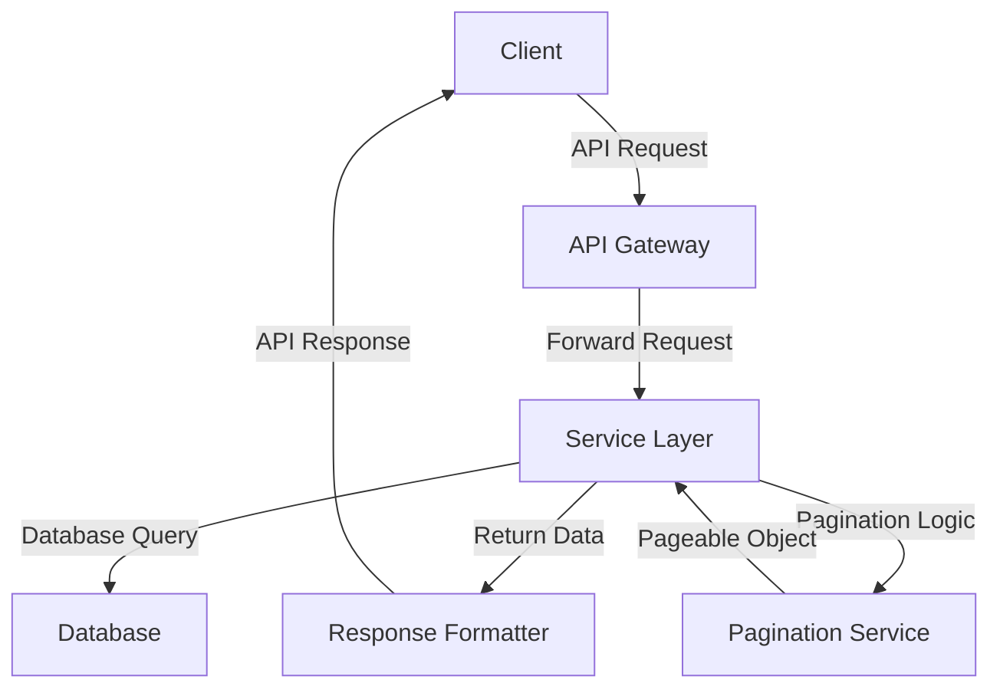

# API Pagination Standards — Spring Boot

## Overview and scope

The purpose of this document is to establish standardized practices for implementing API pagination in Spring Boot applications at Xentic. Effective pagination is crucial for optimizing data retrieval, enhancing performance, and improving the user experience when dealing with large datasets. This standard outlines the methodologies, configurations, and best practices that developers MUST adhere to when implementing pagination in APIs.

### Audience
This document is intended for:
- Software engineers and developers working on backend services at Xentic.
- Technical leads and architects responsible for API design and implementation.
- Quality assurance teams involved in testing and validating API functionalities.

### Scope
The standards defined herein apply to all RESTful APIs developed using Spring Boot within the Xentic ecosystem. The focus is on:
- Offset Pagination
- Cursor Pagination

These standards are applicable to all services, including but not limited to user management, event feeds, and other data-intensive applications.

### Non-goals
This document does NOT cover:
- Pagination strategies for non-RESTful APIs.
- Pagination for frontend applications or client-side libraries.
- Specific database optimizations unrelated to pagination.

### Glossary
| Term            | Definition                                                                 |
|-----------------|-----------------------------------------------------------------------------|
| Offset Pagination | A method that retrieves data based on a specified starting point and a limit on the number of records. |
| Cursor Pagination | A method that uses a pointer (cursor) to track the position in the dataset for fetching subsequent records. |
| Pageable        | An abstraction in Spring Data that encapsulates pagination information.      |
| Response Envelope | The structure of the API response that includes pagination metadata.        |

### How This Standard Fits the Xentic Platform
The API Pagination Standards are integral to maintaining consistency and efficiency across Xentic's services. By adhering to these guidelines, developers ensure that APIs are scalable, performant, and user-friendly. The standards align with Xentic's commitment to delivering high-quality software solutions that meet the needs of our clients and users.

### Pagination Strategies
Developers MUST implement the following pagination strategies as per the outlined standards:

#### Strategy 1 — Offset Pagination
```java
@GetMapping
public ResponseEntity<Page<UserResponse>> listUsers(
        @RequestParam(defaultValue = "0") int page,
        @RequestParam(defaultValue = "20") int size) {
    Pageable pageable = PageRequest.of(page, Math.min(size, 100));
    return ResponseEntity.ok(userService.findAll(pageable));
}
```

**Response Envelope:**
```json
{
  "content": [],
  "page": 0,
  "size": 20,
  "totalElements": 450,
  "totalPages": 23,
  "last": false
}
```

#### Strategy 2 — Cursor Pagination (for large datasets)
```java
@GetMapping("/feed")
public ResponseEntity<CursorPage<EventResponse>> getEventFeed(
        @RequestParam(required = false) String cursor,
        @RequestParam(defaultValue = "20") int limit) {
    return ResponseEntity.ok(eventService.getFeed(cursor, Math.min(limit, 50)));
}
```

**Response:**
```json
{
  "data": [],
  "nextCursor": "eyJpZCI6MTAwfQ==",
  "hasMore": true
}
```

### Rules
- Default page size: 20. Maximum: 100.
- Cursor MUST be base64-encoded and opaque to the client.
- Sort fields MUST be whitelisted; developers MUST NOT pass raw sort strings to JPA.
- Cursor pagination MUST be used when the dataset exceeds 100,000 rows.

## Standards and policies

1. **Developers MUST implement pagination in all API endpoints that return lists of data.** This ensures that large datasets are handled efficiently and do not overwhelm clients or servers.

2. **Developers MUST use Spring Data's `Pageable` interface for offset pagination.** This provides a consistent way to manage pagination parameters across different services.

   ```java
   Pageable pageable = PageRequest.of(page, size);
   ```

3. **Developers MUST NOT expose internal pagination parameters directly to clients.** Instead, use a well-defined response envelope that includes pagination metadata.

4. **Developers MUST set a default page size of 20 and a maximum page size of 100.** This prevents excessive data retrieval and ensures optimal performance.

   ```yaml
   pagination:
     defaultSize: 20
     maxSize: 100
   ```

5. **Developers SHOULD implement cursor pagination for datasets exceeding 100,000 rows.** This improves performance and user experience by reducing the amount of data processed at once.

6. **Developers MUST encode cursors in base64 format.** This ensures that cursors remain opaque to the client and are not tampered with.

   ```java
   String encodedCursor = Base64.getEncoder().encodeToString(cursor.getBytes());
   ```

7. **Developers MUST whitelist sort fields for pagination queries.** This prevents SQL injection attacks and ensures that only valid fields can be used for sorting.

   | Allowed Sort Fields |
   |---------------------|
   | id                  |
   | createdDate         |
   | lastModifiedDate    |

8. **Developers MUST NOT allow raw sort strings to be passed to JPA.** Always use predefined sort fields to maintain security and integrity.

9. **Developers SHOULD include pagination metadata in the response envelope.** This enhances the client’s ability to navigate through paginated results.

   **Response Envelope Example:**
   ```json
   {
     "content": [],
     "page": 0,
     "size": 20,
     "totalElements": 450,
     "totalPages": 23,
     "last": false
   }
   ```

10. **Developers MUST ensure that pagination queries are optimized for performance.** This includes using appropriate indexing strategies in the database to support efficient data retrieval.

11. **Developers SHOULD document any pagination-related API changes in the service's README.** This ensures that all team members are aware of the pagination standards being implemented.

12. **Developers MUST test pagination functionality thoroughly.** This includes verifying that the correct data is returned for various page sizes and that pagination metadata is accurate.

13. **Developers MUST implement error handling for invalid pagination parameters.** This includes returning appropriate HTTP status codes and error messages when clients provide invalid page numbers or sizes.

   **Error Response Example:**
   ```json
   {
     "status": "error",
     "message": "Page number must be greater than or equal to 0."
   }
   ```

14. **Developers SHOULD provide a mechanism for clients to request the total count of records.** This can be useful for clients to understand the size of the dataset they are working with.

15. **Developers MUST keep pagination logic consistent across all services.** This promotes a uniform experience for API consumers and simplifies maintenance.

By adhering to these standards and policies, Xentic ensures that its APIs are robust, efficient, and user-friendly, providing a seamless experience for both developers and end-users.

## Architecture and design

The architecture for implementing API pagination in Spring Boot at Xentic involves several key components that interact seamlessly to provide efficient data retrieval. Below is a component diagram represented in Mermaid syntax, illustrating the relationships between the various components.



### Data Flows

1. **Client Request**: The client initiates a request to the API Gateway for data retrieval, specifying pagination parameters (e.g., page number, page size).
2. **API Gateway**: The API Gateway forwards the request to the appropriate service layer based on the endpoint.
3. **Service Layer**: The service layer processes the request, utilizing the Pagination Service to create a `Pageable` object that encapsulates pagination details.
4. **Database Query**: The service layer queries the database using the `Pageable` object to retrieve the requested data.
5. **Response Formatter**: Once the data is retrieved, the Response Formatter prepares the response envelope, including pagination metadata.
6. **Client Response**: The formatted response is sent back to the client, providing both the data and pagination information.

### Integration Points

- **API Gateway**: Acts as the entry point for all client requests, handling routing and load balancing.
- **Service Layer**: Contains business logic and interacts with the database through repositories.
- **Pagination Service**: Centralized service for managing pagination logic to ensure consistency across multiple services.
- **Database**: The data source where records are stored and queried.

### Failure Domains

- **Client-Side Failures**: Issues such as network errors or invalid requests can lead to failed API calls.
- **API Gateway Failures**: If the API Gateway is down, all client requests will fail. Implementing circuit breakers and retries is essential.
- **Service Layer Failures**: Business logic errors or exceptions during data processing can result in incorrect responses or server errors.
- **Database Failures**: Database connectivity issues or query performance problems can affect data retrieval, leading to timeouts or incomplete data.

### Best Practices

- **Error Handling**: Implement robust error handling mechanisms to manage failures gracefully. Return appropriate HTTP status codes and error messages.
- **Logging**: Log all requests and responses, including pagination parameters, to facilitate debugging and monitoring.
- **Testing**: Conduct thorough testing of pagination logic, including edge cases for page numbers and sizes.
- **Performance Monitoring**: Utilize monitoring tools to track API performance and identify bottlenecks related to pagination.

By following this architecture and design framework, Xentic can ensure that its APIs provide efficient, reliable, and user-friendly pagination, enhancing the overall user experience.

## Configuration reference

### application.yml

The following configuration options MUST be included in the `application.yml` file to manage pagination settings effectively.

```yaml
pagination:
  defaultSize: 20  # Default page size for pagination
  maxSize: 100     # Maximum page size allowed
  cursorEncoding: base64  # Encoding method for cursors
```

### Terraform Configuration

When deploying services that require pagination settings, the following Terraform variables MUST be defined to ensure consistency across environments.

| Variable Name           | Description                              | Default Value | Production Value |
|-------------------------|------------------------------------------|---------------|------------------|
| `pagination_default_size` | Default size of the pagination          | 20            | 20               |
| `pagination_max_size`     | Maximum allowed size for pagination     | 100           | 100              |
| `pagination_cursor_encoding` | Encoding method for cursors          | base64        | base64           |

Example Terraform configuration:

```hcl
variable "pagination_default_size" {
  description = "Default size of the pagination"
  type        = number
  default     = 20
}

variable "pagination_max_size" {
  description = "Maximum allowed size for pagination"
  type        = number
  default     = 100
}

variable "pagination_cursor_encoding" {
  description = "Encoding method for cursors"
  type        = string
  default     = "base64"
}
```

### Environment Variables

Developers MUST set the following environment variables in their deployment environments to configure pagination settings.

| Environment Variable                | Description                              | Default Value | Production Value |
|-------------------------------------|------------------------------------------|---------------|------------------|
| `PAGINATION_DEFAULT_SIZE`           | Default page size for pagination         | 20            | 20               |
| `PAGINATION_MAX_SIZE`               | Maximum page size allowed                | 100           | 100              |
| `PAGINATION_CURSOR_ENCODING`        | Encoding method for cursors              | base64        | base64           |

Example of setting environment variables in a Unix-like system:

```bash
export PAGINATION_DEFAULT_SIZE=20
export PAGINATION_MAX_SIZE=100
export PAGINATION_CURSOR_ENCODING=base64
```

### Summary

- Developers MUST include pagination settings in `application.yml`, Terraform configurations, and environment variables to ensure consistent behavior across all services.
- Default values should be set to 20 for `defaultSize` and 100 for `maxSize` to maintain optimal performance.
- The cursor encoding MUST be specified as `base64` to ensure that cursors remain opaque to clients.

## Implementation guide

To implement API pagination in a Spring Boot application at Xentic, developers MUST follow the steps outlined below. This guide includes full code examples for creating a paginated API endpoint, configuring pagination settings, and handling pagination metadata.

### Step 1: Define the Entity

Create an entity class that represents the data model. For example, if you are working with a `Product` entity, it might look like this:

```java
package com.xentic.product.model;

import javax.persistence.Entity;
import javax.persistence.GeneratedValue;
import javax.persistence.GenerationType;
import javax.persistence.Id;

@Entity
public class Product {
    @Id
    @GeneratedValue(strategy = GenerationType.IDENTITY)
    private Long id;
    private String name;
    private String description;

    // Getters and Setters
}
```

### Step 2: Create the Repository

Define a repository interface that extends `JpaRepository`. This interface will provide methods for paginated queries.

```java
package com.xentic.product.repository;

import com.xentic.product.model.Product;
import org.springframework.data.jpa.repository.JpaRepository;
import org.springframework.stereotype.Repository;

@Repository
public interface ProductRepository extends JpaRepository<Product, Long> {
}
```

### Step 3: Implement the Service Layer

Create a service class that handles business logic and pagination. The service will use the repository to fetch paginated data.

```java
package com.xentic.product.service;

import com.xentic.product.model.Product;
import com.xentic.product.repository.ProductRepository;
import org.springframework.beans.factory.annotation.Autowired;
import org.springframework.data.domain.Page;
import org.springframework.data.domain.PageRequest;
import org.springframework.data.domain.Pageable;
import org.springframework.stereotype.Service;

@Service
public class ProductService {

    @Autowired
    private ProductRepository productRepository;

    public Page<Product> getProducts(int page, int size) {
        Pageable pageable = PageRequest.of(page, size);
        return productRepository.findAll(pageable);
    }
}
```

### Step 4: Create the Controller

Define a REST controller that exposes the API endpoint for retrieving products with pagination.

```java
package com.xentic.product.controller;

import com.xentic.product.model.Product;
import com.xentic.product.service.ProductService;
import org.springframework.beans.factory.annotation.Autowired;
import org.springframework.data.domain.Page;
import org.springframework.http.ResponseEntity;
import org.springframework.web.bind.annotation.GetMapping;
import org.springframework.web.bind.annotation.RequestParam;
import org.springframework.web.bind.annotation.RestController;

@RestController
public class ProductController {

    @Autowired
    private ProductService productService;

    @GetMapping("/api/products")
    public ResponseEntity<Page<Product>> getProducts(
            @RequestParam(defaultValue = "0") int page,
            @RequestParam(defaultValue = "20") int size) {
        Page<Product> products = productService.getProducts(page, size);
        return ResponseEntity.ok(products);
    }
}
```

### Step 5: Handle Pagination Metadata

To include pagination metadata in the response, create a custom response class:

```java
package com.xentic.product.dto;

import org.springframework.data.domain.Page;

import java.util.List;

public class PaginatedResponse<T> {
    private List<T> content;
    private int page;
    private int size;
    private long totalElements;
    private int totalPages;
    private boolean last;

    public PaginatedResponse(Page<T> page) {
        this.content = page.getContent();
        this.page = page.getNumber();
        this.size = page.getSize();
        this.totalElements = page.getTotalElements();
        this.totalPages = page.getTotalPages();
        this.last = page.isLast();
    }

    // Getters and Setters
}
```

Update the controller to return the custom response:

```java
@GetMapping("/api/products")
public ResponseEntity<PaginatedResponse<Product>> getProducts(
        @RequestParam(defaultValue = "0") int page,
        @RequestParam(defaultValue = "20") int size) {
    Page<Product> products = productService.getProducts(page, size);
    PaginatedResponse<Product> response = new PaginatedResponse<>(products);
    return ResponseEntity.ok(response);
}
```

### Step 6: Error Handling for Invalid Parameters

Implement error handling for invalid pagination parameters in the controller:

```java
@GetMapping("/api/products")
public ResponseEntity<PaginatedResponse<Product>> getProducts(
        @RequestParam(defaultValue = "0") int page,
        @RequestParam(defaultValue = "20") int size) {
    if (page < 0) {
        return ResponseEntity.badRequest().body(new ErrorResponse("Page number must be greater than or equal to 0."));
    }
    if (size <= 0 || size > 100) {
        return ResponseEntity.badRequest().body(new ErrorResponse("Page size must be between 1 and 100."));
    }
    Page<Product> products = productService.getProducts(page, size);
    PaginatedResponse<Product> response = new PaginatedResponse<>(products);
    return ResponseEntity.ok(response);
}
```

### Summary

By following these steps, developers at Xentic MUST ensure that their APIs support pagination effectively. This includes defining entities, repositories, services, and controllers, as well as handling pagination metadata and errors appropriately. Consistency across services in implementing pagination is essential for a seamless developer experience.

## Security requirements

To ensure the security of API pagination in Spring Boot applications at Xentic, the following security requirements MUST be adhered to:

### Threat Model Summary

1. **Data Exposure**: Sensitive data may be exposed through paginated results if proper access controls are not enforced.
2. **Denial of Service (DoS)**: Attackers may attempt to overload the API by requesting large pages or excessive page numbers.
3. **Injection Attacks**: Input parameters may be susceptible to SQL injection or other injection attacks if not properly validated.
4. **Unauthorized Access**: APIs must ensure that only authenticated and authorized users can access paginated resources.

### Authentication and Authorization

- All API endpoints MUST be secured using OAuth 2.0 or JWT for authentication.
- Role-based access control (RBAC) MUST be implemented to restrict access to specific resources based on user roles.

Example of Spring Security configuration for securing endpoints:

```java
import org.springframework.context.annotation.Configuration;
import org.springframework.security.config.annotation.web.builders.HttpSecurity;
import org.springframework.security.config.annotation.web.configuration.EnableWebSecurity;
import org.springframework.security.config.annotation.web.configuration.WebSecurityConfigurerAdapter;

@Configuration
@EnableWebSecurity
public class SecurityConfig extends WebSecurityConfigurerAdapter {
    @Override
    protected void configure(HttpSecurity http) throws Exception {
        http
            .authorizeRequests()
                .antMatchers("/api/products").authenticated()
                .and()
            .oauth2ResourceServer()
                .jwt();
    }
}
```

### Secrets Management

- Secrets, such as database credentials and API keys, MUST be stored securely using a secrets management tool like HashiCorp Vault or AWS Secrets Manager.
- Secrets MUST NOT be hard-coded in the application code or configuration files.

Example of a secure way to access secrets in Spring Boot using Vault:

```yaml
spring:
  cloud:
    vault:
      uri: https://vault.internal.xentic.io
      token: ${VAULT_TOKEN}
      kv:
        enabled: true
```

### Input Validation

- All incoming parameters MUST be validated to prevent injection attacks and ensure they conform to expected formats.
- Pagination parameters (e.g., `page` and `size`) MUST be validated to ensure they are within acceptable limits.

Example of input validation in the controller:

```java
@GetMapping("/api/products")
public ResponseEntity<PaginatedResponse<Product>> getProducts(
        @RequestParam(defaultValue = "0") int page,
        @RequestParam(defaultValue = "20") int size) {
    if (page < 0) {
        throw new IllegalArgumentException("Page number must be greater than or equal to 0.");
    }
    if (size <= 0 || size > 100) {
        throw new IllegalArgumentException("Page size must be between 1 and 100.");
    }
    // Fetch products...
}
```

### Audit Logging

- All access to paginated API endpoints MUST be logged for auditing purposes.
- Logs MUST include details such as the user ID, timestamp, request parameters, and response status.

Example of logging in the controller:

```java
import org.slf4j.Logger;
import org.slf4j.LoggerFactory;

@RestController
public class ProductController {

    private static final Logger logger = LoggerFactory.getLogger(ProductController.class);

    @GetMapping("/api/products")
    public ResponseEntity<PaginatedResponse<Product>> getProducts(
            @RequestParam(defaultValue = "0") int page,
            @RequestParam(defaultValue = "20") int size) {
        logger.info("User requested products - Page: {}, Size: {}", page, size);
        // Fetch products...
    }
}
```

### Summary

- Developers MUST implement strong authentication and authorization mechanisms for API endpoints.
- Secrets MUST be managed securely and MUST NOT be hard-coded.
- Input parameters MUST be validated to mitigate injection risks.
- Audit logging MUST be enabled for all access to paginated resources to ensure accountability and traceability.

## Testing strategy

To ensure the reliability and correctness of the pagination implementation in Spring Boot applications at Xentic, a comprehensive testing strategy MUST be adopted. This strategy includes unit tests, integration tests, and contract tests, with specific coverage targets outlined below.

### Testing Types

1. **Unit Tests**: 
   - Focus on testing individual components (e.g., services, controllers) in isolation.
   - Mock dependencies using frameworks like Mockito.

2. **Integration Tests**: 
   - Verify the interaction between components and the database.
   - Use an in-memory database (e.g., H2) for testing.

3. **Contract Tests**: 
   - Ensure that the API adheres to predefined contracts (e.g., using Pact or Spring Cloud Contract).
   - Validate that the API responses conform to expected formats.

### Coverage Targets

- **Unit Test Coverage**: 
  - A minimum of 80% coverage for all service classes.
  
- **Integration Test Coverage**: 
  - At least 70% coverage for controller endpoints.
  
- **Contract Test Coverage**: 
  - All public API endpoints MUST have corresponding contract tests.

### Example Test Classes

#### Unit Test for ProductService

```java
package com.xentic.product.service;

import com.xentic.product.model.Product;
import com.xentic.product.repository.ProductRepository;
import org.junit.jupiter.api.Test;
import org.mockito.InjectMocks;
import org.mockito.Mock;
import org.mockito.MockitoAnnotations;
import org.springframework.data.domain.Page;
import org.springframework.data.domain.PageImpl;
import org.springframework.data.domain.PageRequest;

import java.util.Collections;

import static org.junit.jupiter.api.Assertions.assertEquals;
import static org.mockito.Mockito.when;

public class ProductServiceTest {

    @Mock
    private ProductRepository productRepository;

    @InjectMocks
    private ProductService productService;

    public ProductServiceTest() {
        MockitoAnnotations.openMocks(this);
    }

    @Test
    public void testGetProducts() {
        Page<Product> mockPage = new PageImpl<>(Collections.singletonList(new Product()));
        when(productRepository.findAll(PageRequest.of(0, 20))).thenReturn(mockPage);

        Page<Product> products = productService.getProducts(0, 20);
        
        assertEquals(1, products.getTotalElements());
        assertEquals(1, products.getContent().size());
    }
}
```

#### Integration Test for ProductController

```java
package com.xentic.product.controller;

import com.xentic.product.model.Product;
import com.xentic.product.service.ProductService;
import org.junit.jupiter.api.Test;
import org.mockito.InjectMocks;
import org.mockito.Mock;
import org.springframework.beans.factory.annotation.Autowired;
import org.springframework.boot.test.autoconfigure.web.servlet.AutoConfigureMockMvc;
import org.springframework.boot.test.context.SpringBootTest;
import org.springframework.data.domain.Page;
import org.springframework.data.domain.PageImpl;
import org.springframework.data.domain.PageRequest;
import org.springframework.http.MediaType;
import org.springframework.test.web.servlet.MockMvc;

import java.util.Collections;

import static org.mockito.Mockito.when;
import static org.springframework.test.web.servlet.request.MockMvcRequestBuilders.get;
import static org.springframework.test.web.servlet.result.MockMvcResultMatchers.status;
import static org.springframework.test.web.servlet.result.MockMvcResultMatchers.jsonPath;

@SpringBootTest
@AutoConfigureMockMvc
public class ProductControllerTest {

    @Autowired
    private MockMvc mockMvc;

    @Mock
    private ProductService productService;

    @InjectMocks
    private ProductController productController;

    @Test
    public void testGetProducts() throws Exception {
        Page<Product> mockPage = new PageImpl<>(Collections.singletonList(new Product()));
        when(productService.getProducts(0, 20)).thenReturn(mockPage);

        mockMvc.perform(get("/api/products?page=0&size=20")
                .contentType(MediaType.APPLICATION_JSON))
                .andExpect(status().isOk())
                .andExpect(jsonPath("$.content.length()").value(1));
    }
}
```

#### Contract Test Example

Using Spring Cloud Contract, define a contract for the `getProducts` endpoint:

```groovy
// src/test/resources/contracts/get-products.groovy
package contracts

import org.springframework.cloud.contract.spec.Contract

Contract.make {
    request {
        method 'GET'
        url '/api/products?page=0&size=20'
    }
    response {
        status 200
        body([
            content: [
                [id: 1, name: 'Product 1'],
                [id: 2, name: 'Product 2']
            ],
            page: 0,
            size: 20,
            totalElements: 2,
            totalPages: 1,
            last: true
        ])
        headers {
            contentType('application/json')
        }
    }
}
```

### Summary

- Developers MUST implement unit, integration, and contract tests for pagination.
- Coverage targets MUST be met to ensure reliability.
- Example test classes provided MUST serve as templates for writing comprehensive tests.

## Observability and operations

To ensure the effective monitoring and operation of paginated API endpoints, the following observability standards MUST be adhered to:

### Metrics

- The application MUST expose metrics related to pagination, including:
  - Total requests to paginated endpoints
  - Average response times
  - Error rates (4xx and 5xx status codes)
  
Example of exposing metrics using Micrometer:

```java
import io.micrometer.core.annotation.Timed;
import org.springframework.web.bind.annotation.GetMapping;
import org.springframework.web.bind.annotation.RequestParam;
import org.springframework.web.bind.annotation.RestController;

@RestController
public class ProductController {

    @Timed(value = "products.get.time", description = "Time taken to get products")
    @GetMapping("/api/products")
    public ResponseEntity<PaginatedResponse<Product>> getProducts(
            @RequestParam(defaultValue = "0") int page,
            @RequestParam(defaultValue = "20") int size) {
        // Fetch products...
    }
}
```

### Logs

- All API requests and responses MUST be logged, including:
  - User ID
  - Timestamp
  - Request parameters
  - Response status
  - Response time

Example of structured logging using SLF4J:

```java
import org.slf4j.Logger;
import org.slf4j.LoggerFactory;

@RestController
public class ProductController {

    private static final Logger logger = LoggerFactory.getLogger(ProductController.class);

    @GetMapping("/api/products")
    public ResponseEntity<PaginatedResponse<Product>> getProducts(
            @RequestParam(defaultValue = "0") int page,
            @RequestParam(defaultValue = "20") int size) {
        long startTime = System.currentTimeMillis();
        ResponseEntity<PaginatedResponse<Product>> response = // Fetch products...
        long duration = System.currentTimeMillis() - startTime;

        logger.info("User: {}, Requested products - Page: {}, Size: {}, Status: {}, Duration: {} ms", 
                    getCurrentUserId(), page, size, response.getStatusCode(), duration);
        return response;
    }
}
```

### Traces

- Distributed tracing MUST be implemented to track requests across services.
- Use tools like OpenTelemetry or Zipkin to capture and visualize traces.

Example configuration for Spring Boot with OpenTelemetry:

```yaml
otel:
  trace:
    exporter:
      otlp:
        endpoint: "http://otel-collector.internal.xentic.io:4317"
```

### Dashboards

- Dashboards MUST be created to visualize key metrics and logs.
- Use tools like Grafana or Kibana to create dashboards displaying:
  - Request counts
  - Error rates
  - Average response times
  - Latency distributions

Example Grafana dashboard panel configuration for API response times:

```json
{
  "title": "API Response Times",
  "type": "graph",
  "targets": [
    {
      "target": "avg:products.get.time",
      "refId": "A"
    }
  ],
  "xaxis": {
    "mode": "time"
  },
  "yaxis": {
    "format": "ms"
  }
}
```

### Alerts

- Alerts MUST be configured for critical metrics, including:
  - High error rates (e.g., > 5% of requests failing)
  - Response times exceeding acceptable thresholds (e.g., > 500 ms)
- Use monitoring tools like Prometheus Alertmanager or Grafana Alerts to set up alerts.

Example alert rule for Prometheus:

```yaml
groups:
  - name: api-alerts
    rules:
      - alert: HighErrorRate
        expr: sum(rate(http_requests_total{status=~"5.."}[5m])) / sum(rate(http_requests_total[5m])) > 0.05
        for: 5m
        labels:
          severity: critical
        annotations:
          summary: "High error rate detected"
          description: "More than 5% of requests are failing."
```

### SLOs

- Service Level Objectives (SLOs) MUST be defined for paginated API endpoints, including:
  - Availability: 99.9% uptime
  - Performance: 95% of requests should respond within 200 ms
  - Error Rate: Less than 1% of requests should result in errors

### On-Call Runbook Steps

In the event of an incident related to the paginated API, the following steps MUST be followed:

1. **Identify the Incident**:
   - Check monitoring dashboards for alerts.
   - Review logs for error patterns.

2. **Assess Impact**:
   - Determine the scope of the issue (e.g., affected endpoints, user impact).

3. **Mitigation**:
   - If the issue is due to high load, consider scaling the service.
   - Investigate slow queries or performance bottlenecks in the database.

4. **Communication**:
   - Notify stakeholders and affected users about the incident.
   - Provide updates as more information becomes available.

5. **Resolution**:
   - Implement a fix for the identified issue.
   - Monitor the system to ensure stability post-fix.

6. **Postmortem**:
   - Conduct a post-incident review to analyze the root cause.
   - Document findings and update the runbook as necessary.

### Summary

- Developers MUST implement comprehensive observability practices including metrics, logs, traces, dashboards, alerts, and SLOs.
- On-call runbook steps MUST be followed during incidents to ensure a structured response.
- Metrics and logs MUST be actionable to facilitate quick resolution of issues.

## Migration and versioning

To maintain a robust and reliable API, Xentic adopts strict standards for migration and versioning of its APIs. This section outlines the policies and practices that MUST be followed to ensure smooth transitions between API versions while maintaining backward compatibility.

### Upgrade Paths

- All API changes MUST be versioned using a semantic versioning scheme (e.g., v1, v2).
- Major changes (breaking changes) MUST increment the major version.
- Minor changes (non-breaking changes) MUST increment the minor version.
- Patch changes (bug fixes) MUST increment the patch version.

| Version Type | Change Type       | Example         |
|--------------|-------------------|------------------|
| Major        | Breaking changes   | v1 to v2         |
| Minor        | Non-breaking changes| v1.0 to v1.1     |
| Patch        | Bug fixes          | v1.0.0 to v1.0.1 |

### Deprecation Policy

- APIs MUST NOT be removed without prior deprecation notice.
- Deprecation notices MUST be communicated through:
  - API documentation updates
  - Release notes
  - In-API response headers (e.g., `Deprecation: true`)
  
Example of a deprecation header:

```java
@GetMapping("/api/products")
public ResponseEntity<PaginatedResponse<Product>> getProducts(
        @RequestParam(defaultValue = "0") int page,
        @RequestParam(defaultValue = "20") int size) {
    ResponseEntity<PaginatedResponse<Product>> response = // Fetch products...
    response.getHeaders().add("Deprecation", "This endpoint will be removed in v2.0");
    return response;
}
```

### Backward Compatibility

- New versions MUST maintain backward compatibility with the previous major version.
- When introducing breaking changes, a migration guide MUST be provided to assist developers in transitioning to the new version.
- Changes MUST be tested to ensure that existing clients can still operate without modification.

Example migration guide snippet:

```markdown
## Migration from v1 to v2

### Changes:
- The `getProducts` endpoint now requires an additional `sort` parameter.
- The response structure has been updated to include `totalPages`.

### Migration Steps:
1. Update your API calls to include the `sort` parameter:
   ```http
   GET /api/products?page=0&size=20&sort=name
   ```
2. Adjust your response handling to accommodate the new `totalPages` field.
```

### Rollback Procedures

In the event of a failed deployment or critical issues arising from a new version, the following rollback procedures MUST be in place:

1. **Automated Rollback**:
   - Use deployment tools that support rollback functionality (e.g., Kubernetes, AWS CodeDeploy).
   - Maintain previous versions in a stable state for quick rollback.

2. **Manual Rollback**:
   - If automated rollback is not possible, manually revert to the last stable version.
   - Ensure that the rollback does not affect ongoing transactions or data integrity.

Example Kubernetes rollback command:

```bash
kubectl rollout undo deployment/product-service
```

3. **Post-Rollback Verification**:
   - After rollback, verify that the previous version is functioning correctly.
   - Monitor logs and metrics to ensure stability.

### Summary

- Versioning MUST follow semantic versioning principles, and APIs MUST be backward compatible.
- Deprecation policies MUST be strictly adhered to, with proper communication to developers.
- Rollback procedures MUST be established to quickly revert to a stable version in case of issues.
- Migration guides MUST be provided for any breaking changes to assist developers in adapting to new versions.

## FAQ, anti-patterns, and checklists

### FAQ

1. **What is API pagination?**
   - API pagination is a method of dividing a large dataset into smaller, manageable chunks or pages, allowing clients to request only a subset of data at a time.

2. **Why is pagination important?**
   - Pagination improves performance and reduces load times by limiting the amount of data sent in a single response, enhancing user experience and reducing server load.

3. **What pagination strategies should we use?**
   - Xentic recommends using offset-based pagination or cursor-based pagination, depending on the use case and data structure.

4. **How should I handle empty responses?**
   - If there are no items to return, the API MUST return an empty list with a 200 OK status, along with pagination metadata (e.g., total count, current page).

5. **What should be included in the pagination metadata?**
   - The response MUST include:
     - `currentPage`: The current page number.
     - `totalPages`: The total number of pages available.
     - `totalItems`: The total number of items in the dataset.

6. **How can I implement pagination in Spring Boot?**
   - Utilize Spring Data's `Pageable` interface to handle pagination automatically. Ensure that your repository methods accept `Pageable` parameters.

7. **What happens if a client requests a page that does not exist?**
   - The API MUST return a 404 Not Found status if the requested page exceeds the total number of pages available.

8. **How should I document pagination in the API?**
   - API documentation MUST clearly outline pagination parameters, response formats, and examples of paginated responses.

9. **Can I use query parameters for pagination?**
   - Yes, pagination parameters (e.g., `page`, `size`) MUST be passed as query parameters in the API request.

10. **What is the maximum size I should allow for pagination?**
    - The maximum size MUST be capped to a reasonable limit (e.g., 100 items per page) to prevent performance degradation.

### Anti-Patterns

| Anti-Pattern                       | Description                                                                 |
|------------------------------------|-----------------------------------------------------------------------------|
| Returning all records in a single request | Sending the entire dataset in one response, leading to performance issues. |
| Using inconsistent pagination parameters | Different endpoints using varying parameter names (e.g., `page` vs `offset`). |
| Not including pagination metadata    | Failing to provide metadata in responses, making it hard for clients to navigate. |
| Hardcoding pagination limits         | Setting fixed limits in the code instead of allowing configurable options.   |
| Ignoring performance implications    | Not considering the impact of large datasets on response times and server load. |

### Pre-Merge Checklist

- [ ] Ensure pagination is implemented in all relevant API endpoints.
- [ ] Validate that pagination parameters are correctly handled and documented.
- [ ] Confirm that pagination metadata is included in responses.
- [ ] Run unit tests to verify pagination functionality.
- [ ] Review code for anti-patterns related to pagination.

### Production Checklist

- [ ] Monitor API performance metrics post-deployment for any regressions.
- [ ] Validate that pagination works as expected in production environments.
- [ ] Ensure that logs capture pagination requests and responses for auditing.
- [ ] Confirm that documentation is updated with any changes related to pagination.
- [ ] Review user feedback for any issues related to pagination functionality.
