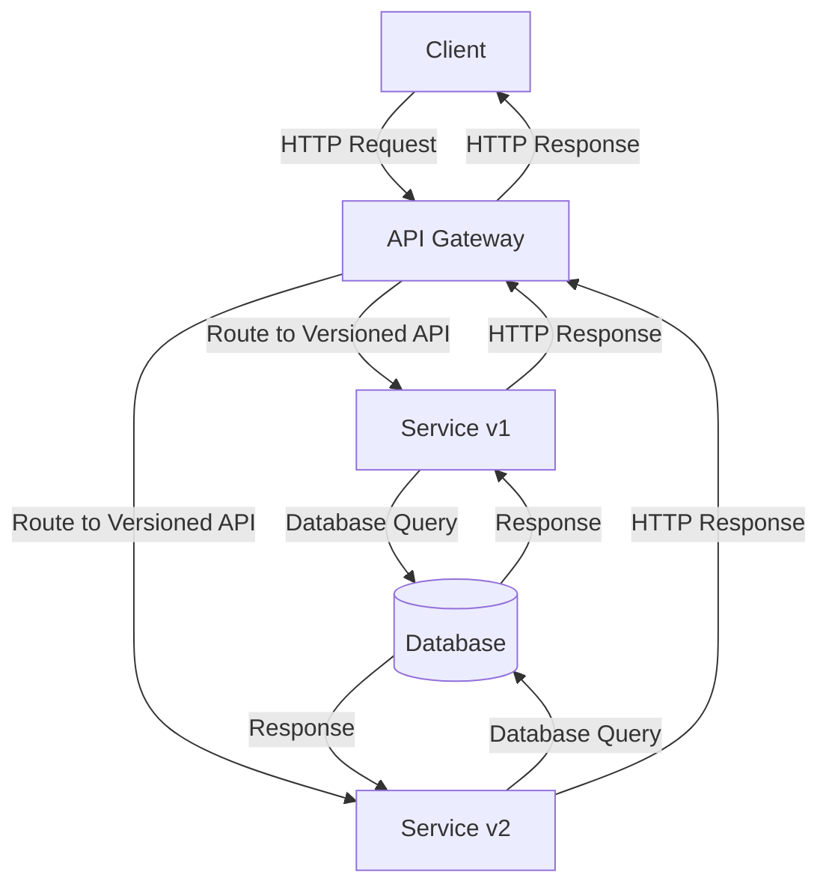

# API Versioning and Deprecation — Spring Boot

## Overview and scope

The purpose of this document is to establish a standard for API versioning and deprecation within Xentic's backend services using Spring Boot. This standard aims to ensure consistency, maintainability, and clarity across all APIs developed within the organization. 

### Audience

This document is intended for:
- Backend developers working with Spring Boot.
- API architects and design leads.
- Quality Assurance (QA) teams responsible for testing APIs.
- Technical writers documenting API specifications.

### Scope

This standard applies to all RESTful APIs developed within the Xentic ecosystem. It covers:
- Versioning strategies for APIs.
- Guidelines for deprecation of API endpoints.
- Best practices for documentation of versioned APIs.
- Tools and libraries to facilitate API versioning.

### Non-goals

This document does NOT aim to:
- Define the overall architecture of Xentic’s backend services.
- Provide an exhaustive guide on RESTful API design principles.
- Address frontend considerations or client-side API consumption.

### Glossary

| Term             | Definition                                                                 |
|------------------|-----------------------------------------------------------------------------|
| API              | Application Programming Interface, a set of rules for interacting with software components. |
| Versioning       | The process of assigning unique version numbers to different iterations of an API. |
| Deprecation      | The process of marking an API endpoint as obsolete, signaling that it will be removed in the future. |
| Spring Boot      | A Java-based framework used to create stand-alone, production-grade Spring-based applications. |

### How this standard fits the Xentic platform

This standard is crucial for maintaining the integrity and usability of Xentic's APIs as our services evolve. By adhering to these guidelines, we ensure that:
- Developers can introduce new features without breaking existing clients.
- Consumers of our APIs have clear expectations regarding the stability and lifecycle of endpoints.
- Documentation remains up-to-date and accurately reflects the current state of our APIs.

### Versioning Strategy

Xentic adopts the following versioning strategy for APIs:

- **URI Versioning**: The version number must be included in the URI. For example:
  ```
  GET /api/v1/users
  ```

- **Header Versioning**: Alternatively, clients can specify the version in the request header:
  ```http
  GET /api/users
  Accept: application/vnd.xentic.v1+json
  ```

### Deprecation Process

When deprecating an API endpoint, the following steps MUST be followed:

1. **Announce Deprecation**: Notify users via documentation and response headers.
   ```http
   Deprecated: true
   ```

2. **Provide Alternatives**: Offer guidance on using the new endpoint.
3. **Set a Sunset Date**: Clearly communicate when the deprecated endpoint will be removed.

By following these standards, Xentic can ensure a smooth transition for clients as our APIs evolve, maintaining a high level of service and reliability.

## Standards and policies

1. **Versioning MUST be implemented consistently across all APIs**: All APIs developed within Xentic MUST include a version identifier in their URIs or headers, following the established versioning strategy outlined in the Versioning Strategy section. For example:
   ```http
   GET /api/v1/orders
   ```

2. **Deprecation MUST be communicated clearly**: When an API endpoint is deprecated, it MUST include a deprecation notice in the response headers and documentation. Example of a response header:
   ```http
   Deprecated: true
   ```

3. **MUST NOT break existing clients**: Any changes to an API that could potentially break existing clients MUST be introduced in a new version rather than modifying the existing version.

4. **Documentation MUST be updated promptly**: All changes related to versioning and deprecation MUST be reflected in the API documentation on the internal documentation site (e.g., https://docs.internal.xentic.io).

5. **Deprecation notices MUST include alternatives**: When deprecating an API, the response MUST provide information about the new endpoint or version that clients should use instead.

6. **Sunset dates MUST be communicated**: When deprecating an API endpoint, a clear sunset date MUST be provided in the documentation and communicated to all stakeholders.

7. **Versioning MUST use semantic versioning**: All APIs MUST follow semantic versioning principles, where the version number is in the format of `MAJOR.MINOR.PATCH`. For example:
   - `1.0.0` - Initial release
   - `1.1.0` - Minor changes and new features
   - `2.0.0` - Breaking changes

8. **MUST NOT use ambiguous version identifiers**: Version identifiers MUST be clear and unambiguous. Avoid using terms like "latest" or "stable" in versioning.

9. **MUST use proper content negotiation**: When using header versioning, APIs MUST support content negotiation to ensure clients can specify the desired version using the `Accept` header:
   ```http
   Accept: application/vnd.xentic.v1+json
   ```

10. **Deprecation period MUST be at least 6 months**: Once an API is marked as deprecated, it MUST remain available for at least 6 months before being removed to allow clients sufficient time to transition.

11. **MUST NOT introduce breaking changes without notice**: Any breaking changes to an API MUST be announced well in advance and should only be introduced in a new version.

12. **Versioning MUST be reflected in the API's metadata**: The API's metadata, such as OpenAPI specifications, MUST include version information to facilitate client discovery and integration.

13. **MUST use consistent naming conventions**: All API endpoints MUST follow Xentic's naming conventions, which include using plural nouns for resource names and using hyphens to separate words (e.g., `/api/v1/user-profiles`).

14. **MUST include comprehensive test coverage for all versions**: All API versions MUST have adequate unit and integration tests to ensure functionality and reliability.

15. **MUST use appropriate logging for deprecated endpoints**: All requests to deprecated endpoints MUST be logged for monitoring and analysis to understand usage patterns and assist in client transition.

By adhering to these standards and policies, Xentic ensures that its APIs remain robust, user-friendly, and maintainable throughout their lifecycle.

## Architecture and design

### Component Diagram



### Data Flows

1. **Client Request**: Clients initiate requests to the API Gateway, specifying the desired API version either in the URI or headers.
2. **Routing**: The API Gateway routes the request to the appropriate service version based on the versioning strategy.
3. **Service Interaction**: The selected service interacts with the database to fetch or manipulate data.
4. **Response Handling**: The service sends the response back to the API Gateway, which then forwards it to the client.

### Integration Points

- **API Gateway**: Central point for routing requests to various service versions.
- **Service Layer**: Each service version handles its own logic and data access.
- **Database**: Common storage layer accessed by different service versions.

### Failure Domains

- **Client-Side Failures**: Issues such as network problems or incorrect API usage can lead to client errors.
- **API Gateway Failures**: If the API Gateway is down, no requests can be routed, leading to a complete service outage.
- **Service Failures**: Individual service versions can fail independently; however, the API Gateway should handle these gracefully by returning appropriate error messages.
- **Database Failures**: If the database becomes unavailable, all service versions relying on it will fail to respond correctly.

### Best Practices

- **Versioned Services**: Each service version should be independently deployable and maintainable.
- **Error Handling**: Implement consistent error handling across all versions to provide clients with clear feedback.
- **Monitoring and Logging**: Use centralized logging to monitor API usage and track deprecated endpoint access.

### Configuration Example

Here is an example of how to configure a Spring Boot application for versioning:

```yaml
spring:
  application:
    name: user-service
  profiles:
    active: v1
server:
  port: 8080
```

### SQL Example

To support versioned APIs, ensure that your database schema can accommodate changes without breaking existing functionality. For example:

```sql
CREATE TABLE users (
    id SERIAL PRIMARY KEY,
    username VARCHAR(255) NOT NULL,
    email VARCHAR(255) NOT NULL,
    created_at TIMESTAMP DEFAULT CURRENT_TIMESTAMP,
    updated_at TIMESTAMP DEFAULT CURRENT_TIMESTAMP ON UPDATE CURRENT_TIMESTAMP
);

-- For version 2, you may want to add a new column
ALTER TABLE users ADD COLUMN last_login TIMESTAMP;
```

### Code Example

Here is a simple controller demonstrating versioning in a Spring Boot application:

```java
package com.xentic.user.controller;

import org.springframework.web.bind.annotation.*;

@RestController
@RequestMapping("/api/v1/users")
public class UserControllerV1 {

    @GetMapping("/{id}")
    public User getUser(@PathVariable Long id) {
        // Fetch user logic for version 1
    }
}

@RestController
@RequestMapping("/api/v2/users")
public class UserControllerV2 {

    @GetMapping("/{id}")
    public User getUser(@PathVariable Long id) {
        // Fetch user logic for version 2 with additional features
    }
}
```

By adhering to these architectural guidelines, Xentic ensures that its API versioning and deprecation processes are robust, maintainable, and user-friendly.

## Configuration reference

### Spring Boot `application.yml`

The following configuration settings are recommended for managing API versioning in a Spring Boot application. 

```yaml
spring:
  application:
    name: user-service
  profiles:
    active: v1
  mvc:
    content-negotiation:
      favor-path-extension: false
      favor-parameter: true
      ignore-accept-header: false
      default-content-type: application/json
      media-types:
        json: application/vnd.xentic.v1+json
server:
  port: 8080
api:
  version: v1
  deprecation:
    notice: "This API version will be deprecated on 2024-12-31. Please use v2."
```

### Terraform Configuration

When deploying services, ensure that API versioning is reflected in your infrastructure as code. Below is an example Terraform configuration for an API Gateway setup:

```hcl
resource "aws_api_gateway_rest_api" "user_service" {
  name        = "user-service"
  description = "API for managing users"
}

resource "aws_api_gateway_resource" "v1_users" {
  rest_api_id = aws_api_gateway_rest_api.user_service.id
  parent_id   = aws_api_gateway_rest_api.user_service.root_resource_id
  path_part   = "v1/users"
}

resource "aws_api_gateway_method" "get_user_v1" {
  rest_api_id   = aws_api_gateway_rest_api.user_service.id
  resource_id   = aws_api_gateway_resource.v1_users.id
  http_method   = "GET"
  authorization = "NONE"
}

resource "aws_api_gateway_resource" "v2_users" {
  rest_api_id = aws_api_gateway_rest_api.user_service.id
  parent_id   = aws_api_gateway_rest_api.user_service.root_resource_id
  path_part   = "v2/users"
}

resource "aws_api_gateway_method" "get_user_v2" {
  rest_api_id   = aws_api_gateway_rest_api.user_service.id
  resource_id   = aws_api_gateway_resource.v2_users.id
  http_method   = "GET"
  authorization = "NONE"
}
```

### Environment Variables

The following environment variables can be used to configure API versioning at runtime. Default values are provided along with recommended production values.

| Variable Name          | Default Value | Production Value   |
|------------------------|---------------|---------------------|
| `API_VERSION`          | `v1`          | `v2`                |
| `SERVER_PORT`          | `8080`        | `80`                |
| `DEPRECATION_NOTICE`   | `""`          | `"This version will be deprecated on 2024-12-31."` |

### Summary of Configuration Options

- **Spring Boot Configuration**: Use `application.yml` to set up API versioning and deprecation notices.
- **Terraform**: Define API Gateway resources and methods for each API version.
- **Environment Variables**: Leverage environment variables to manage configurations dynamically across different environments.

By following these configuration guidelines, Xentic ensures that API versioning is effectively managed and maintained across all services.

## Implementation guide

To implement API versioning and deprecation in a Spring Boot application, follow these step-by-step instructions:

### Step 1: Set Up Spring Boot Project

Create a new Spring Boot project using Spring Initializr or your preferred method. Include the following dependencies:
- Spring Web
- Spring Boot DevTools (for development)

### Step 2: Configure Application Properties

In your `application.yml`, define the API versioning and deprecation settings:

```yaml
spring:
  application:
    name: user-service
  profiles:
    active: v1
server:
  port: 8080
api:
  version: v1
  deprecation:
    notice: "This API version will be deprecated on 2024-12-31. Please use v2."
```

### Step 3: Create User Entity

Define a simple User entity that will be used across different API versions:

```java
package com.xentic.user.entity;

import javax.persistence.*;

@Entity
@Table(name = "users")
public class User {
    @Id
    @GeneratedValue(strategy = GenerationType.IDENTITY)
    private Long id;
    private String username;
    private String email;

    // Getters and Setters
}
```

### Step 4: Create Repository Layer

Create a repository interface for data access:

```java
package com.xentic.user.repository;

import com.xentic.user.entity.User;
import org.springframework.data.jpa.repository.JpaRepository;

public interface UserRepository extends JpaRepository<User, Long> {
}
```

### Step 5: Implement Versioned Controllers

Create controllers for each API version. The first version (`v1`) will have basic user retrieval, while the second version (`v2`) will include additional features.

#### UserControllerV1

```java
package com.xentic.user.controller;

import com.xentic.user.entity.User;
import com.xentic.user.repository.UserRepository;
import org.springframework.beans.factory.annotation.Autowired;
import org.springframework.web.bind.annotation.*;

import java.util.Optional;

@RestController
@RequestMapping("/api/v1/users")
public class UserControllerV1 {

    @Autowired
    private UserRepository userRepository;

    @GetMapping("/{id}")
    public User getUser(@PathVariable Long id) {
        return userRepository.findById(id).orElse(null);
    }

    @GetMapping
    public List<User> getAllUsers() {
        return userRepository.findAll();
    }
}
```

#### UserControllerV2

```java
package com.xentic.user.controller;

import com.xentic.user.entity.User;
import com.xentic.user.repository.UserRepository;
import org.springframework.beans.factory.annotation.Autowired;
import org.springframework.web.bind.annotation.*;

import java.util.Optional;

@RestController
@RequestMapping("/api/v2/users")
public class UserControllerV2 {

    @Autowired
    private UserRepository userRepository;

    @GetMapping("/{id}")
    public User getUser(@PathVariable Long id) {
        return userRepository.findById(id).orElse(null);
    }

    @GetMapping
    public List<User> getAllUsers() {
        return userRepository.findAll();
    }

    @PostMapping
    public User createUser(@RequestBody User user) {
        return userRepository.save(user);
    }
}
```

### Step 6: Handle Deprecation Notices

To log deprecated endpoint usage, implement an aspect or interceptor that logs requests to deprecated endpoints:

```java
package com.xentic.user.aspect;

import org.aspectj.lang.annotation.Aspect;
import org.aspectj.lang.annotation.Before;
import org.springframework.stereotype.Component;

@Aspect
@Component
public class DeprecationLoggingAspect {

    @Before("execution(* com.xentic.user.controller.UserControllerV1.*(..))")
    public void logDeprecatedEndpoint() {
        System.out.println("Deprecated API v1 endpoint accessed.");
    }
}
```

### Step 7: Testing the API

Ensure that you have comprehensive tests for both versions of your API. Use Spring's testing framework to write unit and integration tests.

#### Example Test for UserControllerV1

```java
package com.xentic.user.controller;

import com.xentic.user.entity.User;
import com.xentic.user.repository.UserRepository;
import org.junit.jupiter.api.Test;
import org.mockito.InjectMocks;
import org.mockito.Mock;
import org.mockito.MockitoAnnotations;
import org.springframework.beans.factory.annotation.Autowired;
import org.springframework.boot.test.autoconfigure.web.servlet.WebMvcTest;
import org.springframework.http.MediaType;
import org.springframework.test.web.servlet.MockMvc;

import static org.mockito.Mockito.*;
import static org.springframework.test.web.servlet.request.MockMvcRequestBuilders.get;
import static org.springframework.test.web.servlet.result.MockMvcResultMatchers.status;

@WebMvcTest(UserControllerV1.class)
public class UserControllerV1Test {

    @Autowired
    private MockMvc mockMvc;

    @Mock
    private UserRepository userRepository;

    @InjectMocks
    private UserControllerV1 userController;

    @Test
    public void testGetUser() throws Exception {
        User user = new User();
        user.setId(1L);
        user.setUsername("testuser");
        user.setEmail("test@example.com");

        when(userRepository.findById(1L)).thenReturn(Optional.of(user));

        mockMvc.perform(get("/api/v1/users/1")
                .accept(MediaType.APPLICATION_JSON))
                .andExpect(status().isOk());
    }
}
```

### Summary

By following the steps outlined above, you will have a robust implementation of API versioning and deprecation in your Spring Boot application. The key components include:

- Versioned controllers for each API version.
- Logging mechanisms for deprecated endpoints.
- Comprehensive testing for all versions.

This approach ensures that Xentic's APIs remain maintainable and user-friendly throughout their lifecycle.

## Security requirements

To ensure the security of the API, the following requirements MUST be adhered to:

### Threat Model Summary

1. **Unauthorized Access**: Protect sensitive endpoints from unauthorized users.
2. **Data Exposure**: Ensure that user data is not exposed to unauthorized parties.
3. **Injection Attacks**: Prevent SQL injection and other forms of code injection.
4. **Denial of Service (DoS)**: Implement rate limiting to mitigate DoS attacks.

### Authentication and Authorization

- **Authentication**: All API endpoints MUST require authentication. Use OAuth2 or JWT tokens for securing access.
- **Authorization**: Role-based access control (RBAC) MUST be implemented to restrict access to sensitive operations based on user roles.

Example of JWT configuration in `application.yml`:

```yaml
security:
  oauth2:
    jwt:
      secret: "your_secret_key"
      expiration: 3600 # in seconds
```

### Secrets Management

- Secrets MUST NOT be hardcoded in the source code. Use environment variables or a secrets management tool (e.g., HashiCorp Vault).
- Ensure that sensitive information such as database credentials and API keys are stored securely.

Example of using environment variables for secrets:

```yaml
spring:
  datasource:
    url: ${DB_URL}
    username: ${DB_USERNAME}
    password: ${DB_PASSWORD}
```

### Input Validation

- All incoming requests MUST be validated against a defined schema to prevent injection attacks and ensure data integrity.
- Use annotations like `@Valid` and `@NotNull` in your DTOs (Data Transfer Objects) to enforce validation rules.

Example DTO with validation:

```java
package com.xentic.user.dto;

import javax.validation.constraints.Email;
import javax.validation.constraints.NotBlank;

public class UserDTO {
    @NotBlank
    private String username;

    @Email
    @NotBlank
    private String email;

    // Getters and Setters
}
```

### Audit Logging

- An audit log MUST be maintained for all critical operations, including user creation, updates, and deletions.
- Logs MUST include timestamps, user identifiers, and the nature of the operation performed.

Example of logging in a service:

```java
import org.slf4j.Logger;
import org.slf4j.LoggerFactory;

@Service
public class UserService {

    private static final Logger logger = LoggerFactory.getLogger(UserService.class);

    public User createUser(UserDTO userDTO) {
        // Create user logic
        logger.info("User created: {}", userDTO.getUsername());
        return user;
    }
}
```

### Summary of Security Practices

- **Authentication**: Use OAuth2 or JWT for secure access.
- **Authorization**: Implement RBAC for sensitive operations.
- **Secrets Management**: Store secrets securely using environment variables or a dedicated tool.
- **Input Validation**: Validate all incoming data to prevent attacks.
- **Audit Logging**: Maintain logs for critical operations to ensure accountability.

By following these security requirements, Xentic can ensure that its APIs are robust and secure against common threats.

## Testing strategy

To ensure the reliability and stability of the API, a comprehensive testing strategy MUST be implemented. This includes unit tests, integration tests, and contract tests. Each type of test serves a specific purpose and collectively contributes to the overall quality of the software.

### 1. Unit Tests

Unit tests MUST cover individual components in isolation. Each unit test should focus on a single method or functionality. The target coverage for unit tests SHOULD be at least 80%. 

#### Example Unit Test for User Entity

```java
package com.xentic.user.entity;

import org.junit.jupiter.api.Test;
import static org.junit.jupiter.api.Assertions.*;

public class UserTest {

    @Test
    public void testUserGettersAndSetters() {
        User user = new User();
        user.setId(1L);
        user.setUsername("testuser");
        user.setEmail("test@example.com");

        assertEquals(1L, user.getId());
        assertEquals("testuser", user.getUsername());
        assertEquals("test@example.com", user.getEmail());
    }
}
```

### 2. Integration Tests

Integration tests MUST verify the interaction between different components, such as controllers, services, and repositories. The target coverage for integration tests SHOULD also be at least 80%. 

#### Example Integration Test for UserControllerV1

```java
package com.xentic.user.controller;

import com.xentic.user.entity.User;
import com.xentic.user.repository.UserRepository;
import org.junit.jupiter.api.BeforeEach;
import org.junit.jupiter.api.Test;
import org.springframework.beans.factory.annotation.Autowired;
import org.springframework.boot.test.autoconfigure.web.servlet.AutoConfigureMockMvc;
import org.springframework.boot.test.context.SpringBootTest;
import org.springframework.http.MediaType;
import org.springframework.test.web.servlet.MockMvc;

import static org.springframework.test.web.servlet.request.MockMvcRequestBuilders.get;
import static org.springframework.test.web.servlet.result.MockMvcResultMatchers.status;

@SpringBootTest
@AutoConfigureMockMvc
public class UserControllerIntegrationTest {

    @Autowired
    private MockMvc mockMvc;

    @Autowired
    private UserRepository userRepository;

    @BeforeEach
    public void setUp() {
        userRepository.deleteAll();
        User user = new User();
        user.setUsername("testuser");
        user.setEmail("test@example.com");
        userRepository.save(user);
    }

    @Test
    public void testGetUser() throws Exception {
        mockMvc.perform(get("/api/v1/users/1")
                .accept(MediaType.APPLICATION_JSON))
                .andExpect(status().isOk());
    }
}
```

### 3. Contract Tests

Contract tests MUST ensure that the API adheres to the agreed-upon contracts between services. This is especially important when multiple teams are involved in developing microservices. Contract tests SHOULD be executed as part of the CI/CD pipeline.

#### Example Contract Test Using Pact

```java
package com.xentic.user.contract;

import au.com.dius.pact.consumer.junit5.PactConsumerTestExt;
import au.com.dius.pact.consumer.junit5.Pact;
import au.com.dius.pact.consumer.dsl.PactDslWithProvider;
import org.junit.jupiter.api.Test;
import org.junit.jupiter.api.extension.ExtendWith;

import static org.junit.jupiter.api.Assertions.assertEquals;

@ExtendWith(PactConsumerTestExt.class)
public class UserContractTest {

    @Pact(consumer = "UserServiceConsumer", provider = "UserServiceProvider")
    public RequestResponsePact createPact(PactDslWithProvider builder) {
        return builder
                .given("User exists")
                .uponReceiving("A request for user 1")
                .path("/api/v1/users/1")
                .method("GET")
                .willRespondWith()
                .status(200)
                .body("{\"id\": 1, \"username\": \"testuser\", \"email\": \"test@example.com\"}")
                .toPact();
    }

    @Test
    @PactTestFor(providerName = "UserServiceProvider")
    public void testGetUser() {
        // Call the mock server and validate the response
        // Use a HTTP client to call the mocked endpoint and assert the response
        // Example: assertEquals(expectedResponse, actualResponse);
    }
}
```

### Coverage Targets

| Test Type       | Coverage Target |
|------------------|-----------------|
| Unit Tests       | 80%             |
| Integration Tests| 80%             |
| Contract Tests   | 100%            |

### Summary

The testing strategy MUST include:

- **Unit Tests**: Cover individual components with at least 80% coverage.
- **Integration Tests**: Verify the interaction of components with at least 80% coverage.
- **Contract Tests**: Ensure compliance with API contracts, targeting 100% coverage.

By adhering to this testing strategy, Xentic can maintain high-quality standards for its APIs, ensuring they are robust and reliable for end-users.

## Observability and operations

To ensure effective observability and operations of the API, the following practices MUST be implemented. This includes metrics collection, logging, tracing, dashboarding, alerting, and defining Service Level Objectives (SLOs). 

### 1. Metrics Collection

Metrics MUST be collected to monitor the performance and health of the API. Use Micrometer with Spring Boot to expose metrics in a format compatible with Prometheus.

#### Example Configuration in `application.yml`:

```yaml
management:
  metrics:
    export:
      prometheus:
        enabled: true
```

### 2. Logging

Logging MUST be implemented at various levels (INFO, DEBUG, ERROR) to capture essential information about the API's operation. Use SLF4J with Logback for logging.

#### Example Logging Configuration in `logback-spring.xml`:

```xml
<configuration>
    <appender name="STDOUT" class="ch.qos.logback.core.ConsoleAppender">
        <encoder>
            <pattern>%d{yyyy-MM-dd HH:mm:ss} - %msg%n</pattern>
        </encoder>
    </appender>

    <root level="INFO">
        <appender-ref ref="STDOUT" />
    </root>
</configuration>
```

### 3. Tracing

Distributed tracing MUST be implemented to track requests across microservices. Use Spring Cloud Sleuth to add tracing capabilities.

#### Example Configuration in `application.yml`:

```yaml
spring:
  sleuth:
    sampler:
      probability: 1.0 # 100% of requests will be sampled
```

### 4. Dashboards

Dashboards MUST be created to visualize metrics and logs. Use Grafana to create dashboards that display key performance indicators (KPIs) such as response times, error rates, and request counts.

#### Example Dashboard Metrics:

| Metric                | Description                             |
|-----------------------|-----------------------------------------|
| `http_server_requests_seconds` | Histogram of request durations      |
| `http_server_requests_total`   | Counter for total requests received |
| `jvm_memory_used_bytes`        | Memory usage of the JVM             |

### 5. Alerts

Alerts MUST be configured to notify the team of any issues that may arise. Use Prometheus Alertmanager to set up alerts based on defined thresholds.

#### Example Alert Rule:

```yaml
groups:
  - name: api-alerts
    rules:
      - alert: HighErrorRate
        expr: rate(http_server_requests_total{status="500"}[5m]) > 0.05
        for: 5m
        labels:
          severity: critical
        annotations:
          summary: "High error rate detected"
          description: "More than 5% of requests are failing with 500 status."
```

### 6. Service Level Objectives (SLOs)

SLOs MUST be defined to measure the reliability and performance of the API. These objectives should include key metrics such as availability and response time.

#### Example SLO Table:

| SLO Metric               | Target          |
|--------------------------|-----------------|
| Availability             | 99.9%           |
| Average Response Time    | < 200ms         |
| Error Rate               | < 1%            |

### 7. On-call Runbook Steps

In case of incidents, the following steps MUST be followed:

1. **Identify the Issue**: Check the alerting system for notifications.
2. **Gather Information**: Review logs and metrics to understand the impact.
3. **Assess Severity**: Determine if the issue is critical or non-critical.
4. **Communicate**: Notify relevant stakeholders about the incident.
5. **Mitigate**: Apply a temporary fix if possible to restore service.
6. **Resolve**: Implement a permanent fix and verify the resolution.
7. **Post-Mortem**: Conduct a post-mortem analysis to learn from the incident.

By adhering to these observability and operations standards, Xentic can ensure its APIs are reliable, maintainable, and performant, ultimately enhancing the user experience.

## Migration and versioning

To ensure a smooth transition between API versions and maintain backward compatibility, Xentic has established a comprehensive migration and deprecation policy. This section outlines the upgrade paths, deprecation policy, backward compatibility measures, and rollback procedures.

### Upgrade Paths

When introducing a new version of the API, the following upgrade paths MUST be adhered to:

- **Versioning Strategy**: Use semantic versioning (MAJOR.MINOR.PATCH). Increment the version number as follows:
  - **MAJOR**: When making incompatible API changes.
  - **MINOR**: When adding functionality in a backward-compatible manner.
  - **PATCH**: When making backward-compatible bug fixes.

- **Versioned Endpoints**: All API endpoints MUST be versioned in the URL. For example:
  - `/api/v1/users`
  - `/api/v2/users`

### Deprecation Policy

Xentic's deprecation policy MUST include the following guidelines:

- **Announcement**: Deprecation of an API version MUST be announced at least 3 months in advance through internal documentation and communication channels (e.g., email, Slack).
  
- **Deprecation Header**: The API response for deprecated endpoints MUST include a `Deprecation` header to inform users:
  
  ```http
  Deprecation: true
  ```

- **Grace Period**: After the announcement, the deprecated version MUST continue to function for a grace period of 6 months before being removed.

### Backward Compatibility

To maintain backward compatibility, the following practices MUST be implemented:

- **Non-breaking Changes**: Ensure all changes in new versions do not break existing functionality. This includes:
  - Adding new fields to response payloads.
  - Introducing new endpoints without modifying or removing existing ones.

- **Versioned Documentation**: Documentation for each API version MUST be maintained and accessible. For example:
  - [API v1 Documentation](https://docs.internal.xentic.io/api/v1)
  - [API v2 Documentation](https://docs.internal.xentic.io/api/v2)

### Rollback Procedures

In the event of a critical issue with a new API version, the following rollback procedures MUST be followed:

1. **Immediate Action**: If an issue is detected, the team MUST immediately assess the severity and impact.
  
2. **Rollback Activation**: If necessary, the previous version of the API MUST be reactivated. This can be achieved by:
   - Updating the routing configuration to point to the previous version.
   - Example configuration in `application.yml`:
  
   ```yaml
   spring:
     web:
       servlet:
         context-path: /api/v1 # Rollback to v1
   ```

3. **Communication**: Notify all stakeholders about the rollback and the reasons for it.

4. **Post-Rollback Analysis**: Conduct a post-rollback analysis to identify the root cause of the issue and document lessons learned.

### Summary Table

| Aspect                  | Requirement                                                                 |
|-------------------------|-----------------------------------------------------------------------------|
| Versioning Strategy     | Semantic versioning (MAJOR.MINOR.PATCH)                                   |
| Deprecation Notification | 3 months prior to deprecation announcement                                 |
| Backward Compatibility   | Non-breaking changes; versioned documentation                              |
| Rollback Activation      | Immediate reactivation of previous API version; update routing configuration |

By adhering to these migration and versioning standards, Xentic can ensure a seamless experience for developers and consumers of its APIs while maintaining high-quality service and minimizing disruptions.

## FAQ, anti-patterns, and checklists

### FAQ

1. **What is API versioning?**
   - API versioning is the practice of managing changes to an API over time, allowing clients to use different versions without breaking their integrations.

2. **Why is versioning important?**
   - Versioning ensures backward compatibility, allowing existing clients to continue using the API while new features are introduced in later versions.

3. **How should I version my API?**
   - APIs MUST be versioned in the URL, using a clear and consistent format, such as `/api/v1/resource`.

4. **What is the difference between major, minor, and patch versions?**
   - **MAJOR**: Incompatible changes.
   - **MINOR**: Backward-compatible new features.
   - **PATCH**: Backward-compatible bug fixes.

5. **How long should I support deprecated versions?**
   - Deprecated versions MUST be supported for at least 6 months after the deprecation announcement.

6. **What should I include in a deprecation announcement?**
   - The announcement MUST include the version being deprecated, the timeline, and any recommended actions for users.

7. **How do I handle breaking changes?**
   - Breaking changes MUST be introduced in a new major version, and clients MUST be notified of the changes well in advance.

8. **What is a deprecation header?**
   - A deprecation header is an HTTP header included in the API response to indicate that the endpoint is deprecated. It MUST be set to `Deprecation: true`.

9. **Can I remove a deprecated version immediately?**
   - No, you MUST provide a grace period of at least 6 months after the announcement before removing a deprecated version.

10. **What should I do if I encounter issues after a version upgrade?**
    - Follow the rollback procedures outlined in the migration and versioning section to revert to the previous version.

### Anti-patterns

| Anti-pattern                      | Description                                                                 |
|-----------------------------------|-----------------------------------------------------------------------------|
| Versioning in Query Parameters     | Using query parameters for versioning (e.g., `/api/resource?v=1`) MUST NOT be used as it can lead to confusion. |
| Ignoring Backward Compatibility     | Introducing breaking changes without proper versioning MUST NOT be done.   |
| Lack of Documentation               | Failing to maintain versioned documentation MUST NOT occur, as it confuses users. |
| Hardcoding Versions in Code        | Hardcoding API versions in the codebase MUST NOT be practiced; use configuration instead. |
| Removing Old Versions Immediately   | Removing deprecated versions without a grace period MUST NOT happen.       |

### Pre-merge Checklist

- [ ] Ensure all new API endpoints are versioned correctly.
- [ ] Verify that all changes maintain backward compatibility.
- [ ] Update documentation for the new version.
- [ ] Include deprecation notices for any deprecated endpoints.
- [ ] Run all unit and integration tests to ensure functionality.

### Production Checklist

- [ ] Confirm that the new version is deployed to a staging environment and tested.
- [ ] Ensure monitoring and alerting are set up for the new version.
- [ ] Communicate the release to all stakeholders.
- [ ] Monitor logs and metrics closely during the initial rollout.
- [ ] Be prepared to activate rollback procedures if issues arise.
