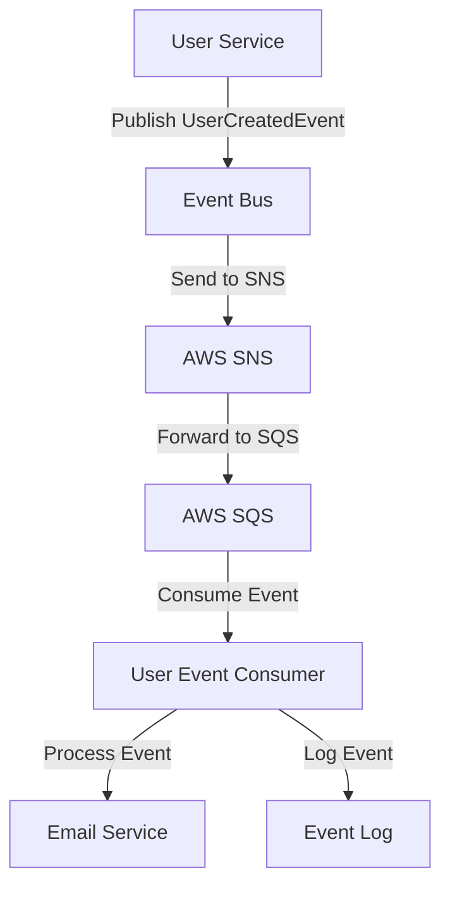

# Async Processing and Domain Events — Spring Boot

## Overview and scope

The purpose of this document is to establish standards and best practices for implementing asynchronous processing and domain events within Xentic's Java Spring Boot applications. This standard aims to ensure a consistent approach across all services, enhancing maintainability, scalability, and reliability in our software architecture.

### Audience

This document is intended for:
- Software Engineers
- Technical Architects
- DevOps Engineers
- Quality Assurance Teams

### Scope

This standard covers:
- Intra-service asynchronous event handling using Spring Events.
- Inter-service communication leveraging AWS SNS (Simple Notification Service) and SQS (Simple Queue Service).
- Best practices for event publishing, consumption, and error handling.

### Non-goals

This document does NOT cover:
- Detailed AWS infrastructure setup.
- Non-Spring Boot frameworks or languages.
- Synchronous processing patterns.

### Glossary

| Term                   | Definition                                                                 |
|------------------------|-----------------------------------------------------------------------------|
| Domain Event           | An event that signifies a change in the state of a domain entity.         |
| Async Processing       | The execution of tasks outside of the main application flow, allowing for non-blocking operations. |
| Spring Events          | A mechanism provided by Spring to publish and listen to application events. |
| SNS                    | Amazon Simple Notification Service, a fully managed messaging service.     |
| SQS                    | Amazon Simple Queue Service, a fully managed message queuing service.     |
| Idempotency            | The property of an operation whereby it can be applied multiple times without changing the result beyond the initial application. |

### How this standard fits the Xentic platform

This standard is aligned with Xentic's architectural principles, promoting microservices that communicate effectively while maintaining loose coupling. By adopting these guidelines, we ensure that our services can scale independently and handle high-throughput scenarios efficiently.

### Example Code

#### Intra-Service (Spring Events)

```java
public record UserCreatedEvent(UUID userId, String email, Instant occurredAt) {}

@Service
@RequiredArgsConstructor
public class UserService {
    private final ApplicationEventPublisher publisher;

    public User createUser(CreateUserRequest req) {
        User user = userRepository.save(buildUser(req));
        publisher.publishEvent(new UserCreatedEvent(user.getId(), user.getEmail(), Instant.now()));
        return user;
    }
}

@Component
public class UserCreatedListener {
    @Async
    @TransactionalEventListener(phase = AFTER_COMMIT)
    public void onUserCreated(UserCreatedEvent event) {
        emailService.sendWelcome(event.email());
    }
}
```

#### Inter-Service (AWS SNS + SQS)

```java
@Component
@RequiredArgsConstructor
public class UserEventPublisher {
    private final SnsTemplate snsTemplate;

    @Value("${aws.sns.user-events-topic-arn}")
    private String topicArn;

    public void publishUserCreated(UserCreatedEvent event) {
        snsTemplate.convertAndSend(topicArn, event, Map.of("eventType", "USER_CREATED"));
    }
}
```

### Rules

- **MUST** use `@TransactionalEventListener(phase = AFTER_COMMIT)` — never publish events before transaction commits.
- **MUST NOT** assume that events will be processed in the order they are published.
- **MUST** implement idempotency in SQS consumers using event IDs.
- **MUST** configure dead-letter queues for all SQS subscriptions to handle message processing failures.

## Standards and policies

1. **MUST** use the package naming convention `com.xentic.<service>` for all classes related to asynchronous processing and domain events. This ensures consistency and clarity across the codebase.

2. **MUST NOT** use blocking calls within asynchronous event handlers. All operations must be non-blocking to maintain system responsiveness.

3. **SHOULD** leverage Spring’s `@Async` annotation for methods that process events asynchronously. This allows for better thread management and resource utilization.

4. **MUST** define all event payloads as immutable records or final classes to ensure thread safety and prevent unintended modifications.

5. **MUST** use `@TransactionalEventListener(phase = AFTER_COMMIT)` when publishing domain events to ensure that events are only published after successful transaction commits.

6. **MUST NOT** rely on the order of event processing. Consumers should be designed to handle events independently of their order.

7. **MUST** implement idempotency in SQS consumers. This can be achieved by using unique event IDs to track processed events and avoid duplicate processing.

8. **MUST** configure dead-letter queues (DLQs) for all SQS subscriptions. This allows for the handling of message processing failures and ensures that messages can be retried or investigated.

9. **SHOULD** document all domain events in a central repository, including their structure and intended use cases, to facilitate understanding and usage across teams.

10. **MUST** use structured logging in asynchronous event handlers, including relevant metadata such as event type and correlation IDs, to aid in debugging and monitoring.

11. **SHOULD** implement a retry mechanism for SQS consumers to handle transient failures. This can be configured using the `VisibilityTimeout` and `RetryPolicy` settings.

12. **MUST** validate all incoming event data before processing to ensure data integrity and prevent errors during event handling.

13. **MUST NOT** expose internal event structures directly to external services. Instead, use DTOs (Data Transfer Objects) to encapsulate and transform event data as needed.

14. **SHOULD** use Spring Cloud AWS for seamless integration with AWS services such as SNS and SQS, ensuring that best practices for security and performance are followed.

15. **MUST** include unit and integration tests for all asynchronous event handlers to ensure that they behave correctly under various scenarios, including success and failure cases.

16. **MUST** configure appropriate monitoring and alerting for asynchronous processing components, including tracking event processing times and failure rates.

17. **SHOULD** use YAML configuration files for managing application properties related to asynchronous processing and domain events, as it provides a clear and structured format.

### Example Configuration (application.yml)

```yaml
aws:
  sns:
    user-events-topic-arn: "arn:aws:sns:us-east-1:123456789012:user-events"
  sqs:
    visibility-timeout: 30
    dead-letter-queue:
      max-retries: 3
      queue-name: "user-events-dlq"
```

### Example SQL for Event Logging

```sql
CREATE TABLE event_log (
    id SERIAL PRIMARY KEY,
    event_type VARCHAR(255) NOT NULL,
    event_payload JSONB NOT NULL,
    created_at TIMESTAMP DEFAULT CURRENT_TIMESTAMP,
    processed BOOLEAN DEFAULT FALSE
);
```

By adhering to these standards and policies, Xentic aims to create a robust and scalable architecture for asynchronous processing and domain events, ensuring high availability and reliability across all services.

## Architecture and design

### Component Diagram



### Data Flows

1. **User Creation Flow**
   - A user is created in the `User Service`.
   - The `UserService` publishes a `UserCreatedEvent` to the event bus.
   - The event is sent to AWS SNS.
   - SNS forwards the event to an SQS queue.
   - The `User Event Consumer` reads from the SQS queue and processes the event.
   - The `Email Service` sends a welcome email to the new user.
   - The event is logged in the `Event Log` table.

2. **Error Handling Flow**
   - If the `User Event Consumer` fails to process the event, it is retried based on the configured `VisibilityTimeout`.
   - After the maximum retry attempts, the message is sent to the configured dead-letter queue (DLQ) for further investigation.

### Integration Points

- **User Service**: Responsible for creating users and publishing domain events.
- **Event Bus**: Acts as an intermediary for publishing and consuming events.
- **AWS SNS**: Facilitates the distribution of events to multiple subscribers.
- **AWS SQS**: Provides a reliable queue for event processing.
- **Email Service**: Sends notifications based on domain events.
- **Event Log**: Stores event details for auditing and debugging.

### Failure Domains

- **User Service**: If the service fails, user creation and event publishing are halted. Monitoring and alerting should be in place to detect service downtime.
- **Event Bus**: If the event bus is down, events will not be published. Implement retries and fallbacks to ensure resilience.
- **AWS SNS**: If SNS is unavailable, events cannot be distributed. Ensure that the application can handle such failures gracefully.
- **AWS SQS**: If SQS fails, events cannot be processed. Consumers should implement retries and monitor for DLQ events.
- **Email Service**: If the email service fails, notifications will not be sent. Implement fallback mechanisms or alerting for failures.

### Best Practices

- **Event Idempotency**: Implement idempotency checks in the `User Event Consumer` to avoid duplicate processing of events.
- **Monitoring and Alerting**: Set up monitoring for all components involved in the event processing flow, including SQS queue length and processing times.
- **Structured Logging**: Use structured logging with relevant metadata to facilitate debugging and traceability of events.
- **Centralized Event Documentation**: Maintain a central repository for documenting all domain events, including their payload structure and use cases.

By adhering to these architectural guidelines, Xentic ensures a robust, scalable, and maintainable system for handling asynchronous processing and domain events.

## Configuration reference

### application.yml Configuration

The following configuration options are required for the asynchronous processing and domain events in the Spring Boot application. 

```yaml
server:
  port: 8080

spring:
  application:
    name: user-service

aws:
  region: "us-east-1"
  sns:
    user-events-topic-arn: "arn:aws:sns:us-east-1:123456789012:user-events"
  sqs:
    visibility-timeout: 30
    dead-letter-queue:
      max-retries: 3
      queue-name: "user-events-dlq"

logging:
  level:
    com.xentic: DEBUG

async:
  thread-pool:
    core-size: 10
    max-size: 20
    queue-capacity: 50
```

### Terraform Configuration

The following Terraform configuration sets up the necessary AWS resources for SNS and SQS.

```hcl
resource "aws_sns_topic" "user_events" {
  name = "user-events"
}

resource "aws_sqs_queue" "user_events_queue" {
  name = "user-events-queue"
  visibility_timeout_seconds = 30

  redrive_policy = jsonencode({
    deadLetterTargetArn = aws_sqs_queue.user_events_dlq.arn
    maxReceiveCount     = 3
  })
}

resource "aws_sqs_queue" "user_events_dlq" {
  name = "user-events-dlq"
}
```

### Environment Variables

The following environment variables can be used to override default configurations. 

| Variable Name                          | Default Value                                   | Production Value                          |
|----------------------------------------|------------------------------------------------|------------------------------------------|
| `AWS_REGION`                           | `us-east-1`                                    | `us-west-2`                              |
| `AWS_SNS_USER_EVENTS_TOPIC_ARN`       | `arn:aws:sns:us-east-1:123456789012:user-events` | `arn:aws:sns:us-west-2:123456789012:user-events` |
| `AWS_SQS_VISIBILITY_TIMEOUT`           | `30`                                           | `60`                                     |
| `AWS_SQS_DEAD_LETTER_QUEUE_MAX_RETRIES` | `3`                                          | `5`                                      |
| `ASYNC_THREAD_POOL_CORE_SIZE`         | `10`                                           | `15`                                     |
| `ASYNC_THREAD_POOL_MAX_SIZE`          | `20`                                           | `30`                                     |
| `ASYNC_THREAD_POOL_QUEUE_CAPACITY`    | `50`                                           | `100`                                    |

### Notes

- **MUST** ensure that the `AWS_REGION` variable matches the region where your SNS and SQS resources are created.
- **MUST** adjust the thread pool sizes according to the expected load and performance requirements in production.
- **MUST NOT** hard-code sensitive information such as AWS credentials in the configuration files. Use environment variables or secret management tools instead.

## Implementation guide

To implement asynchronous processing and domain events in a Spring Boot application at Xentic, follow these step-by-step instructions. This guide includes the necessary classes, configuration, and examples to ensure a robust and maintainable solution.

### Step 1: Define Domain Events

Create a domain event class that encapsulates the event data. For example, a `UserCreatedEvent` class can be defined as follows:

```java
package com.xentic.user.events;

import lombok.AllArgsConstructor;
import lombok.Getter;

@Getter
@AllArgsConstructor
public class UserCreatedEvent {
    private final String userId;
    private final String email;
    private final String name;
}
```

### Step 2: Publish Events

In the `UserService`, publish the domain event after creating a user. Use `ApplicationEventPublisher` to publish the event.

```java
package com.xentic.user.service;

import com.xentic.user.events.UserCreatedEvent;
import org.springframework.context.ApplicationEventPublisher;
import org.springframework.stereotype.Service;

@Service
public class UserService {

    private final ApplicationEventPublisher eventPublisher;

    public UserService(ApplicationEventPublisher eventPublisher) {
        this.eventPublisher = eventPublisher;
    }

    public void createUser(String userId, String email, String name) {
        // Logic to create user in the database
        // ...

        // Publish the UserCreatedEvent
        UserCreatedEvent event = new UserCreatedEvent(userId, email, name);
        eventPublisher.publishEvent(event);
    }
}
```

### Step 3: Create an Event Listener

Implement an event listener that listens for the `UserCreatedEvent` and processes it asynchronously.

```java
package com.xentic.user.listener;

import com.xentic.user.events.UserCreatedEvent;
import org.springframework.context.event.EventListener;
import org.springframework.scheduling.annotation.Async;
import org.springframework.stereotype.Component;

@Component
public class UserEventListener {

    @Async
    @EventListener
    public void handleUserCreatedEvent(UserCreatedEvent event) {
        // Logic to handle the user created event (e.g., sending a welcome email)
        System.out.println("Processing user created event for user: " + event.getUserId());
        // Additional processing logic...
    }
}
```

### Step 4: Configure Async Support

Enable asynchronous processing in your Spring Boot application by adding the `@EnableAsync` annotation to your main application class.

```java
package com.xentic;

import org.springframework.boot.SpringApplication;
import org.springframework.boot.autoconfigure.SpringBootApplication;
import org.springframework.scheduling.annotation.EnableAsync;

@SpringBootApplication
@EnableAsync
public class UserServiceApplication {
    public static void main(String[] args) {
        SpringApplication.run(UserServiceApplication.class, args);
    }
}
```

### Step 5: Configure Thread Pool

Configure the thread pool for asynchronous processing in `application.yml` to manage the number of concurrent tasks.

```yaml
spring:
  task:
    execution:
      pool:
        core-size: 10
        max-size: 20
        queue-capacity: 50
```

### Step 6: Set Up AWS SNS and SQS

Integrate AWS SNS and SQS for event publishing and consumption. Use the previously defined Terraform configuration to set up the necessary resources.

### Step 7: Create an SQS Consumer

Implement a consumer that listens to the SQS queue and processes the messages. Use Spring Cloud AWS for seamless integration.

```java
package com.xentic.user.consumer;

import com.xentic.user.events.UserCreatedEvent;
import org.springframework.cloud.aws.messaging.listener.annotation.SqsListener;
import org.springframework.stereotype.Component;

@Component
public class UserEventConsumer {

    @SqsListener("user-events-queue")
    public void consume(UserCreatedEvent event) {
        // Logic to process the event
        System.out.println("Consumed event for user: " + event.getUserId());
        // Additional processing logic...
    }
}
```

### Step 8: Testing

Ensure that you write unit tests for the event publishing and consuming logic. Use mocking frameworks like Mockito to simulate the event flow.

```java
package com.xentic.user.service;

import static org.mockito.Mockito.verify;

import com.xentic.user.events.UserCreatedEvent;
import org.junit.jupiter.api.Test;
import org.mockito.ArgumentCaptor;
import org.mockito.Mock;
import org.mockito.MockitoAnnotations;

public class UserServiceTest {

    @Mock
    private ApplicationEventPublisher eventPublisher;

    private UserService userService;

    @BeforeEach
    public void setUp() {
        MockitoAnnotations.openMocks(this);
        userService = new UserService(eventPublisher);
    }

    @Test
    public void testCreateUserPublishesEvent() {
        userService.createUser("123", "test@example.com", "Test User");

        ArgumentCaptor<UserCreatedEvent> eventCaptor = ArgumentCaptor.forClass(UserCreatedEvent.class);
        verify(eventPublisher).publishEvent(eventCaptor.capture());

        UserCreatedEvent publishedEvent = eventCaptor.getValue();
        assertEquals("123", publishedEvent.getUserId());
    }
}
```

### Summary

By following this implementation guide, you will successfully set up asynchronous processing and domain events using Spring Boot at Xentic. Ensure that you adhere to the architectural guidelines and best practices outlined in this document to maintain a robust and scalable system.

## Security requirements

### Threat Model Summary

Xentic's asynchronous processing architecture must address several potential threats, including:

- **Unauthorized Access**: Ensure that only authenticated and authorized users can publish and consume events.
- **Data Breach**: Protect sensitive user information from exposure during event processing.
- **Denial of Service (DoS)**: Implement rate limiting and resource management to prevent service disruption from excessive requests.
- **Input Validation Attacks**: Validate all incoming data to prevent injection attacks or malformed data processing.

### Authentication and Authorization

- **MUST** implement OAuth 2.0 for secure authentication and authorization across all services.
- **MUST NOT** expose any endpoints that allow event publishing or consumption without proper authentication checks.
- **MUST** use Spring Security to enforce method-level security on service methods that publish or consume events.

Example configuration for Spring Security:

```java
@EnableWebSecurity
public class SecurityConfig extends WebSecurityConfigurerAdapter {
    @Override
    protected void configure(HttpSecurity http) throws Exception {
        http
            .authorizeRequests()
            .antMatchers("/api/events/**").authenticated()
            .and()
            .oauth2Login();
    }
}
```

### Secrets Management

- **MUST NOT** hard-code sensitive information such as API keys or database credentials in the source code.
- **MUST** use a secrets management tool, such as AWS Secrets Manager or HashiCorp Vault, to store and retrieve sensitive information securely.

Example of retrieving secrets from AWS Secrets Manager:

```java
import software.amazon.awssdk.services.secretsmanager.SecretsManagerClient;
import software.amazon.awssdk.services.secretsmanager.model.GetSecretValueRequest;
import software.amazon.awssdk.services.secretsmanager.model.GetSecretValueResponse;

public class SecretService {
    private final SecretsManagerClient secretsManagerClient;

    public SecretService(SecretsManagerClient secretsManagerClient) {
        this.secretsManagerClient = secretsManagerClient;
    }

    public String getSecret(String secretName) {
        GetSecretValueRequest request = GetSecretValueRequest.builder()
                .secretId(secretName)
                .build();
        GetSecretValueResponse response = secretsManagerClient.getSecretValue(request);
        return response.secretString();
    }
}
```

### Input Validation

- **MUST** validate all input data to ensure it conforms to expected formats and types.
- **SHOULD** use libraries such as Hibernate Validator to enforce validation rules on event data.

Example of input validation in a domain event:

```java
import javax.validation.constraints.Email;
import javax.validation.constraints.NotBlank;

@Getter
@AllArgsConstructor
public class UserCreatedEvent {
    @NotBlank(message = "User ID must not be blank")
    private final String userId;

    @Email(message = "Email should be valid")
    private final String email;

    @NotBlank(message = "Name must not be blank")
    private final String name;
}
```

### Audit Logging

- **MUST** implement audit logging for all critical actions, including event publication and consumption.
- **MUST** log the user identity, timestamp, and action performed for traceability.

Example of logging in the event listener:

```java
import org.slf4j.Logger;
import org.slf4j.LoggerFactory;

@Component
public class UserEventListener {
    private static final Logger logger = LoggerFactory.getLogger(UserEventListener.class);

    @Async
    @EventListener
    public void handleUserCreatedEvent(UserCreatedEvent event) {
        logger.info("User created event processed for userId: {}", event.getUserId());
        // Additional processing logic...
    }
}
```

### Summary of Security Requirements

| Requirement                          | Description                                                                 |
|--------------------------------------|-----------------------------------------------------------------------------|
| Authentication                       | Implement OAuth 2.0 for secure access control.                             |
| Authorization                        | Use Spring Security for method-level security.                             |
| Secrets Management                   | Use AWS Secrets Manager or HashiCorp Vault for sensitive information.      |
| Input Validation                     | Validate all incoming data to prevent injection attacks.                   |
| Audit Logging                        | Log all critical actions with user identity and timestamps.                |

By adhering to these security requirements, Xentic can ensure a robust and secure asynchronous processing environment for domain events in its Spring Boot applications.

## Testing strategy

To ensure the reliability and correctness of the asynchronous processing and domain events in Spring Boot applications at Xentic, a comprehensive testing strategy must be implemented. This strategy includes unit tests, integration tests, and contract tests, each serving a distinct purpose in the testing lifecycle.

### Unit Tests

Unit tests are crucial for validating individual components in isolation. They should cover:

- **Service methods**: Ensure that the business logic behaves as expected.
- **Event publishing**: Verify that events are published correctly when actions are performed.

**Coverage Target**: Aim for at least 80% code coverage for all service classes.

**Example Unit Test Class**:

```java
package com.xentic.user.service;

import static org.mockito.Mockito.verify;
import static org.junit.jupiter.api.Assertions.assertEquals;

import com.xentic.user.events.UserCreatedEvent;
import org.junit.jupiter.api.BeforeEach;
import org.junit.jupiter.api.Test;
import org.mockito.ArgumentCaptor;
import org.mockito.Mock;
import org.mockito.MockitoAnnotations;
import org.springframework.context.ApplicationEventPublisher;

public class UserServiceTest {

    @Mock
    private ApplicationEventPublisher eventPublisher;

    private UserService userService;

    @BeforeEach
    public void setUp() {
        MockitoAnnotations.openMocks(this);
        userService = new UserService(eventPublisher);
    }

    @Test
    public void testCreateUserPublishesEvent() {
        userService.createUser("123", "test@example.com", "Test User");

        ArgumentCaptor<UserCreatedEvent> eventCaptor = ArgumentCaptor.forClass(UserCreatedEvent.class);
        verify(eventPublisher).publishEvent(eventCaptor.capture());

        UserCreatedEvent publishedEvent = eventCaptor.getValue();
        assertEquals("123", publishedEvent.getUserId());
    }
}
```

### Integration Tests

Integration tests validate the interaction between components and external systems. They should focus on:

- **Event consumption**: Ensure that events are consumed correctly from SQS and processed as expected.
- **Database interactions**: Verify that the application correctly interacts with the database when processing events.

**Coverage Target**: Aim for at least 70% code coverage for integration tests.

**Example Integration Test Class**:

```java
package com.xentic.user.consumer;

import static org.mockito.Mockito.verify;

import com.xentic.user.events.UserCreatedEvent;
import org.junit.jupiter.api.Test;
import org.springframework.beans.factory.annotation.Autowired;
import org.springframework.boot.test.autoconfigure.web.servlet.AutoConfigureMockMvc;
import org.springframework.boot.test.context.SpringBootTest;
import org.springframework.test.context.ActiveProfiles;

@SpringBootTest
@ActiveProfiles("test")
@AutoConfigureMockMvc
public class UserEventConsumerIntegrationTest {

    @Autowired
    private UserEventConsumer userEventConsumer;

    @Test
    public void testConsumeUserCreatedEvent() {
        UserCreatedEvent event = new UserCreatedEvent("123", "test@example.com", "Test User");
        userEventConsumer.consume(event);

        // Verify that the event was processed correctly
        // Add assertions based on the expected outcome
    }
}
```

### Contract Tests

Contract tests ensure that the interactions between services adhere to agreed-upon contracts. This is particularly important for microservices communicating over HTTP or messaging protocols.

- **Consumer-driven contracts**: Use tools like Pact to define and verify contracts between services.

**Example Pact Test**:

```java
package com.xentic.user.contract;

import au.com.dius.pact.consumer.junit5.PactConsumerTestExt;
import au.com.dius.pact.consumer.junit5.Pact;
import au.com.dius.pact.consumer.dsl.PactDslWithProvider;
import au.com.dius.pact.consumer.dsl.PactDslJsonBody;
import org.junit.jupiter.api.Test;
import org.junit.jupiter.api.extension.ExtendWith;

@ExtendWith(PactConsumerTestExt.class)
public class UserServiceContractTest {

    @Pact(consumer = "user-service", provider = "event-service")
    public RequestResponsePact createPact(PactDslWithProvider builder) {
        return builder
            .given("User created event exists")
            .uponReceiving("A request to consume user created event")
            .path("/api/events/user-created")
            .method("POST")
            .body(new PactDslJsonBody()
                .stringType("userId", "123")
                .stringType("email", "test@example.com")
                .stringType("name", "Test User"))
            .willRespondWith()
            .status(200)
            .toPact();
    }

    @Test
    public void testConsumer() {
        // Implement the test logic to verify the contract
    }
}
```

### Summary of Testing Strategy

| Test Type        | Purpose                                             | Coverage Target |
|------------------|-----------------------------------------------------|------------------|
| Unit Tests       | Validate individual components in isolation         | 80%               |
| Integration Tests| Validate interactions between components and systems | 70%               |
| Contract Tests   | Ensure adherence to service contracts                | 100%              |

By adhering to this testing strategy, Xentic will maintain a high level of confidence in the functionality and reliability of its asynchronous processing and domain events within Spring Boot applications.

## Observability and operations

To ensure the reliability and performance of asynchronous processing and domain events in Spring Boot applications at Xentic, a robust observability and operations strategy must be implemented. This includes metrics, logs, traces, dashboards, alerts, and SLOs.

### Metrics

- **MUST** collect metrics related to event processing, such as:
  - Event processing time
  - Number of events published and consumed
  - Success and failure rates
- **SHOULD** use Micrometer for metrics collection and expose them to a monitoring system like Prometheus.

**Example Micrometer Configuration in `application.yml`:**

```yaml
management:
  metrics:
    export:
      prometheus:
        enabled: true
```

### Logs

- **MUST** implement structured logging for all events and actions.
- **SHOULD** use a logging framework like SLF4J with Logback for consistent logging practices.
- **MUST NOT** log sensitive information, such as user passwords or personal data.

**Example Logback Configuration in `logback-spring.xml`:**

```xml
<configuration>
    <appender name="STDOUT" class="ch.qos.logback.core.ConsoleAppender">
        <encoder>
            <pattern>%d{yyyy-MM-dd HH:mm:ss} [%thread] %-5level %logger{36} - %msg%n</pattern>
        </encoder>
    </appender>

    <root level="INFO">
        <appender-ref ref="STDOUT" />
    </root>
</configuration>
```

### Traces

- **MUST** implement distributed tracing to monitor the flow of events across services.
- **SHOULD** use Spring Cloud Sleuth for tracing and integrate with Zipkin or Jaeger for visualization.

**Example Spring Cloud Sleuth Configuration in `application.yml`:**

```yaml
spring:
  sleuth:
    sampler:
      probability: 1.0 # Sample all requests
```

### Dashboards

- **MUST** create dashboards to visualize key metrics and logs.
- **SHOULD** use Grafana to build dashboards that track:
  - Event processing latency
  - Error rates
  - System health indicators

**Example Grafana Dashboard Widgets:**

| Widget Type       | Metric                         | Description                                   |
|-------------------|--------------------------------|-----------------------------------------------|
| Time Series Graph | Event Processing Time          | Visualizes the time taken to process events. |
| Bar Chart         | Events Published vs Consumed   | Compares the number of events published and consumed. |
| Gauge             | System Health                  | Displays the health status of the application. |

### Alerts

- **MUST** set up alerts for critical metrics to ensure prompt action on issues.
- **SHOULD** configure alerts for:
  - High error rates
  - Latency spikes
  - System resource exhaustion (CPU, memory)

**Example Alert Configuration in Prometheus Alertmanager:**

```yaml
groups:
- name: event-processing-alerts
  rules:
  - alert: HighErrorRate
    expr: rate(event_processing_errors_total[5m]) > 0.05
    for: 10m
    labels:
      severity: critical
    annotations:
      summary: "High error rate detected"
      description: "More than 5% of events are failing over the last 10 minutes."
```

### SLOs

- **MUST** define Service Level Objectives (SLOs) for critical event processing metrics.
- **SHOULD** track SLO compliance to ensure reliability.

**Example SLO Definition:**

| SLO Name                     | Objective                  | Measurement Method                  |
|------------------------------|----------------------------|-------------------------------------|
| Event Processing Latency     | 95% of events processed in < 200ms | Measure average processing time over a rolling window. |
| Event Success Rate           | 99% success rate           | Calculate the ratio of successful events to total events. |

### On-Call Runbook Steps

In the event of an incident related to asynchronous processing, the on-call engineer MUST follow these steps:

1. **Identify the Incident**:
   - Check alerts in the monitoring system.
   - Review logs for errors or anomalies.

2. **Assess Impact**:
   - Determine the scope of affected services and users.
   - Check the status of event processing metrics.

3. **Mitigate the Issue**:
   - If a service is down, restart the service.
   - If there is a high error rate, identify the root cause from logs and metrics.

4. **Communicate**:
   - Notify stakeholders of the incident and ongoing resolution efforts.
   - Update the incident status in the incident management system.

5. **Post-Incident Review**:
   - After resolution, conduct a post-mortem to analyze the incident.
   - Document findings and update runbooks as necessary.

By implementing these observability and operations practices, Xentic can ensure a reliable and efficient asynchronous processing environment for domain events in its Spring Boot applications.

## Migration and versioning

To maintain a robust and reliable system architecture at Xentic, it is essential to establish clear migration and versioning policies for asynchronous processing and domain events in Spring Boot applications. This section outlines the upgrade paths, deprecation policy, backward compatibility requirements, and rollback strategies.

### Upgrade Paths

- **MUST** define clear upgrade paths for all services, ensuring that each service can be upgraded independently without breaking functionality.
- **SHOULD** follow semantic versioning (SemVer) to communicate changes effectively:
  - **Major version**: Introduces breaking changes.
  - **Minor version**: Adds functionality in a backward-compatible manner.
  - **Patch version**: Bug fixes in a backward-compatible manner.

| Version Type | Description                                   | Example |
|--------------|-----------------------------------------------|---------|
| Major        | Breaking changes; requires migration steps.   | 2.0.0  |
| Minor        | New features; backward-compatible.             | 1.1.0  |
| Patch        | Bug fixes; backward-compatible.                | 1.0.1  |

### Deprecation Policy

- **MUST** deprecate features and APIs in a controlled manner:
  - Mark features as deprecated in the documentation and code comments.
  - Provide a clear timeline for removal, typically spanning at least two release cycles.
- **SHOULD** communicate deprecation notices through release notes and internal documentation.

**Example Deprecation Notice in Code:**

```java
/**
 * @deprecated This method will be removed in version 2.0.0. 
 * Use newMethod() instead.
 */
@Deprecated
public void oldMethod() {
    // implementation
}
```

### Backward Compatibility

- **MUST** ensure that new versions of services remain backward compatible with previous versions, especially for public APIs and event schemas.
- **SHOULD** use versioning in API endpoints to manage changes without breaking existing clients.

**Example Versioned API Endpoint:**

```java
@RestController
@RequestMapping("/api/v1/events")
public class EventController {
    // API methods
}
```

### Rollback Strategies

- **MUST** implement rollback procedures to revert to a previous stable version in case of failure during deployment.
- **SHOULD** use feature flags to toggle new features on or off without requiring a rollback.

**Example Rollback Procedure:**

1. **Identify the Issue**: Monitor logs and metrics to determine the cause of the failure.
2. **Notify Stakeholders**: Inform all relevant parties about the rollback.
3. **Revert Deployment**: Use the CI/CD pipeline to deploy the last known stable version.
4. **Verify Stability**: Ensure that the system is functioning correctly after rollback.
5. **Document the Incident**: Record the incident in the incident management system and update documentation as needed.

### Migration Scripts

- **MUST** provide migration scripts for database schema changes to ensure data integrity during upgrades.
- **SHOULD** use tools like Flyway or Liquibase for managing database migrations.

**Example Flyway Migration Script (V1__Create_Events_Table.sql):**

```sql
CREATE TABLE events (
    id SERIAL PRIMARY KEY,
    event_type VARCHAR(255) NOT NULL,
    payload JSONB NOT NULL,
    created_at TIMESTAMP DEFAULT CURRENT_TIMESTAMP
);
```

### Versioning of Domain Events

- **MUST** version domain events to handle changes in event schemas without breaking consumers.
- **SHOULD** include the version number in the event payload.

**Example Versioned Domain Event:**

```json
{
    "eventType": "UserCreated",
    "version": "1.0",
    "data": {
        "userId": "123",
        "email": "test@example.com",
        "name": "Test User"
    }
}
```

By adhering to these migration and versioning standards, Xentic will ensure a smooth transition between versions, maintain backward compatibility, and minimize disruptions during upgrades, thereby enhancing the reliability and maintainability of its asynchronous processing and domain events in Spring Boot applications.

## FAQ, anti-patterns, and checklists

### FAQ

1. **What is async processing in Spring Boot?**
   - Async processing allows methods to run in a separate thread, enabling non-blocking operations which improve application responsiveness.

2. **How do I enable async processing in Spring Boot?**
   - You MUST annotate your configuration class with `@EnableAsync` and use `@Async` on the methods you want to execute asynchronously.

   ```java
   @Configuration
   @EnableAsync
   public class AsyncConfig {
   }
   ```

3. **What is a domain event?**
   - A domain event represents a significant change in the state of the application and is used to trigger actions in other parts of the system.

4. **How do I publish a domain event?**
   - You MUST use an event publisher, such as `ApplicationEventPublisher`, to publish events.

   ```java
   @Autowired
   private ApplicationEventPublisher publisher;

   public void createUser(User user) {
       // Save user logic
       publisher.publishEvent(new UserCreatedEvent(user));
   }
   ```

5. **What are the benefits of using domain events?**
   - Domain events decouple components, enhance scalability, and improve maintainability by allowing different parts of the system to react to changes independently.

6. **How do I handle event failures?**
   - You MUST implement a retry mechanism or a dead-letter queue to manage failed events effectively.

7. **What is the difference between synchronous and asynchronous event handling?**
   - Synchronous event handling blocks the caller until the event is processed, while asynchronous handling allows the caller to continue processing without waiting.

8. **How can I ensure event ordering?**
   - You SHOULD use a message broker that supports ordering, such as Kafka, and configure partitions accordingly.

9. **What should I do if an event handler is slow?**
   - You MUST analyze the handler's performance, optimize the processing logic, and consider offloading heavy tasks to background jobs.

10. **How do I test asynchronous methods?**
    - You SHOULD use tools like `@SpringBootTest` with `@Async` enabled and leverage `CompletableFuture` for assertions in your tests.

### Anti-Patterns

| Anti-Pattern                        | Description                                                                                      |
|-------------------------------------|--------------------------------------------------------------------------------------------------|
| **Blocking Calls**                  | Making synchronous calls in an async method, which defeats the purpose of async processing.      |
| **Overusing Async**                 | Using async for every method can lead to complexity and resource exhaustion.                     |
| **Ignoring Error Handling**         | Not implementing error handling in async methods can result in lost events and silent failures.  |
| **Tight Coupling**                  | Directly coupling event producers and consumers can lead to a fragile architecture.              |
| **Not Versioning Events**           | Failing to version domain events can break consumers when the event schema changes.             |
| **Neglecting Monitoring**           | Not monitoring async processes can lead to undetected issues and degraded performance.          |

### Pre-Merge Checklist

- [ ] Code adheres to Xentic coding standards.
- [ ] All async methods are annotated with `@Async`.
- [ ] Domain events are properly versioned.
- [ ] Event handling logic includes error handling and retries.
- [ ] Unit tests cover async methods and event handlers.
- [ ] Documentation is updated to reflect changes.

### Production Checklist

- [ ] All services are running the latest stable version.
- [ ] Monitoring tools are configured and operational.
- [ ] Alerts for critical metrics are set up.
- [ ] Load testing has been conducted for async endpoints.
- [ ] Backup and rollback strategies are in place.
- [ ] Post-deployment verification is scheduled.
