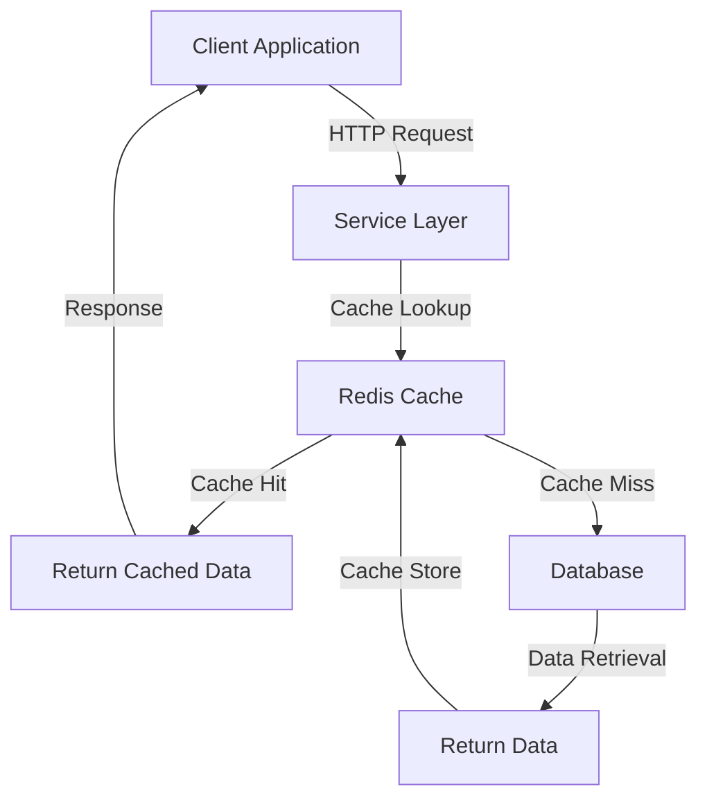

# Caching Standards — Spring Boot + Redis

## Overview and scope

The purpose of this document is to establish the caching standards for applications developed at Xentic using Spring Boot and Redis. This standard aims to provide a consistent approach to caching across all services, ensuring that performance is optimized while maintaining data integrity and security.

### Audience
This document is intended for:
- Software engineers and developers working on backend services at Xentic.
- Architects and technical leads responsible for system design and performance optimization.
- Quality assurance teams to ensure compliance with caching standards during testing.

### Scope
This standard applies to all backend services developed using Java and Spring Boot within the Xentic ecosystem. It covers:
- Local caching mechanisms using Caffeine.
- Distributed caching strategies utilizing Redis.
- Guidelines for cache configuration, usage, and management.

### Non-goals
This document does not cover:
- Caching strategies for frontend applications or non-Java services.
- Specific implementation details for third-party caching solutions outside of Spring Boot and Redis.
- Performance tuning for Redis beyond the scope of caching.

### Glossary
| Term                | Definition                                                                 |
|---------------------|-----------------------------------------------------------------------------|
| Caching             | The process of storing data in a temporary storage area to improve access speed. |
| TTL (Time-To-Live)  | The duration for which a cached entry is valid before it is considered stale. |
| DTO (Data Transfer Object) | An object that carries data between processes, designed to be serializable. |
| Cache Eviction      | The process of removing entries from the cache when they are no longer needed or have expired. |

### How this standard fits the Xentic platform
The caching standards outlined in this document are integral to the performance and scalability of Xentic's services. By adhering to these guidelines, teams can ensure that:
- Services are responsive and efficient, reducing latency in data retrieval.
- Data consistency and integrity are maintained across distributed systems.
- Resource usage is optimized, leading to cost-effective operations.

### Caffeine (Local Cache)
```java
@Configuration
@EnableCaching
public class CacheConfig {
    @Bean
    public CacheManager cacheManager() {
        CaffeineCacheManager mgr = new CaffeineCacheManager();
        mgr.setCaffeine(Caffeine.newBuilder()
            .maximumSize(1000)
            .expireAfterWrite(5, TimeUnit.MINUTES));
        return mgr;
    }
}

@Service
public class CountryService {
    @Cacheable(value = "countries", key = "#code")
    public CountryResponse getByCode(String code) {
        return countryRepository.findByCode(code)
            .map(countryMapper::toResponse)
            .orElseThrow(() -> new ResourceNotFoundException("Country", code));
    }

    @CacheEvict(value = "countries", key = "#code")
    public void evict(String code) {}
}
```

### Redis (Distributed Cache)
```yaml
spring:
  data:
    redis:
      host: ${REDIS_HOST}
      port: 6379
      ssl.enabled: true
  cache:
    redis:
      time-to-live: 600000
      key-prefix: "myservice:"
```

### Rules
- MUST NOT cache mutable user-specific data in shared cache without tenant isolation.
- MUST always define TTL — no indefinite cache entries.
- MUST cache only serializable DTOs, never JPA entities.

## Standards and policies

1. **MUST** use the package naming convention `com.xentic.<service>` for all caching-related classes and configurations to maintain consistency across the codebase.

2. **MUST NOT** use `com.company` or any other package naming convention that deviates from the established Xentic standards.

3. **MUST** configure Redis with appropriate security settings, including SSL, to protect data in transit. Example configuration:
   ```yaml
   spring:
     data:
       redis:
         ssl:
           enabled: true
   ```

4. **MUST** define a Time-To-Live (TTL) for all cached entries to prevent stale data. Example:
   ```yaml
   spring:
     cache:
       redis:
         time-to-live: 600000  # 10 minutes
   ```

5. **SHOULD** use a cache key prefix to avoid key collisions in Redis. This can be configured as follows:
   ```yaml
   spring:
     cache:
       redis:
         key-prefix: "myservice:"
   ```

6. **MUST** implement cache eviction strategies for mutable data to ensure data consistency. Use the `@CacheEvict` annotation appropriately. Example:
   ```java
   @CacheEvict(value = "countries", key = "#code")
   public void evict(String code) {}
   ```

7. **MUST** cache only serializable Data Transfer Objects (DTOs) and avoid caching JPA entities to prevent issues with serialization. 

8. **SHOULD** use Caffeine for local caching where appropriate, configuring it with sensible limits and expiration settings:
   ```java
   @Bean
   public CacheManager cacheManager() {
       CaffeineCacheManager mgr = new CaffeineCacheManager();
       mgr.setCaffeine(Caffeine.newBuilder()
           .maximumSize(1000)
           .expireAfterWrite(5, TimeUnit.MINUTES));
       return mgr;
   }
   ```

9. **MUST NOT** cache sensitive information, such as passwords or personal identification information (PII), in any caching layer.

10. **MUST** monitor cache hit and miss ratios to evaluate caching effectiveness and adjust configurations accordingly.

11. **SHOULD** document all caching strategies and configurations in the service's README or relevant documentation to facilitate knowledge sharing among team members.

12. **MUST** ensure that cache keys are unique and meaningful, incorporating relevant identifiers to avoid ambiguity. For example:
    ```java
    @Cacheable(value = "countries", key = "#code")
    ```

13. **MUST NOT** rely solely on caching for data persistence; all data must be retrieved from the primary data source when necessary.

14. **SHOULD** implement fallback mechanisms for cache misses to ensure service reliability. Example:
    ```java
    @Cacheable(value = "countries", key = "#code", unless = "#result == null")
    public CountryResponse getByCode(String code) {
        return countryRepository.findByCode(code)
            .map(countryMapper::toResponse)
            .orElseGet(() -> handleCacheMiss(code));
    }
    ```

15. **MUST** ensure that all cache-related code is covered by unit tests to verify the correctness of caching logic and behavior.

16. **SHOULD** use the `@Cacheable` annotation judiciously to avoid unnecessary caching of frequently changing data.

17. **MUST** configure Redis connection pooling to optimize resource usage and performance:
    ```yaml
    spring:
      data:
        redis:
          pool:
            max-idle: 10
            min-idle: 2
            max-total: 20
    ```

18. **MUST** review and update caching policies regularly to adapt to changes in application architecture and performance requirements. 

By adhering to these standards and policies, Xentic can ensure that caching is implemented effectively, enhancing performance while maintaining data integrity and security.

## Architecture and design

### Component Diagram



### Data Flows

1. **Client Request**: The client sends an HTTP request to the service layer for data retrieval.
2. **Cache Lookup**: The service layer checks the Redis cache for the requested data.
   - If the data is found (cache hit), it is returned directly to the client.
   - If the data is not found (cache miss), the service layer queries the database.
3. **Database Query**: The service layer retrieves the data from the database.
4. **Cache Store**: The retrieved data is stored in the Redis cache for future requests.
5. **Response**: The data is sent back to the client.

### Integration Points

- **Redis Cache**: The primary integration point for caching is Redis, which must be configured to handle connections and data storage.
- **Database**: The service layer interacts with the database when cache misses occur, ensuring a fallback mechanism for data retrieval.
- **Service Layer**: The caching logic is encapsulated within the service layer, utilizing Spring's caching annotations for seamless integration.

### Failure Domains

- **Redis Cache Failure**: If Redis becomes unavailable, the service layer must gracefully handle cache misses and fall back to the database. The application should implement retry logic and circuit breaker patterns to manage Redis connectivity issues.
- **Database Failure**: If the database is down, the service layer should return an appropriate error response to the client, ensuring that the application remains resilient.
- **Network Issues**: Network failures between the client and service layer or between the service layer and Redis/database can lead to timeouts. Implementing timeouts and retries is essential to mitigate these issues.

### Error Handling Strategies

- **Circuit Breaker Pattern**: Implement a circuit breaker to prevent the service from continuously attempting to access Redis if it is down. This can be achieved using libraries like Resilience4j or Spring Cloud Circuit Breaker.
- **Fallback Mechanisms**: Use fallback methods in service calls to handle cache misses or database errors gracefully. Example:
  
```java
@Cacheable(value = "countries", key = "#code", unless = "#result == null")
public CountryResponse getByCode(String code) {
    return countryRepository.findByCode(code)
        .map(countryMapper::toResponse)
        .orElseGet(() -> handleCacheMiss(code));
}
```

### Performance Monitoring

- **Cache Metrics**: Monitor cache hit and miss rates using Spring Actuator or custom metrics to evaluate the effectiveness of the caching strategy.
- **Logging**: Implement logging for cache operations to trace cache hits, misses, and evictions, aiding in performance tuning and debugging.

### Summary

By adhering to the outlined architecture and design principles, Xentic can ensure that its caching strategy is robust, efficient, and resilient. This will ultimately lead to improved application performance and user satisfaction.

### Configuration reference

#### application.yml

The following configuration settings are recommended for integrating Redis caching in your Spring Boot application. Ensure to replace placeholders with actual values as needed.

```yaml
spring:
  data:
    redis:
      host: ${REDIS_HOST:localhost}  # Default: localhost
      port: ${REDIS_PORT:6379}        # Default: 6379
      password: ${REDIS_PASSWORD:}     # Default: empty
      ssl:
        enabled: true                   # MUST enable SSL for security
      pool:
        max-idle: 10                    # Default: 10
        min-idle: 2                     # Default: 2
        max-total: 20                   # Default: 20
  cache:
    redis:
      time-to-live: 600000             # MUST define TTL (10 minutes)
      key-prefix: "myservice:"         # SHOULD use a key prefix
```

#### Terraform

The following Terraform configuration can be used to provision a Redis instance with the necessary settings for your application.

```hcl
resource "aws_elasticache_cluster" "redis" {
  cluster_id           = "my-redis-cluster"
  engine              = "redis"
  node_type           = "cache.t2.micro"
  num_cache_nodes     = 1
  parameter_group_name = "default.redis3.2"
  
  tags = {
    Name = "MyRedisCluster"
  }
}

output "redis_endpoint" {
  value = aws_elasticache_cluster.redis.configuration_endpoint
}
```

#### Environment Variables

The following environment variables should be configured for your application to connect to Redis. Default values are provided for local development.

| Variable            | Default Value         | Production Value          |
|---------------------|-----------------------|---------------------------|
| REDIS_HOST          | localhost             | redis.production.xentic.io |
| REDIS_PORT          | 6379                  | 6379                      |
| REDIS_PASSWORD      | (none)                | secure_password           |
| CACHE_TTL           | 600000                | 300000                    |  # 5 minutes in production
| CACHE_KEY_PREFIX    | myservice:            | myservice:                |

### Notes

- **MUST** ensure that the Redis instance is secured with a strong password in production.
- **MUST NOT** expose Redis directly to the internet; use VPCs and security groups to limit access.
- **SHOULD** consider using Redis Sentinel or Cluster for high availability in production environments.

## Implementation guide

To implement caching in a Spring Boot application using Redis, follow these step-by-step instructions, ensuring adherence to Xentic's standards.

### Step 1: Add Dependencies

Add the following dependencies to your `pom.xml` for Maven or `build.gradle` for Gradle.

**Maven:**
```xml
<dependency>
    <groupId>org.springframework.boot</groupId>
    <artifactId>spring-boot-starter-data-redis</artifactId>
</dependency>
<dependency>
    <groupId>org.springframework.boot</groupId>
    <artifactId>spring-boot-starter-cache</artifactId>
</dependency>
```

**Gradle:**
```groovy
implementation 'org.springframework.boot:spring-boot-starter-data-redis'
implementation 'org.springframework.boot:spring-boot-starter-cache'
```

### Step 2: Configure Redis

In your `application.yml`, configure the Redis connection settings as shown below:

```yaml
spring:
  data:
    redis:
      host: ${REDIS_HOST:localhost}
      port: ${REDIS_PORT:6379}
      password: ${REDIS_PASSWORD:}
      ssl:
        enabled: true
  cache:
    redis:
      time-to-live: 600000  # 10 minutes
      key-prefix: "myservice:"
```

### Step 3: Enable Caching

In your main application class, enable caching by adding the `@EnableCaching` annotation.

```java
package com.xentic.myservice;

import org.springframework.boot.SpringApplication;
import org.springframework.boot.autoconfigure.SpringBootApplication;
import org.springframework.cache.annotation.EnableCaching;

@SpringBootApplication
@EnableCaching
public class MyServiceApplication {
    public static void main(String[] args) {
        SpringApplication.run(MyServiceApplication.class, args);
    }
}
```

### Step 4: Create a Service with Caching Logic

Create a service class that includes caching logic using the `@Cacheable` annotation.

```java
package com.xentic.myservice.service;

import com.xentic.myservice.model.CountryResponse;
import com.xentic.myservice.repository.CountryRepository;
import com.xentic.myservice.mapper.CountryMapper;
import org.springframework.cache.annotation.Cacheable;
import org.springframework.stereotype.Service;

@Service
public class CountryService {
    
    private final CountryRepository countryRepository;
    private final CountryMapper countryMapper;

    public CountryService(CountryRepository countryRepository, CountryMapper countryMapper) {
        this.countryRepository = countryRepository;
        this.countryMapper = countryMapper;
    }

    @Cacheable(value = "countries", key = "#code", unless = "#result == null")
    public CountryResponse getByCode(String code) {
        return countryRepository.findByCode(code)
            .map(countryMapper::toResponse)
            .orElseGet(() -> handleCacheMiss(code));
    }

    private CountryResponse handleCacheMiss(String code) {
        // Implement fallback logic, e.g., log and return a default response
        return new CountryResponse(code, "Unknown Country");
    }
}
```

### Step 5: Create a Repository Interface

Define a repository interface for data access. This example uses Spring Data JPA.

```java
package com.xentic.myservice.repository;

import com.xentic.myservice.entity.Country;
import org.springframework.data.jpa.repository.JpaRepository;
import java.util.Optional;

public interface CountryRepository extends JpaRepository<Country, Long> {
    Optional<Country> findByCode(String code);
}
```

### Step 6: Create a Mapper Class

Implement a mapper class to convert between entity and response objects.

```java
package com.xentic.myservice.mapper;

import com.xentic.myservice.entity.Country;
import com.xentic.myservice.model.CountryResponse;
import org.springframework.stereotype.Component;

@Component
public class CountryMapper {
    
    public CountryResponse toResponse(Country country) {
        return new CountryResponse(country.getCode(), country.getName());
    }
}
```

### Step 7: Testing the Caching Logic

Create unit tests to verify the caching behavior of your service.

```java
package com.xentic.myservice.service;

import com.xentic.myservice.repository.CountryRepository;
import com.xentic.myservice.mapper.CountryMapper;
import org.junit.jupiter.api.Test;
import org.mockito.Mockito;
import static org.mockito.Mockito.*;

class CountryServiceTest {

    private final CountryRepository countryRepository = Mockito.mock(CountryRepository.class);
    private final CountryMapper countryMapper = Mockito.mock(CountryMapper.class);
    private final CountryService countryService = new CountryService(countryRepository, countryMapper);

    @Test
    void testGetByCode_CacheHit() {
        // Setup
        Country country = new Country("US", "United States");
        when(countryRepository.findByCode("US")).thenReturn(Optional.of(country));
        when(countryMapper.toResponse(country)).thenReturn(new CountryResponse("US", "United States"));

        // Execute
        CountryResponse response1 = countryService.getByCode("US");
        CountryResponse response2 = countryService.getByCode("US"); // Should hit cache

        // Verify
        verify(countryRepository, times(1)).findByCode("US"); // Should only be called once
        assertEquals(response1, response2);
    }
}
```

### Conclusion

By following these steps, you have successfully implemented caching in your Spring Boot application using Redis. Ensure that all caching logic is thoroughly tested and documented, adhering to Xentic's internal standards.

## Security requirements

To ensure the security of caching mechanisms in Spring Boot applications using Redis, the following requirements must be adhered to:

### Threat Model Summary

- **Data Exposure**: Unauthorized access to cached data can lead to data breaches.
- **Data Tampering**: Attackers may attempt to manipulate cached data to serve malicious content.
- **Denial of Service (DoS)**: Overloading the Redis instance can lead to service unavailability.
- **Insecure Communication**: Data transmitted between the application and Redis must be protected against eavesdropping.

### Authentication and Authorization

- **MUST** use Redis authentication by setting a strong password in the `REDIS_PASSWORD` environment variable.
- **MUST NOT** use default settings for Redis, which may expose the instance to unauthorized access.
- **MUST** implement role-based access control (RBAC) within the application to restrict access to cached data based on user roles.

### Secrets Management

- **MUST** store sensitive configurations such as passwords and API keys in a secure vault (e.g., HashiCorp Vault, AWS Secrets Manager).
- **MUST NOT** hard-code secrets in the application code or configuration files.
- **SHOULD** use environment variables to manage sensitive data, ensuring they are not logged or exposed in error messages.

### Input Validation

- **MUST** validate all inputs before processing them to prevent injection attacks, including command injection and cross-site scripting (XSS).
- **SHOULD** implement data sanitization practices to clean user inputs and avoid storing malicious content in the cache.
- **MUST NOT** cache unvalidated or unsafe user-generated content.

### Audit Logging

- **MUST** implement audit logging for all operations that interact with the cache, including cache hits, misses, and evictions.
- **SHOULD** log user actions that modify cached data to maintain a clear record of changes.
- **MUST** ensure that logs do not contain sensitive information, such as passwords or personally identifiable information (PII).

### Example Audit Logging Configuration

In your `application.yml`, configure logging settings to include cache events:

```yaml
logging:
  level:
    org.springframework.cache: DEBUG  # Enable debug logging for cache events
```

### Example of Input Validation

Implement input validation in your service methods to prevent malicious inputs:

```java
package com.xentic.myservice.service;

import org.springframework.stereotype.Service;
import org.springframework.util.StringUtils;

@Service
public class CountryService {
    
    // Existing methods...

    public CountryResponse getByCode(String code) {
        validateCode(code);  // Validate input before processing
        return countryRepository.findByCode(code)
            .map(countryMapper::toResponse)
            .orElseGet(() -> handleCacheMiss(code));
    }

    private void validateCode(String code) {
        if (!StringUtils.hasText(code) || !code.matches("[A-Z]{2}")) {
            throw new IllegalArgumentException("Invalid country code");
        }
    }
}
```

### Example of Secrets Management

Use environment variables for sensitive configurations in your deployment scripts:

```bash
export REDIS_PASSWORD='secure_password'  # Set in your deployment environment
```

### Summary

By following these security requirements, Xentic ensures that caching in Spring Boot applications using Redis is secure, resilient, and compliant with industry standards. Regular security assessments and updates to these practices are essential to mitigate emerging threats.

## Testing strategy

To ensure the reliability and performance of caching mechanisms in Spring Boot applications using Redis, a comprehensive testing strategy must be employed. This strategy includes unit tests, integration tests, and contract tests, each serving a distinct purpose in validating the application’s behavior.

### 1. Unit Tests

Unit tests are critical for validating the functionality of individual components in isolation. The following guidelines and examples should be adhered to:

- **Coverage Target**: Aim for at least 80% code coverage for all service classes.
- **Mock Dependencies**: Use mocking frameworks (e.g., Mockito) to isolate the unit under test.
- **Test Scenarios**:
  - Cache hits
  - Cache misses
  - Exception handling

#### Example Unit Test Class

```java
package com.xentic.myservice.service;

import com.xentic.myservice.repository.CountryRepository;
import com.xentic.myservice.mapper.CountryMapper;
import org.junit.jupiter.api.Test;
import org.mockito.Mockito;
import static org.mockito.Mockito.*;
import static org.junit.jupiter.api.Assertions.*;

class CountryServiceTest {

    private final CountryRepository countryRepository = Mockito.mock(CountryRepository.class);
    private final CountryMapper countryMapper = Mockito.mock(CountryMapper.class);
    private final CountryService countryService = new CountryService(countryRepository, countryMapper);

    @Test
    void testGetByCode_CacheHit() {
        Country country = new Country("US", "United States");
        when(countryRepository.findByCode("US")).thenReturn(Optional.of(country));
        when(countryMapper.toResponse(country)).thenReturn(new CountryResponse("US", "United States"));

        CountryResponse response1 = countryService.getByCode("US");
        CountryResponse response2 = countryService.getByCode("US"); // Should hit cache

        verify(countryRepository, times(1)).findByCode("US");
        assertEquals(response1, response2);
    }

    @Test
    void testGetByCode_CacheMiss() {
        when(countryRepository.findByCode("XX")).thenReturn(Optional.empty());

        CountryResponse response = countryService.getByCode("XX");

        assertEquals("XX", response.getCode());
        assertEquals("Unknown Country", response.getName());
    }
}
```

### 2. Integration Tests

Integration tests validate the interaction between components and external systems (e.g., Redis). These tests should cover:

- **Coverage Target**: Aim for at least 70% coverage for integration tests.
- **Test Scenarios**:
  - Successful caching and retrieval from Redis
  - Cache eviction scenarios
  - Error handling when Redis is unavailable

#### Example Integration Test Class

```java
package com.xentic.myservice.integration;

import com.xentic.myservice.service.CountryService;
import org.junit.jupiter.api.Test;
import org.springframework.beans.factory.annotation.Autowired;
import org.springframework.boot.test.context.SpringBootTest;
import org.springframework.cache.CacheManager;
import org.springframework.test.context.ActiveProfiles;

import static org.assertj.core.api.Assertions.assertThat;

@SpringBootTest
@ActiveProfiles("test")
class CountryServiceIntegrationTest {

    @Autowired
    private CountryService countryService;

    @Autowired
    private CacheManager cacheManager;

    @Test
    void testCachingBehavior() {
        // First call should hit the database
        CountryResponse response1 = countryService.getByCode("US");
        assertThat(response1.getName()).isEqualTo("United States");

        // Second call should hit the cache
        CountryResponse response2 = countryService.getByCode("US");
        assertThat(response1).isEqualTo(response2);
    }
}
```

### 3. Contract Tests

Contract tests ensure that the service adheres to expected behavior when interacting with other services or APIs. This is particularly important in microservices architectures.

- **Coverage Target**: Aim for 100% adherence to defined contracts.
- **Test Scenarios**:
  - Validate response formats
  - Ensure expected status codes are returned

#### Example Contract Test Class

```java
package com.xentic.myservice.contract;

import org.junit.jupiter.api.Test;
import org.springframework.boot.test.context.SpringBootTest;
import org.springframework.cloud.contract.spec.Contract;

import static org.springframework.cloud.contract.spec.Contract.make;

@SpringBootTest
class CountryServiceContractTest {

    @Test
    void testCountryServiceContract() {
        Contract.make {
            request {
                method 'GET'
                url('/countries/US')
            }
            response {
                status 200
                body([
                    code: 'US',
                    name: 'United States'
                ])
            }
        }.verify();
    }
}
```

### Summary of Testing Strategy

| Test Type       | Coverage Target | Purpose                                           |
|------------------|----------------|---------------------------------------------------|
| Unit Tests       | 80%            | Validate individual components                     |
| Integration Tests| 70%            | Validate interactions with external systems       |
| Contract Tests   | 100%           | Ensure adherence to expected service contracts     |

By implementing this comprehensive testing strategy, Xentic ensures that caching mechanisms are robust, reliable, and ready for production deployment. Regularly review and update tests to accommodate changes in application logic and external dependencies.

## Observability and operations

To ensure the reliability and performance of caching mechanisms in Spring Boot applications using Redis, comprehensive observability and operational practices must be implemented. This includes metrics collection, logging, tracing, dashboards, alerts, and defined service-level objectives (SLOs). 

### Metrics

- **MUST** collect metrics regarding cache performance, including:
  - Cache hits
  - Cache misses
  - Evictions
  - Latency of cache operations

#### Example Metrics Configuration

In your `application.yml`, configure metrics collection:

```yaml
management:
  metrics:
    export:
      prometheus:
        enabled: true
  endpoints:
    web:
      exposure:
        include: "*"
```

#### Metrics Collection Code Example

Use Micrometer to collect cache metrics:

```java
import io.micrometer.core.instrument.MeterRegistry;
import org.springframework.cache.Cache;
import org.springframework.cache.CacheManager;
import org.springframework.stereotype.Service;

@Service
public class CacheMetricsService {

    private final MeterRegistry meterRegistry;
    private final CacheManager cacheManager;

    public CacheMetricsService(MeterRegistry meterRegistry, CacheManager cacheManager) {
        this.meterRegistry = meterRegistry;
        this.cacheManager = cacheManager;
    }

    public void recordCacheMetrics() {
        Cache cache = cacheManager.getCache("myCache");
        if (cache != null) {
            meterRegistry.counter("cache.hits", "cache", "myCache", "count", cache.getNativeCache().size());
            // Additional metrics can be recorded similarly
        }
    }
}
```

### Logs

- **MUST** log all cache interactions, including hits, misses, and evictions.
- **SHOULD** utilize structured logging for better parsing and analysis.
- **MUST NOT** log sensitive information such as user credentials or personally identifiable information (PII).

#### Example Logging Configuration

In your `logback-spring.xml`, configure logging for cache events:

```xml
<configuration>
    <logger name="org.springframework.cache" level="DEBUG"/>
    <appender name="STDOUT" class="ch.qos.logback.core.ConsoleAppender">
        <encoder>
            <pattern>%d{yyyy-MM-dd HH:mm:ss} - %msg%n</pattern>
        </encoder>
    </appender>
    <root level="INFO">
        <appender-ref ref="STDOUT"/>
    </root>
</configuration>
```

### Traces

- **MUST** implement distributed tracing to monitor cache interactions across microservices.
- **SHOULD** use tools like Spring Cloud Sleuth or OpenTelemetry for tracing.

#### Example Trace Configuration

In your `application.yml`, enable tracing:

```yaml
spring:
  sleuth:
    sampler:
      probability: 1.0  # Sample all requests for tracing
```

### Dashboards

- **MUST** create dashboards to visualize cache metrics and performance.
- **SHOULD** use tools like Grafana or Kibana to display metrics collected from Prometheus or ELK stack.

#### Example Dashboard Metrics

| Metric Name      | Description                                     |
|-------------------|-------------------------------------------------|
| Cache Hits        | Total number of successful cache retrievals     |
| Cache Misses      | Total number of unsuccessful cache retrievals    |
| Evictions         | Total number of entries removed from the cache  |
| Latency           | Time taken for cache operations                  |

### Alerts

- **MUST** set up alerts for critical cache metrics, such as:
  - High cache miss rates
  - Increased latency in cache operations
  - Unusual eviction rates

#### Example Alert Configuration

Using Prometheus Alertmanager, configure alerts:

```yaml
groups:
  - name: cache-alerts
    rules:
      - alert: HighCacheMissRate
        expr: rate(cache_misses[5m]) > 0.1
        for: 10m
        labels:
          severity: critical
        annotations:
          summary: "High cache miss rate detected"
          description: "Cache miss rate is above 10% for the last 10 minutes."
```

### Service Level Objectives (SLOs)

- **MUST** define SLOs for cache performance, including:
  - Cache hit rate target (e.g., 95% hit rate)
  - Maximum acceptable latency for cache operations (e.g., < 100ms)

| SLO Name              | Target Value       | Measurement Interval |
|-----------------------|--------------------|----------------------|
| Cache Hit Rate        | 95%                 | Monthly              |
| Cache Operation Latency| < 100ms            | Monthly              |

### On-call Runbook Steps

In the event of cache performance degradation, the following steps MUST be taken:

1. **Check Metrics**: Review cache hit/miss rates and latency metrics.
2. **Inspect Logs**: Look for unusual patterns or errors in the cache logs.
3. **Review Alerts**: Confirm if any alerts have been triggered and assess their severity.
4. **Investigate Dependencies**: Ensure that Redis and other dependencies are operational.
5. **Communicate**: Notify relevant stakeholders about the performance issues.
6. **Implement Mitigation**: If necessary, consider increasing cache size or optimizing cache keys.
7. **Document Findings**: Record any anomalies and resolutions for future reference.

By adhering to these observability and operations standards, Xentic ensures that caching mechanisms in Spring Boot applications using Redis are monitored effectively, enabling rapid response to performance issues and maintaining high service reliability.

## Migration and versioning

To maintain a robust and reliable caching infrastructure using Spring Boot and Redis, Xentic has established the following migration and versioning standards. These guidelines ensure smooth transitions between versions, manage deprecations effectively, and uphold backward compatibility.

### Upgrade Paths

- **MUST** follow the defined upgrade paths for Spring Boot and Redis versions. Always refer to the official [Spring Boot Release Notes](https://docs.internal.xentic.io/spring-boot-release-notes) and [Redis Release Notes](https://docs.internal.xentic.io/redis-release-notes) for compatibility and breaking changes.
- **SHOULD** perform upgrades in a staging environment before applying them to production to identify potential issues.

#### Example Upgrade Steps

1. **Review Release Notes**: Check for breaking changes and new features in the latest versions.
2. **Update Dependencies**: Modify your `pom.xml` or `build.gradle` to reflect the new versions.
3. **Run Tests**: Execute all unit and integration tests to ensure compatibility.
4. **Deploy to Staging**: Deploy the updated application to a staging environment.
5. **Monitor**: Observe application behavior and performance in the staging environment.
6. **Deploy to Production**: Once validated, deploy to production.

### Deprecation Policy

- **MUST** provide a deprecation notice at least one major release prior to the removal of any feature or API.
- **SHOULD** mark deprecated features with appropriate annotations (e.g., `@Deprecated`) and provide alternatives in the documentation.

#### Example Deprecation Annotation

```java
@Deprecated
public void oldCacheMethod() {
    // This method will be removed in the next major release.
}
```

### Backward Compatibility

- **MUST** ensure that new versions of the application remain backward compatible with existing cache data and configurations.
- **SHOULD** implement feature flags for new features that may alter existing behavior, allowing teams to toggle features on or off without breaking existing functionality.

#### Example Feature Flag Configuration

In your `application.yml`, define feature flags:

```yaml
features:
  newCacheFeature: false  # Set to true to enable the new caching mechanism
```

### Rollback Procedures

In the event of a failed deployment or migration, a rollback plan must be in place.

#### Rollback Steps

1. **Identify the Issue**: Analyze logs and metrics to determine the cause of failure.
2. **Notify Stakeholders**: Inform relevant teams and stakeholders about the rollback.
3. **Rollback Deployment**: Use your CI/CD tool to revert to the last stable version.
4. **Restore Cache Data**: If necessary, restore the cache data from backups.
5. **Monitor**: After rollback, closely monitor the application for stability.
6. **Document the Incident**: Record the incident details, including what went wrong and how it was resolved.

### Versioning Strategy

- **MUST** follow semantic versioning (MAJOR.MINOR.PATCH) for all services and libraries.
  - **MAJOR**: Incremented for incompatible API changes.
  - **MINOR**: Incremented for backward-compatible functionality.
  - **PATCH**: Incremented for backward-compatible bug fixes.

#### Example Versioning Table

| Version | Description                                   | Action Required            |
|---------|-----------------------------------------------|-----------------------------|
| 1.0.0   | Initial release                              | No action required          |
| 1.1.0   | New features added, backward compatible      | Test new features           |
| 2.0.0   | Breaking changes introduced                   | Review and update code      |
| 2.1.1   | Bug fixes, backward compatible                | Deploy patch                |

By adhering to these migration and versioning standards, Xentic ensures that the caching infrastructure remains stable, reliable, and easy to maintain as it evolves over time.

## FAQ, anti-patterns, and checklists

### Frequently Asked Questions (FAQ)

1. **What caching strategy should I use?**
   - You **MUST** choose a caching strategy based on your application's read/write patterns. Common strategies include read-through, write-through, and cache-aside.

2. **How do I handle cache eviction?**
   - You **SHOULD** implement eviction policies such as LRU (Least Recently Used) or TTL (Time To Live) to manage cache size effectively.

3. **Can I cache sensitive data?**
   - You **MUST NOT** cache sensitive information like user credentials or PII. Always ensure compliance with data protection regulations.

4. **What happens if Redis goes down?**
   - You **MUST** implement fallback mechanisms to handle cache misses gracefully, such as querying the database directly.

5. **How can I monitor cache performance?**
   - You **SHOULD** use metrics and logging to monitor cache performance. Tools like Prometheus and Grafana can be integrated for visualization.

6. **Is it necessary to invalidate the cache?**
   - Yes, you **MUST** invalidate the cache when the underlying data changes to prevent stale data from being served.

7. **What is the maximum cache size I should configure?**
   - The maximum cache size **SHOULD** be determined based on the available memory and the expected workload. Monitor performance to adjust as necessary.

8. **How do I test caching behavior?**
   - You **MUST** write unit and integration tests to validate caching behavior, ensuring that caches are populated and evicted as expected.

9. **Can I use multiple caching layers?**
   - You **SHOULD** consider using multiple caching layers (e.g., local cache and distributed cache) for optimal performance, but manage complexity carefully.

10. **What should I do if cache hits are low?**
    - Investigate the reasons for low cache hits by analyzing cache key usage and access patterns. You **MUST** optimize cache keys and consider adjusting TTL settings.

### Anti-Patterns

| Anti-Pattern                     | Description                                                                                         |
|----------------------------------|-----------------------------------------------------------------------------------------------------|
| Cache Stampede                   | Multiple requests for the same data cause a flood of requests to the underlying data source.       |
| Over-Caching                     | Caching too much data can lead to memory issues and increased latency.                             |
| Stale Data                       | Serving outdated data due to improper cache invalidation strategies.                                |
| Ignoring Cache Misses            | Not logging or monitoring cache misses can lead to performance degradation.                         |
| Caching Everything                | Attempting to cache all data indiscriminately can overwhelm the cache and reduce performance.       |

### Pre-Merge Checklist

- **MUST** ensure that all cache interactions are covered by unit tests.
- **SHOULD** review cache configurations for correctness and performance.
- **MUST NOT** include any hardcoded cache keys in the codebase.
- **SHOULD** validate that cache eviction policies are implemented correctly.
- **MUST** check that all sensitive data is excluded from caching.

### Production Checklist

- **MUST** deploy cache changes to a staging environment first and validate performance.
- **SHOULD** monitor cache metrics closely after deployment for anomalies.
- **MUST NOT** ignore alerts related to cache performance.
- **MUST** ensure that the cache is properly sized for the expected load.
- **SHOULD** document any changes made to caching strategies or configurations in the project wiki.
