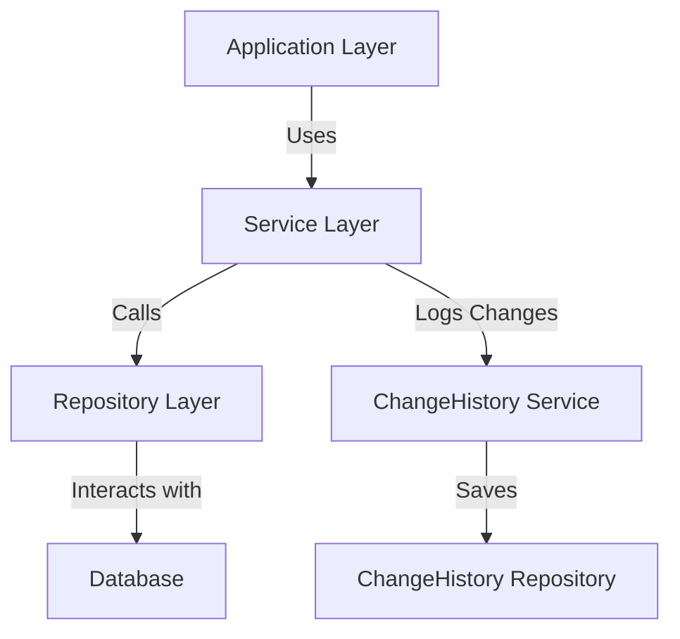

# JPA Auditing and Change History — Spring Boot

## Overview and scope

### Purpose
The purpose of this document is to establish standards for implementing JPA Auditing and Change History in Spring Boot applications at Xentic. This standard aims to ensure consistency, maintainability, and traceability of data changes across all services.

### Audience
This document is intended for:
- Software Engineers
- Architects
- DevOps Engineers
- Quality Assurance Teams
- Technical Leads

### Scope
This standard applies to all Spring Boot applications developed within Xentic that utilize JPA for data persistence. It covers:
- Configuration of JPA Auditing
- Implementation of change history tracking
- Best practices for auditing entities
- Integration with shared libraries

### Non-goals
This document does NOT cover:
- Non-JPA data access methods (e.g., JDBC, MyBatis)
- Frontend auditing mechanisms
- Third-party auditing libraries outside of the approved Xentic stack

### Glossary
| Term               | Definition                                                                 |
|--------------------|-----------------------------------------------------------------------------|
| JPA                | Java Persistence API, a specification for accessing, persisting, and managing data between Java objects and relational databases. |
| Auditing           | The process of tracking changes to data, including who made the changes and when. |
| Change History     | A record of all changes made to an entity, typically stored in a separate table. |
| Spring Boot        | A framework that simplifies the development of Java applications by providing pre-configured templates and dependencies. |

### How This Standard Fits the Xentic Platform
This standard is a critical component of the Xentic platform, as it aligns with our commitment to high-quality software development. By adhering to these guidelines, teams will:
- Ensure compliance with internal auditing requirements
- Enhance the traceability of data changes for debugging and reporting
- Facilitate easier maintenance and onboarding of new team members

### Configuration Example
To enable JPA Auditing, the following configuration should be added to the `application.yml` file:

```yaml
spring:
  jpa:
    properties:
      hibernate:
        global_generator:
          strategy: AUTO
  data:
    jpa:
      repositories:
        enabled: true
```

### Entity Example
An example of an audited entity in JPA:

```java
import org.springframework.data.annotation.CreatedDate;
import org.springframework.data.annotation.LastModifiedDate;
import org.springframework.data.jpa.domain.support.AuditingEntityListener;

import javax.persistence.*;

@Entity
@EntityListeners(AuditingEntityListener.class)
public class User {
    
    @Id
    @GeneratedValue(strategy = GenerationType.IDENTITY)
    private Long id;

    private String username;

    @CreatedDate
    private LocalDateTime createdDate;

    @LastModifiedDate
    private LocalDateTime lastModifiedDate;

    // Getters and Setters
}
```

By following these standards, Xentic aims to create a robust auditing framework that supports our evolving business needs while maintaining high standards of software quality and compliance.

## Standards and policies

1. **MUST** enable JPA Auditing by annotating the main application class with `@EnableJpaAuditing`. This is essential for tracking creation and modification timestamps.

   ```java
   import org.springframework.boot.SpringApplication;
   import org.springframework.boot.autoconfigure.SpringBootApplication;
   import org.springframework.data.jpa.config.EnableJpaAuditing;

   @SpringBootApplication
   @EnableJpaAuditing
   public class Application {
       public static void main(String[] args) {
           SpringApplication.run(Application.class, args);
       }
   }
   ```

2. **MUST** implement auditing fields in all entities that require tracking. At a minimum, each entity should include `@CreatedDate` and `@LastModifiedDate`.

3. **MUST NOT** use non-standard field names for auditing timestamps. Use `createdDate` and `lastModifiedDate` consistently across all entities.

4. **SHOULD** consider implementing a `@CreatedBy` and `@LastModifiedBy` fields for tracking user information. This requires a custom auditor aware implementation.

   ```java
   import org.springframework.data.annotation.CreatedBy;
   import org.springframework.data.annotation.LastModifiedBy;

   @CreatedBy
   private String createdBy;

   @LastModifiedBy
   private String lastModifiedBy;
   ```

5. **MUST** use a dedicated `ChangeHistory` entity to log changes made to audited entities. This entity should include fields for the entity ID, change type (CREATE, UPDATE, DELETE), timestamp, and user information.

   ```java
   import javax.persistence.*;

   @Entity
   public class ChangeHistory {
       
       @Id
       @GeneratedValue(strategy = GenerationType.IDENTITY)
       private Long id;

       private Long entityId;
       private String entityType;
       private String changeType; // CREATE, UPDATE, DELETE
       private LocalDateTime changeDate;
       private String changedBy;

       // Getters and Setters
   }
   ```

6. **MUST NOT** directly modify the auditing fields in the application code. These fields should only be managed by the JPA Auditing framework.

7. **SHOULD** configure the auditing fields to be automatically populated using Spring Security's authentication context, ensuring that the user information is captured accurately.

8. **MUST** create a service layer that handles the logic for persisting change history records whenever an entity is created, updated, or deleted.

   ```java
   @Service
   public class ChangeHistoryService {
       
       @Autowired
       private ChangeHistoryRepository changeHistoryRepository;

       public void logChange(Long entityId, String entityType, String changeType, String changedBy) {
           ChangeHistory changeHistory = new ChangeHistory();
           changeHistory.setEntityId(entityId);
           changeHistory.setEntityType(entityType);
           changeHistory.setChangeType(changeType);
           changeHistory.setChangeDate(LocalDateTime.now());
           changeHistory.setChangedBy(changedBy);
           changeHistoryRepository.save(changeHistory);
       }
   }
   ```

9. **MUST** create a repository interface for the `ChangeHistory` entity extending `JpaRepository` to facilitate CRUD operations.

   ```java
   import org.springframework.data.jpa.repository.JpaRepository;

   public interface ChangeHistoryRepository extends JpaRepository<ChangeHistory, Long> {
   }
   ```

10. **SHOULD** implement unit tests to verify that auditing functionality works as expected, ensuring that changes are logged correctly in the `ChangeHistory` table.

11. **MUST** document any custom implementations or modifications to the default auditing behavior in the project README or relevant documentation.

12. **SHOULD** regularly review and update the auditing policies to align with evolving business requirements and compliance regulations.

By adhering to these standards and policies, Xentic will ensure a robust and consistent approach to JPA Auditing and Change History across all Spring Boot applications.

## Architecture and design

The architecture for JPA Auditing and Change History in Spring Boot applications at Xentic is designed to provide a clear separation of concerns while ensuring data integrity and traceability. The following components are integral to this architecture:

### Component Diagram



### Data Flows

1. **Entity Creation/Update/Delete**:
   - The application layer receives requests to create, update, or delete entities.
   - The service layer processes these requests and invokes the appropriate repository methods.

2. **Auditing**:
   - Upon saving an entity, the JPA Auditing framework automatically populates the `createdDate`, `lastModifiedDate`, `createdBy`, and `lastModifiedBy` fields.
   - Changes are logged in the `ChangeHistory` entity through the `ChangeHistoryService`.

3. **Change History Logging**:
   - The service layer calls the `ChangeHistoryService` to log the changes made to the entity.
   - The `ChangeHistory` repository saves the log entry in the database.

### Integration Points

- **Spring Security**: Integration with Spring Security is essential for capturing the user information in the `@CreatedBy` and `@LastModifiedBy` fields. The security context must be accessible during auditing.
- **Database**: The application must connect to a relational database (e.g., PostgreSQL, MySQL) to persist both the audited entities and the change history records.

### Failure Domains

- **Database Connectivity**: If the database is unreachable, the application will not be able to persist any changes or log history, leading to potential data loss.
- **Auditing Framework**: Any misconfiguration in the JPA Auditing setup may result in missing or incorrect auditing information.
- **Service Layer Logic**: Bugs in the service layer could prevent the correct logging of changes, leading to incomplete audit trails.

### Configuration Example

In addition to the previous configuration, ensure that the `application.yml` includes the following properties for database connectivity:

```yaml
spring:
  datasource:
    url: jdbc:mysql://db.internal.xentic.io:3306/xentic_db
    username: xentic_user
    password: xentic_password
    driver-class-name: com.mysql.cj.jdbc.Driver
```

### Summary

By following the outlined architecture and design principles, Xentic ensures that the JPA Auditing and Change History implementation is robust, maintainable, and compliant with internal standards. This architecture not only enhances data traceability but also supports the organization's commitment to high-quality software development.

## Configuration reference

To configure JPA Auditing and Change History in your Spring Boot applications, the following settings are required. This includes configuration in `application.yml`, Terraform variables, and environment variables.

### application.yml

The `application.yml` file must be configured as follows:

```yaml
spring:
  jpa:
    properties:
      hibernate:
        global_generator:
          strategy: AUTO
    datasource:
      url: jdbc:mysql://db.internal.xentic.io:3306/xentic_db
      username: xentic_user
      password: xentic_password
      driver-class-name: com.mysql.cj.jdbc.Driver
  data:
    jpa:
      repositories:
        enabled: true
  audit:
    enabled: true
    change-history:
      enabled: true
```

### Terraform Configuration

To manage infrastructure as code, the following Terraform variables should be defined:

| Variable Name           | Default Value                      | Production Value                      |
|-------------------------|-----------------------------------|---------------------------------------|
| `db_url`                | `jdbc:mysql://localhost:3306/xentic_db` | `jdbc:mysql://db.internal.xentic.io:3306/xentic_db` |
| `db_username`           | `root`                            | `xentic_user`                        |
| `db_password`           | `password`                        | `xentic_password`                    |
| `audit_enabled`         | `false`                          | `true`                               |
| `change_history_enabled` | `false`                          | `true`                               |

### Environment Variables

Ensure the following environment variables are set for the application to run correctly:

| Environment Variable       | Default Value                | Production Value                |
|----------------------------|-----------------------------|---------------------------------|
| `SPRING_DATASOURCE_URL`    | `jdbc:mysql://localhost:3306/xentic_db` | `jdbc:mysql://db.internal.xentic.io:3306/xentic_db` |
| `SPRING_DATASOURCE_USERNAME`| `root`                     | `xentic_user`                  |
| `SPRING_DATASOURCE_PASSWORD`| `password`                 | `xentic_password`              |
| `SPRING_JPA_AUDIT_ENABLED`  | `false`                   | `true`                         |
| `SPRING_JPA_CHANGE_HISTORY_ENABLED`| `false`               | `true`                         |

### Additional Configuration

- **Database Connection Pooling**: It is recommended to configure connection pooling for better performance.

```yaml
spring:
  datasource:
    hikari:
      maximum-pool-size: 10
      minimum-idle: 2
      idle-timeout: 30000
```

- **Auditing Configuration**: Consider adding custom properties for auditing behavior.

```yaml
xentic:
  audit:
    log-level: INFO
    retention-period: 30 # days
```

By following these configuration guidelines, Xentic ensures that JPA Auditing and Change History are properly set up in all Spring Boot applications, enhancing data integrity and traceability.

## Implementation guide

To implement JPA Auditing and Change History in a Spring Boot application at Xentic, follow these detailed steps:

1. **Add Dependencies**: Ensure your `pom.xml` or `build.gradle` includes the necessary dependencies for Spring Data JPA and Spring Security.

   For Maven (`pom.xml`):

   ```xml
   <dependency>
       <groupId>org.springframework.boot</groupId>
       <artifactId>spring-boot-starter-data-jpa</artifactId>
   </dependency>
   <dependency>
       <groupId>org.springframework.boot</groupId>
       <artifactId>spring-boot-starter-security</artifactId>
   </dependency>
   ```

   For Gradle (`build.gradle`):

   ```groovy
   implementation 'org.springframework.boot:spring-boot-starter-data-jpa'
   implementation 'org.springframework.boot:spring-boot-starter-security'
   ```

2. **Enable JPA Auditing**: Add the `@EnableJpaAuditing` annotation to your main application class.

   ```java
   import org.springframework.boot.SpringApplication;
   import org.springframework.boot.autoconfigure.SpringBootApplication;
   import org.springframework.data.jpa.config.EnableJpaAuditing;

   @SpringBootApplication
   @EnableJpaAuditing
   public class Application {
       public static void main(String[] args) {
           SpringApplication.run(Application.class, args);
       }
   }
   ```

3. **Create the Auditing Entity**: Define an entity class that will hold the audit information.

   ```java
   import org.springframework.data.annotation.CreatedBy;
   import org.springframework.data.annotation.CreatedDate;
   import org.springframework.data.annotation.LastModifiedBy;
   import org.springframework.data.annotation.LastModifiedDate;
   import org.springframework.data.jpa.domain.support.AuditingEntityListener;

   import javax.persistence.*;
   import java.time.LocalDateTime;

   @Entity
   @EntityListeners(AuditingEntityListener.class)
   public class Auditable {

       @Id
       @GeneratedValue(strategy = GenerationType.IDENTITY)
       private Long id;

       @CreatedDate
       private LocalDateTime createdDate;

       @LastModifiedDate
       private LocalDateTime lastModifiedDate;

       @CreatedBy
       private String createdBy;

       @LastModifiedBy
       private String lastModifiedBy;

       // Getters and Setters
   }
   ```

4. **Implement the Change History Entity**: Define a `ChangeHistory` entity to track changes.

   ```java
   import javax.persistence.*;
   import java.time.LocalDateTime;

   @Entity
   public class ChangeHistory {

       @Id
       @GeneratedValue(strategy = GenerationType.IDENTITY)
       private Long id;

       private Long entityId;
       private String entityType;
       private String changeType;
       private LocalDateTime changeDate;
       private String changedBy;

       // Getters and Setters
   }
   ```

5. **Create the Change History Service**: Implement a service to log changes.

   ```java
   import org.springframework.beans.factory.annotation.Autowired;
   import org.springframework.stereotype.Service;

   @Service
   public class ChangeHistoryService {

       @Autowired
       private ChangeHistoryRepository changeHistoryRepository;

       public void logChange(Long entityId, String entityType, String changeType, String changedBy) {
           ChangeHistory changeHistory = new ChangeHistory();
           changeHistory.setEntityId(entityId);
           changeHistory.setEntityType(entityType);
           changeHistory.setChangeType(changeType);
           changeHistory.setChangeDate(LocalDateTime.now());
           changeHistory.setChangedBy(changedBy);
           changeHistoryRepository.save(changeHistory);
       }
   }
   ```

6. **Define the Change History Repository**: Create a repository interface for the `ChangeHistory` entity.

   ```java
   import org.springframework.data.jpa.repository.JpaRepository;

   public interface ChangeHistoryRepository extends JpaRepository<ChangeHistory, Long> {
   }
   ```

7. **Integrate Auditing with Security**: Ensure the auditing fields are populated with the current user's information.

   ```java
   import org.springframework.security.core.context.SecurityContextHolder;
   import org.springframework.stereotype.Component;

   @Component
   public class AuditorAwareImpl implements AuditorAware<String> {

       @Override
       public Optional<String> getCurrentAuditor() {
           return Optional.ofNullable(SecurityContextHolder.getContext().getAuthentication().getName());
       }
   }
   ```

8. **Configure Spring Security**: Ensure your security configuration allows for user authentication.

   ```java
   import org.springframework.context.annotation.Configuration;
   import org.springframework.security.config.annotation.web.builders.HttpSecurity;
   import org.springframework.security.config.annotation.web.configuration.EnableWebSecurity;
   import org.springframework.security.config.annotation.web.configuration.WebSecurityConfigurerAdapter;

   @Configuration
   @EnableWebSecurity
   public class SecurityConfig extends WebSecurityConfigurerAdapter {

       @Override
       protected void configure(HttpSecurity http) throws Exception {
           http.authorizeRequests()
               .anyRequest().authenticated()
               .and()
               .httpBasic();
       }
   }
   ```

9. **Test the Implementation**: Write unit tests to ensure that changes are logged correctly.

   ```java
   import static org.mockito.Mockito.*;

   @SpringBootTest
   public class ChangeHistoryServiceTest {

       @Autowired
       private ChangeHistoryService changeHistoryService;

       @MockBean
       private ChangeHistoryRepository changeHistoryRepository;

       @Test
       public void testLogChange() {
           changeHistoryService.logChange(1L, "User", "CREATE", "testUser");
           verify(changeHistoryRepository, times(1)).save(any(ChangeHistory.class));
       }
   }
   ```

By following these steps, you will have a robust implementation of JPA Auditing and Change History in your Spring Boot application, ensuring that all changes to entities are tracked effectively.

## Security requirements

To ensure the security of JPA Auditing and Change History in Spring Boot applications at Xentic, the following security requirements must be adhered to:

### Threat Model Summary

- **Unauthorized Access**: Prevent unauthorized users from accessing sensitive data or operations.
- **Data Integrity**: Ensure that audit logs cannot be tampered with after they are created.
- **Confidentiality**: Protect sensitive data from exposure during transmission and storage.
- **Replay Attacks**: Implement mechanisms to prevent replay attacks on audit logs.

### Authentication and Authorization

- **Authentication**: All users must be authenticated before accessing any endpoints. Use Spring Security to enforce authentication.
- **Authorization**: Implement role-based access control (RBAC) to restrict access to auditing features. Only users with appropriate roles should be able to view or modify audit logs.

```java
@Override
protected void configure(HttpSecurity http) throws Exception {
    http.authorizeRequests()
        .antMatchers("/audit/**").hasRole("ADMIN") // Only admins can access audit logs
        .anyRequest().authenticated()
        .and()
        .httpBasic();
}
```

### Secrets Management

- **Environment Variables**: Secrets such as database passwords must be stored in environment variables and not hardcoded in the application code.
- **Secret Management Tools**: Utilize tools like HashiCorp Vault or AWS Secrets Manager for managing sensitive information securely.

```yaml
spring:
  datasource:
    password: ${DB_PASSWORD} # Use environment variable for DB password
```

### Input Validation

- **Validation Framework**: Use Spring's validation framework to validate incoming data. This helps prevent injection attacks and ensures data integrity.
- **Sanitization**: Sanitize inputs to remove any potentially harmful characters or scripts.

```java
import javax.validation.constraints.NotNull;

public class AuditRequest {

    @NotNull(message = "Entity ID must not be null")
    private Long entityId;

    @NotNull(message = "Change type must not be null")
    private String changeType;

    // Getters and Setters
}
```

### Audit Logging

- **Log Format**: Audit logs must include the following information:
  - Timestamp of the change
  - User who made the change
  - Entity affected
  - Type of change (CREATE, UPDATE, DELETE)
  
- **Log Storage**: Store audit logs in a secure and tamper-proof manner. Consider using a dedicated logging service or database table.

```sql
CREATE TABLE change_history (
    id BIGINT AUTO_INCREMENT PRIMARY KEY,
    entity_id BIGINT NOT NULL,
    entity_type VARCHAR(255) NOT NULL,
    change_type VARCHAR(50) NOT NULL,
    change_date TIMESTAMP DEFAULT CURRENT_TIMESTAMP,
    changed_by VARCHAR(255) NOT NULL
);
```

- **Log Retention Policy**: Define a retention policy for audit logs to ensure that logs are kept for a specific period and then securely deleted.

| Log Type        | Retention Period |
|------------------|------------------|
| Audit Logs       | 30 days          |
| Change History   | 90 days          |

### Security Best Practices

- **Use HTTPS**: Ensure that all communications are encrypted using HTTPS to protect data in transit.
- **Regular Security Audits**: Conduct regular security audits and penetration testing to identify and mitigate vulnerabilities.
- **Update Dependencies**: Regularly update all dependencies to their latest versions to protect against known vulnerabilities.

By adhering to these security requirements, Xentic can ensure that JPA Auditing and Change History are implemented securely, protecting sensitive information and maintaining data integrity.

## Testing strategy

To ensure the reliability and correctness of JPA Auditing and Change History implementations in Spring Boot applications at Xentic, a comprehensive testing strategy must be employed. This strategy includes unit tests, integration tests, and contract tests, with specific coverage targets.

### Testing Types

1. **Unit Tests**: 
   - Focus on testing individual components in isolation.
   - Use mocking frameworks (e.g., Mockito) to simulate dependencies.

2. **Integration Tests**: 
   - Test the interaction between components and with external systems (e.g., databases).
   - Utilize Spring's testing support to load application context.

3. **Contract Tests**: 
   - Validate that the service contracts between microservices are adhered to.
   - Ensure that changes in one service do not break the expected behavior of another.

### Coverage Targets

- **Unit Test Coverage**: Minimum of 80% code coverage for all classes.
- **Integration Test Coverage**: Ensure critical paths are covered, aiming for at least 70% coverage.
- **Contract Test Coverage**: All public APIs must have associated contract tests.

### Example Test Classes

#### Unit Test Example

```java
import static org.mockito.Mockito.*;
import static org.junit.jupiter.api.Assertions.*;
import org.junit.jupiter.api.Test;
import org.mockito.InjectMocks;
import org.mockito.Mock;
import org.mockito.junit.jupiter.MockitoExtension;
import org.junit.jupiter.api.extension.ExtendWith;

@ExtendWith(MockitoExtension.class)
public class ChangeHistoryServiceTest {

    @InjectMocks
    private ChangeHistoryService changeHistoryService;

    @Mock
    private ChangeHistoryRepository changeHistoryRepository;

    @Test
    public void testLogChange() {
        changeHistoryService.logChange(1L, "User", "CREATE", "testUser");
        verify(changeHistoryRepository, times(1)).save(any(ChangeHistory.class));
    }

    @Test
    public void testLogChangeWithNullValues() {
        assertThrows(NullPointerException.class, () -> {
            changeHistoryService.logChange(null, null, null, null);
        });
    }
}
```

#### Integration Test Example

```java
import static org.springframework.test.web.servlet.request.MockMvcRequestBuilders.post;
import static org.springframework.test.web.servlet.result.MockMvcResultMatchers.status;
import org.junit.jupiter.api.BeforeEach;
import org.junit.jupiter.api.Test;
import org.springframework.beans.factory.annotation.Autowired;
import org.springframework.boot.test.autoconfigure.web.servlet.AutoConfigureMockMvc;
import org.springframework.boot.test.context.SpringBootTest;
import org.springframework.test.web.servlet.MockMvc;

@SpringBootTest
@AutoConfigureMockMvc
public class ChangeHistoryControllerIT {

    @Autowired
    private MockMvc mockMvc;

    @BeforeEach
    public void setup() {
        // Setup code if needed
    }

    @Test
    public void testCreateChangeHistory() throws Exception {
        mockMvc.perform(post("/api/change-history")
                .contentType("application/json")
                .content("{\"entityId\":1,\"entityType\":\"User\",\"changeType\":\"CREATE\",\"changedBy\":\"testUser\"}"))
                .andExpect(status().isCreated());
    }
}
```

#### Contract Test Example

Using a tool like Pact, you can define consumer-driven contracts:

```groovy
// consumer-pact.groovy
pact {
    consumer 'ChangeHistoryServiceConsumer'
    provider 'ChangeHistoryServiceProvider'

    request {
        method 'POST'
        path '/api/change-history'
        body([
            entityId  : 1,
            entityType: 'User',
            changeType: 'CREATE',
            changedBy  : 'testUser'
        ])
        headers {
            contentType 'application/json'
        }
    }

    response {
        status 201
    }
}
```

### Summary

By implementing a robust testing strategy that includes unit, integration, and contract tests, Xentic can ensure that the JPA Auditing and Change History functionality is reliable, maintainable, and secure. The established coverage targets will help maintain high code quality and facilitate ongoing development.

## Observability and operations

To ensure the effective observability and operational management of JPA Auditing and Change History in Spring Boot applications at Xentic, the following practices must be implemented:

### Metrics

- **Application Metrics**: Utilize Micrometer to capture and expose application metrics such as:
  - Number of changes logged
  - Response times for audit-related endpoints
  - Error rates for audit operations

```yaml
management:
  metrics:
    export:
      prometheus:
        enabled: true
```

- **Database Metrics**: Monitor database performance metrics, including:
  - Query execution times
  - Connection pool usage
  - Slow query logs

### Logging

- **Structured Logging**: Implement structured logging using SLF4J and Logback to ensure logs are machine-readable. Include relevant fields such as:
  - Timestamp
  - Log level
  - User ID
  - Entity type
  - Change type

```xml
<configuration>
    <appender name="FILE" class="ch.qos.logback.core.FileAppender">
        <file>logs/audit.log</file>
        <encoder>
            <pattern>%d{yyyy-MM-dd HH:mm:ss} [%thread] %-5level %logger{36} - %msg%n</pattern>
        </encoder>
    </appender>
    <root level="INFO">
        <appender-ref ref="FILE" />
    </root>
</configuration>
```

### Traces

- **Distributed Tracing**: Implement distributed tracing using Spring Cloud Sleuth and Zipkin to track requests across microservices. This allows for the identification of bottlenecks in the audit logging process.

```yaml
spring:
  sleuth:
    sampler:
      probability: 1.0 # Sample all traces for auditing
```

### Dashboards

- **Monitoring Dashboards**: Set up dashboards using Grafana or Kibana to visualize application metrics and logs. Key metrics to display include:
  - Total changes logged over time
  - Error rates for audit operations
  - Latency for audit-related requests

| Dashboard Component   | Description                           |
|-----------------------|---------------------------------------|
| Changes Logged        | Time series graph of changes logged   |
| Error Rate            | Pie chart of error rates by endpoint   |
| Latency               | Histogram of request latencies         |

### Alerts

- **Alerting Strategy**: Configure alerts for critical metrics to ensure timely response to issues:
  - Alert on high error rates (e.g., > 5% error rate for audit endpoints)
  - Alert on slow response times (e.g., > 500 ms for audit logging requests)

```yaml
alerting:
  rules:
    - alert: HighErrorRate
      expr: sum(rate(http_server_requests_seconds_count{uri=~"/audit/.*"}[5m])) by (status) > 0.05
      for: 5m
      labels:
        severity: critical
      annotations:
        summary: "High error rate detected"
        description: "Error rate exceeds 5% for audit endpoints."
```

### SLOs (Service Level Objectives)

- **Define SLOs**: Establish SLOs for audit logging services to ensure reliability:
  - **Availability**: 99.9% uptime for audit logging endpoints.
  - **Latency**: 95th percentile response time < 200 ms for audit logging requests.

### On-call Runbook Steps

In the event of an issue with JPA Auditing and Change History, the following on-call runbook steps MUST be followed:

1. **Identify the Incident**:
   - Check monitoring dashboards for alerts related to audit logging.
   - Review logs for any anomalies or error messages.

2. **Assess Impact**:
   - Determine the scope of the issue (e.g., affected services, number of users impacted).
   - Notify relevant stakeholders of the incident.

3. **Investigate**:
   - Analyze recent changes to the application or infrastructure.
   - Check database performance metrics for any anomalies.

4. **Mitigate**:
   - If necessary, roll back recent changes that may have caused the issue.
   - Increase logging verbosity temporarily to gather more information.

5. **Resolve**:
   - Implement a fix and validate that the issue is resolved.
   - Monitor the system to ensure stability.

6. **Postmortem**:
   - Conduct a postmortem analysis to identify root causes and preventive measures.
   - Update documentation and runbooks based on findings.

By adhering to these observability and operational practices, Xentic can ensure that JPA Auditing and Change History functionality is effectively monitored, maintained, and improved over time.

## Migration and versioning

To maintain a robust and scalable JPA Auditing and Change History system, Xentic must implement a structured migration and versioning strategy. This ensures that the application evolves without breaking existing functionality and allows for smooth transitions between versions.

### Upgrade Paths

- **Major Version Upgrades**: 
  - MUST include breaking changes and require thorough testing.
  - MUST provide a migration guide detailing changes and how to adapt existing code.
  
- **Minor Version Upgrades**: 
  - SHOULD introduce new features and enhancements without breaking existing functionality.
  - MUST maintain backward compatibility with previous minor versions.

- **Patch Version Upgrades**: 
  - MUST only include bug fixes and security patches.
  - SHOULD NOT introduce new features or breaking changes.

### Deprecation Policy

- **Deprecation Notices**: 
  - MUST be clearly documented in the codebase and release notes.
  - MUST provide a timeline for removal in future releases.

- **Deprecation Warnings**: 
  - SHOULD be logged to alert developers of deprecated features.
  - MUST NOT remove deprecated features until at least one major version after deprecation.

### Backward Compatibility

- **API Versioning**: 
  - MUST use versioned API endpoints (e.g., `/api/v1/change-history`) to allow clients to migrate at their own pace.
  
- **Database Schema Changes**: 
  - MUST use non-destructive changes (e.g., adding columns) to maintain compatibility.
  - SHOULD provide migration scripts for schema updates.

#### Example Migration Script (SQL)

```sql
ALTER TABLE change_history ADD COLUMN changed_at TIMESTAMP DEFAULT CURRENT_TIMESTAMP;

-- Migration for a new column in the change history table
CREATE TABLE change_history_v2 (
    id BIGINT PRIMARY KEY AUTO_INCREMENT,
    entity_id BIGINT NOT NULL,
    entity_type VARCHAR(255) NOT NULL,
    change_type VARCHAR(50) NOT NULL,
    changed_by VARCHAR(255) NOT NULL,
    changed_at TIMESTAMP DEFAULT CURRENT_TIMESTAMP,
    version INT DEFAULT 2
);
```

### Rollback Procedures

- **Rollback Strategy**: 
  - MUST have a clear rollback plan for each deployment that includes:
    - Database rollback scripts.
    - Application rollback instructions.
  
- **Testing Rollbacks**: 
  - SHOULD include rollback testing in the CI/CD pipeline to ensure that rollbacks can be performed without data loss.

#### Example Rollback Script (SQL)

```sql
-- Rollback script to remove the newly added column
ALTER TABLE change_history DROP COLUMN changed_at;

-- Rollback to previous version of the change history table
DROP TABLE IF EXISTS change_history_v2;
```

### Versioning Strategy

| Version Type         | Description                                             | Policy                                    |
|----------------------|---------------------------------------------------------|-------------------------------------------|
| Major                | Breaking changes that require migration                  | MUST provide migration guide               |
| Minor                | New features, non-breaking changes                      | SHOULD maintain backward compatibility     |
| Patch                | Bug fixes and security patches                           | MUST NOT introduce breaking changes        |
| Deprecated           | Features that will be removed in future versions        | MUST document and provide a removal timeline |

### Conclusion

By adhering to a strict migration and versioning policy, Xentic can ensure that the JPA Auditing and Change History system remains stable, reliable, and easy to maintain. Proper documentation and clear upgrade paths will facilitate smoother transitions for all stakeholders involved.

## FAQ, anti-patterns, and checklists

### FAQ

1. **What is JPA Auditing?**
   - JPA Auditing is a feature that automatically tracks and records changes to entity objects in a database, including who made the change and when it occurred.

2. **How do I enable JPA Auditing in my Spring Boot application?**
   - You MUST annotate your main application class with `@EnableJpaAuditing` and configure the auditing fields in your entity classes.

   ```java
   @EnableJpaAuditing
   public class Application {
       public static void main(String[] args) {
           SpringApplication.run(Application.class, args);
       }
   }
   ```

3. **What annotations are used for auditing fields?**
   - You SHOULD use `@CreatedDate`, `@LastModifiedDate`, `@CreatedBy`, and `@LastModifiedBy` annotations on the respective fields in your entity classes.

   ```java
   @Entity
   public class User {
       @Id
       @GeneratedValue(strategy = GenerationType.IDENTITY)
       private Long id;

       @CreatedDate
       private LocalDateTime createdDate;

       @LastModifiedDate
       private LocalDateTime lastModifiedDate;

       @CreatedBy
       private String createdBy;

       @LastModifiedBy
       private String lastModifiedBy;
   }
   ```

4. **Can I customize the auditing fields?**
   - Yes, you MUST implement a custom `AuditorAware` bean to provide the current user information.

   ```java
   @Bean
   public AuditorAware<String> auditorProvider() {
       return new AuditorAwareImpl(); // Implement this class to retrieve the current user
   }
   ```

5. **What database support is required for JPA Auditing?**
   - JPA Auditing works with any database supported by JPA. Ensure your database is configured correctly in `application.yml`.

6. **How do I handle auditing for soft deletes?**
   - You MUST implement a soft delete strategy by adding a boolean `deleted` field and updating it instead of removing the record from the database.

7. **What are common performance issues with JPA Auditing?**
   - Performance can degrade with excessive logging or large audit tables. You SHOULD periodically archive old audit records.

8. **Is it possible to disable auditing for specific entities?**
   - Yes, you MUST NOT annotate the entity with auditing annotations if you do not want it to be audited.

9. **How do I test JPA Auditing functionality?**
   - You SHOULD write integration tests that verify the auditing behavior by checking the audit fields after performing create, update, and delete operations.

10. **What should I do if I encounter issues with JPA Auditing?**
    - Review your configuration for `@EnableJpaAuditing`, check the database schema for audit fields, and ensure your `AuditorAware` implementation is correctly returning the current user.

### Anti-Patterns

| Anti-Pattern                          | Description                                           | Recommendation                                    |
|---------------------------------------|-------------------------------------------------------|--------------------------------------------------|
| Overusing Auditing                    | Auditing every field in every entity can lead to bloated audit logs. | Audit only necessary fields.                      |
| Not Archiving Audit Logs              | Keeping all audit logs indefinitely can lead to performance issues. | Implement a strategy to archive old logs.        |
| Ignoring Performance Impacts          | Not considering the performance impact of auditing on high-traffic applications. | Monitor performance and optimize as needed.      |
| Hardcoding User Information            | Hardcoding current user information in the auditing fields. | Use a dynamic approach to retrieve user info.    |
| Using Non-Standard Naming Conventions | Deviating from standard naming conventions for audit fields. | Follow established naming conventions for clarity.|

### Pre-Merge Checklist

- [ ] Code adheres to Xentic's coding standards.
- [ ] JPA Auditing is correctly configured and annotated.
- [ ] All new entities have appropriate audit fields.
- [ ] Unit tests cover audit functionality.
- [ ] Integration tests validate auditing behavior.
- [ ] Documentation is updated to reflect changes.

### Production Checklist

- [ ] All configurations are validated in the production environment.
- [ ] Database migrations for auditing fields are applied.
- [ ] Monitoring for audit-related metrics is set up.
- [ ] Alerts for audit logging errors are configured.
- [ ] Backup strategies for audit logs are in place.
- [ ] Rollback procedures are documented and tested.
