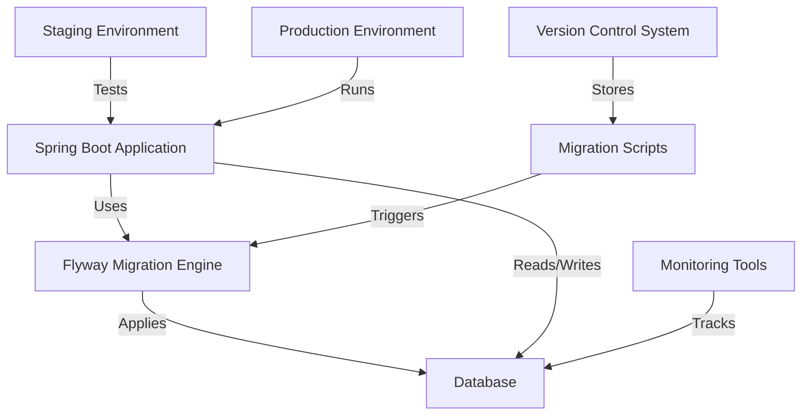

# Database Migration Standards — Flyway + Spring Boot

## Overview and scope

The purpose of this document is to establish the standards and best practices for database migrations using Flyway in conjunction with Spring Boot at Xentic. This standard aims to provide a clear and consistent approach to managing database schema changes across all services within the organization. 

### Audience
This document is intended for:
- Software Engineers
- Database Administrators
- DevOps Engineers
- Technical Leads

### Scope
This standard applies to all Spring Boot services developed and maintained by Xentic. It encompasses:
- Creation and management of database migrations
- Naming conventions for migration files
- Rules for writing and applying migrations
- Best practices for maintaining database integrity and performance

### Non-goals
This document does not cover:
- Database design principles beyond migration management
- Specific application logic or business rules related to database interactions
- Migration strategies for databases other than those managed through Flyway

### Glossary
| Term               | Definition                                                                 |
|--------------------|-----------------------------------------------------------------------------|
| Flyway             | A database migration tool that enables version control for database schemas.|
| Migration          | A set of changes applied to the database schema, typically represented by SQL scripts.|
| Baseline           | The initial state of the database schema before migrations are applied.      |
| UUID               | Universally Unique Identifier, a 128-bit label used for information in computer systems.|
| TIMESTAMPTZ        | A data type in PostgreSQL that stores the date and time with time zone information.|

### How this standard fits the Xentic platform
The database migration standards outlined in this document are integral to maintaining the reliability and consistency of Xentic's services. By adhering to these standards, teams can ensure that:
- All database changes are version-controlled and traceable.
- Migrations can be applied consistently across different environments (development, staging, production).
- The integrity of the database schema is preserved, reducing the risk of conflicts and errors during deployments.

### Tool
All Spring Boot services MUST use Flyway for schema migrations. Liquibase is NOT approved.

### Naming Convention
All migration files MUST be placed in the `db/migration/` directory and follow the naming convention:

```
db/migration/
  V1__create_users_table.sql
  V2__add_email_index.sql
  V3__create_orders_table.sql
  R__refresh_reporting_view.sql
```

Format: `V{version}__{description}.sql` (two underscores).

### Rules
- Migrations MUST NOT modify an already-applied migration file.
- All tables MUST include the following columns:
  - `id UUID PRIMARY KEY DEFAULT gen_random_uuid()`
  - `created_at TIMESTAMPTZ NOT NULL DEFAULT now()`
  - `updated_at TIMESTAMPTZ NOT NULL DEFAULT now()`
- Use `TEXT` data type over `VARCHAR(n)` unless a hard length constraint is required.

### Example Migration
```sql
-- V1__create_users_table.sql
-- undo: DROP TABLE users;

CREATE TABLE users (
    id          UUID        PRIMARY KEY DEFAULT gen_random_uuid(),
    email       TEXT        NOT NULL UNIQUE,
    full_name   TEXT        NOT NULL,
    role        TEXT        NOT NULL DEFAULT 'USER',
    is_active   BOOLEAN     NOT NULL DEFAULT TRUE,
    created_at  TIMESTAMPTZ NOT NULL DEFAULT now(),
    updated_at  TIMESTAMPTZ NOT NULL DEFAULT now()
);

CREATE INDEX idx_users_email ON users(email);

CREATE TRIGGER set_updated_at
    BEFORE UPDATE ON users
    FOR EACH ROW EXECUTE FUNCTION trigger_set_updated_at();
```

### Baseline in Production
To ensure a smooth migration process, the following configuration MUST be included in the application properties:

```yaml
spring:
  flyway:
    baseline-on-migrate: true
    baseline-version: 0
```

By following these standards, Xentic aims to streamline database management processes and enhance the overall quality of our software products.

## Standards and policies

1. **MUST** use Flyway for all database migrations in Spring Boot services. Liquibase and other migration tools are NOT approved.

2. **MUST** store all migration scripts in the `db/migration/` directory within the service's resource folder. 

3. **MUST** adhere to the naming convention for migration files: `V{version}__{description}.sql`. Each migration file name MUST begin with a version number followed by two underscores and a descriptive name.

4. **MUST NOT** modify an already-applied migration file. Once a migration has been executed, it should remain unchanged to ensure consistency across environments.

5. **MUST** include a `baseline` migration in production environments. This migration MUST set the baseline version to `0` and enable `baseline-on-migrate` in the application properties.

6. **SHOULD** use descriptive names for migration files that clearly indicate the purpose of the migration. For example, use `V2__add_email_index.sql` instead of `V2__change.sql`.

7. **MUST** ensure that all tables include the following columns:
   - `id UUID PRIMARY KEY DEFAULT gen_random_uuid()`
   - `created_at TIMESTAMPTZ NOT NULL DEFAULT now()`
   - `updated_at TIMESTAMPTZ NOT NULL DEFAULT now()`

8. **SHOULD** use `TEXT` data type over `VARCHAR(n)` unless a hard length constraint is required, to maintain flexibility in data storage.

9. **MUST** include appropriate indexes on columns that will be frequently queried or used in joins. For instance, create an index on the `email` column in the `users` table.

10. **MUST** implement triggers for updating timestamps. A trigger to set the `updated_at` column on updates MUST be included in all tables.

11. **SHOULD** review and test migration scripts in a development environment before applying them to production. This helps catch potential issues early.

12. **MUST** document any changes made in migrations using comments at the top of the SQL file. For example:
    ```sql
    -- V2__add_email_index.sql
    -- Added index on email column for faster lookups
    ```

13. **MUST NOT** include business logic in migration scripts. Migrations should only focus on schema changes.

14. **SHOULD** use transactions in migration scripts where possible to ensure atomicity. If a migration fails, the database should be rolled back to its previous state.

15. **MUST** maintain a `flyway_schema_history` table that Flyway uses to track applied migrations. This table is automatically managed by Flyway.

16. **MUST** ensure that migrations are idempotent whenever possible. Running the same migration multiple times should not cause errors.

17. **SHOULD** use environment-specific configurations for database connections to avoid hardcoding sensitive information. Use Spring profiles to manage these configurations.

18. **MUST** ensure that all migrations are tested in a staging environment that mirrors production before being applied to the live database.

19. **MUST NOT** include any sensitive data in migration scripts. All data should be anonymized or obfuscated if necessary.

20. **SHOULD** regularly review and refactor migration scripts to improve performance and maintainability, especially for large or complex migrations.

By adhering to these standards and policies, Xentic aims to ensure a robust and reliable approach to database migrations, fostering consistency and reducing the risk of errors across all services.

## Architecture and design

The architecture for database migrations at Xentic using Flyway and Spring Boot is designed to ensure a clear, maintainable, and robust process. The following section outlines the component diagram, data flows, integration points, and failure domains.

### Component Diagram



### Data Flows

1. **Migration Script Creation**: 
   - Developers create migration scripts in the `db/migration/` directory.
   - Scripts are committed to the version control system (e.g., Git).

2. **Migration Execution**:
   - Upon application startup, Flyway checks the `flyway_schema_history` table for applied migrations.
   - If new migrations are detected, Flyway applies them to the database in the order of their version numbers.

3. **Database Interaction**:
   - The Spring Boot application interacts with the database to perform CRUD operations.
   - All interactions are logged for monitoring and auditing purposes.

4. **Monitoring**:
   - Monitoring tools track database performance and migration success/failure.
   - Alerts are generated for any migration failures.

### Integration Points

- **Flyway and Spring Boot**: Flyway is integrated into the Spring Boot lifecycle, allowing automatic migration execution on application startup.
- **Version Control System**: Migration scripts are stored in a version control system, ensuring that all changes are tracked and auditable.
- **Monitoring Tools**: Integrate with tools like Prometheus or Grafana to monitor the health of the database and migration processes.

### Failure Domains

1. **Migration Failures**:
   - If a migration fails, Flyway will roll back the changes if the migration script is wrapped in a transaction.
   - The application logs the failure, and alerts are sent to the development team for resolution.

2. **Database Connection Issues**:
   - If the application cannot connect to the database, it should fail gracefully, providing meaningful error messages to the user and logging the error.

3. **Version Conflicts**:
   - If two migration scripts are created with the same version number, Flyway will throw an error. Developers MUST ensure unique version numbers for each migration.

4. **Data Integrity Issues**:
   - Migrations that violate data integrity constraints (e.g., foreign key violations) will fail. Proper testing in staging environments is essential to catch these issues before production deployment.

### Summary

By adhering to the architecture and design standards outlined above, Xentic ensures that database migrations are managed effectively, reducing the risk of errors and maintaining the integrity of the database schema. This structured approach facilitates collaboration among development teams and enhances the overall reliability of our services.

## Configuration reference

To effectively manage database migrations using Flyway in Spring Boot applications, the following configuration settings MUST be adhered to. This section provides the necessary configurations in `application.yml`, Terraform, and environment variables with default and production values.

### application.yml Configuration

The `application.yml` file should include the following Flyway configurations:

```yaml
spring:
  datasource:
    url: jdbc:postgresql://db.internal.xentic.io:5432/mydatabase
    username: ${DB_USERNAME}
    password: ${DB_PASSWORD}
  flyway:
    enabled: true
    baseline-on-migrate: true
    baseline-version: 0
    locations:
      - classpath:db/migration
    placeholders:
      placeholder1: value1
      placeholder2: value2
```

### Terraform Configuration

When deploying the database infrastructure, the following Terraform configuration MUST be used to set up the PostgreSQL database and user:

```hcl
resource "postgresql_database" "mydatabase" {
  name     = "mydatabase"
  owner    = postgresql_role.myuser.name
  provider = postgresql
}

resource "postgresql_role" "myuser" {
  name     = var.db_username
  password = var.db_password
  login    = true
  provider = postgresql
}

resource "postgresql_grant" "myuser_access" {
  database = postgresql_database.mydatabase.name
  role     = postgresql_role.myuser.name
  privileges = ["ALL"]
  provider = postgresql
}
```

### Environment Variables

The following environment variables MUST be set for the application to connect to the database. Default values can be configured for development, while production values should be securely managed:

| Variable Name      | Default Value              | Production Value             |
|--------------------|----------------------------|-------------------------------|
| `DB_URL`           | `jdbc:postgresql://localhost:5432/mydatabase` | `jdbc:postgresql://db.internal.xentic.io:5432/mydatabase` |
| `DB_USERNAME`      | `dev_user`                 | `prod_user`                  |
| `DB_PASSWORD`      | `dev_password`             | `secure_production_password` |

### Additional Configuration Options

- **Flyway Migration Timeout**: Configure a timeout for migrations to prevent long-running operations:

```yaml
spring:
  flyway:
    connect-retries: 3
    connect-timeout: 30
    migration-timeout: 600
```

- **Logging**: Enable detailed logging for Flyway migrations to facilitate troubleshooting:

```yaml
logging:
  level:
    org.flywaydb: DEBUG
```

By following these configuration guidelines, Xentic ensures that database migrations are properly managed and executed, enhancing the reliability and maintainability of our applications.

## Implementation guide

To implement database migrations using Flyway with Spring Boot at Xentic, follow the step-by-step guide below. This guide will cover the creation of migration scripts, configuration of the Spring Boot application, and execution of the migrations.

### Step 1: Create Migration Scripts

Migration scripts should be placed in the `src/main/resources/db/migration` directory. Each script must follow the naming convention `V<version>__<description>.sql`. For example:

1. **Create a new migration script**: `V1__create_users_table.sql`

```sql
-- V1__create_users_table.sql
-- Created users table with necessary fields
CREATE TABLE users (
    id SERIAL PRIMARY KEY,
    username VARCHAR(50) NOT NULL UNIQUE,
    email VARCHAR(100) NOT NULL UNIQUE,
    created_at TIMESTAMP DEFAULT CURRENT_TIMESTAMP,
    updated_at TIMESTAMP DEFAULT CURRENT_TIMESTAMP ON UPDATE CURRENT_TIMESTAMP
);
```

2. **Add another migration script**: `V2__add_email_index.sql`

```sql
-- V2__add_email_index.sql
-- Added index on email column for faster lookups
CREATE INDEX idx_users_email ON users(email);
```

### Step 2: Configure Spring Boot Application

Ensure that your Spring Boot application is configured to use Flyway. Update the `application.yml` file as follows:

```yaml
spring:
  datasource:
    url: jdbc:postgresql://db.internal.xentic.io:5432/mydatabase
    username: ${DB_USERNAME}
    password: ${DB_PASSWORD}
  flyway:
    enabled: true
    baseline-on-migrate: true
    baseline-version: 0
    locations:
      - classpath:db/migration
    placeholders:
      placeholder1: value1
      placeholder2: value2
```

### Step 3: Add Flyway Dependency

Ensure that your `pom.xml` includes the Flyway dependency. Add the following dependency if it is not already present:

```xml
<dependency>
    <groupId>org.flywaydb</groupId>
    <artifactId>flyway-core</artifactId>
</dependency>
```

### Step 4: Application Properties for Different Environments

Utilize Spring profiles to manage different configurations for development and production. Create `application-dev.yml` and `application-prod.yml` files with appropriate settings. For example:

**application-dev.yml**

```yaml
spring:
  datasource:
    url: jdbc:postgresql://localhost:5432/mydatabase
    username: dev_user
    password: dev_password
```

**application-prod.yml**

```yaml
spring:
  datasource:
    url: jdbc:postgresql://db.internal.xentic.io:5432/mydatabase
    username: prod_user
    password: secure_production_password
```

### Step 5: Running Migrations

When the Spring Boot application starts, Flyway will automatically check for new migration scripts in the specified locations and apply them in order. To run the application, execute the following command:

```bash
./mvnw spring-boot:run
```

### Step 6: Verify Migration Status

After running the application, you can verify the status of the migrations by querying the `flyway_schema_history` table:

```sql
SELECT * FROM flyway_schema_history;
```

This table will show you which migrations have been applied, their version numbers, and timestamps.

### Step 7: Handling Migration Failures

In case of a migration failure, Flyway will log the error and roll back the changes if the migration is wrapped in a transaction. Review the logs for details on the failure. For example, if you encounter a foreign key violation, you might see logs similar to:

```
ERROR: Migration V2__add_email_index.sql failed
Reason: org.flywaydb.core.api.migration.exception.FlywayMigrateException: Migration failed
```

### Best Practices

- **MUST** ensure all migration scripts are versioned correctly and tested in a staging environment before production deployment.
- **SHOULD** include a rollback strategy in case of migration failures.
- **MUST NOT** include sensitive data within migration scripts.

By following this implementation guide, Xentic ensures a structured and reliable approach to database migrations using Flyway and Spring Boot, promoting consistency and reducing the risk of errors across all services.

## Security requirements

To ensure the security of database migrations at Xentic, the following security requirements MUST be adhered to:

### Threat Model Summary

- **Data Breach**: Unauthorized access to sensitive data during migration.
- **SQL Injection**: Malicious input leading to unauthorized database operations.
- **Denial of Service (DoS)**: Migration scripts that consume excessive resources, impacting service availability.
- **Insider Threats**: Malicious actions by authorized users during migration processes.

### Authentication and Authorization (Authn/Z)

- All database access MUST be authenticated using secure credentials.
- Database roles and permissions MUST be strictly defined to limit access based on the principle of least privilege.
- Use environment-specific credentials to separate development, staging, and production access.

| Environment | Username      | Role        | Permissions            |
|-------------|---------------|-------------|------------------------|
| Development | dev_user      | Developer   | Read/Write             |
| Staging     | staging_user  | Tester      | Read                   |
| Production   | prod_user     | Administrator| Read/Write/Execute     |

### Secrets Management

- Database credentials MUST NOT be hard-coded in migration scripts or source code.
- Use a secrets management tool (e.g., HashiCorp Vault, AWS Secrets Manager) to securely store and access credentials.
- Environment variables MUST be used to inject secrets into the application at runtime.

Example of using environment variables in `application.yml`:

```yaml
spring:
  datasource:
    username: ${DB_USERNAME}
    password: ${DB_PASSWORD}
```

### Input Validation

- All inputs to migration scripts MUST be validated to prevent SQL injection attacks.
- Use parameterized queries and prepared statements wherever possible.
- Implement input sanitization to ensure that only expected values are processed.

Example of a parameterized query in a migration script:

```sql
-- V3__insert_user.sql
INSERT INTO users (username, email) VALUES (?, ?);
```

### Audit Logging

- All migration actions MUST be logged for auditing purposes.
- Logs MUST include details such as the user who executed the migration, timestamp, and the outcome of the migration.

Example of logging configuration in `application.yml`:

```yaml
logging:
  level:
    org.flywaydb: INFO
    com.xentic.migrations: DEBUG
```

- Implement a centralized logging system to aggregate logs from all services and provide a single view for monitoring.

### Additional Security Practices

- **MUST** enforce TLS for all database connections to protect data in transit.
- **SHOULD** perform regular security audits of migration scripts and database configurations.
- **MUST NOT** allow direct database access from untrusted networks or sources.

By adhering to these security requirements, Xentic ensures that database migrations are conducted securely, minimizing the risk of data breaches and other security incidents.

## Testing strategy

To ensure the reliability and correctness of database migrations using Flyway with Spring Boot at Xentic, a comprehensive testing strategy MUST be implemented. This strategy includes unit tests, integration tests, and contract tests, with specific coverage targets and examples provided below.

### 1. Unit Tests

Unit tests should be written to verify the logic within migration scripts. Each migration script should have a corresponding unit test that checks the expected database state after the migration is applied.

**Coverage Target**: 100% for all migration scripts.

**Example Unit Test Class**:

```java
package com.xentic.migrations;

import org.junit.jupiter.api.Test;
import org.springframework.boot.test.context.SpringBootTest;
import org.springframework.jdbc.core.JdbcTemplate;
import org.springframework.beans.factory.annotation.Autowired;

import static org.assertj.core.api.Assertions.assertThat;

@SpringBootTest
public class MigrationUnitTests {

    @Autowired
    private JdbcTemplate jdbcTemplate;

    @Test
    public void testCreateUsersTable() {
        // Check if the users table exists
        Integer count = jdbcTemplate.queryForObject("SELECT COUNT(*) FROM information_schema.tables WHERE table_name = 'users'", Integer.class);
        assertThat(count).isEqualTo(1);
    }

    @Test
    public void testEmailIndexExists() {
        // Check if the index on email exists
        Integer count = jdbcTemplate.queryForObject("SELECT COUNT(*) FROM pg_indexes WHERE indexname = 'idx_users_email'", Integer.class);
        assertThat(count).isEqualTo(1);
    }
}
```

### 2. Integration Tests

Integration tests should be utilized to verify that the entire application, including the database and Flyway migrations, works as expected. These tests should run against a test database that mirrors the production environment.

**Coverage Target**: 90% for integration tests.

**Example Integration Test Class**:

```java
package com.xentic.integration;

import org.junit.jupiter.api.Test;
import org.springframework.beans.factory.annotation.Autowired;
import org.springframework.boot.test.context.SpringBootTest;
import org.springframework.jdbc.core.JdbcTemplate;

import static org.assertj.core.api.Assertions.assertThat;

@SpringBootTest
public class MigrationIntegrationTests {

    @Autowired
    private JdbcTemplate jdbcTemplate;

    @Test
    public void testDatabaseMigration() {
        // Ensure the users table is populated correctly
        jdbcTemplate.execute("INSERT INTO users (username, email) VALUES ('testuser', 'test@example.com')");
        String email = jdbcTemplate.queryForObject("SELECT email FROM users WHERE username = 'testuser'", String.class);
        assertThat(email).isEqualTo("test@example.com");
    }
}
```

### 3. Contract Tests

Contract tests should be implemented to ensure that the database schema remains consistent with the expected structure. This is particularly important when multiple services interact with the same database.

**Coverage Target**: 100% for contract tests.

**Example Contract Test Class**:

```java
package com.xentic.contract;

import org.junit.jupiter.api.Test;
import org.springframework.beans.factory.annotation.Autowired;
import org.springframework.boot.test.context.SpringBootTest;
import org.springframework.jdbc.core.JdbcTemplate;

import static org.assertj.core.api.Assertions.assertThat;

@SpringBootTest
public class MigrationContractTests {

    @Autowired
    private JdbcTemplate jdbcTemplate;

    @Test
    public void testUserTableSchema() {
        // Verify the schema of the users table
        String sql = "SELECT column_name, data_type FROM information_schema.columns WHERE table_name = 'users'";
        List<Map<String, Object>> columns = jdbcTemplate.queryForList(sql);
        
        assertThat(columns).extracting("column_name").containsExactlyInAnyOrder("id", "username", "email", "created_at", "updated_at");
        assertThat(columns).extracting("data_type").containsExactlyInAnyOrder("integer", "character varying", "character varying", "timestamp without time zone", "timestamp without time zone");
    }
}
```

### Summary of Testing Strategy

| Test Type        | Coverage Target | Purpose                                      |
|------------------|----------------|----------------------------------------------|
| Unit Tests       | 100%           | Validate individual migration scripts        |
| Integration Tests| 90%            | Ensure application and database work together|
| Contract Tests   | 100%           | Validate database schema consistency         |

### Best Practices

- **MUST** run tests in a continuous integration (CI) environment to ensure migrations are validated with each code change.
- **SHOULD** use a dedicated test database to avoid affecting production data during testing.
- **MUST NOT** skip tests for any migration scripts, regardless of their complexity or perceived simplicity.

By adhering to this testing strategy, Xentic can ensure that database migrations are robust, reliable, and maintainable, reducing the risk of issues in production environments.

## Observability and operations

To ensure effective observability and operational excellence during database migrations using Flyway and Spring Boot at Xentic, the following practices MUST be implemented:

### Metrics

- **MUST** collect metrics on migration execution times, success rates, and failure rates.
- **SHOULD** use a monitoring tool (e.g., Prometheus, Grafana) to visualize metrics related to database migrations.

Example of a metrics configuration in `application.yml`:

```yaml
management:
  metrics:
    export:
      prometheus:
        enabled: true
```

### Logs

- **MUST** log all migration activities, including start and end times, success or failure status, and relevant error messages.
- **SHOULD** implement structured logging to facilitate easier parsing and searching of logs.

Example of structured logging configuration in `application.yml`:

```yaml
logging:
  level:
    org.flywaydb: INFO
    com.xentic.migrations: DEBUG
  pattern:
    console: '%d{yyyy-MM-dd HH:mm:ss} - %msg%n'
```

### Traces

- **MUST** enable distributed tracing to track the flow of migration processes across services.
- **SHOULD** use tools like OpenTelemetry or Zipkin to provide insights into migration performance and bottlenecks.

### Dashboards

- **MUST** create dashboards that visualize key metrics and logs related to database migrations.
- **SHOULD** include the following components in the dashboard:
  - Migration success and failure rates
  - Average migration execution time
  - Historical trends of migration performance

Example of a Grafana dashboard panel configuration:

| Panel Type       | Metric                        | Visualization Type |
|------------------|-------------------------------|--------------------|
| Time Series      | Migration Execution Time      | Line Chart         |
| Single Stat      | Current Migration Status      | Gauge              |
| Bar Chart        | Migration Success vs. Failure | Bar Chart          |

### Alerts

- **MUST** set up alerts for migration failures, long execution times, and other critical metrics.
- **SHOULD** use an alerting tool (e.g., Alertmanager, PagerDuty) to notify the on-call team immediately.

Example alert configuration for Prometheus:

```yaml
groups:
- name: migration-alerts
  rules:
  - alert: MigrationFailure
    expr: rate(flyway_migration_failures_total[5m]) > 0
    for: 10m
    labels:
      severity: critical
    annotations:
      summary: "Migration failed"
      description: "Migration has failed for more than 10 minutes."
```

### Service Level Objectives (SLOs)

- **MUST** define SLOs for migration processes to ensure reliability and performance.
- **SHOULD** include metrics such as:
  - 99.9% of migrations should complete successfully within 5 minutes.
  - 95% of migrations should start within 2 seconds.

### On-Call Runbook Steps

In the event of a migration failure or performance issue, the on-call team MUST follow these steps:

1. **Identify the Issue**: Check the migration logs and metrics dashboards to identify the cause of the failure.
2. **Assess Impact**: Determine the impact of the failure on the application and user experience.
3. **Notify Stakeholders**: Inform relevant stakeholders about the issue and its potential impact.
4. **Rollback Migration**: If necessary, execute a rollback of the migration using Flyway's built-in capabilities:
   ```bash
   ./mvnw flyway:undo -Dflyway.configFiles=flyway.properties
   ```
5. **Fix the Issue**: Investigate and fix the root cause of the failure.
6. **Re-run Migration**: Once the issue is resolved, re-run the migration and monitor for success.
7. **Post-Mortem Analysis**: Conduct a post-mortem to analyze the failure and improve future migration processes.

By adhering to these observability and operational standards, Xentic ensures that database migrations are monitored effectively, allowing for quick response to issues and continuous improvement of migration processes.

## Migration and versioning

Database migrations at Xentic are critical for maintaining the integrity and evolution of our data models. The following standards outline the procedures for managing migrations, including upgrade paths, deprecation policies, backward compatibility, and rollback strategies.

### Upgrade Paths

- **MUST** define clear upgrade paths for each version of the database schema. Each migration script should be sequential and numbered in the format `V1__description.sql`, `V2__description.sql`, etc.
- **SHOULD** document the changes introduced in each migration in a changelog file located in the `src/main/resources/db/migration` directory.

Example of a changelog:

```markdown
# Changelog

## V1__Create_users_table
- Created the `users` table with fields: `id`, `username`, `email`, `created_at`, `updated_at`.

## V2__Add_email_index
- Added index `idx_users_email` on the `email` column of the `users` table.
```

### Deprecation Policy

- **MUST** provide a deprecation notice in the migration scripts for any database objects (tables, columns, etc.) that are being phased out. This notice should include details on when the object will be removed.
- **SHOULD** allow a grace period of at least one release cycle before removing deprecated objects to give teams time to adjust.

Example of a deprecation notice in a migration script:

```sql
-- DEPRECATION NOTICE: The `old_column` will be removed in the next major release.
ALTER TABLE users DROP COLUMN old_column;
```

### Backward Compatibility

- **MUST** ensure that migrations are backward compatible where possible. This means that new migrations should not break existing functionality or data integrity.
- **SHOULD** provide fallback mechanisms or alternative queries in the migration scripts to accommodate older versions of the application.

Example of a backward-compatible migration:

```sql
-- Adding a new column with a default value
ALTER TABLE users ADD COLUMN status VARCHAR(20) DEFAULT 'active';
```

### Rollback Strategy

- **MUST** implement a rollback strategy for each migration. This can be achieved using Flyway's undo scripts or by explicitly defining rollback commands in the migration files.
- **SHOULD** ensure that rollback scripts are tested in the same manner as migration scripts.

Example of a rollback migration:

```sql
-- Rollback for V2__Add_email_index
DROP INDEX IF EXISTS idx_users_email;
```

### Migration Versioning Table

Flyway uses a dedicated table called `flyway_schema_history` to track the state of migrations. This table MUST NOT be modified manually. 

| Column Name              | Description                                      |
|--------------------------|--------------------------------------------------|
| `version`                | The version of the migration                     |
| `description`            | Description of the migration                     |
| `type`                   | Type of migration (SQL, Java, etc.)             |
| `script`                 | Path to the migration script                     |
| `checksum`               | Checksum of the migration script                 |
| `installed_by`           | User who executed the migration                  |
| `installed_on`           | Timestamp when the migration was executed        |
| `execution_time`         | Time taken to execute the migration              |
| `success`                | Indicates whether the migration was successful   |

### Summary of Migration Standards

- **MUST** follow the defined upgrade paths and deprecation policies.
- **SHOULD** ensure backward compatibility in migrations.
- **MUST** implement rollback strategies for all migrations.
- **MUST NOT** modify the `flyway_schema_history` table manually.

By adhering to these migration and versioning standards, Xentic ensures a robust and maintainable database evolution process that minimizes disruptions and enhances data integrity.

## FAQ, anti-patterns, and checklists

### FAQ

1. **What is Flyway?**
   - Flyway is a database migration tool that helps manage version control for your database schema, allowing for easy tracking and execution of changes.

2. **How do I create a migration script?**
   - Migration scripts should be placed in the `src/main/resources/db/migration` directory and named following the convention `V<version>__<description>.sql`.

3. **What should I do if a migration fails?**
   - You MUST investigate the logs, identify the issue, and either fix it or roll back the migration using Flyway's undo capabilities.

4. **Can I run multiple migrations at once?**
   - No, you MUST run migrations sequentially to maintain the integrity of the database schema.

5. **How do I test my migration scripts?**
   - You SHOULD test migration scripts in a staging environment that mirrors production to catch any potential issues before deployment.

6. **What happens if I modify a migration script after it has been applied?**
   - You MUST NOT modify migration scripts that have already been applied. Instead, create a new migration script to address changes.

7. **How do I handle data migrations?**
   - Data migrations should be included in the same migration script that alters the schema. Ensure data integrity is maintained during the process.

8. **What is the purpose of the `flyway_schema_history` table?**
   - This table tracks the state of migrations and MUST NOT be modified manually. It provides a history of all applied migrations.

9. **How do I roll back a migration?**
   - Use Flyway's undo scripts or define explicit rollback commands in your migration files to revert changes.

10. **What is the recommended way to document migrations?**
    - Each migration SHOULD include comments detailing the changes made, the rationale behind them, and any dependencies.

### Anti-patterns

| Anti-Pattern                          | Description                                                                                     |
|---------------------------------------|-------------------------------------------------------------------------------------------------|
| Modifying Applied Migrations           | Changing the content of migration scripts that have already been executed.                     |
| Lack of Rollback Scripts               | Not providing rollback mechanisms for migrations, leading to difficulties in case of failures.  |
| Ignoring Dependencies                  | Failing to consider dependencies between migrations, which can cause conflicts and errors.     |
| Running Migrations in Production      | Executing migrations directly in the production environment without prior testing in staging.  |
| Hardcoding Values                      | Using hardcoded values in migration scripts instead of configurable parameters.                 |
| Not Using Version Control              | Failing to track migration scripts in version control systems, leading to inconsistencies.     |
| Overly Complex Migrations              | Creating migration scripts that are too complex or do too much in a single step.              |

### Pre-Merge Checklist

- [ ] Ensure all migration scripts are named correctly and follow the versioning convention.
- [ ] Verify that migration scripts have been tested in a staging environment.
- [ ] Confirm that rollback scripts are provided for each migration.
- [ ] Check that all changes are documented in the changelog.
- [ ] Validate that migrations do not modify the `flyway_schema_history` table.

### Production Checklist

- [ ] Review logs for any warnings or errors before executing migrations.
- [ ] Ensure that the database is backed up prior to running migrations.
- [ ] Confirm that all team members are aware of the migration schedule.
- [ ] Monitor migration execution in real-time for any unexpected behavior.
- [ ] Conduct a post-migration review to analyze performance and issues encountered.
