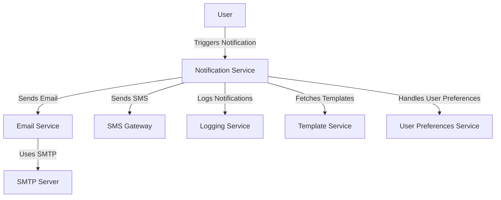

# Email and Notification Standards — Spring Boot

## Overview and scope

The purpose of this document is to establish the standards and best practices for implementing email and notification services within Xentic's Spring Boot applications. This standard aims to ensure consistency, reliability, and maintainability across all services that utilize email and notification functionalities.

### Audience

This document is intended for:

- Software Engineers
- Technical Architects
- DevOps Engineers
- Quality Assurance Teams
- Project Managers

### Scope

This standard covers:

- Configuration and setup of email services using Spring Boot
- Implementation of notification systems, including in-app notifications and external notifications (e.g., SMS)
- Integration with third-party email and notification services
- Error handling and logging best practices
- Security considerations related to email and notification services

### Non-goals

This document does NOT cover:

- User interface design for email templates or notification displays
- Detailed implementation of third-party services not directly related to email and notifications
- Performance tuning for email delivery or notification processing, which is covered in separate performance guidelines

### Glossary

| Term                | Definition                                                                 |
|---------------------|-----------------------------------------------------------------------------|
| SMTP                | Simple Mail Transfer Protocol, a protocol for sending email messages.      |
| Notification        | An alert or message sent to users, which can be in-app or external.        |
| Template            | A predefined format for emails or notifications, which can include dynamic content. |
| Spring Boot         | A Java-based framework used to create stand-alone, production-grade applications. |

### How This Standard Fits the Xentic Platform

The email and notification standards are integral to the Xentic platform as they facilitate communication with users and other systems. By adhering to these standards, teams can ensure that:

- Emails and notifications are sent consistently across all services, enhancing user experience.
- Security and compliance requirements are met, particularly concerning user data and privacy.
- Maintenance and troubleshooting of email and notification services are simplified, reducing downtime and improving reliability.

### Configuration Example

Below is a sample configuration for setting up email services in a Spring Boot application using YAML format:

```yaml
spring:
  mail:
    host: smtp.internal.xentic.io
    port: 587
    username: your-email@xentic.io
    password: your-password
    properties:
      mail.smtp.auth: true
      mail.smtp.starttls.enable: true
```

### Code Example

An example of sending an email using Spring Boot's `JavaMailSender`:

```java
import org.springframework.beans.factory.annotation.Autowired;
import org.springframework.mail.SimpleMailMessage;
import org.springframework.mail.javamail.JavaMailSender;
import org.springframework.stereotype.Service;

@Service
public class EmailService {

    @Autowired
    private JavaMailSender mailSender;

    public void sendEmail(String to, String subject, String body) {
        SimpleMailMessage message = new SimpleMailMessage();
        message.setTo(to);
        message.setSubject(subject);
        message.setText(body);
        mailSender.send(message);
    }
}
```

By following these standards, Xentic aims to create a robust and scalable email and notification infrastructure that meets the needs of its applications and users.

## Standards and policies

1. **MUST** use the package naming convention `com.xentic.<service>` for all email and notification service implementations. This ensures consistency and clarity across the codebase.

2. **MUST NOT** hard-code sensitive information such as SMTP credentials in the source code. Instead, use environment variables or secure vaults to manage sensitive configurations.

3. **SHOULD** utilize Spring Boot’s `@Value` annotation to inject configuration properties from `application.yml` or `application.properties` files. This promotes flexibility and maintainability.

   ```java
   @Value("${spring.mail.username}")
   private String username;
   ```

4. **MUST** implement email templates using a templating engine like Thymeleaf or FreeMarker. This allows for dynamic content and better management of email formats.

5. **MUST NOT** send emails without proper validation of recipient addresses. Implement validation logic to prevent sending emails to invalid addresses.

6. **SHOULD** log all email sending actions, including successes and failures, using a structured logging framework (e.g., SLF4J). This aids in troubleshooting and auditing.

   ```java
   logger.info("Email sent to: {}", to);
   ```

7. **MUST** handle exceptions during email sending gracefully. Use try-catch blocks to manage errors and provide fallback mechanisms where appropriate.

   ```java
   try {
       mailSender.send(message);
   } catch (MailException e) {
       logger.error("Failed to send email: {}", e.getMessage());
   }
   ```

8. **SHOULD** implement rate limiting for email sending to prevent abuse and ensure compliance with email service provider policies.

9. **MUST** use asynchronous processing for sending emails to avoid blocking the main application thread. Utilize Spring’s `@Async` annotation or a message queue system.

   ```java
   @Async
   public void sendEmailAsync(String to, String subject, String body) {
       sendEmail(to, subject, body);
   }
   ```

10. **MUST NOT** rely solely on email for critical notifications. Implement alternative notification channels (e.g., SMS, push notifications) to ensure users receive important alerts.

11. **SHOULD** provide users with options to manage their notification preferences, including opting in or out of specific types of notifications.

12. **MUST** ensure that all email communications comply with GDPR and other relevant privacy regulations. This includes obtaining user consent for email communications.

13. **MUST** use a consistent format for email subjects and bodies, adhering to company branding guidelines. This enhances professionalism and brand recognition.

14. **SHOULD** implement a retry mechanism for failed email deliveries, with exponential backoff strategies to handle transient errors.

15. **MUST** document all email and notification service endpoints and their usage in the internal API documentation at `https://docs.internal.xentic.io`.

16. **MUST NOT** use unencrypted communication channels for sending sensitive information via email. Always use TLS for SMTP connections.

17. **SHOULD** include an unsubscribe link in marketing emails to comply with anti-spam laws and enhance user experience.

18. **MUST** regularly review and update email templates to ensure they are relevant and aligned with current business objectives.

19. **SHOULD** conduct regular testing of email and notification systems, including unit tests, integration tests, and user acceptance testing (UAT).

20. **MUST** ensure that all third-party email services used comply with Xentic's security and privacy standards.

By adhering to these standards and policies, Xentic can maintain a reliable and effective email and notification service that meets the needs of its users while ensuring compliance and security.

## Architecture and design

The architecture of the email and notification services at Xentic is designed to ensure scalability, reliability, and maintainability. Below is a component diagram that illustrates the key components and their interactions.



### Data Flows

1. **User Interaction**: Users trigger notifications through various actions (e.g., registration, password reset).
2. **Notification Service**: This service processes incoming requests and determines the appropriate notification type (email, SMS, etc.).
3. **Email Service**: If the notification type is email, the Notification Service invokes the Email Service to send the email.
4. **SMTP Server**: The Email Service communicates with the SMTP server to deliver the email.
5. **SMS Gateway**: For SMS notifications, the Notification Service interacts with the SMS Gateway.
6. **Logging Service**: All actions and errors are logged for auditing and troubleshooting.
7. **Template Service**: The Notification Service fetches email templates from the Template Service to ensure consistent formatting.
8. **User Preferences Service**: This service manages user preferences for notifications, ensuring that users receive only the notifications they have opted into.

### Integration Points

- **SMTP Server**: The Email Service integrates with the SMTP server for email delivery.
- **SMS Gateway**: The Notification Service integrates with an external SMS gateway for sending SMS notifications.
- **Template Service**: The Notification Service fetches email templates from a dedicated service to maintain a separation of concerns.
- **Logging Service**: Integration with a logging framework is essential for monitoring and debugging purposes.
- **User Preferences Service**: This service is critical for managing user notification settings and preferences.

### Failure Domains

1. **Email Delivery Failure**: If the SMTP server is down or misconfigured, emails may fail to send. Implement retry mechanisms and alerting systems to handle such failures.
2. **Template Fetching Failure**: If the Template Service is unavailable, the Notification Service should fallback to default templates or handle the error gracefully.
3. **User Preferences**: If the User Preferences Service fails, users may receive notifications they have opted out of. Implement caching strategies to mitigate this risk.
4. **Logging Failures**: If the Logging Service fails, critical information may be lost. Ensure that logs are stored in a resilient system that can handle outages.
5. **Rate Limiting and Throttling**: If the Notification Service exceeds rate limits set by external providers (e.g., SMTP or SMS gateways), notifications may be dropped. Implement rate limiting and backoff strategies to manage this risk.

### Example Configuration for Notification Service

Below is a sample configuration for the Notification Service using YAML format:

```yaml
notification:
  service:
    email:
      enabled: true
      smtp:
        host: smtp.internal.xentic.io
        port: 587
      sms:
        enabled: true
        gatewayUrl: https://sms.gateway.xentic.io/api/send
```

### Example SQL for User Preferences

```sql
CREATE TABLE user_preferences (
    user_id BIGINT PRIMARY KEY,
    email_notifications BOOLEAN DEFAULT TRUE,
    sms_notifications BOOLEAN DEFAULT FALSE,
    updated_at TIMESTAMP DEFAULT CURRENT_TIMESTAMP
);
```

### Example Code for Notification Service

An example of a Notification Service that handles both email and SMS notifications:

```java
import org.springframework.beans.factory.annotation.Autowired;
import org.springframework.stereotype.Service;

@Service
public class NotificationService {

    @Autowired
    private EmailService emailService;

    @Autowired
    private SmsService smsService;

    public void notifyUser(Long userId, String message) {
        UserPreferences preferences = fetchUserPreferences(userId);

        if (preferences.isEmailNotifications()) {
            emailService.sendEmail(userId, "Notification", message);
        }

        if (preferences.isSmsNotifications()) {
            smsService.sendSms(userId, message);
        }
    }

    private UserPreferences fetchUserPreferences(Long userId) {
        // Logic to fetch user preferences from User Preferences Service
    }
}
```

By following this architecture and design, Xentic ensures a robust and scalable email and notification system that meets user needs while maintaining high standards of reliability and security.

## Configuration reference

### Application Configuration (application.yml)

The following is a reference configuration for the Notification Service in `application.yml`. This configuration includes settings for email and SMS notifications.

```yaml
notification:
  service:
    email:
      enabled: true
      smtp:
        host: smtp.internal.xentic.io
        port: 587
        username: your_smtp_username
        password: your_smtp_password
        properties:
          mail.smtp.auth: true
          mail.smtp.starttls.enable: true
          mail.smtp.ssl.trust: smtp.internal.xentic.io
      template:
        path: classpath:templates/email/
        default-template: default-email-template.html
    sms:
      enabled: true
      gatewayUrl: https://sms.gateway.xentic.io/api/send
      apiKey: your_sms_api_key
      senderId: Xentic
```

### Terraform Configuration

The following Terraform configuration sets up environment variables for the Notification Service. This is particularly useful for managing secrets and configurations in a cloud environment.

```hcl
resource "aws_ssm_parameter" "email_smtp_host" {
  name  = "/xentic/notification/email/smtp/host"
  type  = "String"
  value = "smtp.internal.xentic.io"
}

resource "aws_ssm_parameter" "email_smtp_port" {
  name  = "/xentic/notification/email/smtp/port"
  type  = "String"
  value = "587"
}

resource "aws_ssm_parameter" "sms_gateway_url" {
  name  = "/xentic/notification/sms/gateway_url"
  type  = "String"
  value = "https://sms.gateway.xentic.io/api/send"
}
```

### Environment Variables

Below is a table summarizing the environment variables used for configuring the Notification Service, including default and production values.

| Environment Variable                | Default Value                     | Production Value                      |
|-------------------------------------|-----------------------------------|---------------------------------------|
| `NOTIFICATION_EMAIL_ENABLED`        | `true`                            | `true`                                |
| `NOTIFICATION_EMAIL_SMTP_HOST`      | `smtp.internal.xentic.io`        | `smtp.internal.xentic.io`            |
| `NOTIFICATION_EMAIL_SMTP_PORT`      | `587`                             | `587`                                 |
| `NOTIFICATION_EMAIL_SMTP_USERNAME`  | `your_smtp_username`             | `prod_smtp_username`                  |
| `NOTIFICATION_EMAIL_SMTP_PASSWORD`  | `your_smtp_password`             | `prod_smtp_password`                  |
| `NOTIFICATION_SMS_ENABLED`          | `true`                            | `true`                                |
| `NOTIFICATION_SMS_GATEWAY_URL`      | `https://sms.gateway.xentic.io/api/send` | `https://sms.gateway.xentic.io/api/send` |
| `NOTIFICATION_SMS_API_KEY`          | `your_sms_api_key`               | `prod_sms_api_key`                    |
| `NOTIFICATION_SMS_SENDER_ID`        | `Xentic`                          | `Xentic`                              |

### Additional Configuration Notes

- **Email Configuration**: Ensure that the SMTP server is properly configured to allow connections from the application. Use environment variables to manage sensitive data like usernames and passwords.
- **SMS Configuration**: The SMS gateway URL and API key must be kept secure and should not be hardcoded in the application code. Use a secret management service where possible.
- **Template Management**: Email templates should be stored in a designated directory and should follow a consistent naming convention to facilitate easy updates and maintenance.

By adhering to these configuration standards, Xentic can ensure that the Notification Service operates reliably and securely across different environments.

## Implementation guide

To implement the Email and Notification Standards in a Spring Boot application, follow these steps:

### Step 1: Create the Notification Service

Create a `NotificationService` class that will handle the logic for sending notifications.

```java
import org.springframework.beans.factory.annotation.Autowired;
import org.springframework.stereotype.Service;

@Service
public class NotificationService {

    @Autowired
    private EmailService emailService;

    @Autowired
    private SmsService smsService;

    public void notifyUser(Long userId, String message) {
        UserPreferences preferences = fetchUserPreferences(userId);

        if (preferences.isEmailNotifications()) {
            emailService.sendEmail(userId, "Notification", message);
        }

        if (preferences.isSmsNotifications()) {
            smsService.sendSms(userId, message);
        }
    }

    private UserPreferences fetchUserPreferences(Long userId) {
        // Logic to fetch user preferences from User Preferences Service
        return new UserPreferences(); // Placeholder for actual implementation
    }
}
```

### Step 2: Implement the Email Service

Create an `EmailService` class that will handle sending emails.

```java
import org.springframework.beans.factory.annotation.Autowired;
import org.springframework.mail.SimpleMailMessage;
import org.springframework.mail.javamail.JavaMailSender;
import org.springframework.stereotype.Service;

@Service
public class EmailService {

    @Autowired
    private JavaMailSender mailSender;

    public void sendEmail(Long userId, String subject, String message) {
        SimpleMailMessage email = new SimpleMailMessage();
        email.setTo(getUserEmail(userId)); // Fetch user email based on userId
        email.setSubject(subject);
        email.setText(message);
        mailSender.send(email);
    }

    private String getUserEmail(Long userId) {
        // Logic to retrieve user's email address
        return "user@example.com"; // Placeholder for actual implementation
    }
}
```

### Step 3: Implement the SMS Service

Create an `SmsService` class that will handle sending SMS notifications.

```java
import org.springframework.beans.factory.annotation.Value;
import org.springframework.stereotype.Service;
import org.springframework.web.client.RestTemplate;

@Service
public class SmsService {

    @Value("${notification.service.sms.gatewayUrl}")
    private String gatewayUrl;

    public void sendSms(Long userId, String message) {
        String userPhoneNumber = getUserPhoneNumber(userId); // Fetch user's phone number
        // Logic to send SMS using RestTemplate
        RestTemplate restTemplate = new RestTemplate();
        SmsRequest smsRequest = new SmsRequest(userPhoneNumber, message);
        restTemplate.postForObject(gatewayUrl, smsRequest, String.class);
    }

    private String getUserPhoneNumber(Long userId) {
        // Logic to retrieve user's phone number
        return "+1234567890"; // Placeholder for actual implementation
    }
}

class SmsRequest {
    private String to;
    private String message;

    public SmsRequest(String to, String message) {
        this.to = to;
        this.message = message;
    }

    // Getters and setters
}
```

### Step 4: Configure SMTP and SMS Gateway

Ensure that your `application.yml` is configured correctly for the Email and SMS services.

```yaml
notification:
  service:
    email:
      enabled: true
      smtp:
        host: smtp.internal.xentic.io
        port: 587
        username: your_smtp_username
        password: your_smtp_password
        properties:
          mail.smtp.auth: true
          mail.smtp.starttls.enable: true
          mail.smtp.ssl.trust: smtp.internal.xentic.io
    sms:
      enabled: true
      gatewayUrl: https://sms.gateway.xentic.io/api/send
      apiKey: your_sms_api_key
      senderId: Xentic
```

### Step 5: Create User Preferences Entity

Define a `UserPreferences` class to manage user notification preferences.

```java
public class UserPreferences {
    private boolean emailNotifications;
    private boolean smsNotifications;

    public boolean isEmailNotifications() {
        return emailNotifications;
    }

    public void setEmailNotifications(boolean emailNotifications) {
        this.emailNotifications = emailNotifications;
    }

    public boolean isSmsNotifications() {
        return smsNotifications;
    }

    public void setSmsNotifications(boolean smsNotifications) {
        this.smsNotifications = smsNotifications;
    }
}
```

### Step 6: Set Up Logging

Implement logging in your services to track notification events.

```java
import org.slf4j.Logger;
import org.slf4j.LoggerFactory;

@Service
public class NotificationService {

    private static final Logger logger = LoggerFactory.getLogger(NotificationService.class);

    // Existing code...

    public void notifyUser(Long userId, String message) {
        logger.info("Notifying user {} with message: {}", userId, message);
        // Existing notification logic...
    }
}
```

### Step 7: Testing the Notification Service

Create unit tests to ensure that your Notification Service works as expected.

```java
import static org.mockito.Mockito.*;
import org.junit.jupiter.api.Test;

public class NotificationServiceTest {

    private NotificationService notificationService = new NotificationService();

    @Test
    public void testNotifyUser() {
        // Setup mocks for EmailService and SmsService
        EmailService emailServiceMock = mock(EmailService.class);
        SmsService smsServiceMock = mock(SmsService.class);
        notificationService.setEmailService(emailServiceMock);
        notificationService.setSmsService(smsServiceMock);

        // Call the method
        notificationService.notifyUser(1L, "Test Message");

        // Verify interactions
        verify(emailServiceMock).sendEmail(1L, "Notification", "Test Message");
        verify(smsServiceMock).sendSms(1L, "Test Message");
    }
}
```

By following these steps, Xentic can implement a robust and scalable Email and Notification Service that adheres to the company's standards and best practices.

## Security requirements

### Threat Model Summary

Xentic's Email and Notification Service must be designed with security in mind to mitigate potential threats. The following threats should be considered:

- **Unauthorized Access**: Attackers may attempt to gain unauthorized access to the notification system to send spam or phishing emails.
- **Data Leakage**: Sensitive user information (e.g., email addresses, phone numbers) must be protected from exposure.
- **Denial of Service (DoS)**: Attackers may try to overwhelm the notification service with excessive requests.
- **Man-in-the-Middle (MitM) Attacks**: Communications between the application and external services (e.g., SMTP, SMS gateway) must be secured to prevent interception.

### Authentication and Authorization (AuthN/Z)

- **Service-to-Service Authentication**: Use OAuth 2.0 or JWT tokens for authenticating between services.
- **User Authentication**: Ensure that all user interactions with the notification service are authenticated using secure methods (e.g., OAuth 2.0).
- **Role-Based Access Control (RBAC)**: Implement RBAC to restrict access to notification features based on user roles.

### Secrets Management

- **Environment Variables**: Sensitive information such as SMTP credentials and API keys MUST be stored in environment variables or a secure vault (e.g., HashiCorp Vault, AWS Secrets Manager).
- **Configuration Management**: Secrets MUST NOT be hardcoded in the application code or configuration files. Use placeholder values in `application.yml` and retrieve actual values from secure storage.

Example of secure configuration in `application.yml`:

```yaml
notification:
  service:
    email:
      smtp:
        username: ${SMTP_USERNAME}
        password: ${SMTP_PASSWORD}
    sms:
      apiKey: ${SMS_API_KEY}
```

### Input Validation

- **Sanitization**: All user inputs (e.g., email addresses, phone numbers) MUST be validated and sanitized to prevent injection attacks.
- **Length and Format Checks**: Implement checks for the length and format of email addresses and phone numbers to ensure they conform to expected patterns.
  
Example of input validation in Java:

```java
public boolean isValidEmail(String email) {
    String emailRegex = "^[A-Za-z0-9+_.-]+@(.+)$";
    return email != null && email.matches(emailRegex);
}

public boolean isValidPhoneNumber(String phoneNumber) {
    String phoneRegex = "^\\+?[0-9]{10,15}$";
    return phoneNumber != null && phoneNumber.matches(phoneRegex);
}
```

### Audit Logging

- **Logging Sensitive Actions**: Log all actions related to sending notifications, including user IDs, timestamps, and notification types. Ensure that sensitive data (e.g., email content) is masked or omitted from logs.
- **Centralized Logging**: Use a centralized logging solution (e.g., ELK Stack, Splunk) to aggregate and monitor logs for suspicious activities.

Example of audit logging in the `NotificationService`:

```java
import org.slf4j.Logger;
import org.slf4j.LoggerFactory;

@Service
public class NotificationService {

    private static final Logger logger = LoggerFactory.getLogger(NotificationService.class);

    public void notifyUser(Long userId, String message) {
        logger.info("User {} requested notification with message: [REDACTED]", userId);
        // Notification logic...
    }
}
```

By adhering to these security requirements, Xentic can significantly reduce the risk of vulnerabilities in the Email and Notification Service while ensuring compliance with industry standards.

## Testing strategy

To ensure the reliability and correctness of the Email and Notification Service at Xentic, a comprehensive testing strategy must be implemented. This strategy includes unit tests, integration tests, and contract tests, with specific coverage targets for each type.

### Testing Types

1. **Unit Tests**
   - Focus on testing individual components in isolation.
   - Each service class (e.g., `EmailService`, `SmsService`) MUST have unit tests that cover all public methods.
   - Mock dependencies to ensure tests are isolated.

2. **Integration Tests**
   - Validate the interaction between components and external systems (e.g., SMTP server, SMS gateway).
   - Integration tests MUST cover scenarios where services communicate with each other.
   - Use an embedded database or a test instance of external services.

3. **Contract Tests**
   - Ensure that the services adhere to the defined API contracts.
   - Use tools like Pact to verify that the consumer and provider are aligned in their expectations.

### Coverage Targets

| Test Type       | Coverage Target |
|------------------|-----------------|
| Unit Tests       | 80%              |
| Integration Tests| 70%              |
| Contract Tests   | 100%             |

### Example Test Classes

#### Unit Test Example for `EmailService`

```java
import static org.mockito.Mockito.*;
import org.junit.jupiter.api.Test;
import org.junit.jupiter.api.BeforeEach;

public class EmailServiceTest {

    private EmailService emailService;
    private MailSender mailSenderMock;

    @BeforeEach
    public void setUp() {
        mailSenderMock = mock(MailSender.class);
        emailService = new EmailService(mailSenderMock);
    }

    @Test
    public void testSendEmail() {
        Long userId = 1L;
        String subject = "Test Subject";
        String message = "Test Message";

        emailService.sendEmail(userId, subject, message);

        verify(mailSenderMock).send(any(MimeMessage.class));
    }
}
```

#### Integration Test Example for `NotificationService`

```java
import static org.springframework.test.web.servlet.request.MockMvcRequestBuilders.*;
import static org.springframework.test.web.servlet.result.MockMvcResultMatchers.*;
import org.junit.jupiter.api.Test;
import org.springframework.beans.factory.annotation.Autowired;
import org.springframework.boot.test.autoconfigure.web.servlet.WebMvcTest;
import org.springframework.test.web.servlet.MockMvc;

@WebMvcTest(NotificationService.class)
public class NotificationServiceIntegrationTest {

    @Autowired
    private MockMvc mockMvc;

    @Test
    public void testNotifyUserEndpoint() throws Exception {
        mockMvc.perform(post("/notify")
                .param("userId", "1")
                .param("message", "Test Notification"))
                .andExpect(status().isOk());
    }
}
```

#### Contract Test Example

Using Pact for contract testing between the consumer and provider:

```java
import au.com.dius.pact.consumer.junit5.PactConsumerTestExt;
import au.com.dius.pact.consumer.junit5.Pact;
import au.com.dius.pact.consumer.dsl.PactDslWithProvider;
import org.junit.jupiter.api.extension.ExtendWith;

@ExtendWith(PactConsumerTestExt.class)
public class NotificationServiceContractTest {

    @Pact(consumer = "NotificationConsumer", provider = "NotificationProvider")
    public RequestResponsePact createPact(PactDslWithProvider builder) {
        return builder
                .given("User exists")
                .uponReceiving("A request to notify a user")
                .path("/notify")
                .method("POST")
                .body("{\"userId\": 1, \"message\": \"Test Notification\"}")
                .willRespondWith()
                .status(200)
                .toPact();
    }
}
```

### Best Practices for Testing

- **Run Tests Automatically**: All tests MUST be run automatically in the CI/CD pipeline.
- **Use Descriptive Names**: Test methods MUST have descriptive names to clarify their purpose.
- **Keep Tests Independent**: Tests MUST NOT depend on each other to ensure reliability.
- **Document Test Cases**: Each test case MUST be documented to explain its purpose and expected outcome.

By following this testing strategy, Xentic can ensure that the Email and Notification Service is robust, reliable, and meets the quality standards expected in an enterprise environment.

## Observability and operations

To maintain high availability and performance of the Email and Notification Service, Xentic must implement robust observability and operations practices. This includes metrics, logs, traces, dashboards, alerts, and SLOs.

### Metrics

Metrics are essential for monitoring the health and performance of the notification service. The following metrics MUST be collected:

- **Request Count**: Total number of requests received by the service.
- **Error Rate**: Percentage of failed requests.
- **Response Time**: Time taken to process requests.
- **Queue Length**: Number of messages waiting to be processed.
- **Success Rate**: Percentage of successfully sent notifications.

Example of metrics configuration in `application.yml`:

```yaml
management:
  metrics:
    export:
      prometheus:
        enabled: true
    tags:
      enabled: true
```

### Logs

Logging is critical for troubleshooting and understanding system behavior. The following logging practices MUST be followed:

- **Log Level**: Use appropriate log levels (DEBUG, INFO, WARN, ERROR) to categorize log messages.
- **Structured Logging**: Use structured logging to facilitate easier searching and filtering.
- **Log Rotation**: Implement log rotation to prevent disk space exhaustion.

Example of logging configuration in `logback-spring.xml`:

```xml
<configuration>
    <appender name="FILE" class="ch.qos.logback.core.rolling.RollingFileAppender">
        <file>logs/notification-service.log</file>
        <rollingPolicy class="ch.qos.logback.core.rolling.TimeBasedRollingPolicy">
            <fileNamePattern>logs/notification-service.%d{yyyy-MM-dd}.%i.log</fileNamePattern>
            <maxHistory>30</maxHistory>
            <totalSizeCap>1GB</totalSizeCap>
        </rollingPolicy>
        <encoder>
            <pattern>%d{yyyy-MM-dd HH:mm:ss} %-5level [%thread] %logger{36} - %msg%n</pattern>
        </encoder>
    </appender>
    <root level="INFO">
        <appender-ref ref="FILE" />
    </root>
</configuration>
```

### Traces

Distributed tracing is essential for understanding request flows across services. The following practices MUST be implemented:

- **Trace Context Propagation**: Ensure that trace context is propagated across service calls.
- **Integration with Tracing Tools**: Use tools like OpenTelemetry or Zipkin for tracing.

Example of enabling tracing in `application.yml`:

```yaml
spring:
  sleuth:
    sampler:
      probability: 1.0
```

### Dashboards

Dashboards provide a visual representation of service health and performance. The following dashboards MUST be created:

- **Service Health Dashboard**: Displays metrics such as request count, error rate, and response time.
- **Notification Success Dashboard**: Shows success and failure rates for notifications sent.

Tools like Grafana or Kibana MUST be used to create these dashboards, pulling data from Prometheus or ELK Stack.

### Alerts

Alerts are critical for proactive incident management. The following alerting practices MUST be implemented:

- **Threshold-Based Alerts**: Set alerts for critical metrics (e.g., error rate exceeds 5%).
- **Anomaly Detection**: Implement anomaly detection for unusual patterns in metrics.

Example of alert configuration in Prometheus:

```yaml
groups:
  - name: notification-service-alerts
    rules:
      - alert: HighErrorRate
        expr: rate(http_requests_total{service="notification"}[5m]) > 0.05
        for: 5m
        labels:
          severity: critical
        annotations:
          summary: "High error rate detected in Notification Service"
          description: "Error rate is above 5% for the last 5 minutes."
```

### Service Level Objectives (SLOs)

Establishing SLOs helps to define acceptable performance and reliability standards. The following SLOs MUST be defined:

| Objective                  | Target          |
|----------------------------|-----------------|
| Availability                | 99.9%           |
| Error Rate                  | < 1%            |
| Response Time (P95)        | < 200ms         |

### On-Call Runbook Steps

In the event of an incident, the following on-call runbook steps MUST be followed:

1. **Incident Identification**: Monitor alerts and dashboards for anomalies.
2. **Initial Triage**: Assess the severity of the incident based on SLOs.
3. **Gather Context**: Collect logs, metrics, and traces related to the incident.
4. **Notify Stakeholders**: Inform relevant stakeholders about the incident.
5. **Mitigate Impact**: Implement temporary fixes if possible (e.g., scaling services).
6. **Root Cause Analysis**: After resolution, conduct a post-mortem to identify root causes.
7. **Document Findings**: Update documentation and improve processes based on findings.

By adhering to these observability and operations standards, Xentic can ensure the Email and Notification Service remains reliable, performant, and easy to troubleshoot.

## Migration and versioning

To ensure smooth transitions between versions of the Email and Notification Service, Xentic MUST adhere to the following migration and versioning policies.

### Upgrade Paths

Upgrades MUST follow a well-defined path to minimize disruptions. The following guidelines MUST be observed:

- **Semantic Versioning**: All services MUST use semantic versioning (MAJOR.MINOR.PATCH). Breaking changes MUST increment the MAJOR version, while backward-compatible changes increment the MINOR version, and patches for bug fixes increment the PATCH version.
- **Backward Compatibility**: New versions MUST be backward compatible with the previous version unless explicitly stated. Clients MUST NOT be forced to upgrade immediately.
- **Deprecation Notices**: Deprecation of features MUST be communicated at least one version in advance. A deprecation notice MUST be included in the release notes.

### Deprecation Policy

Xentic MUST implement a clear deprecation policy to manage the lifecycle of features and APIs:

- **Grace Period**: Deprecated features MUST remain available for at least two subsequent versions before removal.
- **Documentation**: All deprecated features MUST be documented, including alternatives and timelines for removal.
- **Code Annotations**: Deprecated methods and classes MUST be annotated with `@Deprecated` and include a message indicating the reason and alternative.

Example of a deprecated method:

```java
/**
 * @deprecated This method will be removed in version 2.0. Use sendEmailV2() instead.
 */
@Deprecated
public void sendEmail(String recipient, String subject, String body) {
    // Implementation
}
```

### Backward Compatibility

Backward compatibility MUST be a priority during development. The following practices MUST be followed:

- **API Versioning**: APIs MUST be versioned in the URL (e.g., `/api/v1/notifications`). This allows clients to continue using older versions without disruption.
- **Feature Flags**: Use feature flags to toggle new features on or off without affecting existing functionality.
- **Data Migration**: Database changes MUST include migration scripts that ensure data integrity and compatibility with previous versions.

Example of a database migration script in SQL:

```sql
ALTER TABLE notifications ADD COLUMN status VARCHAR(20) DEFAULT 'PENDING';
```

### Rollback Procedures

In the event of a failed deployment or migration, Xentic MUST have clear rollback procedures:

- **Automated Rollbacks**: Deployments MUST include automated rollback scripts that can revert to the previous stable version.
- **Backup Strategies**: Regular backups of databases and configurations MUST be maintained to facilitate quick recovery.
- **Testing Rollbacks**: Rollback procedures MUST be tested regularly to ensure effectiveness.

Example of a rollback command for a deployment tool:

```bash
kubectl rollout undo deployment/email-service
```

### Versioning Strategy Table

| Version Type      | Description                                                  | Example      |
|-------------------|--------------------------------------------------------------|--------------|
| MAJOR             | Breaking changes; clients MUST upgrade                       | 2.0.0       |
| MINOR             | Backward-compatible new features                             | 1.1.0       |
| PATCH             | Backward-compatible bug fixes                                | 1.0.1       |

By following these migration and versioning standards, Xentic can ensure that the Email and Notification Service remains stable and reliable while allowing for continuous improvement and innovation.

### FAQ, Anti-Patterns, and Checklists

#### FAQ

1. **What is the primary purpose of the Email and Notification Service?**
   - The service is designed to send emails and notifications to users based on specific events or triggers within the application.

2. **How should I handle failed email deliveries?**
   - Failed deliveries MUST be logged, and a retry mechanism MUST be implemented to attempt resending the email after a defined interval.

3. **What libraries should be used for sending emails?**
   - Xentic recommends using Spring Boot's `spring-boot-starter-mail` for email functionality.

4. **What is the recommended way to manage email templates?**
   - Email templates MUST be stored in a centralized location and loaded dynamically. Use Thymeleaf or FreeMarker for template rendering.

5. **How can I ensure email content is secure?**
   - Sensitive information MUST NOT be included in email content. Use placeholders and retrieve sensitive data securely from the database.

6. **What should I do if I need to send bulk notifications?**
   - Use asynchronous processing (e.g., Spring's `@Async` annotation) to handle bulk notifications efficiently without blocking the main thread.

7. **How do I monitor the performance of the notification service?**
   - Implement metrics and logging as outlined in previous sections, and use monitoring tools like Prometheus and Grafana.

8. **What should I do if a user unsubscribes from notifications?**
   - Update the user's preferences in the database and ensure that no further notifications are sent to them.

9. **How can I test the email functionality?**
   - Use integration tests with mocking frameworks like Mockito to simulate email sending without actual delivery during testing.

10. **What is the policy for handling user data in notifications?**
    - User data MUST be handled according to Xentic's data privacy policies, ensuring compliance with regulations such as GDPR.

#### Anti-Patterns

| Anti-Pattern                          | Description                                                                                  |
|---------------------------------------|----------------------------------------------------------------------------------------------|
| Hardcoding Email Addresses             | Email addresses MUST NOT be hardcoded in the application; use configuration files instead.  |
| Sending Emails in a Synchronous Call  | Sending emails directly in a synchronous manner can block the main thread; use async methods.|
| Ignoring Email Delivery Failures      | Failing to log or handle email delivery failures can lead to lost notifications; always implement retries.|
| Using Plain Text for Sensitive Data   | Sensitive data MUST NOT be sent in plain text; use encryption or secure tokens instead.     |
| Not Validating User Input             | Failing to validate user input can lead to injection attacks; always sanitize inputs.       |

#### Pre-Merge Checklist

- [ ] Code adheres to Xentic's coding standards.
- [ ] All tests are passing, including unit and integration tests.
- [ ] Documentation is updated to reflect any changes made.
- [ ] Code changes are reviewed by at least one other team member.
- [ ] Metrics and logging configurations are included and tested.

#### Production Checklist

- [ ] Ensure all environment variables are configured correctly in production.
- [ ] Verify that the email service is connected to the correct SMTP server.
- [ ] Confirm that monitoring and alerting are set up for the notification service.
- [ ] Run smoke tests to validate basic functionality after deployment.
- [ ] Ensure that rollback procedures are in place and tested.
