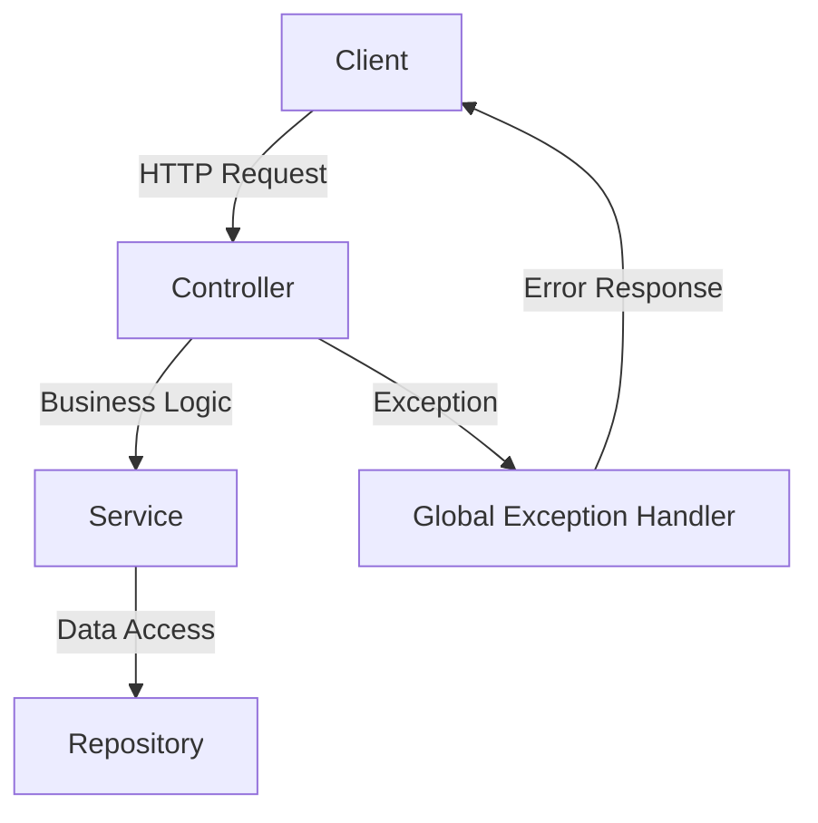

# Global Exception Handling — Spring Boot

## Overview and scope

The purpose of this document is to establish a standard for global exception handling in Spring Boot applications within Xentic. This standard aims to ensure a consistent and effective approach to managing exceptions across all services, thereby enhancing the reliability and maintainability of our applications.

### Audience

This document is intended for:
- Java developers working on Spring Boot applications at Xentic.
- Technical leads and architects responsible for defining best practices and standards.
- Quality assurance teams ensuring compliance with exception handling standards.

### Scope

This standard applies to all backend services developed using Spring Boot within Xentic. It encompasses:
- The implementation of a global exception handler using `@RestControllerAdvice`.
- The structure and format of error responses returned to clients.
- Guidelines for creating custom exceptions to be used within the application.

### Non-goals

This document does NOT cover:
- Exception handling in non-Spring Boot applications.
- Client-side error handling strategies.
- Detailed logging practices outside of exception handling.

### Glossary

| Term                        | Definition                                                                 |
|-----------------------------|-----------------------------------------------------------------------------|
| `@RestControllerAdvice`     | A specialization of the `@Controller` annotation that allows handling exceptions globally. |
| Error Response              | A structured response sent to the client when an error occurs, containing relevant details. |
| Custom Exception            | A user-defined exception class that extends a standard exception, providing specific error handling. |
| HTTP Status Code            | A code indicating the result of the server's attempt to process the request. |

### How this standard fits the Xentic platform

This standard is aligned with Xentic's commitment to delivering high-quality software solutions. By implementing a unified approach to exception handling, we ensure that:
- All services provide meaningful error responses, improving the developer experience for clients consuming our APIs.
- Developers can focus on business logic without being burdened by repetitive error handling code.
- Consistency across services enhances maintainability and reduces the likelihood of errors during development and production.

### Standard

Every service MUST define a single `@RestControllerAdvice` class. Exception handling MUST NOT be performed directly in controllers; exceptions should be allowed to bubble up to the global handler.

### Error Response Schema

The error response returned to clients MUST adhere to the following schema:

```yaml
timestamp: "2024-01-15T10:30:00Z"
status: 400
error: "BAD_REQUEST"
message: "Validation failed for field 'email'"
path: "/api/v1/users"
traceId: "abc123"
```

### Global Handler

The global exception handler MUST be implemented as follows:

```java
@RestControllerAdvice
@Slf4j
public class GlobalExceptionHandler {

    @ExceptionHandler(ResourceNotFoundException.class)
    public ResponseEntity<ErrorResponse> handleNotFound(
            ResourceNotFoundException ex, HttpServletRequest req) {
        log.warn("Resource not found: {}", ex.getMessage());
        return ResponseEntity.status(HttpStatus.NOT_FOUND)
            .body(ErrorResponse.of(HttpStatus.NOT_FOUND.value(), "NOT_FOUND", ex.getMessage(), req.getRequestURI()));
    }

    @ExceptionHandler(MethodArgumentNotValidException.class)
    public ResponseEntity<ErrorResponse> handleValidation(
            MethodArgumentNotValidException ex, HttpServletRequest req) {
        String msg = ex.getBindingResult().getFieldErrors().stream()
            .map(e -> e.getField() + ": " + e.getDefaultMessage())
            .collect(Collectors.joining(", "));
        return ResponseEntity.status(HttpStatus.BAD_REQUEST)
            .body(ErrorResponse.of(HttpStatus.BAD_REQUEST.value(), "BAD_REQUEST", msg, req.getRequestURI()));
    }

    @ExceptionHandler(Exception.class)
    public ResponseEntity<ErrorResponse> handleGeneric(Exception ex, HttpServletRequest req) {
        log.error("Unhandled exception", ex);
        return ResponseEntity.status(HttpStatus.INTERNAL_SERVER_ERROR)
            .body(ErrorResponse.of(HttpStatus.INTERNAL_SERVER_ERROR.value(), "INTERNAL_ERROR", "Unexpected error", req.getRequestURI()));
    }
}
```

### Custom Exceptions

Custom exceptions MUST be defined as follows:

```java
public class ResourceNotFoundException extends RuntimeException {
    public ResourceNotFoundException(String resource, UUID id) {
        super(resource + " not found with id: " + id);
    }
}

## Standards and policies

1. **MUST** implement a single `@RestControllerAdvice` class in each service to handle exceptions globally. This class MUST be annotated with `@Slf4j` for logging purposes.

2. **MUST NOT** perform exception handling directly within controller methods. All exceptions MUST bubble up to the global exception handler.

3. **MUST** define custom exceptions for specific error scenarios. Each custom exception class MUST extend `RuntimeException` or a relevant Spring exception.

4. **MUST** ensure that error responses adhere to the defined schema, which includes fields such as `timestamp`, `status`, `error`, `message`, `path`, and `traceId`.

5. **SHOULD** log exceptions at appropriate levels (e.g., `warn` for client errors, `error` for server errors) within the global exception handler to facilitate debugging.

6. **MUST** return meaningful HTTP status codes in error responses. Common status codes include:
   - `400` for Bad Request
   - `404` for Not Found
   - `500` for Internal Server Error

7. **SHOULD** include a `traceId` in the error response to assist with tracking requests across distributed systems. This can be generated using a UUID.

8. **MUST** handle validation exceptions using `@ExceptionHandler(MethodArgumentNotValidException.class)` to provide specific feedback on validation errors.

9. **MUST NOT** expose internal error details to clients. The `message` field in the error response MUST be user-friendly and not disclose sensitive information.

10. **SHOULD** document all custom exceptions in the service's README or relevant documentation to ensure clarity on their usage and purpose.

11. **MUST** ensure that all error responses are serialized in JSON format. The response body MUST be structured according to the defined error response schema.

12. **SHOULD** provide a fallback mechanism for unexpected errors using a generic exception handler that returns a standard internal error response.

13. **MUST** validate input data at the controller level using Spring's validation annotations (e.g., `@Valid`) to catch errors early and provide immediate feedback.

14. **MUST NOT** use generic exception messages in error responses. Each error message MUST be specific to the context of the error.

15. **SHOULD** consider using a centralized logging service (e.g., ELK stack) for capturing logs from the global exception handler to facilitate monitoring and alerting.

16. **MUST** test the global exception handler thoroughly to ensure that all expected exceptions are handled correctly and that the responses conform to the specified schema.

17. **SHOULD** include unit tests for custom exceptions to verify that they are thrown and handled as expected within the application.

18. **MUST** follow the Xentic package naming conventions for all exception classes, using `com.xentic.<service>.exception` as the base package.

19. **MUST** ensure that any changes to the global exception handling strategy are communicated to all development teams to maintain consistency across services.

20. **SHOULD** review and update the global exception handling strategy periodically to incorporate lessons learned from production incidents and improve the overall robustness of the application.

## Architecture and design

The architecture for global exception handling in Spring Boot applications at Xentic is designed to centralize error management, ensuring that all exceptions are handled uniformly across services. The following diagram illustrates the key components involved in this architecture:



### Data Flows

1. **Client to Controller**: The client sends an HTTP request to the controller.
2. **Controller to Service**: The controller processes the request and delegates business logic to the service layer.
3. **Service to Repository**: The service interacts with the repository to access or manipulate data.
4. **Exception Handling**: If an exception occurs at any point, it is propagated up to the global exception handler.
5. **Global Exception Handler to Client**: The global exception handler formats the error response and sends it back to the client.

### Integration Points

- **Controllers**: Each controller MUST delegate exception handling to the global exception handler rather than managing exceptions locally.
- **Services**: Services MUST throw specific exceptions that can be caught by the global exception handler.
- **Repositories**: Data access exceptions (e.g., `DataAccessException`) MUST be handled at the global level to provide a consistent error response.

### Failure Domains

The architecture identifies several failure domains that can occur during the processing of a request:

| Failure Domain            | Description                                                                 |
|---------------------------|-----------------------------------------------------------------------------|
| Client Errors             | Errors caused by invalid input or requests (e.g., validation failures).    |
| Resource Not Found        | Errors when requested resources do not exist (e.g., `404 Not Found`).      |
| Internal Server Errors    | Unexpected errors that occur during processing (e.g., `500 Internal Server Error`). |
| Data Access Issues        | Errors related to database access or data integrity (e.g., `DataAccessException`). |

### Code Example for Custom Exception Handling

Custom exceptions MUST be used to represent specific error scenarios. Below is an example of a custom exception and its usage:

```java
package com.xentic.user.exception;

public class UserNotFoundException extends RuntimeException {
    public UserNotFoundException(UUID userId) {
        super("User not found with ID: " + userId);
    }
}
```

### Example Usage in a Service

In a service class, the custom exception should be thrown when a user is not found:

```java
@Service
public class UserService {
    public User findUserById(UUID userId) {
        return userRepository.findById(userId)
            .orElseThrow(() -> new UserNotFoundException(userId));
    }
}
```

### Conclusion

The global exception handling architecture at Xentic ensures that all exceptions are managed in a consistent manner, providing clear and informative error responses to clients. By defining specific custom exceptions and utilizing a global exception handler, we enhance the maintainability and reliability of our Spring Boot applications.

## Configuration reference

To effectively manage global exception handling in Spring Boot applications, the following configuration settings are required. This includes application properties, environment variables, and Terraform configurations.

### Application Configuration (application.yml)

The `application.yml` file should include the following configurations for error handling:

```yaml
server:
  port: 8080

logging:
  level:
    root: INFO
    com.xentic: DEBUG

error:
  include-message: always
  include-binding-errors: always

custom:
  error:
    trace-id-header: X-Trace-Id
    default-error-message: "An unexpected error occurred. Please try again later."
```

### Environment Variables

The following environment variables can be utilized to configure error handling settings. Default values are provided for local development and production environments.

| Environment Variable             | Default Value                        | Production Value                  |
|-----------------------------------|-------------------------------------|-----------------------------------|
| `ERROR_TRACE_ID_HEADER`          | `X-Trace-Id`                        | `X-Trace-Id`                      |
| `ERROR_DEFAULT_MESSAGE`          | `An unexpected error occurred.`     | `An unexpected error occurred.`   |
| `LOGGING_LEVEL`                  | `INFO`                              | `ERROR`                           |

### Terraform Configuration

When deploying applications using Terraform, ensure the following settings are included in your configuration files to manage environment variables:

```hcl
resource "aws_lambda_function" "example" {
  function_name = "example_function"
  handler       = "com.xentic.example.Handler"
  runtime       = "java11"

  environment {
    ERROR_TRACE_ID_HEADER = "X-Trace-Id"
    ERROR_DEFAULT_MESSAGE = "An unexpected error occurred."
    LOGGING_LEVEL         = "ERROR"
  }

  # Other necessary configurations...
}
```

### Additional Configuration Options

- **Error Response Format**: Ensure that the error response format is consistent across services. You can define a base error response class that includes fields such as `timestamp`, `status`, `error`, `message`, `path`, and `traceId`.

- **Custom Error Handling**: If you have specific error handling requirements for different services, consider creating service-specific error response classes that extend the base error response class.

### Example of Error Response Class

Here is an example of how to structure an error response class:

```java
public class ErrorResponse {
    private LocalDateTime timestamp;
    private int status;
    private String error;
    private String message;
    private String path;
    private String traceId;

    // Getters and Setters
}
```

### Summary

The configuration reference provided here outlines the essential settings required for global exception handling in Spring Boot applications at Xentic. By adhering to these configurations, you ensure that your applications handle errors uniformly and provide meaningful feedback to clients.

## Implementation guide

To implement global exception handling in Spring Boot applications at Xentic, follow these step-by-step instructions, which include necessary code examples and configurations.

### Step 1: Create Custom Exception Classes

Define custom exceptions that represent specific error scenarios. Each exception class MUST extend `RuntimeException`.

```java
package com.xentic.user.exception;

public class UserNotFoundException extends RuntimeException {
    public UserNotFoundException(UUID userId) {
        super("User not found with ID: " + userId);
    }
}

package com.xentic.order.exception;

public class OrderNotFoundException extends RuntimeException {
    public OrderNotFoundException(UUID orderId) {
        super("Order not found with ID: " + orderId);
    }
}
```

### Step 2: Create an Error Response Class

Define a standard error response class that will be used to format error messages returned to the client.

```java
package com.xentic.common.exception;

import java.time.LocalDateTime;

public class ErrorResponse {
    private LocalDateTime timestamp;
    private int status;
    private String error;
    private String message;
    private String path;
    private String traceId;

    // Constructors, Getters, and Setters
    public ErrorResponse(int status, String error, String message, String path, String traceId) {
        this.timestamp = LocalDateTime.now();
        this.status = status;
        this.error = error;
        this.message = message;
        this.path = path;
        this.traceId = traceId;
    }
}
```

### Step 3: Implement the Global Exception Handler

Create a global exception handler using the `@ControllerAdvice` annotation. This class will handle exceptions thrown by controllers and services.

```java
package com.xentic.common.exception;

import org.springframework.http.HttpStatus;
import org.springframework.http.ResponseEntity;
import org.springframework.web.bind.annotation.ControllerAdvice;
import org.springframework.web.bind.annotation.ExceptionHandler;
import javax.servlet.http.HttpServletRequest;

@ControllerAdvice
public class GlobalExceptionHandler {

    @ExceptionHandler(UserNotFoundException.class)
    public ResponseEntity<ErrorResponse> handleUserNotFound(UserNotFoundException ex, HttpServletRequest request) {
        ErrorResponse errorResponse = new ErrorResponse(
            HttpStatus.NOT_FOUND.value(),
            "User Not Found",
            ex.getMessage(),
            request.getRequestURI(),
            request.getHeader("X-Trace-Id")
        );
        return new ResponseEntity<>(errorResponse, HttpStatus.NOT_FOUND);
    }

    @ExceptionHandler(OrderNotFoundException.class)
    public ResponseEntity<ErrorResponse> handleOrderNotFound(OrderNotFoundException ex, HttpServletRequest request) {
        ErrorResponse errorResponse = new ErrorResponse(
            HttpStatus.NOT_FOUND.value(),
            "Order Not Found",
            ex.getMessage(),
            request.getRequestURI(),
            request.getHeader("X-Trace-Id")
        );
        return new ResponseEntity<>(errorResponse, HttpStatus.NOT_FOUND);
    }

    @ExceptionHandler(Exception.class)
    public ResponseEntity<ErrorResponse> handleGenericException(Exception ex, HttpServletRequest request) {
        ErrorResponse errorResponse = new ErrorResponse(
            HttpStatus.INTERNAL_SERVER_ERROR.value(),
            "Internal Server Error",
            "An unexpected error occurred. Please try again later.",
            request.getRequestURI(),
            request.getHeader("X-Trace-Id")
        );
        return new ResponseEntity<>(errorResponse, HttpStatus.INTERNAL_SERVER_ERROR);
    }
}
```

### Step 4: Modify Controllers to Use Custom Exceptions

In your controller classes, throw the custom exceptions when specific error conditions occur.

```java
package com.xentic.user.controller;

import com.xentic.user.exception.UserNotFoundException;
import com.xentic.user.service.UserService;
import org.springframework.web.bind.annotation.*;

import java.util.UUID;

@RestController
@RequestMapping("/users")
public class UserController {

    private final UserService userService;

    public UserController(UserService userService) {
        this.userService = userService;
    }

    @GetMapping("/{id}")
    public User getUserById(@PathVariable UUID id) {
        return userService.findUserById(id);
    }
}
```

### Step 5: Test the Global Exception Handler

You MUST write unit tests to ensure that the global exception handler behaves as expected. Use MockMvc to simulate requests and validate responses.

```java
package com.xentic.common.exception;

import com.xentic.user.exception.UserNotFoundException;
import com.xentic.user.controller.UserController;
import com.xentic.user.service.UserService;
import org.junit.jupiter.api.Test;
import org.springframework.beans.factory.annotation.Autowired;
import org.springframework.boot.test.autoconfigure.web.servlet.WebMvcTest;
import org.springframework.http.MediaType;
import org.springframework.test.web.servlet.MockMvc;

import static org.springframework.test.web.servlet.request.MockMvcRequestBuilders.get;
import static org.springframework.test.web.servlet.result.MockMvcResultMatchers.status;
import static org.springframework.test.web.servlet.result.MockMvcResultMatchers.jsonPath;

@WebMvcTest(UserController.class)
public class GlobalExceptionHandlerTest {

    @Autowired
    private MockMvc mockMvc;

    @Test
    public void testHandleUserNotFound() throws Exception {
        mockMvc.perform(get("/users/{id}", UUID.randomUUID())
                .accept(MediaType.APPLICATION_JSON))
                .andExpect(status().isNotFound())
                .andExpect(jsonPath("$.error").value("User Not Found"));
    }
}
```

### Summary

By following these steps, you will have a robust global exception handling mechanism in place for your Spring Boot applications at Xentic. This approach ensures that all exceptions are handled consistently, providing meaningful error responses to clients and improving the overall reliability of your application.

## Security requirements

To ensure the security of Spring Boot applications at Xentic, the following requirements MUST be adhered to:

### Threat Model Summary

- **Data Breaches**: Unauthorized access to sensitive data, including user information and financial records.
- **Injection Attacks**: SQL injection, command injection, and other forms of injection that can compromise application integrity.
- **Cross-Site Scripting (XSS)**: Attacks that inject malicious scripts into web pages viewed by users.
- **Denial of Service (DoS)**: Attacks aimed at making services unavailable by overwhelming them with requests.
- **Insider Threats**: Risks posed by employees or contractors with access to sensitive data.

### Authentication and Authorization (Authn/z)

- **Authentication**: All endpoints MUST be protected with authentication mechanisms. Use OAuth2 or JWT for token-based authentication.
- **Authorization**: Implement role-based access control (RBAC) to ensure that users have appropriate permissions. Use annotations like `@PreAuthorize` to enforce security rules.

```java
@RestController
@RequestMapping("/admin")
public class AdminController {

    @PreAuthorize("hasRole('ADMIN')")
    @GetMapping("/dashboard")
    public ResponseEntity<String> getAdminDashboard() {
        return ResponseEntity.ok("Admin Dashboard");
    }
}
```

### Secrets Management

- **Environment Variables**: Secrets such as database passwords and API keys MUST NOT be hardcoded in the application. Use environment variables or a secrets management tool like HashiCorp Vault.
- **Configuration Files**: Ensure that sensitive information in configuration files is encrypted or excluded from version control.

```yaml
spring:
  datasource:
    url: jdbc:mysql://localhost:3306/xentic
    username: ${DB_USERNAME}
    password: ${DB_PASSWORD}
```

### Input Validation

- **Validation Framework**: Use the `javax.validation` framework to validate all incoming data. Apply constraints such as `@NotNull`, `@Size`, and `@Email` to ensure data integrity.

```java
public class UserDto {

    @NotNull
    private String username;

    @Email
    private String email;

    @Size(min = 8)
    private String password;

    // Getters and Setters
}
```

- **Sanitization**: All user inputs MUST be sanitized to prevent XSS and SQL injection attacks. Use libraries like OWASP Java HTML Sanitizer for sanitizing HTML input.

### Audit Logging

- **Logging Framework**: Implement a logging framework (e.g., SLF4J with Logback) to log security-related events, such as authentication attempts, access to sensitive endpoints, and data modifications.
- **Log Format**: Ensure logs include the following fields:
  - Timestamp
  - User ID
  - Action performed
  - Outcome (success/failure)
  - IP Address

```java
import org.slf4j.Logger;
import org.slf4j.LoggerFactory;

public class UserService {
    private static final Logger logger = LoggerFactory.getLogger(UserService.class);

    public User findUserById(UUID userId) {
        logger.info("User lookup initiated for userId: {}", userId);
        // Perform user lookup
        // Log outcome
    }
}
```

- **Retention Policy**: Logs MUST be retained for a minimum of 90 days and should be stored securely to prevent tampering.

### Summary

By adhering to these security requirements, Xentic ensures that its Spring Boot applications are resilient against common threats, maintain data integrity, and protect sensitive information. Regular security audits and updates to these practices are essential to adapt to evolving security landscapes.

## Testing strategy

At Xentic, a comprehensive testing strategy is essential for ensuring the reliability and robustness of global exception handling in Spring Boot applications. The following testing types MUST be implemented:

### 1. Unit Tests
Unit tests are critical for validating the behavior of individual components, such as exception handlers. Each handler method in the `GlobalExceptionHandler` class MUST have corresponding unit tests to ensure correct responses for various exceptions.

**Coverage Target**: Aim for at least 90% code coverage for the `GlobalExceptionHandler`.

**Example Unit Test Class**:

```java
package com.xentic.common.exception;

import com.xentic.user.exception.UserNotFoundException;
import org.junit.jupiter.api.Test;
import org.springframework.http.HttpStatus;
import org.springframework.http.ResponseEntity;

import javax.servlet.http.HttpServletRequest;

import static org.mockito.Mockito.*;
import static org.junit.jupiter.api.Assertions.*;

public class GlobalExceptionHandlerUnitTest {

    private final GlobalExceptionHandler exceptionHandler = new GlobalExceptionHandler();
    private final HttpServletRequest request = mock(HttpServletRequest.class);

    @Test
    public void testHandleUserNotFound() {
        UserNotFoundException ex = new UserNotFoundException("User not found");
        when(request.getRequestURI()).thenReturn("/users/123");
        when(request.getHeader("X-Trace-Id")).thenReturn("trace-id");

        ResponseEntity<ErrorResponse> response = exceptionHandler.handleUserNotFound(ex, request);

        assertEquals(HttpStatus.NOT_FOUND, response.getStatusCode());
        assertEquals("User Not Found", response.getBody().getError());
        assertEquals("User not found", response.getBody().getMessage());
        assertEquals("/users/123", response.getBody().getPath());
        assertEquals("trace-id", response.getBody().getTraceId());
    }
}
```

### 2. Integration Tests
Integration tests validate the interaction between components and the overall behavior of the application. You MUST write integration tests to ensure that the global exception handler works correctly when integrated with the rest of the application.

**Example Integration Test Class**:

```java
package com.xentic.common.exception;

import com.xentic.user.controller.UserController;
import com.xentic.user.service.UserService;
import org.junit.jupiter.api.Test;
import org.springframework.beans.factory.annotation.Autowired;
import org.springframework.boot.test.autoconfigure.web.servlet.WebMvcTest;
import org.springframework.http.MediaType;
import org.springframework.test.web.servlet.MockMvc;

import static org.springframework.test.web.servlet.request.MockMvcRequestBuilders.get;
import static org.springframework.test.web.servlet.result.MockMvcResultMatchers.status;
import static org.springframework.test.web.servlet.result.MockMvcResultMatchers.jsonPath;

@WebMvcTest(UserController.class)
public class GlobalExceptionHandlerIntegrationTest {

    @Autowired
    private MockMvc mockMvc;

    @Test
    public void testHandleUserNotFoundIntegration() throws Exception {
        mockMvc.perform(get("/users/{id}", UUID.randomUUID())
                .accept(MediaType.APPLICATION_JSON))
                .andExpect(status().isNotFound())
                .andExpect(jsonPath("$.error").value("User Not Found"));
    }
}
```

### 3. Contract Tests
Contract tests ensure that the API adheres to the predefined contract, which is crucial for maintaining compatibility between services. You SHOULD implement contract tests using tools like Pact to verify that the exception responses conform to expected formats.

**Example Contract Test**:

```java
package com.xentic.contract;

import au.com.dius.pact.consumer.junit5.PactConsumerTestExt;
import au.com.dius.pact.consumer.junit5.Pact;
import au.com.dius.pact.consumer.dsl.PactDslWithProvider;
import au.com.dius.pact.consumer.dsl.PactDslJsonBody;
import org.junit.jupiter.api.extension.ExtendWith;
import org.springframework.http.HttpStatus;

@ExtendWith(PactConsumerTestExt.class)
public class UserServiceContractTest {

    @Pact(consumer = "UserServiceConsumer", provider = "UserServiceProvider")
    public RequestResponsePact createPact(PactDslWithProvider builder) {
        return builder
            .given("User not found")
            .uponReceiving("A request for a non-existent user")
            .path("/users/12345")
            .method("GET")
            .willRespondWith()
            .status(HttpStatus.NOT_FOUND.value())
            .body(new PactDslJsonBody()
                .numberType("status", HttpStatus.NOT_FOUND.value())
                .stringType("error", "User Not Found")
                .stringType("message", "User not found")
                .stringType("path", "/users/12345"))
            .toPact();
    }
}
```

### Summary of Coverage Targets
| Test Type         | Coverage Target |
|-------------------|-----------------|
| Unit Tests        | 90%             |
| Integration Tests  | 100%            |
| Contract Tests    | 100% adherence to contract |

### Conclusion
By implementing a robust testing strategy that includes unit, integration, and contract tests, Xentic ensures that the global exception handling mechanism is reliable and meets the necessary quality standards. Regularly review and update tests to adapt to changes in business logic or requirements.

## Observability and operations

To ensure effective observability and operations of global exception handling in Spring Boot applications, Xentic MUST implement comprehensive monitoring, logging, and alerting strategies. The following components are essential:

### Metrics

- **Health Checks**: Implement health checks for the application to monitor its status. Use Spring Boot Actuator to expose health endpoints.

```yaml
management:
  endpoints:
    web:
      exposure:
        include: health, info
```

- **Custom Metrics**: Use Micrometer to create custom metrics for tracking exception occurrences.

```java
import io.micrometer.core.instrument.MeterRegistry;
import io.micrometer.core.instrument.Counter;

public class GlobalExceptionHandler {

    private final Counter exceptionCounter;

    public GlobalExceptionHandler(MeterRegistry registry) {
        this.exceptionCounter = registry.counter("exception_count");
    }

    @ExceptionHandler(Exception.class)
    public ResponseEntity<ErrorResponse> handleGenericException(Exception ex, HttpServletRequest request) {
        exceptionCounter.increment();
        // Handle exception
    }
}
```

### Logs

- **Log Levels**: Configure log levels for different environments (e.g., DEBUG for development, INFO for production).

```yaml
logging:
  level:
    root: INFO
    com.xentic: DEBUG
```

- **Structured Logging**: Use structured logging to capture key information in logs, including request IDs, user IDs, and exception stack traces.

```java
logger.error("Exception occurred: {}, Request ID: {}, User ID: {}", ex.getMessage(), requestId, userId, ex);
```

### Traces

- **Distributed Tracing**: Implement distributed tracing using tools like Zipkin or Jaeger to track requests across microservices. Ensure that trace IDs are propagated through all service calls.

```yaml
spring:
  sleuth:
    sampler:
      probability: 1.0
```

### Dashboards

- **Visualization Tools**: Use Grafana or Kibana to create dashboards that visualize metrics and logs. Dashboards should include:
  - Exception counts over time
  - Health check status
  - Latency metrics

### Alerts

- **Alerting Rules**: Set up alerting rules based on metrics thresholds. For example, alert if the exception count exceeds a certain threshold.

```yaml
alerting:
  rules:
    - alert: HighExceptionRate
      expr: rate(exception_count[5m]) > 10
      for: 5m
      labels:
        severity: critical
      annotations:
        summary: "High exception rate detected"
        description: "The exception rate has exceeded 10 exceptions in the last 5 minutes."
```

### SLOs

- **Service Level Objectives**: Define SLOs for error rates and response times. For example, the error rate MUST be below 1% over a rolling 30-day window.

| Metric                | SLO                  |
|-----------------------|----------------------|
| Error Rate            | < 1%                 |
| Response Time (P95)   | < 200ms              |

### On-call Runbook Steps

In case of an incident related to global exception handling, the following steps MUST be followed:

1. **Identify the Incident**: Check the alerting system for notifications related to exceptions.
2. **Gather Context**: Retrieve logs and metrics from the dashboards to understand the scope of the issue.
3. **Check Health Endpoints**: Verify the health status of the affected services.
4. **Review Recent Changes**: Investigate any recent deployments or configuration changes that could have introduced the issue.
5. **Mitigate the Issue**: If possible, apply a temporary fix or rollback the recent changes.
6. **Communicate**: Inform stakeholders about the incident and provide updates as necessary.
7. **Postmortem**: After resolving the incident, conduct a postmortem analysis to identify root causes and implement preventive measures.

By adhering to these observability and operations standards, Xentic can ensure that its Spring Boot applications maintain high availability, reliability, and performance while effectively handling exceptions. Regular reviews and updates to these practices are essential to adapt to evolving operational needs.

## Migration and versioning

When managing global exception handling in Spring Boot applications, Xentic MUST establish clear migration paths, a deprecation policy, and guidelines for backward compatibility to ensure smooth transitions between versions. 

### Upgrade Paths

1. **Versioning Strategy**: Use semantic versioning (MAJOR.MINOR.PATCH) for all internal services. 
   - MAJOR version changes indicate breaking changes.
   - MINOR version changes introduce new features but are backward compatible.
   - PATCH version changes are for backward-compatible bug fixes.

2. **Upgrade Process**:
   - Review release notes for each version to understand changes.
   - Test the application thoroughly in a staging environment before deploying to production.
   - Ensure that the global exception handling logic is compatible with the new version.

### Deprecation Policy

1. **Deprecation Notices**: When a feature is deprecated, it MUST be documented in the release notes with a clear timeline for removal.
2. **Grace Period**: Provide a grace period of at least one major version before removing deprecated features.
3. **Deprecated Features**: Mark deprecated methods in code with the `@Deprecated` annotation and provide alternative solutions in the documentation.

**Example**:
```java
/**
 * @deprecated This method will be removed in version 2.0. Use {@link #newMethod()} instead.
 */
@Deprecated
public void oldMethod() {
    // implementation
}
```

### Backward Compatibility

1. **API Changes**: When modifying the API, ensure that existing consumers are not broken. New endpoints or parameters should be added rather than modifying existing ones.
2. **Response Formats**: Maintain consistent response formats for exceptions across versions. If changes are necessary, provide a versioned endpoint.

**Example of Versioned Endpoint**:
```java
@GetMapping("/v1/users/{id}")
public ResponseEntity<User> getUserV1(@PathVariable String id) {
    // implementation
}

@GetMapping("/v2/users/{id}")
public ResponseEntity<UserV2> getUserV2(@PathVariable String id) {
    // implementation
}
```

### Rollback Procedures

1. **Rollback Strategy**: Xentic MUST have a rollback strategy in place for deployments. This includes:
   - Automated rollback scripts that can revert to the previous stable version.
   - A checklist for manual rollback procedures if automation fails.

2. **Rollback Steps**:
   - Monitor the application for any issues immediately after deployment.
   - If critical issues arise, initiate the rollback process.
   - Verify that the previous version is functioning correctly before informing stakeholders.

**Example Rollback Script**:
```bash
#!/bin/bash
# Rollback script for application
echo "Rolling back to previous stable version..."
kubectl rollout undo deployment/my-app-deployment
echo "Rollback completed."
```

### Summary of Migration and Versioning Practices

| Practice                | Description                                                                 |
|------------------------|-----------------------------------------------------------------------------|
| Upgrade Paths          | Follow semantic versioning and test thoroughly before deployment.           |
| Deprecation Policy     | Document deprecations, provide a grace period, and mark deprecated methods. |
| Backward Compatibility  | Ensure existing consumers are not broken by maintaining consistent APIs.    |
| Rollback Procedures     | Have automated and manual rollback strategies in place.                     |

By adhering to these migration and versioning standards, Xentic ensures that global exception handling remains robust, maintainable, and user-friendly while minimizing disruptions during upgrades. Regular reviews of these policies are essential to adapt to the evolving needs of the organization.

## FAQ, anti-patterns, and checklists

### FAQ

1. **What is global exception handling in Spring Boot?**
   - Global exception handling in Spring Boot allows developers to manage exceptions thrown by controllers in a centralized manner, improving code maintainability and user experience.

2. **How do I implement global exception handling?**
   - You MUST create a class annotated with `@ControllerAdvice` and define methods annotated with `@ExceptionHandler` to handle specific exceptions.

3. **Can I handle multiple exceptions in one method?**
   - Yes, you SHOULD specify multiple exception types in the `@ExceptionHandler` annotation, e.g., `@ExceptionHandler({NullPointerException.class, IllegalArgumentException.class})`.

4. **What should I return from my exception handler?**
   - You MUST return a `ResponseEntity` that includes an appropriate HTTP status code and an error response object.

5. **How can I log exceptions in my global handler?**
   - You SHOULD use a logging framework (e.g., SLF4J) to log exceptions within your handler methods.

6. **Is it possible to customize the error response format?**
   - Yes, you MUST define a custom error response class and return it from your exception handler methods.

7. **What HTTP status code should I use for validation errors?**
   - You SHOULD return `400 Bad Request` for validation errors.

8. **How do I handle uncaught exceptions?**
   - You MUST create a generic exception handler method that catches all exceptions and returns a `500 Internal Server Error`.

9. **Can I use annotations to define custom responses?**
   - Yes, you SHOULD use annotations like `@ResponseStatus` to specify the HTTP status for specific exceptions.

10. **How do I test my global exception handling?**
    - You MUST write unit tests for your exception handler using tools like Mockito and Spring's testing framework to simulate exceptions and validate responses.

### Anti-patterns

| Anti-pattern                          | Description                                                                                     |
|---------------------------------------|-------------------------------------------------------------------------------------------------|
| Catching generic `Exception`          | MUST NOT catch generic exceptions without proper handling; it obscures the root cause.         |
| Overly complex handlers                | MUST NOT create complex logic in exception handlers; keep them simple and focused.            |
| Ignoring exception logging             | MUST NOT ignore logging exceptions; it leads to loss of important debugging information.       |
| Returning sensitive information        | MUST NOT return sensitive data in error responses; ensure that error messages are generic.    |
| Not using HTTP status codes properly   | MUST NOT return incorrect HTTP status codes; use appropriate codes to reflect the error type. |

### Pre-merge Checklist

- [ ] Code adheres to Xentic's Java package structure (`com.xentic.<service>`).
- [ ] Global exception handling is implemented using `@ControllerAdvice`.
- [ ] All relevant exceptions are handled appropriately.
- [ ] Custom error response objects are defined and used.
- [ ] Logging is implemented for all exceptions.
- [ ] Unit tests are written and cover all exception scenarios.
- [ ] Documentation for exception handling is updated.

### Production Checklist

- [ ] Monitor application logs for any uncaught exceptions.
- [ ] Validate that health checks are functioning correctly.
- [ ] Ensure that alerting mechanisms are in place for high exception rates.
- [ ] Review recent deployments for any changes that may affect exception handling.
- [ ] Confirm that rollback procedures are ready in case of issues.
- [ ] Communicate with stakeholders regarding the deployment and any known issues.
