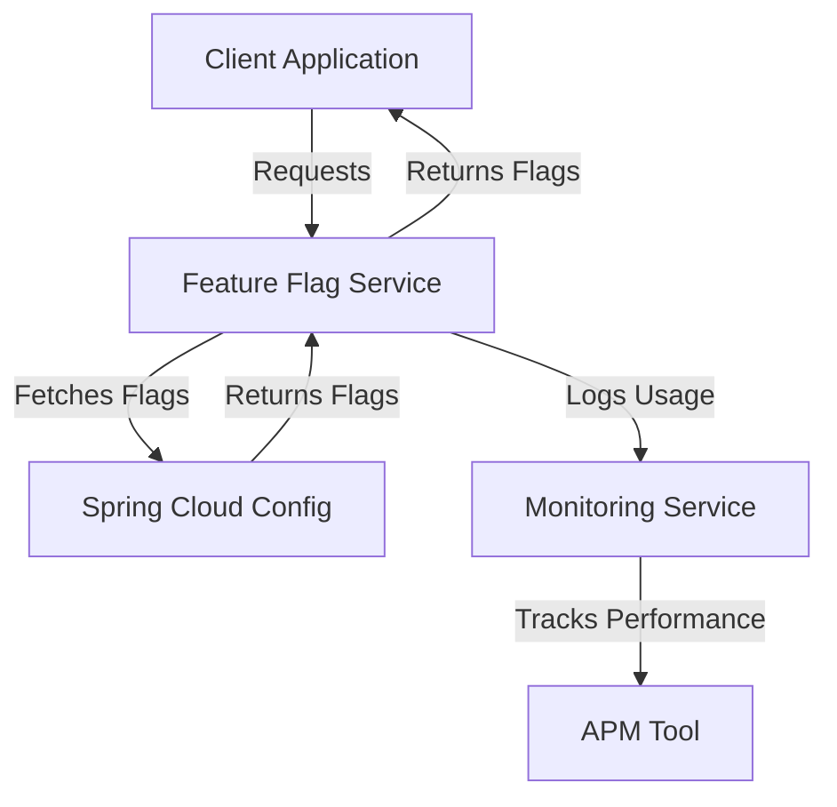

# Feature Flags — Spring Boot

## Overview and scope

The purpose of this document is to establish a standardized approach for implementing feature flags within Spring Boot applications at Xentic. Feature flags are essential for enabling or disabling features dynamically, allowing for controlled rollouts, A/B testing, and quick reversals of features in production environments.

### Audience

This document is intended for:

- Software Engineers
- Technical Architects
- Quality Assurance Engineers
- DevOps Engineers

### Scope

This standard applies to all Java-based Spring Boot applications developed within Xentic. It encompasses:

- Implementation of feature flags using Spring Cloud Config
- Configuration management for feature flags
- Best practices for testing and deploying features controlled by flags
- Guidelines for monitoring and auditing feature flag usage

### Non-goals

This document does NOT cover:

- The implementation of feature flags in non-Spring Boot applications
- Detailed instructions on feature development or testing methodologies
- Specific business logic related to the features themselves

### Glossary

| Term                | Definition                                                                 |
|---------------------|-----------------------------------------------------------------------------|
| Feature Flag        | A technique to enable or disable features in an application without deploying new code. |
| Spring Cloud Config | A tool to manage application configuration across all environments.        |
| A/B Testing         | A method of comparing two versions of a feature to determine which performs better. |
| Rollout             | The process of gradually enabling a feature for users.                    |

### How this standard fits the Xentic platform

Implementing feature flags in alignment with this standard will ensure consistency across all Xentic applications, enhance deployment agility, and improve the overall user experience. By adhering to these guidelines, teams can:

- Facilitate safer deployments and reduce the risk of introducing bugs into production.
- Enable rapid experimentation and feedback loops for new features.
- Maintain a clear audit trail of feature flag usage, improving accountability and traceability.

### Example Configuration

To configure feature flags in a Spring Boot application, you MUST use the following YAML format in your `application.yml` file:

```yaml
feature:
  flags:
    newFeatureX: true
    betaFeatureY: false
```

### Example Code Usage

To access feature flags within your Spring Boot application, you MUST use the `@Value` annotation as shown below:

```java
import org.springframework.beans.factory.annotation.Value;
import org.springframework.stereotype.Service;

@Service
public class FeatureService {

    @Value("${feature.flags.newFeatureX}")
    private boolean newFeatureX;

    public void executeFeature() {
        if (newFeatureX) {
            // Execute code for new feature X
        } else {
            // Execute fallback code
        }
    }
}
```

By following this standard, Xentic aims to enhance the robustness and maintainability of its applications while ensuring a consistent approach to feature management.

## Standards and policies

1. **MUST** implement feature flags using Spring Cloud Config for centralized management across environments. This ensures that all feature flags are easily configurable without requiring redeployment of the application.

2. **MUST NOT** hard-code feature flag values within the application code. All feature flags MUST be externalized in the configuration files (e.g., `application.yml` or `application.properties`) to facilitate dynamic changes.

3. **SHOULD** use a naming convention for feature flags that clearly indicates their purpose. Feature flags should be prefixed with a clear identifier, such as `feature.flags.<featureName>`.

4. **MUST** document each feature flag in a centralized repository, including the following details:
   - Purpose of the flag
   - Default value
   - Owner responsible for the flag
   - Rollout plan and timeline

5. **MUST NOT** leave feature flags in the codebase without proper management. Once a feature is fully rolled out and stable, the corresponding feature flag MUST be removed to reduce technical debt.

6. **SHOULD** implement a monitoring mechanism to track the usage and performance of features controlled by flags. This can be achieved using application performance monitoring (APM) tools integrated with the Spring Boot application.

7. **MUST** ensure that feature flags are tested thoroughly in all environments before being enabled in production. This includes unit tests, integration tests, and user acceptance testing (UAT).

8. **SHOULD** provide a fallback mechanism for features controlled by flags. If a feature fails or is disabled, the application MUST gracefully revert to a stable state without impacting the user experience.

9. **MUST** use a version control system to manage changes to feature flag configurations. All changes to feature flags MUST be tracked and reviewed to ensure accountability.

10. **MUST NOT** use feature flags for long-term feature management. Feature flags are intended for short-term use during the rollout phase and MUST be removed once the feature is stable and fully deployed.

11. **SHOULD** consider implementing a toggle interface in the application to allow for real-time enabling or disabling of feature flags, provided it does not compromise security or stability.

12. **MUST** include feature flag checks in the application’s main execution paths to ensure that the correct logic is executed based on the current state of the feature flags.

### Example Feature Flag Configuration

Here is an example of how to define feature flags in `application.yml`:

```yaml
feature:
  flags:
    newFeatureX: true
    betaFeatureY: false
    experimentalFeatureZ: true
```

### Example SQL for Feature Flag Management

To manage feature flags in a relational database, you MUST create a table as follows:

```sql
CREATE TABLE feature_flags (
    id SERIAL PRIMARY KEY,
    feature_name VARCHAR(255) NOT NULL UNIQUE,
    enabled BOOLEAN NOT NULL DEFAULT FALSE,
    description TEXT,
    created_at TIMESTAMP DEFAULT CURRENT_TIMESTAMP,
    updated_at TIMESTAMP DEFAULT CURRENT_TIMESTAMP ON UPDATE CURRENT_TIMESTAMP
);
```

### Example Code for Feature Flag Check

When implementing feature flags in your service, you MUST check the flag status as shown below:

```java
import org.springframework.beans.factory.annotation.Autowired;
import org.springframework.stereotype.Service;

@Service
public class FeatureService {

    @Autowired
    private FeatureFlagRepository featureFlagRepository;

    public void executeFeature() {
        boolean isFeatureEnabled = featureFlagRepository.isFeatureEnabled("newFeatureX");
        
        if (isFeatureEnabled) {
            // Execute code for new feature X
        } else {
            // Execute fallback code
        }
    }
}
```

By adhering to these standards and policies, Xentic will ensure a structured and efficient approach to feature flag management across all its Spring Boot applications.

## Architecture and design

The architecture for implementing feature flags in Spring Boot applications at Xentic is designed to ensure flexibility, scalability, and maintainability. The following components and data flows are essential for the effective management of feature flags.

### Component Diagram



### Data Flows

1. **Client Application**: The application requests feature flags from the Feature Flag Service.
2. **Feature Flag Service**: This service retrieves feature flags from Spring Cloud Config and returns them to the client application.
3. **Monitoring Service**: Logs the usage of feature flags to track which features are enabled and how they perform.
4. **APM Tool**: Monitors the performance of features based on the flags and provides insights.

### Integration Points

- **Spring Cloud Config**: Centralized configuration management for feature flags.
- **Monitoring Service**: Integrates with the Feature Flag Service to log feature usage and performance metrics.
- **APM Tool**: Provides insights into the performance of features controlled by flags.

### Failure Domains

- **Feature Flag Service Failure**: If the Feature Flag Service is down, the application should revert to default feature configurations.
- **Spring Cloud Config Failure**: The application MUST handle scenarios where it cannot fetch the latest configurations, possibly using cached values.
- **Monitoring Service Failure**: The application should continue to function normally even if monitoring is temporarily unavailable, but it should log the failure for later review.

### Implementation Guidelines

- **Feature Flag Service**: This service MUST be stateless and should cache feature flags to reduce latency. 

```java
import org.springframework.beans.factory.annotation.Autowired;
import org.springframework.cache.annotation.Cacheable;
import org.springframework.stereotype.Service;

@Service
public class FeatureFlagService {

    @Autowired
    private FeatureFlagRepository featureFlagRepository;

    @Cacheable("featureFlags")
    public boolean isFeatureEnabled(String featureName) {
        return featureFlagRepository.isFeatureEnabled(featureName);
    }
}
```

- **Monitoring Usage**: The application MUST log feature flag usage to a monitoring service for auditing and performance analysis.

```java
import org.slf4j.Logger;
import org.slf4j.LoggerFactory;

@Service
public class FeatureService {

    private static final Logger logger = LoggerFactory.getLogger(FeatureService.class);

    @Autowired
    private FeatureFlagService featureFlagService;

    public void executeFeature() {
        boolean isFeatureEnabled = featureFlagService.isFeatureEnabled("newFeatureX");
        
        logger.info("Feature newFeatureX enabled: {}", isFeatureEnabled);
        
        if (isFeatureEnabled) {
            // Execute code for new feature X
        } else {
            // Execute fallback code
        }
    }
}
```

### Summary

By following the architecture and design guidelines outlined above, Xentic ensures a robust implementation of feature flags within its Spring Boot applications. This approach enhances the ability to manage features dynamically, supports controlled rollouts, and provides a clear mechanism for monitoring and auditing feature usage.

## Configuration reference

The configuration of feature flags in Xentic's Spring Boot applications can be managed through various means, including `application.yml`, Terraform configurations, and environment variables. Below are the detailed references for each method.

### application.yml Configuration

You MUST define feature flags in the `application.yml` file as follows:

```yaml
feature:
  flags:
    newFeatureX: true        # Default value for development
    betaFeatureY: false      # Default value for development
    experimentalFeatureZ: true # Default value for development
```

### Environment Variables

You SHOULD also provide the option to configure feature flags through environment variables. Below is a table showing the environment variable names and their corresponding default values:

| Environment Variable               | Default Value | Production Value |
|------------------------------------|---------------|------------------|
| `FEATURE_FLAGS_NEW_FEATURE_X`     | `true`        | `false`          |
| `FEATURE_FLAGS_BETA_FEATURE_Y`    | `false`       | `true`           |
| `FEATURE_FLAGS_EXPERIMENTAL_FEATURE_Z` | `true`   | `false`          |

### Terraform Configuration

If you are using Terraform for infrastructure management, you MUST define feature flags in your Terraform configuration files. Below is an example of how to set feature flags using Terraform:

```hcl
variable "feature_flags" {
  type = map(bool)
  default = {
    newFeatureX                = true
    betaFeatureY               = false
    experimentalFeatureZ       = true
  }
}

resource "aws_ssm_parameter" "feature_flags" {
  for_each = var.feature_flags

  name  = "/feature/flags/${each.key}"
  type  = "String"
  value = each.value ? "true" : "false"
}
```

### Summary of Configuration Methods

- **application.yml**: Centralized configuration file for defining feature flags.
- **Environment Variables**: Allows for dynamic configuration based on the environment.
- **Terraform**: Infrastructure as code approach to manage feature flags.

### Best Practices

- **MUST** ensure that the configuration is consistent across all environments (development, staging, production).
- **SHOULD** use a centralized configuration management system (e.g., Spring Cloud Config) to manage feature flags effectively.
- **MUST NOT** expose sensitive feature flag configurations in public repositories or logs.

By adhering to these configuration standards, Xentic will maintain a robust and flexible feature flag management system across its Spring Boot applications.

## Implementation guide

To implement feature flags in your Spring Boot application at Xentic, follow these detailed steps:

### Step 1: Define Feature Flags in `application.yml`

You MUST define your feature flags in the `application.yml` file to ensure they are easily configurable. Here’s an example:

```yaml
feature:
  flags:
    newFeatureX: true
    betaFeatureY: false
    experimentalFeatureZ: true
```

### Step 2: Create a Database Table for Feature Flags

You MUST create a database table to manage feature flags dynamically. Use the following SQL:

```sql
CREATE TABLE feature_flags (
    id SERIAL PRIMARY KEY,
    feature_name VARCHAR(255) NOT NULL UNIQUE,
    enabled BOOLEAN NOT NULL DEFAULT FALSE,
    description TEXT,
    created_at TIMESTAMP DEFAULT CURRENT_TIMESTAMP,
    updated_at TIMESTAMP DEFAULT CURRENT_TIMESTAMP ON UPDATE CURRENT_TIMESTAMP
);
```

### Step 3: Create a Feature Flag Repository

You MUST create a repository interface to interact with the feature flags stored in the database. Here’s an example using Spring Data JPA:

```java
import org.springframework.data.jpa.repository.JpaRepository;
import org.springframework.stereotype.Repository;

@Repository
public interface FeatureFlagRepository extends JpaRepository<FeatureFlag, Long> {
    boolean isFeatureEnabled(String featureName);
}
```

### Step 4: Implement the Feature Flag Service

You MUST implement a service that checks the feature flag status. This service should cache the results to improve performance.

```java
import org.springframework.beans.factory.annotation.Autowired;
import org.springframework.cache.annotation.Cacheable;
import org.springframework.stereotype.Service;

@Service
public class FeatureFlagService {

    @Autowired
    private FeatureFlagRepository featureFlagRepository;

    @Cacheable("featureFlags")
    public boolean isFeatureEnabled(String featureName) {
        return featureFlagRepository.findById(featureName)
                .map(FeatureFlag::isEnabled)
                .orElse(false);
    }
}
```

### Step 5: Use Feature Flags in Your Business Logic

You MUST check the feature flags in your application’s business logic to enable or disable features dynamically.

```java
import org.springframework.beans.factory.annotation.Autowired;
import org.springframework.stereotype.Service;

@Service
public class FeatureService {

    @Autowired
    private FeatureFlagService featureFlagService;

    public void executeFeature() {
        boolean isFeatureEnabled = featureFlagService.isFeatureEnabled("newFeatureX");
        
        if (isFeatureEnabled) {
            // Execute code for new feature X
            System.out.println("Executing new feature X");
        } else {
            // Execute fallback code
            System.out.println("Executing fallback for new feature X");
        }
    }
}
```

### Step 6: Monitor Feature Flag Usage

You SHOULD log the usage of feature flags to track which features are being used. This can be done within the same service where the feature flags are checked.

```java
import org.slf4j.Logger;
import org.slf4j.LoggerFactory;

@Service
public class FeatureService {

    private static final Logger logger = LoggerFactory.getLogger(FeatureService.class);

    @Autowired
    private FeatureFlagService featureFlagService;

    public void executeFeature() {
        boolean isFeatureEnabled = featureFlagService.isFeatureEnabled("newFeatureX");
        
        logger.info("Feature newFeatureX enabled: {}", isFeatureEnabled);
        
        if (isFeatureEnabled) {
            // Execute code for new feature X
            System.out.println("Executing new feature X");
        } else {
            // Execute fallback code
            System.out.println("Executing fallback for new feature X");
        }
    }
}
```

### Step 7: Testing Feature Flags

You MUST write unit tests to ensure that your feature flag implementation works as expected. Here’s an example test case:

```java
import static org.mockito.Mockito.*;
import static org.junit.jupiter.api.Assertions.*;

import org.junit.jupiter.api.Test;
import org.mockito.InjectMocks;
import org.mockito.Mock;
import org.mockito.MockitoAnnotations;

public class FeatureServiceTest {

    @InjectMocks
    private FeatureService featureService;

    @Mock
    private FeatureFlagService featureFlagService;

    @Test
    public void testExecuteFeatureWhenEnabled() {
        when(featureFlagService.isFeatureEnabled("newFeatureX")).thenReturn(true);
        
        featureService.executeFeature();
        
        // Verify that the feature execution logic is called
        // Add assertions as necessary
    }

    @Test
    public void testExecuteFeatureWhenDisabled() {
        when(featureFlagService.isFeatureEnabled("newFeatureX")).thenReturn(false);
        
        featureService.executeFeature();
        
        // Verify that the fallback logic is called
        // Add assertions as necessary
    }
}
```

### Summary

By following these implementation steps, Xentic ensures a robust feature flag management system within its Spring Boot applications. This allows for dynamic feature control, testing, and monitoring, ultimately leading to better software delivery and user experience.

## Security requirements

To ensure the security of feature flags in Xentic's Spring Boot applications, the following security requirements MUST be adhered to:

### Threat Model Summary

1. **Insider Threats**: Employees with access to feature flags could enable or disable features maliciously.
2. **External Attacks**: Attackers could exploit vulnerabilities to manipulate feature flags.
3. **Data Exposure**: Sensitive information related to feature flags could be exposed through logs or misconfigurations.

### Authentication and Authorization (Authn/z)

- **MUST** implement role-based access control (RBAC) to restrict access to feature flag management functionalities. Only authorized personnel should be able to modify feature flags.
- **SHOULD** utilize OAuth2 or JWT tokens for secure API access to feature flag endpoints.
- **MUST NOT** expose feature flag management endpoints to the public internet without proper authentication mechanisms.

### Secrets Management

- **MUST** use a secrets management tool (e.g., HashiCorp Vault, AWS Secrets Manager) to store sensitive information related to feature flags, such as database credentials or API keys.
- **MUST** ensure that secrets are not hardcoded in the application code or configuration files.
- **SHOULD** rotate secrets regularly to minimize the impact of potential leaks.

### Input Validation

- **MUST** validate all inputs related to feature flags to prevent injection attacks. This includes validating feature names and values.
- **SHOULD** implement strict data types and length constraints in the database schema for feature flags.
- **MUST NOT** allow arbitrary input for feature flag names or values, as this can lead to security vulnerabilities.

### Audit Logging

- **MUST** implement audit logging for all operations related to feature flags, including creation, updates, and deletions. The logs should capture:
  - User ID of the person making the change
  - Timestamp of the action
  - Previous and new values of the feature flag
- **SHOULD** store audit logs in a secure and tamper-proof manner, using a centralized logging system (e.g., ELK stack).
- **MUST NOT** log sensitive information, such as user passwords or API keys, in audit logs.

### Example Configuration for Security

Below is an example of how to configure security for feature flags in `application.yml`:

```yaml
security:
  oauth2:
    client:
      registration:
        xentic:
          client-id: ${OAUTH_CLIENT_ID}
          client-secret: ${OAUTH_CLIENT_SECRET}
          scope: read,write
      provider:
        xentic:
          authorization-uri: https://auth.internal.xentic.io/oauth/authorize
          token-uri: https://auth.internal.xentic.io/oauth/token
  secrets:
    vault:
      enabled: true
      uri: https://vault.internal.xentic.io
      token: ${VAULT_TOKEN}
```

### Example Audit Logging Implementation

To implement audit logging for feature flag changes, you can use the following code snippet:

```java
import org.slf4j.Logger;
import org.slf4j.LoggerFactory;
import org.springframework.stereotype.Service;

@Service
public class FeatureFlagService {

    private static final Logger logger = LoggerFactory.getLogger(FeatureFlagService.class);

    public void updateFeatureFlag(String featureName, boolean enabled) {
        // Logic to update the feature flag in the database
        logger.info("Feature flag updated: {} - New value: {}", featureName, enabled);
    }
}
```

### Summary of Security Requirements

- **MUST** enforce strict authentication and authorization controls for feature flag management.
- **SHOULD** utilize secrets management for sensitive configurations.
- **MUST NOT** compromise on input validation to prevent security vulnerabilities.
- **MUST** maintain comprehensive audit logs for accountability.

By adhering to these security requirements, Xentic will ensure a secure and reliable feature flag management system within its Spring Boot applications.

## Testing strategy

To ensure the reliability and correctness of the feature flag implementation at Xentic, a comprehensive testing strategy MUST be adopted. This strategy encompasses unit tests, integration tests, and contract tests, along with defined coverage targets.

### Unit Tests

Unit tests MUST be written for individual components of the feature flag system. Each test should validate the expected behavior of methods in isolation. The following coverage targets are recommended:

| Coverage Type    | Target Percentage |
|-------------------|------------------|
| Unit Tests        | 80%               |
| Integration Tests | 70%               |
| Contract Tests    | 90%               |

#### Example Unit Test Class

Here is an example of a unit test for the `FeatureFlagService`:

```java
import static org.junit.jupiter.api.Assertions.*;
import static org.mockito.Mockito.*;

import org.junit.jupiter.api.BeforeEach;
import org.junit.jupiter.api.Test;
import org.mockito.InjectMocks;
import org.mockito.Mock;
import org.mockito.MockitoAnnotations;

public class FeatureFlagServiceTest {

    @InjectMocks
    private FeatureFlagService featureFlagService;

    @Mock
    private FeatureFlagRepository featureFlagRepository;

    @BeforeEach
    public void init() {
        MockitoAnnotations.openMocks(this);
    }

    @Test
    public void testIsFeatureEnabledWhenExists() {
        FeatureFlag featureFlag = new FeatureFlag("newFeatureX", true);
        when(featureFlagRepository.findById("newFeatureX")).thenReturn(Optional.of(featureFlag));

        boolean result = featureFlagService.isFeatureEnabled("newFeatureX");
        
        assertTrue(result);
        verify(featureFlagRepository).findById("newFeatureX");
    }

    @Test
    public void testIsFeatureEnabledWhenNotExists() {
        when(featureFlagRepository.findById("nonExistentFeature")).thenReturn(Optional.empty());

        boolean result = featureFlagService.isFeatureEnabled("nonExistentFeature");
        
        assertFalse(result);
        verify(featureFlagRepository).findById("nonExistentFeature");
    }
}
```

### Integration Tests

Integration tests MUST validate the interaction between components, ensuring that the feature flag service works correctly with the database and other services. These tests should cover scenarios such as:

- Enabling and disabling features
- Persistence of feature flag states
- Interaction with external services (if applicable)

#### Example Integration Test Class

Here’s an example of an integration test using Spring Boot’s testing capabilities:

```java
import static org.springframework.test.web.servlet.request.MockMvcRequestBuilders.*;
import static org.springframework.test.web.servlet.result.MockMvcResultMatchers.*;

import org.junit.jupiter.api.Test;
import org.springframework.beans.factory.annotation.Autowired;
import org.springframework.boot.test.autoconfigure.web.servlet.WebMvcTest;
import org.springframework.test.web.servlet.MockMvc;

@WebMvcTest(FeatureController.class)
public class FeatureControllerIntegrationTest {

    @Autowired
    private MockMvc mockMvc;

    @Test
    public void testGetFeatureFlag() throws Exception {
        mockMvc.perform(get("/features/newFeatureX"))
                .andExpect(status().isOk())
                .andExpect(jsonPath("$.enabled").value(true));
    }
}
```

### Contract Tests

Contract tests MUST be implemented to ensure that the feature flag service adheres to the expected API contracts. These tests validate that the service responds correctly to various requests and that the responses match the expected formats.

#### Example Contract Test Class

Using a tool like Pact, you can define a contract test as follows:

```java
import au.com.dius.pact.consumer.junit5.PactConsumerTestExt;
import au.com.dius.pact.consumer.junit5.Pact;
import au.com.dius.pact.consumer.dsl.PactDslWithProvider;
import org.junit.jupiter.api.extension.ExtendWith;

@ExtendWith(PactConsumerTestExt.class)
public class FeatureFlagContractTest {

    @Pact(consumer = "FeatureConsumer", provider = "FeatureProvider")
    public RequestResponsePact createPact(PactDslWithProvider builder) {
        return builder
                .given("Feature newFeatureX is enabled")
                .uponReceiving("A request for feature newFeatureX")
                .path("/features/newFeatureX")
                .method("GET")
                .willRespondWith()
                .status(200)
                .body("{\"enabled\": true}")
                .toPact();
    }
}
```

### Coverage and Reporting

- You MUST use tools like JaCoCo for measuring code coverage and ensuring that the defined targets are met.
- Regular reports should be generated and reviewed to identify areas for improvement.

### Summary

By implementing a robust testing strategy that includes unit, integration, and contract tests, Xentic can ensure the reliability and correctness of its feature flag management system. This approach will enhance the overall quality of the software and reduce the risk of defects in production.

## Observability and operations

To ensure effective observability and operations of the feature flag system at Xentic, the following practices MUST be implemented. This includes monitoring metrics, logs, traces, dashboards, alerts, and defining Service Level Objectives (SLOs) along with on-call runbook steps.

### Metrics

- **MUST** collect metrics related to feature flag usage, including:
  - Number of feature flags enabled/disabled
  - Request rates for feature flag checks
  - Latency of feature flag retrieval
  - Error rates in feature flag operations

#### Example Metrics Configuration

Metrics can be configured in `application.yml` as follows:

```yaml
management:
  metrics:
    export:
      prometheus:
        enabled: true
```

### Logs

- **MUST** log all feature flag operations at the appropriate log level (INFO for successful operations, ERROR for failures).
- **SHOULD** include contextual information in logs, such as:
  - Feature flag name
  - User ID (if applicable)
  - Operation type (create, update, delete)

#### Example Logging Configuration

```yaml
logging:
  level:
    com.xentic.featureflags: INFO
```

#### Example Log Statement

```java
logger.info("Feature flag {} has been {} by user {}", featureName, operation, userId);
```

### Traces

- **MUST** implement distributed tracing for feature flag operations to identify bottlenecks and performance issues.
- **SHOULD** use tools like Spring Cloud Sleuth or Zipkin for tracing requests across microservices.

#### Example Trace Configuration

```yaml
spring:
  sleuth:
    sampler:
      probability: 1.0
```

### Dashboards

- **MUST** create dashboards to visualize metrics and logs related to feature flags.
- **SHOULD** use tools like Grafana or Kibana to create these dashboards, displaying:
  - Feature flag usage trends
  - Latency and error rates
  - Alerts for anomalies

#### Example Dashboard Metrics

| Metric                     | Description                             |
|----------------------------|-----------------------------------------|
| Enabled Feature Flags      | Count of currently enabled flags        |
| Feature Check Latency      | Average latency for feature flag checks |
| Error Rate                 | Percentage of failed feature flag requests |

### Alerts

- **MUST** set up alerts for critical metrics, such as:
  - High error rates (e.g., > 5% failure rate)
  - Latency spikes (e.g., > 500ms for feature flag checks)
- **SHOULD** use tools like Prometheus Alertmanager or PagerDuty to manage alerts.

#### Example Alert Configuration

```yaml
groups:
  - name: feature-flag-alerts
    rules:
      - alert: HighErrorRate
        expr: rate(feature_flag_errors_total[5m]) > 0.05
        for: 10m
        labels:
          severity: critical
        annotations:
          summary: "High error rate for feature flags"
          description: "More than 5% of feature flag requests are failing."
```

### Service Level Objectives (SLOs)

- **MUST** define SLOs for feature flag operations, including:
  - Availability: 99.9% uptime for feature flag service
  - Performance: 95% of feature flag checks must respond within 200ms

#### Example SLO Tracking

| SLO Category   | Objective               | Current Status |
|----------------|-------------------------|-----------------|
| Availability    | 99.9% uptime            | 99.95%          |
| Performance     | 95% < 200ms response    | 98%             |

### On-Call Runbook Steps

In the event of an incident related to feature flags, the following on-call runbook steps MUST be followed:

1. **Identify the Issue**: Check logs and metrics for anomalies related to feature flag operations.
2. **Assess Impact**: Determine the scope of the issue (e.g., which features are affected).
3. **Communicate**: Notify relevant stakeholders via the incident management tool.
4. **Mitigate**: If necessary, disable problematic feature flags to restore service.
5. **Document**: Record the incident details and resolution steps in the incident management system.
6. **Post-Mortem**: Conduct a post-mortem analysis to identify root causes and preventive measures.

By adhering to these observability and operations guidelines, Xentic will ensure that the feature flag system is robust, reliable, and maintainable, allowing for quick identification and resolution of issues.

## Migration and versioning

When implementing feature flags within Xentic's Spring Boot applications, it is essential to establish clear migration and versioning strategies to manage changes effectively. This section outlines the upgrade paths, deprecation policy, backward compatibility, and rollback procedures.

### Upgrade Paths

- **MUST** define clear upgrade paths for feature flag versions. Each version should be documented with the following details:
  - **Version Number**: Incremented for each release.
  - **Release Date**: Date when the version is made available.
  - **Changes**: Summary of changes, including new features, bug fixes, and breaking changes.

#### Example Versioning Table

| Version | Release Date | Changes                               |
|---------|--------------|---------------------------------------|
| 1.0.0  | 2023-01-15   | Initial release                       |
| 1.1.0  | 2023-03-10   | Added support for dynamic flags       |
| 2.0.0  | 2023-06-20   | Breaking change: API endpoint updated |

### Deprecation Policy

- **MUST NOT** remove features without a deprecation period. Features should be marked as deprecated for at least one major version before removal.
- **SHOULD** provide clear communication regarding deprecations through release notes and internal documentation.

#### Example Deprecation Notice

```markdown
### Deprecation Notice for Feature Flag API

The endpoint `/features/{featureName}` will be deprecated in version 2.0.0. Please migrate to `/api/v2/features/{featureName}` by the end of Q3 2023.
```

### Backward Compatibility

- **MUST** ensure that new versions maintain backward compatibility with existing feature flags and configurations. This includes:
  - Supporting existing API endpoints.
  - Preserving the behavior of feature flags that are currently in use.
- **SHOULD** include a compatibility layer if breaking changes are unavoidable.

#### Example Compatibility Layer Configuration

```yaml
feature-flags:
  compatibility:
    enabled: true
    version: 1.0.0
```

### Rollback Procedures

In the event of issues arising from a new feature flag version, a rollback procedure MUST be in place to revert to a previous stable version. This includes:

1. **Identify the Issue**: Monitor logs and metrics to determine the cause of the failure.
2. **Rollback Plan**:
   - Use version control systems (e.g., Git) to revert to the last stable commit.
   - Update the deployment pipeline to deploy the previous version.
3. **Testing**: Validate the rollback in a staging environment before deploying to production.
4. **Communication**: Notify stakeholders of the rollback and any implications.

#### Example Rollback Command

```bash
# Rollback to the previous stable version
git checkout v1.0.0
```

### Migration Scripts

- **MUST** provide migration scripts for database changes associated with feature flag updates. These scripts should be versioned and included in the release package.

#### Example Migration Script (SQL)

```sql
-- Migration script to add a new feature flag
INSERT INTO feature_flags (name, enabled, created_at) VALUES ('newFeatureY', true, NOW());
```

### Documentation

- **MUST** maintain comprehensive documentation for each version, including:
  - Migration guides
  - Change logs
  - API documentation

#### Example Documentation Structure

```markdown
# Feature Flags Migration Guide

## Version 1.0.0 to 1.1.0
- Added dynamic feature flag support.
- Update your configurations to include the new `dynamic` field.

## Version 1.1.0 to 2.0.0
- Breaking change: API endpoint updated.
- Migrate to `/api/v2/features/{featureName}`.
```

By adhering to these migration and versioning standards, Xentic can ensure a smooth transition between feature flag versions, maintain stability, and minimize disruptions to the development and deployment processes.

## FAQ, anti-patterns, and checklists

### FAQ

1. **What are feature flags?**
   - Feature flags are a technique to enable or disable features in your application without deploying new code.

2. **When should I use feature flags?**
   - Feature flags should be used for gradual rollouts, A/B testing, and to control features in production without redeploying.

3. **How do I define a feature flag in Spring Boot?**
   - Feature flags can be defined in `application.yml` or as environment variables.

   ```yaml
   feature-flags:
     newFeatureX: true
   ```

4. **What is the difference between a feature toggle and a feature flag?**
   - A feature toggle is a broader term that includes feature flags but also encompasses other techniques for controlling feature visibility.

5. **How do I handle feature flag dependencies?**
   - Feature flags should be independent. If a feature relies on another, consider using a composite feature flag.

6. **What happens if I forget to remove a feature flag?**
   - Unused feature flags can clutter the codebase and lead to technical debt. Regular audits of feature flags are essential.

7. **Can I use feature flags in production?**
   - Yes, feature flags are designed for production use, allowing for safe experimentation and gradual rollouts.

8. **How do I test feature flags?**
   - Feature flags should be tested in isolation and as part of integration tests to ensure they function correctly.

9. **What tools can I use for managing feature flags?**
   - Tools like LaunchDarkly, Unleash, or custom solutions can be used for managing feature flags.

10. **How do I monitor feature flag performance?**
    - Use metrics and logging to track feature flag usage and performance, as outlined in previous sections.

### Anti-Patterns

| Anti-Pattern                     | Description                                                                 |
|----------------------------------|-----------------------------------------------------------------------------|
| Hardcoding Flags                 | **MUST NOT** hardcode feature flags in the codebase; use configuration files. |
| Overusing Flags                  | **MUST NOT** create too many feature flags; keep them manageable and relevant. |
| Ignoring Cleanup                 | **MUST NOT** forget to remove feature flags after their purpose has been served. |
| Inconsistent Naming              | **MUST** use consistent naming conventions for feature flags to avoid confusion. |
| Flag Dependencies                | **MUST NOT** create feature flags that depend on each other; keep them independent. |
| Lack of Documentation            | **MUST** document each feature flag's purpose and usage to aid future developers. |
| Not Monitoring                   | **MUST** monitor feature flag performance; neglecting this can lead to unnoticed issues. |

### Pre-Merge Checklist

- **MUST** ensure all feature flags are documented.
- **MUST NOT** merge code with hardcoded feature flags.
- **SHOULD** run tests with all feature flags in both enabled and disabled states.
- **MUST** review the impact of feature flags on existing functionality.
- **SHOULD** ensure that any new feature flags have a clear purpose and usage.

### Production Checklist

- **MUST** verify that all feature flags are configured correctly in the production environment.
- **MUST** enable monitoring for all feature flags.
- **MUST NOT** deploy with untested feature flags.
- **SHOULD** conduct a final review of feature flags before deployment.
- **MUST** communicate any feature flag changes to the team and stakeholders.
