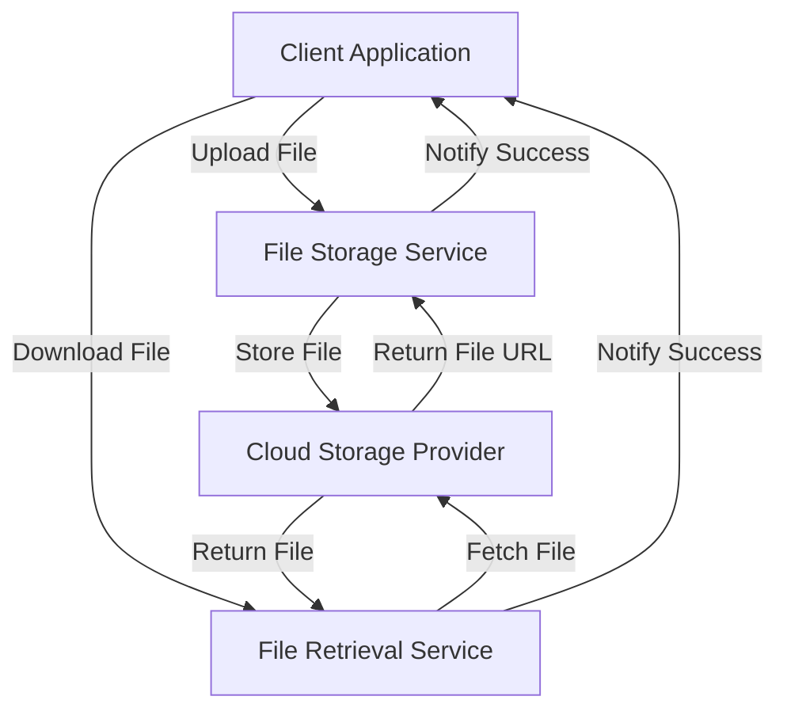

# File Storage Integration — Spring Boot

## Overview and scope

The purpose of this document is to outline the standards and best practices for integrating file storage solutions within Spring Boot applications at Xentic. This standard aims to provide a consistent approach to file storage that enhances maintainability, scalability, and security across all services.

### Audience

This document is intended for:
- Software Engineers
- Technical Architects
- DevOps Engineers
- Quality Assurance Engineers

### Scope

This standard covers:
- Integration with various file storage solutions (e.g., AWS S3, Google Cloud Storage, Azure Blob Storage)
- Configuration management for file storage services
- File upload and download best practices
- Security considerations for file storage
- Error handling and logging mechanisms

### Non-goals

This document does NOT cover:
- Detailed implementation of specific file storage providers
- Non-Spring Boot applications
- General file management practices outside the context of file storage integration

### Glossary

| Term                  | Definition                                                                 |
|-----------------------|-----------------------------------------------------------------------------|
| File Storage          | A service that allows for the storage and retrieval of files over a network. |
| Spring Boot           | A framework that simplifies the development of Java applications.           |
| Configuration         | Settings that define how the application interacts with external services.  |
| API                   | Application Programming Interface, a set of rules for interacting with software components. |
| Security              | Measures taken to protect files from unauthorized access or breaches.      |

### How This Standard Fits the Xentic Platform

This standard is integral to the Xentic platform as it ensures that all file storage integrations adhere to a unified approach. By following these guidelines, teams can:
- Enhance interoperability between services
- Reduce technical debt through consistent coding practices
- Improve security and compliance with internal policies

### Example Configuration

Below is an example of how to configure AWS S3 file storage in a Spring Boot application using `application.yml`:

```yaml
aws:
  s3:
    bucket: my-xentic-bucket
    region: us-west-2
    access-key-id: ${AWS_ACCESS_KEY_ID}
    secret-access-key: ${AWS_SECRET_ACCESS_KEY}
```

### Example Code Snippet

Here is a basic example of a service that uploads a file to S3:

```java
package com.xentic.filestorage.service;

import org.springframework.beans.factory.annotation.Autowired;
import org.springframework.stereotype.Service;
import org.springframework.web.multipart.MultipartFile;
import com.amazonaws.services.s3.AmazonS3;

@Service
public class FileStorageService {

    @Autowired
    private AmazonS3 amazonS3;

    public String uploadFile(MultipartFile file) {
        String bucketName = "my-xentic-bucket";
        String fileName = file.getOriginalFilename();
        amazonS3.putObject(bucketName, fileName, file.getInputStream(), null);
        return amazonS3.getUrl(bucketName, fileName).toString();
    }
}
```

By adhering to the standards outlined in this document, Xentic teams will ensure a robust and efficient file storage integration across all services.

## Standards and policies

1. **MUST** use the package naming convention `com.xentic.<service>` for all classes and interfaces related to file storage integration. This ensures consistency and clarity in service identification.

2. **MUST NOT** hardcode sensitive information such as access keys and secret keys in the source code. Instead, utilize environment variables or secure vault services to manage sensitive data.

3. **SHOULD** use Spring Profiles to manage different configurations for development, testing, and production environments. This allows for seamless transitions between environments without code changes.

   Example configuration using Spring Profiles:
   ```yaml
   spring:
     profiles:
       active: dev
   ---
   spring:
     config:
       activate:
         on-profile: dev
     aws:
       s3:
         bucket: my-xentic-bucket-dev
   ---
   spring:
     config:
       activate:
         on-profile: prod
     aws:
       s3:
         bucket: my-xentic-bucket-prod
   ```

4. **MUST** implement error handling and logging for all file storage operations. Use a centralized logging framework (e.g., SLF4J with Logback) to capture and log errors effectively.

   Example of error handling:
   ```java
   public String uploadFile(MultipartFile file) {
       try {
           // Upload logic
       } catch (Exception e) {
           logger.error("Failed to upload file: {}", file.getOriginalFilename(), e);
           throw new FileStorageException("Could not upload file. Please try again.", e);
       }
   }
   ```

5. **MUST** validate file types and sizes before uploading to the storage service to prevent malicious file uploads and ensure compliance with storage policies.

   Example of file validation:
   ```java
   public void validateFile(MultipartFile file) {
       String contentType = file.getContentType();
       if (!Arrays.asList("image/jpeg", "image/png", "application/pdf").contains(contentType)) {
           throw new InvalidFileTypeException("Unsupported file type: " + contentType);
       }
       if (file.getSize() > 10485760) { // 10 MB limit
           throw new FileSizeExceededException("File size exceeds the maximum limit of 10 MB.");
       }
   }
   ```

6. **SHOULD** use asynchronous processing for large file uploads to improve application performance and user experience. Consider using Spring’s `@Async` annotation for this purpose.

7. **MUST** adhere to the security best practices outlined in the Xentic security policies, including the use of HTTPS for all file transfer operations to protect data in transit.

8. **MUST NOT** rely on default configurations of file storage services without reviewing and customizing them to meet Xentic's security and performance standards.

9. **SHOULD** implement a versioning strategy for files stored in cloud storage to facilitate easy rollback and management of file changes.

10. **MUST** document all file storage integrations in the service’s README or relevant documentation, including details on configuration, usage, and any known limitations.

11. **SHOULD** regularly review and update file storage configurations and libraries to ensure compatibility with the latest versions and security patches.

12. **MUST** use a consistent naming convention for files stored in the file storage service to facilitate easier retrieval and management. Consider using a combination of timestamps, user IDs, and file types.

| Policy Number | Policy Description                                                                 |
|---------------|------------------------------------------------------------------------------------|
| 1             | Use `com.xentic.<service>` package naming convention.                             |
| 2             | Do not hardcode sensitive information.                                             |
| 3             | Use Spring Profiles for configuration management.                                  |
| 4             | Implement error handling and logging.                                              |
| 5             | Validate file types and sizes before uploading.                                   |
| 6             | Use asynchronous processing for large uploads.                                     |
| 7             | Adhere to Xentic security best practices.                                         |
| 8             | Do not rely on default configurations without review.                             |
| 9             | Implement a versioning strategy for files.                                        |
| 10            | Document all file storage integrations.                                            |
| 11            | Regularly review and update configurations and libraries.                         |
| 12            | Use a consistent naming convention for stored files.                              |

By following these standards and policies, Xentic teams will ensure a secure, efficient, and maintainable approach to file storage integration across all services.

## Architecture and design

The architecture for file storage integration in Spring Boot applications at Xentic consists of several key components that facilitate the upload, retrieval, and management of files. The following component diagram illustrates the core components and their interactions:



### Data Flows

- **File Upload Flow**: 
  1. The client application initiates a file upload request.
  2. The request is processed by the `FileStorageService`, which validates the file and interacts with the cloud storage provider.
  3. Upon successful upload, the service returns the file URL to the client.

- **File Retrieval Flow**:
  1. The client application requests a file download.
  2. The `FileRetrievalService` fetches the file from the cloud storage provider.
  3. The file is returned to the client application for access.

### Integration Points

- **File Storage Service**: This service is responsible for handling file uploads and interacting with the cloud storage provider.
- **File Retrieval Service**: This service manages file downloads and retrievals from the cloud storage.
- **Cloud Storage Provider**: This is the external service (e.g., AWS S3, Google Cloud Storage) that stores the files.

### Failure Domains

1. **Client Application**: If the client fails to send a valid file, the upload process will be aborted.
2. **File Storage Service**: If the service encounters an error during file upload (e.g., network issues, invalid file type), it must handle the error gracefully and notify the client.
3. **Cloud Storage Provider**: If the external storage service is unavailable, the application should implement retry logic and fallback mechanisms to ensure resilience.
4. **File Retrieval Service**: Similar to the upload service, if an error occurs while fetching a file, appropriate error handling must be implemented.

### Example SQL Table for File Metadata

To manage file metadata, a database table can be created as follows:

```sql
CREATE TABLE file_metadata (
    id SERIAL PRIMARY KEY,
    file_name VARCHAR(255) NOT NULL,
    file_url VARCHAR(512) NOT NULL,
    upload_date TIMESTAMP DEFAULT CURRENT_TIMESTAMP,
    user_id INT NOT NULL,
    file_size BIGINT NOT NULL,
    content_type VARCHAR(100) NOT NULL
);
```

### Example Configuration for File Retrieval Service

Here is an example configuration for the file retrieval service in `application.yml`:

```yaml
file:
  retrieval:
    base-url: https://files.internal.xentic.io
    timeout: 5000
```

By adhering to this architecture and design, Xentic teams will create a robust file storage integration that is scalable, maintainable, and secure.

## Configuration reference

### application.yml Configuration

The following is a reference for the `application.yml` configuration for file storage integration. It includes default and production values.

```yaml
spring:
  cloud:
    aws:
      s3:
        bucket: my-xentic-bucket
        region: us-east-1
        access-key: ${AWS_ACCESS_KEY}
        secret-key: ${AWS_SECRET_KEY}
        endpoint: https://s3.amazonaws.com
file:
  storage:
    max-file-size: 10MB
    allowed-types:
      - image/jpeg
      - image/png
      - application/pdf
    upload-path: /uploads
    versioning: true
```

### Terraform Configuration

The following Terraform configuration sets up the necessary AWS S3 bucket for file storage.

```hcl
resource "aws_s3_bucket" "xentic_bucket" {
  bucket = "my-xentic-bucket-${var.environment}"
  acl    = "private"
  
  versioning {
    enabled = true
  }

  lifecycle {
    prevent_destroy = true
  }
}

output "bucket_name" {
  value = aws_s3_bucket.xentic_bucket.bucket
}
```

### Environment Variables

The following table outlines the required environment variables for file storage integration, including default and production values.

| Environment Variable | Description                       | Default Value              | Production Value          |
|----------------------|-----------------------------------|----------------------------|---------------------------|
| `AWS_ACCESS_KEY`    | AWS Access Key for S3            | (not set)                  | `your-production-access-key` |
| `AWS_SECRET_KEY`    | AWS Secret Key for S3            | (not set)                  | `your-production-secret-key` |
| `FILE_STORAGE_MAX_SIZE` | Maximum file size allowed (in bytes) | `10485760` (10 MB)        | `10485760` (10 MB)       |
| `FILE_STORAGE_ALLOWED_TYPES` | Allowed file types for upload | `image/jpeg,image/png,application/pdf` | `image/jpeg,image/png,application/pdf` |
| `FILE_STORAGE_UPLOAD_PATH` | Path for uploaded files       | `/uploads`                 | `/uploads`                |

### Additional Configuration Notes

- **MUST** ensure that the AWS credentials are stored securely and accessed through environment variables.
- **MUST NOT** expose sensitive information in the configuration files.
- **SHOULD** use the `application-{profile}.yml` pattern to manage different configurations for various environments (e.g., `application-dev.yml`, `application-prod.yml`).

By following this configuration reference, Xentic teams can ensure a consistent and secure setup for file storage integration across different environments.

## Implementation guide

To implement file storage integration in a Spring Boot application at Xentic, follow these step-by-step instructions. This guide will cover the creation of services for file upload and retrieval, along with the necessary configurations and error handling mechanisms.

### Step 1: Create the File Storage Service

Create a service class that handles file uploads. This service will interact with the cloud storage provider.

```java
package com.xentic.file.storage.service;

import org.springframework.beans.factory.annotation.Autowired;
import org.springframework.stereotype.Service;
import org.springframework.web.multipart.MultipartFile;

import java.io.IOException;

@Service
public class FileStorageService {

    private final CloudStorageProvider cloudStorageProvider;

    @Autowired
    public FileStorageService(CloudStorageProvider cloudStorageProvider) {
        this.cloudStorageProvider = cloudStorageProvider;
    }

    public String uploadFile(MultipartFile file) throws IOException {
        // Validate file type and size
        validateFile(file);

        // Upload file to cloud storage
        String fileUrl = cloudStorageProvider.upload(file);
        return fileUrl;
    }

    private void validateFile(MultipartFile file) {
        // Implement validation logic
        if (file.isEmpty()) {
            throw new IllegalArgumentException("File must not be empty");
        }
        // Additional validations can be added here
    }
}
```

### Step 2: Create the Cloud Storage Provider

Create an interface and implementation for the cloud storage provider. This handles the actual interaction with the cloud service.

```java
package com.xentic.file.storage.service;

import org.springframework.stereotype.Component;
import org.springframework.web.multipart.MultipartFile;

@Component
public class CloudStorageProvider {

    public String upload(MultipartFile file) {
        // Logic to upload the file to the cloud storage
        // This is a placeholder for actual implementation
        return "https://cloud-storage-url.com/" + file.getOriginalFilename();
    }
}
```

### Step 3: Create the File Retrieval Service

Create a service class to handle file retrieval.

```java
package com.xentic.file.storage.service;

import org.springframework.stereotype.Service;

@Service
public class FileRetrievalService {

    public byte[] retrieveFile(String fileUrl) {
        // Logic to retrieve the file from cloud storage
        // This is a placeholder for actual implementation
        return new byte[0]; // Replace with actual file byte array
    }
}
```

### Step 4: Create a Controller for File Operations

Create a REST controller to expose the file upload and retrieval endpoints.

```java
package com.xentic.file.storage.controller;

import com.xentic.file.storage.service.FileStorageService;
import com.xentic.file.storage.service.FileRetrievalService;
import org.springframework.beans.factory.annotation.Autowired;
import org.springframework.http.ResponseEntity;
import org.springframework.web.bind.annotation.*;
import org.springframework.web.multipart.MultipartFile;

@RestController
@RequestMapping("/api/files")
public class FileController {

    private final FileStorageService fileStorageService;
    private final FileRetrievalService fileRetrievalService;

    @Autowired
    public FileController(FileStorageService fileStorageService, FileRetrievalService fileRetrievalService) {
        this.fileStorageService = fileStorageService;
        this.fileRetrievalService = fileRetrievalService;
    }

    @PostMapping("/upload")
    public ResponseEntity<String> uploadFile(@RequestParam("file") MultipartFile file) {
        try {
            String fileUrl = fileStorageService.uploadFile(file);
            return ResponseEntity.ok(fileUrl);
        } catch (Exception e) {
            return ResponseEntity.badRequest().body(e.getMessage());
        }
    }

    @GetMapping("/retrieve")
    public ResponseEntity<byte[]> retrieveFile(@RequestParam("url") String fileUrl) {
        byte[] fileData = fileRetrievalService.retrieveFile(fileUrl);
        return ResponseEntity.ok(fileData);
    }
}
```

### Step 5: Configure Error Handling

Implement global exception handling for the application.

```java
package com.xentic.file.storage.exception;

import org.springframework.http.HttpStatus;
import org.springframework.http.ResponseEntity;
import org.springframework.web.bind.annotation.ControllerAdvice;
import org.springframework.web.bind.annotation.ExceptionHandler;

@ControllerAdvice
public class GlobalExceptionHandler {

    @ExceptionHandler(IllegalArgumentException.class)
    public ResponseEntity<String> handleIllegalArgumentException(IllegalArgumentException ex) {
        return ResponseEntity.status(HttpStatus.BAD_REQUEST).body(ex.getMessage());
    }

    // Additional exception handlers can be implemented here
}
```

### Step 6: Update the `application.yml`

Ensure the `application.yml` is configured correctly to support the file storage integration.

```yaml
file:
  storage:
    max-file-size: 10MB
    allowed-types:
      - image/jpeg
      - image/png
      - application/pdf
    upload-path: /uploads
    versioning: true
```

### Step 7: Testing the Implementation

To test the file upload and retrieval functionality, you can use tools like Postman or cURL. 

- **Upload a file**:

```bash
curl -X POST -F "file=@/path/to/your/file.jpg" http://localhost:8080/api/files/upload
```

- **Retrieve a file**:

```bash
curl -X GET "http://localhost:8080/api/files/retrieve?url=https://cloud-storage-url.com/file.jpg"
```

### Conclusion

By following these steps, Xentic teams will have a robust file storage integration that adheres to the company's standards and best practices. This implementation ensures secure file handling, proper error management, and a clear separation of concerns within the application architecture.

## Security requirements

### Threat Model Summary

Xentic's file storage integration must address the following threats:

- **Unauthorized Access**: Ensure that only authenticated and authorized users can upload or retrieve files.
- **Data Leakage**: Prevent sensitive data exposure through secure storage and transmission.
- **Malicious File Upload**: Validate file types and sizes to avoid uploading harmful files.
- **Denial of Service (DoS)**: Implement rate limiting and size restrictions to mitigate potential DoS attacks.

### Authentication and Authorization

- **MUST** implement OAuth2 or JWT for user authentication to secure endpoints.
- **MUST** enforce role-based access control (RBAC) to restrict file upload and retrieval operations based on user roles.
- **SHOULD** validate user permissions before allowing file operations.

Example of a security configuration using Spring Security:

```java
package com.xentic.file.storage.config;

import org.springframework.context.annotation.Bean;
import org.springframework.context.annotation.Configuration;
import org.springframework.security.config.annotation.web.builders.HttpSecurity;
import org.springframework.security.config.annotation.web.configuration.EnableWebSecurity;
import org.springframework.security.config.annotation.web.configuration.WebSecurityConfigurerAdapter;

@Configuration
@EnableWebSecurity
public class SecurityConfig extends WebSecurityConfigurerAdapter {

    @Override
    protected void configure(HttpSecurity http) throws Exception {
        http
            .authorizeRequests()
            .antMatchers("/api/files/upload").hasRole("USER")
            .antMatchers("/api/files/retrieve").hasRole("USER")
            .anyRequest().authenticated()
            .and()
            .oauth2ResourceServer()
            .jwt();
    }
}
```

### Secrets Management

- **MUST** use a secrets management tool (e.g., AWS Secrets Manager, HashiCorp Vault) to store sensitive information such as AWS credentials.
- **MUST NOT** hard-code sensitive information in the source code or configuration files.

Example of accessing secrets in Spring Boot:

```yaml
aws:
  secrets:
    access-key: ${AWS_ACCESS_KEY}
    secret-key: ${AWS_SECRET_KEY}
```

### Input Validation

- **MUST** validate all incoming file uploads to ensure they meet the specified criteria (e.g., size and type).
- **SHOULD** implement server-side checks to prevent malicious files from being processed.

Example of file validation logic:

```java
private void validateFile(MultipartFile file) {
    if (file.isEmpty()) {
        throw new IllegalArgumentException("File must not be empty");
    }
    if (file.getSize() > 10485760) { // 10 MB limit
        throw new IllegalArgumentException("File size exceeds the maximum limit of 10 MB");
    }
    List<String> allowedTypes = Arrays.asList("image/jpeg", "image/png", "application/pdf");
    if (!allowedTypes.contains(file.getContentType())) {
        throw new IllegalArgumentException("File type is not allowed");
    }
}
```

### Audit Logging

- **MUST** implement audit logging for all file operations (upload, retrieve, delete) to track user actions and access patterns.
- **SHOULD** log the following information:
  - User ID
  - Operation type (upload/retrieve)
  - Timestamp
  - File metadata (name, size, type)

Example of logging in the file upload service:

```java
import org.slf4j.Logger;
import org.slf4j.LoggerFactory;

@Service
public class FileStorageService {
    private static final Logger logger = LoggerFactory.getLogger(FileStorageService.class);

    public String uploadFile(MultipartFile file) throws IOException {
        // Validate file type and size
        validateFile(file);

        // Upload file to cloud storage
        String fileUrl = cloudStorageProvider.upload(file);
        
        // Log the upload operation
        logger.info("User {} uploaded file: {} (size: {})", getCurrentUserId(), file.getOriginalFilename(), file.getSize());
        return fileUrl;
    }

    private String getCurrentUserId() {
        // Logic to retrieve the current user's ID
        return "currentUserId"; // Placeholder
    }
}
```

By adhering to these security requirements, Xentic can ensure that the file storage integration is robust against potential threats and complies with best practices for security and data protection.

## Testing strategy

To ensure the reliability and correctness of the file storage integration, a comprehensive testing strategy must be implemented. This strategy includes unit tests, integration tests, and contract tests, each serving a specific purpose in the software development lifecycle.

### Unit Tests

Unit tests are essential to verify the functionality of individual components in isolation. Each service and utility class must have corresponding unit tests that cover various scenarios.

- **Coverage Target**: Aim for a minimum of 80% code coverage for all service classes.
- **Testing Framework**: Use JUnit 5 and Mockito for mocking dependencies.

Example unit test for the `FileRetrievalService`:

```java
package com.xentic.file.storage.service;

import org.junit.jupiter.api.Test;
import org.mockito.InjectMocks;
import org.mockito.Mock;
import org.mockito.MockitoAnnotations;

import static org.mockito.Mockito.*;

class FileRetrievalServiceTest {

    @Mock
    private CloudStorageProvider cloudStorageProvider;

    @InjectMocks
    private FileRetrievalService fileRetrievalService;

    public FileRetrievalServiceTest() {
        MockitoAnnotations.openMocks(this);
    }

    @Test
    void testRetrieveFile() {
        String fileUrl = "https://cloud-storage-url.com/file.jpg";
        byte[] expectedData = new byte[]{1, 2, 3}; // Example byte array
        when(cloudStorageProvider.retrieve(fileUrl)).thenReturn(expectedData);

        byte[] actualData = fileRetrievalService.retrieveFile(fileUrl);
        
        assertArrayEquals(expectedData, actualData);
        verify(cloudStorageProvider, times(1)).retrieve(fileUrl);
    }
}
```

### Integration Tests

Integration tests validate the interaction between components, such as services, repositories, and external systems. These tests should be run in a test environment that closely resembles production.

- **Coverage Target**: Aim for a minimum of 70% coverage for integration tests.
- **Testing Framework**: Use Spring Boot Test with embedded databases (e.g., H2) for testing.

Example integration test for the `FileController`:

```java
package com.xentic.file.storage.controller;

import com.xentic.file.storage.service.FileStorageService;
import com.xentic.file.storage.service.FileRetrievalService;
import org.junit.jupiter.api.BeforeEach;
import org.junit.jupiter.api.Test;
import org.springframework.beans.factory.annotation.Autowired;
import org.springframework.boot.test.autoconfigure.web.servlet.AutoConfigureMockMvc;
import org.springframework.boot.test.context.SpringBootTest;
import org.springframework.http.MediaType;
import org.springframework.mock.web.MockMultipartFile;
import org.springframework.test.web.servlet.MockMvc;

import static org.springframework.test.web.servlet.request.MockMvcRequestBuilders.multipart;
import static org.springframework.test.web.servlet.result.MockMvcResultMatchers.status;

@SpringBootTest
@AutoConfigureMockMvc
class FileControllerIntegrationTest {

    @Autowired
    private MockMvc mockMvc;

    @Autowired
    private FileStorageService fileStorageService;

    @Autowired
    private FileRetrievalService fileRetrievalService;

    @BeforeEach
    void setUp() {
        // Setup code if necessary
    }

    @Test
    void testUploadFile() throws Exception {
        MockMultipartFile file = new MockMultipartFile("file", "test.jpg", "image/jpeg", "test data".getBytes());

        mockMvc.perform(multipart("/api/files/upload")
                .file(file))
                .andExpect(status().isOk());
    }

    @Test
    void testRetrieveFile() throws Exception {
        String fileUrl = "https://cloud-storage-url.com/file.jpg";

        mockMvc.perform(get("/api/files/retrieve")
                .param("url", fileUrl))
                .andExpect(status().isOk());
    }
}
```

### Contract Tests

Contract tests ensure that the service adheres to the expected API contracts, particularly when interacting with external services or APIs. This is crucial for maintaining compatibility.

- **Testing Framework**: Use Pact for consumer-driven contract testing.
- **Coverage Target**: Ensure all external API interactions are covered.

### Summary of Testing Strategy

| Test Type        | Coverage Target | Frameworks                       |
|------------------|----------------|----------------------------------|
| Unit Tests       | 80%            | JUnit 5, Mockito                 |
| Integration Tests| 70%            | Spring Boot Test, H2            |
| Contract Tests   | 100%           | Pact                             |

### Example Test Classes

- **FileRetrievalServiceTest**: Contains unit tests for the `FileRetrievalService`.
- **FileControllerIntegrationTest**: Contains integration tests for the `FileController`.
- **FileStorageServiceContractTest**: Contains contract tests for interactions with the cloud storage provider.

By implementing this exhaustive testing strategy, Xentic ensures that the file storage integration is robust, reliable, and meets the quality standards expected in enterprise-grade applications.

## Observability and operations

To maintain a high level of observability and operational efficiency for the file storage integration, the following practices must be implemented. This includes metrics collection, logging, tracing, dashboarding, alerting, and defining SLOs. 

### Metrics

- **MUST** collect key performance metrics to monitor the health and performance of the file storage service. 
- **SHOULD** include the following metrics:
  - Number of file uploads per minute
  - Average upload time
  - Number of file retrievals per minute
  - Average retrieval time
  - Error rates (4xx and 5xx responses)

Example of Prometheus metrics configuration in `application.yml`:

```yaml
management:
  metrics:
    export:
      prometheus:
        enabled: true
```

### Logging

- **MUST** implement structured logging using SLF4J and Logback to facilitate easy searching and filtering of logs.
- **SHOULD** log at least the following levels:
  - INFO: General operational messages
  - WARN: Potential issues that do not require immediate action
  - ERROR: Errors that occur during file operations

Example of logging configuration in `logback-spring.xml`:

```xml
<configuration>
    <appender name="FILE" class="ch.qos.logback.core.FileAppender">
        <file>logs/file-storage.log</file>
        <encoder>
            <pattern>%d{yyyy-MM-dd HH:mm:ss} %-5level %logger{36} - %msg%n</pattern>
        </encoder>
    </appender>

    <root level="INFO">
        <appender-ref ref="FILE" />
    </root>
</configuration>
```

### Tracing

- **MUST** implement distributed tracing using Spring Cloud Sleuth and Zipkin to trace requests across microservices.
- **SHOULD** include tracing information in logs to correlate logs with trace IDs.

Example of enabling Sleuth in `application.yml`:

```yaml
spring:
  sleuth:
    sampler:
      probability: 1.0
```

### Dashboards

- **MUST** create dashboards in Grafana or similar tools to visualize metrics and logs.
- **SHOULD** include the following panels:
  - File upload success and failure rates
  - Latency for file uploads and retrievals
  - System resource usage (CPU, memory)

### Alerts

- **MUST** configure alerts based on defined thresholds for key metrics.
- **SHOULD** include alerts for:
  - High error rates (e.g., > 5% of requests failing)
  - Latency spikes (e.g., average upload time > 2 seconds)
  - Resource exhaustion (e.g., CPU usage > 80%)

Example of alerting configuration in Prometheus:

```yaml
groups:
- name: file-storage-alerts
  rules:
  - alert: HighErrorRate
    expr: sum(rate(http_requests_total{status=~"5.."}[5m])) / sum(rate(http_requests_total[5m])) > 0.05
    for: 5m
    labels:
      severity: critical
    annotations:
      summary: "High error rate detected"
      description: "More than 5% of requests are failing."
```

### SLOs

- **MUST** define Service Level Objectives (SLOs) to set clear performance expectations.
- **SHOULD** include the following SLOs:
  - 99.9% of file uploads must succeed
  - 95% of file retrievals must complete within 2 seconds

### On-Call Runbook Steps

In the event of an incident, the following steps MUST be followed:

1. **Identify the Incident**: Use monitoring dashboards and alerts to determine the nature of the incident.
2. **Assess Impact**: Determine which services are affected and the severity of the impact on users.
3. **Gather Logs and Metrics**: Collect relevant logs and metrics to understand the root cause.
4. **Mitigate the Issue**: Implement a temporary fix if possible (e.g., rollback changes, increase resources).
5. **Communicate**: Inform stakeholders and affected users about the incident and expected resolution time.
6. **Resolve the Incident**: Apply a permanent fix and monitor the service to ensure stability.
7. **Postmortem**: Conduct a postmortem analysis to document what happened, why, and how to prevent it in the future.

By implementing these observability and operational practices, Xentic ensures that the file storage integration is not only functional but also maintainable and resilient in production environments.

## Migration and versioning

To ensure a smooth transition between different versions of the file storage integration, the following migration and versioning policies MUST be adhered to:

### Upgrade Paths

- **MUST** define clear upgrade paths for each version of the service. Each upgrade should include:
  - A detailed changelog documenting new features, bug fixes, and breaking changes.
  - Migration scripts for database schema changes, if applicable.

Example of a changelog entry:

```markdown
## [1.1.0] - 2023-10-01
### Added
- Support for file versioning.
### Changed
- Updated dependencies to the latest stable versions.
### Deprecated
- The `FileStorageService#uploadFile` method will be removed in version 1.2.0.
### Removed
- The `FileStorageService#deleteFile` method.
```

### Deprecation Policy

- **MUST** follow a deprecation policy that allows for a grace period before removing deprecated features.
- **SHOULD** provide clear warnings in the documentation and code comments when features are deprecated.
- **MUST NOT** remove deprecated features until at least two major versions have passed.

Example of a deprecation warning in code:

```java
/**
 * @deprecated This method will be removed in version 1.2.0. 
 * Use {@link FileStorageService#uploadFileV2} instead.
 */
@Deprecated
public void uploadFile(String fileName, byte[] content) {
    // Implementation
}
```

### Backward Compatibility

- **MUST** ensure that new versions of the service maintain backward compatibility with existing clients.
- **SHOULD** provide feature toggles for major changes that could impact existing functionality.
- **MUST NOT** introduce breaking changes without a clear migration path and sufficient notice.

### Rollback Procedures

In the event that a deployment introduces critical issues, the following rollback procedures MUST be followed:

1. **Identify the Issue**: Monitor logs and metrics to confirm the nature of the issue.
2. **Communicate**: Inform stakeholders of the decision to rollback and the expected timeline.
3. **Execute Rollback**: Use version control to revert to the last stable version.
   - Example command to rollback using Git:
     ```bash
     git checkout <previous-stable-tag>
     ```
4. **Verify**: Ensure that the service is functioning as expected post-rollback.
5. **Document**: Record the incident in the changelog and conduct a postmortem to analyze the causes and prevent future occurrences.

### Versioning Strategy

- **MUST** use Semantic Versioning (SemVer) for all releases. This includes:
  - Major version changes for incompatible API changes.
  - Minor version changes for backward-compatible functionality.
  - Patch version changes for backward-compatible bug fixes.

Example of a versioning strategy:

| Version | Type                | Description                                  |
|---------|---------------------|----------------------------------------------|
| 1.0.0   | Initial Release     | First stable release of the file storage API |
| 1.1.0   | Minor               | Added file versioning feature                |
| 2.0.0   | Major               | Breaking changes to the upload API           |

### Migration Scripts

- **MUST** provide migration scripts for any database schema changes.
- **SHOULD** use a version-controlled migration tool like Flyway or Liquibase.

Example of a Flyway migration script:

```sql
-- V1__Create_file_table.sql
CREATE TABLE files (
    id SERIAL PRIMARY KEY,
    filename VARCHAR(255) NOT NULL,
    content BYTEA NOT NULL,
    created_at TIMESTAMP DEFAULT CURRENT_TIMESTAMP
);
```

By adhering to these migration and versioning standards, Xentic ensures that the file storage integration remains stable, maintainable, and user-friendly across different versions.

## FAQ, anti-patterns, and checklists

### FAQ

1. **What file storage options are supported?**
   - Xentic supports various file storage options, including local filesystem, AWS S3, and Azure Blob Storage. The choice of storage must be documented in the service configuration.

2. **How do I handle file uploads?**
   - File uploads should be handled using the `FileStorageService` interface, which provides methods for uploading, retrieving, and deleting files.

3. **What is the maximum file size allowed?**
   - The maximum file size must be defined in the application configuration. As a guideline, it is recommended to limit uploads to 10 MB unless explicitly required otherwise.

4. **How should errors during file operations be handled?**
   - Errors must be logged and appropriate HTTP status codes returned. For example, a 400 Bad Request for invalid files and a 500 Internal Server Error for unexpected failures.

5. **Can I store sensitive files?**
   - Yes, but sensitive files must be encrypted both in transit and at rest. Use libraries such as JCE (Java Cryptography Extension) for encryption.

6. **How do I test file storage integration?**
   - Unit tests should be written using mocking frameworks like Mockito to simulate file storage behavior. Integration tests should validate the actual file storage service.

7. **What should I do if a file upload fails?**
   - Implement retry logic for transient errors and log the failure for further investigation. Use exponential backoff for retries.

8. **Is there a limit on the number of files that can be stored?**
   - The limit depends on the chosen storage solution. For example, AWS S3 has virtually unlimited storage, but you must manage costs and performance.

9. **How do I version files?**
   - Implement a versioning strategy within the file storage service. Each file upload should include a version number, and the service should manage file retrieval based on the requested version.

10. **What logging practices should I follow?**
    - Use structured logging with SLF4J and Logback. Log key events such as uploads, deletions, and errors with relevant context.

### Anti-Patterns

| Anti-Pattern                          | Description                                                                                     |
|---------------------------------------|-------------------------------------------------------------------------------------------------|
| Hardcoding Storage Paths               | **MUST NOT** hardcode file storage paths; use configuration files instead.                      |
| Ignoring Error Handling                | **MUST NOT** ignore exceptions during file operations; always log and handle errors properly.   |
| Synchronous File Operations            | **MUST NOT** perform synchronous file operations on the main thread; use asynchronous methods.  |
| Lack of Security Measures              | **MUST NOT** store sensitive files without encryption; always encrypt sensitive data.           |
| Not Using Dependency Injection         | **MUST NOT** instantiate file storage services directly; use Spring's dependency injection.     |

### Pre-Merge Checklist

- [ ] Code adheres to Xentic's coding standards.
- [ ] All unit tests are written and passing.
- [ ] Integration tests are executed and passing.
- [ ] Documentation is updated to reflect any changes.
- [ ] Code is reviewed by at least one other developer.
- [ ] All dependencies are up to date.

### Production Checklist

- [ ] Configuration files are correctly set for the production environment.
- [ ] Logging and monitoring are configured and tested.
- [ ] Backup and disaster recovery plans are in place.
- [ ] Load testing has been performed to ensure performance under expected load.
- [ ] All security measures are validated and in place.
- [ ] Rollback procedures are documented and tested.
