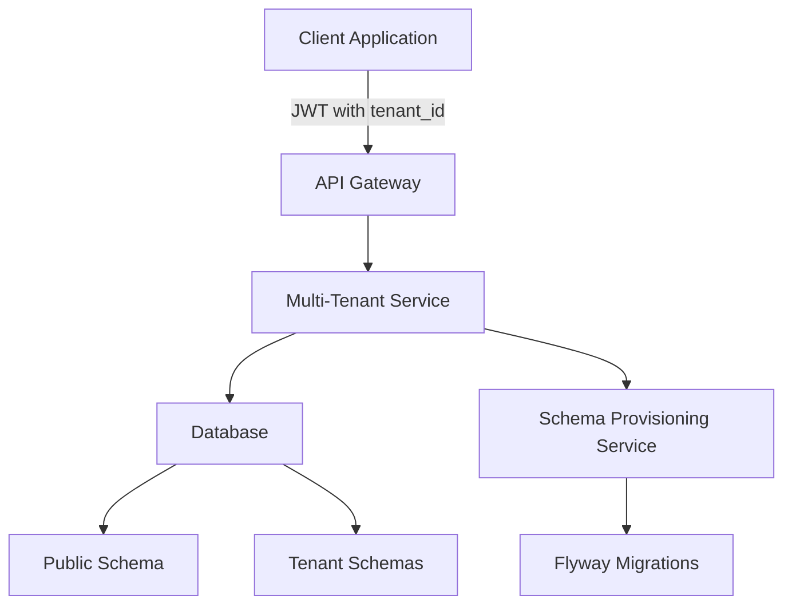

# Multi-Tenancy Framework — Spring Boot

## Overview and scope

The Multi-Tenancy Framework for Spring Boot at Xentic is designed to provide a robust solution for managing multiple tenants within a single application instance. This document outlines the purpose, audience, scope, non-goals, glossary, and how this standard integrates with the broader Xentic platform.

### Purpose
The primary purpose of this framework is to enable the development of multi-tenant applications that efficiently isolate tenant data while ensuring security, scalability, and maintainability. This framework leverages Hibernate's multi-tenancy capabilities to implement a schema-per-tenant strategy.

### Audience
This document is intended for:
- Software engineers and developers working on multi-tenant applications at Xentic.
- Architects and technical leads involved in designing and implementing multi-tenant solutions.
- Quality assurance teams responsible for testing multi-tenant applications.

### Scope
The scope of this framework includes:
- Implementation of multi-tenancy using Spring Boot and Hibernate.
- Tenant resolution through JWT claims.
- Schema provisioning for new tenants.
- Guidelines for data isolation and security measures.

### Non-goals
This framework does not cover:
- Multi-tenancy strategies outside of schema-per-tenant (e.g., database-per-tenant).
- User interface design or user experience considerations.
- Integration with external systems not related to tenant management.

### Glossary
| Term              | Definition                                                                 |
|-------------------|-----------------------------------------------------------------------------|
| Tenant            | A distinct entity that uses the application, often corresponding to a customer or organization. |
| Multi-Tenancy     | A software architecture pattern where a single instance of software serves multiple tenants. |
| JWT               | JSON Web Token, a compact, URL-safe means of representing claims to be transferred between two parties. |
| Schema            | A logical container for database objects such as tables, views, and procedures. |

### How this standard fits the Xentic platform
The Multi-Tenancy Framework is a critical component of the Xentic platform, enabling the development of scalable and secure applications that can serve multiple clients from a single codebase. By adhering to this standard, teams can ensure consistency and best practices across all multi-tenant applications within Xentic.

### Strategy
The framework adopts a schema-per-tenant strategy using Hibernate's multi-tenancy support, ensuring that each tenant's data is isolated within its own schema.

### Tenant Resolution
Tenant identification is achieved through the JWT claim `tenant_id` on every request. The following code demonstrates the implementation of a tenant resolver:

```java
@Component
public class JwtTenantResolver implements CurrentTenantIdentifierResolver<String> {
    @Override
    public String resolveCurrentTenantIdentifier() {
        return Optional.ofNullable(SecurityContextHolder.getContext().getAuthentication())
            .map(auth -> (Jwt) auth.getPrincipal())
            .map(jwt -> jwt.getClaimAsString("tenant_id"))
            .orElse("public");
    }

    @Override
    public boolean validateExistingCurrentSessions() { 
        return true; 
    }
}
```

### Schema Provisioning
To provision schemas for new tenants, the following service can be utilized:

```java
@Service
public class TenantProvisioningService {
    @Autowired
    private DataSource dataSource;

    public void provisionTenant(String tenantId) {
        try (Connection conn = dataSource.getConnection();
             Statement stmt = conn.createStatement()) {
            stmt.execute("CREATE SCHEMA IF NOT EXISTS \"" + tenantId + "\"");
        }
        Flyway.configure().dataSource(dataSource)
            .schemas(tenantId)
            .locations("classpath:db/tenant-migration")
            .load().migrate();
    }
}
```

### Rules
- **Data Isolation**: Never mix tenant data; always verify `tenant_id` in the service layer.
- **Cross-Tenant Queries**: Require explicit superadmin role and must include audit logging.
- **Public Schema**: Holds only system-level tables, ensuring that tenant data remains secure and isolated.

By following these guidelines, Xentic teams can effectively implement and manage multi-tenant applications that meet the organization's standards for security, performance, and maintainability.

## Standards and policies

1. **MUST** use the package naming convention `com.xentic.<service>` for all multi-tenant related classes and configurations. This ensures consistency across the codebase and aligns with Xentic's organizational rules.

2. **MUST NOT** hard-code tenant identifiers in the application code. All tenant identifiers must be dynamically resolved using the JWT claims mechanism as demonstrated in the tenant resolver example.

3. **MUST** implement proper error handling when provisioning schemas for new tenants. Any failures during schema creation or migration must be logged and communicated to the relevant stakeholders.

4. **SHOULD** use Flyway for managing database migrations for tenant schemas. This allows for version control of the database schema and ensures that all tenants are using the correct version.

5. **MUST** include a mechanism for validating the existence of a tenant before performing any database operations. This can be achieved by querying the system-level tables in the public schema.

6. **MUST NOT** allow direct access to tenant schemas from the application layer without proper authorization checks. All access must be mediated through service methods that enforce tenant isolation.

7. **SHOULD** implement a caching mechanism for tenant metadata to improve performance and reduce database load. The cache should be invalidated upon any changes to tenant configurations.

8. **MUST** provide a way to clean up tenant data when a tenant is decommissioned. This includes dropping the tenant schema and any associated data.

9. **MUST** ensure that all multi-tenant application logs include the `tenant_id` to facilitate easier tracking and debugging of tenant-specific issues.

10. **SHOULD** use a centralized logging framework such as Logback or Log4j2 to manage logs efficiently across different tenants.

11. **MUST** document all API endpoints that interact with tenant data, including the expected JWT claims and any required permissions.

12. **MUST NOT** expose any tenant-specific data in error messages or logs. Always sanitize output to prevent leakage of sensitive information.

13. **SHOULD** implement rate limiting on API endpoints to prevent abuse and ensure fair use of resources among tenants.

14. **MUST** conduct regular security audits of the multi-tenant application to identify and mitigate vulnerabilities related to tenant data isolation.

15. **MUST** ensure that all tenant data is encrypted at rest and in transit. Use industry-standard encryption protocols to protect sensitive information.

16. **SHOULD** provide a tenant administration interface for managing tenant configurations, including schema provisioning and user access controls.

17. **MUST** follow the Xentic coding standards for Java, including naming conventions, code formatting, and documentation practices.

18. **MUST NOT** use static methods or singletons that hold tenant-specific data. All tenant data must be encapsulated within instances that are scoped to the request.

19. **SHOULD** leverage Spring's support for AOP (Aspect-Oriented Programming) to manage cross-cutting concerns such as logging and security checks for tenant operations.

20. **MUST** define a clear strategy for handling tenant migrations, including how to manage schema changes without downtime for active tenants.

21. **MUST** ensure that all shared libraries follow the naming convention `com.xentic.common:*` to maintain consistency and avoid conflicts.

22. **SHOULD** provide detailed documentation for developers on how to implement multi-tenancy features, including examples and best practices.

23. **MUST** implement unit and integration tests that cover all aspects of multi-tenancy, ensuring that tenant isolation is maintained under various scenarios.

24. **SHOULD** consider performance implications when designing queries that involve tenant data, optimizing for speed and efficiency.

25. **MUST** use a consistent approach for handling tenant-specific configurations, preferably through a centralized configuration service or management interface.

By adhering to these standards and policies, Xentic teams can ensure the successful implementation of multi-tenant applications that are secure, efficient, and maintainable.

## Architecture and design

The architecture of the multi-tenancy framework is designed to ensure data isolation, security, and scalability. The following components are essential to the framework:



### Component Descriptions
- **Client Application**: The frontend application that interacts with the backend services.
- **API Gateway**: Handles incoming requests and forwards them to the appropriate service based on the JWT claims.
- **Multi-Tenant Service**: The core service that manages tenant-specific logic, including data access and business rules.
- **Database**: The relational database that stores tenant data in separate schemas.
- **Schema Provisioning Service**: Responsible for creating and managing tenant schemas.
- **Public Schema**: Contains system-level tables that are shared across all tenants.
- **Tenant Schemas**: Individual schemas for each tenant, ensuring data isolation.
- **Flyway Migrations**: Manages database migrations for tenant schemas.

### Data Flows
1. **Client Request**: The client application sends a request to the API Gateway, including a JWT that contains the `tenant_id`.
2. **Tenant Resolution**: The API Gateway extracts the `tenant_id` from the JWT and forwards the request to the Multi-Tenant Service.
3. **Data Access**: The Multi-Tenant Service uses the `tenant_id` to determine the appropriate schema for database operations.
4. **Schema Provisioning**: If a new tenant is created, the Schema Provisioning Service is invoked to create a new schema and apply migrations using Flyway.
5. **Response**: The Multi-Tenant Service processes the request and returns the response to the client application.

### Integration Points
- **Authentication Service**: Validates JWT tokens and provides tenant identification.
- **Database**: Interacts with the relational database to perform CRUD operations on tenant-specific data.
- **Configuration Management**: Centralized service for managing tenant-specific configurations and settings.

### Failure Domains
- **Database Failures**: If the database is unavailable, the Multi-Tenant Service must handle the error gracefully and return appropriate error messages to the client.
- **Schema Provisioning Failures**: Errors during schema creation or migration must be logged and communicated to the relevant stakeholders.
- **Authentication Failures**: If JWT validation fails, the API Gateway must return a 401 Unauthorized response.

### Example Configuration
To configure the multi-tenancy framework, the following YAML configuration can be used:

```yaml
spring:
  datasource:
    url: jdbc:postgresql://localhost:5432/xentic
    username: xentic_user
    password: xentic_password
  flyway:
    enabled: true
    locations: classpath:db/migration
  jwt:
    secret: mysecretkey
    expiration: 3600
```

### SQL Example for Schema Creation
The following SQL command can be used to create a new tenant schema:

```sql
CREATE SCHEMA IF NOT EXISTS "tenant_id";
```

By adhering to this architecture and design, Xentic teams can build robust multi-tenant applications that are scalable, secure, and maintainable.

## Configuration reference

To effectively configure the multi-tenancy framework within a Spring Boot application at Xentic, the following references must be adhered to. This includes YAML configuration, Terraform settings, and environment variables.

### application.yml Configuration

The `application.yml` file should include the following configurations:

```yaml
spring:
  datasource:
    url: jdbc:postgresql://localhost:5432/xentic
    username: xentic_user
    password: xentic_password
    driver-class-name: org.postgresql.Driver
  flyway:
    enabled: true
    locations: classpath:db/migration
    baseline-on-migrate: true
  jwt:
    secret: mysecretkey
    expiration: 3600
  tenant:
    default-schema: public
    schema-prefix: tenant_
    cleanup:
      enabled: true
      retention-period: 30 # days
```

### Terraform Configuration

To provision infrastructure for the multi-tenant application, the following Terraform configuration should be used:

```hcl
provider "postgresql" {
  host     = "localhost"
  port     = 5432
  username = "xentic_user"
  password = "xentic_password"
  database = "xentic"
}

resource "postgresql_schema" "tenant_schema" {
  for_each = var.tenants
  name     = "${var.schema_prefix}${each.key}"
  owner    = "xentic_user"
}

variable "tenants" {
  type    = map(string)
  default = {
    tenant1 = "Tenant 1"
    tenant2 = "Tenant 2"
  }
}

variable "schema_prefix" {
  type    = string
  default = "tenant_"
}
```

### Environment Variables

The application should also be configured using environment variables for sensitive information and flexibility. Below is a table of recommended environment variables with default and production values.

| Environment Variable         | Default Value        | Production Value         |
|------------------------------|----------------------|---------------------------|
| `SPRING_DATASOURCE_URL`      | `jdbc:postgresql://localhost:5432/xentic` | `jdbc:postgresql://db.prod.xentic.io:5432/xentic` |
| `SPRING_DATASOURCE_USERNAME` | `xentic_user`        | `xentic_prod_user`       |
| `SPRING_DATASOURCE_PASSWORD` | `xentic_password`    | `secure_prod_password`    |
| `SPRING_JWT_SECRET`          | `mysecretkey`        | `secure_prod_jwt_secret`  |
| `SPRING_JWT_EXPIRATION`      | `3600`               | `3600`                    |
| `TENANT_DEFAULT_SCHEMA`      | `public`             | `public`                  |
| `TENANT_SCHEMA_PREFIX`       | `tenant_`            | `tenant_`                 |
| `TENANT_CLEANUP_ENABLED`     | `true`               | `true`                    |
| `TENANT_CLEANUP_RETENTION`   | `30`                 | `30`                      |

### Summary of Configuration Guidelines

- **MUST** use the provided YAML configuration as a base and modify it according to the specific needs of the environment.
- **SHOULD** utilize Terraform for infrastructure provisioning to maintain consistency across environments.
- **MUST NOT** hard-code sensitive information in the codebase; always use environment variables or secure vaults.
- **SHOULD** ensure that the database connection details are managed securely and follow best practices for database security.

By following the above configuration references, Xentic teams can ensure a robust and secure multi-tenancy implementation in their Spring Boot applications.

## Implementation guide

To implement a multi-tenancy framework in a Spring Boot application at Xentic, follow these detailed steps:

### Step 1: Define the Tenant Entity

Create a `Tenant` entity that represents a tenant in your application.

```java
package com.xentic.tenancy.model;

import javax.persistence.Entity;
import javax.persistence.Id;

@Entity
public class Tenant {
    @Id
    private String id;
    private String name;

    // Getters and Setters
    public String getId() {
        return id;
    }

    public void setId(String id) {
        this.id = id;
    }

    public String getName() {
        return name;
    }

    public void setName(String name) {
        this.name = name;
    }
}
```

### Step 2: Create the Tenant Repository

Define a repository interface for the `Tenant` entity.

```java
package com.xentic.tenancy.repository;

import com.xentic.tenancy.model.Tenant;
import org.springframework.data.jpa.repository.JpaRepository;

public interface TenantRepository extends JpaRepository<Tenant, String> {
}
```

### Step 3: Implement the Multi-Tenant Configuration

Create a configuration class to handle multi-tenancy settings.

```java
package com.xentic.tenancy.config;

import org.hibernate.context.spi.CurrentSessionContext;
import org.hibernate.engine.jdbc.connections.spi.ConnectionProvider;
import org.hibernate.service.spi.ServiceRegistryImplementor;
import org.springframework.beans.factory.annotation.Autowired;
import org.springframework.context.annotation.Bean;
import org.springframework.context.annotation.Configuration;
import org.springframework.orm.jpa.JpaTransactionManager;
import org.springframework.orm.jpa.LocalContainerEntityManagerFactoryBean;

import javax.persistence.EntityManagerFactory;

@Configuration
public class MultiTenancyConfig {

    @Autowired
    private DataSource dataSource;

    @Bean
    public LocalContainerEntityManagerFactoryBean entityManagerFactory() {
        LocalContainerEntityManagerFactoryBean em = new LocalContainerEntityManagerFactoryBean();
        em.setDataSource(dataSource);
        em.setPackagesToScan("com.xentic.tenancy.model");

        // Additional JPA properties for multi-tenancy
        Properties properties = new Properties();
        properties.put("hibernate.multiTenancy", MultiTenancyStrategy.SCHEMA);
        properties.put("hibernate.tenant_identifier_resolver", new TenantIdentifierResolver());
        em.setJpaProperties(properties);

        return em;
    }

    @Bean
    public JpaTransactionManager transactionManager(EntityManagerFactory emf) {
        return new JpaTransactionManager(emf);
    }
}
```

### Step 4: Implement Tenant Identifier Resolver

Create a class to resolve the current tenant identifier from the request context.

```java
package com.xentic.tenancy.config;

import org.hibernate.context.spi.CurrentTenantIdentifierResolver;
import org.springframework.stereotype.Component;

import javax.servlet.http.HttpServletRequest;
import org.springframework.beans.factory.annotation.Autowired;

@Component
public class TenantIdentifierResolver implements CurrentTenantIdentifierResolver {

    @Autowired
    private HttpServletRequest request;

    @Override
    public String resolveCurrentTenantIdentifier() {
        String tenantId = request.getHeader("X-Tenant-ID");
        return tenantId != null ? tenantId : "default";
    }

    @Override
    public boolean validateExistingCurrentSessions() {
        return true;
    }
}
```

### Step 5: Create a Multi-Tenant Service

Implement a service to manage tenant operations.

```java
package com.xentic.tenancy.service;

import com.xentic.tenancy.model.Tenant;
import com.xentic.tenancy.repository.TenantRepository;
import org.springframework.beans.factory.annotation.Autowired;
import org.springframework.stereotype.Service;

@Service
public class TenantService {

    @Autowired
    private TenantRepository tenantRepository;

    public Tenant createTenant(String id, String name) {
        Tenant tenant = new Tenant();
        tenant.setId(id);
        tenant.setName(name);
        return tenantRepository.save(tenant);
    }

    public Tenant getTenant(String id) {
        return tenantRepository.findById(id).orElse(null);
    }
}
```

### Step 6: Create a Tenant Controller

Expose endpoints for tenant management.

```java
package com.xentic.tenancy.controller;

import com.xentic.tenancy.model.Tenant;
import com.xentic.tenancy.service.TenantService;
import org.springframework.beans.factory.annotation.Autowired;
import org.springframework.web.bind.annotation.*;

@RestController
@RequestMapping("/tenants")
public class TenantController {

    @Autowired
    private TenantService tenantService;

    @PostMapping
    public Tenant createTenant(@RequestParam String id, @RequestParam String name) {
        return tenantService.createTenant(id, name);
    }

    @GetMapping("/{id}")
    public Tenant getTenant(@PathVariable String id) {
        return tenantService.getTenant(id);
    }
}
```

### Step 7: Configure Security for Multi-Tenancy

Ensure that security measures are in place to protect tenant data.

```java
package com.xentic.tenancy.config;

import org.springframework.context.annotation.Bean;
import org.springframework.context.annotation.Configuration;
import org.springframework.security.config.annotation.web.builders.HttpSecurity;
import org.springframework.security.config.annotation.web.configuration.EnableWebSecurity;
import org.springframework.security.config.annotation.web.configuration.WebSecurityConfigurerAdapter;

@Configuration
@EnableWebSecurity
public class SecurityConfig extends WebSecurityConfigurerAdapter {

    @Override
    protected void configure(HttpSecurity http) throws Exception {
        http
            .authorizeRequests()
            .anyRequest().authenticated()
            .and()
            .oauth2ResourceServer()
            .jwt();
    }
}
```

### Step 8: Test Multi-Tenancy Functionality

Create unit tests to ensure that the multi-tenancy implementation works as expected.

```java
package com.xentic.tenancy;

import com.xentic.tenancy.controller.TenantController;
import com.xentic.tenancy.model.Tenant;
import com.xentic.tenancy.service.TenantService;
import org.junit.jupiter.api.Test;
import org.mockito.Mockito;
import org.springframework.beans.factory.annotation.Autowired;
import org.springframework.boot.test.autoconfigure.web.servlet.WebMvcTest;
import org.springframework.http.MediaType;
import org.springframework.test.web.servlet.MockMvc;

import static org.springframework.test.web.servlet.request.MockMvcRequestBuilders.post;
import static org.springframework.test.web.servlet.result.MockMvcResultMatchers.status;

@WebMvcTest(TenantController.class)
public class TenantControllerTest {

    @Autowired
    private MockMvc mockMvc;

    @Autowired
    private TenantService tenantService;

    @Test
    public void testCreateTenant() throws Exception {
        Mockito.when(tenantService.createTenant("tenant1", "Tenant One"))
                .thenReturn(new Tenant("tenant1", "Tenant One"));

        mockMvc.perform(post("/tenants")
                .param("id", "tenant1")
                .param("name", "Tenant One")
                .contentType(MediaType.APPLICATION_JSON))
                .andExpect(status().isOk());
    }
}
```

### Summary of Implementation Steps

- **MUST** create a `Tenant` entity and repository to manage tenant data.
- **MUST** implement a multi-tenancy configuration class using Hibernate.
- **MUST** provide a tenant identifier resolver to extract tenant information from requests.
- **MUST** create a service and controller to manage tenant operations.
- **MUST** implement security measures to protect tenant data.
- **MUST** write unit tests to ensure proper functionality of the multi-tenancy framework.

By following this implementation guide, Xentic teams can effectively build and manage a multi-tenant architecture within their Spring Boot applications.

## Security requirements

### Threat Model Summary

In a multi-tenant architecture, security is paramount to ensure that data from one tenant is not accessible to another. The following threats must be addressed:

- **Data Leakage**: Unauthorized access to tenant data.
- **Privilege Escalation**: A user gaining access to higher privileges than intended.
- **Denial of Service (DoS)**: Overloading the application to make it unavailable to legitimate users.
- **Injection Attacks**: Exploiting the application through SQL injection or other code injections.

### Authentication and Authorization (AuthN/Z)

- **MUST** implement OAuth2 for secure authentication.
- **MUST NOT** use basic authentication as it is less secure.
- **MUST** ensure that each tenant has its own user roles and permissions.

#### Example Configuration for OAuth2

```yaml
spring:
  security:
    oauth2:
      resourceserver:
        jwt:
          issuer-uri: https://auth.internal.xentic.io/realms/xentic
```

### Secrets Management

- **MUST** use a centralized secrets management solution (e.g., HashiCorp Vault).
- **MUST NOT** hardcode secrets in the application code or configuration files.
- **MUST** use environment variables or external configuration to manage sensitive information.

#### Example of Accessing Secrets from Vault

```java
import org.springframework.beans.factory.annotation.Value;
import org.springframework.stereotype.Service;

@Service
public class SecretService {

    @Value("${vault.token}")
    private String vaultToken;

    public String getSecret(String secretPath) {
        // Logic to access secrets from Vault using vaultToken
    }
}
```

### Input Validation

- **MUST** validate all incoming data to prevent injection attacks.
- **MUST** use Spring's built-in validation annotations (e.g., `@Valid`, `@NotNull`).
- **MUST NOT** trust any data coming from the client-side.

#### Example of Input Validation

```java
import javax.validation.constraints.NotBlank;

public class TenantRequest {

    @NotBlank(message = "Tenant ID must not be blank")
    private String id;

    @NotBlank(message = "Tenant Name must not be blank")
    private String name;

    // Getters and Setters
}
```

### Audit Logging

- **MUST** implement audit logging to track access and changes to tenant data.
- **MUST** log all authentication attempts, both successful and failed.
- **MUST NOT** log sensitive information such as passwords or personal data.

#### Example of Audit Logging Implementation

```java
import org.slf4j.Logger;
import org.slf4j.LoggerFactory;
import org.springframework.stereotype.Service;

@Service
public class AuditService {
    private static final Logger logger = LoggerFactory.getLogger(AuditService.class);

    public void logAccess(String tenantId, String action) {
        logger.info("Tenant ID: {}, Action: {}", tenantId, action);
    }
}
```

### Summary of Security Requirements

| Requirement                     | Description                                                                 |
|---------------------------------|-----------------------------------------------------------------------------|
| **Authentication**              | Implement OAuth2 for secure authentication.                                |
| **Authorization**               | Ensure tenant-specific roles and permissions are enforced.                 |
| **Secrets Management**          | Use a centralized solution and avoid hardcoding secrets.                   |
| **Input Validation**            | Validate all incoming data to prevent injection attacks.                   |
| **Audit Logging**               | Track access and changes to tenant data without logging sensitive info.    |

By adhering to these security requirements, Xentic can ensure a robust and secure multi-tenancy framework within its Spring Boot applications.

## Testing strategy

To ensure the robustness and reliability of the multi-tenancy framework, a comprehensive testing strategy is essential. This strategy should encompass unit tests, integration tests, and contract tests, each serving a distinct purpose in the software development lifecycle.

### Unit Tests

Unit tests are designed to validate the functionality of individual components in isolation. Each service and controller must have corresponding unit tests to verify their behavior.

- **MUST** achieve at least 80% code coverage for all service classes.
- **MUST** use mocking frameworks (e.g., Mockito) to isolate dependencies.

#### Example Unit Test Class

```java
package com.xentic.tenancy.service;

import com.xentic.tenancy.model.Tenant;
import com.xentic.tenancy.repository.TenantRepository;
import org.junit.jupiter.api.Test;
import org.mockito.InjectMocks;
import org.mockito.Mock;
import org.mockito.MockitoAnnotations;

import static org.junit.jupiter.api.Assertions.assertEquals;
import static org.mockito.Mockito.when;

public class TenantServiceTest {

    @InjectMocks
    private TenantService tenantService;

    @Mock
    private TenantRepository tenantRepository;

    public TenantServiceTest() {
        MockitoAnnotations.openMocks(this);
    }

    @Test
    public void testCreateTenant() {
        Tenant tenant = new Tenant("tenant1", "Tenant One");
        when(tenantRepository.save(tenant)).thenReturn(tenant);

        Tenant createdTenant = tenantService.createTenant("tenant1", "Tenant One");
        assertEquals("Tenant One", createdTenant.getName());
    }

    @Test
    public void testGetTenant() {
        when(tenantRepository.findById("tenant1")).thenReturn(java.util.Optional.of(new Tenant("tenant1", "Tenant One")));

        Tenant retrievedTenant = tenantService.getTenant("tenant1");
        assertEquals("tenant1", retrievedTenant.getId());
    }
}
```

### Integration Tests

Integration tests validate the interaction between various components of the application. They ensure that the components work together as expected.

- **MUST** cover all critical paths, including tenant creation and retrieval.
- **MUST** use an in-memory database (e.g., H2) for testing.

#### Example Integration Test Class

```java
package com.xentic.tenancy;

import com.xentic.tenancy.controller.TenantController;
import com.xentic.tenancy.model.Tenant;
import com.xentic.tenancy.repository.TenantRepository;
import org.junit.jupiter.api.Test;
import org.springframework.beans.factory.annotation.Autowired;
import org.springframework.boot.test.autoconfigure.web.servlet.AutoConfigureMockMvc;
import org.springframework.boot.test.context.SpringBootTest;
import org.springframework.http.MediaType;
import org.springframework.test.web.servlet.MockMvc;

import static org.springframework.test.web.servlet.request.MockMvcRequestBuilders.post;
import static org.springframework.test.web.servlet.request.MockMvcRequestBuilders.get;
import static org.springframework.test.web.servlet.result.MockMvcResultMatchers.status;

@SpringBootTest
@AutoConfigureMockMvc
public class TenantIntegrationTest {

    @Autowired
    private MockMvc mockMvc;

    @Autowired
    private TenantRepository tenantRepository;

    @Test
    public void testCreateAndRetrieveTenant() throws Exception {
        mockMvc.perform(post("/tenants")
                .param("id", "tenant1")
                .param("name", "Tenant One")
                .contentType(MediaType.APPLICATION_JSON))
                .andExpect(status().isOk());

        mockMvc.perform(get("/tenants/tenant1")
                .contentType(MediaType.APPLICATION_JSON))
                .andExpect(status().isOk());
    }
}
```

### Contract Tests

Contract tests ensure that the service's API adheres to the agreed-upon contract between services. This is particularly important in a microservices architecture.

- **MUST** use tools like Pact to define and verify contracts between services.
- **MUST** run contract tests in CI/CD pipelines to catch breaking changes early.

#### Example Contract Test Configuration

```groovy
pact {
    provider {
        service {
            name "TenantService"
            port 8080
        }
    }
    consumer {
        service {
            name "TenantConsumer"
        }
    }
}
```

### Coverage Targets

| Test Type       | Coverage Target |
|------------------|-----------------|
| Unit Tests       | 80%              |
| Integration Tests| 70%              |
| Contract Tests   | 100%             |

### Summary of Testing Strategy

- **MUST** implement unit tests for all service and controller classes.
- **MUST** achieve a minimum of 80% code coverage for unit tests.
- **MUST** use integration tests to validate the interactions between components.
- **MUST** employ contract tests to ensure compliance with service contracts.
- **MUST** run all tests in CI/CD pipelines to maintain code quality and reliability.

By following this testing strategy, Xentic can ensure that the multi-tenancy framework is robust, reliable, and ready for production deployment.

## Observability and operations

To maintain a high level of observability and operational excellence in the multi-tenancy framework, Xentic MUST implement a comprehensive monitoring strategy that includes metrics, logs, traces, dashboards, alerts, and Service Level Objectives (SLOs). This will enable proactive management of the application and ensure a seamless experience for tenants.

### Metrics

- **MUST** collect key performance metrics such as request latency, error rates, and throughput.
- **MUST** use tools like Micrometer with Prometheus or Grafana for metrics collection and visualization.

#### Example Metrics Configuration (application.yml)

```yaml
management:
  metrics:
    export:
      prometheus:
        enabled: true
```

### Logs

- **MUST** implement structured logging to facilitate easier analysis and debugging.
- **MUST** use a logging framework like SLF4J with Logback or Log4j2.
- **MUST NOT** log sensitive information, including personal data or authentication tokens.

#### Example Logging Configuration (logback-spring.xml)

```xml
<configuration>
    <appender name="STDOUT" class="ch.qos.logback.core.ConsoleAppender">
        <encoder>
            <pattern>%d{yyyy-MM-dd HH:mm:ss} - %msg%n</pattern>
        </encoder>
    </appender>

    <root level="INFO">
        <appender-ref ref="STDOUT" />
    </root>
</configuration>
```

### Traces

- **MUST** implement distributed tracing to track requests across microservices.
- **MUST** use tools such as Spring Cloud Sleuth and Zipkin or OpenTelemetry for tracing.

#### Example Tracing Configuration (application.yml)

```yaml
spring:
  sleuth:
    sampler:
      probability: 1.0
```

### Dashboards

- **MUST** create dashboards to visualize key metrics and logs.
- **SHOULD** use Grafana or Kibana for dashboard creation, enabling easy access to operational data.

### Alerts

- **MUST** configure alerts for critical metrics such as high error rates or increased latency.
- **SHOULD** use tools like Prometheus Alertmanager or Grafana Alerts to manage alerting.

#### Example Alerting Rule (Prometheus)

```yaml
groups:
  - name: tenant-alerts
    rules:
      - alert: HighErrorRate
        expr: rate(http_requests_total{status="500"}[5m]) > 0.05
        for: 5m
        labels:
          severity: critical
        annotations:
          summary: "High error rate detected"
          description: "More than 5% of requests are failing in the last 5 minutes."
```

### Service Level Objectives (SLOs)

- **MUST** define SLOs for critical services to ensure reliability.
- **SHOULD** track SLO compliance and report on it regularly.

#### Example SLO Definition

| SLO Name               | Objective         | Measurement Method               |
|-----------------------|-------------------|----------------------------------|
| Request Latency       | 95th percentile < 200ms | Measure latency of API responses |
| Error Rate            | < 1%              | Track HTTP 5xx response codes    |

### On-Call Runbook Steps

In the event of an incident, the following steps MUST be followed:

1. **Identify the Incident**: Use dashboards and alerts to determine the nature and scope of the issue.
2. **Assess Impact**: Determine which tenants are affected and the severity of the incident.
3. **Notify Stakeholders**: Inform relevant teams and stakeholders about the incident status.
4. **Investigate**: Use logs and traces to identify the root cause of the issue.
5. **Mitigate**: Implement a temporary fix if possible to restore service.
6. **Document**: Record the incident details, including root cause and resolution steps.
7. **Review**: Conduct a post-mortem to analyze the incident and improve processes.

By implementing these observability and operations standards, Xentic can ensure that the multi-tenancy framework remains reliable, performant, and responsive to the needs of its tenants.

## Migration and versioning

To ensure the integrity and reliability of the multi-tenancy framework, Xentic MUST adopt a structured approach to migration and versioning. This includes establishing upgrade paths, a clear deprecation policy, maintaining backward compatibility, and defining rollback procedures.

### Upgrade Paths

- **MUST** provide clear upgrade paths for each version of the framework.
- **SHOULD** document any breaking changes in the release notes.
- **MUST** ensure that migrations can be performed without downtime.

#### Example Upgrade Path Documentation

| Version | Changes                                  | Migration Steps                                         |
|---------|------------------------------------------|--------------------------------------------------------|
| 1.0     | Initial release                         | N/A                                                    |
| 1.1     | Added support for new tenant attributes | Update database schema, run migration scripts          |
| 2.0     | Breaking changes in tenant model        | Migrate existing tenants using provided migration tool  |

### Deprecation Policy

- **MUST** mark deprecated features in the codebase with appropriate annotations (e.g., `@Deprecated`).
- **MUST NOT** remove deprecated features until at least two major versions have passed.
- **SHOULD** provide alternative solutions or features to replace deprecated items.

#### Example Deprecation Annotation

```java
@Deprecated
public void oldTenantMethod() {
    // This method will be removed in future versions.
}
```

### Backward Compatibility

- **MUST** maintain backward compatibility for all public APIs.
- **SHOULD** use versioning in API endpoints (e.g., `/api/v1/tenants`).
- **MUST** provide a compatibility layer for deprecated features during the transition period.

#### Example Versioned API Endpoint

```java
@RestController
@RequestMapping("/api/v1/tenants")
public class TenantController {
    // API methods for version 1
}
```

### Rollback Procedures

In the event of a failed migration or upgrade, Xentic MUST have a rollback plan to restore the previous stable state.

- **MUST** create and test rollback scripts for database migrations.
- **SHOULD** maintain backups of the database before applying migrations.
- **MUST** document the rollback process clearly.

#### Example Rollback Script (SQL)

```sql
-- Rollback script for tenant migration
BEGIN;

ALTER TABLE tenants RENAME TO tenants_old;

CREATE TABLE tenants (
    id VARCHAR(255) PRIMARY KEY,
    name VARCHAR(255) NOT NULL
);

INSERT INTO tenants (id, name)
SELECT id, name FROM tenants_old;

DROP TABLE tenants_old;

COMMIT;
```

### Versioning Strategy

- **MUST** follow Semantic Versioning (SemVer) for all releases (MAJOR.MINOR.PATCH).
- **MUST** increment the MAJOR version for breaking changes, MINOR for new features, and PATCH for bug fixes.

#### Example Versioning Format

```plaintext
1.0.0 - Initial release
1.1.0 - Added new tenant features
2.0.0 - Breaking changes to tenant model
```

By adhering to these migration and versioning standards, Xentic can ensure a smooth transition between versions, minimize disruptions, and maintain the integrity of the multi-tenancy framework.

## FAQ, anti-patterns, and checklists

### Frequently Asked Questions (FAQ)

1. **What is multi-tenancy?**
   - Multi-tenancy is an architecture where a single instance of a software application serves multiple tenants (clients), allowing them to share resources while keeping their data isolated.

2. **How does Xentic implement multi-tenancy?**
   - Xentic implements multi-tenancy using a combination of database schemas, shared databases, and tenant-specific configurations managed through Spring Boot.

3. **What are the benefits of multi-tenancy?**
   - Benefits include reduced operational costs, easier maintenance, and improved resource utilization.

4. **What strategies can be used for tenant isolation?**
   - Tenant isolation can be achieved through separate databases, shared databases with tenant IDs, or schema-based isolation.

5. **How are tenant configurations managed?**
   - Tenant configurations should be managed using a centralized configuration service, allowing for dynamic updates and retrieval based on tenant context.

6. **What is the recommended way to handle tenant-specific data?**
   - Tenant-specific data should be tagged with a tenant identifier to ensure proper isolation and access control.

7. **How can performance be ensured in a multi-tenant environment?**
   - Performance can be ensured by implementing caching strategies, optimizing database queries, and monitoring resource usage.

8. **What logging practices should be followed?**
   - Logging should be structured, and sensitive information must not be logged. Use correlation IDs to trace logs across tenants.

9. **How do we handle tenant onboarding and offboarding?**
   - Onboarding should include automated provisioning of resources, while offboarding must ensure secure data deletion and resource deallocation.

10. **What are the security considerations for multi-tenancy?**
    - Security considerations include data isolation, access control, and ensuring compliance with data protection regulations.

### Anti-Patterns

| Anti-Pattern                      | Description                                                                                   | Consequences                                 |
|-----------------------------------|-----------------------------------------------------------------------------------------------|----------------------------------------------|
| Shared Database Without Isolation  | Using a single database without tenant-specific identifiers.                                 | Data leakage between tenants.                 |
| Hardcoding Tenant Configuration    | Hardcoding tenant-specific settings in the application code.                                 | Difficult to manage and update configurations.|
| Lack of Monitoring                 | Not implementing monitoring for tenant-specific metrics.                                     | Inability to detect performance issues.       |
| Over-Complicated Tenant Logic      | Creating overly complex logic for tenant management.                                         | Increased risk of bugs and maintenance overhead.|
| Ignoring Security Best Practices   | Failing to implement proper security measures for tenant data.                               | Increased risk of data breaches.              |

### Pre-Merge Checklist

- **MUST** ensure all unit tests are passing with at least 80% coverage.
- **MUST** run integration tests to validate interactions between components.
- **SHOULD** review code for adherence to coding standards and best practices.
- **MUST NOT** merge if there are any unresolved code review comments.
- **MUST** ensure that all configurations are properly documented.

### Production Checklist

- **MUST** validate that all pre-merge checklist items are completed.
- **MUST** perform a final review of deployment scripts and configurations.
- **MUST** ensure that monitoring and alerting are configured and functioning.
- **SHOULD** conduct a smoke test in a staging environment before production deployment.
- **MUST** notify stakeholders of the deployment schedule and potential impacts. 

By adhering to these FAQs, anti-patterns, and checklists, Xentic can ensure a robust and efficient multi-tenancy framework that meets the needs of its tenants while maintaining high standards of quality and security.
