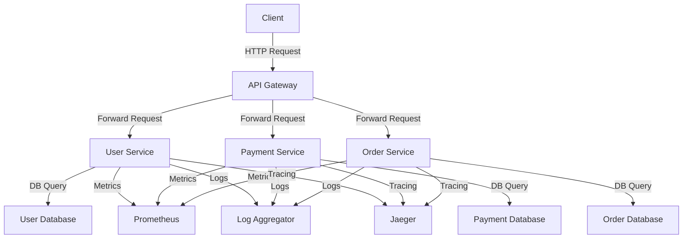

# Observability Standards — Spring Boot

## Overview and scope

The purpose of the Observability Standards for Spring Boot at Xentic is to establish a consistent framework for monitoring, logging, and tracing applications built with the Spring Boot framework. This document serves as a guideline for developers and architects to ensure that all services adhere to the same observability practices, enabling efficient troubleshooting, performance monitoring, and operational insights across the organization.

### Audience
This document is intended for:
- Software Engineers
- Technical Architects
- DevOps Engineers
- Quality Assurance Teams

### Scope
The standards outlined in this document apply to all backend services developed within the Xentic organization using the Spring Boot framework. This includes, but is not limited to:
- Microservices
- APIs
- Batch processing applications

### Non-goals
This document does NOT aim to:
- Define application-specific business logic or functionality
- Provide detailed implementation instructions for every possible scenario
- Replace the need for service-specific documentation

### Glossary
| Term               | Definition                                                                 |
|--------------------|-----------------------------------------------------------------------------|
| Metrics            | Quantitative measurements that help assess the performance of an application. |
| Tracing            | The ability to track the flow of requests through various services.         |
| Logging            | The act of recording events that happen within an application.              |
| Prometheus         | An open-source monitoring and alerting toolkit.                             |
| Grafana            | An open-source analytics and monitoring solution for visualizing metrics.   |
| SLF4J              | A simple logging facade for Java.                                          |
| Micrometer         | A metrics instrumentation library for Java applications.                    |

### How This Standard Fits the Xentic Platform
These observability standards are designed to seamlessly integrate with the existing Xentic platform, which utilizes a microservices architecture. By adhering to these standards, teams can ensure that their applications are observable, maintainable, and scalable. The observability stack for Xentic includes:

- **Metrics**: Micrometer → Prometheus → Grafana
- **Tracing**: OpenTelemetry → Jaeger
- **Logging**: SLF4J + Logback → structured JSON → CloudWatch

### Key Components
1. **Structured Logging**: Every log entry MUST be in JSON format with mandatory fields to facilitate easy querying and analysis. An example of a structured log entry is as follows:

   ```json
   {
     "timestamp": "2024-01-15T10:30:00Z",
     "level": "INFO",
     "service": "user-service",
     "traceId": "abc123",
     "spanId": "def456",
     "userId": "uuid-here",
     "message": "User created successfully"
   }
   ```

2. **Custom Metrics**: Services MUST implement custom metrics to track specific application behaviors. For instance, the following Java code demonstrates how to create a custom metric for order creation:

   ```java
   @Service
   @RequiredArgsConstructor
   public class OrderService {
       private final MeterRegistry meterRegistry;

       public Order createOrder(OrderRequest req) {
           Order order = processOrder(req);
           meterRegistry.counter("orders.created",
               "status", order.getStatus().name()).increment();
           return order;
       }
   }
   ```

3. **Health Endpoints**: Services MUST expose the following health endpoints:
   - `/actuator/health`
   - `/actuator/prometheus`

   Services MUST NOT expose `/actuator/env` or `/actuator/beans` in production environments to maintain security.

4. **Alerting Rules (Prometheus)**: Standard alerts MUST be configured for every service to ensure proactive monitoring. The following alerting rules are required:
   - Error rate > 1% for 5 minutes
   - P99 latency > 2 seconds for 5 minutes
   - JVM heap usage > 85%

By adhering to these observability standards, Xentic aims to enhance the reliability and performance of its services, ultimately delivering a better experience for both developers and end-users.

## Standards and policies

1. **Logging Format**: All log entries MUST be in structured JSON format. This ensures uniformity across services and facilitates easier querying and analysis. The mandatory fields include `timestamp`, `level`, `service`, `traceId`, `spanId`, `userId`, and `message`.

   Example:
   ```json
   {
     "timestamp": "2024-01-15T10:30:00Z",
     "level": "ERROR",
     "service": "payment-service",
     "traceId": "xyz789",
     "spanId": "ghi012",
     "userId": "uuid-here",
     "message": "Payment processing failed"
   }
   ```

2. **Log Levels**: Services MUST use the following log levels consistently:
   - DEBUG
   - INFO
   - WARN
   - ERROR
   - FATAL

   Log levels MUST NOT be mixed within the same service for the same type of event.

3. **Custom Metrics**: Services MUST implement custom metrics using Micrometer. Metrics should be relevant to the application's domain and provide insights into performance and usage patterns.

   Example of a custom metric:
   ```java
   @Service
   public class PaymentService {
       private final MeterRegistry meterRegistry;

       public void processPayment(PaymentRequest request) {
           // Payment processing logic
           meterRegistry.counter("payments.processed").increment();
       }
   }
   ```

4. **Tracing**: Services MUST implement distributed tracing using OpenTelemetry. Each request MUST propagate trace context to enable end-to-end tracing across microservices.

   Example of setting up tracing:
   ```java
   @Bean
   public Tracer tracer() {
       return OpenTelemetry.getTracer("com.xentic.payment");
   }
   ```

5. **Health Checks**: Services MUST expose health check endpoints at `/actuator/health` and `/actuator/prometheus`. These endpoints MUST provide accurate health status to monitoring systems.

6. **Error Handling**: Services MUST log errors with sufficient context to facilitate debugging. This includes capturing the stack trace and relevant request parameters.

   Example:
   ```java
   try {
       // Some operation
   } catch (Exception e) {
       logger.error("Error processing request: {}", e.getMessage(), e);
   }
   ```

7. **Alerting**: Standard alerting rules MUST be established for each service to monitor key performance indicators. Alerts MUST be configured in Prometheus for:
   - High error rates
   - Latency thresholds
   - Resource utilization metrics

   Example alert rule:
   ```yaml
   groups:
     - name: service-alerts
       rules:
         - alert: HighErrorRate
           expr: rate(http_requests_total{status="500"}[5m]) > 0.01
           for: 5m
           labels:
             severity: critical
           annotations:
             summary: "High error rate detected"
             description: "Service {{ $labels.service }} has a high error rate."
   ```

8. **Documentation**: Each service MUST include documentation for its observability setup, including metrics, logging practices, and tracing information. Documentation MUST be accessible at a dedicated URL, such as `https://docs.internal.xentic.io/services/<service-name>`.

9. **Configuration Management**: Configuration for observability settings (e.g., logging level, metrics collection) MUST be externalized in application properties or YAML files. These configurations MUST NOT be hard-coded.

   Example configuration:
   ```yaml
   logging:
     level:
       root: INFO
       com.xentic: DEBUG

   management:
     endpoints:
       web:
         exposure:
           include: health, prometheus
   ```

10. **Version Control**: All observability-related code and configuration MUST be version-controlled. Changes to observability setups MUST be reviewed and approved through the standard code review process.

By adhering to these standards and policies, Xentic ensures that all services are observable, maintainable, and provide valuable insights into their operation and performance.

## Architecture and design

### Component Diagram



### Data Flows

1. **Client Request Flow**:
   - Clients send HTTP requests to the API Gateway.
   - The API Gateway forwards requests to the appropriate microservices (User Service, Payment Service, Order Service).

2. **Database Interaction**:
   - Each service interacts with its respective database to perform CRUD operations.
   - Services MUST utilize connection pooling to manage database connections efficiently.

3. **Metrics Collection**:
   - Each service MUST report custom metrics to Prometheus at regular intervals.
   - Metrics should include request counts, error rates, and performance statistics.

4. **Logging**:
   - All services MUST log structured data to a centralized log aggregator.
   - Logs should include request and response details, error messages, and performance metrics.

5. **Tracing**:
   - Each service MUST propagate tracing information using OpenTelemetry.
   - Traces should capture the flow of requests across services, enabling end-to-end visibility.

### Integration Points

| Component          | Description                                                                 |
|--------------------|-----------------------------------------------------------------------------|
| API Gateway         | Acts as the entry point for all client requests and forwards them to services. |
| Prometheus          | Collects metrics from all services for monitoring and alerting.             |
| Jaeger              | Provides distributed tracing capabilities to visualize request flows.       |
| Log Aggregator      | Centralizes logs from all services for analysis and troubleshooting.        |
| User Database       | Stores user information and authentication data.                            |
| Payment Database    | Holds payment transaction records and related data.                        |
| Order Database      | Manages order details and history.                                         |

### Failure Domains

1. **Service-Level Failures**:
   - If a service fails (e.g., User Service), the API Gateway MUST return a 5xx error to the client.
   - Services MUST implement circuit breakers to prevent cascading failures.

2. **Database Failures**:
   - If a database becomes unavailable, the service MUST handle the exception gracefully and return an appropriate error message.
   - Services MUST implement retries with exponential backoff for transient errors.

3. **Network Failures**:
   - In the event of network issues, services MUST log the error and return a suitable response to the client.
   - Services MUST utilize timeouts for external calls to avoid hanging requests.

4. **Monitoring Failures**:
   - If metrics collection fails, services MUST log a warning but continue normal operations.
   - Alerts MUST be configured to notify engineers of persistent monitoring issues.

By adhering to these architectural and design principles, Xentic ensures a robust and observable microservices environment that is resilient to failures and provides comprehensive insights into system performance and behavior.

## Configuration reference

### application.yml

The following is a reference for the `application.yml` configuration file for observability settings in Spring Boot applications at Xentic.

```yaml
spring:
  application:
    name: <service-name>
  
management:
  endpoints:
    web:
      exposure:
        include: health, info, prometheus
  health:
    disk:
      threshold: 10MB
    ping:
      enabled: true

logging:
  level:
    root: INFO
    com.xentic: DEBUG
  logstash:
    enabled: true
    host: logstash.internal.xentic.io
    port: 5044

micrometer:
  metrics:
    export:
      prometheus:
        enabled: true
      statsd:
        enabled: false

tracing:
  enabled: true
  sampler:
    probability: 1.0

# Custom metrics configuration
custom:
  metrics:
    enabled: true
```

### Terraform Configuration

The following Terraform configuration is used to manage observability resources in Xentic's infrastructure.

```hcl
resource "aws_cloudwatch_log_group" "service_logs" {
  name              = "/xentic/<service-name>/logs"
  retention_in_days = 14
}

resource "aws_cloudwatch_metric_alarm" "high_error_rate" {
  alarm_name          = "HighErrorRate"
  comparison_operator  = "GreaterThanThreshold"
  evaluation_periods   = "1"
  metric_name         = "ErrorCount"
  namespace           = "Xentic/<service-name>"
  period              = "300"
  statistic           = "Sum"
  threshold           = "1"
  alarm_description   = "This alarm fires when the error rate exceeds 1%."
  actions_enabled     = true
  alarm_actions       = [aws_sns_topic.alerts.arn]
}

resource "aws_sns_topic" "alerts" {
  name = "xentic-alerts"
}
```

### Environment Variables

The following environment variables MUST be set for the observability configuration of each service. Default values are provided for local development, while production values are specified for deployment.

| Variable                             | Default Value                     | Production Value                     |
|--------------------------------------|-----------------------------------|--------------------------------------|
| `SPRING_APPLICATION_NAME`            | `my-service`                      | `<service-name>`                     |
| `LOGGING_LEVEL_ROOT`                 | `INFO`                            | `INFO`                               |
| `LOGGING_LEVEL_COM_XENTIC`           | `DEBUG`                           | `INFO`                               |
| `PROMETHEUS_ENABLED`                 | `true`                            | `true`                               |
| `TRACING_ENABLED`                    | `true`                            | `true`                               |
| `LOGSTASH_HOST`                      | `localhost`                       | `logstash.internal.xentic.io`       |
| `LOGSTASH_PORT`                      | `5044`                            | `5044`                               |
| `HEALTH_CHECK_ENABLED`               | `true`                            | `true`                               |
| `DISK_THRESHOLD`                     | `10MB`                            | `10MB`                               |
| `CUSTOM_METRICS_ENABLED`             | `true`                            | `true`                               |

### SQL for Metrics Storage

The following SQL statements are used to create tables for storing custom metrics in the database.

```sql
CREATE TABLE service_metrics (
    id SERIAL PRIMARY KEY,
    service_name VARCHAR(255) NOT NULL,
    metric_name VARCHAR(255) NOT NULL,
    metric_value FLOAT NOT NULL,
    timestamp TIMESTAMP DEFAULT CURRENT_TIMESTAMP
);

CREATE INDEX idx_service_metrics ON service_metrics(service_name, timestamp);
```

By adhering to these configuration standards, Xentic ensures that all services are properly set up for observability, enabling effective monitoring and alerting capabilities.

## Implementation guide

To implement observability standards in Spring Boot applications at Xentic, follow these steps:

### Step 1: Add Dependencies

Add the following dependencies to your `pom.xml` file for Prometheus, Micrometer, and OpenTelemetry support:

```xml
<dependency>
    <groupId>io.micrometer</groupId>
    <artifactId>micrometer-spring-legacy</artifactId>
</dependency>
<dependency>
    <groupId>org.springframework.boot</groupId>
    <artifactId>spring-boot-starter-actuator</artifactId>
</dependency>
<dependency>
    <groupId>io.opentelemetry</groupId>
    <artifactId>opentelemetry-spring-boot-starter</artifactId>
</dependency>
<dependency>
    <groupId>org.springframework.cloud</groupId>
    <artifactId>spring-cloud-starter-zipkin</artifactId>
</dependency>
```

### Step 2: Configure `application.yml`

Ensure your `application.yml` file is configured correctly for observability:

```yaml
spring:
  application:
    name: user-service

management:
  endpoints:
    web:
      exposure:
        include: health, info, prometheus
  health:
    disk:
      threshold: 10MB
    ping:
      enabled: true

logging:
  level:
    root: INFO
    com.xentic: DEBUG

micrometer:
  metrics:
    export:
      prometheus:
        enabled: true

tracing:
  enabled: true
  sampler:
    probability: 1.0
```

### Step 3: Implement Custom Metrics

Create a service to register custom metrics. Below is an example of a `MetricsService` class:

```java
package com.xentic.user.service;

import io.micrometer.core.instrument.MeterRegistry;
import io.micrometer.core.instrument.Counter;
import org.springframework.stereotype.Service;

@Service
public class MetricsService {

    private final Counter userCreationCounter;

    public MetricsService(MeterRegistry meterRegistry) {
        this.userCreationCounter = meterRegistry.counter("user.creation.count");
    }

    public void incrementUserCreation() {
        userCreationCounter.increment();
    }
}
```

### Step 4: Use Custom Metrics in Controllers

In your controller, use the `MetricsService` to track user creation:

```java
package com.xentic.user.controller;

import com.xentic.user.service.MetricsService;
import org.springframework.web.bind.annotation.PostMapping;
import org.springframework.web.bind.annotation.RestController;

@RestController
public class UserController {

    private final MetricsService metricsService;

    public UserController(MetricsService metricsService) {
        this.metricsService = metricsService;
    }

    @PostMapping("/users")
    public String createUser() {
        // Logic to create user
        metricsService.incrementUserCreation();
        return "User created successfully";
    }
}
```

### Step 5: Enable Distributed Tracing

To enable distributed tracing, configure OpenTelemetry in your application. Create a configuration class:

```java
package com.xentic.user.config;

import io.opentelemetry.api.OpenTelemetry;
import io.opentelemetry.api.trace.Tracer;
import io.opentelemetry.extension.annotations.WithSpan;
import org.springframework.context.annotation.Bean;
import org.springframework.context.annotation.Configuration;

@Configuration
public class TracingConfig {

    @Bean
    public Tracer tracer(OpenTelemetry openTelemetry) {
        return openTelemetry.getTracer("com.xentic.user");
    }
}
```

### Step 6: Annotate Methods for Tracing

Annotate methods in your services or controllers with `@WithSpan` to capture tracing information:

```java
package com.xentic.user.service;

import io.opentelemetry.extension.annotations.WithSpan;
import org.springframework.stereotype.Service;

@Service
public class UserService {

    @WithSpan
    public void processUserCreation() {
        // Logic to process user creation
    }
}
```

### Step 7: Set Up Log Aggregation

Ensure logging is directed to a centralized log aggregator. Update your `application.yml`:

```yaml
logging:
  logstash:
    enabled: true
    host: logstash.internal.xentic.io
    port: 5044
```

### Step 8: Testing Observability

After implementing the above steps, test your observability setup:

1. **Metrics**: Access the Prometheus metrics endpoint at `http://localhost:8080/actuator/prometheus`.
2. **Health Check**: Verify health status at `http://localhost:8080/actuator/health`.
3. **Tracing**: Use Jaeger to visualize traces by accessing the Jaeger UI.

### Step 9: Monitor and Alert

Configure alerts based on the metrics collected. For instance, set up a CloudWatch alarm for high error rates:

```hcl
resource "aws_cloudwatch_metric_alarm" "high_error_rate" {
  alarm_name          = "HighErrorRate"
  comparison_operator  = "GreaterThanThreshold"
  evaluation_periods   = "1"
  metric_name         = "ErrorCount"
  namespace           = "Xentic/user-service"
  period              = "300"
  statistic           = "Sum"
  threshold           = "1"
  alarm_description   = "This alarm fires when the error rate exceeds 1%."
  actions_enabled     = true
  alarm_actions       = [aws_sns_topic.alerts.arn]
}
```

By following these steps, Xentic ensures that all services are equipped with robust observability capabilities, enabling effective monitoring, logging, and tracing across the microservices architecture.

## Security requirements

At Xentic, security is paramount in our Spring Boot applications. The following sections outline the security requirements that MUST be adhered to ensure robust protection against potential threats.

### Threat Model Summary

A comprehensive threat model MUST be developed for each service. This model should identify potential threats, vulnerabilities, and the impact of security breaches. Key components include:

- **Asset Identification**: Identify sensitive data (e.g., user credentials, personal information).
- **Threat Identification**: Common threats include:
  - Unauthorized access
  - Data breaches
  - Denial of Service (DoS) attacks
  - Injection attacks (SQL, XSS)
- **Vulnerability Assessment**: Regularly assess the application for vulnerabilities using automated tools and manual reviews.
- **Mitigation Strategies**: Implement security controls to mitigate identified threats.

### Authentication and Authorization (Authn/z)

Xentic services MUST implement robust authentication and authorization mechanisms. The following guidelines apply:

- **Use OAuth2 and OpenID Connect** for user authentication.
- **JWT Tokens** MUST be used for stateless authentication. Example configuration in `application.yml`:

```yaml
security:
  oauth2:
    client:
      registration:
        my-client:
          client-id: <client-id>
          client-secret: <client-secret>
          scope: read,write
          redirect-uri: "{baseUrl}/login/oauth2/code/{registrationId}"
      provider:
        my-provider:
          authorization-uri: https://auth.internal.xentic.io/oauth2/authorize
          token-uri: https://auth.internal.xentic.io/oauth2/token
```

- **Role-Based Access Control (RBAC)** MUST be implemented to restrict access to resources based on user roles. Define roles in your application:

```java
@PreAuthorize("hasRole('ADMIN')")
public void adminOnlyMethod() {
    // Admin-specific logic
}
```

### Secrets Management

Secrets MUST NOT be hardcoded in the application. Instead, use a secure secrets management system. Recommended practices include:

- **Environment Variables**: Store sensitive information in environment variables.
- **HashiCorp Vault**: Use Vault for managing secrets securely. Example configuration:

```yaml
spring:
  cloud:
    vault:
      uri: https://vault.internal.xentic.io
      token: ${VAULT_TOKEN}
      kv:
        enabled: true
        backend: secret
```

- **AWS Secrets Manager**: Alternatively, use AWS Secrets Manager to retrieve secrets at runtime.

### Input Validation

Input validation MUST be enforced to prevent injection attacks and ensure data integrity. Key practices include:

- **Use Spring's Validation Framework**: Annotate request DTOs with validation constraints.

```java
import javax.validation.constraints.NotBlank;

public class UserRequest {
    @NotBlank(message = "Username is mandatory")
    private String username;

    @NotBlank(message = "Password is mandatory")
    private String password;
}
```

- **Sanitize User Inputs**: Use libraries such as OWASP Java HTML Sanitizer to sanitize inputs before processing.

### Audit Logging

Audit logging MUST be implemented to track access and changes to sensitive data. Follow these guidelines:

- **Log Sensitive Actions**: Log all actions related to user authentication, data access, and modifications.

```java
import org.slf4j.Logger;
import org.slf4j.LoggerFactory;

public class AuditService {
    private static final Logger logger = LoggerFactory.getLogger(AuditService.class);

    public void logUserLogin(String username) {
        logger.info("User {} logged in", username);
    }

    public void logDataChange(String entity, String action) {
        logger.info("Entity {} was {} by user", entity, action);
    }
}
```

- **Centralized Logging**: Ensure that logs are sent to a centralized logging system for analysis. Update `application.yml` for log aggregation:

```yaml
logging:
  level:
    ROOT: INFO
  logstash:
    enabled: true
    host: logstash.internal.xentic.io
    port: 5044
```

By adhering to these security requirements, Xentic ensures that its Spring Boot applications are resilient against threats, protecting sensitive data and maintaining the integrity of its services.

## Testing strategy

At Xentic, a comprehensive testing strategy is essential to maintain the quality and reliability of our Spring Boot applications. The strategy encompasses unit tests, integration tests, and contract tests, each serving a specific purpose in the software development lifecycle.

### Unit Tests

Unit tests MUST be written for all business logic components. The goal is to ensure that individual units of code function as expected. Key practices include:

- **Coverage Target**: Aim for at least 80% code coverage for all service classes.
- **Testing Framework**: Use JUnit 5 and Mockito for writing unit tests.

Example unit test for `MetricsService`:

```java
package com.xentic.user.service;

import io.micrometer.core.instrument.MeterRegistry;
import org.junit.jupiter.api.BeforeEach;
import org.junit.jupiter.api.Test;
import org.mockito.Mockito;

import static org.mockito.Mockito.verify;

class MetricsServiceTest {

    private MetricsService metricsService;
    private MeterRegistry meterRegistry;

    @BeforeEach
    void setUp() {
        meterRegistry = Mockito.mock(MeterRegistry.class);
        metricsService = new MetricsService(meterRegistry);
    }

    @Test
    void testIncrementUserCreation() {
        metricsService.incrementUserCreation();
        verify(meterRegistry).counter("user.creation.count");
    }
}
```

### Integration Tests

Integration tests MUST validate the interactions between various components and external systems. These tests should cover:

- **Database Interactions**: Ensure that repository methods work as intended.
- **Service Layer**: Validate the integration between services and controllers.

Example integration test for `UserController`:

```java
package com.xentic.user.controller;

import com.xentic.user.service.UserService;
import org.junit.jupiter.api.Test;
import org.springframework.beans.factory.annotation.Autowired;
import org.springframework.boot.test.autoconfigure.web.servlet.WebMvcTest;
import org.springframework.test.web.servlet.MockMvc;

import static org.springframework.test.web.servlet.request.MockMvcRequestBuilders.post;
import static org.springframework.test.web.servlet.result.MockMvcResultMatchers.status;

@WebMvcTest(UserController.class)
class UserControllerIntegrationTest {

    @Autowired
    private MockMvc mockMvc;

    @Autowired
    private UserService userService;

    @Test
    void testCreateUser() throws Exception {
        mockMvc.perform(post("/users")
                .contentType("application/json")
                .content("{\"username\":\"testuser\",\"password\":\"password123\"}"))
                .andExpect(status().isOk());
    }
}
```

### Contract Tests

Contract tests MUST be implemented to ensure that services adhere to agreed-upon APIs. This is crucial when services interact with each other or with external APIs. Use Pact for contract testing.

- **Consumer-Driven Contracts**: Define contracts from the consumer's perspective.
- **Provider Verification**: Ensure that the provider meets the contract requirements.

Example Pact test:

```java
package com.xentic.user.contract;

import au.com.dius.pact.consumer.junit5.PactConsumerTestExt;
import au.com.dius.pact.consumer.junit5.Pact;
import au.com.dius.pact.consumer.junit5.PactVerification;
import au.com.dius.pact.consumer.dsl.PactDslWithProvider;
import org.junit.jupiter.api.extension.ExtendWith;

@ExtendWith(PactConsumerTestExt.class)
class UserServiceContractTest {

    @Pact(consumer = "UserServiceConsumer", provider = "UserServiceProvider")
    public RequestResponsePact createPact(PactDslWithProvider builder) {
        return builder
                .uponReceiving("A request to create a user")
                .path("/users")
                .method("POST")
                .body("{\"username\":\"testuser\",\"password\":\"password123\"}")
                .willRespondWith()
                .status(200)
                .body("{\"message\":\"User created successfully\"}")
                .toPact();
    }

    @PactVerification
    void validatePact() {
        // Code to verify the pact with the provider
    }
}
```

### Summary of Coverage Targets

| Test Type       | Coverage Target |
|------------------|-----------------|
| Unit Tests       | 80%             |
| Integration Tests| 100%            |
| Contract Tests   | All contracts    |

### Conclusion

Implementing a robust testing strategy is crucial for maintaining high-quality software at Xentic. All developers MUST adhere to these testing standards to ensure that our applications are reliable, maintainable, and meet the expectations of our stakeholders.

## Observability and operations

At Xentic, observability is a critical aspect of our Spring Boot applications, ensuring that we can monitor performance, diagnose issues, and maintain high availability. This section outlines the standards for metrics, logs, traces, dashboards, alerts, SLOs, and on-call runbook steps.

### Metrics

Metrics MUST be collected to monitor application performance and health. Use Micrometer, which integrates seamlessly with Spring Boot, to capture application metrics. Key metrics to track include:

- **Request Count**: Total number of incoming requests.
- **Error Rate**: Percentage of requests that result in errors.
- **Response Times**: Average and percentile response times for requests.

Example configuration in `application.yml`:

```yaml
management:
  metrics:
    export:
      prometheus:
        enabled: true
```

### Logs

Logging is essential for understanding application behavior. Xentic services MUST use SLF4J for logging. The following practices apply:

- **Log Levels**: Use appropriate log levels (DEBUG, INFO, WARN, ERROR) to categorize log messages.
- **Structured Logging**: Log messages MUST be structured for easier parsing and analysis.

Example logging configuration in `application.yml`:

```yaml
logging:
  level:
    com.xentic: INFO
  pattern:
    console: "%d{yyyy-MM-dd HH:mm:ss} - %msg%n"
```

### Traces

Distributed tracing MUST be implemented to track requests across microservices. Use Spring Cloud Sleuth to automatically add tracing capabilities. Key points include:

- **Trace IDs**: Every request MUST have a unique trace ID.
- **Span IDs**: Each operation within a request MUST be tracked with a span ID.

Example configuration in `application.yml`:

```yaml
spring:
  sleuth:
    sampler:
      probability: 1.0 # 100% of requests will be sampled
```

### Dashboards

Dashboards MUST be created to visualize metrics and logs. Use Grafana for creating dashboards that aggregate data from Prometheus. Key metrics to display include:

- **Service Health**: Uptime, error rates, and response times.
- **Traffic Patterns**: Requests per second and user activity.

### Alerts

Alerts MUST be configured to notify the on-call team of critical issues. Use Prometheus Alertmanager to manage alerts. Key alerts to set up include:

- **High Error Rate**: Alert when error rates exceed a predefined threshold.
- **Service Downtime**: Alert when a service is down for more than a specified duration.

Example alert configuration in `alert.rules.yml`:

```yaml
groups:
  - name: service-alerts
    rules:
      - alert: HighErrorRate
        expr: rate(http_requests_total{status="500"}[5m]) > 0.05
        for: 5m
        labels:
          severity: critical
        annotations:
          summary: "High error rate detected"
          description: "More than 5% of requests are failing."
```

### SLOs

Service Level Objectives (SLOs) MUST be defined to establish performance targets. Common SLOs include:

- **Availability**: 99.9% uptime over a rolling 30-day window.
- **Latency**: 95th percentile response time under 200ms.

SLOs should be documented and reviewed quarterly.

### On-Call Runbook Steps

In the event of an incident, the following on-call runbook steps MUST be followed:

1. **Acknowledge the Alert**: Respond to the alert within 5 minutes.
2. **Assess the Impact**: Determine the scope and impact of the incident.
3. **Gather Metrics and Logs**: Collect relevant metrics and logs to diagnose the issue.
4. **Communicate with Stakeholders**: Inform affected teams and stakeholders about the incident.
5. **Mitigate the Issue**: Implement a temporary fix if possible.
6. **Document the Incident**: After resolving the issue, document the incident and root cause analysis.

### Summary of Observability Components

| Component      | Description                                      |
|----------------|--------------------------------------------------|
| Metrics        | Monitor application performance and health.      |
| Logs           | Capture structured logs for diagnostics.         |
| Traces         | Track requests across microservices.             |
| Dashboards     | Visualize metrics and logs for analysis.         |
| Alerts         | Notify on-call team of critical issues.          |
| SLOs           | Define performance targets for services.         |
| Runbook Steps  | Provide a clear process for incident response.   |

By adhering to these observability standards, Xentic ensures that its Spring Boot applications are well-monitored and maintain high reliability and performance.

## Migration and versioning

At Xentic, managing migration and versioning of Spring Boot applications is critical for maintaining system stability and ensuring smooth upgrades. This section outlines the policies and practices that MUST be followed.

### Upgrade Paths

When upgrading Spring Boot or any dependencies, the following upgrade paths MUST be adhered to:

- **Major Version Upgrades**: Must be treated with caution. Thorough testing and validation MUST be performed before deployment. A rollback plan MUST be in place.
- **Minor Version Upgrades**: Should be performed regularly to benefit from new features and security patches. Testing should be conducted, but the risk is generally lower than major upgrades.
- **Patch Version Upgrades**: These MUST be applied as soon as possible to mitigate security vulnerabilities and bugs.

### Deprecation Policy

Xentic follows a strict deprecation policy to ensure developers have ample time to adapt to changes:

- **Deprecation Notices**: MUST be clearly documented in the codebase using Javadoc comments. For example:

```java
/**
 * @deprecated This method will be removed in version 2.0. Use {@link newMethod()} instead.
 */
@Deprecated
public void oldMethod() {
    // Implementation
}
```

- **Grace Period**: Deprecated features MUST remain functional for at least one major version cycle before removal.
- **Communication**: Deprecation MUST be communicated via internal documentation and team meetings.

### Backward Compatibility

Backward compatibility MUST be maintained to prevent disruptions for existing users. Key practices include:

- **API Stability**: Public APIs MUST remain stable across minor and patch versions. Changes that break backward compatibility MUST be avoided unless absolutely necessary.
- **Feature Flags**: New features MUST be implemented behind feature flags to allow gradual rollout and testing without affecting all users.

### Rollback Procedures

In the event of a failed deployment or critical issue, rollback procedures MUST be in place:

1. **Version Control**: All deployments MUST be version-controlled. Use tags in Git to mark stable releases.
2. **Rollback Plan**: A rollback plan MUST be documented and tested. This includes:
   - Restoring the previous version of the application.
   - Reverting database migrations if applicable.
3. **Automated Rollbacks**: Where possible, automated rollback scripts MUST be created to expedite recovery.

Example rollback script for a database migration:

```sql
-- Rollback script for adding a new user table
DROP TABLE IF EXISTS users;
```

### Migration Example

When performing a migration, the following YAML configuration MUST be used to manage database changes:

```yaml
spring:
  flyway:
    enabled: true
    locations: classpath:db/migration
    baseline-on-migrate: true
```

### Versioning Strategy

Versioning of services MUST follow [Semantic Versioning](https://semver.org/) principles:

- **MAJOR** version when making incompatible API changes,
- **MINOR** version when adding functionality in a backward-compatible manner,
- **PATCH** version when making backward-compatible bug fixes.

### Summary of Migration and Versioning Standards

| Aspect                  | Requirement                                                                 |
|-------------------------|-----------------------------------------------------------------------------|
| Upgrade Paths           | Must follow defined paths for major, minor, and patch upgrades.            |
| Deprecation Policy      | Must provide clear notices and maintain deprecated features for one cycle.  |
| Backward Compatibility   | Must ensure public APIs remain stable and use feature flags for new features.|
| Rollback Procedures      | Must have documented and tested rollback plans and automated scripts.      |
| Migration Configuration  | Must use Flyway for managing database migrations.                          |
| Versioning Strategy      | Must adhere to Semantic Versioning principles.                            |

By following these migration and versioning standards, Xentic ensures that its Spring Boot applications remain stable, maintainable, and adaptable to change.

## FAQ, anti-patterns, and checklists

### FAQ

1. **What logging framework should be used?**
   - Xentic services MUST use SLF4J for logging.

2. **How should log messages be structured?**
   - Log messages MUST be structured to facilitate parsing and analysis.

3. **What is the purpose of distributed tracing?**
   - Distributed tracing MUST be implemented to track requests across microservices.

4. **How do I configure alerts in Prometheus?**
   - Alerts MUST be configured using the `alert.rules.yml` file to notify the on-call team of critical issues.

5. **What are Service Level Objectives (SLOs)?**
   - SLOs MUST be defined to establish performance targets, such as availability and latency.

6. **How often should SLOs be reviewed?**
   - SLOs SHOULD be documented and reviewed quarterly.

7. **What should I do in case of an incident?**
   - Follow the on-call runbook steps, including acknowledging the alert and documenting the incident.

8. **How can I visualize metrics and logs?**
   - Dashboards MUST be created using Grafana to visualize metrics and logs.

9. **What is the role of feature flags?**
   - Feature flags MUST be used to implement new features gradually without affecting all users.

10. **What is the deprecation policy?**
    - Deprecated features MUST remain functional for at least one major version cycle before removal.

### Anti-Patterns

| Anti-Pattern                     | Description                                                              |
|----------------------------------|--------------------------------------------------------------------------|
| Logging Sensitive Information     | Logging MUST NOT include sensitive information such as passwords or PII. |
| Ignoring Log Levels              | Log messages MUST NOT use the same level for all messages.              |
| Hardcoding Configuration          | Configuration values MUST NOT be hardcoded in the application.          |
| Lack of Context in Logs          | Logs MUST include sufficient context to understand the event.           |
| Not Using Tracing                | Distributed tracing MUST NOT be omitted in microservices.               |
| Ignoring Alerts                  | Alerts MUST NOT be ignored; they require timely attention.               |
| Overly Complex Dashboards        | Dashboards MUST NOT be cluttered; they should present clear, actionable insights. |
| Inconsistent SLO Definitions     | SLOs MUST be consistent across services to ensure clarity and alignment. |

### Pre-Merge Checklist

- [ ] Code adheres to Xentic's coding standards.
- [ ] All new features are covered by unit tests.
- [ ] Logging statements are properly structured.
- [ ] Distributed tracing is implemented for new endpoints.
- [ ] Configuration files are updated and validated.
- [ ] Documentation is updated to reflect changes.

### Production Checklist

- [ ] All tests (unit, integration, and end-to-end) MUST pass.
- [ ] Performance benchmarks are met according to defined SLOs.
- [ ] Alerts are configured and tested.
- [ ] Rollback plan is documented and ready.
- [ ] Metrics and logging configurations are verified.
- [ ] Deployment is reviewed and approved by the team.
