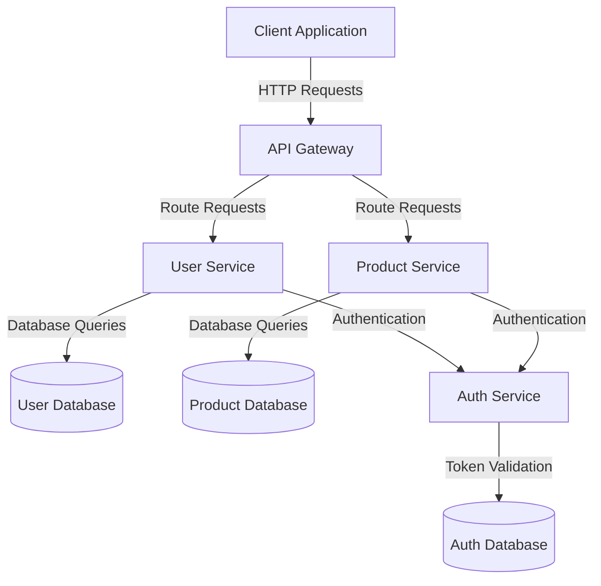

# OpenAPI and API Contract Standards — Spring Boot

## Overview and scope

The purpose of this document is to establish standards for the use of OpenAPI specifications in the development of RESTful APIs within the Xentic platform, leveraging Spring Boot as the primary framework. This document aims to ensure consistency, clarity, and interoperability across all API implementations, thereby enhancing collaboration among teams and improving the overall quality of our services.

### Audience

This standard is intended for:

- **Software Engineers**: Responsible for designing and implementing APIs.
- **Architects**: Overseeing the architectural integrity and compliance of APIs.
- **QA Engineers**: Ensuring that APIs meet the defined specifications and quality standards.
- **Product Managers**: Understanding the capabilities and limitations of APIs for product planning.

### Scope

This document covers:

- Definition and structure of OpenAPI specifications.
- Guidelines for API versioning and documentation.
- Best practices for error handling and response formats.
- Security considerations for API endpoints.
- Tools and libraries recommended for API development and testing.

### Non-goals

This standard does NOT aim to:

- Define the business logic or domain-specific requirements for APIs.
- Replace existing documentation practices outside of OpenAPI specifications.
- Address non-RESTful API standards or protocols.

### Glossary

| Term               | Definition                                                                 |
|--------------------|-----------------------------------------------------------------------------|
| OpenAPI            | A specification for defining RESTful APIs, allowing for machine-readable documentation. |
| Spring Boot        | A Java-based framework used to create stand-alone, production-grade Spring applications. |
| API Contract       | A formal agreement that defines the expected behavior of an API, including endpoints, request/response formats, and error codes. |
| Swagger UI         | A tool that provides a visual interface for interacting with OpenAPI specifications. |

### How This Standard Fits the Xentic Platform

This standard is a critical component of the Xentic platform, as it aligns with our commitment to delivering high-quality, maintainable, and scalable software solutions. By adhering to these guidelines, teams can ensure that:

- APIs are easily discoverable and understandable, reducing onboarding time for new developers.
- Changes to APIs are managed effectively through versioning, minimizing disruption to existing consumers.
- Security best practices are consistently applied, protecting sensitive data and maintaining compliance with industry standards.

### Example OpenAPI Specification

Here is a basic example of an OpenAPI specification for a user service:

```yaml
openapi: 3.0.0
info:
  title: User Service API
  version: 1.0.0
  description: API for managing user accounts
servers:
  - url: https://api.internal.xentic.io/v1
paths:
  /users:
    get:
      summary: Retrieve a list of users
      responses:
        '200':
          description: A list of users
          content:
            application/json:
              schema:
                type: array
                items:
                  type: object
                  properties:
                    id:
                      type: string
                    name:
                      type: string
                    email:
                      type: string
    post:
      summary: Create a new user
      requestBody:
        required: true
        content:
          application/json:
            schema:
              type: object
              properties:
                name:
                  type: string
                email:
                  type: string
      responses:
        '201':
          description: User created successfully
```

By following these standards, we can ensure that our APIs are robust, secure, and easy to integrate, ultimately contributing to the success of Xentic's offerings.

## Standards and policies

1. **MUST** define all APIs using OpenAPI 3.0 specifications. All API contracts must be documented in a YAML format that adheres to the OpenAPI standard.

2. **MUST NOT** use the package naming convention `com.company` for any Java classes. All classes must follow the Xentic convention of `com.xentic.<service>`.

3. **MUST** include a comprehensive description for each API endpoint in the OpenAPI specification, detailing its purpose, request parameters, and response formats.

4. **SHOULD** employ versioning in the API URL, following the pattern `https://api.internal.xentic.io/v{version}`, where `{version}` is a numeric value (e.g., `/v1/users`).

5. **MUST** provide examples for request and response payloads in the OpenAPI documentation to facilitate understanding for API consumers.

6. **MUST NOT** expose sensitive information in API responses. All personal data must be anonymized or omitted where applicable.

7. **SHOULD** utilize HTTP status codes appropriately, aligning with the following table for common responses:

| HTTP Status Code | Description                          |
|------------------|--------------------------------------|
| 200              | OK                                   |
| 201              | Created                              |
| 204              | No Content                           |
| 400              | Bad Request                          |
| 401              | Unauthorized                         |
| 403              | Forbidden                            |
| 404              | Not Found                            |
| 500              | Internal Server Error                |

8. **MUST** implement security measures for all API endpoints, including authentication and authorization, using the shared library `com.xentic.auth:auth-starter`.

9. **SHOULD** include rate limiting in API design to prevent abuse and ensure fair usage among consumers.

10. **MUST** validate all incoming requests against the defined OpenAPI schema to ensure data integrity and prevent invalid data from being processed.

11. **MUST NOT** hard-code configuration values in the codebase. All configurations must be externalized in application properties or YAML files, such as:

```yaml
server:
  port: 8080
spring:
  application:
    name: user-service
```

12. **SHOULD** document any breaking changes in the API changelog to inform consumers about updates that may affect their integrations.

13. **MUST** use Swagger UI for API documentation, making it accessible at `https://api.internal.xentic.io/docs` to allow for easy exploration of the API.

14. **SHOULD** provide a mechanism for consumers to report issues or provide feedback on the API, such as a dedicated email or issue tracker.

15. **MUST** ensure that all API endpoints are idempotent where applicable, especially for operations that modify data (e.g., PUT and DELETE).

By adhering to these standards and policies, Xentic aims to maintain high-quality API design and implementation, fostering a culture of excellence and collaboration across development teams.

## Architecture and design

The architecture of APIs developed within the Xentic platform must adhere to a microservices approach, enabling scalability, maintainability, and independent deployment. Below is a component diagram that illustrates the key components and their interactions.



### Data Flows

1. **Client Application**: The client initiates an HTTP request to the API Gateway.
2. **API Gateway**: The gateway routes the request to the appropriate microservice (e.g., User Service or Product Service).
3. **Microservices**: Each microservice processes the request, interacts with its respective database, and may call the Auth Service for authentication and authorization.
4. **Databases**: Each microservice has its own database to ensure data encapsulation and independence.
5. **Auth Service**: Handles authentication and authorization, ensuring that only valid requests are processed.

### Integration Points

- **API Gateway**: Central point for routing requests to various microservices. It handles load balancing, caching, and request transformation.
- **Microservices**: Each service is independently deployable and can communicate with other services via RESTful APIs.
- **Auth Service**: Provides a mechanism for validating user tokens and managing user sessions.
- **Databases**: Each microservice interacts with its database to perform CRUD operations.

### Failure Domains

- **Client Application**: If the client application fails, users cannot interact with the API.
- **API Gateway**: A failure here can prevent all traffic from reaching the microservices, effectively bringing down the entire API.
- **Microservices**: If a specific microservice fails, only the functionality related to that service is affected, allowing other services to continue operating.
- **Databases**: Database failures can lead to data unavailability. Each microservice should implement retry logic and fallback mechanisms to handle database outages gracefully.

### Configuration Example

Each microservice must have a separate configuration file to manage its settings. Below is an example of a YAML configuration for the User Service:

```yaml
server:
  port: 8081
spring:
  application:
    name: user-service
  datasource:
    url: jdbc:mysql://db.internal.xentic.io:3306/user_db
    username: user
    password: secret
  jpa:
    hibernate:
      ddl-auto: update
    show-sql: true
```

### SQL Example

Here is an example SQL script for creating a user table in the User Database:

```sql
CREATE TABLE users (
    id VARCHAR(36) PRIMARY KEY,
    name VARCHAR(100) NOT NULL,
    email VARCHAR(100) UNIQUE NOT NULL,
    created_at TIMESTAMP DEFAULT CURRENT_TIMESTAMP
);
```

### Code Example

An example of a REST controller in the User Service:

```java
package com.xentic.user;

import org.springframework.beans.factory.annotation.Autowired;
import org.springframework.web.bind.annotation.*;

import java.util.List;

@RestController
@RequestMapping("/v1/users")
public class UserController {

    @Autowired
    private UserService userService;

    @GetMapping
    public List<User> getAllUsers() {
        return userService.findAll();
    }

    @PostMapping
    public User createUser(@RequestBody User user) {
        return userService.save(user);
    }
}
```

By adhering to these architectural and design principles, Xentic ensures that its APIs are robust, scalable, and maintainable, providing a solid foundation for future development and integration.

## Configuration reference

### application.yml

The following is a sample `application.yml` configuration for the User Service. All microservices must follow this structure, ensuring that configurations are externalized and easy to manage.

```yaml
server:
  port: 8081

spring:
  application:
    name: user-service
  datasource:
    url: jdbc:mysql://db.internal.xentic.io:3306/user_db
    username: user
    password: secret
  jpa:
    hibernate:
      ddl-auto: update
    show-sql: true
  security:
    oauth2:
      client:
        registration:
          xentic:
            client-id: your-client-id
            client-secret: your-client-secret
            redirect-uri: "{baseUrl}/login/oauth2/code/{registrationId}"
            scope: read,write
        provider:
          xentic:
            authorization-uri: https://auth.internal.xentic.io/oauth/authorize
            token-uri: https://auth.internal.xentic.io/oauth/token
```

### Terraform Configuration

Below is an example Terraform configuration for deploying the User Service on AWS. This ensures that all infrastructure is managed as code.

```hcl
provider "aws" {
  region = "us-east-1"
}

resource "aws_ecs_cluster" "user_service_cluster" {
  name = "user-service-cluster"
}

resource "aws_ecs_task_definition" "user_service_task" {
  family                   = "user-service"
  requires_compatibilities = ["FARGATE"]
  network_mode            = "awsvpc"
  container_definitions = jsonencode([
    {
      name      = "user-service"
      image     = "xentic/user-service:latest"
      memory    = 512
      cpu       = 256
      essential = true
      portMappings = [
        {
          containerPort = 8081
          hostPort      = 8081
          protocol      = "tcp"
        }
      ]
    }
  ])
}

resource "aws_ecs_service" "user_service" {
  name            = "user-service"
  cluster         = aws_ecs_cluster.user_service_cluster.id
  task_definition = aws_ecs_task_definition.user_service_task.id
  desired_count   = 1
  launch_type     = "FARGATE"

  network_configuration {
    subnets          = ["subnet-0a1b2c3d"]
    security_groups  = ["sg-0a1b2c3d"]
    assign_public_ip = true
  }
}
```

### Environment Variables

To ensure flexibility and security, the following environment variables should be used for sensitive configurations. Default values are provided for development, while production values should be securely managed.

| Variable Name          | Default Value             | Production Value                   |
|------------------------|---------------------------|------------------------------------|
| `DB_URL`               | `jdbc:mysql://localhost:3306/user_db` | `jdbc:mysql://db.internal.xentic.io:3306/user_db` |
| `DB_USERNAME`          | `root`                    | `prod_user`                        |
| `DB_PASSWORD`          | `password`                | `secure_password`                  |
| `OAUTH_CLIENT_ID`      | `dev-client-id`          | `prod-client-id`                  |
| `OAUTH_CLIENT_SECRET`  | `dev-client-secret`      | `prod-client-secret`              |

### Summary of Configuration Guidelines

- **MUST** externalize all configuration settings in `application.yml`, Terraform scripts, or environment variables.
- **MUST NOT** hard-code sensitive information directly in the codebase.
- **SHOULD** use a consistent naming convention for environment variables across all services.
- **MUST** ensure that production values are stored securely, such as in a secrets management tool or environment-specific configuration files.

## Implementation guide

To implement OpenAPI specifications in a Spring Boot application, follow the steps outlined below. This guide will cover the creation of an API, defining the OpenAPI contract, and integrating it with Spring Boot.

### Step 1: Add Dependencies

Add the necessary dependencies for Springdoc OpenAPI to your `pom.xml` file:

```xml
<dependency>
    <groupId>org.springdoc</groupId>
    <artifactId>springdoc-openapi-ui</artifactId>
    <version>1.6.14</version>
</dependency>
```

### Step 2: Create the API Model

Define the model for the API. For example, create a `User` class in the `com.xentic.user` package:

```java
package com.xentic.user;

import io.swagger.v3.oas.annotations.media.Schema;

@Schema(description = "User model")
public class User {
    
    @Schema(description = "Unique identifier of the user")
    private String id;

    @Schema(description = "Name of the user")
    private String name;

    @Schema(description = "Email of the user")
    private String email;

    // Getters and Setters
    public String getId() {
        return id;
    }

    public void setId(String id) {
        this.id = id;
    }

    public String getName() {
        return name;
    }

    public void setName(String name) {
        this.name = name;
    }

    public String getEmail() {
        return email;
    }

    public void setEmail(String email) {
        this.email = email;
    }
}
```

### Step 3: Create the REST Controller

Create a REST controller to handle user-related requests:

```java
package com.xentic.user;

import org.springframework.beans.factory.annotation.Autowired;
import org.springframework.http.HttpStatus;
import org.springframework.http.ResponseEntity;
import org.springframework.web.bind.annotation.*;

import java.util.List;

@RestController
@RequestMapping("/v1/users")
public class UserController {

    @Autowired
    private UserService userService;

    @GetMapping
    public ResponseEntity<List<User>> getAllUsers() {
        return ResponseEntity.ok(userService.findAll());
    }

    @PostMapping
    public ResponseEntity<User> createUser(@RequestBody User user) {
        User createdUser = userService.save(user);
        return ResponseEntity.status(HttpStatus.CREATED).body(createdUser);
    }
}
```

### Step 4: Configure OpenAPI

Create a configuration class to customize OpenAPI settings:

```java
package com.xentic.user.config;

import org.springdoc.core.annotations.RouterOperation;
import org.springframework.context.annotation.Bean;
import org.springframework.context.annotation.Configuration;
import org.springframework.web.servlet.config.annotation.EnableWebMvc;

import io.swagger.v3.oas.models.OpenAPI;
import io.swagger.v3.oas.models.info.Info;

@Configuration
@EnableWebMvc
public class OpenApiConfig {

    @Bean
    public OpenAPI customOpenAPI() {
        return new OpenAPI()
                .info(new Info()
                        .title("User Service API")
                        .version("1.0")
                        .description("API for managing users"));
    }
}
```

### Step 5: Access OpenAPI Documentation

Once your application is running, you can access the OpenAPI documentation at:

```
http://localhost:8081/v3/api-docs
```

And the Swagger UI at:

```
http://localhost:8081/swagger-ui.html
```

### Step 6: Testing the API

You can test the API endpoints using tools like Postman or curl. Here are some example requests:

- **Get All Users**:
  
```bash
curl -X GET http://localhost:8081/v1/users
```

- **Create a User**:

```bash
curl -X POST http://localhost:8081/v1/users -H "Content-Type: application/json" -d '{"name": "John Doe", "email": "john.doe@example.com"}'
```

### Step 7: Error Handling

Implement global exception handling for better API responses. Create a custom exception handler:

```java
package com.xentic.user.exception;

import org.springframework.http.HttpStatus;
import org.springframework.http.ResponseEntity;
import org.springframework.web.bind.annotation.ControllerAdvice;
import org.springframework.web.bind.annotation.ExceptionHandler;

@ControllerAdvice
public class GlobalExceptionHandler {

    @ExceptionHandler(UserNotFoundException.class)
    public ResponseEntity<String> handleUserNotFound(UserNotFoundException ex) {
        return ResponseEntity.status(HttpStatus.NOT_FOUND).body(ex.getMessage());
    }

    @ExceptionHandler(Exception.class)
    public ResponseEntity<String> handleGenericException(Exception ex) {
        return ResponseEntity.status(HttpStatus.INTERNAL_SERVER_ERROR).body("An error occurred: " + ex.getMessage());
    }
}
```

### Summary of Implementation Steps

1. **MUST** add Springdoc OpenAPI dependencies to your project.
2. **MUST** create a model class for your API entities.
3. **MUST** implement a REST controller to handle API requests.
4. **MUST** configure OpenAPI settings to provide API documentation.
5. **MUST** test your API endpoints using appropriate tools.
6. **SHOULD** implement global exception handling for better error management.

By following these steps, Xentic developers can ensure that their APIs are well-documented, easy to use, and maintainable, adhering to the company's standards and best practices.

## Security requirements

### Threat Model Summary

Xentic applications must adhere to a robust security framework to protect sensitive data and ensure secure communication. The following threat model outlines key areas of concern:

- **Unauthorized Access**: Ensure that only authenticated users can access protected resources.
- **Data Breaches**: Protect sensitive information from being exposed during transmission or storage.
- **Input Validation Attacks**: Prevent injection attacks by validating all user inputs.
- **Denial of Service (DoS)**: Implement measures to mitigate DoS attacks that could disrupt service availability.

### Authentication and Authorization

Xentic services MUST implement OAuth 2.0 for authentication and authorization. The following configurations must be included in the `application.yml`:

```yaml
security:
  oauth2:
    client:
      registration:
        xentic:
          client-id: ${OAUTH_CLIENT_ID}
          client-secret: ${OAUTH_CLIENT_SECRET}
          authorization-grant-type: authorization_code
          redirect-uri: "{baseUrl}/login/oauth2/code/{registrationId}"
      provider:
        xentic:
          authorization-uri: https://auth.internal.xentic.io/oauth/authorize
          token-uri: https://auth.internal.xentic.io/oauth/token
```

### Secrets Management

- **MUST NOT** hard-code secrets in the codebase.
- **MUST** use environment variables or a secrets management tool (e.g., HashiCorp Vault, AWS Secrets Manager) to manage sensitive information.
- **SHOULD** rotate secrets regularly and provide a mechanism for updating them without downtime.

### Input Validation

All inputs MUST be validated to prevent injection attacks and ensure data integrity. The following practices MUST be followed:

- **Use Annotations**: Utilize validation annotations from `javax.validation` to enforce constraints on input data.

```java
import javax.validation.constraints.Email;
import javax.validation.constraints.NotBlank;

public class User {
    
    @NotBlank(message = "Name is mandatory")
    private String name;

    @Email(message = "Email should be valid")
    private String email;

    // Getters and Setters
}
```

- **Sanitize Inputs**: Always sanitize and escape user inputs before processing or storing them.

### Audit Logging

Xentic services MUST implement audit logging to track access and changes to sensitive data. The logging framework (e.g., SLF4J with Logback) should be configured to capture relevant events.

#### Example Configuration

```yaml
logging:
  level:
    root: INFO
    com.xentic: DEBUG
  logback:
    rollingPolicy:
      fileNamePattern: logs/xentic-%d{yyyy-MM-dd}.log
      maxHistory: 30
```

#### Example Audit Log Implementation

```java
import org.slf4j.Logger;
import org.slf4j.LoggerFactory;
import org.springframework.stereotype.Service;

@Service
public class UserService {
    private static final Logger logger = LoggerFactory.getLogger(UserService.class);

    public User save(User user) {
        // Log the creation of a new user
        logger.info("Creating user: {}", user.getName());
        // Save user logic here
        return user;
    }
}
```

### Summary of Security Guidelines

- **MUST** implement OAuth 2.0 for authentication and authorization.
- **MUST NOT** hard-code sensitive information in the codebase.
- **MUST** validate all user inputs to prevent injection attacks.
- **MUST** implement audit logging for tracking access to sensitive data.
- **SHOULD** use a secrets management tool for handling sensitive configurations securely. 

By adhering to these security requirements, Xentic ensures that its applications are resilient against common threats and vulnerabilities, maintaining the integrity and confidentiality of user data.

## Testing strategy

At Xentic, a comprehensive testing strategy is essential to ensure the reliability and quality of our APIs. This strategy encompasses unit tests, integration tests, and contract tests, each serving a specific purpose in the development lifecycle.

### Unit Tests

Unit tests are designed to validate the functionality of individual components in isolation. Each service and controller MUST have corresponding unit tests to ensure that methods behave as expected.

- **Coverage Target**: A minimum of 80% code coverage is required for all unit tests.
- **Testing Framework**: Use JUnit 5 and Mockito for unit testing.

#### Example Unit Test Class

```java
package com.xentic.user;

import static org.mockito.Mockito.*;
import static org.junit.jupiter.api.Assertions.*;

import org.junit.jupiter.api.BeforeEach;
import org.junit.jupiter.api.Test;
import org.mockito.InjectMocks;
import org.mockito.Mock;
import org.mockito.MockitoAnnotations;

import java.util.Collections;
import java.util.List;

public class UserServiceTest {

    @Mock
    private UserRepository userRepository;

    @InjectMocks
    private UserService userService;

    @BeforeEach
    public void setUp() {
        MockitoAnnotations.openMocks(this);
    }

    @Test
    public void testFindAll() {
        when(userRepository.findAll()).thenReturn(Collections.singletonList(new User("1", "John Doe", "john.doe@example.com")));
        
        List<User> users = userService.findAll();
        
        assertEquals(1, users.size());
        assertEquals("John Doe", users.get(0).getName());
    }
}
```

### Integration Tests

Integration tests validate the interaction between different components and external systems, such as databases and message brokers. 

- **Coverage Target**: A minimum of 70% code coverage is required for integration tests.
- **Testing Framework**: Use Spring Boot Test with Testcontainers for integration testing.

#### Example Integration Test Class

```java
package com.xentic.user;

import static org.springframework.test.web.servlet.request.MockMvcRequestBuilders.*;
import static org.springframework.test.web.servlet.result.MockMvcResultMatchers.*;

import org.junit.jupiter.api.BeforeEach;
import org.junit.jupiter.api.Test;
import org.springframework.beans.factory.annotation.Autowired;
import org.springframework.boot.test.autoconfigure.web.servlet.WebMvcTest;
import org.springframework.test.web.servlet.MockMvc;

@WebMvcTest(UserController.class)
public class UserControllerIntegrationTest {

    @Autowired
    private MockMvc mockMvc;

    @Test
    public void testGetAllUsers() throws Exception {
        mockMvc.perform(get("/v1/users"))
                .andExpect(status().isOk())
                .andExpect(jsonPath("$[0].name").value("John Doe"));
    }

    @Test
    public void testCreateUser() throws Exception {
        String userJson = "{\"name\": \"Jane Doe\", \"email\": \"jane.doe@example.com\"}";

        mockMvc.perform(post("/v1/users")
                .contentType("application/json")
                .content(userJson))
                .andExpect(status().isCreated())
                .andExpect(jsonPath("$.name").value("Jane Doe"));
    }
}
```

### Contract Tests

Contract tests ensure that the API adheres to the agreed-upon contract between the service provider and consumer. This is crucial for maintaining compatibility as services evolve.

- **Coverage Target**: All public API endpoints MUST have corresponding contract tests.
- **Testing Framework**: Use Pact for contract testing.

#### Example Pact Test Class

```java
package com.xentic.user;

import au.com.dius.pact.consumer.junit5.PactConsumerTestExt;
import au.com.dius.pact.consumer.junit5.PactTestFor;
import au.com.dius.pact.consumer.dsl.PactDslWithProvider;
import au.com.dius.pact.consumer.junit5.Pact;
import org.junit.jupiter.api.extension.ExtendWith;

@ExtendWith(PactConsumerTestExt.class)
@PactTestFor(providerName = "UserService", port = "8080")
public class UserServiceContractTest {

    @Pact(consumer = "UserClient")
    public RequestResponsePact createPact(PactDslWithProvider builder) {
        return builder
                .given("User exists")
                .uponReceiving("A request to get user")
                .path("/v1/users/1")
                .method("GET")
                .willRespondWith()
                .status(200)
                .body("{\"name\":\"John Doe\",\"email\":\"john.doe@example.com\"}")
                .toPact();
    }

    // Test method to verify the contract
}
```

### Summary of Testing Guidelines

| Test Type        | Coverage Target | Frameworks                |
|------------------|-----------------|---------------------------|
| Unit Tests       | 80%             | JUnit 5, Mockito          |
| Integration Tests| 70%             | Spring Boot Test, Testcontainers |
| Contract Tests   | 100%            | Pact                      |

- **MUST** write unit tests for all service and controller methods.
- **MUST** implement integration tests for all API endpoints.
- **MUST** create contract tests for all public API endpoints.
- **SHOULD** strive for high code coverage to ensure code quality and reliability.

By adhering to these testing strategies, Xentic developers can ensure that their APIs are robust, maintainable, and meet the quality standards expected in enterprise applications.

## Observability and operations

At Xentic, observability is crucial for maintaining the reliability and performance of our services. This section outlines the standards for metrics, logs, traces, dashboards, alerts, and service-level objectives (SLOs) that must be adhered to.

### Metrics

All services MUST expose metrics that provide insights into their performance and health. The following metrics MUST be collected:

- **Request Count**: Total number of requests received.
- **Error Count**: Total number of failed requests.
- **Response Time**: Time taken to process requests.
- **CPU Usage**: Percentage of CPU utilized by the service.
- **Memory Usage**: Amount of memory used by the service.

#### Example Configuration for Micrometer

```yaml
management:
  metrics:
    export:
      prometheus:
        enabled: true
```

### Logs

Logging is essential for troubleshooting and understanding application behavior. The following guidelines MUST be followed:

- **Log Level**: Use appropriate log levels (DEBUG, INFO, WARN, ERROR) to classify log messages.
- **Structured Logging**: Logs MUST be structured (e.g., JSON format) to facilitate parsing and searching.
- **Correlation IDs**: All logs MUST include a unique correlation ID to trace requests across services.

#### Example Logback Configuration

```yaml
logging:
  level:
    root: INFO
    com.xentic: DEBUG
  logback:
    encoder:
      pattern: '{"timestamp":"%d{yyyy-MM-dd HH:mm:ss}","level":"%level","thread":"%thread","logger":"%logger","message":"%msg","correlationId":"%X{correlationId}"}'
```

### Traces

Distributed tracing MUST be implemented to track requests across microservices. Xentic services SHOULD use OpenTelemetry or Zipkin for tracing.

- **Trace Context**: All services MUST propagate trace context headers (e.g., `X-B3-TraceId`, `X-B3-SpanId`) with each request.

#### Example Spring Boot Configuration for OpenTelemetry

```yaml
otel:
  tracing:
    enabled: true
    exporter:
      otlp:
        endpoint: https://otel-collector.internal.xentic.io:4317
```

### Dashboards

Dashboards MUST be created to visualize metrics and logs. Xentic recommends using Grafana for creating dashboards that provide insights into service health and performance.

- **Key Dashboards**: 
  - Service Health Dashboard: Displays overall service status and key metrics.
  - Error Rates Dashboard: Monitors error rates and identifies problematic services.
  - Latency Dashboard: Tracks response times for different endpoints.

### Alerts

Alerting is critical for proactive incident management. The following alerting standards MUST be implemented:

- **Error Rate Alerts**: Alert if the error rate exceeds 5% over a 5-minute window.
- **Latency Alerts**: Alert if the average response time exceeds 500ms for 95th percentile.
- **Resource Utilization Alerts**: Alert if CPU or memory usage exceeds 80%.

#### Example Alerting Rules in Prometheus

```yaml
groups:
  - name: alerting.rules
    rules:
      - alert: HighErrorRate
        expr: sum(rate(http_requests_total{status="500"}[5m])) / sum(rate(http_requests_total[5m])) > 0.05
        for: 5m
        labels:
          severity: critical
        annotations:
          summary: "High error rate detected"
          description: "Error rate exceeds 5% for the last 5 minutes."
```

### Service-Level Objectives (SLOs)

SLOs MUST be defined for each service to measure performance and reliability. Each SLO should include:

- **Objective**: The target value (e.g., 99.9% availability).
- **Measurement**: How the objective will be measured (e.g., request success rate).
- **Reporting Period**: The time frame for measuring the SLO (e.g., monthly).

#### Example SLO Definition

| Service         | Objective         | Measurement                     | Reporting Period |
|------------------|-------------------|---------------------------------|------------------|
| User Service     | 99.9% Availability | Request success rate            | Monthly          |
| Order Service    | 99.5% Availability | Order processing success rate   | Monthly          |

### On-Call Runbook Steps

In the event of an incident, the following on-call runbook steps MUST be followed:

1. **Acknowledge the Alert**: Confirm receipt of the alert and start investigating.
2. **Check Metrics**: Review metrics for anomalies (e.g., increased error rates, latency).
3. **Review Logs**: Look for error logs or unusual patterns in the logs.
4. **Check Dependencies**: Verify the status of dependent services and external systems.
5. **Communicate**: Update stakeholders on the status and estimated resolution time.
6. **Mitigate**: Take necessary actions to mitigate the issue (e.g., scaling services, rolling back deployments).
7. **Document**: After resolution, document the incident, root cause, and actions taken in the incident management system.

By adhering to these observability and operations standards, Xentic ensures that its services are reliable, maintainable, and responsive to incidents, ultimately enhancing the user experience and operational efficiency.

## Migration and versioning

At Xentic, managing API versioning and migration is essential for maintaining backward compatibility and ensuring a smooth transition for consumers of our APIs. The following guidelines outline the policies for upgrading, deprecating, and rolling back versions of APIs.

### Upgrade Paths

- **Versioning Strategy**: APIs MUST follow semantic versioning (e.g., v1, v2) to indicate breaking changes, new features, and bug fixes.
- **Upgrade Path Documentation**: Each API version MUST have a clear upgrade path documented, including changes and migration steps. This documentation MUST be accessible at `https://docs.internal.xentic.io/api-upgrade-paths`.

#### Example Upgrade Path Documentation

| Current Version | New Version | Changes                                    | Migration Steps                             |
|------------------|-------------|--------------------------------------------|--------------------------------------------|
| v1               | v2          | Added new endpoint /v2/users              | 1. Update client to call /v2/users        |
|                  |             | Changed response format for /v1/users     | 2. Adjust parsing logic in client          |
|                  |             | Removed deprecated endpoint /v1/old-users | 3. Remove calls to deprecated endpoint     |

### Deprecation Policy

- **Deprecation Notice**: When an API is deprecated, a notice MUST be sent to all consumers at least 3 months prior to removal.
- **Deprecation Header**: Services MUST include a `Deprecation` header in the response for deprecated endpoints.

#### Example Deprecation Header

```http
HTTP/1.1 200 OK
Deprecation: true
Link: </v1/users>; rel="deprecated"
```

### Backward Compatibility

- **Non-Breaking Changes**: All new features MUST be added in a backward-compatible manner. This includes:
  - Adding new endpoints.
  - Adding optional fields to responses.
- **Versioned Endpoints**: All breaking changes MUST result in a new version of the API. For example, if the response structure changes, a new version (e.g., `/v2/users`) MUST be introduced.

### Rollback Procedures

In the event of a failed deployment or critical issues arising from a new version, the following rollback procedures MUST be followed:

1. **Immediate Rollback**: If a critical issue is detected, the service MUST be rolled back to the previous stable version immediately.
2. **Rollback Testing**: After rolling back, the service MUST be tested to ensure stability before resuming normal operations.
3. **Communication**: Notify all stakeholders and consumers of the rollback and the reasons for it.

#### Example Rollback Command (Using Kubernetes)

```bash
kubectl rollout undo deployment/user-service
```

### Versioning in OpenAPI Specifications

All API versions MUST be clearly defined in the OpenAPI specification. The version MUST be included in the `info` section.

#### Example OpenAPI Specification

```yaml
openapi: 3.0.0
info:
  title: User Service API
  version: 2.0.0
paths:
  /v2/users:
    get:
      summary: Retrieve all users
      responses:
        '200':
          description: A list of users
```

### Summary of Migration and Versioning Guidelines

- **MUST** follow semantic versioning for all APIs.
- **MUST** provide clear upgrade paths for each API version.
- **MUST** notify consumers of deprecations at least 3 months in advance.
- **MUST NOT** introduce breaking changes without incrementing the API version.
- **MUST** have rollback procedures in place for critical issues. 

By adhering to these migration and versioning standards, Xentic ensures that its APIs remain stable, reliable, and user-friendly, minimizing disruptions for consumers during transitions.

## FAQ, anti-patterns, and checklists

### Frequently Asked Questions (FAQ)

1. **What is OpenAPI?**
   - OpenAPI is a specification for defining RESTful APIs, allowing developers to describe the structure of their APIs in a machine-readable format.

2. **How do I document my API using OpenAPI?**
   - You MUST create an OpenAPI specification file (YAML or JSON) that includes details about endpoints, request/response formats, and authentication methods.

3. **What is the recommended versioning strategy for APIs?**
   - Xentic APIs MUST follow semantic versioning, where major changes increment the first digit, minor changes increment the second, and patch changes increment the third.

4. **How should I handle breaking changes in my API?**
   - Breaking changes MUST result in a new version of the API, and consumers MUST be notified at least 3 months in advance.

5. **What format should I use for my OpenAPI specifications?**
   - OpenAPI specifications MUST be written in YAML or JSON format, with YAML being preferred for its readability.

6. **How do I ensure backward compatibility?**
   - Non-breaking changes MUST be introduced without altering existing functionality, such as adding new endpoints or optional fields.

7. **What tools can I use to validate my OpenAPI specifications?**
   - You SHOULD use tools like Swagger Editor or OpenAPI Generator to validate and generate client SDKs from your OpenAPI specifications.

8. **How should I handle authentication in my APIs?**
   - Authentication methods MUST be clearly defined in the OpenAPI specification, and Xentic recommends using OAuth 2.0 for secure access.

9. **What is the purpose of the `Deprecation` header?**
   - The `Deprecation` header informs consumers that an endpoint will be removed in the future, allowing them time to transition to newer versions.

10. **Where can I find examples of OpenAPI specifications?**
    - Examples can be found in the internal documentation at `https://docs.internal.xentic.io/openapi-examples`.

### Anti-Patterns

| Anti-Pattern                     | Description                                                                                      |
|----------------------------------|--------------------------------------------------------------------------------------------------|
| Hardcoding URLs                  | DO NOT hardcode URLs in your code; use configuration files instead.                            |
| Ignoring Response Codes          | MUST NOT ignore HTTP response codes; always check for success or error codes in your API logic.|
| Lack of Versioning               | MUST NOT release new API versions without proper versioning; it leads to confusion among consumers.|
| Overly Complex Endpoints         | MUST NOT create endpoints that do too much; keep them focused and simple.                      |
| Inconsistent Naming Conventions   | MUST follow consistent naming conventions for endpoints and parameters to improve clarity.      |
| Not Using Standard Status Codes  | MUST use standard HTTP status codes to indicate the result of API calls.                       |

### Pre-Merge Checklist

- [ ] Ensure OpenAPI specifications are up-to-date and validated.
- [ ] Confirm all endpoints are documented with examples.
- [ ] Review for proper versioning and deprecation notices.
- [ ] Verify that all breaking changes are communicated to stakeholders.
- [ ] Ensure unit tests cover all new and modified endpoints.

### Production Checklist

- [ ] Confirm deployment to the staging environment was successful.
- [ ] Validate that all API endpoints function as expected in staging.
- [ ] Check that monitoring and alerting are set up for the new version.
- [ ] Ensure rollback procedures are documented and ready for use.
- [ ] Notify consumers of the new version and any relevant changes.
