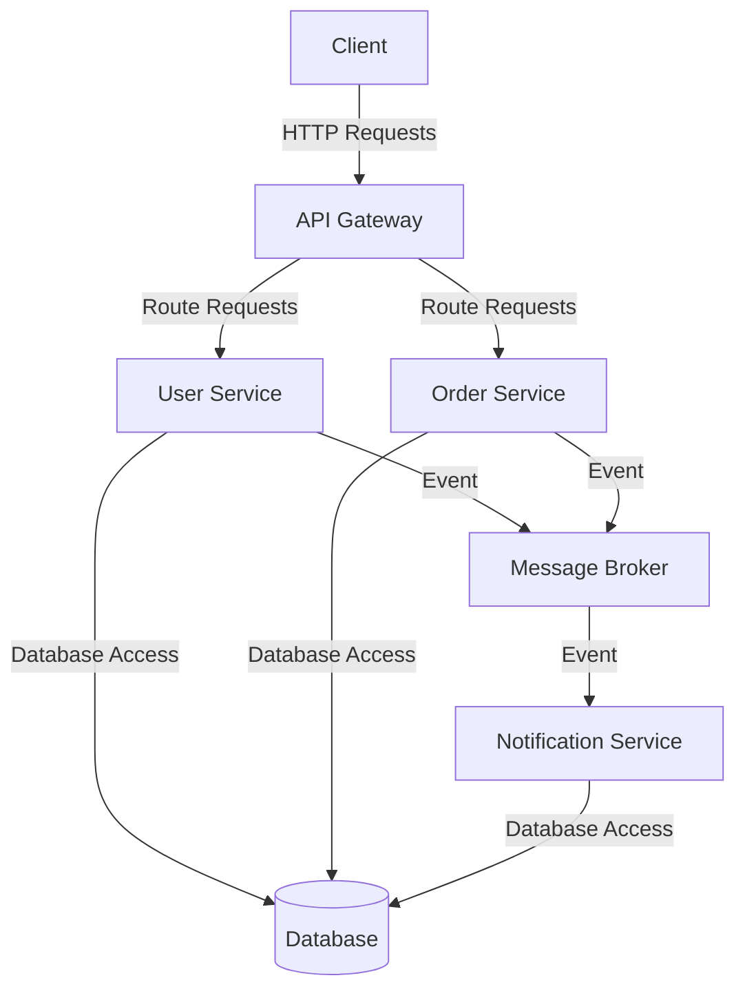

# Standard Spring Boot Project Structure

## Overview and scope

The purpose of this document is to establish a standard structure for Spring Boot projects within Xentic. This standard is designed to ensure consistency, maintainability, and scalability across all backend Java services developed by the engineering teams. Adhering to these standards will facilitate better collaboration, reduce onboarding time for new developers, and promote best practices in software development.

### Audience
This document is intended for:
- Software Engineers
- Technical Leads
- Architects
- Quality Assurance Engineers

### Scope
This standard applies to all backend Java services developed at Xentic using the Spring Boot framework. It covers the package structure, coding conventions, and best practices that must be followed to ensure a uniform approach to application development.

### Non-goals
This document does NOT aim to:
- Define front-end development practices.
- Specify third-party library usage beyond those mentioned.
- Cover deployment or infrastructure-related standards.

### Glossary
| Term                | Definition                                                                                   |
|---------------------|----------------------------------------------------------------------------------------------|
| DTO                 | Data Transfer Object, a design pattern used to transfer data between software application subsystems. |
| JPA                 | Java Persistence API, a specification for accessing, persisting, and managing data between Java objects and a relational database. |
| REST                | Representational State Transfer, an architectural style for designing networked applications. |

### How This Standard Fits the Xentic Platform
This standard aligns with Xentic's commitment to delivering high-quality software solutions. By following a consistent project structure, developers can focus on building features rather than debating architectural decisions. Additionally, this standard supports Xentic’s microservices architecture, allowing services to be developed, deployed, and scaled independently while maintaining a cohesive codebase.

### Package Layout
All backend Java services must follow the layered package structure defined below. Deviations from this structure require explicit approval from the architecture team.

```
com.xentic.<service>/
├── config/          # Spring configs, beans, security
├── controller/      # REST controllers (@RestController)
├── service/         # Business logic interfaces + implementations
│   └── impl/        # Implementations of service interfaces
├── repository/      # Spring Data JPA repositories
├── domain/          # JPA entities
├── dto/             # Request/Response DTOs
├── mapper/          # MapStruct mappers (DTO ↔ entity)
├── exception/       # Custom exceptions + global handler
└── util/            # Stateless utility classes
```

### Rules
- Controllers **MUST NOT** contain business logic; they must delegate to the service layer.
- Service interfaces **MUST** be defined; implementations should reside in `service/impl/`.
- DTOs **MUST** be immutable records (Java 17+) unless mutation is explicitly required.
- **DO NOT** use `@Autowired` on fields; constructor injection **MUST** be used exclusively.

### Example Controller
Below is an example of a compliant REST controller:

```java
@RestController
@RequestMapping("/api/v1/users")
@RequiredArgsConstructor
public class UserController {
    private final UserService userService;

    @GetMapping("/{id}")
    public ResponseEntity<UserResponse> getUser(@PathVariable UUID id) {
        return ResponseEntity.ok(userService.findById(id));
    }
}
```

### Versioning
All REST APIs **MUST** be versioned using a path prefix. The recommended format is `/api/v1/`, `/api/v2/`, etc., to ensure backward compatibility and ease of updates.

```yaml
# Example application.yml configuration for API versioning
api:
  version: v1

## Standards and policies

1. **Project Structure**  
   All Spring Boot projects **MUST** adhere to the specified package layout as defined in the Package Layout section. Any deviations **MUST NOT** be made without prior approval from the architecture team.

2. **Naming Conventions**  
   Package names **MUST** follow the structure `com.xentic.<service>`. For shared libraries, the naming convention **MUST** be `com.xentic.common:*` or `com.xentic.auth:auth-starter`.

3. **Dependency Management**  
   All dependencies **MUST** be managed through Maven or Gradle. Use the latest stable versions of libraries that are compatible with the Spring Boot version in use.

4. **Configuration Management**  
   Configuration files **MUST** be placed in the `src/main/resources` directory and should be named `application.yml` or `application.properties`. Sensitive information **MUST NOT** be hardcoded and should be managed through environment variables or a secure vault.

   ```yaml
   # Example application.yml configuration
   spring:
     datasource:
       url: jdbc:mysql://localhost:3306/xentic
       username: ${DB_USERNAME}
       password: ${DB_PASSWORD}
   ```

5. **Logging**  
   Logging **MUST** be configured using SLF4J with Logback as the underlying implementation. All log messages **MUST** include context information, such as user ID and request ID, to aid in debugging.

   ```yaml
   # Example Logback configuration
   logging:
     level:
       root: INFO
       com.xentic: DEBUG
   ```

6. **Exception Handling**  
   Custom exceptions **MUST** be defined for handling specific error scenarios. A global exception handler **MUST** be implemented using `@ControllerAdvice`.

   ```java
   @ControllerAdvice
   public class GlobalExceptionHandler {
       @ExceptionHandler(UserNotFoundException.class)
       public ResponseEntity<String> handleUserNotFound(UserNotFoundException ex) {
           return ResponseEntity.status(HttpStatus.NOT_FOUND).body(ex.getMessage());
       }
   }
   ```

7. **Testing**  
   Unit tests **MUST** be written for all service and controller classes. Integration tests **SHOULD** be included to verify the interactions between components. Testing frameworks such as JUnit 5 and Mockito **MUST** be used.

8. **API Documentation**  
   All REST APIs **MUST** be documented using OpenAPI (Swagger). The documentation **SHOULD** be generated automatically from annotations in the code.

   ```java
   @Operation(summary = "Get user by ID", description = "Returns a user object for the given ID")
   @ApiResponses(value = {
       @ApiResponse(responseCode = "200", description = "User found"),
       @ApiResponse(responseCode = "404", description = "User not found")
   })
   ```

9. **Version Control**  
   All code **MUST** be version-controlled using Git. Branch naming conventions **SHOULD** follow the format `feature/<description>`, `bugfix/<description>`, or `hotfix/<description>`.

10. **Code Reviews**  
    All code changes **MUST** undergo a peer review process before being merged into the main branch. Code reviews **SHOULD** focus on adherence to coding standards, performance implications, and security vulnerabilities.

11. **Security Practices**  
    All applications **MUST** implement security best practices, including but not limited to:
    - Input validation
    - Output encoding
    - Proper authentication and authorization mechanisms

12. **Continuous Integration/Continuous Deployment (CI/CD)**  
    All projects **MUST** be integrated with a CI/CD pipeline to automate testing and deployment processes. Build tools **MUST** be configured to run tests and check code quality on every commit.

By adhering to these standards and policies, Xentic aims to maintain a high level of code quality and operational efficiency across all backend Java services.

## Architecture and design

The architecture of Spring Boot applications at Xentic is designed to be modular, scalable, and resilient. The following sections describe the component diagram, data flows, integration points, and failure domains.

### Component Diagram

The following Mermaid diagram illustrates the high-level architecture of a typical Spring Boot application at Xentic:



### Data Flows

- **Client to API Gateway**: Clients interact with the system via HTTP requests sent to the API Gateway.
- **API Gateway to Services**: The API Gateway routes requests to appropriate services (e.g., User Service, Order Service).
- **Service to Database**: Each service accesses the database to perform CRUD operations.
- **Event-Driven Communication**: Services publish events to a message broker for asynchronous processing, allowing other services (e.g., Notification Service) to react to these events.

### Integration Points

- **API Gateway**: All external requests must go through the API Gateway, which handles routing, load balancing, and security.
- **Database**: Each service interacts with a shared database. Services **MUST** use JPA for data access.
- **Message Broker**: Services communicate asynchronously via a message broker (e.g., RabbitMQ, Kafka). This allows for decoupling and scalability.

### Failure Domains

- **Service Failure**: If a service fails, the API Gateway should return an appropriate error response. Circuit breaker patterns (e.g., Resilience4j) **MUST** be implemented to handle service failures gracefully.
- **Database Failure**: In case of database unavailability, services **MUST** implement retry logic and fallback mechanisms.
- **Message Broker Failure**: If the message broker is down, services should log the failure and implement a backoff strategy for retries.

### Example Configuration

Below is an example of how to configure a message broker in the `application.yml`:

```yaml
spring:
  rabbitmq:
    host: localhost
    port: 5672
    username: ${RABBITMQ_USERNAME}
    password: ${RABBITMQ_PASSWORD}
```

### Summary

By adhering to this architecture and design framework, Xentic ensures that its Spring Boot applications are robust, maintainable, and capable of handling various failure scenarios effectively. All teams **MUST** follow these guidelines to ensure consistency and reliability across services.

## Configuration reference

### application.yml Configuration

The `application.yml` file is the primary configuration file for Spring Boot applications. Below are the mandatory configuration properties along with their default and production values.

```yaml
# application.yml
spring:
  application:
    name: xentic-service
  datasource:
    url: jdbc:mysql://localhost:3306/xentic
    username: ${DB_USERNAME}
    password: ${DB_PASSWORD}
    driver-class-name: com.mysql.cj.jdbc.Driver
  rabbitmq:
    host: localhost
    port: 5672
    username: ${RABBITMQ_USERNAME}
    password: ${RABBITMQ_PASSWORD}
  logging:
    level:
      root: INFO
      com.xentic: DEBUG
  security:
    oauth2:
      client:
        registration:
          my-client:
            client-id: ${OAUTH2_CLIENT_ID}
            client-secret: ${OAUTH2_CLIENT_SECRET}
            scope: read,write
        provider:
          my-provider:
            authorization-uri: https://auth.internal.xentic.io/oauth/authorize
            token-uri: https://auth.internal.xentic.io/oauth/token
```

### Environment Variables

| Environment Variable      | Default Value    | Production Value        |
|---------------------------|------------------|--------------------------|
| `DB_USERNAME`             | `root`           | `prod_user`              |
| `DB_PASSWORD`             | `password`       | `prod_secure_password`   |
| `RABBITMQ_USERNAME`       | `guest`          | `prod_rabbit_user`       |
| `RABBITMQ_PASSWORD`       | `guest`          | `prod_rabbit_password`    |
| `OAUTH2_CLIENT_ID`        | `default-client` | `prod_client_id`         |
| `OAUTH2_CLIENT_SECRET`    | `default-secret` | `prod_client_secret`     |

### Terraform Configuration

When deploying infrastructure using Terraform, the following configuration should be used to provision the necessary resources for the Spring Boot application.

```hcl
provider "aws" {
  region = "us-west-2"
}

resource "aws_db_instance" "default" {
  allocated_storage    = 20
  engine             = "mysql"
  engine_version     = "8.0"
  instance_class     = "db.t2.micro"
  name               = "xentic"
  username           = var.db_username
  password           = var.db_password
  skip_final_snapshot = true
}

resource "aws_security_group" "allow_mysql" {
  name        = "allow_mysql"
  description = "Allow MySQL inbound traffic"

  ingress {
    from_port   = 3306
    to_port     = 3306
    protocol    = "tcp"
    cidr_blocks = ["0.0.0.0/0"]
  }
}

output "db_endpoint" {
  value = aws_db_instance.default.endpoint
}
```

### Additional Configuration Properties

- **Server Configuration**: The server settings should be configured to optimize performance and security.

```yaml
server:
  port: 8080
  servlet:
    context-path: /api/v1
```

- **Actuator Configuration**: Enable Spring Boot Actuator for monitoring and management.

```yaml
management:
  endpoints:
    web:
      exposure:
        include: "*"
  endpoint:
    health:
      show-details: always
```

### Summary

All Spring Boot applications **MUST** adhere to the configuration standards outlined above. The use of environment variables for sensitive information is mandatory to ensure security. Terraform configurations **MUST** be reviewed and approved before deployment to maintain infrastructure integrity.

## Implementation guide

To implement a standard Spring Boot project at Xentic, follow these step-by-step instructions. This guide will cover the creation of a simple User Service, including the necessary classes, configurations, and tests.

### Step 1: Project Setup

Create a new Spring Boot project using Spring Initializr or your preferred method. The project structure should follow the package naming conventions established by Xentic.

```
com.xentic.userservice
├── UserServiceApplication.java
├── controller
│   └── UserController.java
├── model
│   └── User.java
├── repository
│   └── UserRepository.java
├── service
│   └── UserService.java
└── exception
    └── UserNotFoundException.java
```

### Step 2: Main Application Class

Create the main application class to bootstrap the Spring Boot application.

```java
package com.xentic.userservice;

import org.springframework.boot.SpringApplication;
import org.springframework.boot.autoconfigure.SpringBootApplication;

@SpringBootApplication
public class UserServiceApplication {
    public static void main(String[] args) {
        SpringApplication.run(UserServiceApplication.class, args);
    }
}
```

### Step 3: User Model

Define the `User` model class, which will represent the user entity.

```java
package com.xentic.userservice.model;

import javax.persistence.Entity;
import javax.persistence.GeneratedValue;
import javax.persistence.GenerationType;
import javax.persistence.Id;

@Entity
public class User {
    @Id
    @GeneratedValue(strategy = GenerationType.IDENTITY)
    private Long id;
    private String username;
    private String email;

    // Getters and Setters
    public Long getId() {
        return id;
    }

    public void setId(Long id) {
        this.id = id;
    }

    public String getUsername() {
        return username;
    }

    public void setUsername(String username) {
        this.username = username;
    }

    public String getEmail() {
        return email;
    }

    public void setEmail(String email) {
        this.email = email;
    }
}
```

### Step 4: User Repository

Create the `UserRepository` interface that extends `JpaRepository`.

```java
package com.xentic.userservice.repository;

import com.xentic.userservice.model.User;
import org.springframework.data.jpa.repository.JpaRepository;

public interface UserRepository extends JpaRepository<User, Long> {
    User findByUsername(String username);
}
```

### Step 5: User Service

Implement the `UserService` class that contains the business logic for user management.

```java
package com.xentic.userservice.service;

import com.xentic.userservice.exception.UserNotFoundException;
import com.xentic.userservice.model.User;
import com.xentic.userservice.repository.UserRepository;
import org.springframework.beans.factory.annotation.Autowired;
import org.springframework.stereotype.Service;

import java.util.List;

@Service
public class UserService {
    @Autowired
    private UserRepository userRepository;

    public List<User> findAll() {
        return userRepository.findAll();
    }

    public User findById(Long id) {
        return userRepository.findById(id)
                .orElseThrow(() -> new UserNotFoundException("User not found with id: " + id));
    }

    public User createUser(User user) {
        return userRepository.save(user);
    }
}
```

### Step 6: User Controller

Create the `UserController` class to handle HTTP requests.

```java
package com.xentic.userservice.controller;

import com.xentic.userservice.model.User;
import com.xentic.userservice.service.UserService;
import org.springframework.beans.factory.annotation.Autowired;
import org.springframework.http.ResponseEntity;
import org.springframework.web.bind.annotation.*;

import java.util.List;

@RestController
@RequestMapping("/api/v1/users")
public class UserController {
    @Autowired
    private UserService userService;

    @GetMapping
    public List<User> getAllUsers() {
        return userService.findAll();
    }

    @GetMapping("/{id}")
    public ResponseEntity<User> getUserById(@PathVariable Long id) {
        User user = userService.findById(id);
        return ResponseEntity.ok(user);
    }

    @PostMapping
    public User createUser(@RequestBody User user) {
        return userService.createUser(user);
    }
}
```

### Step 7: Exception Handling

Define the `UserNotFoundException` class to handle user-related exceptions.

```java
package com.xentic.userservice.exception;

public class UserNotFoundException extends RuntimeException {
    public UserNotFoundException(String message) {
        super(message);
    }
}
```

### Step 8: Configuration

Ensure that the `application.yml` file is configured correctly for your database connection.

```yaml
spring:
  datasource:
    url: jdbc:mysql://localhost:3306/xentic
    username: ${DB_USERNAME}
    password: ${DB_PASSWORD}
    driver-class-name: com.mysql.cj.jdbc.Driver
```

### Step 9: Testing

Unit tests **MUST** be written for the service and controller classes. Below is an example of a simple unit test for the `UserService`.

```java
package com.xentic.userservice.service;

import com.xentic.userservice.exception.UserNotFoundException;
import com.xentic.userservice.model.User;
import com.xentic.userservice.repository.UserRepository;
import org.junit.jupiter.api.Test;
import org.mockito.Mockito;

import java.util.Optional;

import static org.junit.jupiter.api.Assertions.*;

class UserServiceTest {
    private final UserRepository userRepository = Mockito.mock(UserRepository.class);
    private final UserService userService = new UserService(userRepository);

    @Test
    void testFindById_UserNotFound() {
        Mockito.when(userRepository.findById(1L)).thenReturn(Optional.empty());

        Exception exception = assertThrows(UserNotFoundException.class, () -> {
            userService.findById(1L);
        });

        assertEquals("User not found with id: 1", exception.getMessage());
    }
}
```

### Summary

By following these steps, you will have a fully functional User Service that adheres to Xentic's standards. Ensure that all classes are organized according to the specified package structure, and that testing and documentation are included as part of the implementation process.

## Security requirements

### Threat Model Summary

Xentic applications **MUST** implement a robust threat model to identify and mitigate potential security risks. The following threats should be considered:

- **Unauthorized Access**: Ensure that only authenticated users can access sensitive endpoints.
- **Data Breach**: Protect sensitive data both at rest and in transit.
- **Injection Attacks**: Validate and sanitize all user inputs to prevent SQL injection and other injection attacks.
- **Denial of Service (DoS)**: Implement rate limiting to protect against DoS attacks.

### Authentication and Authorization

Xentic applications **MUST** use OAuth2 for authentication and authorization. The following configurations should be included in the `application.yml`:

```yaml
spring:
  security:
    oauth2:
      client:
        registration:
          xentic:
            client-id: ${OAUTH2_CLIENT_ID}
            client-secret: ${OAUTH2_CLIENT_SECRET}
            scope: read,write
            redirect-uri: "{baseUrl}/login/oauth2/code/{registrationId}"
        provider:
          xentic:
            authorization-uri: https://auth.internal.xentic.io/oauth2/authorize
            token-uri: https://auth.internal.xentic.io/oauth2/token
            user-info-uri: https://auth.internal.xentic.io/userinfo
```

### Secrets Management

All sensitive information, such as API keys and database credentials, **MUST NOT** be hardcoded in the source code. Instead, they should be managed through environment variables or a secrets management tool. Example of environment variable usage in `application.yml`:

```yaml
spring:
  datasource:
    username: ${DB_USERNAME}
    password: ${DB_PASSWORD}
```

### Input Validation

All user inputs **MUST** be validated to prevent injection attacks and ensure data integrity. Use Spring's validation features to enforce constraints on input data. Example of a User model with validation annotations:

```java
package com.xentic.userservice.model;

import javax.persistence.Entity;
import javax.persistence.GeneratedValue;
import javax.persistence.GenerationType;
import javax.persistence.Id;
import javax.validation.constraints.Email;
import javax.validation.constraints.NotBlank;

@Entity
public class User {
    @Id
    @GeneratedValue(strategy = GenerationType.IDENTITY)
    private Long id;

    @NotBlank(message = "Username is mandatory")
    private String username;

    @Email(message = "Email should be valid")
    private String email;

    // Getters and Setters
}
```

### Audit Logging

Audit logging **MUST** be implemented to track critical actions performed by users. This can be done using Spring AOP or by implementing a logging aspect. Example of an audit log aspect:

```java
package com.xentic.userservice.aspect;

import org.aspectj.lang.JoinPoint;
import org.aspectj.lang.annotation.After;
import org.aspectj.lang.annotation.Aspect;
import org.slf4j.Logger;
import org.slf4j.LoggerFactory;
import org.springframework.stereotype.Component;

@Aspect
@Component
public class AuditLogAspect {
    private static final Logger logger = LoggerFactory.getLogger(AuditLogAspect.class);

    @After("execution(* com.xentic.userservice.controller.*.*(..))")
    public void logAfter(JoinPoint joinPoint) {
        logger.info("Executed method: {}", joinPoint.getSignature().getName());
    }
}
```

### Summary of Security Practices

- **MUST** use OAuth2 for authentication and authorization.
- **MUST NOT** hardcode sensitive information in the codebase.
- **MUST** validate all user inputs.
- **MUST** implement audit logging for critical actions.
- **SHOULD** conduct regular security assessments and penetration testing to identify vulnerabilities. 

By adhering to these security requirements, Xentic can ensure a secure and resilient application architecture.

## Testing strategy

Xentic applications **MUST** implement a comprehensive testing strategy that includes unit tests, integration tests, and contract tests to ensure the reliability and correctness of the codebase. The following guidelines outline the expectations for each type of test, coverage targets, and examples.

### Unit Tests

- **MUST** cover all public methods in service and controller classes.
- **SHOULD** achieve a minimum of 80% code coverage for unit tests.
- **MUST NOT** rely on external systems (e.g., databases, APIs) during unit testing.

#### Example Unit Test Class

```java
package com.xentic.userservice.service;

import com.xentic.userservice.exception.UserNotFoundException;
import com.xentic.userservice.model.User;
import com.xentic.userservice.repository.UserRepository;
import org.junit.jupiter.api.Test;
import org.mockito.Mockito;

import java.util.Optional;

import static org.junit.jupiter.api.Assertions.*;

class UserServiceTest {
    private final UserRepository userRepository = Mockito.mock(UserRepository.class);
    private final UserService userService = new UserService(userRepository);

    @Test
    void testFindById_UserNotFound() {
        Mockito.when(userRepository.findById(1L)).thenReturn(Optional.empty());

        Exception exception = assertThrows(UserNotFoundException.class, () -> {
            userService.findById(1L);
        });

        assertEquals("User not found with id: 1", exception.getMessage());
    }

    @Test
    void testCreateUser() {
        User user = new User();
        user.setUsername("testuser");
        user.setEmail("testuser@example.com");

        Mockito.when(userRepository.save(user)).thenReturn(user);

        User createdUser = userService.createUser(user);
        assertNotNull(createdUser);
        assertEquals("testuser", createdUser.getUsername());
    }
}
```

### Integration Tests

- **MUST** cover interactions between components (e.g., service and repository).
- **SHOULD** achieve a minimum of 70% code coverage for integration tests.
- **MUST** use an in-memory database (e.g., H2) for testing purposes.

#### Example Integration Test Class

```java
package com.xentic.userservice.integration;

import com.xentic.userservice.model.User;
import com.xentic.userservice.repository.UserRepository;
import org.junit.jupiter.api.Test;
import org.springframework.beans.factory.annotation.Autowired;
import org.springframework.boot.test.autoconfigure.web.servlet.AutoConfigureMockMvc;
import org.springframework.boot.test.context.SpringBootTest;
import org.springframework.http.MediaType;
import org.springframework.test.web.servlet.MockMvc;

import static org.springframework.test.web.servlet.request.MockMvcRequestBuilders.post;
import static org.springframework.test.web.servlet.result.MockMvcResultMatchers.status;

@SpringBootTest
@AutoConfigureMockMvc
class UserControllerIntegrationTest {

    @Autowired
    private MockMvc mockMvc;

    @Autowired
    private UserRepository userRepository;

    @Test
    void testCreateUser() throws Exception {
        String userJson = "{\"username\":\"testuser\",\"email\":\"testuser@example.com\"}";

        mockMvc.perform(post("/api/v1/users")
                .contentType(MediaType.APPLICATION_JSON)
                .content(userJson))
                .andExpect(status().isOk());
    }
}
```

### Contract Tests

- **MUST** validate that the API contracts are adhered to by both the service and client.
- **SHOULD** use tools like Pact or Spring Cloud Contract for contract testing.
- **MUST NOT** allow breaking changes to the API without corresponding contract updates.

#### Example Contract Test Configuration (Pact)

```groovy
// build.gradle
dependencies {
    testImplementation 'au.com.dius.pact.provider:junit5:4.2.10'
    testImplementation 'au.com.dius.pact.consumer:junit5:4.2.10'
}
```

#### Example Pact Test Class

```java
package com.xentic.userservice.contract;

import au.com.dius.pact.consumer.junit5.PactConsumerTestExt;
import au.com.dius.pact.consumer.junit5.PactTestFor;
import org.junit.jupiter.api.Test;
import org.junit.jupiter.api.extension.ExtendWith;

@ExtendWith(PactConsumerTestExt.class)
@PactTestFor(providerName = "userService", port = "8080")
class UserServiceContractTest {
    @Test
    void testUserCreation() {
        // Define the interaction and expectations for the user creation API
        // This will include defining request and response bodies
    }
}
```

### Coverage Targets

| Test Type       | Minimum Coverage Target |
|------------------|------------------------|
| Unit Tests       | 80%                    |
| Integration Tests| 70%                    |
| Contract Tests   | N/A                    |

### Summary

By adhering to this testing strategy, Xentic ensures that the application is thoroughly tested, reducing the likelihood of defects and improving overall software quality. All developers **MUST** follow these guidelines to maintain consistency and reliability across the codebase.

## Observability and operations

Xentic applications **MUST** implement observability practices to ensure system reliability, performance, and maintainability. This includes metrics collection, logging, tracing, dashboards, alerts, and Service Level Objectives (SLOs). 

### Metrics

- **MUST** use Micrometer for metrics collection.
- **SHOULD** expose metrics at `/actuator/metrics` endpoint.
- **MUST** track key performance indicators (KPIs) such as response times, error rates, and request counts.

#### Example Micrometer Configuration

```yaml
management:
  metrics:
    export:
      prometheus:
        enabled: true
  endpoints:
    web:
      exposure:
        include: "*"
```

### Logging

- **MUST** use SLF4J with Logback as the logging framework.
- **SHOULD** log at least the following levels: INFO, WARN, ERROR.
- **MUST NOT** log sensitive information (e.g., passwords, credit card numbers).

#### Example Logback Configuration

```xml
<configuration>
    <appender name="STDOUT" class="ch.qos.logback.core.ConsoleAppender">
        <encoder>
            <pattern>%d{yyyy-MM-dd HH:mm:ss} %-5level %logger{36} - %msg%n</pattern>
        </encoder>
    </appender>
    
    <root level="INFO">
        <appender-ref ref="STDOUT"/>
    </root>
</configuration>
```

### Tracing

- **MUST** implement distributed tracing using Spring Cloud Sleuth.
- **SHOULD** propagate trace context across service boundaries.
- **MUST** integrate with a tracing system like Zipkin or Jaeger.

#### Example Spring Cloud Sleuth Configuration

```yaml
spring:
  sleuth:
    sampler:
      probability: 1.0  # 100% of requests will be sampled
```

### Dashboards

- **MUST** create dashboards using Grafana or similar tools.
- **SHOULD** visualize key metrics such as latency, throughput, and error rates.
- **MUST** set up alerts based on defined thresholds.

### Alerts

- **MUST** configure alerts for critical metrics (e.g., error rates exceeding 5%).
- **SHOULD** use tools like Prometheus Alertmanager for alert management.
- **MUST** ensure alerts are actionable and provide context for troubleshooting.

#### Example Alert Configuration

```yaml
groups:
  - name: example-alerts
    rules:
      - alert: HighErrorRate
        expr: sum(rate(http_server_requests_seconds_count{status="500"}[5m])) by (service) > 0.05
        for: 5m
        labels:
          severity: critical
        annotations:
          summary: "High error rate detected for {{ $labels.service }}"
          description: "Service {{ $labels.service }} has an error rate above 5%."
```

### Service Level Objectives (SLOs)

- **MUST** define SLOs for critical services.
- **SHOULD** regularly review and update SLOs based on business needs.
- **MUST** track SLO compliance and report on it regularly.

#### Example SLO Definition

| Service Name       | SLO Description                      | SLO Target  |
|--------------------|-------------------------------------|-------------|
| User Service       | 95% of requests must respond in < 200ms | 95%         |
| Payment Service    | 99% uptime                          | 99%         |
| Notification Service| 90% of emails delivered within 1 minute | 90%         |

### On-Call Runbook Steps

1. **Identify the Incident**: Review alerts and logs to confirm the issue.
2. **Assess Impact**: Determine the number of affected users and services.
3. **Communicate**: Notify stakeholders and affected teams.
4. **Mitigate**: Implement a temporary fix if possible.
5. **Resolve**: Apply a permanent fix and verify the resolution.
6. **Postmortem**: Conduct a post-incident review to identify root causes and improvements.

By adhering to these observability and operations standards, Xentic can maintain high availability and performance while ensuring rapid incident response and resolution.

## Migration and versioning

Xentic **MUST** have a clear migration and versioning strategy to ensure smooth transitions between application versions while maintaining system stability and backward compatibility.

### Upgrade Paths

- **MUST** define clear upgrade paths for each service, including major, minor, and patch versions.
- **SHOULD** provide detailed release notes for each version, highlighting new features, bug fixes, and breaking changes.
- **MUST NOT** skip major versions during upgrades unless explicitly documented and approved.

#### Example Versioning Strategy

| Version Type | Description                           | Compatibility    |
|--------------|---------------------------------------|-------------------|
| Major        | Introduces breaking changes           | Not backward compatible |
| Minor        | Adds functionality without breaking changes | Backward compatible |
| Patch        | Bug fixes and minor improvements      | Backward compatible |

### Deprecation Policy

- **MUST** deprecate features in a controlled manner, providing at least one full release cycle (e.g., 6 months) before removal.
- **SHOULD** communicate deprecation through release notes and internal documentation.
- **MUST** provide alternative solutions or replacements for deprecated features.

#### Example Deprecation Notice

```markdown
### Deprecation Notice for User Service API v1

- **Endpoint:** `/api/v1/users/{id}`
- **Deprecation Date:** 2023-12-01
- **Removal Date:** 2024-06-01
- **Replacement:** Use `/api/v2/users/{id}` instead, which includes enhanced security and performance improvements.
```

### Backward Compatibility

- **MUST** ensure that new versions of services maintain backward compatibility with existing clients wherever feasible.
- **SHOULD** implement feature toggles to allow gradual rollout of new features while maintaining compatibility.
- **MUST NOT** introduce breaking changes without proper versioning and communication.

#### Example Feature Toggle Configuration

```yaml
feature:
  newUserEndpoint:
    enabled: false  # Toggle to enable the new user endpoint
```

### Rollback Procedures

- **MUST** have a rollback plan for each deployment to revert to the previous stable version in case of failure.
- **SHOULD** automate rollback procedures to minimize downtime.
- **MUST** test rollback procedures regularly to ensure they work as expected.

#### Example Rollback Script

```bash
#!/bin/bash

# Rollback to the previous version
echo "Rolling back to the previous version..."
kubectl rollout undo deployment/user-service
if [ $? -eq 0 ]; then
    echo "Rollback successful."
else
    echo "Rollback failed. Please investigate."
    exit 1
fi
```

### Migration Scripts

- **MUST** provide migration scripts for database changes, ensuring they are idempotent and reversible.
- **SHOULD** version control migration scripts and include them in the repository.
- **MUST NOT** make direct changes to the production database without a migration script.

#### Example Migration Script (SQL)

```sql
-- Migration script to add a new column to the users table
ALTER TABLE users ADD COLUMN last_login TIMESTAMP;

-- Rollback script
ALTER TABLE users DROP COLUMN last_login;
```

### Documentation and Communication

- **MUST** document all migration and versioning processes in the internal wiki.
- **SHOULD** hold regular meetings to discuss upcoming changes and gather feedback from stakeholders.
- **MUST** ensure that all team members are aware of versioning policies and procedures.

By adhering to these migration and versioning standards, Xentic ensures that application upgrades are smooth, predictable, and maintain the integrity of the system while minimizing disruptions to users and services.

## FAQ, anti-patterns, and checklists

### FAQ

1. **What is the standard package structure for a Spring Boot project at Xentic?**
   - All projects **MUST** follow the package structure: `com.xentic.<service>`. For example, `com.xentic.user`.

2. **How should shared libraries be named?**
   - Shared libraries **MUST** use the naming convention: `com.xentic.<library-name>`. For instance, `com.xentic.auth:auth-starter`.

3. **What testing frameworks are recommended?**
   - Xentic **MUST** use JUnit for unit tests and Spring Test for integration tests. Mockito **SHOULD** be used for mocking dependencies.

4. **How should configuration be managed?**
   - Configuration **MUST** be externalized using `application.yml` or `application.properties` files.

5. **What is the policy on logging?**
   - All applications **MUST** use SLF4J with Logback, and sensitive information **MUST NOT** be logged.

6. **How are database migrations handled?**
   - Database migrations **MUST** be managed using Flyway or Liquibase, and scripts **MUST** be idempotent.

7. **What is the policy for error handling?**
   - Error handling **MUST** be implemented using global exception handlers and **SHOULD** return meaningful HTTP status codes.

8. **How should API versioning be handled?**
   - APIs **MUST** be versioned in the URL, e.g., `/api/v1/resource`.

9. **What is the approach for security?**
   - Security **MUST** be enforced using Spring Security, and all endpoints **SHOULD** be secured by default.

10. **How should service communication be managed?**
    - Microservices **MUST** communicate asynchronously using message brokers like RabbitMQ or Kafka.

### Anti-patterns

| Anti-pattern                   | Description                                                                 |
|-------------------------------|-----------------------------------------------------------------------------|
| Direct Database Access        | Services **MUST NOT** access the database directly; use repositories instead. |
| Hardcoding Configuration       | Configuration values **MUST NOT** be hardcoded; use externalized configuration. |
| Lack of Error Handling        | Services **MUST** implement error handling; failing silently is unacceptable. |
| Tight Coupling                | Services **MUST** be loosely coupled; use interfaces and dependency injection. |
| Ignoring Tests                | Tests **MUST NOT** be ignored; every feature **SHOULD** have corresponding tests. |
| Synchronous Communication      | Blocking calls between services **MUST NOT** be used; prefer asynchronous communication. |
| Overly Complex Services       | Services **MUST** adhere to the Single Responsibility Principle; keep them focused. |

### Pre-merge Checklist

- [ ] Code adheres to the Xentic coding standards.
- [ ] All unit tests pass with at least 80% coverage.
- [ ] Integration tests are implemented and passing.
- [ ] Code has been reviewed by at least one peer.
- [ ] Documentation is updated to reflect changes.
- [ ] Configuration files are validated and do not contain sensitive information.

### Production Checklist

- [ ] All pre-merge checklist items are completed.
- [ ] Deployment scripts are tested and version-controlled.
- [ ] Rollback plan is in place and tested.
- [ ] Monitoring and alerting systems are configured.
- [ ] Backup of the current production database is taken.
- [ ] Stakeholders are informed of the deployment schedule.
- [ ] Post-deployment verification tests are planned.
