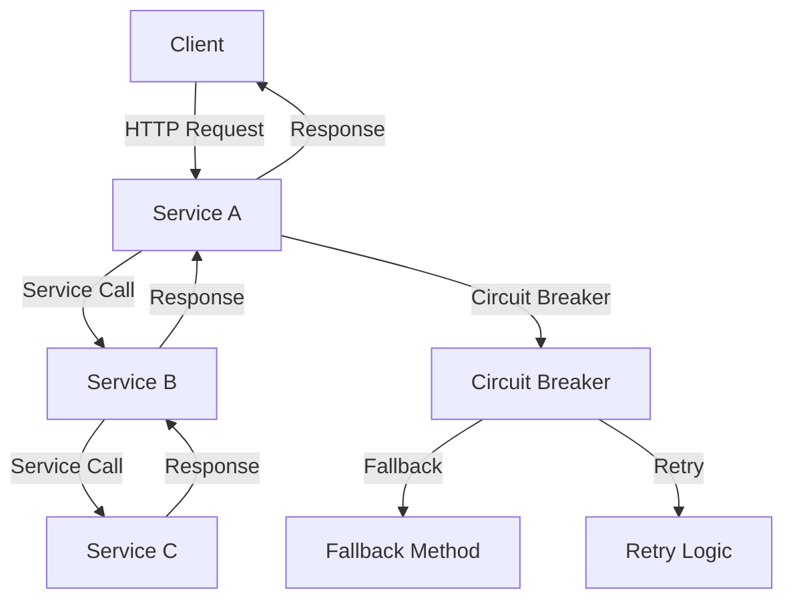

# Resilience4j — Circuit Breakers and Retries

## Overview and scope

The purpose of this document is to outline the standards and best practices for implementing resilience patterns, specifically Circuit Breakers and Retries, using the Resilience4j library within Xentic's Java and Spring Boot applications. This standard aims to enhance the reliability and stability of microservices by providing mechanisms to handle failures gracefully.

### Audience

This document is intended for:
- Software Engineers
- System Architects
- DevOps Engineers
- Quality Assurance Teams

### Scope

This standard applies to all Java-based microservices developed within Xentic that utilize Spring Boot. It covers:
- Configuration of Circuit Breakers and Retry patterns using Resilience4j
- Best practices for error handling and fallback mechanisms
- Integration with existing services and libraries

### Non-goals

This document does not cover:
- General error handling practices outside of Resilience4j
- Implementation of other resilience patterns (e.g., Rate Limiting, Timeout)
- Detailed performance benchmarks of Resilience4j

### Glossary

| Term                | Definition                                                                                       |
|---------------------|--------------------------------------------------------------------------------------------------|
| Circuit Breaker     | A design pattern that prevents an application from repeatedly trying to execute an operation that is likely to fail. |
| Retry               | A mechanism that allows an operation to be attempted multiple times in case of failure.         |
| Fallback            | A predefined alternative response or action when a primary operation fails.                      |
| Resilience4j       | A lightweight fault tolerance library designed for Java 8 and functional programming.            |

### How this standard fits the Xentic platform

The implementation of Circuit Breakers and Retries is critical for maintaining the resilience of Xentic's microservices architecture. By adhering to this standard, teams can ensure that:
- Services are robust against transient failures and can recover gracefully.
- The user experience remains intact, minimizing downtime and service disruptions.
- Consistency and reliability are maintained across all services, facilitating easier maintenance and scalability.

### Example Configuration

The following is a sample configuration for a Circuit Breaker and Retry using YAML format:

```yaml
resilience4j:
  circuitbreaker:
    instances:
      myService:
        slidingWindowSize: 10
        minimumNumberOfCalls: 5
        failureRateThreshold: 50
        waitDurationInOpenState: 10000
  retry:
    instances:
      myService:
        maxAttempts: 3
        waitDuration: 500
        retryExceptions:
          - java.io.IOException
```

By following these guidelines, Xentic aims to build a more resilient platform that can withstand failures while providing a seamless experience to its users.

## Standards and policies

1. **MUST** use the Resilience4j library for implementing Circuit Breakers and Retries in all Java-based microservices at Xentic. This ensures consistency and reliability across services.

2. **MUST NOT** use any other libraries or frameworks for implementing resilience patterns unless explicitly approved by the architecture team. This avoids fragmentation and maintains a unified approach.

3. **MUST** configure Circuit Breakers and Retries in the `application.yml` file under the appropriate service package (e.g., `com.xentic.<service>`). This aligns with Xentic's configuration management practices.

4. **SHOULD** name Circuit Breaker and Retry instances in a way that clearly reflects the service they are associated with. For example, use `myServiceCircuitBreaker` and `myServiceRetry`.

5. **MUST** define fallback methods for all Circuit Breakers. This ensures that an alternative response is provided in case of failures, improving user experience.

   Example of a fallback method:
   ```java
   @CircuitBreaker(name = "myService", fallbackMethod = "fallbackMethod")
   public String myServiceCall() {
       // Service call logic
   }

   public String fallbackMethod(Throwable t) {
       return "Fallback response due to: " + t.getMessage();
   }
   ```

6. **MUST NOT** allow Circuit Breakers to remain open indefinitely. Define a reasonable `waitDurationInOpenState` to allow for recovery and avoid prolonged service unavailability.

7. **SHOULD** log all failures and fallback responses to aid in monitoring and troubleshooting. Use Xentic's centralized logging framework for consistency.

8. **MUST** use the provided error handling strategies in Resilience4j, such as `retryExceptions` and `ignoreExceptions`, to control which exceptions should trigger retries.

   Example configuration:
   ```yaml
   resilience4j:
     retry:
       instances:
         myService:
           maxAttempts: 3
           waitDuration: 500
           retryExceptions:
             - java.io.IOException
           ignoreExceptions:
             - java.lang.IllegalArgumentException
   ```

9. **MUST** ensure that the Circuit Breaker and Retry configurations are tested thoroughly in a staging environment before deployment to production. This minimizes the risk of introducing issues.

10. **SHOULD** use Spring AOP for applying Circuit Breaker and Retry annotations to service methods. This promotes separation of concerns and keeps business logic clean.

11. **MUST NOT** hard-code configuration values within the application code. All configurations must be externalized in the `application.yml` or equivalent configuration files.

12. **MUST** document all Circuit Breaker and Retry configurations in the service's README or relevant documentation. This aids in onboarding new team members and maintaining transparency.

13. **SHOULD** regularly review and update Circuit Breaker and Retry configurations based on service performance and failure patterns. This ensures that the resilience strategies remain effective over time.

14. **MUST** adhere to the versioning policy for the Resilience4j library as defined by the Xentic engineering team. This ensures compatibility and access to the latest features and bug fixes.

15. **SHOULD** consider using metrics and monitoring tools to track the performance of Circuit Breakers and Retries. This data is essential for making informed decisions about adjustments and improvements.

By following these standards and policies, Xentic aims to create a robust and resilient microservices architecture that can effectively handle failures while maintaining a high level of service availability.

## Architecture and design

The architecture for implementing Circuit Breakers and Retries using Resilience4j within Xentic's microservices is designed to enhance fault tolerance and maintain service availability. The following component diagram illustrates the key components and their interactions:



### Data Flows

1. **Client to Service A**: The client initiates a request to Service A.
2. **Service A to Service B**: Service A makes a call to Service B, which may involve multiple downstream calls.
3. **Service B to Service C**: Service B calls Service C, which may also call other services.
4. **Responses**: Each service responds back to the calling service, eventually returning the response to the client.
5. **Circuit Breaker**: If a failure occurs in any service call, the Circuit Breaker in Service A prevents further calls to Service B, activating the fallback method.
6. **Retry Logic**: If a transient error occurs, the Retry logic attempts to call Service B again before invoking the fallback.

### Integration Points

- **Service A**: Implements Circuit Breaker and Retry for calls to Service B.
- **Service B**: Implements Circuit Breaker and Retry for calls to Service C.
- **Shared Libraries**: Utilize shared libraries such as `com.xentic.auth:auth-starter` for authentication and `com.xentic.common:*` for common utilities.

### Failure Domains

- **Transient Failures**: Temporary issues such as network timeouts or service unavailability that can be retried.
- **Permanent Failures**: Issues such as service errors that should trigger the Circuit Breaker.
- **Fallback Mechanisms**: Must be designed to handle both types of failures gracefully, providing a seamless user experience.

### Example Circuit Breaker and Retry Configuration

The following example demonstrates how to configure Circuit Breakers and Retries for a service in the `application.yml` file:

```yaml
resilience4j:
  circuitbreaker:
    instances:
      serviceA:
        slidingWindowSize: 10
        minimumNumberOfCalls: 5
        failureRateThreshold: 50
        waitDurationInOpenState: 10000
        recordExceptions:
          - java.io.IOException
          - java.util.concurrent.TimeoutException
  retry:
    instances:
      serviceA:
        maxAttempts: 3
        waitDuration: 500
        retryExceptions:
          - java.io.IOException
        ignoreExceptions:
          - java.lang.IllegalArgumentException
```

### Summary of Key Components

| Component           | Description                                                                 |
|---------------------|-----------------------------------------------------------------------------|
| Circuit Breaker     | Monitors calls and prevents further calls to a failing service.            |
| Retry               | Attempts to call the service multiple times before failing.                 |
| Fallback Method     | Provides an alternative response when the primary service call fails.       |
| Shared Libraries     | Common utilities and authentication mechanisms used across services.       |

By adhering to this architecture and design, Xentic can ensure that its microservices are resilient and capable of handling failures effectively, thereby maintaining a high level of service availability and user satisfaction.

## Configuration reference

### Application Configuration (application.yml)

The following table outlines the recommended configuration settings for Circuit Breakers and Retries in the `application.yml` file. The default values are provided for development, while production values are specified for deployment.

| Configuration Item                    | Default Value | Production Value |
|---------------------------------------|---------------|------------------|
| `resilience4j.circuitbreaker.instances.myService.slidingWindowSize` | 10            | 50               |
| `resilience4j.circuitbreaker.instances.myService.minimumNumberOfCalls` | 1             | 5                |
| `resilience4j.circuitbreaker.instances.myService.failureRateThreshold` | 50            | 50               |
| `resilience4j.circuitbreaker.instances.myService.waitDurationInOpenState` | 10000ms       | 30000ms          |
| `resilience4j.retry.instances.myService.maxAttempts` | 3             | 5                |
| `resilience4j.retry.instances.myService.waitDuration` | 500ms         | 1000ms           |
| `resilience4j.retry.instances.myService.retryExceptions` | `java.io.IOException` | `java.io.IOException` |
| `resilience4j.retry.instances.myService.ignoreExceptions` | `java.lang.IllegalArgumentException` | `java.lang.IllegalArgumentException` |

Example `application.yml` configuration:

```yaml
resilience4j:
  circuitbreaker:
    instances:
      myService:
        slidingWindowSize: 50
        minimumNumberOfCalls: 5
        failureRateThreshold: 50
        waitDurationInOpenState: 30000
        recordExceptions:
          - java.io.IOException
          - java.util.concurrent.TimeoutException
  retry:
    instances:
      myService:
        maxAttempts: 5
        waitDuration: 1000
        retryExceptions:
          - java.io.IOException
        ignoreExceptions:
          - java.lang.IllegalArgumentException
```

### Terraform Configuration

The following Terraform configuration can be used to set environment variables for Circuit Breakers and Retries in a cloud deployment. Adjust the values according to the environment.

```hcl
resource "aws_ssm_parameter" "my_service_circuit_breaker" {
  name  = "/my_service/circuit_breaker/sliding_window_size"
  type  = "String"
  value = "50"
}

resource "aws_ssm_parameter" "my_service_retry" {
  name  = "/my_service/retry/max_attempts"
  type  = "String"
  value = "5"
}
```

### Environment Variables

The following environment variables can be set to override default configuration values. This allows for flexibility in different environments.

| Environment Variable                                      | Default Value | Production Value |
|----------------------------------------------------------|---------------|------------------|
| `MY_SERVICE_CIRCUIT_BREAKER_SLIDING_WINDOW_SIZE`        | 10            | 50               |
| `MY_SERVICE_CIRCUIT_BREAKER_MINIMUM_NUMBER_OF_CALLS`    | 1             | 5                |
| `MY_SERVICE_CIRCUIT_BREAKER_FAILURE_RATE_THRESHOLD`      | 50            | 50               |
| `MY_SERVICE_CIRCUIT_BREAKER_WAIT_DURATION_IN_OPEN_STATE` | 10000         | 30000            |
| `MY_SERVICE_RETRY_MAX_ATTEMPTS`                          | 3             | 5                |
| `MY_SERVICE_RETRY_WAIT_DURATION`                         | 500           | 1000             |

### Summary

By adhering to the configuration standards outlined above, Xentic ensures that all services are equipped with robust resilience mechanisms. The use of consistent configuration values across environments promotes reliability and simplifies maintenance. All configurations must be documented and reviewed regularly to adapt to changing service needs and performance metrics.

## Implementation guide

To implement Circuit Breakers and Retries using Resilience4j in a Java Spring Boot application at Xentic, follow these step-by-step instructions. This guide will cover the necessary configurations, code implementations, and best practices.

### Step 1: Add Dependencies

Ensure that you include the Resilience4j dependencies in your `pom.xml` file:

```xml
<dependency>
    <groupId>io.github.resilience4j</groupId>
    <artifactId>resilience4j-spring-boot2</artifactId>
    <version>1.7.0</version>
</dependency>
```

### Step 2: Configure Application Properties

Add the following configuration to your `application.yml` file to set up Circuit Breakers and Retries:

```yaml
resilience4j:
  circuitbreaker:
    instances:
      serviceA:
        slidingWindowSize: 10
        minimumNumberOfCalls: 5
        failureRateThreshold: 50
        waitDurationInOpenState: 10000
        recordExceptions:
          - java.io.IOException
          - java.util.concurrent.TimeoutException
  retry:
    instances:
      serviceA:
        maxAttempts: 3
        waitDuration: 500
        retryExceptions:
          - java.io.IOException
        ignoreExceptions:
          - java.lang.IllegalArgumentException
```

### Step 3: Create Service Classes

#### ServiceA.java

This service calls Service B and implements Circuit Breaker and Retry.

```java
package com.xentic.serviceA;

import org.springframework.stereotype.Service;
import org.springframework.web.client.RestTemplate;
import io.github.resilience4j.circuitbreaker.annotation.CircuitBreaker;
import io.github.resilience4j.retry.annotation.Retry;

@Service
public class ServiceA {

    private final RestTemplate restTemplate;

    public ServiceA(RestTemplate restTemplate) {
        this.restTemplate = restTemplate;
    }

    @CircuitBreaker(name = "serviceA")
    @Retry(name = "serviceA")
    public String callServiceB() {
        return restTemplate.getForObject("http://service-b/api/resource", String.class);
    }
}
```

#### ServiceB.java

This service calls Service C and also implements Circuit Breaker and Retry.

```java
package com.xentic.serviceB;

import org.springframework.stereotype.Service;
import org.springframework.web.client.RestTemplate;
import io.github.resilience4j.circuitbreaker.annotation.CircuitBreaker;
import io.github.resilience4j.retry.annotation.Retry;

@Service
public class ServiceB {

    private final RestTemplate restTemplate;

    public ServiceB(RestTemplate restTemplate) {
        this.restTemplate = restTemplate;
    }

    @CircuitBreaker(name = "serviceB")
    @Retry(name = "serviceB")
    public String callServiceC() {
        return restTemplate.getForObject("http://service-c/api/resource", String.class);
    }
}
```

### Step 4: Create Fallback Methods

Fallback methods provide alternative responses when the primary service call fails.

#### Fallback for ServiceA

```java
package com.xentic.serviceA;

import org.springframework.stereotype.Service;

@Service
public class FallbackService {

    public String fallbackForServiceA(Throwable throwable) {
        return "Fallback response for Service A: " + throwable.getMessage();
    }
}
```

#### Fallback for ServiceB

```java
package com.xentic.serviceB;

import org.springframework.stereotype.Service;

@Service
public class FallbackService {

    public String fallbackForServiceB(Throwable throwable) {
        return "Fallback response for Service B: " + throwable.getMessage();
    }
}
```

### Step 5: Register Fallbacks

Modify the service classes to use the fallback methods.

#### Updated ServiceA.java

```java
@CircuitBreaker(name = "serviceA", fallbackMethod = "fallbackForServiceA")
@Retry(name = "serviceA")
public String callServiceB() {
    return restTemplate.getForObject("http://service-b/api/resource", String.class);
}
```

#### Updated ServiceB.java

```java
@CircuitBreaker(name = "serviceB", fallbackMethod = "fallbackForServiceB")
@Retry(name = "serviceB")
public String callServiceC() {
    return restTemplate.getForObject("http://service-c/api/resource", String.class);
}
```

### Step 6: Testing the Implementation

To ensure that the Circuit Breaker and Retry mechanisms are functioning as expected, conduct the following tests:

1. Simulate failures in Service B and Service C to verify that the fallback methods are invoked.
2. Monitor the metrics provided by Resilience4j to observe the behavior of Circuit Breakers and Retries.

### Step 7: Monitor and Adjust

Utilize monitoring tools to track the performance of Circuit Breakers and Retries. Adjust the configuration values in `application.yml` based on observed behaviors and metrics.

### Summary

By implementing Circuit Breakers and Retries as outlined in this guide, Xentic can enhance the resilience of its microservices architecture. Ensure that all services are consistently monitored and adjusted to maintain optimal performance and reliability.

## Security requirements

To ensure the security of services utilizing Resilience4j Circuit Breakers and Retries within Xentic's Java Spring Boot applications, the following security requirements must be adhered to:

### Threat Model Summary

- **Unauthorized Access**: Ensure that only authenticated users can access sensitive endpoints.
- **Data Leakage**: Protect against exposure of sensitive data through error messages or logs.
- **Denial of Service (DoS)**: Implement mechanisms to mitigate potential DoS attacks by limiting the number of requests.
- **Injection Attacks**: Validate all inputs to prevent SQL injection and other forms of injection attacks.

### Authentication and Authorization

- All services MUST implement OAuth 2.0 for authentication.
- Access to endpoints MUST be restricted based on user roles and permissions.
- Use Spring Security to enforce authentication and authorization rules.

Example configuration for Spring Security:

```java
@EnableWebSecurity
public class SecurityConfig extends WebSecurityConfigurerAdapter {

    @Override
    protected void configure(HttpSecurity http) throws Exception {
        http
            .authorizeRequests()
            .antMatchers("/api/public/**").permitAll()
            .antMatchers("/api/private/**").authenticated()
            .and()
            .oauth2Login();
    }
}
```

### Secrets Management

- Secrets MUST NOT be hard-coded in the source code.
- Use AWS Secrets Manager or HashiCorp Vault for managing sensitive information such as API keys and database credentials.
- Access to secrets MUST be logged and monitored.

Example of retrieving a secret from AWS Secrets Manager:

```java
import software.amazon.awssdk.services.secretsmanager.SecretsManagerClient;
import software.amazon.awssdk.services.secretsmanager.model.GetSecretValueRequest;

public String getSecret(String secretName) {
    SecretsManagerClient client = SecretsManagerClient.create();
    GetSecretValueRequest request = GetSecretValueRequest.builder()
            .secretId(secretName)
            .build();
    return client.getSecretValue(request).secretString();
}
```

### Input Validation

- All inputs MUST be validated against a defined schema to ensure they conform to expected formats.
- Use libraries like Hibernate Validator for input validation.
- Reject requests with invalid inputs and return appropriate HTTP status codes (e.g., 400 Bad Request).

Example of input validation using annotations:

```java
import javax.validation.constraints.NotBlank;

public class UserRequest {

    @NotBlank(message = "Username must not be empty")
    private String username;

    @NotBlank(message = "Password must not be empty")
    private String password;

    // Getters and Setters
}
```

### Audit Logging

- All access to sensitive endpoints MUST be logged for audit purposes.
- Logs MUST include user identity, timestamp, and action taken.
- Use a centralized logging solution (e.g., ELK stack) for aggregating and analyzing logs.

Example of logging access in a service:

```java
import org.slf4j.Logger;
import org.slf4j.LoggerFactory;

@Service
public class UserService {

    private static final Logger logger = LoggerFactory.getLogger(UserService.class);

    public User getUserById(Long id) {
        logger.info("Accessing user with ID: {}", id);
        // Fetch user logic
    }
}
```

### Summary of Security Requirements

| Requirement                     | Description                                                                 |
|---------------------------------|-----------------------------------------------------------------------------|
| Authentication                  | Implement OAuth 2.0 for all services.                                      |
| Authorization                   | Restrict access based on user roles and permissions.                       |
| Secrets Management              | Use AWS Secrets Manager or HashiCorp Vault for managing secrets.           |
| Input Validation                | Validate all inputs against defined schemas.                               |
| Audit Logging                   | Log all access to sensitive endpoints for audit purposes.                  |

By adhering to these security requirements, Xentic can significantly enhance the security posture of its services while utilizing Resilience4j Circuit Breakers and Retries. Regular reviews and updates to these requirements are essential to adapt to evolving security threats and compliance standards.

## Testing strategy

To ensure the reliability and resilience of services utilizing Resilience4j Circuit Breakers and Retries, a comprehensive testing strategy must be implemented. This includes unit tests, integration tests, and contract tests, each with specified coverage targets. 

### Testing Types

1. **Unit Tests**
   - Validate individual components in isolation.
   - Mock external dependencies to ensure tests are deterministic.
   - Coverage target: 80% or higher.

2. **Integration Tests**
   - Test interactions between components and external services.
   - Use a test environment that closely resembles production.
   - Coverage target: 70% or higher.

3. **Contract Tests**
   - Ensure that the services adhere to predefined contracts.
   - Validate that the API responses and requests conform to expected formats.
   - Coverage target: 90% or higher.

### Example Test Classes

#### Unit Test for ServiceA

```java
package com.xentic.serviceA;

import static org.mockito.Mockito.*;
import static org.junit.jupiter.api.Assertions.*;

import org.junit.jupiter.api.BeforeEach;
import org.junit.jupiter.api.Test;
import org.mockito.InjectMocks;
import org.mockito.Mock;
import org.mockito.MockitoAnnotations;
import org.springframework.web.client.RestTemplate;

class ServiceATest {

    @Mock
    private RestTemplate restTemplate;

    @InjectMocks
    private ServiceA serviceA;

    @BeforeEach
    void setUp() {
        MockitoAnnotations.openMocks(this);
    }

    @Test
    void testCallServiceB_Success() {
        when(restTemplate.getForObject("http://service-b/api/resource", String.class))
            .thenReturn("Success Response");

        String response = serviceA.callServiceB();
        assertEquals("Success Response", response);
    }

    @Test
    void testCallServiceB_Fallback() {
        when(restTemplate.getForObject("http://service-b/api/resource", String.class))
            .thenThrow(new RuntimeException("Service B is down"));

        String response = serviceA.fallbackForServiceA(new RuntimeException("Service B is down"));
        assertTrue(response.startsWith("Fallback response for Service A:"));
    }
}
```

#### Integration Test for ServiceB

```java
package com.xentic.serviceB;

import static org.springframework.test.web.servlet.request.MockMvcRequestBuilders.get;
import static org.springframework.test.web.servlet.result.MockMvcResultMatchers.status;

import org.junit.jupiter.api.BeforeEach;
import org.junit.jupiter.api.Test;
import org.springframework.beans.factory.annotation.Autowired;
import org.springframework.boot.test.autoconfigure.web.servlet.AutoConfigureMockMvc;
import org.springframework.boot.test.context.SpringBootTest;
import org.springframework.test.web.servlet.MockMvc;

@SpringBootTest
@AutoConfigureMockMvc
class ServiceBIntegrationTest {

    @Autowired
    private MockMvc mockMvc;

    @BeforeEach
    void setUp() {
        // Setup any required data or mocks
    }

    @Test
    void testCallServiceC() throws Exception {
        mockMvc.perform(get("/api/serviceB/callServiceC"))
            .andExpect(status().isOk());
    }
}
```

#### Contract Test Example

```java
package com.xentic.contract;

import static org.springframework.cloud.contract.spec.Contract.*;

import org.springframework.cloud.contract.spec.Contract;

class ServiceBContract {

    Contract contract = contract {
        description("should return a valid response from Service B")
        
        request {
            method 'GET'
            url '/api/serviceB/callServiceC'
        }
        
        response {
            status 200
            body("""
                {
                    "data": "some data"
                }
            """)
            headers {
                contentType(applicationJson())
            }
        }
    };
}
```

### Coverage Targets

| Test Type        | Coverage Target |
|------------------|-----------------|
| Unit Tests       | 80% or higher    |
| Integration Tests| 70% or higher    |
| Contract Tests   | 90% or higher    |

### Conclusion

Implementing a robust testing strategy with clear coverage targets and diverse test types is essential for maintaining the reliability of services utilizing Resilience4j Circuit Breakers and Retries. All teams at Xentic MUST adhere to these guidelines to ensure high-quality and resilient software delivery. Regularly review and update tests to adapt to new features and changes in the architecture.

## Observability and operations

To ensure the reliability and performance of services utilizing Resilience4j Circuit Breakers and Retries, observability and operations practices must be rigorously implemented. This includes metrics collection, logging, tracing, dashboards, alerts, and defining Service Level Objectives (SLOs). 

### Metrics

- Metrics MUST be collected for circuit breaker states, retry attempts, and failures.
- Use Micrometer for metrics collection, which integrates seamlessly with Spring Boot applications.
- Key metrics to monitor include:
  - Circuit Breaker state changes (e.g., CLOSED, OPEN, HALF_OPEN)
  - Number of successful and failed calls
  - Retry attempts and their outcomes

Example configuration in `application.yml`:

```yaml
management:
  metrics:
    export:
      prometheus:
        enabled: true
  endpoints:
    web:
      exposure:
        include: "*"
```

### Logs

- Logs MUST provide detailed information about circuit breaker events and retry attempts.
- Use structured logging with SLF4J and Logback to facilitate log analysis.
- Log entries MUST include:
  - Timestamp
  - Service name
  - Circuit breaker state
  - Exception details (if applicable)

Example log entry:

```java
import org.slf4j.Logger;
import org.slf4j.LoggerFactory;

public class MyService {

    private static final Logger logger = LoggerFactory.getLogger(MyService.class);

    public void callExternalService() {
        logger.info("Attempting to call external service");
        // Circuit breaker logic
        try {
            // Call external service
        } catch (Exception e) {
            logger.error("Error calling external service: {}", e.getMessage());
        }
    }
}
```

### Traces

- Distributed tracing MUST be enabled to track requests across microservices.
- Use Spring Cloud Sleuth to automatically add tracing information to logs.
- Ensure that traces include circuit breaker and retry information for better debugging.

### Dashboards

- Dashboards MUST be created to visualize metrics and logs.
- Use Grafana or Kibana for real-time monitoring.
- Key visualizations to include:
  - Circuit breaker state over time
  - Number of retries and failures
  - Latency metrics for external service calls

### Alerts

- Alerts MUST be configured for critical metrics to ensure timely responses to issues.
- Set up alerts for:
  - Circuit breaker transitions to OPEN state
  - High failure rates exceeding a defined threshold
  - Excessive retry attempts

Example alert configuration in Prometheus:

```yaml
groups:
  - name: circuit-breaker-alerts
    rules:
      - alert: CircuitBreakerOpen
        expr: circuit_breaker_open_count > 0
        for: 5m
        labels:
          severity: critical
        annotations:
          summary: "Circuit Breaker is OPEN"
          description: "Circuit Breaker has been open for more than 5 minutes."
```

### Service Level Objectives (SLOs)

- SLOs MUST be defined for key performance indicators such as availability and response time.
- Example SLOs:
  - 99.9% availability for external service calls
  - Response time under 200ms for 95% of requests

### On-call Runbook Steps

In the event of an alert being triggered, the following steps MUST be followed:

1. **Acknowledge the Alert**
   - Confirm receipt of the alert in the monitoring system.

2. **Investigate the Issue**
   - Check the logs for any errors or anomalies.
   - Review the metrics dashboard for circuit breaker states and retry counts.

3. **Assess Impact**
   - Determine the extent of the issue (e.g., affected services, number of users impacted).

4. **Mitigate the Issue**
   - If the circuit breaker is OPEN, assess whether to adjust the configuration or temporarily disable the circuit breaker for critical services.

5. **Communicate**
   - Notify stakeholders about the issue and provide updates as necessary.

6. **Document the Incident**
   - Record the incident details, actions taken, and resolution steps in the incident management system.

7. **Post-Incident Review**
   - Conduct a post-mortem to analyze the root cause and improve future responses.

By adhering to these observability and operations practices, Xentic can ensure robust monitoring and quick response capabilities for services utilizing Resilience4j Circuit Breakers and Retries. Regular reviews of these practices are essential to adapt to changing operational needs and technology advancements.

## Migration and versioning

When upgrading or migrating services utilizing Resilience4j, it is crucial to follow a structured approach to ensure smooth transitions and maintain system integrity. The following guidelines outline the upgrade paths, deprecation policies, backward compatibility, and rollback procedures.

### Upgrade Paths

- **Major Version Upgrades**: 
  - MUST be planned and executed during scheduled maintenance windows.
  - MUST include thorough testing in a staging environment before production deployment.
  - MUST review the [Resilience4j release notes](https://resilience4j.readme.io/docs/release-notes) for breaking changes and new features.

- **Minor Version Upgrades**: 
  - SHOULD be performed regularly to benefit from improvements and bug fixes.
  - MUST include regression testing to ensure existing functionality is not broken.

- **Patch Version Upgrades**: 
  - MUST be applied as soon as possible for security and stability improvements.
  - SHOULD be tested minimally to confirm no new issues are introduced.

### Deprecation Policy

- **Deprecation Notices**: 
  - MUST be communicated through internal channels at least one release cycle in advance.
  - Deprecated features MUST remain functional for at least two major versions before removal.

- **Documentation Updates**: 
  - All deprecated features MUST be documented clearly with alternatives and migration paths.

### Backward Compatibility

- **Backward Compatibility Guarantees**: 
  - Services MUST maintain backward compatibility for public APIs across minor and patch versions.
  - Breaking changes MUST only be introduced in major version releases.

- **Versioning Strategy**: 
  - Use semantic versioning (MAJOR.MINOR.PATCH) for all services.
  - MUST include version information in API responses to facilitate client compatibility checks.

### Rollback Procedures

- **Rollback Plan**: 
  - Every deployment MUST have a documented rollback plan that outlines steps to revert to the previous stable version.
  
- **Automated Rollback**: 
  - Rollback scripts MUST be tested in the staging environment to ensure they work as expected.
  
- **Rollback Steps**:
  1. **Identify the Issue**: Monitor logs and metrics to confirm the need for a rollback.
  2. **Notify Stakeholders**: Inform relevant teams about the rollback decision.
  3. **Execute Rollback**: Use the documented rollback plan to revert to the previous version.
  4. **Verify Stability**: Monitor the system to ensure stability post-rollback.
  5. **Document the Incident**: Record the incident and the reasons for the rollback in the incident management system.

### Example Configuration for Versioning

In your `application.yml`, include versioning information:

```yaml
info:
  app:
    name: ServiceA
    version: 1.2.3
```

### SQL Migration Example

For database schema changes, use versioned migration scripts. An example for a schema update might look like:

```sql
-- V1__Initial_setup.sql
CREATE TABLE service_a (
    id SERIAL PRIMARY KEY,
    name VARCHAR(255) NOT NULL,
    created_at TIMESTAMP DEFAULT CURRENT_TIMESTAMP
);

-- V2__Add_description_column.sql
ALTER TABLE service_a ADD COLUMN description TEXT;
```

### Conclusion

By adhering to the migration and versioning guidelines outlined above, Xentic teams MUST ensure that upgrades and changes to services using Resilience4j are conducted smoothly, with minimal disruption to users and systems. Regular reviews of these practices are essential to adapt to evolving technologies and operational requirements.

## FAQ, anti-patterns, and checklists

### FAQ

1. **What is a Circuit Breaker?**
   - A Circuit Breaker is a design pattern that prevents an application from repeatedly trying to execute an operation that is likely to fail, thus allowing it to recover gracefully.

2. **When should I use a Circuit Breaker?**
   - Circuit Breakers should be used when calling external services or APIs that may fail or have unpredictable latency.

3. **What is the difference between Circuit Breaker and Retry?**
   - A Circuit Breaker stops calls to a service after a number of failures, while Retry attempts to call a service multiple times before giving up.

4. **How do I configure a Circuit Breaker in Spring Boot?**
   - Circuit Breakers can be configured in `application.yml` using properties such as `resilience4j.circuitbreaker.instances`.

   ```yaml
   resilience4j:
     circuitbreaker:
       instances:
         myService:
           registerHealthIndicator: true
           slidingWindowSize: 10
           minimumNumberOfCalls: 5
           failureRateThreshold: 50
   ```

5. **What happens when a Circuit Breaker is OPEN?**
   - When a Circuit Breaker is OPEN, all calls to the service are immediately failed without attempting to execute the operation.

6. **Can I customize the retry behavior?**
   - Yes, you can customize retry behavior using properties like `maxAttempts` and `waitDuration`.

   ```yaml
   resilience4j:
     retry:
       instances:
         myService:
           maxAttempts: 3
           waitDuration: 500ms
   ```

7. **How do I monitor Circuit Breaker metrics?**
   - Use Micrometer to collect metrics and expose them to monitoring tools like Prometheus.

8. **What should I do if the Circuit Breaker remains OPEN for too long?**
   - Investigate the underlying issues causing failures and consider adjusting the configuration or implementing fallback mechanisms.

9. **Is it possible to implement a fallback method?**
   - Yes, you can define a fallback method that will be executed when the Circuit Breaker is OPEN or when retries fail.

   ```java
   @CircuitBreaker(name = "myService", fallbackMethod = "fallbackMethod")
   public String callExternalService() {
       // Call logic
   }

   public String fallbackMethod(Exception e) {
       return "Fallback response";
   }
   ```

10. **How do I test Circuit Breakers and Retries?**
    - Use integration tests to simulate failures and verify that the Circuit Breaker and Retry behaviors function as expected.

### Anti-patterns

| Anti-pattern                          | Description                                                                                       |
|---------------------------------------|---------------------------------------------------------------------------------------------------|
| Ignoring Circuit Breaker states       | Failing to monitor and react to Circuit Breaker states can lead to prolonged outages.             |
| Overusing Retry                       | Excessive retries can lead to increased load on failing services and longer recovery times.      |
| Not implementing Fallbacks            | Without fallbacks, users may experience failures instead of graceful degradation.                |
| Hardcoding Configuration               | Configuration values should be externalized and managed through environment variables or config files. |
| Using Circuit Breakers for all calls  | Circuit Breakers should be used selectively for calls that are prone to failure, not universally. |

### Pre-merge Checklist

- [ ] Ensure all Circuit Breaker and Retry configurations are defined in `application.yml`.
- [ ] Validate that fallback methods are implemented where necessary.
- [ ] Review code for proper logging of circuit breaker events and retry attempts.
- [ ] Confirm that metrics are collected and exposed for monitoring.
- [ ] Conduct unit tests to verify Circuit Breaker and Retry behaviors.

### Production Checklist

- [ ] Monitor circuit breaker states and retry metrics immediately after deployment.
- [ ] Ensure alerts are configured for critical metrics related to circuit breakers and retries.
- [ ] Validate that all services are functioning as expected post-deployment.
- [ ] Document any incidents or anomalies encountered during deployment.
- [ ] Conduct a post-deployment review to analyze performance and identify areas for improvement.
