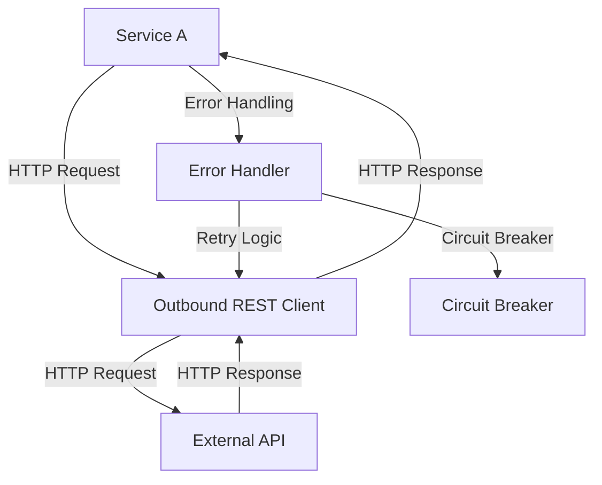

# Outbound REST Clients — Spring Boot

## Overview and scope

The purpose of this document is to establish standards and guidelines for the implementation of outbound REST clients using Spring Boot within the Xentic platform. This standard aims to ensure consistency, maintainability, and security across all services that interact with external RESTful APIs.

### Audience

This document is intended for:
- Software Engineers
- Technical Architects
- Quality Assurance Engineers
- DevOps Engineers

### Scope

This standard covers:
- Best practices for creating and configuring outbound REST clients in Spring Boot
- Error handling and retry mechanisms
- Security considerations, including authentication and authorization
- Logging and monitoring requirements
- Configuration management for different environments (development, testing, production)

### Non-goals

This document does NOT cover:
- Internal service-to-service communication
- Implementation details for specific external APIs
- Non-RESTful communication protocols

### Glossary

| Term                | Definition                                                                 |
|---------------------|-----------------------------------------------------------------------------|
| REST                | Representational State Transfer, an architectural style for designing networked applications. |
| Spring Boot         | A framework that simplifies the setup and development of new Spring applications. |
| Outbound REST Client | A client that sends HTTP requests to external RESTful services.            |
| Configuration       | Settings that determine how an application behaves in different environments. |

### How This Standard Fits the Xentic Platform

The outbound REST client standards are integral to the Xentic platform as they promote:
- **Consistency**: By adhering to a common structure and configuration, services can be easily understood and maintained by different teams.
- **Security**: Ensuring that all outbound communications are secure and compliant with Xentic’s security policies.
- **Scalability**: Standardized practices facilitate the scaling of services as the organization grows and integrates with more external APIs.

### Example Configuration

The following is an example of a YAML configuration for an outbound REST client in a Spring Boot application:

```yaml
rest:
  client:
    base-url: https://api.external-service.com
    timeout:
      connect: 5000
      read: 10000
    retry:
      enabled: true
      max-attempts: 3
      backoff:
        delay: 2000
        multiplier: 1.5
```

### Example Code Snippet

Here is a basic implementation of an outbound REST client using Spring's `RestTemplate`:

```java
package com.xentic.service.client;

import org.springframework.beans.factory.annotation.Autowired;
import org.springframework.stereotype.Service;
import org.springframework.web.client.RestTemplate;

@Service
public class ExternalApiClient {

    private final RestTemplate restTemplate;

    @Autowired
    public ExternalApiClient(RestTemplate restTemplate) {
        this.restTemplate = restTemplate;
    }

    public String fetchData() {
        String url = "https://api.external-service.com/data";
        return restTemplate.getForObject(url, String.class);
    }
}
```

By following these guidelines, Xentic aims to create a robust and efficient approach to integrating with external RESTful services, enhancing the overall quality and reliability of its software products.

## Standards and policies

1. **MUST** use the `RestTemplate` or `WebClient` provided by Spring for all outbound REST client implementations. Avoid using raw HTTP clients unless absolutely necessary.

2. **MUST NOT** hard-code URLs in the codebase. All URLs must be configurable through application properties or YAML files, adhering to the `com.xentic.<service>` package structure.

3. **SHOULD** utilize Spring's `@Value` annotation to inject configuration properties for the base URL and other settings.

   Example:
   ```java
   @Value("${rest.client.base-url}")
   private String baseUrl;
   ```

4. **MUST** implement error handling strategies, including retries and fallbacks, using Spring's `RetryTemplate` or similar mechanisms.

5. **MUST NOT** expose sensitive information in logs. Ensure that any logging of requests or responses does not include sensitive data such as API keys or personal information.

6. **SHOULD** use a consistent logging framework across all services. Xentic recommends using SLF4J with Logback as the logging implementation.

7. **MUST** handle HTTP status codes appropriately. Implement custom exceptions for different status codes (e.g., 404, 500) to provide meaningful error messages.

8. **MUST** ensure that all outbound REST clients are properly tested using unit and integration tests. Use mocking frameworks like Mockito to simulate external service responses.

9. **SHOULD** implement circuit breaker patterns using Spring Cloud Circuit Breaker or Resilience4j to prevent cascading failures in the system.

10. **MUST** secure all outbound communications using HTTPS. Ensure that SSL/TLS is configured correctly to prevent man-in-the-middle attacks.

11. **MUST NOT** ignore the implications of rate limiting imposed by external APIs. Implement throttling mechanisms to comply with the external service's rate limits.

12. **SHOULD** use environment-specific configuration files (e.g., `application-dev.yml`, `application-prod.yml`) to manage different settings for development, testing, and production environments.

13. **MUST** document all external API dependencies, including versioning and expected response formats, in the service's README or dedicated documentation.

14. **SHOULD** utilize asynchronous communication where applicable to improve performance and responsiveness of the application. Spring's `WebClient` supports non-blocking calls.

15. **MUST** ensure that all outbound REST clients are registered as Spring beans to leverage dependency injection and lifecycle management.

16. **MUST NOT** use deprecated or unsupported libraries for outbound REST clients. Regularly update dependencies to maintain security and compatibility.

17. **MUST** adhere to Xentic's shared library conventions, using packages such as `com.xentic.auth:auth-starter` for authentication and authorization requirements.

18. **SHOULD** include comprehensive documentation for each outbound REST client, detailing its purpose, configuration, and usage examples in the service's internal documentation.

19. **MUST** enforce code reviews for all outbound REST client implementations to ensure compliance with these standards.

20. **MUST** monitor the performance of outbound REST clients using tools such as Spring Actuator or custom metrics to identify bottlenecks and optimize performance.

By adhering to these standards and policies, Xentic will ensure that outbound REST clients are implemented consistently, securely, and efficiently across all services, enhancing the overall reliability of the platform.

## Architecture and design

The architecture for outbound REST clients in Spring Boot at Xentic is designed to facilitate efficient communication with external services while ensuring maintainability and security. The following components and flows illustrate the architecture:



### Component Description

- **Service A**: The internal service that initiates the outbound request.
- **Outbound REST Client**: The component responsible for making HTTP requests to external APIs. This is typically implemented using Spring's `RestTemplate` or `WebClient`.
- **External API**: The third-party service that the outbound REST client communicates with.
- **Error Handler**: A dedicated component to manage errors and exceptions during API calls, implementing retry logic and circuit breakers.
- **Circuit Breaker**: A mechanism to prevent cascading failures by stopping requests to an external service if it is deemed to be failing.

### Data Flows

1. **Request Flow**:
   - Service A sends an HTTP request to the Outbound REST Client.
   - The Outbound REST Client constructs the request and sends it to the External API.
   - The External API processes the request and returns a response.
   - The Outbound REST Client receives the response and forwards it back to Service A.

2. **Error Handling Flow**:
   - If an error occurs during the request, the Outbound REST Client invokes the Error Handler.
   - The Error Handler may implement retry logic, attempting the request again based on defined parameters (e.g., maximum attempts, backoff strategy).
   - If the retries exceed the limit, the Error Handler can trigger the Circuit Breaker, preventing further requests until the external service is restored.

### Integration Points

- **Configuration Management**: Outbound REST Clients must integrate with Xentic's configuration management system to retrieve base URLs, timeouts, and authentication details.
- **Monitoring**: Integration with monitoring tools (e.g., Spring Actuator) to track the performance and health of outbound requests.
- **Logging**: Outbound REST Clients should log requests and responses, ensuring that sensitive information is not exposed.

### Failure Domains

- **Network Failures**: Outbound REST Clients must handle scenarios where the external service is unreachable due to network issues.
- **Service Unavailability**: Implement circuit breakers to manage the unavailability of external APIs, preventing the system from being overwhelmed with requests.
- **Data Format Issues**: Ensure that the client can handle unexpected data formats or errors in the response from the external service.

### Example Configuration

To manage the various settings for the Outbound REST Client, the following YAML configuration can be used:

```yaml
rest:
  client:
    base-url: https://api.external-service.com
    timeout:
      connect: 5000
      read: 10000
    retry:
      enabled: true
      max-attempts: 3
      backoff:
        delay: 2000
        multiplier: 1.5
    circuit-breaker:
      enabled: true
      failure-threshold: 0.5
      wait-duration: 30000
```

### Example Code Snippet

Here is a more comprehensive example of an Outbound REST Client with error handling and circuit breaker integration:

```java
package com.xentic.service.client;

import org.springframework.beans.factory.annotation.Autowired;
import org.springframework.stereotype.Service;
import org.springframework.web.client.RestTemplate;
import org.springframework.web.client.RestClientException;

@Service
public class ExternalApiClient {

    private final RestTemplate restTemplate;

    @Autowired
    public ExternalApiClient(RestTemplate restTemplate) {
        this.restTemplate = restTemplate;
    }

    public String fetchData() {
        String url = "https://api.external-service.com/data";
        try {
            return restTemplate.getForObject(url, String.class);
        } catch (RestClientException e) {
            // Handle error
            throw new CustomApiException("Failed to fetch data", e);
        }
    }
}
```

By adhering to this architecture and design, Xentic ensures that outbound REST clients are robust, maintainable, and capable of handling various failure scenarios effectively.

## Configuration reference

The following tables outline the configuration settings for outbound REST clients in Spring Boot at Xentic. These settings should be defined in the `application.yml` file, Terraform configurations, and environment variables.

### YAML Configuration

The `application.yml` file should include the following configuration options:

```yaml
rest:
  client:
    base-url: https://api.external-service.com # Default base URL for outbound REST client
    timeout:
      connect: 5000 # Connection timeout in milliseconds
      read: 10000   # Read timeout in milliseconds
    retry:
      enabled: true # Enable retry mechanism
      max-attempts: 3 # Maximum number of retry attempts
      backoff:
        delay: 2000 # Initial delay before retry in milliseconds
        multiplier: 1.5 # Multiplier for exponential backoff
    circuit-breaker:
      enabled: true # Enable circuit breaker pattern
      failure-threshold: 0.5 # Failure rate threshold to open circuit
      wait-duration: 30000 # Duration to wait before attempting to close circuit (in milliseconds)
```

### Terraform Configuration

When deploying services using Terraform, the following variables should be defined for the outbound REST client configuration:

| Variable Name                   | Type    | Default Value                       | Production Value                   |
|----------------------------------|---------|------------------------------------|------------------------------------|
| `rest_client_base_url`          | string  | `https://api.external-service.com` | `https://api.external-service.com` |
| `rest_client_timeout_connect`    | number  | `5000`                             | `3000`                             |
| `rest_client_timeout_read`       | number  | `10000`                            | `5000`                             |
| `rest_client_retry_enabled`      | bool    | `true`                             | `true`                             |
| `rest_client_retry_max_attempts` | number  | `3`                                | `5`                                |
| `rest_client_backoff_delay`      | number  | `2000`                             | `1000`                             |
| `rest_client_backoff_multiplier`  | number  | `1.5`                              | `2.0`                              |
| `rest_client_circuit_breaker_enabled` | bool | `true`                             | `true`                             |
| `rest_client_circuit_breaker_failure_threshold` | number | `0.5` | `0.4` |
| `rest_client_circuit_breaker_wait_duration` | number | `30000` | `20000` |

### Environment Variables

For local development or CI/CD pipelines, the following environment variables can be used to override default configurations:

| Environment Variable                          | Default Value                       | Description                                      |
|-----------------------------------------------|------------------------------------|--------------------------------------------------|
| `REST_CLIENT_BASE_URL`                        | `https://api.external-service.com` | Base URL for the outbound REST client            |
| `REST_CLIENT_TIMEOUT_CONNECT`                 | `5000`                             | Connection timeout in milliseconds                |
| `REST_CLIENT_TIMEOUT_READ`                    | `10000`                            | Read timeout in milliseconds                      |
| `REST_CLIENT_RETRY_ENABLED`                   | `true`                             | Enable or disable retry mechanism                 |
| `REST_CLIENT_RETRY_MAX_ATTEMPTS`              | `3`                                | Maximum number of retry attempts                  |
| `REST_CLIENT_BACKOFF_DELAY`                   | `2000`                             | Initial delay before retry in milliseconds        |
| `REST_CLIENT_BACKOFF_MULTIPLIER`              | `1.5`                              | Multiplier for exponential backoff                |
| `REST_CLIENT_CIRCUIT_BREAKER_ENABLED`        | `true`                             | Enable or disable circuit breaker pattern         |
| `REST_CLIENT_CIRCUIT_BREAKER_FAILURE_THRESHOLD` | `0.5`                            | Failure rate threshold to open circuit            |
| `REST_CLIENT_CIRCUIT_BREAKER_WAIT_DURATION`  | `30000`                            | Duration to wait before attempting to close circuit |

### Notes

- **MUST** ensure that all configuration values are properly documented and version-controlled.
- **SHOULD** utilize environment-specific configurations to manage different settings for development, testing, and production environments.
- **MUST NOT** hard-code any sensitive information such as API keys or passwords in the configuration files. Use environment variables or secure vaults to manage sensitive data.

## Implementation guide

To implement an Outbound REST Client in a Spring Boot application at Xentic, follow these steps:

### Step 1: Add Dependencies

Add the necessary dependencies to your `pom.xml` for Spring Web and Circuit Breaker support. Ensure you have the following:

```xml
<dependency>
    <groupId>org.springframework.boot</groupId>
    <artifactId>spring-boot-starter-web</artifactId>
</dependency>
<dependency>
    <groupId>org.springframework.cloud</groupId>
    <artifactId>spring-cloud-starter-circuitbreaker-resilience4j</artifactId>
</dependency>
```

### Step 2: Create Configuration Properties

Define the configuration properties for your Outbound REST Client in `application.yml` as shown previously. Ensure that the properties are structured correctly for easy access.

### Step 3: Define the REST Client

Create a class for the Outbound REST Client. This class will use `RestTemplate` to make HTTP requests.

```java
package com.xentic.service.client;

import org.springframework.beans.factory.annotation.Autowired;
import org.springframework.stereotype.Service;
import org.springframework.web.client.RestTemplate;
import org.springframework.web.client.RestClientException;

@Service
public class ExternalApiClient {

    private final RestTemplate restTemplate;

    @Autowired
    public ExternalApiClient(RestTemplate restTemplate) {
        this.restTemplate = restTemplate;
    }

    public String fetchData() {
        String url = "https://api.external-service.com/data";
        try {
            return restTemplate.getForObject(url, String.class);
        } catch (RestClientException e) {
            // Handle error
            throw new CustomApiException("Failed to fetch data", e);
        }
    }
}
```

### Step 4: Implement Error Handling

Create a custom exception class to handle API errors.

```java
package com.xentic.service.exception;

public class CustomApiException extends RuntimeException {
    public CustomApiException(String message, Throwable cause) {
        super(message, cause);
    }
}
```

### Step 5: Configure Circuit Breaker

Integrate the Circuit Breaker functionality using Resilience4j. Update the `ExternalApiClient` to use the `@CircuitBreaker` annotation.

```java
import io.github.resilience4j.circuitbreaker.annotation.CircuitBreaker;

@Service
public class ExternalApiClient {

    private final RestTemplate restTemplate;

    @Autowired
    public ExternalApiClient(RestTemplate restTemplate) {
        this.restTemplate = restTemplate;
    }

    @CircuitBreaker
    public String fetchData() {
        String url = "https://api.external-service.com/data";
        try {
            return restTemplate.getForObject(url, String.class);
        } catch (RestClientException e) {
            throw new CustomApiException("Failed to fetch data", e);
        }
    }
}
```

### Step 6: Create a RestTemplate Bean

Define a `RestTemplate` bean in your configuration class to customize the `RestTemplate` with error handling and timeouts.

```java
package com.xentic.config;

import org.springframework.context.annotation.Bean;
import org.springframework.context.annotation.Configuration;
import org.springframework.web.client.RestTemplate;
import org.springframework.http.client.HttpComponentsClientHttpRequestFactory;

@Configuration
public class RestClientConfig {

    @Bean
    public RestTemplate restTemplate() {
        HttpComponentsClientHttpRequestFactory factory = new HttpComponentsClientHttpRequestFactory();
        factory.setConnectTimeout(5000);
        factory.setReadTimeout(10000);
        return new RestTemplate(factory);
    }
}
```

### Step 7: Utilize the Client in Services

Inject the `ExternalApiClient` into your service classes where you need to make outbound requests.

```java
package com.xentic.service;

import com.xentic.service.client.ExternalApiClient;
import org.springframework.beans.factory.annotation.Autowired;
import org.springframework.stereotype.Service;

@Service
public class DataService {

    private final ExternalApiClient externalApiClient;

    @Autowired
    public DataService(ExternalApiClient externalApiClient) {
        this.externalApiClient = externalApiClient;
    }

    public String getData() {
        return externalApiClient.fetchData();
    }
}
```

### Step 8: Testing the Client

Create integration tests for your `ExternalApiClient` to ensure that it behaves as expected.

```java
package com.xentic.service.client;

import static org.mockito.Mockito.*;
import static org.junit.jupiter.api.Assertions.*;

import org.junit.jupiter.api.Test;
import org.springframework.web.client.RestTemplate;

class ExternalApiClientTest {

    @Test
    void testFetchData() {
        RestTemplate restTemplate = mock(RestTemplate.class);
        ExternalApiClient client = new ExternalApiClient(restTemplate);

        when(restTemplate.getForObject(anyString(), eq(String.class))).thenReturn("response");

        String response = client.fetchData();
        assertEquals("response", response);
    }

    @Test
    void testFetchDataThrowsException() {
        RestTemplate restTemplate = mock(RestTemplate.class);
        ExternalApiClient client = new ExternalApiClient(restTemplate);

        when(restTemplate.getForObject(anyString(), eq(String.class))).thenThrow(new RestClientException("Error"));

        assertThrows(CustomApiException.class, () -> client.fetchData());
    }
}
```

### Conclusion

By following these steps, you will have a robust Outbound REST Client that adheres to Xentic's engineering standards. Ensure that you handle errors gracefully and utilize circuit breakers to maintain system stability when interacting with external services.

## Security requirements

To ensure the security of outbound REST clients at Xentic, the following requirements must be adhered to:

### Threat Model Summary

- **Unauthorized Access**: Prevent unauthorized users from accessing sensitive API endpoints.
- **Data Exposure**: Protect sensitive data in transit and at rest.
- **Denial of Service**: Mitigate risks of service outages due to excessive requests or attacks.
- **Input Validation**: Ensure all inputs are validated to prevent injection attacks.

### Authentication and Authorization

- **MUST** use OAuth 2.0 for authentication when communicating with external services. Tokens should be stored securely and refreshed as needed.
- **MUST NOT** expose any sensitive authentication tokens in logs or error messages.
- **SHOULD** implement role-based access control (RBAC) to restrict access to the REST client based on user roles.

#### Example Configuration for OAuth 2.0

```yaml
security:
  oauth2:
    client:
      registration:
        xentic-client:
          client-id: ${OAUTH_CLIENT_ID}
          client-secret: ${OAUTH_CLIENT_SECRET}
          authorization-grant-type: client_credentials
          scope: read,write
      provider:
        xentic:
          token-uri: https://auth.xentic.io/oauth/token
```

### Secrets Management

- **MUST** utilize a secrets management tool (e.g., HashiCorp Vault, AWS Secrets Manager) to store sensitive information such as API keys and database credentials.
- **MUST NOT** hard-code any secrets in the source code or configuration files. Use environment variables or secure vaults instead.

#### Example of Accessing Secrets

```java
import org.springframework.beans.factory.annotation.Value;
import org.springframework.stereotype.Component;

@Component
public class ApiConfig {

    @Value("${api.key}")
    private String apiKey;

    public String getApiKey() {
        return apiKey;
    }
}
```

### Input Validation

- **MUST** validate all incoming data to the REST client to prevent injection attacks (e.g., SQL injection, XSS).
- **SHOULD** use libraries such as Hibernate Validator for validating input data.

#### Example of Input Validation

```java
import javax.validation.constraints.NotNull;

public class ApiRequest {

    @NotNull(message = "Parameter cannot be null")
    private String parameter;

    // Getters and Setters
}
```

### Audit Logging

- **MUST** implement audit logging for all outbound API calls to track access and usage patterns.
- **SHOULD** log the following information:
  - Timestamp of the request
  - API endpoint accessed
  - User ID or service account making the request
  - Response status and time taken for the request

#### Example of Audit Logging

```java
import org.slf4j.Logger;
import org.slf4j.LoggerFactory;

public class AuditLogger {

    private static final Logger logger = LoggerFactory.getLogger(AuditLogger.class);

    public void logApiCall(String endpoint, String userId, long duration, String status) {
        logger.info("API Call - Endpoint: {}, User: {}, Duration: {}ms, Status: {}", endpoint, userId, duration, status);
    }
}
```

### Summary

By following these security requirements, Xentic can ensure that outbound REST clients are secure against common threats. Adhering to best practices for authentication, secrets management, input validation, and audit logging is essential for maintaining the integrity and confidentiality of data.

## Testing strategy

To ensure the reliability and correctness of the Outbound REST Clients at Xentic, a comprehensive testing strategy must be implemented. This strategy should encompass unit tests, integration tests, and contract tests, each serving a distinct purpose in the testing lifecycle.

### Unit Tests

Unit tests are essential for validating the functionality of individual components in isolation. The following guidelines should be followed:

- **MUST** achieve at least 80% code coverage for unit tests.
- **MUST NOT** rely on external systems or services during unit testing; use mocking frameworks instead.

#### Example Unit Test Class

```java
package com.xentic.service.client;

import static org.mockito.Mockito.*;
import static org.junit.jupiter.api.Assertions.*;

import org.junit.jupiter.api.Test;
import org.springframework.web.client.RestTemplate;

class ExternalApiClientUnitTest {

    @Test
    void testFetchDataReturnsResponse() {
        RestTemplate restTemplate = mock(RestTemplate.class);
        ExternalApiClient client = new ExternalApiClient(restTemplate);

        when(restTemplate.getForObject(anyString(), eq(String.class))).thenReturn("mocked response");

        String response = client.fetchData();
        assertEquals("mocked response", response);
    }

    @Test
    void testFetchDataHandlesException() {
        RestTemplate restTemplate = mock(RestTemplate.class);
        ExternalApiClient client = new ExternalApiClient(restTemplate);

        when(restTemplate.getForObject(anyString(), eq(String.class))).thenThrow(new RestClientException("Error"));

        assertThrows(CustomApiException.class, () -> client.fetchData());
    }
}
```

### Integration Tests

Integration tests validate the interaction between components and ensure that the system works as a whole. The following practices should be adhered to:

- **MUST** run integration tests in a controlled environment that mimics production.
- **SHOULD** use a test container for external dependencies (e.g., databases, message brokers).

#### Example Integration Test Class

```java
package com.xentic.service.client;

import static org.assertj.core.api.Assertions.assertThat;

import org.junit.jupiter.api.Test;
import org.springframework.beans.factory.annotation.Autowired;
import org.springframework.boot.test.context.SpringBootTest;

@SpringBootTest
class ExternalApiClientIntegrationTest {

    @Autowired
    private ExternalApiClient externalApiClient;

    @Test
    void testFetchDataIntegration() {
        String response = externalApiClient.fetchData();
        assertThat(response).isNotNull();
        // Further assertions based on expected response
    }
}
```

### Contract Tests

Contract tests ensure that the API contracts between services are adhered to. This is crucial when multiple teams are involved in developing microservices. The following guidelines should be followed:

- **MUST** define contracts using tools like Pact or Spring Cloud Contract.
- **SHOULD** run contract tests as part of the CI/CD pipeline.

#### Example Contract Test Configuration

```groovy
// build.gradle
dependencies {
    testImplementation 'au.com.dius.pact.provider:junit5:4.2.10'
    testImplementation 'au.com.dius.pact.consumer:junit5:4.2.10'
}
```

### Coverage Targets

To maintain high code quality, the following coverage targets should be set:

| Test Type         | Coverage Target |
|-------------------|-----------------|
| Unit Tests        | 80%             |
| Integration Tests | 70%             |
| Contract Tests    | 100%            |

### Summary

Implementing a robust testing strategy is essential for the reliability of Outbound REST Clients at Xentic. By adhering to the outlined practices for unit, integration, and contract tests, teams can ensure that their services are resilient, maintainable, and compliant with internal standards.

## Observability and operations

To ensure the reliability and performance of Outbound REST Clients at Xentic, observability and operations practices must be established. This includes implementing metrics, logging, tracing, dashboards, alerts, and Service Level Objectives (SLOs). The following guidelines should be adhered to:

### Metrics

- **MUST** instrument the Outbound REST Clients to collect metrics on:
  - Request counts
  - Response times
  - Error rates
- **SHOULD** use Micrometer for metrics collection and expose them via an endpoint for monitoring tools.

#### Example Metrics Configuration

```yaml
management:
  metrics:
    export:
      prometheus:
        enabled: true
```

### Logging

- **MUST** implement structured logging to capture relevant information for each API call.
- **MUST NOT** log sensitive information such as authentication tokens or personal data.
- **SHOULD** use SLF4J with Logback for logging.

#### Example Logging Configuration

```yaml
logging:
  level:
    root: INFO
    com.xentic.service.client: DEBUG
  logback:
    rollingPolicy:
      fileNamePattern: logs/app-%d{yyyy-MM-dd}.%i.log
      maxHistory: 30
```

### Tracing

- **MUST** implement distributed tracing to track requests across services.
- **SHOULD** use Spring Cloud Sleuth to provide trace IDs for each request.

#### Example Tracing Configuration

```yaml
spring:
  sleuth:
    sampler:
      probability: 1.0  # 100% of requests will be traced
```

### Dashboards

- **MUST** create dashboards to visualize metrics and logs.
- **SHOULD** use Grafana or similar tools to build dashboards that include:
  - API response times
  - Error rates
  - Request volume trends

### Alerts

- **MUST** configure alerts for critical metrics such as:
  - High error rates (>5% of requests)
  - Increased response times (>2 seconds)
- **SHOULD** use tools like Prometheus Alertmanager or PagerDuty to manage alerts.

#### Example Alert Configuration

```yaml
groups:
  - name: api-alerts
    rules:
      - alert: HighErrorRate
        expr: sum(rate(http_server_requests_seconds_count{status="500"}[5m])) / sum(rate(http_server_requests_seconds_count[5m])) > 0.05
        for: 5m
        labels:
          severity: critical
        annotations:
          summary: "High error rate detected"
          description: "More than 5% of requests are failing."
```

### Service Level Objectives (SLOs)

- **MUST** define SLOs for key metrics such as:
  - Availability: 99.9% uptime
  - Performance: 95% of requests should complete within 200ms
- **SHOULD** regularly review SLOs and adjust based on service performance and business needs.

#### Example SLO Definition

| Metric        | SLO          | Measurement Period |
|---------------|--------------|--------------------|
| Availability  | 99.9%        | Monthly            |
| Performance   | 95% < 200ms  | Monthly            |

### On-call Runbook Steps

In the event of an incident related to the Outbound REST Clients, the following on-call runbook steps should be followed:

1. **Identify the Incident**:
   - Check monitoring dashboards for alerts.
   - Review logs for error patterns.

2. **Assess Impact**:
   - Determine which services are affected.
   - Communicate with stakeholders regarding the impact.

3. **Mitigate the Issue**:
   - If possible, roll back recent changes.
   - Increase resource limits if under heavy load.

4. **Resolve the Incident**:
   - Fix the underlying issue (e.g., code bug, configuration error).
   - Validate the fix by running tests.

5. **Post-Incident Review**:
   - Conduct a blameless retrospective to identify root causes.
   - Document findings and update runbooks as necessary.

### Summary

By implementing comprehensive observability and operations practices, Xentic can ensure that Outbound REST Clients are reliable and performant. Metrics, logging, tracing, dashboards, alerts, SLOs, and clear on-call procedures are essential components of a robust operational strategy.

## Migration and versioning

To maintain the integrity and performance of Outbound REST Clients at Xentic, a structured approach to migration and versioning is essential. This section outlines the upgrade paths, deprecation policies, backward compatibility requirements, and rollback procedures that MUST be followed.

### Upgrade Paths

- **MUST** provide clear upgrade paths for major and minor versions of the Outbound REST Clients.
- **SHOULD** include a migration guide with detailed instructions for upgrading from one version to another.
- **MUST** ensure that breaking changes are documented and communicated to all stakeholders.

#### Example Upgrade Path Documentation

| Current Version | Target Version | Migration Steps                     |
|------------------|----------------|-------------------------------------|
| 1.0              | 1.1            | Update dependencies, test new features. |
| 1.1              | 2.0            | Review breaking changes, update API calls. |

### Deprecation Policy

- **MUST** establish a deprecation policy for APIs and features that are no longer recommended for use.
- **SHOULD** provide at least one major release notice before removing deprecated features.
- **MUST NOT** remove features without prior notice in release notes.

#### Example Deprecation Notice

```markdown
### Deprecation Notice for `fetchOldData()`
The `fetchOldData()` method is deprecated as of version 1.1 and will be removed in version 2.0. Please use `fetchNewData()` instead.
```

### Backward Compatibility

- **MUST** ensure that new versions of the Outbound REST Clients remain backward compatible with previous versions whenever possible.
- **SHOULD** provide compatibility layers or adapters if breaking changes are unavoidable.
- **MUST NOT** introduce breaking changes without a clear communication plan.

#### Example Compatibility Layer

```java
package com.xentic.service.client;

public class CompatibilityLayer {
    public OldApiResponse fetchOldData() {
        // Redirect to new API call
        return fetchNewData();
    }
}
```

### Rollback Procedures

In the event of a failed deployment or critical issue, a rollback procedure must be in place:

1. **MUST** have a version control system in place to revert to the last stable version.
2. **SHOULD** automate the rollback process using CI/CD tools.
3. **MUST** validate the rollback in a staging environment before applying it to production.

#### Example Rollback Script

```bash
#!/bin/bash
# Rollback to the previous stable version
git checkout previous-stable-commit
./gradlew clean build
kubectl rollout undo deployment/outbound-rest-client
```

### Versioning Strategy

- **MUST** follow Semantic Versioning (SemVer) guidelines for versioning the Outbound REST Clients.
- **SHOULD** increment the major version for breaking changes, the minor version for new features, and the patch version for bug fixes.

#### Example Versioning Scheme

| Version Type | Description                     | Increment Condition               |
|--------------|---------------------------------|-----------------------------------|
| Major        | Breaking changes                | Incompatible API changes          |
| Minor        | New features                    | Backward-compatible new features  |
| Patch        | Bug fixes                       | Backward-compatible bug fixes      |

### Summary

By adhering to a structured migration and versioning strategy, Xentic can ensure that Outbound REST Clients are maintainable, reliable, and easy to upgrade. Clear upgrade paths, a deprecation policy, backward compatibility, and rollback procedures are critical components of this strategy.

## FAQ, anti-patterns, and checklists

### FAQ

1. **What is the purpose of an Outbound REST Client?**
   - Outbound REST Clients are used to communicate with external services via HTTP, enabling integration with third-party APIs.

2. **How should authentication be handled in Outbound REST Clients?**
   - Authentication MUST be managed using secure methods such as OAuth2 tokens or API keys, and sensitive information MUST NOT be hard-coded.

3. **What libraries should be used for making HTTP requests?**
   - Teams SHOULD use Spring's `RestTemplate` or `WebClient` for making HTTP requests, as they provide a robust and flexible API.

4. **How can I handle errors from an external service?**
   - Implement error handling strategies such as retries, circuit breakers, and fallback methods using libraries like Resilience4j.

5. **What should I do if an external service is down?**
   - Implement a circuit breaker pattern to prevent cascading failures and provide fallback responses to maintain service availability.

6. **How can I test Outbound REST Clients?**
   - Unit tests MUST be written using mocking frameworks like Mockito, and integration tests SHOULD be conducted against a test environment.

7. **What logging practices should I follow?**
   - Logging MUST be structured and include relevant metadata such as request and response times, and MUST NOT include sensitive information.

8. **How do I ensure the Outbound REST Client is performant?**
   - Performance testing MUST be conducted, and optimizations such as connection pooling and asynchronous requests SHOULD be utilized.

9. **What is the recommended way to manage configuration?**
   - Configuration MUST be externalized using Spring's `application.yml` or `application.properties`, and sensitive information SHOULD be managed using a secrets management tool.

10. **How should I handle versioning of external APIs?**
    - Versioning MUST be managed by including the version in the API endpoint (e.g., `/api/v1/resource`), and backward compatibility MUST be maintained where possible.

### Anti-patterns

| Anti-pattern                      | Description                                                                 |
|-----------------------------------|-----------------------------------------------------------------------------|
| Hardcoding URLs                   | MUST NOT hardcode service URLs; use configuration files instead.           |
| Ignoring Timeouts                 | MUST NOT ignore timeouts; always set appropriate timeouts for requests.    |
| Lack of Error Handling            | MUST NOT assume all requests will succeed; implement comprehensive error handling. |
| Synchronous Calls                 | MUST NOT make synchronous calls that block threads; consider asynchronous patterns. |
| Not Using Circuit Breakers        | MUST NOT allow failures to cascade; implement circuit breakers for external calls. |
| Logging Sensitive Information      | MUST NOT log sensitive data such as passwords or tokens.                   |
| Ignoring Rate Limiting            | MUST NOT exceed rate limits imposed by external APIs; implement throttling. |

### Pre-merge Checklist

- [ ] Code adheres to Xentic's coding standards.
- [ ] All unit tests are written and passing.
- [ ] Integration tests have been executed against a staging environment.
- [ ] Documentation is updated to reflect any changes.
- [ ] Code has been reviewed by at least one other engineer.
- [ ] Configuration files are updated and validated.
- [ ] Logging and error handling are implemented.

### Production Checklist

- [ ] Deployment is automated through CI/CD pipelines.
- [ ] All environment variables are set correctly.
- [ ] Monitoring and alerting are configured for the new deployment.
- [ ] Backups of critical data are taken before deployment.
- [ ] Rollback procedures are documented and ready to execute.
- [ ] Post-deployment tests are scheduled to verify functionality.
- [ ] Stakeholders are informed of the deployment schedule and potential impacts.
