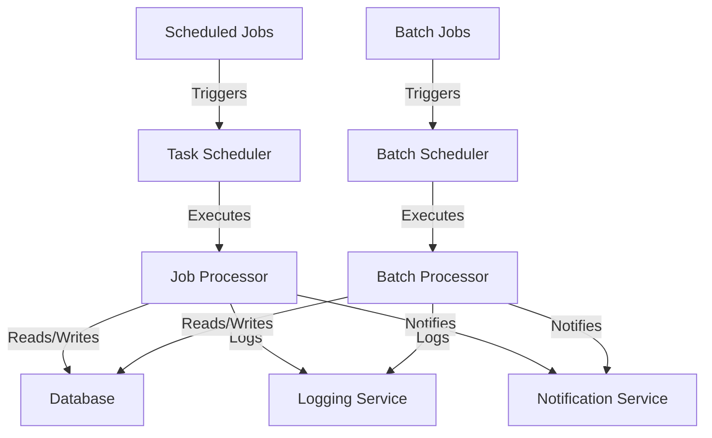

# Scheduled Jobs and Batch Processing — Spring Boot

## Overview and scope

The purpose of this document is to establish standards and best practices for implementing scheduled jobs and batch processing within Xentic's Java-based applications using the Spring Boot framework. This standard aims to ensure consistency, maintainability, and reliability across all scheduled tasks and batch processes within the organization.

### Audience

This document is intended for:
- Software engineers and developers working on Xentic services.
- Technical leads and architects involved in system design and architecture.
- Quality assurance teams responsible for testing scheduled jobs and batch processes.

### Scope

This standard covers:
- Configuration and implementation of scheduled jobs using Spring's `@Scheduled` annotation.
- Batch processing using Spring Batch, including job configuration, step definitions, and execution.
- Error handling and logging practices specific to scheduled jobs and batch processing.
- Performance considerations and best practices for optimizing batch jobs.

### Non-goals

This document does NOT cover:
- General Spring Boot application development practices.
- Frontend scheduling or UI-related job management.
- Non-Spring frameworks or libraries for job scheduling and batch processing.

### Glossary

| Term               | Definition                                                                 |
|--------------------|-----------------------------------------------------------------------------|
| Scheduled Job      | A task that is executed at a specified interval or time using Spring's scheduling capabilities. |
| Batch Processing    | A processing method where a large volume of data is processed in groups or batches, typically using Spring Batch. |
| Spring Batch       | A framework for batch processing in the Spring ecosystem, providing reusable functions for processing large volumes of data. |
| Job                | A container for steps in Spring Batch, defining the overall process.       |
| Step               | A single phase of a job in Spring Batch, representing a specific task.     |

### How this standard fits the Xentic platform

The Xentic platform relies on a microservices architecture, where various services are responsible for different business capabilities. Scheduled jobs and batch processing are critical components that enable automation, data processing, and system maintenance tasks across these services. Adhering to these standards will ensure that:

- All scheduled tasks are implemented consistently across services, reducing the learning curve for new team members.
- Batch processes are efficient and reliable, minimizing the risk of data inconsistency and performance bottlenecks.
- Error handling and logging are standardized, facilitating easier debugging and monitoring.

By following these guidelines, Xentic aims to maintain a high level of quality and performance in its scheduled jobs and batch processing implementations. 

### Example Configuration

Here is an example of a scheduled job configuration using YAML:

```yaml
spring:
  task:
    scheduling:
      pool:
        size: 10
```

And a simple scheduled job implementation:

```java
package com.xentic.example;

import org.springframework.scheduling.annotation.Scheduled;
import org.springframework.stereotype.Service;

@Service
public class ExampleScheduledJob {

    @Scheduled(fixedRate = 5000)
    public void performTask() {
        // Task implementation
        System.out.println("Scheduled task executed");
    }
}
```

This standard serves as a foundation for ensuring that all scheduled jobs and batch processes within Xentic are developed with best practices in mind, promoting a robust and efficient system architecture.

## Standards and policies

1. **MUST** use the package naming convention `com.xentic.<service>` for all scheduled job and batch processing classes. This ensures uniformity and easy identification of service-related components.

2. **MUST NOT** use the package naming convention `com.company` for any internal libraries or services. This practice is against Xentic's naming standards and may lead to confusion.

3. **MUST** annotate scheduled job classes with `@Service` to indicate that they are Spring-managed beans. This is essential for dependency injection and lifecycle management.

4. **MUST** configure scheduled tasks in the `application.yml` file under the `spring.task.scheduling` section. This centralizes configuration and makes it easier to manage.

5. **SHOULD** use `@Scheduled` with fixed rates or cron expressions to define execution intervals. This provides clarity on when tasks will run.

6. **MUST** handle exceptions within scheduled jobs to prevent task failures from affecting the entire application. Use try-catch blocks and log exceptions appropriately.

7. **MUST NOT** perform blocking operations in scheduled tasks. Long-running tasks should be offloaded to asynchronous processes or batch jobs to avoid blocking the scheduler thread.

8. **SHOULD** implement a retry mechanism for transient failures in batch processing. This can be achieved using Spring Batch's built-in retry capabilities.

9. **MUST** log the start and completion of scheduled jobs using a standardized logging framework (e.g., SLF4J). This aids in monitoring and troubleshooting.

10. **MUST NOT** hard-code configuration values in the codebase. All configurable parameters should be externalized in the `application.yml` or environment variables.

11. **SHOULD** use Spring Batch for batch processing tasks, as it provides a robust framework for handling large volumes of data with built-in features like chunk processing and transaction management.

12. **MUST** define job parameters and step configurations in a clear and structured manner using Spring Batch’s `JobBuilderFactory` and `StepBuilderFactory`.

13. **MUST NOT** use synchronous calls to external services within batch jobs. This can lead to performance degradation and increased processing time.

14. **SHOULD** monitor the performance of scheduled jobs and batch processes using application performance monitoring (APM) tools. This helps identify bottlenecks and optimize resource usage.

15. **MUST** document all scheduled jobs and batch processes, including their purpose, frequency, and any dependencies. This documentation should be accessible through internal resources (e.g., https://docs.internal.xentic.io).

16. **MUST** ensure that all scheduled jobs and batch processes are covered by unit and integration tests. This guarantees that changes do not introduce regressions.

17. **SHOULD** use appropriate data structures and algorithms for processing within batch jobs to optimize performance and resource utilization.

18. **MUST NOT** ignore the impact of scheduled jobs on system resources. Regularly assess CPU and memory usage to avoid overloading the system.

19. **MUST** use Spring's `@EnableScheduling` annotation in the main application class to enable scheduling support.

20. **SHOULD** create a dedicated monitoring dashboard for critical scheduled jobs and batch processes to provide real-time insights into their execution status.

### Example Configuration

Here is an example of a batch job configuration using YAML:

```yaml
spring:
  batch:
    job:
      enabled: true
    datasource:
      url: jdbc:mysql://localhost:3306/xentic_db
      username: user
      password: password
```

And a simple batch job implementation:

```java
package com.xentic.batch;

import org.springframework.batch.core.Job;
import org.springframework.batch.core.Step;
import org.springframework.batch.core.configuration.annotation.EnableBatchProcessing;
import org.springframework.batch.core.configuration.annotation.JobBuilderFactory;
import org.springframework.batch.core.configuration.annotation.StepBuilderFactory;
import org.springframework.batch.item.ItemProcessor;
import org.springframework.batch.item.ItemReader;
import org.springframework.batch.item.ItemWriter;
import org.springframework.context.annotation.Bean;
import org.springframework.stereotype.Component;

@EnableBatchProcessing
@Component
public class ExampleBatchJob {

    @Bean
    public Job importUserJob(JobBuilderFactory jobBuilderFactory, StepBuilderFactory stepBuilderFactory) {
        return jobBuilderFactory.get("importUserJob")
                .flow(step1(stepBuilderFactory))
                .end()
                .build();
    }

    @Bean
    public Step step1(StepBuilderFactory stepBuilderFactory) {
        return stepBuilderFactory.get("step1")
                .<InputType, OutputType>chunk(10)
                .reader(itemReader())
                .processor(itemProcessor())
                .writer(itemWriter())
                .build();
    }

    @Bean
    public ItemReader<InputType> itemReader() {
        // Implementation here
    }

    @Bean
    public ItemProcessor<InputType, OutputType> itemProcessor() {
        // Implementation here
    }

    @Bean
    public ItemWriter<OutputType> itemWriter() {
        // Implementation here
    }
}
```

Following these standards and policies will ensure that all scheduled jobs and batch processes at Xentic are implemented with best practices, enhancing maintainability, reliability, and performance across the organization.

## Architecture and design

The architecture for scheduled jobs and batch processing at Xentic is designed to ensure scalability, reliability, and maintainability. Below is a component diagram that illustrates the key components and their interactions within the system.



### Data Flows

1. **Scheduled Jobs**:
   - The Task Scheduler triggers scheduled jobs based on defined intervals.
   - Each job is processed by the Job Processor, which handles the execution logic.
   - Data is read from and written to the database, ensuring data consistency.
   - The Logging Service captures logs for monitoring and debugging purposes.
   - Notifications are sent to relevant stakeholders upon job completion or failure.

2. **Batch Jobs**:
   - The Batch Scheduler initiates batch jobs at predefined times or events.
   - The Batch Processor executes the batch logic, which may involve complex data transformations.
   - Similar to scheduled jobs, data interactions occur with the database.
   - Logs are generated for each batch job execution, and notifications are sent as needed.

### Integration Points

- **Database**: All jobs interact with a centralized database for data storage and retrieval. This ensures consistency and allows for transactional processing.
- **Logging Service**: A centralized logging service captures logs from both scheduled and batch jobs, facilitating monitoring and troubleshooting.
- **Notification Service**: This service is responsible for alerting stakeholders about job statuses, including successes and failures.

### Failure Domains

- **Task Scheduler**: If the Task Scheduler fails, scheduled jobs will not execute. Implementing health checks and monitoring can mitigate this risk.
- **Job Processor**: Failures in the Job Processor can lead to incomplete job executions. Implementing retry mechanisms and error handling is essential.
- **Batch Scheduler**: Similar to the Task Scheduler, failures here will prevent batch jobs from running. Regular monitoring and alerting can help identify issues early.
- **Database**: Database failures can affect both scheduled and batch jobs. Ensure that there are fallback mechanisms and regular backups in place.
- **Logging and Notification Services**: If these services fail, it may hinder monitoring and alerting capabilities. Ensure redundancy and health checks are in place.

By adhering to this architecture and design, Xentic ensures that scheduled jobs and batch processing are robust, scalable, and maintainable, aligning with the overall microservices architecture of the platform.

## Configuration reference

### application.yml Configuration

The following is a comprehensive configuration reference for scheduled jobs and batch processing in the `application.yml` file. This includes default values and recommended production settings.

```yaml
spring:
  task:
    scheduling:
      pool:
        size: 10 # Default thread pool size for scheduled tasks
  batch:
    job:
      enabled: true # Enable batch jobs
    datasource:
      url: jdbc:mysql://localhost:3306/xentic_db # Default database URL
      username: user # Default database username
      password: password # Default database password
      driver-class-name: com.mysql.cj.jdbc.Driver # MySQL driver class
    initialize-schema: always # Initialize schema on application startup
  logging:
    level:
      root: INFO # Default logging level
      com.xentic: DEBUG # Enable debug logging for Xentic packages
```

### Terraform Configuration

When deploying scheduled jobs and batch processing resources using Terraform, the following example illustrates the configuration for an AWS RDS instance and a CloudWatch event rule for scheduling.

```hcl
resource "aws_db_instance" "xentic_db" {
  allocated_storage    = 20
  engine             = "mysql"
  engine_version     = "8.0"
  instance_class     = "db.t3.micro"
  name               = "xentic_db"
  username           = "user"
  password           = "password"
  skip_final_snapshot = true
}

resource "aws_cloudwatch_event_rule" "scheduled_job" {
  name                = "xentic-scheduled-job"
  schedule_expression = "rate(5 minutes)" # Adjust the rate as needed
}

resource "aws_lambda_function" "scheduled_job_lambda" {
  function_name = "xenticScheduledJob"
  handler       = "com.xentic.job.Handler::handleRequest"
  runtime       = "java11"
  role          = aws_iam_role.lambda_exec.arn
  source_code_hash = filebase64sha256("path/to/your/jar")
}
```

### Environment Variables

The following table outlines the necessary environment variables for configuring scheduled jobs and batch processing, including their default and production values.

| Variable Name                | Default Value                | Production Value                |
|------------------------------|------------------------------|----------------------------------|
| `SPRING_DATASOURCE_URL`      | `jdbc:mysql://localhost:3306/xentic_db` | `jdbc:mysql://prod-db-url:3306/xentic_db` |
| `SPRING_DATASOURCE_USERNAME` | `user`                       | `prod_user`                     |
| `SPRING_DATASOURCE_PASSWORD` | `password`                   | `prod_password`                 |
| `SPRING_BATCH_JOB_ENABLED`   | `true`                       | `true`                          |
| `SPRING_LOGGING_LEVEL_ROOT`  | `INFO`                       | `INFO`                          |
| `SPRING_LOGGING_LEVEL_COM_XENTIC` | `DEBUG`                | `INFO`                          |
| `SPRING_TASK_SCHEDULING_POOL_SIZE` | `10`                  | `20`                            |

### Summary

- **MUST** ensure all configurations are properly set in `application.yml`, Terraform scripts, and environment variables.
- **SHOULD** use the provided defaults for local development and adjust for production environments.
- **MUST NOT** hard-code sensitive information such as database passwords; use environment variables instead.

## Implementation guide

To implement scheduled jobs and batch processing in a Spring Boot application at Xentic, follow these detailed steps:

### Step 1: Add Dependencies

Ensure that your `pom.xml` includes the necessary dependencies for Spring Batch and scheduling. Here’s an example:

```xml
<dependencies>
    <dependency>
        <groupId>org.springframework.boot</groupId>
        <artifactId>spring-boot-starter-batch</artifactId>
    </dependency>
    <dependency>
        <groupId>org.springframework.boot</groupId>
        <artifactId>spring-boot-starter-web</artifactId>
    </dependency>
    <dependency>
        <groupId>mysql</groupId>
        <artifactId>mysql-connector-java</artifactId>
        <scope>runtime</scope>
    </dependency>
</dependencies>
```

### Step 2: Create Batch Job Configuration

Create a configuration class for your batch job. This class will define the job, steps, and the components for reading, processing, and writing data.

```java
import org.springframework.batch.core.Job;
import org.springframework.batch.core.Step;
import org.springframework.batch.core.configuration.annotation.EnableBatchProcessing;
import org.springframework.batch.core.configuration.annotation.JobBuilderFactory;
import org.springframework.batch.core.configuration.annotation.StepBuilderFactory;
import org.springframework.batch.item.ItemProcessor;
import org.springframework.batch.item.ItemReader;
import org.springframework.batch.item.ItemWriter;
import org.springframework.context.annotation.Bean;
import org.springframework.stereotype.Component;

@EnableBatchProcessing
@Component
public class UserBatchJob {

    @Bean
    public Job userJob(JobBuilderFactory jobBuilderFactory, StepBuilderFactory stepBuilderFactory) {
        return jobBuilderFactory.get("userJob")
                .flow(userStep(stepBuilderFactory))
                .end()
                .build();
    }

    @Bean
    public Step userStep(StepBuilderFactory stepBuilderFactory) {
        return stepBuilderFactory.get("userStep")
                .<UserInput, UserOutput>chunk(10)
                .reader(userItemReader())
                .processor(userItemProcessor())
                .writer(userItemWriter())
                .build();
    }

    @Bean
    public ItemReader<UserInput> userItemReader() {
        return new UserItemReader(); // Implement this class
    }

    @Bean
    public ItemProcessor<UserInput, UserOutput> userItemProcessor() {
        return new UserItemProcessor(); // Implement this class
    }

    @Bean
    public ItemWriter<UserOutput> userItemWriter() {
        return new UserItemWriter(); // Implement this class
    }
}
```

### Step 3: Implement ItemReader, ItemProcessor, and ItemWriter

You must implement the `UserItemReader`, `UserItemProcessor`, and `UserItemWriter` classes to handle data reading, processing, and writing.

#### UserItemReader

```java
import org.springframework.batch.item.ItemReader;

public class UserItemReader implements ItemReader<UserInput> {
    @Override
    public UserInput read() {
        // Logic to read data from the source (e.g., database, file)
    }
}
```

#### UserItemProcessor

```java
import org.springframework.batch.item.ItemProcessor;

public class UserItemProcessor implements ItemProcessor<UserInput, UserOutput> {
    @Override
    public UserOutput process(UserInput item) {
        // Logic to process the input and return the output
    }
}
```

#### UserItemWriter

```java
import org.springframework.batch.item.ItemWriter;

import java.util.List;

public class UserItemWriter implements ItemWriter<UserOutput> {
    @Override
    public void write(List<? extends UserOutput> items) {
        // Logic to write the processed data to the destination (e.g., database)
    }
}
```

### Step 4: Schedule the Batch Job

To schedule the batch job, create a scheduling configuration class.

```java
import org.springframework.scheduling.annotation.EnableScheduling;
import org.springframework.scheduling.annotation.Scheduled;
import org.springframework.stereotype.Component;

@Component
@EnableScheduling
public class JobScheduler {

    private final JobLauncher jobLauncher;
    private final Job userJob;

    public JobScheduler(JobLauncher jobLauncher, Job userJob) {
        this.jobLauncher = jobLauncher;
        this.userJob = userJob;
    }

    @Scheduled(cron = "0 0 * * * ?") // Runs every hour
    public void scheduleUserJob() {
        try {
            jobLauncher.run(userJob, new JobParameters());
        } catch (Exception e) {
            // Handle exceptions
        }
    }
}
```

### Step 5: Configure Application Properties

Ensure your `application.yml` is correctly configured for batch processing.

```yaml
spring:
  batch:
    job:
      enabled: true
    datasource:
      url: jdbc:mysql://localhost:3306/xentic_db
      username: user
      password: password
```

### Step 6: Testing the Batch Job

To test the batch job, you can create a simple REST controller to trigger the job manually.

```java
import org.springframework.batch.core.JobParameters;
import org.springframework.batch.core.launch.JobLauncher;
import org.springframework.web.bind.annotation.PostMapping;
import org.springframework.web.bind.annotation.RestController;

@RestController
public class JobController {

    private final JobLauncher jobLauncher;
    private final Job userJob;

    public JobController(JobLauncher jobLauncher, Job userJob) {
        this.jobLauncher = jobLauncher;
        this.userJob = userJob;
    }

    @PostMapping("/start-job")
    public String startJob() {
        try {
            jobLauncher.run(userJob, new JobParameters());
            return "Job started successfully!";
        } catch (Exception e) {
            return "Job failed to start: " + e.getMessage();
        }
    }
}
```

### Conclusion

By following these steps, you will have a robust implementation of scheduled jobs and batch processing in your Spring Boot application. Ensure to follow the Xentic standards for package naming, configuration, and code structure to maintain consistency across projects.

## Security requirements

In building scheduled jobs and batch processing systems at Xentic, it is imperative to adhere to strict security requirements to mitigate potential threats. This section outlines the necessary measures regarding threat modeling, authentication and authorization, secrets management, input validation, and audit logging.

### Threat Model Summary

The following threats must be considered in the design and implementation of scheduled jobs:

- **Unauthorized Access**: Ensure that only authenticated users can trigger batch jobs.
- **Data Leakage**: Protect sensitive data from being exposed during processing.
- **Denial of Service (DoS)**: Implement rate limiting to prevent abuse of job execution endpoints.
- **Injection Attacks**: Validate all inputs to prevent SQL injection or other injection attacks.

### Authentication and Authorization

- **MUST** use OAuth2 or JWT for securing REST endpoints that trigger batch jobs.
- **MUST NOT** expose any job execution endpoints without proper authentication.
- **SHOULD** implement role-based access control (RBAC) to restrict access based on user roles.

Example configuration for securing endpoints in `application.yml`:

```yaml
security:
  oauth2:
    resource:
      jwt:
        key-uri: https://auth.internal.xentic.io/.well-known/jwks.json
```

### Secrets Management

- **MUST** use a secrets management tool (e.g., AWS Secrets Manager, HashiCorp Vault) to store sensitive configuration data such as database passwords and API keys.
- **MUST NOT** hard-code sensitive information in source code or configuration files.

Example of retrieving secrets in Spring Boot:

```java
import org.springframework.beans.factory.annotation.Value;
import org.springframework.stereotype.Component;

@Component
public class DatabaseConfig {

    @Value("${db.password}")
    private String dbPassword;

    // Other configurations
}
```

### Input Validation

- **MUST** validate all incoming data to the batch job to prevent injection attacks.
- **SHOULD** use Spring's validation framework to enforce input constraints.

Example of input validation using annotations:

```java
import javax.validation.constraints.NotNull;

public class UserInput {
    
    @NotNull(message = "User ID must not be null")
    private String userId;

    // Other fields and methods
}
```

### Audit Logging

- **MUST** implement audit logging for all job executions, including success and failure outcomes.
- **SHOULD** log the user who triggered the job, the timestamp, and any relevant job parameters.

Example of logging job execution in the `JobScheduler`:

```java
import org.slf4j.Logger;
import org.slf4j.LoggerFactory;

@Component
@EnableScheduling
public class JobScheduler {

    private static final Logger logger = LoggerFactory.getLogger(JobScheduler.class);
    private final JobLauncher jobLauncher;
    private final Job userJob;

    public JobScheduler(JobLauncher jobLauncher, Job userJob) {
        this.jobLauncher = jobLauncher;
        this.userJob = userJob;
    }

    @Scheduled(cron = "0 0 * * * ?") // Runs every hour
    public void scheduleUserJob() {
        try {
            jobLauncher.run(userJob, new JobParameters());
            logger.info("Job executed successfully at {}", LocalDateTime.now());
        } catch (Exception e) {
            logger.error("Job execution failed: {}", e.getMessage());
        }
    }
}
```

### Summary

To ensure a secure environment for scheduled jobs and batch processing at Xentic, the following guidelines must be adhered to:

- **MUST** implement robust authentication and authorization mechanisms.
- **MUST NOT** expose sensitive information in the codebase.
- **SHOULD** validate all inputs and log all job executions for audit purposes.
- **MUST** use a centralized secrets management solution for handling sensitive data.

## Testing strategy

To ensure the reliability and maintainability of scheduled jobs and batch processing systems at Xentic, a comprehensive testing strategy must be implemented. This strategy encompasses unit tests, integration tests, and contract tests, with specific coverage targets to guarantee code quality.

### Testing Types

1. **Unit Tests**
   - **Purpose**: Validate individual components in isolation.
   - **Coverage Target**: 80% or higher.
   - **Tools**: JUnit, Mockito.

2. **Integration Tests**
   - **Purpose**: Test the interaction between components and external systems.
   - **Coverage Target**: 70% or higher.
   - **Tools**: Spring Test, Testcontainers.

3. **Contract Tests**
   - **Purpose**: Ensure that services adhere to defined contracts, especially when communicating with external systems.
   - **Coverage Target**: 100% for critical contracts.
   - **Tools**: Pact, Spring Cloud Contract.

### Example Test Classes

#### Unit Test for UserItemProcessor

```java
import static org.junit.jupiter.api.Assertions.assertEquals;
import org.junit.jupiter.api.Test;

public class UserItemProcessorTest {

    private final UserItemProcessor processor = new UserItemProcessor();

    @Test
    public void testProcess() {
        UserInput input = new UserInput("123");
        UserOutput output = processor.process(input);
        
        assertEquals("Processed: 123", output.getResult());
    }
}
```

#### Integration Test for JobScheduler

```java
import static org.springframework.test.web.servlet.request.MockMvcRequestBuilders.post;
import static org.springframework.test.web.servlet.result.MockMvcResultMatchers.status;

import org.junit.jupiter.api.BeforeEach;
import org.junit.jupiter.api.Test;
import org.springframework.beans.factory.annotation.Autowired;
import org.springframework.boot.test.autoconfigure.web.servlet.AutoConfigureMockMvc;
import org.springframework.boot.test.context.SpringBootTest;
import org.springframework.test.web.servlet.MockMvc;

@SpringBootTest
@AutoConfigureMockMvc
public class JobControllerIntegrationTest {

    @Autowired
    private MockMvc mockMvc;

    @BeforeEach
    public void setup() {
        // setup code if needed
    }

    @Test
    public void testStartJob() throws Exception {
        mockMvc.perform(post("/start-job"))
                .andExpect(status().isOk());
    }
}
```

#### Contract Test Example

Using Pact to define a contract between a consumer and provider:

```groovy
// pact.groovy
pact {
    consumer 'UserService'
    provider 'BatchJobService'

    request {
        method 'POST'
        path '/start-job'
        headers {
            contentType 'application/json'
        }
        body([
            userId: '123'
        ])
    }

    response {
        status 200
        body([
            message: 'Job started successfully!'
        ])
    }
}
```

### Coverage Targets Summary

| Test Type        | Coverage Target |
|------------------|-----------------|
| Unit Tests       | 80% or higher    |
| Integration Tests| 70% or higher    |
| Contract Tests   | 100% for critical contracts |

### Best Practices

- **MUST** write unit tests for all components, including readers, processors, and writers.
- **SHOULD** use mocking frameworks like Mockito to isolate dependencies in unit tests.
- **MUST NOT** skip integration tests, especially for components that interact with external systems.
- **SHOULD** maintain an updated test suite that runs automatically with every build to ensure ongoing quality.

By adhering to this testing strategy, Xentic can ensure that scheduled jobs and batch processing systems are robust, reliable, and maintainable, ultimately leading to higher quality software and reduced risk of defects in production.

## Observability and operations

To ensure effective observability and operations for scheduled jobs and batch processing at Xentic, the following practices must be adopted. This includes metrics collection, logging, tracing, dashboards, alerts, service level objectives (SLOs), and on-call runbook steps.

### Metrics Collection

- **MUST** instrument all scheduled jobs to report key metrics such as execution time, success/failure rates, and job queue lengths.
- **SHOULD** use Micrometer for metrics collection, which integrates seamlessly with Spring Boot applications.

Example of configuring Micrometer in `application.yml`:

```yaml
management:
  metrics:
    export:
      prometheus:
        enabled: true
```

### Logging

- **MUST** use a structured logging framework (e.g., Logback) to capture logs in a consistent format.
- **MUST** log the start and end of each job execution, along with any exceptions that occur.

Example of a logging configuration in `logback-spring.xml`:

```xml
<configuration>
    <appender name="STDOUT" class="ch.qos.logback.core.ConsoleAppender">
        <encoder>
            <pattern>%d{yyyy-MM-dd HH:mm:ss} - %msg%n</pattern>
        </encoder>
    </appender>

    <root level="INFO">
        <appender-ref ref="STDOUT" />
    </root>
</configuration>
```

### Tracing

- **MUST** implement distributed tracing using tools like Zipkin or OpenTelemetry to track the flow of requests through the system.
- **SHOULD** propagate trace context in all asynchronous job executions.

Example of enabling Spring Cloud Sleuth for tracing:

```yaml
spring:
  sleuth:
    sampler:
      probability: 1.0  # Sample all requests for tracing
```

### Dashboards

- **MUST** create dashboards in monitoring tools (e.g., Grafana) to visualize job metrics and health status.
- **SHOULD** include graphs for job execution times, success/failure rates, and alert notifications.

### Alerts

- **MUST** set up alerts for critical job failures, long execution times, and other anomalies.
- **SHOULD** use a monitoring tool (e.g., Prometheus Alertmanager) to manage alerts.

Example of an alerting rule in Prometheus:

```yaml
groups:
  - name: job-alerts
    rules:
      - alert: JobFailure
        expr: job_execution_failures_total > 0
        for: 5m
        labels:
          severity: critical
        annotations:
          summary: "Job execution failure detected"
          description: "Job {{ $labels.job }} has failed."
```

### Service Level Objectives (SLOs)

- **MUST** define SLOs for job execution success rates and response times.
- **SHOULD** review SLOs quarterly to ensure they align with business objectives.

| SLO Description                | Target   |
|--------------------------------|----------|
| Job execution success rate     | 99.9%    |
| Average job execution time     | < 5 min  |

### On-Call Runbook Steps

In the event of job failures, the following on-call runbook steps must be followed:

1. **Check Monitoring Dashboards**: Review Grafana dashboards for job metrics.
2. **Review Logs**: Analyze logs for the specific job execution to identify errors.
3. **Check Alerts**: Verify if any alerts were triggered related to the job.
4. **Restart Job**: If the issue is transient, attempt to restart the job.
5. **Escalate**: If the job continues to fail, escalate to the engineering team for further investigation.
6. **Document Incident**: After resolution, document the incident, including root cause and resolution steps, in the incident management system.

By adhering to these observability and operations guidelines, Xentic can ensure that scheduled jobs and batch processing systems are monitored effectively, leading to quicker identification and resolution of issues, ultimately enhancing system reliability and performance.

## Migration and versioning

To maintain the integrity and reliability of scheduled jobs and batch processing systems at Xentic, a clear migration and versioning strategy must be established. This section outlines the upgrade paths, deprecation policy, backward compatibility requirements, and rollback procedures.

### Upgrade Paths

- **MUST** define clear upgrade paths for all scheduled jobs and batch processing components.
- **SHOULD** provide documentation for each version, detailing new features, bug fixes, and breaking changes.
- **MUST** ensure that any major version upgrade includes a migration guide that outlines necessary changes in configuration and code.

| Version | Release Date | Major Changes                             | Migration Guide URL                     |
|---------|--------------|------------------------------------------|-----------------------------------------|
| 1.0.0   | 2023-01-15   | Initial release                          | https://docs.internal.xentic.io/migration/1.0.0 |
| 1.1.0   | 2023-06-01   | Added new job scheduling features        | https://docs.internal.xentic.io/migration/1.1.0 |
| 2.0.0   | 2023-10-01   | Breaking changes in job configuration    | https://docs.internal.xentic.io/migration/2.0.0 |

### Deprecation Policy

- **MUST** communicate deprecations at least one version prior to removal.
- **SHOULD** mark deprecated features in the codebase with appropriate annotations.
- **MUST** provide alternative solutions or replacements for deprecated features.

Example of marking a deprecated method in Java:

```java
@Deprecated
public void oldJobMethod() {
    // Implementation
}
```

### Backward Compatibility

- **MUST** ensure that new versions of scheduled jobs are backward compatible with previous configurations where feasible.
- **SHOULD** include compatibility tests as part of the CI/CD pipeline to verify that existing jobs function as expected with new versions.
- **MUST NOT** introduce breaking changes without a clear migration path and ample notice.

### Rollback Procedures

In the event of a failed deployment or migration, the following rollback procedures must be followed:

1. **Identify the Issue**: Review logs and metrics to determine the cause of the failure.
2. **Notify Stakeholders**: Inform relevant teams and stakeholders of the issue and the rollback plan.
3. **Rollback Deployment**:
   - **MUST** have a version control system in place to facilitate quick rollbacks.
   - **SHOULD** use automated deployment tools (e.g., Jenkins, Spinnaker) to revert to the last stable version.
   
Example of a rollback command in a deployment tool:

```bash
kubectl rollout undo deployment/my-scheduled-job
```

4. **Verify Rollback**: After rolling back, verify that the previous version is functioning correctly.
5. **Document the Incident**: Record the details of the failure and the rollback process in the incident management system for future reference.

### Best Practices for Migration and Versioning

- **MUST** maintain comprehensive documentation for each version of scheduled jobs and batch processing systems.
- **SHOULD** implement feature flags to allow gradual rollout of new features while maintaining the ability to revert if necessary.
- **MUST NOT** release new versions without thorough testing in a staging environment that mirrors production.

By adhering to these migration and versioning guidelines, Xentic can ensure a smooth transition between versions, maintain system reliability, and minimize disruptions to scheduled jobs and batch processing operations.

## FAQ, anti-patterns, and checklists

### FAQ

1. **What is a scheduled job?**
   - A scheduled job is a task that is executed automatically at specified intervals or times, typically managed by a job scheduler within the application.

2. **How do I configure a scheduled job in Spring Boot?**
   - Use the `@Scheduled` annotation on a method within a Spring-managed bean. Example:
   ```java
   @Scheduled(fixedRate = 5000)
   public void performTask() {
       // Task logic here
   }
   ```

3. **What is the difference between fixedRate and fixedDelay?**
   - `fixedRate` schedules the task to run at a fixed interval regardless of the previous task's completion, while `fixedDelay` waits for the previous task to finish before starting the next one.

4. **How can I handle exceptions in scheduled jobs?**
   - Use a try-catch block within the scheduled method to handle exceptions gracefully. Log the exception for monitoring purposes.

5. **What should I do if a scheduled job fails?**
   - Implement retry logic or alerting mechanisms to notify the team of failures. Consider using a dead-letter queue for failed jobs.

6. **How can I test scheduled jobs?**
   - Use mocking frameworks to simulate job execution and verify behavior. Consider using `@Scheduled` with a shorter interval for testing purposes.

7. **What is batch processing?**
   - Batch processing refers to executing a series of jobs or tasks in bulk, often with a focus on efficiency and resource management.

8. **How do I configure batch processing in Spring Boot?**
   - Use Spring Batch to define jobs, steps, and tasklets. Example configuration in `application.yml`:
   ```yaml
   spring:
     batch:
       job:
         enabled: true
   ```

9. **What are the benefits of using Spring Batch?**
   - Spring Batch provides built-in support for chunk processing, transaction management, and job monitoring, making it easier to manage complex batch jobs.

10. **How can I ensure idempotency in scheduled jobs?**
    - Implement checks to ensure that repeated executions do not produce side effects, such as processing the same data multiple times.

### Anti-Patterns

| Anti-Pattern                      | Description                                                                                     |
|-----------------------------------|-------------------------------------------------------------------------------------------------|
| Long-Running Jobs                 | Scheduled jobs that take too long to execute can block the scheduler and affect system performance. |
| Hard-Coded Configuration          | Using hard-coded values for job parameters makes it difficult to change behavior without redeploying. |
| Ignoring Exception Handling       | Failing to handle exceptions can lead to silent failures and data inconsistencies.              |
| Lack of Monitoring                | Not implementing monitoring can result in undetected failures and prolonged downtime.           |
| Synchronous Job Execution         | Blocking the main thread during job execution can lead to performance bottlenecks.             |
| Overlapping Job Executions        | Allowing jobs to overlap can lead to race conditions and data corruption.                       |
| Not Using Transactions            | Failing to wrap batch operations in transactions can lead to partial updates and data integrity issues. |

### Pre-Merge Checklist

- **MUST** ensure all new scheduled jobs have corresponding unit tests.
- **MUST NOT** introduce new scheduled jobs without proper documentation.
- **SHOULD** review job configurations for potential performance impacts.
- **MUST** validate that logging and monitoring are in place for new jobs.
- **SHOULD** check for adherence to naming conventions in job names and classes.

### Production Checklist

- **MUST** verify that all scheduled jobs are properly configured and tested in a staging environment.
- **MUST** ensure that alerts are set up for critical job failures and performance issues.
- **SHOULD** confirm that all dependencies are up-to-date and compatible.
- **MUST** have a rollback plan in place in case of deployment issues.
- **SHOULD** conduct a post-deployment review to assess job performance and identify areas for improvement.
