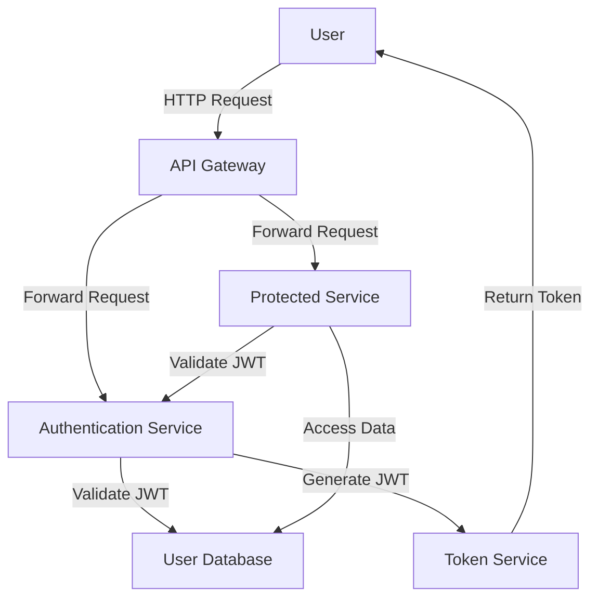

# JWT Security Framework — Spring Boot

## Overview and scope

The purpose of this document is to define the standards and best practices for implementing JWT (JSON Web Token) security in Spring Boot applications at Xentic. This framework aims to provide a consistent approach to authentication and authorization across all services, ensuring the security and integrity of user data while facilitating seamless access control.

### Audience

This standard is intended for:
- Software Engineers
- DevOps Engineers
- Security Architects
- Technical Leads
- Quality Assurance Engineers

### Scope

This standard applies to all backend services developed using Java and Spring Boot within the Xentic platform that require authentication and authorization mechanisms. It encompasses the following areas:
- JWT generation and validation
- Integration with Spring Security
- Configuration of security settings
- Implementation of role-based access control
- Management of token claims

### Non-goals

This document does not cover:
- Frontend authentication mechanisms
- Non-JWT based authentication methods
- Detailed implementation of user management systems
- Other security concerns outside of JWT and Spring Security

### Glossary

| Term             | Definition                                                                                   |
|------------------|----------------------------------------------------------------------------------------------|
| JWT              | JSON Web Token, a compact, URL-safe means of representing claims to be transferred between two parties. |
| RS256            | An asymmetric signing algorithm using RSA with a 256-bit key length.                        |
| Spring Security  | A powerful and customizable authentication and access-control framework for Java applications. |
| Stateless        | A design principle where each request from a client contains all the information needed to process it. |
| Claims           | Statements about an entity (typically, the user) and additional metadata that are encoded in the JWT. |

### How This Standard Fits the Xentic Platform

Implementing this JWT Security Framework is critical for maintaining the security posture of Xentic's applications. By adhering to these standards, developers ensure that:
- User authentication is handled securely and consistently across services.
- Sensitive data is protected through robust access controls.
- Compliance with industry standards and regulations is maintained.
- The development process is streamlined, allowing for quicker onboarding of new developers and easier maintenance of existing services.

### Standard

All services requiring authentication MUST use JWT (RS256) via Spring Security. The shared authentication library to be utilized is `com.xentic.auth:auth-starter:2.x`.

### Setup

To include the JWT authentication library, add the following dependency to your `pom.xml`:

```xml
<dependency>
    <groupId>com.xentic.auth</groupId>
    <artifactId>auth-starter</artifactId>
    <version>2.3.1</version>
</dependency>
```

### Configuration

The following YAML configuration MUST be included in your application configuration file:

```yaml
xentic:
  auth:
    public-key-url: ${AUTH_PUBLIC_KEY_URL}
    token-expiry-seconds: 3600
    refresh-expiry-seconds: 86400
```

### Securing Endpoints

To secure your endpoints, configure the `SecurityConfig` class as follows:

```java
@Configuration
@EnableMethodSecurity
public class SecurityConfig {
    @Bean
    public SecurityFilterChain filterChain(HttpSecurity http) throws Exception {
        return http
            .csrf(AbstractHttpConfigurer::disable)
            .sessionManagement(s -> s.sessionCreationPolicy(SessionCreationPolicy.STATELESS))
            .authorizeHttpRequests(auth -> auth
                .requestMatchers("/api/v1/public/**").permitAll()
                .anyRequest().authenticated())
            .oauth2ResourceServer(o -> o.jwt(Customizer.withDefaults()))
            .build();
    }
}
```

### Role-Based Access

Implement role-based access control using the `@PreAuthorize` annotation:

```java
@PreAuthorize("hasRole('ADMIN')")
public void deleteUser(UUID id) { 
    // Implementation here
}
```

### Token Claims

Every JWT MUST include the following standard claims:

- `sub`: User UUID
- `roles`: List of role strings
- `tenant_id`: Tenant UUID for multi-tenant services

By following these guidelines, Xentic ensures a robust and secure approach to authentication and authorization across its services.

## Standards and policies

1. **MUST** use the `com.xentic.auth:auth-starter` library for JWT authentication and authorization in all Spring Boot services requiring secure access.

2. **MUST** implement JWT using the RS256 signing algorithm to ensure the integrity and authenticity of tokens.

3. **MUST NOT** hard-code sensitive information such as secret keys, database passwords, or API keys directly in the source code. Instead, leverage environment variables or secure vaults.

4. **MUST** ensure that all JWTs are signed with a private key and that the corresponding public key is made available via a secure URL specified in the application configuration.

5. **SHOULD** configure token expiration settings to ensure that tokens are valid for a limited time. A recommended setting is 1 hour for access tokens and 24 hours for refresh tokens.

6. **MUST** validate JWTs on every request to secured endpoints using Spring Security's built-in mechanisms.

7. **MUST NOT** expose any sensitive information in the JWT claims. Only include necessary claims such as `sub`, `roles`, and `tenant_id`.

8. **MUST** implement role-based access control (RBAC) using the `@PreAuthorize` annotation for method-level security.

9. **SHOULD** log all authentication attempts, including successful and failed logins, to facilitate monitoring and auditing.

10. **MUST** implement error handling for JWT validation failures, returning appropriate HTTP status codes (e.g., 401 Unauthorized, 403 Forbidden).

11. **MUST** use HTTPS for all communications involving JWTs to prevent interception by malicious actors.

12. **SHOULD** periodically rotate signing keys and update the public key URL in the configuration to enhance security.

13. **MUST** ensure that the application is configured to handle CORS (Cross-Origin Resource Sharing) appropriately when JWTs are used in a web application context.

14. **SHOULD** provide a mechanism for users to refresh their tokens securely without requiring re-authentication.

15. **MUST** include a mechanism for logging out users, which should invalidate their JWTs on the server side if applicable.

### Example Configuration

Here is an example of a complete YAML configuration for JWT settings:

```yaml
xentic:
  auth:
    public-key-url: ${AUTH_PUBLIC_KEY_URL}
    private-key: ${AUTH_PRIVATE_KEY}
    token-expiry-seconds: 3600
    refresh-expiry-seconds: 86400
    enable-cors: true
    cors-allowed-origins:
      - "https://app.internal.xentic.io"
```

### Example SQL for User Roles

To manage user roles in the database, use the following SQL schema:

```sql
CREATE TABLE user_roles (
    id UUID PRIMARY KEY,
    user_id UUID NOT NULL,
    role VARCHAR(50) NOT NULL,
    FOREIGN KEY (user_id) REFERENCES users(id)
);
```

### Example Code for Token Generation

Here is an example of how to generate a JWT in your service:

```java
public String generateToken(UserDetails userDetails) {
    return Jwts.builder()
        .setSubject(userDetails.getUsername())
        .claim("roles", userDetails.getAuthorities().stream()
            .map(GrantedAuthority::getAuthority)
            .collect(Collectors.toList()))
        .setIssuedAt(new Date())
        .setExpiration(new Date(System.currentTimeMillis() + tokenExpirySeconds * 1000))
        .signWith(SignatureAlgorithm.RS256, privateKey)
        .compact();
}
```

By adhering to these standards and policies, Xentic ensures a secure and consistent approach to JWT authentication across its services.

## Architecture and design

The JWT Security Framework for Spring Boot at Xentic is designed to provide a robust and scalable authentication and authorization mechanism. Below is a component diagram that illustrates the key components and their interactions within the system.



### Data Flows

1. **User Authentication Flow**:
   - The user sends a login request to the API Gateway.
   - The API Gateway forwards the request to the Authentication Service.
   - The Authentication Service validates the user credentials against the User Database.
   - Upon successful authentication, the Authentication Service generates a JWT and sends it back to the user.

2. **Protected Resource Access Flow**:
   - The user makes a request to access a protected resource, including the JWT in the Authorization header.
   - The API Gateway forwards the request to the Protected Service.
   - The Protected Service validates the JWT with the Authentication Service.
   - If the JWT is valid, the Protected Service retrieves the necessary data from the User Database and returns it to the user.

### Integration Points

- **API Gateway**: Acts as the entry point for all client requests and forwards them to the appropriate services.
- **Authentication Service**: Responsible for user authentication, JWT generation, and validation.
- **User Database**: Stores user credentials and roles, essential for authentication and authorization checks.
- **Token Service**: Handles the creation and management of JWTs.

### Failure Domains

- **Authentication Service Failure**: If the Authentication Service is down, users will be unable to authenticate, leading to a complete failure of the authentication process.
- **Token Validation Failure**: If the JWT validation fails (e.g., due to expiration or tampering), access to protected resources will be denied.
- **Database Connectivity Issues**: Any failure in connecting to the User Database can prevent both authentication and authorization processes, leading to service disruptions.

### Key Considerations

- **Statelessness**: The architecture is designed to be stateless, meaning that no session information is stored on the server. Each request must contain all the necessary information (i.e., the JWT).
- **Scalability**: The design allows for horizontal scaling of services, as each service can independently validate JWTs without relying on shared session state.
- **Security**: All communication should occur over HTTPS to protect the integrity and confidentiality of the JWTs during transmission.

### Example Configuration for API Gateway

The API Gateway should be configured to forward requests to the Authentication Service and validate JWTs. Below is an example configuration in YAML format:

```yaml
api-gateway:
  routes:
    authentication:
      uri: http://auth.internal.xentic.io
      predicates:
        - Path=/api/v1/auth/**
    protected-service:
      uri: http://protected.internal.xentic.io
      predicates:
        - Path=/api/v1/protected/**
      filters:
        - JwtAuthenticationFilter
```

By implementing this architecture and design, Xentic ensures a secure, efficient, and scalable JWT-based authentication mechanism across its services.

## Configuration reference

### Application Configuration (application.yml)

The following table outlines the configuration settings for JWT authentication in the `application.yml` file. Default values are provided for development, and recommended production values are specified.

```yaml
xentic:
  auth:
    public-key-url: ${AUTH_PUBLIC_KEY_URL} # URL to fetch the public key
    private-key: ${AUTH_PRIVATE_KEY}         # Private key for signing JWTs
    token-expiry-seconds: 3600                # Default: 1 hour
    refresh-expiry-seconds: 86400             # Default: 24 hours
    enable-cors: true                         # Enable CORS for web applications
    cors-allowed-origins:
      - "https://app.internal.xentic.io"     # Allowed origins for CORS
```

| Property                       | Default Value                  | Production Value                  |
|-------------------------------|-------------------------------|-----------------------------------|
| `public-key-url`              | `${AUTH_PUBLIC_KEY_URL}`     | `https://auth.internal.xentic.io/public-key` |
| `private-key`                 | `${AUTH_PRIVATE_KEY}`         | `REPLACE_WITH_ACTUAL_PRIVATE_KEY` |
| `token-expiry-seconds`        | `3600`                        | `3600`                            |
| `refresh-expiry-seconds`      | `86400`                       | `86400`                           |
| `enable-cors`                 | `true`                        | `true`                            |
| `cors-allowed-origins`        | `["https://app.internal.xentic.io"]` | `["https://app.internal.xentic.io"]` |

### Environment Variables

The following environment variables MUST be set for the application to function correctly:

| Environment Variable         | Description                                   | Default Value             |
|------------------------------|-----------------------------------------------|---------------------------|
| `AUTH_PUBLIC_KEY_URL`       | URL to fetch the public key                   | `https://auth.internal.xentic.io/public-key` |
| `AUTH_PRIVATE_KEY`          | Private key for signing JWTs                  | `REPLACE_WITH_ACTUAL_PRIVATE_KEY` |

### Terraform Configuration

When deploying the application using Terraform, the following configuration should be used to set up the necessary environment variables and secrets:

```hcl
resource "aws_ssm_parameter" "auth_public_key_url" {
  name  = "/xentic/auth/public_key_url"
  type  = "String"
  value = "https://auth.internal.xentic.io/public-key"
}

resource "aws_ssm_parameter" "auth_private_key" {
  name  = "/xentic/auth/private_key"
  type  = "SecureString"
  value = "REPLACE_WITH_ACTUAL_PRIVATE_KEY"
}

resource "aws_ecs_task_definition" "jwt_service" {
  family                   = "jwt-service"
  container_definitions    = jsonencode([{
    name      = "jwt-container"
    image     = "xentic/jwt-service:latest"
    essential = true
    environment = [
      {
        name  = "AUTH_PUBLIC_KEY_URL"
        value = aws_ssm_parameter.auth_public_key_url.value
      },
      {
        name  = "AUTH_PRIVATE_KEY"
        value = aws_ssm_parameter.auth_private_key.value
      }
    ]
  }])
}
```

By following this configuration reference, Xentic ensures a consistent and secure setup for JWT authentication across all services.

## Implementation guide

To implement the JWT Security Framework in a Spring Boot application at Xentic, follow these steps:

### Step 1: Add Dependencies

Include the necessary dependencies in your `pom.xml` file for Spring Security and JWT:

```xml
<dependency>
    <groupId>io.jsonwebtoken</groupId>
    <artifactId>jjwt</artifactId>
    <version>0.9.1</version>
</dependency>
<dependency>
    <groupId>org.springframework.boot</groupId>
    <artifactId>spring-boot-starter-security</artifactId>
</dependency>
<dependency>
    <groupId>org.springframework.boot</groupId>
    <artifactId>spring-boot-starter-web</artifactId>
</dependency>
```

### Step 2: Create JWT Utility Class

Create a utility class for generating and validating JWTs:

```java
package com.xentic.auth.util;

import io.jsonwebtoken.Claims;
import io.jsonwebtoken.Jwts;
import io.jsonwebtoken.SignatureAlgorithm;
import org.springframework.stereotype.Component;

import java.util.Date;
import java.util.HashMap;
import java.util.Map;

@Component
public class JwtUtil {
    private String secretKey = "YOUR_SECRET_KEY"; // Replace with your actual secret key
    private long expirationTime = 3600000; // 1 hour

    public String generateToken(String username) {
        Map<String, Object> claims = new HashMap<>();
        return createToken(claims, username);
    }

    private String createToken(Map<String, Object> claims, String subject) {
        return Jwts.builder()
                .setClaims(claims)
                .setSubject(subject)
                .setIssuedAt(new Date(System.currentTimeMillis()))
                .setExpiration(new Date(System.currentTimeMillis() + expirationTime))
                .signWith(SignatureAlgorithm.HS256, secretKey)
                .compact();
    }

    public boolean validateToken(String token, String username) {
        final String extractedUsername = extractUsername(token);
        return (extractedUsername.equals(username) && !isTokenExpired(token));
    }

    private String extractUsername(String token) {
        return extractAllClaims(token).getSubject();
    }

    private Claims extractAllClaims(String token) {
        return Jwts.parser().setSigningKey(secretKey).parseClaimsJws(token).getBody();
    }

    private boolean isTokenExpired(String token) {
        return extractAllClaims(token).getExpiration().before(new Date());
    }
}
```

### Step 3: Create Authentication Filter

Implement a filter to intercept requests and validate JWTs:

```java
package com.xentic.auth.filter;

import com.xentic.auth.util.JwtUtil;
import org.springframework.beans.factory.annotation.Autowired;
import org.springframework.security.core.context.SecurityContextHolder;
import org.springframework.security.core.userdetails.UserDetails;
import org.springframework.security.core.userdetails.UserDetailsService;
import org.springframework.security.web.authentication.WebAuthenticationFilter;
import javax.servlet.FilterChain;
import javax.servlet.ServletException;
import javax.servlet.http.HttpServletRequest;
import javax.servlet.http.HttpServletResponse;
import java.io.IOException;

public class JwtRequestFilter extends WebAuthenticationFilter {
    @Autowired
    private JwtUtil jwtUtil;

    @Autowired
    private UserDetailsService userDetailsService;

    @Override
    protected void doFilterInternal(HttpServletRequest request, HttpServletResponse response, FilterChain chain)
            throws ServletException, IOException {
        final String authorizationHeader = request.getHeader("Authorization");

        String username = null;
        String jwt = null;

        if (authorizationHeader != null && authorizationHeader.startsWith("Bearer ")) {
            jwt = authorizationHeader.substring(7);
            username = jwtUtil.extractUsername(jwt);
        }

        if (username != null && SecurityContextHolder.getContext().getAuthentication() == null) {
            UserDetails userDetails = userDetailsService.loadUserByUsername(username);
            if (jwtUtil.validateToken(jwt, userDetails.getUsername())) {
                // Set authentication in the context
            }
        }
        chain.doFilter(request, response);
    }
}
```

### Step 4: Configure Security

Create a security configuration class to set up the authentication mechanism:

```java
package com.xentic.auth.config;

import com.xentic.auth.filter.JwtRequestFilter;
import org.springframework.beans.factory.annotation.Autowired;
import org.springframework.context.annotation.Bean;
import org.springframework.context.annotation.Configuration;
import org.springframework.security.config.annotation.authentication.builders.AuthenticationManagerBuilder;
import org.springframework.security.config.annotation.web.builders.HttpSecurity;
import org.springframework.security.config.annotation.web.configuration.EnableWebSecurity;
import org.springframework.security.config.annotation.web.configuration.WebSecurityConfigurerAdapter;
import org.springframework.security.crypto.bcrypt.BCryptPasswordEncoder;
import org.springframework.security.crypto.password.PasswordEncoder;

@Configuration
@EnableWebSecurity
public class SecurityConfig extends WebSecurityConfigurerAdapter {
    @Autowired
    private JwtRequestFilter jwtRequestFilter;

    @Override
    protected void configure(HttpSecurity http) throws Exception {
        http.csrf().disable()
            .authorizeRequests()
            .antMatchers("/api/v1/auth/**").permitAll()
            .anyRequest().authenticated();

        http.addFilterBefore(jwtRequestFilter, UsernamePasswordAuthenticationFilter.class);
    }

    @Bean
    public PasswordEncoder passwordEncoder() {
        return new BCryptPasswordEncoder();
    }
}
```

### Step 5: Create Authentication Controller

Implement a controller to handle authentication requests:

```java
package com.xentic.auth.controller;

import com.xentic.auth.util.JwtUtil;
import org.springframework.beans.factory.annotation.Autowired;
import org.springframework.http.ResponseEntity;
import org.springframework.web.bind.annotation.*;

@RestController
@RequestMapping("/api/v1/auth")
public class AuthController {
    @Autowired
    private JwtUtil jwtUtil;

    @PostMapping("/login")
    public ResponseEntity<String> login(@RequestBody UserCredentials credentials) {
        // Authenticate user and generate JWT
        String token = jwtUtil.generateToken(credentials.getUsername());
        return ResponseEntity.ok(token);
    }
}
```

### Step 6: Define User Credentials Class

Create a class for user credentials:

```java
package com.xentic.auth.controller;

public class UserCredentials {
    private String username;
    private String password;

    // Getters and Setters
}
```

### Conclusion

By following these steps, you will have a fully functional JWT Security Framework integrated into your Spring Boot application. Ensure that you replace placeholder values (like `YOUR_SECRET_KEY`) with actual secure values before deploying to production.

## Security requirements

### Threat Model Summary

Xentic's JWT Security Framework must defend against the following threats:

- **Unauthorized Access**: Ensure that only authenticated users can access protected resources.
- **Token Theft**: Prevent interception of JWTs during transmission.
- **Replay Attacks**: Implement measures to prevent the reuse of stolen tokens.
- **Token Forgery**: Ensure that tokens cannot be forged by using strong signing algorithms.
- **Sensitive Data Exposure**: Protect sensitive data in transit and at rest.

### Authentication and Authorization

- **Authentication**: Users must authenticate using a username and password. Upon successful authentication, a JWT is issued.
- **Authorization**: Access control must be enforced based on user roles and permissions. Use Spring Security's method-level security features to restrict access to specific endpoints.

### Secrets Management

- Secrets, such as private keys and database passwords, MUST NOT be hardcoded in the application code.
- Use AWS SSM or other secret management tools to store and retrieve sensitive information securely.

Example configuration for storing secrets:

```hcl
resource "aws_ssm_parameter" "jwt_secret_key" {
  name  = "/xentic/jwt/secret_key"
  type  = "SecureString"
  value = "REPLACE_WITH_ACTUAL_SECRET_KEY"
}
```

### Input Validation

- All user inputs MUST be validated to prevent injection attacks (e.g., SQL injection, XSS).
- Use Spring's validation annotations to enforce constraints on input data.

Example of input validation:

```java
import javax.validation.constraints.NotBlank;

public class UserCredentials {
    @NotBlank(message = "Username is mandatory")
    private String username;

    @NotBlank(message = "Password is mandatory")
    private String password;

    // Getters and Setters
}
```

### Audit Logging

- All authentication attempts (successful and failed) MUST be logged to monitor for suspicious activity.
- Log relevant information, such as timestamps, IP addresses, and user identifiers, while ensuring sensitive data is not logged.

Example of logging configuration:

```yaml
logging:
  level:
    org.springframework.security: DEBUG
  loggers:
    audit:
      level: INFO
      appender: console
```

### Summary Table

| Requirement              | Description                                               |
|-------------------------|-----------------------------------------------------------|
| Authentication          | Users must authenticate with a JWT issued upon login.    |
| Authorization           | Access control based on roles and permissions.            |
| Secrets Management      | Use secure storage for sensitive information.             |
| Input Validation        | Validate all user inputs to prevent injections.          |
| Audit Logging           | Log all authentication attempts for monitoring purposes.  |

By adhering to these security requirements, Xentic will ensure a robust and secure JWT Security Framework for its applications.

## Testing strategy

To ensure the reliability and security of the JWT Security Framework, a comprehensive testing strategy must be implemented. This strategy includes unit tests, integration tests, and contract tests, each with specific coverage targets and example test classes.

### Testing Types

1. **Unit Tests**
   - Focus on individual components and methods.
   - Coverage target: 80% or higher.
   - Use JUnit and Mockito for mocking dependencies.

2. **Integration Tests**
   - Test the interaction between components and external systems.
   - Coverage target: 70% or higher.
   - Use Spring Boot Test for context loading and testing.

3. **Contract Tests**
   - Ensure that the API contracts are adhered to by both the service and its consumers.
   - Coverage target: 100% for all public endpoints.
   - Use tools like Pact for consumer-driven contract testing.

### Example Test Classes

#### Unit Test Example

```java
package com.xentic.auth.util;

import io.jsonwebtoken.Claims;
import io.jsonwebtoken.Jwts;
import org.junit.jupiter.api.Test;
import org.mockito.Mockito;

import static org.junit.jupiter.api.Assertions.assertEquals;
import static org.junit.jupiter.api.Assertions.assertTrue;

public class JwtUtilTest {
    private final String secretKey = "testSecretKey";
    private final JwtUtil jwtUtil = new JwtUtil(secretKey);

    @Test
    public void testGenerateToken() {
        String token = jwtUtil.generateToken("testUser");
        assertTrue(token.startsWith("eyJ")); // JWT tokens start with "eyJ"
    }

    @Test
    public void testExtractUsername() {
        String token = jwtUtil.generateToken("testUser");
        String username = jwtUtil.extractUsername(token);
        assertEquals("testUser", username);
    }

    @Test
    public void testIsTokenExpired() {
        String token = jwtUtil.generateToken("testUser");
        assertTrue(!jwtUtil.isTokenExpired(token));
    }
}
```

#### Integration Test Example

```java
package com.xentic.auth.controller;

import org.junit.jupiter.api.Test;
import org.springframework.beans.factory.annotation.Autowired;
import org.springframework.boot.test.autoconfigure.web.servlet.AutoConfigureMockMvc;
import org.springframework.boot.test.context.SpringBootTest;
import org.springframework.http.MediaType;
import org.springframework.test.web.servlet.MockMvc;

import static org.springframework.test.web.servlet.request.MockMvcRequestBuilders.post;
import static org.springframework.test.web.servlet.result.MockMvcResultMatchers.status;

@SpringBootTest
@AutoConfigureMockMvc
public class AuthControllerIntegrationTest {

    @Autowired
    private MockMvc mockMvc;

    @Test
    public void testLogin() throws Exception {
        String json = "{\"username\":\"testUser\", \"password\":\"testPassword\"}";

        mockMvc.perform(post("/api/v1/auth/login")
                .contentType(MediaType.APPLICATION_JSON)
                .content(json))
                .andExpect(status().isOk());
    }
}
```

#### Contract Test Example

Using Pact for contract testing, create a consumer test:

```java
package com.xentic.auth.contract;

import au.com.dius.pact.consumer.junit5.PactConsumerTestExt;
import au.com.dius.pact.consumer.junit5.PactTestFor;
import org.junit.jupiter.api.Test;
import org.junit.jupiter.api.extension.ExtendWith;

@ExtendWith(PactConsumerTestExt.class)
@PactTestFor(providerName = "AuthService", port = "8080")
public class AuthServiceContractTest {

    @Test
    void testLoginPact() {
        // Define your contract here
    }
}
```

### Coverage Targets Summary

| Test Type        | Coverage Target |
|------------------|-----------------|
| Unit Tests       | 80% or higher    |
| Integration Tests| 70% or higher    |
| Contract Tests   | 100% for all APIs|

### Conclusion

By implementing a robust testing strategy that includes unit, integration, and contract tests, Xentic can ensure the quality and security of the JWT Security Framework. Consistent adherence to coverage targets will help maintain high standards of code quality and reliability across the application.

## Observability and operations

To ensure the effective monitoring and management of the JWT Security Framework, Xentic must implement a comprehensive observability strategy that includes metrics, logs, traces, dashboards, alerts, and Service Level Objectives (SLOs). The following outlines the essential components of this strategy.

### Metrics

Metrics should be collected to monitor the health and performance of the application. Key metrics include:

- **Authentication Success Rate**: Percentage of successful logins.
- **Authentication Failure Rate**: Percentage of failed logins.
- **Token Generation Latency**: Time taken to generate a JWT.
- **Token Expiration Rate**: Frequency of expired tokens.
- **Active Sessions**: Number of currently active user sessions.

Example of configuring Micrometer for metrics collection:

```yaml
management:
  metrics:
    export:
      prometheus:
        enabled: true
```

### Logs

Logging is crucial for tracing application behavior and diagnosing issues. The following logging practices must be adhered to:

- **Log Levels**: Set appropriate log levels (e.g., INFO, WARN, ERROR) for different components.
- **Structured Logging**: Use structured logging to facilitate querying and analysis.
- **Sensitive Data**: MUST NOT log sensitive information such as passwords or full JWTs.

Example logging configuration:

```yaml
logging:
  level:
    com.xentic.auth: INFO
  pattern:
    console: "%d{yyyy-MM-dd HH:mm:ss} - %msg%n"
```

### Traces

Distributed tracing should be implemented to monitor requests across microservices. Use tools like Spring Cloud Sleuth and Zipkin for tracing.

Example Spring configuration for tracing:

```yaml
spring:
  sleuth:
    sampler:
      probability: 1.0  # 100% of requests will be sampled
```

### Dashboards

Dashboards should be created to visualize key metrics and logs. Use Grafana or similar tools to create dashboards that display:

- Authentication success and failure rates over time.
- Latency of token generation.
- Number of active sessions.

### Alerts

Alerts must be configured to notify the on-call team of any anomalies or critical issues. Key alerts include:

- High authentication failure rate (e.g., > 5%).
- Latency spikes in token generation (e.g., > 200ms).
- Sudden drop in active sessions.

Example alert configuration using Prometheus Alertmanager:

```yaml
groups:
- name: auth-alerts
  rules:
  - alert: HighAuthFailureRate
    expr: sum(rate(auth_failures_total[5m])) / sum(rate(auth_requests_total[5m])) > 0.05
    for: 5m
    labels:
      severity: critical
    annotations:
      summary: "High Authentication Failure Rate"
      description: "More than 5% of authentication attempts have failed in the last 5 minutes."
```

### Service Level Objectives (SLOs)

Define SLOs to ensure the application meets performance and reliability standards. Example SLOs include:

| Metric                        | SLO                   |
|-------------------------------|-----------------------|
| Authentication Success Rate    | > 95%                 |
| Token Generation Latency       | < 200ms               |
| Average Response Time          | < 300ms               |

### On-Call Runbook Steps

In case of an incident, the on-call team should follow these steps:

1. **Identify the Issue**: Check alerts and logs to identify the nature of the issue.
2. **Assess Impact**: Determine the impact on users and services.
3. **Mitigate Immediate Risks**: If necessary, disable problematic features or endpoints.
4. **Communicate**: Inform stakeholders about the issue and expected resolution time.
5. **Investigate Root Cause**: Analyze logs and metrics to find the root cause.
6. **Implement Fix**: Apply the fix and monitor the system for stability.
7. **Postmortem**: Conduct a postmortem analysis to document the incident and improve processes.

By adhering to these observability and operations guidelines, Xentic can ensure that the JWT Security Framework remains robust, reliable, and responsive to incidents.

## Migration and versioning

To maintain the integrity and performance of the JWT Security Framework, Xentic must establish a clear migration and versioning strategy. This strategy encompasses upgrade paths, deprecation policies, backward compatibility, and rollback procedures.

### Upgrade Paths

When upgrading the JWT Security Framework, the following paths must be adhered to:

1. **Major Version Upgrades**:
   - Must include breaking changes.
   - Should provide a detailed migration guide.
   - Must allow for a grace period where both old and new versions can coexist.

2. **Minor Version Upgrades**:
   - Should introduce new features and improvements.
   - Must maintain backward compatibility.
   - Should include release notes highlighting new functionalities.

3. **Patch Version Upgrades**:
   - Must only include bug fixes and security patches.
   - Should not introduce new features or breaking changes.

### Deprecation Policy

Xentic must implement a deprecation policy to manage the lifecycle of features within the JWT Security Framework:

- **Deprecation Notices**:
  - Must be communicated through release notes and documentation.
  - Should provide timelines for when deprecated features will be removed.

- **Grace Period**:
  - A minimum of one major version release must be provided before removing deprecated features.
  - During this period, deprecated features should continue to function but may log warnings.

### Backward Compatibility

Backward compatibility is crucial for seamless upgrades. The following guidelines must be followed:

- **API Changes**:
  - Must not alter existing API endpoints without a versioning strategy.
  - Should introduce new endpoints for additional features rather than modifying existing ones.

- **Configuration Changes**:
  - Must provide default values for new configuration options.
  - Should maintain existing configuration formats to prevent disruption.

### Rollback Procedures

In the event of a failed upgrade, Xentic must have a rollback strategy in place:

1. **Backup**:
   - Must create backups of the current version before initiating any upgrade.
   - Should document the backup process and ensure it is tested regularly.

2. **Rollback Steps**:
   - Must include clear steps for reverting to the previous version.
   - Should involve restoring the backup and verifying the integrity of the system.

3. **Post-Rollback Verification**:
   - Must conduct thorough testing to ensure the system is functioning as expected after rollback.
   - Should include checks for data integrity and application performance.

### Versioning Scheme

Xentic must adopt a semantic versioning scheme (MAJOR.MINOR.PATCH) for the JWT Security Framework:

| Version Type      | Description                                   | Impact on Users                |
|-------------------|-----------------------------------------------|---------------------------------|
| MAJOR              | Breaking changes, incompatible API changes    | Users must adapt to changes    |
| MINOR              | New features, backward-compatible changes      | Users can adopt at their pace  |
| PATCH              | Bug fixes, security updates                    | Users should upgrade promptly   |

### Example Configuration

An example of how to manage versioning in a Spring Boot application using application properties:

```properties
# Current version of the JWT Security Framework
jwt.security.version=1.2.0

# Deprecated feature warning
jwt.security.deprecatedFeature=oldTokenEndpoint
```

### Migration Example

When migrating from version 1.1.0 to 1.2.0, users should follow these steps:

1. **Review Release Notes**: Check the release notes for breaking changes and new features.
2. **Update Dependencies**: Update the Maven or Gradle dependencies to the new version.
3. **Test the Application**: Run integration and unit tests to ensure compatibility.
4. **Deploy**: Deploy the new version to a staging environment before production.

By adhering to these migration and versioning guidelines, Xentic can ensure a smooth transition between versions of the JWT Security Framework while minimizing disruption to users and maintaining system integrity.

## FAQ, anti-patterns, and checklists

### FAQ

1. **What is JWT?**
   - JWT (JSON Web Token) is an open standard for securely transmitting information between parties as a JSON object. It is compact, URL-safe, and can be verified and trusted because it is digitally signed.

2. **How does JWT enhance security?**
   - JWT enhances security by allowing stateless authentication, which means that the server does not need to store session information. Instead, the token itself contains all the necessary information.

3. **What are the components of a JWT?**
   - A JWT consists of three parts: Header, Payload, and Signature. The Header typically contains the type of the token and the signing algorithm. The Payload contains the claims, and the Signature is used to verify that the sender of the JWT is who it claims to be.

4. **How long should JWTs be valid?**
   - JWTs should have a reasonable expiration time. Typically, access tokens should expire within minutes to hours, while refresh tokens can last longer (days to weeks).

5. **What should I do if a JWT is compromised?**
   - If a JWT is compromised, it should be invalidated immediately. Implement a mechanism to revoke tokens, such as maintaining a blacklist of revoked tokens.

6. **Can I store sensitive information in a JWT?**
   - You MUST NOT store sensitive information in a JWT, as the payload can be decoded by anyone with access to the token. Always keep sensitive data on the server side.

7. **What libraries should I use for JWT in Spring Boot?**
   - You SHOULD use libraries such as `jjwt` or `spring-security-jwt` for handling JWT creation and validation in Spring Boot applications.

8. **How do I refresh a JWT?**
   - Implement a refresh token mechanism where the client can request a new access token using a valid refresh token. The refresh token should have a longer expiration time.

9. **What are the common pitfalls when using JWT?**
   - Common pitfalls include not validating the token signature, using weak signing algorithms, and failing to set appropriate expiration times.

10. **How can I secure my JWT implementation?**
    - You MUST use HTTPS to prevent token interception, validate the token signature, and implement proper token expiration and revocation mechanisms.

### Anti-Patterns

| Anti-Pattern                      | Description                                                                 |
|-----------------------------------|-----------------------------------------------------------------------------|
| Storing Sensitive Data in JWT     | Storing sensitive information such as passwords or personal data in JWTs. |
| Long-lived Tokens                  | Using tokens with excessively long expiration times increases risk.        |
| Not Validating Tokens              | Failing to validate the token signature and claims before processing.      |
| Hardcoding Secrets                 | Hardcoding secret keys in the source code instead of using secure storage. |
| Ignoring Token Revocation          | Not implementing a mechanism to revoke tokens when necessary.              |

### Pre-Merge Checklist

- [ ] Ensure all code adheres to Xentic's coding standards.
- [ ] Validate JWT creation and validation logic.
- [ ] Confirm that sensitive data is not logged.
- [ ] Review token expiration and refresh logic.
- [ ] Ensure proper error handling is implemented.

### Production Checklist

- [ ] Verify that HTTPS is enforced for all endpoints.
- [ ] Ensure that JWT secret keys are stored securely (e.g., environment variables).
- [ ] Check that all JWTs have appropriate expiration times.
- [ ] Confirm that logging does not expose sensitive information.
- [ ] Validate that token revocation mechanisms are in place and tested.

By following this FAQ, avoiding common anti-patterns, and adhering to the checklists, Xentic can ensure a robust and secure implementation of the JWT Security Framework in Spring Boot applications.
