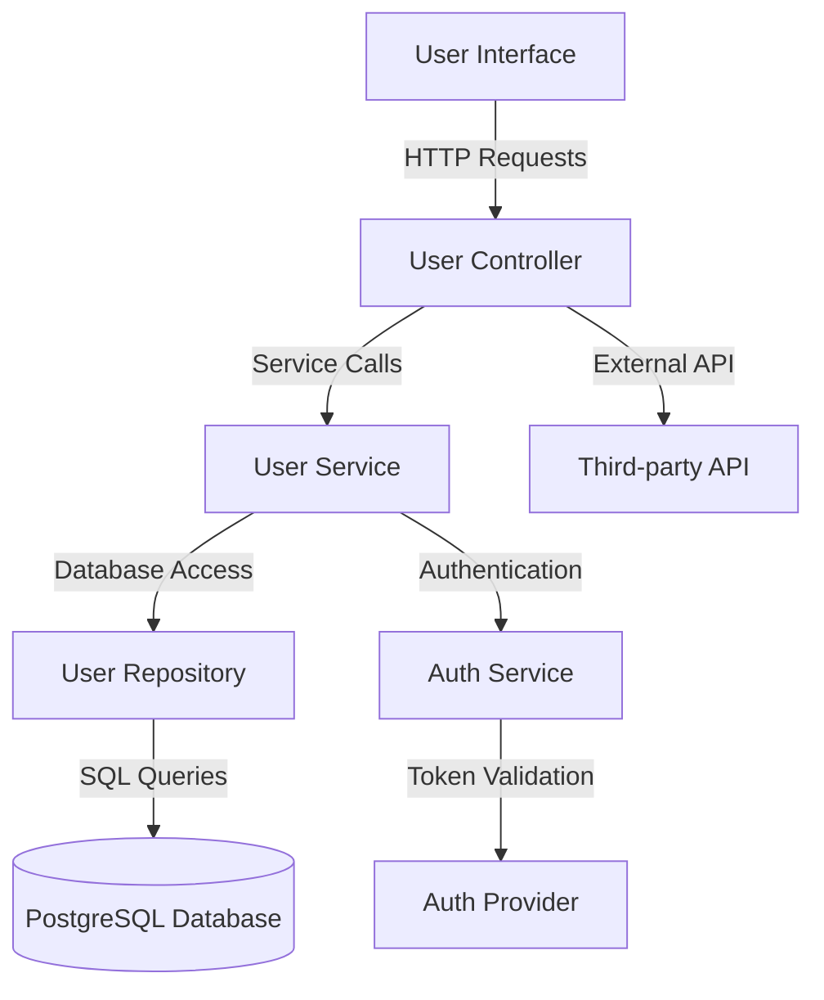

# Testing Standards — Spring Boot

## Overview and scope

The purpose of this document is to establish comprehensive testing standards for Spring Boot applications at Xentic. These standards are designed to ensure a consistent, high-quality codebase across all services, facilitate collaboration among engineering teams, and enhance the reliability of our software products. 

### Audience
This document is intended for:
- Software Engineers
- Quality Assurance Engineers
- Technical Leads
- DevOps Engineers

### Scope
This standard applies to all Spring Boot applications developed within Xentic. It encompasses:
- Unit Testing
- Integration Testing
- Contract Testing
- End-to-End Testing

### Non-goals
This document does NOT cover:
- Testing methodologies for non-Spring Boot applications
- Manual testing processes
- User acceptance testing (UAT) procedures

### Glossary
| Term               | Definition                                                                 |
|--------------------|-----------------------------------------------------------------------------|
| Unit Test          | A test that verifies the correctness of a small, isolated piece of code.    |
| Integration Test    | A test that checks the interaction between different modules or services.   |
| Contract Test      | A test that ensures that two services can communicate correctly based on a predefined contract. |
| Testcontainers     | A Java library that provides lightweight, throwaway instances of common databases and services for testing. |
| Mocking            | The process of simulating the behavior of complex objects in tests.         |

### How This Standard Fits the Xentic Platform
These testing standards are critical to maintaining the integrity and quality of the Xentic platform. By adhering to these guidelines, engineering teams can:
- Achieve a minimum of 80% line coverage on service layers, ensuring robust unit testing.
- Validate all repository methods and controller endpoints through integration tests.
- Ensure that external API integrations are reliable and conform to expected contracts using Pact.

### Coverage Requirements
| Test Type          | Requirement                                                      |
|--------------------|------------------------------------------------------------------|
| Unit tests         | Minimum 80% line coverage on service layer                       |
| Integration tests   | All repository methods and controller endpoints                  |
| Contract tests     | All external API integrations (Pact)                             |

### Example Code Snippets

#### Unit Testing (JUnit 5 + Mockito)
```java
@ExtendWith(MockitoExtension.class)
class UserServiceTest {
    @Mock private UserRepository userRepository;
    @InjectMocks private UserServiceImpl userService;

    @Test
    void findById_WhenUserExists_ReturnsUserResponse() {
        UUID id = UUID.randomUUID();
        User user = User.builder().id(id).email("test@xentic.com").build();
        when(userRepository.findById(id)).thenReturn(Optional.of(user));

        UserResponse result = userService.findById(id);
        assertThat(result.email()).isEqualTo("test@xentic.com");
    }
}
```

#### Integration Testing (Testcontainers)
```java
@SpringBootTest
@Testcontainers
class UserRepositoryIntegrationTest {
    @Container
    static PostgreSQLContainer<?> postgres = new PostgreSQLContainer<>("postgres:15");

    @DynamicPropertySource
    static void props(DynamicPropertyRegistry r) {
        r.add("spring.datasource.url", postgres::getJdbcUrl);
    }

    @Autowired private UserRepository userRepository;

    @Test
    void save_AndFindById_Works() {
        User user = User.builder().email("test@xentic.com").build();
        User saved = userRepository.save(user);
        assertThat(userRepository.findById(saved.getId())).isPresent();
    }
}
```

#### Controller Slice Tests
```java
@WebMvcTest(UserController.class)
class UserControllerTest {
    @Autowired MockMvc mockMvc;
    @MockBean UserService userService;

    @Test
    void getUser_Returns200() throws Exception {
        UUID id = UUID.randomUUID();
        when(userService.findById(id)).thenReturn(new UserResponse(id, "a@xentic.com"));
        mockMvc.perform(get("/api/v1/users/" + id))
            .andExpect(status().isOk())
            .andExpect(jsonPath("$.email").value("a@xentic.com"));
    }
}

## Standards and policies

1. **MUST** use JUnit 5 as the testing framework for all unit and integration tests. This aligns with the latest standards and provides enhanced features over previous versions.

2. **MUST** utilize Mockito for mocking dependencies in unit tests. This is essential for isolating the unit under test and ensuring that tests are fast and reliable.

3. **SHOULD** aim for a minimum of 80% code coverage for all service layers. This ensures that the majority of the code is tested and reduces the likelihood of undetected bugs.

4. **MUST NOT** include any production code in test classes. Test classes should solely contain test logic and should not import or reference any production classes directly.

5. **MUST** implement integration tests for all repository methods and controller endpoints to validate the interactions between components and ensure they function correctly in a real environment.

6. **SHOULD** use Testcontainers for integration tests that require a database or external service. This allows for a clean, isolated environment for each test run.

7. **MUST** use meaningful test names that clearly describe the behavior being tested. This enhances readability and maintainability of the test suite.

8. **MUST NOT** use static imports in test classes unless absolutely necessary. This helps maintain clarity in the test code and avoids confusion about where assertions and methods are coming from.

9. **SHOULD** group related tests into test classes based on functionality. This organization improves the structure of the test suite and makes it easier to navigate.

10. **MUST** use the `@SpringBootTest` annotation for integration tests to load the full application context, ensuring that the tests run in an environment that closely resembles production.

11. **MUST NOT** rely on sleep or wait statements to handle asynchronous operations in tests. Instead, use appropriate synchronization mechanisms or testing utilities provided by the framework.

12. **SHOULD** leverage the `@DynamicPropertySource` annotation to set dynamic properties for integration tests, ensuring that tests can run against different configurations without hardcoding values.

13. **MUST** document all test cases with clear comments explaining the purpose and expected outcomes. This aids future developers in understanding the intent behind each test.

14. **SHOULD** use parameterized tests where applicable to reduce duplication and improve test coverage for similar scenarios. This can be achieved using `@ParameterizedTest` in JUnit 5.

15. **MUST** ensure that all tests are run in a CI/CD pipeline to catch issues early in the development process. This practice promotes a culture of quality and accountability.

16. **MUST NOT** commit code that has failing tests to the main branch. All tests must pass before merging changes to ensure the stability of the codebase.

17. **SHOULD** regularly review and refactor tests to improve readability and maintainability. This ensures that the test suite remains relevant as the application evolves.

18. **MUST** use assertions from the `org.assertj.core.api.Assertions` package for better readability and expressive assertions in tests.

19. **MUST NOT** hardcode values in tests. Instead, use constants or factory methods to create test data, promoting reusability and reducing maintenance overhead.

20. **SHOULD** utilize contract testing (e.g., Pact) for external API integrations to ensure that service contracts are honored and to prevent breaking changes.

### Example Configuration for Testcontainers
```yaml
testcontainers:
  enabled: true
  postgres:
    image: postgres:15
    username: test
    password: test
    database: test_db
```

### Example SQL for Test Data Setup
```sql
INSERT INTO users (id, email) VALUES (UUID(), 'test@xentic.com');
```

### Example Parameterized Test
```java
@ParameterizedTest
@ValueSource(strings = {"test@xentic.com", "example@xentic.com"})
void validateEmailFormat(String email) {
    assertTrue(EmailValidator.isValid(email));
}
```

By adhering to these standards and policies, Xentic ensures a robust and maintainable testing framework that supports the development of high-quality software.

## Architecture and design

### Component Diagram



### Data Flows

- **User Interface to User Controller**: The user interface sends HTTP requests to the User Controller for operations like creating or retrieving user data.
- **User Controller to User Service**: The User Controller invokes methods on the User Service to handle business logic.
- **User Service to User Repository**: The User Service interacts with the User Repository to perform CRUD operations on the database.
- **User Service to Auth Service**: The User Service communicates with the Auth Service for user authentication and authorization.
- **User Repository to PostgreSQL Database**: The User Repository executes SQL queries against the PostgreSQL database to persist or retrieve user data.
- **User Controller to Third-party API**: The User Controller may call external APIs for additional data or services, such as sending notifications.

### Integration Points

| Component          | Integration Point                      | Description                                                   |
|--------------------|---------------------------------------|---------------------------------------------------------------|
| User Controller     | User Service                          | Direct method calls for business logic processing.            |
| User Service        | User Repository                       | CRUD operations to manage user data in the database.          |
| User Service        | Auth Service                          | Authentication and authorization checks.                      |
| User Repository     | PostgreSQL Database                   | SQL queries for data persistence and retrieval.               |
| User Controller     | Third-party API                      | HTTP requests to external services for additional functionality.|

### Failure Domains

- **User Interface**: If the user interface fails, users cannot interact with the system, leading to a complete service outage.
- **User Controller**: Failures here may prevent requests from reaching the service layer, resulting in HTTP errors.
- **User Service**: Business logic failures can lead to incorrect processing of user data or unauthorized access.
- **User Repository**: Database connection issues or SQL errors can prevent data access and manipulation.
- **Auth Service**: Authentication failures can block user access, impacting user experience and security.
- **Third-party API**: Dependency on external services can introduce latency or failures, affecting the overall functionality of the application.

### Example Configuration for Application Properties

```properties
# Database Configuration
spring.datasource.url=jdbc:postgresql://localhost:5432/test_db
spring.datasource.username=test
spring.datasource.password=test
spring.jpa.hibernate.ddl-auto=update

# Testcontainers Configuration
testcontainers.enabled=true
```

### Example SQL for User Table Creation

```sql
CREATE TABLE users (
    id UUID PRIMARY KEY DEFAULT gen_random_uuid(),
    email VARCHAR(255) UNIQUE NOT NULL,
    created_at TIMESTAMP DEFAULT CURRENT_TIMESTAMP
);
```

### Example Code for User Service

```java
@Service
public class UserServiceImpl implements UserService {
    private final UserRepository userRepository;
    private final AuthService authService;

    @Autowired
    public UserServiceImpl(UserRepository userRepository, AuthService authService) {
        this.userRepository = userRepository;
        this.authService = authService;
    }

    @Override
    public UserResponse findById(UUID id) {
        User user = userRepository.findById(id)
            .orElseThrow(() -> new UserNotFoundException("User not found"));
        return new UserResponse(user.getId(), user.getEmail());
    }
}
```

By adhering to these architectural and design standards, Xentic ensures that the system is robust, maintainable, and scalable, allowing for efficient integration and testing practices.

## Configuration reference

### application.yml Example

```yaml
spring:
  datasource:
    url: jdbc:postgresql://localhost:5432/test_db
    username: test
    password: test
    driver-class-name: org.postgresql.Driver
  jpa:
    hibernate:
      ddl-auto: update
    show-sql: true

testcontainers:
  enabled: true
  postgres:
    image: postgres:15
    username: test
    password: test
    database: test_db
```

### Terraform Configuration for Infrastructure

```hcl
resource "aws_db_instance" "test_db" {
  identifier              = "test-db"
  engine                 = "postgres"
  instance_class         = "db.t3.micro"
  allocated_storage       = 20
  username               = "test"
  password               = "test"
  db_name                = "test_db"
  skip_final_snapshot    = true
  publicly_accessible     = false

  tags = {
    Name = "TestDB"
  }
}
```

### Environment Variables Table

| Variable Name                    | Default Value                      | Production Value                    |
|----------------------------------|-----------------------------------|-------------------------------------|
| `SPRING_DATASOURCE_URL`         | `jdbc:postgresql://localhost:5432/test_db` | `jdbc:postgresql://prod-db:5432/prod_db` |
| `SPRING_DATASOURCE_USERNAME`     | `test`                            | `prod_user`                         |
| `SPRING_DATASOURCE_PASSWORD`     | `test`                            | `prod_password`                     |
| `SPRING_JPA_HIBERNATE_DDL_AUTO`  | `update`                         | `none`                              |
| `TESTCONTAINERS_ENABLED`         | `true`                            | `false`                             |

### Example SQL for Test Data Setup

```sql
INSERT INTO users (id, email) VALUES (UUID(), 'test@xentic.com');
INSERT INTO users (id, email) VALUES (UUID(), 'example@xentic.com');
```

### Example Properties for Local Development

```properties
# Local Database Configuration
spring.datasource.url=jdbc:postgresql://localhost:5432/test_db
spring.datasource.username=test
spring.datasource.password=test
spring.jpa.hibernate.ddl-auto=update
```

### Example Properties for Production

```properties
# Production Database Configuration
spring.datasource.url=jdbc:postgresql://prod-db:5432/prod_db
spring.datasource.username=prod_user
spring.datasource.password=prod_password
spring.jpa.hibernate.ddl-auto=none
```

### Example Environment Variable Configuration

```bash
export SPRING_DATASOURCE_URL=jdbc:postgresql://prod-db:5432/prod_db
export SPRING_DATASOURCE_USERNAME=prod_user
export SPRING_DATASOURCE_PASSWORD=prod_password
export SPRING_JPA_HIBERNATE_DDL_AUTO=none
```

By following the configuration standards outlined above, Xentic ensures a consistent and reliable setup for both development and production environments, facilitating easier maintenance and deployment processes.

## Implementation guide

To ensure effective testing in a Spring Boot application at Xentic, the following implementation guide outlines the necessary steps, code examples, and best practices.

### Step 1: Set Up Your Test Dependencies

Add the following dependencies to your `pom.xml` for JUnit 5, Mockito, and Testcontainers:

```xml
<dependency>
    <groupId>org.springframework.boot</groupId>
    <artifactId>spring-boot-starter-test</artifactId>
    <scope>test</scope>
</dependency>
<dependency>
    <groupId>org.mockito</groupId>
    <artifactId>mockito-core</artifactId>
    <scope>test</scope>
</dependency>
<dependency>
    <groupId>org.testcontainers</groupId>
    <artifactId>junit-jupiter</artifactId>
    <scope>test</scope>
</dependency>
<dependency>
    <groupId>org.testcontainers</groupId>
    <artifactId>postgresql</artifactId>
    <scope>test</scope>
</dependency>
```

### Step 2: Create a Test Class for UserService

Create a test class for the `UserService` implementation. This class will use Mockito to mock dependencies and Testcontainers to manage the database.

```java
import com.xentic.common.exception.UserNotFoundException;
import com.xentic.user.service.UserService;
import com.xentic.user.service.UserServiceImpl;
import com.xentic.user.repository.UserRepository;
import com.xentic.user.model.User;
import org.junit.jupiter.api.BeforeEach;
import org.junit.jupiter.api.Test;
import org.mockito.InjectMocks;
import org.mockito.Mock;
import org.mockito.MockitoAnnotations;
import org.springframework.beans.factory.annotation.Autowired;
import org.springframework.boot.test.context.SpringBootTest;
import org.springframework.test.context.ActiveProfiles;

import java.util.Optional;
import java.util.UUID;

import static org.junit.jupiter.api.Assertions.*;
import static org.mockito.Mockito.*;

@SpringBootTest
@ActiveProfiles("test")
class UserServiceTest {

    @Mock
    private UserRepository userRepository;

    @InjectMocks
    private UserServiceImpl userService;

    private User testUser;

    @BeforeEach
    void setUp() {
        MockitoAnnotations.openMocks(this);
        testUser = new User(UUID.randomUUID(), "test@xentic.com");
    }

    @Test
    void testFindById_UserExists() {
        when(userRepository.findById(testUser.getId())).thenReturn(Optional.of(testUser));
        
        User foundUser = userService.findById(testUser.getId());
        
        assertEquals(testUser.getEmail(), foundUser.getEmail());
        verify(userRepository, times(1)).findById(testUser.getId());
    }

    @Test
    void testFindById_UserNotFound() {
        when(userRepository.findById(testUser.getId())).thenReturn(Optional.empty());

        assertThrows(UserNotFoundException.class, () -> userService.findById(testUser.getId()));
        verify(userRepository, times(1)).findById(testUser.getId());
    }
}
```

### Step 3: Configure Testcontainers for Integration Tests

Create a base test class to configure Testcontainers for integration tests.

```java
import org.junit.jupiter.api.AfterAll;
import org.junit.jupiter.api.BeforeAll;
import org.springframework.boot.test.context.SpringBootTest;
import org.testcontainers.containers.PostgreSQLContainer;

@SpringBootTest
public abstract class BaseIntegrationTest {

    private static PostgreSQLContainer<?> postgresContainer;

    @BeforeAll
    static void setup() {
        postgresContainer = new PostgreSQLContainer<>("postgres:15")
                .withDatabaseName("test_db")
                .withUsername("test")
                .withPassword("test");
        postgresContainer.start();
    }

    @AfterAll
    static void teardown() {
        postgresContainer.stop();
    }

    public static String getJdbcUrl() {
        return postgresContainer.getJdbcUrl();
    }

    public static String getUsername() {
        return postgresContainer.getUsername();
    }

    public static String getPassword() {
        return postgresContainer.getPassword();
    }
}
```

### Step 4: Create an Integration Test for User Service

Now, create an integration test that uses the `BaseIntegrationTest` class.

```java
import com.xentic.user.service.UserService;
import org.junit.jupiter.api.Test;
import org.springframework.beans.factory.annotation.Autowired;
import org.springframework.boot.test.autoconfigure.jdbc.AutoConfigureTestDatabase;
import org.springframework.boot.test.context.SpringBootTest;

import static org.junit.jupiter.api.Assertions.assertNotNull;

@SpringBootTest
@AutoConfigureTestDatabase(replace = AutoConfigureTestDatabase.Replace.NONE)
class UserServiceIntegrationTest extends BaseIntegrationTest {

    @Autowired
    private UserService userService;

    @Test
    void testUserServiceBean() {
        assertNotNull(userService);
    }
}
```

### Step 5: Run Your Tests

You can run your tests using your IDE or via the command line with Maven:

```bash
mvn clean test
```

### Summary of Best Practices

- **Use Mocking**: Always mock dependencies in unit tests to isolate the class under test.
- **Use Testcontainers for Integration Tests**: This allows you to run tests against a real database without polluting your local environment.
- **Follow Naming Conventions**: Name your test classes clearly to reflect the functionality being tested (e.g., `UserServiceTest`).
- **Organize Tests**: Group your tests logically by functionality or feature to maintain clarity.

By following this implementation guide, Xentic ensures a comprehensive testing strategy that enhances code quality and reliability.

## Security requirements

To maintain the integrity and security of applications developed at Xentic, the following security requirements must be adhered to:

### Threat Model Summary

- **Identify Assets**: Determine critical assets such as user data, authentication tokens, and sensitive configurations.
- **Identify Threats**: Common threats include unauthorized access, data breaches, and injection attacks.
- **Assess Vulnerabilities**: Regularly evaluate the application for vulnerabilities using tools like OWASP ZAP or Snyk.
- **Mitigation Strategies**: Implement security measures such as encryption, input validation, and regular security audits.

### Authentication and Authorization (Authn/z)

- **Use Spring Security**: All applications MUST integrate Spring Security for authentication and authorization.
- **OAuth2 and JWT**: Implement OAuth2 for authorization and use JWT for secure token management.
- **Role-Based Access Control (RBAC)**: Define roles and permissions clearly. Access to resources MUST be restricted based on user roles.

Example configuration for Spring Security:

```java
@EnableWebSecurity
public class SecurityConfig extends WebSecurityConfigurerAdapter {

    @Override
    protected void configure(HttpSecurity http) throws Exception {
        http
            .authorizeRequests()
            .antMatchers("/public/**").permitAll()
            .anyRequest().authenticated()
            .and()
            .oauth2ResourceServer()
            .jwt();
    }
}
```

### Secrets Management

- **Environment Variables**: Secrets such as API keys, database passwords, and encryption keys MUST NOT be hardcoded in the application code.
- **Use Vault or AWS Secrets Manager**: Store sensitive information securely using tools like HashiCorp Vault or AWS Secrets Manager.
- **Configuration Example**: Access secrets in your application via environment variables.

Example of accessing secrets in `application.yml`:

```yaml
spring:
  datasource:
    url: ${SPRING_DATASOURCE_URL}
    username: ${SPRING_DATASOURCE_USERNAME}
    password: ${SPRING_DATASOURCE_PASSWORD}
```

### Input Validation

- **Validate All Inputs**: All user inputs MUST be validated to prevent injection attacks and ensure data integrity.
- **Use Spring’s Validation Framework**: Leverage annotations like `@Valid` and `@NotNull` to enforce validation rules.

Example of input validation in a controller:

```java
@PostMapping("/users")
public ResponseEntity<User> createUser(@Valid @RequestBody User user) {
    User createdUser = userService.createUser(user);
    return ResponseEntity.status(HttpStatus.CREATED).body(createdUser);
}
```

### Audit Logging

- **Implement Audit Logging**: All sensitive actions (e.g., login attempts, data changes) MUST be logged for audit purposes.
- **Use Spring AOP for Logging**: Utilize Aspect-Oriented Programming (AOP) to intercept methods and log actions.

Example of an audit logging aspect:

```java
@Aspect
@Component
public class AuditAspect {

    @Before("execution(* com.xentic..*(..))")
    public void logBefore(JoinPoint joinPoint) {
        // Log method execution details
        String methodName = joinPoint.getSignature().getName();
        String className = joinPoint.getTarget().getClass().getSimpleName();
        System.out.println("Executing method: " + className + "." + methodName);
    }
}
```

### Summary of Security Best Practices

- **Regular Security Audits**: Conduct regular security audits and vulnerability assessments.
- **Keep Dependencies Updated**: Regularly update dependencies to mitigate known vulnerabilities.
- **Educate Developers**: Ensure all developers are trained in secure coding practices.
- **Incident Response Plan**: Develop and maintain an incident response plan for security breaches.

By adhering to these security requirements, Xentic ensures that applications are robust against threats and vulnerabilities, safeguarding sensitive data and maintaining user trust.

## Testing strategy

At Xentic, a comprehensive testing strategy is essential for maintaining high-quality software. The strategy encompasses unit tests, integration tests, and contract tests, each serving a distinct purpose in the software development lifecycle.

### Unit Tests

Unit tests are designed to validate the functionality of individual components in isolation. They should cover all public methods and critical paths through the code.

- **Coverage Target**: Aim for at least 80% code coverage for unit tests.
- **Tools**: Use JUnit 5 and Mockito for writing unit tests.

Example unit test class:

```java
import static org.mockito.Mockito.*;
import static org.junit.jupiter.api.Assertions.*;

class OrderServiceTest {

    @Mock
    private OrderRepository orderRepository;

    @InjectMocks
    private OrderServiceImpl orderService;

    @BeforeEach
    void setUp() {
        MockitoAnnotations.openMocks(this);
    }

    @Test
    void testCreateOrder() {
        Order order = new Order("123", 100.0);
        when(orderRepository.save(any(Order.class))).thenReturn(order);
        
        Order createdOrder = orderService.createOrder(order);
        
        assertNotNull(createdOrder);
        assertEquals("123", createdOrder.getId());
        verify(orderRepository, times(1)).save(order);
    }
}
```

### Integration Tests

Integration tests validate the interaction between components and external systems, such as databases and APIs.

- **Coverage Target**: Aim for at least 70% code coverage for integration tests.
- **Tools**: Use Spring Boot Test and Testcontainers for database interactions.

Example integration test class:

```java
import org.junit.jupiter.api.Test;
import org.springframework.beans.factory.annotation.Autowired;
import org.springframework.boot.test.context.SpringBootTest;

import static org.junit.jupiter.api.Assertions.assertNotNull;

@SpringBootTest
class PaymentServiceIntegrationTest extends BaseIntegrationTest {

    @Autowired
    private PaymentService paymentService;

    @Test
    void testPaymentServiceBean() {
        assertNotNull(paymentService);
    }
}
```

### Contract Tests

Contract tests ensure that the interactions between services adhere to agreed-upon contracts, which is crucial for microservices architecture.

- **Tools**: Use Pact or Spring Cloud Contract.
- **Coverage Target**: All APIs should have corresponding contract tests.

Example contract test configuration (Pact):

```java
@Pact(consumer = "ConsumerService", provider = "ProviderService")
public RequestResponsePact createPact(PactDslWithProvider builder) {
    return builder
        .given("Provider is available")
        .uponReceiving("A request for user data")
        .path("/users/1")
        .method("GET")
        .willRespondWith()
        .status(200)
        .body("{\"id\":1,\"name\":\"John Doe\"}")
        .toPact();
}
```

### Summary of Testing Best Practices

| Test Type         | Coverage Target | Tools                      |
|-------------------|-----------------|----------------------------|
| Unit Tests        | 80%             | JUnit 5, Mockito           |
| Integration Tests | 70%             | Spring Boot Test, Testcontainers |
| Contract Tests    | 100%            | Pact, Spring Cloud Contract |

- **Isolate Tests**: Unit tests MUST isolate the unit of work by mocking dependencies.
- **Use Realistic Data**: Integration tests SHOULD use realistic data and configurations to simulate production environments.
- **Automate Testing**: All tests MUST be automated and run as part of the CI/CD pipeline.
- **Review Test Coverage**: Regularly review test coverage reports to identify untested areas.

By implementing this testing strategy, Xentic ensures that software is rigorously tested, leading to higher quality and reliability in production environments.

## Observability and operations

To ensure effective monitoring and operational excellence at Xentic, the following observability and operations standards MUST be implemented across all Spring Boot applications.

### Metrics

- **Application Metrics**: Collect application-level metrics such as request counts, error rates, and response times using Micrometer.
- **System Metrics**: Monitor JVM metrics, memory usage, and garbage collection statistics.
- **Custom Metrics**: Define and expose custom metrics relevant to the business logic.

Example configuration in `application.yml` for Micrometer:

```yaml
management:
  metrics:
    export:
      prometheus:
        enabled: true
```

### Logs

- **Structured Logging**: All logs MUST be structured (JSON format preferred) to facilitate searching and filtering.
- **Log Levels**: Use appropriate log levels (DEBUG, INFO, WARN, ERROR) based on the severity of the messages.
- **Centralized Logging**: All logs MUST be sent to a centralized logging system (e.g., ELK Stack, Splunk).

Example logging configuration in `logback-spring.xml`:

```xml
<configuration>
    <appender name="FILE" class="ch.qos.logback.core.FileAppender">
        <file>logs/app.log</file>
        <encoder>
            <pattern>%d{yyyy-MM-dd HH:mm:ss} %-5level [%thread] %logger{36} - %msg%n</pattern>
        </encoder>
    </appender>

    <root level="INFO">
        <appender-ref ref="FILE" />
    </root>
</configuration>
```

### Traces

- **Distributed Tracing**: Implement distributed tracing using Spring Cloud Sleuth to track requests across microservices.
- **Trace Data**: Capture trace data for all incoming requests and outgoing service calls.

Example configuration for Spring Cloud Sleuth in `application.yml`:

```yaml
spring:
  sleuth:
    sampler:
      probability: 1.0
```

### Dashboards

- **Visualization**: Create dashboards using Grafana or Kibana to visualize metrics and logs.
- **Key Metrics**: Include key metrics such as latency, error rates, and throughput on the dashboards.
- **Alerts**: Set up alerts based on metrics thresholds to proactively address issues.

### Alerts

- **Alerting Strategy**: Define alerting rules based on critical metrics (e.g., error rates exceeding 5%).
- **Notification Channels**: Use notification channels such as Slack, email, or PagerDuty for alerting on-call engineers.

Example alert configuration in Prometheus:

```yaml
groups:
  - name: application-alerts
    rules:
      - alert: HighErrorRate
        expr: rate(http_requests_total{status="500"}[5m]) > 0.05
        for: 10m
        labels:
          severity: critical
        annotations:
          summary: "High error rate detected"
          description: "Error rate is above 5% for the last 10 minutes."
```

### Service Level Objectives (SLOs)

- **Define SLOs**: Establish SLOs for key performance indicators such as availability, latency, and error rate.
- **Monitoring SLOs**: Monitor SLOs continuously and report on adherence to these objectives.

Example SLO definition:

| SLO Name           | Objective          | Measurement Period |
|--------------------|-------------------|---------------------|
| Availability        | 99.9% uptime      | Monthly             |
| Error Rate          | < 1%              | Daily               |
| Response Time       | < 200ms           | Monthly             |

### On-call Runbook Steps

In the event of an incident, the following on-call runbook steps MUST be followed:

1. **Acknowledge Alert**: Acknowledge the alert within 5 minutes.
2. **Assess Impact**: Determine the impact of the issue on users and business operations.
3. **Investigate Logs**: Check centralized logging system for relevant logs and errors.
4. **Review Metrics**: Analyze metrics dashboards for anomalies.
5. **Communicate**: Update stakeholders on the status and expected resolution time.
6. **Implement Fix**: Apply necessary fixes or workarounds.
7. **Post-Incident Review**: Conduct a post-incident review to identify root causes and preventive measures.

By adhering to these observability and operations standards, Xentic ensures that applications are monitored effectively, enabling quick identification and resolution of issues, ultimately leading to enhanced reliability and performance.

## Migration and versioning

At Xentic, managing migration and versioning for Spring Boot applications is critical to ensure stability, maintainability, and backward compatibility. The following guidelines MUST be adhered to during the migration process.

### Upgrade Paths

1. **Major Version Upgrades**: 
   - Follow a defined upgrade path for major version changes (e.g., from Spring Boot 2.x to 3.x).
   - Review release notes for breaking changes and deprecated features.
   - Conduct thorough testing after each major upgrade.

2. **Minor Version Upgrades**:
   - Minor version upgrades (e.g., from 2.5 to 2.6) should be applied regularly to benefit from bug fixes and improvements.
   - Ensure that the application is backward compatible with the previous minor version.

3. **Patch Version Upgrades**:
   - Patch versions (e.g., 2.5.1 to 2.5.2) should be applied as soon as possible to address security vulnerabilities and critical bugs.

### Deprecation Policy

- **Deprecation Notices**: All deprecated features MUST be documented in the release notes.
- **Grace Period**: Deprecated features will remain in the codebase for at least one major release cycle before removal.
- **Alternatives**: Provide clear alternatives for deprecated features to guide developers in transitioning.

### Backward Compatibility

- **API Changes**: Any changes to public APIs MUST maintain backward compatibility. If changes are necessary, version the API (e.g., v1, v2).
- **Configuration Changes**: Configuration properties MUST be backward compatible. New properties should be added without removing existing ones.

Example of maintaining backward compatibility in `application.yml`:

```yaml
# Old configuration
server:
  port: 8080

# New configuration with additional properties
server:
  port: 8080
  ssl:
    enabled: true
```

### Rollback Procedures

1. **Version Control**: All changes MUST be committed to version control (e.g., Git) with clear commit messages.
2. **Backup**: Create backups of the database and application state before performing any upgrades.
3. **Rollback Steps**:
   - If an upgrade fails, revert to the previous stable version using version control.
   - Restore the database backup if necessary.
   - Validate the rollback by running integration tests.

4. **Rollback Example**: To rollback a deployment in Kubernetes, use the following command:

```bash
kubectl rollout undo deployment/my-app
```

### Migration Steps

1. **Assess Impact**: Evaluate the impact of the migration on existing services and dependencies.
2. **Plan Migration**: Create a detailed migration plan, including timelines and resources needed.
3. **Testing**: Conduct thorough testing in a staging environment that mirrors production.
4. **Deploy**: Deploy the migration in a controlled manner, preferably during low-traffic periods.
5. **Monitor**: After deployment, closely monitor application performance and error rates.

### Summary of Migration and Versioning Best Practices

| Aspect                | Guidelines                                              |
|-----------------------|--------------------------------------------------------|
| Upgrade Paths         | Follow defined paths for major, minor, and patch upgrades. |
| Deprecation Policy     | Document deprecations; provide alternatives.           |
| Backward Compatibility | Maintain compatibility; version APIs as needed.       |
| Rollback Procedures    | Use version control; backup before upgrades.          |
| Migration Steps       | Assess, plan, test, deploy, and monitor.              |

By following these migration and versioning standards, Xentic ensures that applications remain stable and reliable throughout their lifecycle, minimizing disruption during upgrades and maintaining a high level of service for users.

## FAQ, anti-patterns, and checklists

### FAQ

1. **What testing frameworks should be used in Spring Boot applications?**
   - You MUST use JUnit 5 for unit testing and Mockito for mocking dependencies. For integration tests, Spring Test should be utilized.

2. **How should configuration properties be managed?**
   - Configuration properties MUST be externalized using `application.yml` or `application.properties`. Sensitive data MUST be managed using environment variables or a secrets management service.

3. **What is the recommended way to handle exceptions?**
   - You MUST implement a global exception handler using `@ControllerAdvice` to manage exceptions consistently across the application.

4. **How can I ensure my tests are isolated?**
   - Tests MUST be isolated by using in-memory databases (e.g., H2) and mocking external services to prevent dependencies on external systems.

5. **What should be included in a test case?**
   - Each test case MUST include a clear description, setup, execution, and assertions to verify expected outcomes.

6. **How often should tests be run?**
   - Tests MUST be run automatically on every code commit through a CI/CD pipeline to ensure that new changes do not break existing functionality.

7. **What is the purpose of integration testing?**
   - Integration tests MUST verify that different components of the application work together as expected, covering interactions with databases, external APIs, and other services.

8. **How is code coverage measured?**
   - Code coverage MUST be measured using tools like JaCoCo, and a minimum coverage threshold of 80% SHOULD be maintained.

9. **What should I do if a test fails?**
   - You MUST investigate the cause of the failure, fix the underlying issue, and ensure that the test case accurately reflects the expected behavior.

10. **How can I test asynchronous methods?**
    - You SHOULD use `@Async` and `CompletableFuture` in your code, and leverage `@SpringBootTest` with `@TestExecutionListeners` to test asynchronous behavior effectively.

### Anti-patterns

| Anti-pattern                     | Description                                                                                          |
|----------------------------------|------------------------------------------------------------------------------------------------------|
| Hardcoded Values                 | Configuration values MUST NOT be hardcoded in the codebase; use external configuration instead.      |
| Ignoring Test Coverage           | Failing to maintain adequate test coverage MUST NOT be tolerated; aim for at least 80%.             |
| Overusing Mocking                | Excessive mocking of dependencies can lead to fragile tests; use real instances where appropriate.   |
| Testing Implementation Details    | Tests MUST focus on behavior rather than implementation details to ensure they remain valid over time. |
| Large Test Classes               | Test classes MUST be small and focused on single responsibilities to enhance readability and maintainability. |
| Lack of Documentation            | Tests MUST be well-documented with clear descriptions and comments to facilitate understanding.      |

### Pre-merge Checklist

- [ ] Ensure all unit and integration tests are passing.
- [ ] Verify that code coverage is above the minimum threshold (80%).
- [ ] Check for adherence to coding standards and best practices.
- [ ] Ensure that all new features are documented in the relevant documentation.
- [ ] Run static analysis tools to identify potential issues.
- [ ] Confirm that no hardcoded values are present in the codebase.

### Production Checklist

- [ ] Verify that all tests have been run and passed.
- [ ] Ensure that the deployment package is built correctly and is free of errors.
- [ ] Confirm that configuration properties are set correctly for the production environment.
- [ ] Monitor application logs for any warnings or errors prior to deployment.
- [ ] Ensure that a rollback plan is in place and tested.
- [ ] Communicate the deployment schedule with all stakeholders.
