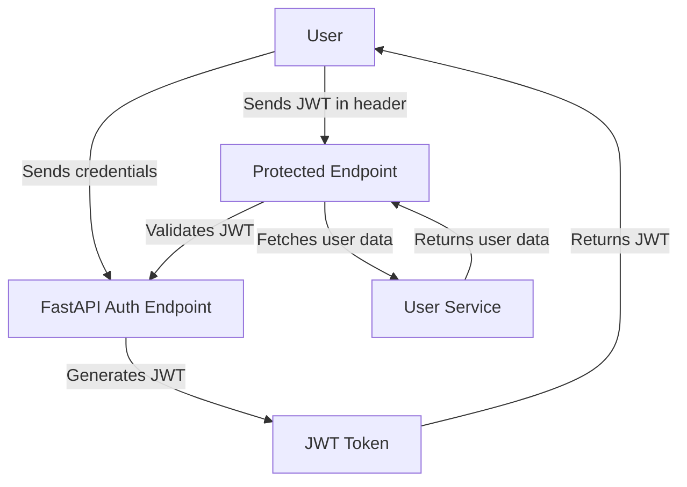

# Authentication — FastAPI JWT

## Overview and scope

The purpose of this document is to establish a comprehensive standard for implementing JWT-based authentication in FastAPI applications at Xentic. This standard aims to ensure consistency, security, and maintainability across all services that utilize FastAPI for their backend operations. 

### Audience
This document is intended for:
- Backend developers working with FastAPI.
- Architects and technical leads overseeing authentication implementations.
- Quality assurance teams responsible for testing authentication flows.

### Scope
This standard covers:
- The implementation of JWT for user authentication in FastAPI applications.
- Token creation, decoding, and validation processes.
- Dependency injection for securing endpoints.
- Guidelines for error handling and response formats.
- Configuration settings relevant to JWT authentication.

### Non-goals
This document does NOT cover:
- User registration processes.
- Authorization mechanisms beyond role-based access control.
- Detailed security practices unrelated to JWT, such as encryption of sensitive data or secure storage of private keys.

### Glossary
| Term          | Definition                                                                 |
|---------------|-----------------------------------------------------------------------------|
| JWT           | JSON Web Token, a compact, URL-safe means of representing claims to be transferred between two parties. |
| FastAPI       | A modern, fast (high-performance) web framework for building APIs with Python 3.7+ based on standard Python type hints. |
| OAuth2        | An open standard for access delegation commonly used for token-based authentication. |
| TokenData     | A data model representing user information contained within a JWT. |

### How this standard fits the Xentic platform
This authentication standard is aligned with Xentic's broader security and architectural principles. By adopting a consistent approach to JWT authentication across services, we enhance the security posture of our applications and streamline the development process. This standard is part of the Xentic platform's commitment to best practices in software development, ensuring that all services can interact securely and efficiently.

### Configuration Example
The following YAML configuration should be included in the application's settings:

```yaml
jwt:
  access_token_expire_minutes: 30
  private_key: "your-private-key"
  public_key: "your-public-key"
```

### Token Utilities
The following Python code demonstrates how to create and decode JWTs using the `jose` library:

```python
from jose import jwt, JWTError
from app.core.config import settings
from datetime import datetime, timedelta
from fastapi import HTTPException

def create_access_token(subject: str, roles: list[str]) -> str:
    expire = datetime.utcnow() + timedelta(minutes=settings.jwt.access_token_expire_minutes)
    return jwt.encode(
        {"sub": subject, "roles": roles, "exp": expire},
        settings.jwt.private_key, algorithm="RS256"
    )

def decode_token(token: str) -> dict:
    try:
        return jwt.decode(token, settings.jwt.public_key, algorithms=["RS256"])
    except JWTError as e:
        raise HTTPException(status_code=401, detail=str(e))
```

### Auth Dependency
The following code defines dependencies for securing FastAPI endpoints:

```python
from fastapi import Depends, HTTPException
from fastapi.security import OAuth2PasswordBearer

oauth2_scheme = OAuth2PasswordBearer(tokenUrl="/api/v1/auth/token")

async def get_current_user(token: str = Depends(oauth2_scheme)) -> TokenData:
    payload = decode_token(token)
    user_id = payload.get("sub")
    if not user_id:
        raise HTTPException(status_code=401, detail="Invalid token")
    return TokenData(user_id=user_id, roles=payload.get("roles", []))

async def require_admin(current_user: TokenData = Depends(get_current_user)):
    if "ADMIN" not in current_user.roles:
        raise HTTPException(status_code=403, detail="Admin access required")
    return current_user
```

### Usage
Here are examples of how to use the authentication utilities in FastAPI routes:

```python
from fastapi import APIRouter, Depends
from app.models import TokenData

router = APIRouter()

@router.get("/users/me")
async def get_me(current_user: TokenData = Depends(get_current_user)):
    return current_user

@router.delete("/users/{user_id}")
async def delete_user(user_id: UUID, _=Depends(require_admin)):
    await user_service.delete(user_id)
    return Response(status_code=204)
```

By adhering to this standard, Xentic aims to provide a robust authentication mechanism that can be easily integrated into various FastAPI services while maintaining high security and performance standards.

## Standards and policies

1. **MUST** use the package naming convention `com.xentic.<service>` for all FastAPI applications. This ensures consistency across the codebase and aligns with Xentic's organizational standards.

2. **MUST NOT** use hard-coded secrets or keys in the source code. All sensitive information, such as private keys, MUST be stored in environment variables or secure vaults.

3. **SHOULD** implement token expiration and revocation mechanisms. Tokens MUST have a defined expiration time, and there MUST be a strategy for revoking tokens when necessary.

4. **MUST** use the `RS256` algorithm for signing JWTs. This ensures a higher level of security compared to weaker algorithms like `HS256`.

5. **SHOULD** validate the JWT's signature and claims (e.g., expiration) before processing requests. This includes checking the `exp` claim to ensure the token is still valid.

6. **MUST** implement proper error handling for JWT-related exceptions. All endpoints that rely on JWT authentication MUST return appropriate HTTP status codes (e.g., 401 Unauthorized, 403 Forbidden).

7. **SHOULD** log authentication events, including successful and failed login attempts. This is crucial for monitoring and auditing purposes.

8. **MUST** use dependency injection for securing endpoints. All protected routes MUST utilize the `Depends` mechanism to enforce authentication and authorization.

9. **MUST NOT** expose sensitive user information in JWT payloads. Only include necessary claims such as user ID and roles.

10. **SHOULD** use HTTPS for all communications involving JWTs to prevent interception of tokens. Ensure that all FastAPI applications are served over SSL/TLS.

11. **MUST** provide a clear and consistent API response format for authentication errors. This includes returning error details in a structured manner, such as:

    ```json
    {
      "detail": "Invalid token"
    }
    ```

12. **SHOULD** implement rate limiting on authentication endpoints to mitigate brute-force attacks. This can be achieved using middleware or API gateway features.

13. **MUST** include unit tests for all authentication-related functionalities. Tests MUST cover token creation, decoding, and error handling scenarios.

14. **MUST NOT** allow unauthenticated access to any sensitive endpoints. All routes that handle user data or critical operations MUST be secured.

15. **SHOULD** document all authentication flows and configurations in the service's README or internal documentation. This ensures that new developers can quickly understand the authentication mechanisms in place.

16. **MUST** use consistent naming conventions for JWT-related functions and classes. For example, functions for creating tokens should be prefixed with `create_`, and those for decoding should be prefixed with `decode_`.

17. **SHOULD** use a centralized configuration management approach for managing JWT settings across services. This can be achieved through a shared configuration library or service.

18. **MUST** ensure that all JWT libraries used are actively maintained and have no known vulnerabilities. Regularly review and update dependencies as needed.

By adhering to these standards and policies, Xentic ensures that JWT-based authentication in FastAPI applications is secure, maintainable, and consistent across all services.

## Architecture and design

The architecture of the JWT authentication system in FastAPI at Xentic is designed to ensure scalability, security, and maintainability. Below is a component diagram followed by descriptions of data flows, integration points, and failure domains.



### Data Flows
1. **User Authentication Flow:**
   - The user sends their credentials (username and password) to the FastAPI authentication endpoint.
   - The endpoint validates the credentials against the user database.
   - Upon successful validation, a JWT is generated and returned to the user.

2. **Protected Resource Access Flow:**
   - The user includes the JWT in the Authorization header when making requests to protected endpoints.
   - The FastAPI application extracts the token and validates it.
   - If valid, the application fetches the user's information from the user service and processes the request.

### Integration Points
- **User Database:** The authentication service integrates with a user database (e.g., PostgreSQL) to validate user credentials.
- **User Service:** A separate microservice responsible for user data management, which can be called to fetch user details after JWT validation.
- **Logging Service:** Integration with a logging service to record authentication events for monitoring and auditing purposes.

### Failure Domains
- **Authentication Failure:** If the user provides invalid credentials, the authentication endpoint must return a 401 Unauthorized response.
- **Token Expiration:** If a token is expired, the protected endpoint must return a 401 Unauthorized response, prompting the user to re-authenticate.
- **Service Unavailability:** If the user service is down, the FastAPI application should handle the failure gracefully, returning a 503 Service Unavailable response.
- **Database Connectivity Issues:** If there are issues connecting to the user database, appropriate error handling must ensure that users receive a 500 Internal Server Error response without exposing sensitive information.

### Example SQL for User Validation
The following SQL query can be used to validate user credentials against the user database:

```sql
SELECT id, username, password_hash, roles 
FROM users 
WHERE username = :username;
```

### Example Error Handling
FastAPI provides a mechanism for handling exceptions gracefully. The following example demonstrates how to handle authentication errors:

```python
from fastapi import FastAPI, HTTPException

app = FastAPI()

@app.exception_handler(HTTPException)
async def http_exception_handler(request, exc):
    return JSONResponse(
        status_code=exc.status_code,
        content={"detail": exc.detail},
    )
```

By following this architecture and design, Xentic ensures that the JWT authentication mechanism is robust, secure, and capable of handling various failure scenarios effectively. This approach not only enhances user experience but also maintains the integrity and security of the system.

## Configuration reference

### application.yml

The `application.yml` file should contain the necessary configurations for JWT authentication. Below is a sample configuration with defaults and production values.

```yaml
jwt:
  secret_key: "your-default-secret-key" # MUST be stored securely in production
  algorithm: "RS256" # MUST use RS256 for signing JWTs
  access_token_expire_minutes: 30 # Token expiration time in minutes
  refresh_token_expire_days: 7 # Refresh token expiration time in days
  issuer: "https://auth.internal.xentic.io" # Issuer of the JWT
  audience: "https://api.internal.xentic.io" # Audience for the JWT
```

### Terraform Configuration

When deploying the application, the following Terraform configuration can be used to set up environment variables for JWT settings.

```hcl
resource "aws_lambda_function" "fastapi_auth" {
  function_name = "fastapi_auth"
  handler       = "app.handler"
  runtime       = "python3.8"

  environment = {
    JWT_SECRET_KEY                = "your-production-secret-key" # MUST be stored securely
    JWT_ALGORITHM                 = "RS256"
    JWT_ACCESS_TOKEN_EXPIRE_MINUTES = "30"
    JWT_REFRESH_TOKEN_EXPIRE_DAYS = "7"
    JWT_ISSUER                    = "https://auth.internal.xentic.io"
    JWT_AUDIENCE                  = "https://api.internal.xentic.io"
  }
}
```

### Environment Variables

The following table outlines the required environment variables for configuring JWT authentication. Ensure that production values are stored securely.

| Variable Name                          | Default Value                  | Production Value                      |
|----------------------------------------|--------------------------------|---------------------------------------|
| `JWT_SECRET_KEY`                      | "your-default-secret-key"     | "your-production-secret-key"         |
| `JWT_ALGORITHM`                       | "RS256"                        | "RS256"                               |
| `JWT_ACCESS_TOKEN_EXPIRE_MINUTES`    | "30"                           | "30"                                  |
| `JWT_REFRESH_TOKEN_EXPIRE_DAYS`      | "7"                            | "7"                                   |
| `JWT_ISSUER`                          | "https://auth.internal.xentic.io" | "https://auth.internal.xentic.io" |
| `JWT_AUDIENCE`                        | "https://api.internal.xentic.io" | "https://api.internal.xentic.io"   |

### Additional Configuration Notes

- **JWT_SECRET_KEY:** MUST be a strong secret key stored in a secure vault or environment variable. Never hard-code this value in your source code.
- **JWT_ALGORITHM:** MUST use `RS256` for signing tokens to ensure security.
- **Token Expiration:** Access tokens should have a short expiration time (e.g., 30 minutes) to minimize the risk of token theft. Refresh tokens can have a longer expiration time (e.g., 7 days) but MUST also be securely stored.
- **Issuer and Audience:** These values should reflect the actual issuer and audience of your application. This helps in validating the tokens correctly.

By following this configuration reference, Xentic ensures that JWT authentication is set up correctly and securely across all FastAPI services.

## Implementation guide

To implement JWT authentication in a FastAPI application, follow the steps outlined below. This guide includes full code examples for various components needed to set up the authentication system.

### Step 1: Install Required Packages

Ensure you have the necessary packages installed. You can do this using pip:

```bash
pip install fastapi uvicorn python-jose[cryptography] passlib[bcrypt] sqlalchemy
```

### Step 2: Create the User Model

Define a SQLAlchemy model for the user. This model will be used to interact with the user database.

```python
from sqlalchemy import Column, Integer, String
from sqlalchemy.ext.declarative import declarative_base

Base = declarative_base()

class User(Base):
    __tablename__ = "users"

    id = Column(Integer, primary_key=True, index=True)
    username = Column(String, unique=True, index=True)
    password_hash = Column(String)
    roles = Column(String)  # Comma-separated list of roles
```

### Step 3: Create the Authentication Utility

Create utility functions for hashing passwords and verifying them.

```python
from passlib.context import CryptContext

pwd_context = CryptContext(schemes=["bcrypt"], deprecated="auto")

def hash_password(password: str) -> str:
    return pwd_context.hash(password)

def verify_password(plain_password: str, hashed_password: str) -> bool:
    return pwd_context.verify(plain_password, hashed_password)
```

### Step 4: Create JWT Utility Functions

Define functions for creating and decoding JWT tokens.

```python
from datetime import datetime, timedelta
from jose import JWTError, jwt
from typing import Optional

SECRET_KEY = "your-default-secret-key"  # MUST be stored securely in production
ALGORITHM = "RS256"
ACCESS_TOKEN_EXPIRE_MINUTES = 30

def create_access_token(data: dict, expires_delta: Optional[timedelta] = None) -> str:
    to_encode = data.copy()
    if expires_delta:
        expire = datetime.utcnow() + expires_delta
    else:
        expire = datetime.utcnow() + timedelta(minutes=ACCESS_TOKEN_EXPIRE_MINUTES)
    to_encode.update({"exp": expire})
    return jwt.encode(to_encode, SECRET_KEY, algorithm=ALGORITHM)

def decode_access_token(token: str) -> dict:
    try:
        payload = jwt.decode(token, SECRET_KEY, algorithms=[ALGORITHM])
        return payload
    except JWTError:
        return {}
```

### Step 5: Create the Authentication Router

Define the FastAPI router for handling authentication requests.

```python
from fastapi import APIRouter, Depends, HTTPException, status
from sqlalchemy.orm import Session
from .database import get_db  # Assume you have a function to get DB session
from .models import User
from .utils import hash_password, verify_password, create_access_token

router = APIRouter()

@router.post("/token")
async def login(username: str, password: str, db: Session = Depends(get_db)):
    user = db.query(User).filter(User.username == username).first()
    if not user or not verify_password(password, user.password_hash):
        raise HTTPException(
            status_code=status.HTTP_401_UNAUTHORIZED,
            detail="Invalid credentials",
            headers={"WWW-Authenticate": "Bearer"},
        )
    access_token = create_access_token(data={"sub": user.username})
    return {"access_token": access_token, "token_type": "bearer"}
```

### Step 6: Protect Routes with Dependency

Use FastAPI's dependency injection to protect routes that require authentication.

```python
from fastapi import Security
from fastapi.security import OAuth2PasswordBearer

oauth2_scheme = OAuth2PasswordBearer(tokenUrl="token")

async def get_current_user(token: str = Depends(oauth2_scheme)):
    payload = decode_access_token(token)
    username: str = payload.get("sub")
    if username is None:
        raise HTTPException(
            status_code=status.HTTP_401_UNAUTHORIZED,
            detail="Invalid authentication credentials",
            headers={"WWW-Authenticate": "Bearer"},
        )
    return username

@router.get("/users/me")
async def read_users_me(current_user: str = Depends(get_current_user)):
    return {"username": current_user}
```

### Step 7: Main Application

Finally, integrate everything into the main FastAPI application.

```python
from fastapi import FastAPI
from .routers import auth_router

app = FastAPI()

app.include_router(auth_router, prefix="/auth", tags=["auth"])

@app.get("/")
async def root():
    return {"message": "Welcome to the FastAPI JWT authentication example!"}
```

### Step 8: Running the Application

Run the FastAPI application using Uvicorn:

```bash
uvicorn main:app --reload
```

### Summary

By following these steps, you will have a fully functional JWT authentication system in your FastAPI application. This implementation includes user registration, login, token creation, and protected routes. Make sure to adhere to the security guidelines outlined in the previous sections to keep your authentication system robust and secure.

## Security requirements

### Threat Model Summary

The authentication system must be designed to mitigate various threats, including but not limited to:

- **Token Theft:** Attackers gaining access to JWT tokens through interception or storage vulnerabilities.
- **Replay Attacks:** Reusing valid tokens to gain unauthorized access.
- **Brute Force Attacks:** Attempting to guess passwords or tokens.
- **Insider Threats:** Malicious actions by authenticated users with legitimate access.

### Authentication and Authorization

- **Authentication (Authn):** The process of verifying the identity of a user. This is achieved through username and password combinations, followed by issuing a JWT upon successful verification.
- **Authorization (Authz):** The process of determining what an authenticated user is allowed to do. This is controlled through roles and permissions defined in the user model.

### Secrets Management

- **Secret Key:** The `JWT_SECRET_KEY` MUST be stored securely using a secrets management tool (e.g., AWS Secrets Manager, HashiCorp Vault). It MUST NOT be hard-coded in the source code.
- **Database Credentials:** Database connection strings and credentials MUST also be stored securely and accessed via environment variables.

### Input Validation

- All user inputs MUST be validated to prevent injection attacks. FastAPI automatically validates request bodies against Pydantic models, but additional checks should be implemented where necessary.
- Passwords MUST be hashed before being stored in the database using strong hashing algorithms (e.g., bcrypt).
- Usernames and passwords MUST be checked for complexity requirements to enhance security.

Example of input validation for user registration:

```python
from pydantic import BaseModel, constr

class UserCreate(BaseModel):
    username: constr(min_length=3, max_length=30)
    password: constr(min_length=8)

@router.post("/register")
async def register(user: UserCreate, db: Session = Depends(get_db)):
    # Validate and create user
    ...
```

### Audit Logging

Audit logging MUST be implemented to track authentication events, including:

- Successful and failed login attempts.
- Token issuance and revocation.
- Changes to user roles and permissions.

Example of logging implementation:

```python
import logging

logger = logging.getLogger("auth")

@router.post("/token")
async def login(username: str, password: str, db: Session = Depends(get_db)):
    user = db.query(User).filter(User.username == username).first()
    if not user or not verify_password(password, user.password_hash):
        logger.warning(f"Failed login attempt for user: {username}")
        raise HTTPException(
            status_code=status.HTTP_401_UNAUTHORIZED,
            detail="Invalid credentials",
            headers={"WWW-Authenticate": "Bearer"},
        )
    logger.info(f"User {username} logged in successfully.")
    access_token = create_access_token(data={"sub": user.username})
    return {"access_token": access_token, "token_type": "bearer"}
```

### Summary of Security Requirements

- **MUST** implement strong password policies and hashing.
- **MUST NOT** expose sensitive information in logs.
- **MUST** validate all user inputs.
- **MUST** securely manage secrets and sensitive configurations.
- **MUST** implement comprehensive audit logging for authentication events.

By adhering to these security requirements, Xentic can ensure a robust and secure authentication system within its FastAPI applications.

## Testing strategy

To ensure the reliability and stability of the authentication system implemented with FastAPI and JWT, a comprehensive testing strategy must be adopted. This strategy includes unit tests, integration tests, and contract tests, each with specific coverage targets.

### Testing Types

1. **Unit Tests**: 
   - Validate individual components in isolation.
   - Focus on utility functions (e.g., password hashing, token creation).
   - Coverage target: **90%** or higher.

2. **Integration Tests**: 
   - Test the interaction between components, such as the database and authentication endpoints.
   - Coverage target: **80%** or higher.

3. **Contract Tests**: 
   - Ensure that the API adheres to the defined contract, validating request and response formats.
   - Coverage target: **100%** for critical endpoints.

### Test Coverage Targets

| Test Type         | Coverage Target |
|-------------------|-----------------|
| Unit Tests        | 90%             |
| Integration Tests | 80%             |
| Contract Tests    | 100%            |

### Example Test Classes

Here are example test classes for unit and integration tests using `pytest` and `httpx` for FastAPI.

#### Unit Test Example

```python
import pytest
from app.utils import hash_password, verify_password

class TestPasswordUtils:
    
    def test_hash_password(self):
        password = "securepassword"
        hashed = hash_password(password)
        assert hashed != password  # Ensure hashed password is not the same
        assert verify_password(password, hashed)  # Verify the password matches

    def test_verify_password_invalid(self):
        password = "securepassword"
        hashed = hash_password(password)
        assert not verify_password("wrongpassword", hashed)  # Should not match
```

#### Integration Test Example

```python
from fastapi.testclient import TestClient
from app.main import app

client = TestClient(app)

class TestAuthIntegration:

    def test_login_success(self):
        response = client.post("/auth/token", data={"username": "testuser", "password": "testpass"})
        assert response.status_code == 200
        assert "access_token" in response.json()

    def test_login_failure(self):
        response = client.post("/auth/token", data={"username": "testuser", "password": "wrongpass"})
        assert response.status_code == 401
        assert response.json()["detail"] == "Invalid credentials"

    def test_protected_route(self):
        # First, login to get a token
        login_response = client.post("/auth/token", data={"username": "testuser", "password": "testpass"})
        token = login_response.json()["access_token"]

        # Access a protected route
        protected_response = client.get("/auth/users/me", headers={"Authorization": f"Bearer {token}"})
        assert protected_response.status_code == 200
        assert protected_response.json()["username"] == "testuser"
```

### Best Practices for Testing

- **MUST** use fixtures for setting up test data and configurations.
- **MUST NOT** include any production data in tests.
- **MUST** ensure tests are idempotent and can be run in any order.
- **SHOULD** run tests in a continuous integration pipeline to catch regressions early.
- **SHOULD** document test cases and expected outcomes for better maintainability.

### Conclusion

By implementing a robust testing strategy that includes unit, integration, and contract tests, Xentic can ensure the quality and reliability of the FastAPI JWT authentication system. Adhering to the outlined coverage targets and best practices will facilitate ongoing improvements and confidence in the codebase.

## Observability and operations

To maintain a high level of observability and operational excellence for the FastAPI JWT authentication system, Xentic MUST implement metrics, logging, tracing, dashboards, alerts, and Service Level Objectives (SLOs). This section outlines the essential components required for effective observability and operations.

### Metrics

Metrics provide insights into the performance and usage of the authentication system. The following metrics MUST be collected:

- **Request Count**: Total number of requests to authentication endpoints.
- **Error Rate**: Percentage of failed authentication attempts.
- **Response Time**: Time taken to respond to authentication requests.
- **Active Sessions**: Number of active user sessions.
- **Token Expiration**: Count of tokens nearing expiration.

Example of Prometheus metrics configuration in `main.py`:

```python
from fastapi import FastAPI
from prometheus_fastapi_instrumentator import Instrumentator

app = FastAPI()

Instrumentator().instrument(app).expose(app)
```

### Logs

Logging is crucial for diagnosing issues and understanding system behavior. The following logging practices MUST be followed:

- **Log Levels**: Use appropriate log levels (DEBUG, INFO, WARNING, ERROR, CRITICAL).
- **Structured Logging**: Logs MUST be structured in JSON format for easier parsing.
- **Sensitive Data**: MUST NOT log sensitive information such as passwords or tokens.

Example of structured logging configuration:

```python
import logging
import json

class CustomJsonFormatter(logging.Formatter):
    def format(self, record):
        log_obj = {
            "level": record.levelname,
            "message": record.getMessage(),
            "timestamp": self.formatTime(record),
            "name": record.name,
        }
        return json.dumps(log_obj)

logging.basicConfig(level=logging.INFO, format=CustomJsonFormatter())
```

### Traces

Distributed tracing MUST be implemented to track requests across microservices. Xentic SHOULD use OpenTelemetry for tracing. The following steps MUST be taken:

1. **Instrumentation**: Instrument the FastAPI application to capture traces.
2. **Trace Context Propagation**: Ensure trace context is propagated across service calls.

Example of OpenTelemetry integration:

```python
from opentelemetry import trace
from opentelemetry.instrumentation.fastapi import FastAPIInstrumentor

tracer = trace.get_tracer(__name__)
FastAPIInstrumentor.instrument_app(app)
```

### Dashboards

Dashboards MUST be created to visualize metrics and logs. Xentic SHOULD use Grafana for dashboarding. The following panels MUST be included:

- **Authentication Success Rate**: A graph showing successful vs. failed login attempts.
- **Response Time Distribution**: A histogram of response times for authentication requests.
- **Active Sessions**: A gauge showing the current number of active sessions.

### Alerts

Alerts MUST be configured to notify the on-call team of critical issues. The following alerts MUST be set up:

| Alert Name               | Condition                               | Notification Method   |
|-------------------------|-----------------------------------------|-----------------------|
| High Error Rate         | Error rate > 5% for 5 minutes          | Email, Slack          |
| High Response Time      | 95th percentile response time > 2s     | PagerDuty, SMS        |
| Token Expiration Warning | More than 100 tokens expiring in 1 hour| Email                 |

### Service Level Objectives (SLOs)

SLOs MUST be defined to measure the reliability of the authentication system. Example SLOs include:

- **Availability**: 99.9% uptime for authentication endpoints.
- **Error Rate**: Less than 1% of authentication requests should fail.
- **Response Time**: 95% of requests should be served within 500ms.

### On-call Runbook Steps

In case of an incident, the on-call engineer MUST follow these steps:

1. **Identify the Issue**: Check monitoring dashboards for alerts and anomalies.
2. **Review Logs**: Examine logs for errors or unusual patterns.
3. **Check Metrics**: Analyze metrics to determine the scope and impact.
4. **Communicate**: Notify stakeholders and provide updates.
5. **Mitigate**: Implement a fix or workaround as necessary.
6. **Postmortem**: Conduct a postmortem analysis to identify root causes and prevent future occurrences.

By adhering to these observability and operations guidelines, Xentic can ensure that the FastAPI JWT authentication system remains reliable, performant, and easy to maintain.

## Migration and versioning

To ensure a smooth transition between versions of the FastAPI JWT authentication system, Xentic MUST establish a clear migration and versioning strategy. This section outlines the upgrade paths, deprecation policy, backward compatibility, and rollback procedures.

### Upgrade Paths

Xentic MUST provide clear upgrade paths for each version of the authentication system. Each upgrade path should include:

- **Breaking Changes**: Document any breaking changes that will require code modifications.
- **Migration Scripts**: Provide scripts to assist with database schema changes or data migrations.
- **Version Compatibility**: Specify which versions are compatible with each other.

| From Version | To Version | Breaking Changes | Migration Script |
|--------------|------------|------------------|------------------|
| 1.x          | 2.0        | Token structure changed | `migrate_v1_to_v2.py` |
| 2.x          | 2.1        | None             | N/A              |
| 2.1          | 3.0        | Auth endpoint modified | `migrate_v2_1_to_v3.py` |

### Deprecation Policy

Xentic MUST follow a strict deprecation policy to manage the lifecycle of features and endpoints. The policy includes:

- **Deprecation Notice**: Features or endpoints that are deprecated MUST be announced at least one major release in advance.
- **Grace Period**: Deprecated features MUST remain functional for at least two major releases before removal.
- **Documentation**: Deprecation notices MUST be documented in the release notes and API documentation.

### Backward Compatibility

To maintain stability, Xentic MUST ensure backward compatibility for all public APIs. This includes:

- **Versioning**: Use semantic versioning (MAJOR.MINOR.PATCH) to indicate changes. Breaking changes should increment the MAJOR version.
- **API Versioning**: Implement API versioning in the URL (e.g., `/v1/auth/token`) to allow clients to continue using older versions without disruption.

### Rollback Procedures

In the event of a failed deployment or critical issue, Xentic MUST have a clear rollback procedure in place:

1. **Identify the Issue**: Monitor logs and metrics to identify the problem.
2. **Notify Stakeholders**: Inform relevant teams about the rollback.
3. **Rollback Command**: Use the following command to revert to the previous version:

   ```bash
   git checkout <previous-version-tag>
   ```

4. **Database Rollback**: If applicable, run the rollback script to revert database changes:

   ```bash
   python rollback_script.py
   ```

5. **Testing**: Conduct smoke tests to ensure that the previous version is functioning correctly.
6. **Documentation**: Update documentation to reflect the rollback and any changes made.

### Migration Example

When migrating from version 1.x to 2.0, the following migration script MUST be executed to update the token structure in the database:

```python
import sqlite3

def migrate_v1_to_v2():
    conn = sqlite3.connect('auth.db')
    cursor = conn.cursor()

    # Example migration: Change token column from VARCHAR to TEXT
    cursor.execute("ALTER TABLE users RENAME TO old_users;")
    cursor.execute("""
        CREATE TABLE users (
            id INTEGER PRIMARY KEY,
            username TEXT NOT NULL,
            password TEXT NOT NULL,
            token TEXT NOT NULL
        );
    """)
    cursor.execute("INSERT INTO users (id, username, password, token) SELECT id, username, password, token FROM old_users;")
    cursor.execute("DROP TABLE old_users;")
    
    conn.commit()
    conn.close()

if __name__ == "__main__":
    migrate_v1_to_v2()
```

By adhering to these migration and versioning guidelines, Xentic can ensure that the FastAPI JWT authentication system evolves in a controlled and predictable manner, minimizing disruption to users and developers.

## FAQ, anti-patterns, and checklists

### FAQ

1. **What is JWT?**
   - JWT (JSON Web Token) is a compact, URL-safe means of representing claims to be transferred between two parties. It allows for secure transmission of information as a JSON object.

2. **How do I validate a JWT?**
   - Use a library like `PyJWT` to decode and validate the token. Ensure to check the signature and expiration.

   ```python
   import jwt

   def validate_jwt(token, secret):
       try:
           payload = jwt.decode(token, secret, algorithms=["HS256"])
           return payload
       except jwt.ExpiredSignatureError:
           return None
       except jwt.InvalidTokenError:
           return None
   ```

3. **What should I do if a user's token is compromised?**
   - Invalidate the token immediately and issue a new one. Implement a token revocation list if necessary.

4. **How do I implement token expiration?**
   - Set the `exp` claim when creating the token to define its expiration time.

   ```python
   import jwt
   from datetime import datetime, timedelta

   def create_token(user_id, secret):
       expiration = datetime.utcnow() + timedelta(hours=1)
       token = jwt.encode({"user_id": user_id, "exp": expiration}, secret, algorithm="HS256")
       return token
   ```

5. **Can I use JWT for session management?**
   - Yes, JWT can be used for session management, but it is stateless. Ensure to handle token revocation appropriately.

6. **What is the difference between access tokens and refresh tokens?**
   - Access tokens are short-lived tokens used to access resources, while refresh tokens are long-lived tokens used to obtain new access tokens without re-authenticating.

7. **How do I refresh a JWT?**
   - Create an endpoint that accepts a refresh token and issues a new access token if the refresh token is valid.

8. **What libraries are recommended for JWT in FastAPI?**
   - Recommended libraries include `PyJWT` for token handling and `fastapi.security` for integrating security features.

9. **Should I store JWTs in cookies or local storage?**
   - Storing JWTs in HttpOnly cookies is preferred for security, as it mitigates the risk of XSS attacks.

10. **What happens if I forget to validate the JWT?**
    - Failing to validate the JWT can lead to unauthorized access, exposing sensitive data and compromising application security.

### Anti-patterns

| Anti-pattern                     | Description                                                                 |
|----------------------------------|-----------------------------------------------------------------------------|
| Storing sensitive data in JWT    | MUST NOT include sensitive information (e.g., passwords) in the JWT payload. |
| Long-lived access tokens         | Access tokens MUST have short expiration times to reduce risk of misuse.   |
| Ignoring token revocation        | MUST implement a strategy for token revocation to handle compromised tokens. |
| Using the same secret for all environments | MUST use different secrets for development, staging, and production environments. |
| Not validating tokens            | MUST validate tokens on every request to ensure they are still valid.       |
| Hardcoding secrets                | MUST NOT hardcode secrets in the codebase; use environment variables instead. |

### Pre-merge Checklist

- [ ] Code adheres to PEP 8 standards.
- [ ] All security checks are implemented.
- [ ] JWT generation and validation are properly tested.
- [ ] Documentation is updated with any new endpoints or changes.
- [ ] No sensitive information is logged.

### Production Checklist

- [ ] Ensure environment variables are set for secrets.
- [ ] Validate JWTs for all authentication endpoints.
- [ ] Monitor authentication metrics in production.
- [ ] Review and update the token expiration policy.
- [ ] Conduct a security audit of the authentication system.
