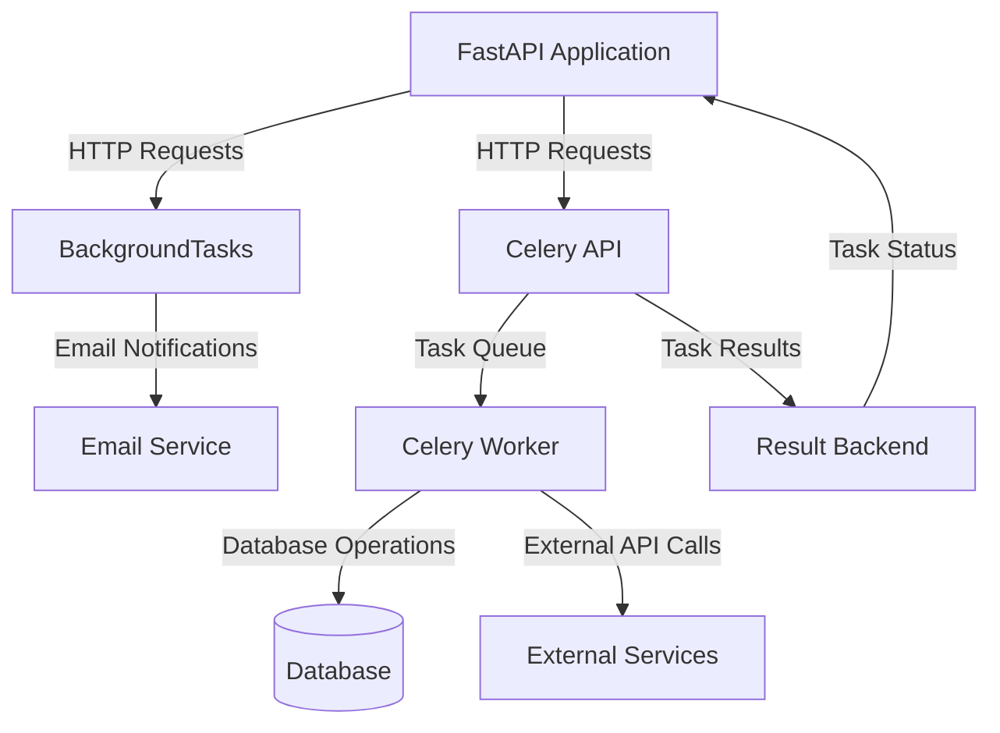

# Background Tasks — FastAPI + Celery

## Overview and scope

The purpose of this document is to establish standards and best practices for implementing background tasks within Xentic's backend services using FastAPI and Celery. This standard aims to ensure consistency, reliability, and maintainability across all projects that utilize these technologies. 

### Audience
This document is intended for:
- Backend engineers at Xentic who are responsible for developing and maintaining services using FastAPI and Celery.
- Technical leads and architects who oversee the design and implementation of backend systems.
- Quality assurance teams who validate the functionality of background tasks.

### Scope
This standard covers:
- Implementation of lightweight background tasks using FastAPI's built-in `BackgroundTasks`.
- Configuration and usage of Celery for handling heavy or long-running tasks.
- Integration of background tasks with Xentic’s existing services and libraries.

### Non-goals
This document does NOT cover:
- Frontend integration with background tasks.
- Detailed configuration of FastAPI or Celery beyond what is necessary for background tasks.
- Performance tuning or optimization strategies for Celery workers.

### Glossary
| Term              | Definition                                                                 |
|-------------------|-----------------------------------------------------------------------------|
| Background Task   | A task that runs asynchronously, allowing the main application to remain responsive. |
| FastAPI           | A modern, fast web framework for building APIs with Python.                |
| Celery            | An asynchronous task queue/job queue based on distributed message passing.  |
| Worker            | A process that executes tasks from the Celery queue.                       |
| Broker            | A message broker that Celery uses to send and receive messages (e.g., Redis). |
| Task              | A unit of work that Celery executes.                                       |

### How This Standard Fits the Xentic Platform
This standard aligns with Xentic's commitment to delivering high-quality software solutions by promoting best practices in task management. By adhering to these guidelines, teams can ensure that background tasks are implemented consistently across services, reducing technical debt and improving overall system reliability.

### Example Implementations

#### FastAPI BackgroundTasks (light tasks < 500ms)
```python
from fastapi import APIRouter, BackgroundTasks

router = APIRouter()

@router.post("/users")
async def create_user(req: CreateUserRequest, bg: BackgroundTasks):
    user = await user_service.create(req)
    bg.add_task(email_service.send_welcome, user.email)
    return UserResponse.from_orm(user)
```

#### Celery Setup (heavy / long-running tasks)
```python
from celery import Celery
from xentic_config import settings

celery_app = Celery(
    "worker",
    broker=settings.REDIS_URL,
    backend=settings.REDIS_URL,
    include=["app.worker.tasks"],
)
```

#### Task Definition
```python
@celery_app.task(bind=True, max_retries=3, default_retry_delay=60)
def process_report(self, report_id: str):
    try:
        report_service.generate(report_id)
    except TemporaryError as exc:
        raise self.retry(exc=exc)
```

#### API Integration
```python
@router.post("/reports/{report_id}/generate")
async def trigger_report(report_id: UUID):
    task = process_report.delay(str(report_id))
    return {"task_id": task.id, "status": "queued"}
```

### Rules
- **MUST** always set `max_retries` — never retry indefinitely.
- **MUST NOT** use synchronous calls for long-running tasks within FastAPI routes.
- **SHOULD** use dead-letter queues for permanently failed tasks.
- **MUST** log task start, success, and failure with task ID and entity ID for traceability.

## Standards and policies

1. **MUST** use the package naming convention `com.xentic.<service>` for all FastAPI and Celery-related modules and packages. This ensures consistency across the codebase.

2. **MUST NOT** hard-code configuration values within the application. All configuration settings (e.g., broker URLs, task timeouts) MUST be stored in environment variables or configuration files.

3. **MUST** utilize `pydantic` models for request and response validation in FastAPI endpoints to ensure data integrity and reduce runtime errors.

4. **SHOULD** implement task timeouts to prevent tasks from running indefinitely. Use the `time_limit` and `soft_time_limit` options in Celery tasks.

5. **MUST** define Celery tasks in a dedicated module (e.g., `app.worker.tasks`) to maintain separation of concerns and improve code organization.

6. **MUST NOT** use global state or mutable shared variables within Celery tasks. Each task MUST be stateless to ensure reliability and scalability.

7. **SHOULD** use a consistent naming convention for Celery tasks, following the pattern `module_name.task_name`, to improve readability and maintainability.

8. **MUST** handle exceptions within Celery tasks gracefully. Use the `retry` mechanism for transient errors and log all exceptions for monitoring purposes.

9. **SHOULD** implement health checks for Celery workers to ensure they are running and able to process tasks. This can be done using a dedicated endpoint in FastAPI.

10. **MUST** configure Celery to use a reliable message broker (e.g., Redis or RabbitMQ) as specified in Xentic's shared libraries guidelines.

11. **MUST NOT** expose sensitive information (e.g., API keys, database credentials) in logs. Use a logging framework that supports redaction of sensitive data.

12. **SHOULD** document all background tasks, including their purpose, input parameters, and expected output, in the codebase using docstrings.

13. **MUST** ensure that all background tasks are idempotent where possible, meaning that re-running a task should not have unintended side effects.

14. **MUST** use `BackgroundTasks` for lightweight tasks (less than 500ms) that do not require the overhead of Celery, to optimize performance.

15. **SHOULD** implement monitoring and alerting for task failures using tools such as Prometheus or Grafana, to proactively manage issues.

16. **MUST** include unit tests for all Celery tasks to ensure they behave as expected under various conditions.

17. **MUST** use a consistent logging format across all background tasks, including information such as task ID, status, and timestamps.

18. **SHOULD** use Celery's built-in monitoring tools (such as Flower) to visualize task queues and worker performance.

19. **MUST NOT** block the main FastAPI event loop with long-running tasks. Use Celery for tasks that require significant processing time.

20. **MUST** ensure that all dependencies for Celery tasks are explicitly declared in the `requirements.txt` or equivalent dependency management file.

21. **SHOULD** implement rate limiting for tasks that may overload external services, to prevent service degradation.

22. **MUST** use version control for all configuration files and document any changes to the configuration in the project's changelog.

23. **MUST** ensure that all Celery workers are running the same version of the codebase to avoid discrepancies in task execution.

24. **SHOULD** periodically review and refactor background tasks to improve performance and maintainability, especially as the codebase evolves.

25. **MUST** provide a mechanism for task cancellation if applicable, ensuring that users can stop long-running tasks when necessary.

26. **MUST NOT** forget to update documentation whenever a new background task is added or existing tasks are modified. Documentation should be kept in sync with the codebase.

### Example Configuration (YAML)
```yaml
celery:
  broker_url: "${REDIS_URL}"
  result_backend: "${REDIS_URL}"
  task_routes:
    "app.worker.tasks.*": "default"
  task_time_limit: 300  # seconds
  worker_concurrency: 4
```

### Example Logging Configuration (Python)
```python
import logging

logging.basicConfig(
    level=logging.INFO,
    format='%(asctime)s - %(name)s - %(levelname)s - %(message)s',
)
logger = logging.getLogger(__name__)

@celery_app.task(bind=True)
def process_data(self, data):
    logger.info(f"Task {self.request.id} started with data: {data}")
    # Task implementation...
    logger.info(f"Task {self.request.id} completed successfully.")
```

By adhering to these standards and policies, Xentic ensures that background tasks are implemented in a reliable, maintainable, and scalable manner across all services.

## Architecture and design

### Component Diagram



### Data Flows
1. **User Request to FastAPI**: Users initiate actions through HTTP requests to the FastAPI application.
2. **Background Task Execution**:
   - For lightweight tasks (e.g., sending emails), FastAPI utilizes `BackgroundTasks` to execute them asynchronously without blocking the request.
   - For heavier tasks (e.g., report generation), the request is sent to Celery, which queues the task for processing.
3. **Task Processing**: 
   - Celery workers pick up tasks from the queue and execute them. This may involve database operations or calls to external services.
4. **Result Handling**: 
   - Once a task is completed, results are sent back to the result backend (e.g., Redis), allowing the FastAPI application to check the status of the task.

### Integration Points
- **FastAPI and Celery**: FastAPI integrates with Celery through task definitions and API endpoints that trigger tasks.
- **Database**: Celery workers interact with the database to perform CRUD operations as part of task execution.
- **Email Service**: BackgroundTasks in FastAPI can be used for sending notifications or emails without blocking the main thread.

### Failure Domains
- **FastAPI Application**: If the FastAPI application fails, all incoming requests are affected, including those that trigger background tasks.
- **Celery Workers**: Worker failures can lead to unprocessed tasks, requiring monitoring and alerting to manage task retries or failures.
- **Database**: If the database is down or unreachable, both FastAPI and Celery tasks relying on it will fail, impacting functionality.
- **External Services**: Tasks that depend on external APIs may fail due to network issues or service outages, requiring robust error handling and retry mechanisms.

### Considerations
- **Monitoring**: Implement monitoring for both FastAPI and Celery to detect and respond to failures promptly.
- **Retry Logic**: Ensure that Celery tasks include retry logic for transient errors, with appropriate backoff strategies.
- **Logging**: Maintain comprehensive logging for both FastAPI and Celery tasks to facilitate debugging and traceability.

By following these architectural guidelines, Xentic can ensure a robust and scalable implementation of background tasks using FastAPI and Celery, supporting efficient processing of user requests and long-running operations.

## Configuration reference

### Environment Variables

| Variable Name       | Default Value                | Production Value               | Description                                       |
|---------------------|------------------------------|--------------------------------|---------------------------------------------------|
| `REDIS_URL`         | `redis://localhost:6379/0`   | `redis://redis.prod.xentic.io:6379/0` | URL for the Redis message broker and result backend. |
| `CELERY_BROKER_URL`| `${REDIS_URL}`               | `${REDIS_URL}`                 | Broker URL for Celery tasks.                      |
| `CELERY_RESULT_BACKEND` | `${REDIS_URL}`          | `${REDIS_URL}`                 | Backend for storing task results.                 |
| `CELERY_WORKER_CONCURRENCY` | `4`                 | `8`                            | Number of concurrent worker processes.            |
| `CELERY_TASK_TIME_LIMIT` | `300`                   | `600`                          | Maximum time a task can run before being terminated. |
| `CELERY_TASK_SOFT_TIME_LIMIT` | `240`             | `540`                          | Soft limit for task execution time.               |
| `CELERY_ACCEPT_CONTENT` | `json`                   | `json`                         | Content types accepted by Celery tasks.           |

### Application Configuration (YAML)

```yaml
celery:
  broker_url: "${CELERY_BROKER_URL}"
  result_backend: "${CELERY_RESULT_BACKEND}"
  task_routes:
    "com.xentic.service.worker.tasks.*": "default"
  worker_concurrency: ${CELERY_WORKER_CONCURRENCY}
  task_time_limit: ${CELERY_TASK_TIME_LIMIT}  # seconds
  task_soft_time_limit: ${CELERY_TASK_SOFT_TIME_LIMIT}  # seconds
  task_serializer: "json"
  result_serializer: "json"
  accept_content: ["json"]
  timezone: "UTC"
```

### Terraform Configuration

```hcl
resource "aws_elasticache_replication_group" "redis" {
  replication_group_id          = "xentic-redis"
  replication_group_description = "Redis cluster for Xentic background tasks"
  node_type                    = "cache.t3.micro"
  number_cache_clusters         = 2
  parameter_group_name          = "default.redis5.0"
  engine                        = "redis"
  engine_version                = "5.0.6"
  availability_zones            = ["us-east-1a", "us-east-1b"]
  port                          = 6379
  tags = {
    Name = "xentic-redis"
  }
}
```

### SQL Configuration for Task Monitoring

```sql
CREATE TABLE task_monitor (
    id SERIAL PRIMARY KEY,
    task_id VARCHAR(255) NOT NULL,
    status VARCHAR(50) NOT NULL,
    created_at TIMESTAMP DEFAULT CURRENT_TIMESTAMP,
    updated_at TIMESTAMP DEFAULT CURRENT_TIMESTAMP,
    error_message TEXT
);

CREATE INDEX idx_task_id ON task_monitor(task_id);
```

### Example Logging Configuration (Python)

```python
import logging
from celery import Celery

celery_app = Celery('tasks')
celery_app.config_from_object('app.config')

logging.basicConfig(
    level=logging.INFO,
    format='%(asctime)s - %(name)s - %(levelname)s - %(message)s',
)
logger = logging.getLogger(__name__)

@celery_app.task(bind=True, max_retries=3)
def process_data(self, data):
    logger.info(f"Task {self.request.id} started with data: {data}")
    try:
        # Task implementation...
        logger.info(f"Task {self.request.id} completed successfully.")
    except Exception as e:
        logger.error(f"Task {self.request.id} failed: {str(e)}")
        self.retry(exc=e, countdown=60)  # Retry after 60 seconds
```

By following this configuration reference, Xentic can ensure that all background tasks are set up correctly and consistently across different environments, promoting reliability and maintainability in the application.

## Implementation guide

To implement background tasks using FastAPI and Celery, follow these step-by-step instructions, ensuring adherence to Xentic's engineering standards.

### Step 1: Install Required Packages

Ensure you have the necessary packages installed. Use the following command to install FastAPI, Celery, and a message broker (Redis):

```bash
pip install fastapi[all] celery redis
```

### Step 2: Create the FastAPI Application

Create a new FastAPI application file, `main.py`, and define your endpoints. Below is an example of how to set up a simple FastAPI application that triggers a Celery task.

```python
from fastapi import FastAPI, BackgroundTasks
from celery import Celery

app = FastAPI()
celery_app = Celery('tasks', broker='redis://localhost:6379/0')

@celery_app.task
def send_email(email: str):
    # Simulate sending an email
    print(f"Email sent to {email}")

@app.post("/send-email/")
async def send_email_endpoint(email: str, background_tasks: BackgroundTasks):
    background_tasks.add_task(send_email, email)
    return {"message": "Email is being sent in the background."}
```

### Step 3: Configure Celery

Create a configuration file, `celery_config.py`, to hold your Celery settings. This file will be imported into your main application.

```python
from celery import Celery

def make_celery(app: FastAPI) -> Celery:
    celery = Celery(
        app.name,
        broker=app.config['CELERY_BROKER_URL'],
        backend=app.config['CELERY_RESULT_BACKEND'],
    )
    celery.conf.update(app.config)
    return celery

celery_app = make_celery(app)
```

### Step 4: Define Celery Tasks

Create a separate file, `tasks.py`, to define your Celery tasks. This keeps your code organized and modular.

```python
from celery import Celery
import logging

celery_app = Celery('tasks', broker='redis://localhost:6379/0')

logging.basicConfig(level=logging.INFO)
logger = logging.getLogger(__name__)

@celery_app.task(bind=True, max_retries=3)
def process_data(self, data):
    logger.info(f"Task {self.request.id} started with data: {data}")
    try:
        # Simulate task processing
        logger.info(f"Processing data: {data}")
        # Task implementation...
        logger.info(f"Task {self.request.id} completed successfully.")
    except Exception as e:
        logger.error(f"Task {self.request.id} failed: {str(e)}")
        self.retry(exc=e, countdown=60)  # Retry after 60 seconds
```

### Step 5: Running the Application and Worker

To run your FastAPI application, execute:

```bash
uvicorn main:app --reload
```

To start the Celery worker, run the following command in a separate terminal:

```bash
celery -A tasks worker --loglevel=info
```

### Step 6: Testing the Implementation

You can test your implementation by sending a POST request to the `/send-email/` endpoint. Use a tool like `curl` or Postman:

```bash
curl -X POST "http://localhost:8000/send-email/" -H "Content-Type: application/json" -d '{"email": "test@example.com"}'
```

### Step 7: Monitoring Tasks

To monitor the status of your tasks, you can create a simple endpoint in your FastAPI application that checks the task status using the task ID.

```python
from fastapi import HTTPException

@app.get("/task-status/{task_id}")
async def get_task_status(task_id: str):
    task = celery_app.AsyncResult(task_id)
    if task.state == 'PENDING':
        return {"status": "Pending..."}
    elif task.state != 'FAILURE':
        return {"status": task.state, "result": task.result}
    else:
        return {"status": task.state, "error": str(task.info)}
```

### Step 8: Error Handling

Implement error handling in your Celery tasks to manage exceptions gracefully. Use the `max_retries` and `countdown` parameters to control retry behavior.

### Conclusion

By following this implementation guide, Xentic ensures that background tasks are effectively integrated into the FastAPI application using Celery, promoting a scalable and maintainable architecture.

## Security requirements

To ensure the integrity and security of background tasks within the FastAPI and Celery architecture at Xentic, the following security requirements must be adhered to:

### Threat Model Summary

- **Unauthorized Access:** Ensure that only authenticated users can trigger background tasks.
- **Data Leakage:** Protect sensitive data from being exposed during task processing.
- **Denial of Service:** Implement rate limiting to prevent abuse of task endpoints.
- **Task Manipulation:** Validate task inputs to prevent malicious data from being processed.

### Authentication and Authorization

- All endpoints that trigger background tasks MUST require authentication.
- Use OAuth 2.0 or JWT tokens for securing API endpoints.
- Implement role-based access control (RBAC) to restrict access to sensitive tasks.

Example of a protected endpoint:

```python
from fastapi import Depends, HTTPException, status
from fastapi.security import OAuth2PasswordBearer

oauth2_scheme = OAuth2PasswordBearer(tokenUrl="token")

@app.post("/send-email/")
async def send_email_endpoint(email: str, background_tasks: BackgroundTasks, token: str = Depends(oauth2_scheme)):
    if not validate_token(token):  # Implement token validation logic
        raise HTTPException(status_code=status.HTTP_401_UNAUTHORIZED, detail="Invalid authentication credentials")
    background_tasks.add_task(send_email, email)
    return {"message": "Email is being sent in the background."}
```

### Secrets Management

- Secrets such as API keys, database passwords, and other sensitive configurations MUST NOT be hard-coded in the source code.
- Use environment variables or a secrets management tool (e.g., HashiCorp Vault, AWS Secrets Manager) to manage sensitive information.

Example of accessing secrets from environment variables:

```python
import os

REDIS_URL = os.getenv("REDIS_URL")
```

### Input Validation

- All inputs to background tasks MUST be validated to ensure they conform to expected formats and types.
- Use Pydantic models for input validation in FastAPI.

Example of input validation using Pydantic:

```python
from pydantic import BaseModel, EmailStr

class EmailRequest(BaseModel):
    email: EmailStr

@app.post("/send-email/")
async def send_email_endpoint(request: EmailRequest, background_tasks: BackgroundTasks):
    background_tasks.add_task(send_email, request.email)
    return {"message": "Email is being sent in the background."}
```

### Audit Logging

- Implement logging for all background task executions, including success and failure states.
- Log sensitive information in a secure manner, ensuring that no personally identifiable information (PII) is exposed.

Example of logging configuration:

```python
import logging

logging.basicConfig(level=logging.INFO, format='%(asctime)s - %(levelname)s - %(message)s')

@celery_app.task(bind=True, max_retries=3)
def process_data(self, data):
    logging.info(f"Task {self.request.id} started with data: {data}")
    try:
        # Task implementation...
        logging.info(f"Task {self.request.id} completed successfully.")
    except Exception as e:
        logging.error(f"Task {self.request.id} failed: {str(e)}")
        self.retry(exc=e, countdown=60)  # Retry after 60 seconds
```

### Summary of Security Requirements

- **Authentication:** All task-triggering endpoints MUST require authentication.
- **Authorization:** Implement RBAC to restrict access to sensitive tasks.
- **Secrets Management:** Use environment variables or secrets management tools for sensitive information.
- **Input Validation:** Validate all inputs using Pydantic models.
- **Audit Logging:** Log all task executions and handle sensitive information securely.

By adhering to these security requirements, Xentic can safeguard its FastAPI and Celery implementations against common threats and vulnerabilities, ensuring a secure and reliable background task processing environment.

## Testing strategy

To ensure the reliability and correctness of background tasks implemented using FastAPI and Celery, a comprehensive testing strategy must be employed. This strategy includes unit tests, integration tests, and contract tests, each serving a distinct purpose in the validation process.

### Unit Tests

Unit tests are essential for validating the functionality of individual components in isolation. Each Celery task and FastAPI endpoint should have corresponding unit tests.

- **Coverage Target:** Aim for at least 80% code coverage on all modules.
- **Testing Framework:** Use `pytest` for unit testing.

Example unit test for the `send_email` task:

```python
import pytest
from tasks import send_email

def test_send_email(mocker):
    mock_print = mocker.patch("builtins.print")
    send_email("test@example.com")
    mock_print.assert_called_once_with("Email sent to test@example.com")
```

### Integration Tests

Integration tests validate the interactions between components, ensuring that the FastAPI application and Celery tasks work together as expected.

- **Coverage Target:** Aim for at least 70% coverage on integration tests.
- **Testing Framework:** Use `pytest` along with `httpx` for making requests to the FastAPI application.

Example integration test for the `/send-email/` endpoint:

```python
from fastapi.testclient import TestClient
from main import app

client = TestClient(app)

def test_send_email_endpoint():
    response = client.post("/send-email/", json={"email": "test@example.com"})
    assert response.status_code == 200
    assert response.json() == {"message": "Email is being sent in the background."}
```

### Contract Tests

Contract tests are used to ensure that the API adheres to the defined contracts, particularly when external services are involved. This is especially important for background tasks that may interact with other services.

- **Coverage Target:** Ensure all external interactions are covered by contract tests.
- **Testing Framework:** Use `pytest` with `requests-mock` for mocking external service calls.

Example contract test for a mocked external service:

```python
import requests
from unittest.mock import patch

def test_external_service_call():
    with patch("requests.post") as mock_post:
        mock_post.return_value.status_code = 200
        mock_post.return_value.json.return_value = {"status": "success"}

        response = requests.post("https://external.service/api/task", json={"data": "sample"})
        assert response.status_code == 200
        assert response.json() == {"status": "success"}
```

### Test Coverage Reporting

Utilize `pytest-cov` to generate coverage reports. Run the tests with the following command:

```bash
pytest --cov=./ --cov-report=html
```

### Summary of Testing Strategy

| Test Type         | Purpose                                          | Coverage Target |
|-------------------|--------------------------------------------------|------------------|
| Unit Tests        | Validate individual components                    | 80%              |
| Integration Tests  | Validate interactions between components          | 70%              |
| Contract Tests    | Ensure adherence to API contracts                 | 100% coverage on external interactions |

By implementing this testing strategy, Xentic ensures that background tasks in the FastAPI application are robust, reliable, and maintainable, ultimately leading to higher quality software and a better user experience.

## Observability and operations

To maintain a high level of observability and operational excellence for background tasks in the FastAPI and Celery architecture at Xentic, the following practices and tools MUST be implemented:

### Metrics

- **Task Success Rate:** Monitor the percentage of successfully completed tasks versus failed tasks.
- **Task Duration:** Measure the time taken for each task to complete.
- **Task Queue Length:** Keep track of the number of tasks waiting in the queue.

Example Prometheus configuration for Celery metrics:

```yaml
prometheus:
  metrics:
    - name: celery_tasks
      type: histogram
      help: "Duration of Celery tasks"
      labels:
        - task_name
      buckets:
        - 0.1
        - 0.5
        - 1
        - 5
        - 10
```

### Logs

- All background tasks MUST log relevant information, including:
  - Task start and end times
  - Task parameters
  - Success and failure messages

Example logging configuration:

```python
import logging

logging.basicConfig(level=logging.INFO, format='%(asctime)s - %(levelname)s - %(message)s')

@celery_app.task(bind=True)
def example_task(self, data):
    logging.info(f"Task {self.request.id} started with data: {data}")
    # Task implementation...
    logging.info(f"Task {self.request.id} completed successfully.")
```

### Traces

- Use distributed tracing tools (e.g., OpenTelemetry) to trace requests through the system.
- Ensure that trace IDs are passed along with task execution for correlation.

Example of adding trace context:

```python
from opentelemetry import trace

@celery_app.task(bind=True)
def traced_task(self, data):
    tracer = trace.get_tracer(__name__)
    with tracer.start_as_current_span("traced_task"):
        # Task implementation...
```

### Dashboards

- Create dashboards in tools like Grafana or Kibana to visualize metrics and logs.
- Key metrics to display include:
  - Task success rate
  - Average task duration
  - Number of active tasks

Example Grafana panel configuration:

| Panel Type  | Metric                | Visualization Type |
|-------------|-----------------------|--------------------|
| Time Series | Task Success Rate     | Line Chart         |
| Bar Chart   | Task Queue Length     | Bar Chart          |
| Table       | Recent Task Failures  | Table              |

### Alerts

- Set up alerts for critical metrics to notify the on-call team:
  - Alert if task failure rate exceeds 5% over 5 minutes.
  - Alert if task queue length exceeds 100 tasks.

Example alerting rule in Prometheus:

```yaml
groups:
  - name: celery_alerts
    rules:
      - alert: HighTaskFailureRate
        expr: rate(celery_task_failures[5m]) > 0.05
        for: 5m
        labels:
          severity: critical
        annotations:
          summary: "High task failure rate detected"
          description: "Task failure rate exceeds 5% over the last 5 minutes."
```

### Service Level Objectives (SLOs)

Define SLOs for background tasks to ensure reliability:

- **Availability:** 99.9% of tasks should complete successfully.
- **Performance:** 95% of tasks should complete within 2 seconds.

### On-Call Runbook Steps

In case of an incident, the on-call engineer MUST follow these steps:

1. **Identify the Issue:**
   - Check the alerting dashboard for recent alerts.
   - Review logs for failed tasks.

2. **Assess Impact:**
   - Determine how many users are affected.
   - Check if the issue is isolated or widespread.

3. **Mitigate the Issue:**
   - Restart the Celery worker if it is unresponsive.
   - Scale the number of workers if the queue length is high.

4. **Communicate:**
   - Notify stakeholders of the issue and expected resolution time.
   - Update the incident status in the incident management system.

5. **Post-Incident Review:**
   - Conduct a post-mortem to analyze the cause and improve processes.
   - Update documentation and runbooks based on findings.

By implementing these observability and operational practices, Xentic ensures that background tasks are effectively monitored, managed, and optimized, leading to a reliable and efficient system.

## Migration and versioning

To ensure a smooth transition between versions of the FastAPI and Celery applications at Xentic, a well-defined migration and versioning strategy MUST be established. This strategy encompasses upgrade paths, deprecation policies, backward compatibility, and rollback procedures.

### Upgrade Paths

1. **Semantic Versioning:** All services MUST follow [Semantic Versioning](https://semver.org/) (MAJOR.MINOR.PATCH) to indicate the nature of changes:
   - **MAJOR:** Incompatible API changes.
   - **MINOR:** Backward-compatible functionality added.
   - **PATCH:** Backward-compatible bug fixes.

2. **Version Compatibility Matrix:** Maintain a compatibility matrix to guide developers on which versions of FastAPI and Celery are compatible with each other.

| FastAPI Version | Celery Version | Compatibility |
|------------------|----------------|---------------|
| 0.68.x           | 5.2.x          | Compatible     |
| 0.70.x           | 5.2.x          | Compatible     |
| 0.70.x           | 5.1.x          | Not Compatible  |

3. **Upgrade Procedure:**
   - Review release notes for breaking changes.
   - Update dependencies in `requirements.txt` or `Pipfile`.
   - Test the application in a staging environment before deployment.

### Deprecation Policy

1. **Deprecation Notices:** When a feature is scheduled for deprecation, a notice MUST be included in the documentation and code comments at least one version prior to its removal.

2. **Grace Period:** Deprecated features MUST remain functional for at least two subsequent minor versions before being removed.

3. **Communication:** Notify all stakeholders of upcoming deprecations via internal communication channels and provide guidance on alternatives.

### Backward Compatibility

1. **Maintain Backward Compatibility:** New releases MUST NOT break existing functionality unless absolutely necessary. If breaking changes are unavoidable:
   - Provide a clear migration path.
   - Include feature toggles to allow gradual adoption of new features.

2. **Testing for Compatibility:** Implement automated tests to verify that existing functionality remains intact across versions. Use the following command to run tests:

```bash
pytest --disable-warnings --maxfail=1
```

### Rollback Procedures

1. **Rollback Strategy:** In case of a failed deployment, a rollback strategy MUST be in place to revert to the previous stable version. This includes:
   - Keeping a backup of the last known good state.
   - Documenting the rollback process in the deployment guide.

2. **Rollback Steps:**
   - Identify the version to roll back to.
   - Use version control (e.g., Git) to revert code changes.
   - Redeploy the previous version of the application.
   - Verify that the application is functioning correctly after rollback.

3. **Rollback Example:**
   To roll back to a previous version in a Dockerized environment, the following command can be used:

```bash
docker-compose down
docker-compose up --force-recreate --no-deps <service_name>:<previous_version>
```

### Versioning in Code

1. **Version Tags:** Each release MUST be tagged in the version control system. Use the following command to create a new version tag:

```bash
git tag -a v1.0.0 -m "Release version 1.0.0"
git push origin v1.0.0
```

2. **Version Display:** The application MUST expose its version information via an endpoint, such as `/version`, which returns the current version in JSON format:

```python
from fastapi import FastAPI

app = FastAPI()

@app.get("/version")
async def get_version():
    return {"version": "1.0.0"}
```

By adhering to these migration and versioning practices, Xentic ensures that its FastAPI and Celery applications remain stable, maintainable, and user-friendly, while minimizing disruptions during upgrades and transitions.

## FAQ, anti-patterns, and checklists

### FAQ

1. **What is Celery?**
   - Celery is an asynchronous task queue/job queue based on distributed message passing. It is used to execute tasks in the background.

2. **How do I configure Celery with FastAPI?**
   - You MUST create a Celery instance and configure it with the broker URL and backend. Example:
   ```python
   from celery import Celery

   celery_app = Celery('tasks', broker='redis://localhost:6379/0', backend='rpc://')
   ```

3. **What message broker should I use?**
   - You SHOULD use Redis or RabbitMQ as they are widely supported and performant for Celery.

4. **How can I monitor Celery tasks?**
   - You MUST integrate monitoring tools like Flower or Prometheus to visualize task performance and health.

5. **What should I do if a task fails?**
   - You MUST implement retry logic for failed tasks. Example:
   ```python
   @celery_app.task(bind=True, max_retries=3)
   def example_task(self, data):
       try:
           # Task implementation...
       except Exception as e:
           self.retry(exc=e, countdown=60)
   ```

6. **Can I run tasks periodically?**
   - Yes, you SHOULD use Celery Beat to schedule periodic tasks. Example configuration:
   ```python
   from celery.schedules import crontab

   celery_app.conf.beat_schedule = {
       'run-every-minute': {
           'task': 'tasks.example_task',
           'schedule': crontab(),
       },
   }
   ```

7. **How do I handle task timeouts?**
   - You MUST set a timeout for tasks to prevent them from running indefinitely. Example:
   ```python
   @celery_app.task(time_limit=300)
   def long_running_task():
       # Task implementation...
   ```

8. **What is the best way to handle large payloads?**
   - You SHOULD avoid sending large payloads directly. Instead, store data in a database and pass identifiers to tasks.

9. **How do I ensure task idempotency?**
   - You MUST design tasks to be idempotent, meaning they can be safely retried without side effects.

10. **What should I include in task logs?**
    - Task logs MUST include start time, end time, parameters, success/failure status, and error messages if applicable.

### Anti-patterns

| Anti-pattern                     | Description                                                                                      |
|----------------------------------|--------------------------------------------------------------------------------------------------|
| Blocking Tasks                   | Tasks that block the worker should be avoided; use asynchronous calls instead.                  |
| Long-running Tasks               | Tasks that take too long should be broken down into smaller tasks to improve reliability.       |
| Ignoring Task Results            | Always handle task results or errors; ignoring them can lead to silent failures.                |
| Hardcoding Configuration          | Configuration values should be externalized (e.g., in environment variables or config files).   |
| Not Using Retries                | Failing to implement retries can lead to lost tasks; always use retry mechanisms.               |
| Tight Coupling                   | Tasks should not be tightly coupled with application logic; keep them modular and reusable.      |
| Overloading Workers              | Do not overload workers with too many tasks; ensure they are properly scaled to handle load.    |
| Not Using Timeouts               | Failing to set timeouts can lead to stuck tasks; always define limits for task execution time.  |

### Pre-Merge Checklist

- [ ] Code adheres to Xentic's coding standards.
- [ ] All tasks have been tested locally.
- [ ] Documentation is updated with new task details.
- [ ] Logging is implemented for all tasks.
- [ ] Metrics and monitoring are configured for new tasks.
- [ ] Dependencies are updated in `requirements.txt`.
- [ ] Code is reviewed by at least one other developer.

### Production Checklist

- [ ] Ensure all migrations have been applied.
- [ ] Verify that the Celery worker is running and connected to the broker.
- [ ] Check that monitoring and alerting are set up correctly.
- [ ] Review logs for any warnings or errors before deployment.
- [ ] Confirm that backups are in place for critical data.
- [ ] Communicate deployment schedule with all stakeholders.
- [ ] Conduct a post-deployment review to assess impact and performance.
