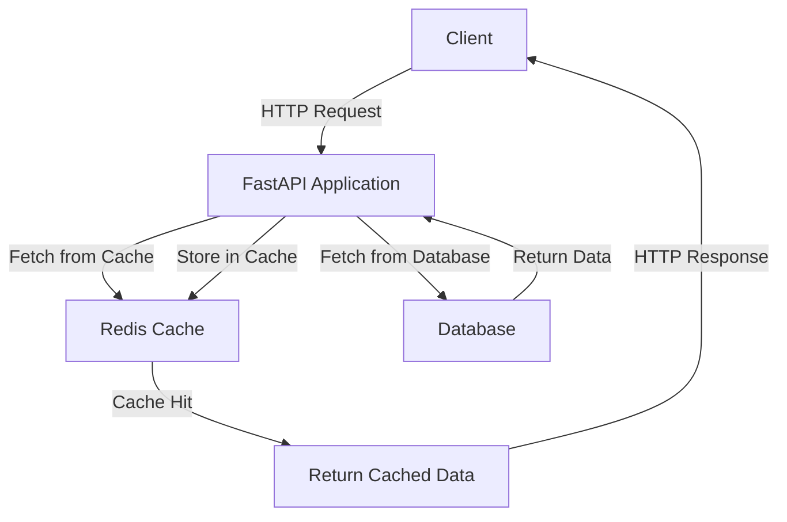

# Redis Caching — FastAPI

## Overview and scope

The purpose of this document is to establish standards and best practices for implementing Redis caching within FastAPI applications at Xentic. This standard aims to ensure consistency, reliability, and maintainability across all services that utilize Redis for caching purposes.

### Audience

This document is intended for:
- Backend engineers and developers working with FastAPI.
- Architects and technical leads overseeing the development of FastAPI applications.
- Quality assurance teams involved in testing and validating caching implementations.

### Scope

This standard covers:
- Configuration of Redis caching in FastAPI applications.
- Best practices for caching strategies and key management.
- Code examples demonstrating proper usage of Redis with FastAPI.
- Guidelines for monitoring and troubleshooting caching issues.

### Non-goals

This document does NOT cover:
- General Redis usage outside of FastAPI applications.
- Other caching mechanisms that may be used in conjunction with Redis.
- Deployment and infrastructure management of Redis instances.

### Glossary

| Term           | Definition                                                                 |
|----------------|-----------------------------------------------------------------------------|
| FastAPI        | A modern, fast (high-performance) web framework for building APIs with Python. |
| Redis          | An in-memory data structure store, used as a database, cache, and message broker. |
| Cache          | A temporary storage area that provides faster data access by storing frequently accessed data. |
| Key            | A unique identifier used to store and retrieve data in a cache.            |

### How this standard fits the Xentic platform

The implementation of Redis caching in FastAPI applications aligns with Xentic's commitment to building scalable and efficient backend services. By adhering to these standards, teams can:
- Ensure uniformity in caching practices across different services.
- Leverage Redis as a high-performance caching solution to improve application response times.
- Facilitate easier onboarding for new developers by providing clear guidelines and examples.

### Example Configuration

To configure Redis caching in a FastAPI application, the following YAML configuration should be used:

```yaml
redis:
  host: "redis.internal.xentic.io"
  port: 6379
  db: 0
  password: "your_redis_password"
```

### Example Code Snippet

The following code snippet demonstrates how to integrate Redis caching within a FastAPI application:

```python
from fastapi import FastAPI, Depends
from redis import Redis
from pydantic import BaseModel

app = FastAPI()

# Initialize Redis client
redis_client = Redis(host="redis.internal.xentic.io", port=6379, db=0, password="your_redis_password")

class Item(BaseModel):
    id: int
    name: str

@app.get("/items/{item_id}", response_model=Item)
def read_item(item_id: int):
    # Check if item is in cache
    cached_item = redis_client.get(f"item:{item_id}")
    if cached_item:
        return Item.parse_raw(cached_item)

    # Simulate fetching item from database
    item = Item(id=item_id, name="Sample Item")
    
    # Store item in cache
    redis_client.set(f"item:{item_id}", item.json())
    
    return item
```

By following this standard, Xentic teams can effectively utilize Redis caching in their FastAPI applications, leading to improved performance and user experience.

## Standards and policies

1. **MUST** use the package naming convention `com.xentic.<service>` for all FastAPI applications that implement Redis caching. This ensures consistency across all services within Xentic.

2. **MUST NOT** hardcode sensitive information such as Redis passwords in the source code. Use environment variables or secure vaults to manage sensitive configurations.

3. **SHOULD** configure Redis connection settings in a centralized configuration file (YAML or properties) to allow for easy changes and environment-specific configurations. Example:

    ```yaml
    redis:
      host: "${REDIS_HOST:-redis.internal.xentic.io}"
      port: "${REDIS_PORT:-6379}"
      db: "${REDIS_DB:-0}"
      password: "${REDIS_PASSWORD:-your_redis_password}"
    ```

4. **MUST** implement proper error handling for Redis operations to ensure that failures do not crash the FastAPI application. Use try-except blocks around Redis calls.

5. **SHOULD** implement a cache expiration strategy to avoid stale data. This can be done by setting an expiration time when storing data in Redis:

    ```python
    redis_client.setex(f"item:{item_id}", 3600, item.json())  # Cache for 1 hour
    ```

6. **MUST** use unique and descriptive keys for caching to avoid collisions. For example, use a format like `item:{item_id}` for caching items.

7. **SHOULD** log cache hits and misses to monitor the effectiveness of the caching strategy. This can help in optimizing cache usage over time.

8. **MUST NOT** use Redis for storing large objects or binary data. Instead, store references or IDs and fetch the actual data from a database or file storage.

9. **SHOULD** consider using Redis data structures (such as lists, sets, and hashes) for complex caching scenarios where applicable, rather than just simple key-value pairs.

10. **MUST** ensure that the Redis instance is properly secured, including setting up authentication and restricting access to trusted services only.

11. **SHOULD** implement a cache invalidation strategy to ensure that updates to data in the database are reflected in the cache. This can be done by deleting or updating the cache entry upon data modification.

12. **MUST NOT** rely solely on caching for data integrity. Always ensure that the primary data source (e.g., database) is the source of truth.

13. **SHOULD** use connection pooling for Redis clients to improve performance and resource utilization. This can be configured as follows:

    ```python
    from redis import ConnectionPool

    pool = ConnectionPool(host="redis.internal.xentic.io", port=6379, db=0, password="your_redis_password")
    redis_client = Redis(connection_pool=pool)
    ```

14. **MUST** document all caching strategies and configurations in the service's README or relevant documentation to ensure clarity for current and future developers.

15. **SHOULD** monitor Redis performance metrics (e.g., hit rate, memory usage) using tools like Redis Insight or built-in Redis monitoring commands to optimize caching strategies.

16. **MUST NOT** use blocking calls on Redis operations that could lead to performance bottlenecks in the FastAPI application. Use asynchronous patterns where applicable.

By adhering to these standards and policies, Xentic teams can ensure a robust and efficient implementation of Redis caching within their FastAPI applications.

## Architecture and design

The architecture for implementing Redis caching within FastAPI applications at Xentic is designed to optimize performance and reliability. Below is a component diagram that illustrates the key components and their interactions.



### Data Flows

1. **Client Request**: The client sends an HTTP request to the FastAPI application.
2. **Cache Lookup**: The FastAPI application checks the Redis cache for the requested data.
   - **Cache Hit**: If the data is found in the cache, it is returned directly to the client.
   - **Cache Miss**: If the data is not found, the application queries the database.
3. **Database Query**: The FastAPI application retrieves the data from the database.
4. **Cache Storage**: The retrieved data is then stored in the Redis cache for future requests.
5. **Response to Client**: The data (either from cache or database) is sent back to the client as an HTTP response.

### Integration Points

- **Redis**: The FastAPI application interacts with Redis for caching operations. This includes storing, retrieving, and deleting cached items.
- **Database**: The application queries the database when the requested data is not available in the cache.

### Failure Domains

1. **Redis Failure**: If the Redis cache is unavailable, the application should gracefully fall back to querying the database directly. Proper error handling must be implemented to manage Redis connection issues.
2. **Database Failure**: If the database is down, the application should return an appropriate error response to the client. Caching should not be relied upon as a substitute for database integrity.
3. **Network Issues**: Any network issues affecting communication between the FastAPI application and Redis or the database must be handled with retries and appropriate error logging.

### Best Practices

- **Connection Management**: Use connection pooling for Redis to manage connections efficiently.
- **Error Handling**: Implement robust error handling to manage Redis and database failures.
- **Monitoring**: Continuously monitor cache performance and application metrics to identify bottlenecks and optimize caching strategies.

### Example Configuration for Redis Connection Pooling

```python
from redis import ConnectionPool, Redis

# Configure connection pooling
pool = ConnectionPool(host="redis.internal.xentic.io", port=6379, db=0, password="your_redis_password")
redis_client = Redis(connection_pool=pool)
```

### Example Error Handling

```python
@app.get("/items/{item_id}", response_model=Item)
def read_item(item_id: int):
    try:
        # Check if item is in cache
        cached_item = redis_client.get(f"item:{item_id}")
        if cached_item:
            return Item.parse_raw(cached_item)

        # Simulate fetching item from database
        item = Item(id=item_id, name="Sample Item")
        
        # Store item in cache
        redis_client.setex(f"item:{item_id}", 3600, item.json())  # Cache for 1 hour
        
        return item
    except Exception as e:
        # Log the error and handle it gracefully
        logging.error(f"Error fetching item {item_id}: {str(e)}")
        raise HTTPException(status_code=500, detail="Internal Server Error")
```

By adhering to this architecture and design, Xentic teams can build efficient and resilient FastAPI applications that leverage Redis caching effectively.

## Configuration reference

### Application Configuration (application.yml)

The following table outlines the configuration options for connecting to Redis in a FastAPI application. Default values are provided for development, while production values are recommended for deployment.

```yaml
redis:
  host: "${REDIS_HOST:-redis.internal.xentic.io}"  # Redis server hostname
  port: "${REDIS_PORT:-6379}"                       # Redis server port
  db: "${REDIS_DB:-0}"                              # Redis database index
  password: "${REDIS_PASSWORD:-your_redis_password}" # Redis password
  cache_expiration: "${CACHE_EXPIRATION:-3600}"    # Cache expiration time in seconds
```

### Terraform Configuration

The following Terraform configuration can be used to set up Redis on a cloud provider. Adjust the resource parameters as necessary for your environment.

```hcl
resource "aws_elasticache_cluster" "redis" {
  cluster_id           = "xentic-redis-cluster"
  engine              = "redis"
  node_type          = "cache.t2.micro"
  num_cache_nodes     = 1
  parameter_group_name = "default.redis3.2"
  port                = 6379
  snapshot_retention_limit = 5
  security_group_ids = [aws_security_group.redis_sg.id]
}

resource "aws_security_group" "redis_sg" {
  name        = "redis_security_group"
  description = "Allow access to Redis"

  ingress {
    from_port   = 6379
    to_port     = 6379
    protocol    = "tcp"
    cidr_blocks = ["10.0.0.0/16"] # Adjust to your VPC CIDR
  }
}
```

### Environment Variables

The following environment variables should be set in your deployment environment to configure the Redis connection. Default values are provided for local development.

| Variable                | Default Value                     | Production Value                  |
|-------------------------|-----------------------------------|-----------------------------------|
| `REDIS_HOST`           | `redis.internal.xentic.io`       | `redis-prod.internal.xentic.io`  |
| `REDIS_PORT`           | `6379`                            | `6379`                            |
| `REDIS_DB`             | `0`                               | `0`                               |
| `REDIS_PASSWORD`       | `your_redis_password`            | `secure_production_password`      |
| `CACHE_EXPIRATION`     | `3600` (1 hour)                  | `300` (5 minutes)                 |

### Notes on Configuration

- **MUST** ensure that sensitive information such as Redis passwords is managed securely, utilizing environment variables or secret management tools.
- **SHOULD** configure cache expiration based on the application's data freshness requirements to avoid stale data.
- **MUST** validate that the Redis host and port are reachable from the FastAPI application to prevent runtime errors.

By following the above configuration guidelines, Xentic teams can ensure a consistent and secure setup for Redis caching in their FastAPI applications.

## Implementation guide

To implement Redis caching in a FastAPI application at Xentic, follow these step-by-step instructions. This guide includes full code examples for creating a FastAPI application with Redis caching capabilities.

### Step 1: Install Required Packages

Ensure you have the necessary packages installed. You can install them using pip:

```bash
pip install fastapi uvicorn redis
```

### Step 2: Create the FastAPI Application

Create a new Python file, `main.py`, and set up a basic FastAPI application.

```python
from fastapi import FastAPI, HTTPException
from pydantic import BaseModel
from redis import ConnectionPool, Redis
import logging

# Define the Item model
class Item(BaseModel):
    id: int
    name: str

# Create FastAPI instance
app = FastAPI()

# Configure Redis connection pooling
pool = ConnectionPool(host="redis.internal.xentic.io", port=6379, db=0, password="your_redis_password")
redis_client = Redis(connection_pool=pool)
```

### Step 3: Create API Endpoints

Create an endpoint to retrieve items. This endpoint will first check the Redis cache before querying the database.

```python
@app.get("/items/{item_id}", response_model=Item)
def read_item(item_id: int):
    try:
        # Check if item is in cache
        cached_item = redis_client.get(f"item:{item_id}")
        if cached_item:
            return Item.parse_raw(cached_item)

        # Simulate fetching item from the database
        item = Item(id=item_id, name="Sample Item")

        # Store item in cache
        redis_client.setex(f"item:{item_id}", 3600, item.json())  # Cache for 1 hour

        return item
    except Exception as e:
        logging.error(f"Error fetching item {item_id}: {str(e)}")
        raise HTTPException(status_code=500, detail="Internal Server Error")
```

### Step 4: Add Cache Invalidation Logic

To ensure that the cache remains consistent with the database, implement cache invalidation when an item is updated.

```python
@app.put("/items/{item_id}", response_model=Item)
def update_item(item_id: int, item: Item):
    try:
        # Simulate updating the item in the database
        # Update logic goes here...

        # Invalidate the cache
        redis_client.delete(f"item:{item_id}")

        # Return the updated item
        return item
    except Exception as e:
        logging.error(f"Error updating item {item_id}: {str(e)}")
        raise HTTPException(status_code=500, detail="Internal Server Error")
```

### Step 5: Run the Application

Run the FastAPI application using Uvicorn:

```bash
uvicorn main:app --host 0.0.0.0 --port 8000 --reload
```

### Step 6: Test the API

You can test the API using tools like Postman or curl. Here are some example commands:

- **Get Item**:
    ```bash
    curl -X GET "http://localhost:8000/items/1"
    ```

- **Update Item**:
    ```bash
    curl -X PUT "http://localhost:8000/items/1" -H "Content-Type: application/json" -d '{"id": 1, "name": "Updated Item"}'
    ```

### Step 7: Monitoring and Logging

Implement logging to monitor cache hits and misses. This can be done by adding logging statements in the API endpoints.

```python
@app.get("/items/{item_id}", response_model=Item)
def read_item(item_id: int):
    try:
        cached_item = redis_client.get(f"item:{item_id}")
        if cached_item:
            logging.info(f"Cache hit for item {item_id}")
            return Item.parse_raw(cached_item)

        logging.info(f"Cache miss for item {item_id}, fetching from database")
        item = Item(id=item_id, name="Sample Item")
        redis_client.setex(f"item:{item_id}", 3600, item.json())
        return item
    except Exception as e:
        logging.error(f"Error fetching item {item_id}: {str(e)}")
        raise HTTPException(status_code=500, detail="Internal Server Error")
```

### Conclusion

By following these steps, you will have a FastAPI application that effectively utilizes Redis for caching. Ensure that you monitor the application's performance and adjust caching strategies as necessary to optimize efficiency.

## Security requirements

To ensure the security of FastAPI applications utilizing Redis caching at Xentic, the following security requirements must be adhered to:

### Threat Model Summary

- **Data Exposure**: Sensitive data may be exposed if Redis is improperly configured or if access controls are inadequate.
- **Unauthorized Access**: Attackers may attempt to gain unauthorized access to Redis or the FastAPI application.
- **Data Integrity**: Cached data may be manipulated if proper validation and authentication are not enforced.

### Authentication and Authorization

- **MUST** implement OAuth2 or similar authentication mechanisms for all API endpoints.
- **MUST NOT** expose any sensitive endpoints without proper authentication.
- **SHOULD** use role-based access control (RBAC) to restrict access to specific resources based on user roles.

### Secrets Management

- **MUST** use environment variables or a secrets management tool (e.g., HashiCorp Vault) to store sensitive information such as Redis passwords.
- **MUST NOT** hard-code sensitive information in the source code or configuration files.
- **SHOULD** rotate secrets regularly and implement a process for updating them in the application.

### Input Validation

- **MUST** validate all incoming data against defined schemas using Pydantic models.
- **MUST NOT** accept raw input without validation to prevent injection attacks (e.g., SQL injection, command injection).
- **SHOULD** implement rate limiting to mitigate denial-of-service (DoS) attacks.

### Audit Logging

- **MUST** log all authentication attempts, including successful and failed logins, to monitor for unauthorized access.
- **MUST** log all cache operations (hits, misses, and deletions) to track data usage patterns and detect anomalies.
- **SHOULD** implement a centralized logging solution (e.g., ELK Stack) to aggregate logs for analysis and monitoring.

### Example of Input Validation with Pydantic

```python
from pydantic import BaseModel, Field, constr

class Item(BaseModel):
    id: int = Field(..., gt=0)  # Ensure id is greater than 0
    name: constr(min_length=1, max_length=100)  # Ensure name is between 1 and 100 characters
```

### Example of Logging Configuration

To ensure that logging is properly configured, include the following setup in your FastAPI application:

```python
import logging

logging.basicConfig(level=logging.INFO, format='%(asctime)s - %(levelname)s - %(message)s')

@app.middleware("http")
async def log_requests(request: Request, call_next):
    logging.info(f"Request: {request.method} {request.url}")
    response = await call_next(request)
    logging.info(f"Response: {response.status_code}")
    return response
```

### Summary Table of Security Requirements

| Requirement                | Description                                                                 |
|----------------------------|-----------------------------------------------------------------------------|
| Authentication              | Implement OAuth2 or similar for all endpoints.                            |
| Secrets Management          | Use environment variables or secret management tools for sensitive data.  |
| Input Validation            | Validate all incoming data with Pydantic models.                          |
| Audit Logging               | Log authentication attempts and cache operations.                          |
| Rate Limiting               | Implement rate limiting to prevent DoS attacks.                           |
| Centralized Logging         | Use a centralized logging solution for monitoring.                        |

By following these security requirements, Xentic teams can ensure that their FastAPI applications are secure and resilient against common threats.

## Testing strategy

To ensure the reliability and maintainability of FastAPI applications utilizing Redis caching at Xentic, a comprehensive testing strategy is essential. This strategy includes unit tests, integration tests, and contract tests, each serving a distinct purpose in the development lifecycle.

### Unit Tests

Unit tests are designed to validate the functionality of individual components in isolation. At Xentic, the following guidelines must be adhered to:

- **MUST** cover at least 80% of the codebase with unit tests.
- **MUST NOT** rely on external services (e.g., Redis) during unit tests; use mocking instead.

#### Example Unit Test Class

```python
import unittest
from unittest.mock import patch
from main import app, redis_client

class TestReadItem(unittest.TestCase):
    @patch.object(redis_client, 'get')
    def test_cache_hit(self, mock_get):
        mock_get.return_value = b'{"id": 1, "name": "Sample Item"}'
        response = app.test_client().get("/items/1")
        self.assertEqual(response.status_code, 200)
        self.assertEqual(response.json, {"id": 1, "name": "Sample Item"})

    @patch.object(redis_client, 'get')
    @patch.object(redis_client, 'setex')
    def test_cache_miss(self, mock_setex, mock_get):
        mock_get.return_value = None
        response = app.test_client().get("/items/1")
        self.assertEqual(response.status_code, 200)
        mock_setex.assert_called_once()
```

### Integration Tests

Integration tests validate the interaction between various components of the application, including database and cache interactions. The following guidelines apply:

- **MUST** achieve at least 70% coverage for integration tests.
- **MUST NOT** include tests that do not interact with the actual Redis service.

#### Example Integration Test Class

```python
import pytest
from fastapi.testclient import TestClient
from main import app

client = TestClient(app)

def test_read_item_integration(monkeypatch):
    # Mock Redis behavior
    monkeypatch.setattr("redis_client.get", lambda x: None)
    monkeypatch.setattr("redis_client.setex", lambda x, y, z: None)

    response = client.get("/items/1")
    assert response.status_code == 200
    assert response.json() == {"id": 1, "name": "Sample Item"}
```

### Contract Tests

Contract tests ensure that the API adheres to the expected contract defined by the consumers. This is crucial when multiple teams interact with the API. The following guidelines must be followed:

- **MUST** define contracts using OpenAPI specifications.
- **SHOULD** use tools like Pact to implement contract testing.

#### Example Contract Test

```python
from pact import Consumer, Provider

def test_api_contract():
    consumer = Consumer('FastAPIConsumer')
    provider = Provider('FastAPIProvider')

    pact = consumer.has_pact_with(provider)
    pact.start_service()

    # Define expected interactions
    pact.given('item exists').upon_receiving('a request for an item').with_request('get', '/items/1').will_respond_with(200, body={"id": 1, "name": "Sample Item"})

    with pact:
        # Make the actual request
        response = client.get("/items/1")
        assert response.status_code == 200

    pact.verify()
```

### Coverage Targets

To maintain high code quality, the following coverage targets must be achieved:

| Test Type       | Coverage Target |
|------------------|-----------------|
| Unit Tests       | 80%             |
| Integration Tests| 70%             |
| Contract Tests   | 100%            |

### Conclusion

By implementing a robust testing strategy that includes unit, integration, and contract tests, Xentic teams can ensure the reliability and maintainability of FastAPI applications that leverage Redis caching. Regularly reviewing and updating tests will help maintain high standards of quality and performance.

## Observability and operations

To ensure the performance and reliability of FastAPI applications utilizing Redis caching at Xentic, a comprehensive observability and operations strategy is essential. This includes metrics, logs, traces, dashboards, alerts, and SLOs. The following guidelines must be adhered to:

### Metrics

- **MUST** collect application performance metrics, including:
  - Request latency
  - Cache hit/miss ratios
  - Error rates
  - Resource utilization (CPU, memory)
  
#### Example Metrics Configuration (Prometheus)

```yaml
prometheus:
  enabled: true
  endpoint: /metrics
  labels:
    environment: production
    service: fastapi-redis-service
```

### Logs

- **MUST** implement structured logging to capture relevant information.
- **MUST NOT** log sensitive information (e.g., passwords, personal data).
- **SHOULD** include the following log levels:
  - DEBUG
  - INFO
  - WARNING
  - ERROR
  - CRITICAL

#### Example Logging Configuration

```python
import logging
import sys

logging.basicConfig(
    level=logging.INFO,
    format='%(asctime)s - %(levelname)s - %(message)s',
    handlers=[logging.StreamHandler(sys.stdout)]
)
```

### Traces

- **MUST** implement distributed tracing to monitor requests across services.
- **SHOULD** use tools like OpenTelemetry or Jaeger for tracing.

#### Example Tracing Configuration

```python
from opentelemetry import trace
from opentelemetry.exporter.jaeger import JaegerExporter
from opentelemetry.sdk.trace import TracerProvider
from opentelemetry.sdk.trace.export import BatchSpanProcessor

trace.set_tracer_provider(TracerProvider())
jaeger_exporter = JaegerExporter(
    service_name="fastapi-redis-service",
    agent_host_name="jaeger",
    agent_port=6831,
)
trace.get_tracer_provider().add_span_processor(BatchSpanProcessor(jaeger_exporter))
```

### Dashboards

- **MUST** create dashboards to visualize key metrics and logs.
- **SHOULD** use Grafana or similar tools for dashboard creation.

#### Example Grafana Dashboard Configuration

```json
{
  "title": "FastAPI Redis Service Dashboard",
  "panels": [
    {
      "type": "graph",
      "title": "Request Latency",
      "targets": [
        {
          "target": "avg(request_latency)",
          "legend": "Average Latency"
        }
      ]
    },
    {
      "type": "graph",
      "title": "Cache Hit Ratio",
      "targets": [
        {
          "target": "cache_hits / (cache_hits + cache_misses)",
          "legend": "Cache Hit Ratio"
        }
      ]
    }
  ]
}
```

### Alerts

- **MUST** set up alerts for critical metrics, including:
  - High error rates
  - Increased latency
  - Low cache hit ratios

#### Example Alert Configuration (Prometheus)

```yaml
groups:
  - name: fastapi-alerts
    rules:
      - alert: HighErrorRate
        expr: rate(http_requests_total{status="500"}[5m]) > 0.05
        for: 10m
        labels:
          severity: critical
        annotations:
          summary: "High error rate detected"
          description: "More than 5% of requests are failing."
```

### SLOs

- **MUST** define Service Level Objectives (SLOs) for key performance indicators, such as:
  - 99.9% of requests must complete within 200ms
  - Cache hit ratio must be above 90%

| SLO Description               | Target       |
|-------------------------------|--------------|
| Request Latency               | 99.9% < 200ms|
| Cache Hit Ratio               | > 90%        |
| Error Rate                    | < 1%         |

### On-Call Runbook Steps

In the event of an incident, the following on-call runbook steps must be followed:

1. **Identify the Incident**:
   - Check alerting systems for triggered alerts.
   - Review logs for errors and anomalies.

2. **Assess Impact**:
   - Determine the scope of the issue (e.g., affected services, users).
   - Communicate with stakeholders about the ongoing issue.

3. **Mitigation**:
   - If applicable, roll back recent changes that may have caused the issue.
   - Increase resource allocation if resource exhaustion is detected.

4. **Resolution**:
   - Investigate the root cause of the incident.
   - Apply fixes and validate that the issue is resolved.

5. **Postmortem**:
   - Conduct a postmortem to analyze the incident.
   - Document findings and update runbooks as necessary.

By adhering to these observability and operations guidelines, Xentic teams can ensure that their FastAPI applications utilizing Redis caching are effectively monitored and maintained, leading to improved performance and reliability.

## Migration and versioning

At Xentic, managing migration and versioning of FastAPI applications that utilize Redis caching is critical for maintaining stability and ensuring backward compatibility. The following guidelines must be adhered to:

### Upgrade Paths

- **MUST** define clear upgrade paths for each version of the application.
- **SHOULD** provide a detailed changelog for each release to document changes, improvements, and breaking changes.
- **MUST** ensure that all dependencies, including Redis, are compatible with the new version before upgrading.

#### Example Changelog Format

```markdown
# Changelog

## [1.0.1] - 2023-10-01
### Fixed
- Fixed cache miss issue for non-existent items.

## [1.1.0] - 2023-11-01
### Added
- Added support for Redis Cluster.
### Changed
- Updated Redis client library to version 3.0.0.
### Deprecated
- Deprecated the old caching mechanism; will be removed in version 2.0.0.
```

### Deprecation Policy

- **MUST** provide at least one full version cycle of notice before removing deprecated features.
- **SHOULD** mark deprecated features in the documentation and code comments.
- **MUST NOT** remove deprecated features without proper migration paths or alternatives.

#### Example Deprecation Notice in Code

```python
def old_cache_function():
    """
    Deprecated: This function will be removed in version 2.0.0.
    Use `new_cache_function()` instead.
    """
    # Old implementation
    pass
```

### Backward Compatibility

- **MUST** ensure that new versions of the application maintain backward compatibility with existing clients.
- **SHOULD** implement feature flags for new features to allow gradual rollout.
- **MUST NOT** introduce breaking changes without a major version increment.

#### Example Feature Flag Configuration (YAML)

```yaml
feature_flags:
  new_cache_mechanism: false
```

### Rollback Procedures

In the event of a failed deployment or significant issues post-upgrade, a rollback procedure must be in place:

1. **Identify the Issue**:
   - Review logs and metrics to determine the impact of the new version.
   - Communicate with stakeholders about the rollback decision.

2. **Rollback Steps**:
   - **MUST** have automated scripts or manual procedures ready to revert to the previous stable version.
   - **SHOULD** ensure that database migrations are reversible or that a backup is available.

#### Example Rollback Script

```bash
#!/bin/bash
# Rollback to the previous version
docker-compose down
docker-compose pull fastapi-redis-service:1.0.0
docker-compose up -d
```

3. **Post-Rollback Validation**:
   - **MUST** validate that the application is functioning as expected after the rollback.
   - **SHOULD** monitor logs and metrics closely for any anomalies.

### Summary Table

| Policy Aspect          | Requirement                                     |
|-----------------------|-------------------------------------------------|
| Upgrade Paths         | Clear paths and detailed changelog              |
| Deprecation Policy    | One version cycle notice, marked in documentation|
| Backward Compatibility | Maintain compatibility, use feature flags       |
| Rollback Procedures    | Automated scripts, post-rollback validation     |

By adhering to these migration and versioning guidelines, Xentic teams can ensure that FastAPI applications utilizing Redis caching are stable, maintainable, and capable of evolving without disrupting existing functionality.

## FAQ, Anti-patterns, and Checklists

### FAQ

1. **What is Redis caching?**
   - Redis caching is a mechanism that stores frequently accessed data in memory, reducing the time it takes to retrieve data from a database or other persistent storage.

2. **When should I use Redis caching in my FastAPI application?**
   - You should use Redis caching when you have data that is expensive to compute or retrieve, and that does not change frequently.

3. **How do I connect FastAPI to Redis?**
   - Use the `redis-py` library to connect FastAPI to Redis. Ensure that you configure the Redis client with the appropriate host and port.

   ```python
   import redis

   redis_client = redis.Redis(host='localhost', port=6379, db=0)
   ```

4. **What data types can I store in Redis?**
   - Redis supports various data types, including strings, hashes, lists, sets, and sorted sets.

5. **How do I handle cache expiration in Redis?**
   - You can set an expiration time for cached items using the `expire` method or by specifying the `ttl` parameter when setting a key.

   ```python
   redis_client.set('my_key', 'my_value', ex=60)  # Expires in 60 seconds
   ```

6. **What happens if Redis goes down?**
   - If Redis goes down, your application should gracefully handle cache misses and revert to fetching data from the primary data source.

7. **How can I monitor Redis performance?**
   - Use Redis commands like `INFO` and `MONITOR` to track performance metrics. Additionally, integrate Redis monitoring tools like RedisInsight.

8. **Can I use Redis as a session store?**
   - Yes, Redis is often used as a session store due to its fast access times and support for expiration.

9. **What are the best practices for Redis key naming?**
   - Use a consistent naming convention, such as `service:entity:id`, to avoid key collisions and make keys easily identifiable.

10. **How do I handle cache invalidation?**
    - Implement cache invalidation strategies such as time-based expiration, manual invalidation on data updates, or using cache-aside patterns.

### Anti-patterns

| Anti-pattern                     | Description                                                                                       |
|----------------------------------|---------------------------------------------------------------------------------------------------|
| Caching Everything                | **MUST NOT** cache every piece of data; only cache data that is frequently accessed and expensive to compute. |
| Ignoring Cache Expiration         | **MUST** always set expiration times for cached items to prevent stale data.                     |
| Not Handling Cache Misses         | **MUST NOT** assume cached data is always available; implement fallback mechanisms for cache misses. |
| Overusing Cache for Small Data    | **MUST NOT** use Redis for small, frequently changing data; it may lead to unnecessary overhead. |
| Hardcoding Redis Configuration    | **MUST NOT** hardcode Redis connection details; use environment variables or configuration files. |
| Synchronous Cache Access          | **MUST NOT** perform synchronous calls to Redis in critical paths; use asynchronous access where possible. |

### Pre-merge Checklist

- **MUST** ensure all new features are covered by unit tests.
- **SHOULD** run integration tests to verify interactions with Redis.
- **MUST** review code for proper error handling related to Redis operations.
- **SHOULD** validate that cache expiration and invalidation logic is implemented correctly.
- **MUST NOT** merge code with hardcoded configuration values.

### Production Checklist

- **MUST** ensure Redis is properly configured for production (e.g., persistence settings, memory limits).
- **SHOULD** enable Redis monitoring and alerting to track performance metrics.
- **MUST** validate that all environment variables are set correctly for Redis connections.
- **SHOULD** perform load testing to assess the impact of caching on application performance.
- **MUST NOT** deploy without verifying that all dependencies are up-to-date and compatible.
