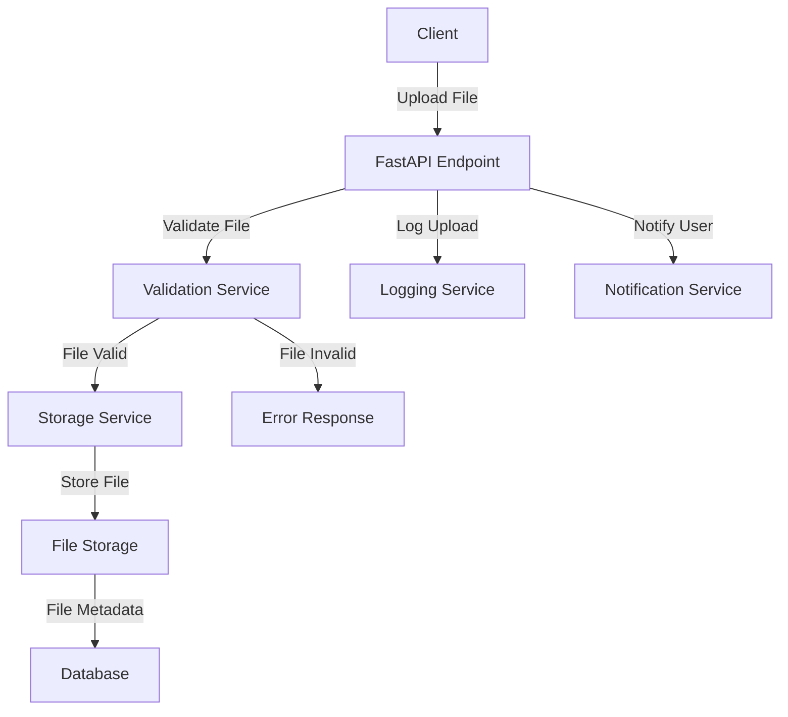

# File Upload Standards — FastAPI

## Overview and scope

The purpose of this document is to establish standards and best practices for implementing file upload functionality within FastAPI applications at Xentic. This standard aims to ensure consistency, security, and maintainability across all services that handle file uploads.

### Audience

This document is intended for:
- Backend Engineers
- Software Architects
- Quality Assurance Teams
- DevOps Engineers

### Scope

This standard covers:
- File upload mechanisms using FastAPI
- Validation and security practices for uploaded files
- Configuration settings for file handling
- Error handling and response structures
- Integration with Xentic's existing services and shared libraries

### Non-goals

This document does NOT cover:
- Frontend implementation of file uploads
- File storage solutions (e.g., AWS S3, local storage) beyond the configuration aspects
- Non-FastAPI frameworks or languages

### Glossary

| Term                | Definition                                                                 |
|---------------------|----------------------------------------------------------------------------|
| FastAPI             | A modern web framework for building APIs with Python 3.6+ based on standard Python type hints. |
| File Upload         | The process of transferring a file from a client to a server.             |
| Validation          | The process of checking if the uploaded file meets specific criteria.      |
| Security            | Measures taken to protect the application from malicious file uploads.    |
| Endpoint            | A specific URL where a client can send requests to the server.            |

### How This Standard Fits the Xentic Platform

This standard aligns with Xentic's commitment to building robust, scalable, and secure applications. By adhering to these guidelines, teams will ensure that:
- File uploads are handled consistently across all services.
- Security vulnerabilities related to file uploads are mitigated.
- Integration with Xentic's shared libraries (e.g., `com.xentic.auth:auth-starter`) is seamless and efficient.

### Example Configuration

To illustrate the standard, consider the following FastAPI configuration for handling file uploads:

```python
from fastapi import FastAPI, File, UploadFile, HTTPException
from fastapi.responses import JSONResponse

app = FastAPI()

@app.post("/uploadfile/")
async def upload_file(file: UploadFile = File(...)):
    if not file.filename.endswith('.txt'):
        raise HTTPException(status_code=400, detail="Invalid file type. Only .txt files are allowed.")
    
    # Process the file (e.g., save to disk, validate content)
    return JSONResponse(content={"filename": file.filename})
```

By following these standards, Xentic aims to create a unified approach to file uploads that enhances the overall quality and security of our applications.

## Standards and policies

1. **File Type Validation**: 
   - All file uploads MUST be validated against an allowed list of file types. For example, if only `.txt` files are permitted, the application MUST reject any other file types.
   - Example validation:
     ```python
     if not file.filename.endswith(('.txt', '.csv')):
         raise HTTPException(status_code=400, detail="Invalid file type. Only .txt and .csv files are allowed.")
     ```

2. **File Size Limitations**:
   - The application MUST impose a maximum file size limit for uploads to prevent denial of service attacks. The limit MUST NOT exceed 10 MB unless explicitly approved by the architecture team.
   - Configuration example in FastAPI:
     ```python
     from fastapi import UploadFile, File
     
     @app.post("/uploadfile/")
     async def upload_file(file: UploadFile = File(..., max_length=10 * 1024 * 1024)):  # 10 MB
         ...
     ```

3. **Security Measures**:
   - All uploaded files MUST be scanned for malware and other security threats before processing. This can be done using third-party libraries or services.
   - The application MUST NOT execute any files directly after upload without thorough validation and scanning.

4. **Error Handling**:
   - The application MUST return appropriate HTTP status codes and messages for different error scenarios, such as invalid file types, size limits exceeded, or internal server errors.
   - Example response structure:
     ```python
     return JSONResponse(status_code=400, content={"error": "Invalid file type."})
     ```

5. **Logging**:
   - All file upload attempts MUST be logged, including successful uploads and any errors encountered. This logging MUST include the user ID, timestamp, and file metadata.
   - Example logging:
     ```python
     import logging

     logger = logging.getLogger("file_uploads")
     logger.info(f"User {user_id} uploaded file {file.filename} at {timestamp}.")
     ```

6. **Asynchronous Processing**:
   - The application SHOULD handle file uploads asynchronously to improve performance and responsiveness. FastAPI supports asynchronous file handling natively.
   - Example of asynchronous handling:
     ```python
     @app.post("/uploadfile/")
     async def upload_file(file: UploadFile = File(...)):
         await process_file(file)
     ```

7. **Storage Configuration**:
   - The application MUST provide a configuration option for specifying the file storage location (e.g., local disk, cloud storage) in a secure manner.
   - Example configuration in `config.yaml`:
     ```yaml
     file_upload:
       storage_path: "/var/uploads"
       max_file_size: 10485760  # 10 MB
     ```

8. **Rate Limiting**:
   - The application SHOULD implement rate limiting on file upload endpoints to prevent abuse. This can be achieved using middleware or API gateway configurations.
   - Example configuration in FastAPI:
     ```python
     from fastapi_limiter import FastAPILimiter

     FastAPILimiter.init(app)
     ```

9. **Use of Shared Libraries**:
   - The application MUST utilize Xentic's shared libraries for authentication and authorization, ensuring that only authorized users can upload files.
   - Example integration:
     ```python
     from com.xentic.auth import AuthMiddleware

     app.add_middleware(AuthMiddleware)
     ```

10. **Documentation**:
    - All file upload endpoints MUST be documented using OpenAPI specifications, including details on request parameters, response formats, and error codes.
    - Example documentation snippet:
      ```yaml
      paths:
        /uploadfile/:
          post:
            summary: Upload a file
            parameters:
              - name: file
                in: formData
                type: file
                required: true
            responses:
              200:
                description: File uploaded successfully
              400:
                description: Invalid file type
      ```

By adhering to these standards and policies, Xentic ensures that file upload functionalities within FastAPI applications are secure, efficient, and maintainable.

## Architecture and design

The architecture for file upload functionality in FastAPI applications at Xentic should be designed to ensure scalability, security, and maintainability. Below is a component diagram that outlines the key components and their interactions.



### Data Flows

1. **File Upload**: The client initiates a file upload by sending a request to the FastAPI endpoint.
2. **File Validation**: The FastAPI application validates the uploaded file against predefined criteria (e.g., file type, size).
3. **File Storage**: If the file is valid, it is processed and stored in the designated storage service (e.g., local disk, cloud storage).
4. **Logging**: Each upload attempt, whether successful or failed, is logged for auditing and monitoring purposes.
5. **User Notification**: After processing, the user is notified about the upload status (success or failure).

### Integration Points

- **Validation Service**: This service is responsible for checking the file type and size. It should be implemented as a separate module to allow for easier updates and enhancements.
- **Storage Service**: This component handles the actual storage of files. It can be configured to use different backends, such as local file systems or cloud storage solutions.
- **Database**: A database is used to store metadata about the uploaded files, such as filename, user ID, upload timestamp, and storage location.
- **Logging Service**: Centralized logging should be implemented to capture all file upload events, which can be monitored for security and performance metrics.
- **Notification Service**: This service sends notifications to users regarding the status of their file uploads.

### Failure Domains

1. **Client-Side Failures**: Issues such as network interruptions or unsupported file types can prevent successful uploads.
2. **Validation Failures**: If a file fails validation, the application MUST return appropriate error messages and status codes.
3. **Storage Failures**: Problems with the storage service (e.g., disk full, permissions issues) can lead to failures in saving files.
4. **Database Failures**: Issues with the database (e.g., connection errors, schema changes) can prevent the application from logging metadata.
5. **Logging Failures**: If the logging service is down, upload attempts may not be recorded, making it difficult to audit or troubleshoot issues.

### Example Configuration

To ensure that the architecture is implemented correctly, the following configuration settings should be included in the `config.yaml` file:

```yaml
file_upload:
  storage_service:
    type: "local"  # Options: local, s3, etc.
    local:
      path: "/var/uploads"
    s3:
      bucket: "xentic-file-uploads"
      region: "us-west-2"
  validation:
    allowed_file_types: 
      - ".txt"
      - ".csv"
    max_file_size: 10485760  # 10 MB
  logging:
    enabled: true
    log_level: "INFO"
  notification:
    service_url: "https://notifications.internal.xentic.io"
```

By adhering to this architecture and design, Xentic can ensure that file uploads are handled in a secure, efficient, and maintainable manner across all FastAPI applications.

## Configuration reference

To standardize file upload configurations across FastAPI applications at Xentic, the following configuration references are provided. These include settings for `application.yml`, Terraform variables, and environment variables with their default and production values.

### Application Configuration (application.yml)

The `application.yml` file should include the following configuration settings:

```yaml
file_upload:
  storage_service:
    type: "local"  # Options: local, s3, etc.
    local:
      path: "/var/uploads"  # Default path for local storage
    s3:
      bucket: "xentic-file-uploads"  # Production value for S3 bucket
      region: "us-west-2"  # Production value for S3 region
  validation:
    allowed_file_types: 
      - ".txt"  # Default allowed file type
      - ".csv"  # Additional allowed file type
    max_file_size: 10485760  # 10 MB default max file size
  logging:
    enabled: true  # Enable logging by default
    log_level: "INFO"  # Default log level
  notification:
    service_url: "https://notifications.internal.xentic.io"  # Default notification service URL
```

### Terraform Configuration

When deploying the application using Terraform, the following variables should be defined in the `variables.tf` file:

| Variable Name            | Description                                     | Default Value                      | Production Value                     |
|--------------------------|-------------------------------------------------|------------------------------------|--------------------------------------|
| `file_storage_type`      | Type of file storage service                     | `"local"`                          | `"s3"`                               |
| `local_storage_path`     | Path for local file storage                      | `"/var/uploads"`                   | `"/mnt/uploads"`                     |
| `s3_bucket`              | S3 bucket name for file storage                 | `"xentic-file-uploads"`            | `"prod-xentic-file-uploads"`         |
| `s3_region`              | AWS region for S3 bucket                        | `"us-west-2"`                      | `"us-east-1"`                        |
| `allowed_file_types`     | Comma-separated list of allowed file types      | `".txt,.csv"`                      | `".txt,.csv,.pdf"`                   |
| `max_file_size`          | Maximum allowed file size in bytes              | `10485760`                         | `20971520`                           |  # 20 MB for production
| `logging_enabled`        | Enable or disable logging                       | `true`                             | `true`                               |
| `log_level`              | Logging level                                   | `"INFO"`                           | `"DEBUG"`                            |
| `notification_service_url`| URL for notification service                   | `"https://notifications.internal.xentic.io"` | `"https://prod.notifications.xentic.io"` |

### Environment Variables

For local development and production environments, the following environment variables should be set:

| Environment Variable               | Description                                     | Default Value                      | Production Value                     |
|------------------------------------|-------------------------------------------------|------------------------------------|--------------------------------------|
| `FILE_STORAGE_TYPE`                | Type of file storage service                     | `local`                            | `s3`                                 |
| `LOCAL_STORAGE_PATH`               | Path for local file storage                      | `/var/uploads`                     | `/mnt/uploads`                       |
| `S3_BUCKET`                        | S3 bucket name for file storage                 | `xentic-file-uploads`              | `prod-xentic-file-uploads`           |
| `S3_REGION`                        | AWS region for S3 bucket                        | `us-west-2`                        | `us-east-1`                          |
| `ALLOWED_FILE_TYPES`               | Comma-separated list of allowed file types      | `.txt,.csv`                        | `.txt,.csv,.pdf`                     |
| `MAX_FILE_SIZE`                    | Maximum allowed file size in bytes              | `10485760`                         | `20971520`                           |  # 20 MB for production
| `LOGGING_ENABLED`                  | Enable or disable logging                       | `true`                             | `true`                               |
| `LOG_LEVEL`                        | Logging level                                   | `INFO`                             | `DEBUG`                              |
| `NOTIFICATION_SERVICE_URL`         | URL for notification service                    | `https://notifications.internal.xentic.io` | `https://prod.notifications.xentic.io` |

By maintaining these configuration standards, Xentic ensures that file upload functionalities are consistent, secure, and easily manageable across all FastAPI applications.

## Implementation guide

To implement file upload functionality in a FastAPI application, follow these steps:

### Step 1: Create FastAPI Application

First, create a new FastAPI application. Below is an example of a simple FastAPI application structure.

```python
# main.py
from fastapi import FastAPI
from routers import file_upload

app = FastAPI()

app.include_router(file_upload.router)
```

### Step 2: Define the File Upload Router

Create a router that will handle file uploads. This router will include endpoints for uploading files and validating them.

```python
# routers/file_upload.py
from fastapi import APIRouter, File, UploadFile, HTTPException
from typing import List
import os

router = APIRouter()

ALLOWED_FILE_TYPES = [".txt", ".csv"]
MAX_FILE_SIZE = 10485760  # 10 MB

@router.post("/upload/")
async def upload_file(file: UploadFile = File(...)):
    # Validate file type
    if not any(file.filename.endswith(ext) for ext in ALLOWED_FILE_TYPES):
        raise HTTPException(status_code=400, detail="Invalid file type")

    # Validate file size
    file_size = await file.read()
    if len(file_size) > MAX_FILE_SIZE:
        raise HTTPException(status_code=400, detail="File size exceeds limit")

    # Save the file
    upload_path = os.path.join("/var/uploads", file.filename)
    with open(upload_path, "wb") as f:
        f.write(file_size)

    return {"filename": file.filename}
```

### Step 3: Create a File Validation Module

For better separation of concerns, create a separate module for file validation.

```python
# services/validation.py
def validate_file_type(filename: str, allowed_types: List[str]) -> bool:
    return any(filename.endswith(ext) for ext in allowed_types)

def validate_file_size(file_size: int, max_size: int) -> bool:
    return file_size <= max_size
```

### Step 4: Integrate Validation into the Upload Router

Update the upload router to use the validation module.

```python
# routers/file_upload.py (updated)
from services.validation import validate_file_type, validate_file_size

@router.post("/upload/")
async def upload_file(file: UploadFile = File(...)):
    # Validate file type
    if not validate_file_type(file.filename, ALLOWED_FILE_TYPES):
        raise HTTPException(status_code=400, detail="Invalid file type")

    # Read file size
    file_size = await file.read()
    
    # Validate file size
    if not validate_file_size(len(file_size), MAX_FILE_SIZE):
        raise HTTPException(status_code=400, detail="File size exceeds limit")

    # Save the file
    upload_path = os.path.join("/var/uploads", file.filename)
    with open(upload_path, "wb") as f:
        f.write(file_size)

    return {"filename": file.filename}
```

### Step 5: Set Up Logging

Integrate logging to capture file upload events.

```python
# main.py (updated)
import logging

logging.basicConfig(level=logging.INFO)
logger = logging.getLogger(__name__)

@router.post("/upload/")
async def upload_file(file: UploadFile = File(...)):
    # ... existing validation code ...

    logger.info(f"File uploaded: {file.filename}")
    
    return {"filename": file.filename}
```

### Step 6: Testing the Upload Endpoint

You can test the file upload functionality using tools like `curl` or Postman. Below is an example of how to use `curl`.

```bash
curl -X POST "http://localhost:8000/upload/" -F "file=@/path/to/your/file.txt"
```

### Step 7: Run the Application

Run the FastAPI application using Uvicorn.

```bash
uvicorn main:app --host 0.0.0.0 --port 8000
```

### Summary

By following this implementation guide, you will have a robust file upload feature in your FastAPI application. The key components include:

- **FastAPI Application**: The main entry point for the application.
- **File Upload Router**: Handles file uploads and validations.
- **Validation Module**: Contains logic for validating file types and sizes.
- **Logging**: Captures upload events for monitoring purposes.

Ensure that all modules are properly organized and adhere to the standards set forth in the Xentic engineering guidelines.

## Security requirements

To ensure the security of file upload functionalities within FastAPI applications at Xentic, the following security requirements must be adhered to:

### Threat Model Summary

| Threat                      | Description                                                                                      | Mitigation Strategies                                 |
|-----------------------------|--------------------------------------------------------------------------------------------------|------------------------------------------------------|
| Unauthorized Access         | Attackers may attempt to upload files without proper authentication.                            | Implement OAuth2 or JWT authentication.              |
| Malicious File Upload       | Attackers could upload files containing malware or harmful scripts.                             | Validate file types and sizes strictly.              |
| Denial of Service (DoS)    | Large or numerous file uploads could overwhelm the server.                                     | Set limits on file size and number of uploads per user. |
| Data Leakage                | Sensitive data could be exposed through improper file handling.                                 | Implement access controls and encryption for stored files. |
| Insecure File Storage       | Files may be stored in insecure locations, leading to unauthorized access.                      | Use secure cloud storage solutions (e.g., S3) with appropriate permissions. |

### Authentication and Authorization

- **MUST** use OAuth2 or JWT for securing endpoints related to file uploads.
- **MUST NOT** expose file upload endpoints without proper authentication checks.
- **SHOULD** implement role-based access control (RBAC) to restrict file upload capabilities based on user roles.

### Secrets Management

- **MUST** store sensitive information, such as API keys and database credentials, in environment variables or a secrets management tool (e.g., HashiCorp Vault).
- **MUST NOT** hard-code sensitive information directly in the source code.
- **SHOULD** rotate secrets regularly and revoke access for inactive users.

### Input Validation

- **MUST** validate all incoming files against a predefined list of allowed file types and maximum file sizes.
- **MUST** reject files that do not meet validation criteria with appropriate HTTP status codes (e.g., 400 Bad Request).
- **SHOULD** implement additional validation checks, such as scanning for viruses or malware using third-party libraries.

Example of input validation:

```python
ALLOWED_FILE_TYPES = [".txt", ".csv", ".pdf"]
MAX_FILE_SIZE = 20971520  # 20 MB

@router.post("/upload/")
async def upload_file(file: UploadFile = File(...)):
    # Validate file type
    if not validate_file_type(file.filename, ALLOWED_FILE_TYPES):
        raise HTTPException(status_code=400, detail="Invalid file type")

    # Read file size
    file_size = await file.read()
    
    # Validate file size
    if not validate_file_size(len(file_size), MAX_FILE_SIZE):
        raise HTTPException(status_code=400, detail="File size exceeds limit")
```

### Audit Logging

- **MUST** implement logging for all file upload events, including successful uploads and errors.
- **MUST NOT** log sensitive information such as file contents or user credentials.
- **SHOULD** use structured logging to facilitate easier querying and analysis of logs.

Example of audit logging:

```python
import logging

logger = logging.getLogger(__name__)

@router.post("/upload/")
async def upload_file(file: UploadFile = File(...)):
    # ... existing validation code ...

    logger.info(f"File uploaded: {file.filename} by user: {current_user.username}")
    
    return {"filename": file.filename}
```

### Summary

By adhering to these security requirements, Xentic can ensure that file upload functionalities are secure, robust, and compliant with industry standards. Regular reviews and updates to these security practices are essential to adapt to evolving threats and vulnerabilities.

## Testing strategy

To ensure the reliability and quality of the file upload functionality in FastAPI applications at Xentic, a comprehensive testing strategy must be implemented. This strategy includes unit tests, integration tests, and contract tests, along with defined coverage targets.

### 1. Unit Tests

Unit tests are essential for verifying the functionality of individual components. Each function should be tested in isolation to ensure it behaves as expected. The coverage target for unit tests should be a minimum of 80%.

#### Example Unit Test Class

```python
# tests/test_validation.py
import unittest
from services.validation import validate_file_type, validate_file_size

class TestValidation(unittest.TestCase):

    def test_validate_file_type(self):
        allowed_types = [".txt", ".csv"]
        self.assertTrue(validate_file_type("test.txt", allowed_types))
        self.assertFalse(validate_file_type("test.jpg", allowed_types))

    def test_validate_file_size(self):
        self.assertTrue(validate_file_size(1024, 2048))
        self.assertFalse(validate_file_size(4096, 2048))

if __name__ == '__main__':
    unittest.main()
```

### 2. Integration Tests

Integration tests verify that different components of the application work together as expected. For file uploads, this includes testing the upload endpoint and ensuring that files are correctly processed and stored.

#### Example Integration Test Class

```python
# tests/test_upload.py
from fastapi.testclient import TestClient
from main import app

client = TestClient(app)

class TestFileUpload:

    def test_upload_valid_file(self):
        with open("tests/test_file.txt", "wb") as f:
            f.write(b"Sample text file.")
        
        response = client.post("/upload/", files={"file": ("test_file.txt", open("tests/test_file.txt", "rb"))})
        assert response.status_code == 200
        assert response.json() == {"filename": "test_file.txt"}

    def test_upload_invalid_file_type(self):
        response = client.post("/upload/", files={"file": ("test_file.exe", open("tests/test_file.exe", "rb"))})
        assert response.status_code == 400
        assert response.json() == {"detail": "Invalid file type"}

    def test_upload_file_too_large(self):
        large_file_content = b"x" * (MAX_FILE_SIZE + 1)
        response = client.post("/upload/", files={"file": ("large_file.txt", large_file_content)})
        assert response.status_code == 400
        assert response.json() == {"detail": "File size exceeds limit"}
```

### 3. Contract Tests

Contract tests ensure that the API adheres to the expected contract, including request and response formats. This is particularly important for maintaining compatibility between services.

#### Example Contract Test Class

```python
# tests/test_contract.py
import pytest
from fastapi.testclient import TestClient
from main import app

client = TestClient(app)

@pytest.mark.parametrize("file_name, expected_status", [
    ("valid_file.txt", 200),
    ("invalid_file.exe", 400),
])
def test_file_upload_contract(file_name, expected_status):
    with open(f"tests/{file_name}", "wb") as f:
        f.write(b"Sample content.")
    
    response = client.post("/upload/", files={"file": (file_name, open(f"tests/{file_name}", "rb"))})
    assert response.status_code == expected_status
```

### Coverage Targets

- **Unit Tests**: Must achieve a minimum of 80% code coverage.
- **Integration Tests**: Should aim for at least 70% coverage of the integration points.
- **Contract Tests**: Should cover all public API endpoints.

### Testing Tools

- **pytest**: Recommended testing framework for unit and integration tests.
- **unittest**: Suitable for simple unit tests.
- **FastAPI TestClient**: For testing FastAPI applications.

### Summary

By implementing a robust testing strategy that includes unit, integration, and contract tests, Xentic can ensure that the file upload functionality is reliable, maintainable, and adheres to the expected standards. Regularly reviewing and updating tests will help maintain high quality as the application evolves.

## Observability and operations

To ensure the reliability and performance of the file upload functionality in FastAPI applications at Xentic, a comprehensive observability and operations strategy must be implemented. This includes metrics, logs, traces, dashboards, alerts, and SLOs, along with a clear on-call runbook for incident response.

### Metrics

- **MUST** track key performance metrics related to file uploads:
  - Total number of uploads
  - Upload success rate
  - Average upload time
  - Error rates (e.g., 4xx and 5xx status codes)

#### Example Prometheus Metrics Configuration

```yaml
metrics:
  enabled: true
  endpoint: "/metrics"
  labels:
    service: "file-upload-service"
```

### Logs

- **MUST** implement structured logging for all file upload events.
- **SHOULD** include the following information in logs:
  - Timestamp
  - User ID
  - File name and size
  - Outcome of the upload (success or error)
  - Error messages (if applicable)

#### Example Logging Configuration

```python
import logging
import sys

logging.basicConfig(
    level=logging.INFO,
    format='%(asctime)s - %(levelname)s - %(message)s',
    handlers=[logging.StreamHandler(sys.stdout)]
)

logger = logging.getLogger("file_upload_service")
```

### Traces

- **MUST** implement distributed tracing to monitor file upload requests across services.
- **SHOULD** use tools like OpenTelemetry to instrument the application for tracing.

#### Example OpenTelemetry Configuration

```python
from opentelemetry import trace
from opentelemetry.ext.fastapi import FastAPIInstrumentor

app = FastAPI()

# Initialize OpenTelemetry
tracer = trace.get_tracer(__name__)
FastAPIInstrumentor.instrument_app(app)
```

### Dashboards

- **MUST** create dashboards to visualize file upload metrics and logs.
- **SHOULD** include the following visualizations:
  - Total uploads over time
  - Success vs. error rates
  - Average upload time
  - Recent error logs

#### Example Grafana Dashboard Configuration

```json
{
  "title": "File Upload Dashboard",
  "panels": [
    {
      "type": "graph",
      "title": "Uploads Over Time",
      "targets": [
        {
          "target": "sum(rate(file_uploads_total[5m]))"
        }
      ]
    },
    {
      "type": "table",
      "title": "Recent Upload Errors",
      "targets": [
        {
          "target": "file_upload_errors"
        }
      ]
    }
  ]
}
```

### Alerts

- **MUST** set up alerts for critical metrics:
  - High error rates (e.g., > 5% of uploads failing)
  - Increased average upload time (e.g., > 2 seconds)
- **SHOULD** use tools like Prometheus Alertmanager to manage alerts.

#### Example Alert Configuration

```yaml
groups:
  - name: file_upload_alerts
    rules:
      - alert: HighUploadErrorRate
        expr: rate(file_upload_errors_total[5m]) > 0.05
        for: 5m
        labels:
          severity: critical
        annotations:
          summary: "High error rate in file uploads"
          description: "More than 5% of file uploads have failed in the last 5 minutes."
```

### SLOs

- **MUST** define Service Level Objectives (SLOs) for the file upload service:
  - 99% of file uploads should succeed.
  - 95% of uploads should complete within 2 seconds.
- **SHOULD** regularly review and adjust SLOs based on performance data and business needs.

### On-Call Runbook Steps

In the event of an incident related to file uploads, the following on-call runbook steps MUST be followed:

1. **Identify** the issue:
   - Check alert notifications and logs for error messages.
   - Review metrics dashboards for anomalies.

2. **Assess** the impact:
   - Determine the scope of affected users and services.
   - Analyze the severity of the issue based on SLOs.

3. **Mitigate** the issue:
   - If applicable, roll back recent changes or deployments.
   - Restart services if they are unresponsive.

4. **Communicate** with stakeholders:
   - Notify affected users about the issue and expected resolution time.
   - Provide updates to the engineering team and management.

5. **Resolve** the issue:
   - Implement a fix or workaround.
   - Verify that the service is operating normally.

6. **Document** the incident:
   - Record the incident details, including timeline, impact, and resolution steps.
   - Conduct a post-mortem analysis to identify root causes and improvement actions.

By implementing these observability and operations standards, Xentic can ensure that the file upload functionality is monitored effectively, leading to enhanced reliability and user satisfaction. Regular reviews and updates to these practices will help maintain high operational standards as the application evolves.

## Migration and versioning

To maintain a robust and reliable file upload service at Xentic, a clear migration and versioning strategy is essential. This section outlines the policies for upgrading, deprecating, ensuring backward compatibility, and rolling back changes.

### Upgrade Paths

- **MUST** provide clear upgrade paths for each version of the file upload service. Each upgrade should include:
  - Release notes detailing new features, bug fixes, and breaking changes.
  - Migration guides that outline steps for updating existing deployments.

#### Example Release Notes Format

```markdown
## Version 2.0.0
**Release Date:** YYYY-MM-DD

### New Features
- Added support for multiple file uploads.

### Bug Fixes
- Fixed an issue where file size validation was not working correctly.

### Breaking Changes
- The upload endpoint now requires an `Authorization` header.
```

### Deprecation Policy

- **MUST** establish a deprecation policy for any features or endpoints that are being phased out. This policy should include:
  - A minimum deprecation notice period of 3 months.
  - Clear communication to all stakeholders about deprecated features and their timelines.

#### Example Deprecation Notice

```markdown
**Deprecation Notice:** The `/upload/v1` endpoint will be deprecated on YYYY-MM-DD. Please transition to the `/upload/v2` endpoint.
```

### Backward Compatibility

- **MUST** ensure that all new versions of the file upload service maintain backward compatibility for a minimum of one major version. This means:
  - Existing clients should continue to function without modification when a new version is released.
  - Any breaking changes must be clearly documented and communicated well in advance.

### Rollback Procedures

In the event of a critical failure after a deployment, a rollback procedure must be in place:

1. **Identify the need for rollback:**
   - Monitor alerts and logs for signs of failure or degraded performance.

2. **Prepare for rollback:**
   - Ensure that the previous stable version is readily available.
   - Backup current configuration and data if necessary.

3. **Execute the rollback:**
   - Use deployment tools to revert to the previous version.
   - Example rollback command using a deployment tool (e.g., Helm):

   ```bash
   helm rollback file-upload-service <previous-release-name>
   ```

4. **Verify the rollback:**
   - Confirm that the service is functioning as expected.
   - Check logs and metrics for normal operation.

5. **Communicate the rollback:**
   - Inform stakeholders about the rollback and the reasons behind it.

6. **Post-rollback review:**
   - Conduct a review to analyze the cause of the failure and determine corrective actions.

### Versioning Strategy

- **MUST** adopt semantic versioning (SemVer) for all releases, following the format `MAJOR.MINOR.PATCH`:
  - **MAJOR** version increments indicate breaking changes.
  - **MINOR** version increments add functionality in a backward-compatible manner.
  - **PATCH** version increments include backward-compatible bug fixes.

#### Example Versioning Table

| Version   | Release Date | Changes                          |
|-----------|--------------|----------------------------------|
| 1.0.0    | YYYY-MM-DD   | Initial release                  |
| 1.1.0    | YYYY-MM-DD   | Added file type validation       |
| 2.0.0    | YYYY-MM-DD   | Breaking change: new endpoint    |

By adhering to these migration and versioning standards, Xentic can ensure a smooth transition between versions, minimize disruptions, and maintain the integrity and reliability of the file upload service. Regular reviews of the migration and versioning policies will help adapt to evolving requirements and technologies.

## FAQ, anti-patterns, and checklists

### Frequently Asked Questions (FAQ)

1. **What file types are supported for upload?**
   - **MUST** define and document supported file types in the service documentation. Common types include `.jpg`, `.png`, `.pdf`, and `.docx`.

2. **What is the maximum file size allowed for uploads?**
   - **MUST** enforce a maximum file size limit, typically set to 10 MB, and communicate this limit clearly to users.

3. **How are file uploads validated?**
   - **MUST** implement validation checks for file type and size before processing the upload to prevent malicious files.

4. **What happens if an upload fails?**
   - **MUST** provide clear error messages to users and log the errors for further investigation.

5. **How are uploaded files stored?**
   - **MUST** specify the storage backend (e.g., AWS S3, local filesystem) and ensure that files are stored securely.

6. **How can I track upload progress?**
   - **SHOULD** implement a progress indicator on the client-side to enhance user experience during file uploads.

7. **Is there a limit on the number of files that can be uploaded at once?**
   - **MUST** define a limit on concurrent uploads, typically set to 5 files per request, to manage server load.

8. **How are uploaded files secured?**
   - **MUST** ensure that uploaded files are scanned for viruses and stored with appropriate access controls.

9. **Can I resume an interrupted upload?**
   - **SHOULD** support resumable uploads using protocols like TUS or similar to enhance user experience.

10. **What should I do if I encounter an error during upload?**
    - **MUST** provide troubleshooting steps in the documentation, including checking file size, type, and network connection.

### Anti-Patterns

| Anti-Pattern                     | Description                                                                 |
|----------------------------------|-----------------------------------------------------------------------------|
| Uploading Large Files            | **MUST NOT** allow uploads of files larger than the defined limit to prevent performance degradation. |
| Ignoring User Feedback           | **MUST NOT** neglect user feedback on upload errors; it is critical for improving the service. |
| Lack of File Validation          | **MUST NOT** skip file validation; this can lead to security vulnerabilities. |
| Hardcoding Configuration Values   | **MUST NOT** hardcode values like file size limits; use configuration files instead. |
| Not Logging Upload Events        | **MUST NOT** omit logging for uploads, as this is essential for debugging and monitoring. |

### Pre-Merge Checklist

- **MUST** ensure all code changes are reviewed and approved by at least one other engineer.
- **SHOULD** run unit tests and integration tests to verify functionality.
- **MUST** ensure that all new features are documented in the service documentation.
- **MUST** update the version number according to semantic versioning rules.
- **SHOULD** check for any security vulnerabilities in dependencies.

### Production Checklist

- **MUST** verify that the deployment environment matches the staging environment.
- **MUST** ensure that all configuration files are updated with the latest settings.
- **MUST** run smoke tests to confirm that the service is functioning as expected after deployment.
- **SHOULD** monitor logs and metrics closely for any anomalies following the deployment.
- **MUST** communicate the deployment status to all stakeholders and provide a rollback plan if necessary.
