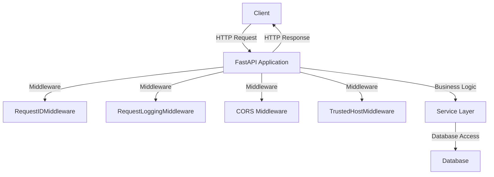

# Middleware Standards — FastAPI

## Overview and scope

The purpose of this document is to establish middleware standards for FastAPI applications within Xentic. These standards are designed to ensure consistency, security, and maintainability across all backend services developed using the FastAPI framework. This document is intended for software engineers, architects, and technical leads involved in the design and implementation of FastAPI applications within Xentic.

### Scope

This standard applies to all FastAPI projects developed under the Xentic umbrella. It encompasses:

- Middleware configuration and implementation.
- Guidelines for logging and request tracking.
- Security practices related to cross-origin resource sharing (CORS).
- Request ID management for tracing and debugging.

### Non-goals

This document does not cover:

- General FastAPI usage and features outside of middleware.
- Frontend application standards or practices.
- Database management or ORM standards.

### Glossary

| Term                  | Definition                                                                                   |
|-----------------------|----------------------------------------------------------------------------------------------|
| Middleware            | A function or component that processes requests and responses in a FastAPI application.      |
| CORS                  | Cross-Origin Resource Sharing, a security feature that allows or restricts resources.       |
| Request ID            | A unique identifier for each request, used for tracking and logging purposes.               |
| FastAPI               | A modern, fast (high-performance) web framework for building APIs with Python 3.6+ based on standard Python type hints. |
| Trusted Host          | A security feature that restricts the hosts that can interact with the FastAPI application. |

### How this standard fits the Xentic platform

The middleware standards outlined in this document are integral to the Xentic platform's architecture. By adhering to these guidelines, developers will ensure that:

- **Consistency**: All FastAPI applications will have a uniform approach to middleware, making it easier to understand and maintain.
- **Security**: Implementing CORS and trusted host middleware will protect against common web vulnerabilities.
- **Traceability**: The Request ID middleware will facilitate better logging and debugging, which is crucial for maintaining high-quality services.

### Required Middleware Stack

All FastAPI applications MUST implement the following middleware stack:

```python
from fastapi import FastAPI
from starlette.middleware.cors import CORSMiddleware
from starlette.middleware.trustedhost import TrustedHostMiddleware
from starlette.middleware.base import BaseHTTPMiddleware
from .middlewares import RequestIDMiddleware, RequestLoggingMiddleware
from .config import settings

def register_middleware(app: FastAPI):
    app.add_middleware(TrustedHostMiddleware, allowed_hosts=settings.ALLOWED_HOSTS)
    app.add_middleware(CORSMiddleware,
        allow_origins=settings.CORS_ORIGINS,
        allow_methods=["GET", "POST", "PUT", "PATCH", "DELETE"],
        allow_headers=["Authorization", "Content-Type", "X-Request-ID"],
        expose_headers=["X-Request-ID"])
    app.add_middleware(RequestIDMiddleware)
    app.add_middleware(RequestLoggingMiddleware)
```

### Request ID Middleware

The Request ID middleware MUST be implemented to manage unique request identifiers:

```python
import uuid
from starlette.middleware.base import BaseHTTPMiddleware

class RequestIDMiddleware(BaseHTTPMiddleware):
    async def dispatch(self, request, call_next):
        request_id = request.headers.get("X-Request-ID") or str(uuid.uuid4())
        request.state.request_id = request_id
        response = await call_next(request)
        response.headers["X-Request-ID"] = request_id
        return response
```

### Request Logging Middleware

The Request Logging middleware MUST be implemented to log request details:

```python
import time
from starlette.middleware.base import BaseHTTPMiddleware
import logging

logger = logging.getLogger("app")

class RequestLoggingMiddleware(BaseHTTPMiddleware):
    async def dispatch(self, request, call_next):
        start = time.time()
        response = await call_next(request)
        logger.info("HTTP request", extra={
            "method": request.method,
            "path": request.url.path,
            "status": response.status_code,
            "duration_ms": round((time.time() - start) * 1000, 2),
        })
        return response
```

### Rules

- **MUST NOT** use `allow_origins=["*"]` in production environments.
- **MUST** maintain a per-environment allowlist of trusted frontend origins in the configuration settings.
- **SHOULD** ensure all middleware is registered in the order specified to avoid conflicts.

## Standards and policies

1. **MUST** implement the required middleware stack as specified in the "Required Middleware Stack" section to ensure consistent behavior across all FastAPI applications.

2. **MUST NOT** use third-party middleware that has not been approved by Xentic's architecture review board. All middleware must be vetted for security and performance.

3. **MUST** configure CORS settings in the application configuration file, ensuring that only trusted origins are allowed. Example configuration in `config.yaml`:

    ```yaml
    CORS_ORIGINS:
      - https://frontend.internal.xentic.io
      - https://api.internal.xentic.io
    ```

4. **SHOULD** implement logging at the request level using the Request Logging Middleware to capture essential details about each request, including method, path, status, and duration.

5. **MUST** include a Request ID in all responses to facilitate traceability. This Request ID MUST be included in the headers of all outgoing responses.

6. **MUST NOT** expose sensitive information in logs. Ensure that any logging middleware filters out sensitive data such as passwords or personal information.

7. **MUST** use environment variables for sensitive configuration settings, such as database credentials and API keys, rather than hardcoding them in the application code.

8. **SHOULD** apply the principle of least privilege when configuring CORS. Only allow origins that are necessary for the application's functionality.

9. **MUST** ensure that the Trusted Host Middleware is configured correctly to prevent host header attacks. Example configuration in `config.yaml`:

    ```yaml
    ALLOWED_HOSTS:
      - "api.internal.xentic.io"
      - "frontend.internal.xentic.io"
    ```

10. **MUST NOT** allow any untrusted hosts in the `ALLOWED_HOSTS` configuration. This is critical for maintaining application security.

11. **SHOULD** document any custom middleware implemented within the project, including its purpose, configuration, and usage examples.

12. **MUST** ensure that all middleware is tested thoroughly, including unit tests and integration tests, to validate its functionality and performance.

13. **MUST** adhere to the naming conventions for middleware classes, following the pattern `*Middleware`, to maintain clarity and consistency.

14. **SHOULD** include health check endpoints in the application to monitor the status of middleware components and overall application health.

15. **MUST** use structured logging to facilitate easier querying and analysis of logs. Use a logging format that includes JSON for better integration with logging systems.

16. **MUST NOT** ignore performance implications of middleware. Evaluate the impact of each middleware component on request processing time and optimize as necessary.

17. **MUST** ensure that all middleware is compatible with the FastAPI version in use, and update dependencies regularly to mitigate vulnerabilities.

18. **SHOULD** consider the use of asynchronous middleware where applicable to improve performance and responsiveness of the application.

19. **MUST** handle exceptions gracefully within middleware, ensuring that any errors are logged and appropriate HTTP responses are returned to the client.

20. **MUST NOT** have any blocking operations in middleware that could lead to degraded performance. Use asynchronous patterns to avoid blocking the event loop.

21. **SHOULD** provide clear documentation for any custom middleware, including usage examples and configuration options, in the project's README or dedicated documentation site.

22. **MUST** follow the Xentic code review process for all middleware changes to ensure adherence to standards and best practices. 

By following these standards and policies, Xentic aims to create a secure, maintainable, and high-performance FastAPI ecosystem that supports the company's goals and objectives.

## Architecture and design

The architecture of the FastAPI middleware layer at Xentic is designed to ensure robust, secure, and maintainable applications. The following sections outline the component diagram, data flows, integration points, and failure domains.

### Component Diagram



### Data Flows

1. **Incoming Request Flow**:
   - The client sends an HTTP request to the FastAPI application.
   - The request passes through the middleware stack:
     - **TrustedHostMiddleware** checks if the request's host is allowed.
     - **CORS Middleware** handles cross-origin requests.
     - **RequestIDMiddleware** generates or retrieves a Request ID.
     - **RequestLoggingMiddleware** logs the request details.
   - The request reaches the service layer for processing.

2. **Response Flow**:
   - After processing, the service layer sends a response back to the FastAPI application.
   - The response passes through the middleware stack again:
     - **RequestIDMiddleware** adds the Request ID to the response headers.
     - **RequestLoggingMiddleware** logs the response details.
   - The response is sent back to the client.

### Integration Points

- **Database**: The service layer interacts with the database to perform CRUD operations. All database interactions MUST be handled asynchronously to prevent blocking.
- **External APIs**: If the application integrates with external services, these calls MUST be managed within the service layer to maintain separation of concerns.
- **Logging Systems**: The Request Logging Middleware MUST integrate with a centralized logging system for monitoring and alerting.

### Failure Domains

- **Middleware Failures**: If any middleware fails (e.g., CORS or TrustedHost), it MUST return appropriate HTTP error responses (e.g., 403 Forbidden).
- **Service Layer Failures**: Any errors in the business logic or database access MUST be caught and transformed into user-friendly error messages.
- **Network Issues**: If the application cannot reach external services, it MUST handle these exceptions gracefully and provide fallback mechanisms if applicable.

### Summary

By adhering to this architecture and design framework, Xentic ensures that the FastAPI applications are secure, maintainable, and efficient. The middleware stack plays a critical role in managing requests and responses, logging, and enforcing security policies. All components must work together seamlessly to provide a high-quality user experience while maintaining system integrity.

## Configuration reference

### application.yml

The following is the configuration reference for the FastAPI application using YAML format. This configuration includes essential settings for CORS, logging, and environment variables.

```yaml
app:
  name: "Xentic FastAPI Service"
  version: "1.0.0"

cors:
  allow_origins:
    - "https://frontend.internal.xentic.io"
    - "https://api.internal.xentic.io"

logging:
  level: "INFO"
  format: "json"  # Options: json, plain
  log_file: "/var/log/xentic/fastapi_service.log"

request_id:
  header: "X-Request-ID"

database:
  host: "${DB_HOST}"  # Set via environment variable
  port: 5432
  user: "${DB_USER}"  # Set via environment variable
  password: "${DB_PASSWORD}"  # Set via environment variable
  name: "xentic_db"

health_check:
  endpoint: "/health"
  interval: 60  # in seconds
```

### Terraform Configuration

The following Terraform configuration is used to provision the infrastructure required for the FastAPI application. This includes defining environment variables and other necessary resources.

```hcl
resource "aws_ecs_cluster" "xentic_fastapi_cluster" {
  name = "xentic-fastapi-cluster"
}

resource "aws_ecs_task_definition" "xentic_fastapi_task" {
  family                   = "xentic-fastapi"
  network_mode             = "awsvpc"
  requires_compatibilities = ["FARGATE"]
  cpu                      = "256"
  memory                   = "512"

  container_definitions = jsonencode([
    {
      name      = "fastapi"
      image     = "xentic/fastapi:latest"
      essential = true

      environment = [
        {
          name  = "DB_HOST"
          value = "database.internal.xentic.io"
        },
        {
          name  = "DB_USER"
          value = "xentic_user"
        },
        {
          name  = "DB_PASSWORD"
          value = "secure_password"
        }
      ]
    }
  ])
}
```

### Environment Variables

The following table outlines the environment variables used in the FastAPI application configuration, including their default and production values.

| Variable Name     | Default Value                  | Production Value                      |
|--------------------|-------------------------------|--------------------------------------|
| `DB_HOST`          | `localhost`                   | `database.internal.xentic.io`       |
| `DB_USER`          | `user`                        | `xentic_user`                        |
| `DB_PASSWORD`      | `password`                    | `secure_password`                    |
| `LOG_LEVEL`        | `INFO`                        | `ERROR`                              |
| `CORS_ORIGINS`     | `["*"]`                      | `["https://frontend.internal.xentic.io"]` |
| `HEALTH_CHECK_INTERVAL` | `60`                   | `30`                                 |

### Summary of Configuration

- **CORS Settings**: MUST be configured to allow only trusted origins.
- **Logging Configuration**: MUST use structured logging in JSON format for better integration with logging systems.
- **Database Credentials**: MUST be set via environment variables to enhance security and avoid hardcoding sensitive information.
- **Health Check Endpoint**: MUST be configured to monitor application health and ensure uptime.

By adhering to this configuration reference, Xentic ensures that the FastAPI applications are properly set up for development, testing, and production environments, promoting security, maintainability, and performance.

## Implementation guide

To implement middleware in a FastAPI application at Xentic, follow these steps, which include creating multiple middleware classes and integrating them into the FastAPI application. 

### Step 1: Create Middleware Classes

1. **RequestIDMiddleware**: This middleware generates a unique request ID for each incoming request.

```python
from starlette.middleware.base import BaseHTTPMiddleware
import uuid

class RequestIDMiddleware(BaseHTTPMiddleware):
    async def dispatch(self, request, call_next):
        request_id = str(uuid.uuid4())
        request.headers['X-Request-ID'] = request_id
        response = await call_next(request)
        response.headers['X-Request-ID'] = request_id
        return response
```

2. **RequestLoggingMiddleware**: This middleware logs request and response details.

```python
import logging

class RequestLoggingMiddleware(BaseHTTPMiddleware):
    async def dispatch(self, request, call_next):
        logging.info(f"Request: {request.method} {request.url}")
        response = await call_next(request)
        logging.info(f"Response: {response.status_code}")
        return response
```

3. **CORS Middleware**: This middleware handles Cross-Origin Resource Sharing (CORS) settings.

```python
from fastapi.middleware.cors import CORSMiddleware

def add_cors_middleware(app):
    app.add_middleware(
        CORSMiddleware,
        allow_origins=["https://frontend.internal.xentic.io"],
        allow_credentials=True,
        allow_methods=["*"],
        allow_headers=["*"],
    )
```

### Step 2: Integrate Middleware into FastAPI Application

Now that the middleware classes are created, integrate them into your FastAPI application.

```python
from fastapi import FastAPI

app = FastAPI()

# Add middleware
app.add_middleware(RequestIDMiddleware)
app.add_middleware(RequestLoggingMiddleware)
add_cors_middleware(app)

@app.get("/")
async def read_root():
    return {"message": "Hello, World!"}

@app.get("/health")
async def health_check():
    return {"status": "healthy"}
```

### Step 3: Configure Logging

Ensure that structured logging is set up in your application. You can configure logging in your main application file.

```python
import logging
import sys

logging.basicConfig(
    level=logging.INFO,
    format='{"time": "%(asctime)s", "level": "%(levelname)s", "message": "%(message)s"}',
    handlers=[logging.StreamHandler(sys.stdout)]
)
```

### Step 4: Testing the Middleware

To test the middleware, run your FastAPI application and make requests to the endpoints. You should see logs for both requests and responses.

```bash
uvicorn main:app --host 0.0.0.0 --port 8000
```

### Step 5: Health Check Endpoint

The health check endpoint `/health` can be used to monitor the application's status. Ensure it returns a simple JSON response indicating the application's health.

### Summary of Middleware Implementation

- **RequestIDMiddleware**: Generates and attaches a unique request ID to each request and response.
- **RequestLoggingMiddleware**: Logs incoming requests and outgoing responses for monitoring.
- **CORS Middleware**: Configures CORS settings to allow specific origins.
- **Logging Configuration**: Structured logging in JSON format for better integration with logging systems.

By following these steps, Xentic ensures that the FastAPI applications are robust, maintainable, and compliant with internal standards. Each middleware component plays a critical role in managing requests, logging, and enforcing security policies.

## Security requirements

### Threat Model Summary

Xentic's FastAPI applications MUST adhere to a comprehensive threat model that identifies potential security risks and implements mitigations. The following threats should be considered:

- **Injection Attacks**: SQL injection, command injection, and other forms of injection must be prevented through proper input validation and parameterized queries.
- **Authentication and Authorization Flaws**: Ensure that only authenticated users can access protected resources and that users have appropriate permissions.
- **Data Exposure**: Sensitive data must be protected both in transit and at rest using encryption.
- **Denial of Service (DoS)**: Rate limiting and request throttling MUST be implemented to mitigate DoS attacks.

### Authentication and Authorization

Xentic applications MUST implement robust authentication and authorization mechanisms. The following practices MUST be followed:

- **Use OAuth 2.0**: All services MUST use OAuth 2.0 for user authentication and authorization. Tokens MUST be validated for each request.
- **Role-Based Access Control (RBAC)**: Implement RBAC to restrict access to resources based on user roles.
- **Session Management**: Sessions MUST be managed securely, with appropriate timeout settings and invalidation upon logout.

Example of OAuth 2.0 token validation:

```python
from fastapi import Depends, HTTPException
from fastapi.security import OAuth2PasswordBearer
from jose import JWTError, jwt

oauth2_scheme = OAuth2PasswordBearer(tokenUrl="token")

async def get_current_user(token: str = Depends(oauth2_scheme)):
    try:
        payload = jwt.decode(token, SECRET_KEY, algorithms=[ALGORITHM])
        user = get_user(payload["sub"])
    except JWTError:
        raise HTTPException(status_code=401, detail="Invalid authentication credentials")
    return user
```

### Secrets Management

Secrets MUST NOT be hardcoded in the application code. Instead, they should be managed using a secure secrets management solution. Xentic recommends the following:

- **Environment Variables**: Store sensitive information like API keys and database passwords in environment variables.
- **Secret Management Tools**: Use tools like HashiCorp Vault or AWS Secrets Manager to manage secrets securely.

Example of loading secrets from environment variables:

```python
import os

DB_PASSWORD = os.getenv("DB_PASSWORD")
```

### Input Validation

Input validation MUST be enforced at all entry points of the application. The following practices MUST be followed:

- **Use Pydantic Models**: Define data models using Pydantic to automatically validate incoming request data.
- **Sanitize Inputs**: Inputs must be sanitized to prevent injection attacks.

Example of a Pydantic model for input validation:

```python
from pydantic import BaseModel, constr

class User(BaseModel):
    username: constr(min_length=3, max_length=50)
    email: str
```

### Audit Logging

Audit logging MUST be implemented to track access and changes to sensitive data. The following guidelines MUST be adhered to:

- **Log Sensitive Actions**: Log all actions that modify sensitive data or change user permissions.
- **Centralized Logging**: Logs MUST be sent to a centralized logging system for monitoring and analysis.

Example of an audit log entry:

```python
import logging

def log_audit_event(action: str, user_id: str):
    logging.info(f"Audit Log - Action: {action}, User ID: {user_id}")
```

### Summary of Security Requirements

- **Threat Model**: Identify and mitigate risks including injection attacks, authentication flaws, data exposure, and DoS.
- **Authentication**: Implement OAuth 2.0 and RBAC for secure access control.
- **Secrets Management**: Use environment variables and secret management tools to handle sensitive information.
- **Input Validation**: Enforce validation using Pydantic models and sanitize inputs.
- **Audit Logging**: Implement comprehensive logging for sensitive actions and send logs to a centralized system.

By adhering to these security requirements, Xentic ensures that FastAPI applications are resilient against common threats and maintain the integrity and confidentiality of user data.

## Testing strategy

At Xentic, a comprehensive testing strategy is essential for ensuring the quality and reliability of FastAPI applications. The testing strategy consists of unit tests, integration tests, and contract tests, each serving a specific purpose in the development lifecycle. 

### Testing Types

1. **Unit Tests**: 
   - Focus on individual components or functions.
   - Should achieve at least **80% code coverage**.
   - Use the `pytest` framework for writing and executing tests.

2. **Integration Tests**: 
   - Validate the interaction between different components of the application.
   - Should also aim for **80% coverage** of the integrated components.
   - Utilize test clients provided by FastAPI for simulating requests.

3. **Contract Tests**: 
   - Ensure that the API adheres to the defined contract (e.g., OpenAPI specifications).
   - Should validate both request and response formats.
   - Use tools like `pact-python` for implementing consumer-driven contract tests.

### Coverage Targets

| Test Type        | Coverage Target |
|------------------|-----------------|
| Unit Tests       | 80%             |
| Integration Tests| 80%             |
| Contract Tests   | 100%            |

### Example Test Classes

#### Unit Test Example

Here is an example of a unit test for a FastAPI route:

```python
import pytest
from fastapi.testclient import TestClient
from app.main import app

client = TestClient(app)

def test_read_root():
    response = client.get("/")
    assert response.status_code == 200
    assert response.json() == {"message": "Hello, World!"}
```

#### Integration Test Example

An integration test example that checks the health endpoint:

```python
def test_health_check():
    response = client.get("/health")
    assert response.status_code == 200
    assert response.json() == {"status": "healthy"}
```

#### Contract Test Example

A contract test that verifies the response structure of an endpoint:

```python
from pact import Consumer, Provider

consumer = Consumer('FastAPIConsumer')
provider = Provider('FastAPIProvider')

@consumer.has_pact_with(provider)
def test_contract():
    expected = {
        "status": "healthy"
    }
    
    (consumer
     .given("the service is healthy")
     .upon_receiving("a request for health status")
     .with_request("GET", "/health")
     .will_respond_with(200, body=expected))

    with consumer:
        response = client.get("/health")
        assert response.json() == expected
```

### Best Practices for Testing

- **Isolate Tests**: Each test MUST be independent and should not rely on the state of other tests.
- **Use Fixtures**: Leverage `pytest` fixtures to set up common test data or configurations.
- **Run Tests Frequently**: Tests MUST be run automatically in CI/CD pipelines to catch issues early.
- **Document Tests**: Each test case MUST include comments explaining the purpose and expected outcomes.

By implementing this testing strategy, Xentic ensures that FastAPI applications are thoroughly tested, maintain high quality, and are resilient to changes in the codebase. Each type of test plays a critical role in the overall health of the application, and adherence to coverage targets will help maintain the integrity of the code.

## Observability and operations

At Xentic, observability is a critical aspect of maintaining the health and performance of FastAPI applications. The following components MUST be implemented to ensure comprehensive observability:

### Metrics

Metrics MUST be collected to monitor application performance and resource utilization. The following metrics are recommended:

- **Request Latency**: Measure the time taken to process requests.
- **Error Rates**: Track the percentage of failed requests.
- **Throughput**: Monitor the number of requests handled per second.
- **Resource Utilization**: Measure CPU and memory usage.

Example of exposing metrics using Prometheus:

```python
from fastapi import FastAPI
from prometheus_fastapi_instrumentator import Instrumentator

app = FastAPI()

Instrumentator().instrument(app).expose(app)
```

### Logs

Structured logging MUST be implemented to facilitate effective debugging and monitoring. The logs should include:

- **Timestamp**: When the log entry was created.
- **Log Level**: Severity of the log (INFO, ERROR, etc.).
- **Message**: Description of the event.
- **Context**: Additional context such as user ID or request ID.

Example of structured logging configuration:

```python
import logging
import sys

logging.basicConfig(
    level=logging.INFO,
    format='{"timestamp": "%(asctime)s", "level": "%(levelname)s", "message": "%(message)s"}',
    handlers=[logging.StreamHandler(sys.stdout)]
)
```

### Traces

Distributed tracing MUST be implemented to track requests as they flow through various services. This enables Xentic to diagnose performance bottlenecks and errors across service boundaries. 

- **OpenTelemetry**: Use OpenTelemetry for instrumentation.
- **Trace Context**: Pass trace context in request headers.

Example of integrating OpenTelemetry:

```python
from opentelemetry import trace
from opentelemetry.instrumentation.fastapi import FastAPIInstrumentor

tracer = trace.get_tracer(__name__)
FastAPIInstrumentor.instrument_app(app)
```

### Dashboards

Dashboards MUST be created to visualize metrics, logs, and traces. Xentic recommends using Grafana for this purpose. Key dashboards should include:

- **Application Performance Dashboard**: Display request latency, error rates, and throughput.
- **Resource Utilization Dashboard**: Show CPU and memory usage over time.
- **Error Tracking Dashboard**: Highlight the most common errors and their frequency.

### Alerts

Alerting mechanisms MUST be established to notify the team of critical issues. Alerts should be configured for:

- **High Error Rates**: Trigger alerts if error rates exceed a defined threshold.
- **High Latency**: Notify if request latency exceeds acceptable limits.
- **Resource Exhaustion**: Alert when CPU or memory usage approaches critical levels.

Example of Prometheus alerting rule:

```yaml
groups:
  - name: application-alerts
    rules:
      - alert: HighErrorRate
        expr: rate(http_requests_total{status="500"}[5m]) > 0.05
        for: 10m
        labels:
          severity: critical
        annotations:
          summary: "High error rate detected"
          description: "More than 5% of requests are failing."
```

### Service Level Objectives (SLOs)

SLOs MUST be defined to measure the reliability and performance of the FastAPI applications. Key SLOs should include:

| SLO Description            | Target   |
|----------------------------|----------|
| Request Latency            | < 200ms  |
| Error Rate                 | < 1%     |
| Uptime                      | 99.9%    |

### On-call Runbook Steps

In the event of an incident, an on-call runbook MUST be followed. The steps include:

1. **Acknowledge the Alert**: Confirm receipt of the alert.
2. **Assess the Impact**: Determine the scope and impact of the issue.
3. **Gather Logs and Metrics**: Collect relevant logs and metrics to diagnose the issue.
4. **Identify the Root Cause**: Analyze the data to find the root cause of the problem.
5. **Implement a Fix**: Apply a fix or workaround to resolve the issue.
6. **Communicate**: Update stakeholders on the status and resolution.
7. **Post-Mortem**: Conduct a post-mortem analysis to prevent future occurrences.

By following these observability and operations standards, Xentic ensures that FastAPI applications are monitored effectively, enabling proactive management of performance and reliability.

## Migration and versioning

At Xentic, managing migrations and versioning for FastAPI applications is crucial to maintain stability and ensure a smooth upgrade path. The following guidelines MUST be adhered to when handling migrations and versioning.

### Upgrade Paths

1. **Semantic Versioning**: All FastAPI applications MUST follow [Semantic Versioning](https://semver.org/) (MAJOR.MINOR.PATCH). 
   - MAJOR version changes MUST introduce backward-incompatible changes.
   - MINOR version changes SHOULD add functionality in a backward-compatible manner.
   - PATCH version changes MUST be backward-compatible bug fixes.

2. **Upgrade Documentation**: Each version release MUST include comprehensive upgrade documentation that outlines:
   - Changes made (new features, bug fixes, breaking changes).
   - Migration steps required for existing deployments.
   - Example configuration changes, if applicable.

### Deprecation Policy

1. **Deprecation Notices**: Any feature or endpoint that is planned for deprecation MUST be marked as deprecated in the documentation and code comments at least one full version cycle (i.e., one MINOR version) before removal.
   
2. **Grace Period**: Deprecated features MUST remain available for at least one full MAJOR version cycle before being removed. 

3. **Deprecation Warnings**: The application MUST log warnings when deprecated features are used, guiding users to the recommended alternatives.

### Backward Compatibility

1. **Backward Compatibility Testing**: Every new release MUST be tested against the previous stable version to ensure backward compatibility. Automated tests should cover:
   - Existing API endpoints.
   - Data models and serialization/deserialization processes.

2. **Versioned APIs**: If breaking changes are unavoidable, the application MUST support versioned APIs. For example:
   - Use URL versioning: `/api/v1/resource`, `/api/v2/resource`.
   - Maintain documentation for each version.

### Rollback Procedures

1. **Rollback Strategy**: A rollback strategy MUST be defined and tested for every deployment. This includes:
   - Database migration rollbacks.
   - Application version rollbacks.

2. **Database Migration Rollbacks**: Use migration tools like Alembic to manage database schema changes. Each migration MUST include a corresponding rollback script. Example of a migration script:

```python
from alembic import op
import sqlalchemy as sa

def upgrade():
    op.create_table(
        'users',
        sa.Column('id', sa.Integer, primary_key=True),
        sa.Column('name', sa.String(length=50), nullable=False),
        sa.Column('email', sa.String(length=100), nullable=False)
    )

def downgrade():
    op.drop_table('users')
```

3. **Application Rollback**: Maintain previous application versions in a version control system (e.g., Git). The deployment process MUST allow for quick rollbacks to the last stable version. Example rollback command using Docker:

```bash
docker service update --rollback my_fastapi_service
```

### Versioning Example Table

| Version | Release Date | Changes                                   | Deprecation Notes               |
|---------|--------------|-------------------------------------------|----------------------------------|
| 1.0.0  | 2023-01-15   | Initial release                          | N/A                              |
| 1.1.0  | 2023-03-20   | Added new authentication endpoints       | N/A                              |
| 1.2.0  | 2023-06-10   | Improved performance on data retrieval   | Deprecated old auth method      |
| 2.0.0  | 2023-09-30   | Major refactor, breaking changes         | Removed old auth method         |

### Best Practices for Migration and Versioning

- **Automate Migration Testing**: Use CI/CD pipelines to automate testing of migrations and ensure they do not break existing functionality.
- **Version Control**: All code, including migrations, MUST be version-controlled to track changes and facilitate rollbacks.
- **Communicate Changes**: Ensure that all stakeholders are informed of changes, especially breaking changes, through release notes and internal documentation.

By following these migration and versioning standards, Xentic ensures that FastAPI applications are stable, reliable, and maintainable, facilitating seamless upgrades and minimizing disruptions to users.

## FAQ, anti-patterns, and checklists

### FAQ

1. **What is FastAPI?**
   - FastAPI is a modern, fast (high-performance), web framework for building APIs with Python 3.6+ based on standard Python type hints.

2. **How do I handle CORS in FastAPI?**
   - Use the `CORSMiddleware` provided by FastAPI to handle Cross-Origin Resource Sharing. Example:
   ```python
   from fastapi.middleware.cors import CORSMiddleware

   app.add_middleware(
       CORSMiddleware,
       allow_origins=["*"],  # Update with specific origins in production
       allow_credentials=True,
       allow_methods=["*"],
       allow_headers=["*"],
   )
   ```

3. **How do I manage environment variables?**
   - Use the `python-dotenv` package to load environment variables from a `.env` file. Example:
   ```python
   from dotenv import load_dotenv
   import os

   load_dotenv()
   DATABASE_URL = os.getenv("DATABASE_URL")
   ```

4. **What should I use for database migrations?**
   - Use Alembic for managing database migrations. Ensure that each migration script includes both `upgrade` and `downgrade` functions.

5. **How can I implement authentication?**
   - Use OAuth2 with Password (and hashing) for user authentication. FastAPI provides built-in support for this. Example:
   ```python
   from fastapi.security import OAuth2PasswordBearer, OAuth2PasswordRequestForm

   oauth2_scheme = OAuth2PasswordBearer(tokenUrl="token")
   ```

6. **What testing framework should I use?**
   - Use `pytest` for testing FastAPI applications. It provides powerful features for testing and is widely adopted in the Python community.

7. **How do I document my API?**
   - FastAPI automatically generates documentation using OpenAPI. Access it at `/docs` for Swagger UI or `/redoc` for ReDoc.

8. **What is the recommended way to handle exceptions?**
   - Create custom exception handlers using FastAPI's exception handling capabilities. Example:
   ```python
   from fastapi import HTTPException

   @app.exception_handler(HTTPException)
   async def http_exception_handler(request, exc):
       return JSONResponse(status_code=exc.status_code, content={"detail": exc.detail})
   ```

9. **How do I implement rate limiting?**
   - Use middleware or third-party libraries like `slowapi` to implement rate limiting in FastAPI applications.

10. **What is the best way to structure my FastAPI application?**
    - Follow a modular structure by separating routes, models, and services into different files or directories to maintain clarity and organization.

### Anti-Patterns

| Anti-Pattern                     | Description                                                                 |
|----------------------------------|-----------------------------------------------------------------------------|
| Hardcoding Configuration          | Avoid hardcoding configuration values in the code; use environment variables. |
| Ignoring Asynchronous Features    | Not utilizing FastAPI's asynchronous capabilities can lead to performance issues. |
| Blocking I/O Operations           | Performing blocking I/O operations in request handlers can degrade performance. |
| Not Handling Exceptions           | Failing to handle exceptions properly can lead to unhandled errors and poor user experience. |
| Monolithic Structure              | Keeping all code in a single file can lead to maintainability issues; use modular design. |
| Skipping API Documentation        | Not documenting APIs can lead to confusion and difficulties in usage for consumers. |

### Pre-Merge Checklist

- [ ] Code adheres to PEP 8 style guidelines.
- [ ] All new features are covered by unit tests.
- [ ] Existing tests are not broken by new changes.
- [ ] Documentation is updated to reflect changes.
- [ ] Code is reviewed by at least one other team member.
- [ ] Environment variables are correctly configured for new features.

### Production Checklist

- [ ] All migrations are applied successfully.
- [ ] Application is tested in a staging environment.
- [ ] Health checks are implemented and verified.
- [ ] Monitoring and alerting are configured.
- [ ] Rollback procedures are tested and documented.
- [ ] Backups are taken before deployment.
