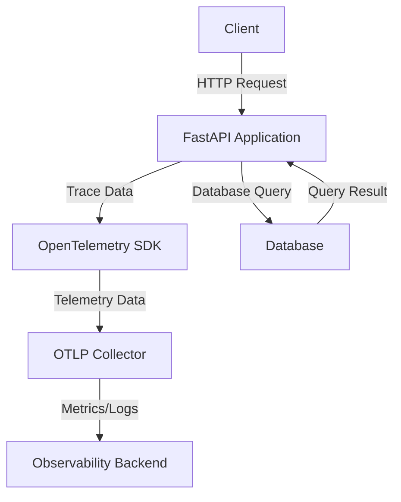

# OpenTelemetry Instrumentation — FastAPI

## Overview and scope

### Purpose
The purpose of this document is to establish standards for implementing OpenTelemetry instrumentation within FastAPI applications at Xentic. This ensures consistent, reliable, and efficient observability practices across all services, facilitating better monitoring, tracing, and debugging capabilities.

### Audience
This document is intended for:
- Software Engineers
- DevOps Engineers
- Quality Assurance Engineers
- Technical Leads
- Architects

### Scope
This standard applies to all FastAPI applications developed within Xentic. It covers:
- Configuration of OpenTelemetry SDK
- Instrumentation of FastAPI routes and middleware
- Exporting telemetry data to observability backends
- Best practices for using OpenTelemetry in production environments

### Non-goals
This document does NOT cover:
- OpenTelemetry instrumentation for non-FastAPI applications
- Detailed explanations of OpenTelemetry concepts
- Integration with specific observability backends beyond basic configuration

### Glossary
| Term                  | Definition                                                                 |
|-----------------------|-----------------------------------------------------------------------------|
| OpenTelemetry         | An open-source observability framework for cloud-native software.          |
| FastAPI               | A modern, fast web framework for building APIs with Python.                |
| Instrumentation       | The process of adding monitoring capabilities to applications.              |
| Tracing               | The ability to follow a request as it travels through various services.    |
| Metrics               | Quantitative measures that provide insights into application performance.   |

### How this standard fits the Xentic platform
The implementation of OpenTelemetry in FastAPI applications aligns with Xentic's commitment to observability and performance optimization. By adhering to these standards, teams can ensure:
- Consistent telemetry data collection across services
- Enhanced troubleshooting capabilities
- Improved application performance monitoring

### Example Configuration
Below is an example of how to configure OpenTelemetry in a FastAPI application:

```python
from fastapi import FastAPI
from opentelemetry import trace
from opentelemetry.instrumentation.fastapi import FastAPIInstrumentor
from opentelemetry.exporter.otlp.proto.grpc.exporter import OTLPSpanExporter
from opentelemetry.sdk.resources import Resource
from opentelemetry.sdk.trace import TracerProvider
from opentelemetry.sdk.trace.export import BatchSpanProcessor

# Initialize FastAPI
app = FastAPI()

# Configure OpenTelemetry
resource = Resource.create({"service.name": "my_fastapi_service"})
trace.set_tracer_provider(TracerProvider(resource=resource))

# Configure the OTLP exporter
otlp_exporter = OTLPSpanExporter(endpoint="https://otel-collector.internal.xentic.io:4317", insecure=True)
trace.get_tracer_provider().add_span_processor(BatchSpanProcessor(otlp_exporter))

# Instrument FastAPI application
FastAPIInstrumentor.instrument_app(app)

@app.get("/")
async def read_root():
    return {"Hello": "World"}
```

By following this standard, Xentic aims to enhance the observability of its FastAPI applications, ensuring that all services are effectively monitored and optimized for performance.

## Standards and policies

1. **MUST** use the OpenTelemetry SDK version compatible with FastAPI applications. Always refer to the official OpenTelemetry documentation for the latest versioning guidelines.

2. **MUST NOT** hard-code sensitive information such as API keys or endpoints in the source code. Use environment variables or secure vaults for configuration management.

3. **MUST** configure the OpenTelemetry SDK in the main entry point of the FastAPI application to ensure that all requests are traced from the start.

4. **SHOULD** use the `FastAPIInstrumentor` to automatically instrument all routes and middleware in the FastAPI application.

5. **MUST** define a service name in the OpenTelemetry resource configuration that follows the format `com.xentic.<service>`, ensuring clarity in telemetry data.

6. **MUST NOT** use blocking calls in the instrumentation code. Ensure that all telemetry operations are non-blocking to avoid degrading application performance.

7. **SHOULD** implement error handling within the tracing logic to capture and report exceptions effectively.

8. **MUST** export telemetry data to a centralized observability backend, such as the OpenTelemetry Collector, configured to the internal Xentic endpoint.

9. **MUST NOT** expose telemetry endpoints to the public internet. All telemetry data must be sent over secure channels.

10. **SHOULD** utilize structured logging alongside OpenTelemetry to provide context in logs that correlate with traces.

11. **MUST** ensure that all dependencies related to OpenTelemetry are included in the `requirements.txt` file of the FastAPI application.

12. **MUST NOT** disable tracing in production environments. Tracing must be enabled to ensure observability of all production services.

13. **SHOULD** regularly review and update the OpenTelemetry instrumentation to align with evolving best practices and updates from the OpenTelemetry community.

14. **MUST** create and maintain documentation for any custom instrumentation added to the FastAPI application to ensure clarity and maintainability.

15. **SHOULD** use sampling strategies to manage the volume of telemetry data sent to the backend, especially in high-traffic applications.

16. **MUST** validate the configuration of OpenTelemetry in a staging environment before deploying to production.

### Example Configuration for Environment Variables
Ensure sensitive data is managed securely by using environment variables as follows:

```bash
export OTEL_EXPORTER_OTLP_ENDPOINT=https://otel-collector.internal.xentic.io:4317
export OTEL_RESOURCE_ATTRIBUTES=service.name=com.xentic.my_fastapi_service
export OTEL_TRACES_SAMPLER=parentbased_always_on
```

### Example of Error Handling in Tracing
Implement error handling within your FastAPI routes to capture exceptions:

```python
from fastapi import FastAPI, HTTPException
from opentelemetry import trace

app = FastAPI()
tracer = trace.get_tracer(__name__)

@app.get("/items/{item_id}")
async def read_item(item_id: int):
    with tracer.start_as_current_span("read_item"):
        if item_id < 0:
            raise HTTPException(status_code=400, detail="Item ID must be positive")
        return {"item_id": item_id}
```

By adhering to these standards and policies, Xentic ensures that its FastAPI applications are effectively instrumented for observability, providing a robust framework for monitoring and performance analysis.

## Architecture and design

### Component Diagram



### Data Flows

1. **Client to FastAPI Application**: The client sends an HTTP request to the FastAPI application.
2. **FastAPI Application to OpenTelemetry SDK**: The application processes the request and sends trace data to the OpenTelemetry SDK.
3. **OpenTelemetry SDK to OTLP Collector**: The SDK exports telemetry data to the OTLP Collector.
4. **OTLP Collector to Observability Backend**: The collector forwards the telemetry data to a centralized observability backend for analysis.
5. **Database Interaction**: The FastAPI application interacts with the database to fetch or store data, and the results are returned to the application.

### Integration Points

- **OpenTelemetry SDK**: Integrates directly with FastAPI to instrument routes and middleware.
- **OTLP Collector**: Acts as a bridge between the FastAPI application and the observability backend, ensuring secure and efficient data transfer.
- **Database**: The application must handle database interactions while ensuring telemetry data is captured for these operations.

### Failure Domains

- **Client Communication**: If the client cannot reach the FastAPI application due to network issues, requests will fail.
- **FastAPI Application**: Application crashes or unhandled exceptions can lead to loss of telemetry data and user experience degradation.
- **OpenTelemetry SDK**: Any misconfiguration or failure in the SDK can prevent proper data collection, leading to gaps in observability.
- **OTLP Collector**: If the collector is down or misconfigured, telemetry data will not reach the observability backend.
- **Database**: Database outages or slow queries can affect application performance and must be monitored for latency.

### Best Practices

- **Redundancy**: Ensure that the OTLP Collector is deployed in a highly available configuration to avoid data loss.
- **Monitoring**: Continuously monitor the health of the FastAPI application, OpenTelemetry SDK, and OTLP Collector to proactively address issues.
- **Error Handling**: Implement robust error handling in the application to capture and log exceptions, ensuring that telemetry data reflects application health.
- **Testing**: Regularly test the entire data flow from the FastAPI application to the observability backend to ensure all components are functioning correctly.

### Example of Instrumentation in FastAPI

To ensure comprehensive observability, instrument your FastAPI routes as follows:

```python
from fastapi import FastAPI, Depends
from opentelemetry import trace

app = FastAPI()
tracer = trace.get_tracer(__name__)

@app.get("/users/{user_id}")
async def get_user(user_id: int):
    with tracer.start_as_current_span("get_user"):
        # Simulate database call
        user = await fetch_user_from_db(user_id)
        return user

async def fetch_user_from_db(user_id: int):
    # Simulate a database operation
    return {"user_id": user_id, "name": "John Doe"}
```

By following these architectural guidelines and integrating OpenTelemetry effectively, Xentic ensures that its FastAPI applications maintain high levels of observability, enabling teams to monitor performance and troubleshoot issues efficiently.

## Configuration reference

### Application Configuration (application.yml)

The following example demonstrates how to configure OpenTelemetry in your FastAPI application using a YAML configuration file.

```yaml
otel:
  exporter:
    otlp:
      endpoint: "https://otel-collector.internal.xentic.io:4317"
      insecure: true
  resource:
    attributes:
      service.name: "com.xentic.my_fastapi_service"
  traces:
    sampler: "parentbased_always_on"
```

### Terraform Configuration

When deploying your FastAPI application using Terraform, ensure that the required environment variables for OpenTelemetry are set correctly.

```hcl
resource "aws_lambda_function" "my_fastapi_function" {
  function_name = "my_fastapi_function"
  handler       = "app.handler"
  runtime       = "python3.8"
  environment = {
    OTEL_EXPORTER_OTLP_ENDPOINT = "https://otel-collector.internal.xentic.io:4317"
    OTEL_RESOURCE_ATTRIBUTES     = "service.name=com.xentic.my_fastapi_service"
    OTEL_TRACES_SAMPLER          = "parentbased_always_on"
  }
  # Additional configuration...
}
```

### Environment Variables

The following table outlines the necessary environment variables for configuring OpenTelemetry in your FastAPI application, including default and production values.

| Environment Variable                  | Default Value                                           | Production Value                                   |
|---------------------------------------|--------------------------------------------------------|---------------------------------------------------|
| `OTEL_EXPORTER_OTLP_ENDPOINT`        | `http://localhost:4317`                               | `https://otel-collector.internal.xentic.io:4317` |
| `OTEL_RESOURCE_ATTRIBUTES`            | `service.name=default_service`                        | `service.name=com.xentic.my_fastapi_service`     |
| `OTEL_TRACES_SAMPLER`                 | `always_on`                                           | `parentbased_always_on`                           |
| `OTEL_LOG_LEVEL`                      | `INFO`                                                | `DEBUG`                                           |
| `OTEL_TRACES_EXPORTER`                | `otlp`                                               | `otlp`                                           |
| `OTEL_METRICS_EXPORTER`               | `none`                                               | `otlp`                                           |

### Additional Configuration Options

- **Log Level**: Set the log level for OpenTelemetry to control the verbosity of logs.
- **Metrics Exporter**: Define the metrics exporter to use for sending metrics data. The `otlp` exporter is recommended for production environments.

### Example of Complete Environment Variable Setup

To ensure a secure and effective setup, use the following commands to export the environment variables:

```bash
export OTEL_EXPORTER_OTLP_ENDPOINT=https://otel-collector.internal.xentic.io:4317
export OTEL_RESOURCE_ATTRIBUTES=service.name=com.xentic.my_fastapi_service
export OTEL_TRACES_SAMPLER=parentbased_always_on
export OTEL_LOG_LEVEL=INFO
export OTEL_TRACES_EXPORTER=otlp
export OTEL_METRICS_EXPORTER=otlp
```

By adhering to these configuration standards, Xentic ensures that its FastAPI applications are properly instrumented for observability, facilitating effective monitoring and performance optimization.

## Implementation guide

To implement OpenTelemetry instrumentation in a FastAPI application, follow these detailed steps:

### Step 1: Install Required Packages

Ensure you have the necessary packages installed. Use the following command to install OpenTelemetry libraries:

```bash
pip install opentelemetry-api opentelemetry-sdk opentelemetry-instrumentation-fastapi opentelemetry-exporter-otlp
```

### Step 2: Initialize OpenTelemetry

Create a new Python file (e.g., `main.py`) and set up OpenTelemetry at the start of your application.

```python
import os
from fastapi import FastAPI
from opentelemetry import trace
from opentelemetry.exporter.otlp.proto.grpc.trace_exporter import OTLPSpanExporter
from opentelemetry.sdk.resources import Resource
from opentelemetry.sdk.trace import TracerProvider
from opentelemetry.sdk.trace.export import BatchSpanProcessor

# Initialize FastAPI
app = FastAPI()

# Set up OpenTelemetry
resource = Resource.create({"service.name": os.getenv("OTEL_RESOURCE_ATTRIBUTES", "com.xentic.my_fastapi_service")})
tracer_provider = TracerProvider(resource=resource)
trace.set_tracer_provider(tracer_provider)

# Set up OTLP exporter
otlp_exporter = OTLPSpanExporter(endpoint=os.getenv("OTEL_EXPORTER_OTLP_ENDPOINT"), insecure=True)
tracer_provider.add_span_processor(BatchSpanProcessor(otlp_exporter))
```

### Step 3: Instrument FastAPI Routes

Next, instrument your FastAPI routes to capture traces. Below is an example of how to instrument a simple user retrieval route.

```python
@app.get("/users/{user_id}")
async def get_user(user_id: int):
    with trace.get_tracer(__name__).start_as_current_span("get_user"):
        user = await fetch_user_from_db(user_id)
        return user

async def fetch_user_from_db(user_id: int):
    # Simulate a database operation
    return {"user_id": user_id, "name": "John Doe"}
```

### Step 4: Add Middleware for Automatic Tracing

To automatically trace requests and responses, add OpenTelemetry middleware to your FastAPI application.

```python
from opentelemetry.instrumentation.fastapi import FastAPIInstrumentor

# Instrument FastAPI application
FastAPIInstrumentor.instrument_app(app)
```

### Step 5: Run Your Application

Run your FastAPI application using the command below:

```bash
uvicorn main:app --host 0.0.0.0 --port 8000
```

### Step 6: Verify Traces

To verify that traces are being sent to the OTLP collector, check the logs of your FastAPI application or the observability backend configured to receive the telemetry data.

### Complete Example

Here is the complete code for your FastAPI application with OpenTelemetry instrumentation:

```python
import os
from fastapi import FastAPI
from opentelemetry import trace
from opentelemetry.exporter.otlp.proto.grpc.trace_exporter import OTLPSpanExporter
from opentelemetry.sdk.resources import Resource
from opentelemetry.sdk.trace import TracerProvider
from opentelemetry.sdk.trace.export import BatchSpanProcessor
from opentelemetry.instrumentation.fastapi import FastAPIInstrumentor

# Initialize FastAPI
app = FastAPI()

# Set up OpenTelemetry
resource = Resource.create({"service.name": os.getenv("OTEL_RESOURCE_ATTRIBUTES", "com.xentic.my_fastapi_service")})
tracer_provider = TracerProvider(resource=resource)
trace.set_tracer_provider(tracer_provider)

# Set up OTLP exporter
otlp_exporter = OTLPSpanExporter(endpoint=os.getenv("OTEL_EXPORTER_OTLP_ENDPOINT"), insecure=True)
tracer_provider.add_span_processor(BatchSpanProcessor(otlp_exporter))

# Instrument FastAPI application
FastAPIInstrumentor.instrument_app(app)

@app.get("/users/{user_id}")
async def get_user(user_id: int):
    with trace.get_tracer(__name__).start_as_current_span("get_user"):
        user = await fetch_user_from_db(user_id)
        return user

async def fetch_user_from_db(user_id: int):
    # Simulate a database operation
    return {"user_id": user_id, "name": "John Doe"}
```

### Conclusion

By following this implementation guide, your FastAPI application will be effectively instrumented with OpenTelemetry, allowing for comprehensive observability and monitoring. Ensure that you adhere to the configuration standards and best practices outlined in previous sections to maintain optimal performance and reliability.

## Security requirements

To ensure the security of FastAPI applications at Xentic, the following security requirements must be implemented:

### Threat Model Summary

The primary threats to FastAPI applications include:

- **Injection Attacks**: SQL injection, command injection, etc.
- **Cross-Site Scripting (XSS)**: Malicious scripts executed in the user's browser.
- **Cross-Site Request Forgery (CSRF)**: Unauthorized commands transmitted from a user that the web application trusts.
- **Data Exposure**: Sensitive data being exposed through insecure endpoints or misconfigurations.

### Authentication and Authorization

- **Authentication**: All endpoints MUST require authentication using OAuth2 with JWT tokens. The token MUST be validated for each request.
  
- **Authorization**: Role-based access control (RBAC) MUST be implemented. Each user role MUST have defined permissions for accessing specific resources.

Example of OAuth2 implementation:

```python
from fastapi import Depends, FastAPI, HTTPException
from fastapi.security import OAuth2PasswordBearer, OAuth2PasswordRequestForm

oauth2_scheme = OAuth2PasswordBearer(tokenUrl="token")

@app.post("/token")
async def login(form_data: OAuth2PasswordRequestForm = Depends()):
    # Validate user credentials and return JWT token
    pass

async def get_current_user(token: str = Depends(oauth2_scheme)):
    # Validate token and return user
    pass
```

### Secrets Management

- **Secrets MUST NOT be hardcoded** in the application code. Use environment variables or a secrets management tool (e.g., AWS Secrets Manager, HashiCorp Vault).
  
- **Configuration files** (e.g., `application.yml`) MUST NOT contain sensitive information. Use placeholders or reference environment variables.

Example of using environment variables for secrets:

```yaml
database:
  username: ${DB_USERNAME}
  password: ${DB_PASSWORD}
```

### Input Validation

- All user inputs MUST be validated to prevent injection attacks and ensure data integrity. Use Pydantic models for request validation.

Example of input validation using Pydantic:

```python
from pydantic import BaseModel, constr

class User(BaseModel):
    id: int
    name: constr(min_length=1, max_length=100)

@app.post("/users/")
async def create_user(user: User):
    # Process user creation
    pass
```

### Audit Logging

- All actions that modify data MUST be logged for audit purposes. Logs MUST include the user ID, timestamp, and action performed.

- Use a structured logging library to ensure logs are easily searchable and parsable.

Example of logging user actions:

```python
import logging

logger = logging.getLogger("audit")

@app.post("/users/")
async def create_user(user: User):
    # Create user logic
    logger.info(f"User created: {user.id} by {get_current_user().id}")
```

### Summary of Security Requirements

| Requirement                    | Description                                                                 |
|--------------------------------|-----------------------------------------------------------------------------|
| Authentication                 | Use OAuth2 with JWT tokens for all endpoints.                             |
| Authorization                  | Implement RBAC for user roles and permissions.                            |
| Secrets Management             | Use environment variables or secrets management tools.                    |
| Input Validation               | Validate all user inputs using Pydantic models.                          |
| Audit Logging                  | Log all data modification actions with user ID and timestamp.            |

By adhering to these security requirements, Xentic ensures that its FastAPI applications are robust against common threats and vulnerabilities, thereby protecting sensitive data and maintaining user trust.

## Testing strategy

To ensure the reliability and maintainability of FastAPI applications at Xentic, a comprehensive testing strategy must be implemented. This strategy should encompass unit tests, integration tests, and contract tests, with clear coverage targets.

### Testing Types

1. **Unit Tests**
   - Focus on individual components or functions.
   - Should cover all business logic and edge cases.
   - Aim for at least 80% code coverage.

2. **Integration Tests**
   - Validate the interaction between different components, such as database and API integrations.
   - Should cover critical paths and scenarios.
   - Aim for at least 70% code coverage.

3. **Contract Tests**
   - Ensure that the API adheres to the defined contracts (e.g., OpenAPI specifications).
   - Validate that changes in the API do not break existing clients.

### Coverage Targets

| Test Type        | Coverage Target |
|------------------|-----------------|
| Unit Tests       | 80%             |
| Integration Tests| 70%             |
| Contract Tests   | 100%            |

### Example Test Classes

#### Unit Test Example

```python
import pytest
from fastapi.testclient import TestClient
from main import app

client = TestClient(app)

def test_get_user_success():
    response = client.get("/users/1")
    assert response.status_code == 200
    assert response.json() == {"user_id": 1, "name": "John Doe"}

def test_get_user_not_found():
    response = client.get("/users/999")
    assert response.status_code == 404
```

#### Integration Test Example

```python
import pytest
from fastapi.testclient import TestClient
from main import app

client = TestClient(app)

@pytest.fixture(scope="module")
def test_app():
    # Setup code (e.g., database setup)
    yield client
    # Teardown code (e.g., database cleanup)

def test_create_user(test_app):
    response = test_app.post("/users/", json={"id": 2, "name": "Jane Doe"})
    assert response.status_code == 201
    assert response.json() == {"user_id": 2, "name": "Jane Doe"}
```

#### Contract Test Example

Using a contract testing tool like Pact:

```python
from pact import Consumer, Provider

consumer = Consumer('UserService')
provider = Provider('UserAPI')

def test_contract():
    # Define the expected interactions
    (consumer
        .has_pact_with(provider)
        .given("User exists")
        .upon_receiving("a request for a user")
        .with_request("GET", "/users/1")
        .will_respond_with(200, body={"user_id": 1, "name": "John Doe"}))

    with consumer:
        # Execute the test
        response = client.get("/users/1")
        assert response.status_code == 200
```

### Best Practices

- **Run Tests Automatically**: Integrate tests into the CI/CD pipeline to ensure they run on every commit.
- **Use Mocks and Stubs**: For external dependencies, use mocking to isolate tests and avoid side effects.
- **Maintain Test Data**: Use fixtures to set up and tear down test data, ensuring tests are repeatable and reliable.
- **Document Tests**: Maintain clear documentation for each test case to facilitate understanding and maintenance.

By implementing this testing strategy, Xentic ensures that its FastAPI applications are robust, maintainable, and capable of meeting the evolving needs of the business.

## Observability and operations

To maintain high reliability and performance of FastAPI applications at Xentic, comprehensive observability practices must be implemented. This includes metrics, logs, traces, dashboards, alerts, and Service Level Objectives (SLOs). The following guidelines outline the required components for effective observability.

### Metrics

Metrics provide quantitative data about the application's performance and health. At a minimum, the following metrics MUST be collected:

- **Request Latency**: Measure the time taken to process requests.
- **Error Rates**: Track the percentage of failed requests.
- **Throughput**: Count the number of requests processed over time.
- **Resource Utilization**: Monitor CPU and memory usage.

Example of configuring metrics with Prometheus:

```python
from prometheus_fastapi_instrumentator import Instrumentator

Instrumentator().instrument(app).expose(app)
```

### Logs

Structured logging is essential for debugging and monitoring. The following practices MUST be followed:

- **Log Levels**: Use appropriate log levels (DEBUG, INFO, WARN, ERROR).
- **Structured Logs**: Logs MUST be in a structured format (e.g., JSON) for easier parsing.
- **Sensitive Data**: Sensitive information MUST NOT be logged.

Example of structured logging configuration:

```python
import logging
import json

logging.basicConfig(level=logging.INFO, format='%(message)s')

def log_event(event):
    logging.info(json.dumps(event))

@app.post("/users/")
async def create_user(user: User):
    log_event({"action": "create_user", "user_id": user.id})
    # Create user logic
```

### Traces

Distributed tracing allows tracking of requests across services. The following MUST be implemented:

- **Trace Context**: Ensure that trace context is propagated across service boundaries.
- **Span Naming**: Use meaningful names for spans to facilitate easier debugging.

Example of adding trace context:

```python
from opentelemetry import trace

@app.get("/users/{user_id}")
async def get_user(user_id: int):
    with trace.get_tracer(__name__).start_as_current_span("get_user"):
        # Fetch user logic
```

### Dashboards

Dashboards MUST be created to visualize metrics and logs. Recommended tools include Grafana and Kibana. Key metrics to display:

| Metric            | Description                          |
|-------------------|--------------------------------------|
| Request Latency   | Average time taken for requests      |
| Error Rate        | Percentage of failed requests         |
| System Load       | Current CPU and memory usage         |
| Request Count     | Total number of requests processed    |

### Alerts

Alerts MUST be configured to notify the team of critical issues. Key alerting rules include:

- **High Error Rate**: Alert if the error rate exceeds 5% over a 5-minute window.
- **High Latency**: Alert if the average request latency exceeds 500ms.
- **Resource Utilization**: Alert if CPU usage exceeds 80% for more than 5 minutes.

Example of alert configuration in Prometheus:

```yaml
groups:
  - name: fastapi_alerts
    rules:
      - alert: HighErrorRate
        expr: sum(rate(http_requests_total{status!~"2.."}[5m])) / sum(rate(http_requests_total[5m])) > 0.05
        for: 5m
        labels:
          severity: critical
        annotations:
          summary: "High error rate detected"
```

### Service Level Objectives (SLOs)

SLOs MUST be defined to set expectations for service performance. Common SLOs include:

- **Availability**: 99.9% uptime over a rolling 30-day period.
- **Latency**: 95% of requests should be processed within 200ms.
- **Error Rate**: Less than 1% of requests should fail.

### On-Call Runbook Steps

In case of incidents, the following on-call runbook steps MUST be followed:

1. **Identify the Incident**: Check monitoring dashboards for alerts.
2. **Assess Impact**: Determine the scope and severity of the incident.
3. **Gather Logs and Metrics**: Collect relevant logs and metrics for analysis.
4. **Communicate**: Notify stakeholders about the incident status.
5. **Mitigate**: Implement a temporary fix if possible.
6. **Root Cause Analysis**: After resolution, conduct a post-mortem to identify the root cause.
7. **Document Findings**: Update documentation with lessons learned and preventive measures.

By implementing these observability practices, Xentic ensures that its FastAPI applications are monitored effectively, allowing for quick identification and resolution of issues, ultimately leading to improved reliability and user satisfaction.

## Migration and versioning

At Xentic, managing migration and versioning for FastAPI applications is crucial for maintaining stability and compatibility. The following guidelines outline the processes for upgrading, deprecating, and rolling back versions of the application.

### Upgrade Paths

When upgrading dependencies or the FastAPI framework itself, the following paths MUST be followed:

1. **Semantic Versioning**: Follow semantic versioning (MAJOR.MINOR.PATCH) for all application releases.
   - MAJOR: Incompatible API changes
   - MINOR: Backward-compatible functionality added
   - PATCH: Backward-compatible bug fixes

2. **Upgrade Steps**:
   - Review the release notes for the new version.
   - Update the dependency in `requirements.txt` or `Pipfile`.
   - Run tests to ensure compatibility.
   - Deploy to a staging environment for further testing.
   - If successful, deploy to production.

### Deprecation Policy

Deprecation of features MUST be handled carefully to ensure minimal disruption. The following practices should be adopted:

- **Deprecation Notices**: Mark deprecated features in the codebase with comments and update documentation accordingly.
- **Grace Period**: Provide a grace period of at least one major version before removing deprecated features.
- **Communication**: Announce deprecations to all stakeholders through internal channels and documentation.

### Backward Compatibility

Backward compatibility is essential for ensuring that existing clients continue to function after an upgrade. The following guidelines MUST be adhered to:

- **API Versioning**: Use versioning in the API path (e.g., `/v1/users/`) to allow clients to migrate at their own pace.
- **Feature Flags**: Implement feature flags to toggle new features without affecting existing functionality.
- **Testing**: Ensure that all existing tests pass with the new version to confirm backward compatibility.

### Rollback Procedures

In the event of a failed deployment or critical issues arising from an upgrade, a rollback procedure MUST be in place:

1. **Backup**: Always create a backup of the current version and database before deploying new changes.
2. **Rollback Steps**:
   - Identify the last stable version from the version control system.
   - Revert the codebase to the previous version.
   - Redeploy the application using the stable version.
   - Restore the database from the backup if necessary.
3. **Validation**: After rollback, validate that the application is functioning as expected.
4. **Postmortem**: Conduct a postmortem to analyze the failure and document lessons learned.

### Example Configuration

An example of a `requirements.txt` file for versioning:

```
fastapi==0.68.0
uvicorn==0.15.0
```

An example of API versioning in FastAPI:

```python
from fastapi import FastAPI

app = FastAPI()

@app.get("/v1/users/")
async def get_users_v1():
    return [{"user_id": 1, "name": "John Doe"}]

@app.get("/v2/users/")
async def get_users_v2():
    return [{"id": 1, "full_name": "John Doe"}]
```

### Summary Table

| Action                  | Description                                           |
|------------------------|-------------------------------------------------------|
| Upgrade Paths          | Follow semantic versioning and perform thorough testing. |
| Deprecation Policy     | Provide notices, a grace period, and communicate changes. |
| Backward Compatibility  | Use API versioning and feature flags.                  |
| Rollback Procedures     | Backup, revert code, redeploy, and validate.          |

By adhering to these migration and versioning standards, Xentic ensures that its FastAPI applications remain stable, reliable, and user-friendly, while facilitating smooth transitions during upgrades and deprecations.

## FAQ, anti-patterns, and checklists

### FAQ

1. **What is OpenTelemetry?**
   - OpenTelemetry is an observability framework for cloud-native software, providing APIs, libraries, agents, and instrumentation to enable the collection of metrics, logs, and traces.

2. **How do I install OpenTelemetry for FastAPI?**
   - You can install it using pip:
     ```bash
     pip install opentelemetry-api opentelemetry-sdk opentelemetry-instrumentation-fastapi
     ```

3. **What are the benefits of using OpenTelemetry?**
   - It provides a unified way to collect telemetry data, enhances observability, and allows for better debugging and performance monitoring.

4. **How do I configure tracing in FastAPI?**
   - Use the following code to set up tracing:
     ```python
     from opentelemetry import trace
     from opentelemetry.instrumentation.fastapi import FastAPIInstrumentor

     app = FastAPI()
     FastAPIInstrumentor.instrument_app(app)
     ```

5. **Can I use OpenTelemetry with other frameworks?**
   - Yes, OpenTelemetry supports various frameworks, including Flask, Django, and more.

6. **What should I do if I encounter performance issues?**
   - Review the collected metrics and traces to identify bottlenecks, and optimize the code or infrastructure accordingly.

7. **How do I visualize OpenTelemetry data?**
   - You can send the data to observability backends like Jaeger, Prometheus, or Grafana for visualization.

8. **Is OpenTelemetry compatible with existing monitoring tools?**
   - Yes, OpenTelemetry can be integrated with many existing monitoring tools and services.

9. **What should I avoid when implementing OpenTelemetry?**
   - Avoid excessive instrumentation that can lead to performance degradation. Focus on key transactions and critical paths.

10. **How can I test my OpenTelemetry implementation?**
    - Use unit tests and integration tests to ensure that the instrumentation is correctly capturing and reporting data.

### Anti-Patterns

| Anti-Pattern                    | Description                                                                                   |
|----------------------------------|-----------------------------------------------------------------------------------------------|
| Over-Instrumentation             | Adding too many spans or metrics can lead to performance issues and cluttered data.          |
| Ignoring Error Handling          | Failing to capture errors in traces can lead to blind spots in observability.                |
| Not Using Context Propagation    | Neglecting to propagate context across service boundaries can result in incomplete traces.    |
| Hardcoding Configuration         | Avoid hardcoding configuration values; use environment variables or config files instead.   |
| Lack of Documentation            | Failing to document instrumentation decisions can lead to confusion for future developers.    |
| Inconsistent Naming Conventions  | Using inconsistent names for spans and metrics can complicate data analysis and debugging.    |

### Pre-Merge Checklist

- [ ] Ensure all code is reviewed and approved by at least one other engineer.
- [ ] Verify that all tests pass, including unit, integration, and end-to-end tests.
- [ ] Check that all new metrics and traces are documented.
- [ ] Confirm that sensitive data is not being logged or traced.
- [ ] Ensure that the OpenTelemetry configuration is properly set up.

### Production Checklist

- [ ] Validate that the application is deployed in a staging environment and tested thoroughly.
- [ ] Confirm that monitoring dashboards are updated to reflect new metrics and traces.
- [ ] Ensure that alerting rules are configured for new metrics.
- [ ] Review logs and traces after deployment to ensure they are being captured correctly.
- [ ] Communicate deployment status to all stakeholders and document any issues encountered during deployment.
