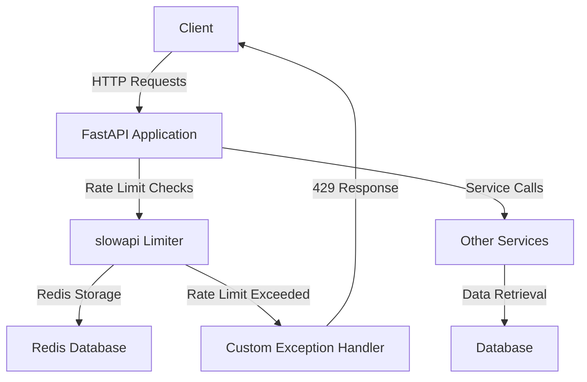

# Rate Limiting — FastAPI + slowapi

## Overview and scope

The purpose of this document is to establish standards for implementing rate limiting in FastAPI applications using the `slowapi` library. Rate limiting is a critical aspect of API design that helps to protect services from abuse, ensures fair usage among clients, and maintains the overall health of the system. This standard is intended for backend developers, architects, and DevOps engineers at Xentic who are responsible for building and maintaining FastAPI applications.

### Audience
- **Backend Developers**: Responsible for implementing API endpoints and ensuring they adhere to rate limiting standards.
- **Architects**: Oversee the design and architecture of backend services, ensuring compliance with organizational standards.
- **DevOps Engineers**: Manage deployment and monitoring of FastAPI applications, ensuring that rate limiting configurations are correctly applied.

### Scope
This standard applies to all FastAPI applications developed within Xentic that utilize the `slowapi` library for rate limiting. It covers:
- Configuration of rate limiting using `slowapi`.
- Application of rate limits to various endpoint types.
- Monitoring and alerting mechanisms related to rate limiting.

### Non-goals
- This document does not cover rate limiting strategies for non-FastAPI applications.
- It does not provide in-depth details on the `slowapi` library beyond its usage for rate limiting.
- It does not address performance tuning or optimization of FastAPI applications outside the scope of rate limiting.

### Glossary
| Term               | Definition                                                                 |
|--------------------|-----------------------------------------------------------------------------|
| Rate Limiting      | A technique used to control the amount of incoming requests to a service.  |
| Endpoint           | A specific URL where an API can be accessed by clients.                    |
| Throttling         | The process of limiting the number of requests a user can make to an API.  |
| 429 Status Code    | HTTP status code indicating that the user has sent too many requests in a given amount of time. |

### How This Standard Fits the Xentic Platform
Implementing rate limiting is essential for maintaining the integrity and performance of Xentic's backend services. By adhering to this standard, developers ensure that:
- Services are protected from abuse and denial-of-service attacks.
- Users experience fair access to resources, preventing any single user from monopolizing API usage.
- The overall system remains stable and responsive, contributing to a positive user experience.

### Example Configuration
Below is an example of how to set up rate limiting in a FastAPI application using the `slowapi` library:

```python
from slowapi import Limiter
from slowapi.util import get_remote_address
from fastapi import FastAPI, Request, Depends
from your_project.auth import auth_service, get_current_user
from your_project.models import LoginRequest

app = FastAPI()
limiter = Limiter(key_func=get_remote_address, storage_uri="redis://localhost:6379")

app.state.limiter = limiter

@app.exception_handler(RateLimitExceeded)
async def rate_limit_exceeded_handler(request: Request, exc):
    return JSONResponse(status_code=429, content={"detail": "Rate limit exceeded"})

@app.post("/auth/token")
@limiter.limit("10/minute")
async def login(request: Request, credentials: LoginRequest):
    return await auth_service.login(credentials)

@app.get("/users")
@limiter.limit("100/minute")
async def list_users(request: Request, current_user=Depends(get_current_user)):
    return await user_service.find_all()
```

### Standard Limits by Endpoint Type
| Endpoint Type      | Limit        |
|--------------------|--------------|
| Auth / login       | 10 / minute  |
| Write (POST/PUT)   | 30 / minute  |
| Read (GET)         | 100 / minute |
| Public / unauthd   | 20 / minute  |

### Rules
- Rate limits MUST be applied to all endpoints as specified in the table above.
- Stricter limits MUST be applied to authentication endpoints to prevent brute-force attacks.
- The application MUST return a `Retry-After` header on 429 responses to inform clients when they can retry their requests.
- Monitoring tools such as Grafana MUST alert the team if more than 5% of requests are throttled to ensure prompt investigation and resolution.

## Standards and policies

1. **Rate Limits Definition**: Rate limits MUST be defined for all API endpoints in accordance with the standard limits specified in the "Standard Limits by Endpoint Type" table. Each endpoint MUST have a clearly defined limit to ensure consistent behavior across the application.

2. **Configuration Format**: Rate limiting configurations MUST be defined in the application code using the `slowapi` library. Developers SHOULD use the provided example as a reference for implementing rate limits.

3. **Key Function**: The `key_func` parameter in the `Limiter` initialization MUST use `get_remote_address` to ensure that rate limits are applied based on the client's IP address.

4. **Storage URI**: The `storage_uri` for the `Limiter` MUST point to a Redis instance. This is critical for maintaining state across multiple instances of the FastAPI application. Example:
   ```python
   limiter = Limiter(key_func=get_remote_address, storage_uri="redis://localhost:6379")
   ```

5. **Error Handling**: A custom exception handler for `RateLimitExceeded` MUST be implemented to return a 429 status code with a JSON response. This handler MUST provide a clear message to the client about the rate limit being exceeded.

6. **Retry-After Header**: The application MUST include a `Retry-After` HTTP header in the response when a 429 status code is returned. This header MUST indicate the time in seconds after which the client can retry the request.

7. **Monitoring and Alerts**: Monitoring tools MUST be configured to track the number of requests that are throttled. Alerts MUST be set up to notify the team if more than 5% of requests are being throttled, allowing for timely investigation.

8. **Documentation**: All endpoints with rate limits MUST be documented in the API documentation. This documentation MUST include the rate limit for each endpoint and the expected behavior when limits are exceeded.

9. **Testing**: Rate limiting behavior MUST be tested as part of the CI/CD pipeline. Automated tests SHOULD verify that the correct status codes and messages are returned when limits are exceeded.

10. **Security Considerations**: Rate limits MUST be stricter for sensitive endpoints, such as authentication and user management, to mitigate the risk of brute-force attacks. 

11. **Client-Side Handling**: Client applications MUST be designed to handle 429 responses gracefully. This includes respecting the `Retry-After` header and implementing exponential backoff strategies for retries.

12. **Rate Limit Bypass**: Rate limits MUST NOT be bypassed for any reason, including internal service calls. All requests, regardless of source, MUST adhere to the defined limits.

13. **Dynamic Rate Limits**: If dynamic rate limits are required based on user roles or other criteria, this MUST be implemented using custom logic within the `key_func` or as part of the endpoint logic. 

14. **Rate Limit Logging**: All rate limit exceedances MUST be logged for auditing purposes. Logs MUST include the client IP address, timestamp, endpoint accessed, and the rate limit that was exceeded.

15. **Configuration Management**: Rate limit configurations MUST be managed through environment variables or configuration files to allow for easy adjustments without code changes. Example configuration in YAML:
   ```yaml
   rate_limits:
     auth_login: "10/minute"
     write: "30/minute"
     read: "100/minute"
     public: "20/minute"
   ```

16. **Review Process**: Rate limit policies and configurations MUST be reviewed at least annually to ensure they meet current application needs and security standards.

By adhering to these standards and policies, Xentic ensures that its FastAPI applications are robust, secure, and provide a fair usage experience for all clients.

## Architecture and design

The architecture for implementing rate limiting in FastAPI using the `slowapi` library consists of several key components that interact with each other to ensure effective request management. The following mermaid diagram illustrates the primary components and their interactions:



### Data Flows
1. **Client Requests**: Clients send HTTP requests to the FastAPI application.
2. **Rate Limit Checks**: The FastAPI application utilizes the `slowapi` Limiter to check if the incoming request exceeds the defined rate limits.
3. **Redis Storage**: Rate limit data is stored in a Redis database, allowing for stateful tracking of requests across multiple application instances.
4. **Custom Exception Handling**: If a request exceeds the rate limit, the custom exception handler returns a 429 status code to the client, indicating that the rate limit has been exceeded.
5. **Service Calls**: The FastAPI application may make calls to other internal services or databases to fulfill requests.

### Integration Points
- **Redis Database**: The `slowapi` library requires a Redis instance for storing rate limit data. This integration point is critical for maintaining consistency across distributed application instances.
- **Authentication Service**: The application may integrate with an authentication service to manage user sessions and permissions, which can influence rate limits based on user roles.

### Failure Domains
- **Redis Unavailability**: If the Redis database becomes unavailable, the application MUST handle this gracefully. Rate limiting may be temporarily disabled, or a fallback mechanism should be implemented to prevent service degradation.
- **Network Issues**: Network latency or failures between the FastAPI application and Redis can lead to delays in rate limit checks. The application MUST implement retries and timeouts to manage these scenarios effectively.
- **Service Dependencies**: If the application relies on other services for data retrieval, failures in those services can impact the overall response time and user experience. Proper error handling and circuit breaker patterns SHOULD be employed.

### Example Configuration
Here is an example of how the Redis connection and rate limiting can be configured in a YAML file:

```yaml
redis:
  host: "localhost"
  port: 6379
  db: 0

rate_limits:
  auth_login: "10/minute"
  write: "30/minute"
  read: "100/minute"
  public: "20/minute"
```

### Summary
By adhering to the architecture and design principles outlined in this section, Xentic can ensure that its FastAPI applications effectively manage incoming requests through robust rate limiting mechanisms. This approach not only protects services from abuse but also enhances the overall user experience by maintaining fair access to resources.

## Configuration reference

### Application Configuration (application.yml)

The following YAML configuration outlines the rate limiting settings for the FastAPI application. This configuration should be placed in the `application.yml` file.

```yaml
redis:
  host: "localhost"              # Redis host
  port: 6379                      # Redis port
  db: 0                           # Redis database index

rate_limits:
  auth_login: "10/minute"        # Rate limit for authentication login
  write: "30/minute"             # Rate limit for write operations (POST/PUT)
  read: "100/minute"             # Rate limit for read operations (GET)
  public: "20/minute"            # Rate limit for public endpoints
```

### Environment Variables

To facilitate easy configuration management, the application can also utilize environment variables. Below is a table of environment variables with their default and production values.

| Environment Variable       | Default Value         | Production Value        |
|---------------------------|-----------------------|-------------------------|
| REDIS_HOST                | localhost             | redis-prod.xentic.io    |
| REDIS_PORT                | 6379                  | 6379                    |
| REDIS_DB                  | 0                     | 0                       |
| RATE_LIMIT_AUTH_LOGIN     | 10/minute             | 5/minute                |
| RATE_LIMIT_WRITE          | 30/minute             | 20/minute               |
| RATE_LIMIT_READ           | 100/minute            | 100/minute              |
| RATE_LIMIT_PUBLIC         | 20/minute             | 15/minute               |

### Terraform Configuration

For infrastructure provisioning, the following Terraform configuration can be used to set up the Redis instance and environment variables.

```hcl
resource "aws_elasticache_cluster" "redis" {
  cluster_id           = "xentic-redis"
  engine              = "redis"
  node_type           = "cache.t2.micro"
  number_of_nodes     = 1
  port                = 6379

  tags = {
    Name = "Xentic Redis"
  }
}

output "redis_endpoint" {
  value = aws_elasticache_cluster.redis.configuration_endpoint
}

resource "aws_ssm_parameter" "redis_host" {
  name  = "/xentic/redis/host"
  type  = "String"
  value = aws_elasticache_cluster.redis.configuration_endpoint
}

resource "aws_ssm_parameter" "redis_port" {
  name  = "/xentic/redis/port"
  type  = "String"
  value = "6379"
}

resource "aws_ssm_parameter" "rate_limit_auth_login" {
  name  = "/xentic/rate_limits/auth_login"
  type  = "String"
  value = "10/minute"
}

resource "aws_ssm_parameter" "rate_limit_write" {
  name  = "/xentic/rate_limits/write"
  type  = "String"
  value = "30/minute"
}

resource "aws_ssm_parameter" "rate_limit_read" {
  name  = "/xentic/rate_limits/read"
  type  = "String"
  value = "100/minute"
}

resource "aws_ssm_parameter" "rate_limit_public" {
  name  = "/xentic/rate_limits/public"
  type  = "String"
  value = "20/minute"
}
```

### Summary

The configuration reference provided above outlines the necessary settings for implementing rate limiting in a FastAPI application using `slowapi`. By adhering to these configurations in `application.yml`, environment variables, and Terraform scripts, Xentic can ensure a consistent and secure rate limiting strategy across its services.

## Implementation guide

To implement rate limiting in a FastAPI application using the `slowapi` library, follow these steps:

### Step 1: Install Required Packages

You MUST install the necessary packages. Use the following command to install `fastapi`, `slowapi`, and `redis`:

```bash
pip install fastapi slowapi redis uvicorn
```

### Step 2: Set Up Redis Connection

Create a `config.py` file to manage the configuration settings for Redis and rate limits.

```python
# config.py
import os

class Config:
    REDIS_HOST = os.getenv("REDIS_HOST", "localhost")
    REDIS_PORT = int(os.getenv("REDIS_PORT", 6379))
    RATE_LIMIT_AUTH_LOGIN = os.getenv("RATE_LIMIT_AUTH_LOGIN", "10/minute")
    RATE_LIMIT_WRITE = os.getenv("RATE_LIMIT_WRITE", "30/minute")
    RATE_LIMIT_READ = os.getenv("RATE_LIMIT_READ", "100/minute")
    RATE_LIMIT_PUBLIC = os.getenv("RATE_LIMIT_PUBLIC", "20/minute")
```

### Step 3: Initialize FastAPI with SlowAPI

Create the main application file, `main.py`, and set up the FastAPI application with slowapi's limiter.

```python
# main.py
from fastapi import FastAPI, HTTPException
from slowapi import Limiter
from slowapi.util import get_remote_address
from redis import Redis
from config import Config

# Initialize FastAPI and Limiter
app = FastAPI()
limiter = Limiter(key_func=get_remote_address)

# Connect to Redis
redis = Redis(host=Config.REDIS_HOST, port=Config.REDIS_PORT)

@app.on_event("startup")
async def startup_event():
    # Ensure Redis connection is established
    redis.ping()

@app.on_event("shutdown")
async def shutdown_event():
    # Close Redis connection
    redis.close()
```

### Step 4: Define Rate Limited Endpoints

You MUST define your endpoints with appropriate rate limits using the `@limiter.limit` decorator.

```python
@app.post("/auth/login")
@limiter.limit(Config.RATE_LIMIT_AUTH_LOGIN)
async def auth_login(username: str, password: str):
    # Logic for authentication
    return {"message": "Login successful"}

@app.post("/write")
@limiter.limit(Config.RATE_LIMIT_WRITE)
async def write_data(data: str):
    # Logic for writing data
    return {"message": "Data written successfully"}

@app.get("/read")
@limiter.limit(Config.RATE_LIMIT_READ)
async def read_data():
    # Logic for reading data
    return {"message": "Data retrieved successfully"}

@app.get("/public")
@limiter.limit(Config.RATE_LIMIT_PUBLIC)
async def public_endpoint():
    return {"message": "Public data"}
```

### Step 5: Custom Exception Handling

You MUST implement a custom exception handler to return a 429 status code when the rate limit is exceeded.

```python
from slowapi.errors import RateLimitExceeded

@app.exception_handler(RateLimitExceeded)
async def rate_limit_exceeded_handler(request, exc):
    return JSONResponse(
        status_code=429,
        content={"detail": "Rate limit exceeded. Please try again later."},
    )
```

### Step 6: Run the Application

You MUST run the FastAPI application using `uvicorn`. Use the following command:

```bash
uvicorn main:app --host 0.0.0.0 --port 8000 --reload
```

### Summary

By following these steps, you have successfully implemented rate limiting in a FastAPI application using the `slowapi` library. The application is now equipped to handle rate-limited requests, ensuring a fair usage policy for all clients. 

### Example Directory Structure

Here’s an example of how your project directory should look:

```
/your-project
│
├── main.py
├── config.py
└── requirements.txt
```

### Example requirements.txt

Make sure to include the following in your `requirements.txt`:

```
fastapi
slowapi
redis
uvicorn
```

By adhering to this implementation guide, Xentic can ensure robust rate limiting in its FastAPI applications, enhancing security and user experience.

## Security requirements

### Threat Model Summary

The FastAPI application must be designed with security as a primary concern. Potential threats include:

- **Denial of Service (DoS)**: Attackers may attempt to overwhelm the application with excessive requests, leading to service unavailability.
- **Data Leakage**: Sensitive information may be exposed through improper handling of requests and responses.
- **Unauthorized Access**: Users may try to access protected resources without proper authentication or authorization.
- **Injection Attacks**: Malicious inputs could exploit vulnerabilities in the application, leading to unauthorized actions or data manipulation.

### Authentication and Authorization

- **Authentication**: The application MUST implement secure authentication mechanisms (e.g., OAuth2, JWT) to verify user identities.
- **Authorization**: Access control MUST be enforced to ensure users can only access resources they are permitted to. This can be achieved through role-based access control (RBAC) or attribute-based access control (ABAC).

### Secrets Management

- Secrets (e.g., API keys, database credentials) MUST NOT be hardcoded in the source code. Instead, they MUST be stored in environment variables or a secrets management tool such as AWS Secrets Manager or HashiCorp Vault.
- The application MUST utilize secure methods to retrieve secrets at runtime, ensuring they are not exposed in logs or error messages.

### Input Validation

- All user inputs MUST be validated and sanitized to prevent injection attacks. This includes:
  - **Type Checking**: Ensure inputs are of the expected type (e.g., integers, strings).
  - **Length Validation**: Enforce maximum lengths for strings to prevent buffer overflow attacks.
  - **Whitelist Validation**: Use whitelisting for acceptable input values whenever possible.

Example of input validation in FastAPI:

```python
from fastapi import FastAPI, HTTPException, Query

app = FastAPI()

@app.get("/items/")
async def read_item(item_id: int = Query(..., gt=0, le=100)):
    return {"item_id": item_id}
```

### Audit Logging

- The application MUST implement audit logging to track access and changes to sensitive resources. This includes:
  - Logging user authentication attempts (both successful and failed).
  - Recording access to protected endpoints, including the user ID, timestamp, and action taken.
  - Storing logs in a secure, tamper-proof location.

Example of logging in FastAPI:

```python
import logging

logging.basicConfig(level=logging.INFO)
logger = logging.getLogger(__name__)

@app.post("/auth/login")
async def auth_login(username: str, password: str):
    # Authentication logic here
    logger.info(f"User {username} attempted to log in.")
    return {"message": "Login successful"}
```

### Summary

By addressing the security requirements outlined above, Xentic can significantly enhance the security posture of its FastAPI applications. Implementing robust authentication and authorization mechanisms, managing secrets securely, validating inputs rigorously, and maintaining comprehensive audit logs will mitigate risks and protect sensitive data.

## Testing strategy

To ensure the reliability and performance of the FastAPI application with rate limiting, Xentic MUST implement a comprehensive testing strategy that includes unit tests, integration tests, and contract tests. The following outlines the testing approach, coverage targets, and example test classes.

### Testing Types

1. **Unit Tests**: 
   - Validate individual components and functions of the application.
   - Focus on testing the logic of rate-limited endpoints and exception handling.

2. **Integration Tests**: 
   - Verify the interaction between different components such as FastAPI routes, Redis, and external services.
   - Ensure that rate limiting works as expected in a simulated environment.

3. **Contract Tests**: 
   - Confirm that the API adheres to the defined contract, including request and response formats.
   - Validate that rate limits are enforced correctly across different endpoints.

### Coverage Targets

- **Unit Tests**: Target a minimum of 80% code coverage for all business logic.
- **Integration Tests**: Aim for at least 70% coverage of the integration points with external services.
- **Contract Tests**: Ensure 100% adherence to the API specification.

### Example Test Classes

#### 1. Unit Tests

Create a test file named `test_main.py` to include unit tests for the application.

```python
# test_main.py
import pytest
from fastapi.testclient import TestClient
from main import app

client = TestClient(app)

def test_auth_login_success():
    response = client.post("/auth/login", json={"username": "testuser", "password": "testpass"})
    assert response.status_code == 200
    assert response.json() == {"message": "Login successful"}

def test_auth_login_rate_limit_exceeded():
    # Simulate multiple requests to exceed rate limit
    for _ in range(11):
        client.post("/auth/login", json={"username": "testuser", "password": "testpass"})
    response = client.post("/auth/login", json={"username": "testuser", "password": "testpass"})
    assert response.status_code == 429
    assert response.json() == {"detail": "Rate limit exceeded. Please try again later."}
```

#### 2. Integration Tests

Create a separate test file named `test_integration.py` for integration tests.

```python
# test_integration.py
import pytest
from fastapi.testclient import TestClient
from main import app

client = TestClient(app)

def test_write_data_integration():
    response = client.post("/write", json={"data": "sample data"})
    assert response.status_code == 200
    assert response.json() == {"message": "Data written successfully"}

def test_read_data_integration():
    response = client.get("/read")
    assert response.status_code == 200
    assert response.json() == {"message": "Data retrieved successfully"}
```

#### 3. Contract Tests

For contract tests, you can use a library like `pact-python` to define and verify the API contract.

```python
# test_contract.py
from pact import Consumer, Provider

consumer = Consumer('FastAPI Consumer')
provider = Provider('FastAPI Provider')

def test_contract():
    # Define the expected interactions
    (consumer
     .has_pact_with(provider)
     .upon_receiving('a request for auth login')
     .with_request('POST', '/auth/login', body={"username": "testuser", "password": "testpass"})
     .will_respond_with(200, body={"message": "Login successful"}))

    # Run the test
    with consumer:
        result = consumer.verify()
        assert result is True
```

### Running Tests

To execute the tests, use the following command:

```bash
pytest --cov=main test_main.py test_integration.py test_contract.py
```

### Summary

By implementing a robust testing strategy that includes unit, integration, and contract tests, Xentic can ensure the reliability and performance of its FastAPI applications. The provided examples and coverage targets serve as a guideline for maintaining high-quality standards in the development process.

## Observability and operations

To ensure the reliability and performance of the FastAPI application with rate limiting, Xentic MUST implement a comprehensive observability and operations strategy. This includes metrics collection, logging, tracing, dashboards, alerts, and service level objectives (SLOs). 

### Metrics

Metrics MUST be collected to monitor the performance of the application, including:

- **Request Count**: Total number of requests received.
- **Rate Limit Hits**: Number of requests that hit the rate limit.
- **Response Time**: Time taken to process requests.
- **Error Rates**: Percentage of requests resulting in errors (e.g., HTTP 429).

Example of Prometheus metrics configuration in `main.py`:

```python
from fastapi import FastAPI
from slowapi import Limiter
from prometheus_fastapi_instrumentator import Instrumentator

app = FastAPI()
limiter = Limiter(key_func=get_remote_address)

Instrumentator().instrument(app).expose(app)
```

### Logs

The application MUST implement structured logging to capture essential events and errors. Logs should include:

- **Timestamp**: When the event occurred.
- **Log Level**: Severity of the log (INFO, ERROR, etc.).
- **User ID**: Identifier for the user making the request.
- **Endpoint**: The API endpoint being accessed.
- **Response Status**: HTTP status code returned.

Example of structured logging in FastAPI:

```python
import logging

logging.basicConfig(level=logging.INFO)
logger = logging.getLogger(__name__)

@app.middleware("http")
async def log_requests(request: Request, call_next):
    logger.info(f"Request: {request.method} {request.url}")
    response = await call_next(request)
    logger.info(f"Response: {response.status_code} for {request.method} {request.url}")
    return response
```

### Traces

Distributed tracing MUST be implemented to track requests across microservices. This allows for identifying performance bottlenecks and understanding request flows.

- Use tools like OpenTelemetry or Jaeger for tracing.
- Ensure that trace IDs are propagated through all services.

Example of integrating OpenTelemetry:

```python
from opentelemetry import trace
from opentelemetry.ext.fastapi import FastAPIInstrumentor

tracer = trace.get_tracer(__name__)
FastAPIInstrumentor.instrument_app(app)
```

### Dashboards

Dashboards MUST be created to visualize metrics and logs. Use tools like Grafana or Kibana to build dashboards that display:

- Request counts over time.
- Rate limit hits and patterns.
- Response times and error rates.

Example of a Grafana dashboard panel configuration:

| Metric               | Type          | Visualization |
|----------------------|---------------|---------------|
| Total Requests        | Time Series   | Line Chart    |
| Rate Limit Hits       | Time Series   | Bar Chart     |
| Average Response Time | Gauge         | Single Stat   |
| Error Rate           | Time Series   | Area Chart    |

### Alerts

Alerts MUST be configured to notify the on-call team of any anomalies or issues. Key alerts include:

- **High Error Rate**: Trigger if the error rate exceeds 5% over a 5-minute window.
- **Rate Limit Exceeded**: Alert when the rate limit hits exceed a defined threshold.
- **High Response Time**: Alert when the average response time exceeds 500ms.

Example of alert configuration in Prometheus:

```yaml
groups:
  - name: rate_limit_alerts
    rules:
      - alert: HighErrorRate
        expr: rate(http_requests_total{status="500"}[5m]) > 0.05
        for: 5m
        labels:
          severity: critical
        annotations:
          summary: "High error rate detected"
          description: "Error rate exceeds 5% over the last 5 minutes."
```

### Service Level Objectives (SLOs)

SLOs MUST be defined to measure the reliability of the service. Examples include:

- **Availability**: 99.9% uptime over a rolling 30-day period.
- **Latency**: 95% of requests should be processed within 200ms.
- **Error Rate**: Less than 1% of requests should result in errors.

### On-Call Runbook Steps

In the event of an incident, the on-call engineer MUST follow these steps:

1. **Identify the Issue**: Check the monitoring dashboards for alerts and metrics.
2. **Review Logs**: Analyze logs for errors and unusual patterns.
3. **Check Dependencies**: Verify the status of dependent services (e.g., databases, external APIs).
4. **Mitigate Impact**: If rate limits are exceeded, consider temporarily increasing limits or notifying users.
5. **Communicate**: Update stakeholders on the incident status and expected resolution time.
6. **Document the Incident**: After resolution, document the incident, actions taken, and lessons learned in the incident management system.

By implementing these observability and operations practices, Xentic can proactively manage the FastAPI application, ensuring high availability and performance while minimizing downtime and user impact.

## Migration and versioning

When upgrading the FastAPI application with rate limiting, Xentic MUST adhere to a structured migration and versioning strategy to ensure smooth transitions and maintain backward compatibility. This section outlines the upgrade paths, deprecation policies, backward compatibility measures, and rollback procedures.

### Upgrade Paths

1. **Minor Version Upgrades**:
   - Introduce new features and improvements.
   - Ensure backward compatibility with existing APIs.
   - Update documentation to reflect new features.

2. **Major Version Upgrades**:
   - May introduce breaking changes.
   - MUST provide a migration guide to assist developers in adapting to changes.
   - Deprecate old features with a clear timeline for removal.

3. **Patch Version Upgrades**:
   - Focus on bug fixes and security patches.
   - MUST NOT introduce new features or breaking changes.

### Deprecation Policy

- **Notification**: Deprecated features MUST be clearly marked in the documentation and code comments.
- **Grace Period**: Provide a minimum of one full release cycle (e.g., six months) before removing deprecated features.
- **Versioning**: Use semantic versioning (e.g., 1.0.0, 1.1.0, 2.0.0) to indicate the nature of changes.

### Backward Compatibility

- All new features MUST be designed to be backward compatible.
- Existing endpoints MUST continue to function as expected after an upgrade.
- If breaking changes are necessary, provide an alternative endpoint or feature that maintains the previous behavior.

### Rollback Procedures

In the event of a failed upgrade, Xentic MUST have a rollback plan in place:

1. **Backup**: Always create a backup of the current production environment before initiating an upgrade.
2. **Version Control**: Use version control systems (e.g., Git) to manage code changes and facilitate easy rollbacks.
3. **Rollback Steps**:
   - Revert to the previous stable version in the codebase.
   - Restore the database to the last known good state if schema changes were made.
   - Monitor logs and metrics post-rollback to ensure stability.

### Example Migration Guide

| Version | Changes Made                                         | Migration Steps                                      |
|---------|-----------------------------------------------------|-----------------------------------------------------|
| 1.0.0  | Initial release                                     | N/A                                                 |
| 1.1.0  | Added new `/auth/register` endpoint                 | Update client to call new endpoint                  |
| 2.0.0  | Breaking change: Removed `/auth/login` endpoint     | Migrate to `/auth/login-v2`, update client code    |
| 2.1.0  | Introduced rate limiting on `/write` endpoint       | Update client to handle rate limit responses        |

### Example Code for Versioning

Implement versioning in the FastAPI application using path parameters:

```python
from fastapi import FastAPI

app = FastAPI()

@app.get("/auth/login-v2")
async def login_v2(username: str, password: str):
    # New implementation for login
    return {"message": "Login successful with v2"}

@app.get("/auth/login")
async def login(username: str, password: str):
    # Deprecated - to be removed in future versions
    return {"message": "This endpoint will be removed in future versions. Please use /auth/login-v2."}
```

### Conclusion

By following the outlined migration and versioning strategy, Xentic can ensure that the FastAPI application evolves while maintaining stability and usability for its users. Clear communication, thorough documentation, and structured rollback procedures are essential to minimize disruptions during upgrades.

## FAQ, anti-patterns, and checklists

### FAQ

1. **What is rate limiting?**
   - Rate limiting is a technique used to control the amount of incoming requests to a service, preventing abuse and ensuring fair usage among users.

2. **How does FastAPI implement rate limiting?**
   - FastAPI can implement rate limiting using the `slowapi` library, which provides decorators to limit the number of requests from a user within a specified time frame.

3. **What happens when a user exceeds the rate limit?**
   - When a user exceeds the defined rate limit, the service MUST return an HTTP 429 status code, indicating that too many requests have been made.

4. **Can rate limits be customized per endpoint?**
   - Yes, rate limits can be customized for each endpoint by applying different decorators with specific limits.

5. **What is the default rate limit in `slowapi`?**
   - The default rate limit is configurable, but a common starting point is 100 requests per minute.

6. **How can I monitor rate limit usage?**
   - Rate limit usage can be monitored using Prometheus metrics integrated with FastAPI, which provides insights into request counts and rate limit hits.

7. **Is it possible to whitelist certain IP addresses?**
   - Yes, you can implement IP whitelisting by customizing the key function used in the `Limiter` to exclude certain addresses from rate limiting.

8. **How do I handle rate limit errors in the client application?**
   - The client application MUST handle HTTP 429 responses gracefully, possibly by implementing exponential backoff strategies for retrying requests.

9. **Can I use multiple rate limiters in the same application?**
   - Yes, you can define multiple instances of `Limiter` with different configurations for various endpoints or user roles.

10. **What are the performance implications of rate limiting?**
    - While rate limiting adds a small overhead to request processing, it is essential for maintaining service stability and preventing abuse.

### Anti-Patterns

| Anti-Pattern                     | Description                                                                                       |
|----------------------------------|---------------------------------------------------------------------------------------------------|
| Hardcoding Rate Limits           | Defining rate limits directly in the code without configuration options makes it difficult to adjust. |
| Ignoring Rate Limit Responses    | Failing to handle HTTP 429 responses in client applications leads to poor user experience.       |
| Global Rate Limits for All Users | Applying the same rate limit to all users can lead to unfair restrictions, especially for legitimate users. |
| Lack of Monitoring               | Not monitoring rate limit metrics can result in undetected abuse or performance issues.          |
| Overly Permissive Rate Limits    | Setting very high rate limits may expose the service to abuse, negating the purpose of rate limiting. |

### Pre-Merge Checklist

- [ ] Ensure all rate limiting decorators are applied correctly to endpoints.
- [ ] Verify that rate limit configurations are documented in the code.
- [ ] Confirm that Prometheus metrics for rate limiting are implemented.
- [ ] Check that structured logging captures rate limit events.
- [ ] Validate that client applications handle HTTP 429 responses correctly.

### Production Checklist

- [ ] Monitor rate limit metrics in real-time dashboards.
- [ ] Review logs for any unusual patterns or spikes in requests.
- [ ] Ensure alerting mechanisms are in place for high rate limit hits.
- [ ] Conduct a post-deployment review to assess the impact of rate limiting.
- [ ] Communicate with stakeholders regarding any changes in service behavior due to rate limiting.
