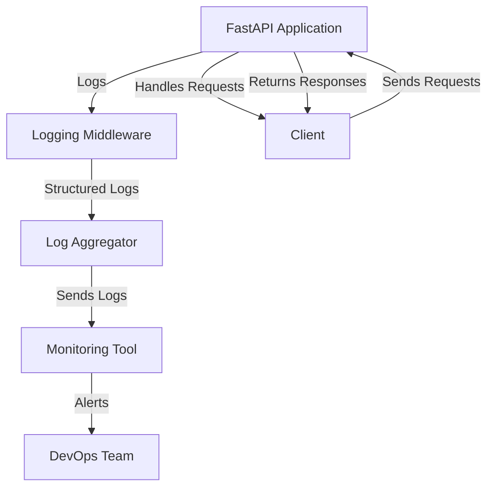

# Structured Logging — FastAPI

## Overview and scope

The purpose of this document is to establish standards for implementing structured logging within FastAPI applications at Xentic. Structured logging is essential for enhancing observability, enabling better debugging, and facilitating effective monitoring of applications. By adopting a consistent logging approach, we ensure that logs are machine-readable and can be easily parsed by log management tools.

### Audience

This document is intended for:
- **Developers**: Responsible for writing and maintaining FastAPI applications.
- **DevOps Engineers**: Tasked with deploying and monitoring applications in production.
- **Quality Assurance Teams**: Ensuring that logging standards are adhered to during testing phases.
- **Technical Leads**: Overseeing architecture and design decisions related to logging.

### Scope

This standard covers:
- The principles of structured logging in FastAPI applications.
- Recommended logging libraries and configurations.
- Examples of logging implementation in various scenarios.
- Guidelines for log message formats and levels.
- Integration with logging systems and monitoring tools.

### Non-goals

This document does NOT cover:
- General logging practices outside of FastAPI.
- Logging for non-Python services.
- Specific implementations of log aggregation tools (e.g., ELK Stack, Splunk).

### Glossary

| Term                | Definition                                                                 |
|---------------------|-----------------------------------------------------------------------------|
| Structured Logging   | A logging format that outputs logs in a consistent, machine-readable format. |
| FastAPI             | A modern, fast (high-performance) web framework for building APIs with Python. |
| Log Level           | A classification of the importance of a log message (e.g., DEBUG, INFO, ERROR). |
| JSON                | JavaScript Object Notation, a lightweight data interchange format.          |

### How This Standard Fits the Xentic Platform

At Xentic, we prioritize observability and maintainability across our services. The adoption of structured logging in FastAPI aligns with our commitment to:
- **Consistency**: Ensuring all services log in a uniform manner, making it easier to aggregate and analyze logs.
- **Efficiency**: Facilitating quick identification of issues through structured log messages.
- **Integration**: Enabling seamless integration with our existing log management and monitoring solutions.

By adhering to these standards, teams can enhance their applications' reliability and performance, ultimately contributing to a better user experience.

### Example Configuration

Below is an example of how to configure structured logging in a FastAPI application using the `structlog` library.

```python
import structlog
import logging
from fastapi import FastAPI

# Configure logging
logging.basicConfig(
    format="%(message)s",
    level=logging.INFO,
)

# Configure structlog
structlog.configure(
    processors=[
        structlog.processors.KeyValueRenderer(key_order=['event', 'service']),
    ],
    context_class=dict,
    logger_factory=structlog.stdlib.LoggerFactory(),
)

logger = structlog.get_logger()

app = FastAPI()

@app.get("/")
async def read_root():
    logger.info("Root endpoint accessed", service="my_service")
    return {"Hello": "World"}
```

By following the guidelines set forth in this document, Xentic teams will create a robust logging framework that enhances our ability to monitor and troubleshoot FastAPI applications effectively.

## Standards and policies

1. **MUST** use structured logging for all FastAPI applications developed at Xentic. This ensures that log messages are consistent, machine-readable, and easily integrated with monitoring tools.

2. **MUST NOT** use unstructured log messages. All logs must adhere to the structured format to facilitate parsing and analysis.

3. **MUST** utilize the `structlog` library for structured logging within FastAPI applications. This library provides a flexible and powerful way to handle log messages.

4. **SHOULD** define a logging configuration in a separate settings file (e.g., `config.yaml`) to maintain separation of concerns and enhance maintainability. 

   Example `config.yaml`:
   ```yaml
   logging:
     version: 1
     disable_existing_loggers: False
     formatters:
       structured:
         format: "%(message)s"
     handlers:
       console:
         class: logging.StreamHandler
         formatter: structured
         level: INFO
     root:
       handlers: [console]
       level: INFO
   ```

5. **MUST** include contextual information such as service name, environment, and request IDs in every log message. This information is critical for tracing and debugging.

6. **MUST NOT** log sensitive information (e.g., passwords, personal data) in any log messages. Ensure that logs comply with data protection regulations and company policies.

7. **SHOULD** use appropriate log levels (DEBUG, INFO, WARNING, ERROR, CRITICAL) based on the severity of the events being logged. This aids in filtering and managing logs effectively.

8. **MUST** implement a centralized logging strategy to aggregate logs from all FastAPI services. This can be achieved using tools like ELK Stack or Splunk.

9. **SHOULD** use JSON format for structured logs when integrating with external logging systems. This format is widely supported and allows for easy parsing.

10. **MUST** document all logging practices and configurations in the service's README file to ensure clarity and consistency across teams.

11. **MUST NOT** hard-code log messages. Instead, use structured logging methods to dynamically generate messages based on application state.

12. **SHOULD** include exception handling in log messages for error scenarios. This provides context and aids in troubleshooting.

   Example of logging an exception:
   ```python
   from fastapi import FastAPI, HTTPException
   import structlog

   logger = structlog.get_logger()

   app = FastAPI()

   @app.get("/items/{item_id}")
   async def read_item(item_id: int):
       try:
           # Simulate item retrieval
           if item_id <= 0:
               raise ValueError("Invalid item ID")
           return {"item_id": item_id}
       except ValueError as e:
           logger.error("Error retrieving item", error=str(e), item_id=item_id)
           raise HTTPException(status_code=400, detail=str(e))
   ```

13. **MUST** ensure that logging does not degrade application performance. Use asynchronous logging where applicable to minimize blocking.

14. **SHOULD** regularly review and refine logging practices to adapt to changing application needs and to incorporate feedback from monitoring and incident response teams.

15. **MUST** train all developers on the structured logging standards to ensure uniformity and adherence across all FastAPI projects at Xentic. 

By following these standards and policies, Xentic will maintain a high level of observability and reliability across its FastAPI applications, enabling teams to respond swiftly to issues and improve overall system performance.

## Architecture and design

The architecture of structured logging in FastAPI applications at Xentic is designed to ensure seamless integration, efficient data flows, and robust failure handling. Below is a detailed description of the component diagram and the various aspects of the architecture.



### Data Flows

1. **Request Handling**: 
   - Clients send requests to the FastAPI application.
   - The application processes these requests and generates appropriate responses.

2. **Logging Middleware**:
   - The logging middleware intercepts requests and responses, capturing relevant information.
   - It formats log messages in a structured manner using the `structlog` library.

3. **Log Aggregation**:
   - Structured logs are sent to a centralized log aggregator.
   - The aggregator collects logs from multiple FastAPI services for unified analysis.

4. **Monitoring and Alerting**:
   - The log aggregator forwards logs to monitoring tools (e.g., ELK Stack, Splunk).
   - Monitoring tools analyze logs and trigger alerts based on predefined thresholds or error patterns.

5. **Incident Response**:
   - The DevOps team receives alerts and investigates issues based on the structured log data.

### Integration Points

- **FastAPI Application**: The core service that handles incoming requests and generates logs.
- **Logging Middleware**: Custom middleware that integrates with FastAPI to capture logs.
- **Log Aggregator**: A centralized service that collects logs from all FastAPI applications.
- **Monitoring Tools**: External tools that analyze logs and provide insights into application performance.

### Failure Domains

1. **Application Failure**:
   - If the FastAPI application crashes or becomes unresponsive, logs may not be generated.
   - Implement health checks to monitor application status.

2. **Logging Middleware Failure**:
   - If the logging middleware fails, log messages may be lost or improperly formatted.
   - Ensure robust error handling within the middleware to prevent application disruption.

3. **Log Aggregator Failure**:
   - If the log aggregator is down, logs will not be collected, leading to gaps in observability.
   - Implement redundancy and failover mechanisms for the log aggregator.

4. **Monitoring Tool Failure**:
   - If the monitoring tool is unavailable, alerts may not be generated, delaying incident response.
   - Regularly test and maintain monitoring tools to ensure reliability.

### Summary

The structured logging architecture for FastAPI applications at Xentic is designed to provide high observability and resilience. By adhering to the outlined data flows, integration points, and failure domains, teams can ensure that logging is effective and contributes to the overall reliability of the applications.

## Configuration reference

To ensure consistent and effective structured logging in FastAPI applications at Xentic, the following configuration references are provided. This includes examples for application configuration files (YAML), Terraform variables, and environment variables.

### Application Configuration (application.yml)

The `application.yml` file defines the logging configuration for a FastAPI application. Below is an example configuration with default and production values.

```yaml
logging:
  version: 1
  disable_existing_loggers: False
  formatters:
    structured:
      format: "%(message)s"
  handlers:
    console:
      class: logging.StreamHandler
      formatter: structured
      level: INFO
    file:
      class: logging.FileHandler
      filename: /var/log/my_service.log
      formatter: structured
      level: ERROR
  root:
    handlers: [console, file]
    level: INFO
```

### Terraform Configuration

When deploying FastAPI applications, you may need to configure logging settings using Terraform. Below is an example of how to define variables for logging configuration:

```hcl
variable "log_level" {
  description = "The logging level for the application."
  type        = string
  default     = "INFO"
}

variable "log_file_path" {
  description = "The path to the log file."
  type        = string
  default     = "/var/log/my_service.log"
}

resource "aws_ecs_task_definition" "my_service" {
  family                   = "my_service"
  container_definitions    = jsonencode([{
    name      = "my_service"
    image     = "my_service_image:latest"
    memory    = 512
    cpu       = 256
    environment = [
      {
        name  = "LOG_LEVEL"
        value = var.log_level
      },
      {
        name  = "LOG_FILE_PATH"
        value = var.log_file_path
      }
    ]
  }])
}
```

### Environment Variables

For flexibility and ease of configuration, environment variables can be used to set logging parameters. Below is a table outlining the relevant environment variables, their default values, and recommended production values.

| Environment Variable | Default Value          | Production Value        | Description                               |
|----------------------|-----------------------|-------------------------|-------------------------------------------|
| `LOG_LEVEL`          | `INFO`                | `ERROR`                 | The logging level for the application.    |
| `LOG_FILE_PATH`      | `/var/log/my_service.log` | `/var/log/my_service_prod.log` | The path to the log file.                |
| `LOG_FORMAT`         | `%(message)s`         | `{"event": "%(message)s", "service": "my_service"}` | The format of the log messages.          |
| `LOGGING_ENABLED`    | `true`                | `true`                  | Enables or disables logging.              |

### Summary of Configuration

- **MUST** define logging configuration in `application.yml` to maintain consistency across services.
- **SHOULD** use Terraform to manage environment-specific configurations for logging.
- **MUST** utilize environment variables for dynamic configuration, allowing for easy changes without modifying code.
- **MUST NOT** hard-code logging configurations within the application code; all configurations should be externalized. 

By following these configuration guidelines, Xentic teams can ensure that structured logging is effectively implemented in their FastAPI applications, enhancing observability and maintainability.

## Implementation guide

To implement structured logging in FastAPI applications at Xentic, follow these step-by-step instructions. This guide will cover the creation of a FastAPI application with structured logging, using the `structlog` library for log formatting, and integrating logging middleware.

### Step 1: Install Required Packages

You must install the necessary packages for FastAPI and structured logging. Run the following command:

```bash
pip install fastapi uvicorn structlog
```

### Step 2: Create the FastAPI Application

Create a file named `main.py` and define your FastAPI application as follows:

```python
from fastapi import FastAPI, HTTPException
import structlog
import logging

# Configure logging
logging.basicConfig(level=logging.INFO)
logger = structlog.get_logger()

app = FastAPI()

@app.get("/")
async def read_root():
    logger.info("Root endpoint accessed")
    return {"message": "Hello, World!"}
```

### Step 3: Implement Logging Middleware

Create a custom middleware to log requests and responses. Add the following code to `main.py`:

```python
from starlette.middleware.base import BaseHTTPMiddleware
from starlette.requests import Request
from starlette.responses import Response

class LoggingMiddleware(BaseHTTPMiddleware):
    async def dispatch(self, request: Request, call_next):
        logger.info("Request received", method=request.method, url=request.url.path)
        response: Response = await call_next(request)
        logger.info("Response sent", status_code=response.status_code)
        return response

app.add_middleware(LoggingMiddleware)
```

### Step 4: Add Error Handling with Logging

Enhance the application to log errors when exceptions are raised. Modify the `read_item` endpoint as follows:

```python
@app.get("/items/{item_id}")
async def read_item(item_id: int):
    try:
        if item_id <= 0:
            raise ValueError("Invalid item ID")
        return {"item_id": item_id}
    except ValueError as e:
        logger.error("Error retrieving item", error=str(e), item_id=item_id)
        raise HTTPException(status_code=400, detail=str(e))
```

### Step 5: Run the Application

To run your FastAPI application, use the following command:

```bash
uvicorn main:app --host 0.0.0.0 --port 8000 --reload
```

### Step 6: Testing the Logging

You can test the logging by accessing the endpoints in your browser or using a tool like `curl`:

```bash
curl http://localhost:8000/
curl http://localhost:8000/items/1
curl http://localhost:8000/items/-1
```

### Step 7: Review Log Output

After making requests, you should see structured log output in your console. Example log entries might look like this:

```
2023-10-01 12:00:00.000 | INFO     | main:read_root:10 | Root endpoint accessed
2023-10-01 12:00:00.001 | INFO     | main:dispatch:15   | Request received | method=GET | url=/
2023-10-01 12:00:00.002 | INFO     | main:dispatch:19   | Response sent | status_code=200
2023-10-01 12:00:00.003 | ERROR    | main:read_item:25  | Error retrieving item | error=Invalid item ID | item_id=-1
```

### Summary of Implementation Steps

- **MUST** install necessary packages for FastAPI and structured logging.
- **MUST** configure logging at the start of your application.
- **SHOULD** implement a logging middleware to capture request and response details.
- **MUST** handle exceptions and log errors appropriately.
- **MUST** test the application to ensure logging works as expected.

By following these steps, you will have a FastAPI application with structured logging that adheres to Xentic's standards, providing clear insights into application behavior and performance.

## Security requirements

To ensure the security of FastAPI applications at Xentic, the following requirements must be adhered to, covering threat modeling, authentication and authorization, secrets management, input validation, and audit logging.

### Threat Model Summary

A comprehensive threat model should be established for all FastAPI applications. The following threats must be considered:

| Threat Type               | Description                                                                                     | Mitigation Strategy                                           |
|---------------------------|-------------------------------------------------------------------------------------------------|-------------------------------------------------------------|
| **Injection Attacks**     | Attackers may attempt to inject malicious code through input fields.                           | Implement strict input validation and sanitation.           |
| **Unauthorized Access**    | Users may attempt to access resources they are not authorized to view or modify.              | Enforce robust authentication and authorization mechanisms.  |
| **Data Leakage**          | Sensitive data may be exposed through logging or error messages.                               | Ensure sensitive data is masked or omitted from logs.       |
| **Denial of Service (DoS)** | Attackers may overwhelm the application with requests, causing service disruption.            | Implement rate limiting and request throttling.             |
| **Cross-Site Scripting (XSS)** | Malicious scripts may be injected into web pages viewed by other users.                   | Use proper escaping and sanitization techniques.            |

### Authentication and Authorization

FastAPI applications MUST implement secure authentication and authorization mechanisms. The following practices are recommended:

- **Use OAuth2** for authorization. Implement the OAuth2 password flow or authorization code flow as appropriate.
- **JSON Web Tokens (JWT)** should be used for stateless authentication. Tokens must be signed and validated on each request.

Example of JWT authentication:

```python
from fastapi import Depends, FastAPI, HTTPException, status
from fastapi.security import OAuth2PasswordBearer, OAuth2PasswordRequestForm
from jose import JWTError, jwt

oauth2_scheme = OAuth2PasswordBearer(tokenUrl="token")

@app.post("/token")
async def login(form_data: OAuth2PasswordRequestForm = Depends()):
    # Validate user credentials and generate JWT token
    ...

async def get_current_user(token: str = Depends(oauth2_scheme)):
    # Validate token and retrieve user information
    ...
```

### Secrets Management

Sensitive information such as API keys, database credentials, and encryption keys MUST NOT be hard-coded in the application. Instead, use a secure secrets management solution. Recommended practices include:

- Store secrets in environment variables or use a dedicated secrets management service (e.g., HashiCorp Vault, AWS Secrets Manager).
- Ensure that secrets are encrypted both in transit and at rest.

Example of loading secrets from environment variables:

```python
import os

DATABASE_URL = os.getenv("DATABASE_URL")
SECRET_KEY = os.getenv("SECRET_KEY")
```

### Input Validation

All inputs to the FastAPI application MUST be validated against expected formats and types. Use Pydantic models for automatic validation of request bodies and query parameters.

Example of input validation using Pydantic:

```python
from pydantic import BaseModel, constr

class Item(BaseModel):
    name: constr(min_length=1)
    price: float

@app.post("/items/")
async def create_item(item: Item):
    return item
```

### Audit Logging

Audit logging is essential for tracking access and modifications to sensitive resources. The following guidelines MUST be followed:

- Log all authentication attempts, including successful and failed logins.
- Log access to sensitive endpoints and data modifications.
- Ensure that logs are stored securely and are tamper-proof.

Example of audit logging implementation:

```python
@app.post("/items/")
async def create_item(item: Item, current_user: User = Depends(get_current_user)):
    logger.info("Item created", user=current_user.username, item=item.dict())
    return item
```

### Summary of Security Requirements

- **MUST** establish a comprehensive threat model for FastAPI applications.
- **MUST** implement OAuth2 and JWT for secure authentication and authorization.
- **MUST NOT** hard-code sensitive information; use secure secrets management.
- **MUST** validate all inputs using Pydantic models to prevent injection attacks.
- **MUST** implement audit logging to track access and modifications to sensitive resources.

By adhering to these security requirements, Xentic can ensure that its FastAPI applications are robust against potential threats and vulnerabilities.

## Testing strategy

To ensure the reliability and quality of FastAPI applications at Xentic, a comprehensive testing strategy must be implemented. This strategy should include unit tests, integration tests, and contract tests, with specific coverage targets for each type of test.

### Unit Tests

Unit tests are essential for verifying the functionality of individual components in isolation. Each function and method should have corresponding unit tests that cover various scenarios, including edge cases.

- **Coverage Target**: A minimum of 80% code coverage is required for all unit tests.
- **Testing Framework**: Use `pytest` as the testing framework.

Example of a unit test for the `read_item` function:

```python
import pytest
from fastapi.testclient import TestClient
from main import app

client = TestClient(app)

def test_read_item_success():
    response = client.get("/items/1")
    assert response.status_code == 200
    assert response.json() == {"item_id": 1}

def test_read_item_invalid_id():
    response = client.get("/items/-1")
    assert response.status_code == 400
    assert response.json() == {"detail": "Invalid item ID"}
```

### Integration Tests

Integration tests ensure that different components of the application work together as expected. These tests should cover interactions between the FastAPI application and external systems, such as databases or third-party APIs.

- **Coverage Target**: A minimum of 70% code coverage is required for all integration tests.
- **Testing Framework**: Use `pytest` along with `pytest-asyncio` for asynchronous testing.

Example of an integration test for the `/items/` endpoint:

```python
@pytest.mark.asyncio
async def test_create_item():
    response = await client.post("/items/", json={"name": "Test Item", "price": 10.0})
    assert response.status_code == 200
    assert response.json() == {"name": "Test Item", "price": 10.0}
```

### Contract Tests

Contract tests verify that the API adheres to the expected contract, ensuring that the API's inputs and outputs remain consistent across changes. This is particularly important for microservices.

- **Coverage Target**: All public endpoints must have corresponding contract tests.
- **Testing Framework**: Use `pact-python` for contract testing.

Example of a contract test for the `/items/` endpoint:

```python
from pact import Consumer, Provider

pact = Consumer('ItemService').has_pact_with(Provider('ItemAPI'))

def test_item_service_contract():
    with pact:
        (pact
         .given('an item exists')
         .upon_receiving('a request for the item')
         .with_request('get', '/items/1')
         .will_respond_with(200, body={'item_id': 1}))
        
        result = client.get("/items/1")
        assert result.status_code == 200
```

### Coverage Reporting

To ensure that the coverage targets are met, use the `pytest-cov` plugin to generate coverage reports. The following command can be used to run tests with coverage:

```bash
pytest --cov=main --cov-report=html
```

### Summary of Testing Strategy

- **MUST** implement unit tests with a minimum of 80% coverage.
- **MUST** implement integration tests with a minimum of 70% coverage.
- **MUST** implement contract tests for all public API endpoints.
- **MUST** use `pytest` and `pytest-asyncio` for testing.
- **MUST** generate coverage reports to ensure targets are met.

By adhering to this testing strategy, Xentic can maintain high-quality FastAPI applications that are robust, reliable, and ready for production.

## Observability and operations

To ensure the reliability and performance of FastAPI applications at Xentic, a robust observability strategy must be implemented. This strategy includes metrics, logs, traces, dashboards, alerts, and service level objectives (SLOs). The following guidelines MUST be adhered to:

### Metrics

Metrics provide quantitative data about the application's performance and health. The following metrics MUST be collected:

- **Request Latency**: Measure the time taken to process requests.
- **Error Rate**: Track the number of failed requests over time.
- **Throughput**: Measure the number of requests processed per second.
- **Resource Utilization**: Monitor CPU, memory, and disk usage.

Example of exposing metrics using Prometheus:

```python
from fastapi import FastAPI
from prometheus_fastapi_instrumentator import Instrumentator

app = FastAPI()

Instrumentator().instrument(app).expose(app)
```

### Logs

Structured logging is essential for troubleshooting and understanding application behavior. Logging MUST include:

- **Timestamp**: When the log entry was created.
- **Log Level**: Severity of the log (INFO, WARNING, ERROR).
- **Message**: Description of the event.
- **Contextual Data**: Include relevant context such as user ID, request ID, and any other pertinent information.

Example of structured logging using Python's `logging` module:

```python
import logging
import json

logger = logging.getLogger("my_logger")
logger.setLevel(logging.INFO)

def log_event(event):
    logger.info(json.dumps(event))

@app.get("/items/")
async def read_items():
    log_event({"event": "read_items", "status": "success"})
    return {"items": ["item1", "item2"]}
```

### Traces

Distributed tracing allows for tracking requests as they flow through different services. Implement tracing using OpenTelemetry or similar frameworks. The following steps MUST be followed:

1. **Instrument your application** to generate trace data.
2. **Propagate trace context** across service boundaries.
3. **Collect and visualize traces** using a tracing backend (e.g., Jaeger, Zipkin).

Example of using OpenTelemetry for tracing:

```python
from opentelemetry import trace
from opentelemetry.instrumentation.fastapi import FastAPIInstrumentor

tracer = trace.get_tracer(__name__)

FastAPIInstrumentor.instrument_app(app)

@app.get("/items/")
async def read_items():
    with tracer.start_as_current_span("read_items"):
        return {"items": ["item1", "item2"]}
```

### Dashboards

Dashboards MUST be created to visualize metrics, logs, and traces. Use tools like Grafana or Kibana to create dashboards that provide insights into application performance and health. Key components of the dashboard should include:

- **Real-time metrics**: Visualize request latency, error rates, and throughput.
- **Log aggregation**: Display logs filtered by severity and context.
- **Trace visualization**: Show the flow of requests through services.

### Alerts

Alerts MUST be configured to notify the on-call team of critical issues. The following alerting strategies are recommended:

- **Error Rate Alerts**: Trigger alerts if the error rate exceeds a predefined threshold.
- **Latency Alerts**: Notify if request latency exceeds acceptable limits.
- **Resource Utilization Alerts**: Alert on high CPU or memory usage.

Example of Prometheus alerting rule:

```yaml
groups:
- name: example-alerts
  rules:
  - alert: HighErrorRate
    expr: rate(http_requests_total{status="500"}[5m]) > 0.05
    for: 5m
    labels:
      severity: critical
    annotations:
      summary: "High error rate detected"
      description: "More than 5% of requests are failing."
```

### Service Level Objectives (SLOs)

SLOs MUST be defined to set performance and reliability targets for the application. Common SLOs include:

- **Availability**: The percentage of time the service is operational.
- **Latency**: The maximum acceptable response time for requests.
- **Error Rate**: The maximum allowable percentage of failed requests.

Example of SLO definition:

| SLO Type        | Objective        | Measurement Period |
|------------------|------------------|---------------------|
| Availability      | 99.9% uptime     | Monthly             |
| Latency           | 95th percentile < 200ms | Monthly       |
| Error Rate        | < 1%             | Monthly             |

### On-Call Runbook Steps

In the event of an incident, the following on-call runbook steps MUST be followed:

1. **Acknowledge the alert**: Confirm receipt of the alert and begin investigation.
2. **Check dashboards**: Review metrics and logs for anomalies.
3. **Identify the issue**: Use tracing and logs to pinpoint the root cause.
4. **Implement a fix**: Apply a temporary or permanent fix as necessary.
5. **Notify stakeholders**: Communicate the status and resolution to relevant parties.
6. **Postmortem analysis**: Conduct a post-incident review to identify improvements.

By implementing these observability practices, Xentic can ensure that its FastAPI applications are monitored effectively, enabling proactive incident management and continuous improvement.

## Migration and versioning

To maintain the integrity and reliability of FastAPI applications at Xentic, a structured migration and versioning strategy MUST be implemented. This strategy encompasses upgrade paths, deprecation policies, backward compatibility, and rollback procedures.

### Upgrade Paths

When upgrading FastAPI applications, the following paths MUST be followed:

1. **Semantic Versioning**: All services MUST adhere to semantic versioning (MAJOR.MINOR.PATCH). Increment the:
   - **MAJOR version** for incompatible API changes.
   - **MINOR version** for backward-compatible functionality.
   - **PATCH version** for backward-compatible bug fixes.

2. **Documentation**: Each version MUST include comprehensive release notes detailing changes, migration steps, and impact assessments. Documentation should be accessible at:
   - [Xentic Internal Docs](https://docs.internal.xentic.io/migration)

3. **Staging Environment**: All upgrades MUST be tested in a staging environment before production deployment to ensure compatibility and functionality.

### Deprecation Policy

The deprecation policy MUST include the following guidelines:

- **Advance Notice**: Deprecated features MUST be announced at least one release cycle in advance. This allows consumers time to adapt to changes.
- **Deprecation Warning**: When a feature is deprecated, a warning MUST be logged to inform developers of the upcoming removal.
  
Example of logging a deprecation warning:

```python
import warnings

def deprecated_function():
    warnings.warn("This function is deprecated and will be removed in the next major release.", DeprecationWarning)
```

- **Removal Timeline**: Features that are deprecated MUST be removed in the subsequent MAJOR version.

### Backward Compatibility

Backward compatibility is critical to ensure that existing clients continue to function after upgrades. The following practices MUST be followed:

- **API Versioning**: Use URL versioning (e.g., `/v1/items/`) to allow clients to specify which version of the API they are using. This enables older clients to continue functioning while new features are added to the latest version.

Example of versioned endpoints:

```python
@app.get("/v1/items/")
async def read_items_v1():
    return {"items": ["item1", "item2"]}

@app.get("/v2/items/")
async def read_items_v2():
    return {"items": ["item1", "item2", "item3"]}
```

- **Feature Flags**: Implement feature flags to toggle new features on and off without affecting existing functionality.

### Rollback Procedures

In the event of a failed deployment, a rollback procedure MUST be in place:

1. **Automated Rollback**: Use CI/CD tools to automate rollback processes. For example, if a deployment fails, the system should automatically revert to the last stable version.

2. **Database Migrations**: Ensure that database migrations are reversible. Use tools like Alembic for managing migrations and provide rollback scripts.

Example of a database migration with Alembic:

```python
from alembic import op
import sqlalchemy as sa

def upgrade():
    op.add_column('items', sa.Column('description', sa.String(length=255)))

def downgrade():
    op.drop_column('items', 'description')
```

3. **Monitoring Post-Deployment**: After a deployment, monitor key metrics and logs for anomalies. If issues are detected, initiate the rollback process immediately.

### Summary of Migration and Versioning Strategy

| Aspect                   | Guidelines                                                                 |
|--------------------------|---------------------------------------------------------------------------|
| Upgrade Paths            | MUST follow semantic versioning; MUST document changes and migration steps. |
| Deprecation Policy       | MUST provide advance notice; MUST log deprecation warnings; MUST remove in next MAJOR version. |
| Backward Compatibility    | MUST use API versioning; MUST implement feature flags.                    |
| Rollback Procedures      | MUST automate rollbacks; MUST ensure database migrations are reversible; MUST monitor after deployment. |

By adhering to these migration and versioning guidelines, Xentic can ensure that FastAPI applications are robust, maintainable, and capable of evolving without disrupting existing functionality.

## FAQ, anti-patterns, and checklists

### FAQ

1. **What is structured logging?**
   - Structured logging is a method of logging that outputs logs in a consistent format, typically as JSON, making it easier to query and analyze logs.

2. **Why should I use structured logging in FastAPI?**
   - Structured logging allows for better log management, easier searching, and enhanced observability, which are crucial for debugging and monitoring applications.

3. **How can I implement structured logging in my FastAPI application?**
   - Use the `logging` module with a JSON formatter. Ensure all log messages are structured as dictionaries.

4. **What log levels should I use?**
   - Use appropriate log levels: DEBUG for detailed information, INFO for general operational messages, WARNING for potential issues, ERROR for errors that occur during execution, and CRITICAL for severe errors.

5. **Can I log sensitive information?**
   - You MUST NOT log sensitive information such as passwords, credit card numbers, or personal identification details. Always sanitize logs.

6. **How do I handle exceptions in structured logging?**
   - Use middleware to catch exceptions and log them in a structured format. Ensure to include the exception type and message.

7. **What libraries can I use for structured logging in FastAPI?**
   - Popular libraries include `loguru`, `structlog`, and the built-in `logging` module with custom formatters.

8. **How can I test my logging implementation?**
   - Write unit tests that verify the structure of log outputs and ensure that logs contain the expected fields and values.

9. **Should I log every request?**
   - You SHOULD log important events such as requests and responses, but you MUST NOT log every single request to avoid excessive log volume.

10. **What is the best practice for log retention?**
    - Implement a log retention policy that balances storage costs with the need for historical data. Logs should be retained for at least 30 days.

### Anti-Patterns

| Anti-Pattern                  | Description                                                                 |
|-------------------------------|-----------------------------------------------------------------------------|
| Logging Sensitive Data        | Logging sensitive information can lead to security breaches.               |
| Excessive Logging             | Logging too much data can overwhelm log storage and make analysis difficult.|
| Ignoring Log Levels           | Not using appropriate log levels can lead to confusion and missed alerts.   |
| Hardcoding Log Configurations  | Hardcoding configurations makes it difficult to change logging behavior without redeploying. |
| Not Using Contextual Logging  | Failing to include contextual information in logs can make troubleshooting harder. |

### Pre-Merge Checklist

- [ ] Ensure all log messages are structured as JSON.
- [ ] Verify log levels are appropriate for each message.
- [ ] Confirm that sensitive information is NOT logged.
- [ ] Test logging functionality in a staging environment.
- [ ] Review logging configurations for hardcoded values.

### Production Checklist

- [ ] Monitor log volume and adjust retention policies as necessary.
- [ ] Ensure logging middleware is in place to catch exceptions.
- [ ] Validate that alerts are set up for critical log events.
- [ ] Review logs regularly to identify patterns or issues.
- [ ] Conduct periodic audits of logging practices and configurations.
