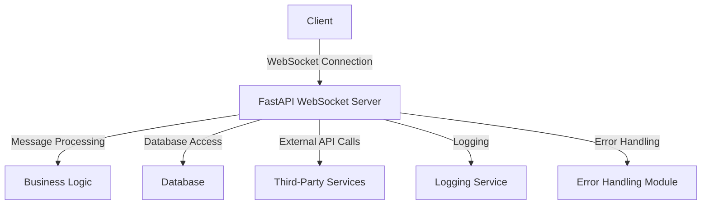

# WebSocket Standards — FastAPI

## Overview and scope

The purpose of this document is to establish standards for implementing WebSocket services using FastAPI within Xentic. This standard aims to ensure consistency, reliability, and maintainability across all WebSocket services developed within the organization. 

### Audience

This document is intended for:
- Backend Engineers
- Software Architects
- Technical Leads
- Quality Assurance Engineers

### Scope

This standard covers:
- WebSocket connection management
- Message format and serialization
- Error handling and reconnection strategies
- Security best practices
- Performance considerations

### Non-goals

This document does NOT cover:
- General FastAPI usage outside of WebSocket implementations
- Frontend WebSocket client implementations
- Non-WebSocket communication protocols

### Glossary

| Term                | Definition                                                                                       |
|---------------------|--------------------------------------------------------------------------------------------------|
| WebSocket           | A protocol providing full-duplex communication channels over a single TCP connection.           |
| FastAPI             | A modern, fast (high-performance) web framework for building APIs with Python 3.6+ based on standard Python type hints. |
| Connection Management| The process of establishing, maintaining, and terminating WebSocket connections.                 |
| Serialization       | The process of converting an object into a format that can be easily transmitted over a network. |

### How This Standard Fits the Xentic Platform

At Xentic, we prioritize a cohesive architecture that allows for scalability and maintainability. The WebSocket standards outlined in this document align with our overall platform strategy by:

- **Promoting Reusability**: By adhering to these standards, teams can create reusable components that can be easily integrated across various services.
- **Ensuring Security**: Security is a top priority at Xentic. These standards include guidelines for secure WebSocket connections to protect sensitive data.
- **Enhancing Performance**: With performance considerations included, teams can optimize their WebSocket services to handle high loads efficiently.

### Example Configuration

A typical FastAPI WebSocket service configuration might look like this:

```python
from fastapi import FastAPI, WebSocket

app = FastAPI()

@app.websocket("/ws")
async def websocket_endpoint(websocket: WebSocket):
    await websocket.accept()
    while True:
        data = await websocket.receive_text()
        await websocket.send_text(f"Message text was: {data}")
```

### Example Message Format

When sending messages over WebSocket, use the following JSON structure:

```json
{
  "type": "message",
  "payload": {
    "content": "Hello, World!",
    "timestamp": "2023-10-01T12:00:00Z"
  }
}
```

By adhering to the standards and practices outlined in this document, Xentic teams can ensure that their WebSocket implementations are robust, secure, and scalable.

## Standards and policies

1. **MUST** use the FastAPI framework for all WebSocket implementations within Xentic. This ensures consistency and leverages the framework's performance benefits.

2. **MUST NOT** use any WebSocket libraries outside of the FastAPI ecosystem unless explicitly approved by the architecture team. This includes libraries that do not comply with Xentic's security and performance standards.

3. **MUST** follow the naming convention for WebSocket routes as `/ws/<service_name>`, where `<service_name>` is the specific service being implemented. For example, a chat service should use `/ws/chat`.

4. **SHOULD** implement connection management to handle connection establishment, maintenance, and termination gracefully. This includes handling disconnections and reconnections.

5. **MUST** use JSON as the message format for all WebSocket communications. The message structure should always include a `type` and a `payload`. 

   Example message format:
   ```json
   {
     "type": "message",
     "payload": {
       "content": "Hello, World!",
       "timestamp": "2023-10-01T12:00:00Z"
     }
   }
   ```

6. **MUST NOT** send raw binary data over WebSocket connections without proper serialization. All data must be serialized into JSON format.

7. **MUST** implement error handling for all WebSocket interactions. This includes catching exceptions and sending appropriate error messages back to the client.

8. **SHOULD** implement a reconnection strategy for clients. This can include exponential backoff or similar techniques to manage reconnections gracefully.

9. **MUST** secure WebSocket connections using the `wss://` protocol in production environments to ensure data integrity and confidentiality.

10. **SHOULD** log all WebSocket connection events, including successful connections, disconnections, and errors. This will assist in monitoring and debugging.

11. **MUST NOT** expose sensitive information in WebSocket messages. Always sanitize and validate data before sending it over the WebSocket connection.

12. **MUST** use environment variables for configuration settings related to WebSocket services, such as connection limits and timeouts. Example configuration in a `.env` file:
    ```plaintext
    WEBSOCKET_MAX_CONNECTIONS=100
    WEBSOCKET_TIMEOUT=30
    ```

13. **SHOULD** document all WebSocket endpoints in the API documentation, including expected message formats and error codes. This documentation should be accessible at:
    - [Xentic API Docs](https://docs.internal.xentic.io)

14. **MUST** ensure that all WebSocket services are tested with unit and integration tests. This includes testing for connection handling, message processing, and error scenarios.

15. **SHOULD** consider performance implications when designing WebSocket services. This includes minimizing payload size and optimizing message frequency.

16. **MUST** adhere to Xentic’s coding standards for Python, including PEP 8 guidelines, to maintain code quality and readability.

17. **MUST NOT** hard-code any configuration values within the codebase. All configurations should be externalized to facilitate easier changes and deployments.

18. **SHOULD** use asynchronous programming patterns when implementing WebSocket services to maximize performance and responsiveness.

By following these standards and policies, Xentic teams will create robust, maintainable, and secure WebSocket services that align with the organization's goals and architectural principles.

## Architecture and design

### Component Diagram

The following diagram illustrates the architecture of a typical FastAPI WebSocket service at Xentic:



### Data Flows

1. **Client Initiation**: The client establishes a WebSocket connection to the FastAPI server at the designated endpoint (e.g., `/ws/chat`).
2. **Message Exchange**:
   - The client sends a message to the server.
   - The server processes the message using the business logic layer.
   - The server may interact with the database or third-party services based on the message content.
   - The server sends a response back to the client.
3. **Connection Management**:
   - The server must handle connection events, including accepting connections, monitoring active connections, and managing disconnections.
   - In case of disconnection, the client should implement a reconnection strategy.

### Integration Points

- **Database**: The WebSocket service must interact with the database for persistent data storage and retrieval.
- **Third-Party Services**: If the application requires external data or services, the WebSocket service should integrate with these APIs.
- **Logging**: All connection events and errors should be logged for monitoring and debugging purposes.
- **Error Handling Module**: This module should be responsible for managing errors and sending appropriate error messages back to clients.

### Failure Domains

- **Network Failures**: Loss of connectivity between the client and server can lead to disconnections. The client should have a reconnection strategy in place.
- **Server Failures**: If the FastAPI server crashes or becomes unresponsive, clients should be notified of the failure and may attempt to reconnect.
- **Database Failures**: Issues with the database can affect message processing. Implementing retries and fallback mechanisms is crucial.
- **External API Failures**: If the service relies on third-party APIs, failures in those services can impact the functionality. Graceful degradation should be considered.

### Example Configuration

A sample configuration for the FastAPI WebSocket service can be defined in a `config.yaml` file:

```yaml
websocket:
  max_connections: 100
  timeout: 30
  logging:
    level: INFO
    file: /var/log/xentic/websocket.log
```

### Example SQL for Database Interaction

When implementing database interactions, use the following SQL template for storing messages:

```sql
INSERT INTO messages (user_id, content, timestamp)
VALUES (:user_id, :content, :timestamp);
```

### Code Example for Connection Management

Here is an example of how to implement connection management in FastAPI:

```python
from fastapi import FastAPI, WebSocket
from fastapi.websockets import WebSocketDisconnect
import logging

app = FastAPI()
active_connections: List[WebSocket] = []

@app.websocket("/ws/chat")
async def chat_endpoint(websocket: WebSocket):
    await websocket.accept()
    active_connections.append(websocket)
    try:
        while True:
            data = await websocket.receive_text()
            await process_message(data)
    except WebSocketDisconnect:
        active_connections.remove(websocket)
        logging.info("Client disconnected")

async def process_message(data: str):
    # Implement business logic here
    pass
```

By adhering to the architecture and design standards outlined in this section, Xentic teams can ensure that their WebSocket services are well-structured, reliable, and maintainable.

## Configuration reference

### Application Configuration (application.yml)

The following is the recommended structure for the `application.yml` file used to configure the FastAPI WebSocket service:

```yaml
websocket:
  max_connections: 100  # Maximum number of concurrent WebSocket connections
  timeout: 30           # Timeout duration in seconds for WebSocket connections
  logging:
    level: INFO         # Logging level (DEBUG, INFO, WARNING, ERROR, CRITICAL)
    file: /var/log/xentic/websocket.log  # Path to the log file
  cors:
    allow_origins:      # List of allowed origins for CORS
      - "https://app.xentic.io"
    allow_methods:      # Allowed HTTP methods
      - GET
      - POST
      - OPTIONS
    allow_headers:      # Allowed headers
      - "Content-Type"
      - "Authorization"
```

### Terraform Configuration

The following Terraform configuration can be used to set up environment variables for the FastAPI WebSocket service:

```hcl
resource "aws_lambda_function" "websocket_service" {
  function_name = "xentic_websocket_service"
  handler       = "app.handler"
  runtime       = "python3.9"

  environment {
    WEBSOCKET_MAX_CONNECTIONS = "100"
    WEBSOCKET_TIMEOUT          = "30"
    LOGGING_LEVEL              = "INFO"
    LOGGING_FILE               = "/var/log/xentic/websocket.log"
  }
}
```

### Environment Variables

The following table outlines the environment variables that must be configured for the FastAPI WebSocket service, along with their default and production values:

| Variable                     | Default Value | Production Value |
|------------------------------|---------------|------------------|
| `WEBSOCKET_MAX_CONNECTIONS`  | `100`         | `200`            |
| `WEBSOCKET_TIMEOUT`          | `30`          | `60`             |
| `LOGGING_LEVEL`              | `INFO`        | `ERROR`          |
| `LOGGING_FILE`               | `/var/log/xentic/websocket.log` | `/var/log/xentic/websocket-prod.log` |

### Additional Configuration Options

- **CORS Configuration**: Ensure that CORS settings are properly configured to allow requests from trusted origins. This is critical for security.
- **Health Check Endpoint**: Consider implementing a health check endpoint to monitor the health of the WebSocket service.

Example health check endpoint:

```python
@app.get("/health")
async def health_check():
    return {"status": "healthy"}
```

By adhering to these configuration standards, Xentic teams can ensure that their FastAPI WebSocket services are properly set up for both development and production environments, facilitating easier maintenance and scalability.

## Implementation guide

To implement a WebSocket service using FastAPI at Xentic, follow the step-by-step guide below. This guide includes full code examples, covering connection management, message broadcasting, and error handling.

### Step 1: Setting Up FastAPI

First, ensure you have FastAPI and an ASGI server (like `uvicorn`) installed. You can install them using pip:

```bash
pip install fastapi uvicorn
```

### Step 2: Creating the WebSocket Server

Create a new Python file, e.g., `websocket_server.py`, and start by importing the necessary modules:

```python
from fastapi import FastAPI, WebSocket, WebSocketDisconnect
from typing import List
import logging

app = FastAPI()
active_connections: List[WebSocket] = []
```

### Step 3: Implementing Connection Management

Add a WebSocket endpoint to manage connections. This endpoint will accept connections and handle incoming messages:

```python
@app.websocket("/ws/chat")
async def chat_endpoint(websocket: WebSocket):
    await websocket.accept()
    active_connections.append(websocket)
    try:
        while True:
            data = await websocket.receive_text()
            await process_message(data, websocket)
    except WebSocketDisconnect:
        active_connections.remove(websocket)
        logging.info("Client disconnected")
```

### Step 4: Processing Incoming Messages

Create a function to process incoming messages. This function will broadcast the message to all connected clients:

```python
async def process_message(data: str, websocket: WebSocket):
    logging.info(f"Received message: {data}")
    for connection in active_connections:
        if connection != websocket:  # Do not send the message back to the sender
            await connection.send_text(data)
```

### Step 5: Error Handling

Implement error handling to manage unexpected issues during message processing:

```python
@app.exception_handler(WebSocketDisconnect)
async def websocket_disconnect_handler(request, exc):
    logging.error(f"WebSocket disconnect: {exc}")
    return {"error": "WebSocket disconnected"}
```

### Step 6: Logging Configuration

Set up logging to monitor WebSocket events. You can configure logging at the beginning of your file:

```python
logging.basicConfig(level=logging.INFO, format='%(asctime)s - %(levelname)s - %(message)s')
```

### Step 7: Running the Server

To run the FastAPI application, use the following command:

```bash
uvicorn websocket_server:app --host 0.0.0.0 --port 8000 --reload
```

### Step 8: Client Implementation

Create a simple HTML client to test the WebSocket service. Save the following code as `client.html`:

```html
<!DOCTYPE html>
<html>
<head>
    <title>WebSocket Client</title>
</head>
<body>
    <h1>WebSocket Chat</h1>
    <input id="messageInput" type="text" placeholder="Type a message...">
    <button id="sendButton">Send</button>
    <ul id="messagesList"></ul>

    <script>
        const socket = new WebSocket("ws://localhost:8000/ws/chat");

        socket.onmessage = function(event) {
            const messagesList = document.getElementById("messagesList");
            const messageItem = document.createElement("li");
            messageItem.textContent = event.data;
            messagesList.appendChild(messageItem);
        };

        document.getElementById("sendButton").onclick = function() {
            const messageInput = document.getElementById("messageInput");
            socket.send(messageInput.value);
            messageInput.value = '';
        };
    </script>
</body>
</html>
```

### Step 9: Testing the WebSocket Service

1. Open the `client.html` file in multiple browser tabs.
2. Type a message in one tab and click "Send".
3. Observe that the message appears in all connected clients.

### Step 10: Deployment Considerations

When deploying the WebSocket service, ensure that:

- **MUST** use a reverse proxy (like Nginx) to handle WebSocket connections.
- **MUST** configure firewalls to allow WebSocket traffic on the specified port.
- **SHOULD** monitor WebSocket connections and performance metrics to identify potential issues.

By following this implementation guide, Xentic teams can successfully create a robust WebSocket service using FastAPI, ensuring scalability and maintainability in their applications.

## Security requirements

To ensure the security of WebSocket services developed using FastAPI at Xentic, the following security requirements must be adhered to:

### Threat Model Summary

1. **Unauthorized Access**: Attackers may attempt to connect to the WebSocket endpoint without proper authentication.
2. **Data Interception**: Messages transmitted over WebSocket connections can be intercepted if not properly encrypted.
3. **Denial of Service (DoS)**: Attackers may attempt to overwhelm the WebSocket server with excessive connections or messages.
4. **Injection Attacks**: Malicious input may be sent through WebSocket messages, leading to injection vulnerabilities.

### Authentication and Authorization

- **MUST** implement authentication for WebSocket connections using JWT (JSON Web Tokens) or OAuth2.
- **MUST NOT** accept unauthenticated connections. All connections should validate tokens before accepting.
  
Example of JWT authentication in FastAPI:

```python
from fastapi import WebSocket, Depends, HTTPException
from fastapi.security import OAuth2PasswordBearer

oauth2_scheme = OAuth2PasswordBearer(tokenUrl="token")

async def get_current_user(token: str = Depends(oauth2_scheme)):
    user = verify_token(token)  # Implement this function to verify JWT
    if user is None:
        raise HTTPException(status_code=401, detail="Invalid authentication credentials")
    return user
```

### Secrets Management

- **MUST** store sensitive information such as API keys and database credentials in a secure manner, using environment variables or secret management tools (e.g., AWS Secrets Manager).
- **MUST NOT** hard-code secrets in the source code or configuration files.

Example of using environment variables for secrets:

```python
import os

DATABASE_URL = os.getenv("DATABASE_URL")  # Ensure this is set in your environment
```

### Input Validation

- **MUST** validate all incoming messages to prevent injection attacks. Use Pydantic models for structured validation.
- **MUST NOT** accept raw input without validation.

Example of input validation using Pydantic:

```python
from pydantic import BaseModel

class Message(BaseModel):
    user_id: int
    content: str

async def process_message(data: str, websocket: WebSocket):
    message = Message.parse_raw(data)  # Validate input
    # Further processing...
```

### Audit Logging

- **MUST** implement logging for all WebSocket events, including connection attempts, message sends, and errors.
- **SHOULD** log sensitive actions, such as authentication failures and message content, but ensure that sensitive information is redacted.

Example of logging configuration:

```python
import logging

logging.basicConfig(level=logging.INFO, format='%(asctime)s - %(levelname)s - %(message)s')

@app.websocket("/ws/chat")
async def chat_endpoint(websocket: WebSocket):
    await websocket.accept()
    logging.info(f"Client connected: {websocket.client}")
    try:
        while True:
            data = await websocket.receive_text()
            logging.info(f"Message received: {data}")
            await process_message(data, websocket)
    except WebSocketDisconnect:
        logging.info("Client disconnected")
```

### Summary of Security Practices

- **MUST** use HTTPS for all WebSocket connections to encrypt data in transit.
- **SHOULD** implement rate limiting to mitigate DoS attacks.
- **MUST** regularly review and update security practices to address new vulnerabilities.
- **SHOULD** conduct security audits and penetration testing on WebSocket services to identify potential weaknesses.

By following these security requirements, Xentic teams can help ensure that their FastAPI WebSocket services are secure and resilient against common threats.

## Testing strategy

To ensure the quality and reliability of WebSocket services developed using FastAPI at Xentic, a comprehensive testing strategy must be implemented. This strategy should encompass unit tests, integration tests, and contract tests, with defined coverage targets for each type of test.

### Testing Types

1. **Unit Tests**
   - **MUST** cover individual components and functions in isolation.
   - **SHOULD** aim for at least 80% code coverage.
   - **MUST NOT** rely on external services or databases.

2. **Integration Tests**
   - **MUST** test the interaction between multiple components, including WebSocket connections.
   - **SHOULD** cover scenarios involving multiple clients and message exchanges.
   - **MUST NOT** include tests that are too broad or unrelated to the WebSocket functionality.

3. **Contract Tests**
   - **MUST** validate that the WebSocket service adheres to the agreed-upon contract, including message formats and response structures.
   - **SHOULD** be automated and run as part of the CI/CD pipeline.
   - **MUST NOT** allow breaking changes to be deployed without updating the contract tests.

### Coverage Targets

| Test Type         | Coverage Target |
|-------------------|-----------------|
| Unit Tests        | 80%             |
| Integration Tests  | 70%             |
| Contract Tests    | 100%            |

### Example Test Classes

#### Unit Test Example

Create a test file named `test_websocket.py` and implement unit tests for the `process_message` function:

```python
import pytest
from fastapi import WebSocket
from unittest.mock import MagicMock
from websocket_server import process_message

@pytest.mark.asyncio
async def test_process_message_broadcasts_to_other_clients():
    websocket1 = MagicMock(spec=WebSocket)
    websocket2 = MagicMock(spec=WebSocket)
    active_connections = [websocket1, websocket2]

    await process_message('{"user_id": 1, "content": "Hello"}', websocket1)

    websocket2.send_text.assert_called_once_with('{"user_id": 1, "content": "Hello"}')
```

#### Integration Test Example

For integration tests, create a test file named `test_integration.py` to test the WebSocket endpoint:

```python
from fastapi.testclient import TestClient
from websocket_server import app

client = TestClient(app)

def test_websocket_connection():
    with client.websocket_connect("/ws/chat") as websocket:
        websocket.send_text('{"user_id": 1, "content": "Hello"}')
        response = websocket.receive_text()
        assert response == '{"user_id": 1, "content": "Hello"}'  # Assuming echo behavior
```

#### Contract Test Example

For contract tests, use a library like `pact` to define the expected interactions:

```python
from pact import Consumer, Provider

pact = Consumer('WebSocketClient').has_pact_with(Provider('WebSocketService'))

def test_websocket_contract():
    with pact:
        (pact
         .given('a connected client')
         .upon_receiving('a message from client')
         .with_request(method='POST', path='/ws/chat', body={"user_id": 1, "content": "Hello"})
         .will_respond_with(status=200, body={"user_id": 1, "content": "Hello"}))

        # Call the WebSocket service here
```

### Best Practices for Testing

- **MUST** run all tests automatically in the CI/CD pipeline.
- **SHOULD** use mocking frameworks to isolate tests and avoid dependencies on external services.
- **MUST NOT** ignore failing tests; all tests must pass before merging code changes.
- **SHOULD** document all test cases and their expected outcomes for future reference.

By adhering to this testing strategy, Xentic teams can ensure that their WebSocket services are robust, reliable, and maintainable, ultimately leading to higher quality software.

## Observability and operations

To ensure effective observability and operations of WebSocket services developed using FastAPI at Xentic, the following practices must be implemented:

### Metrics Collection

- **MUST** collect and expose metrics related to WebSocket connections, message throughput, and latency.
- **SHOULD** utilize Prometheus for metrics scraping and Grafana for visualization.

Example of metrics collection using Prometheus:

```python
from prometheus_fastapi_instrumentator import Instrumentator

instrumentator = Instrumentator()

@app.on_event("startup")
async def startup_event():
    instrumentator.instrument(app).expose(app)
```

### Logging

- **MUST** implement structured logging for all WebSocket events, including connections, disconnections, and message processing.
- **SHOULD** utilize a logging framework such as `loguru` or Python's built-in `logging`.

Example of structured logging with `loguru`:

```python
from loguru import logger

logger.add("websocket.log", rotation="1 MB")

@app.websocket("/ws/chat")
async def chat_endpoint(websocket: WebSocket):
    await websocket.accept()
    logger.info(f"Client connected: {websocket.client}")
    try:
        while True:
            data = await websocket.receive_text()
            logger.info(f"Message received: {data}")
            await process_message(data, websocket)
    except WebSocketDisconnect:
        logger.info("Client disconnected")
```

### Tracing

- **MUST** implement distributed tracing to monitor request flows across services.
- **SHOULD** use OpenTelemetry for tracing and Jaeger for visualization.

Example of tracing with OpenTelemetry:

```python
from opentelemetry import trace

tracer = trace.get_tracer(__name__)

@app.websocket("/ws/chat")
async def chat_endpoint(websocket: WebSocket):
    with tracer.start_as_current_span("websocket_connection"):
        await websocket.accept()
        # Further processing...
```

### Dashboards

- **MUST** create dashboards in Grafana to visualize key metrics, such as connection counts, message rates, and error rates.
- **SHOULD** include alerting mechanisms for anomalies in the metrics.

Example of a Grafana dashboard configuration:

```yaml
apiVersion: 1
providers:
  - name: 'default'
    type: file
    updateIntervalSeconds: 10
    folder: ''
    options:
      path: /var/lib/grafana/dashboards/default
```

### Alerts

- **MUST** configure alerts for critical metrics, such as connection failures, high latency, and error rates.
- **SHOULD** use tools like Alertmanager to manage alerts and notifications.

Example of alerting rules in Prometheus:

```yaml
groups:
  - name: websocket_alerts
    rules:
      - alert: HighErrorRate
        expr: rate(websocket_errors_total[5m]) > 0.1
        for: 5m
        labels:
          severity: critical
        annotations:
          summary: "High error rate detected"
          description: "Error rate exceeds 10% over the last 5 minutes."
```

### Service Level Objectives (SLOs)

- **MUST** define SLOs for WebSocket services, including availability, response time, and error rates.
- **SHOULD** monitor SLOs continuously to ensure compliance.

Example of SLO definition:

| Metric               | SLO Target     |
|----------------------|----------------|
| Availability         | 99.9%          |
| Average Response Time | < 200 ms       |
| Error Rate           | < 1%           |

### On-Call Runbook Steps

In case of incidents, the following on-call runbook steps MUST be followed:

1. **Identify the Incident**: Check alerts and metrics dashboards for anomalies.
2. **Gather Context**: Review logs and traces to understand the issue.
3. **Notify the Team**: Use the designated communication channel (e.g., Slack, PagerDuty) to inform the team.
4. **Mitigate the Issue**: Apply temporary fixes or workarounds as necessary.
5. **Document the Incident**: Record the incident details, steps taken, and resolution in the incident management system.
6. **Post-Incident Review**: Conduct a review meeting to analyze the incident and improve processes.

By adhering to these observability and operations standards, Xentic teams can ensure that their FastAPI WebSocket services are monitored effectively, leading to improved reliability and performance.

## Migration and versioning

To ensure a smooth transition between versions of WebSocket services developed with FastAPI at Xentic, a structured migration and versioning policy MUST be established. This policy should outline upgrade paths, deprecation strategies, backward compatibility requirements, and rollback procedures.

### Upgrade Paths

- **MUST** define clear upgrade paths for each major version of the WebSocket service.
- **SHOULD** provide a migration guide that details changes, new features, and breaking changes for each version.
- **MUST NOT** introduce breaking changes without proper versioning and documentation.

| Version | Upgrade Path                | Notes                                |
|---------|-----------------------------|--------------------------------------|
| 1.x     | 1.0 -> 1.1                  | Minor updates; backward compatible.  |
| 1.x     | 1.1 -> 2.0                  | Major updates; breaking changes.     |
| 2.x     | 2.0 -> 2.1                  | Minor updates; backward compatible.  |

### Deprecation Policy

- **MUST** establish a deprecation policy that informs users of upcoming changes.
- **SHOULD** provide at least one full version cycle (e.g., one year) before removing deprecated features.
- **MUST NOT** remove features without prior notice and a clear migration path.

#### Example Deprecation Notice

```markdown
### Deprecation Notice for WebSocket Endpoint

The `/ws/old_endpoint` WebSocket endpoint is deprecated as of version 2.0 and will be removed in version 3.0. Please migrate to `/ws/new_endpoint` by following the migration guide at https://docs.internal.xentic.io/websocket/migration.
```

### Backward Compatibility

- **MUST** ensure that new versions maintain backward compatibility with existing clients unless explicitly stated.
- **SHOULD** provide compatibility layers or fallback mechanisms for deprecated features.
- **MUST NOT** break existing functionality without proper versioning and documentation.

### Rollback Procedures

In case of issues after deploying a new version, the following rollback procedures MUST be followed:

1. **Identify the Issue**: Monitor logs and metrics to confirm the problem is related to the new version.
2. **Communicate**: Notify the team and stakeholders about the rollback decision using the designated communication channel.
3. **Rollback Steps**:
   - Revert the codebase to the previous stable version using version control (e.g., Git).
   - Redeploy the previous version of the WebSocket service.
   - Verify that the rollback was successful by checking logs and metrics.
4. **Document the Rollback**: Record the incident, including the reason for the rollback and any lessons learned.

### Versioning Strategy

- **MUST** follow Semantic Versioning (SemVer) principles for all WebSocket services.
- **SHOULD** use the format `MAJOR.MINOR.PATCH` where:
  - **MAJOR** version changes indicate breaking changes.
  - **MINOR** version changes add functionality in a backward-compatible manner.
  - **PATCH** version changes include backward-compatible bug fixes.

#### Example Versioning

```plaintext
Current Version: 2.3.1
- MAJOR: 2 (indicating the second major release)
- MINOR: 3 (indicating three minor updates since the last major release)
- PATCH: 1 (indicating one patch fix)
```

### Migration Example

When migrating from version 1.x to 2.0, the following changes MUST be addressed:

- **Change in WebSocket Endpoint**: The endpoint `/ws/old_endpoint` has been replaced with `/ws/new_endpoint`.
- **Updated Message Format**: The message structure has changed from:
  
  ```json
  {
    "user_id": 1,
    "content": "Hello"
  }
  ```
  
  to:
  
  ```json
  {
    "sender_id": 1,
    "message": "Hello"
  }
  ```

### Conclusion

By adhering to these migration and versioning standards, Xentic teams can ensure that WebSocket services are maintained effectively, allowing for seamless upgrades and minimizing disruptions for users.

## FAQ, anti-patterns, and checklists

### FAQ

1. **What is WebSocket?**
   - WebSocket is a protocol that enables two-way communication between a client and a server over a single, long-lived connection.

2. **When should I use WebSocket over HTTP?**
   - Use WebSocket for real-time applications such as chat applications, live notifications, and gaming, where low latency and continuous data flow are required.

3. **How do I handle reconnections in WebSocket?**
   - Implement an exponential backoff strategy for reconnections. Use a library like `websockets` in Python to manage connection states.

4. **What is the maximum message size for WebSocket?**
   - The maximum message size is determined by the server's configuration. Xentic recommends keeping messages under 64KB to avoid fragmentation.

5. **How can I secure my WebSocket connections?**
   - Use `wss://` (WebSocket Secure) to encrypt WebSocket traffic. Authenticate users before establishing a connection.

6. **What libraries should I use for WebSocket in FastAPI?**
   - Use FastAPI's built-in WebSocket support or the `websockets` library for advanced features.

7. **How can I test WebSocket endpoints?**
   - Use tools like Postman or `websocat` for manual testing. Automated tests can be written using `pytest` and `httpx`.

8. **What are the performance considerations for WebSocket?**
   - Monitor connection counts and message rates. Optimize message size and frequency to reduce latency and server load.

9. **How do I handle errors in WebSocket connections?**
   - Implement error handling in the WebSocket event loop. Log errors and notify users of connection issues.

10. **What is the recommended timeout for WebSocket connections?**
    - A timeout of 30 seconds for idle connections is recommended to free up resources.

### Anti-patterns

| Anti-pattern                         | Description                                                                 |
|-------------------------------------|-----------------------------------------------------------------------------|
| Blocking Operations                  | Performing blocking operations in the WebSocket event loop can lead to performance degradation. Use async functions instead. |
| Not Handling Disconnections          | Failing to manage disconnections can lead to resource leaks and unresponsive clients. Always handle `WebSocketDisconnect`. |
| Ignoring Error Handling              | Not implementing error handling can result in silent failures and poor user experience. Always log and notify errors. |
| Sending Large Messages               | Sending large messages can cause fragmentation and increased latency. Keep messages small and efficient. |
| Hardcoding URLs                      | Hardcoding endpoint URLs can lead to maintenance issues. Use configuration files or environment variables. |
| Lack of Authentication               | Not securing WebSocket connections can expose sensitive data. Always authenticate users before allowing connections. |
| Ignoring Backpressure                | Not implementing backpressure can overwhelm the server with messages. Use flow control mechanisms to manage message rates. |

### Pre-Merge Checklist

- **Code Review**: All changes MUST be reviewed by at least one other developer.
- **Unit Tests**: All new features MUST have corresponding unit tests with at least 80% coverage.
- **Integration Tests**: Integration tests MUST be updated to cover new WebSocket endpoints.
- **Documentation**: API documentation MUST be updated to reflect any changes in WebSocket endpoints.
- **Performance Testing**: Performance tests MUST be conducted to ensure that new changes do not degrade service quality.
- **Security Review**: Security checks MUST be performed to ensure that no vulnerabilities are introduced.

### Production Checklist

- **Deployment Plan**: A deployment plan MUST be created and reviewed.
- **Backup**: Ensure that backups of the current version are taken before deployment.
- **Monitoring Setup**: Monitoring tools MUST be configured to track WebSocket metrics post-deployment.
- **Rollback Plan**: A rollback plan MUST be in place in case of deployment failure.
- **Post-deployment Testing**: Conduct smoke tests on the production environment to ensure that the service is functioning as expected.
- **Stakeholder Notification**: Notify stakeholders of the deployment and any expected changes in service.
