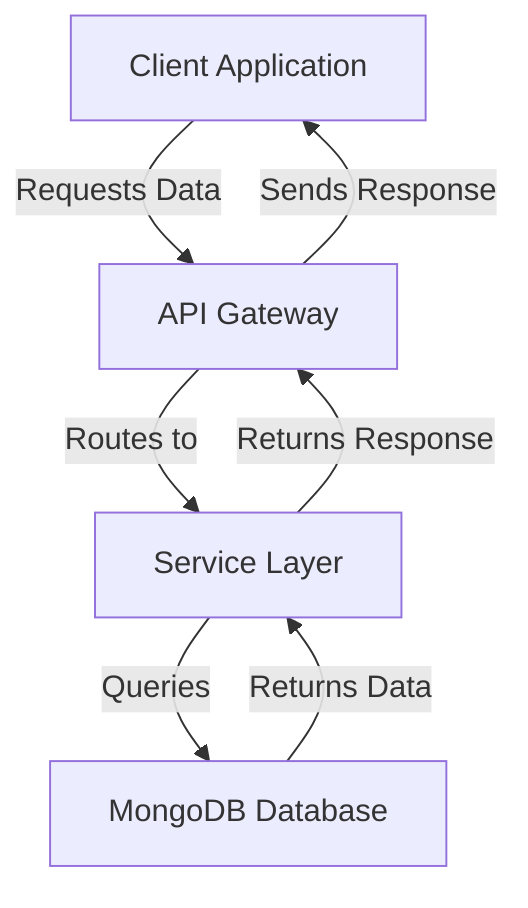

# MongoDB Aggregation Pipeline Patterns

## Overview and scope

The purpose of this document is to provide comprehensive guidelines and best practices for utilizing MongoDB aggregation pipelines within Xentic's software architecture. This standard aims to ensure consistency, performance, and maintainability across all services that interact with MongoDB databases.

### Audience
This document is intended for:
- Software Engineers
- Database Administrators
- Technical Architects
- Quality Assurance Engineers

### Scope
This standard covers:
- Recommended patterns for constructing aggregation pipelines in MongoDB.
- Performance optimization techniques for aggregation queries.
- Code examples demonstrating best practices.
- Guidelines for error handling and debugging within aggregation pipelines.

### Non-goals
This document does NOT cover:
- General MongoDB usage outside of aggregation pipelines.
- Advanced MongoDB features unrelated to aggregation.
- Database schema design or data modeling practices.

### Glossary
| Term             | Definition                                                                 |
|------------------|-----------------------------------------------------------------------------|
| Aggregation      | The process of transforming data from a collection into aggregated results. |
| Pipeline         | A sequence of data processing stages in MongoDB aggregation.                |
| Stage            | A single operation in an aggregation pipeline, such as `$match` or `$group`.|
| Index            | A data structure that improves the speed of data retrieval operations.      |
| Facet            | A stage that allows multiple aggregations to be performed in parallel.      |

### How this standard fits the Xentic platform
This standard is integral to Xentic's platform as it aligns with our commitment to delivering high-quality, scalable software solutions. By adhering to these guidelines, teams can ensure that their MongoDB interactions are efficient and maintainable, ultimately contributing to the overall performance and reliability of Xentic's services.

### Pipeline Stage Ordering
When constructing aggregation pipelines, the following order MUST be followed to optimize performance:
1. `$match` (filtering documents)
2. `$sort` (using indexed fields)
3. `$limit` (restricting the number of results)
4. `$project` (shaping the output)

### Example: Paginated Query with Total Count
```javascript
db.orders.aggregate([
  { $match: { tenantId: ObjectId("..."), status: "COMPLETED" } },
  { $sort: { createdAt: -1 } },
  { $facet: {
    data: [{ $skip: 0 }, { $limit: 20 }],
    total: [{ $count: "count" }]
  }},
  { $project: {
    data: 1,
    total: { $arrayElemAt: ["$total.count", 0] }
  }}
]);
```

### Example: Group by Time Bucket
```javascript
db.events.aggregate([
  { $match: { tenantId: ObjectId("..."), occurredAt: { $gte: startDate } } },
  { $group: {
    _id: { $dateTrunc: { date: "$occurredAt", unit: "day" } },
    count: { $sum: 1 }
  }},
  { $sort: { _id: 1 } }
]);
```

### Example: Lookup with Pipeline
```javascript
db.orders.aggregate([
  { $match: { status: "PENDING" } },
  { $lookup: {
    from: "users",
    let: { userId: "$userId" },
    pipeline: [
      { $match: { $expr: { $eq: ["$_id", "$$userId"] }, isActive: true } },
      { $project: { email: 1, fullName: 1 } }
    ],
    as: "user"
  }},
  { $unwind: "$user" }
]);
```

### Rules
- All aggregations MUST start with `$match` on an indexed field.
- Aggregations MUST NOT use `$where` as it runs JavaScript and cannot leverage indexes.
- For large collection aggregations, `allowDiskUse: true` MUST be set to prevent memory issues.

## Standards and policies

1. **Aggregation Pipeline Structure**  
   Aggregation pipelines MUST be constructed in a manner that follows the prescribed stage ordering to optimize performance. The order MUST be: `$match`, `$sort`, `$limit`, `$project`.

2. **Index Usage**  
   All `$match` stages MUST utilize indexed fields to improve query performance. Queries that do not start with an indexed `$match` MUST be reviewed for potential optimizations.

3. **Avoiding `$where`**  
   Aggregation pipelines MUST NOT use the `$where` operator, as it executes JavaScript code and does not utilize indexes, leading to performance degradation.

4. **Memory Management**  
   For aggregations on large collections, the option `allowDiskUse: true` MUST be specified in the aggregation command to prevent memory overflow issues.

5. **Error Handling**  
   Error handling MUST be implemented for all aggregation pipelines. This includes validating input parameters and handling potential exceptions gracefully. Use try-catch blocks in your application code when executing aggregation commands.

6. **Documentation and Comments**  
   Code MUST include comments explaining the purpose of each stage in the aggregation pipeline. This enhances maintainability and aids in onboarding new team members.

7. **Testing**  
   Aggregation pipelines MUST be covered by unit tests that validate the output against expected results. Use mock data to ensure tests are repeatable and reliable.

8. **Performance Monitoring**  
   Aggregation performance MUST be monitored using MongoDB's built-in performance tools. Regularly review slow query logs and optimize pipelines as necessary.

9. **Data Security**  
   Ensure that sensitive data is handled appropriately in aggregation pipelines. Fields containing sensitive information MUST be excluded from the output using `$project`.

10. **Version Compatibility**  
   Aggregation pipelines MUST be tested against the specific version of MongoDB being used in production to ensure compatibility with aggregation features.

11. **Shared Libraries**  
   When implementing common aggregation patterns, developers SHOULD utilize shared libraries (e.g., `com.xentic.common`) to promote code reuse and consistency across services.

12. **Configuration Management**  
   Configuration settings for aggregation pipelines (e.g., limiting result sizes) MUST be externalized in configuration files (YAML, HCL, or properties) to allow for easy adjustments without code changes.

### Example Configuration (YAML)
```yaml
mongodb:
  aggregation:
    allowDiskUse: true
    maxResults: 1000
```

### Example SQL for Testing Aggregation
```sql
-- Example SQL for creating a test collection
CREATE TABLE orders (
    id SERIAL PRIMARY KEY,
    tenant_id UUID NOT NULL,
    status VARCHAR(20) NOT NULL,
    created_at TIMESTAMP NOT NULL DEFAULT CURRENT_TIMESTAMP
);
```

### Code Example for Aggregation with Error Handling
```javascript
async function fetchCompletedOrders(tenantId) {
    try {
        const results = await db.orders.aggregate([
            { $match: { tenantId: ObjectId(tenantId), status: "COMPLETED" } },
            { $sort: { createdAt: -1 } },
            { $limit: 20 }
        ]).toArray();

        return results;
    } catch (error) {
        console.error("Aggregation error:", error);
        throw new Error("Failed to fetch completed orders");
    }
}
```

By adhering to these standards and policies, teams at Xentic will ensure that their MongoDB aggregation pipelines are efficient, maintainable, and secure.

## Architecture and design

### Component Diagram



### Data Flows
1. **Client Application** initiates a request to the **API Gateway** for data retrieval.
2. The **API Gateway** routes the request to the appropriate **Service Layer** based on the endpoint.
3. The **Service Layer** constructs an aggregation pipeline and queries the **MongoDB Database**.
4. The **MongoDB Database** processes the aggregation pipeline and returns the results to the **Service Layer**.
5. The **Service Layer** formats the response and sends it back to the **API Gateway**.
6. The **API Gateway** forwards the response to the **Client Application**.

### Integration Points
- **API Gateway**: Acts as a single entry point for all client requests and handles authentication and routing.
- **Service Layer**: Contains business logic and interacts with the database. It constructs aggregation pipelines based on incoming requests.
- **MongoDB Database**: Stores data and processes aggregation queries. It should be optimized with appropriate indexes for efficient querying.

### Failure Domains
- **Client Application**: If the client encounters issues (e.g., network errors), it should handle retries and provide user feedback.
- **API Gateway**: If the API Gateway fails, all services become inaccessible. Health checks and load balancing are critical to minimize downtime.
- **Service Layer**: If the service encounters an error while constructing or executing an aggregation pipeline, it should return a meaningful error response to the client.
- **MongoDB Database**: If the database is unreachable or experiences performance issues, the service layer should implement fallback mechanisms or cache responses to ensure availability.

### Best Practices
- **Error Handling**: All components MUST implement robust error handling. Use standardized error responses to maintain consistency.
- **Monitoring**: Implement monitoring for each component to track performance and failures. Use tools like Prometheus or Grafana.
- **Load Testing**: Conduct load testing on the API Gateway and Service Layer to ensure they can handle expected traffic volumes.
- **Index Management**: Regularly review and optimize indexes in the MongoDB database to ensure efficient query performance.

### Example Configuration (HCL)
```hcl
service {
  name = "user-service"
  version = "1.0.0"
  database {
    uri = "mongodb://db.internal.xentic.io:27017"
    options = {
      allowDiskUse = true
      maxResults = 1000
    }
  }
}
```

### Example SQL for Monitoring
```sql
-- Example SQL for monitoring slow queries
SELECT query, execution_time
FROM slow_query_log
WHERE execution_time > 1000
ORDER BY execution_time DESC;
```

By adhering to these architectural guidelines, Xentic teams can ensure a robust, scalable, and maintainable system that effectively utilizes MongoDB aggregation pipelines.

## Configuration reference

### Application Configuration (YAML)

The following configuration must be included in your `application.yml` file to manage MongoDB aggregation settings effectively.

```yaml
mongodb:
  uri: "mongodb://db.internal.xentic.io:27017"
  database: "xentic_db"
  aggregation:
    allowDiskUse: true          # Enables disk use for large aggregations
    maxResults: 1000            # Maximum number of results to return
    timeout: 30000              # Timeout for aggregation queries in milliseconds
    logSlowQueries: true         # Enable logging for slow aggregation queries
```

### Terraform Configuration

When deploying services that utilize MongoDB, the following Terraform configuration should be used to manage environment variables and settings.

```hcl
resource "aws_ssm_parameter" "mongodb_uri" {
  name  = "/xentic/mongodb/uri"
  type  = "String"
  value = "mongodb://db.internal.xentic.io:27017"
}

resource "aws_ssm_parameter" "mongodb_database" {
  name  = "/xentic/mongodb/database"
  type  = "String"
  value = "xentic_db"
}

resource "aws_ssm_parameter" "mongodb_aggregation_allow_disk_use" {
  name  = "/xentic/mongodb/aggregation/allowDiskUse"
  type  = "String"
  value = "true"
}

resource "aws_ssm_parameter" "mongodb_aggregation_max_results" {
  name  = "/xentic/mongodb/aggregation/maxResults"
  type  = "String"
  value = "1000"
}

resource "aws_ssm_parameter" "mongodb_aggregation_timeout" {
  name  = "/xentic/mongodb/aggregation/timeout"
  type  = "String"
  value = "30000"
}
```

### Environment Variables

For local development or containerized environments, the following environment variables should be set to configure MongoDB aggregation settings:

| Variable Name                                   | Default Value                              | Production Value                          |
|-------------------------------------------------|-------------------------------------------|------------------------------------------|
| `MONGODB_URI`                                   | `mongodb://localhost:27017`               | `mongodb://db.internal.xentic.io:27017` |
| `MONGODB_DATABASE`                              | `test_db`                                 | `xentic_db`                              |
| `MONGODB_AGGREGATION_ALLOW_DISK_USE`           | `false`                                   | `true`                                   |
| `MONGODB_AGGREGATION_MAX_RESULTS`               | `100`                                     | `1000`                                   |
| `MONGODB_AGGREGATION_TIMEOUT`                   | `10000`                                   | `30000`                                  |
| `MONGODB_AGGREGATION_LOG_SLOW_QUERIES`         | `false`                                   | `true`                                   |

### Additional Configuration Notes

- Ensure that the `MONGODB_URI` variable points to the correct MongoDB instance in production.
- The `MONGODB_AGGREGATION_MAX_RESULTS` setting should be adjusted based on the expected load and performance characteristics of your application.
- The `MONGODB_AGGREGATION_LOG_SLOW_QUERIES` setting should be enabled in production to monitor performance and identify potential bottlenecks in aggregation queries.

By following this configuration reference, teams at Xentic will ensure that their MongoDB aggregation settings are correctly applied and managed across different environments.

## Implementation guide

To implement MongoDB aggregation pipelines effectively in your service, follow these step-by-step guidelines. This guide includes full code examples across multiple classes/modules to demonstrate best practices.

### Step 1: Define the Aggregation Pipeline

Create a class that will handle the aggregation logic. This class will be responsible for constructing and executing the aggregation pipeline.

```java
package com.xentic.orders.service;

import com.mongodb.client.MongoCollection;
import com.mongodb.client.MongoDatabase;
import com.mongodb.client.model.Aggregates;
import com.mongodb.client.model.Filters;
import com.mongodb.client.model.Sorts;
import org.bson.Document;

import java.util.Arrays;
import java.util.List;

public class OrderAggregationService {
    private final MongoCollection<Document> ordersCollection;

    public OrderAggregationService(MongoDatabase database) {
        this.ordersCollection = database.getCollection("orders");
    }

    public List<Document> fetchCompletedOrders(String tenantId) {
        return ordersCollection.aggregate(Arrays.asList(
                Aggregates.match(Filters.eq("tenantId", tenantId)),
                Aggregates.match(Filters.eq("status", "COMPLETED")),
                Aggregates.sort(Sorts.descending("createdAt")),
                Aggregates.limit(20)
        )).into(new ArrayList<>());
    }
}
```

### Step 2: Create a Controller

Next, create a controller that will handle incoming requests and utilize the aggregation service to fetch data.

```java
package com.xentic.orders.controller;

import com.xentic.orders.service.OrderAggregationService;
import org.bson.Document;
import org.springframework.web.bind.annotation.*;

import java.util.List;

@RestController
@RequestMapping("/api/orders")
public class OrderController {
    private final OrderAggregationService orderAggregationService;

    public OrderController(OrderAggregationService orderAggregationService) {
        this.orderAggregationService = orderAggregationService;
    }

    @GetMapping("/completed")
    public List<Document> getCompletedOrders(@RequestParam String tenantId) {
        return orderAggregationService.fetchCompletedOrders(tenantId);
    }
}
```

### Step 3: Error Handling

Implement error handling in the aggregation service to manage potential issues during execution.

```java
public List<Document> fetchCompletedOrders(String tenantId) {
    try {
        return ordersCollection.aggregate(Arrays.asList(
                Aggregates.match(Filters.eq("tenantId", tenantId)),
                Aggregates.match(Filters.eq("status", "COMPLETED")),
                Aggregates.sort(Sorts.descending("createdAt")),
                Aggregates.limit(20)
        )).into(new ArrayList<>());
    } catch (Exception e) {
        // Log the error and throw a custom exception
        System.err.println("Aggregation error: " + e.getMessage());
        throw new RuntimeException("Failed to fetch completed orders", e);
    }
}
```

### Step 4: Unit Testing

Make sure to write unit tests to validate the behavior of your aggregation logic.

```java
package com.xentic.orders.service;

import com.mongodb.client.MongoCollection;
import com.mongodb.client.MongoDatabase;
import org.bson.Document;
import org.junit.jupiter.api.BeforeEach;
import org.junit.jupiter.api.Test;
import org.mockito.Mockito;

import java.util.Collections;
import java.util.List;

import static org.junit.jupiter.api.Assertions.assertEquals;

public class OrderAggregationServiceTest {
    private OrderAggregationService orderAggregationService;
    private MongoCollection<Document> mockCollection;

    @BeforeEach
    public void setUp() {
        MongoDatabase mockDatabase = Mockito.mock(MongoDatabase.class);
        mockCollection = Mockito.mock(MongoCollection.class);
        Mockito.when(mockDatabase.getCollection("orders")).thenReturn(mockCollection);
        orderAggregationService = new OrderAggregationService(mockDatabase);
    }

    @Test
    public void testFetchCompletedOrders() {
        String tenantId = "test-tenant-id";
        Mockito.when(mockCollection.aggregate(Mockito.any())).thenReturn(Collections.singletonList(new Document("status", "COMPLETED")));

        List<Document> results = orderAggregationService.fetchCompletedOrders(tenantId);

        assertEquals(1, results.size());
        assertEquals("COMPLETED", results.get(0).getString("status"));
    }
}
```

### Step 5: Configuration

Ensure that your application is configured to connect to the MongoDB instance and manage aggregation settings.

```yaml
mongodb:
  uri: "mongodb://db.internal.xentic.io:27017"
  database: "xentic_db"
  aggregation:
    allowDiskUse: true
    maxResults: 1000
    timeout: 30000
```

### Step 6: Deployment

When deploying your application, ensure that the MongoDB connection URI and other settings are correctly set in your environment variables or configuration management system.

| Environment Variable                           | Description                                  |
|------------------------------------------------|----------------------------------------------|
| `MONGODB_URI`                                  | MongoDB connection string                    |
| `MONGODB_DATABASE`                             | Name of the MongoDB database                 |
| `MONGODB_AGGREGATION_ALLOW_DISK_USE`          | Enable disk use for large aggregations       |
| `MONGODB_AGGREGATION_MAX_RESULTS`              | Maximum number of results to return          |
| `MONGODB_AGGREGATION_TIMEOUT`                  | Timeout for aggregation queries in milliseconds|

By following these steps, developers at Xentic will create robust and efficient MongoDB aggregation pipelines that are easy to maintain and extend.

## Security requirements

### Threat Model Summary

Xentic's MongoDB aggregation pipelines must be designed with security in mind to mitigate potential threats, including:

- **Data Exposure**: Unauthorized access to sensitive data through aggregation queries.
- **Injection Attacks**: Attacks that exploit vulnerabilities in query construction.
- **Denial of Service (DoS)**: Malicious users executing resource-intensive queries.
- **Data Integrity**: Ensuring that data returned by aggregation pipelines is accurate and unaltered.

### Authentication and Authorization

- **Authentication**: All access to the MongoDB instance MUST be authenticated using strong credentials. Use role-based access control (RBAC) to limit access to only those users who require it.
- **Authorization**: Define roles with the least privilege principle. Users MUST ONLY have permissions necessary for their tasks. For example, a read-only role should be used for services that only need to fetch data.

```yaml
security:
  mongodb:
    authentication:
      enabled: true
      method: SCRAM-SHA-256
    roles:
      - name: readOnlyRole
        privileges:
          - resource: { db: "xentic_db", collection: "orders" }
            actions: ["find"]
```

### Secrets Management

- **Secrets Storage**: Database credentials MUST NOT be hardcoded in the application code. Use a secrets management tool such as AWS Secrets Manager or HashiCorp Vault to store sensitive information securely.
- **Access Control**: Ensure that access to secrets is tightly controlled and monitored. Only authorized services should be able to retrieve secrets.

```hcl
resource "aws_secretsmanager_secret" "mongodb_credentials" {
  name = "mongodb-credentials"
}

resource "aws_secretsmanager_secret_version" "mongodb_credentials_version" {
  secret_id     = aws_secretsmanager_secret.mongodb_credentials.id
  secret_string = jsonencode({
    username = "mongodb_user"
    password = "secure_password"
  })
}
```

### Input Validation

- **Validation**: All user inputs MUST be validated before being used in aggregation queries to prevent injection attacks. Use a whitelist approach to validate acceptable input formats.
- **Sanitization**: Any user-provided data, especially those used in query filters, MUST be sanitized to remove any potentially harmful characters.

```java
public List<Document> fetchCompletedOrders(String tenantId) {
    if (!isValidTenantId(tenantId)) {
        throw new IllegalArgumentException("Invalid tenant ID");
    }
    // Proceed with aggregation logic...
}

private boolean isValidTenantId(String tenantId) {
    return tenantId != null && tenantId.matches("^[a-zA-Z0-9-_]+$"); // Example regex for validation
}
```

### Audit Logging

- **Logging**: All access to MongoDB aggregation endpoints MUST be logged, including user identity, query parameters, and timestamps. This is critical for auditing and identifying potential misuse.
- **Monitoring**: Implement monitoring for unusual patterns in aggregation queries, such as excessive resource usage or unauthorized access attempts.

```yaml
logging:
  level:
    root: INFO
    com.xentic.orders: DEBUG
  appenders:
    - type: Console
    - type: File
      filename: "logs/audit.log"
      layout:
        type: PatternLayout
        pattern: "%d{yyyy-MM-dd HH:mm:ss} %-5p %c{1} - %m%n"
```

### Summary

By adhering to these security requirements, Xentic will ensure that its MongoDB aggregation pipelines are secure, resilient against threats, and compliant with best practices in data handling and access management. All team members MUST familiarize themselves with these requirements and implement them diligently in their respective services.

## Testing strategy

To ensure the reliability and correctness of MongoDB aggregation pipelines, a comprehensive testing strategy must be employed. This strategy encompasses unit tests, integration tests, and contract tests, with specific coverage targets established for each test type.

### Unit Testing

Unit tests should focus on individual components of the aggregation logic, ensuring that each method behaves as expected in isolation. The following guidelines MUST be followed:

- **Coverage Target**: Aim for at least 80% code coverage for all service classes.
- **Mocking**: Use mocking frameworks (e.g., Mockito) to simulate MongoDB interactions.

#### Example Unit Test Class

```java
package com.xentic.orders.service;

import com.mongodb.client.MongoCollection;
import com.mongodb.client.MongoDatabase;
import org.bson.Document;
import org.junit.jupiter.api.BeforeEach;
import org.junit.jupiter.api.Test;
import org.mockito.Mockito;

import java.util.Collections;
import java.util.List;

import static org.junit.jupiter.api.Assertions.assertEquals;

public class OrderAggregationServiceTest {
    private OrderAggregationService orderAggregationService;
    private MongoCollection<Document> mockCollection;

    @BeforeEach
    public void setUp() {
        MongoDatabase mockDatabase = Mockito.mock(MongoDatabase.class);
        mockCollection = Mockito.mock(MongoCollection.class);
        Mockito.when(mockDatabase.getCollection("orders")).thenReturn(mockCollection);
        orderAggregationService = new OrderAggregationService(mockDatabase);
    }

    @Test
    public void testFetchCompletedOrders() {
        String tenantId = "test-tenant-id";
        Mockito.when(mockCollection.aggregate(Mockito.any())).thenReturn(Collections.singletonList(new Document("status", "COMPLETED")));

        List<Document> results = orderAggregationService.fetchCompletedOrders(tenantId);

        assertEquals(1, results.size());
        assertEquals("COMPLETED", results.get(0).getString("status"));
    }
}
```

### Integration Testing

Integration tests should validate the interaction between the application and the MongoDB instance. These tests MUST ensure that the aggregation pipelines return the expected results when executed against a real or test database.

- **Coverage Target**: Aim for at least 70% coverage for integration tests.
- **Test Database**: Use a dedicated test database that mirrors the production schema.

#### Example Integration Test Class

```java
package com.xentic.orders.integration;

import com.xentic.orders.service.OrderAggregationService;
import com.mongodb.client.MongoClients;
import com.mongodb.client.MongoCollection;
import com.mongodb.client.MongoDatabase;
import org.bson.Document;
import org.junit.jupiter.api.AfterEach;
import org.junit.jupiter.api.BeforeEach;
import org.junit.jupiter.api.Test;

import static org.junit.jupiter.api.Assertions.assertEquals;

public class OrderAggregationIntegrationTest {
    private MongoDatabase testDatabase;
    private OrderAggregationService orderAggregationService;

    @BeforeEach
    public void setUp() {
        testDatabase = MongoClients.create("mongodb://localhost:27017/test_db").getDatabase("test_db");
        orderAggregationService = new OrderAggregationService(testDatabase);
        // Insert test data
        MongoCollection<Document> collection = testDatabase.getCollection("orders");
        collection.insertOne(new Document("tenantId", "test-tenant-id").append("status", "COMPLETED"));
    }

    @AfterEach
    public void tearDown() {
        testDatabase.getCollection("orders").drop();
    }

    @Test
    public void testFetchCompletedOrdersIntegration() {
        List<Document> results = orderAggregationService.fetchCompletedOrders("test-tenant-id");
        assertEquals(1, results.size());
        assertEquals("COMPLETED", results.get(0).getString("status"));
    }
}
```

### Contract Testing

Contract tests should verify that the API contracts between services are upheld. This is particularly important when multiple services rely on the same aggregation endpoints.

- **Coverage Target**: Aim for 100% adherence to defined API contracts.
- **Tools**: Use tools like Pact or Spring Cloud Contract for defining and verifying contracts.

#### Example Contract Test Class

```java
package com.xentic.orders.contract;

import org.junit.jupiter.api.Test;
import org.springframework.cloud.contract.spec.Contract;

import static org.springframework.cloud.contract.spec.Contract.make;

public class OrderApiContractTest {
    @Test
    public void validateOrderApiContract() {
        Contract.make {
            description "should return completed orders for a given tenant"
            request {
                method 'GET'
                urlPath('/api/orders/completed') {
                    queryParameters {
                        parameter 'tenantId': 'test-tenant-id'
                    }
                }
            }
            response {
                status 200
                body([
                    [status: 'COMPLETED']
                ])
                headers {
                    contentType(applicationJson())
                }
            }
        }
    }
}
```

### Summary of Coverage Targets

| Test Type         | Coverage Target |
|-------------------|-----------------|
| Unit Tests        | 80%             |
| Integration Tests | 70%             |
| Contract Tests    | 100%            |

By adhering to this testing strategy, Xentic's development teams will ensure that the MongoDB aggregation pipelines are robust, reliable, and maintainable, ultimately leading to higher quality software and better user experiences.

## Observability and operations

To maintain high availability and performance of MongoDB aggregation pipelines, Xentic MUST implement a robust observability and operations strategy. This includes metrics collection, logging, tracing, dashboard creation, alerting, and defining service level objectives (SLOs). 

### Metrics

Metrics MUST be collected to monitor the performance and health of MongoDB aggregation pipelines. Key metrics to track include:

- **Query Execution Time**: Measure the time taken for aggregation queries to execute.
- **Error Rates**: Track the number of failed aggregation queries.
- **Resource Utilization**: Monitor CPU, memory, and disk I/O usage on MongoDB instances.
- **Throughput**: Measure the number of aggregation queries processed per second.

#### Example Metrics Configuration

```yaml
metrics:
  enabled: true
  prometheus:
    endpoint: /metrics
    port: 9090
```

### Logs

All aggregation queries MUST be logged for auditing and debugging purposes. Logs should include:

- User identity
- Query parameters
- Execution time
- Result status (success/failure)

#### Example Logging Configuration

```yaml
logging:
  level:
    root: INFO
    com.xentic.orders: DEBUG
  appenders:
    - type: Console
    - type: File
      filename: "logs/aggregation.log"
      layout:
        type: PatternLayout
        pattern: "%d{yyyy-MM-dd HH:mm:ss} %-5p %c{1} - %m%n"
```

### Traces

Distributed tracing MUST be implemented to track the flow of requests through the system. This helps in identifying bottlenecks and performance issues in aggregation pipelines.

- **Tooling**: Use tools like OpenTelemetry or Zipkin for tracing.
- **Context Propagation**: Ensure that trace context is propagated through all service calls.

### Dashboards

Dashboards MUST be created to visualize key metrics and logs. These dashboards should provide insights into:

- Query performance trends over time
- Error rates and types
- Resource utilization patterns

#### Example Dashboard Configuration

```yaml
dashboards:
  prometheus:
    - title: "MongoDB Aggregation Performance"
      panels:
        - title: "Query Execution Time"
          type: "graph"
          metrics:
            - query: "avg(mongo_query_duration_seconds)"
        - title: "Error Rate"
          type: "graph"
          metrics:
            - query: "rate(mongo_query_errors_total[5m])"
```

### Alerts

Alerts MUST be configured to notify the engineering team of any anomalies or performance degradation. Key alerts to set up include:

- **High Query Execution Time**: Alert when average execution time exceeds a defined threshold.
- **Increased Error Rate**: Alert when error rates exceed a specific percentage.
- **Resource Utilization**: Alert when CPU or memory usage exceeds a defined limit.

#### Example Alert Configuration

```yaml
alerts:
  - name: "High Query Execution Time"
    expr: "avg(mongo_query_duration_seconds) > 2"
    for: "5m"
    labels:
      severity: "critical"
    annotations:
      summary: "High query execution time detected"
      description: "The average execution time for MongoDB queries has exceeded 2 seconds."
```

### Service Level Objectives (SLOs)

SLOs MUST be defined to set performance expectations for MongoDB aggregation pipelines. Examples of SLOs include:

| SLO Description                     | Target          |
|-------------------------------------|------------------|
| 95th percentile of query execution time | < 1 second     |
| Error rate for aggregation queries   | < 1%            |
| System uptime                        | > 99.9%         |

### On-Call Runbook Steps

In the event of performance issues or outages, the following on-call runbook steps MUST be followed:

1. **Identify the Issue**: Check logs and metrics to identify the nature of the problem.
2. **Assess Impact**: Determine which services or users are affected.
3. **Communicate**: Notify stakeholders of the issue and provide updates.
4. **Mitigate**: Implement temporary fixes if possible (e.g., scaling resources).
5. **Resolve**: Work towards a permanent fix and document the resolution steps.
6. **Post-Mortem**: Conduct a post-mortem analysis to identify root causes and prevent recurrence.

By implementing these observability and operations practices, Xentic will ensure that its MongoDB aggregation pipelines are monitored effectively, leading to improved reliability and performance. All team members MUST adhere to these guidelines to maintain a high standard of operational excellence.

## Migration and versioning

To ensure smooth transitions between MongoDB versions and maintain backward compatibility, Xentic MUST adhere to a well-defined migration and versioning strategy. This strategy encompasses upgrade paths, deprecation policies, backward compatibility measures, and rollback procedures.

### Upgrade Paths

Xentic MUST establish clear upgrade paths for MongoDB versions. Each upgrade path should be documented and should include:

- **Supported Versions**: Specify the MongoDB versions that are supported for upgrades.
- **Upgrade Steps**: Provide a step-by-step guide for upgrading from one version to another.
- **Testing Requirements**: Define the testing that MUST be performed post-upgrade to ensure functionality.

#### Example Upgrade Path Documentation

| Current Version | Target Version | Upgrade Steps                               | Testing Requirements           |
|------------------|----------------|---------------------------------------------|--------------------------------|
| 4.0              | 4.2            | 1. Backup data<br>2. Upgrade MongoDB<br>3. Restart services | Verify data integrity<br>Run integration tests |
| 4.2              | 5.0            | 1. Backup data<br>2. Upgrade MongoDB<br>3. Restart services | Verify data integrity<br>Run integration tests |

### Deprecation Policy

Xentic MUST implement a deprecation policy for features that may be removed in future MongoDB versions. This policy should include:

- **Notification**: Notify teams at least one release cycle in advance of any deprecation.
- **Documentation**: Provide clear documentation on deprecated features and recommended alternatives.
- **Grace Period**: Allow a grace period during which deprecated features remain functional before removal.

#### Example Deprecation Notification

```markdown
### Deprecation Notice: Aggregation Framework Feature

**Feature**: `$geoNear` stage in aggregation pipelines  
**Deprecated In**: MongoDB 5.0  
**Recommended Alternative**: Use `$geoWithin` with a `$match` stage.  
**Notification Date**: 2023-10-01  
**Removal Date**: 2024-10-01  
```

### Backward Compatibility

Backward compatibility MUST be a priority during migrations. Xentic MUST ensure that:

- **Data Formats**: Data formats remain consistent across versions.
- **APIs**: APIs should not change in a way that breaks existing clients.
- **Feature Flags**: Use feature flags to enable or disable new features without affecting existing functionality.

### Rollback Procedures

In the event of a failed upgrade, Xentic MUST have a rollback strategy in place. This strategy should include:

1. **Backup**: Always create a backup before performing upgrades.
2. **Rollback Steps**: Document the steps required to revert to the previous version.
3. **Testing Post-Rollback**: Verify that the system is functioning correctly after rollback.

#### Example Rollback Steps

```markdown
### Rollback Procedure for MongoDB Upgrade

1. **Restore Backup**: 
   ```bash
   mongorestore --db <database_name> <backup_path>
   ```

2. **Downgrade MongoDB**: 
   ```bash
   apt-get install mongodb=4.2.0
   ```

3. **Restart Services**: 
   ```bash
   systemctl restart mongodb
   ```

4. **Verify Functionality**: 
   - Run integration tests to ensure all features are functioning as expected.
   ```

### Versioning Strategy

Xentic MUST adopt a semantic versioning strategy for all MongoDB-related libraries and services. This includes:

- **Major Version**: Incremented for incompatible API changes.
- **Minor Version**: Incremented for added functionality in a backward-compatible manner.
- **Patch Version**: Incremented for backward-compatible bug fixes.

#### Example Versioning Table

| Service                 | Current Version | Next Version | Change Type           |
|-------------------------|-----------------|--------------|------------------------|
| com.xentic.orders       | 1.0.0           | 1.1.0        | Minor (new feature)    |
| com.xentic.orders       | 1.1.0           | 2.0.0        | Major (breaking change) |
| com.xentic.orders       | 1.1.1           | 1.1.2        | Patch (bug fix)        |

By adhering to these migration and versioning guidelines, Xentic will ensure that its MongoDB implementations remain stable, reliable, and maintainable over time. All teams MUST follow these standards to minimize disruptions and maintain operational integrity.

## FAQ, anti-patterns, and checklists

### Frequently Asked Questions (FAQ)

1. **What is the MongoDB aggregation pipeline?**
   - The aggregation pipeline is a framework for data aggregation in MongoDB, allowing the processing of data through a multi-stage pipeline.

2. **When should I use the aggregation pipeline?**
   - Use the aggregation pipeline when you need to perform complex data transformations, filtering, or grouping operations that cannot be achieved with simple queries.

3. **What are the main stages of the aggregation pipeline?**
   - Key stages include `$match`, `$group`, `$sort`, `$project`, and `$lookup`.

4. **How can I optimize aggregation queries?**
   - Optimize by using indexes, limiting the number of documents processed, and minimizing the use of `$unwind` where possible.

5. **What is the difference between `$project` and `$group`?**
   - `$project` reshapes documents by including or excluding fields, while `$group` aggregates documents based on specified criteria.

6. **Can I use indexes with aggregation pipelines?**
   - Yes, MongoDB can utilize indexes in aggregation pipelines, particularly in stages like `$match` and `$sort`.

7. **What are some common performance issues with aggregation pipelines?**
   - Common issues include large data sets being processed, inefficient stages, and lack of indexes.

8. **How do I debug aggregation pipeline performance?**
   - Use the `explain()` method to analyze query execution plans and identify bottlenecks.

9. **Is there a limit to the number of stages in an aggregation pipeline?**
   - While there is no hard limit, keeping the number of stages manageable is recommended for performance reasons.

10. **How can I handle errors in aggregation pipelines?**
    - Use try-catch blocks in your application code to handle potential errors gracefully.

### Anti-Patterns

| Anti-Pattern                        | Description                                                                 |
|-------------------------------------|-----------------------------------------------------------------------------|
| Overusing `$unwind`                 | Excessive use of `$unwind` can lead to performance degradation.            |
| Not using indexes                   | Failing to index fields used in `$match` or `$sort` can slow down queries.|
| Complex pipelines                   | Creating overly complex pipelines makes them hard to maintain and debug.   |
| Ignoring `$project`                 | Not using `$project` to limit fields can lead to unnecessary data transfer.|
| Using `$group` without `$match`    | Grouping large datasets without filtering can lead to performance issues.   |

### Pre-Merge Checklist

- [ ] Ensure all aggregation queries are reviewed for performance.
- [ ] Validate that indexes are created on fields used in `$match` and `$sort`.
- [ ] Confirm that the aggregation pipeline is tested against a representative dataset.
- [ ] Review the aggregation logic for potential anti-patterns.
- [ ] Ensure proper logging and monitoring are in place for the new aggregation queries.

### Production Checklist

- [ ] Verify that all aggregation queries are functioning as expected in staging.
- [ ] Check that alerts for query performance are configured and operational.
- [ ] Ensure documentation for new aggregation patterns is updated.
- [ ] Confirm that rollback procedures are in place in case of issues post-deployment.
- [ ] Monitor the performance of aggregation queries in the first week after deployment. 

By adhering to these FAQs, avoiding common anti-patterns, and following the provided checklists, Xentic will ensure that its MongoDB aggregation pipelines are efficient, maintainable, and reliable. All team members MUST familiarize themselves with these guidelines to uphold the integrity of our data processing practices.
