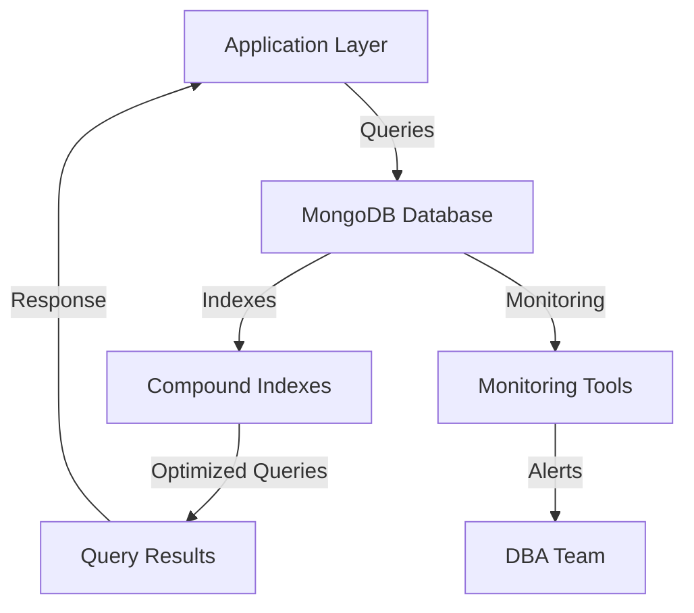

# Compound Indexes — MongoDB

## Overview and scope

The purpose of this document is to establish standards and best practices for the implementation and management of compound indexes in MongoDB within the Xentic platform. Compound indexes are essential for optimizing query performance and ensuring efficient data retrieval in applications that require complex querying capabilities.

### Audience
This document is intended for:
- Database Administrators (DBAs)
- Software Engineers
- System Architects
- Technical Leads

### Scope
This standard applies to all MongoDB databases used within Xentic services. It covers:
- Definition and creation of compound indexes
- Guidelines for index selection and optimization
- Performance considerations
- Maintenance and monitoring of indexes

### Non-goals
This document does NOT cover:
- General MongoDB usage and operations
- Single-field indexes
- Indexing strategies for non-MongoDB databases
- Application-level query optimization techniques

### Glossary
| Term               | Definition                                                                 |
|--------------------|-----------------------------------------------------------------------------|
| Compound Index     | An index that consists of multiple fields from a document in a MongoDB collection. |
| Query Performance   | The speed and efficiency with which a database can execute queries.         |
| Indexing           | The process of creating data structures that improve the speed of data retrieval. |
| MongoDB            | A NoSQL database that uses a document-oriented data model.                  |

### How this standard fits the Xentic platform
The implementation of compound indexes is crucial for the performance and scalability of Xentic's applications. By adhering to these standards, teams will ensure that:
- Query performance is optimized across services
- Resource utilization is efficient
- Maintenance of indexes is standardized, reducing the risk of performance degradation over time

### Example of Creating a Compound Index
To create a compound index on the fields `userId` and `createdAt` in a MongoDB collection named `orders`, the following command should be used:

```javascript
db.orders.createIndex({ userId: 1, createdAt: -1 })
```

This creates an index that sorts `userId` in ascending order and `createdAt` in descending order, optimizing queries that filter or sort by these fields.

### Best Practices
- **MUST** analyze query patterns before creating compound indexes.
- **SHOULD** use the MongoDB explain plan to evaluate index effectiveness.
- **MUST NOT** create indexes on fields that are rarely queried.
- **SHOULD** periodically review and remove unused indexes to maintain optimal performance.

By following these guidelines, Xentic teams will enhance the efficiency of data access patterns and improve overall application performance.

## Standards and policies

1. **MUST** use the naming convention `com.xentic.<service>` for all MongoDB collections and indexes to maintain consistency across services.

2. **MUST** create compound indexes only on fields that are frequently used together in queries. Analyze query patterns to identify these fields.

3. **SHOULD** prioritize fields in compound indexes based on their selectivity. The most selective field should be listed first to optimize query performance.

4. **MUST NOT** create compound indexes that exceed 32 fields. MongoDB has a limit on the number of fields in a single index.

5. **MUST** ensure that compound indexes are created with the appropriate sort order (ascending or descending) based on how the fields are queried.

6. **SHOULD** utilize the MongoDB `explain()` method to analyze and optimize query performance before and after creating compound indexes.

7. **MUST NOT** create compound indexes for fields that are rarely queried together, as this can lead to unnecessary overhead and decreased write performance.

8. **SHOULD** document the purpose and usage of each compound index in the service's internal documentation to facilitate future maintenance and understanding.

9. **MUST** monitor the performance of compound indexes regularly using MongoDB’s built-in tools to identify any potential issues or opportunities for optimization.

10. **SHOULD** use the following YAML configuration format for defining indexes in the application code:

```yaml
indexes:
  - name: userId_createdAt_index
    collection: orders
    fields:
      userId: 1
      createdAt: -1
```

11. **MUST** ensure that all compound indexes are included in the deployment scripts to maintain consistency across different environments (development, staging, production).

12. **SHOULD** consider the size and cardinality of the indexed fields when designing compound indexes, as large or low-cardinality fields may not provide performance benefits.

13. **MUST NOT** rely solely on compound indexes for query performance. Other optimization techniques, such as query refactoring and data modeling, should also be employed.

14. **SHOULD** evaluate the impact of compound indexes on write operations, as excessive indexing can lead to increased latency during data insertion and updates.

15. **MUST** follow the Xentic coding standards for all database-related code, including the use of proper error handling and logging when creating or modifying indexes.

16. **SHOULD** use the following SQL-like command to create a compound index in MongoDB:

```javascript
db.orders.createIndex({ userId: 1, createdAt: -1 })
```

17. **MUST** ensure that all compound indexes are tested in a staging environment before being deployed to production to avoid performance regressions.

18. **SHOULD** utilize monitoring tools such as MongoDB Atlas or custom dashboards to visualize index usage and performance metrics.

19. **MUST NOT** ignore the potential impact of compound indexes on read and write operations. Regularly assess the trade-offs involved.

20. **SHOULD** engage in regular training and knowledge sharing sessions to keep the engineering team updated on best practices for compound indexing in MongoDB.

By adhering to these standards and policies, Xentic will ensure that compound indexes are effectively utilized, leading to improved application performance and resource efficiency.

## Architecture and design

The architecture for implementing compound indexes in MongoDB at Xentic involves several components and data flows that ensure efficient data retrieval and optimal performance. Below is a component diagram description and the relevant details.



### Data Flows
1. **Application Layer to MongoDB Database**: The application layer sends queries to the MongoDB database, which may include filters and sorting based on indexed fields.
2. **MongoDB Database to Compound Indexes**: The database uses compound indexes to optimize the execution of these queries, improving response times.
3. **Query Results to Application Layer**: The optimized query results are sent back to the application layer for further processing or display.
4. **Monitoring Tools to DBA Team**: Monitoring tools track the performance of compound indexes and alert the DBA team for any anomalies or performance issues.

### Integration Points
- **Application Layer**: Integrates with MongoDB using a driver (e.g., MongoDB Java Driver) to execute queries and manage indexes.
- **Monitoring Tools**: Tools such as MongoDB Atlas or custom dashboards are integrated for real-time performance monitoring and alerting.
- **DBA Team**: The DBA team utilizes monitoring insights to make informed decisions about index management and optimization.

### Failure Domains
- **Database Failure**: If the MongoDB database becomes unavailable, the application layer cannot execute queries, leading to downtime.
- **Index Corruption**: Corrupted indexes can lead to incorrect query results or degraded performance, necessitating regular monitoring and maintenance.
- **Monitoring Tool Failure**: If monitoring tools fail, the DBA team may miss critical performance alerts, leading to unaddressed issues.

### Best Practices for Compound Index Design
- **MUST** analyze query patterns to determine the most frequently queried fields.
- **SHOULD** document the purpose and usage of each compound index in the service's internal documentation.
- **MUST NOT** create compound indexes that do not align with actual query usage, as this can lead to unnecessary overhead.

### Example Configuration for Compound Indexes
To define compound indexes in the application code, use the following YAML format:

```yaml
indexes:
  - name: userId_createdAt_index
    collection: orders
    fields:
      userId: 1
      createdAt: -1
```

### SQL-like Command for Creating Compound Indexes
To create a compound index in MongoDB, use the following command:

```javascript
db.orders.createIndex({ userId: 1, createdAt: -1 })
```

### Summary
By adhering to the outlined architecture and design principles, Xentic will ensure that compound indexes are effectively utilized, leading to improved application performance and resource efficiency. Regular monitoring and documentation are critical to maintaining the integrity and performance of compound indexes within the MongoDB environment.

## Configuration reference

### application.yml Configuration

The following YAML configuration is recommended for defining compound indexes in your application:

```yaml
mongodb:
  indexes:
    - name: userId_createdAt_index
      collection: orders
      fields:
        userId: 1
        createdAt: -1
    - name: productId_orderDate_index
      collection: orders
      fields:
        productId: 1
        orderDate: -1
    - name: customerId_status_index
      collection: customers
      fields:
        customerId: 1
        status: 1
```

### Terraform Configuration

To create compound indexes using Terraform, you can use the following configuration:

```hcl
resource "mongodb_index" "userId_createdAt_index" {
  collection = "orders"
  name       = "userId_createdAt_index"
  keys       = {
    userId: 1
    createdAt: -1
  }
}

resource "mongodb_index" "productId_orderDate_index" {
  collection = "orders"
  name       = "productId_orderDate_index"
  keys       = {
    productId: 1
    orderDate: -1
  }
}

resource "mongodb_index" "customerId_status_index" {
  collection = "customers"
  name       = "customerId_status_index"
  keys       = {
    customerId: 1
    status: 1
  }
}
```

### Environment Variables

The following environment variables can be defined to manage MongoDB connection and indexing settings:

| Variable Name                     | Default Value                | Production Value                |
|-----------------------------------|------------------------------|---------------------------------|
| `MONGODB_URI`                     | `mongodb://localhost:27017`  | `mongodb://prod-db.xentic.io:27017` |
| `MONGODB_DATABASE`                | `xentic_db`                  | `xentic_prod_db`                |
| `MONGODB_INDEX_USERID_CREATEDAT`  | `true`                       | `true`                          |
| `MONGODB_INDEX_PRODUCTID_ORDERDATE`| `true`                       | `true`                          |
| `MONGODB_INDEX_CUSTOMERID_STATUS` | `false`                      | `true`                          |

### Index Management Best Practices

- **MUST** ensure that all indexes are defined in the application configuration to maintain consistency across environments.
- **SHOULD** use environment variables for sensitive information such as database URIs to enhance security.
- **MUST NOT** hard-code database connection strings or index definitions directly in the application code.
- **SHOULD** validate that the defined indexes are created successfully during the application startup process.

By following these configuration guidelines, Xentic teams will ensure that compound indexes are consistently defined and managed across all environments, leading to improved performance and maintainability.

## Implementation guide

Implementing compound indexes in MongoDB at Xentic involves a systematic approach to ensure optimal performance and maintainability. Follow these steps to create and manage compound indexes effectively.

### Step 1: Analyze Query Patterns

Before creating compound indexes, analyze the application's query patterns to identify which fields are frequently used together in queries. This analysis will guide the design of your compound indexes.

### Step 2: Define Index Specifications

Define the specifications for your compound indexes in your application configuration (YAML format). Below is an example configuration:

```yaml
mongodb:
  indexes:
    - name: userId_createdAt_index
      collection: orders
      fields:
        userId: 1
        createdAt: -1
    - name: productId_orderDate_index
      collection: orders
      fields:
        productId: 1
        orderDate: -1
```

### Step 3: Create Indexes Programmatically

Use the MongoDB Java Driver to create compound indexes programmatically. Below is a sample Java code snippet to create the `userId_createdAt_index`:

```java
import com.mongodb.client.MongoClients;
import com.mongodb.client.MongoClient;
import com.mongodb.client.MongoDatabase;
import com.mongodb.client.MongoCollection;
import org.bson.Document;

public class IndexCreator {
    public static void main(String[] args) {
        try (MongoClient mongoClient = MongoClients.create("mongodb://localhost:27017")) {
            MongoDatabase database = mongoClient.getDatabase("xentic_db");
            MongoCollection<Document> collection = database.getCollection("orders");

            collection.createIndex(new Document("userId", 1).append("createdAt", -1), "userId_createdAt_index");
            System.out.println("Compound index created: userId_createdAt_index");
        }
    }
}
```

### Step 4: Verify Index Creation

Once the index is created, verify its existence and properties using the following command in the MongoDB shell:

```javascript
db.orders.getIndexes()
```

This command will list all indexes on the `orders` collection, including the newly created compound index.

### Step 5: Monitor Index Performance

Utilize MongoDB monitoring tools such as MongoDB Atlas or custom dashboards to track the performance of your compound indexes. Monitor metrics such as query execution time and index usage frequency.

### Step 6: Test in Staging Environment

Before deploying to production, test the compound indexes in a staging environment. Execute common queries that utilize the indexes and measure performance improvements.

### Step 7: Deploy to Production

Once testing is complete, deploy the application with the compound indexes to the production environment. Ensure that the deployment scripts include the index creation commands to maintain consistency.

### Step 8: Regularly Review and Optimize

Regularly review the performance of compound indexes and optimize them based on changing query patterns. Remove any unused or redundant indexes to reduce overhead.

### Summary of Steps

1. Analyze query patterns.
2. Define index specifications in YAML.
3. Create indexes programmatically using Java.
4. Verify index creation in MongoDB shell.
5. Monitor index performance using tools.
6. Test indexes in a staging environment.
7. Deploy to production with index creation scripts.
8. Regularly review and optimize indexes.

By following this implementation guide, Xentic will ensure that compound indexes are effectively created and maintained, leading to improved query performance and application efficiency.

## Security requirements

### Threat Model Summary
Xentic's MongoDB deployments must be designed with a robust security posture to mitigate risks associated with unauthorized access, data breaches, and data integrity issues. Key threats include:

- **Unauthorized Access**: Attackers gaining access to sensitive data through compromised credentials or misconfigured access controls.
- **Data Breaches**: Exposure of sensitive information due to vulnerabilities in the application or database.
- **Injection Attacks**: Malicious input that could manipulate queries or commands executed against the database.

### Authentication and Authorization
- **MUST** implement role-based access control (RBAC) to restrict access to MongoDB resources based on user roles.
- **MUST NOT** use default MongoDB accounts or passwords; all credentials must be unique and complex.
- **SHOULD** utilize a centralized identity provider (IdP) for authentication to streamline user management and enhance security.

Example of RBAC roles in MongoDB:

```javascript
db.createRole({
  role: "readWriteOrders",
  privileges: [
    { resource: { db: "xentic_db", collection: "orders" }, actions: ["find", "insert", "update", "remove"] }
  ],
  roles: []
});
```

### Secrets Management
- **MUST** store sensitive information such as database URIs, usernames, and passwords in a secure vault (e.g., HashiCorp Vault, AWS Secrets Manager).
- **MUST NOT** hard-code sensitive information in application code or configuration files.

Example of using environment variables for secrets management:

```yaml
mongodb:
  uri: ${MONGODB_URI}
  username: ${MONGODB_USERNAME}
  password: ${MONGODB_PASSWORD}
```

### Input Validation
- **MUST** validate all user inputs to prevent injection attacks and ensure data integrity.
- **SHOULD** implement whitelisting for acceptable input formats and values.
- **MUST NOT** trust any data coming from external sources without validation.

Example of input validation in a Java application:

```java
public void createOrder(Order order) {
    if (!isValidOrder(order)) {
        throw new IllegalArgumentException("Invalid order data");
    }
    // Proceed with order creation
}

private boolean isValidOrder(Order order) {
    return order.getUserId() != null && order.getProductId() != null;
}
```

### Audit Logging
- **MUST** enable audit logging to track all database operations, including successful and failed authentication attempts, data modifications, and index usage.
- **SHOULD** store logs in a centralized logging system for analysis and monitoring.
- **MUST NOT** disable audit logging; it is essential for compliance and security investigations.

Example of enabling auditing in MongoDB:

```yaml
setParameter:
  auditLog:
    destination: file
    format: BSON
    path: /var/log/mongodb/audit.log
    filter: '{ "at": { "$gte": ISODate("2023-01-01T00:00:00Z") } }'
```

### Summary of Security Requirements
- Implement role-based access control (RBAC).
- Use secure secrets management practices.
- Validate all user inputs rigorously.
- Enable comprehensive audit logging for accountability.

By adhering to these security requirements, Xentic will significantly enhance the security posture of its MongoDB deployments, protecting sensitive data and ensuring compliance with industry standards.

## Testing strategy

To ensure the reliability and performance of compound indexes in MongoDB, Xentic must adopt a comprehensive testing strategy that encompasses unit tests, integration tests, and contract tests. Each type of test plays a crucial role in validating the functionality and performance of the indexes.

### Unit Tests

Unit tests are essential for validating the logic used to define and create indexes. These tests should cover the following aspects:

- **MUST** verify that the index creation logic correctly defines the indexes as specified in the configuration.
- **MUST NOT** rely on an actual database connection; instead, use mocking frameworks to simulate database interactions.

#### Example Unit Test Class

```java
import static org.mockito.Mockito.*;
import org.junit.jupiter.api.Test;
import com.mongodb.client.MongoCollection;
import org.bson.Document;

public class IndexCreatorTest {

    @Test
    public void testCreateIndex() {
        MongoCollection<Document> mockCollection = mock(MongoCollection.class);
        IndexCreator indexCreator = new IndexCreator(mockCollection);

        indexCreator.createIndex("userId_createdAt_index");

        verify(mockCollection).createIndex(new Document("userId", 1).append("createdAt", -1), "userId_createdAt_index");
    }
}
```

### Integration Tests

Integration tests validate the interaction between the application and the MongoDB database. These tests should ensure that:

- **MUST** execute against a test database to verify that indexes are created and utilized correctly.
- **SHOULD** include tests for query performance before and after index creation.

#### Example Integration Test Class

```java
import static org.junit.jupiter.api.Assertions.*;
import org.junit.jupiter.api.AfterEach;
import org.junit.jupiter.api.BeforeEach;
import org.junit.jupiter.api.Test;
import com.mongodb.client.MongoClients;
import com.mongodb.client.MongoClient;
import com.mongodb.client.MongoDatabase;

public class IndexIntegrationTest {

    private MongoClient mongoClient;
    private MongoDatabase database;

    @BeforeEach
    public void setUp() {
        mongoClient = MongoClients.create("mongodb://localhost:27017");
        database = mongoClient.getDatabase("xentic_test_db");
        // Create necessary collections and indexes here
    }

    @AfterEach
    public void tearDown() {
        mongoClient.close();
    }

    @Test
    public void testIndexCreation() {
        // Code to create index
        // Assert index creation
    }

    @Test
    public void testQueryPerformanceWithIndex() {
        // Code to measure query performance
        // Assert performance improvements
    }
}
```

### Contract Tests

Contract tests ensure that the application adheres to the expected behavior when interacting with the database. These tests are particularly important when multiple services depend on the same database schema.

- **MUST** define clear contracts for expected index behavior and performance.
- **SHOULD** use tools like Pact to facilitate contract testing between services.

### Coverage Targets

To maintain high-quality code, Xentic must establish coverage targets for tests:

| Test Type         | Coverage Target |
|-------------------|-----------------|
| Unit Tests        | 80%             |
| Integration Tests  | 70%             |
| Contract Tests    | 90%             |

### Summary of Testing Strategy

1. **Unit Tests**: Validate index creation logic using mocks.
2. **Integration Tests**: Test against a real MongoDB instance to ensure correct index functionality and performance.
3. **Contract Tests**: Ensure compliance with expected behaviors across services.
4. **Coverage Targets**: Aim for 80% unit test coverage, 70% integration test coverage, and 90% contract test coverage.

By implementing this testing strategy, Xentic will ensure robust validation of compound indexes, leading to reliable application performance and enhanced maintainability.

## Observability and operations

To effectively monitor and manage compound indexes in MongoDB, Xentic must implement a comprehensive observability and operations strategy that includes metrics, logs, traces, dashboards, alerts, and service level objectives (SLOs). This strategy will ensure that the performance and health of the database are maintained, and any issues can be promptly addressed.

### Metrics

Xentic should collect the following key metrics related to compound indexes:

- **Index Usage**: Track how often each index is used in queries.
- **Query Performance**: Measure the execution time of queries that utilize compound indexes.
- **Index Size**: Monitor the size of each index to understand storage implications.
- **Cache Hit Ratio**: Evaluate the effectiveness of the database's cache when accessing indexed data.

Example of metrics configuration in YAML:

```yaml
metrics:
  enabled: true
  collectionInterval: 10s
  indexUsage:
    enabled: true
  queryPerformance:
    enabled: true
  indexSize:
    enabled: true
  cacheHitRatio:
    enabled: true
```

### Logs

Logging is essential for tracking operations and diagnosing issues. Xentic MUST enable detailed logging for MongoDB operations related to compound indexes. Logs should include:

- Index creation and deletion events.
- Query execution logs that indicate which indexes were used.
- Performance logs that capture execution times and errors.

Example of logging configuration in properties file:

```properties
logging.level.org.mongodb=DEBUG
logging.file.name=/var/log/mongodb/mongo.log
```

### Traces

Distributed tracing should be implemented to monitor requests that involve compound indexes. This will help identify performance bottlenecks and understand the flow of requests through the application. Xentic SHOULD use tools like OpenTelemetry or Zipkin for tracing.

Example of tracing configuration in YAML:

```yaml
tracing:
  enabled: true
  serviceName: xentic-service
  exporter:
    type: zipkin
    endpoint: http://zipkin.internal.xentic.io/api/v2/spans
```

### Dashboards

Xentic MUST create dashboards to visualize the collected metrics and logs. Dashboards should include:

- Index usage statistics.
- Query performance trends over time.
- Alerts for slow queries or high index sizes.

Example of a dashboard configuration in Grafana:

```json
{
  "title": "MongoDB Index Performance",
  "panels": [
    {
      "type": "graph",
      "title": "Index Usage",
      "targets": [
        {
          "target": "mongodb_index_usage"
        }
      ]
    },
    {
      "type": "graph",
      "title": "Query Performance",
      "targets": [
        {
          "target": "mongodb_query_performance"
        }
      ]
    }
  ]
}
```

### Alerts

Alerts must be configured to notify the engineering team of any anomalies in index performance or usage. Xentic SHOULD set up alerts for:

- High query execution times.
- Low index usage, indicating potential redundancy.
- Rapid growth in index size.

Example of alert configuration in Prometheus:

```yaml
groups:
  - name: mongodb-alerts
    rules:
      - alert: HighQueryExecutionTime
        expr: avg(rate(mongodb_query_duration_seconds_sum[5m])) > 2
        for: 10m
        labels:
          severity: critical
        annotations:
          summary: "High query execution time detected"
          description: "Query execution time exceeds 2 seconds for the last 10 minutes."
```

### Service Level Objectives (SLOs)

Xentic MUST define SLOs to ensure that compound indexes meet performance expectations. Suggested SLOs include:

| SLO Description                      | Target       |
|--------------------------------------|--------------|
| 95th percentile query execution time  | < 500ms      |
| Index usage frequency                 | > 80%        |
| Index size growth rate                | < 5% per month |

### On-call Runbook Steps

In the event of an issue related to compound indexes, the following on-call runbook steps MUST be followed:

1. **Identify the Issue**: Check alerts and logs to determine the nature of the problem.
2. **Assess Impact**: Evaluate how the issue affects application performance and user experience.
3. **Investigate Metrics**: Review metrics related to index usage and query performance.
4. **Consult Dashboards**: Use dashboards to visualize trends and pinpoint anomalies.
5. **Take Action**: Depending on the issue, actions may include:
   - Optimizing or recreating indexes.
   - Adjusting application queries to better utilize existing indexes.
   - Reporting the issue to the development team for further investigation.
6. **Document Findings**: Record the incident details and resolution steps for future reference.

By implementing these observability and operations practices, Xentic will ensure that compound indexes are effectively monitored and managed, leading to improved database performance and reliability.

## Migration and versioning

When managing compound indexes in MongoDB, Xentic MUST establish a clear migration and versioning strategy to ensure smooth upgrades, handle deprecations, maintain backward compatibility, and facilitate rollbacks when necessary.

### Upgrade Paths

Xentic MUST define clear upgrade paths for database schema changes, particularly when introducing new compound indexes or modifying existing ones. The following steps should be followed during an upgrade:

1. **Review Current Indexes**: Analyze existing indexes to determine if any conflicts or redundancies exist with new indexes.
2. **Create Migration Scripts**: Develop migration scripts that can be executed to apply changes to the database schema. These scripts MUST be idempotent and reversible.

Example migration script in Java using MongoDB's Java Driver:

```java
import com.mongodb.client.MongoCollection;
import com.mongodb.client.MongoDatabase;
import org.bson.Document;

public class IndexMigration {

    public void migrate(MongoDatabase database) {
        MongoCollection<Document> collection = database.getCollection("users");

        // Remove old index if it exists
        collection.dropIndex("oldIndexName");

        // Create new compound index
        collection.createIndex(new Document("userId", 1).append("createdAt", -1), "userId_createdAt_index");
    }
}
```

### Deprecation Policy

Xentic MUST have a deprecation policy for compound indexes. When an index is marked for deprecation:

- **Notify Stakeholders**: Inform all relevant teams about the deprecation and timeline for removal.
- **Provide Alternatives**: Suggest alternative indexes or query patterns that should be used instead.
- **Grace Period**: Maintain the deprecated index for a specified grace period (e.g., 3 months) before removal to allow teams to transition.

### Backward Compatibility

To ensure backward compatibility, Xentic MUST:

- Maintain existing indexes until all dependent services have been updated to work with the new schema.
- Use versioning in index names to differentiate between old and new indexes, allowing for gradual migration.

Example of versioned index naming:

- `userId_createdAt_index_v1`
- `userId_createdAt_index_v2`

### Rollback Procedures

In the event of a failed migration, Xentic MUST have rollback procedures in place:

1. **Backup Current State**: Always create a backup of the current database state before applying migrations.
2. **Revert Migration Scripts**: Implement scripts that can revert changes made during the migration.

Example rollback script:

```java
public class IndexRollback {

    public void rollback(MongoDatabase database) {
        MongoCollection<Document> collection = database.getCollection("users");

        // Drop the newly created index
        collection.dropIndex("userId_createdAt_index");

        // Restore the old index
        collection.createIndex(new Document("oldField", 1), "oldIndexName");
    }
}
```

### Versioning Strategy

Xentic MUST adopt a versioning strategy for database changes, including indexes. Each migration should be assigned a version number, and a changelog MUST be maintained to document changes.

Example changelog format:

| Version | Date       | Description                          |
|---------|------------|--------------------------------------|
| 1.0     | 2023-01-01 | Initial creation of userId index     |
| 1.1     | 2023-03-15 | Added createdAt to userId index      |
| 2.0     | 2023-06-01 | Deprecated old userId index          |
| 2.1     | 2023-09-01 | Removed deprecated userId index      |

By adhering to these migration and versioning guidelines, Xentic will ensure that compound indexes are managed effectively, minimizing disruption to services and maintaining data integrity throughout the migration process.

### FAQ, anti-patterns, and checklists

#### FAQ

1. **What is a compound index?**
   - A compound index is an index that includes multiple fields from a document. It allows for more efficient queries that filter or sort on multiple fields.

2. **When should I use a compound index?**
   - You should use a compound index when your queries filter or sort by multiple fields. It improves performance by allowing MongoDB to use a single index for multiple query conditions.

3. **Can I create a compound index on fields of different types?**
   - Yes, you can create a compound index on fields of different types, but you should be cautious as it may affect index performance and query efficiency.

4. **What happens if I create a compound index on fields that are rarely queried together?**
   - Creating a compound index on rarely queried fields can lead to unnecessary overhead and increased disk space usage. Xentic MUST avoid such practices.

5. **How do I drop a compound index?**
   - You can drop a compound index using the `dropIndex` method. For example:
   ```java
   collection.dropIndex("indexName");
   ```

6. **What is the maximum number of fields I can include in a compound index?**
   - MongoDB allows up to 32 fields in a compound index. However, Xentic SHOULD keep the number of fields to a minimum for optimal performance.

7. **How does the order of fields in a compound index affect query performance?**
   - The order of fields in a compound index is significant. Queries that match the prefix of the index fields can benefit from the index. Xentic MUST carefully consider field order based on query patterns.

8. **Can I create a compound index with duplicate values?**
   - Yes, compound indexes can contain duplicate values. However, Xentic MUST ensure that the index is used effectively in queries to avoid performance issues.

9. **What should I do if my compound index is not being used by queries?**
   - If a compound index is not being utilized, review your queries to ensure they align with the index fields. Consider optimizing the index or query patterns.

10. **How can I monitor the performance of my compound indexes?**
    - Xentic MUST implement monitoring tools to track index usage, query performance, and execution times, as previously outlined in the observability section.

#### Anti-patterns

| Anti-pattern                                       | Description                                                                                     |
|---------------------------------------------------|-------------------------------------------------------------------------------------------------|
| Over-indexing                                     | Creating too many indexes can lead to increased write times and storage costs.                 |
| Unused indexes                                     | Indexes that are not used by any queries should be removed to reduce overhead.                  |
| Incorrect field order in compound indexes         | Misordering fields in a compound index can prevent the index from being used effectively.       |
| Indexing fields with low cardinality              | Indexing fields that have very few unique values can lead to inefficient index usage.          |
| Not considering query patterns                     | Failing to analyze query patterns before creating indexes can result in unnecessary indexes.   |
| Creating compound indexes on rarely queried fields | Compound indexes should only be created for fields that are frequently queried together.       |

#### Pre-merge Checklist

- [ ] Ensure all compound indexes are documented in the schema.
- [ ] Validate that the new indexes align with query patterns.
- [ ] Review index performance metrics and usage statistics.
- [ ] Confirm that any deprecated indexes are communicated to relevant teams.
- [ ] Test the impact of new indexes in a staging environment.

#### Production Checklist

- [ ] Monitor the performance of new compound indexes after deployment.
- [ ] Verify that queries are utilizing the new indexes as expected.
- [ ] Check for any alerts related to index performance or usage.
- [ ] Ensure that documentation is updated to reflect the changes in indexes.
- [ ] Conduct a post-deployment review to assess the impact on application performance.
