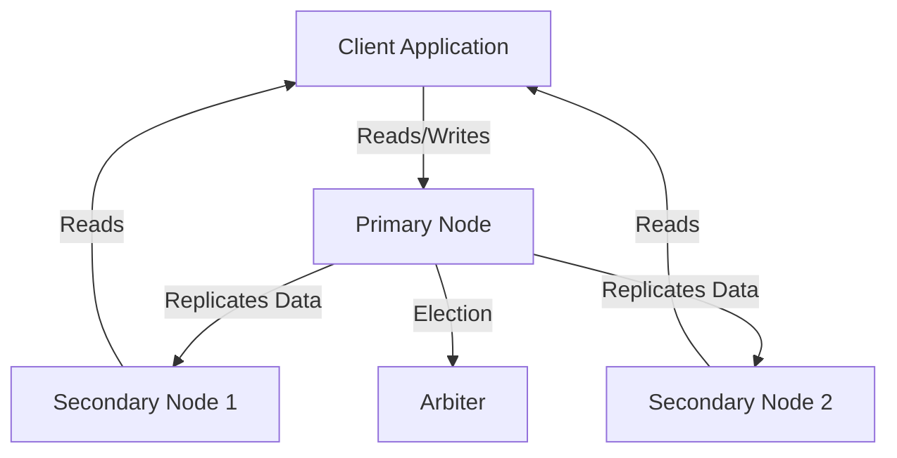

# Replica Set Operations — MongoDB

## Overview and scope

The purpose of this document is to outline the standards and best practices for operating MongoDB Replica Sets within the Xentic platform. This document serves as a comprehensive guide for engineers, architects, and database administrators involved in the deployment, management, and maintenance of MongoDB databases in a replicated environment.

### Audience

This document is intended for:
- Database Administrators (DBAs)
- Software Engineers
- System Architects
- DevOps Engineers

### Scope

This standard covers:
- Configuration of MongoDB Replica Sets
- Operational best practices for maintaining Replica Sets
- Monitoring and troubleshooting Replica Set issues
- Backup and recovery procedures specific to Replica Sets

### Non-goals

This document does NOT cover:
- General MongoDB installation procedures
- Non-replicated MongoDB configurations
- Application-level data handling or business logic

### Glossary

| Term               | Definition                                                                 |
|--------------------|-----------------------------------------------------------------------------|
| Replica Set        | A group of MongoDB servers that maintain the same data set, providing redundancy and high availability. |
| Primary Node       | The node in a Replica Set that receives all write operations.              |
| Secondary Node     | Nodes that replicate data from the Primary and can serve read operations.  |
| Arbiter            | A member of a Replica Set that does not store data but participates in elections. |
| Oplog              | A special collection that records all operations that modify the data in the database. |

### How This Standard Fits the Xentic Platform

The MongoDB Replica Set Operations standard is essential for ensuring the reliability and availability of data across Xentic services. By adhering to these guidelines, teams can achieve:
- Consistent data replication across different environments
- Reduced downtime during maintenance and upgrades
- Enhanced disaster recovery capabilities

### Example Configuration

Below is an example configuration for a MongoDB Replica Set defined in a YAML format:

```yaml
replication:
  replSetName: "xenticReplicaSet"
  oplogSizeMB: 1024
  writeConcern:
    w: "majority"
    wtimeout: 5000
```

### Key Considerations

- **Deployment**: Replica Sets MUST be deployed across multiple availability zones to ensure high availability.
- **Monitoring**: Regular monitoring of Replica Set health MUST be implemented using tools such as MongoDB Atlas or custom scripts.
- **Backup**: Backups MUST be taken from the Primary node and verified regularly to ensure data integrity.

By following these standards, Xentic can maintain a robust and resilient MongoDB infrastructure that supports our applications and services effectively.

## Standards and policies

1. **Replica Set Configuration**  
   Replica Sets MUST be configured with a minimum of three members to ensure fault tolerance. This includes one Primary and at least two Secondary nodes.

2. **Node Types**  
   Each member of a Replica Set MUST be designated as either a Primary, Secondary, or Arbiter. The use of Arbiters MUST be limited to scenarios where an additional vote is required without the need for data storage.

3. **Write Concern**  
   Write concerns MUST be set to `majority` to ensure that writes are acknowledged by the majority of nodes before being considered successful. This can be configured as follows:

   ```yaml
   writeConcern:
     w: "majority"
     wtimeout: 5000
   ```

4. **Read Preference**  
   Read preferences SHOULD be configured based on application needs. For read-heavy applications, `secondaryPreferred` MAY be used to distribute load across Secondary nodes.

5. **Oplog Size**  
   The Oplog size MUST be configured based on the write load of the application. A minimum size of 1024 MB is recommended, but it MUST be adjusted based on the specific use case.

6. **Network Configuration**  
   All nodes in a Replica Set MUST be configured to communicate over a secure network. TLS/SSL MUST be enabled to encrypt data in transit.

7. **Monitoring and Alerts**  
   Monitoring tools MUST be implemented to track Replica Set health, including latency, replication lag, and node status. Alerts MUST be set up for any node failures or significant performance degradation.

8. **Backup Strategy**  
   Backups MUST be performed regularly from the Primary node. Backup strategies MUST include both full and incremental backups, and backups MUST be tested for restoration regularly.

9. **Maintenance Windows**  
   Maintenance operations MUST be scheduled during off-peak hours to minimize impact on application performance. Notifications MUST be sent to stakeholders prior to any maintenance.

10. **Version Compatibility**  
    All nodes in a Replica Set MUST run the same version of MongoDB to avoid compatibility issues. Upgrades MUST be performed in a rolling fashion to maintain availability.

11. **Data Consistency**  
    Data consistency MUST be ensured by configuring appropriate read and write concerns. Applications MUST handle potential eventual consistency scenarios when reading from Secondaries.

12. **Failover Testing**  
    Failover testing MUST be conducted regularly to ensure that the Replica Set can handle node failures gracefully. This includes simulating Primary node failures and verifying that a Secondary can take over.

13. **Documentation**  
    All Replica Set configurations and operational procedures MUST be documented in accordance with Xentic’s internal documentation standards. This documentation MUST be accessible via the internal wiki at [https://docs.internal.xentic.io](https://docs.internal.xentic.io).

14. **Security Best Practices**  
    Security best practices MUST be followed, including the use of strong authentication mechanisms and role-based access control (RBAC) to limit permissions on database operations.

15. **Data Migration**  
    Data migrations MUST be performed using MongoDB's built-in tools (e.g., `mongodump` and `mongorestore`) to ensure data integrity during the transfer process. 

By adhering to these standards and policies, Xentic will maintain a robust and efficient MongoDB Replica Set environment that supports high availability and data integrity across all services.

## Architecture and design

### Component Diagram



### Data Flows

- **Client Application to Primary Node**: All write operations MUST be directed to the Primary node. The Primary node processes these writes and logs them in the Oplog.
- **Primary Node to Secondary Nodes**: The Primary node replicates the write operations to all Secondary nodes asynchronously. This ensures that data is eventually consistent across the Replica Set.
- **Secondary Nodes to Client Application**: Read operations MAY be directed to Secondary nodes depending on the configured read preference, which helps distribute the read load and improve performance.

### Integration Points

- **Monitoring Tools**: Integration with monitoring solutions such as MongoDB Atlas or Prometheus MUST be established to track the health and performance of the Replica Set.
- **Backup Solutions**: Backup solutions MUST integrate with the Primary node to ensure that data is backed up consistently and can be restored when necessary.
- **Authentication Services**: Authentication mechanisms MUST be integrated to ensure secure access to the MongoDB instances, leveraging Xentic's centralized authentication services.

### Failure Domains

- **Primary Node Failure**: In the event of a Primary node failure, an election MUST occur to promote one of the Secondary nodes to Primary. This process is automatic and should be monitored to ensure minimal downtime.
- **Network Partition**: If a network partition occurs, nodes may become isolated. The Replica Set MUST be configured to handle such scenarios gracefully, ensuring that only one Primary is elected to prevent split-brain situations.
- **Secondary Node Failure**: If a Secondary node fails, it MUST be monitored, and alerts MUST be triggered. The system should automatically attempt to recover the node and re-sync it with the Primary once it is back online.

### Example Configuration

An example configuration for setting up a Replica Set in MongoDB is shown below:

```yaml
replication:
  replSetName: "xenticReplicaSet"
  oplogSizeMB: 1024
  writeConcern:
    w: "majority"
    wtimeout: 5000
```

### Summary of Considerations

- **Deployment**: Deploy across multiple availability zones.
- **Monitoring**: Implement regular health checks and alerts.
- **Backup**: Schedule regular backups from the Primary node.
- **Testing**: Conduct regular failover testing to ensure reliability.

By following the architecture and design principles outlined above, Xentic can ensure a robust and scalable MongoDB Replica Set that meets the performance and availability requirements of our applications.

## Configuration reference

### application.yml

The following is an example of an `application.yml` configuration for a MongoDB Replica Set within Xentic services:

```yaml
spring:
  data:
    mongodb:
      uri: "mongodb://primary-node:27017,secondary-node1:27017,secondary-node2:27017/?replicaSet=xenticReplicaSet"
      database: "xentic_db"
      authentication-database: "admin"
      username: "dbUser"
      password: "securePassword"
      replica-set: "xenticReplicaSet"
      read-preference: "secondaryPreferred"
      write-concern:
        w: "majority"
        wtimeout: 5000
```

### Terraform Configuration

The following Terraform configuration can be used to provision a MongoDB Replica Set in a cloud environment:

```hcl
resource "mongodb_replica_set" "xentic_replica_set" {
  name = "xenticReplicaSet"

  members {
    host = "primary-node"
    priority = 1
  }

  members {
    host = "secondary-node1"
    priority = 0.5
  }

  members {
    host = "secondary-node2"
    priority = 0.5
  }

  settings {
    oplog_size_mb = 1024
    write_concern {
      w = "majority"
      wtimeout = 5000
    }
  }
}
```

### Environment Variables

The following table outlines the recommended environment variables for configuring MongoDB connections. Default values are provided for local development, while production values are specified for deployment environments.

| Variable                       | Default Value                     | Production Value                      |
|--------------------------------|-----------------------------------|---------------------------------------|
| `MONGODB_URI`                 | `mongodb://localhost:27017`      | `mongodb://primary-node:27017`       |
| `MONGODB_DATABASE`            | `xentic_db`                      | `xentic_db`                          |
| `MONGODB_USERNAME`            | `dbUser`                         | `prodDbUser`                         |
| `MONGODB_PASSWORD`            | `securePassword`                 | `prodSecurePassword`                 |
| `MONGODB_REPLICA_SET`         | `xenticReplicaSet`               | `xenticReplicaSet`                   |
| `MONGODB_WRITE_CONCERN`       | `majority`                       | `majority`                           |
| `MONGODB_WRITE_TIMEOUT`        | `5000`                           | `5000`                               |
| `MONGODB_READ_PREFERENCE`     | `primary`                        | `secondaryPreferred`                 |

### Summary of Configuration Guidelines

- **Replica Set Name**: MUST be consistent across all nodes and configurations.
- **Oplog Size**: MUST be set to a minimum of 1024 MB, adjusted based on write load.
- **Write Concern**: MUST be configured to `majority` to ensure data integrity.
- **Read Preference**: SHOULD be set according to application requirements, with `secondaryPreferred` being a common choice for read-heavy applications.
- **Authentication**: MUST be enabled with strong credentials to secure access to the database.

By adhering to these configuration references, Xentic can ensure a robust and secure MongoDB Replica Set that meets the operational and performance needs of our services.

## Implementation guide

To implement a MongoDB Replica Set at Xentic, follow the step-by-step guide below. This guide includes code examples and configurations necessary for a successful deployment.

### Step 1: Install MongoDB

Ensure that MongoDB is installed on all nodes intended for the Replica Set. Use the following commands to install MongoDB on a Debian-based system:

```bash
sudo apt update
sudo apt install -y mongodb
```

### Step 2: Configure MongoDB Instances

Edit the MongoDB configuration file (`/etc/mongodb.conf`) on each node to enable Replica Set functionality. Below is an example configuration for the Primary node:

```yaml
# /etc/mongodb.conf
storage:
  dbPath: /var/lib/mongodb
  journal:
    enabled: true

net:
  bindIp: 0.0.0.0
  port: 27017

replication:
  replSetName: "xenticReplicaSet"
```

Repeat similar configurations for Secondary nodes, ensuring the `replSetName` is consistent.

### Step 3: Start MongoDB Instances

Start the MongoDB service on all nodes:

```bash
sudo systemctl start mongodb
```

### Step 4: Initialize the Replica Set

Connect to the Primary node using the MongoDB shell and initialize the Replica Set:

```bash
mongo --host primary-node:27017
```

Run the following command in the MongoDB shell:

```javascript
rs.initiate({
  _id: "xenticReplicaSet",
  members: [
    { _id: 0, host: "primary-node:27017" },
    { _id: 1, host: "secondary-node1:27017" },
    { _id: 2, host: "secondary-node2:27017" }
  ]
});
```

### Step 5: Verify Replica Set Status

Check the status of the Replica Set to ensure all nodes are correctly configured:

```javascript
rs.status();
```

You should see output indicating the state of each member, with the Primary node showing as `PRIMARY` and the others as `SECONDARY`.

### Step 6: Configure Application to Use Replica Set

In your Java application, configure the MongoDB connection to utilize the Replica Set. Below is an example of a Spring Boot application configuration:

```yaml
# application.yml
spring:
  data:
    mongodb:
      uri: "mongodb://primary-node:27017,secondary-node1:27017,secondary-node2:27017/?replicaSet=xenticReplicaSet"
      database: "xentic_db"
      username: "dbUser"
      password: "securePassword"
      read-preference: "secondaryPreferred"
```

### Step 7: Implement Data Access Layer

Create a repository interface for data access using Spring Data MongoDB:

```java
package com.xentic.service.repository;

import com.xentic.service.model.User;
import org.springframework.data.mongodb.repository.MongoRepository;

public interface UserRepository extends MongoRepository<User, String> {
    User findByUsername(String username);
}
```

### Step 8: Create Service Layer

Implement a service class that uses the repository to perform operations:

```java
package com.xentic.service.service;

import com.xentic.service.model.User;
import com.xentic.service.repository.UserRepository;
import org.springframework.beans.factory.annotation.Autowired;
import org.springframework.stereotype.Service;

@Service
public class UserService {

    @Autowired
    private UserRepository userRepository;

    public User getUser(String username) {
        return userRepository.findByUsername(username);
    }

    public User saveUser(User user) {
        return userRepository.save(user);
    }
}
```

### Step 9: Implement Controller

Create a REST controller to expose user-related endpoints:

```java
package com.xentic.service.controller;

import com.xentic.service.model.User;
import com.xentic.service.service.UserService;
import org.springframework.beans.factory.annotation.Autowired;
import org.springframework.web.bind.annotation.*;

@RestController
@RequestMapping("/api/users")
public class UserController {

    @Autowired
    private UserService userService;

    @GetMapping("/{username}")
    public User getUser(@PathVariable String username) {
        return userService.getUser(username);
    }

    @PostMapping
    public User createUser(@RequestBody User user) {
        return userService.saveUser(user);
    }
}
```

### Step 10: Testing the Replica Set

After implementing the application, conduct tests to ensure that reads and writes are functioning correctly across the Replica Set. Use tools like Postman or curl to interact with the API endpoints and verify data consistency.

### Summary of Steps

1. Install MongoDB on all nodes.
2. Configure each instance for Replica Set.
3. Start MongoDB services.
4. Initialize the Replica Set from the Primary node.
5. Verify the status of the Replica Set.
6. Configure the application to connect to the Replica Set.
7. Implement the data access layer with Spring Data MongoDB.
8. Create a service layer for business logic.
9. Expose REST endpoints through a controller.
10. Test the application to ensure proper functionality.

By following this implementation guide, Xentic can successfully deploy and manage a MongoDB Replica Set, ensuring high availability and data redundancy across services.

## Security requirements

To ensure the security of MongoDB Replica Sets at Xentic, the following security requirements must be adhered to:

### Threat Model Summary

- **Unauthorized Access**: Attackers may gain access to the database if authentication is not enforced.
- **Data Integrity**: Malicious users could manipulate or corrupt data if proper access controls are not in place.
- **Data Leakage**: Sensitive information may be exposed if data is not encrypted in transit or at rest.
- **Denial of Service**: Attackers may attempt to overload the database, causing service disruption.

### Authentication and Authorization

- **Authentication**: MUST implement authentication using strong credentials. MongoDB supports several authentication mechanisms, including SCRAM-SHA-256, which should be the default.
- **Authorization**: MUST use role-based access control (RBAC) to limit user permissions. Only grant the minimum necessary privileges.

Example of creating a user with specific roles:

```javascript
use admin
db.createUser({
  user: "dbUser",
  pwd: "securePassword",
  roles: [
    { role: "readWrite", db: "xentic_db" },
    { role: "dbAdmin", db: "xentic_db" }
  ]
});
```

### Secrets Management

- **Secret Storage**: MUST NOT hard-code sensitive information (e.g., passwords) in the application code. Use environment variables or secret management tools (e.g., HashiCorp Vault, AWS Secrets Manager).
- **Configuration Files**: MUST ensure that configuration files containing sensitive data are secured and not included in version control.

Example of using environment variables in a Spring Boot application:

```yaml
spring:
  data:
    mongodb:
      username: ${MONGODB_USERNAME}
      password: ${MONGODB_PASSWORD}
```

### Input Validation

- **Data Sanitization**: MUST validate and sanitize all user inputs to prevent injection attacks (e.g., NoSQL injection).
- **Schema Validation**: SHOULD define and enforce schemas for collections to ensure data integrity and prevent malformed data from being inserted.

Example of schema validation in MongoDB:

```javascript
db.createCollection("users", {
  validator: {
    $jsonSchema: {
      bsonType: "object",
      required: ["username", "email"],
      properties: {
        username: {
          bsonType: "string",
          description: "must be a string and is required"
        },
        email: {
          bsonType: "string",
          pattern: "@mongodb\.com$",
          description: "must be a valid email address"
        }
      }
    }
  }
});
```

### Audit Logging

- **Enable Audit Logging**: MUST enable audit logging to track access and operations performed on the database. This is crucial for compliance and forensic analysis.
- **Log Retention**: MUST define a log retention policy to manage the size of audit logs and ensure that logs are available for a reasonable period.

Example of enabling audit logging in MongoDB:

```yaml
# /etc/mongod.conf
auditLog:
  destination: file
  format: JSON
  path: "/var/log/mongodb/audit.log"
  filter: "{ at: { $gte: ISODate('2023-01-01T00:00:00Z') } }"
```

### Summary of Security Guidelines

- **Authentication**: MUST be enforced with strong credentials.
- **Authorization**: MUST implement RBAC to limit user access.
- **Secrets Management**: MUST NOT hard-code sensitive information; use environment variables.
- **Input Validation**: MUST validate and sanitize all inputs to prevent injection attacks.
- **Audit Logging**: MUST enable and configure audit logging for tracking access and operations.

By following these security requirements, Xentic can ensure that its MongoDB Replica Sets are secure, resilient, and compliant with industry standards.

## Testing strategy

To ensure the reliability and correctness of the MongoDB Replica Set operations at Xentic, a comprehensive testing strategy must be implemented. This strategy includes unit tests, integration tests, and contract tests, each serving a distinct purpose in the validation of the application.

### Testing Types

- **Unit Tests**: 
  - Focus on testing individual components in isolation.
  - Should cover the repository and service layers.
  - Aim for at least 80% code coverage.

- **Integration Tests**: 
  - Validate the interaction between components, especially between the application and the MongoDB database.
  - Should include tests for CRUD operations and data consistency across the Replica Set.
  - Aim for at least 70% code coverage.

- **Contract Tests**: 
  - Ensure that the API contracts between services are adhered to, especially when interacting with other microservices.
  - Validate that the expected input and output formats are maintained.

### Coverage Targets

| Test Type       | Coverage Target |
|------------------|-----------------|
| Unit Tests       | 80%             |
| Integration Tests| 70%             |
| Contract Tests   | 100%            |

### Example Test Classes

#### Unit Test for UserService

```java
package com.xentic.service.service;

import com.xentic.service.model.User;
import com.xentic.service.repository.UserRepository;
import org.junit.jupiter.api.Test;
import org.mockito.Mockito;
import static org.junit.jupiter.api.Assertions.*;

class UserServiceTest {

    private UserRepository userRepository = Mockito.mock(UserRepository.class);
    private UserService userService = new UserService(userRepository);

    @Test
    void testGetUser() {
        User user = new User("testUser", "test@mongodb.com");
        Mockito.when(userRepository.findByUsername("testUser")).thenReturn(user);
        
        User foundUser = userService.getUser("testUser");
        
        assertNotNull(foundUser);
        assertEquals("testUser", foundUser.getUsername());
    }

    @Test
    void testSaveUser() {
        User user = new User("testUser", "test@mongodb.com");
        Mockito.when(userRepository.save(user)).thenReturn(user);
        
        User savedUser = userService.saveUser(user);
        
        assertNotNull(savedUser);
        assertEquals("testUser", savedUser.getUsername());
    }
}
```

#### Integration Test for UserController

```java
package com.xentic.service.controller;

import com.xentic.service.model.User;
import com.xentic.service.service.UserService;
import org.junit.jupiter.api.BeforeEach;
import org.junit.jupiter.api.Test;
import org.springframework.beans.factory.annotation.Autowired;
import org.springframework.boot.test.autoconfigure.web.servlet.AutoConfigureMockMvc;
import org.springframework.boot.test.context.SpringBootTest;
import org.springframework.http.MediaType;
import org.springframework.test.web.servlet.MockMvc;

import static org.springframework.test.web.servlet.request.MockMvcRequestBuilders.post;
import static org.springframework.test.web.servlet.result.MockMvcResultMatchers.status;

@SpringBootTest
@AutoConfigureMockMvc
class UserControllerTest {

    @Autowired
    private MockMvc mockMvc;

    @BeforeEach
    void setUp() {
        // Set up any necessary preconditions
    }

    @Test
    void testCreateUser() throws Exception {
        User user = new User("testUser", "test@mongodb.com");

        mockMvc.perform(post("/api/users")
                .contentType(MediaType.APPLICATION_JSON)
                .content("{\"username\":\"testUser\", \"email\":\"test@mongodb.com\"}"))
                .andExpect(status().isOk());
    }
}
```

#### Contract Test Example

For contract testing, tools like Pact can be used to ensure that the API interactions between services adhere to the defined contracts. Below is a simple example of a Pact test:

```java
package com.xentic.service.contract;

import au.com.dius.pact.consumer.junit5.PactConsumerTestExt;
import au.com.dius.pact.consumer.junit5.Pact;
import au.com.dius.pact.consumer.junit5.Provider;
import au.com.dius.pact.consumer.junit5.Consumer;
import org.junit.jupiter.api.extension.ExtendWith;

@ExtendWith(PactConsumerTestExt.class)
@Consumer("UserService")
@Provider("UserAPI")
class UserServiceContractTest {

    @Pact(consumer = "UserService", provider = "UserAPI")
    public RequestResponsePact createUserPact(PactDslWithProvider builder) {
        return builder
            .given("User does not exist")
            .uponReceiving("A request to create a user")
            .path("/api/users")
            .method("POST")
            .body("{\"username\":\"testUser\", \"email\":\"test@mongodb.com\"}")
            .willRespondWith()
            .status(200)
            .body("{\"username\":\"testUser\", \"email\":\"test@mongodb.com\"}")
            .toPact();
    }
}
```

### Summary of Testing Strategy

- **Unit Tests**: Focus on individual components with a target of 80% coverage.
- **Integration Tests**: Validate interactions with a target of 70% coverage.
- **Contract Tests**: Ensure API contracts are met with 100% adherence.
- **Tools**: Use JUnit and Mockito for unit tests, Spring MockMvc for integration tests, and Pact for contract tests.

By implementing this testing strategy, Xentic can ensure that its MongoDB Replica Set operations are robust, reliable, and maintainable over time.

## Observability and operations

To maintain the health, performance, and reliability of MongoDB Replica Sets at Xentic, a robust observability and operations strategy is required. This includes metrics collection, logging, tracing, dashboarding, alerting, and defining service-level objectives (SLOs).

### Metrics Collection

- **Key Metrics**: MUST track the following metrics for MongoDB Replica Sets:
  - **Operation Latency**: Time taken for read and write operations.
  - **Throughput**: Number of operations per second (e.g., reads and writes).
  - **Replication Lag**: Time delay between the primary and secondary nodes.
  - **Connection Count**: Number of active connections to the database.
  - **Disk I/O**: Read and write operations on the disk.

Example of metrics configuration in a monitoring tool like Prometheus:

```yaml
mongodb_exporter:
  enabled: true
  config:
    uri: mongodb://<username>:<password>@mongo-primary:27017
    metrics:
      - operation_latency
      - throughput
      - replication_lag
      - connection_count
      - disk_io
```

### Logging

- **Log Levels**: MUST configure logging levels to capture essential information without overwhelming the log files. Use `INFO` for general operations, `ERROR` for critical issues, and `DEBUG` for detailed troubleshooting.
- **Log Format**: MUST use structured logging (e.g., JSON format) for easier parsing and analysis.

Example of logging configuration in MongoDB:

```yaml
# /etc/mongod.conf
systemLog:
  destination: file
  path: "/var/log/mongodb/mongod.log"
  logAppend: true
  logLevel: info
```

### Tracing

- **Distributed Tracing**: SHOULD implement distributed tracing to monitor requests across microservices and identify bottlenecks.
- **Tools**: MUST use tools like OpenTelemetry or Jaeger for tracing.

Example of integrating OpenTelemetry in a Spring Boot application:

```java
import io.opentelemetry.api.OpenTelemetry;
import io.opentelemetry.api.trace.Tracer;
import org.springframework.stereotype.Service;

@Service
public class UserService {

    private final Tracer tracer = OpenTelemetry.getGlobalTracer("com.xentic.service");

    public User getUser(String username) {
        var span = tracer.spanBuilder("getUser").startSpan();
        try {
            // Logic to retrieve user
        } finally {
            span.end();
        }
    }
}
```

### Dashboards

- **Visualization**: MUST create dashboards to visualize key metrics and logs for quick insights.
- **Tools**: SHOULD use Grafana or Kibana for dashboarding.

Example of a Grafana dashboard configuration:

```json
{
  "title": "MongoDB Replica Set Metrics",
  "panels": [
    {
      "type": "graph",
      "title": "Operation Latency",
      "targets": [
        {
          "target": "mongodb_operation_latency"
        }
      ]
    },
    {
      "type": "graph",
      "title": "Replication Lag",
      "targets": [
        {
          "target": "mongodb_replication_lag"
        }
      ]
    }
  ]
}
```

### Alerts

- **Alerting Rules**: MUST define alerting rules based on key metrics to notify on-call engineers of potential issues.
- **Alert Severity**: MUST categorize alerts by severity (e.g., critical, warning) to prioritize responses.

Example of alerting rules in Prometheus:

```yaml
groups:
- name: mongodb-alerts
  rules:
  - alert: HighReplicationLag
    expr: mongodb_replication_lag > 5
    for: 5m
    labels:
      severity: critical
    annotations:
      summary: "High replication lag detected"
      description: "Replication lag is above 5 seconds."
```

### Service Level Objectives (SLOs)

- **Define SLOs**: MUST define SLOs for key metrics to ensure service reliability.
- **Examples**:
  - **Availability**: 99.9% uptime for the MongoDB service.
  - **Latency**: 95% of read operations must complete within 100ms.

### On-Call Runbook Steps

In the event of an alert, the on-call engineer MUST follow these steps:

1. **Acknowledge the Alert**: Confirm receipt of the alert in the incident management system.
2. **Investigate Logs**: Check the MongoDB logs for any anomalies or errors.
3. **Check Metrics**: Review the relevant metrics on the dashboard (latency, replication lag, etc.).
4. **Assess Impact**: Determine if the issue affects service availability or performance.
5. **Take Action**: Depending on the findings, take corrective actions such as:
   - Restarting the MongoDB service.
   - Scaling the Replica Set.
   - Investigating network issues.
6. **Document the Incident**: Record the findings and actions taken in the incident management system.
7. **Post-Incident Review**: Participate in a post-incident review to discuss lessons learned and improve processes.

By implementing these observability and operations practices, Xentic can ensure that its MongoDB Replica Sets are monitored effectively, leading to improved performance and reliability.

## Migration and versioning

To maintain the integrity and performance of MongoDB Replica Sets at Xentic, a clear migration and versioning strategy is essential. This section outlines the upgrade paths, deprecation policy, backward compatibility, and rollback procedures.

### Upgrade Paths

- **Major Version Upgrades**: MUST follow a defined upgrade path for major versions. Always consult the MongoDB release notes for breaking changes.
- **Minor Version Upgrades**: SHOULD be performed regularly to benefit from performance improvements and security patches.
- **Upgrade Steps**:
  1. Backup the current database.
  2. Review the release notes for the target version.
  3. Test the upgrade process in a staging environment.
  4. Execute the upgrade in production during a maintenance window.

Example of an upgrade command for MongoDB:

```bash
# Upgrade MongoDB using the package manager
sudo apt-get update
sudo apt-get install -y mongodb-org=4.4.0
```

### Deprecation Policy

- **Deprecation Notices**: MUST provide at least one major version release notice before removing any features.
- **Documentation Updates**: MUST update documentation to reflect deprecated features and suggest alternatives.
- **Timeline for Deprecation**:
  - **Initial Announcement**: Notify users of deprecation in the release notes.
  - **Grace Period**: Allow a grace period of at least one year before removal.
  - **Final Removal**: Remove deprecated features in the subsequent major release.

### Backward Compatibility

- **Compatibility Testing**: MUST ensure that new versions of MongoDB are backward compatible with existing applications.
- **Testing Strategy**:
  - Run automated tests against the new version.
  - Validate all critical functionalities.
  - Monitor performance metrics post-upgrade.

Example of a compatibility check in a testing framework:

```java
import org.junit.jupiter.api.Test;

class CompatibilityTest {

    @Test
    void testBackwardCompatibility() {
        // Logic to validate that existing queries work as expected
    }
}
```

### Rollback Procedures

In the event of a failed upgrade, a rollback plan MUST be in place to restore the previous state of the MongoDB Replica Set.

- **Rollback Steps**:
  1. Identify the reason for the failure.
  2. Restore the backup taken prior to the upgrade.
  3. Verify the integrity of the restored data.
  4. Test critical functionalities to ensure the system is operational.

Example of a rollback command:

```bash
# Restore MongoDB from a backup
mongorestore --uri="mongodb://<username>:<password>@mongo-primary:27017" /path/to/backup
```

### Summary of Migration and Versioning Practices

| Practice                | Description                                                  |
|------------------------|--------------------------------------------------------------|
| Upgrade Paths          | Follow defined paths for major and minor upgrades.          |
| Deprecation Policy     | Provide advance notice and alternatives for deprecated features. |
| Backward Compatibility  | Ensure new versions do not break existing functionalities.   |
| Rollback Procedures     | Have a clear plan to restore previous versions if needed.   |

By adhering to these migration and versioning standards, Xentic can ensure a smooth transition between MongoDB versions while minimizing disruption to services.

## FAQ, anti-patterns, and checklists

### FAQ

1. **What is a MongoDB Replica Set?**  
   A MongoDB Replica Set is a group of MongoDB servers that maintain the same data set, providing redundancy and high availability.

2. **How does replication work in MongoDB?**  
   Replication in MongoDB involves copying data from a primary node to one or more secondary nodes asynchronously.

3. **What happens if the primary node fails?**  
   If the primary node fails, an election process occurs among the secondary nodes to elect a new primary.

4. **How can I monitor replication lag?**  
   You can monitor replication lag using the `rs.status()` command or by integrating monitoring tools like Prometheus.

5. **What is the recommended number of nodes in a Replica Set?**  
   A minimum of three nodes is recommended to ensure fault tolerance and enable elections.

6. **Can I have an even number of nodes in a Replica Set?**  
   No, you MUST have an odd number of nodes to avoid split-brain scenarios during elections.

7. **How can I force a secondary to become primary?**  
   You can use the `rs.stepDown()` command on the current primary node to force it to step down.

8. **What is the impact of network latency on replication?**  
   High network latency can increase replication lag, affecting data availability on secondary nodes.

9. **How do I perform a backup of a Replica Set?**  
   You can use `mongodump` to create a backup of the data from the primary or any secondary node.

10. **What should I do if a secondary node is not syncing?**  
    Check the logs for errors, ensure the secondary is connected to the primary, and verify that it has sufficient disk space.

### Anti-Patterns

| Anti-Pattern                          | Description                                                                                     |
|---------------------------------------|-------------------------------------------------------------------------------------------------|
| **Single Node Replica Set**           | Using only one node for a Replica Set, which does not provide redundancy or high availability.  |
| **Neglecting Indexes**                | Failing to create necessary indexes can lead to performance degradation in read operations.     |
| **Ignoring Replica Set Configuration**| Not properly configuring the Replica Set settings (e.g., priority, hidden nodes) can cause issues. |
| **Overloading a Single Node**         | Directing all read and write operations to a single primary node can lead to bottlenecks.     |
| **Inconsistent Data Reads**           | Reading from secondaries without considering replication lag can lead to stale data.           |
| **Not Monitoring Replica Sets**       | Failing to monitor the health and performance of the Replica Set can lead to unnoticed issues.  |
| **Using Default Configuration**       | Relying on default settings without customization can lead to suboptimal performance.           |

### Pre-Merge Checklist

- [ ] Ensure all code adheres to the Xentic Java package structure (`com.xentic.<service>`).
- [ ] Verify that all MongoDB queries are optimized and indexed appropriately.
- [ ] Confirm that all changes have been tested in a staging environment.
- [ ] Ensure proper logging is implemented for all database interactions.
- [ ] Review and update documentation for any changes made to the database schema or queries.

### Production Checklist

- [ ] Verify that the Replica Set is properly configured and all nodes are healthy.
- [ ] Ensure monitoring tools are set up and alerting rules are in place.
- [ ] Confirm that backups are scheduled and tested for restoration.
- [ ] Check that all application configurations point to the correct MongoDB instances.
- [ ] Review the incident management process to ensure readiness for potential issues.
