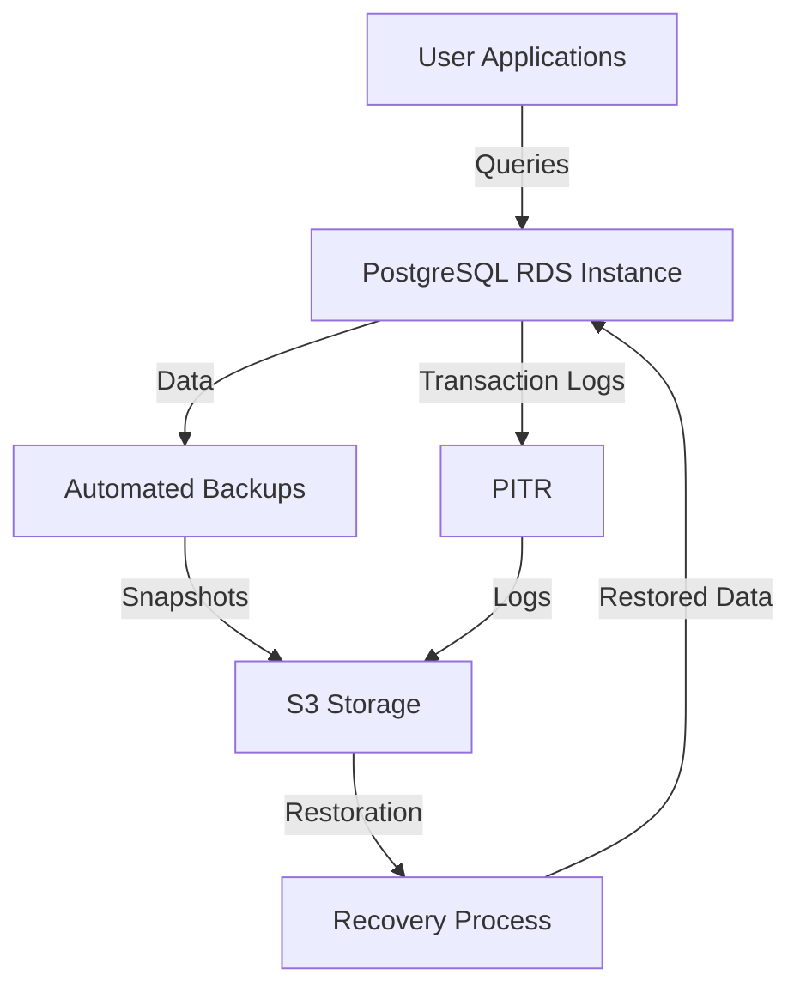

# Backup and Recovery — PostgreSQL on AWS RDS

## Overview and scope

The purpose of this document is to establish a comprehensive backup and recovery strategy for PostgreSQL databases hosted on AWS RDS within the Xentic platform. This standard outlines the necessary procedures, configurations, and guidelines to ensure data integrity, availability, and swift recovery in the event of data loss or corruption.

### Audience

This document is intended for:
- Database Administrators (DBAs)
- DevOps Engineers
- Software Engineers
- System Architects
- IT Operations Teams

### Scope

This standard applies to all PostgreSQL databases deployed on AWS RDS within Xentic. It encompasses:
- Backup strategies including automated snapshots, point-in-time recovery (PITR), and logical backups.
- Configuration settings for RDS instances to ensure compliance with backup requirements.
- Procedures for restoring databases from backups.

### Non-goals

This document does NOT cover:
- Backup strategies for non-PostgreSQL databases.
- On-premise database backup and recovery strategies.
- Application-level data backup procedures.

### Glossary

| Term                         | Definition                                                                 |
|------------------------------|-----------------------------------------------------------------------------|
| RDS                          | Amazon Relational Database Service, a managed database service provided by AWS. |
| PITR                         | Point-in-Time Recovery, a method of restoring a database to a specific moment in time. |
| Snapshot                     | A backup of the database instance at a particular point in time.          |
| Logical Backup                | A backup method that involves exporting database objects and data.         |
| RTO                          | Recovery Time Objective, the maximum acceptable amount of time to restore a system after a failure. |
| RPO                          | Recovery Point Objective, the maximum acceptable amount of data loss measured in time. |

### How this standard fits the Xentic platform

The backup and recovery strategy outlined in this document is critical for maintaining the integrity and availability of data across Xentic's services. By adhering to these standards, Xentic ensures that:
- Data is consistently backed up and can be restored quickly in the event of an incident.
- Compliance with industry best practices for data management and disaster recovery.
- Alignment with Xentic's overall architecture and operational policies.

### Backup Strategy

| Type                           | Frequency     | Retention   |
|--------------------------------|---------------|-------------|
| RDS automated snapshots        | Daily         | 30 days     |
| PITR (transaction logs)       | Continuous    | 7 days      |
| Manual snapshot (pre-migration) | Per migration  | 90 days     |

### RDS Configuration

The following HCL configuration must be used for setting up RDS instances:

```hcl
resource "aws_db_instance" "main" {
  allocated_storage           = 20
  engine                    = "postgres"
  engine_version            = "14.1"
  instance_class            = "db.t3.medium"
  backup_retention_period    = 30
  backup_window              = "02:00-03:00"
  deletion_protection        = true
  multi_az                   = true
  skip_final_snapshot        = false
  final_snapshot_identifier  = "${var.db_name}-final"
}
```

### Point-in-Time Recovery

To perform a point-in-time recovery, use the following AWS CLI command:

```bash
aws rds restore-db-instance-to-point-in-time \
  --source-db-instance-identifier prod-db \
  --target-db-instance-identifier prod-db-recovery \
  --restore-time 2024-01-15T10:30:00Z
```

### Logical Backup

For logical backups, utilize the following commands:

```bash
pg_dump -h $DB_HOST -U $DB_USER -d $DB_NAME \
  --format=custom -f backup_$(date +%Y%m%d).dump

pg_restore -h $DB_HOST -U $DB_USER -d $TARGET_DB \
  --no-owner --no-privileges backup_20240115.dump
```

### Rules

- Backup strategies MUST be implemented as defined in this document.
- PITR drills MUST be conducted monthly in the staging environment.
- Recovery Time Objective (RTO) target MUST be less than 4 hours, and Recovery Point Objective (RPO) MUST be less than 1 hour.
- Logical dump restores MUST be tested before every major migration to ensure data integrity and recovery readiness.

## Standards and policies

1. **Backup Frequency**: Automated snapshots MUST be taken daily, and the retention period MUST be set to 30 days. This ensures that data can be restored to a recent state without unnecessary data loss.

2. **Point-in-Time Recovery (PITR)**: PITR MUST be enabled for all RDS instances, with transaction logs retained for at least 7 days. This allows for granular recovery options in case of data corruption or accidental deletion.

3. **Manual Snapshots**: Manual snapshots MUST be created prior to any major migrations or updates. These snapshots MUST be retained for a minimum of 90 days to allow rollbacks if needed.

4. **RDS Configuration Compliance**: All RDS instances MUST be configured according to the provided HCL example. Any deviations MUST be documented and justified.

5. **Deletion Protection**: Deletion protection MUST be enabled on all production RDS instances to prevent accidental data loss through instance deletion.

6. **Multi-AZ Deployments**: All production RDS instances MUST be deployed in a Multi-AZ configuration to ensure high availability and automatic failover capabilities.

7. **Backup Window**: The backup window MUST be scheduled during off-peak hours to minimize performance impacts on the database.

8. **Testing Recovery Procedures**: Recovery procedures MUST be tested at least quarterly to ensure that all team members are familiar with the process and that backups are valid.

9. **Documentation of Backups**: All backup activities MUST be logged and documented in a centralized system. This documentation MUST include timestamps, type of backup, and personnel involved.

10. **Access Control**: Access to backup and recovery processes MUST be restricted to authorized personnel only. IAM roles and policies MUST be configured to enforce this.

11. **Monitoring and Alerts**: Monitoring MUST be set up to alert on backup failures or issues with RDS instances. Alerts MUST be sent to the relevant teams for immediate action.

12. **Data Encryption**: All backups MUST be encrypted using AWS KMS to ensure data security in transit and at rest.

13. **Retention Policy Review**: Backup retention policies MUST be reviewed bi-annually to ensure compliance with business needs and regulatory requirements.

14. **Disaster Recovery Plan**: A comprehensive disaster recovery plan MUST be in place, detailing steps for recovery in case of a catastrophic failure. This plan MUST be reviewed and updated annually.

15. **Compliance with Xentic Standards**: All backup and recovery procedures MUST comply with Xentic's internal standards and policies, including naming conventions and package structures (e.g., `com.xentic.common`).

16. **Training and Awareness**: All team members involved in database management MUST undergo training on backup and recovery procedures at least once a year to ensure awareness of the latest standards and practices.

17. **Audit Logs**: Audit logs MUST be maintained for all backup and recovery operations, including access logs for who initiated backups and restores.

18. **Use of Shared Libraries**: When implementing backup scripts or tools, developers MUST utilize shared libraries (e.g., `com.xentic.auth:auth-starter`) to ensure consistency and security across the platform.

19. **Backup Size Management**: Regular assessments MUST be conducted to monitor the size of backups and optimize storage costs. Large backups MUST be reviewed for necessity and relevance.

20. **Incident Response**: In the event of a backup failure, an incident response plan MUST be executed immediately, with a post-mortem analysis conducted to prevent future occurrences.

By adhering to these standards and policies, Xentic ensures a robust and reliable backup and recovery strategy for its PostgreSQL databases on AWS RDS, minimizing risks and enhancing data integrity.

## Architecture and design

The architecture for backup and recovery of PostgreSQL databases on AWS RDS at Xentic consists of several key components, data flows, integration points, and failure domains. The following diagram illustrates the overall architecture:



### Components

- **User Applications**: Applications that interact with the PostgreSQL RDS instance for data operations.
- **PostgreSQL RDS Instance**: The managed database service that hosts the PostgreSQL database.
- **Automated Backups**: Daily snapshots taken by AWS RDS to ensure data is backed up.
- **Point-in-Time Recovery (PITR)**: Continuous logging of transactions to enable recovery to any specific point in time.
- **S3 Storage**: Storage location for backups and snapshots, ensuring durability and availability.
- **Recovery Process**: The procedure to restore data from backups or PITR logs.

### Data Flows

1. **Data Ingestion**: User applications send queries to the PostgreSQL RDS instance, which processes and stores the data.
2. **Backup Creation**: AWS RDS automatically creates daily snapshots of the database, which are stored in S3.
3. **Transaction Logging**: All transactions are logged continuously for PITR, allowing recovery to any point within the retention period.
4. **Restoration Process**: In case of failure, the recovery process retrieves data from S3 or uses PITR logs to restore the database.

### Integration Points

- **AWS RDS API**: Used for managing RDS instances, including backup and recovery operations.
- **AWS CLI**: Command-line interface for executing backup and recovery commands, including manual snapshots and PITR.
- **Monitoring Tools**: Integrated with AWS CloudWatch to monitor backup status and alert on failures.

### Failure Domains

- **Database Instance Failure**: In the event of a failure, the Multi-AZ configuration ensures automatic failover to a standby instance.
- **Backup Failure**: Automated backups must be monitored; alerts should be configured to notify the team if a backup fails.
- **Data Corruption**: PITR allows for recovery to a specific point in time, minimizing data loss due to corruption or accidental deletion.
- **S3 Availability**: Ensure that S3 storage is available for backup retrieval; AWS service-level agreements (SLAs) should be reviewed.

### Summary

By leveraging AWS RDS features such as automated backups and PITR, Xentic ensures a robust architecture for data backup and recovery. The integration of monitoring tools and adherence to defined data flows enhances the reliability and efficiency of the backup strategy. This architecture supports the organization's goals of data integrity, availability, and swift recovery in case of incidents.

## Configuration reference

### application.yml

The following configuration settings MUST be included in your `application.yml` file for PostgreSQL on AWS RDS:

```yaml
spring:
  datasource:
    url: jdbc:postgresql://<DB_HOST>:<DB_PORT>/<DB_NAME>
    username: <DB_USER>
    password: <DB_PASSWORD>
    driver-class-name: org.postgresql.Driver
  jpa:
    hibernate:
      ddl-auto: none
    show-sql: true
    properties:
      hibernate:
        format_sql: true
        dialect: org.hibernate.dialect.PostgreSQLDialect
```

### Terraform Configuration

When deploying PostgreSQL on AWS RDS, use the following Terraform configuration as a reference:

```hcl
resource "aws_db_instance" "default" {
  identifier              = var.db_name
  engine                 = "postgres"
  engine_version         = "13.3"
  instance_class         = "db.t3.medium"
  allocated_storage       = 20
  storage_type           = "gp2"
  username               = var.db_user
  password               = var.db_password
  db_subnet_group_name   = aws_db_subnet_group.default.name
  vpc_security_group_ids = [aws_security_group.default.id]
  skip_final_snapshot    = false
  final_snapshot_identifier = "${var.db_name}-final"
  deletion_protection    = true
  multi_az               = true
  backup_retention_period = 30
  backup_window          = "03:00-04:00"
  maintenance_window     = "Mon:03:00-Mon:04:00"
}
```

### Environment Variables

The following environment variables MUST be set for the application to connect to the PostgreSQL database:

| Variable      | Default Value         | Production Value             |
|---------------|-----------------------|------------------------------|
| DB_HOST       | localhost             | <production-db-host>        |
| DB_PORT       | 5432                  | 5432                         |
| DB_NAME       | mydatabase            | <production-db-name>        |
| DB_USER       | admin                 | <production-db-user>        |
| DB_PASSWORD   | password              | <production-db-password>    |

### IAM Roles and Policies

Ensure that the following IAM policies are attached to the roles used by your application for RDS access:

- **RDS ReadOnlyAccess**: Grants read-only access to RDS resources.
- **RDSFullAccess**: Grants full access to RDS resources, including backup and recovery actions.

### Backup Configuration

The following settings MUST be configured for automated backups in AWS RDS:

| Setting                     | Default Value | Production Value  |
|-----------------------------|---------------|--------------------|
| Backup Retention Period     | 7 days        | 30 days            |
| Backup Window                | 00:00-01:00   | 03:00-04:00        |
| Multi-AZ                     | false         | true               |
| Deletion Protection          | false         | true               |

### Monitoring and Alerts

Set up CloudWatch alarms for the following metrics to ensure backup and recovery processes are functioning correctly:

- **Backup Storage Usage**: Alert if usage exceeds 80% of allocated storage.
- **DB Instance CPU Utilization**: Alert if CPU usage exceeds 85% for 5 minutes.
- **DB Instance Free Storage Space**: Alert if free storage space falls below 10% of total storage.

By following the above configuration references, Xentic ensures a standardized and reliable setup for PostgreSQL databases on AWS RDS, aligning with the organization's backup and recovery policies.

## Implementation guide

To implement a robust backup and recovery solution for PostgreSQL on AWS RDS at Xentic, follow the steps outlined below. This guide includes code examples, configuration settings, and best practices to ensure a seamless process.

### Step 1: Set Up AWS RDS Instance

Begin by creating a PostgreSQL RDS instance using the Terraform configuration provided earlier. This ensures that your database is configured with necessary parameters for backups.

### Step 2: Configure Automated Backups

AWS RDS provides automated backups by default. Ensure that the following settings are configured:

```hcl
resource "aws_db_instance" "default" {
  ...
  backup_retention_period = 30  # Set to 30 days for production
  backup_window          = "03:00-04:00"
  multi_az               = true   # Enable Multi-AZ for high availability
  ...
}
```

### Step 3: Enable Point-in-Time Recovery (PITR)

PITR is essential for recovering data to a specific moment. This feature is automatically enabled when you configure automated backups.

### Step 4: Create Backup Scripts

Create backup scripts using the AWS CLI to manually trigger snapshots or to automate backup processes. Below is an example of a shell script that creates a snapshot:

```bash
#!/bin/bash

DB_INSTANCE_IDENTIFIER="<your-db-instance-identifier>"
SNAPSHOT_IDENTIFIER="${DB_INSTANCE_IDENTIFIER}-snapshot-$(date +%Y%m%d%H%M%S)"

aws rds create-db-snapshot \
    --db-snapshot-identifier $SNAPSHOT_IDENTIFIER \
    --db-instance-identifier $DB_INSTANCE_IDENTIFIER

echo "Snapshot $SNAPSHOT_IDENTIFIER created successfully."
```

### Step 5: Restore from Snapshot

To restore your database from a snapshot, use the following AWS CLI command:

```bash
aws rds restore-db-instance-from-db-snapshot \
    --db-instance-identifier "<new-db-instance-identifier>" \
    --db-snapshot-identifier "<snapshot-identifier>"
```

### Step 6: Implement Monitoring and Alerts

Set up CloudWatch alarms to monitor backup and recovery processes. The following example creates an alarm for backup storage usage:

```yaml
Resources:
  BackupStorageAlarm:
    Type: AWS::CloudWatch::Alarm
    Properties:
      AlarmDescription: "Alarm when backup storage exceeds 80%"
      MetricName: "BackupStorageUsage"
      Namespace: "AWS/RDS"
      Statistic: "Average"
      Period: 300
      EvaluationPeriods: 1
      Threshold: 80
      ComparisonOperator: "GreaterThanThreshold"
      Dimensions:
        - Name: "DBInstanceIdentifier"
          Value: "<your-db-instance-identifier>"
      AlarmActions:
        - "<SNS-topic-arn>"
```

### Step 7: Test Recovery Procedures

Regularly test your backup and recovery procedures to ensure they work as expected. Document the process and maintain logs for audit purposes. Below is a Java example for testing recovery:

```java
import java.sql.Connection;
import java.sql.DriverManager;
import java.sql.SQLException;

public class DatabaseRecoveryTest {

    private static final String DB_URL = "jdbc:postgresql://<DB_HOST>:<DB_PORT>/<DB_NAME>";
    private static final String USER = "<DB_USER>";
    private static final String PASS = "<DB_PASSWORD>";

    public static void main(String[] args) {
        try (Connection connection = DriverManager.getConnection(DB_URL, USER, PASS)) {
            System.out.println("Database connection established successfully.");
            // Perform recovery operations here
        } catch (SQLException e) {
            System.err.println("Database connection failed: " + e.getMessage());
        }
    }
}
```

### Step 8: Document Backup and Recovery Procedures

Create comprehensive documentation for your backup and recovery processes, including:

- Backup schedules and retention policies.
- Step-by-step recovery procedures.
- Contact information for team members responsible for backups.

### Step 9: Conduct Regular Training

Ensure that all team members involved in database management undergo annual training on backup and recovery procedures. This will help maintain awareness of the latest practices and standards.

### Summary

By following these steps, Xentic can implement a reliable backup and recovery strategy for PostgreSQL databases on AWS RDS. This approach not only meets compliance requirements but also enhances data integrity and availability. Regular reviews and updates to the procedures will further strengthen the backup and recovery framework.

## Security requirements

To ensure the security of PostgreSQL databases on AWS RDS, Xentic MUST implement a comprehensive security strategy that encompasses threat modeling, authentication and authorization, secrets management, input validation, and audit logging.

### Threat Model Summary

Xentic's PostgreSQL databases are subject to various threats, including:

- **Unauthorized Access**: Attackers gaining access to sensitive data.
- **Data Breach**: Exposure of confidential information.
- **SQL Injection**: Malicious SQL code execution via user input.
- **Denial of Service (DoS)**: Overloading the database to disrupt service.
- **Data Loss**: Loss of data due to accidental deletion or corruption.

### Authentication and Authorization

- **Authentication**: All database connections MUST use strong authentication methods. Passwords MUST be complex and rotated regularly.
- **Authorization**: Implement role-based access control (RBAC). Users MUST be granted the least privilege necessary to perform their tasks.

Example PostgreSQL roles and permissions:

```sql
CREATE ROLE read_only_user WITH LOGIN PASSWORD 'strongpassword';
GRANT CONNECT ON DATABASE mydatabase TO read_only_user;
GRANT USAGE ON SCHEMA public TO read_only_user;
GRANT SELECT ON ALL TABLES IN SCHEMA public TO read_only_user;
```

### Secrets Management

Secrets such as database credentials MUST NOT be hardcoded in the application code. Instead, use AWS Secrets Manager or Parameter Store to manage secrets securely.

Example of retrieving secrets in Java:

```java
import com.amazonaws.services.secretsmanager.*;
import com.amazonaws.services.secretsmanager.model.*;

public class SecretsManagerExample {
    public static String getSecret(String secretName) {
        AWSSecretsManager client = AWSSecretsManagerClientBuilder.standard().build();
        GetSecretValueRequest getSecretValueRequest = new GetSecretValueRequest().withSecretId(secretName);
        GetSecretValueResult getSecretValueResult = client.getSecretValue(getSecretValueRequest);
        return getSecretValueResult.getSecretString();
    }
}
```

### Input Validation

All user inputs MUST be validated to prevent SQL injection and other attacks. Use prepared statements or parameterized queries to ensure input is treated as data, not executable code.

Example using prepared statements in Java:

```java
String sql = "SELECT * FROM users WHERE email = ?";
try (PreparedStatement pstmt = connection.prepareStatement(sql)) {
    pstmt.setString(1, userInputEmail);
    ResultSet rs = pstmt.executeQuery();
    // Process results
}
```

### Audit Logging

Audit logging MUST be enabled to track access and changes to the database. Logs MUST include timestamps, user IDs, and actions performed.

Example configuration in `postgresql.conf`:

```conf
logging_collector = on
log_directory = 'pg_log'
log_filename = 'postgresql-%Y-%m-%d_%H%M%S.log'
log_statement = 'all'
log_connections = on
log_disconnections = on
```

### Security Best Practices Checklist

| Requirement                     | Status   |
|---------------------------------|----------|
| Strong authentication methods    | MUST     |
| Role-based access control (RBAC) | MUST     |
| Secrets management via AWS       | MUST     |
| Input validation for all queries  | MUST     |
| Audit logging enabled            | MUST     |
| Regular security reviews         | SHOULD   |

By adhering to these security requirements, Xentic ensures that its PostgreSQL databases on AWS RDS are safeguarded against potential threats, maintaining the integrity and confidentiality of sensitive data. Regular reviews and updates to security practices are essential to adapt to evolving threats.

## Testing strategy

To ensure the reliability and performance of the PostgreSQL database on AWS RDS, Xentic MUST implement a comprehensive testing strategy that includes unit tests, integration tests, and contract tests. Each type of test serves a distinct purpose in validating the functionality and resilience of the database interactions.

### Unit Tests

Unit tests focus on individual components of the application. Each unit test MUST cover the following:

- **Functionality**: Test that each function behaves as expected.
- **Edge Cases**: Validate how functions handle unexpected or extreme input values.

**Example Unit Test Class:**

```java
import static org.junit.jupiter.api.Assertions.*;
import org.junit.jupiter.api.Test;

public class UserServiceTest {

    private final UserService userService = new UserService();

    @Test
    public void testCreateUser() {
        User user = new User("test@example.com", "password123");
        User createdUser = userService.createUser(user);
        assertNotNull(createdUser.getId());
        assertEquals("test@example.com", createdUser.getEmail());
    }

    @Test
    public void testCreateUserWithInvalidEmail() {
        User user = new User("invalid-email", "password123");
        Exception exception = assertThrows(IllegalArgumentException.class, () -> {
            userService.createUser(user);
        });
        assertEquals("Invalid email format", exception.getMessage());
    }
}
```

### Integration Tests

Integration tests validate the interaction between various components, including database interactions. Integration tests MUST ensure:

- **Database Connectivity**: Test that the application can connect to the PostgreSQL database.
- **Data Integrity**: Validate that data is correctly saved, retrieved, and deleted from the database.

**Example Integration Test Class:**

```java
import static org.junit.jupiter.api.Assertions.*;
import org.junit.jupiter.api.Test;
import org.springframework.beans.factory.annotation.Autowired;
import org.springframework.boot.test.autoconfigure.jdbc.AutoConfigureTestDatabase;
import org.springframework.boot.test.context.SpringBootTest;

@SpringBootTest
@AutoConfigureTestDatabase(replace = AutoConfigureTestDatabase.Replace.NONE)
public class UserRepositoryIntegrationTest {

    @Autowired
    private UserRepository userRepository;

    @Test
    public void testSaveAndFindUser() {
        User user = new User("test@example.com", "password123");
        userRepository.save(user);
        
        User foundUser = userRepository.findByEmail("test@example.com");
        assertNotNull(foundUser);
        assertEquals("test@example.com", foundUser.getEmail());
    }

    @Test
    public void testDeleteUser() {
        User user = new User("delete@example.com", "password123");
        userRepository.save(user);
        userRepository.delete(user);
        
        User foundUser = userRepository.findByEmail("delete@example.com");
        assertNull(foundUser);
    }
}
```

### Contract Tests

Contract tests ensure that the interactions between services conform to the expected API contracts. These tests MUST validate:

- **API Responses**: Ensure that the API returns the correct data structure and status codes.
- **Data Consistency**: Validate that the data returned by the API matches the expected format.

**Example Contract Test Class:**

```java
import static org.springframework.test.web.servlet.request.MockMvcRequestBuilders.*;
import static org.springframework.test.web.servlet.result.MockMvcResultMatchers.*;
import org.junit.jupiter.api.Test;
import org.springframework.beans.factory.annotation.Autowired;
import org.springframework.boot.test.autoconfigure.web.servlet.WebMvcTest;
import org.springframework.test.web.servlet.MockMvc;

@WebMvcTest(UserController.class)
public class UserControllerContractTest {

    @Autowired
    private MockMvc mockMvc;

    @Test
    public void testGetUser() throws Exception {
        mockMvc.perform(get("/api/users/test@example.com"))
               .andExpect(status().isOk())
               .andExpect(jsonPath("$.email").value("test@example.com"));
    }

    @Test
    public void testCreateUser() throws Exception {
        String userJson = "{\"email\":\"newuser@example.com\", \"password\":\"password123\"}";

        mockMvc.perform(post("/api/users")
                .contentType("application/json")
                .content(userJson))
                .andExpect(status().isCreated())
                .andExpect(jsonPath("$.email").value("newuser@example.com"));
    }
}
```

### Coverage Targets

Xentic MUST aim for the following code coverage targets:

| Test Type         | Coverage Target |
|-------------------|-----------------|
| Unit Tests        | 80%             |
| Integration Tests | 75%             |
| Contract Tests    | 90%             |

### Conclusion

By implementing a robust testing strategy that includes unit, integration, and contract tests, Xentic can ensure the reliability and performance of its PostgreSQL database on AWS RDS. Regularly reviewing and updating tests will help maintain high standards of quality and resilience in the application.

## Observability and operations

To ensure the reliability and performance of PostgreSQL databases on AWS RDS, Xentic MUST implement comprehensive observability and operations practices. This includes monitoring metrics, logging, tracing, creating dashboards, setting up alerts, and defining Service Level Objectives (SLOs). 

### Metrics

Xentic MUST collect and monitor the following key metrics for PostgreSQL on AWS RDS:

| Metric                       | Description                                          |
|------------------------------|------------------------------------------------------|
| CPU Utilization              | Percentage of CPU being used by the database instance. |
| Memory Utilization           | Amount of memory being used by the database instance.  |
| Disk I/O                     | Rate of read and write operations to disk.            |
| Database Connections         | Number of active connections to the database.          |
| Latency                      | Time taken for queries to execute.                     |
| Deadlocks                    | Number of deadlocks occurring in the database.        |
| Query Performance            | Execution time of slow queries.                        |

Metrics MUST be visualized using dashboards in tools like Grafana or AWS CloudWatch. 

### Logs

PostgreSQL logging MUST be configured to capture essential information for troubleshooting and performance analysis. The following settings MUST be included in the `postgresql.conf`:

```conf
logging_collector = on
log_directory = 'pg_log'
log_filename = 'postgresql-%Y-%m-%d_%H%M%S.log'
log_statement = 'all'
log_connections = on
log_disconnections = on
log_duration = on
```

Logs MUST be sent to AWS CloudWatch Logs for centralized management and analysis.

### Traces

Distributed tracing MUST be implemented to track the flow of requests through the system. Xentic SHOULD use tools like AWS X-Ray or OpenTelemetry to capture traces that include:

- Request ID
- Timestamps
- Service calls
- Database query execution times

### Dashboards

Dashboards MUST provide a real-time view of the health and performance of the PostgreSQL database. Xentic SHOULD create dashboards that include:

- Key performance metrics (CPU, memory, disk I/O)
- Query performance metrics
- Error rates and response times
- Active connections and session counts

Example Grafana dashboard configuration:

```yaml
apiVersion: 1
datasources:
  - name: PostgreSQL
    type: postgres
    access: proxy
    url: your-postgres-url
    jsonData:
      sslmode: disable
panels:
  - title: CPU Utilization
    type: graph
    targets:
      - target: 'avg(rate(cpu_usage[5m]))'
```

### Alerts

Xentic MUST configure alerts based on critical metrics to proactively identify issues. Alerts SHOULD be set up for:

- High CPU utilization (e.g., > 80%)
- High memory usage (e.g., > 75%)
- Increased latency (e.g., > 200ms for more than 5 minutes)
- Number of deadlocks exceeding a threshold

Example alert configuration in AWS CloudWatch:

```json
{
  "AlarmName": "High CPU Utilization",
  "MetricName": "CPUUtilization",
  "Namespace": "AWS/RDS",
  "Statistic": "Average",
  "Period": 300,
  "EvaluationPeriods": 1,
  "Threshold": 80,
  "ComparisonOperator": "GreaterThanThreshold",
  "AlarmActions": ["arn:aws:sns:us-east-1:123456789012:NotifyMe"],
  "Dimensions": [
    {
      "Name": "DBInstanceIdentifier",
      "Value": "your-db-instance-id"
    }
  ]
}
```

### Service Level Objectives (SLOs)

SLOs MUST be defined to set expectations for the performance and reliability of the PostgreSQL database. Examples of SLOs include:

| SLO Description                | Target       |
|--------------------------------|--------------|
| 99.9% uptime                   | Monthly      |
| Average query latency < 200ms  | Daily        |
| 95% of queries executed within 1 second | Daily |

### On-Call Runbook Steps

In the event of an incident, the following on-call runbook steps MUST be followed:

1. **Acknowledge the Alert**: Confirm receipt of the alert and begin investigation.
2. **Check Metrics**: Review relevant metrics on the dashboard (CPU, memory, latency).
3. **Review Logs**: Access the PostgreSQL logs for any errors or anomalies.
4. **Identify the Root Cause**: Determine if the issue is due to resource limits, query performance, or other factors.
5. **Implement Remediation**: Apply necessary fixes, which may include optimizing queries, increasing instance size, or restarting the database.
6. **Document the Incident**: Record the incident details, actions taken, and resolution in the incident management system.
7. **Post-Mortem Review**: Conduct a post-mortem analysis to identify improvements and prevent future occurrences.

By adhering to these observability and operations standards, Xentic ensures its PostgreSQL databases on AWS RDS are monitored effectively, allowing for prompt detection and resolution of issues, thereby maintaining high availability and performance.

## Migration and versioning

Xentic MUST establish clear guidelines for database migration and versioning to ensure smooth upgrades and maintain backward compatibility. This section outlines the upgrade paths, deprecation policy, backward compatibility, and rollback strategies for PostgreSQL on AWS RDS.

### Upgrade Paths

When upgrading PostgreSQL versions, Xentic MUST adhere to the following upgrade paths:

| Current Version | Target Version | Upgrade Method                |
|------------------|----------------|-------------------------------|
| 10.x             | 11.x           | In-place upgrade              |
| 11.x             | 12.x           | In-place upgrade              |
| 12.x             | 13.x           | In-place upgrade              |
| 13.x             | 14.x           | In-place upgrade              |
| 14.x             | 15.x           | In-place upgrade              |

**Note**: Major version upgrades MUST be tested in a staging environment before applying to production.

### Deprecation Policy

Xentic MUST implement a deprecation policy for features and functionalities. The policy should include:

- **Notification**: Notify stakeholders at least 6 months in advance of any deprecation.
- **Grace Period**: Provide a grace period of at least one version before removing deprecated features.
- **Documentation**: Update documentation to reflect deprecated features and provide migration paths.

### Backward Compatibility

Xentic MUST ensure that new versions of the database maintain backward compatibility with existing applications. This includes:

- **Testing**: Conduct thorough testing of all applications against the new database version to identify any breaking changes.
- **Feature Flags**: Utilize feature flags to control the rollout of new features, allowing for gradual adoption.

### Rollback Strategy

In the event of a failed upgrade or critical issues post-upgrade, Xentic MUST have a rollback strategy in place. The rollback procedure should include:

1. **Backups**: Always take a snapshot of the database before performing an upgrade. This can be done using the AWS RDS snapshot feature:

   ```bash
   aws rds create-db-snapshot --db-instance-identifier your-db-instance-id --db-snapshot-identifier your-snapshot-id
   ```

2. **Rollback Steps**: If an upgrade fails, follow these steps to rollback:
   - Restore the database from the snapshot:

   ```bash
   aws rds restore-db-instance-from-db-snapshot --db-instance-identifier your-db-instance-id --db-snapshot-identifier your-snapshot-id
   ```

   - Verify that the database is functioning correctly.
   - Communicate with stakeholders regarding the rollback.

3. **Post-Rollback Review**: Conduct a post-rollback review to identify the cause of the failure and implement measures to prevent recurrence.

### Versioning Strategy

Xentic MUST adopt a versioning strategy for database schemas. The following practices should be implemented:

- **Semantic Versioning**: Use semantic versioning (MAJOR.MINOR.PATCH) for schema changes.
- **Migration Scripts**: Maintain migration scripts in a version control system. Scripts MUST be idempotent and reversible.
- **Schema Change Tracking**: Maintain a `schema_version` table to track applied migrations:

   ```sql
   CREATE TABLE schema_version (
       version VARCHAR(255) PRIMARY KEY,
       applied_at TIMESTAMP DEFAULT CURRENT_TIMESTAMP
   );
   ```

### Migration Example

An example migration script to upgrade a table might look like this:

```sql
BEGIN;

ALTER TABLE users ADD COLUMN last_login TIMESTAMP;

INSERT INTO schema_version (version) VALUES ('1.1.0');

COMMIT;
```

### Conclusion

By adhering to these migration and versioning standards, Xentic can ensure that PostgreSQL database upgrades are executed smoothly, minimizing downtime and maintaining application compatibility. Regular reviews of the migration strategy will help in adapting to evolving requirements and technologies.

## FAQ, anti-patterns, and checklists

### FAQ

1. **What is the recommended backup frequency for PostgreSQL on AWS RDS?**
   - Backups MUST be taken daily, with transaction logs retained for at least 7 days to allow point-in-time recovery.

2. **How can I monitor the performance of my PostgreSQL database?**
   - Performance MUST be monitored using AWS CloudWatch metrics and PostgreSQL logs. Key metrics include CPU utilization, memory usage, and query performance.

3. **What should I do if I encounter a deadlock?**
   - Investigate the queries involved in the deadlock, optimize them, and consider implementing retry logic in your application.

4. **Is it safe to use a multi-AZ deployment for PostgreSQL on AWS RDS?**
   - Yes, Xentic MUST use multi-AZ deployments for production databases to ensure high availability and automatic failover.

5. **How do I handle schema changes in production?**
   - Schema changes MUST be applied using version-controlled migration scripts. Always test changes in a staging environment before production deployment.

6. **What is the maximum storage size for PostgreSQL on AWS RDS?**
   - The maximum storage size for PostgreSQL on AWS RDS can go up to 64 TB, depending on the instance type.

7. **Can I use custom extensions in PostgreSQL on AWS RDS?**
   - Xentic MUST use only supported extensions as listed in the AWS documentation. Custom extensions are NOT allowed.

8. **How do I ensure data encryption at rest and in transit?**
   - Data MUST be encrypted at rest using AWS KMS and in transit using SSL connections.

9. **What are the best practices for query optimization?**
   - Use EXPLAIN to analyze query performance, create appropriate indexes, and avoid SELECT * in production queries.

10. **How can I automate backups and maintenance tasks?**
    - Use AWS RDS automated backups and maintenance windows to schedule regular tasks without manual intervention.

### Anti-patterns

| Anti-pattern                        | Description                                                                                     |
|-------------------------------------|-------------------------------------------------------------------------------------------------|
| Using SELECT *                      | This can lead to performance issues; always specify required columns.                          |
| Ignoring Indexes                    | Not using indexes can severely degrade query performance; ensure proper indexing strategy.     |
| Large Transactions                   | Large transactions can lead to locks and deadlocks; break them into smaller transactions.      |
| Not Monitoring Performance           | Failing to monitor can lead to undetected issues; set up alerts and dashboards.                |
| Manual Backups                      | Relying on manual backups is error-prone; use automated backup solutions provided by AWS.     |
| Hardcoding Connection Strings        | Hardcoding can lead to inflexibility; use configuration management for connection strings.     |
| Ignoring Database Maintenance        | Skipping maintenance tasks like vacuuming can lead to bloat; schedule regular maintenance.     |
| Not Testing Migrations              | Deploying untested migrations can cause downtime; always test in a staging environment first.  |

### Pre-Merge Checklist

- [ ] Ensure all code changes are reviewed and approved.
- [ ] Run unit tests and integration tests successfully.
- [ ] Verify that migration scripts are included and tested.
- [ ] Check for updated documentation related to changes.
- [ ] Ensure that performance tests are conducted, especially for critical queries.

### Production Checklist

- [ ] Confirm that backups are up-to-date before deployment.
- [ ] Ensure that monitoring and alerting are configured for the new version.
- [ ] Validate that all environment variables and configurations are correctly set.
- [ ] Conduct a final review of the deployment plan with the team.
- [ ] Communicate the deployment schedule to all stakeholders.
- [ ] Monitor the application closely after deployment for any anomalies.
