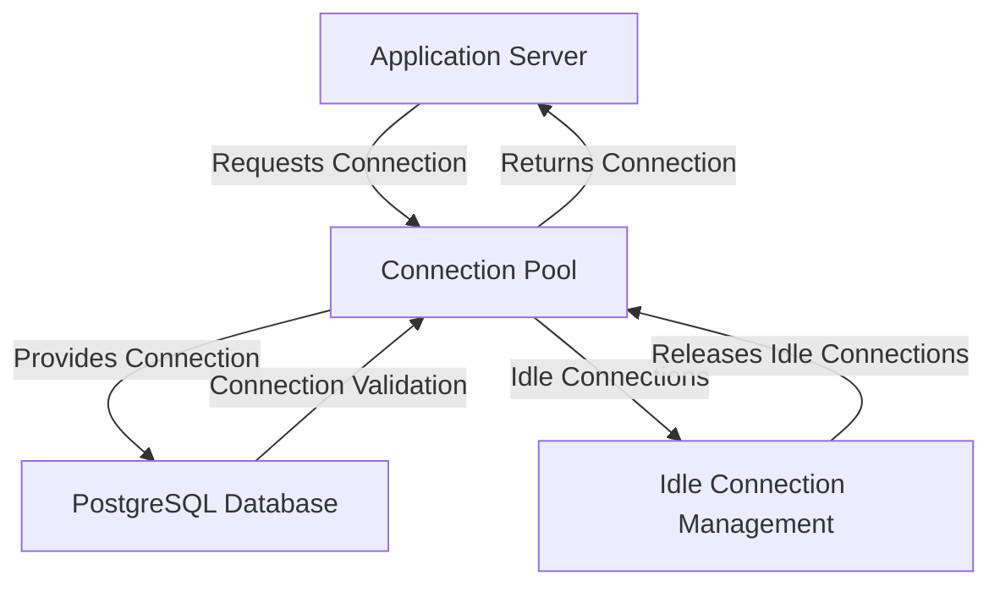

# Connection Pooling — PostgreSQL

## Overview and scope

The purpose of this document is to establish standards and best practices for connection pooling when using PostgreSQL within the Xentic platform. Connection pooling is critical for optimizing database performance, managing resources efficiently, and ensuring application responsiveness.

### Audience
This document is intended for:
- Software Engineers
- Database Administrators
- DevOps Engineers
- Technical Leads

### Scope
This standard applies to all Xentic services that utilize PostgreSQL as their database management system. It encompasses:
- Configuration of connection pools
- Connection pool libraries and frameworks
- Best practices for managing database connections
- Monitoring and troubleshooting connection pool issues

### Non-goals
This document does NOT cover:
- Database design principles
- SQL query optimization
- Application-specific connection management strategies

### Glossary
| Term               | Definition                                                                 |
|--------------------|----------------------------------------------------------------------------|
| Connection Pool    | A cache of database connections maintained so that connections can be reused. |
| JDBC               | Java Database Connectivity; an API for connecting and executing queries on databases. |
| Max Pool Size      | The maximum number of connections that can be allocated in the pool.       |
| Min Pool Size      | The minimum number of connections that should be maintained in the pool.   |
| Idle Timeout       | The time a connection can remain idle in the pool before being closed.     |

### How this standard fits the Xentic platform
The connection pooling standards outlined in this document are integral to the Xentic platform's architecture. By adhering to these guidelines, teams can ensure:
- Consistent performance across services
- Efficient resource utilization
- Simplified troubleshooting and maintenance

### Configuration Example
A sample configuration for a PostgreSQL connection pool using HikariCP is provided below:

```yaml
spring:
  datasource:
    url: jdbc:postgresql://db.internal.xentic.io:5432/mydb
    username: myuser
    password: mypassword
    hikari:
      maximumPoolSize: 30
      minimumIdle: 10
      idleTimeout: 30000
      connectionTimeout: 20000
      maxLifetime: 1800000
```

### Best Practices
- **MUST** use a connection pool library such as HikariCP for managing database connections.
- **SHOULD** configure the maximum pool size based on the application's expected load and database capacity.
- **MUST NOT** hard-code database credentials in the application code; use secure vaults or environment variables instead.
- **SHOULD** monitor connection pool metrics to identify potential bottlenecks and optimize performance.

By following these standards, Xentic services will maintain high availability and performance while interacting with PostgreSQL databases.

## Standards and policies

1. **MUST** use the package naming convention `com.xentic.<service>` for all classes related to connection pooling implementations. This ensures consistency and clarity across the codebase.

2. **MUST** utilize HikariCP as the connection pool implementation for all PostgreSQL connections. HikariCP is the default connection pool library due to its performance and reliability.

3. **MUST NOT** exceed a maximum pool size that is greater than the database's maximum connections setting. This can lead to connection failures and degraded performance. Always check the PostgreSQL configuration using the following SQL command:

   ```sql
   SHOW max_connections;
   ```

4. **SHOULD** set the `minimumIdle` property to at least 20% of the `maximumPoolSize` to ensure that there are always available connections for incoming requests.

5. **MUST** configure the `idleTimeout` to be less than the PostgreSQL server's `tcp_keepalives_idle` setting to prevent idle connections from being held longer than necessary. Example configuration:

   ```yaml
   hikari:
     idleTimeout: 30000  # 30 seconds
   ```

6. **MUST NOT** allow connections to remain idle for longer than the defined `idleTimeout`. Connections should be closed and removed from the pool to free up resources.

7. **SHOULD** implement connection validation by setting the `connectionTestQuery` property to a simple SQL query such as `SELECT 1`. This helps ensure that connections are valid before they are handed out. Example:

   ```yaml
   hikari:
     connectionTestQuery: SELECT 1
   ```

8. **MUST** monitor connection pool metrics, including active connections, idle connections, and connection wait times. This can be done using tools like Prometheus and Grafana for real-time monitoring.

9. **SHOULD** document all connection pool configurations in the service's README file to ensure that all team members are aware of the settings and their implications.

10. **MUST NOT** use default or weak passwords for database users. Passwords should be complex and stored securely using environment variables or secret management tools.

11. **SHOULD** implement connection pool logging to capture connection acquisition and release events. This can aid in troubleshooting and performance tuning.

12. **MUST** ensure that the connection pool is properly closed during application shutdown to avoid resource leaks. Use the following code snippet for graceful shutdown:

    ```java
    @PreDestroy
    public void close() {
        if (dataSource != null) {
            dataSource.close();
        }
    }
    ```

13. **SHOULD** configure the `maxLifetime` property to be less than the PostgreSQL server's `statement_timeout` to avoid long-running connections that may lead to performance issues.

14. **MUST** adhere to the Xentic logging standards when logging connection pool events. Use the logging framework configured for the service (e.g., Log4j, SLF4J).

15. **MUST NOT** ignore database connection errors. All exceptions related to connection pooling should be logged and handled appropriately to ensure application stability.

By following these standards and policies, Xentic teams will ensure efficient and effective management of PostgreSQL connections, leading to improved application performance and reliability.

## Architecture and design

The architecture for connection pooling with PostgreSQL at Xentic is designed to optimize database interactions while ensuring high availability and performance. The following component diagram illustrates the key components and their interactions:



### Data Flows
1. **Application Requests Connection**: The application server requests a connection from the connection pool.
2. **Connection Pool Provides Connection**: The connection pool checks for available connections and provides one to the application.
3. **Application Uses Connection**: The application performs database operations using the provided connection.
4. **Connection Returned to Pool**: Once the operation is complete, the connection is returned to the pool for reuse.
5. **Idle Connection Management**: Idle connections are monitored and released based on the defined `idleTimeout` to optimize resource usage.
6. **Connection Validation**: Before providing a connection, the pool validates it to ensure it is still active and usable.

### Integration Points
- **Application Server**: The application communicates with the connection pool using JDBC.
- **Connection Pool**: HikariCP serves as the connection pool implementation, managing connections to the PostgreSQL database.
- **PostgreSQL Database**: The database serves as the backend data store, handling queries and transactions from the application.

### Failure Domains
- **Connection Pool Failure**: If the connection pool fails, the application will not be able to acquire new connections, leading to potential downtime. Monitoring and alerting should be implemented to detect pool exhaustion.
- **Database Unavailability**: If the PostgreSQL database becomes unavailable, all applications relying on it will experience connectivity issues. Implementing retries and fallbacks is essential.
- **Network Issues**: Network failures can disrupt communication between the application server and the database. Proper error handling and retry mechanisms should be in place.

### Configuration Example
To ensure robust connection pooling, the following configuration should be applied:

```yaml
hikari:
  connectionTimeout: 30000  # 30 seconds
  maximumPoolSize: 50
  minimumIdle: 10
  idleTimeout: 60000  # 1 minute
  maxLifetime: 1800000  # 30 minutes
  connectionTestQuery: SELECT 1
```

### Monitoring
Monitoring connection pool metrics is crucial for maintaining performance. Key metrics to monitor include:
- Active Connections
- Idle Connections
- Connection Wait Time
- Connection Errors

Utilize tools like Prometheus and Grafana for real-time monitoring and alerting on these metrics.

### Best Practices Summary
- **MUST** validate connections before use.
- **SHOULD** implement idle connection management to release unused connections.
- **MUST NOT** allow the application to experience connection pool exhaustion.
- **SHOULD** log all connection pool events for troubleshooting purposes.
- **MUST** ensure that the connection pool configuration is documented and accessible to all team members.

By adhering to these architectural guidelines and best practices, Xentic can ensure a reliable and efficient connection pooling strategy for PostgreSQL, enhancing overall application performance and user experience.

## Configuration reference

### application.yml Configuration

The following is an example configuration for PostgreSQL connection pooling using HikariCP in the `application.yml` file:

```yaml
spring:
  datasource:
    url: jdbc:postgresql://db.internal.xentic.io:5432/mydb
    username: ${DB_USERNAME}
    password: ${DB_PASSWORD}
    hikari:
      maximumPoolSize: 50
      minimumIdle: 10
      idleTimeout: 60000  # 1 minute
      connectionTimeout: 30000  # 30 seconds
      maxLifetime: 1800000  # 30 minutes
      connectionTestQuery: SELECT 1
```

### Terraform Configuration

For provisioning PostgreSQL connection settings using Terraform, ensure the following configuration is included:

```hcl
resource "aws_db_instance" "mydb" {
  allocated_storage    = 20
  storage_type       = "gp2"
  engine            = "postgres"
  engine_version    = "13"
  instance_class    = "db.t3.micro"
  name              = "mydb"
  username          = var.db_username
  password          = var.db_password
  db_subnet_group_name = aws_db_subnet_group.mydb_subnet_group.name
  vpc_security_group_ids = [aws_security_group.mydb_sg.id]
  skip_final_snapshot = true
}

output "db_endpoint" {
  value = aws_db_instance.mydb.endpoint
}
```

### Environment Variables

The following environment variables MUST be set in the production environment to secure sensitive data:

| Variable Name   | Default Value | Production Value           |
|------------------|---------------|-----------------------------|
| `DB_USERNAME`    | `myuser`      | `prod_user`                 |
| `DB_PASSWORD`    | `mypassword`  | `secure_production_password`|

### Connection Pooling Defaults

The following default values are recommended for connection pooling in a production environment:

| Configuration Property      | Default Value | Production Value           |
|-----------------------------|---------------|-----------------------------|
| `maximumPoolSize`           | 10            | 50                          |
| `minimumIdle`               | 2             | 10                          |
| `idleTimeout`               | 30000         | 60000                       |
| `connectionTimeout`         | 30000         | 20000                       |
| `maxLifetime`               | 1800000       | 1800000                     |
| `connectionTestQuery`       | `SELECT 1`    | `SELECT 1`                  |

### Additional Configuration Considerations

- **MUST** ensure that the `DB_USERNAME` and `DB_PASSWORD` environment variables are sourced from a secure vault or secret management tool.
- **SHOULD** use a connection pool library like HikariCP for managing database connections to ensure optimal performance.
- **MUST NOT** expose database credentials in source code; always use environment variables or configuration management tools.
- **SHOULD** regularly review and update database connection settings based on application performance and load testing results.

By adhering to these configuration standards, Xentic services will ensure secure and efficient management of PostgreSQL connections, leading to improved application performance and reliability.

## Implementation guide

To implement connection pooling for PostgreSQL at Xentic, follow the step-by-step guide below. This guide will utilize HikariCP as the connection pool implementation and provide full code examples for integration.

### Step 1: Add Dependencies

Ensure that your `pom.xml` includes the necessary dependencies for HikariCP and PostgreSQL JDBC driver:

```xml
<dependencies>
    <dependency>
        <groupId>com.zaxxer</groupId>
        <artifactId>HikariCP</artifactId>
        <version>5.0.1</version>
    </dependency>
    <dependency>
        <groupId>org.postgresql</groupId>
        <artifactId>postgresql</artifactId>
        <version>42.2.20</version>
    </dependency>
</dependencies>
```

### Step 2: Configure DataSource Bean

Create a `DataSourceConfig` class to configure HikariCP as the connection pool:

```java
package com.xentic.common.config;

import com.zaxxer.hikari.HikariConfig;
import com.zaxxer.hikari.HikariDataSource;
import org.springframework.beans.factory.annotation.Value;
import org.springframework.context.annotation.Bean;
import org.springframework.context.annotation.Configuration;

import javax.sql.DataSource;

@Configuration
public class DataSourceConfig {

    @Value("${spring.datasource.url}")
    private String dbUrl;

    @Value("${spring.datasource.username}")
    private String dbUsername;

    @Value("${spring.datasource.password}")
    private String dbPassword;

    @Bean
    public DataSource dataSource() {
        HikariConfig config = new HikariConfig();
        config.setJdbcUrl(dbUrl);
        config.setUsername(dbUsername);
        config.setPassword(dbPassword);
        config.setMaximumPoolSize(50);
        config.setMinimumIdle(10);
        config.setIdleTimeout(60000);
        config.setConnectionTimeout(30000);
        config.setMaxLifetime(1800000);
        config.setConnectionTestQuery("SELECT 1");

        return new HikariDataSource(config);
    }
}
```

### Step 3: Application Properties

Ensure that your `application.yml` is properly configured:

```yaml
spring:
  datasource:
    url: jdbc:postgresql://db.internal.xentic.io:5432/mydb
    username: ${DB_USERNAME}
    password: ${DB_PASSWORD}
```

### Step 4: Service Implementation

Create a service that utilizes the DataSource for database operations:

```java
package com.xentic.service;

import org.springframework.beans.factory.annotation.Autowired;
import org.springframework.stereotype.Service;

import javax.sql.DataSource;
import java.sql.Connection;
import java.sql.PreparedStatement;
import java.sql.SQLException;

@Service
public class UserService {

    @Autowired
    private DataSource dataSource;

    public void addUser(String username) {
        String sql = "INSERT INTO users (username) VALUES (?)";
        try (Connection connection = dataSource.getConnection();
             PreparedStatement preparedStatement = connection.prepareStatement(sql)) {
            preparedStatement.setString(1, username);
            preparedStatement.executeUpdate();
        } catch (SQLException e) {
            // Log and handle exceptions appropriately
            throw new RuntimeException("Error adding user", e);
        }
    }
}
```

### Step 5: Graceful Shutdown

Implement graceful shutdown to close the DataSource:

```java
package com.xentic.common.config;

import org.springframework.beans.factory.annotation.Autowired;
import org.springframework.context.annotation.Configuration;

import javax.annotation.PreDestroy;
import javax.sql.DataSource;

@Configuration
public class ShutdownConfig {

    @Autowired
    private DataSource dataSource;

    @PreDestroy
    public void close() {
        if (dataSource instanceof HikariDataSource) {
            ((HikariDataSource) dataSource).close();
        }
    }
}
```

### Step 6: Testing Connection Pool

You can test the connection pool by creating a simple REST controller:

```java
package com.xentic.controller;

import com.xentic.service.UserService;
import org.springframework.beans.factory.annotation.Autowired;
import org.springframework.web.bind.annotation.PostMapping;
import org.springframework.web.bind.annotation.RequestParam;
import org.springframework.web.bind.annotation.RestController;

@RestController
public class UserController {

    @Autowired
    private UserService userService;

    @PostMapping("/addUser")
    public String addUser(@RequestParam String username) {
        userService.addUser(username);
        return "User added successfully!";
    }
}
```

### Step 7: Monitor Connection Pool

To monitor the connection pool, you can expose metrics using Spring Actuator. Add the following dependency:

```xml
<dependency>
    <groupId>org.springframework.boot</groupId>
    <artifactId>spring-boot-starter-actuator</artifactId>
</dependency>
```

Then, enable metrics in your `application.yml`:

```yaml
management:
  endpoints:
    web:
      exposure:
        include: "*"
```

### Summary of Implementation Steps

1. **Add Dependencies**: Include HikariCP and PostgreSQL JDBC driver in `pom.xml`.
2. **Configure DataSource**: Create a configuration class to set up HikariCP.
3. **Application Properties**: Define database connection properties in `application.yml`.
4. **Service Implementation**: Create a service that interacts with the database using the DataSource.
5. **Graceful Shutdown**: Implement a shutdown hook to close the DataSource.
6. **Testing Connection Pool**: Create a REST controller to test user addition.
7. **Monitor Connection Pool**: Use Spring Actuator to expose connection pool metrics.

By following these implementation steps, Xentic will ensure a robust and efficient connection pooling strategy for PostgreSQL, enhancing application performance and reliability.

## Security requirements

To ensure the security of PostgreSQL connections at Xentic, the following requirements must be adhered to:

### Threat Model Summary

- **Unauthorized Access**: Attackers may attempt to gain unauthorized access to the database through weak credentials or misconfigured access controls.
- **Data Breach**: Sensitive data may be exposed if proper encryption and access controls are not enforced.
- **SQL Injection**: Malicious users may exploit vulnerabilities in SQL queries to manipulate or access data improperly.
- **Denial of Service (DoS)**: Attackers may overload the database with excessive connections or queries, leading to service unavailability.

### Authentication and Authorization

- **MUST** use strong, unique credentials for database access. Passwords should be at least 12 characters long and include a mix of uppercase, lowercase, numbers, and special characters.
- **MUST NOT** hard-code credentials in the application code. Always retrieve them from environment variables or a secure vault.
- **SHOULD** implement role-based access control (RBAC) to limit user permissions based on their role within the organization.

### Secrets Management

- **MUST** utilize a secrets management tool (e.g., HashiCorp Vault, AWS Secrets Manager) to store and manage sensitive information such as database credentials.
- **MUST** rotate database credentials regularly to minimize the risk of credential compromise.
- **SHOULD** audit access to secrets management tools to track who accessed or modified sensitive information.

### Input Validation

- **MUST** validate all user inputs to prevent SQL injection attacks. Use prepared statements or parameterized queries for all database interactions.
- **SHOULD** implement input sanitization to ensure that only expected data formats are accepted (e.g., using regex for validating email addresses).
- **MUST NOT** rely solely on client-side validation; always perform server-side validation to ensure data integrity.

### Audit Logging

- **MUST** enable logging of all database queries and access attempts. This includes successful and failed login attempts as well as executed SQL statements.
- **SHOULD** integrate logging with a centralized logging system (e.g., ELK Stack, Splunk) for easier monitoring and analysis.
- **MUST** review audit logs regularly to identify any suspicious activities or potential security breaches.

### Example Configuration

Here is an example of how to configure PostgreSQL with security best practices in mind:

```yaml
spring:
  datasource:
    url: jdbc:postgresql://db.internal.xentic.io:5432/mydb
    username: ${DB_USERNAME}
    password: ${DB_PASSWORD}
    hikari:
      maximumPoolSize: 50
      minimumIdle: 10
      idleTimeout: 60000
      connectionTimeout: 30000
      maxLifetime: 1800000
      connectionTestQuery: "SELECT 1"
```

### SQL Example for Role-Based Access Control

```sql
-- Create a new role with limited privileges
CREATE ROLE read_only_user WITH LOGIN PASSWORD 'securePassword123';
GRANT CONNECT ON DATABASE mydb TO read_only_user;
GRANT USAGE ON SCHEMA public TO read_only_user;
GRANT SELECT ON ALL TABLES IN SCHEMA public TO read_only_user;

-- Ensure future tables are also granted the same access
ALTER DEFAULT PRIVILEGES IN SCHEMA public GRANT SELECT ON TABLES TO read_only_user;
```

By implementing these security requirements, Xentic will significantly reduce the risk of unauthorized access and data breaches while ensuring the integrity and confidentiality of its PostgreSQL database connections.

## Testing strategy

To ensure the reliability and performance of the PostgreSQL connection pooling implementation at Xentic, a comprehensive testing strategy must be employed. This includes unit tests, integration tests, and contract tests, with specific coverage targets defined.

### Testing Types

1. **Unit Tests**: 
   - Focus on testing individual components in isolation.
   - Use mocking frameworks (e.g., Mockito) to simulate database interactions.

2. **Integration Tests**: 
   - Validate the interaction between components and the actual database.
   - Ensure that the connection pool is functioning correctly under various scenarios.

3. **Contract Tests**: 
   - Verify that the service contracts between microservices are adhered to.
   - Ensure that any changes in the database schema or service APIs do not break existing functionality.

### Coverage Targets

- **Unit Tests**: Aim for at least 80% code coverage.
- **Integration Tests**: Ensure that all critical paths are covered, targeting at least 90% of service methods.
- **Contract Tests**: Every public API should have corresponding contract tests.

### Example Test Classes

#### Unit Test Example

```java
package com.xentic.service;

import org.junit.jupiter.api.Test;
import org.mockito.InjectMocks;
import org.mockito.Mock;
import org.mockito.MockitoAnnotations;

import javax.sql.DataSource;
import java.sql.Connection;
import java.sql.PreparedStatement;

import static org.mockito.Mockito.*;

class UserServiceTest {

    @Mock
    private DataSource dataSource;

    @Mock
    private Connection connection;

    @Mock
    private PreparedStatement preparedStatement;

    @InjectMocks
    private UserService userService;

    public UserServiceTest() {
        MockitoAnnotations.openMocks(this);
    }

    @Test
    void addUser_ShouldInsertUser() throws Exception {
        String username = "testUser";
        when(dataSource.getConnection()).thenReturn(connection);
        when(connection.prepareStatement(anyString())).thenReturn(preparedStatement);

        userService.addUser(username);

        verify(preparedStatement).setString(1, username);
        verify(preparedStatement).executeUpdate();
        verify(connection).close();
    }
}
```

#### Integration Test Example

```java
package com.xentic.integration;

import com.xentic.service.UserService;
import org.junit.jupiter.api.Test;
import org.springframework.beans.factory.annotation.Autowired;
import org.springframework.boot.test.autoconfigure.web.servlet.AutoConfigureMockMvc;
import org.springframework.boot.test.context.SpringBootTest;
import org.springframework.test.web.servlet.MockMvc;

import static org.springframework.test.web.servlet.request.MockMvcRequestBuilders.post;
import static org.springframework.test.web.servlet.result.MockMvcResultMatchers.status;

@SpringBootTest
@AutoConfigureMockMvc
class UserControllerIntegrationTest {

    @Autowired
    private MockMvc mockMvc;

    @Test
    void addUser_ShouldReturnSuccess() throws Exception {
        mockMvc.perform(post("/addUser").param("username", "testUser"))
                .andExpect(status().isOk());
    }
}
```

#### Contract Test Example

Using a contract testing framework like Pact:

```java
package com.xentic.contract;

import au.com.dius.pact.consumer.junit5.PactConsumerTestExt;
import au.com.dius.pact.consumer.junit5.PactFolder;
import org.junit.jupiter.api.extension.ExtendWith;

@ExtendWith(PactConsumerTestExt.class)
@PactFolder("pacts")
class UserServiceContractTest {

    // Define your contract tests here
}
```

### Summary of Testing Strategy

- **Unit Tests**: Focus on individual methods and components, using mocks to simulate dependencies.
- **Integration Tests**: Test the complete flow from the controller to the database, ensuring the connection pool operates as expected.
- **Contract Tests**: Validate that the API contracts are maintained across service boundaries.

By adhering to this testing strategy, Xentic will ensure that the PostgreSQL connection pooling implementation is robust, reliable, and ready for production deployment.

## Observability and operations

To maintain the health and performance of the PostgreSQL connection pooling implementation at Xentic, a comprehensive observability and operations strategy must be established. This includes metrics collection, logging, tracing, dashboarding, alerting, and defining service level objectives (SLOs).

### Metrics

Xentic MUST collect the following key metrics related to connection pooling:

| Metric                         | Description                                          |
|--------------------------------|------------------------------------------------------|
| `active_connections`           | Number of active connections in the pool.           |
| `idle_connections`             | Number of idle connections available for use.       |
| `max_connections`              | Maximum number of connections allowed in the pool.  |
| `connection_time`              | Time taken to establish a connection.               |
| `wait_time`                   | Time spent waiting for a connection to become available. |
| `failed_connections`           | Number of failed connection attempts.                |

#### Example Configuration for Metrics Collection

Using Micrometer with Spring Boot, the following configuration can be added:

```yaml
management:
  metrics:
    export:
      prometheus:
        enabled: true
```

### Logs

Xentic MUST enable detailed logging for connection pool operations. The following log levels SHOULD be configured:

- **INFO**: Log successful connection acquisition and release.
- **WARN**: Log warnings for connection timeouts or failures.
- **ERROR**: Log errors when connections cannot be established.

#### Example Log Configuration

```yaml
logging:
  level:
    com.zaxxer.hikari: INFO
    org.springframework.jdbc: WARN
```

### Traces

Distributed tracing MUST be implemented to track the flow of requests through the application, including database interactions. Xentic SHOULD use tools like OpenTelemetry or Zipkin for this purpose.

#### Example Trace Configuration

```yaml
spring:
  sleuth:
    sampler:
      probability: 1.0
```

### Dashboards

Xentic MUST create dashboards to visualize connection pool metrics. Grafana or similar tools SHOULD be used to display the following:

- Active vs. idle connections over time.
- Connection acquisition and release times.
- Failed connection attempts.

### Alerts

Xentic MUST configure alerts based on the collected metrics to proactively monitor the health of the connection pool. The following alerts SHOULD be set up:

- Alert if `active_connections` exceeds a threshold (e.g., 80% of `max_connections`).
- Alert if `wait_time` exceeds a defined threshold (e.g., 500ms).
- Alert if `failed_connections` exceeds a threshold (e.g., 5 in 5 minutes).

#### Example Alert Configuration (Prometheus Alertmanager)

```yaml
groups:
  - name: connection_pool_alerts
    rules:
      - alert: HighActiveConnections
        expr: active_connections > (max_connections * 0.8)
        for: 5m
        labels:
          severity: critical
        annotations:
          summary: "High active connections detected"
          description: "Active connections are above 80% of max connections."
```

### Service Level Objectives (SLOs)

Xentic MUST define SLOs for connection pool performance. Suggested SLOs include:

- **Availability**: 99.9% of requests should successfully acquire a connection.
- **Latency**: 95% of connection acquisitions should occur within 200ms.
- **Error Rate**: Less than 1% of connection attempts should fail.

### On-call Runbook Steps

In the event of connection pool issues, the following on-call runbook steps MUST be followed:

1. **Identify the Issue**: Check the monitoring dashboards for alerts related to connection pool metrics.
2. **Review Logs**: Analyze logs for any WARN or ERROR messages related to connection acquisition.
3. **Check Database Health**: Ensure that the PostgreSQL database is operational and not under heavy load.
4. **Scale Resources**: If necessary, increase the `maximumPoolSize` in the connection pool configuration.
5. **Communicate**: Notify the team via the incident management tool (e.g., PagerDuty) about the ongoing issue and the steps being taken.
6. **Document Findings**: After resolution, document the incident, including root cause analysis and any changes made to prevent future occurrences.

By implementing these observability and operations practices, Xentic will enhance the reliability and performance of its PostgreSQL connection pooling, ensuring a seamless experience for users and developers alike.

## Migration and versioning

To ensure a smooth transition between PostgreSQL versions and maintain application stability at Xentic, a robust migration and versioning strategy MUST be established. This strategy includes defined upgrade paths, a clear deprecation policy, backward compatibility considerations, and rollback procedures.

### Upgrade Paths

Xentic MUST follow a structured upgrade path when migrating to new versions of PostgreSQL. The following table outlines the recommended upgrade paths:

| Current Version | Target Version | Upgrade Method                |
|------------------|----------------|-------------------------------|
| 12.x             | 13.x           | In-place upgrade              |
| 13.x             | 14.x           | In-place upgrade              |
| 14.x             | 15.x           | In-place upgrade              |
| 15.x             | 16.x           | In-place upgrade              |

- **In-place Upgrade**: This method is preferred for minor version upgrades. It involves updating the existing database instance without creating a new one.

### Deprecation Policy

Xentic MUST adhere to a clear deprecation policy for database features and extensions. The following guidelines SHOULD be followed:

- **Announcement**: Deprecation of any feature MUST be announced at least one major release in advance.
- **Documentation**: Deprecated features MUST be documented, including alternatives and timelines for removal.
- **Grace Period**: A grace period of at least one year MUST be provided before a deprecated feature is removed from the database.

### Backward Compatibility

Xentic MUST ensure that all database migrations maintain backward compatibility. This includes:

- **Schema Changes**: Any schema changes MUST be non-breaking. For example, adding columns with default values is acceptable, while removing columns or changing data types is NOT.
- **Data Migration**: Data migration scripts MUST be tested to ensure that existing data remains accessible and valid post-migration.

#### Example SQL for Backward-Compatible Schema Change

```sql
ALTER TABLE users ADD COLUMN last_login TIMESTAMP DEFAULT NOW();
```

### Rollback Procedures

In the event of a failed migration, Xentic MUST have a rollback plan in place. The following steps SHOULD be followed:

1. **Backup**: Always create a full database backup before performing any migrations. Use the following command to create a backup:

   ```bash
   pg_dump -U username -F c -b -v -f /path/to/backup/db_backup.backup dbname
   ```

2. **Rollback Script**: Prepare rollback scripts for every migration. These scripts MUST revert the changes made during the migration. 

   #### Example Rollback Script

   ```sql
   ALTER TABLE users DROP COLUMN last_login;
   ```

3. **Testing Rollbacks**: Rollback procedures MUST be tested in a staging environment before deployment to production.

4. **Monitoring**: After performing a migration, monitor the application and database for any anomalies or performance issues. If issues arise, execute the rollback script promptly.

### Versioning Strategy

Xentic MUST adopt a versioning strategy for database schemas. The following guidelines SHOULD be implemented:

- **Semantic Versioning**: Use semantic versioning (MAJOR.MINOR.PATCH) for database schema versions.
- **Version Control**: Store migration scripts in a version control system (e.g., Git) to track changes over time.

#### Example Migration Script Naming Convention

- `V1__Create_users_table.sql`
- `V2__Add_last_login_column.sql`

By following these migration and versioning guidelines, Xentic will ensure that PostgreSQL upgrades are executed smoothly, minimizing downtime and maintaining application reliability.

## FAQ, Anti-Patterns, and Checklists

### Frequently Asked Questions (FAQ)

1. **What is connection pooling?**
   - Connection pooling is a technique used to manage database connections efficiently by reusing existing connections instead of creating new ones for each request.

2. **Why is connection pooling important?**
   - Connection pooling reduces the overhead of establishing new connections, which can be resource-intensive, thus improving application performance and scalability.

3. **How many connections should I configure in the pool?**
   - The number of connections should be based on the application's load and the database server's capacity. A common starting point is to set `maximumPoolSize` to the number of CPU cores multiplied by 2.

4. **What happens if the connection pool is exhausted?**
   - If the pool is exhausted, additional requests for connections will be queued until a connection becomes available, potentially leading to increased response times.

5. **How can I monitor connection pool performance?**
   - Use metrics such as active connections, idle connections, and wait times to monitor performance. Tools like Grafana and Prometheus can help visualize these metrics.

6. **What is the difference between `maxConnections` and `maxIdle`?**
   - `maxConnections` defines the maximum number of connections in the pool, while `maxIdle` specifies the maximum number of connections that can remain idle without being released.

7. **Should I configure a connection timeout?**
   - Yes, you MUST configure a connection timeout to prevent requests from hanging indefinitely. A typical value is 30 seconds.

8. **What should I do if I encounter connection leaks?**
   - Review your code to ensure that all connections are properly closed after use. Use tools like HikariCP's connection leak detection feature to identify leaks.

9. **Can I use connection pooling with read replicas?**
   - Yes, connection pooling can be configured to work with read replicas to distribute read requests and improve performance.

10. **What is the recommended connection pool implementation for Spring Boot?**
    - Xentic MUST use HikariCP as the connection pool implementation due to its performance and reliability.

### Anti-Patterns

| Anti-Pattern                    | Description                                                                                       |
|----------------------------------|---------------------------------------------------------------------------------------------------|
| **Hardcoding Connection Strings** | Connection strings MUST NOT be hardcoded in the application. Use configuration files instead.   |
| **Ignoring Connection Timeout**  | Failing to set a connection timeout can lead to hanging requests. A timeout MUST be configured.  |
| **Not Closing Connections**      | Connections MUST always be closed after use to prevent leaks.                                    |
| **Exceeding Maximum Connections**| Configuring `maxConnections` too high can overwhelm the database. Set this value based on load. |
| **Using Default Pool Settings**  | Default settings are often not optimal. Xentic MUST customize pool settings based on application needs. |
| **Neglecting Error Handling**    | Error handling for connection failures MUST be implemented to ensure application stability.       |

### Pre-Merge Checklist

- [ ] Ensure connection pool configurations are reviewed and approved.
- [ ] Verify that all database interactions are using the connection pool.
- [ ] Confirm that connection timeouts are set appropriately.
- [ ] Check that connection leak detection is enabled in the pool configuration.
- [ ] Ensure that all database access code properly closes connections.

### Production Checklist

- [ ] Monitor connection pool metrics after deployment.
- [ ] Validate that SLOs for connection pooling are being met.
- [ ] Review logs for any warnings or errors related to connection pooling.
- [ ] Ensure alerts are configured and functioning as intended.
- [ ] Conduct a post-deployment review to identify any issues or improvements needed.
