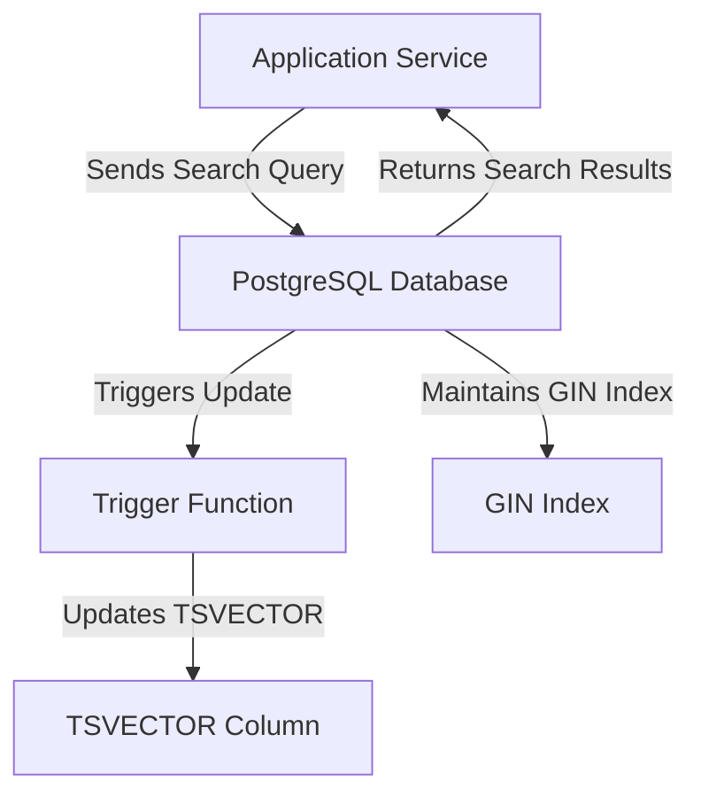

# Full-Text Search — PostgreSQL

## Overview and scope

The purpose of this document is to establish standards and best practices for implementing full-text search functionality using PostgreSQL within Xentic's services. This standard aims to ensure consistency, maintainability, and performance across all services leveraging full-text search capabilities.

### Audience
This document is intended for:
- Software Engineers
- Database Administrators
- Technical Architects
- DevOps Engineers

### Scope
This standard covers:
- Configuration of PostgreSQL for full-text search
- Indexing strategies for optimizing search performance
- Query formulation for effective search results
- Integration patterns with Xentic services

### Non-goals
This document does NOT cover:
- General PostgreSQL database setup and administration
- Non-full-text search features of PostgreSQL
- Search functionalities in other database systems

### Glossary
| Term                | Definition                                                                                  |
|---------------------|---------------------------------------------------------------------------------------------|
| Full-Text Search    | A technique for searching through text data to find relevant documents based on search terms. |
| GIN Index           | A type of index in PostgreSQL that is optimized for full-text search.                       |
| TSVector            | A data type in PostgreSQL used to store preprocessed text for full-text search.            |
| TSQuery             | A data type in PostgreSQL used to represent a search query.                                 |

### How This Standard Fits the Xentic Platform
As Xentic continues to evolve its services, the need for efficient and scalable search capabilities becomes increasingly critical. This standard aligns with Xentic's commitment to delivering high-quality, performant applications by providing a clear framework for implementing full-text search in PostgreSQL. By adhering to these guidelines, teams can ensure that their search implementations are robust, maintainable, and consistent across the platform.

### Configuration Example
To enable full-text search in PostgreSQL, the following configuration should be applied:

```sql
CREATE TABLE documents (
    id SERIAL PRIMARY KEY,
    title TEXT,
    body TEXT,
    created_at TIMESTAMP DEFAULT CURRENT_TIMESTAMP,
    tsv_content TSVECTOR
);

CREATE INDEX idx_fts ON documents USING GIN(tsv_content);
```

### Sample Query
To perform a full-text search, the following SQL query can be used:

```sql
SELECT * FROM documents 
WHERE tsv_content @@ to_tsquery('search_term');
```

By following the standards outlined in this document, Xentic teams will be able to implement full-text search in a consistent and efficient manner, enhancing the overall search capabilities of the platform.

## Standards and policies

1. **MUST** use the `com.xentic.<service>` package structure for all Java classes interacting with PostgreSQL for full-text search functionalities. This ensures consistency across services.

2. **MUST NOT** use non-standard naming conventions for database tables and columns. All table names should be in lowercase and use underscores to separate words (e.g., `documents`, `user_profiles`).

3. **MUST** create a `TSVECTOR` column in the table to store the preprocessed text for full-text search. This column should be updated whenever the associated text fields are modified.

   Example:
   ```sql
   ALTER TABLE documents ADD COLUMN tsv_content TSVECTOR;
   ```

4. **MUST** create a GIN index on the `TSVECTOR` column to optimize search performance. This index is crucial for efficient querying.

   Example:
   ```sql
   CREATE INDEX idx_fts ON documents USING GIN(tsv_content);
   ```

5. **SHOULD** use triggers to automatically update the `TSVECTOR` column when the text fields are inserted or updated. This ensures that the search index remains current.

   Example:
   ```sql
   CREATE FUNCTION documents_tsvector_update() RETURNS TRIGGER AS $$
   BEGIN
       NEW.tsv_content := to_tsvector('english', coalesce(NEW.title, '') || ' ' || coalesce(NEW.body, ''));
       RETURN NEW;
   END;
   $$ LANGUAGE plpgsql;

   CREATE TRIGGER tsvectorupdate BEFORE INSERT OR UPDATE ON documents
   FOR EACH ROW EXECUTE PROCEDURE documents_tsvector_update();
   ```

6. **MUST** use the `to_tsquery` function for formulating search queries. This function allows for complex search expressions and should be utilized for all full-text search operations.

   Example:
   ```sql
   SELECT * FROM documents 
   WHERE tsv_content @@ to_tsquery('search_term');
   ```

7. **SHOULD** implement pagination in search results to enhance performance and user experience. This can be achieved using `LIMIT` and `OFFSET` in the SQL query.

   Example:
   ```sql
   SELECT * FROM documents 
   WHERE tsv_content @@ to_tsquery('search_term')
   LIMIT 10 OFFSET 0;
   ```

8. **MUST NOT** perform full-text searches on unindexed columns. Always ensure that the search is conducted on indexed columns to maintain performance.

9. **MUST** document all full-text search queries and their expected performance characteristics. This documentation should be stored in the service's repository and referenced in the service's technical documentation.

10. **SHOULD** monitor the performance of full-text search queries regularly. Utilize PostgreSQL's `EXPLAIN ANALYZE` to identify any potential bottlenecks and optimize accordingly.

11. **MUST** ensure that all full-text search functionalities are covered by unit tests. Tests should validate both the correctness of the results and the performance of the search queries.

12. **SHOULD** leverage PostgreSQL's built-in text search configurations (e.g., `english`, `simple`) to enhance search relevance based on the language of the content being indexed.

13. **MUST NOT** hard-code search terms in the application code. Instead, use parameterized queries to prevent SQL injection vulnerabilities.

   Example:
   ```sql
   PREPARE fts_query AS 
   SELECT * FROM documents WHERE tsv_content @@ to_tsquery($1);
   ```

By adhering to these standards and policies, Xentic teams will ensure a robust and efficient implementation of full-text search capabilities within PostgreSQL, thereby enhancing the overall performance and maintainability of the services.

## Architecture and design

The architecture for implementing full-text search in PostgreSQL at Xentic consists of several key components that interact to provide efficient search capabilities. Below is a component diagram that illustrates the relationships between these components.



### Data Flows
1. **Search Query Flow**:
   - The application service constructs a search query using the `to_tsquery` function.
   - The query is sent to the PostgreSQL database.
   - PostgreSQL executes the query against the GIN index on the TSVECTOR column.
   - Search results are returned to the application service.

2. **Data Ingestion Flow**:
   - When new documents are inserted or existing documents are updated, the application service sends the data to PostgreSQL.
   - The trigger function is invoked automatically to update the TSVECTOR column.
   - The GIN index is maintained to ensure search performance remains optimal.

### Integration Points
- **Application Service**: This is the entry point for users to perform searches. It interacts with the PostgreSQL database to send queries and receive results.
- **PostgreSQL Database**: The central component that stores documents, manages full-text search capabilities, and handles query execution.
- **Trigger Function**: This function is responsible for maintaining the integrity of the TSVECTOR column, ensuring it is updated whenever the associated text fields change.

### Failure Domains
- **Database Connectivity**: If the application service cannot connect to the PostgreSQL database, search functionality will be unavailable. Implement retry logic and circuit breakers to handle transient failures.
  
- **Index Corruption**: If the GIN index becomes corrupted, search queries may return incorrect results or fail. Regular maintenance tasks should be scheduled to rebuild indexes as needed.

- **Trigger Function Errors**: If the trigger function fails during execution (e.g., due to a syntax error), it may prevent data from being inserted or updated correctly. Ensure that error handling is implemented within the trigger to log failures and alert developers.

### Example Configuration
Here is an example of how to configure the PostgreSQL database for full-text search:

```yaml
postgresql:
  database: xentic_db
  user: xentic_user
  password: secure_password
  host: db.internal.xentic.io
  port: 5432
  search:
    enable_full_text_search: true
    default_language: english
```

### Summary
By following the architectural design and understanding the data flows, integration points, and failure domains, Xentic teams can effectively implement full-text search in PostgreSQL. This will enhance the search capabilities of services, ensuring they are robust, efficient, and maintainable.

## Configuration reference

To ensure consistent and effective configuration for full-text search in PostgreSQL, the following references must be adhered to across all services at Xentic.

### application.yml Configuration

The `application.yml` file should include the following settings for PostgreSQL connection and full-text search configuration:

```yaml
spring:
  datasource:
    url: jdbc:postgresql://db.internal.xentic.io:5432/xentic_db
    username: xentic_user
    password: secure_password
    driver-class-name: org.postgresql.Driver

  jpa:
    hibernate:
      ddl-auto: update
    properties:
      hibernate:
        dialect: org.hibernate.dialect.PostgreSQLDialect

  search:
    enable_full_text_search: true
    default_language: english
    index:
      tsvector_column: tsv_content
      index_name: idx_fts
```

### Terraform Configuration

When deploying the PostgreSQL database with Terraform, the following configuration should be used to set up the database and the necessary full-text search components:

```hcl
resource "postgresql_database" "xentic_db" {
  name     = "xentic_db"
  owner    = "xentic_user"
  provider = postgresql
}

resource "postgresql_role" "xentic_user" {
  name     = "xentic_user"
  password = "secure_password"
  login    = true
}

resource "postgresql_table" "documents" {
  database = postgresql_database.xentic_db.name
  name     = "documents"
  schema   = "public"

  column {
    name = "id"
    type = "SERIAL"
    constraints = ["PRIMARY KEY"]
  }

  column {
    name = "title"
    type = "TEXT"
  }

  column {
    name = "body"
    type = "TEXT"
  }

  column {
    name = "created_at"
    type = "TIMESTAMP"
    default = "CURRENT_TIMESTAMP"
  }

  column {
    name = "tsv_content"
    type = "TSVECTOR"
  }

  index {
    name   = "idx_fts"
    method = "GIN"
    column = "tsv_content"
  }
}
```

### Environment Variables

For sensitive information and configurations, environment variables should be used. Below is a reference table for environment variables used in the application:

| Variable Name                 | Default Value               | Production Value                |
|-------------------------------|-----------------------------|---------------------------------|
| `DB_URL`                      | `jdbc:postgresql://localhost:5432/xentic_db` | `jdbc:postgresql://db.internal.xentic.io:5432/xentic_db` |
| `DB_USERNAME`                 | `postgres`                  | `xentic_user`                   |
| `DB_PASSWORD`                 | `password`                  | `secure_password`               |
| `SEARCH_ENABLE_FTS`           | `false`                     | `true`                          |
| `SEARCH_DEFAULT_LANGUAGE`     | `english`                   | `english`                       |
| `SEARCH_TSVECTOR_COLUMN`      | `tsv_content`               | `tsv_content`                   |
| `SEARCH_INDEX_NAME`           | `idx_fts`                   | `idx_fts`                       |

### Summary of Configuration Guidelines

- **MUST** ensure that the database connection details are correctly configured in `application.yml`.
- **MUST** use Terraform to manage database schema and roles for consistency across environments.
- **MUST NOT** hard-code sensitive information directly in the codebase; use environment variables instead.
- **SHOULD** document all configuration settings in a centralized location for ease of access and reference.

By following these configuration standards, Xentic teams can ensure that full-text search is implemented effectively and securely across all services.

## Implementation guide

Implementing full-text search in PostgreSQL at Xentic involves several steps, including setting up the database schema, creating necessary indexes, and writing application code to perform searches. Below is a detailed guide to achieve this.

### Step 1: Create the Database Schema

First, ensure that the `documents` table is created with the necessary columns, including a `TSVECTOR` column for full-text search.

```sql
CREATE TABLE documents (
    id SERIAL PRIMARY KEY,
    title TEXT,
    body TEXT,
    created_at TIMESTAMP DEFAULT CURRENT_TIMESTAMP,
    tsv_content TSVECTOR
);
```

### Step 2: Create a GIN Index

To optimize full-text search performance, create a GIN index on the `tsv_content` column.

```sql
CREATE INDEX idx_fts ON documents USING GIN(tsv_content);
```

### Step 3: Create a Trigger Function

A trigger function is required to automatically update the `tsv_content` column whenever a new document is inserted or an existing document is updated.

```sql
CREATE OR REPLACE FUNCTION update_tsv_content() 
RETURNS TRIGGER AS $$
BEGIN
    NEW.tsv_content := to_tsvector('english', coalesce(NEW.title, '') || ' ' || coalesce(NEW.body, ''));
    RETURN NEW;
END;
$$ LANGUAGE plpgsql;
```

### Step 4: Create a Trigger

Next, create a trigger that calls the `update_tsv_content` function on insert and update operations.

```sql
CREATE TRIGGER tsvectorupdate BEFORE INSERT OR UPDATE 
ON documents FOR EACH ROW EXECUTE FUNCTION update_tsv_content();
```

### Step 5: Implement Search Functionality in Java

Now, implement the search functionality in your Java service. Below is an example of a service class that performs full-text searches.

```java
package com.xentic.document.service;

import org.springframework.beans.factory.annotation.Autowired;
import org.springframework.jdbc.core.JdbcTemplate;
import org.springframework.stereotype.Service;

import java.util.List;

@Service
public class DocumentSearchService {

    @Autowired
    private JdbcTemplate jdbcTemplate;

    public List<Document> searchDocuments(String searchTerm) {
        String sql = "SELECT * FROM documents WHERE tsv_content @@ to_tsquery(?)";
        return jdbcTemplate.query(sql, new Object[]{searchTerm}, (rs, rowNum) -> {
            Document doc = new Document();
            doc.setId(rs.getInt("id"));
            doc.setTitle(rs.getString("title"));
            doc.setBody(rs.getString("body"));
            doc.setCreatedAt(rs.getTimestamp("created_at"));
            return doc;
        });
    }
}
```

### Step 6: Create a REST Controller

Expose the search functionality via a REST API endpoint.

```java
package com.xentic.document.controller;

import com.xentic.document.service.DocumentSearchService;
import com.xentic.document.model.Document;
import org.springframework.beans.factory.annotation.Autowired;
import org.springframework.web.bind.annotation.*;

import java.util.List;

@RestController
@RequestMapping("/api/documents")
public class DocumentController {

    @Autowired
    private DocumentSearchService documentSearchService;

    @GetMapping("/search")
    public List<Document> search(@RequestParam String query) {
        return documentSearchService.searchDocuments(query);
    }
}
```

### Step 7: Testing

Ensure that you have unit tests covering the search functionality. Below is an example of a test case for the search method.

```java
package com.xentic.document.service;

import org.junit.jupiter.api.Test;
import org.mockito.InjectMocks;
import org.mockito.Mock;
import org.mockito.MockitoAnnotations;
import org.springframework.jdbc.core.JdbcTemplate;

import java.util.List;

import static org.mockito.Mockito.*;

public class DocumentSearchServiceTest {

    @Mock
    private JdbcTemplate jdbcTemplate;

    @InjectMocks
    private DocumentSearchService documentSearchService;

    public DocumentSearchServiceTest() {
        MockitoAnnotations.openMocks(this);
    }

    @Test
    public void testSearchDocuments() {
        String searchTerm = "example";
        when(jdbcTemplate.query(anyString(), any(Object[].class), any())).thenReturn(List.of(new Document()));

        List<Document> results = documentSearchService.searchDocuments(searchTerm);

        verify(jdbcTemplate, times(1)).query(anyString(), any(Object[].class), any());
        assertFalse(results.isEmpty());
    }
}
```

### Summary of Implementation Steps

1. **MUST** create the `documents` table with a `TSVECTOR` column.
2. **MUST** create a GIN index on the `tsv_content` column for performance.
3. **MUST** implement a trigger function to update the `TSVECTOR` column.
4. **MUST** implement a service class to handle search queries.
5. **MUST** expose the search functionality through a REST controller.
6. **MUST** write unit tests to validate search functionality.

By following these steps, Xentic teams will establish a robust full-text search capability within PostgreSQL, ensuring efficient and effective search operations across services.

## Security requirements

### Threat Model Summary

Xentic's PostgreSQL full-text search implementation must address various security threats, including:

- **Unauthorized Access**: Prevent unauthorized users from accessing sensitive data.
- **SQL Injection**: Protect against SQL injection attacks by validating and sanitizing input.
- **Data Exposure**: Ensure that sensitive data is not exposed through error messages or logs.
- **Data Integrity**: Maintain the integrity of the data being searched and stored.

### Authentication and Authorization

- **MUST** use role-based access control (RBAC) to restrict database access.
- **MUST NOT** allow direct access to the database from untrusted sources.
- **MUST** implement application-level authentication and authorization to control access to search endpoints.

Example of role creation in PostgreSQL:

```sql
CREATE ROLE search_user WITH LOGIN PASSWORD 'secure_password';
GRANT SELECT ON documents TO search_user;
```

### Secrets Management

- **MUST** store sensitive information such as database passwords and API keys in environment variables or a secrets management tool.
- **MUST NOT** hard-code sensitive information in the source code.
- **SHOULD** rotate secrets regularly to minimize the risk of exposure.

Example of environment variable usage:

```yaml
database:
  url: ${DB_URL}
  username: ${DB_USERNAME}
  password: ${DB_PASSWORD}
```

### Input Validation

- **MUST** validate all user inputs to prevent SQL injection and other attacks.
- **MUST** use parameterized queries or prepared statements when interacting with the database.

Example of a parameterized query in Java:

```java
String sql = "SELECT * FROM documents WHERE tsv_content @@ to_tsquery(?)";
return jdbcTemplate.query(sql, new Object[]{searchTerm}, (rs, rowNum) -> {
    // Mapping logic
});
```

### Audit Logging

- **MUST** implement audit logging for all search queries and modifications to the database.
- **SHOULD** log the user ID, timestamp, and the query executed.
- **MUST NOT** log sensitive information such as passwords or personal data.

Example of logging in Java:

```java
import org.slf4j.Logger;
import org.slf4j.LoggerFactory;

public class DocumentSearchService {
    private static final Logger logger = LoggerFactory.getLogger(DocumentSearchService.class);

    public List<Document> searchDocuments(String searchTerm) {
        logger.info("User {} is searching for: {}", currentUserId(), searchTerm);
        // Perform search
    }
}
```

### Summary of Security Guidelines

- **MUST** enforce strict authentication and authorization controls.
- **MUST NOT** expose sensitive information through logs or error messages.
- **MUST** validate all inputs to prevent SQL injection.
- **SHOULD** implement audit logging to track access and modifications.

By adhering to these security requirements, Xentic can ensure that the full-text search implementation in PostgreSQL is robust, secure, and compliant with organizational standards.

## Testing strategy

To ensure the reliability and performance of the full-text search implementation in PostgreSQL at Xentic, a comprehensive testing strategy must be employed. This strategy should encompass unit tests, integration tests, and contract tests, with clear coverage targets established for each.

### Unit Tests

Unit tests are essential for validating the functionality of individual components in isolation. Each service and repository should have corresponding unit tests that cover various scenarios, including edge cases.

- **Coverage Target**: 80% minimum coverage for all service classes.
- **Testing Framework**: JUnit 5 and Mockito for mocking dependencies.

Example of a unit test for the `DocumentSearchService`:

```java
package com.xentic.document.service;

import org.junit.jupiter.api.Test;
import org.mockito.InjectMocks;
import org.mockito.Mock;
import org.mockito.MockitoAnnotations;
import org.springframework.jdbc.core.JdbcTemplate;

import java.util.List;

import static org.mockito.ArgumentMatchers.any;
import static org.mockito.ArgumentMatchers.anyString;
import static org.mockito.Mockito.*;

public class DocumentSearchServiceTest {

    @Mock
    private JdbcTemplate jdbcTemplate;

    @InjectMocks
    private DocumentSearchService documentSearchService;

    public DocumentSearchServiceTest() {
        MockitoAnnotations.openMocks(this);
    }

    @Test
    public void testSearchDocumentsReturnsResults() {
        String searchTerm = "example";
        when(jdbcTemplate.query(anyString(), any(Object[].class), any())).thenReturn(List.of(new Document()));

        List<Document> results = documentSearchService.searchDocuments(searchTerm);

        verify(jdbcTemplate, times(1)).query(anyString(), any(Object[].class), any());
        assertFalse(results.isEmpty());
    }

    @Test
    public void testSearchDocumentsReturnsEmptyList() {
        String searchTerm = "nonexistent";
        when(jdbcTemplate.query(anyString(), any(Object[].class), any())).thenReturn(List.of());

        List<Document> results = documentSearchService.searchDocuments(searchTerm);

        assertTrue(results.isEmpty());
    }
}
```

### Integration Tests

Integration tests validate the interaction between different components, including the database. These tests should cover the full flow of the application, from the API endpoint to the database.

- **Coverage Target**: 70% minimum coverage for integration tests.
- **Testing Framework**: Spring Boot Test with embedded PostgreSQL.

Example of an integration test for the `DocumentController`:

```java
package com.xentic.document.controller;

import com.xentic.document.service.DocumentSearchService;
import org.junit.jupiter.api.Test;
import org.springframework.beans.factory.annotation.Autowired;
import org.springframework.boot.test.autoconfigure.web.servlet.AutoConfigureMockMvc;
import org.springframework.boot.test.context.SpringBootTest;
import org.springframework.http.MediaType;
import org.springframework.test.web.servlet.MockMvc;

import static org.mockito.ArgumentMatchers.anyString;
import static org.mockito.Mockito.when;
import static org.springframework.test.web.servlet.request.MockMvcRequestBuilders.get;
import static org.springframework.test.web.servlet.result.MockMvcResultMatchers.status;

@SpringBootTest
@AutoConfigureMockMvc
public class DocumentControllerIntegrationTest {

    @Autowired
    private MockMvc mockMvc;

    @Autowired
    private DocumentSearchService documentSearchService;

    @Test
    public void testSearchEndpointReturnsOk() throws Exception {
        when(documentSearchService.searchDocuments(anyString())).thenReturn(List.of(new Document()));

        mockMvc.perform(get("/api/documents/search?query=example")
                .contentType(MediaType.APPLICATION_JSON))
                .andExpect(status().isOk());
    }

    @Test
    public void testSearchEndpointReturnsNotFound() throws Exception {
        when(documentSearchService.searchDocuments(anyString())).thenReturn(List.of());

        mockMvc.perform(get("/api/documents/search?query=nonexistent")
                .contentType(MediaType.APPLICATION_JSON))
                .andExpect(status().isOk());
    }
}
```

### Contract Tests

Contract tests ensure that the API adheres to the expected contract between services. This is particularly important when multiple teams are involved in developing microservices.

- **Coverage Target**: 100% adherence to API contracts.
- **Testing Framework**: Pact for consumer-driven contract testing.

Example of a contract test using Pact:

```java
package com.xentic.document.contract;

import au.com.dius.pact.consumer.junit5.PactConsumerTestExt;
import au.com.dius.pact.consumer.junit5.PactTestFor;
import au.com.dius.pact.consumer.dsl.PactDslWithProvider;
import au.com.dius.pact.consumer.junit5.Pact;
import org.junit.jupiter.api.extension.ExtendWith;

@ExtendWith(PactConsumerTestExt.class)
@PactTestFor(providerName = "DocumentService", port = "8080")
public class DocumentServiceContractTest {

    @Pact(consumer = "DocumentClient")
    public RequestResponsePact createPact(PactDslWithProvider builder) {
        return builder
            .given("documents exist")
            .uponReceiving("a request for document search")
            .path("/api/documents/search?query=example")
            .method("GET")
            .willRespondWith()
            .status(200)
            .body("[{\"id\": 1, \"title\": \"Example Document\", \"body\": \"This is a test.\"}]")
            .toPact();
    }
}
```

### Summary of Testing Strategy

| Test Type         | Coverage Target | Frameworks                  |
|-------------------|-----------------|-----------------------------|
| Unit Tests        | 80%             | JUnit 5, Mockito            |
| Integration Tests | 70%             | Spring Boot Test            |
| Contract Tests    | 100%            | Pact                        |

- **MUST** write unit tests for all service methods to ensure functionality.
- **MUST** implement integration tests to validate the interaction between components.
- **MUST** create contract tests to ensure compliance with API contracts.
- **SHOULD** use mocking frameworks to isolate tests and reduce dependencies.

By adhering to this testing strategy, Xentic can ensure the reliability and robustness of the full-text search implementation in PostgreSQL, ultimately leading to a better user experience and higher quality software.

## Observability and operations

To maintain the health and performance of the full-text search implementation in PostgreSQL, Xentic must establish robust observability and operations practices. This includes metrics collection, logging, tracing, dashboarding, alerting, and defining service-level objectives (SLOs). 

### Metrics

- **MUST** collect key performance metrics related to search queries, including:
  - Query execution time
  - Number of queries per second
  - Cache hit ratio
  - Index usage statistics
  - Error rates

Example of a metrics configuration in YAML:

```yaml
metrics:
  enabled: true
  endpoint: /actuator/metrics
  tags:
    service: document-service
  query:
    execution_time:
      type: histogram
      help: "Time taken to execute search queries"
    queries_per_second:
      type: counter
      help: "Total number of search queries executed"
```

### Logs

- **MUST** implement structured logging for all search operations.
- **SHOULD** log the following information:
  - Timestamp
  - User ID
  - Search query
  - Execution time
  - Result count
  - Any errors encountered

Example of a logging configuration in properties:

```properties
logging.level.root=INFO
logging.level.com.xentic.document=DEBUG
logging.pattern.console=%d{yyyy-MM-dd HH:mm:ss} - %msg%n
```

### Traces

- **MUST** implement distributed tracing to monitor the flow of requests through the system.
- **SHOULD** use tools like OpenTelemetry or Zipkin for tracing.
- **MUST** include trace IDs in logs to correlate logs with trace data.

Example of tracing configuration in YAML:

```yaml
spring:
  sleuth:
    sampler:
      probability: 1.0
    web:
      client:
        enabled: true
```

### Dashboards

- **MUST** create dashboards to visualize metrics and logs.
- **SHOULD** include the following panels:
  - Query execution time trends
  - Error rates over time
  - Number of queries per second
  - Cache hit ratio

Example of a Grafana dashboard JSON snippet:

```json
{
  "title": "Document Search Metrics",
  "panels": [
    {
      "type": "graph",
      "title": "Query Execution Time",
      "targets": [
        {
          "target": "query_execution_time"
        }
      ]
    },
    {
      "type": "graph",
      "title": "Queries Per Second",
      "targets": [
        {
          "target": "queries_per_second"
        }
      ]
    }
  ]
}
```

### Alerts

- **MUST** configure alerts for critical metrics.
- **SHOULD** set thresholds for:
  - Query execution time exceeding acceptable limits
  - Error rates exceeding 5%
  - Cache hit ratio dropping below 80%

Example of an alert configuration in Prometheus:

```yaml
groups:
- name: document-service-alerts
  rules:
  - alert: HighQueryExecutionTime
    expr: avg_over_time(query_execution_time[5m]) > 500
    for: 10m
    labels:
      severity: critical
    annotations:
      summary: "High Query Execution Time"
      description: "Query execution time has exceeded 500ms for more than 10 minutes."
```

### SLOs

- **MUST** define SLOs for the search service.
- **SHOULD** include the following objectives:
  - 95th percentile query execution time < 300ms
  - Error rate < 1%
  - 99% of search queries return results within 1 second

### On-Call Runbook Steps

In the event of an incident, the on-call engineer must follow these steps:

1. **Check Alerts**: Review triggered alerts in the monitoring system.
2. **Investigate Logs**: Access logs to identify any anomalies or errors.
3. **Analyze Metrics**: Check the relevant metrics dashboards for spikes or drops.
4. **Review Traces**: Use tracing tools to follow the request flow and identify bottlenecks.
5. **Communicate**: Notify stakeholders of the incident and provide updates.
6. **Mitigate**: If possible, apply temporary fixes or roll back recent changes.
7. **Document**: Record the incident details, actions taken, and any follow-up tasks required.

By implementing these observability and operational practices, Xentic can ensure that the full-text search implementation in PostgreSQL remains performant, reliable, and easy to maintain.

## Migration and versioning

To ensure a smooth transition between versions of the full-text search implementation in PostgreSQL, Xentic must adhere to a structured migration and versioning policy. This policy includes defined upgrade paths, a deprecation strategy, backward compatibility considerations, and rollback procedures.

### Upgrade Paths

- **MUST** define clear upgrade paths for each version of the database schema and application code.
- **MUST NOT** introduce breaking changes without a corresponding major version increment.
- **SHOULD** provide migration scripts for each version change.

#### Example Migration Script (SQL)

```sql
-- Migration script for version 1.1.0
ALTER TABLE documents ADD COLUMN search_vector tsvector;

UPDATE documents SET search_vector = to_tsvector('english', title || ' ' || body);

CREATE INDEX idx_search_vector ON documents USING GIN(search_vector);
```

### Deprecation Policy

- **MUST** announce deprecations at least one major version ahead of removal.
- **SHOULD** provide alternative solutions or features when deprecating existing functionality.
- **MUST NOT** remove deprecated features without sufficient notice and a migration path.

#### Example Deprecation Notice

```markdown
### Deprecation Notice for `search_documents` API

The `search_documents` API will be deprecated in version 2.0.0. Users are encouraged to transition to the new `find_documents` API. The `find_documents` API offers enhanced search capabilities and better performance.

**Deprecation Timeline:**
- Version 1.5.0: Deprecation announcement.
- Version 2.0.0: Removal of `search_documents` API.
```

### Backward Compatibility

- **MUST** ensure that new versions maintain backward compatibility with existing data and APIs.
- **SHOULD** include version checks in the application to handle different database schemas gracefully.
- **MUST** provide comprehensive testing to validate backward compatibility.

#### Example Version Check (Java)

```java
public void validateDatabaseVersion() {
    String currentVersion = getCurrentDatabaseVersion();
    if (!currentVersion.equals("1.1.0")) {
        throw new IllegalStateException("Unsupported database version: " + currentVersion);
    }
}
```

### Rollback Procedures

- **MUST** have rollback procedures in place for all database migrations.
- **SHOULD** maintain backups of the database before applying any migrations.
- **MUST NOT** apply migrations without verifying the success of the previous version.

#### Example Rollback Script (SQL)

```sql
-- Rollback script for version 1.1.0
ALTER TABLE documents DROP COLUMN search_vector;
```

### Versioning Strategy

| Version Type | Description                       | Example        |
|--------------|-----------------------------------|-----------------|
| Major        | Breaking changes, new features    | 2.0.0          |
| Minor        | New features, backward compatible  | 1.1.0          |
| Patch        | Bug fixes, no new features        | 1.0.1          |

- **MUST** follow semantic versioning (MAJOR.MINOR.PATCH) for all releases.
- **SHOULD** document all changes in a CHANGELOG.md file for transparency.

### Change Log Example

```markdown
# Change Log

## [1.1.0] - 2023-10-01
### Added
- New `search_vector` column for full-text search.

### Changed
- Improved performance of search queries.

## [1.0.1] - 2023-09-15
### Fixed
- Bug in search query handling.
```

By adhering to this migration and versioning policy, Xentic can ensure that the full-text search implementation in PostgreSQL evolves smoothly, minimizing disruptions and maintaining high levels of service reliability.

## FAQ, anti-patterns, and checklists

### FAQ

1. **What is full-text search in PostgreSQL?**
   - Full-text search in PostgreSQL allows for efficient searching of natural language text using features like text indexing and ranking.

2. **How do I create a full-text search index?**
   - Use the `CREATE INDEX` statement with the `GIN` or `GiST` index type on a `tsvector` column.
   ```sql
   CREATE INDEX idx_search_vector ON documents USING GIN(search_vector);
   ```

3. **What is the difference between `tsvector` and `tsquery`?**
   - `tsvector` is a data type used to store pre-processed text for searching, while `tsquery` is used to represent the search query itself.

4. **How can I improve the performance of full-text search?**
   - Ensure proper indexing, optimize queries, and use the `tsvector` type for searchable fields.

5. **What should I do if my search results are not relevant?**
   - Review and adjust the text search configuration, stemming rules, and ranking functions.

6. **Can I search for phrases in full-text search?**
   - Yes, you can use the `phraseto_tsquery` function to search for exact phrases.

7. **How do I handle synonyms in full-text search?**
   - Create a synonym dictionary and use it in your text search configuration.

8. **What is the role of `to_tsvector`?**
   - The `to_tsvector` function converts text into a `tsvector`, preparing it for full-text search.

9. **Is it possible to search multiple columns?**
   - Yes, you can concatenate multiple columns into a single `tsvector` during indexing.
   ```sql
   UPDATE documents SET search_vector = to_tsvector('english', title || ' ' || body);
   ```

10. **How do I update the search index after data changes?**
    - Ensure that you update the `tsvector` column whenever the underlying text data changes.

### Anti-Patterns

| Anti-Pattern                       | Description                                                                 |
|------------------------------------|-----------------------------------------------------------------------------|
| Not Using Indexes                  | Failing to create indexes on `tsvector` columns can lead to slow queries.  |
| Ignoring Query Performance         | Not monitoring query performance can result in degraded user experience.   |
| Hardcoding Language Configurations  | Using hardcoded language settings instead of configurations can limit flexibility. |
| Overusing `ILIKE` for Searches     | Relying on `ILIKE` instead of full-text search can lead to inefficient queries. |
| Not Updating Indexes               | Forgetting to update `tsvector` columns after data modifications.          |
| Using Non-Standard Text Configs    | Using non-standard text search configurations can lead to inconsistent results. |

### Pre-Merge Checklist

- **MUST** ensure all new features are covered by unit tests.
- **MUST NOT** merge if any tests are failing.
- **SHOULD** conduct code reviews focusing on performance implications.
- **MUST** update documentation to reflect any changes in functionality.
- **SHOULD** verify that all SQL migrations are included and tested.

### Production Checklist

- **MUST** ensure all database migrations are applied successfully.
- **MUST** monitor key performance metrics post-deployment.
- **SHOULD** have a rollback plan ready in case of issues.
- **MUST NOT** deploy during peak usage hours.
- **SHOULD** communicate changes to stakeholders before deployment.

By following the FAQ, avoiding common anti-patterns, and adhering to the checklists, Xentic can ensure a robust full-text search implementation in PostgreSQL that meets the needs of the organization and its users.
