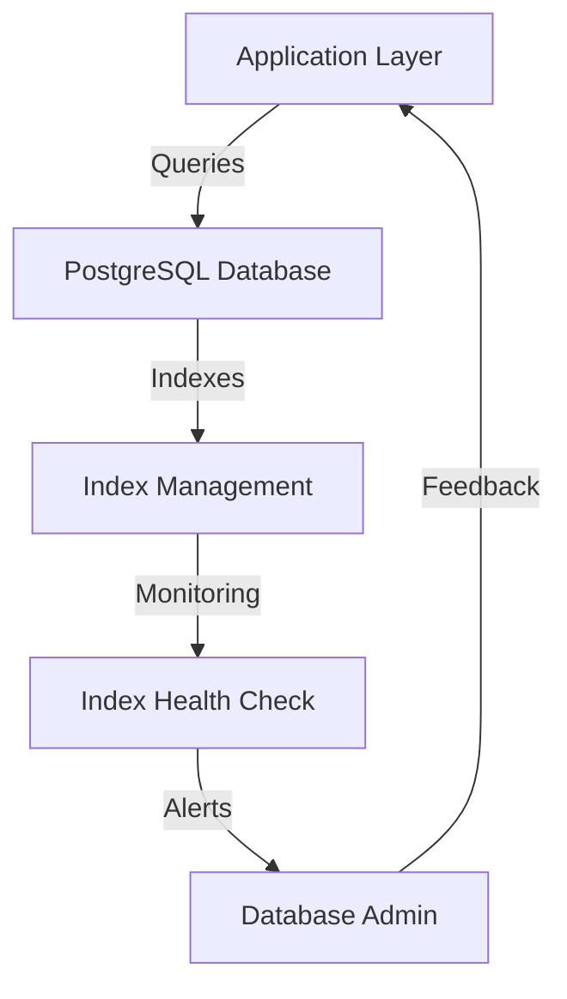

# PostgreSQL Indexing Strategy

## Overview and scope

The purpose of this document is to establish a comprehensive PostgreSQL indexing strategy for Xentic's engineering teams. It aims to provide guidelines and best practices for creating, maintaining, and optimizing indexes in PostgreSQL databases to ensure efficient data retrieval and overall system performance. This document is intended for database administrators, software engineers, and system architects who are involved in the design and management of database systems within Xentic.

### Scope

This standard covers:

- Types of indexes available in PostgreSQL and their appropriate use cases.
- Guidelines for creating standard and specialized indexes.
- Best practices for monitoring and maintaining index health.
- Rules for index management to optimize performance and resource usage.

### Non-goals

This document does NOT cover:

- Specific implementation details for every possible use case.
- Indexing strategies for non-PostgreSQL databases.
- Advanced topics such as partitioning or sharding, which are outside the scope of indexing.

### Glossary

| Term          | Definition                                                                 |
|---------------|-----------------------------------------------------------------------------|
| Index         | A database object that improves the speed of data retrieval operations.     |
| B-tree        | A balanced tree data structure that maintains sorted data for quick access. |
| GIN           | Generalized Inverted Index, used for indexing composite types like JSONB.   |
| GiST          | Generalized Search Tree, used for indexing complex data types.              |
| BRIN          | Block Range INdex, optimized for large, append-only datasets.               |
| Partial Index | An index that only includes a subset of rows based on a specified condition. |

### How This Standard Fits the Xentic Platform

As Xentic continues to grow and evolve, a robust indexing strategy is essential to maintaining high performance and scalability of our applications. By adhering to the guidelines set forth in this document, teams can ensure that their database interactions are efficient, leading to improved application responsiveness and user satisfaction. This standard aligns with Xentic's commitment to engineering excellence and operational efficiency.

### Index Types

| Type    | Use Case                                           |
|---------|---------------------------------------------------|
| B-tree  | Equality, range queries, ORDER BY operations       |
| GIN     | JSONB containment queries, full-text search, array overlap |
| GiST    | Geometric data types, range overlap queries        |
| BRIN    | Optimized for large, append-only time-ordered tables |
| Partial | Subset of rows matching a specific filter condition |

### Standard Indexes

```sql
CREATE UNIQUE INDEX uq_users_email ON users(email);
CREATE INDEX idx_orders_user_id ON orders(user_id);

-- Partial index for active rows only
CREATE INDEX idx_users_active ON users(id) WHERE deleted_at IS NULL;

-- Composite index for common WHERE + ORDER BY
CREATE INDEX idx_orders_user_created ON orders(user_id, created_at DESC);

-- GIN index for JSONB queries
CREATE INDEX idx_products_attributes ON products USING GIN(attributes);
```

### Index Health Check

To monitor index usage and health, the following SQL query can be utilized:

```sql
SELECT indexname, idx_scan
FROM pg_stat_user_indexes
WHERE idx_scan = 0 AND indexname NOT LIKE '%pkey%'
ORDER BY pg_relation_size(indexrelid) DESC;
```

### Rules

- **MUST** check `EXPLAIN ANALYZE` before and after adding any index to gauge its impact on query performance.
- **SHOULD** prefer partial indexes for queries that can benefit from filtering.
- **MUST NOT** exceed a maximum of 5 indexes per table to avoid performance degradation.
- **MUST** run `ANALYZE table_name` after bulk data loads to update statistics and optimize query planning.

## Standards and policies

1. **MUST** adhere to the Xentic package naming conventions by using `com.xentic.<service>` for all database-related classes and utilities.

2. **MUST NOT** create indexes on columns that are frequently updated, as this can lead to performance degradation due to increased write overhead.

3. **SHOULD** use B-tree indexes for columns that are frequently queried with equality or range conditions.

4. **MUST** evaluate the need for indexes based on query patterns observed in the application; use tools such as `pg_stat_statements` to identify slow queries.

5. **MUST** document the rationale for each index created in a dedicated section of the service documentation to ensure transparency and future reference.

6. **SHOULD** consider using GIN indexes for JSONB columns when performing containment queries or full-text searches.

7. **MUST NOT** create indexes on columns that are rarely used in WHERE clauses or JOIN conditions, as this can lead to unnecessary overhead.

8. **MUST** regularly monitor index usage and health using the following SQL query to identify unused indexes:

   ```sql
   SELECT indexname, idx_scan
   FROM pg_stat_user_indexes
   WHERE idx_scan = 0
   ORDER BY pg_relation_size(indexrelid) DESC;
   ```

9. **SHOULD** prefer composite indexes for queries that filter on multiple columns, ensuring that the order of columns in the index matches the order of conditions in the WHERE clause.

10. **MUST** use partial indexes for scenarios where only a subset of rows is frequently queried, as this can significantly reduce index size and improve performance.

11. **MUST NOT** exceed a total of 5 indexes per table to maintain optimal performance; evaluate the necessity of each index carefully.

12. **SHOULD** run `VACUUM` and `ANALYZE` periodically to maintain database health and ensure that the query planner has the most accurate statistics.

13. **MUST** ensure that all indexes are named following the Xentic naming conventions, such as `idx_<table>_<column>` for standard indexes and `uq_<table>_<column>` for unique indexes.

14. **SHOULD** consider the use of BRIN indexes for large, append-only datasets to optimize storage and improve performance.

15. **MUST** test the impact of new indexes on performance in a staging environment before deploying to production.

16. **SHOULD** use the `pg_indexes` view to review existing indexes on a table and avoid duplication.

17. **MUST** remove any indexes that are no longer needed or are deemed inefficient after analysis.

18. **SHOULD** consider the implications of index maintenance on transaction performance, especially in high-write environments.

19. **MUST** ensure that all index creation and deletion scripts are version-controlled and included in the service's migration files.

20. **SHOULD** use tools like `pgAdmin` or `psql` to visualize index usage and performance metrics for better decision-making.

By following these standards and policies, Xentic teams can ensure that their PostgreSQL databases are optimized for performance and maintainability, aligning with the company's commitment to engineering excellence.

## Architecture and design

### Component Diagram



### Data Flows

1. **Application Layer to Database**: 
   - The application layer sends SQL queries to the PostgreSQL database.
   - Queries may include WHERE clauses that benefit from indexes.

2. **Database to Index Management**: 
   - The PostgreSQL engine utilizes indexes to optimize query execution.
   - Index management is responsible for creating, updating, and deleting indexes as needed.

3. **Index Health Check**:
   - Periodic health checks are performed to monitor index usage and effectiveness.
   - Alerts are generated for unused or inefficient indexes.

4. **Feedback Loop**:
   - Database administrators receive alerts and provide feedback to the application layer, which may involve optimizing queries or adjusting indexes.

### Integration Points

- **Application Layer**: Interfaces with the database through ORM frameworks (e.g., Hibernate) or direct SQL queries.
- **Monitoring Tools**: Integration with monitoring solutions (e.g., Prometheus, Grafana) to visualize index performance metrics.
- **Version Control**: Index creation scripts must be stored in version control systems (e.g., Git) to track changes and ensure consistency.

### Failure Domains

- **Database Layer**: If the PostgreSQL database becomes unresponsive, all application queries will fail, impacting user experience.
- **Index Management**: Inefficient index management can lead to performance degradation, causing slow query responses and increased load times.
- **Monitoring Failures**: Lack of proper monitoring may result in undetected index issues, leading to prolonged performance problems.

### Best Practices

- **MUST** ensure that all indexes are created based on actual query patterns and performance metrics.
- **SHOULD** implement automated monitoring scripts to alert on index usage and health status.
- **MUST NOT** rely solely on default index settings; custom configurations may be necessary based on specific workload characteristics.

### Example Configuration

Here is an example of a PostgreSQL configuration for managing indexes effectively:

```yaml
postgresql:
  max_connections: 100
  shared_buffers: 256MB
  work_mem: 4MB
  maintenance_work_mem: 64MB
  effective_cache_size: 512MB
  autovacuum:
    enabled: true
    vacuum_cost_delay: 20ms
    vacuum_cost_limit: 2000
```

### SQL for Monitoring Index Usage

To monitor the effectiveness of indexes, the following SQL can be executed:

```sql
SELECT 
    relname AS index_name,
    idx_scan AS number_of_scans,
    pg_size_pretty(pg_relation_size(indexrelid)) AS index_size
FROM 
    pg_stat_user_indexes
WHERE 
    idx_scan < 5
ORDER BY 
    pg_relation_size(indexrelid) DESC;
```

This query helps identify indexes that are rarely used, allowing for informed decisions about index removal or optimization. 

By adhering to this architecture and design strategy, Xentic can ensure efficient database operations and maintain high performance across its applications.

## Configuration reference

### application.yml

The following is an example configuration for a Spring Boot application using PostgreSQL. This includes settings for connection pooling and JPA properties.

```yaml
spring:
  datasource:
    url: jdbc:postgresql://db.internal.xentic.io:5432/mydatabase
    username: myuser
    password: mypassword
    driver-class-name: org.postgresql.Driver
  jpa:
    hibernate:
      ddl-auto: update
    properties:
      hibernate:
        dialect: org.hibernate.dialect.PostgreSQLDialect
        show_sql: true
        format_sql: true
  datasource:
    hikari:
      maximum-pool-size: 20
      minimum-idle: 5
      idle-timeout: 30000
      connection-timeout: 30000
```

### Terraform Configuration

The following Terraform configuration sets up a PostgreSQL database instance on AWS RDS. This includes security groups and database parameters.

```hcl
resource "aws_db_instance" "default" {
  allocated_storage    = 20
  storage_type       = "gp2"
  engine            = "postgres"
  engine_version     = "13.3"
  instance_class     = "db.t3.micro"
  identifier         = "my-postgres-db"
  username           = var.db_username
  password           = var.db_password
  db_name            = "mydatabase"
  skip_final_snapshot = true

  tags = {
    Name = "MyPostgresDB"
  }

  vpc_security_group_ids = [aws_security_group.default.id]
}

resource "aws_security_group" "default" {
  name        = "allow_postgres"
  description = "Allow PostgreSQL access"

  ingress {
    from_port   = 5432
    to_port     = 5432
    protocol    = "tcp"
    cidr_blocks = ["0.0.0.0/0"] # Restrict this to your IP range in production
  }

  egress {
    from_port   = 0
    to_port     = 0
    protocol    = "-1"
    cidr_blocks = ["0.0.0.0/0"]
  }
}
```

### Environment Variables

Below is a table of environment variables that should be set for PostgreSQL configuration, including default and production values.

| Variable                  | Default Value                | Production Value                  |
|---------------------------|------------------------------|-----------------------------------|
| `DB_URL`                  | `jdbc:postgresql://localhost:5432/mydatabase` | `jdbc:postgresql://db.internal.xentic.io:5432/mydatabase` |
| `DB_USERNAME`             | `user`                       | `myuser`                          |
| `DB_PASSWORD`             | `password`                   | `secure_password_here`            |
| `DB_MAX_CONNECTIONS`      | `10`                         | `100`                             |
| `DB_POOL_SIZE`           | `5`                          | `20`                              |
| `DB_IDLE_TIMEOUT`        | `30000` (30 seconds)        | `60000` (60 seconds)             |

### Notes

- **MUST** ensure that sensitive information, such as database passwords, is managed securely and not hardcoded in source files.
- **SHOULD** use environment variables to configure database connections to allow flexibility across different environments (development, staging, production).
- **MUST NOT** expose the database to the public internet; proper security groups and firewall rules should be applied to restrict access.

## Implementation guide

To implement an effective PostgreSQL indexing strategy at Xentic, follow the steps outlined below. This guide includes detailed code examples and configurations to ensure best practices are adhered to.

### Step 1: Analyze Query Patterns

Before creating indexes, analyze the query patterns to identify which columns are frequently used in WHERE clauses, JOIN conditions, and ORDER BY clauses. Use the following SQL query to gather insights:

```sql
EXPLAIN ANALYZE SELECT * FROM orders WHERE customer_id = 123;
```

### Step 2: Create Indexes

Based on the analysis, create indexes on the identified columns. Use the naming convention `idx_<table>_<column>` for standard indexes. For example, to create an index on the `customer_id` column in the `orders` table, execute:

```sql
CREATE INDEX idx_orders_customer_id ON orders (customer_id);
```

### Step 3: Create Unique Indexes

For columns that require unique constraints, create unique indexes using the naming convention `uq_<table>_<column>`. For example, to ensure that email addresses in the `users` table are unique:

```sql
CREATE UNIQUE INDEX uq_users_email ON users (email);
```

### Step 4: Monitor Index Usage

Regularly monitor the usage of indexes to ensure they are effective. Use the following SQL query to check the number of scans for each index:

```sql
SELECT 
    relname AS index_name,
    idx_scan AS number_of_scans,
    pg_size_pretty(pg_relation_size(indexrelid)) AS index_size
FROM 
    pg_stat_user_indexes
ORDER BY 
    idx_scan DESC;
```

### Step 5: Drop Unused Indexes

If an index is found to be unused or rarely used, drop it to improve performance. For example, to drop an index named `idx_orders_customer_id`, execute:

```sql
DROP INDEX IF EXISTS idx_orders_customer_id;
```

### Step 6: Maintain Indexes

Run `VACUUM` and `ANALYZE` periodically to maintain the health of the database and update statistics for the query planner:

```sql
VACUUM ANALYZE;
```

### Step 7: Automate Index Management

Consider implementing automated scripts to manage index creation and deletion based on usage patterns. Below is a sample Python script that checks for unused indexes and drops them:

```python
import psycopg2

def drop_unused_indexes():
    conn = psycopg2.connect("dbname=mydatabase user=myuser password=mypassword")
    cur = conn.cursor()
    
    cur.execute("""
        SELECT 
            indexname 
        FROM 
            pg_stat_user_indexes 
        WHERE 
            idx_scan < 5;
    """)
    
    unused_indexes = cur.fetchall()
    
    for index in unused_indexes:
        cur.execute(f"DROP INDEX IF EXISTS {index[0]};")
    
    conn.commit()
    cur.close()
    conn.close()

drop_unused_indexes()
```

### Step 8: Document Index Changes

Ensure that all index creation and deletion scripts are version-controlled. Use a directory structure like the following for organizing migration files:

```
/migrations/
    ├── 2023_01_01_create_orders_index.sql
    ├── 2023_01_02_drop_unused_index.sql
```

### Step 9: Review and Optimize

Conduct regular reviews of index performance and optimize as necessary. Use tools like `pgAdmin` to visualize index usage and performance metrics. 

### Step 10: Continuous Improvement

Continuously refine your indexing strategy based on evolving application needs and query patterns. Engage with your team to share insights and improvements.

By following these steps, Xentic can ensure that its PostgreSQL databases are optimized for performance, maintainability, and scalability, aligning with the company's engineering excellence standards.

## Security requirements

To ensure the security of PostgreSQL databases at Xentic, a comprehensive threat model must be established. This model should consider potential threats such as unauthorized access, data breaches, and SQL injection attacks. The following key areas must be addressed:

### Threat Model Summary

- **Unauthorized Access**: Protect against unauthorized users gaining access to the database.
- **Data Breaches**: Safeguard sensitive data from being exposed or exfiltrated.
- **SQL Injection**: Prevent attackers from executing arbitrary SQL commands.
- **Denial of Service (DoS)**: Mitigate risks of service disruption due to excessive queries or resource consumption.

### Authentication and Authorization

- **MUST** use strong authentication mechanisms, such as:
  - Password authentication with complexity requirements.
  - Multi-factor authentication (MFA) for administrative access.
- **MUST NOT** use default database users or passwords in production environments.
- **SHOULD** implement role-based access control (RBAC) to limit permissions based on user roles.

Example of creating a user with specific privileges:

```sql
CREATE ROLE app_user WITH LOGIN PASSWORD 'secure_password_here';
GRANT SELECT, INSERT, UPDATE ON ALL TABLES IN SCHEMA public TO app_user;
```

### Secrets Management

- **MUST** store database credentials securely using a secrets management tool (e.g., HashiCorp Vault, AWS Secrets Manager).
- **MUST NOT** hardcode sensitive information in application source code or configuration files.
- **SHOULD** rotate database credentials regularly to minimize the risk of credential leakage.

### Input Validation

- **MUST** validate all user inputs to prevent SQL injection attacks. Use parameterized queries or prepared statements.
- **SHOULD** implement input sanitization to ensure that only expected data formats are accepted.

Example of using a prepared statement in Java:

```java
String sql = "SELECT * FROM users WHERE email = ?";
try (PreparedStatement pstmt = connection.prepareStatement(sql)) {
    pstmt.setString(1, userInputEmail);
    ResultSet rs = pstmt.executeQuery();
    // Process results
}
```

### Audit Logging

- **MUST** enable logging of all database access and modifications to track user activities.
- **SHOULD** log failed login attempts and sensitive operations (e.g., data modifications, schema changes).
- **MUST NOT** store logs in the same database to avoid tampering.

Example of enabling logging in PostgreSQL:

```sql
ALTER SYSTEM SET log_statement = 'all';
ALTER SYSTEM SET log_directory = 'pg_log';
ALTER SYSTEM SET log_filename = 'postgresql-%Y-%m-%d_%H%M%S.log';
SELECT pg_reload_conf();
```

### Summary Table of Security Practices

| Security Area          | Requirement                                        | Notes                                                  |
|------------------------|---------------------------------------------------|--------------------------------------------------------|
| Authentication         | Strong password policies and MFA                   | Use tools like Google Authenticator for MFA.          |
| Authorization          | Role-based access control (RBAC)                   | Limit user privileges based on roles.                  |
| Secrets Management     | Use secrets management tools                       | HashiCorp Vault or AWS Secrets Manager recommended.    |
| Input Validation       | Validate and sanitize user inputs                  | Use parameterized queries to prevent SQL injection.    |
| Audit Logging          | Enable logging of all access and modifications     | Store logs separately from the database.               |

By adhering to these security requirements, Xentic can safeguard its PostgreSQL databases against potential threats, ensuring the integrity and confidentiality of its data.

## Testing strategy

To ensure the robustness and reliability of PostgreSQL indexing strategies at Xentic, a comprehensive testing strategy must be implemented. This strategy includes unit tests, integration tests, and contract tests, each serving a distinct purpose in validating the database interactions and indexing logic.

### Unit Tests

Unit tests are essential for verifying the functionality of individual components in isolation. For PostgreSQL-related code, unit tests should focus on the logic that interacts with the database, ensuring that the correct SQL statements are generated and executed.

- **MUST** achieve a minimum of 80% code coverage for all database interaction classes.
- **SHOULD** use mocking frameworks (e.g., Mockito) to simulate database interactions.

Example of a unit test class in Java:

```java
import static org.mockito.Mockito.*;
import org.junit.jupiter.api.Test;
import org.mockito.InjectMocks;
import org.mockito.Mock;
import org.mockito.MockitoAnnotations;

public class OrderRepositoryTest {

    @Mock
    private DatabaseConnection databaseConnection;

    @InjectMocks
    private OrderRepository orderRepository;

    public OrderRepositoryTest() {
        MockitoAnnotations.openMocks(this);
    }

    @Test
    public void testFindOrderById() {
        when(databaseConnection.query("SELECT * FROM orders WHERE id = ?", 1))
            .thenReturn(mockOrderResultSet());

        Order order = orderRepository.findOrderById(1);
        assertNotNull(order);
        assertEquals(1, order.getId());
    }

    private ResultSet mockOrderResultSet() {
        // Mock ResultSet implementation
    }
}
```

### Integration Tests

Integration tests validate the interaction between different components, including the database. These tests should run against a test database to ensure that the indexing strategy works as expected in a real environment.

- **MUST** run integration tests in an isolated environment to avoid affecting production data.
- **SHOULD** use a dedicated testing schema or database for integration tests.

Example of an integration test class:

```java
import org.junit.jupiter.api.Test;
import org.springframework.beans.factory.annotation.Autowired;
import org.springframework.boot.test.autoconfigure.jdbc.AutoConfigureTestDatabase;
import org.springframework.boot.test.context.SpringBootTest;

@SpringBootTest
@AutoConfigureTestDatabase(replace = AutoConfigureTestDatabase.Replace.NONE)
public class IndexingIntegrationTest {

    @Autowired
    private OrderRepository orderRepository;

    @Test
    public void testIndexingEffectiveness() {
        // Insert test data
        orderRepository.createOrder(new Order(1, "Test Order"));

        // Execute query that should benefit from indexing
        List<Order> orders = orderRepository.findOrdersByCustomerId(1);
        assertFalse(orders.isEmpty());
    }
}
```

### Contract Tests

Contract tests ensure that the interactions between services and the database adhere to agreed-upon contracts. This is particularly important in microservices architectures where multiple services may interact with the same database.

- **MUST** define clear contracts for database interactions, including expected inputs and outputs.
- **SHOULD** leverage tools like Pact to automate contract testing.

Example of a contract test scenario:

```yaml
# pact-consumer.yml
consumer:
  name: OrderService
provider:
  name: DatabaseService
interaction:
  description: A request for orders by customer ID
  request:
    method: GET
    path: /orders?customerId=1
  response:
    status: 200
    body:
      - id: 1
        description: "Test Order"
```

### Coverage Targets

| Test Type       | Coverage Target |
|------------------|-----------------|
| Unit Tests       | 80%             |
| Integration Tests| 70%             |
| Contract Tests   | 100%            |

### Summary

By implementing a rigorous testing strategy that includes unit, integration, and contract tests, Xentic can ensure the reliability and performance of its PostgreSQL indexing strategy. Regularly review and update tests to adapt to changes in the application and database schema.

## Observability and operations

To maintain optimal performance and reliability of PostgreSQL databases at Xentic, a robust observability and operations strategy must be established. This strategy encompasses metrics, logs, traces, dashboards, alerts, and SLOs, which are essential for monitoring database health and performance.

### Metrics

Metrics provide quantitative data that help in assessing the performance of the database. The following key metrics MUST be monitored:

- **Query Performance**: Track execution time for queries to identify slow-running queries.
- **Connection Count**: Monitor the number of active connections to avoid reaching connection limits.
- **Cache Hit Ratio**: Measure the effectiveness of the database cache.
- **Disk I/O**: Monitor read and write operations to identify potential bottlenecks.
- **Replication Lag**: For replicated databases, track the delay between primary and replica databases.

Example of a PostgreSQL query to retrieve metrics:

```sql
SELECT 
    datname,
    numbackends,
    xact_commit,
    xact_rollback,
    blks_read,
    blks_written
FROM pg_stat_database;
```

### Logs

Database logs are crucial for troubleshooting and auditing. The following logging practices MUST be followed:

- **MUST** enable detailed logging for slow queries:
  ```sql
  ALTER SYSTEM SET log_min_duration_statement = 1000; -- Log queries taking longer than 1 second
  SELECT pg_reload_conf();
  ```
- **SHOULD** log all errors and warnings to facilitate debugging.
- **MUST NOT** store logs in the same database to prevent tampering.

### Traces

Tracing provides insights into the execution path of queries and transactions. The following tracing strategies SHOULD be implemented:

- **MUST** use tools like pg_stat_statements to track query execution statistics.
- **SHOULD** integrate with distributed tracing systems (e.g., OpenTelemetry) to correlate database calls with application traces.

### Dashboards

Dashboards provide a visual representation of database health and performance. Xentic MUST implement dashboards using tools like Grafana or Kibana to visualize the following:

| Dashboard Metric          | Description                                         |
|---------------------------|-----------------------------------------------------|
| Query Performance          | Visualize slow queries and their execution times.   |
| Connection Usage           | Display current active connections versus limits.   |
| Cache Efficiency           | Show cache hit ratio over time.                     |
| Disk I/O Activity          | Monitor read/write operations and their trends.     |
| Replication Status         | Visualize replication lag and status of replicas.   |

### Alerts

Alerts are essential for proactive database management. The following alerting rules MUST be established:

- **MUST** alert on high query execution times (e.g., > 1 second).
- **MUST** alert when connection count exceeds a defined threshold (e.g., 80% of max connections).
- **SHOULD** alert on low cache hit ratios (e.g., < 90%).
- **MUST NOT** create alerts for non-critical metrics to avoid alert fatigue.

Example of an alert configuration in Prometheus:

```yaml
groups:
  - name: postgres_alerts
    rules:
      - alert: HighQueryExecutionTime
        expr: avg(rate(pg_stat_statements_query_duration_seconds_sum[5m])) > 1
        for: 5m
        labels:
          severity: critical
        annotations:
          summary: "High query execution time detected"
          description: "Query execution time has exceeded 1 second for the last 5 minutes."
```

### Service Level Objectives (SLOs)

SLOs define the expected performance and availability of the database. Xentic MUST establish SLOs for the following:

- **Query Latency**: 95th percentile query latency MUST be < 500ms.
- **Availability**: Database availability MUST be 99.9% over a rolling 30-day period.
- **Error Rate**: The error rate for database queries MUST NOT exceed 1%.

### On-Call Runbook Steps

In the event of an incident, the following on-call runbook steps MUST be followed:

1. **Identify the Issue**: Check alerts and logs to identify the root cause of the issue.
2. **Assess Impact**: Determine the impact on application performance and user experience.
3. **Execute Remediation**: 
   - For slow queries, analyze execution plans and optimize indexes.
   - For connection issues, consider increasing connection limits or optimizing connection pooling.
4. **Communicate**: Notify stakeholders of the issue and provide updates on resolution progress.
5. **Post-Incident Review**: Conduct a post-mortem to analyze the incident and document lessons learned.

By implementing a comprehensive observability and operations strategy, Xentic can ensure the reliability, performance, and maintainability of its PostgreSQL databases, leading to improved overall system health and user satisfaction.

## Migration and versioning

In order to maintain a stable and reliable PostgreSQL environment at Xentic, a well-defined migration and versioning strategy MUST be established. This strategy encompasses upgrade paths, deprecation policies, backward compatibility, and rollback procedures.

### Upgrade Paths

- **MUST** define clear upgrade paths for database schema changes, ensuring that all changes are versioned and documented.
- **SHOULD** use migration tools such as Flyway or Liquibase for managing database migrations.
- **MUST NOT** apply migrations directly to production without first testing in a staging environment.

Example of a Flyway migration script:

```sql
-- V1__Create_orders_table.sql
CREATE TABLE orders (
    id SERIAL PRIMARY KEY,
    customer_id INT NOT NULL,
    order_date TIMESTAMP DEFAULT CURRENT_TIMESTAMP,
    status VARCHAR(50) NOT NULL
);
```

### Deprecation Policy

- **MUST** establish a deprecation policy for database features, including columns, tables, and indexes.
- **SHOULD** provide a grace period during which deprecated features are still supported before removal.
- **MUST NOT** remove deprecated features without proper notification to all stakeholders.

Example of a deprecation notice:

```markdown
### Deprecation Notice: `status` column in `orders` table

The `status` column in the `orders` table is deprecated as of version 2.0. It will be removed in version 3.0. Please update your queries to use the `order_status` column instead.
```

### Backward Compatibility

- **MUST** ensure that any new migrations are backward compatible with existing data and application logic.
- **SHOULD** include tests that validate backward compatibility as part of the migration process.
- **MUST NOT** introduce breaking changes without a clear migration path and communication to affected teams.

### Rollback Procedures

- **MUST** define rollback procedures for each migration to revert changes in case of failure.
- **SHOULD** test rollback procedures in a non-production environment to ensure they work as intended.
- **MUST NOT** skip rollback testing, as this can lead to data loss or corruption.

Example of a rollback script for Flyway:

```sql
-- V1__Create_orders_table.sql
DROP TABLE IF EXISTS orders;
```

### Migration Versioning

| Migration Version | Description                        | Status       |
|-------------------|------------------------------------|--------------|
| V1                | Create orders table                | Applied      |
| V2                | Add order_status column            | Applied      |
| V3                | Remove status column (deprecated)  | Pending      |

### Testing Migrations

- **MUST** run migrations in a test environment before applying them to production.
- **SHOULD** validate data integrity and application functionality after running migrations.
- **MUST NOT** skip testing migrations, as this can lead to unforeseen issues in production.

### Documentation

- **MUST** document all migrations, including the purpose, changes made, and any necessary application updates.
- **SHOULD** maintain a changelog that details all database changes for transparency and traceability.

Example of a changelog entry:

```markdown
## Changelog

### Version 2.0
- Added `order_status` column to `orders` table.
- Deprecated `status` column; will be removed in version 3.0.
```

By adhering to these migration and versioning standards, Xentic can ensure a smooth and reliable database evolution, minimizing risks associated with changes while maintaining the integrity and performance of its PostgreSQL databases.

### FAQ, Anti-Patterns, and Checklists

#### Frequently Asked Questions (FAQ)

1. **What is the purpose of indexing in PostgreSQL?**
   - Indexing improves the speed of data retrieval operations on a database table at the cost of additional space and maintenance overhead.

2. **When should I create an index?**
   - You should create an index when a column is frequently used in WHERE clauses, JOIN conditions, or as part of an ORDER BY clause.

3. **What types of indexes are available in PostgreSQL?**
   - PostgreSQL supports various index types, including B-tree, Hash, GiST, GIN, and SP-GiST indexes.

4. **How do I create an index in PostgreSQL?**
   - You can create an index using the following SQL command:
     ```sql
     CREATE INDEX idx_customer_name ON customers (name);
     ```

5. **What is the impact of too many indexes?**
   - Having too many indexes can slow down write operations (INSERT, UPDATE, DELETE) as each index must be updated.

6. **How can I identify unused indexes?**
   - You can identify unused indexes using the following query:
     ```sql
     SELECT * FROM pg_stat_user_indexes WHERE idx_scan = 0;
     ```

7. **What is a composite index?**
   - A composite index is an index on multiple columns, which can be beneficial for queries that filter on those columns together.

8. **How do I drop an index?**
   - You can drop an index using the following SQL command:
     ```sql
     DROP INDEX idx_customer_name;
     ```

9. **When should I consider using a partial index?**
   - Use a partial index when you only need to index a subset of the data in a table, which can save space and improve performance.

10. **What is the difference between a unique index and a regular index?**
    - A unique index enforces uniqueness on the indexed column(s), ensuring no two rows have the same values in those columns.

#### Anti-Patterns

| Anti-Pattern                       | Description                                                                 |
|------------------------------------|-----------------------------------------------------------------------------|
| Over-Indexing                      | Creating too many indexes can degrade performance on write operations.      |
| Ignoring Index Maintenance          | Failing to regularly analyze and vacuum tables can lead to bloated indexes. |
| Indexing Low-Cardinality Columns    | Indexing columns with low distinct values may not provide performance benefits. |
| Not Using the Right Index Type     | Using the wrong type of index (e.g., B-tree for full-text search) can lead to suboptimal performance. |
| Creating Indexes Without Analysis   | Creating indexes without analyzing query patterns can lead to unnecessary overhead. |

#### Pre-Merge Checklist

- **MUST** ensure that all new indexes are documented in the database schema.
- **SHOULD** run performance tests to validate the impact of new indexes on query execution times.
- **MUST NOT** merge changes that introduce unused or redundant indexes.

#### Production Checklist

- **MUST** monitor the performance of new indexes after deployment.
- **SHOULD** analyze query performance regularly to identify potential index optimizations.
- **MUST NOT** disable or drop indexes without first evaluating their usage and impact on performance.

By adhering to these guidelines and checklists, Xentic can maintain an efficient and effective indexing strategy for its PostgreSQL databases, ensuring optimal performance and reliability.
