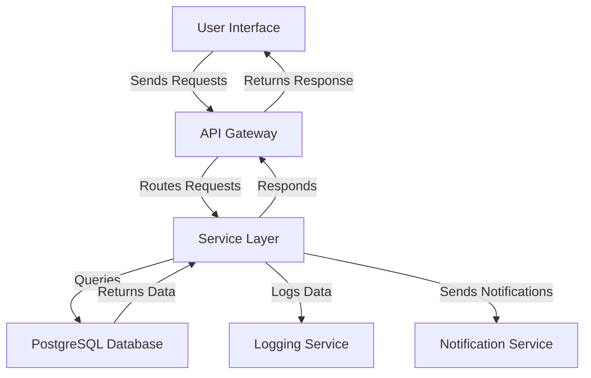

# JSONB Patterns — PostgreSQL

## Overview and scope

The purpose of this document is to establish standards and best practices for using JSONB data types in PostgreSQL within the Xentic platform. This standard aims to ensure consistency, maintainability, and performance across all services that utilize PostgreSQL databases.

### Audience

This document is intended for:

- Database Administrators (DBAs)
- Software Engineers
- Data Engineers
- Architects

### Scope

This standard covers:

- Best practices for storing and querying JSONB data in PostgreSQL.
- Guidelines for schema design involving JSONB.
- Performance considerations when using JSONB.
- Examples of configuration, SQL queries, and code implementations.

### Non-goals

This document does NOT cover:

- General PostgreSQL usage beyond JSONB.
- Other data types or database systems.
- Specific application logic or business rules.

### Glossary

| Term       | Definition                                                                 |
|------------|-----------------------------------------------------------------------------|
| JSONB      | A binary representation of JSON data in PostgreSQL that supports indexing. |
| Schema     | The structure that defines the organization of data in a database.        |
| Indexing   | The process of creating a data structure that improves the speed of data retrieval. |

### How this standard fits the Xentic platform

The Xentic platform is built on a microservices architecture where each service may require flexible data storage solutions. JSONB provides the ability to store semi-structured data, making it suitable for various use cases such as configuration settings, user preferences, and other dynamic data types. Adhering to these standards will:

- Enhance interoperability between services.
- Promote efficient data retrieval and manipulation.
- Ensure that all teams are aligned in their approach to using JSONB.

### Example Configuration

Below is an example of how to configure a PostgreSQL table to utilize JSONB:

```sql
CREATE TABLE user_preferences (
    user_id SERIAL PRIMARY KEY,
    preferences JSONB NOT NULL
);
```

### Example Query

To query JSONB data, use the following SQL syntax:

```sql
SELECT preferences->>'theme' AS theme
FROM user_preferences
WHERE user_id = 1;
```

By following these guidelines, teams at Xentic will be better equipped to leverage JSONB effectively, ensuring high performance and maintainability in their applications.

## Standards and policies

1. **MUST** use the `JSONB` data type for storing JSON data in PostgreSQL. This ensures efficient storage and indexing capabilities.
   
2. **MUST NOT** use `JSON` data type for any new implementations. The `JSONB` type provides better performance for querying and indexing.

3. **MUST** define a clear schema for the JSONB structure within the application code. This can be achieved by using validation libraries to enforce structure.

   Example of a JSONB schema definition in a service configuration:
   ```yaml
   userPreferencesSchema:
     type: object
     properties:
       theme:
         type: string
       notifications:
         type: object
         properties:
           email:
             type: boolean
           sms:
             type: boolean
   ```

4. **SHOULD** create indexes on frequently queried fields within the JSONB data to enhance performance. Use GIN indexes for optimal query performance.

   Example of creating a GIN index:
   ```sql
   CREATE INDEX idx_preferences_theme ON user_preferences USING GIN (preferences jsonb_path_ops);
   ```

5. **MUST** avoid nesting JSONB objects deeper than three levels to maintain query performance and readability.

6. **SHOULD** use the `jsonb_set` function to update specific keys within a JSONB column instead of replacing the entire object. This approach minimizes data changes and improves performance.

   Example of updating a JSONB field:
   ```sql
   UPDATE user_preferences
   SET preferences = jsonb_set(preferences, '{theme}', '"dark"')
   WHERE user_id = 1;
   ```

7. **MUST NOT** store large binary data directly within JSONB fields. Instead, store such data in appropriate binary columns or external storage solutions.

8. **SHOULD** document the structure and purpose of JSONB fields in service documentation to ensure clarity for future developers.

9. **MUST** use appropriate data types for keys and values within JSONB to avoid unnecessary type casting during queries.

10. **SHOULD** regularly review and refactor JSONB structures as application requirements evolve to ensure they remain efficient and relevant.

11. **MUST NOT** expose raw JSONB data directly to clients. Always transform and validate data before sending it to ensure security and integrity.

12. **SHOULD** utilize PostgreSQL's built-in functions for JSONB manipulation (e.g., `jsonb_each`, `jsonb_array_elements`) to perform operations on JSONB data efficiently.

   Example of using `jsonb_each`:
   ```sql
   SELECT key, value
   FROM jsonb_each(preferences)
   WHERE user_id = 1;
   ```

13. **MUST** ensure that all JSONB queries are optimized to prevent performance degradation, especially in high-traffic services.

14. **SHOULD** leverage PostgreSQL's JSONB operators (e.g., `@>`, `->`, `->>`) for efficient querying and manipulation of JSONB data.

15. **MUST NOT** hard-code JSONB structures in application code. Instead, define them in configuration files or schemas to promote flexibility and maintainability.

By adhering to these standards and policies, Xentic teams will ensure that the use of JSONB in PostgreSQL is effective, maintainable, and aligned with the overall architecture of the platform.

## Architecture and design

To effectively utilize JSONB in PostgreSQL, a well-defined architecture is essential. This section outlines the component diagram, data flows, integration points, and failure domains relevant to the use of JSONB.

### Component Diagram



### Data Flows

1. **User Interaction**: Users interact with the application through the User Interface (UI), triggering requests.
2. **API Gateway**: The API Gateway receives requests and routes them to the appropriate service based on the endpoint.
3. **Service Layer**: The service layer processes the request, which may involve querying JSONB data from the PostgreSQL database.
4. **Database Interaction**: The service queries the database using SQL commands to retrieve or manipulate JSONB data.
5. **Response Handling**: The service prepares the response and sends it back through the API Gateway to the User Interface.
6. **Logging and Notifications**: The service logs relevant data for monitoring and sends notifications to users or other services as needed.

### Integration Points

- **API Gateway**: Integrates with multiple services, providing a single entry point for all client requests.
- **PostgreSQL Database**: Acts as the central data store for all services, utilizing JSONB for flexible data storage.
- **Logging Service**: Captures logs for auditing and monitoring purposes, ensuring that all interactions with JSONB data are tracked.
- **Notification Service**: Sends alerts or messages based on changes in JSONB data, ensuring users are informed of relevant updates.

### Failure Domains

1. **Database Failures**: If the PostgreSQL database becomes unavailable, all services relying on JSONB data will be affected. Implementing replication and failover strategies is critical.
2. **Service Layer Issues**: Any failure in the service layer may prevent data from being processed correctly. Robust error handling and retries should be implemented.
3. **API Gateway Downtime**: If the API Gateway is down, no requests can be processed. Load balancing and redundancy should be utilized to mitigate this risk.
4. **Logging and Notification Services**: Failures in these services may lead to loss of important logs or notifications. Ensure these services are independently scalable and monitored.

### Example SQL for Data Manipulation

To demonstrate the integration of JSONB within the architecture, here are examples of SQL queries for common operations:

**Insert JSONB Data:**

```sql
INSERT INTO user_preferences (user_id, preferences)
VALUES (1, '{"theme": "light", "notifications": {"email": true, "sms": false}}');
```

**Update JSONB Data:**

```sql
UPDATE user_preferences
SET preferences = jsonb_set(preferences, '{notifications,email}', 'false')
WHERE user_id = 1;
```

**Select JSONB Data:**

```sql
SELECT preferences->'notifications' AS notifications
FROM user_preferences
WHERE user_id = 1;
```

### Conclusion

By adhering to the outlined architecture and design principles, Xentic can ensure that the integration of JSONB within PostgreSQL is robust, scalable, and maintainable. This foundation will support the dynamic needs of the platform while promoting best practices across all services.

## Configuration reference

### application.yml Example

The following is an example of how to configure your application to connect to a PostgreSQL database using JSONB:

```yaml
spring:
  datasource:
    url: jdbc:postgresql://db.internal.xentic.io:5432/xentic_db
    username: xentic_user
    password: secure_password
    driver-class-name: org.postgresql.Driver
  jpa:
    hibernate:
      ddl-auto: update
    show-sql: true
    properties:
      hibernate:
        dialect: org.hibernate.dialect.PostgreSQLDialect
```

### Terraform Configuration

The following Terraform code snippet demonstrates how to provision a PostgreSQL database instance with JSONB support:

```hcl
resource "aws_db_instance" "xentic_db" {
  allocated_storage    = 20
  storage_type       = "gp2"
  engine             = "postgres"
  engine_version     = "14.0"
  instance_class     = "db.t3.micro"
  name               = "xentic_db"
  username           = "xentic_user"
  password           = "secure_password"
  db_subnet_group_name = aws_db_subnet_group.xentic_subnet_group.name
  vpc_security_group_ids = [aws_security_group.xentic_sg.id]
  skip_final_snapshot = true
}
```

### Environment Variables

For security and flexibility, environment variables should be used to configure sensitive information. Below is a table outlining the recommended environment variables for PostgreSQL configuration:

| Variable Name          | Default Value                | Production Value               |
|------------------------|------------------------------|--------------------------------|
| `DB_URL`               | `jdbc:postgresql://localhost:5432/xentic_db` | `jdbc:postgresql://db.internal.xentic.io:5432/xentic_db` |
| `DB_USERNAME`          | `xentic_user`                | `xentic_user`                 |
| `DB_PASSWORD`          | `secure_password`            | `secure_production_password`  |
| `DB_DRIVER_CLASS_NAME` | `org.postgresql.Driver`      | `org.postgresql.Driver`       |

### Connection Pooling Configuration

To optimize database connections, configure connection pooling in your application. Below is an example configuration for HikariCP:

```yaml
spring:
  datasource:
    hikari:
      maximum-pool-size: 10
      minimum-idle: 2
      idle-timeout: 30000
      connection-timeout: 20000
```

### JSONB Table Creation Example

Here is a SQL example for creating a table that utilizes JSONB:

```sql
CREATE TABLE user_profiles (
    user_id SERIAL PRIMARY KEY,
    profile_data JSONB NOT NULL
);
```

### Default JSONB Structure

When inserting data into the JSONB column, ensure that the structure is well-defined. Below is an example of a default JSONB structure:

```json
{
  "theme": "light",
  "notifications": {
    "email": true,
    "sms": false
  },
  "preferences": {
    "language": "en",
    "timezone": "UTC"
  }
}
```

### Example of Inserting JSONB Data

To insert data into the `user_profiles` table, use the following SQL command:

```sql
INSERT INTO user_profiles (user_id, profile_data)
VALUES (1, '{"theme": "dark", "notifications": {"email": true, "sms": true}, "preferences": {"language": "en", "timezone": "UTC"}}');
```

### Example of Updating JSONB Data

To update specific fields in the JSONB column, use the following SQL command:

```sql
UPDATE user_profiles
SET profile_data = jsonb_set(profile_data, '{theme}', '"dark"')
WHERE user_id = 1;
```

By following the above configuration guidelines and examples, Xentic teams can ensure a consistent and secure setup for utilizing JSONB in PostgreSQL across all services.

## Implementation guide

To effectively implement JSONB in PostgreSQL, follow these step-by-step guidelines with code examples that demonstrate how to create, read, update, and delete JSONB data.

### Step 1: Create the JSONB Table

Begin by creating a table that includes a JSONB column. This example creates a `user_profiles` table:

```sql
CREATE TABLE user_profiles (
    user_id SERIAL PRIMARY KEY,
    profile_data JSONB NOT NULL
);
```

### Step 2: Insert JSONB Data

Insert sample data into the `user_profiles` table. Use the following SQL command to add a new user profile:

```sql
INSERT INTO user_profiles (user_id, profile_data)
VALUES (1, '{"theme": "light", "notifications": {"email": true, "sms": false}, "preferences": {"language": "en", "timezone": "UTC"}}');
```

### Step 3: Query JSONB Data

To retrieve specific information from the JSONB column, use the following SQL command:

```sql
SELECT profile_data->'theme' AS theme,
       profile_data->'notifications' AS notifications
FROM user_profiles
WHERE user_id = 1;
```

### Step 4: Update JSONB Data

To update specific fields within the JSONB column, utilize the `jsonb_set` function. The following command updates the theme for a user:

```sql
UPDATE user_profiles
SET profile_data = jsonb_set(profile_data, '{theme}', '"dark"')
WHERE user_id = 1;
```

### Step 5: Delete JSONB Data

To remove a user profile from the table, use the following SQL command:

```sql
DELETE FROM user_profiles
WHERE user_id = 1;
```

### Step 6: Using JSONB Functions

PostgreSQL provides several functions for manipulating JSONB data. Here are some useful examples:

- **Check if a JSONB object contains a specific key/value:**

```sql
SELECT *
FROM user_profiles
WHERE profile_data @> '{"notifications": {"email": true}}';
```

- **Extract all keys and values from a JSONB object:**

```sql
SELECT key, value
FROM jsonb_each(profile_data)
WHERE user_id = 1;
```

### Step 7: Indexing JSONB Data

To improve performance, especially for large datasets, create an index on the JSONB column. This example creates a GIN index:

```sql
CREATE INDEX idxgin_profile_data ON user_profiles USING GIN (profile_data);
```

### Step 8: Configuration in Spring Boot

In your Spring Boot application, ensure that the PostgreSQL datasource is configured properly in the `application.yml` file:

```yaml
spring:
  datasource:
    url: jdbc:postgresql://db.internal.xentic.io:5432/xentic_db
    username: xentic_user
    password: secure_password
    driver-class-name: org.postgresql.Driver
  jpa:
    hibernate:
      ddl-auto: update
    show-sql: true
    properties:
      hibernate:
        dialect: org.hibernate.dialect.PostgreSQLDialect
```

### Step 9: Handling JSONB in Java

When working with JSONB data in your Java application, use the following example to map JSONB data to a Java class:

```java
package com.xentic.user;

import com.fasterxml.jackson.databind.JsonNode;
import javax.persistence.*;

@Entity
@Table(name = "user_profiles")
public class UserProfile {

    @Id
    @GeneratedValue(strategy = GenerationType.IDENTITY)
    private Long userId;

    @Column(columnDefinition = "jsonb")
    private JsonNode profileData;

    // Getters and Setters
    public Long getUserId() {
        return userId;
    }

    public void setUserId(Long userId) {
        this.userId = userId;
    }

    public JsonNode getProfileData() {
        return profileData;
    }

    public void setProfileData(JsonNode profileData) {
        this.profileData = profileData;
    }
}
```

### Step 10: Repository for JSONB Operations

Create a repository interface for performing CRUD operations on the `user_profiles` table:

```java
package com.xentic.user;

import org.springframework.data.jpa.repository.JpaRepository;
import org.springframework.stereotype.Repository;

@Repository
public interface UserProfileRepository extends JpaRepository<UserProfile, Long> {
    UserProfile findByUserId(Long userId);
}
```

### Conclusion

By following these implementation steps, Xentic teams can effectively utilize JSONB in PostgreSQL, ensuring robust data management practices. This guide covers the essential operations and configurations necessary for integrating JSONB into your applications, promoting maintainability and performance across services.

## Security requirements

To ensure the security of applications utilizing JSONB in PostgreSQL, a comprehensive threat model must be established. This model should address potential vulnerabilities and outline necessary authentication, authorization, secrets management, input validation, and audit logging practices.

### Threat Model Summary

| Threat Type               | Description                                         | Mitigation Strategy                                    |
|---------------------------|-----------------------------------------------------|-------------------------------------------------------|
| SQL Injection             | Malicious SQL code can be injected through user inputs. | Use prepared statements and parameterized queries.    |
| Data Breach               | Unauthorized access to sensitive data stored in JSONB. | Implement strict access controls and encryption.      |
| Denial of Service (DoS)   | Overloading the database with excessive requests.   | Rate limiting and monitoring of database queries.     |
| Data Corruption           | Unintended modifications to JSONB data.            | Use transactions and validation checks.               |
| Insecure Secrets          | Exposure of sensitive information such as passwords. | Utilize environment variables and secret management tools. |

### Authentication and Authorization

- **Authentication**: All services must authenticate users before providing access to the database. Use OAuth 2.0 or JWT for token-based authentication.
- **Authorization**: Implement role-based access control (RBAC) to restrict access to database operations based on user roles.

Example of a role-based access control configuration in `application.yml`:

```yaml
security:
  oauth2:
    resource:
      token-info-uri: https://auth.internal.xentic.io/oauth/check_token
```

### Secrets Management

- **Environment Variables**: Sensitive information such as database credentials must be stored in environment variables instead of hard-coded in the application. 
- **Secret Management Tools**: Utilize tools like HashiCorp Vault or AWS Secrets Manager for managing sensitive data.

Example of using environment variables for database configuration:

```yaml
spring:
  datasource:
    url: ${DB_URL}
    username: ${DB_USERNAME}
    password: ${DB_PASSWORD}
```

### Input Validation

- **Sanitize Inputs**: All user inputs must be validated and sanitized to prevent SQL injection and other attacks.
- **JSON Schema Validation**: Use JSON Schema to validate the structure and content of JSONB data before inserting it into the database.

Example of a JSON schema for profile data:

```json
{
  "$schema": "http://json-schema.org/draft-07/schema#",
  "type": "object",
  "properties": {
    "theme": { "type": "string" },
    "notifications": {
      "type": "object",
      "properties": {
        "email": { "type": "boolean" },
        "sms": { "type": "boolean" }
      },
      "required": ["email", "sms"]
    },
    "preferences": {
      "type": "object",
      "properties": {
        "language": { "type": "string" },
        "timezone": { "type": "string" }
      },
      "required": ["language", "timezone"]
    }
  },
  "required": ["theme", "notifications", "preferences"]
}
```

### Audit Logging

- **Database Activity Monitoring**: Implement logging of all database operations, especially those involving JSONB data. This can help in identifying unauthorized access and changes.
- **Log Sensitive Actions**: Log actions such as data creation, updates, and deletions, along with the user ID and timestamp.

Example of enabling logging in PostgreSQL:

```sql
ALTER SYSTEM SET log_statement = 'all';
ALTER SYSTEM SET log_directory = 'pg_log';
ALTER SYSTEM SET log_filename = 'postgresql-%Y-%m-%d_%H%M%S.log';
```

### Conclusion

By adhering to these security requirements, Xentic can ensure that its applications utilizing JSONB in PostgreSQL are robust against potential threats. Implementing strong authentication and authorization measures, managing secrets effectively, validating inputs, and maintaining comprehensive audit logs are essential practices for safeguarding data integrity and confidentiality.

## Testing strategy

To ensure the reliability and correctness of applications utilizing JSONB in PostgreSQL, a comprehensive testing strategy must be implemented. This strategy should encompass unit tests, integration tests, and contract tests. Coverage targets should aim for a minimum of 80% for unit tests and 70% for integration tests.

### Unit Tests

Unit tests should focus on individual components and methods, verifying their functionality in isolation. For JSONB-related operations, use mocking frameworks like Mockito to simulate database interactions.

#### Example Unit Test Class

```java
package com.xentic.user;

import static org.mockito.Mockito.*;
import static org.junit.jupiter.api.Assertions.*;

import com.fasterxml.jackson.databind.JsonNode;
import org.junit.jupiter.api.BeforeEach;
import org.junit.jupiter.api.Test;
import org.mockito.InjectMocks;
import org.mockito.Mock;
import org.mockito.MockitoAnnotations;

public class UserProfileServiceTest {

    @InjectMocks
    private UserProfileService userProfileService;

    @Mock
    private UserProfileRepository userProfileRepository;

    private UserProfile userProfile;

    @BeforeEach
    public void setUp() {
        MockitoAnnotations.openMocks(this);
        userProfile = new UserProfile();
        userProfile.setUserId(1L);
        userProfile.setProfileData(/* Mocked JsonNode */);
    }

    @Test
    public void testFindByUserId() {
        when(userProfileRepository.findByUserId(1L)).thenReturn(userProfile);
        
        UserProfile result = userProfileService.findByUserId(1L);
        
        assertEquals(1L, result.getUserId());
        verify(userProfileRepository).findByUserId(1L);
    }
}
```

### Integration Tests

Integration tests should validate the interaction between components and the database. Use an in-memory database like H2 for testing purposes to avoid impacting production data.

#### Example Integration Test Class

```java
package com.xentic.user;

import static org.assertj.core.api.Assertions.assertThat;

import org.junit.jupiter.api.Test;
import org.springframework.beans.factory.annotation.Autowired;
import org.springframework.boot.test.autoconfigure.orm.jpa.DataJpaTest;

@DataJpaTest
public class UserProfileRepositoryIntegrationTest {

    @Autowired
    private UserProfileRepository userProfileRepository;

    @Test
    public void testSaveAndFindUserProfile() {
        UserProfile userProfile = new UserProfile();
        userProfile.setUserId(1L);
        userProfile.setProfileData(/* Mocked JsonNode */);
        
        userProfileRepository.save(userProfile);
        
        UserProfile foundProfile = userProfileRepository.findByUserId(1L);
        assertThat(foundProfile).isNotNull();
        assertThat(foundProfile.getUserId()).isEqualTo(1L);
    }
}
```

### Contract Tests

Contract tests ensure that the API interactions between services conform to specified contracts. Use tools like Pact to define and verify contracts between services that consume or produce JSONB data.

#### Example Contract Test Configuration

```yaml
# pact-provider.yml
provider:
  name: UserProfileService
  port: 8080
consumer:
  name: UserProfileClient
pact:
  interactions:
    - description: A request for user profile
      request:
        method: GET
        path: /user/1
      response:
        status: 200
        body:
          userId: 1
          profileData:
            theme: "light"
            notifications:
              email: true
              sms: false
```

### Coverage Targets

| Test Type          | Coverage Target |
|--------------------|------------------|
| Unit Tests         | 80%              |
| Integration Tests   | 70%              |
| Contract Tests     | 100% (all interactions must be covered) |

### Conclusion

By implementing a robust testing strategy that includes unit, integration, and contract tests, Xentic can ensure the reliability of applications utilizing JSONB in PostgreSQL. Adhering to coverage targets will help maintain high code quality and facilitate easier maintenance and scalability of services.

## Observability and operations

To ensure the reliability and performance of applications utilizing JSONB in PostgreSQL, it is imperative to implement a comprehensive observability and operations strategy. This strategy should encompass metrics, logs, traces, dashboards, alerts, and service level objectives (SLOs). 

### Metrics

- **Database Performance Metrics**: Monitor key performance indicators (KPIs) such as query execution time, connection counts, and cache hit ratios.
- **JSONB Specific Metrics**: Track the size of JSONB columns, frequency of updates, and the number of JSONB-related queries.

Example of Prometheus metrics configuration:

```yaml
prometheus:
  scrape_configs:
    - job_name: 'postgresql'
      static_configs:
        - targets: ['localhost:9090']
```

### Logs

- **Structured Logging**: Implement structured logging for all database interactions, particularly those involving JSONB data. This aids in parsing and analyzing logs effectively.
- **Log Levels**: Use appropriate log levels (INFO, DEBUG, ERROR) to ensure relevant information is captured without overwhelming the log files.

Example of a logging configuration in `logback-spring.xml`:

```xml
<configuration>
    <appender name="FILE" class="ch.qos.logback.core.FileAppender">
        <file>logs/application.log</file>
        <encoder>
            <pattern>%d{yyyy-MM-dd HH:mm:ss} %-5level %logger{36} - %msg%n</pattern>
        </encoder>
    </appender>
    <root level="INFO">
        <appender-ref ref="FILE" />
    </root>
</configuration>
```

### Traces

- **Distributed Tracing**: Implement distributed tracing using tools like OpenTelemetry to trace requests across microservices and identify bottlenecks in the database interactions.
- **Trace Context**: Ensure that trace context is propagated through all layers of the application.

Example of a trace configuration in `application.yml`:

```yaml
spring:
  sleuth:
    sampling:
      percentage: 100
```

### Dashboards

- **Visualization Tools**: Utilize tools like Grafana or Kibana to create dashboards that visualize database performance metrics and logs.
- **Key Dashboards**: Create dashboards for:
  - Query performance over time
  - JSONB data size trends
  - Error rates for database operations

### Alerts

- **Alerting Rules**: Define alerting rules based on performance metrics and error rates. Alerts should notify the on-call engineer for immediate action.
- **Critical Alerts**: Set up alerts for:
  - High query execution times
  - Increased error rates
  - Unusual spikes in JSONB data size

Example of an alerting rule in Prometheus:

```yaml
groups:
  - name: database-alerts
    rules:
      - alert: HighQueryExecutionTime
        expr: avg(rate(pg_stat_statements_query_time_seconds[5m])) > 1
        for: 5m
        labels:
          severity: critical
        annotations:
          summary: "High query execution time detected"
          description: "Query execution time has exceeded 1 second for the last 5 minutes."
```

### Service Level Objectives (SLOs)

- **Define SLOs**: Establish SLOs for database performance, such as 95th percentile query execution time and availability.
- **Monitoring SLOs**: Continuously monitor SLOs and report on their status to ensure compliance.

Example of SLO tracking in a dashboard:

| SLO Description                     | Target   | Current Status |
|-------------------------------------|----------|-----------------|
| 95th Percentile Query Execution Time | < 200ms  | 150ms           |
| Database Availability                | 99.9%    | 99.95%          |

### On-Call Runbook Steps

In the event of an incident, the on-call engineer should follow these steps:

1. **Identify the Issue**: Check monitoring dashboards for alerts and logs related to the incident.
2. **Assess Impact**: Determine the extent of the impact on users and services.
3. **Investigate**: Use traces and logs to identify the root cause of the issue.
4. **Mitigate**: Implement a temporary fix if possible, such as scaling the database or optimizing queries.
5. **Communicate**: Notify stakeholders about the incident and provide updates on the resolution status.
6. **Document**: After resolving the incident, document the findings and update the runbook with lessons learned.

By implementing these observability and operational practices, Xentic can ensure that its applications utilizing JSONB in PostgreSQL are effectively monitored, maintained, and optimized for performance and reliability.

## Migration and versioning

To maintain the integrity and performance of applications using JSONB in PostgreSQL, a robust migration and versioning strategy is essential. This section outlines the upgrade paths, deprecation policies, backward compatibility requirements, and rollback procedures that must be followed.

### Upgrade Paths

1. **Semantic Versioning**: All database schema changes must follow semantic versioning (MAJOR.MINOR.PATCH). Increment the version number according to the type of changes made:
   - **MAJOR**: Incompatible changes that require migration.
   - **MINOR**: Backward-compatible changes, such as adding new fields.
   - **PATCH**: Backward-compatible bug fixes.

2. **Migration Scripts**: Use migration tools like Flyway or Liquibase to manage schema changes. Each migration script must be versioned and stored in the source control repository.

#### Example Flyway Migration Script

```sql
-- V1__Create_user_profile.sql
CREATE TABLE user_profile (
    user_id BIGINT PRIMARY KEY,
    profile_data JSONB NOT NULL
);
```

3. **Changelog**: Maintain a changelog that documents all migrations, including the version number, description, and date applied.

| Version | Description                     | Date       |
|---------|---------------------------------|------------|
| 1.0     | Initial creation of user_profile| 2023-01-01 |
| 1.1     | Added last_updated field        | 2023-06-15 |

### Deprecation Policy

1. **Deprecation Notices**: When a feature or column is deprecated, a notice must be provided in the documentation and communicated to all stakeholders at least one release cycle in advance.

2. **Grace Period**: Deprecated features should remain available for at least two release cycles before removal. During this time, users should be encouraged to migrate to the new implementation.

3. **Final Removal**: After the grace period, the deprecated feature must be removed in a major version update, and a migration script should be provided to assist users in transitioning.

### Backward Compatibility

1. **Non-Destructive Changes**: All changes to JSONB structures must be non-destructive. This includes:
   - Adding new keys or values
   - Changing data types of existing keys (only if it maintains backward compatibility)

2. **Default Values**: When adding new fields to JSONB, provide sensible default values to ensure that existing records remain valid.

#### Example JSONB Update with Default Values

```sql
UPDATE user_profile
SET profile_data = jsonb_set(profile_data, '{last_updated}', to_jsonb(NOW()), true)
WHERE profile_data ? 'last_updated' = false;
```

3. **Testing**: Ensure that all updates maintain backward compatibility through comprehensive testing, including unit and integration tests.

### Rollback Procedures

1. **Rollback Scripts**: Each migration must include a corresponding rollback script that can revert the changes made by the migration.

#### Example Rollback Script

```sql
-- V2__Add_last_updated_field.sql
ALTER TABLE user_profile DROP COLUMN last_updated;
```

2. **Version Control**: All migration and rollback scripts must be version-controlled to ensure traceability and ease of access.

3. **Testing Rollbacks**: Regularly test rollback procedures in a staging environment to ensure they function correctly and do not introduce additional issues.

### Summary

By adhering to these guidelines for migration and versioning, Xentic can ensure that applications utilizing JSONB in PostgreSQL are robust, maintainable, and capable of evolving without disrupting existing functionality. This approach will facilitate smoother upgrades, minimize downtime, and enhance overall system reliability.

## FAQ, anti-patterns, and checklists

### FAQ

1. **What is JSONB in PostgreSQL?**
   - JSONB is a binary format for storing JSON data in PostgreSQL, allowing for efficient storage and querying.

2. **When should I use JSONB instead of traditional relational columns?**
   - Use JSONB when dealing with semi-structured data or when the schema is likely to change frequently.

3. **Can I index JSONB columns?**
   - Yes, you can create GIN (Generalized Inverted Index) indexes on JSONB columns to improve query performance.

4. **What are the performance implications of using JSONB?**
   - JSONB can provide faster read performance for complex queries, but may incur overhead during updates due to its binary format.

5. **How do I query JSONB data?**
   - Use the `->`, `->>`, and `@>` operators to access and filter JSONB data.

   Example:
   ```sql
   SELECT * FROM user_profile WHERE profile_data @> '{"age": 30}';
   ```

6. **Can I store arrays in JSONB?**
   - Yes, JSONB supports arrays, allowing you to store lists of values.

7. **What are the limitations of JSONB?**
   - JSONB does not support certain data types like functions or complex types, and it may require more storage space than plain JSON.

8. **How do I update JSONB fields?**
   - Use the `jsonb_set` function to update specific keys within a JSONB column.

   Example:
   ```sql
   UPDATE user_profile
   SET profile_data = jsonb_set(profile_data, '{age}', '31')
   WHERE user_id = 1;
   ```

9. **Is JSONB suitable for all applications?**
   - No, JSONB is best for applications that require flexibility in data structure. For strictly structured data, traditional relational columns are preferred.

10. **How do I handle migrations for JSONB fields?**
    - Use structured migration scripts with version control to manage changes to JSONB structures, ensuring backward compatibility.

### Anti-Patterns

| Anti-Pattern                        | Description                                                                                      |
|-------------------------------------|--------------------------------------------------------------------------------------------------|
| Overusing JSONB for All Data       | Using JSONB for all data types can lead to performance issues and complicate queries.          |
| Not Indexing JSONB Columns          | Failing to create indexes on frequently queried JSONB columns can result in slow query performance. |
| Storing Large JSONB Objects         | Storing excessively large JSONB objects can lead to increased I/O and slower performance.       |
| Ignoring Data Validation            | Not validating the structure of JSONB data can lead to inconsistencies and data integrity issues.|
| Frequent Updates to JSONB Fields    | Regularly updating JSONB fields can degrade performance; consider restructuring data if necessary. |

### Pre-Merge Checklist

- [ ] Ensure all JSONB queries are optimized and indexed where necessary.
- [ ] Validate JSONB data structure against the schema.
- [ ] Review migration scripts for backward compatibility.
- [ ] Conduct performance testing on JSONB-related queries.
- [ ] Update documentation to reflect changes in JSONB usage.

### Production Checklist

- [ ] Monitor JSONB query performance metrics post-deployment.
- [ ] Ensure alerting is set up for JSONB-related errors.
- [ ] Review logs for any anomalies related to JSONB data handling.
- [ ] Confirm successful execution of migration scripts in production.
- [ ] Communicate changes to the team and stakeholders.
