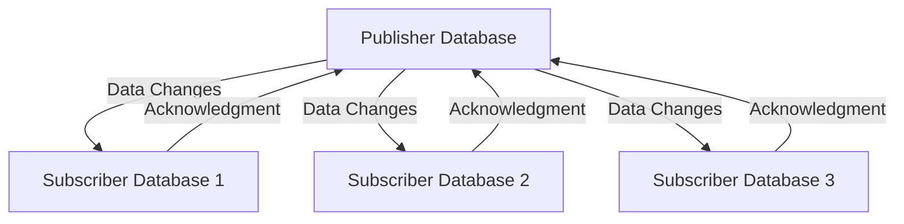

# Logical Replication — PostgreSQL

## Overview and scope

The purpose of this document is to establish standards and guidelines for implementing logical replication in PostgreSQL within the Xentic platform. Logical replication allows for selective data replication between PostgreSQL databases, enabling more flexible data distribution strategies that align with Xentic's microservices architecture.

### Audience

This document is intended for:

- Database Administrators (DBAs)
- Software Engineers
- DevOps Engineers
- Technical Architects

### Scope

This standard covers:

- Configuration of logical replication in PostgreSQL
- Best practices for setting up replication between databases
- Monitoring and maintenance of logical replication setups
- Security considerations for data replication

### Non-goals

This document does NOT cover:

- Physical replication configurations
- Replication for non-PostgreSQL databases
- Detailed troubleshooting for PostgreSQL issues outside of logical replication

### Glossary

| Term                | Definition                                                                 |
|---------------------|----------------------------------------------------------------------------|
| Logical Replication  | A method of replicating data that allows for selective replication of tables. |
| Publisher           | The database that sends data changes to subscribers.                       |
| Subscriber          | The database that receives data changes from the publisher.                |
| WAL                 | Write-Ahead Logging, a method used by PostgreSQL to ensure data integrity. |

### How This Standard Fits the Xentic Platform

At Xentic, our architecture is built around microservices that require efficient and reliable data sharing mechanisms. Logical replication allows services to maintain their own databases while still being able to share data as necessary. This standard ensures that all teams adhere to a consistent approach when implementing logical replication, thereby improving maintainability, scalability, and security of our data infrastructure.

### Configuration Example

To set up logical replication, the following configuration steps MUST be followed:

1. **Enable Logical Replication**: Modify the `postgresql.conf` file on the publisher.

   ```properties
   wal_level = logical
   max_replication_slots = 4
   max_wal_senders = 4
   ```

2. **Create a Publication**: Execute the following SQL command on the publisher database.

   ```sql
   CREATE PUBLICATION my_publication FOR TABLE my_table;
   ```

3. **Create a Subscription**: Execute the following SQL command on the subscriber database.

   ```sql
   CREATE SUBSCRIPTION my_subscription
   CONNECTION 'host=publisher_host dbname=publisher_db user=replication_user password=your_password'
   PUBLICATION my_publication;
   ```

### Best Practices

- **Monitoring**: Regularly monitor replication lag using the following SQL command:

  ```sql
  SELECT * FROM pg_stat_subscription;
  ```

- **Security**: Use SSL for connections between publisher and subscriber to protect data in transit.

- **Testing**: Always test replication setups in a staging environment before deploying to production.

By adhering to these standards, Xentic ensures a robust and efficient approach to logical replication, enhancing our overall data management strategy.

## Standards and policies

1. **Logical Replication Configuration**: 
   - All logical replication configurations MUST be documented in the project's README file located in the root directory of the service repository under `com.xentic.<service>`.
   - Configuration files MUST be version-controlled and stored in the repository.

2. **WAL Level**:
   - The `wal_level` in `postgresql.conf` MUST be set to `logical` on the publisher database to enable logical replication.

3. **Replication Slots**:
   - The number of replication slots MUST be defined based on the expected number of subscribers. The `max_replication_slots` parameter MUST NOT be set lower than the number of active subscribers.

4. **WAL Senders**:
   - The `max_wal_senders` parameter MUST be configured to accommodate all potential connections from subscribers. This value MUST be equal to or greater than the number of active subscriptions.

5. **Publications**:
   - Publications MUST be created for each table that requires replication. The naming convention for publications MUST follow the pattern `pub_<table_name>`.

6. **Subscriptions**:
   - Subscriptions MUST be created with a secure connection string that includes SSL parameters to ensure data security. The connection string MUST include the `sslmode=require` option.

7. **Monitoring**:
   - Monitoring of replication status MUST be implemented using the `pg_stat_subscription` view. Alerts MUST be configured for replication lag exceeding 5 minutes.

8. **Error Handling**:
   - Error handling for replication failures MUST be implemented in the application logic. Any replication errors MUST be logged and addressed promptly.

9. **Data Integrity**:
   - Data integrity MUST be verified regularly by comparing row counts between publisher and subscriber databases. A SQL script for this comparison MUST be included in the repository.

10. **Backup and Recovery**:
    - Regular backups of both publisher and subscriber databases MUST be scheduled. The backup strategy MUST include point-in-time recovery capabilities.

11. **Security Practices**:
    - All database users involved in replication MUST have the least privilege necessary. The replication user MUST NOT have access to any sensitive data beyond what is required for replication.

12. **Documentation**:
    - All logical replication setups MUST be documented in the internal wiki at [https://docs.internal.xentic.io](https://docs.internal.xentic.io) under the Database section.

13. **Testing**:
    - Logical replication setups MUST be tested in a staging environment before being deployed to production. Testing MUST include failure scenarios to ensure robustness.

14. **Version Compatibility**:
    - Ensure that the PostgreSQL versions on both publisher and subscriber are compatible. Major version upgrades MUST be tested thoroughly in a staging environment before production deployment.

15. **Performance Tuning**:
    - Performance tuning parameters related to replication MUST be reviewed and adjusted based on the load. This includes tuning `max_worker_processes` and `work_mem` as necessary.

16. **Data Types**:
    - Only supported data types for logical replication MUST be used. Unsupported types MUST NOT be included in publications.

17. **Schema Changes**:
    - Any schema changes involving replicated tables MUST be coordinated between publisher and subscriber to avoid replication errors.

18. **Network Configuration**:
    - Network latency between publisher and subscriber MUST be minimized. Any network configurations MUST be documented and reviewed regularly.

By adhering to these standards, Xentic ensures a consistent and reliable approach to logical replication, facilitating effective data sharing across its microservices architecture.

## Architecture and design

The architecture for logical replication in PostgreSQL at Xentic consists of a publisher database that sends changes to one or more subscriber databases. This design allows for selective data replication, which is crucial for microservices that require specific datasets without duplicating entire databases.

### Component Diagram



### Data Flows

1. **Change Capture**: 
   - The publisher captures data changes (INSERT, UPDATE, DELETE) and writes them to the Write-Ahead Log (WAL).
   
2. **Logical Decoding**:
   - The changes are decoded into a format that can be understood by subscribers.

3. **Replication**:
   - Subscribers pull changes from the publisher based on their subscriptions.

4. **Acknowledgment**:
   - Subscribers send acknowledgments back to the publisher to confirm receipt of changes.

### Integration Points

- **Publisher**: 
  - The publisher database must have logical replication enabled and configured with publications for the tables that need to be replicated.

- **Subscriber**: 
  - Each subscriber must create subscriptions that connect to the publisher using secure credentials and SSL.

### Failure Domains

- **Publisher Failures**:
  - If the publisher database fails, subscribers may experience replication lag or data staleness until the publisher is restored.

- **Subscriber Failures**:
  - If a subscriber fails, it must be restored to re-establish the connection with the publisher. Data changes during downtime may require manual intervention to reconcile.

- **Network Failures**:
  - Network issues can lead to replication delays. Monitoring tools MUST be in place to alert on significant replication lag.

### Configuration Example

Below is an example of a typical configuration for logical replication:

#### Publisher Configuration (postgresql.conf)

```properties
# Enable logical replication
wal_level = logical
max_replication_slots = 4
max_wal_senders = 4
```

#### SQL for Creating a Publication

```sql
CREATE PUBLICATION pub_my_table FOR TABLE my_table;
```

#### SQL for Creating a Subscription

```sql
CREATE SUBSCRIPTION sub_my_table
CONNECTION 'host=publisher_host dbname=publisher_db user=replication_user password=your_password sslmode=require'
PUBLICATION pub_my_table;
```

### Monitoring and Maintenance

| Monitoring Aspect   | Description                                      | Tool/Command                                  |
|---------------------|--------------------------------------------------|-----------------------------------------------|
| Replication Lag     | Check if the subscriber is up-to-date           | `SELECT * FROM pg_stat_subscription;`       |
| WAL Usage           | Monitor WAL usage to ensure it does not fill up | `SELECT * FROM pg_stat_wal;`                 |
| Subscription Status  | Verify the status of subscriptions               | `SELECT * FROM pg_subscription;`             |

### Best Practices

- **Use SSL**: Always configure SSL for secure connections between publisher and subscriber.
- **Regular Monitoring**: Implement alerts for replication lag exceeding acceptable thresholds.
- **Backup Strategy**: Ensure that both publisher and subscriber databases are backed up regularly.
- **Testing**: Test replication setups thoroughly in a staging environment before production deployment.
- **Documentation**: Keep all configurations and changes documented in the internal wiki.

By following this architecture and design framework, Xentic can ensure a robust and efficient logical replication strategy that supports its microservices architecture effectively.

## Configuration reference

### application.yml

```yaml
postgresql:
  publisher:
    host: publisher_host
    port: 5432
    database: publisher_db
    user: replication_user
    password: your_password
    sslmode: require
  subscriber:
    host: subscriber_host
    port: 5432
    database: subscriber_db
    user: replication_user
    password: your_password
    sslmode: require
```

### Terraform Configuration

| Resource Type     | Resource Name          | Default Value            | Production Value         |
|-------------------|------------------------|--------------------------|--------------------------|
| `aws_db_instance` | `publisher_db`         | `db.t2.micro`           | `db.m5.large`           |
| `aws_db_instance` | `subscriber_db`        | `db.t2.micro`           | `db.m5.large`           |
| `aws_security_group` | `replication_sg`    | `allow all`             | `allow specific IPs`    |

```hcl
resource "aws_db_instance" "publisher_db" {
  allocated_storage    = 20
  engine             = "postgres"
  instance_class     = "db.m5.large"
  username           = "replication_user"
  password           = "your_password"
  db_subnet_group_name = aws_db_subnet_group.default.name
  vpc_security_group_ids = [aws_security_group.replication_sg.id]
}

resource "aws_db_instance" "subscriber_db" {
  allocated_storage    = 20
  engine             = "postgres"
  instance_class     = "db.m5.large"
  username           = "replication_user"
  password           = "your_password"
  db_subnet_group_name = aws_db_subnet_group.default.name
  vpc_security_group_ids = [aws_security_group.replication_sg.id]
}
```

### Environment Variables

| Variable Name                | Default Value          | Production Value         |
|------------------------------|------------------------|--------------------------|
| `POSTGRES_PUBLISHER_HOST`    | `localhost`            | `publisher_host`         |
| `POSTGRES_PUBLISHER_PORT`    | `5432`                 | `5432`                   |
| `POSTGRES_PUBLISHER_DB`      | `publisher_db`         | `publisher_db`           |
| `POSTGRES_SUBSCRIBER_HOST`   | `localhost`            | `subscriber_host`        |
| `POSTGRES_SUBSCRIBER_PORT`   | `5432`                 | `5432`                   |
| `POSTGRES_SUBSCRIBER_DB`     | `subscriber_db`        | `subscriber_db`          |
| `POSTGRES_USER`              | `replication_user`     | `replication_user`       |
| `POSTGRES_PASSWORD`          | `your_password`        | `your_password`          |

### SQL for Creating Publications and Subscriptions

#### Publication Creation

```sql
CREATE PUBLICATION pub_my_table FOR TABLE my_table;
```

#### Subscription Creation

```sql
CREATE SUBSCRIPTION sub_my_table
CONNECTION 'host=${POSTGRES_PUBLISHER_HOST} dbname=${POSTGRES_PUBLISHER_DB} user=${POSTGRES_USER} password=${POSTGRES_PASSWORD} sslmode=require'
PUBLICATION pub_my_table;
```

### Monitoring Configuration

| Monitoring Aspect   | Default Command                              | Production Command                              |
|---------------------|---------------------------------------------|------------------------------------------------|
| Replication Lag     | `SELECT * FROM pg_stat_subscription;`      | `SELECT * FROM pg_stat_subscription WHERE subid = 'sub_my_table';` |
| WAL Usage           | `SELECT * FROM pg_stat_wal;`               | `SELECT * FROM pg_stat_wal WHERE wal_level = 'logical';` |
| Subscription Status  | `SELECT * FROM pg_subscription;`           | `SELECT * FROM pg_subscription WHERE subname = 'sub_my_table';` |

### Best Practices

- **Configuration Management**: All configuration files MUST be version-controlled.
- **Environment Variables**: Use environment variables for sensitive information such as passwords.
- **Testing**: Replication configurations MUST be tested in a staging environment before production deployment.
- **Documentation**: All changes to configurations MUST be documented in the internal wiki at [https://docs.internal.xentic.io](https://docs.internal.xentic.io).

## Implementation guide

To implement logical replication in PostgreSQL at Xentic, follow these detailed steps. This guide covers the necessary configurations, SQL commands, and code examples to set up a publisher and subscriber environment effectively.

### Step 1: Configure the Publisher

1. **Edit the PostgreSQL Configuration File**  
   Update the `postgresql.conf` file on the publisher database to enable logical replication.

   ```properties
   # Enable logical replication
   wal_level = logical
   max_replication_slots = 4
   max_wal_senders = 4
   ```

2. **Restart PostgreSQL**  
   After making changes, restart the PostgreSQL service to apply the new settings.

   ```bash
   sudo systemctl restart postgresql
   ```

3. **Create a Publication**  
   Use the following SQL command to create a publication for the desired table.

   ```sql
   CREATE PUBLICATION pub_my_table FOR TABLE my_table;
   ```

### Step 2: Configure the Subscriber

1. **Edit the PostgreSQL Configuration File**  
   Ensure that the `postgresql.conf` file on the subscriber database is configured to allow connections from the publisher.

   ```properties
   # Allow replication connections
   listen_addresses = '*'
   ```

2. **Restart PostgreSQL**  
   Restart the PostgreSQL service on the subscriber database.

   ```bash
   sudo systemctl restart postgresql
   ```

3. **Create a Subscription**  
   Execute the following SQL command to create a subscription on the subscriber database.

   ```sql
   CREATE SUBSCRIPTION sub_my_table
   CONNECTION 'host=publisher_host dbname=publisher_db user=replication_user password=your_password sslmode=require'
   PUBLICATION pub_my_table;
   ```

### Step 3: Verify Replication Setup

1. **Check Subscription Status**  
   Use the following SQL command to verify that the subscription is active.

   ```sql
   SELECT * FROM pg_stat_subscription;
   ```

2. **Monitor Replication Lag**  
   Check the replication lag to ensure the subscriber is up-to-date.

   ```sql
   SELECT * FROM pg_stat_subscription WHERE subname = 'sub_my_table';
   ```

### Step 4: Implement Monitoring

Set up monitoring for both the publisher and subscriber databases to track replication health.

#### Monitoring Queries

| Monitoring Aspect   | SQL Command                                      |
|---------------------|--------------------------------------------------|
| Replication Lag     | `SELECT * FROM pg_stat_subscription;`           |
| WAL Usage           | `SELECT * FROM pg_stat_wal;`                    |
| Subscription Status  | `SELECT * FROM pg_subscription;`                |

### Step 5: Error Handling and Maintenance

1. **Handling Failures**  
   In case of publisher failure, subscribers may experience replication lag. Implement alerting mechanisms to notify the engineering team.

2. **Re-establishing Connections**  
   If a subscriber fails, it must be restored, and manual intervention may be needed to reconcile data changes that occurred during downtime.

### Example Code Snippet for Java Service

To facilitate interaction with the PostgreSQL database, create a Java service that manages subscriptions.

```java
package com.xentic.replication;

import org.springframework.beans.factory.annotation.Autowired;
import org.springframework.jdbc.core.JdbcTemplate;
import org.springframework.stereotype.Service;

@Service
public class ReplicationService {

    @Autowired
    private JdbcTemplate jdbcTemplate;

    public void createSubscription() {
        String sql = "CREATE SUBSCRIPTION sub_my_table " +
                     "CONNECTION 'host=publisher_host dbname=publisher_db user=replication_user password=your_password sslmode=require' " +
                     "PUBLICATION pub_my_table;";
        jdbcTemplate.execute(sql);
    }

    public void checkReplicationStatus() {
        String sql = "SELECT * FROM pg_stat_subscription;";
        jdbcTemplate.query(sql, (rs, rowNum) -> {
            // Process result set
            return rs.getString("subname");
        });
    }
}
```

### Summary

By following these steps, Xentic can successfully implement logical replication in PostgreSQL, ensuring efficient data sharing across its microservices. Regular monitoring and maintenance practices are crucial for maintaining the health of the replication setup.

## Security requirements

### Threat Model Summary

To ensure the security of the PostgreSQL logical replication setup, the following threat vectors must be considered:

- **Unauthorized Access**: Attackers may attempt to gain unauthorized access to the publisher or subscriber databases.
- **Data Interception**: Data in transit between the publisher and subscriber could be intercepted by malicious actors.
- **Data Corruption**: Replication processes could be manipulated to corrupt data on the subscriber.
- **Configuration Mismanagement**: Incorrect configurations may expose sensitive information or create vulnerabilities.

### Authentication and Authorization

- **Database User Management**: 
  - A dedicated replication user MUST be created with the least privilege required for replication tasks.
  - The replication user MUST NOT have access to any other databases or tables beyond those necessary for replication.

```sql
CREATE ROLE replication_user WITH LOGIN PASSWORD 'your_secure_password';
GRANT CONNECT ON DATABASE publisher_db TO replication_user;
GRANT USAGE ON SCHEMA public TO replication_user;
GRANT SELECT ON ALL TABLES IN SCHEMA public TO replication_user;
```

- **Connection Security**: 
  - All connections between the publisher and subscriber MUST use SSL to encrypt data in transit.

### Secrets Management

- **Environment Variables**: 
  - Sensitive information such as database passwords MUST be stored in environment variables and NOT hardcoded in application code or configuration files.
  
```yaml
# Example of environment variable usage in a configuration file
database:
  user: ${POSTGRES_USER}
  password: ${POSTGRES_PASSWORD}
```

- **Secret Management Tools**: 
  - Use a dedicated secrets management tool (e.g., HashiCorp Vault, AWS Secrets Manager) to store and retrieve sensitive information securely.

### Input Validation

- **SQL Injection Prevention**: 
  - All SQL commands executed in the application MUST use parameterized queries to prevent SQL injection attacks.

```java
String sql = "SELECT * FROM my_table WHERE id = ?";
jdbcTemplate.queryForObject(sql, new Object[]{id}, MyTable.class);
```

- **Data Validation**: 
  - Input data MUST be validated against expected formats and types before processing to prevent malicious data from being processed.

### Audit Logging

- **Enable Logging**: 
  - PostgreSQL logging MUST be configured to capture all connection attempts, both successful and failed, along with replication events.

```properties
# PostgreSQL logging configuration
log_connections = on
log_disconnections = on
log_statement = 'all'
```

- **Log Retention**: 
  - Audit logs MUST be retained for a minimum of 90 days and stored in a secure location to facilitate forensic analysis if needed.

- **Monitoring and Alerts**: 
  - Implement monitoring tools to alert on suspicious activities, such as repeated failed login attempts or unexpected changes in replication status.

### Summary of Security Practices

- **Network Security**: 
  - Use firewalls to restrict access to the database instances, allowing only trusted IP addresses.
  
| Security Aspect         | Implementation                       |
|-------------------------|-------------------------------------|
| User Access Control     | Create dedicated replication users   |
| Data Encryption         | Use SSL for all connections         |
| Secrets Management      | Store sensitive data in environment variables or secret management tools |
| Input Validation        | Use parameterized queries           |
| Logging and Monitoring  | Enable detailed logging and set up alerts |

By adhering to these security requirements, Xentic can effectively mitigate risks associated with logical replication in PostgreSQL and protect sensitive data from unauthorized access and manipulation.

## Testing strategy

To ensure the reliability and performance of the logical replication setup in PostgreSQL, a comprehensive testing strategy must be implemented. This strategy should encompass unit tests, integration tests, and contract tests, with defined coverage targets.

### 1. Unit Tests

Unit tests are essential for verifying the correctness of individual components of the application. Each method in the replication service should have corresponding unit tests.

- **Coverage Target**: 80% of all methods should be covered by unit tests.

#### Example Test Class

```java
package com.xentic.replication;

import static org.mockito.Mockito.*;
import static org.junit.jupiter.api.Assertions.*;

import org.junit.jupiter.api.BeforeEach;
import org.junit.jupiter.api.Test;
import org.mockito.InjectMocks;
import org.mockito.Mock;
import org.mockito.MockitoAnnotations;
import org.springframework.jdbc.core.JdbcTemplate;

public class ReplicationServiceTest {

    @Mock
    private JdbcTemplate jdbcTemplate;

    @InjectMocks
    private ReplicationService replicationService;

    @BeforeEach
    public void setUp() {
        MockitoAnnotations.openMocks(this);
    }

    @Test
    public void testCreateSubscription() {
        String expectedSql = "CREATE SUBSCRIPTION sub_my_table " +
                             "CONNECTION 'host=publisher_host dbname=publisher_db user=replication_user password=your_password sslmode=require' " +
                             "PUBLICATION pub_my_table;";
        replicationService.createSubscription();
        verify(jdbcTemplate, times(1)).execute(expectedSql);
    }

    @Test
    public void testCheckReplicationStatus() {
        // Mocking behavior and asserting results can be done here
        replicationService.checkReplicationStatus();
        verify(jdbcTemplate, times(1)).query(anyString(), any());
    }
}
```

### 2. Integration Tests

Integration tests are crucial for validating the interaction between the application and the PostgreSQL database. These tests should verify that the replication setup works as expected.

- **Coverage Target**: 70% of integration points should be tested.

#### Example Integration Test

```java
package com.xentic.replication;

import static org.springframework.test.web.servlet.request.MockMvcRequestBuilders.*;
import static org.springframework.test.web.servlet.result.MockMvcResultMatchers.*;

import org.junit.jupiter.api.Test;
import org.springframework.beans.factory.annotation.Autowired;
import org.springframework.boot.test.autoconfigure.web.servlet.WebMvcTest;
import org.springframework.test.web.servlet.MockMvc;

@WebMvcTest(ReplicationService.class)
public class ReplicationIntegrationTest {

    @Autowired
    private MockMvc mockMvc;

    @Test
    public void testCreateSubscriptionEndpoint() throws Exception {
        mockMvc.perform(post("/replication/create-subscription"))
               .andExpect(status().isOk())
               .andExpect(content().string("Subscription created successfully"));
    }
}
```

### 3. Contract Tests

Contract tests ensure that the services adhere to the defined contracts for data exchange. This is particularly important in a microservices architecture where different services may interact with the replication setup.

- **Coverage Target**: 100% of the defined contracts must be validated.

#### Example Contract Test

```java
package com.xentic.replication;

import static org.junit.jupiter.api.Assertions.*;

import org.junit.jupiter.api.Test;

public class ReplicationContractTest {

    @Test
    public void testReplicationContract() {
        // Define the expected contract for the replication process
        String expectedContract = "Expected data format and structure";
        String actualContract = getActualReplicationData(); // This method should fetch actual data

        assertEquals(expectedContract, actualContract);
    }

    private String getActualReplicationData() {
        // Method to fetch actual data from the replication setup
        return "Actual data format and structure";
    }
}
```

### 4. Coverage Reporting

To ensure that the testing strategy is effective, coverage reports should be generated and reviewed regularly. Tools such as JaCoCo can be integrated into the build process to provide insights on test coverage.

### Summary of Testing Strategy

| Test Type         | Coverage Target | Description                                       |
|-------------------|----------------|---------------------------------------------------|
| Unit Tests        | 80%            | Verify individual methods in the replication service. |
| Integration Tests | 70%            | Validate interactions with the PostgreSQL database. |
| Contract Tests    | 100%           | Ensure adherence to data exchange contracts.       |

By implementing this testing strategy, Xentic can ensure the robustness and reliability of its PostgreSQL logical replication setup, minimizing the risk of failures in production environments.

## Observability and operations

To ensure the reliability and performance of the logical replication setup in PostgreSQL, Xentic MUST implement robust observability and operations practices. This includes monitoring metrics, logging, tracing, dashboards, alerts, and defining Service Level Objectives (SLOs). 

### Metrics

Xentic MUST track the following key metrics related to logical replication:

| Metric                       | Description                                           |
|------------------------------|-------------------------------------------------------|
| Replication Lag              | Time delay between the publisher and subscriber.      |
| Subscription Status          | Current status (e.g., active, inactive) of subscriptions. |
| Connection Count             | Number of active connections to the database.         |
| Transaction Rate             | Rate of transactions being replicated per second.     |
| Error Rate                   | Number of errors encountered during replication.       |

Metrics MUST be collected using monitoring tools such as Prometheus or Grafana, and visualized on dashboards for real-time insights.

### Logs

PostgreSQL logging MUST be configured to capture detailed logs of replication activities. The following settings are recommended:

```properties
# PostgreSQL log configuration for replication
log_directory = 'pg_log'
log_filename = 'postgresql-%Y-%m-%d_%H%M%S.log'
log_statement = 'all'
log_replication_commands = on
```

Logs MUST include:

- Connection attempts (successful and failed)
- Replication events (e.g., subscription creation, errors)
- Query execution details

### Traces

Distributed tracing MUST be implemented to track requests across services. Xentic SHOULD use tools like OpenTelemetry or Jaeger to collect and visualize traces.

#### Example Trace Configuration

```yaml
# Example OpenTelemetry configuration
otel:
  service:
    name: replication-service
  exporter:
    jaeger:
      endpoint: "http://jaeger-collector:14268/api/traces"
```

### Dashboards

Xentic MUST create dashboards to visualize key metrics and logs. Dashboards should include:

- Replication lag trends
- Subscription status overview
- Error rates and alerts
- Connection statistics

#### Example Grafana Dashboard Panel Configuration

```json
{
  "title": "Replication Lag",
  "type": "graph",
  "targets": [
    {
      "target": "pg_replication_lag",
      "refId": "A"
    }
  ],
  "xaxis": {
    "mode": "time"
  },
  "yaxis": {
    "format": "short"
  }
}
```

### Alerts

Xentic MUST set up alerts based on the defined metrics to notify the appropriate teams of any issues. Alerts should include:

- High replication lag (e.g., > 5 minutes)
- Subscription status changes (e.g., from active to inactive)
- Increased error rates (e.g., > 5 errors per minute)

#### Example Alert Configuration

```yaml
# Alert configuration for Prometheus
groups:
  - name: replication_alerts
    rules:
      - alert: HighReplicationLag
        expr: pg_replication_lag > 300
        for: 5m
        labels:
          severity: critical
        annotations:
          summary: "High replication lag detected"
          description: "Replication lag is above 5 minutes."
```

### SLOs

Xentic MUST define Service Level Objectives (SLOs) to ensure the reliability of the replication setup. Suggested SLOs include:

| SLO Description                            | Target Value     |
|-------------------------------------------|------------------|
| Replication Lag                           | < 5 minutes       |
| Subscription Availability                  | 99.9% uptime      |
| Error Rate                                | < 1% of transactions |

### On-Call Runbook Steps

In the event of an incident, the following on-call runbook steps MUST be followed:

1. **Identify the Issue**: Check the monitoring dashboard for alerts related to replication lag or subscription status.
2. **Check Logs**: Review PostgreSQL logs for any errors or warnings related to replication.
3. **Assess Impact**: Determine the impact on applications relying on the replicated data.
4. **Mitigate the Issue**: If replication lag is high, investigate the cause (e.g., network issues, high transaction volume) and take corrective actions.
5. **Notify Stakeholders**: Inform relevant teams about the incident and any ongoing issues.
6. **Document the Incident**: After resolution, document the incident, including root cause analysis and steps taken to resolve the issue.

By implementing these observability and operations practices, Xentic can ensure the effective monitoring and management of its PostgreSQL logical replication setup, leading to improved reliability and performance.

## Migration and versioning

Xentic MUST establish a clear migration and versioning strategy for PostgreSQL logical replication. This ensures that all database changes are managed effectively, minimizing disruptions and maintaining data integrity.

### Upgrade Paths

When upgrading PostgreSQL or its logical replication components, Xentic MUST follow a defined upgrade path. The following guidelines apply:

- **Major Version Upgrades**: Xentic MUST perform major version upgrades in a staged manner, ensuring compatibility with existing applications.
- **Minor Version Upgrades**: These can be performed with minimal downtime, but testing in a staging environment is still required.
- **Replication Slot Management**: Ensure that replication slots are monitored and managed to prevent resource exhaustion.

#### Example Upgrade Path Table

| Current Version | Target Version | Upgrade Steps                                   |
|------------------|----------------|-------------------------------------------------|
| 12.x             | 13.x           | 1. Backup data<br>2. Upgrade PostgreSQL<br>3. Test replication<br>4. Monitor logs |
| 13.x             | 14.x           | 1. Backup data<br>2. Upgrade PostgreSQL<br>3. Validate replication slots<br>4. Test application functionality |

### Deprecation Policy

Xentic MUST implement a deprecation policy for features related to PostgreSQL logical replication. This policy should include:

- **Notification**: Teams MUST be notified at least one release cycle in advance of any deprecations.
- **Grace Period**: Deprecated features MUST remain available for at least two release cycles to allow for transition.
- **Documentation**: All deprecated features MUST be documented, including alternatives and migration paths.

### Backward Compatibility

Backward compatibility is crucial for smooth transitions between versions. Xentic MUST ensure that:

- **Schema Changes**: Any schema changes MUST be backward compatible, allowing older versions of applications to function without issues.
- **Replication Protocol**: The replication protocol MUST remain stable across versions to avoid breaking existing setups.

#### Example Backward Compatibility Strategy

- **Additive Changes**: New columns should be added with default values.
- **Avoid Destructive Changes**: Columns should not be removed or renamed without a migration plan.
- **Testing**: Comprehensive testing MUST be performed to validate backward compatibility.

### Rollback Procedures

In the event of a failed upgrade or migration, Xentic MUST have rollback procedures in place. These procedures should include:

1. **Backup Verification**: Ensure that backups are available and verified before any upgrade.
2. **Rollback Plan**: A clear rollback plan MUST be documented, detailing the steps to revert to the previous version.
3. **Testing Rollback**: Rollback procedures MUST be tested in a staging environment to ensure effectiveness.

#### Example Rollback Steps

```bash
# Example rollback script
pg_restore -U <user> -d <database> /path/to/backup/file.dump
```

### Migration Scripts

Migration scripts MUST be version-controlled and stored in a dedicated repository. Each script should include:

- **Versioning**: A clear version number and description of the changes made.
- **Idempotency**: Scripts MUST be idempotent, allowing them to be run multiple times without adverse effects.
- **Testing**: Scripts MUST be tested in a staging environment before production deployment.

#### Example Migration Script

```sql
-- Migration script to add a new column
ALTER TABLE replication_table ADD COLUMN new_column VARCHAR(255) DEFAULT 'default_value';
```

### Summary of Migration and Versioning Strategy

| Aspect                     | Requirement                                                        |
|---------------------------|--------------------------------------------------------------------|
| Upgrade Paths             | Follow defined upgrade paths with testing and monitoring.          |
| Deprecation Policy        | Notify teams, provide a grace period, and document changes.       |
| Backward Compatibility     | Ensure schema changes are additive and validate compatibility.     |
| Rollback Procedures       | Maintain verified backups and a clear rollback plan.              |
| Migration Scripts         | Version-controlled, idempotent, and tested before deployment.     |

By adhering to these migration and versioning standards, Xentic can ensure a reliable and efficient PostgreSQL logical replication environment, reducing the risk of issues during upgrades and migrations.

## FAQ, anti-patterns, and checklists

### FAQ

1. **What is logical replication in PostgreSQL?**
   - Logical replication allows for the selective replication of data changes from one database to another, enabling more granular control over what data is replicated.

2. **How do I set up logical replication?**
   - You MUST configure the publisher and subscriber using the `CREATE PUBLICATION` and `CREATE SUBSCRIPTION` commands, respectively.

3. **Can I replicate only specific tables?**
   - Yes, you SHOULD specify the tables to replicate when creating a publication.

4. **What happens if the subscriber is down?**
   - If the subscriber is down, changes will be queued until it comes back online. Xentic MUST monitor the replication lag to avoid excessive delays.

5. **How do I monitor replication status?**
   - You MUST query the `pg_stat_subscription` view to check the status of subscriptions and replication lag.

6. **Is it possible to replicate between different PostgreSQL versions?**
   - Yes, but you MUST ensure compatibility between the versions being used.

7. **What are replication slots?**
   - Replication slots are a mechanism to retain WAL files until they are no longer needed by the subscriber. Xentic MUST manage these slots to prevent resource exhaustion.

8. **How can I handle conflicts in logical replication?**
   - Xentic MUST design the application to handle conflicts, as logical replication does not automatically resolve them.

9. **What are the performance implications of logical replication?**
   - Logical replication can introduce additional overhead. Xentic SHOULD perform load testing to assess the impact on performance.

10. **How do I remove a subscription?**
    - You MUST use the `DROP SUBSCRIPTION` command to remove a subscription, ensuring that it is no longer needed.

### Anti-Patterns

| Anti-Pattern                          | Description                                                                                     |
|---------------------------------------|-------------------------------------------------------------------------------------------------|
| Replicating Large Tables              | Replicating large tables can lead to performance issues and increased replication lag.         |
| Not Monitoring Replication Lag        | Failing to monitor replication lag can result in data inconsistencies and application errors.   |
| Ignoring WAL File Management          | Not managing WAL files can lead to disk space exhaustion and replication failures.             |
| Using Default Configuration            | Relying on default settings without tuning can lead to suboptimal performance.                 |
| Lack of Testing Before Production     | Deploying changes without adequate testing can introduce critical failures in production.       |
| Overlapping Publications               | Creating overlapping publications can lead to confusion and unintended data duplication.       |
| Not Handling Conflicts                | Ignoring conflict resolution can result in data integrity issues.                              |

### Pre-Merge Checklist

- [ ] Ensure all changes have been reviewed and approved.
- [ ] Confirm that replication settings are correctly configured.
- [ ] Validate that all migration scripts are idempotent and tested.
- [ ] Check that monitoring and alerting are set up for the new changes.
- [ ] Ensure that documentation is updated to reflect any changes made.

### Production Checklist

- [ ] Backup the database before applying changes.
- [ ] Verify that all replication slots are monitored and managed.
- [ ] Check that all subscriptions are active and healthy.
- [ ] Monitor replication lag immediately after deployment.
- [ ] Ensure that logs are being generated and reviewed for errors.
- [ ] Validate that application functionality is intact post-deployment.
