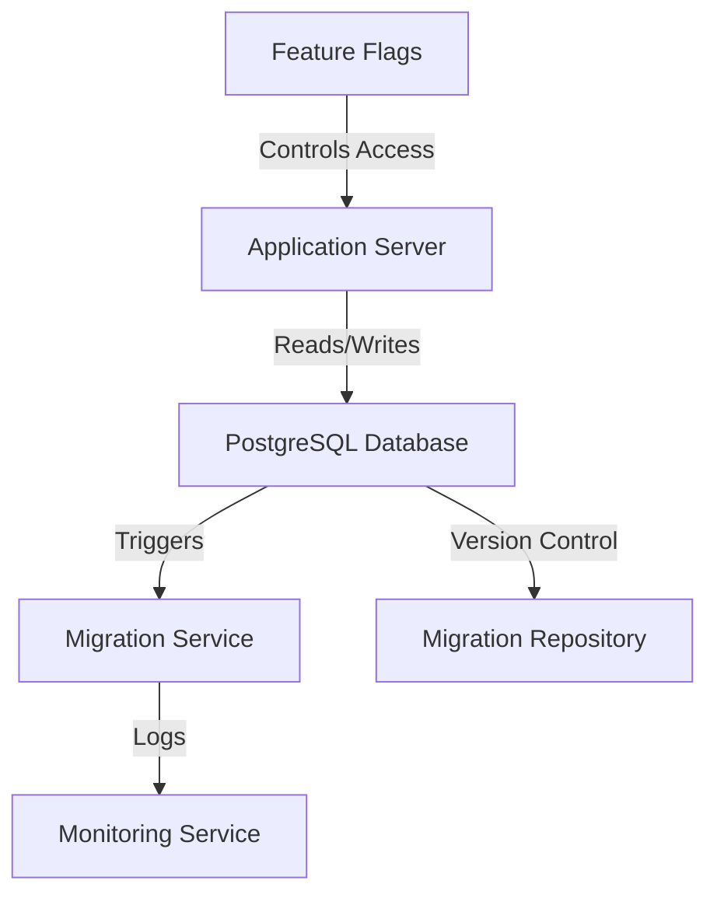

# Zero-Downtime Migrations — PostgreSQL

## Overview and scope

The purpose of this document is to outline the standards and best practices for implementing zero-downtime migrations in PostgreSQL within the Xentic platform. This document serves as a comprehensive guide for engineers and developers involved in database schema changes, ensuring that these modifications can be executed without causing service interruptions.

### Audience

This document is intended for:
- Database Administrators (DBAs)
- Software Engineers
- DevOps Engineers
- Technical Leads

### Scope

This standard covers:
- Strategies for performing zero-downtime migrations in PostgreSQL.
- Guidelines for writing migration scripts.
- Best practices for testing and deploying migrations.
- Tools and libraries recommended for managing migrations.

### Non-goals

This document does NOT cover:
- General database design principles.
- Non-zero-downtime migration strategies.
- Specific application-level changes that may accompany schema migrations.

### Glossary

| Term                | Definition                                                                 |
|---------------------|----------------------------------------------------------------------------|
| Zero-Downtime       | A migration approach that allows the application to remain available during schema changes. |
| Migration           | The process of modifying the database schema, including adding, altering, or dropping tables and columns. |
| Rollback            | The process of reverting the database to a previous state in case of migration failure. |
| Schema              | The structure that defines the organization of data in a database, including tables, columns, and relationships. |
| Locking             | A mechanism to control access to database objects to prevent conflicts during migrations. |

### How This Standard Fits the Xentic Platform

Implementing zero-downtime migrations is critical for maintaining the reliability and availability of services within the Xentic platform. As our applications scale and evolve, the ability to perform migrations without service interruptions becomes essential. This standard aligns with Xentic's commitment to delivering high-quality, resilient software solutions.

By adhering to these guidelines, teams can ensure that migrations are executed smoothly, minimizing the risk of downtime and providing a seamless experience for end-users. The following sections will detail specific techniques, tools, and examples to facilitate the implementation of zero-downtime migrations in PostgreSQL.

### Example Migration Script

```sql
-- Adding a new column with a default value
ALTER TABLE users ADD COLUMN last_login TIMESTAMP DEFAULT NULL;

-- Backfilling data in a separate migration
UPDATE users SET last_login = NOW() WHERE last_login IS NULL;

-- Making the column NOT NULL in a subsequent migration
ALTER TABLE users ALTER COLUMN last_login SET NOT NULL;
```

### Recommended Tools

- **Flyway**: A version control tool for your database migrations.
- **Liquibase**: A database schema change management tool that allows you to manage revisions of your database schema.

By following these standards, Xentic aims to enhance the reliability of database operations and maintain the integrity of the services provided to our users.

## Standards and policies

1. **MUST** use the `com.xentic.<service>` package structure for all migration scripts and related classes to maintain consistency across the Xentic platform.

2. **MUST NOT** perform any migration that requires a full table lock during peak usage hours. Migrations should be scheduled during low-traffic periods whenever possible.

3. **SHOULD** utilize non-blocking operations such as `ADD COLUMN` with default values instead of altering existing columns that require locking.

4. **MUST** ensure that all migrations are reversible. Each migration script must include a corresponding rollback procedure to revert changes if necessary.

5. **MUST NOT** drop columns or tables in a single migration. Instead, follow a two-step process:
   - First, mark the column or table as deprecated.
   - Second, remove it in a subsequent migration after ensuring that it is no longer in use.

6. **SHOULD** use version control for migration scripts, ensuring that each migration file is timestamped and follows a consistent naming convention, such as `VYYYYMMDD_HHMMSS__Description.sql`.

7. **MUST** test all migration scripts in a staging environment that mirrors production as closely as possible before applying them to the live database.

8. **SHOULD** employ feature flags to control access to new features that depend on schema changes, allowing for gradual rollout and rollback if necessary.

9. **MUST** log all migration attempts, including timestamps and results, to maintain an audit trail for compliance and troubleshooting purposes.

10. **SHOULD** use SQL scripts for migrations rather than application code to ensure that the database changes are applied independently of the application deployment.

11. **MUST NOT** include any hard-coded values in migration scripts. Instead, use configuration properties to define values that may change between environments.

12. **MUST** implement a monitoring strategy to observe the effects of migrations on application performance and database health post-deployment.

13. **SHOULD** utilize tools like Flyway or Liquibase for managing migrations, as they provide built-in support for versioning and rollback capabilities.

14. **MUST** ensure that any new indexes created during migrations are added concurrently to avoid locking issues. For example:

    ```sql
    CREATE INDEX CONCURRENTLY idx_users_last_login ON users(last_login);
    ```

15. **MUST** back up the database before performing any migrations, ensuring that a restore point is available in case of failure.

16. **SHOULD** communicate with the development and operations teams regarding upcoming migrations to coordinate efforts and minimize disruptions.

17. **MUST NOT** assume that all database clients will handle schema changes gracefully. Ensure that application code is compatible with both old and new schema versions during the migration process.

18. **MUST** include comprehensive documentation for each migration, detailing the purpose, expected impact, and any dependencies or prerequisites.

19. **SHOULD** leverage SQL migration scripts for data transformations rather than relying solely on application logic to ensure that data integrity is maintained.

20. **MUST** follow the Xentic coding standards for SQL, including proper formatting, naming conventions, and commenting practices to enhance readability and maintainability.

By adhering to these standards and policies, Xentic aims to ensure that zero-downtime migrations are executed effectively, preserving the availability and reliability of our services.

## Architecture and design

The architecture for zero-downtime migrations in PostgreSQL at Xentic is designed to ensure that database changes can be made without disrupting service availability. The following sections outline the component diagram, data flows, integration points, and failure domains.

### Component Diagram



### Data Flows

1. **Application Server to PostgreSQL Database**: The application server interacts with the PostgreSQL database for data retrieval and updates. During migrations, the application should be able to work with both the old and new schema.
  
2. **Migration Service**: This service manages the execution of migration scripts. It reads migration files from the Migration Repository, applies changes to the database, and logs the results to the Monitoring Service.

3. **Monitoring Service**: After migrations are executed, the Monitoring Service collects metrics and logs for performance analysis and error tracking.

4. **Version Control**: All migration scripts are stored in a Migration Repository, which allows for tracking changes and rollbacks.

5. **Feature Flags**: These are used to manage access to new features that depend on the schema changes, ensuring that users are not exposed to incomplete functionalities.

### Integration Points

- **Migration Service**: This service integrates with the PostgreSQL database to apply migrations and with the Monitoring Service to log the outcomes.
  
- **Application Server**: The application server must be designed to handle schema changes gracefully, ensuring that it can operate with both the old and new database structures during the migration process.

- **Monitoring Service**: This service provides real-time feedback on the success or failure of migrations, allowing teams to respond quickly to issues.

### Failure Domains

1. **Migration Script Failure**: If a migration script fails, the system must be able to roll back to the previous state. Each migration script MUST include a rollback procedure.

2. **Application Compatibility**: The application must remain compatible with both the old and new schema versions during the migration. This requires thorough testing and possibly feature flags to control access to new features.

3. **Database Locking**: Migrations that require locks MUST be avoided during peak usage hours. If a migration causes a lock, it could lead to application downtime.

4. **Monitoring and Alerts**: The Monitoring Service must be configured to alert the development and operations teams in case of migration failures or performance degradation.

### Example Migration Configuration

Below is an example of a migration configuration using Flyway:

```yaml
flyway:
  url: jdbc:postgresql://db.internal.xentic.io:5432/mydb
  user: myuser
  password: mypassword
  locations: filesystem:sql/migrations
  baselineOnMigrate: true
  placeholders:
    new_column_default_value: '2023-01-01 00:00:00'
```

### Summary

By following this architecture and design framework, Xentic ensures that zero-downtime migrations are executed effectively, preserving application availability and enhancing user experience. The integration of monitoring and rollback mechanisms further strengthens the reliability of the migration process.

## Configuration reference

### application.yml

The following is an example `application.yml` configuration for a service using PostgreSQL with zero-downtime migrations:

```yaml
spring:
  datasource:
    url: jdbc:postgresql://db.internal.xentic.io:5432/mydb
    username: ${DB_USERNAME:defaultUser}
    password: ${DB_PASSWORD:defaultPassword}
    driver-class-name: org.postgresql.Driver
  flyway:
    enabled: true
    locations: classpath:db/migration
    baseline-on-migrate: true
    placeholders:
      new_column_default_value: '2023-01-01 00:00:00'
```

### Terraform Configuration

The following Terraform configuration can be used to provision a PostgreSQL database for a service:

```hcl
resource "postgresql_database" "mydb" {
  name     = "mydb"
  owner    = "myuser"
  provider = postgresql
}

resource "postgresql_role" "myuser" {
  name     = "myuser"
  password = var.db_password
  login    = true
}

resource "postgresql_grant" "myuser_access" {
  database = postgresql_database.mydb.name
  role     = postgresql_role.myuser.name
  privileges = ["CONNECT", "CREATE"]
}
```

### Environment Variables

The following table outlines the environment variables used for database configurations, along with their default and production values:

| Variable Name         | Default Value         | Production Value                |
|-----------------------|-----------------------|---------------------------------|
| `DB_USERNAME`         | `defaultUser`         | `prodUser`                     |
| `DB_PASSWORD`         | `defaultPassword`     | `prodSecurePassword`           |
| `DB_HOST`             | `db.internal.xentic.io` | `db-prod.internal.xentic.io`   |
| `DB_PORT`             | `5432`                | `5432`                         |
| `DB_NAME`             | `mydb`                | `mydb_prod`                   |

### SQL Configuration for Migrations

The following SQL configuration can be used for managing migrations effectively:

```sql
-- Migration to add a new column with a default value
CREATE TABLE IF NOT EXISTS migration_log (
    id SERIAL PRIMARY KEY,
    migration_name VARCHAR(255) NOT NULL,
    applied_at TIMESTAMP NOT NULL DEFAULT NOW()
);

-- Insert a record of the migration
INSERT INTO migration_log (migration_name) VALUES ('Add last_login column to users');
```

### Additional Configuration Options

- **Connection Pooling**: It is recommended to configure connection pooling to manage database connections efficiently. For example, using HikariCP:

```yaml
spring:
  datasource:
    hikari:
      maximum-pool-size: 10
      minimum-idle: 5
      idle-timeout: 30000
```

- **Logging**: Ensure that migration logs are captured for auditing purposes. For example, configure logging in `application.yml`:

```yaml
logging:
  level:
    org.flywaydb: DEBUG
```

By adhering to these configuration standards, Xentic ensures that the database environment is properly set up for zero-downtime migrations, enhancing reliability and maintainability across services.

## Implementation guide

To implement zero-downtime migrations in PostgreSQL at Xentic, follow the step-by-step guide below. This guide includes the necessary configurations, SQL scripts, and code examples to ensure a smooth migration process.

### Step 1: Prepare Migration Scripts

Create migration scripts that will handle schema changes. Each script should be idempotent and include a rollback mechanism. For example, to add a new column to the `users` table:

```sql
-- V1__Add_last_login_column_to_users.sql
ALTER TABLE users ADD COLUMN last_login TIMESTAMP DEFAULT NULL;

-- Rollback script
-- V1__Rollback_add_last_login_column_to_users.sql
ALTER TABLE users DROP COLUMN last_login;
```

### Step 2: Configure Flyway for Migrations

Ensure that Flyway is configured correctly in your application. Below is an example configuration in `application.yml`:

```yaml
spring:
  flyway:
    enabled: true
    locations: classpath:db/migration
    baseline-on-migrate: true
    placeholders:
      new_column_default_value: '2023-01-01 00:00:00'
```

### Step 3: Create a Migration Service

Implement a migration service that will execute the migration scripts. Below is a sample Java class:

```java
package com.xentic.migration;

import org.flywaydb.core.Flyway;
import org.springframework.beans.factory.annotation.Autowired;
import org.springframework.stereotype.Service;

@Service
public class MigrationService {

    private final Flyway flyway;

    @Autowired
    public MigrationService(Flyway flyway) {
        this.flyway = flyway;
    }

    public void migrate() {
        flyway.migrate();
    }
}
```

### Step 4: Implement Monitoring for Migration Success

Create a monitoring service to log the results of each migration. Below is a sample implementation:

```java
package com.xentic.monitoring;

import org.slf4j.Logger;
import org.slf4j.LoggerFactory;
import org.springframework.stereotype.Service;

@Service
public class MonitoringService {

    private static final Logger logger = LoggerFactory.getLogger(MonitoringService.class);

    public void logMigration(String migrationName, boolean success) {
        if (success) {
            logger.info("Migration {} applied successfully.", migrationName);
        } else {
            logger.error("Migration {} failed.", migrationName);
        }
    }
}
```

### Step 5: Execute Migrations with Rollback Capability

When executing migrations, ensure that you can handle rollbacks in case of failures. Below is an example of how to execute migrations with rollback capability:

```java
package com.xentic.migration;

import org.springframework.beans.factory.annotation.Autowired;
import org.springframework.stereotype.Component;

@Component
public class MigrationExecutor {

    private final MigrationService migrationService;
    private final MonitoringService monitoringService;

    @Autowired
    public MigrationExecutor(MigrationService migrationService, MonitoringService monitoringService) {
        this.migrationService = migrationService;
        this.monitoringService = monitoringService;
    }

    public void executeMigrations() {
        try {
            migrationService.migrate();
            monitoringService.logMigration("Add last_login column to users", true);
        } catch (Exception e) {
            monitoringService.logMigration("Add last_login column to users", false);
            // Implement rollback logic here
        }
    }
}
```

### Step 6: Test Migrations in a Staging Environment

Before deploying migrations to production, test them in a staging environment. Ensure that the application can handle both the old and new schema versions. Use feature flags to control access to new features that depend on the schema changes.

### Step 7: Deploy and Monitor

Once testing is complete, deploy the migration to production. Monitor the application and database closely for any issues. Use the monitoring service to track migration success and performance metrics.

### Step 8: Document Each Migration

Each migration must be documented thoroughly. Create a migration log that includes:

- Migration name
- Description of changes
- Date applied
- Status (success/failure)

Example migration log entry:

```sql
INSERT INTO migration_log (migration_name, applied_at) VALUES ('Add last_login column to users', NOW());
```

### Conclusion

By following this implementation guide, Xentic ensures that zero-downtime migrations are executed effectively. Each step is designed to minimize disruption and maintain application availability during the migration process.

## Security requirements

To ensure the integrity and security of the zero-downtime migration process in PostgreSQL, Xentic must implement a comprehensive security framework. Below are the key components of this framework:

### Threat Model Summary

Xentic's zero-downtime migration process is exposed to various threats, including:

- **Data Breaches**: Unauthorized access to sensitive data during migrations.
- **SQL Injection**: Malicious input that could compromise the database.
- **Denial of Service**: Attacks that disrupt the availability of the migration service.
- **Insider Threats**: Malicious actions by authorized personnel.

### Authentication and Authorization

- **Authentication**: All database connections must use strong authentication mechanisms. Passwords must be stored securely using hashing algorithms (e.g., bcrypt).
- **Authorization**: Role-based access control (RBAC) should be enforced. Only authorized users should have permissions to perform migrations.

Example PostgreSQL role configuration:

```sql
CREATE ROLE migration_user WITH LOGIN PASSWORD 'securePassword';
GRANT CONNECT ON DATABASE mydb TO migration_user;
GRANT USAGE ON SCHEMA public TO migration_user;
```

### Secrets Management

- **Environment Variables**: Sensitive information, such as database credentials, must be stored in environment variables and not hard-coded in the application.
- **Secret Management Tools**: Utilize secret management tools (e.g., HashiCorp Vault, AWS Secrets Manager) to manage and access secrets securely.

Example environment variable configuration:

```bash
export DB_USERNAME='migration_user'
export DB_PASSWORD='securePassword'
```

### Input Validation

- **Parameter Binding**: Always use parameterized queries to prevent SQL injection attacks. Avoid constructing SQL statements using string concatenation.
- **Input Sanitization**: Validate and sanitize all user inputs before processing them.

Example of parameterized query in Java:

```java
String sql = "INSERT INTO users (username) VALUES (?)";
try (PreparedStatement pstmt = connection.prepareStatement(sql)) {
    pstmt.setString(1, username);
    pstmt.executeUpdate();
}
```

### Audit Logging

- **Migration Logs**: Maintain detailed logs of all migration actions, including who executed the migration, what changes were made, and the success or failure of the operation.
- **Access Logs**: Log all access attempts to the database, including successful and failed login attempts.

Example logging configuration in `application.yml`:

```yaml
logging:
  level:
    org.springframework.jdbc.core: DEBUG
    org.flywaydb: INFO
```

#### Migration Log Table

Create a dedicated table to store migration logs:

```sql
CREATE TABLE IF NOT EXISTS migration_log (
    id SERIAL PRIMARY KEY,
    migration_name VARCHAR(255) NOT NULL,
    applied_at TIMESTAMP NOT NULL DEFAULT NOW(),
    status VARCHAR(50) NOT NULL,
    user VARCHAR(255) NOT NULL
);
```

### Summary of Security Practices

- **MUST** use strong authentication and authorization mechanisms.
- **MUST NOT** hard-code sensitive information in the application code.
- **MUST** validate and sanitize all user inputs.
- **MUST** maintain detailed audit logs for migrations and access attempts.
- **SHOULD** utilize secret management tools for managing sensitive data.

By adhering to these security requirements, Xentic can safeguard its zero-downtime migration processes, ensuring the confidentiality, integrity, and availability of its database systems.

## Testing strategy

To ensure the reliability and stability of zero-downtime migrations, Xentic MUST implement a comprehensive testing strategy that includes unit tests, integration tests, and contract tests. The following outlines the testing strategy along with coverage targets and example test classes.

### Testing Types

- **Unit Tests**: Validate individual components in isolation to ensure they function as expected.
- **Integration Tests**: Verify that different components work together correctly, especially the migration service and database interactions.
- **Contract Tests**: Ensure that the database schema adheres to expected contracts, preventing breaking changes.

### Coverage Targets

- **Unit Tests**: Aim for at least 80% code coverage for all migration-related classes.
- **Integration Tests**: Ensure that at least 70% of integration scenarios are covered, including both successful and failed migrations.
- **Contract Tests**: Cover all critical database schemas and migrations with a 100% success rate.

### Example Test Classes

#### Unit Test for MigrationService

```java
package com.xentic.migration;

import org.flywaydb.core.Flyway;
import org.junit.jupiter.api.Test;
import org.mockito.Mockito;

import static org.mockito.Mockito.verify;

class MigrationServiceTest {

    @Test
    void shouldMigrateSuccessfully() {
        Flyway flyway = Mockito.mock(Flyway.class);
        MigrationService migrationService = new MigrationService(flyway);

        migrationService.migrate();

        verify(flyway).migrate();
    }
}
```

#### Integration Test for MigrationExecutor

```java
package com.xentic.migration;

import org.junit.jupiter.api.BeforeEach;
import org.junit.jupiter.api.Test;
import org.springframework.beans.factory.annotation.Autowired;
import org.springframework.boot.test.context.SpringBootTest;

import static org.mockito.Mockito.mock;
import static org.mockito.Mockito.verify;

@SpringBootTest
class MigrationExecutorIntegrationTest {

    @Autowired
    private MigrationExecutor migrationExecutor;

    private MonitoringService monitoringService;

    @BeforeEach
    void setUp() {
        monitoringService = mock(MonitoringService.class);
    }

    @Test
    void shouldLogMigrationSuccess() {
        migrationExecutor.executeMigrations();

        verify(monitoringService).logMigration("Add last_login column to users", true);
    }
}
```

#### Contract Test for Database Schema

Using a tool like `Testcontainers` or `DbUnit`, create a contract test to validate the database schema:

```java
package com.xentic.contract;

import org.junit.jupiter.api.Test;
import org.springframework.boot.test.context.SpringBootTest;

import static org.assertj.core.api.Assertions.assertThat;

@SpringBootTest
class DatabaseSchemaContractTest {

    @Test
    void shouldHaveLastLoginColumnInUsersTable() {
        // Logic to connect to the database and check the schema
        String columnName = "last_login";
        boolean exists = checkColumnExists("users", columnName);

        assertThat(exists).isTrue();
    }

    private boolean checkColumnExists(String tableName, String columnName) {
        // Implement logic to check if the column exists in the specified table
        return true; // Placeholder
    }
}
```

### Summary of Testing Practices

- **MUST** implement unit tests for all migration-related classes to ensure individual functionality.
- **MUST** conduct integration tests to verify the interaction between components.
- **MUST NOT** skip contract tests to validate the database schema against expected contracts.
- **SHOULD** aim for high code coverage to ensure robustness and reliability of migrations.
- **SHOULD** use mocking frameworks (e.g., Mockito) to isolate tests and avoid dependencies on external systems.

By adhering to this testing strategy, Xentic ensures that zero-downtime migrations are thoroughly vetted, reducing the risk of issues during production deployments.

## Observability and operations

To ensure the successful execution of zero-downtime migrations in PostgreSQL, Xentic MUST implement robust observability and operations practices. This includes monitoring metrics, logging activities, tracing requests, creating dashboards, setting up alerts, and defining service level objectives (SLOs). The following outlines these practices in detail.

### Metrics

Xentic MUST track the following key metrics related to database migrations:

| Metric                     | Description                                      |
|----------------------------|--------------------------------------------------|
| Migration Success Rate     | Percentage of successful migrations over time.   |
| Migration Duration         | Time taken for each migration to complete.       |
| Error Rate                 | Number of failed migrations per time period.     |
| Database Load              | CPU and memory usage during migration.           |
| Connection Pool Utilization | Number of active connections during migrations.   |

Example Prometheus metrics configuration:

```yaml
metrics:
  enabled: true
  endpoint: /actuator/prometheus
```

### Logs

Xentic MUST maintain comprehensive logging for all migration activities. This includes:

- **Migration Logs**: Log every migration attempt, including success or failure.
- **Error Logs**: Capture detailed error messages and stack traces for failed migrations.
- **Access Logs**: Log all database access, including who executed migrations and when.

Example logging configuration in `application.yml`:

```yaml
logging:
  level:
    com.xentic.migration: DEBUG
    org.flywaydb: INFO
  appenders:
    console:
      type: Console
      pattern: "%d{yyyy-MM-dd HH:mm:ss} - %msg%n"
```

### Traces

Xentic SHOULD implement distributed tracing to monitor the flow of migration requests. This can help identify bottlenecks and issues during the migration process.

- **Trace IDs**: Assign unique trace IDs to each migration request to track its lifecycle.
- **Integration with APM Tools**: Use Application Performance Monitoring (APM) tools (e.g., Jaeger, Zipkin) to visualize the trace data.

Example trace configuration using Spring Cloud Sleuth:

```yaml
spring:
  sleuth:
    sampler:
      probability: 1.0
```

### Dashboards

Xentic SHOULD create dashboards to visualize migration metrics and logs in real-time. Use tools like Grafana or Kibana to set up these dashboards.

Key dashboard components:

- **Migration Success Rate**: A line chart showing the success rate over time.
- **Migration Duration**: A bar chart displaying the duration of recent migrations.
- **Error Rate**: A pie chart showing the distribution of successful vs. failed migrations.

### Alerts

Xentic MUST configure alerts to notify the on-call team of any issues during migrations. Key alerts to set up include:

- **High Error Rate**: Alert if the error rate exceeds a predefined threshold (e.g., 5%).
- **Long Migration Duration**: Alert if a migration exceeds a certain duration (e.g., 5 minutes).
- **Database Load**: Alert if CPU or memory usage exceeds a specified limit during migrations.

Example alert configuration in Prometheus:

```yaml
groups:
  - name: migration_alerts
    rules:
      - alert: HighErrorRate
        expr: rate(migration_errors_total[5m]) / rate(migration_attempts_total[5m]) > 0.05
        for: 5m
        labels:
          severity: critical
        annotations:
          summary: "High error rate detected during migrations"
          description: "Error rate exceeds 5% in the last 5 minutes."
```

### SLOs

Xentic MUST define Service Level Objectives (SLOs) for migration processes to ensure reliability and performance. Suggested SLOs include:

| SLO Description                    | Target    |
|------------------------------------|-----------|
| Migration Success Rate             | ≥ 95%     |
| Average Migration Duration          | ≤ 3 minutes |
| Maximum Migration Duration          | ≤ 5 minutes |
| Error Rate during Migrations        | ≤ 5%      |

### On-Call Runbook Steps

In the event of a migration failure, the on-call engineer MUST follow these steps:

1. **Identify the Issue**: Review logs and metrics to determine the cause of the failure.
2. **Check the Migration Log**: Verify the status of the migration in the migration log table.
3. **Rollback if Necessary**: If the migration failed, execute a rollback script to revert changes.
4. **Notify the Team**: Use the incident management system to notify relevant team members.
5. **Document the Incident**: Record the incident details, including the root cause and resolution steps, in the incident management system.
6. **Review and Improve**: Conduct a post-mortem to identify improvements for future migrations.

By implementing these observability and operations practices, Xentic ensures that zero-downtime migrations are monitored effectively, allowing for quick identification and resolution of issues, thereby maintaining high availability and performance.

## Migration and versioning

Xentic MUST establish a clear migration and versioning strategy to ensure seamless database updates while maintaining application stability. This section outlines the upgrade paths, deprecation policy, backward compatibility, and rollback procedures.

### Upgrade Paths

- **Incremental Migrations**: Migrations MUST be applied incrementally. Each migration script should be versioned and executed in the order of their version numbers.
- **Versioning Scheme**: Use Semantic Versioning (MAJOR.MINOR.PATCH) for migration scripts. For example:
  - `V1__create_users_table.sql`
  - `V2__add_last_login_column.sql`

| Version | Description                        |
|---------|------------------------------------|
| V1      | Create initial users table         |
| V2      | Add last_login column to users     |
| V3      | Rename username column to user_name |

### Deprecation Policy

- **Grace Period**: Xentic MUST provide a grace period of at least one release cycle (approximately 3 months) before removing deprecated features or columns.
- **Deprecation Warnings**: During the grace period, log warnings in the application when deprecated features are used.

Example deprecation warning in SQL:

```sql
-- WARNING: The 'username' column is deprecated. Use 'user_name' instead.
ALTER TABLE users DROP COLUMN username;
```

### Backward Compatibility

- **Data Retention**: Migrations MUST retain existing data to ensure backward compatibility. For example, when renaming a column, the old column MUST remain until all dependent services are updated.
- **Feature Flags**: Implement feature flags for new features introduced by migrations. This allows teams to gradually enable new functionality without impacting existing users.

Example feature flag configuration:

```yaml
featureFlags:
  enableNewUserName: false
```

### Rollback Procedures

In case of failure during migration, Xentic MUST have rollback procedures in place to revert to the previous stable state. Rollback scripts MUST be provided for each migration.

#### Rollback Example

For a migration that adds a column, the rollback script would look like:

```sql
-- Rollback script for V2__add_last_login_column.sql
ALTER TABLE users DROP COLUMN last_login;
```

#### Rollback Strategy

1. **Identify Migration**: Determine which migration needs to be rolled back based on logs and monitoring.
2. **Execute Rollback Script**: Run the corresponding rollback script in the same manner as the migration.
3. **Verify Rollback**: Confirm that the database state has returned to the previous version by running validation checks.

### Migration Validation

Xentic MUST validate migrations before applying them to production. This includes:

- **Pre-Deployment Checks**: Run checks to ensure that the migration will not violate constraints or lead to data loss.
- **Staging Environment**: Migrations MUST be tested in a staging environment that mirrors production to identify potential issues.

### Example Migration Script

Here’s an example of a migration script that adds a new column while ensuring backward compatibility:

```sql
-- V2__add_last_login_column.sql
ALTER TABLE users ADD COLUMN last_login TIMESTAMP DEFAULT NULL;

-- Ensure backward compatibility by retaining the old column
-- No action needed if the old column is not being dropped
```

### Summary of Migration and Versioning Practices

- **MUST** apply migrations incrementally and maintain a clear versioning scheme.
- **MUST NOT** remove deprecated features without a grace period and proper warnings.
- **SHOULD** ensure backward compatibility through data retention and feature flags.
- **MUST** provide rollback procedures for each migration to revert changes if necessary.
- **SHOULD** validate migrations in a staging environment before production deployment.

By following these guidelines, Xentic ensures that database migrations are managed effectively, minimizing risks and maintaining application integrity.

## FAQ, anti-patterns, and checklists

### FAQ

1. **What is a zero-downtime migration?**
   - A zero-downtime migration is a database migration that allows the application to remain operational and accessible to users during the migration process.

2. **Why is zero-downtime important?**
   - Zero-downtime is crucial for maintaining user experience and service availability, especially for applications with high traffic or critical uptime requirements.

3. **How can I ensure a migration is safe to run?**
   - Xentic MUST perform thorough testing in a staging environment, validate against constraints, and ensure that rollback scripts are prepared.

4. **What tools can be used for managing migrations?**
   - Xentic SHOULD utilize tools like Flyway or Liquibase for managing database migrations effectively.

5. **How do I handle schema changes that require data transformations?**
   - Use a two-step approach: first, add the new schema elements without removing old ones, then backfill or transform data in a separate migration.

6. **What should I do if a migration fails?**
   - Follow the on-call runbook steps, including identifying the issue, executing rollback scripts, and notifying the team.

7. **How can I monitor the migration process?**
   - Xentic SHOULD implement logging, metrics, and alerts to monitor migration activities and performance.

8. **What is the recommended versioning scheme for migration scripts?**
   - Xentic MUST use Semantic Versioning (MAJOR.MINOR.PATCH) for migration scripts.

9. **How do I manage deprecated features in the database?**
   - Implement a grace period before removal, log warnings, and ensure backward compatibility until all dependent services are updated.

10. **What is the best practice for testing migrations?**
    - Migrations MUST be tested in a staging environment that mirrors production, with pre-deployment checks to validate the migration's impact.

### Anti-Patterns

| Anti-Pattern                          | Description                                                                                     |
|---------------------------------------|-------------------------------------------------------------------------------------------------|
| **Dropping Columns Immediately**      | Removing columns without a grace period can lead to application failures and data loss.       |
| **Large Monolithic Migrations**       | Applying large migrations in a single step increases the risk of failure and downtime.        |
| **Skipping Rollback Scripts**         | Not preparing rollback scripts can lead to irreversible changes and data integrity issues.    |
| **Ignoring Performance Impact**       | Failing to consider the performance impact of migrations can lead to application slowdowns.   |
| **Not Validating Migrations**         | Running migrations without validation can cause unexpected errors and data corruption.         |
| **Hardcoding Values in Migrations**   | Using hardcoded values can lead to issues when the application or database environment changes.|
| **Neglecting Backward Compatibility** | Not maintaining backward compatibility can break dependent services and lead to outages.      |

### Pre-Merge Checklist

- [ ] Ensure migration scripts are versioned according to Semantic Versioning.
- [ ] Review migration scripts for potential data loss or integrity issues.
- [ ] Validate migration scripts in a staging environment.
- [ ] Prepare rollback scripts for each migration.
- [ ] Ensure logging and monitoring are configured for the migration process.
- [ ] Confirm that all dependent services are aware of the migration changes.

### Production Checklist

- [ ] Execute migration scripts in a controlled manner, monitoring for errors.
- [ ] Verify that logging captures all migration activities.
- [ ] Monitor application performance during the migration.
- [ ] Confirm successful execution of migration scripts through validation checks.
- [ ] Notify the team of migration completion and any issues encountered.
- [ ] Conduct a post-mortem review to document lessons learned and areas for improvement.
