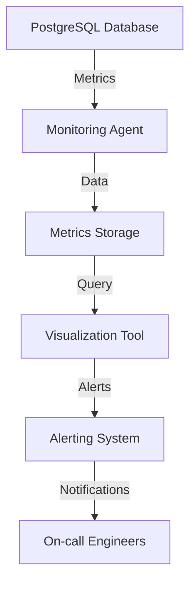

# Monitoring and Metrics — PostgreSQL

## Overview and scope

The purpose of this document is to establish standards and best practices for monitoring and metrics specifically for PostgreSQL databases within Xentic. This standard aims to ensure that all PostgreSQL instances are monitored effectively, providing insights into performance, availability, and resource utilization. 

### Audience

This document is intended for:

- Database Administrators (DBAs)
- Software Engineers
- DevOps Engineers
- System Architects
- Technical Leads

### Scope

This standard applies to all PostgreSQL databases deployed within the Xentic environment. It covers:

- Metrics to be collected
- Tools and technologies to be used for monitoring
- Configuration guidelines
- Alerting mechanisms
- Reporting standards

### Non-goals

This document does NOT cover:

- Monitoring of non-PostgreSQL databases
- Application-level monitoring (outside of database interactions)
- Specific implementations of monitoring tools (e.g., Grafana, Prometheus) beyond configuration examples

### Glossary

| Term                | Definition                                                                 |
|---------------------|-----------------------------------------------------------------------------|
| Metrics             | Quantifiable measures used to track performance and health of the database. |
| Monitoring          | The process of continuously observing the database to ensure optimal performance. |
| Alerting            | Mechanisms that notify relevant personnel when certain thresholds are breached. |
| PostgreSQL          | An open-source relational database management system based on SQL.         |
| DBAs                | Database Administrators responsible for managing database environments.     |

### How This Standard Fits the Xentic Platform

This monitoring and metrics standard is a critical component of the Xentic platform's overall architecture. It aligns with our commitment to reliability and performance, ensuring that our services are resilient and scalable. By adhering to these standards, teams can:

- Ensure consistent monitoring practices across all services
- Quickly identify and resolve performance issues
- Maintain compliance with internal and external regulations
- Facilitate data-driven decision-making through accurate metrics

### Metrics to Collect

The following key metrics MUST be collected for effective monitoring of PostgreSQL databases:

- **Connection Metrics**
  - Active connections
  - Connection limits
- **Performance Metrics**
  - Query execution time
  - Lock wait times
- **Resource Utilization**
  - CPU usage
  - Memory usage
  - Disk I/O
- **Error Metrics**
  - Number of failed transactions
  - Deadlocks

### Example Configuration

For PostgreSQL, the following configuration in `postgresql.conf` MUST be set to enable logging of slow queries:

```yaml
log_min_duration_statement = 1000  # Log queries taking longer than 1000 ms
log_statement = 'all'                # Log all statements
```

### Alerting Configuration

Alerts MUST be configured to notify the relevant teams when metrics exceed predefined thresholds. An example alert configuration using Prometheus Alertmanager is as follows:

```yaml
groups:
- name: postgresql-alerts
  rules:
  - alert: HighCpuUsage
    expr: rate(process_cpu_seconds_total[5m]) > 0.8
    for: 5m
    labels:
      severity: critical
    annotations:
      summary: "High CPU usage detected on PostgreSQL instance"
      description: "CPU usage is above 80% for more than 5 minutes."
```

By adhering to the standards outlined in this document, Xentic will maintain a robust and efficient PostgreSQL monitoring framework, ensuring optimal performance and reliability across all services.

## Standards and policies

1. **MUST** collect the following metrics for PostgreSQL databases:
   - Connection metrics (active connections, connection limits)
   - Performance metrics (query execution time, lock wait times)
   - Resource utilization (CPU usage, memory usage, disk I/O)
   - Error metrics (number of failed transactions, deadlocks)

2. **MUST NOT** use default PostgreSQL settings for logging. Custom logging settings MUST be configured to capture relevant metrics. Example configuration in `postgresql.conf`:

   ```yaml
   log_min_duration_statement = 1000  # Log queries taking longer than 1000 ms
   log_statement = 'all'                # Log all statements
   ```

3. **MUST** implement monitoring tools that are compatible with PostgreSQL, such as Prometheus, Grafana, or Zabbix. The choice of tools MUST align with Xentic's technology stack.

4. **SHOULD** use a centralized logging system to aggregate logs from all PostgreSQL instances. This facilitates easier troubleshooting and analysis.

5. **MUST** configure alerts for critical metrics. Alerts MUST be actionable and directed to the appropriate teams. Example alert configuration using Prometheus Alertmanager:

   ```yaml
   groups:
   - name: postgresql-alerts
     rules:
     - alert: HighCpuUsage
       expr: rate(process_cpu_seconds_total[5m]) > 0.8
       for: 5m
       labels:
         severity: critical
       annotations:
         summary: "High CPU usage detected on PostgreSQL instance"
         description: "CPU usage is above 80% for more than 5 minutes."
   ```

6. **MUST** define and document thresholds for all monitored metrics. These thresholds MUST be based on historical data and business requirements.

7. **SHOULD** review and adjust alert thresholds periodically to ensure they remain relevant and effective.

8. **MUST** ensure that all monitoring configurations are version-controlled and documented in the service repository under `com.xentic.<service>/config`.

9. **MUST NOT** ignore performance degradation indicators. Any anomalies MUST be investigated promptly to prevent service disruptions.

10. **SHOULD** utilize PostgreSQL's built-in monitoring views (e.g., `pg_stat_activity`, `pg_stat_statements`) to gather real-time performance data.

11. **MUST** conduct regular audits of monitoring and alerting configurations to ensure compliance with Xentic standards.

12. **MUST NOT** store sensitive information in logs. Any sensitive data MUST be masked or removed before logging.

13. **SHOULD** provide training for team members on monitoring tools and practices to ensure effective utilization of the monitoring framework.

14. **MUST** maintain documentation for all monitoring configurations and alerting rules in a central repository accessible to all relevant teams.

15. **SHOULD** implement dashboards that visualize key metrics for PostgreSQL databases, enabling quick assessment of database health and performance.

16. **MUST** ensure that the monitoring solution has minimal impact on database performance. This includes configuring sampling rates and log verbosity appropriately.

By adhering to these standards and policies, Xentic will ensure that its PostgreSQL databases are monitored effectively, enabling proactive management and optimization of database performance.

## Architecture and design

The architecture for monitoring PostgreSQL databases at Xentic involves several components that work together to collect, analyze, and visualize metrics. The following diagram illustrates the key components and their interactions:



### Component Descriptions

- **PostgreSQL Database**: The core database system where data is stored and managed.
- **Monitoring Agent**: A tool (e.g., Prometheus Node Exporter) that collects metrics from the PostgreSQL database and sends them to the metrics storage.
- **Metrics Storage**: A time-series database (e.g., Prometheus) that stores the collected metrics for analysis and querying.
- **Visualization Tool**: Tools like Grafana that visualize the metrics stored in the metrics storage, providing dashboards for real-time monitoring.
- **Alerting System**: A system (e.g., Prometheus Alertmanager) that triggers alerts based on predefined thresholds for critical metrics.
- **On-call Engineers**: The team responsible for responding to alerts and ensuring database performance and availability.

### Data Flows

1. **Metric Collection**: The monitoring agent queries the PostgreSQL database for metrics and sends this data to the metrics storage at regular intervals.
2. **Data Storage**: Metrics are stored in a time-series format, allowing for historical analysis and trend identification.
3. **Visualization**: The visualization tool queries the metrics storage to generate real-time dashboards that display key performance indicators (KPIs).
4. **Alerting**: The alerting system evaluates metrics against predefined thresholds and sends notifications to on-call engineers when thresholds are breached.

### Integration Points

- **PostgreSQL Database**: The monitoring agent integrates directly with the database using SQL queries to gather metrics.
- **Metrics Storage**: The monitoring agent must be configured to push metrics to the storage system, which may require network access and authentication.
- **Visualization Tool**: The visualization tool queries the metrics storage to retrieve and display metrics, requiring proper access configuration.
- **Alerting System**: The alerting system must be configured to listen to metrics storage or monitoring agent events to trigger alerts.

### Failure Domains

- **Monitoring Agent Failure**: If the monitoring agent fails, metrics collection will cease, leading to a lack of visibility into database performance.
- **Metrics Storage Failure**: If the metrics storage becomes unavailable, historical data will not be accessible, and real-time monitoring will be disrupted.
- **Visualization Tool Failure**: If the visualization tool fails, engineers will not have access to dashboards, making it difficult to assess database health.
- **Alerting System Failure**: If the alerting system fails, critical alerts may not be sent, potentially leading to undetected performance issues.

### Best Practices

- **Redundancy**: Implement redundancy for critical components such as the monitoring agent and metrics storage to ensure high availability.
- **Regular Testing**: Conduct regular tests of the alerting system to ensure notifications are functioning correctly.
- **Documentation**: Maintain comprehensive documentation of the architecture, data flows, and integration points to facilitate troubleshooting and onboarding of new team members.

By adhering to these architectural guidelines, Xentic can ensure a robust and effective monitoring framework for PostgreSQL databases, enabling proactive management and optimization of database performance.

## Configuration reference

### application.yml

The `application.yml` file should include configurations for PostgreSQL connection settings, logging, and monitoring. Below is an example configuration:

```yaml
spring:
  datasource:
    url: jdbc:postgresql://db.internal.xentic.io:5432/mydatabase
    username: myuser
    password: mypassword
    driver-class-name: org.postgresql.Driver
  jpa:
    hibernate:
      ddl-auto: update
    show-sql: true
    properties:
      hibernate:
        format_sql: true
  metrics:
    enabled: true
    tags:
      application: myservice
```

### Terraform Configuration

When deploying PostgreSQL instances, the following Terraform configuration can be used to set up the database with monitoring enabled:

```hcl
resource "aws_db_instance" "postgresql" {
  allocated_storage    = 20
  engine             = "postgres"
  engine_version     = "13.3"
  instance_class     = "db.t3.micro"
  name               = "mydatabase"
  username           = "myuser"
  password           = "mypassword"
  db_subnet_group_name = aws_db_subnet_group.default.name
  vpc_security_group_ids = [aws_security_group.default.id]

  monitoring_interval = 60  # Enable monitoring every minute
  monitoring_role_arn = aws_iam_role.rds_monitoring.arn
}
```

### Environment Variables

Environment variables should be used for sensitive configurations. Below is a table of recommended environment variables with default and production values:

| Variable Name                | Default Value             | Production Value               |
|------------------------------|---------------------------|--------------------------------|
| `DB_URL`                     | `jdbc:postgresql://localhost:5432/mydatabase` | `jdbc:postgresql://db.internal.xentic.io:5432/mydatabase` |
| `DB_USERNAME`                | `user`                    | `myuser`                       |
| `DB_PASSWORD`                | `password`                | `mypassword`                   |
| `DB_LOG_MIN_DURATION`       | `1000`                    | `500`                          |
| `DB_LOG_STATEMENT`          | `'none'`                  | `'all'`                       |
| `METRICS_ENABLED`           | `false`                   | `true`                         |

### SQL Configuration

To ensure proper monitoring, the following SQL commands can be executed to set up necessary logging and monitoring views:

```sql
ALTER SYSTEM SET log_min_duration_statement = 1000;  -- Log queries taking longer than 1000 ms
ALTER SYSTEM SET log_statement = 'all';                -- Log all statements
SELECT pg_reload_conf();                               -- Reload configuration
```

### Summary

By following these configuration guidelines, Xentic will establish a robust monitoring setup for PostgreSQL databases, ensuring that all necessary metrics are collected and logged appropriately. This will facilitate effective monitoring, alerting, and overall database performance management.

## Implementation guide

To implement monitoring and metrics for PostgreSQL at Xentic, follow these step-by-step instructions, ensuring compliance with the established standards.

### Step 1: Install Monitoring Tools

1. **Prometheus**: This tool will be used for scraping metrics from PostgreSQL.
2. **Grafana**: This visualization tool will be used to create dashboards.
3. **PostgreSQL Exporter**: This exporter will expose PostgreSQL metrics to Prometheus.

#### Installation Commands

```bash
# Install Prometheus
sudo apt-get install prometheus

# Install Grafana
sudo apt-get install grafana

# Install PostgreSQL Exporter
docker run -d --name=postgres_exporter \
  -e DATA_SOURCE_NAME="user=myuser password=mypassword host=db.internal.xentic.io port=5432 dbname=mydatabase sslmode=disable" \
  -p 9187:9187 \
  prom/postgres-exporter
```

### Step 2: Configure Prometheus

Edit the `prometheus.yml` configuration file to scrape metrics from the PostgreSQL exporter:

```yaml
global:
  scrape_interval: 15s

scrape_configs:
  - job_name: 'postgres'
    static_configs:
      - targets: ['localhost:9187']
```

### Step 3: Configure PostgreSQL for Monitoring

1. Enable the `pg_stat_statements` extension to track SQL execution statistics.

```sql
CREATE EXTENSION pg_stat_statements;
```

2. Modify the `postgresql.conf` file to include the following settings:

```conf
shared_preload_libraries = 'pg_stat_statements'
pg_stat_statements.track = all
log_min_duration_statement = 1000  # Log queries taking longer than 1000 ms
```

3. Reload PostgreSQL configuration:

```sql
SELECT pg_reload_conf();
```

### Step 4: Set Up Grafana Dashboards

1. Access Grafana at `http://localhost:3000` and log in with default credentials (`admin/admin`).
2. Add Prometheus as a data source:
   - Navigate to **Configuration > Data Sources**.
   - Click **Add data source** and select **Prometheus**.
   - Set the URL to `http://localhost:9090` and click **Save & Test**.

3. Import a PostgreSQL dashboard:
   - Go to **Dashboards > Import**.
   - Use the dashboard ID `9620` (PostgreSQL Overview) and click **Load**.
   - Select the Prometheus data source and click **Import**.

### Step 5: Configure Alerts in Prometheus

Create an alerting rule to notify on high query duration:

```yaml
groups:
- name: postgres_alerts
  rules:
  - alert: HighQueryDuration
    expr: pg_stat_statements_avg_time > 1000
    for: 5m
    labels:
      severity: critical
    annotations:
      summary: "High Query Duration Detected"
      description: "The average query duration has exceeded 1000ms."
```

### Step 6: Deploy and Validate

1. Start Prometheus and Grafana services:

```bash
sudo systemctl start prometheus
sudo systemctl start grafana-server
```

2. Validate the setup by accessing the Grafana dashboard and checking for PostgreSQL metrics.

### Monitoring Classes

Create a monitoring service in your Java application to fetch and log metrics:

```java
package com.xentic.myservice.monitoring;

import org.springframework.stereotype.Service;
import org.springframework.web.client.RestTemplate;

@Service
public class MetricsService {
    private final String prometheusUrl = "http://localhost:9090/api/v1/query?query=";

    public String fetchMetrics(String query) {
        RestTemplate restTemplate = new RestTemplate();
        return restTemplate.getForObject(prometheusUrl + query, String.class);
    }
}
```

### Example Usage

```java
package com.xentic.myservice.controller;

import com.xentic.myservice.monitoring.MetricsService;
import org.springframework.web.bind.annotation.GetMapping;
import org.springframework.web.bind.annotation.RestController;

@RestController
public class MetricsController {
    private final MetricsService metricsService;

    public MetricsController(MetricsService metricsService) {
        this.metricsService = metricsService;
    }

    @GetMapping("/metrics")
    public String getMetrics() {
        return metricsService.fetchMetrics("pg_stat_statements_avg_time");
    }
}
```

### Conclusion

By following this implementation guide, Xentic will establish a comprehensive monitoring framework for PostgreSQL, ensuring that critical metrics are collected, visualized, and acted upon effectively. This proactive approach will enhance database performance management and operational efficiency.

## Security requirements

To ensure the security of PostgreSQL databases at Xentic, a comprehensive threat model and security strategy must be implemented. This section outlines the key security requirements, including authentication and authorization, secrets management, input validation, and audit logging.

### Threat Model Summary

The following potential threats must be considered:

- **Unauthorized Access**: Attackers gaining access to the database through compromised credentials or misconfigured permissions.
- **Data Breach**: Sensitive data exposure due to inadequate encryption or access controls.
- **SQL Injection**: Malicious input that could manipulate SQL queries and compromise data integrity.
- **Denial of Service (DoS)**: Attacks that aim to disrupt database availability through excessive resource consumption.

### Authentication and Authorization

1. **Use Strong Passwords**: Passwords for database users must be complex and changed regularly. The following password policy is recommended:

   | Requirement          | Description                             |
   |---------------------|-----------------------------------------|
   | Minimum Length      | At least 12 characters                  |
   | Complexity          | Must include uppercase, lowercase, digits, and special characters |
   | Rotation Frequency  | Every 90 days                           |

2. **Role-Based Access Control (RBAC)**: Implement RBAC to limit user access based on roles. Users must only have the permissions necessary for their job functions.

   ```sql
   CREATE ROLE read_only;
   GRANT SELECT ON ALL TABLES IN SCHEMA public TO read_only;
   ```

3. **Connection Encryption**: Use SSL/TLS to encrypt connections to PostgreSQL. Update the `postgresql.conf` file:

   ```conf
   ssl = on
   ssl_cert_file = 'server.crt'
   ssl_key_file = 'server.key'
   ```

### Secrets Management

1. **Environment Variables**: Store sensitive information such as database credentials in environment variables rather than hardcoding them in the application code. 

   Example environment variable configuration:

   ```bash
   export DB_USERNAME=myuser
   export DB_PASSWORD=mypassword
   ```

2. **Secret Management Tools**: Utilize tools such as HashiCorp Vault or AWS Secrets Manager to securely store and access secrets.

   Example of retrieving secrets from AWS Secrets Manager in Java:

   ```java
   import com.amazonaws.services.secretsmanager.AWSSecretsManager;
   import com.amazonaws.services.secretsmanager.AWSSecretsManagerClientBuilder;
   import com.amazonaws.services.secretsmanager.model.GetSecretValueRequest;
   import com.amazonaws.services.secretsmanager.model.GetSecretValueResult;

   public String getSecret(String secretName) {
       AWSSecretsManager client = AWSSecretsManagerClientBuilder.standard().build();
       GetSecretValueRequest getSecretValueRequest = new GetSecretValueRequest().withSecretId(secretName);
       GetSecretValueResult getSecretValueResult = client.getSecretValue(getSecretValueRequest);
       return getSecretValueResult.getSecretString();
   }
   ```

### Input Validation

1. **Parameterized Queries**: Always use parameterized queries to prevent SQL injection attacks.

   Example using Spring Data JPA:

   ```java
   @Query("SELECT u FROM User u WHERE u.username = :username")
   User findByUsername(@Param("username") String username);
   ```

2. **Input Sanitization**: Validate and sanitize all user inputs before processing. Use libraries such as Apache Commons Validator for input validation.

   Example validation:

   ```java
   if (!StringUtils.isAlphanumeric(input)) {
       throw new IllegalArgumentException("Invalid input");
   }
   ```

### Audit Logging

1. **Enable Logging**: Configure PostgreSQL to log all access and changes to data. Update the `postgresql.conf` file:

   ```conf
   log_statement = 'all'
   log_directory = 'pg_log'
   log_filename = 'postgresql-%Y-%m-%d_%H%M%S.log'
   ```

2. **Log Retention Policy**: Implement a log retention policy to retain logs for a minimum of 90 days for compliance purposes.

3. **Monitoring and Alerts**: Set up alerts for suspicious activities, such as failed login attempts or unauthorized access to sensitive data.

   Example alerting rule in Prometheus:

   ```yaml
   groups:
   - name: postgres_audit_alerts
     rules:
     - alert: UnauthorizedAccess
       expr: increase(pg_auth_failed_login_total[5m]) > 5
       for: 1m
       labels:
         severity: warning
       annotations:
         summary: "Multiple failed login attempts detected"
         description: "There have been more than 5 failed login attempts in the last 5 minutes."
   ```

By implementing these security requirements, Xentic will significantly enhance the security posture of its PostgreSQL databases, protecting sensitive data and maintaining compliance with industry standards.

## Testing strategy

To ensure the reliability and performance of PostgreSQL within Xentic applications, a comprehensive testing strategy must be implemented. This strategy includes unit tests, integration tests, and contract tests, each with specific coverage targets and examples.

### Unit Tests

Unit tests are essential for validating individual components of the application in isolation. Each unit test should aim for a minimum coverage of 80%. 

- **Framework**: JUnit 5
- **Mocking**: Mockito

Example unit test for a service that interacts with PostgreSQL:

```java
package com.xentic.myservice.service;

import static org.mockito.Mockito.*;
import static org.junit.jupiter.api.Assertions.*;

import com.xentic.myservice.repository.UserRepository;
import com.xentic.myservice.model.User;
import org.junit.jupiter.api.Test;
import org.mockito.InjectMocks;
import org.mockito.Mock;
import org.mockito.MockitoAnnotations;

public class UserServiceTest {

    @InjectMocks
    private UserService userService;

    @Mock
    private UserRepository userRepository;

    public UserServiceTest() {
        MockitoAnnotations.openMocks(this);
    }

    @Test
    void testFindUserByUsername() {
        User user = new User("testuser", "password");
        when(userRepository.findByUsername("testuser")).thenReturn(user);

        User found = userService.findUserByUsername("testuser");
        assertEquals("testuser", found.getUsername());
        verify(userRepository).findByUsername("testuser");
    }
}
```

### Integration Tests

Integration tests validate the interaction between different components, including the database. The target coverage for integration tests should also be a minimum of 80%.

- **Framework**: Spring Boot Test
- **Database**: Use an in-memory database (H2) for testing

Example integration test for a repository:

```java
package com.xentic.myservice.repository;

import static org.assertj.core.api.Assertions.*;

import com.xentic.myservice.model.User;
import org.junit.jupiter.api.Test;
import org.springframework.beans.factory.annotation.Autowired;
import org.springframework.boot.test.autoconfigure.orm.jpa.DataJpaTest;

@DataJpaTest
public class UserRepositoryIntegrationTest {

    @Autowired
    private UserRepository userRepository;

    @Test
    void testSaveAndFindUser() {
        User user = new User("testuser", "password");
        userRepository.save(user);

        User found = userRepository.findByUsername("testuser");
        assertThat(found).isNotNull();
        assertThat(found.getUsername()).isEqualTo("testuser");
    }
}
```

### Contract Tests

Contract tests ensure that the interactions between services adhere to predefined contracts, especially in microservices architecture. These tests should cover 100% of the API contracts.

- **Framework**: Spring Cloud Contract

Example contract test:

```groovy
// src/test/resources/contracts/user-service.groovy
package contracts

import org.springframework.cloud.contract.spec.Contract

Contract.make {
    description "should return user by username"
    request {
        method GET()
        url("/users/testuser")
    }
    response {
        status 200
        body("""
        {
            "username": "testuser",
            "password": "password"
        }
        """)
        headers {
            contentType(applicationJson())
        }
    }
}
```

### Coverage Targets

| Test Type        | Minimum Coverage |
|------------------|------------------|
| Unit Tests       | 80%              |
| Integration Tests| 80%              |
| Contract Tests   | 100%             |

### Summary

By implementing a robust testing strategy that includes unit tests, integration tests, and contract tests, Xentic can ensure the reliability and performance of its PostgreSQL-based applications. This strategy not only helps in identifying issues early in the development cycle but also guarantees that the application adheres to the expected behavior and performance standards.

## Observability and operations

To ensure the reliability and performance of PostgreSQL databases at Xentic, a comprehensive observability strategy must be implemented. This includes metrics collection, logging, tracing, dashboarding, alerting, and defining Service Level Objectives (SLOs). 

### Metrics

Xentic MUST collect key performance metrics to monitor PostgreSQL health and performance. The following metrics are essential:

| Metric                        | Description                                      |
|-------------------------------|--------------------------------------------------|
| `pg_stat_activity`            | Current database connections and their states.   |
| `pg_stat_database`            | Database-level statistics including transaction counts. |
| `pg_stat_bgwriter`            | Background writer statistics for checkpointing.  |
| `pg_locks`                    | Information on locks held by transactions.       |
| `pg_stat_user_tables`         | Statistics on user tables including row counts.  |

Metrics can be collected using the Prometheus PostgreSQL Exporter. An example configuration for the exporter is as follows:

```yaml
# prometheus-postgres-exporter.yml
datasource:
  driver: postgres
  user: postgres
  password: ${DB_PASSWORD}
  host: localhost
  port: 5432
  database: postgres
```

### Logs

PostgreSQL logs MUST be configured to capture essential events for auditing and troubleshooting. Update the `postgresql.conf` file as follows:

```conf
log_destination = 'csvlog'
logging_collector = on
log_directory = 'pg_log'
log_filename = 'postgresql-%Y-%m-%d_%H%M%S.log'
log_statement = 'all'
log_min_duration_statement = 1000  # Log statements taking longer than 1 second
```

### Traces

Tracing allows for deeper insights into query performance and application interactions. Xentic SHOULD use tools like pgBadger or pg_stat_statements to analyze query performance. Enable `pg_stat_statements` by adding to `postgresql.conf`:

```conf
shared_preload_libraries = 'pg_stat_statements'
pg_stat_statements.track = all
```

### Dashboards

Dashboards MUST be created to visualize key metrics and logs. Grafana is recommended for creating dashboards. Example dashboard panels include:

- **Database Connections**: Show current connections and their states.
- **Query Performance**: Display slow queries and their execution times.
- **Lock Waits**: Visualize lock contention issues.

### Alerts

Alerts MUST be configured to notify the on-call team of critical issues. Use Prometheus Alertmanager to set up alerts based on collected metrics. Example alert rules:

```yaml
groups:
- name: postgres_alerts
  rules:
  - alert: HighConnectionCount
    expr: pg_stat_activity_count > 100
    for: 5m
    labels:
      severity: critical
    annotations:
      summary: "High number of database connections"
      description: "The number of active connections to PostgreSQL has exceeded 100."

  - alert: SlowQueries
    expr: rate(pg_stat_statements_total_time[5m]) > 1000
    for: 1m
    labels:
      severity: warning
    annotations:
      summary: "Slow queries detected"
      description: "There are queries taking longer than expected."
```

### Service Level Objectives (SLOs)

SLOs MUST be defined to measure the performance and reliability of PostgreSQL. Key SLOs include:

| SLO                              | Target           |
|----------------------------------|------------------|
| Query response time              | 95% of queries < 200ms |
| Database uptime                   | 99.9% availability |
| Connection time                   | 95% of connections < 100ms |

### On-Call Runbook Steps

In the event of an alert, the on-call engineer MUST follow these steps:

1. **Acknowledge the Alert**: Confirm receipt of the alert in the incident management system.
2. **Investigate Metrics**: Check Prometheus/Grafana for metrics related to the alert.
3. **Review Logs**: Access PostgreSQL logs to identify any anomalies or errors.
4. **Check Database Health**: Use `pg_stat_activity` and `pg_stat_database` to assess the current state of the database.
5. **Mitigate Issues**: Based on findings, take appropriate action (e.g., terminate long-running queries, increase resources).
6. **Document the Incident**: Record the incident details and resolution steps in the incident management system.
7. **Post-Incident Review**: Conduct a review to identify improvements to prevent future occurrences.

By implementing these observability and operations practices, Xentic will enhance the reliability, performance, and maintainability of its PostgreSQL databases.

## Migration and versioning

To maintain the integrity and performance of PostgreSQL databases at Xentic, a structured approach to migration and versioning is essential. This section outlines the upgrade paths, deprecation policy, backward compatibility, and rollback strategies.

### Upgrade Paths

Xentic MUST follow a clear upgrade path when moving between major PostgreSQL versions. The recommended upgrade path is as follows:

1. **Major Version Upgrades**: Upgrades should be performed in a sequential manner (e.g., from 12.x to 13.x, then to 14.x). Direct upgrades across multiple major versions are NOT permitted.
2. **Minor Version Upgrades**: Minor version upgrades (e.g., from 14.1 to 14.2) can be performed directly and are encouraged to keep the system up to date with security patches and performance improvements.

### Deprecation Policy

Xentic MUST establish a deprecation policy for database features and extensions. The policy should include:

- **Notification**: Deprecation notices MUST be communicated to all development teams at least one release cycle in advance.
- **Grace Period**: Deprecated features MUST remain available for a minimum of two release cycles before removal.
- **Documentation**: All deprecated features MUST be documented in the internal knowledge base at [https://docs.internal.xentic.io](https://docs.internal.xentic.io).

### Backward Compatibility

Backward compatibility is crucial for ensuring that existing applications continue to function after a database upgrade. Xentic MUST adhere to the following guidelines:

- **Testing**: Comprehensive regression testing MUST be conducted for all applications that interact with the database before and after upgrades.
- **Feature Flags**: New features MUST be introduced behind feature flags to allow gradual adoption and rollback if necessary.
- **Schema Changes**: Schema changes MUST be non-breaking. For example, adding new columns with default values is acceptable, while removing columns is NOT.

### Rollback Strategies

In the event of a failed upgrade or migration, Xentic MUST have a rollback strategy in place. The strategy should include:

1. **Backups**: Full database backups MUST be taken before any major upgrade. Use the following command to create a backup:

   ```bash
   pg_dumpall -U postgres -f /path/to/backup/all_databases.sql
   ```

2. **Restore Procedure**: In case of failure, the database can be restored using the following command:

   ```bash
   psql -U postgres -f /path/to/backup/all_databases.sql
   ```

3. **Version Control**: Database schema changes MUST be version-controlled using migration tools like Flyway or Liquibase. Example Flyway migration script:

   ```sql
   -- V1__Create_users_table.sql
   CREATE TABLE users (
       id SERIAL PRIMARY KEY,
       username VARCHAR(50) NOT NULL UNIQUE,
       password VARCHAR(255) NOT NULL,
       created_at TIMESTAMP DEFAULT CURRENT_TIMESTAMP
   );
   ```

4. **Monitoring Post-Rollback**: After a rollback, Xentic MUST monitor the application closely for any issues that may arise and ensure that all services are functioning as expected.

### Summary Table

| Aspect                     | Requirement                                      |
|---------------------------|--------------------------------------------------|
| Upgrade Paths             | Sequential for major versions; direct for minor |
| Deprecation Notification   | At least one release cycle in advance            |
| Backward Compatibility     | Comprehensive testing and feature flags          |
| Rollback Strategy         | Full backups, restore procedures, version control |

By adhering to these migration and versioning standards, Xentic can ensure a smooth transition between PostgreSQL versions while minimizing disruption to existing applications and services.

### FAQ, Anti-Patterns, and Checklists

#### Frequently Asked Questions (FAQ)

1. **What is the recommended way to monitor PostgreSQL?**
   - Xentic MUST use Prometheus with the PostgreSQL Exporter to collect metrics and visualize them in Grafana.

2. **How often should PostgreSQL logs be rotated?**
   - PostgreSQL logs SHOULD be rotated daily to prevent excessive disk usage and maintain performance.

3. **What are the common causes of slow queries in PostgreSQL?**
   - Common causes include missing indexes, inefficient query design, and high lock contention.

4. **How can I identify long-running queries?**
   - Use the `pg_stat_activity` view to identify queries with a high `state` duration.

5. **What should I do if I encounter deadlocks?**
   - Analyze the queries involved in the deadlock and consider optimizing them or adjusting transaction isolation levels.

6. **How can I improve database performance?**
   - Indexing, query optimization, and proper configuration settings in `postgresql.conf` can significantly enhance performance.

7. **What is the purpose of `pg_stat_statements`?**
   - It tracks execution statistics of all SQL statements executed by the server, allowing for performance analysis.

8. **When should I consider upgrading PostgreSQL?**
   - Upgrades should be considered when new features, performance improvements, or security patches are released.

9. **How do I back up my PostgreSQL database?**
   - Use the `pg_dump` command for individual databases or `pg_dumpall` for all databases. Example:

   ```bash
   pg_dump -U postgres -f /path/to/backup/my_database.sql my_database
   ```

10. **What are the best practices for configuring PostgreSQL?**
    - Configuration settings in `postgresql.conf` MUST be tuned based on workload, including memory settings, connection limits, and logging options.

#### Anti-Patterns

| Anti-Pattern                      | Description                                                                 |
|-----------------------------------|-----------------------------------------------------------------------------|
| Using `SELECT *`                 | This can lead to performance issues and unnecessary data retrieval.        |
| Ignoring Indexes                  | Not using indexes can result in slow query performance.                    |
| Long Transactions                  | Keeping transactions open for long periods can lead to lock contention.    |
| Hardcoding Connection Strings      | Connection strings should be managed through environment variables or config files. |
| Not Regularly Vacuuming           | Failing to run `VACUUM` can lead to table bloat and degraded performance.  |
| Overusing Triggers                | Excessive use of triggers can complicate debugging and reduce performance.  |
| Ignoring Query Plans              | Not analyzing query plans can lead to inefficient queries.                  |

#### Pre-Merge Checklist

- [ ] Ensure all database migrations have been created and tested.
- [ ] Run `pg_dump` to back up the current database state.
- [ ] Verify that all queries have been optimized and indexed appropriately.
- [ ] Check that logging is configured to capture necessary information.
- [ ] Review any changes to `postgresql.conf` for compliance with standards.

#### Production Checklist

- [ ] Confirm that monitoring and alerting systems are operational.
- [ ] Validate that backups are scheduled and functioning correctly.
- [ ] Ensure that all team members are aware of the deployment schedule.
- [ ] Conduct a final review of the migration scripts.
- [ ] Monitor the application closely after deployment for any performance issues.
