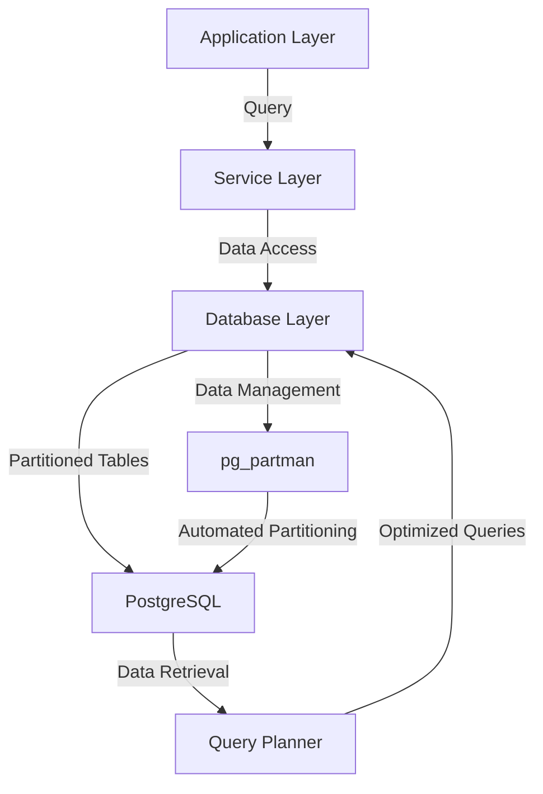

# Table Partitioning — PostgreSQL

## Overview and scope

Table partitioning is a critical technique used in PostgreSQL to enhance performance and manageability for large datasets. This document outlines the standards and best practices for implementing table partitioning within the Xentic platform. 

### Purpose
The purpose of this document is to provide a comprehensive guide on table partitioning in PostgreSQL, detailing when and how to partition tables effectively. It aims to ensure consistency and efficiency across all services that utilize PostgreSQL as their database management system.

### Audience
This document is intended for:
- Database Administrators (DBAs)
- Software Engineers
- Data Engineers
- System Architects

### Scope
This standard applies to all PostgreSQL databases managed within the Xentic organization. It covers:
- Guidelines for when to partition tables
- Types of partitioning supported (e.g., range, list)
- Implementation examples and best practices
- Maintenance and performance considerations

### Non-goals
This document does not aim to:
- Provide exhaustive coverage of PostgreSQL features unrelated to partitioning
- Serve as a tutorial for general PostgreSQL usage
- Address other database systems or technologies

### Glossary
- **Partitioning**: The process of dividing a large table into smaller, more manageable pieces called partitions.
- **Partition Key**: The column or columns used to determine how data is distributed across partitions.
- **pg_partman**: An extension for PostgreSQL that automates the partitioning process.
- **Partition Pruning**: The optimization technique where the query planner eliminates unnecessary partitions from consideration based on the query conditions.

### How This Standard Fits the Xentic Platform
This standard is integral to the Xentic platform as it aligns with our commitment to performance, scalability, and maintainability of our applications. By adhering to these guidelines, teams can ensure that their database interactions are efficient and that they leverage PostgreSQL's capabilities to handle large datasets effectively.

### When to Partition
Table partitioning should be considered under the following conditions:
- The table exceeds 50 million rows, leading to degraded performance.
- Regular bulk deletes of old data are necessary, which can benefit from partitioning.
- A clear natural partition key exists, such as a date or tenant identifier.

### Types of Partitioning
| Partition Type | Description |
|----------------|-------------|
| Range          | Divides data into ranges based on a specified column (e.g., date). |
| List           | Divides data based on a list of values for a specified column. |

### Example: Range Partitioning (time-series)
```sql
CREATE TABLE events (
    id          UUID        NOT NULL DEFAULT gen_random_uuid(),
    tenant_id   UUID        NOT NULL,
    event_type  TEXT        NOT NULL,
    occurred_at TIMESTAMPTZ NOT NULL DEFAULT now()
) PARTITION BY RANGE (occurred_at);

CREATE TABLE events_2024_01 PARTITION OF events
    FOR VALUES FROM ('2024-01-01') TO ('2024-02-01');
```

### Automating Partitioning with pg_partman
To automate the creation and management of partitions, use the `pg_partman` extension:
```sql
SELECT partman.create_parent(
    p_parent_table => 'public.events',
    p_control => 'occurred_at',
    p_type => 'range',
    p_interval => 'monthly',
    p_premake => 3
);
```

### Partition Pruning
Partition pruning optimizes query performance by scanning only relevant partitions. Example:
```sql
-- Scans only the January partition
SELECT * FROM events WHERE occurred_at BETWEEN '2024-01-01' AND '2024-01-31';
```

### Rules
- **MUST** always include the partition key in the primary key and indexes.
- **SHOULD** use `pg_partman` for automated maintenance of partitions.
- **MUST NOT** forget to verify partition pruning effectiveness using the `EXPLAIN` command.

## Standards and policies

1. **MUST** partition tables that exceed 50 million rows to maintain performance and manageability. This aligns with Xentic's performance standards.

2. **SHOULD** use range partitioning for time-series data, as it allows for efficient data retrieval and management. For example:
   ```sql
   CREATE TABLE events (
       id          UUID        NOT NULL DEFAULT gen_random_uuid(),
       tenant_id   UUID        NOT NULL,
       event_type  TEXT        NOT NULL,
       occurred_at TIMESTAMPTZ NOT NULL DEFAULT now()
   ) PARTITION BY RANGE (occurred_at);
   ```

3. **MUST NOT** use list partitioning unless the number of distinct values is small and well-defined. This can lead to excessive partition creation and management overhead.

4. **MUST** include the partition key in all primary keys and indexes to ensure data integrity and optimal performance. For instance:
   ```sql
   CREATE TABLE events (
       id          UUID        NOT NULL DEFAULT gen_random_uuid(),
       tenant_id   UUID        NOT NULL,
       event_type  TEXT        NOT NULL,
       occurred_at TIMESTAMPTZ NOT NULL DEFAULT now(),
       PRIMARY KEY (tenant_id, occurred_at)
   ) PARTITION BY RANGE (occurred_at);
   ```

5. **SHOULD** use `pg_partman` for managing partitions automatically. It simplifies the process of creating and maintaining partitions over time. Example configuration:
   ```sql
   SELECT partman.create_parent(
       p_parent_table => 'public.events',
       p_control => 'occurred_at',
       p_type => 'range',
       p_interval => 'monthly',
       p_premake => 3
   );
   ```

6. **MUST NOT** create partitions without considering the impact on query performance. Always analyze the queries that will be executed against the partitioned tables.

7. **SHOULD** implement partition pruning to enhance query performance. Ensure that queries are written to leverage this feature effectively. Example:
   ```sql
   SELECT * FROM events WHERE occurred_at BETWEEN '2024-01-01' AND '2024-01-31';
   ```

8. **MUST** regularly monitor partition sizes and performance metrics to identify when to create new partitions or merge existing ones.

9. **SHOULD** document the partitioning strategy for each table in the service repository, including the rationale for the chosen partition key and type.

10. **MUST NOT** forget to test partitioning strategies in a staging environment before deploying to production to avoid unexpected performance issues.

11. **MUST** ensure that all partitioned tables are included in backup and recovery plans, as partitions are treated as individual tables by PostgreSQL.

12. **SHOULD** consider the use of foreign keys across partitions carefully, as they can complicate data integrity and performance.

13. **MUST** use consistent naming conventions for partitions to facilitate easier management and identification. For example, use a format like `events_YYYY_MM` for monthly partitions.

14. **SHOULD** implement a strategy for archiving or purging old partitions based on business requirements to manage storage effectively.

15. **MUST NOT** forget to review partitioning policies annually to ensure they align with evolving data patterns and business needs.

By adhering to these standards and policies, Xentic teams can ensure effective and efficient use of PostgreSQL table partitioning, leading to improved application performance and scalability.

## Architecture and design

### Component Diagram



### Data Flows

1. **Application Layer to Service Layer**: 
   - Applications send queries to the service layer, which handles business logic and data access.
  
2. **Service Layer to Database Layer**: 
   - The service layer constructs SQL queries that interact with the database, specifically targeting partitioned tables.

3. **Database Layer to PostgreSQL**: 
   - The database layer executes the queries against the PostgreSQL database, which contains partitioned tables.

4. **PostgreSQL to Query Planner**: 
   - The query planner analyzes incoming queries and utilizes partition pruning to optimize performance by only considering relevant partitions.

5. **Query Planner to Database Layer**: 
   - The optimized queries are sent back to the database layer for execution.

6. **Database Management with pg_partman**: 
   - The pg_partman extension automates the creation and management of partitions based on defined strategies.

### Integration Points

- **pg_partman**: 
  - Integrates with PostgreSQL to automate partition management, ensuring that partitions are created, maintained, and dropped as needed.

- **Monitoring Tools**: 
  - Integration with monitoring tools to track partition performance and size, allowing for proactive management.

- **Backup Solutions**: 
  - Ensure that backup solutions are configured to handle partitioned tables correctly, treating each partition as an individual entity.

### Failure Domains

1. **Application Layer Failures**: 
   - Issues in the application layer can lead to failed queries or incorrect data retrieval, impacting user experience.

2. **Service Layer Failures**: 
   - If the service layer encounters errors, it may fail to construct valid queries, leading to application downtime.

3. **Database Layer Failures**: 
   - Failures in the database layer, such as connection issues or query timeouts, can result in data access problems.

4. **Partition Management Failures**: 
   - If pg_partman fails to create or manage partitions correctly, it can lead to performance degradation and increased query times.

5. **Monitoring Failures**: 
   - Lack of proper monitoring can result in unnoticed performance issues, leading to potential outages or slowdowns.

### Summary

By understanding the architecture, data flows, integration points, and failure domains, Xentic teams can effectively implement and manage PostgreSQL table partitioning. This will enhance performance, ensure data integrity, and facilitate efficient data management across services.

## Configuration reference

### application.yml

The following configuration settings are recommended for PostgreSQL partitioning in your `application.yml` file.

```yaml
spring:
  datasource:
    url: jdbc:postgresql://db.internal.xentic.io:5432/mydatabase
    username: myuser
    password: mypassword
    driver-class-name: org.postgresql.Driver
  jpa:
    hibernate:
      ddl-auto: update
    properties:
      hibernate:
        dialect: org.hibernate.dialect.PostgreSQLDialect
        show_sql: true
        format_sql: true
  partitioning:
    enabled: true
    partition_key: occurred_at
    partition_type: range
    partition_interval: monthly
    premake_partitions: 3
```

### Terraform Configuration

The following Terraform configuration can be used to set up PostgreSQL with partitioning enabled.

```hcl
resource "postgresql_database" "mydatabase" {
  name     = "mydatabase"
  owner    = "myuser"
  provider = postgresql
}

resource "postgresql_role" "myuser" {
  name     = "myuser"
  password = "mypassword"
  login    = true
}

resource "postgresql_table" "events" {
  database = postgresql_database.mydatabase.name
  schema   = "public"
  name     = "events"
  
  column {
    name = "id"
    type = "UUID"
    default = "gen_random_uuid()"
  }
  
  column {
    name = "tenant_id"
    type = "UUID"
  }
  
  column {
    name = "event_type"
    type = "TEXT"
  }
  
  column {
    name = "occurred_at"
    type = "TIMESTAMPTZ"
    default = "now()"
  }
  
  primary_key {
    columns = ["tenant_id", "occurred_at"]
  }
  
  partition_by {
    type = "RANGE"
    column = "occurred_at"
  }
}
```

### Environment Variables

The following environment variables should be set for PostgreSQL connection and partitioning configuration:

| Variable Name              | Default Value                    | Production Value                     |
|----------------------------|----------------------------------|--------------------------------------|
| `DB_URL`                   | `jdbc:postgresql://localhost:5432/mydatabase` | `jdbc:postgresql://db.internal.xentic.io:5432/mydatabase` |
| `DB_USERNAME`              | `myuser`                        | `prod_user`                          |
| `DB_PASSWORD`              | `mypassword`                    | `prod_password`                      |
| `PARTITIONING_ENABLED`     | `false`                         | `true`                               |
| `PARTITION_KEY`            | `occurred_at`                  | `occurred_at`                       |
| `PARTITION_TYPE`           | `range`                         | `range`                              |
| `PARTITION_INTERVAL`       | `monthly`                       | `monthly`                            |
| `PREMAKE_PARTITIONS`       | `1`                             | `3`                                  |

### SQL Example for Creating Partitions

To create partitions manually, you can use the following SQL commands:

```sql
CREATE TABLE events_2024_01 PARTITION OF events
    FOR VALUES FROM ('2024-01-01') TO ('2024-02-01');

CREATE TABLE events_2024_02 PARTITION OF events
    FOR VALUES FROM ('2024-02-01') TO ('2024-03-01');
```

### Summary

By following the configuration references outlined above, Xentic teams can ensure that PostgreSQL is set up correctly for effective table partitioning. This will help maintain performance and manageability as data grows.

## Implementation guide

To implement table partitioning in PostgreSQL effectively, follow these step-by-step instructions:

### Step 1: Define the Partitioning Strategy

Determine the partitioning strategy based on your data access patterns. Common strategies include:

- **Range Partitioning**: Useful for time-series data.
- **List Partitioning**: Suitable for categorical data.
- **Hash Partitioning**: Effective for evenly distributing data across partitions.

For this guide, we will use **Range Partitioning** based on the `occurred_at` timestamp.

### Step 2: Create the Base Table

Start by creating the base table that will hold the partitions. Use the following SQL command:

```sql
CREATE TABLE events (
    id UUID DEFAULT gen_random_uuid() PRIMARY KEY,
    tenant_id UUID NOT NULL,
    event_type TEXT NOT NULL,
    occurred_at TIMESTAMPTZ DEFAULT now() NOT NULL
) PARTITION BY RANGE (occurred_at);
```

### Step 3: Create Partitions

Next, create partitions for specific time ranges. For example, to create monthly partitions for the year 2024:

```sql
CREATE TABLE events_2024_01 PARTITION OF events
    FOR VALUES FROM ('2024-01-01') TO ('2024-02-01');

CREATE TABLE events_2024_02 PARTITION OF events
    FOR VALUES FROM ('2024-02-01') TO ('2024-03-01');

CREATE TABLE events_2024_03 PARTITION OF events
    FOR VALUES FROM ('2024-03-01') TO ('2024-04-01');
```

### Step 4: Insert Data into the Base Table

When inserting data, PostgreSQL will automatically route the records to the correct partition based on the `occurred_at` value:

```sql
INSERT INTO events (tenant_id, event_type, occurred_at) VALUES
    (gen_random_uuid(), 'login', '2024-01-15 10:00:00'),
    (gen_random_uuid(), 'logout', '2024-02-20 14:30:00');
```

### Step 5: Querying Partitioned Tables

To take advantage of partition pruning, write queries that filter based on the partition key:

```sql
SELECT * FROM events WHERE occurred_at BETWEEN '2024-01-01' AND '2024-01-31';
```

### Step 6: Automate Partition Management

Consider using the `pg_partman` extension for automated partition management. Install it and configure the partitioning strategy:

```sql
CREATE EXTENSION pg_partman;

SELECT partman.create_parent('public.events', 'occurred_at', 'partman', 'monthly');
```

### Step 7: Monitor Partition Performance

Regularly check partition sizes and performance metrics using:

```sql
SELECT
    relname AS partition_name,
    pg_size_pretty(pg_total_relation_size(relid)) AS size
FROM
    pg_partitioned_table pt
JOIN
    pg_class c ON c.oid = pt.partrelid;
```

### Step 8: Archive or Drop Old Partitions

Implement a strategy for archiving or dropping old partitions based on business requirements. For example, to drop a partition:

```sql
DROP TABLE events_2024_01;
```

### Step 9: Test in Staging

Before deploying partitioning strategies in production, **MUST NOT** forget to test in a staging environment to ensure that performance meets expectations.

### Step 10: Document the Partitioning Strategy

Maintain documentation for your partitioning strategy, including:

- Rationale for the chosen partition key and type.
- Query patterns that benefit from partitioning.
- Maintenance strategies for old partitions.

### Summary

By following these steps, Xentic teams can implement PostgreSQL table partitioning effectively, ensuring enhanced performance and scalability for large datasets. Regular monitoring and documentation will further support ongoing management and optimization of partitioned tables.

## Security requirements

### Threat Model Summary

In the context of PostgreSQL table partitioning at Xentic, the following threats must be considered:

- **Unauthorized Data Access**: Attackers may attempt to gain unauthorized access to sensitive data.
- **Data Integrity Violations**: Malicious users might try to manipulate or corrupt data within partitions.
- **Denial of Service (DoS)**: Attackers could overwhelm the database with excessive requests, leading to service unavailability.
- **Insider Threats**: Employees with access could misuse their privileges to access or alter data inappropriately.

### Authentication and Authorization

Xentic MUST implement robust authentication and authorization mechanisms to secure PostgreSQL databases. The following measures are recommended:

- **Role-Based Access Control (RBAC)**: Define roles with specific permissions to limit access to sensitive data.
  
  Example SQL for creating roles:
  ```sql
  CREATE ROLE readonly_user WITH LOGIN PASSWORD 'securepassword';
  GRANT SELECT ON ALL TABLES IN SCHEMA public TO readonly_user;
  ```

- **Connection Encryption**: All connections to the database MUST use SSL to encrypt data in transit. The PostgreSQL configuration should include:
  ```plaintext
  ssl = on
  ssl_cert_file = 'server.crt'
  ssl_key_file = 'server.key'
  ```

### Secrets Management

Secrets such as database passwords MUST NOT be hardcoded in application code. Instead, utilize a secrets management tool such as HashiCorp Vault or AWS Secrets Manager. 

Example of using environment variables for secrets:
```bash
export DB_PASSWORD=$(vault kv get -field=password secret/database)
```

### Input Validation

All inputs to the database MUST be validated to prevent SQL injection attacks. Use prepared statements and parameterized queries in application code.

Example in Java:
```java
String sql = "SELECT * FROM events WHERE tenant_id = ?";
try (PreparedStatement pstmt = connection.prepareStatement(sql)) {
    pstmt.setObject(1, tenantId);
    ResultSet rs = pstmt.executeQuery();
    // process results
}
```

### Audit Logging

Xentic MUST enable audit logging to track access and modifications to the database. This includes:

- **Data Access Logs**: Log all SELECT queries to monitor who accessed what data.
- **Modification Logs**: Log all INSERT, UPDATE, and DELETE operations to track changes.

PostgreSQL configuration for logging:
```plaintext
logging_collector = on
log_directory = 'pg_log'
log_filename = 'postgresql-%Y-%m-%d_%H%M%S.log'
log_statement = 'all'
```

### Summary

By implementing these security requirements, Xentic can significantly mitigate risks associated with PostgreSQL table partitioning. Ensuring robust authentication and authorization, proper secrets management, thorough input validation, and comprehensive audit logging are essential for maintaining the integrity and confidentiality of data.

## Testing strategy

To ensure the reliability and performance of PostgreSQL table partitioning at Xentic, a comprehensive testing strategy must be implemented. This strategy includes unit tests, integration tests, and contract tests, each targeting specific aspects of the database functionality. The following outlines the coverage targets and provides example test classes to guide the implementation.

### Testing Types

1. **Unit Tests**
   - Validate individual components of the application that interact with the database.
   - Coverage target: 80% of all data access methods.

2. **Integration Tests**
   - Test the interaction between the application and the PostgreSQL database, ensuring that partitioning works as expected.
   - Coverage target: 90% of critical data access paths.

3. **Contract Tests**
   - Ensure that the application’s expectations of the database schema and behavior are met.
   - Coverage target: 100% of the defined contract between the application and the database.

### Example Test Classes

#### Unit Test Example

Use JUnit and Mockito to create unit tests for the data access layer. Below is an example test class for the `EventRepository`.

```java
import static org.mockito.Mockito.*;
import static org.junit.jupiter.api.Assertions.*;
import org.junit.jupiter.api.BeforeEach;
import org.junit.jupiter.api.Test;

public class EventRepositoryTest {
    private EventRepository eventRepository;
    private DatabaseConnection mockConnection;

    @BeforeEach
    public void setUp() {
        mockConnection = mock(DatabaseConnection.class);
        eventRepository = new EventRepository(mockConnection);
    }

    @Test
    public void testInsertEvent() {
        Event event = new Event(UUID.randomUUID(), "login", Timestamp.valueOf("2024-01-15 10:00:00"));
        when(mockConnection.execute(anyString())).thenReturn(1);

        int result = eventRepository.insertEvent(event);
        assertEquals(1, result);
    }
}
```

#### Integration Test Example

Integration tests should validate the actual database interactions. Below is an example using Spring Boot's testing framework.

```java
import static org.springframework.test.web.servlet.request.MockMvcRequestBuilders.post;
import static org.springframework.test.web.servlet.result.MockMvcResultMatchers.status;
import org.junit.jupiter.api.Test;
import org.springframework.beans.factory.annotation.Autowired;
import org.springframework.boot.test.autoconfigure.web.servlet.AutoConfigureMockMvc;
import org.springframework.boot.test.context.SpringBootTest;

@SpringBootTest
@AutoConfigureMockMvc
public class EventControllerIntegrationTest {

    @Autowired
    private MockMvc mockMvc;

    @Test
    public void testInsertEvent() throws Exception {
        String eventJson = "{\"tenantId\":\"" + UUID.randomUUID() + "\",\"eventType\":\"login\",\"occurredAt\":\"2024-01-15T10:00:00Z\"}";

        mockMvc.perform(post("/events")
                .contentType("application/json")
                .content(eventJson))
                .andExpect(status().isCreated());
    }
}
```

#### Contract Test Example

Contract tests can be implemented using tools like Pact to ensure that the application and database schema align. Below is a simplified example.

```java
import au.com.dius.pact.consumer.junit5.PactConsumerTestExt;
import au.com.dius.pact.consumer.junit5.Pact;
import au.com.dius.pact.consumer.dsl.PactDslWithProvider;
import org.junit.jupiter.api.extension.ExtendWith;

@ExtendWith(PactConsumerTestExt.class)
public class EventContractTest {

    @Pact(consumer = "EventService", provider = "PostgreSQLDatabase")
    public RequestResponsePact createPact(PactDslWithProvider builder) {
        return builder
                .given("Event exists")
                .uponReceiving("A request to insert an event")
                .withContentType("application/json")
                .body("{\"tenantId\":\"UUID\",\"eventType\":\"login\",\"occurredAt\":\"2024-01-15T10:00:00Z\"}")
                .toPact();
    }

    // Additional test methods to verify the contract
}
```

### Coverage Targets

| Test Type         | Coverage Target |
|-------------------|-----------------|
| Unit Tests        | 80%             |
| Integration Tests  | 90%             |
| Contract Tests    | 100%            |

### Conclusion

By implementing a robust testing strategy that includes unit, integration, and contract tests, Xentic can ensure the reliability and performance of PostgreSQL table partitioning. Adhering to the specified coverage targets will help maintain high-quality code and prevent regressions as the application evolves.

## Observability and operations

To ensure effective observability and operations for PostgreSQL table partitioning at Xentic, the following components must be implemented: metrics, logs, traces, dashboards, alerts, and service level objectives (SLOs). Each of these elements plays a critical role in maintaining the health and performance of the database system.

### Metrics

Xentic MUST collect the following key metrics to monitor PostgreSQL performance:

- **Query Performance**: Track the execution time of queries, especially those involving partitioned tables.
- **Partition Size**: Monitor the size of each partition to ensure they are within acceptable limits.
- **Disk Usage**: Keep an eye on overall disk usage to prevent running out of space.
- **Connection Count**: Monitor the number of active connections to the database.

Example of Prometheus configuration for PostgreSQL metrics:
```yaml
scrape_configs:
  - job_name: 'postgres'
    static_configs:
      - targets: ['localhost:5432']
    metrics_path: '/metrics'
```

### Logs

PostgreSQL MUST be configured to log all relevant activities. The following logging settings are recommended:

- **Log Level**: Set to `info` or `debug` to capture detailed information.
- **Slow Query Logging**: Enable logging for queries that exceed a specific execution time.

Example PostgreSQL configuration for logging:
```plaintext
log_min_duration_statement = 1000  # Log statements that take longer than 1000 ms
log_statement = 'all'                # Log all statements
```

### Traces

Xentic SHOULD implement distributed tracing to gain insights into query performance across microservices. Tools like OpenTelemetry or Jaeger can be used for this purpose.

Example of using OpenTelemetry with Java:
```java
import io.opentelemetry.api.OpenTelemetry;
import io.opentelemetry.api.trace.Tracer;

public class DatabaseService {
    private static final Tracer tracer = OpenTelemetry.getGlobalTracer("com.xentic.database");

    public void executeQuery(String query) {
        Span span = tracer.spanBuilder("executeQuery").startSpan();
        try {
            // Execute the query
        } finally {
            span.end();
        }
    }
}
```

### Dashboards

Xentic MUST create dashboards to visualize key metrics and logs. Grafana is recommended for this purpose. Dashboards should include:

- Query performance over time
- Partition sizes and disk usage
- Active connection counts

Example Grafana dashboard configuration:
```json
{
  "title": "PostgreSQL Metrics",
  "panels": [
    {
      "type": "graph",
      "title": "Query Performance",
      "targets": [
        {
          "target": "avg(query_duration_seconds)"
        }
      ]
    },
    {
      "type": "graph",
      "title": "Partition Size",
      "targets": [
        {
          "target": "partition_size_bytes"
        }
      ]
    }
  ]
}
```

### Alerts

Xentic MUST set up alerts based on the collected metrics. Alerts should cover:

- High query execution times
- Large partition sizes
- Disk usage nearing capacity
- Excessive connection counts

Example alert configuration for Prometheus:
```yaml
groups:
  - name: postgres-alerts
    rules:
      - alert: HighQueryExecutionTime
        expr: avg(query_duration_seconds) > 1
        for: 5m
        labels:
          severity: critical
        annotations:
          summary: "High query execution time detected"
          description: "Query execution time exceeds 1 second for more than 5 minutes."
```

### Service Level Objectives (SLOs)

Xentic MUST define SLOs to ensure service reliability. Suggested SLOs include:

- **Query Latency**: 95th percentile query execution time should be less than 500 ms.
- **Uptime**: Database availability should be 99.9% over a month.
- **Error Rate**: The error rate for database queries should be less than 1%.

### On-call Runbook Steps

In case of a database incident, the following on-call runbook steps MUST be followed:

1. **Acknowledge the Alert**: Confirm receipt of the alert and begin investigation.
2. **Check Metrics**: Review the relevant metrics on the dashboard to identify anomalies.
3. **Analyze Logs**: Look for error messages or slow queries in the PostgreSQL logs.
4. **Check Database Health**: Use `pg_stat_activity` to check for long-running queries or blocked transactions.
5. **Scale Resources**: If necessary, consider scaling up database resources (CPU, memory).
6. **Communicate**: Update stakeholders on the status of the incident and any actions taken.
7. **Post-Incident Review**: After resolution, conduct a review to identify root causes and preventive measures.

By implementing these observability and operational practices, Xentic can ensure that PostgreSQL table partitioning is effectively monitored and maintained, leading to improved performance and reliability.

## Migration and versioning

To maintain the integrity and performance of PostgreSQL table partitioning at Xentic, a well-defined migration and versioning strategy is essential. This section outlines the upgrade paths, deprecation policy, backward compatibility, and rollback procedures.

### Upgrade Paths

Xentic MUST establish clear upgrade paths for database migrations. Each migration should be versioned and documented. The following guidelines MUST be adhered to:

- **Semantic Versioning**: Use semantic versioning (MAJOR.MINOR.PATCH) for database schema versions.
- **Migration Scripts**: All changes MUST be encapsulated in migration scripts that can be executed in sequence.

Example of a migration script in SQL:
```sql
-- Version 1.0.0: Create initial partitioned table
CREATE TABLE events (
    id UUID PRIMARY KEY,
    tenant_id UUID NOT NULL,
    event_type VARCHAR(50) NOT NULL,
    occurred_at TIMESTAMP NOT NULL
) PARTITION BY RANGE (occurred_at);

-- Version 1.1.0: Add a new partition for the year 2024
CREATE TABLE events_2024 PARTITION OF events
FOR VALUES FROM ('2024-01-01') TO ('2025-01-01');
```

### Deprecation Policy

Xentic MUST implement a deprecation policy for database features and schemas. This policy should include:

- **Notification**: Notify stakeholders at least one release cycle in advance of any deprecations.
- **Grace Period**: Provide a grace period of at least two release cycles before removing deprecated features.
- **Documentation**: Maintain clear documentation on deprecated features and recommended alternatives.

### Backward Compatibility

Backward compatibility MUST be a priority during migrations. The following practices should be adopted:

- **Non-Destructive Changes**: Migrations MUST avoid destructive changes that could break existing functionality.
- **Feature Toggles**: Implement feature toggles to allow gradual rollout of new features without affecting existing users.

Example of a feature toggle in a Spring Boot application:
```yaml
feature:
  newPartitioning: true
```

### Rollback Procedures

In the event of a failed migration, Xentic MUST have a rollback strategy in place. This strategy should include:

- **Rollback Scripts**: Maintain rollback scripts for each migration to revert changes if necessary.
- **Testing Rollbacks**: Regularly test rollback procedures in a staging environment to ensure they work as expected.

Example of a rollback script:
```sql
-- Rollback for version 1.1.0: Drop partition for the year 2024
DROP TABLE IF EXISTS events_2024;
```

### Versioning Strategy

Xentic SHOULD adopt a versioning strategy for database schemas that includes:

| Version | Description                                   | Status       |
|---------|-----------------------------------------------|--------------|
| 1.0.0   | Initial creation of partitioned table        | Active       |
| 1.1.0   | Added partition for the year 2024            | Active       |
| 1.2.0   | Introduced new indexing strategy              | Planned      |
| 2.0.0   | Major changes to event schema (breaking change)| Planned      |

### Migration Testing

Before deploying migrations to production, Xentic MUST conduct thorough testing:

- **Unit Tests**: Validate migration scripts with unit tests to ensure they execute successfully.
- **Integration Tests**: Test the entire migration process in a staging environment that mirrors production.

Example of a migration test in Java:
```java
@Test
public void testMigration() {
    DatabaseMigration migration = new DatabaseMigration();
    migration.run(); // Execute migration script
    assertTrue(checkPartitionExists("events_2024")); // Validate partition creation
}
```

By adhering to these migration and versioning standards, Xentic can ensure that PostgreSQL table partitioning remains robust, maintainable, and scalable, thus supporting the evolving needs of the organization.

## FAQ, anti-patterns, and checklists

### FAQ

1. **What is table partitioning in PostgreSQL?**
   - Table partitioning is a method of dividing a large table into smaller, more manageable pieces, while still treating it as a single table.

2. **Why should I use table partitioning?**
   - Partitioning can improve query performance, simplify maintenance tasks, and enhance data management by allowing operations to be performed on individual partitions.

3. **What types of partitioning does PostgreSQL support?**
   - PostgreSQL supports range, list, and hash partitioning.

4. **How do I create a partitioned table?**
   - Use the `PARTITION BY` clause in the `CREATE TABLE` statement.
   ```sql
   CREATE TABLE sales (
       id SERIAL PRIMARY KEY,
       sale_date DATE NOT NULL
   ) PARTITION BY RANGE (sale_date);
   ```

5. **Can I alter a partitioned table?**
   - Yes, you can add or drop partitions using `ALTER TABLE` commands.
   ```sql
   ALTER TABLE sales ADD PARTITION sales_2024 FOR VALUES FROM ('2024-01-01') TO ('2025-01-01');
   ```

6. **What are the performance implications of using partitioning?**
   - Properly implemented partitioning can significantly enhance performance for large datasets, but improper use may lead to overhead in query planning and execution.

7. **How do I query data from a partitioned table?**
   - You can query a partitioned table just like a regular table. PostgreSQL will automatically route queries to the appropriate partitions.
   ```sql
   SELECT * FROM sales WHERE sale_date = '2024-06-15';
   ```

8. **What happens if I forget to add a partition?**
   - Queries for data that falls outside the defined partitions will return no results. It’s crucial to plan partitions according to expected data distribution.

9. **Can I use indexes on partitioned tables?**
   - Yes, you can create indexes on individual partitions, and it is recommended to do so for optimized query performance.

10. **How do I drop a partition?**
    - Use the `DROP TABLE` command on the specific partition.
    ```sql
    DROP TABLE sales_2023;
    ```

### Anti-patterns

| Anti-pattern                          | Description                                                                                   |
|---------------------------------------|-----------------------------------------------------------------------------------------------|
| Over-partitioning                     | Creating too many partitions can lead to increased overhead and complexity in query planning. |
| Using the same partitioning strategy for all tables | Not all tables benefit from the same partitioning strategy; tailor the approach based on usage patterns. |
| Ignoring maintenance on partitions    | Failing to regularly review and maintain partitions can lead to performance degradation.      |
| Not using indexes on partitions       | Neglecting to index partitions can result in slow query performance, negating the benefits of partitioning. |
| Hardcoding partition values            | Using hardcoded values in queries can lead to maintenance challenges; use dynamic values instead. |

### Pre-merge Checklist

- [ ] Ensure all partitioning strategies are documented.
- [ ] Validate that migration scripts have been created for all changes.
- [ ] Confirm that all relevant stakeholders have been notified of upcoming changes.
- [ ] Run integration tests in a staging environment to validate partitioning.
- [ ] Review and update any relevant documentation.

### Production Checklist

- [ ] Monitor performance metrics post-deployment to ensure no degradation occurs.
- [ ] Confirm that all new partitions are being utilized as expected.
- [ ] Ensure that logging and monitoring are configured for the new partitioned tables.
- [ ] Validate that alerts are set up for any potential issues related to partitioning.
- [ ] Conduct a post-implementation review to assess the effectiveness of the partitioning strategy.
