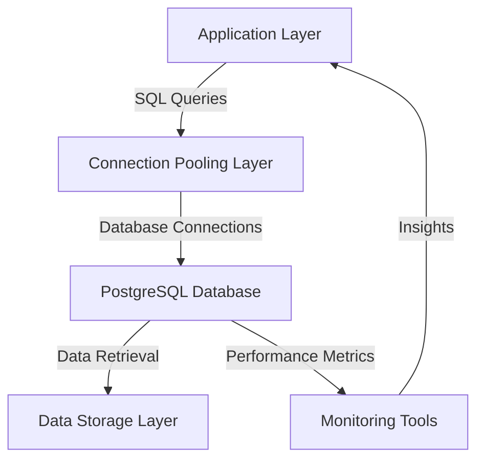

# Query Optimisation — PostgreSQL

## Overview and scope

The purpose of this document is to establish best practices and guidelines for query optimization in PostgreSQL within the Xentic platform. This standard aims to enhance database performance, reduce latency, and ensure efficient resource utilization across all services that interact with PostgreSQL databases.

### Audience

This document is intended for:

- Database Administrators (DBAs)
- Software Engineers
- Data Analysts
- Technical Leads

### Scope

This standard covers:

- Techniques for optimizing SQL queries in PostgreSQL
- Common anti-patterns and their solutions
- Connection pooling strategies
- Performance monitoring and analysis tools

It applies to all PostgreSQL databases used within Xentic services, ensuring a consistent approach to query optimization across the organization.

### Non-goals

This document does NOT cover:

- Database design principles
- Data modeling best practices
- Non-PostgreSQL database systems
- Application-level caching strategies

### Glossary

| Term               | Definition                                                                 |
|--------------------|-----------------------------------------------------------------------------|
| Query Optimization  | The process of improving the efficiency of SQL queries to reduce execution time and resource consumption. |
| Seq Scan           | A sequential scan, where PostgreSQL reads every row in a table to find matching rows. |
| Index              | A database structure that improves the speed of data retrieval operations on a database table. |
| Connection Pooling | A method of creating and managing a pool of database connections to improve performance and resource management. |

### How this standard fits the Xentic platform

This standard aligns with Xentic's commitment to delivering high-performance applications by ensuring that all teams adhere to proven techniques for query optimization. By following these guidelines, we can minimize the risk of performance bottlenecks and enhance the overall user experience across our services.

---

### EXPLAIN ANALYZE Workflow

To analyze the performance of a query, you MUST use the `EXPLAIN ANALYZE` command. Below is an example of how to use it effectively:

```sql
EXPLAIN (ANALYZE, BUFFERS, FORMAT TEXT)
SELECT u.id, u.email, COUNT(o.id) as order_count
FROM com.xentic.users u
LEFT JOIN com.xentic.orders o ON o.user_id = u.id
WHERE u.is_active = true
GROUP BY u.id ORDER BY order_count DESC LIMIT 20;
```

**Watch for:**
- `Seq Scan` on large tables
- High `Rows Removed by Filter`
- Low `shared hit` ratio

### Common Anti-Patterns

Identifying and avoiding common anti-patterns is crucial for maintaining optimal query performance. Below are examples of bad practices and their recommended alternatives:

| Anti-Pattern                                      | Bad Example                                                               | Good Example                                                            |
|--------------------------------------------------|--------------------------------------------------------------------------|-------------------------------------------------------------------------|
| Function on indexed column                        | ```sql WHERE LOWER(email) = 'user@xentic.com' ```                      | ```sql CREATE INDEX idx_users_email_lower ON com.xentic.users(LOWER(email)); ``` |
| Selecting all columns                             | ```sql SELECT * FROM com.xentic.users WHERE ... ```                    | ```sql SELECT id, email, full_name FROM com.xentic.users WHERE ... ``` |
| OFFSET at scale                                   | ```sql SELECT * FROM com.xentic.events ORDER BY created_at DESC LIMIT 20 OFFSET 10000; ``` | ```sql SELECT * FROM com.xentic.events WHERE created_at < $last_cursor ORDER BY created_at DESC LIMIT 20; ``` |

### Connection Pool Sizing

For optimal connection pooling, the following formula MUST be used:

```
pool_size = (core_count * 2) + effective_spindle_count
```

In high-concurrency environments, you MUST use PgBouncer in transaction mode to manage connections effectively. This approach ensures that the database can handle a larger number of simultaneous requests without overwhelming the server resources.

## Standards and policies

1. **MUST** use appropriate indexing strategies to enhance query performance. Indexes should be created on columns frequently used in WHERE clauses, JOIN conditions, and ORDER BY clauses.

   ```sql
   CREATE INDEX idx_orders_user_id ON com.xentic.orders(user_id);
   ```

2. **MUST NOT** use `SELECT *` in production queries. Always specify the required columns to reduce data transfer and processing time.

   ```sql
   SELECT id, email FROM com.xentic.users WHERE is_active = true;
   ```

3. **SHOULD** regularly analyze and vacuum the database to maintain optimal performance. This can be automated using cron jobs or scheduled tasks.

   ```sql
   VACUUM ANALYZE com.xentic.users;
   ```

4. **MUST** avoid using functions on indexed columns in WHERE clauses, as this can prevent the use of indexes.

   ```sql
   -- Bad Example
   SELECT * FROM com.xentic.users WHERE LOWER(email) = 'user@xentic.com'; 

   -- Good Example
   SELECT * FROM com.xentic.users WHERE email = 'user@xentic.com';
   ```

5. **MUST** utilize `EXPLAIN ANALYZE` to evaluate the execution plan of queries. This practice helps identify performance bottlenecks.

6. **SHOULD** use JOINs judiciously. Prefer INNER JOINs over OUTER JOINs when possible, as they are generally more efficient.

   ```sql
   SELECT u.id, u.email 
   FROM com.xentic.users u
   INNER JOIN com.xentic.orders o ON o.user_id = u.id
   WHERE u.is_active = true;
   ```

7. **MUST NOT** use OFFSET with large values in pagination. Instead, implement keyset pagination for better performance.

   ```sql
   -- Bad Example
   SELECT * FROM com.xentic.events ORDER BY created_at DESC LIMIT 20 OFFSET 10000;

   -- Good Example
   SELECT * FROM com.xentic.events WHERE created_at < $last_cursor ORDER BY created_at DESC LIMIT 20;
   ```

8. **MUST** ensure that all queries are parameterized to prevent SQL injection attacks and improve cache efficiency.

   ```sql
   PREPARE stmt AS SELECT * FROM com.xentic.users WHERE email = $1;
   ```

9. **SHOULD** use aggregate functions wisely. When using COUNT, SUM, or AVG, ensure that the underlying data is indexed appropriately.

10. **MUST NOT** perform large updates or deletes without batching. This can lead to excessive lock contention and impact performance.

    ```sql
    -- Bad Example
    DELETE FROM com.xentic.orders WHERE created_at < NOW() - INTERVAL '1 year';

    -- Good Example
    DELETE FROM com.xentic.orders WHERE id IN (SELECT id FROM com.xentic.orders WHERE created_at < NOW() - INTERVAL '1 year' LIMIT 1000);
    ```

11. **MUST** monitor query performance using tools such as pg_stat_statements to identify slow queries and optimize them accordingly.

12. **SHOULD** use materialized views for complex queries that are frequently executed but do not require real-time data.

    ```sql
    CREATE MATERIALIZED VIEW mv_user_order_counts AS
    SELECT user_id, COUNT(*) as order_count
    FROM com.xentic.orders
    GROUP BY user_id;
    ```

13. **MUST NOT** ignore the impact of network latency. When designing applications, consider the physical proximity of application servers to the database servers.

14. **SHOULD** implement connection pooling using PgBouncer to manage database connections effectively, especially in high-concurrency environments.

15. **MUST** keep PostgreSQL and its extensions up to date to benefit from performance improvements and security patches.

By adhering to these standards and policies, Xentic teams will ensure that PostgreSQL queries are optimized for performance and reliability, contributing to the overall efficiency of our services.

## Architecture and design

The architecture for query optimization in PostgreSQL at Xentic consists of multiple components that interact to ensure efficient data retrieval and manipulation. Below is a component diagram that illustrates the key elements involved in this architecture.



### Data Flows

1. **Application Layer**: This is where the business logic resides. Applications send SQL queries to the Connection Pooling Layer.
2. **Connection Pooling Layer**: Manages database connections to optimize resource usage. It queues incoming requests and reuses existing connections.
3. **PostgreSQL Database**: Processes incoming SQL queries and retrieves data from the Data Storage Layer.
4. **Data Storage Layer**: Contains the actual data stored in PostgreSQL tables.
5. **Monitoring Tools**: Collects performance metrics from the database, which are then sent back to the Application Layer for analysis and optimization.

### Integration Points

- **Application Layer to Connection Pooling Layer**: Applications must utilize a connection pooling library like PgBouncer to manage database connections efficiently.
- **Connection Pooling Layer to PostgreSQL Database**: The connection pooling layer interacts with the database to execute queries and retrieve results.
- **PostgreSQL Database to Monitoring Tools**: Performance metrics are gathered from the database to monitor query execution times, resource usage, and identify slow queries.

### Failure Domains

- **Application Layer**: If the application encounters issues, it may result in failed queries or degraded performance. Error handling mechanisms MUST be implemented.
- **Connection Pooling Layer**: Connection pool exhaustion can lead to application timeouts. Monitoring and alerting MUST be in place to manage connection limits.
- **PostgreSQL Database**: Database downtime or slow performance can significantly impact application functionality. Regular maintenance and monitoring are essential.
- **Data Storage Layer**: Data corruption or loss can occur due to hardware failures. Implementing backup and recovery strategies MUST be a priority.

### Configuration Examples

#### Connection Pooling Configuration (PgBouncer)

```ini
[databases]
* = host=localhost dbname=xentic user=xentic password=secret

[pgbouncer]
listen_addr = 0.0.0.0
listen_port = 6432
pool_mode = transaction
max_client_conn = 100
default_pool_size = 20
```

#### PostgreSQL Configuration (postgresql.conf)

```conf
shared_buffers = 256MB
work_mem = 4MB
maintenance_work_mem = 64MB
effective_cache_size = 768MB
```

#### Monitoring Tool Configuration (pg_stat_statements)

```sql
CREATE EXTENSION pg_stat_statements;

-- Add to postgresql.conf
shared_preload_libraries = 'pg_stat_statements'

-- Query to view statistics
SELECT * FROM pg_stat_statements ORDER BY total_time DESC LIMIT 10;
```

By adhering to this architecture and design, Xentic can ensure that PostgreSQL queries are optimized for performance, reliability, and scalability.

## Configuration reference

### application.yml

The following configuration settings MUST be included in the `application.yml` file for optimal PostgreSQL performance:

```yaml
spring:
  datasource:
    url: jdbc:postgresql://localhost:5432/xentic
    username: xentic
    password: secret
    driver-class-name: org.postgresql.Driver
    hikari:
      maximum-pool-size: 20
      minimum-idle: 5
      idle-timeout: 30000
      connection-timeout: 30000
      max-lifetime: 1800000
```

### Terraform Configuration

The following Terraform configuration MUST be used to provision PostgreSQL instances with optimal settings:

```hcl
resource "aws_db_instance" "xentic_db" {
  identifier         = "xentic-db"
  engine            = "postgres"
  engine_version    = "14.0"
  instance_class    = "db.t3.medium"
  allocated_storage  = 20
  storage_type      = "gp2"
  username          = "xentic"
  password          = "secret"
  db_name           = "xentic"
  skip_final_snapshot = true

  tags = {
    Name = "Xentic Database"
  }
}

resource "aws_db_parameter_group" "xentic_db_params" {
  name   = "xentic-db-params"
  family = "postgres14"

  parameter {
    name  = "shared_buffers"
    value = "256MB"
  }

  parameter {
    name  = "work_mem"
    value = "4MB"
  }

  parameter {
    name  = "maintenance_work_mem"
    value = "64MB"
  }

  parameter {
    name  = "effective_cache_size"
    value = "768MB"
  }
}
```

### Environment Variables

The following environment variables MUST be set for the application to connect to the PostgreSQL database:

| Variable Name        | Default Value       | Production Value           |
|----------------------|---------------------|-----------------------------|
| `DB_HOST`            | `localhost`         | `db.xentic.internal`        |
| `DB_PORT`            | `5432`              | `5432`                      |
| `DB_NAME`            | `xentic`            | `xentic`                    |
| `DB_USER`            | `xentic`            | `xentic`                    |
| `DB_PASSWORD`        | `secret`            | `secure_password_here`      |
| `DB_MAX_POOL_SIZE`   | `20`                | `50`                        |
| `DB_MIN_IDLE`        | `5`                 | `10`                        |
| `DB_IDLE_TIMEOUT`    | `30000`             | `30000`                    |
| `DB_CONNECTION_TIMEOUT` | `30000`         | `30000`                    |
| `DB_MAX_LIFETIME`    | `1800000`           | `1800000`                  |

### SQL Configuration for Performance

The following SQL commands MUST be executed to set up performance-related configurations in PostgreSQL:

```sql
ALTER SYSTEM SET shared_buffers = '256MB';
ALTER SYSTEM SET work_mem = '4MB';
ALTER SYSTEM SET maintenance_work_mem = '64MB';
ALTER SYSTEM SET effective_cache_size = '768MB';

-- Reload configuration
SELECT pg_reload_conf();
```

### Monitoring Configuration

To monitor the performance of PostgreSQL, the following settings MUST be added:

```sql
CREATE EXTENSION IF NOT EXISTS pg_stat_statements;

-- Add to postgresql.conf
shared_preload_libraries = 'pg_stat_statements'

-- Query to view statistics
SELECT * FROM pg_stat_statements ORDER BY total_time DESC LIMIT 10;
```

By adhering to these configuration references, Xentic teams will ensure that PostgreSQL is optimally configured for performance, reliability, and scalability.

## Implementation guide

To implement query optimization in PostgreSQL at Xentic, follow the step-by-step guide below. This guide includes code examples, configurations, and best practices to ensure efficient database interactions.

### Step 1: Set Up Database Connection

Ensure that your application is configured to connect to the PostgreSQL database using the `application.yml` file. 

```yaml
spring:
  datasource:
    url: jdbc:postgresql://db.xentic.internal:5432/xentic
    username: xentic
    password: secure_password_here
    driver-class-name: org.postgresql.Driver
    hikari:
      maximum-pool-size: 50
      minimum-idle: 10
      idle-timeout: 30000
      connection-timeout: 30000
      max-lifetime: 1800000
```

### Step 2: Implement Connection Pooling

Use HikariCP for connection pooling. Ensure that the pool size is configured appropriately to handle the expected load.

```java
import com.zaxxer.hikari.HikariConfig;
import com.zaxxer.hikari.HikariDataSource;

public class DataSourceConfig {
    public HikariDataSource dataSource() {
        HikariConfig config = new HikariConfig();
        config.setJdbcUrl("jdbc:postgresql://db.xentic.internal:5432/xentic");
        config.setUsername("xentic");
        config.setPassword("secure_password_here");
        config.setMaximumPoolSize(50);
        config.setMinimumIdle(10);
        config.setIdleTimeout(30000);
        config.setConnectionTimeout(30000);
        config.setMaxLifetime(1800000);
        return new HikariDataSource(config);
    }
}
```

### Step 3: Optimize Queries

When writing SQL queries, always aim for efficiency. Use indexes, avoid SELECT *, and limit the number of rows returned.

#### Example of an Optimized Query

```sql
SELECT user_id, COUNT(*) AS order_count
FROM com.xentic.orders
WHERE created_at >= NOW() - INTERVAL '30 days'
GROUP BY user_id
ORDER BY order_count DESC
LIMIT 10;
```

### Step 4: Use Indexes

Create indexes on columns that are frequently used in WHERE clauses or as join keys.

```sql
CREATE INDEX idx_orders_created_at ON com.xentic.orders (created_at);
CREATE INDEX idx_orders_user_id ON com.xentic.orders (user_id);
```

### Step 5: Implement Materialized Views

For complex queries that are executed frequently, consider using materialized views to improve performance.

```sql
CREATE MATERIALIZED VIEW mv_recent_orders AS
SELECT user_id, COUNT(*) AS order_count
FROM com.xentic.orders
WHERE created_at >= NOW() - INTERVAL '30 days'
GROUP BY user_id;
```

### Step 6: Monitor Query Performance

Utilize `pg_stat_statements` to monitor query performance and identify slow queries.

```sql
CREATE EXTENSION IF NOT EXISTS pg_stat_statements;

-- Add to postgresql.conf
shared_preload_libraries = 'pg_stat_statements';

-- Query to view statistics
SELECT * FROM pg_stat_statements ORDER BY total_time DESC LIMIT 10;
```

### Step 7: Regular Maintenance

Perform regular maintenance tasks such as vacuuming and analyzing tables to keep performance optimal.

```sql
VACUUM ANALYZE com.xentic.orders;
```

### Step 8: Configure PostgreSQL Settings

Ensure PostgreSQL is configured with optimal settings for performance. This can be done in the `postgresql.conf` file.

```conf
shared_buffers = 256MB
work_mem = 4MB
maintenance_work_mem = 64MB
effective_cache_size = 768MB
```

### Step 9: Backup and Recovery

Implement a robust backup and recovery strategy to protect data integrity. Use tools like `pg_dump` for backups.

```bash
pg_dump -U xentic -h db.xentic.internal -F c -b -v -f "/backups/xentic_backup.dump" xentic
```

### Step 10: Testing and Validation

After implementing optimizations, conduct thorough testing to validate performance improvements. Use benchmarking tools to measure query execution times before and after optimizations.

By following these steps, Xentic teams will ensure that PostgreSQL queries are optimized for performance, reliability, and scalability, leading to a more efficient application environment.

## Security requirements

To ensure the security of PostgreSQL databases at Xentic, the following security requirements MUST be adhered to:

### Threat Model Summary

- **Data Breaches**: Unauthorized access to sensitive data.
- **SQL Injection**: Attacks that manipulate SQL queries to gain unauthorized access or perform malicious actions.
- **Denial of Service (DoS)**: Attacks aimed at making the database unavailable.
- **Insider Threats**: Risks posed by employees with access to sensitive information.
- **Data Loss**: Risks associated with accidental or intentional data deletion.

### Authentication and Authorization

- **Authentication**: PostgreSQL MUST use strong authentication methods. Passwords MUST be hashed and stored securely.
- **Role-Based Access Control (RBAC)**: Implement RBAC to restrict access to sensitive data. Users MUST only have the permissions necessary to perform their job functions.

```sql
-- Create a role with limited permissions
CREATE ROLE limited_user LOGIN PASSWORD 'secure_password_here';
GRANT SELECT ON ALL TABLES IN SCHEMA public TO limited_user;
```

### Secrets Management

- **Environment Variables**: Database credentials MUST NOT be hardcoded in the application. Use environment variables or a secrets management tool.

| Variable Name        | Description                       |
|----------------------|-----------------------------------|
| `DB_USER`            | Database username                 |
| `DB_PASSWORD`        | Database password                 |
| `DB_HOST`            | Database host                     |

- **Secrets Management Tools**: Use tools like HashiCorp Vault or AWS Secrets Manager to manage and retrieve secrets securely.

### Input Validation

- **Sanitize Inputs**: All user inputs MUST be validated and sanitized to prevent SQL injection attacks. Use prepared statements or parameterized queries.

```java
import java.sql.Connection;
import java.sql.PreparedStatement;
import java.sql.ResultSet;

public void getUserOrders(int userId) {
    String sql = "SELECT * FROM com.xentic.orders WHERE user_id = ?";
    try (Connection conn = dataSource.getConnection();
         PreparedStatement pstmt = conn.prepareStatement(sql)) {
        pstmt.setInt(1, userId);
        ResultSet rs = pstmt.executeQuery();
        // Process results
    } catch (SQLException e) {
        // Handle exception
    }
}
```

### Audit Logging

- **Enable Logging**: PostgreSQL MUST have logging enabled to track access and modifications to the database. This includes successful and failed login attempts.

```conf
# PostgreSQL configuration for logging
log_destination = 'csvlog'
logging_collector = on
log_directory = 'pg_log'
log_filename = 'postgresql-%Y-%m-%d_%H%M%S.log'
log_statement = 'all'
```

- **Log Retention**: Implement a log retention policy to ensure logs are archived and accessible for auditing purposes.

### Regular Security Audits

- **Conduct Regular Audits**: Security audits MUST be performed regularly to identify vulnerabilities and ensure compliance with security policies.
- **Penetration Testing**: Regular penetration testing MUST be conducted to assess the security posture of the PostgreSQL environment.

### Backup and Recovery

- **Secure Backups**: Backups MUST be encrypted and stored securely. Regular backup schedules MUST be established to ensure data recovery in case of data loss.

```bash
pg_dump -U xentic -h db.xentic.internal -F c -b -v -f "/backups/xentic_backup.dump" xentic
```

By implementing these security requirements, Xentic can significantly reduce the risk of security breaches and ensure the integrity and confidentiality of its PostgreSQL databases.

## Testing strategy

To ensure the reliability and performance of query optimizations in PostgreSQL, Xentic MUST implement a comprehensive testing strategy that includes unit tests, integration tests, and contract tests. Each type of test serves a specific purpose and contributes to the overall quality of the application. 

### Unit Tests

Unit tests MUST focus on individual components of the application, ensuring that each piece of functionality operates correctly in isolation. For database interactions, unit tests should mock database connections and focus on the logic of the application.

#### Coverage Targets

- Unit test coverage MUST be at least 80% for all critical components.
- All public methods interacting with the database MUST be covered by unit tests.

#### Example Test Class

```java
import static org.mockito.Mockito.*;
import org.junit.jupiter.api.Test;
import org.junit.jupiter.api.BeforeEach;

public class OrderServiceTest {
    private OrderService orderService;
    private OrderRepository orderRepository;

    @BeforeEach
    public void setUp() {
        orderRepository = mock(OrderRepository.class);
        orderService = new OrderService(orderRepository);
    }

    @Test
    public void testGetUserOrders() {
        when(orderRepository.findByUserId(1)).thenReturn(new ArrayList<>());
        List<Order> orders = orderService.getUserOrders(1);
        assertNotNull(orders);
        verify(orderRepository, times(1)).findByUserId(1);
    }
}
```

### Integration Tests

Integration tests MUST validate the interaction between the application and the PostgreSQL database. These tests should run against a test database and verify that queries return expected results.

#### Coverage Targets

- Integration test coverage MUST include all critical paths that involve database interactions.
- Tests MUST validate the correctness of SQL queries and their performance.

#### Example Test Class

```java
import org.junit.jupiter.api.Test;
import org.springframework.beans.factory.annotation.Autowired;
import org.springframework.boot.test.autoconfigure.jdbc.AutoConfigureTestDatabase;
import org.springframework.boot.test.context.SpringBootTest;

@SpringBootTest
@AutoConfigureTestDatabase(replace = AutoConfigureTestDatabase.Replace.NONE)
public class OrderRepositoryIntegrationTest {
    
    @Autowired
    private OrderRepository orderRepository;

    @Test
    public void testFindByUserId() {
        List<Order> orders = orderRepository.findByUserId(1);
        assertFalse(orders.isEmpty());
    }
}
```

### Contract Tests

Contract tests MUST ensure that the API contracts between services are adhered to, especially when multiple services interact with the database. These tests validate that the data returned by the database matches the expected format and structure.

#### Coverage Targets

- Contract tests MUST cover all API endpoints that interact with the database.
- Tests MUST validate response schemas and data types.

#### Example Test Class

```java
import org.junit.jupiter.api.Test;
import org.springframework.boot.test.context.SpringBootTest;
import org.springframework.boot.test.web.client.TestRestTemplate;
import org.springframework.beans.factory.annotation.Autowired;

@SpringBootTest(webEnvironment = SpringBootTest.WebEnvironment.RANDOM_PORT)
public class OrderApiContractTest {

    @Autowired
    private TestRestTemplate restTemplate;

    @Test
    public void testGetUserOrdersApi() {
        ResponseEntity<List<Order>> response = restTemplate.getForEntity("/api/orders/user/1", List.class);
        assertEquals(HttpStatus.OK, response.getStatusCode());
        assertNotNull(response.getBody());
        // Additional assertions on response body structure
    }
}
```

### Summary of Testing Strategy

| Test Type        | Purpose                                        | Coverage Target                      |
|------------------|------------------------------------------------|-------------------------------------|
| Unit Tests       | Validate individual components                  | 80% for critical components         |
| Integration Tests| Validate interactions with the database        | All critical paths                  |
| Contract Tests   | Ensure API contracts are adhered to            | All API endpoints                   |

By following this testing strategy, Xentic teams MUST ensure that query optimizations in PostgreSQL are thoroughly validated, leading to a robust and reliable application environment.

## Observability and operations

To maintain a high level of performance and reliability in PostgreSQL, Xentic MUST implement comprehensive observability and operational practices. This includes monitoring metrics, logging, tracing, dashboards, alerts, and establishing Service Level Objectives (SLOs). 

### Metrics

Xentic MUST track the following key performance metrics to ensure the health of PostgreSQL databases:

- **Query Performance**: Measure average query execution time and identify slow queries.
- **Connection Pooling**: Monitor the number of active connections and connection pool usage.
- **Disk I/O**: Track read/write operations and disk latency.
- **Cache Hit Ratio**: Measure the ratio of cache hits to total requests to evaluate the effectiveness of caching.
- **Replication Lag**: Monitor the delay between the primary and replica databases.

#### Example Metrics Configuration (Prometheus)

```yaml
# Prometheus configuration for PostgreSQL metrics
scrape_configs:
  - job_name: 'postgresql'
    static_configs:
      - targets: ['db.xentic.internal:9187']
```

### Logs

PostgreSQL MUST have logging enabled to capture critical events and errors. The logs should include:

- **Connection Logs**: Successful and failed connection attempts.
- **Query Logs**: All executed queries, including execution time and status.
- **Error Logs**: Any errors encountered during query execution or connection issues.

#### Example Logging Configuration

```conf
# PostgreSQL configuration for logging
log_destination = 'stderr'
logging_collector = on
log_directory = 'pg_log'
log_filename = 'postgresql-%Y-%m-%d_%H%M%S.log'
log_statement = 'all'
log_min_error_statement = error
```

### Traces

Xentic SHOULD implement tracing to capture detailed information about query execution paths. This includes:

- **Distributed Tracing**: Use tools like Jaeger or Zipkin to trace requests across services, including database interactions.
- **Query Execution Plans**: Capture and analyze execution plans for slow queries to identify bottlenecks.

### Dashboards

Xentic MUST create dashboards to visualize key metrics and logs. Recommended tools include Grafana and Kibana. Dashboards should include:

- **Query Performance Overview**: Visual representation of slow queries and their execution times.
- **Connection Pool Usage**: Graphs showing active connections and connection pool statistics.
- **Error Rates**: Charts displaying the frequency of errors over time.

### Alerts

Alerts MUST be configured to notify the on-call team of any issues that could impact database performance or availability. Key alerts include:

- **High Query Latency**: Alert when average query execution time exceeds a predefined threshold.
- **Connection Pool Exhaustion**: Alert when the number of active connections approaches the maximum limit.
- **Replication Lag**: Alert when replication lag exceeds acceptable limits.

#### Example Alert Configuration (Prometheus Alertmanager)

```yaml
groups:
  - name: postgresql-alerts
    rules:
      - alert: HighQueryLatency
        expr: avg(rate(pg_stat_statements_avg_time[5m])) > 1000
        for: 5m
        labels:
          severity: critical
        annotations:
          summary: "High query latency detected"
          description: "Average query execution time exceeds 1000ms"
      - alert: ConnectionPoolExhaustion
        expr: pg_stat_activity_count > 90
        for: 5m
        labels:
          severity: warning
        annotations:
          summary: "Connection pool nearing exhaustion"
          description: "Active connections are above 90% of the maximum limit"
```

### Service Level Objectives (SLOs)

Xentic MUST define SLOs for database performance and availability. Suggested SLOs include:

| SLO Description                     | Objective               |
|-------------------------------------|-------------------------|
| 99.9% of queries executed within 200ms | Latency                 |
| 99.5% availability of the database   | Uptime                  |
| Replication lag under 5 seconds      | Replication Performance  |

### On-Call Runbook Steps

In the event of an incident, the on-call engineer MUST follow these steps:

1. **Acknowledge the Alert**: Confirm receipt of the alert and begin investigation.
2. **Check Metrics**: Review relevant metrics on dashboards for anomalies.
3. **Examine Logs**: Look for errors or unusual activity in the PostgreSQL logs.
4. **Analyze Query Performance**: Identify any slow queries that may be causing issues.
5. **Check Connection Pool**: Ensure that the connection pool is not exhausted.
6. **Review Replication Status**: Verify that replication is functioning correctly and within acceptable limits.
7. **Implement Fixes**: Apply necessary fixes or optimizations based on findings.
8. **Document the Incident**: Record the incident details and resolution steps for future reference.

By adhering to these observability and operational standards, Xentic can ensure that its PostgreSQL databases remain performant, reliable, and resilient to issues.

## Migration and versioning

Xentic MUST establish a clear migration and versioning strategy for PostgreSQL databases to ensure smooth upgrades, manage deprecations, maintain backward compatibility, and facilitate rollbacks when necessary. This strategy is crucial for minimizing downtime and ensuring data integrity during changes.

### Upgrade Paths

- Xentic MUST follow a defined upgrade path for PostgreSQL versions. Major upgrades (e.g., from 12.x to 13.x) MUST be executed in a controlled manner, ensuring that all applications are compatible with the new version before the upgrade.
- Minor upgrades (e.g., from 12.4 to 12.5) SHOULD be applied as soon as possible to benefit from performance improvements and security patches.

#### Example Upgrade Steps

1. **Review Release Notes**: Always read the release notes for the new PostgreSQL version to understand new features, deprecated features, and breaking changes.
2. **Run Compatibility Tests**: Execute tests against the new version in a staging environment to ensure application compatibility.
3. **Backup the Database**: Create a full backup of the database before performing any upgrades.
4. **Perform the Upgrade**: Use the appropriate upgrade method (e.g., pg_upgrade or dump and restore).
5. **Verify Application Functionality**: After the upgrade, validate that all application functionalities are working as expected.

### Deprecation Policy

- Xentic MUST establish a deprecation policy that outlines how and when features will be deprecated. This policy MUST include:
  - A timeline for deprecation announcements.
  - A grace period during which deprecated features will still be supported.
  - Clear communication to all stakeholders regarding deprecated features.

#### Example Deprecation Timeline

| Feature            | Deprecation Announcement | Grace Period | Removal Date |
|--------------------|-------------------------|--------------|--------------|
| Old JSON Functions  | Jan 2023                | 6 months     | Jul 2023     |
| Legacy Index Types  | Mar 2023                | 3 months     | Jun 2023     |

### Backward Compatibility

- Xentic MUST ensure that any changes made to the database schema or application code maintain backward compatibility. This includes:
  - Avoiding breaking changes in public APIs.
  - Using feature flags to control the rollout of new features.
  - Providing clear migration paths for any changes that require database schema modifications.

### Rollback Procedures

In case of an unsuccessful migration or upgrade, Xentic MUST have a rollback procedure in place to restore the database to its previous state. This procedure MUST include:

1. **Backup Restoration**: Use the most recent backup to restore the database.
2. **Data Integrity Checks**: Verify that the restored database maintains data integrity.
3. **Application Rollback**: If necessary, rollback the application code to the previous version that was compatible with the restored database.
4. **Testing**: Conduct thorough testing to ensure that the application and database are functioning correctly after the rollback.

#### Example Rollback SQL Commands

```sql
-- Rollback to a previous version of a table
CREATE TABLE orders_backup AS SELECT * FROM orders;

-- Restore the orders table from backup
DROP TABLE orders;
ALTER TABLE orders_backup RENAME TO orders;
```

### Migration Scripts

All database schema changes MUST be managed through migration scripts. Xentic SHOULD use a version control system to track these scripts. Each migration script MUST:

- Be idempotent, meaning it can be run multiple times without causing errors.
- Include a clear description of the changes being made.
- Be tested in a staging environment before being applied to production.

#### Example Migration Script (YAML)

```yaml
version: '1.0'
description: 'Add new column to orders table'
up:
  - sql: 'ALTER TABLE orders ADD COLUMN delivery_date TIMESTAMP;'
down:
  - sql: 'ALTER TABLE orders DROP COLUMN delivery_date;'
```

### Summary

By adhering to these migration and versioning standards, Xentic MUST ensure that PostgreSQL databases are managed effectively, minimizing the risks associated with upgrades and schema changes. Proper planning, testing, and communication are essential to maintaining a reliable database environment.

## FAQ, anti-patterns, and checklists

### Frequently Asked Questions (FAQ)

1. **What is query optimization in PostgreSQL?**
   - Query optimization is the process of improving the performance of SQL queries by analyzing and modifying them to reduce execution time and resource consumption.

2. **How can I identify slow queries in PostgreSQL?**
   - Use the `pg_stat_statements` extension to track query performance metrics. Analyze the `total_time` and `calls` columns to identify slow-performing queries.

3. **What are execution plans, and how do I analyze them?**
   - Execution plans detail how PostgreSQL executes a query. Use the `EXPLAIN` command followed by your query to view the plan and identify potential optimizations.

4. **What role do indexes play in query performance?**
   - Indexes improve query performance by allowing the database to find rows faster without scanning the entire table. However, excessive or poorly designed indexes can degrade performance.

5. **When should I use a `JOIN` versus a subquery?**
   - Use `JOIN` when you need to combine rows from two or more tables based on a related column. Use subqueries for filtering or when the result of one query is needed for another.

6. **What is the impact of using `SELECT *` in queries?**
   - Using `SELECT *` can lead to performance issues, especially with large tables. It is recommended to specify only the necessary columns to reduce data transfer and processing time.

7. **How can I optimize database connections?**
   - Use connection pooling to manage database connections efficiently. This reduces the overhead of establishing new connections and improves application performance.

8. **What is the purpose of `VACUUM` in PostgreSQL?**
   - `VACUUM` reclaims storage by removing dead tuples from tables and indexes. It is essential for maintaining database performance and preventing bloat.

9. **How often should I run `ANALYZE`?**
   - Run `ANALYZE` regularly or after significant changes to your data to update the statistics that the query planner uses to optimize query execution.

10. **What are common performance bottlenecks in PostgreSQL?**
    - Common bottlenecks include inefficient queries, lack of proper indexing, insufficient hardware resources, and misconfigured database parameters.

### Anti-patterns

| Anti-pattern                     | Description                                                                 |
|----------------------------------|-----------------------------------------------------------------------------|
| Using `SELECT *`                | Fetching all columns can lead to unnecessary data transfer and processing. |
| Over-indexing                    | Creating too many indexes can slow down write operations and increase storage. |
| Ignoring `EXPLAIN`              | Failing to analyze execution plans can lead to missed optimization opportunities. |
| Unused indexes                   | Keeping unused indexes can waste space and slow down write operations.      |
| Not using `JOIN` efficiently     | Using subqueries when a `JOIN` would suffice can lead to performance issues. |
| Neglecting `VACUUM`             | Not running `VACUUM` can cause table bloat and degrade performance.       |
| Hardcoding values in queries     | Hardcoding values can lead to performance issues and reduced flexibility.  |
| Not leveraging caching           | Failing to utilize caching mechanisms can lead to increased load on the database. |
| Ignoring connection pooling      | Not using connection pooling can lead to excessive connection overhead.     |
| Poorly designed schema           | A schema that does not normalize data can lead to redundancy and inefficiency. |

### Pre-Merge Checklist

- [ ] Review all SQL queries for performance optimization.
- [ ] Ensure all new indexes are justified and documented.
- [ ] Run `EXPLAIN` on complex queries to analyze execution plans.
- [ ] Verify that `VACUUM` and `ANALYZE` have been run on modified tables.
- [ ] Check for any unused indexes that can be removed.
- [ ] Confirm that connection pooling settings are optimized.
- [ ] Ensure that all migration scripts are idempotent and tested.

### Production Checklist

- [ ] Monitor query performance metrics using `pg_stat_statements`.
- [ ] Set up alerts for high query latency and connection pool exhaustion.
- [ ] Review logs for any errors or warnings related to database performance.
- [ ] Ensure that backups are completed successfully before any significant changes.
- [ ] Validate that all application functionalities are working post-deployment.
- [ ] Conduct a post-deployment review to document any issues encountered and resolutions applied.
