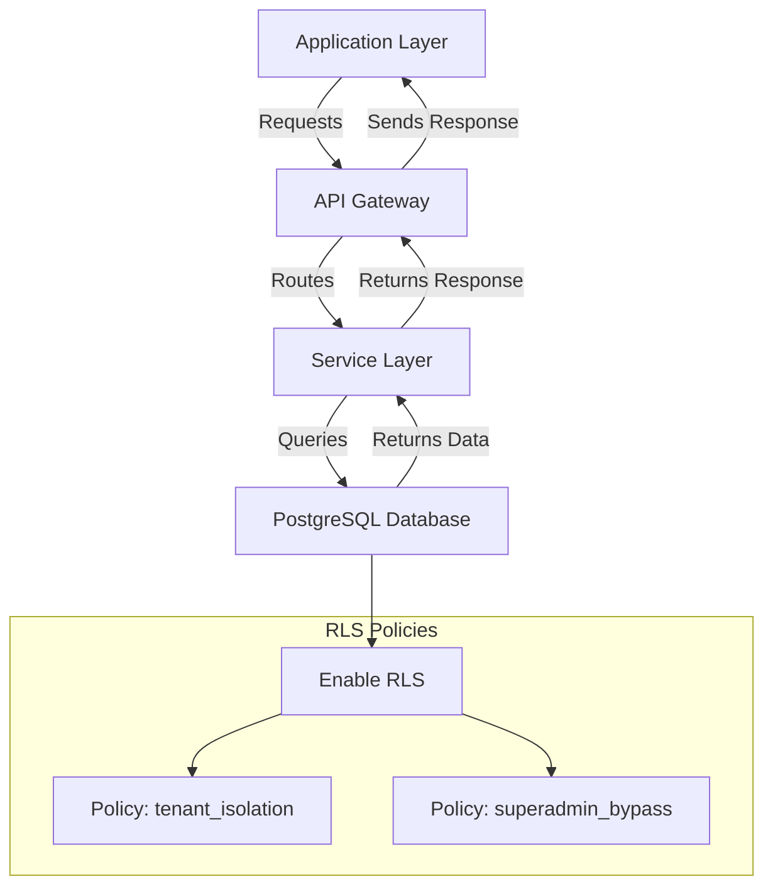

# Row-Level Security (RLS) — PostgreSQL Multi-Tenant

## Overview and scope

Row-Level Security (RLS) is a powerful feature in PostgreSQL that allows for fine-grained access control at the row level within a database table. This document outlines the standards and practices for implementing RLS in a multi-tenant architecture at Xentic, ensuring that data privacy and security are maintained across different tenant environments.

### Purpose

The purpose of this document is to establish a comprehensive set of guidelines for implementing Row-Level Security in PostgreSQL databases used by Xentic services. By adhering to these standards, we aim to ensure that tenant data is isolated and secure, while also providing a clear framework for developers and database administrators.

### Audience

This document is intended for:
- Database Administrators (DBAs)
- Backend Developers
- Software Architects
- Security Engineers

### Scope

This standard applies to all PostgreSQL databases used within Xentic services that require multi-tenant data isolation. It covers:
- Enabling RLS on relevant tables
- Creating and managing RLS policies
- Integrating RLS with application code
- Testing and validating RLS configurations

### Non-Goals

This document does NOT cover:
- General PostgreSQL database management practices
- Non-multi-tenant architectures
- RLS implementation in databases other than PostgreSQL

### Glossary

| Term                  | Definition                                                                 |
|-----------------------|-----------------------------------------------------------------------------|
| RLS                   | Row-Level Security, a feature in PostgreSQL for controlling access to rows.|
| Tenant                | An individual or organization that uses the application and has its own data.|
| Policy                | A rule that defines which rows are accessible based on certain conditions.  |
| UUID                  | Universally Unique Identifier, a standardized format for identifying information.|

### How this standard fits the Xentic platform

Implementing RLS aligns with Xentic's commitment to data security and privacy, especially in a multi-tenant environment. By ensuring that each tenant's data is strictly isolated, we can maintain compliance with data protection regulations and instill trust in our clients.

### Setup

To enable Row-Level Security on the relevant tables, the following SQL commands must be executed:

```sql
ALTER TABLE com.xentic.users ENABLE ROW LEVEL SECURITY;
ALTER TABLE com.xentic.orders ENABLE ROW LEVEL SECURITY;

CREATE POLICY tenant_isolation ON com.xentic.users
    USING (tenant_id = current_setting('app.tenant_id')::UUID);

CREATE POLICY tenant_isolation ON com.xentic.orders
    USING (tenant_id = current_setting('app.tenant_id')::UUID);
```

### Application Integration

When integrating RLS with the application, it is crucial to set the tenant context appropriately. The following Python code snippet demonstrates how to set the tenant context in an asynchronous database session:

```python
async def set_tenant_context(db: AsyncSession, tenant_id: str):
    await db.execute(
        text("SELECT set_config('app.tenant_id', :tid, true)"),
        {"tid": str(tenant_id)}
    )
```

### Superadmin Bypass

In certain scenarios, superadmins may need to bypass RLS for administrative tasks. The following SQL commands create a role that can bypass RLS:

```sql
CREATE ROLE app_superadmin BYPASSRLS;
GRANT app_superadmin TO app_user;
```

### Testing RLS

Testing RLS policies is essential to ensure that tenant data is correctly isolated. The following SQL commands can be used to validate that RLS is functioning as expected:

```sql
SET app.tenant_id = 'tenant-uuid-a';
SELECT count(*) FROM com.xentic.users;  -- should return only tenant A rows

SET app.tenant_id = 'tenant-uuid-b';
SELECT count(*) FROM com.xentic.users;  -- should return only tenant B rows
```

### Rules

- **MUST** enable RLS on ALL tables containing tenant-scoped data.
- **MUST NOT** disable RLS in application code for convenience.
- **SHOULD** test RLS policies in Continuous Integration (CI) with cross-tenant access attempts to ensure compliance.

## Standards and policies

1. **MUST** enable Row-Level Security (RLS) on all tables that contain tenant-specific data. This includes, but is not limited to, user, order, and billing tables. Example:

    ```sql
    ALTER TABLE com.xentic.users ENABLE ROW LEVEL SECURITY;
    ALTER TABLE com.xentic.orders ENABLE ROW LEVEL SECURITY;
    ```

2. **MUST** create RLS policies that ensure data isolation for each tenant. Policies should use the tenant identifier to restrict access. Example:

    ```sql
    CREATE POLICY tenant_isolation ON com.xentic.users
        USING (tenant_id = current_setting('app.tenant_id')::UUID);
    
    CREATE POLICY tenant_isolation ON com.xentic.orders
        USING (tenant_id = current_setting('app.tenant_id')::UUID);
    ```

3. **MUST NOT** allow any direct access to tables without RLS policies in place. All queries must respect the RLS configurations.

4. **SHOULD** use the `current_setting` function to dynamically set the tenant context in application code before executing any database queries. Example in Python:

    ```python
    async def set_tenant_context(db: AsyncSession, tenant_id: str):
        await db.execute(
            text("SELECT set_config('app.tenant_id', :tid, true)"),
            {"tid": str(tenant_id)}
        )
    ```

5. **MUST** validate RLS policies during the development and testing phases. This includes running tests to ensure that users can only access their own data. Example SQL for testing:

    ```sql
    SET app.tenant_id = 'tenant-uuid-a';
    SELECT count(*) FROM com.xentic.users;  -- should return only tenant A rows

    SET app.tenant_id = 'tenant-uuid-b';
    SELECT count(*) FROM com.xentic.users;  -- should return only tenant B rows
    ```

6. **MUST NOT** hard-code tenant IDs in application code or SQL queries. Tenant IDs should always be parameterized and set dynamically.

7. **SHOULD** implement logging for RLS policy violations to monitor unauthorized access attempts. This can help in auditing and improving security measures.

8. **MUST** ensure that any roles that require bypassing RLS for administrative tasks are tightly controlled and audited. Example of creating a superadmin role:

    ```sql
    CREATE ROLE app_superadmin BYPASSRLS;
    GRANT app_superadmin TO app_user;
    ```

9. **MUST** document all RLS policies and their intended use cases in the project documentation to ensure clarity among team members.

10. **SHOULD** review RLS configurations and policies periodically to ensure they meet current security requirements and adapt to any changes in the application architecture.

11. **MUST** use descriptive names for RLS policies that clearly indicate their purpose and the tenant data they protect, following the naming conventions of `tenant_isolation_<table_name>`.

12. **SHOULD** provide training for developers and DBAs on the importance of RLS and how to implement it correctly within the Xentic framework.

13. **MUST NOT** disable RLS for performance reasons without a thorough risk assessment and approval from the security team.

14. **SHOULD** consider the impact of RLS on query performance and optimize queries accordingly, while still adhering to the security policies.

15. **MUST** ensure that all application code interacting with the database is compliant with the established RLS policies to prevent data leaks or unauthorized access.

## Architecture and design

The architecture for implementing Row-Level Security (RLS) in a PostgreSQL multi-tenant environment at Xentic is designed to ensure strict data isolation and security across different tenants. Below is a detailed description of the architecture, data flows, integration points, and failure domains.

### Component Diagram



### Data Flows

1. **Request Handling**: 
   - The application layer sends requests to the API Gateway.
   - The API Gateway routes requests to the appropriate service layer based on the endpoint.

2. **Tenant Context Setting**:
   - Before executing any database queries, the service layer sets the tenant context using the `set_tenant_context` function.
   - This context is stored in the PostgreSQL session using `current_setting`.

3. **Database Queries**:
   - Queries are executed against the PostgreSQL database, where RLS policies are enforced.
   - The database checks the tenant context against the defined policies to ensure that only authorized rows are returned.

4. **Response Handling**:
   - The service layer receives the data from the database and processes it.
   - The processed response is sent back to the API Gateway, which then forwards it to the application layer.

### Integration Points

- **API Gateway**: Acts as the entry point for all requests and routes them to the appropriate service. It must handle authentication and authorization before passing requests to the service layer.
  
- **Service Layer**: This layer is responsible for business logic and interacting with the PostgreSQL database. It must ensure that the tenant context is set correctly for each session.

- **PostgreSQL Database**: Enforces RLS policies and manages data access based on the tenant context set by the service layer.

### Failure Domains

1. **Database Failures**:
   - If the PostgreSQL database becomes unavailable, all tenant data access will be disrupted. Implementing database replication and failover strategies is essential to mitigate this risk.

2. **Policy Misconfigurations**:
   - Incorrectly defined RLS policies may lead to unauthorized data access or denial of service for legitimate users. Regular audits and testing of RLS configurations are necessary to prevent such issues.

3. **Application Layer Failures**:
   - An issue in the application layer (e.g., bugs in the service layer) can lead to incorrect tenant context settings, resulting in data leaks or access denial. Thorough testing and monitoring should be implemented to catch these errors early.

4. **API Gateway Failures**:
   - If the API Gateway fails, it will prevent any requests from reaching the service layer. High availability configurations should be employed to ensure the gateway remains operational.

### Summary

Implementing RLS in a PostgreSQL multi-tenant architecture at Xentic requires careful planning and execution across various components. By defining clear data flows, integration points, and understanding potential failure domains, we can create a robust and secure environment for tenant data. Regular reviews and adherence to the established standards will further enhance the security and reliability of the system.

## Configuration reference

### application.yml

The following configuration is required in the `application.yml` file to support Row-Level Security (RLS) for multi-tenant applications:

```yaml
spring:
  datasource:
    url: jdbc:postgresql://db.internal.xentic.io:5432/xentic_db
    username: ${DB_USERNAME}
    password: ${DB_PASSWORD}
    driver-class-name: org.postgresql.Driver
  jpa:
    hibernate:
      ddl-auto: update
    properties:
      hibernate:
        dialect: org.hibernate.dialect.PostgreSQLDialect
  rls:
    enabled: true
    tenant-context: app.tenant_id
```

### Terraform Configuration

The following Terraform configuration can be used to set up the PostgreSQL database with RLS enabled:

```hcl
resource "postgresql_database" "xentic_db" {
  name     = "xentic_db"
  owner    = "db_admin"
  provider = postgresql

  lifecycle {
    prevent_destroy = true
  }
}

resource "postgresql_role" "app_superadmin" {
  name     = "app_superadmin"
  login    = false
  bypassrls = true
}

resource "postgresql_role" "app_user" {
  name     = "app_user"
  login    = true
}

resource "postgresql_grant" "superadmin_grant" {
  role       = postgresql_role.app_superadmin.name
  database   = postgresql_database.xentic_db.name
  privileges = ["ALL"]
}
```

### Environment Variables

The following environment variables should be configured for the application:

| Variable          | Default Value         | Production Value            |
|-------------------|-----------------------|-----------------------------|
| `DB_USERNAME`     | `xentic_user`         | `xentic_prod_user`         |
| `DB_PASSWORD`     | `password`            | `secure_production_password`|
| `RLS_ENABLED`     | `true`                | `true`                      |
| `TENANT_CONTEXT`  | `app.tenant_id`       | `app.tenant_id`            |

### SQL Configuration for RLS

To enable RLS on specific tables, the following SQL commands should be executed:

```sql
ALTER TABLE com.xentic.users ENABLE ROW LEVEL SECURITY;
ALTER TABLE com.xentic.orders ENABLE ROW LEVEL SECURITY;

CREATE POLICY tenant_isolation ON com.xentic.users
    USING (tenant_id = current_setting('app.tenant_id')::UUID);

CREATE POLICY tenant_isolation ON com.xentic.orders
    USING (tenant_id = current_setting('app.tenant_id')::UUID);
```

### Summary

This configuration reference provides essential settings for enabling Row-Level Security in a PostgreSQL multi-tenant environment at Xentic. Ensure that all configurations are reviewed and tested in a staging environment before deploying to production.

## Implementation guide

To implement Row-Level Security (RLS) in a PostgreSQL multi-tenant environment, follow these detailed steps:

### Step 1: Enable RLS on Tables

First, you need to enable RLS on the tables that will store tenant-specific data. Use the following SQL commands:

```sql
ALTER TABLE com.xentic.users ENABLE ROW LEVEL SECURITY;
ALTER TABLE com.xentic.orders ENABLE ROW LEVEL SECURITY;
```

### Step 2: Create RLS Policies

Define RLS policies for each table to ensure that only the data belonging to the current tenant is accessible. Use the following SQL commands:

```sql
CREATE POLICY tenant_isolation ON com.xentic.users
    USING (tenant_id = current_setting('app.tenant_id')::UUID);

CREATE POLICY tenant_isolation ON com.xentic.orders
    USING (tenant_id = current_setting('app.tenant_id')::UUID);
```

### Step 3: Set Tenant Context

In your application, you must set the tenant context before executing any database queries. Create a utility class to handle this:

```java
package com.xentic.common;

import org.springframework.jdbc.core.JdbcTemplate;
import org.springframework.stereotype.Component;

@Component
public class TenantContext {

    private final JdbcTemplate jdbcTemplate;

    public TenantContext(JdbcTemplate jdbcTemplate) {
        this.jdbcTemplate = jdbcTemplate;
    }

    public void setTenantId(String tenantId) {
        jdbcTemplate.execute("SET app.tenant_id = '" + tenantId + "';");
    }
}
```

### Step 4: Use Tenant Context in Service Layer

In your service layer, ensure that you set the tenant context before any database operations. Here’s an example service class:

```java
package com.xentic.service;

import com.xentic.common.TenantContext;
import org.springframework.beans.factory.annotation.Autowired;
import org.springframework.stereotype.Service;

@Service
public class UserService {

    private final TenantContext tenantContext;

    @Autowired
    public UserService(TenantContext tenantContext) {
        this.tenantContext = tenantContext;
    }

    public void performUserAction(String tenantId) {
        tenantContext.setTenantId(tenantId);
        // Execute database operations here
    }
}
```

### Step 5: Configure Application Properties

Ensure your application is configured to use the PostgreSQL database with RLS enabled. Update your `application.yml` as follows:

```yaml
spring:
  datasource:
    url: jdbc:postgresql://db.internal.xentic.io:5432/xentic_db
    username: ${DB_USERNAME}
    password: ${DB_PASSWORD}
    driver-class-name: org.postgresql.Driver
  jpa:
    hibernate:
      ddl-auto: update
    properties:
      hibernate:
        dialect: org.hibernate.dialect.PostgreSQLDialect
  rls:
    enabled: true
    tenant-context: app.tenant_id
```

### Step 6: Testing RLS Policies

To test if RLS is working correctly, execute the following SQL commands:

```sql
SET app.tenant_id = 'tenant-uuid-a';
SELECT * FROM com.xentic.users;  -- Should return only tenant A rows

SET app.tenant_id = 'tenant-uuid-b';
SELECT * FROM com.xentic.users;  -- Should return only tenant B rows
```

### Step 7: Monitor and Audit

Implement logging for RLS policy violations to track unauthorized access attempts. Use a logging framework like SLF4J:

```java
import org.slf4j.Logger;
import org.slf4j.LoggerFactory;

public class RLSLogger {

    private static final Logger logger = LoggerFactory.getLogger(RLSLogger.class);

    public void logViolation(String tenantId) {
        logger.warn("Unauthorized access attempt for tenant: {}", tenantId);
    }
}
```

### Step 8: Review and Maintain RLS Policies

Regularly review RLS configurations and policies to ensure they meet current security requirements. Schedule audits and update documentation as necessary.

### Summary

By following these steps, you can implement Row-Level Security in a PostgreSQL multi-tenant environment at Xentic effectively. Ensure that all application code interacts with the database in compliance with the established RLS policies to prevent data leaks or unauthorized access.

## Security requirements

### Threat Model Summary

The implementation of Row-Level Security (RLS) in PostgreSQL for multi-tenant applications at Xentic introduces several security considerations. The primary threats include:

- **Unauthorized Data Access**: Attackers may attempt to bypass RLS policies to access data belonging to other tenants.
- **Data Leakage**: Misconfigurations or bugs in the application layer may lead to unintended exposure of tenant data.
- **Privilege Escalation**: Users may exploit vulnerabilities to gain higher privileges than intended.
- **Denial of Service**: Malicious actors may attempt to disrupt service availability, affecting all tenants.

### Authentication and Authorization

- **Authentication**: All users must be authenticated using secure methods, such as OAuth2 or JWT. The application MUST validate tokens on every request.
- **Authorization**: RLS policies MUST be strictly enforced to ensure that users can only access data associated with their tenant. Use PostgreSQL's built-in roles and permissions to manage access.

### Secrets Management

- **Environment Variables**: Sensitive information such as database credentials MUST NOT be hardcoded. Use environment variables for configuration.
- **Secret Management Tools**: Utilize tools like HashiCorp Vault or AWS Secrets Manager to securely store and manage secrets.

### Input Validation

- **Sanitization**: All user inputs MUST be sanitized to prevent SQL injection attacks. Use prepared statements or ORM frameworks to handle database queries safely.
- **Validation**: Implement strict validation for tenant IDs and other critical parameters. Use regular expressions or validation libraries to enforce formats.

### Audit Logging

- **Logging Configuration**: The application MUST log all access attempts, including successful and failed authentication events, data access, and changes to tenant context.
- **Log Format**: Logs MUST include the following fields:
  - Timestamp
  - User ID
  - Tenant ID
  - Action performed
  - Result (success/failure)

Example logging configuration in `application.yml`:

```yaml
logging:
  level:
    root: INFO
    com.xentic: DEBUG
  loggers:
    com.xentic.security:
      level: INFO
      appenders:
        - console
        - file
```

### Example Audit Log Entry

An example of an audit log entry might look like this:

```
2023-10-01T12:34:56Z | UserID: user123 | TenantID: tenant-uuid-a | Action: DATA_ACCESS | Result: SUCCESS
```

### Summary

By addressing these security requirements, Xentic can ensure that its PostgreSQL multi-tenant architecture is robust against potential threats. Regular reviews and updates to security practices are essential to maintain the integrity and confidentiality of tenant data.

## Testing strategy

To ensure the effectiveness of Row-Level Security (RLS) in a PostgreSQL multi-tenant environment, a comprehensive testing strategy must be implemented. This strategy should encompass unit tests, integration tests, and contract tests, with specific coverage targets to validate that RLS policies are functioning correctly.

### Unit Tests

Unit tests should focus on the individual components responsible for setting the tenant context and executing database operations. The following coverage targets are recommended:

- **Coverage Target**: At least 80% for all utility classes and service methods that interact with the database.

Example unit test class for `TenantContext`:

```java
package com.xentic.common;

import org.junit.jupiter.api.BeforeEach;
import org.junit.jupiter.api.Test;
import org.mockito.Mockito;
import org.springframework.jdbc.core.JdbcTemplate;

import static org.mockito.Mockito.verify;

class TenantContextTest {

    private JdbcTemplate jdbcTemplate;
    private TenantContext tenantContext;

    @BeforeEach
    void setUp() {
        jdbcTemplate = Mockito.mock(JdbcTemplate.class);
        tenantContext = new TenantContext(jdbcTemplate);
    }

    @Test
    void testSetTenantId() {
        String tenantId = "tenant-uuid-a";
        tenantContext.setTenantId(tenantId);
        verify(jdbcTemplate).execute("SET app.tenant_id = '" + tenantId + "';");
    }
}
```

### Integration Tests

Integration tests should validate the interaction between components and the database, ensuring that RLS policies are enforced as expected. Coverage targets should include:

- **Coverage Target**: At least 75% for service methods that perform database operations.

Example integration test class for `UserService`:

```java
package com.xentic.service;

import com.xentic.common.TenantContext;
import org.junit.jupiter.api.Test;
import org.springframework.beans.factory.annotation.Autowired;
import org.springframework.boot.test.autoconfigure.jdbc.AutoConfigureTestDatabase;
import org.springframework.boot.test.context.SpringBootTest;
import org.springframework.jdbc.core.JdbcTemplate;

import static org.assertj.core.api.Assertions.assertThat;

@SpringBootTest
@AutoConfigureTestDatabase(replace = AutoConfigureTestDatabase.Replace.NONE)
class UserServiceIntegrationTest {

    @Autowired
    private UserService userService;

    @Autowired
    private JdbcTemplate jdbcTemplate;

    @Test
    void testPerformUserActionWithTenantContext() {
        String tenantId = "tenant-uuid-a";
        userService.performUserAction(tenantId);

        String result = jdbcTemplate.queryForObject("SELECT COUNT(*) FROM com.xentic.users", String.class);
        assertThat(result).isEqualTo("expected_count_for_tenant_a");
    }
}
```

### Contract Tests

Contract tests should ensure that the API contracts are adhered to, especially when dealing with multi-tenant data access. The following coverage targets are recommended:

- **Coverage Target**: 100% for all endpoints that interact with tenant-specific data.

Example contract test using Spring Cloud Contract:

```groovy
org.springframework.cloud.contract.spec.Contract.make {
    request {
        method 'GET'
        url('/api/users') {
            headers {
                header('X-Tenant-ID', 'tenant-uuid-a')
            }
        }
    }
    response {
        status 200
        body([
            [id: 'user1', name: 'User One'],
            [id: 'user2', name: 'User Two']
        ])
    }
}
```

### Summary of Testing Strategy

| Test Type           | Purpose                                               | Coverage Target |
|---------------------|-------------------------------------------------------|------------------|
| Unit Tests          | Validate individual components                         | 80%               |
| Integration Tests    | Validate interactions between components and DB       | 75%               |
| Contract Tests      | Ensure API contracts are adhered to                   | 100%              |

### Execution of Tests

- **Test Automation**: All tests MUST be automated and integrated into the CI/CD pipeline to ensure that RLS policies are continuously validated.
- **Test Environment**: A dedicated test environment that mirrors production settings MUST be used to avoid discrepancies.

By implementing this comprehensive testing strategy, Xentic can ensure that Row-Level Security is effectively enforced in its PostgreSQL multi-tenant architecture, safeguarding tenant data against unauthorized access.

## Observability and operations

To ensure the effective monitoring and management of Row-Level Security (RLS) in PostgreSQL multi-tenant environments, Xentic must implement robust observability practices. This includes metrics, logs, traces, dashboards, alerts, and Service Level Objectives (SLOs). The following sections outline the necessary components for observability and operations.

### Metrics

Key metrics to monitor include:

- **Unauthorized Access Attempts**: Count of failed access attempts due to RLS violations.
- **Successful Access Requests**: Count of successful data access requests per tenant.
- **Query Performance**: Average execution time of queries affected by RLS.
- **Tenant Activity**: Number of active tenants and their respective data access patterns.

Example Prometheus metrics configuration:

```yaml
prometheus:
  metrics:
    unauthorized_access_attempts: 
      type: counter
      help: "Total number of unauthorized access attempts"
    successful_access_requests:
      type: counter
      help: "Total number of successful access requests"
    query_performance:
      type: histogram
      help: "Histogram of query execution times"
```

### Logs

Comprehensive logging is essential for tracking RLS operations. Logs should include:

- **Access Logs**: Record every access attempt, including tenant ID, user ID, and outcome.
- **Error Logs**: Capture any exceptions or errors related to data access.
- **Audit Logs**: Maintain a history of changes to RLS policies.

Example logging configuration in `application.yml`:

```yaml
logging:
  level:
    root: INFO
    com.xentic: DEBUG
  loggers:
    com.xentic.rls:
      level: INFO
      appenders:
        - console
        - file
```

### Traces

Distributed tracing should be implemented to track requests across services. This is particularly important for identifying bottlenecks and unauthorized access attempts.

- **Trace Context**: Ensure that trace IDs are propagated through all service calls.
- **Tracing Tools**: Use tools like Zipkin or Jaeger for visualizing traces.

### Dashboards

Create dashboards to visualize key metrics and logs. Recommended tools include Grafana or Kibana. Dashboards should include:

- **Unauthorized Access Attempts**: Graph showing trends over time.
- **Successful Access Requests**: Breakdown by tenant.
- **Query Performance**: Latency and throughput metrics.
- **Error Rates**: Visualization of error logs related to RLS.

### Alerts

Set up alerts to notify the operations team of critical issues. Recommended alerts include:

- **High Unauthorized Access Attempts**: Alert if attempts exceed a defined threshold.
- **Performance Degradation**: Alert if average query execution time exceeds acceptable limits.
- **Error Rate Spike**: Alert if error rates surpass a specified percentage.

Example alert configuration in Prometheus:

```yaml
groups:
  - name: RLS Alerts
    rules:
      - alert: HighUnauthorizedAccessAttempts
        expr: increase(unauthorized_access_attempts[5m]) > 10
        for: 5m
        labels:
          severity: critical
        annotations:
          summary: "High Unauthorized Access Attempts"
          description: "More than 10 unauthorized access attempts in the last 5 minutes."
```

### Service Level Objectives (SLOs)

Define SLOs to ensure that RLS policies are functioning effectively. Recommended SLOs include:

- **Availability**: 99.9% of successful access requests should comply with RLS policies.
- **Performance**: 95% of queries should execute within 200ms.
- **Error Rate**: Less than 1% of total requests should result in errors.

### On-Call Runbook Steps

In the event of an incident related to RLS, follow these on-call runbook steps:

1. **Identify the Incident**: Review alert notifications and logs to determine the nature of the issue.
2. **Assess Impact**: Identify affected tenants and the scope of the problem.
3. **Gather Context**: Collect relevant metrics, logs, and traces to understand the issue's root cause.
4. **Mitigate**: If unauthorized access is detected, temporarily disable affected RLS policies until the issue is resolved.
5. **Communicate**: Notify stakeholders and affected tenants about the incident and expected resolution time.
6. **Resolve**: Implement fixes and validate that RLS policies are functioning as intended.
7. **Post-Mortem**: Conduct a post-incident review to identify improvements and prevent future occurrences.

By implementing these observability and operational practices, Xentic can maintain a secure and efficient PostgreSQL multi-tenant architecture with effective Row-Level Security.

## Migration and versioning

Managing database migrations and versioning is critical for maintaining the integrity and performance of Row-Level Security (RLS) in a PostgreSQL multi-tenant environment. Xentic must adhere to the following guidelines for effective migration and versioning.

### Upgrade Paths

- **Incremental Upgrades**: All database schema changes MUST be performed incrementally. Each migration script should be designed to be applied in sequence without skipping versions.
- **Version Control**: Migration scripts MUST be versioned using a consistent naming convention, such as `V1__initial_setup.sql`, `V2__add_rls_policy.sql`, etc.
- **Testing**: Each migration MUST be tested in a staging environment that mirrors production before deployment.

### Deprecation Policy

- **Deprecation Notice**: Features or RLS policies that are to be deprecated MUST have a clear deprecation notice communicated to all stakeholders at least one release cycle in advance.
- **Grace Period**: A grace period of two release cycles MUST be provided during which deprecated features remain functional but are marked as deprecated.
- **Removal**: After the grace period, deprecated features MUST be removed in a subsequent major release.

### Backward Compatibility

- **Schema Changes**: Any schema changes MUST ensure backward compatibility. This includes maintaining existing RLS policies until all tenant applications are updated.
- **Data Migration**: Data migration scripts MUST be provided to handle any necessary data transformations required by new RLS policies.
- **Fallback Mechanism**: A fallback mechanism MUST be implemented to revert to the previous schema if the new changes lead to critical failures.

### Rollback

- **Rollback Procedures**: Rollback procedures MUST be documented for each migration. This includes SQL scripts that can restore the database to its previous state.
- **Testing Rollbacks**: Rollback procedures MUST be tested in staging environments to ensure they work as expected.
- **Automated Rollbacks**: Where possible, automated rollback scripts MUST be included in the migration process to facilitate quick recovery from failures.

### Migration Example

An example of a migration script to add a new RLS policy might look like this:

```sql
-- V2__add_rls_policy.sql
BEGIN;

-- Create a new RLS policy for tenant isolation
CREATE POLICY tenant_isolation_policy ON com.xentic.data
FOR SELECT
USING (tenant_id = current_setting('app.tenant_id'));

-- Enable RLS on the data table
ALTER TABLE com.xentic.data ENABLE ROW LEVEL SECURITY;

COMMIT;
```

### Rollback Example

An example of a rollback script for the above migration might look like this:

```sql
-- Rollback_V2__add_rls_policy.sql
BEGIN;

-- Drop the RLS policy
DROP POLICY tenant_isolation_policy ON com.xentic.data;

-- Disable RLS on the data table
ALTER TABLE com.xentic.data DISABLE ROW LEVEL SECURITY;

COMMIT;
```

### Migration Strategy Table

| Migration Type        | Description                                         | Example Script Name                   |
|----------------------|-----------------------------------------------------|---------------------------------------|
| Initial Setup        | Create initial schema and RLS policies              | V1__initial_setup.sql                |
| Add RLS Policy       | Add new RLS policy for tenant isolation              | V2__add_rls_policy.sql               |
| Modify RLS Policy    | Update existing RLS policy to accommodate changes    | V3__update_rls_policy.sql            |
| Remove RLS Policy    | Remove an obsolete RLS policy                        | V4__remove_rls_policy.sql            |

### Versioning Strategy

- **Semantic Versioning**: Xentic MUST use semantic versioning (MAJOR.MINOR.PATCH) for database migrations. A major version change indicates breaking changes, a minor version change indicates new features, and a patch version change indicates backward-compatible fixes.
- **Documentation**: Each migration MUST be documented in a central repository, detailing the changes made, the rationale behind them, and any potential impacts on existing functionality.

By adhering to these migration and versioning guidelines, Xentic can ensure a smooth transition between database versions while maintaining the integrity of Row-Level Security in its PostgreSQL multi-tenant architecture.

## FAQ, Anti-Patterns, and Checklists

### Frequently Asked Questions (FAQ)

1. **What is Row-Level Security (RLS)?**
   - RLS is a database security feature that restricts data access at the row level based on user roles or tenant identifiers.

2. **How does RLS work in PostgreSQL?**
   - RLS uses policies defined on tables that determine which rows a user can access based on their session settings.

3. **What are the benefits of using RLS in a multi-tenant architecture?**
   - RLS ensures data isolation between tenants, enhances security, and simplifies application logic by enforcing access controls at the database level.

4. **Can RLS policies be modified after they are created?**
   - Yes, RLS policies can be altered or dropped as needed, but any changes must be carefully managed to avoid unintended access issues.

5. **How do I test RLS policies?**
   - Testing should be performed in a staging environment by simulating user roles and verifying access to different rows based on tenant IDs.

6. **What happens if a user does not have permission to access a row?**
   - The user will receive an empty result set for any queries that violate RLS policies, effectively hiding the restricted data.

7. **Can RLS be applied to views?**
   - Yes, RLS can be applied to views, but the underlying tables must also have RLS enabled for the policies to take effect.

8. **Is it possible to bypass RLS?**
   - No, RLS is enforced at the database level and cannot be bypassed through standard SQL queries unless the user has superuser privileges.

9. **What is the performance impact of RLS?**
   - While RLS adds some overhead due to policy evaluation, proper indexing and query optimization can mitigate performance issues.

10. **How can I monitor RLS activity?**
    - Monitoring can be achieved through logging access attempts, using tools like Grafana or Kibana to visualize metrics related to RLS.

### Anti-Patterns

| Anti-Pattern                          | Description                                                                                     |
|---------------------------------------|-------------------------------------------------------------------------------------------------|
| Overly Complex RLS Policies           | Creating overly complex policies can lead to maintenance challenges and performance issues.    |
| Not Testing RLS Policies              | Failing to test RLS policies in a staging environment can result in unintended access issues.  |
| Ignoring Performance Implications     | Not considering the performance impact of RLS can lead to degraded application performance.    |
| Hardcoding Tenant IDs in Queries      | Hardcoding tenant IDs in application queries violates the principles of RLS and increases risk.|
| Lack of Documentation                  | Not documenting RLS policies and their purpose can lead to confusion and errors in the future. |

### Pre-Merge Checklist

- [ ] Ensure all RLS policies are defined and documented.
- [ ] Validate that RLS policies have been tested in a staging environment.
- [ ] Review performance implications of new or modified RLS policies.
- [ ] Confirm that all changes comply with versioning and migration standards.
- [ ] Check for backward compatibility with existing tenant applications.

### Production Checklist

- [ ] Monitor logs for unauthorized access attempts post-deployment.
- [ ] Validate that all tenants can access their data as expected.
- [ ] Ensure that performance metrics are within acceptable thresholds.
- [ ] Communicate any changes to stakeholders and affected tenants.
- [ ] Conduct a post-deployment review to identify any issues or improvements.
