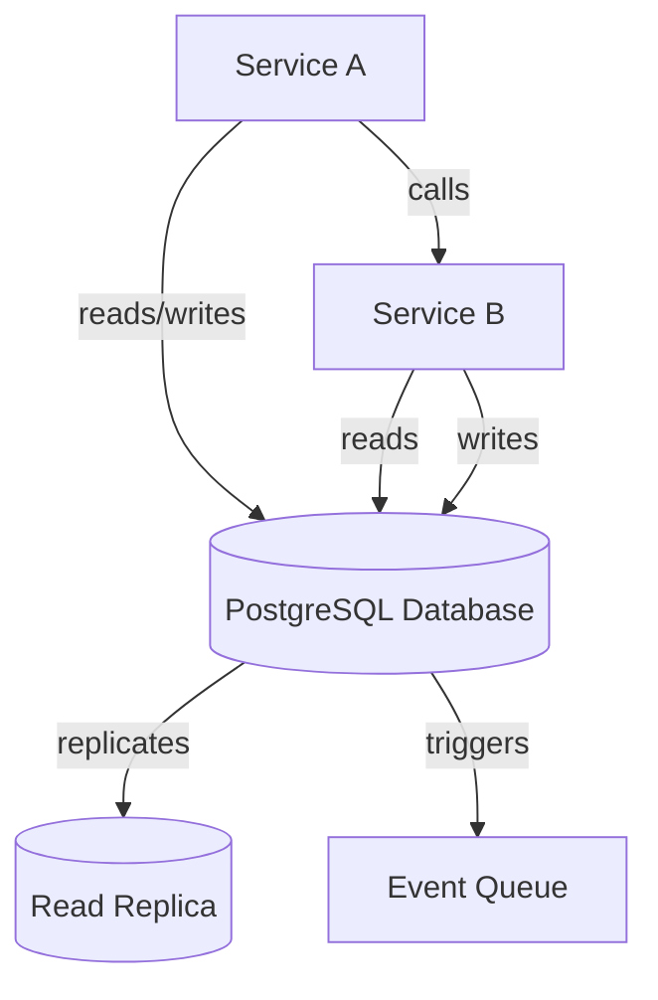

# PostgreSQL Schema Design Standards

## Overview and scope

The purpose of this document is to establish clear and consistent PostgreSQL schema design standards for all database-related development at Xentic. These standards aim to ensure that database schemas are designed with best practices in mind, promoting maintainability, performance, and scalability across our services.

### Audience
This document is intended for:
- Database architects
- Software engineers
- DevOps engineers
- Any team member involved in database design or maintenance

### Scope
The standards outlined in this document apply to all PostgreSQL database schemas used within Xentic's services. This includes:
- Schema design for new applications
- Modifications to existing schemas
- Database migrations and versioning
- Data modeling and normalization practices

### Non-goals
This document does not cover:
- Application-level data handling or business logic
- Specific implementation details of database access layers or ORMs
- Performance tuning or optimization techniques outside of schema design

### Glossary
| Term              | Definition                                                                 |
|-------------------|-----------------------------------------------------------------------------|
| UUID              | Universally Unique Identifier, a 128-bit number used to uniquely identify information. |
| TIMESTAMPTZ       | A PostgreSQL data type that stores timestamp with timezone information.     |
| Foreign Key       | A field (or collection of fields) in one table that uniquely identifies a row of another table. |
| Trigger           | A database object that is automatically executed or fired when certain events occur. |

### How This Standard Fits the Xentic Platform
This schema design standard is integral to the Xentic platform as it aligns with our overall architectural principles of consistency, reliability, and scalability. By adhering to these standards, teams can ensure that:
- Database schemas are easily understandable and maintainable.
- Data integrity is preserved through proper use of foreign keys and constraints.
- The platform can scale efficiently as services grow and evolve.

### Mandatory Columns
All tables MUST include the following mandatory columns to ensure consistency across schemas:
```sql
id         UUID        PRIMARY KEY DEFAULT gen_random_uuid(),
created_at TIMESTAMPTZ NOT NULL DEFAULT now(),
updated_at TIMESTAMPTZ NOT NULL DEFAULT now()
```

### Naming Conventions
Naming conventions MUST be followed to maintain clarity and consistency across the database. The following table outlines the required conventions:

| Object       | Convention               | Example               |
|--------------|--------------------------|-----------------------|
| Table        | snake_case plural        | `user_profiles`       |
| Column       | snake_case               | `first_name`         |
| Index        | `idx_{table}_{columns}`  | `idx_users_email`    |
| Foreign Key  | `fk_{table}_{ref_table}` | `fk_orders_users`    |

### Data Type Rules
The following data type rules MUST be adhered to:
- Use `UUID` for all primary keys — never use serial integers.
- Use `TIMESTAMPTZ` for all timestamps — never use `TIMESTAMP`.
- Prefer `TEXT` over `VARCHAR(n)` unless a hard length constraint is required.
- Use `NUMERIC(precision, scale)` for monetary values — never use `FLOAT`.

### Foreign Keys
Foreign keys MUST be defined to maintain referential integrity. An example of adding a foreign key constraint is as follows:
```sql
ALTER TABLE orders
    ADD CONSTRAINT fk_orders_users
    FOREIGN KEY (user_id) REFERENCES users(id)
    ON DELETE RESTRICT ON UPDATE CASCADE;
```

### Automatic `updated_at`
To ensure that the `updated_at` column is automatically updated, the following trigger MUST be implemented:
```sql
CREATE OR REPLACE FUNCTION trigger_set_updated_at()
RETURNS TRIGGER AS $$
BEGIN
    NEW.updated_at = now();
    RETURN NEW;
END;
$$ LANGUAGE plpgsql;

CREATE TRIGGER set_updated_at
    BEFORE UPDATE ON users
    FOR EACH ROW EXECUTE FUNCTION trigger_set_updated_at();

## Standards and policies

1. **Schema Naming**: All schemas MUST be named in lowercase and follow the pattern `service_name` (e.g., `user_service`). This ensures consistency and avoids case sensitivity issues.

2. **Table Design**: Each table MUST represent a single entity and MUST NOT contain multiple entities within the same table. For example, a table for `orders` should not include `order_items` as a separate entity within it.

3. **Primary Keys**: Every table MUST have a primary key defined using the `UUID` data type. The primary key MUST be named `id` and should be set to auto-generate using `gen_random_uuid()`.

4. **Foreign Key Constraints**: Foreign keys MUST be defined for all relationships between tables. The foreign key constraints MUST be named according to the convention `fk_{table}_{ref_table}` to ensure clarity.

5. **Indexing**: Indexes MUST be created on columns that are frequently queried, especially those used in JOINs and WHERE clauses. Index names MUST follow the convention `idx_{table}_{columns}`.

6. **Data Types**: The following data types MUST be used:
   - `UUID` for primary keys.
   - `TIMESTAMPTZ` for timestamps.
   - `TEXT` for variable-length strings unless a fixed length is explicitly required.
   - `NUMERIC(precision, scale)` for monetary values.

7. **Normalization**: Database schemas MUST be normalized to at least the third normal form (3NF) to eliminate redundancy and ensure data integrity.

8. **Default Values**: All columns that require a default value MUST have it explicitly defined. For example, `created_at` and `updated_at` MUST default to `now()`.

9. **Constraints**: All tables MUST include appropriate constraints (e.g., NOT NULL, UNIQUE) to enforce data integrity. Constraints MUST be named clearly to reflect their purpose.

10. **Triggers**: Triggers MUST be used to automatically update timestamp fields (`updated_at`) on record modifications. The trigger function MUST be defined in a clear and reusable manner.

11. **Documentation**: Every table and column MUST be documented using comments in the schema. This documentation MUST include the purpose of the table/column, data type, and any constraints.

12. **Backup and Recovery**: Database schemas MUST be included in the regular backup and recovery plan. The backup strategy MUST be documented and tested regularly.

13. **Version Control**: All schema changes MUST be version controlled using migration scripts. Migration scripts MUST be stored in a dedicated repository and follow a clear naming convention (e.g., `V1__create_users_table.sql`).

14. **Environment Configuration**: Configuration settings for database connections MUST be managed using environment variables. Sensitive information (e.g., passwords) MUST NOT be hardcoded in the application.

15. **Testing**: All schema changes MUST be tested in a staging environment before being applied to production. Automated tests for data integrity and performance MUST be written and maintained.

16. **Performance Monitoring**: Database performance MUST be monitored continuously. Queries that exceed acceptable performance thresholds MUST be optimized.

17. **Security**: Access to the database MUST be restricted based on the principle of least privilege. Users MUST only have access to the schemas and tables necessary for their roles.

18. **Data Retention**: Data retention policies MUST be defined and enforced. Tables that store historical data MUST include a mechanism for archiving or purging old records.

19. **Compliance**: All database schemas MUST comply with relevant data protection regulations (e.g., GDPR, HIPAA). Data handling practices MUST be reviewed regularly for compliance.

20. **Shared Libraries**: When using shared libraries, the naming convention MUST follow `com.xentic.common:*` or `com.xentic.auth:auth-starter` to ensure consistency across services.

By adhering to these standards and policies, Xentic can ensure that its PostgreSQL schemas are robust, maintainable, and scalable, thereby supporting the overall architecture and operational goals of the organization.

## Architecture and design

The architecture of PostgreSQL schemas at Xentic is designed to support modular, scalable, and maintainable services. The following component diagram outlines the key elements involved in our database architecture:



### Data Flows
- **Service A** interacts with the **PostgreSQL Database** for data storage and retrieval.
- **Service B** may read from or write to the same database, ensuring data consistency across services.
- The database may replicate data to a **Read Replica** for load balancing and read-heavy operations.
- Changes in the database can trigger events that are sent to an **Event Queue** for asynchronous processing.

### Integration Points
- **Service A** and **Service B** communicate through API calls, which may involve reading from or writing to the database.
- The **Event Queue** serves as an integration point for decoupling services and enabling event-driven architectures.
- **Monitoring and Logging** tools should be integrated to track database performance and query execution.

### Failure Domains
- **Database Failure**: If the primary database becomes unavailable, the application should be able to failover to a **Read Replica**.
- **Service Dependency**: Services that depend on the database must implement retry logic and circuit breaker patterns to handle transient failures gracefully.
- **Event Queue**: If the event queue fails, it should not affect the primary database operations, but processes relying on events may be delayed.

### Configuration Example
To ensure that our PostgreSQL database is set up correctly, the following configuration in `application.yml` should be used:

```yaml
spring:
  datasource:
    url: jdbc:postgresql://db.internal.xentic.io:5432/my_service_db
    username: ${DB_USERNAME}
    password: ${DB_PASSWORD}
    driver-class-name: org.postgresql.Driver
  jpa:
    hibernate:
      ddl-auto: update
    show-sql: true
```

### SQL Example
A sample SQL script for creating a basic user table with the necessary constraints is as follows:

```sql
CREATE TABLE user_profiles (
    id UUID PRIMARY KEY DEFAULT gen_random_uuid(),
    first_name TEXT NOT NULL,
    last_name TEXT NOT NULL,
    email TEXT UNIQUE NOT NULL,
    created_at TIMESTAMPTZ NOT NULL DEFAULT now(),
    updated_at TIMESTAMPTZ NOT NULL DEFAULT now()
);
```

### Best Practices
- **Schema Versioning**: All schema changes MUST be applied through migration scripts. An example migration script might look like:

```sql
-- V1__create_user_profiles_table.sql
CREATE TABLE user_profiles (
    id UUID PRIMARY KEY DEFAULT gen_random_uuid(),
    first_name TEXT NOT NULL,
    last_name TEXT NOT NULL,
    email TEXT UNIQUE NOT NULL,
    created_at TIMESTAMPTZ NOT NULL DEFAULT now(),
    updated_at TIMESTAMPTZ NOT NULL DEFAULT now()
);
```

- **Documentation**: Each table and column MUST be documented with comments to describe their purpose and constraints. For example:

```sql
COMMENT ON TABLE user_profiles IS 'Table storing user profile information';
COMMENT ON COLUMN user_profiles.first_name IS 'User first name';
COMMENT ON COLUMN user_profiles.email IS 'User email address, must be unique';
```

By adhering to these architectural and design principles, Xentic can ensure that its PostgreSQL schemas are robust, maintainable, and capable of supporting the dynamic needs of our services.

## Configuration reference

### Application Configuration (application.yml)

The following is a sample configuration for connecting to the PostgreSQL database using `application.yml`. This configuration should be used across all services.

```yaml
spring:
  datasource:
    url: jdbc:postgresql://db.internal.xentic.io:5432/my_service_db
    username: ${DB_USERNAME}
    password: ${DB_PASSWORD}
    driver-class-name: org.postgresql.Driver
  jpa:
    hibernate:
      ddl-auto: update
    show-sql: true
    properties:
      hibernate:
        dialect: org.hibernate.dialect.PostgreSQLDialect
```

### Terraform Configuration

For managing database infrastructure, the following Terraform configuration can be used to provision a PostgreSQL instance. This example includes defaults and production values.

```hcl
provider "postgresql" {
  host     = "db.internal.xentic.io"
  port     = 5432
  username = var.db_username
  password = var.db_password
}

resource "postgresql_database" "my_service_db" {
  name = "my_service_db"
}

resource "postgresql_role" "db_user" {
  name     = var.db_username
  password = var.db_password
  login    = true
}

resource "postgresql_grant" "db_user_grant" {
  database = postgresql_database.my_service_db.name
  role     = postgresql_role.db_user.name
  privileges = ["ALL"]
}
```

### Environment Variables

The following environment variables MUST be defined to configure the database connection for services. These variables should be set in the deployment environment.

| Variable Name   | Default Value            | Production Value          |
|------------------|-------------------------|---------------------------|
| `DB_USERNAME`    | `default_user`          | `prod_user`               |
| `DB_PASSWORD`    | `default_password`      | `secure_prod_password`    |
| `DB_HOST`        | `db.internal.xentic.io` | `db.internal.xentic.io`   |
| `DB_PORT`        | `5432`                  | `5432`                    |
| `DB_NAME`        | `my_service_db`         | `my_service_db`           |

### Connection Pooling Configuration

For optimal performance, connection pooling configurations MUST be applied. Below is an example of how to configure connection pooling in `application.yml`.

```yaml
spring:
  datasource:
    hikari:
      maximum-pool-size: 20
      minimum-idle: 5
      idle-timeout: 30000
      connection-timeout: 30000
      max-lifetime: 1800000
```

### SQL Configuration

When creating tables, the following SQL configuration should be used to ensure compliance with the schema design standards:

```sql
CREATE TABLE orders (
    id UUID PRIMARY KEY DEFAULT gen_random_uuid(),
    user_id UUID REFERENCES user_profiles(id) ON DELETE CASCADE,
    order_date TIMESTAMPTZ NOT NULL DEFAULT now(),
    total_amount NUMERIC(10, 2) NOT NULL,
    status TEXT NOT NULL DEFAULT 'pending',
    created_at TIMESTAMPTZ NOT NULL DEFAULT now(),
    updated_at TIMESTAMPTZ NOT NULL DEFAULT now()
);
```

### Backup Configuration

To ensure data safety, a backup strategy MUST be defined. Below is an example of a SQL command to create a backup of the database.

```sql
pg_dump -U ${DB_USERNAME} -h ${DB_HOST} -p ${DB_PORT} -F c -b -v -f "my_service_db_backup.backup" my_service_db
```

By following these configuration standards, Xentic can ensure that its PostgreSQL databases are set up for optimal performance, security, and maintainability across all services.

## Implementation guide

To implement PostgreSQL schemas that adhere to Xentic's standards, follow the step-by-step guide below. This guide includes code examples for creating tables, managing migrations, and ensuring compliance with best practices.

### Step 1: Define Your Schema

Begin by defining the schema for your application. For example, let's create a schema for an e-commerce application that includes user profiles and orders.

```sql
CREATE SCHEMA ecommerce AUTHORIZATION db_user;
```

### Step 2: Create Tables

Create the necessary tables within the defined schema. Below are SQL commands for creating `user_profiles` and `orders` tables.

```sql
CREATE TABLE ecommerce.user_profiles (
    id UUID PRIMARY KEY DEFAULT gen_random_uuid(),
    first_name TEXT NOT NULL,
    last_name TEXT NOT NULL,
    email TEXT UNIQUE NOT NULL,
    created_at TIMESTAMPTZ NOT NULL DEFAULT now(),
    updated_at TIMESTAMPTZ NOT NULL DEFAULT now()
);

CREATE TABLE ecommerce.orders (
    id UUID PRIMARY KEY DEFAULT gen_random_uuid(),
    user_id UUID REFERENCES ecommerce.user_profiles(id) ON DELETE CASCADE,
    order_date TIMESTAMPTZ NOT NULL DEFAULT now(),
    total_amount NUMERIC(10, 2) NOT NULL,
    status TEXT NOT NULL DEFAULT 'pending',
    created_at TIMESTAMPTZ NOT NULL DEFAULT now(),
    updated_at TIMESTAMPTZ NOT NULL DEFAULT now()
);
```

### Step 3: Implement Migrations

Utilize a migration tool (e.g., Flyway or Liquibase) to manage schema changes. Below is an example of a Flyway migration script for creating the `user_profiles` table.

```sql
-- V1__create_user_profiles_table.sql
CREATE TABLE ecommerce.user_profiles (
    id UUID PRIMARY KEY DEFAULT gen_random_uuid(),
    first_name TEXT NOT NULL,
    last_name TEXT NOT NULL,
    email TEXT UNIQUE NOT NULL,
    created_at TIMESTAMPTZ NOT NULL DEFAULT now(),
    updated_at TIMESTAMPTZ NOT NULL DEFAULT now()
);
```

### Step 4: Add Constraints and Indexes

Ensure that your tables have the necessary constraints and indexes to maintain data integrity and improve query performance.

```sql
CREATE INDEX idx_user_email ON ecommerce.user_profiles(email);
```

### Step 5: Document Your Schema

Document your tables and columns using comments to provide clarity on their purpose. This is critical for maintainability.

```sql
COMMENT ON TABLE ecommerce.user_profiles IS 'Stores user profile information';
COMMENT ON COLUMN ecommerce.user_profiles.first_name IS 'User first name';
COMMENT ON COLUMN ecommerce.user_profiles.email IS 'User email address, must be unique';
```

### Step 6: Configure Connection Pooling

In your `application.yml`, configure connection pooling to optimize database interactions.

```yaml
spring:
  datasource:
    hikari:
      maximum-pool-size: 20
      minimum-idle: 5
      idle-timeout: 30000
      connection-timeout: 30000
      max-lifetime: 1800000
```

### Step 7: Set Up Backup Procedures

Establish a backup strategy to ensure data safety. Below is an example of a command to back up the database.

```bash
pg_dump -U ${DB_USERNAME} -h ${DB_HOST} -p ${DB_PORT} -F c -b -v -f "ecommerce_db_backup.backup" ecommerce.my_service_db
```

### Step 8: Implement Testing

Create unit tests for your database interactions to ensure that your application behaves as expected. Below is an example in Java using JUnit and Spring Data JPA.

```java
@SpringBootTest
public class UserProfileRepositoryTest {

    @Autowired
    private UserProfileRepository userProfileRepository;

    @Test
    public void testSaveUserProfile() {
        UserProfile userProfile = new UserProfile("John", "Doe", "john.doe@example.com");
        userProfileRepository.save(userProfile);
        
        Optional<UserProfile> retrievedProfile = userProfileRepository.findById(userProfile.getId());
        assertTrue(retrievedProfile.isPresent());
        assertEquals("John", retrievedProfile.get().getFirstName());
    }
}
```

### Step 9: Monitor Database Performance

Integrate monitoring tools to track database performance and query execution. Use tools like pgAdmin or Prometheus for real-time monitoring.

### Step 10: Review and Refine

Regularly review your schema and configurations to ensure they meet evolving business needs and comply with industry standards.

By following these steps, Xentic can implement robust PostgreSQL schemas that are maintainable, scalable, and compliant with internal standards.

## Security requirements

### Threat Model Summary

Xentic's PostgreSQL schema design MUST take into account various security threats, including:

- **SQL Injection**: Malicious SQL code can be injected into queries.
- **Data Breaches**: Unauthorized access to sensitive data.
- **Denial of Service (DoS)**: Overloading the database with requests.
- **Data Loss**: Accidental or malicious deletion of data.

To mitigate these threats, the following security measures MUST be implemented:

### Authentication and Authorization

- **Strong Authentication**: All database connections MUST use strong, unique credentials. Passwords MUST be stored securely using hashing algorithms.
  
- **Role-Based Access Control (RBAC)**: Access to database resources MUST be restricted based on user roles. The principle of least privilege MUST be enforced.

Example of creating roles in PostgreSQL:

```sql
CREATE ROLE read_only NOINHERIT;
CREATE ROLE read_write NOINHERIT;

GRANT CONNECT ON DATABASE my_service_db TO read_only;
GRANT SELECT ON ALL TABLES IN SCHEMA ecommerce TO read_only;

GRANT CONNECT ON DATABASE my_service_db TO read_write;
GRANT SELECT, INSERT, UPDATE, DELETE ON ALL TABLES IN SCHEMA ecommerce TO read_write;
```

### Secrets Management

- **Environment Variables**: Database credentials MUST NOT be hardcoded in the application. Use environment variables to store sensitive information.

- **Secret Management Tools**: Utilize tools such as HashiCorp Vault or AWS Secrets Manager for managing database credentials securely.

Example of using environment variables in `application.yml`:

```yaml
spring:
  datasource:
    username: ${DB_USERNAME}
    password: ${DB_PASSWORD}
```

### Input Validation

- **Sanitize Inputs**: All user inputs MUST be validated and sanitized to prevent SQL injection attacks. Use prepared statements or ORM frameworks to handle database queries.

Example of using a prepared statement in Java:

```java
String sql = "SELECT * FROM ecommerce.user_profiles WHERE email = ?";
try (PreparedStatement pstmt = connection.prepareStatement(sql)) {
    pstmt.setString(1, userEmail);
    ResultSet rs = pstmt.executeQuery();
    // Process results
}
```

- **Data Type Enforcement**: Ensure that the data types of inputs match the expected types in the database schema.

### Audit Logging

- **Enable Logging**: PostgreSQL's logging features MUST be enabled to track access and changes to the database. This includes logging of all queries and user activities.

Example PostgreSQL configuration for logging:

```sql
ALTER SYSTEM SET log_statement = 'all';
ALTER SYSTEM SET log_directory = 'pg_log';
ALTER SYSTEM SET log_filename = 'postgresql-%Y-%m-%d_%H%M%S.log';
```

- **Log Retention Policy**: Establish a retention policy for logs to ensure that they are kept for a sufficient period for auditing purposes, but not so long that they consume excessive storage.

### Summary Table of Security Measures

| Security Aspect               | Requirements                                                                                     |
|-------------------------------|--------------------------------------------------------------------------------------------------|
| Authentication                | Use strong, unique credentials; implement RBAC.                                                |
| Secrets Management            | Use environment variables; employ secret management tools.                                      |
| Input Validation              | Sanitize inputs; use prepared statements.                                                       |
| Audit Logging                 | Enable logging for all queries; establish a log retention policy.                               |

By adhering to these security requirements, Xentic can significantly reduce the risk of security breaches and ensure the integrity and confidentiality of its PostgreSQL databases.

## Testing strategy

To ensure the reliability and correctness of database interactions, Xentic MUST implement a comprehensive testing strategy that includes unit tests, integration tests, and contract tests. Each type of test serves a specific purpose and contributes to the overall quality of the application.

### Unit Tests

Unit tests focus on individual components of the application, such as repositories and services, to verify that they function correctly in isolation.

- **Coverage Target**: Unit tests MUST achieve at least 80% code coverage.
- **Framework**: Use JUnit 5 for writing unit tests.

Example unit test for the `UserProfileRepository`:

```java
@SpringBootTest
public class UserProfileRepositoryUnitTest {

    @Autowired
    private UserProfileRepository userProfileRepository;

    @Test
    public void testFindByEmail() {
        UserProfile userProfile = new UserProfile("Jane", "Doe", "jane.doe@example.com");
        userProfileRepository.save(userProfile);
        
        UserProfile foundProfile = userProfileRepository.findByEmail("jane.doe@example.com");
        assertNotNull(foundProfile);
        assertEquals("Jane", foundProfile.getFirstName());
    }
}
```

### Integration Tests

Integration tests validate the interaction between different components, such as the database and the application layer.

- **Coverage Target**: Integration tests MUST cover all critical paths of the application.
- **Framework**: Use Spring Boot Test for integration testing.

Example integration test for the `UserProfileService`:

```java
@SpringBootTest
@Transactional
public class UserProfileServiceIntegrationTest {

    @Autowired
    private UserProfileService userProfileService;

    @Autowired
    private UserProfileRepository userProfileRepository;

    @Test
    public void testCreateUserProfile() {
        UserProfileDTO userProfileDTO = new UserProfileDTO("Alice", "Smith", "alice.smith@example.com");
        UserProfile createdProfile = userProfileService.createUserProfile(userProfileDTO);
        
        assertNotNull(createdProfile.getId());
        assertEquals("Alice", createdProfile.getFirstName());
    }
}
```

### Contract Tests

Contract tests ensure that the service's API adheres to the expected contract, especially when integrating with external services.

- **Coverage Target**: Contract tests MUST cover all public APIs.
- **Framework**: Use Pact for contract testing.

Example contract test using Pact:

```java
@Pact(consumer = "UserServiceConsumer", provider = "UserServiceProvider")
public RequestResponsePact createUserProfilePact(PactDslWithProvider builder) {
    return builder
        .given("User profile exists")
        .uponReceiving("A request to create a user profile")
        .path("/api/user_profiles")
        .method("POST")
        .body("{\"firstName\":\"Bob\", \"lastName\":\"Brown\", \"email\":\"bob.brown@example.com\"}")
        .willRespondWith()
        .status(201)
        .body("{\"id\":\"12345\", \"firstName\":\"Bob\", \"lastName\":\"Brown\", \"email\":\"bob.brown@example.com\"}")
        .toPact();
}
```

### Test Coverage Reporting

Xentic MUST utilize tools such as JaCoCo to generate test coverage reports. These reports should be reviewed regularly to ensure that coverage targets are met.

### Summary of Testing Strategy

| Test Type        | Purpose                                           | Coverage Target         | Framework           |
|------------------|---------------------------------------------------|-------------------------|---------------------|
| Unit Tests       | Validate individual components                     | At least 80%            | JUnit 5             |
| Integration Tests| Validate interactions between components           | Cover all critical paths| Spring Boot Test    |
| Contract Tests   | Ensure API adherence to contracts                  | Cover all public APIs   | Pact                |

By following this testing strategy, Xentic can ensure that its PostgreSQL database interactions are robust, reliable, and meet the required quality standards.

## Observability and operations

To maintain the health and performance of PostgreSQL databases at Xentic, observability and operational practices MUST be established. This includes metrics collection, logging, tracing, dashboards, alerts, and service-level objectives (SLOs). 

### Metrics

Xentic MUST collect and monitor the following key metrics:

- **Database Connections**: Total number of active connections.
- **Query Performance**: Average query execution time and slow query logs.
- **Transaction Rate**: Number of transactions per second.
- **Cache Hit Ratio**: Percentage of requests served from the cache.
- **Disk I/O**: Read and write operations per second.

Example of configuring PostgreSQL to track performance metrics:

```sql
ALTER SYSTEM SET track_io_timing = on;
ALTER SYSTEM SET log_min_duration_statement = 1000; -- log queries taking longer than 1 second
```

### Logs

PostgreSQL logs MUST be configured to capture essential information for troubleshooting and monitoring:

- **Log Level**: Set to `info` or `debug` based on the environment.
- **Log Rotation**: Implement a log rotation policy to manage disk space.

Example PostgreSQL logging configuration:

```sql
ALTER SYSTEM SET log_destination = 'csvlog';
ALTER SYSTEM SET logging_collector = on;
ALTER SYSTEM SET log_directory = 'pg_log';
ALTER SYSTEM SET log_filename = 'postgresql-%Y-%m-%d_%H%M%S.log';
ALTER SYSTEM SET log_rotation_age = '1d';
ALTER SYSTEM SET log_rotation_size = '10MB';
```

### Traces

Tracing MUST be implemented to analyze the performance of queries and database interactions. Xentic should utilize tools like pg_stat_statements to capture query execution statistics.

Example of enabling pg_stat_statements:

```sql
ALTER SYSTEM SET shared_preload_libraries = 'pg_stat_statements';
ALTER SYSTEM SET pg_stat_statements.track = all;
```

### Dashboards

Xentic MUST create dashboards to visualize key metrics and logs. Recommended tools include:

- **Grafana**: For visualizing metrics from Prometheus.
- **pgAdmin**: For monitoring database performance.

Example Grafana dashboard configuration for PostgreSQL metrics:

```yaml
datasources:
  - name: PostgreSQL
    type: postgres
    access: proxy
    url: localhost:5432
    user: ${DB_USERNAME}
    password: ${DB_PASSWORD}
```

### Alerts

Alerts MUST be configured for critical metrics to ensure timely responses to potential issues. Key alerts include:

- **High Connection Count**: Alert when connections exceed a defined threshold.
- **Slow Queries**: Alert when query execution time exceeds acceptable limits.
- **Disk Space Usage**: Alert when disk space usage exceeds 80%.

Example alert configuration in Prometheus:

```yaml
groups:
  - name: postgres_alerts
    rules:
      - alert: HighConnectionCount
        expr: pg_stat_activity_count > 100
        for: 5m
        labels:
          severity: critical
        annotations:
          summary: "High connection count detected"
          description: "PostgreSQL has more than 100 active connections."
```

### Service Level Objectives (SLOs)

Xentic MUST define SLOs to measure the reliability and performance of PostgreSQL databases. Suggested SLOs include:

| SLO Description             | Target                          |
|-----------------------------|---------------------------------|
| Query Response Time         | 95% of queries < 500ms          |
| Availability                 | 99.9% uptime                     |
| Error Rate                  | < 1% of total queries            |

### On-Call Runbook Steps

In the event of a database incident, the following runbook steps MUST be followed:

1. **Identify the Issue**: Check alerts and logs for any anomalies.
2. **Assess Impact**: Determine the scope of the issue and affected services.
3. **Mitigate**: If applicable, scale the database resources or optimize queries.
4. **Notify Stakeholders**: Inform relevant teams of the incident and ongoing actions.
5. **Document**: Record the incident details, actions taken, and resolution.
6. **Post-Mortem**: Conduct a post-incident review to identify root causes and preventive measures.

By adhering to these observability and operational standards, Xentic can ensure the reliability, performance, and health of its PostgreSQL databases.

## Migration and versioning

To manage database schema changes effectively, Xentic MUST implement a structured migration and versioning strategy. This ensures that all changes are tracked, reversible, and compatible with existing data and application logic.

### Upgrade Paths

1. **Sequential Migrations**: All schema changes MUST be applied in a sequential manner. Each migration file should represent a single change and be executed in the order of their versioning.
   
2. **Versioning Scheme**: Migrations MUST follow a versioning scheme that clearly indicates the order of execution. The recommended format is `YYYYMMDD_HHMM_description.sql`.

3. **Example Migration File**:
   ```sql
   -- 20231001_1200_add_user_table.sql
   CREATE TABLE users (
       id SERIAL PRIMARY KEY,
       username VARCHAR(255) NOT NULL UNIQUE,
       password VARCHAR(255) NOT NULL,
       created_at TIMESTAMP DEFAULT CURRENT_TIMESTAMP
   );
   ```

### Deprecation Policy

1. **Grace Period**: Deprecated features MUST have a defined grace period during which both the old and new implementations are supported. This period MUST be at least one release cycle.

2. **Clear Documentation**: All deprecated features MUST be documented clearly, including the reason for deprecation and the recommended alternatives.

3. **Removal**: After the grace period, deprecated features MUST NOT be included in future releases without explicit approval from the architecture team.

### Backward Compatibility

1. **Data Migration**: All changes to existing tables MUST include data migration scripts to ensure that existing data is compatible with the new schema.

2. **Versioned APIs**: If schema changes affect the API, Xentic MUST version the API to maintain backward compatibility. For example, use `/api/v1/users` for the current version and `/api/v2/users` for the updated version.

3. **Testing**: Migration scripts MUST be tested in a staging environment before being applied to production. This includes verifying that existing functionality works as expected.

### Rollback Procedures

1. **Rollback Scripts**: Each migration MUST include a corresponding rollback script that can revert the changes made by the migration. This is critical for maintaining stability in case of issues.

2. **Example Rollback Script**:
   ```sql
   -- 20231001_1200_add_user_table_rollback.sql
   DROP TABLE IF EXISTS users;
   ```

3. **Testing Rollbacks**: Rollback scripts MUST be tested in a staging environment to ensure they function correctly and restore the database to its previous state.

### Migration Tools

Xentic SHOULD use a migration tool to manage database migrations. Recommended tools include:

- **Flyway**: A popular choice for managing versioned migrations.
- **Liquibase**: Offers advanced features like rollback support and change tracking.

### Migration Process

1. **Create Migration File**: Developers MUST create a new migration file for each schema change.
2. **Apply Migration**: Migrations MUST be applied using the migration tool in a controlled manner, typically during a maintenance window.
3. **Verify Changes**: After applying migrations, verify that the changes are reflected correctly in the database and that application functionality remains intact.

### Example Migration Configuration (Flyway)

```yaml
flyway:
  url: jdbc:postgresql://localhost:5432/xentic_db
  user: ${DB_USERNAME}
  password: ${DB_PASSWORD}
  locations: classpath:db/migration
  baselineOnMigrate: true
```

### Summary of Migration and Versioning Standards

| Standard                | Requirement                                                                 |
|-------------------------|-----------------------------------------------------------------------------|
| Upgrade Paths           | Sequential migrations with a clear versioning scheme.                     |
| Deprecation Policy      | Grace period for deprecated features, with clear documentation.            |
| Backward Compatibility   | Data migration scripts and versioned APIs are mandatory.                   |
| Rollback Procedures      | Each migration MUST have a corresponding rollback script.                  |
| Migration Tools         | Use Flyway or Liquibase for managing migrations.                          |

By adhering to these migration and versioning standards, Xentic can ensure that its PostgreSQL database schema evolves in a controlled and reliable manner, minimizing risks associated with changes.

## FAQ, anti-patterns, and checklists

### FAQ

1. **What is the recommended naming convention for tables?**
   - Tables MUST be named in lowercase, using underscores to separate words (e.g., `user_profiles`).

2. **How should foreign keys be named?**
   - Foreign keys MUST be named using the format `fk_<source_table>_<target_table>`, e.g., `fk_orders_users`.

3. **What is the maximum length for VARCHAR fields?**
   - VARCHAR fields SHOULD have a maximum length defined, ideally between 255 and 1024 characters, depending on the use case.

4. **When should I use JSONB data types?**
   - JSONB SHOULD be used when the schema is expected to evolve frequently, allowing for flexible data storage.

5. **How often should I analyze my database?**
   - The database MUST be analyzed regularly, at least once a month, to optimize query performance.

6. **What is the recommended approach for indexing?**
   - Indexes MUST be created on columns frequently used in WHERE clauses, JOIN conditions, and ORDER BY clauses.

7. **How should I handle NULL values in columns?**
   - Columns SHOULD be defined with NOT NULL constraints unless NULL values are explicitly required for business logic.

8. **What is the best practice for handling sensitive data?**
   - Sensitive data MUST be encrypted at rest and in transit, and access should be restricted based on roles.

9. **How should I manage database migrations?**
   - Migrations MUST be managed using a version control system and a migration tool like Flyway or Liquibase.

10. **What should I do if I need to drop a column?**
    - Dropping a column MUST be done cautiously, ensuring that it is not used in application logic and that data is backed up.

### Anti-Patterns

| Anti-Pattern                     | Description                                                                                     |
|----------------------------------|-------------------------------------------------------------------------------------------------|
| Using SELECT *                   | MUST NOT use `SELECT *` in production queries; always specify the required columns.            |
| Overusing Foreign Keys           | MUST NOT create foreign keys on every relationship; consider performance impacts and use cases. |
| Ignoring Transaction Management   | MUST NOT ignore transactions; always use transactions for batch operations to ensure data integrity. |
| Hardcoding Values                | MUST NOT hardcode values in queries; use parameters or configuration files instead.            |
| Lack of Indexing                 | MUST NOT neglect indexing; this can lead to performance degradation in large datasets.         |
| Not Using Proper Data Types      | MUST NOT use generic data types; always choose the most appropriate data type for the data.   |

### Pre-Merge Checklist

- [ ] Ensure all migrations are created and tested.
- [ ] Verify that all SQL queries are optimized.
- [ ] Check for proper indexing on critical tables.
- [ ] Confirm that all sensitive data is encrypted.
- [ ] Review foreign key relationships for performance.
- [ ] Ensure that all changes are documented in the migration logs.

### Production Checklist

- [ ] Monitor database performance metrics post-deployment.
- [ ] Ensure that backups are taken before and after deployment.
- [ ] Validate that all application functionalities are working as expected.
- [ ] Check for any alerts triggered in the monitoring system.
- [ ] Review logs for any anomalies or errors.
- [ ] Confirm that all stakeholders are informed of the deployment status.
