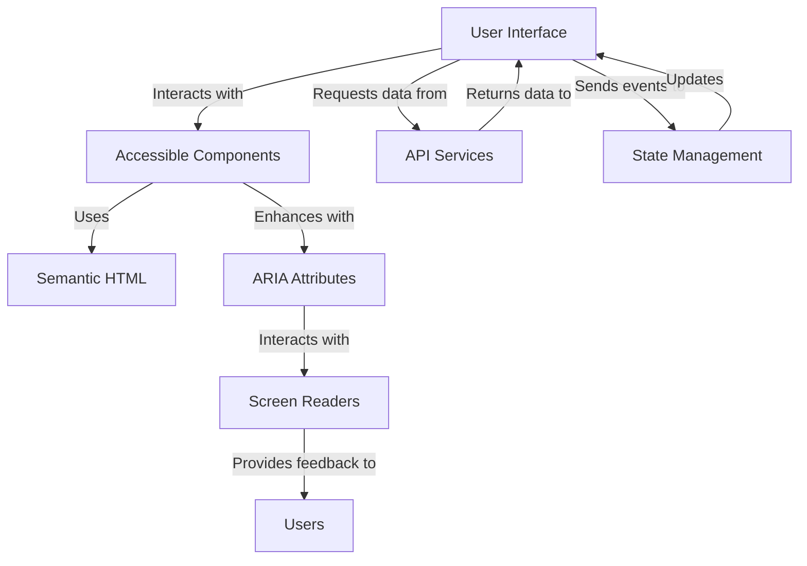

# Accessibility (WCAG 2.1) — React

## Overview and scope

The purpose of this document is to outline the accessibility standards that must be adhered to when developing React applications at Xentic, in accordance with the Web Content Accessibility Guidelines (WCAG) 2.1. This standard aims to ensure that all users, including those with disabilities, can access and interact with our web applications effectively.

### Audience

This document is intended for:

- Frontend developers
- UX/UI designers
- Quality Assurance engineers
- Product managers
- Technical leads

### Scope

This standard applies to all web applications developed using React within Xentic. It covers:

- Component design and implementation
- User interface interactions
- Content organization and presentation
- Testing methodologies for accessibility compliance

### Non-goals

This document does NOT aim to:

- Provide a comprehensive guide to all aspects of web development
- Replace existing accessibility training or resources
- Address accessibility issues related to backend services or APIs

### Glossary

| Term                  | Definition                                                                                 |
|-----------------------|--------------------------------------------------------------------------------------------|
| WCAG                  | Web Content Accessibility Guidelines, a set of recommendations for making web content more accessible. |
| ARIA                  | Accessible Rich Internet Applications, a set of attributes that can be added to HTML to improve accessibility. |
| Screen Reader         | Software that reads out the content of a web page to assist visually impaired users.      |
| Semantic HTML         | HTML that uses elements according to their intended purpose to enhance accessibility.      |

### How this standard fits the Xentic platform

At Xentic, we are committed to creating inclusive digital experiences. This accessibility standard integrates seamlessly into our development lifecycle, ensuring that accessibility is considered from the initial design phase through to deployment. By adhering to these guidelines, we enhance our product's usability and reach, aligning with our corporate values of innovation and inclusivity.

### Key Principles

1. **Perceivable**: Information and user interface components must be presented to users in ways they can perceive.
2. **Operable**: User interface components and navigation must be operable.
3. **Understandable**: Information and operation of the user interface must be understandable.
4. **Robust**: Content must be robust enough that it can be interpreted reliably by a wide variety of user agents, including assistive technologies.

### Example Code Snippet

When creating accessible components, ensure to use semantic HTML and ARIA attributes where necessary:

```jsx
import React from 'react';

const AccessibleButton = () => {
    return (
        <button aria-label="Submit form" onClick={() => alert('Form submitted!')}>
            Submit
        </button>
    );
};

export default AccessibleButton;
```

### Conclusion

By following the standards outlined in this document, Xentic will not only comply with legal requirements but also provide a better user experience for all users. It is imperative that all team members understand and implement these accessibility guidelines in their daily work.

## Standards and policies

1. **MUST** ensure that all React components are built using semantic HTML elements. This enhances accessibility and improves search engine optimization. For example, use `<header>`, `<nav>`, `<main>`, `<footer>`, and `<article>` instead of generic `<div>` tags.

2. **MUST NOT** use color as the only means of conveying information. Ensure that all critical information is accessible through text labels or patterns. For example, instead of indicating an error solely with a red color, include an error message:

   ```jsx
   <div role="alert" style={{ color: 'red' }}>
       Error: Please enter a valid email address.
   </div>
   ```

3. **MUST** provide keyboard navigation for all interactive elements. All buttons, links, and form controls must be operable using keyboard shortcuts. For example, ensure that custom components handle focus correctly:

   ```jsx
   const CustomButton = () => {
       return (
           <button tabIndex="0" onKeyDown={(e) => e.key === 'Enter' && handleClick()}>
               Click Me
           </button>
       );
   };
   ```

4. **SHOULD** use ARIA roles and properties to enhance accessibility where semantic HTML alone is insufficient. For example, use `aria-hidden` for elements that should be ignored by screen readers:

   ```jsx
   <div aria-hidden="true">This content is decorative.</div>
   ```

5. **MUST** ensure that all images have descriptive `alt` attributes. This allows screen readers to convey the image's purpose to users who cannot see it. For example:

   ```jsx
   
   ```

6. **MUST NOT** rely solely on visual cues for form validation. Provide clear, accessible error messages that can be read by screen readers. For example, use `aria-live` regions to announce validation errors:

   ```jsx
   <div role="alert" aria-live="assertive">
       {errorMessage}
   </div>
   ```

7. **SHOULD** implement focus management for modal dialogs and dynamic content updates. When a modal opens, focus should be trapped within the modal until it is closed. For example:

   ```jsx
   const Modal = ({ isOpen, onClose }) => {
       if (!isOpen) return null;

       return (
           <div role="dialog" aria-modal="true">
               <button onClick={onClose}>Close</button>
               {/* Focus trap logic here */}
           </div>
       );
   };
   ```

8. **MUST** test all applications for accessibility compliance using tools such as Axe, Lighthouse, or manual testing with screen readers. This should be part of the CI/CD pipeline to ensure ongoing compliance.

9. **SHOULD** provide captions and transcripts for all multimedia content. This ensures that users with hearing impairments can access the information presented in videos or audio files.

10. **MUST NOT** use auto-playing audio or video content without user control. Users should have the ability to start, pause, and stop any multimedia content.

11. **MUST** ensure that all interactive elements are visually distinguishable and have sufficient contrast against their background. Use tools like the WebAIM Contrast Checker to verify compliance.

12. **SHOULD** conduct user testing with individuals with disabilities to gather feedback and improve the accessibility of applications. This should be part of the development process.

By adhering to these standards and policies, Xentic will create a more inclusive environment for all users, ensuring that our applications are accessible and usable by everyone.

## Architecture and design

To effectively implement accessibility in React applications at Xentic, a clear architecture and design strategy must be established. This includes a component diagram, data flows, integration points, and identification of failure domains.

### Component Diagram



### Data Flows

1. **User Interactions**: Users interact with the UI components, triggering events (e.g., clicks, key presses).
2. **State Management**: Events are sent to the state management layer (e.g., Redux, Context API) to update application state.
3. **API Calls**: The UI may request data from API services, which return data to be rendered.
4. **Accessibility Enhancements**: Components utilize ARIA attributes and semantic HTML to ensure all interactions are accessible.
5. **Feedback Loop**: Screen readers provide feedback to users based on the content rendered in the UI.

### Integration Points

- **State Management**: Must integrate with React's Context API or Redux to manage component states effectively.
- **API Services**: All UI components must integrate with backend services using RESTful APIs or GraphQL, ensuring that data is accessible and correctly formatted for screen readers.
- **Testing Tools**: Integration with accessibility testing tools (e.g., Axe, Lighthouse) must be established to automate compliance checks in the CI/CD pipeline.

### Failure Domains

1. **Component Rendering**: If a component fails to render correctly, it may lead to inaccessible content. Implement fallback mechanisms to ensure essential information is always presented.
2. **API Failures**: In the event of API failures, the application must handle errors gracefully and provide accessible error messages to users.
3. **State Management Issues**: If state management fails, it could lead to outdated or incorrect UI states. Implement error boundaries to catch and handle these issues.
4. **Accessibility Testing Failures**: Regular testing must be conducted to identify and rectify accessibility issues. If tests fail, the build process must be halted until compliance is achieved.

### Example Configuration

Ensure that accessibility settings are included in your application configuration, such as:

```yaml
accessibility:
  ariaRoles:
    - role: "button"
      description: "Clickable button for submitting forms"
  semanticHTML:
    - element: "header"
      purpose: "Contains introductory content"
```

### Conclusion

By adhering to this architectural and design framework, Xentic can ensure that accessibility is woven into the fabric of our React applications. This will not only enhance user experience but also comply with WCAG 2.1 standards, reaffirming our commitment to inclusivity.

## Configuration reference

To ensure that accessibility features are properly configured in your React applications at Xentic, the following configuration references must be adhered to. This includes settings for `application.yml`, Terraform variables, and environment variables.

### application.yml

The `application.yml` file should include configurations for accessibility features as follows:

```yaml
accessibility:
  ariaRoles:
    button:
      description: "Clickable button for submitting forms"
      required: true
    alert:
      description: "Live region for accessibility alerts"
      required: true
  semanticHTML:
    header:
      purpose: "Contains introductory content"
      required: true
    footer:
      purpose: "Contains footer information"
      required: true
  keyboardNavigation:
    enabled: true
    focusTrap: true
  errorMessages:
    ariaLive: "assertive"
    role: "alert"
```

### Terraform Variables

When configuring resources in Terraform, the following variables should be defined to manage accessibility settings:

| Variable Name             | Type    | Default Value | Production Value |
|---------------------------|---------|---------------|------------------|
| `accessibility_enabled`   | boolean | `true`        | `true`           |
| `keyboard_navigation`     | boolean | `true`        | `true`           |
| `aria_live_region`        | string  | `assertive`   | `assertive`      |
| `error_message_role`      | string  | `alert`       | `alert`          |

### Environment Variables

The application should also utilize environment variables to manage accessibility settings dynamically. Below is a table of the required environment variables:

| Environment Variable            | Default Value | Production Value |
|---------------------------------|---------------|------------------|
| `REACT_APP_ACCESSIBILITY`       | `true`        | `true`           |
| `REACT_APP_KEYBOARD_NAVIGATION` | `true`        | `true`           |
| `REACT_APP_ARIA_LIVE_REGION`    | `assertive`   | `assertive`      |
| `REACT_APP_ERROR_MESSAGE_ROLE`   | `alert`       | `alert`          |

### Summary of Configuration

- **MUST** ensure that all accessibility-related configurations are included in `application.yml`, Terraform variables, and environment variables.
- **SHOULD** use the provided default values for development and testing environments, while ensuring that production values are set appropriately for compliance.
- **MUST NOT** overlook the importance of these configurations, as they play a critical role in ensuring that applications are accessible to all users.

By following these configuration references, Xentic can maintain a high standard of accessibility across all React applications.

## Implementation guide

To implement accessibility in React applications at Xentic, follow these step-by-step guidelines, ensuring that all components are compliant with WCAG 2.1 standards.

### Step 1: Setting Up Your Project

1. **MUST** initialize your React project using Create React App or your preferred setup.
   
   ```bash
   npx create-react-app xentic-accessibility-demo
   cd xentic-accessibility-demo
   ```

2. **MUST** install accessibility testing libraries such as `axe-core` and `@axe-core/react`:

   ```bash
   npm install axe-core @axe-core/react
   ```

### Step 2: Implementing Accessible Components

1. **MUST** create accessible buttons using semantic HTML and ARIA attributes. Here is an example of an accessible button component:

   ```jsx
   // src/components/AccessibleButton.js
   import React from 'react';

   const AccessibleButton = ({ onClick, label }) => {
       return (
           <button onClick={onClick} aria-label={label}>
               {label}
           </button>
       );
   };

   export default AccessibleButton;
   ```

2. **MUST** ensure form elements are accessible. Use `label` elements associated with input fields:

   ```jsx
   // src/components/AccessibleForm.js
   import React, { useState } from 'react';

   const AccessibleForm = () => {
       const [name, setName] = useState('');

       const handleSubmit = (e) => {
           e.preventDefault();
           // Handle form submission
       };

       return (
           <form onSubmit={handleSubmit}>
               <label htmlFor="name">Name:</label>
               <input
                   type="text"
                   id="name"
                   value={name}
                   onChange={(e) => setName(e.target.value)}
                   aria-required="true"
               />
               <AccessibleButton onClick={handleSubmit} label="Submit" />
           </form>
       );
   };

   export default AccessibleForm;
   ```

### Step 3: Implementing Live Regions

1. **MUST** create a live region for displaying error messages:

   ```jsx
   // src/components/ErrorMessage.js
   import React from 'react';

   const ErrorMessage = ({ message }) => {
       return (
           <div role="alert" aria-live="assertive">
               {message}
           </div>
       );
   };

   export default ErrorMessage;
   ```

### Step 4: Testing Accessibility

1. **MUST** set up accessibility testing in your application. Use the following code in your `index.js` file to integrate Axe:

   ```jsx
   // src/index.js
   import React from 'react';
   import ReactDOM from 'react-dom';
   import App from './App';
   import { axe } from '@axe-core/react';

   if (process.env.NODE_ENV !== 'production') {
       axe(React, ReactDOM, 1000);
   }

   ReactDOM.render(<App />, document.getElementById('root'));
   ```

### Step 5: Conducting User Testing

1. **SHOULD** conduct user testing sessions with individuals who have disabilities. Gather feedback on the accessibility of your application and make necessary adjustments.

### Step 6: Continuous Integration

1. **MUST** integrate accessibility tests into your CI/CD pipeline. Ensure that the build process fails if accessibility checks do not pass.

### Example Component Structure

Here’s how the component structure may look in your project:

```
/src
  ├── components
  │   ├── AccessibleButton.js
  │   ├── AccessibleForm.js
  │   └── ErrorMessage.js
  ├── App.js
  └── index.js
```

### Summary of Implementation Steps

- **MUST** create accessible components using semantic HTML and ARIA attributes.
- **MUST** implement live regions for dynamic content updates.
- **SHOULD** conduct user testing for feedback and improvements.
- **MUST** integrate accessibility testing in the CI/CD pipeline to ensure compliance.

By following these implementation guidelines, Xentic will enhance the accessibility of its React applications, making them more inclusive for all users.

## Security requirements

To ensure that Xentic's React applications are secure, the following security requirements must be adhered to:

### Threat Model Summary

1. **Data Exposure**: Sensitive data must be protected from unauthorized access.
2. **Injection Attacks**: Applications must be safeguarded against SQL injection, XSS, and other injection attacks.
3. **Session Management**: Proper session management practices must be enforced to prevent session hijacking.
4. **Denial of Service (DoS)**: Applications must implement rate limiting and other mechanisms to mitigate DoS attacks.

### Authentication and Authorization

1. **MUST** use OAuth 2.0 or OpenID Connect for authentication.
2. **MUST NOT** store sensitive information such as passwords in plaintext. Always hash passwords using a strong hashing algorithm (e.g., bcrypt).
3. **MUST** implement role-based access control (RBAC) to restrict access to resources based on user roles.

#### Example of Authentication Configuration

```yaml
auth:
  provider: "oauth2"
  clientId: "your-client-id"
  clientSecret: "your-client-secret"
  redirectUri: "https://app.internal.xentic.io/auth/callback"
```

### Secrets Management

1. **MUST** use a secrets management solution (e.g., HashiCorp Vault, AWS Secrets Manager) to store sensitive information.
2. **MUST NOT** hard-code secrets in the application code or configuration files.
3. **MUST** rotate secrets regularly and upon any suspicion of compromise.

#### Example of Environment Variable for Secrets

```bash
export REACT_APP_API_SECRET=$(vault kv get -field=api_secret secret/myapp)
```

### Input Validation

1. **MUST** validate all user inputs on both the client-side and server-side.
2. **MUST NOT** trust user input; always sanitize inputs to prevent injection attacks.
3. **SHOULD** use libraries such as `validator.js` for input validation.

#### Example of Input Validation in React

```jsx
import validator from 'validator';

const handleSubmit = (input) => {
    if (!validator.isEmail(input.email)) {
        throw new Error('Invalid email address');
    }
    // Proceed with submission
};
```

### Audit Logging

1. **MUST** implement audit logging for all critical actions (e.g., login attempts, data modifications).
2. **MUST NOT** log sensitive information such as passwords or personal data.
3. **SHOULD** use structured logging formats (e.g., JSON) for easier querying and analysis.

#### Example of Logging Configuration

```yaml
logging:
  level: "info"
  format: "json"
  output: "logs/audit.log"
```

### Summary of Security Requirements

- **MUST** implement a threat model to identify potential vulnerabilities.
- **MUST** use secure authentication and authorization practices.
- **MUST NOT** expose sensitive information through hard-coded secrets.
- **MUST** validate and sanitize all user inputs.
- **MUST** maintain audit logs for critical actions while ensuring sensitive data is not logged.

By adhering to these security requirements, Xentic can significantly reduce the risk of security breaches and ensure the integrity and confidentiality of its applications.

## Testing strategy

To ensure that Xentic's React applications meet accessibility standards, a comprehensive testing strategy is essential. This strategy encompasses unit tests, integration tests, and contract tests, with specific coverage targets to maintain high-quality standards.

### Testing Types

1. **Unit Tests**: 
   - **MUST** cover individual components to verify that they render correctly and handle props as expected.
   - **MUST** include tests for accessibility features such as ARIA roles and attributes.

2. **Integration Tests**:
   - **SHOULD** test the interaction between components and their integration with external libraries (e.g., forms with validation).
   - **MUST** validate that accessibility features work correctly when components interact.

3. **Contract Tests**:
   - **MUST** ensure that components adhere to defined contracts, such as expected props and their types.
   - **MUST** include tests for accessibility contracts, ensuring that components maintain compliance with WCAG 2.1.

### Coverage Targets

- **MUST** aim for a minimum of 80% code coverage across all tests.
- **SHOULD** prioritize tests for critical components that significantly impact accessibility.
- **MUST NOT** allow any component to have less than 50% coverage.

### Example Test Classes

#### Unit Test Example

```javascript
// src/components/__tests__/AccessibleButton.test.js
import React from 'react';
import { render } from '@testing-library/react';
import AccessibleButton from '../AccessibleButton';

test('renders AccessibleButton with correct label', () => {
    const { getByLabelText } = render(<AccessibleButton label="Click me" />);
    const button = getByLabelText(/click me/i);
    expect(button).toBeInTheDocument();
    expect(button).toHaveAttribute('aria-label', 'Click me');
});
```

#### Integration Test Example

```javascript
// src/components/__tests__/AccessibleForm.test.js
import React from 'react';
import { render, fireEvent } from '@testing-library/react';
import AccessibleForm from '../AccessibleForm';

test('submits form with valid input', () => {
    const { getByLabelText, getByText } = render(<AccessibleForm />);
    const input = getByLabelText(/name/i);
    fireEvent.change(input, { target: { value: 'John Doe' } });
    fireEvent.click(getByText(/submit/i));
    // Add assertions to verify form submission logic
});
```

#### Contract Test Example

```javascript
// src/components/__tests__/ErrorMessage.test.js
import React from 'react';
import { render } from '@testing-library/react';
import ErrorMessage from '../ErrorMessage';

test('ErrorMessage renders correctly with alert role', () => {
    const { getByRole } = render(<ErrorMessage message="Error occurred!" />);
    const alert = getByRole('alert');
    expect(alert).toHaveTextContent('Error occurred!');
    expect(alert).toHaveAttribute('aria-live', 'assertive');
});
```

### Summary of Testing Strategy

- **MUST** implement unit, integration, and contract tests to ensure accessibility compliance.
- **MUST** achieve a minimum of 80% code coverage across all tests.
- **SHOULD** prioritize accessibility tests for critical components.
- **MUST NOT** allow any component to have less than 50% coverage.

By adhering to this testing strategy, Xentic will ensure that its React applications are not only functional but also accessible to all users, aligning with WCAG 2.1 standards.

## Observability and operations

To ensure that Xentic's React applications are running efficiently and meeting accessibility standards, a robust observability and operations strategy is essential. This includes metrics, logs, traces, dashboards, alerts, SLOs, and on-call runbook steps.

### Metrics

1. **MUST** track performance metrics such as:
   - **Page Load Time**: Measure the time taken for the application to become interactive.
   - **Accessibility Score**: Utilize tools like Lighthouse to score the accessibility of the application.
   - **Error Rates**: Monitor the frequency of client-side errors (JavaScript errors).

#### Example Metrics Configuration

```yaml
metrics:
  pageLoadTime:
    enabled: true
    threshold: 2000  # in milliseconds
  accessibilityScore:
    enabled: true
    threshold: 90  # minimum score for compliance
  errorRate:
    enabled: true
    threshold: 5  # maximum errors per 100 requests
```

### Logs

1. **MUST** implement structured logging for all application events.
2. **MUST NOT** log sensitive information such as user data or authentication tokens.
3. **SHOULD** include the following log levels:
   - **INFO**: General application information.
   - **WARN**: Potential issues that do not require immediate attention.
   - **ERROR**: Errors that require investigation.

#### Example Logging Format

```json
{
  "timestamp": "2023-10-01T12:00:00Z",
  "level": "ERROR",
  "message": "Failed to fetch user data",
  "userId": "12345",
  "error": "Network Error"
}
```

### Traces

1. **MUST** implement distributed tracing to monitor requests across microservices.
2. **SHOULD** use tools like Jaeger or Zipkin to visualize traces.
3. **MUST** correlate traces with logs to provide context for errors.

#### Example Trace Configuration

```yaml
tracing:
  enabled: true
  provider: "jaeger"
  serviceName: "react-app"
```

### Dashboards

1. **MUST** create dashboards to visualize key metrics and logs.
2. **SHOULD** use tools like Grafana or Kibana for dashboarding.
3. **MUST** include the following panels:
   - **Accessibility Score Over Time**
   - **Error Rate Trends**
   - **Page Load Time Distribution**

#### Example Dashboard Configuration

```json
{
  "title": "Application Health Dashboard",
  "panels": [
    {
      "type": "graph",
      "title": "Accessibility Score",
      "targets": [
        {
          "target": "accessibility_score"
        }
      ]
    },
    {
      "type": "graph",
      "title": "Error Rate",
      "targets": [
        {
          "target": "error_rate"
        }
      ]
    }
  ]
}
```

### Alerts

1. **MUST** configure alerts for critical metrics.
2. **SHOULD** use tools like Prometheus Alertmanager for alerting.
3. **MUST** set up alerts for:
   - **High Error Rates**: Trigger alerts if error rates exceed the defined threshold.
   - **Low Accessibility Scores**: Notify the team if accessibility scores fall below the threshold.

#### Example Alert Configuration

```yaml
alerts:
  highErrorRate:
    enabled: true
    threshold: 5  # errors per 100 requests
    severity: "critical"
  lowAccessibilityScore:
    enabled: true
    threshold: 90  # score
    severity: "warning"
```

### SLOs

1. **MUST** define Service Level Objectives (SLOs) for key metrics.
2. **SHOULD** review SLOs quarterly to ensure they are relevant.
3. **MUST** include SLOs for:
   - **Page Load Time**: 95% of requests should load within 2 seconds.
   - **Accessibility Score**: 90% of pages must score above 90.

#### Example SLO Definition

```yaml
slo:
  pageLoadTime:
    target: "95th percentile"
    threshold: "2000ms"
  accessibilityScore:
    target: "90%"
```

### On-call Runbook Steps

1. **MUST** maintain an up-to-date on-call runbook for incident response.
2. **SHOULD** include the following steps:
   - **Identify the Issue**: Review logs and metrics to identify the problem.
   - **Assess Impact**: Determine the impact on users and services.
   - **Mitigate**: Apply temporary fixes if possible.
   - **Escalate**: If unresolved, escalate to the engineering team.
   - **Postmortem**: Conduct a postmortem to analyze the incident and prevent recurrence.

#### Example Runbook Template

```markdown
# On-call Runbook

## Incident Identification
- Check logs for errors.
- Review metrics for anomalies.

## Impact Assessment
- Determine affected users/services.

## Mitigation Steps
- Apply temporary fixes.
- Notify affected users.

## Escalation
- Contact engineering team if unresolved.

## Postmortem
- Analyze the incident and document findings.
```

### Summary of Observability and Operations

- **MUST** track key performance metrics, logs, and traces.
- **SHOULD** create dashboards for visualizing application health.
- **MUST** configure alerts for critical thresholds.
- **MUST** define SLOs and maintain an on-call runbook for incident response.

By implementing these observability and operations guidelines, Xentic can ensure that its React applications are not only accessible but also reliable and performant, leading to a better user experience.

## Migration and versioning

To ensure a smooth transition between versions of Xentic's React applications while maintaining accessibility standards, the following guidelines for migration, versioning, deprecation policy, backward compatibility, and rollback processes MUST be adhered to.

### Upgrade Paths

1. **MUST** provide clear upgrade paths for each major version of the application. 
2. **SHOULD** document breaking changes, new features, and deprecated features in the release notes.
3. **MUST** ensure that the upgrade process is automated where possible, using tools like `npm` or `yarn`.

#### Example Upgrade Path Documentation

```markdown
## Version 2.0.0 to 2.1.0

### Breaking Changes
- Removed the `DeprecatedComponent` in favor of `NewComponent`.
- Changed the prop type for `AccessibleButton` from `string` to `node`.

### New Features
- Introduced `AccessibilityProvider` to manage accessibility context.

### Upgrade Steps
1. Update package.json:
   ```json
   {
     "dependencies": {
       "your-package": "^2.1.0"
     }
   }
   ```
2. Run `npm install` or `yarn install`.
3. Refactor components to use `NewComponent`.
```

### Deprecation Policy

1. **MUST** follow a deprecation policy that provides users with ample time to transition away from deprecated features.
2. **SHOULD** mark features as deprecated in the documentation and provide alternatives.
3. **MUST NOT** remove deprecated features until at least two major versions have passed.

#### Example Deprecation Notice

```markdown
### Deprecation Notice for `DeprecatedComponent`

- **Deprecated in**: Version 2.0.0
- **Removal planned for**: Version 3.0.0
- **Recommended alternative**: Use `NewComponent` instead, which provides improved accessibility features.
```

### Backward Compatibility

1. **MUST** ensure that new versions maintain backward compatibility with existing codebases.
2. **SHOULD** provide shims or polyfills for any breaking changes that cannot be avoided.
3. **MUST NOT** introduce breaking changes without a clear migration path and sufficient notice.

#### Example Backward Compatibility Shim

```javascript
// src/utils/compatibility.js
export const DeprecatedComponent = (props) => {
    console.warn('DeprecatedComponent is deprecated. Use NewComponent instead.');
    return <NewComponent {...props} />;
};
```

### Rollback Procedures

1. **MUST** have a rollback procedure in place for production deployments.
2. **SHOULD** ensure that previous versions of the application can be restored quickly in case of critical issues.
3. **MUST NOT** attempt to roll back without first assessing the impact on users and services.

#### Example Rollback Steps

```markdown
## Rollback Procedure

1. Identify the version to roll back to.
2. Update the package.json to the previous version:
   ```json
   {
     "dependencies": {
       "your-package": "^2.0.0"
     }
   }
   ```
3. Run `npm install` or `yarn install`.
4. Redeploy the application.
5. Monitor logs and metrics for any issues post-rollback.
```

### Summary of Migration and Versioning

- **MUST** provide clear upgrade paths and deprecation notices.
- **SHOULD** ensure backward compatibility and offer rollback procedures.
- **MUST NOT** remove deprecated features without sufficient notice and migration paths.

By adhering to these migration and versioning guidelines, Xentic will ensure that its React applications remain accessible and maintainable while evolving to meet user needs.

## FAQ, anti-patterns, and checklists

### FAQ

1. **What is WCAG 2.1?**
   - WCAG 2.1 stands for Web Content Accessibility Guidelines 2.1, a set of guidelines aimed at making web content more accessible to people with disabilities.

2. **Why is accessibility important?**
   - Accessibility ensures that all users, regardless of their abilities, can access and interact with web content, improving user experience and compliance with legal standards.

3. **What are ARIA roles?**
   - ARIA (Accessible Rich Internet Applications) roles are attributes that can be added to HTML elements to enhance accessibility by providing additional semantic meaning.

4. **How can I test my React application for accessibility?**
   - Use tools like Axe, Lighthouse, or the WAVE tool to automatically check for accessibility issues in your React application.

5. **What is the purpose of semantic HTML?**
   - Semantic HTML uses HTML markup that conveys meaning about the content, which helps assistive technologies interpret the structure and purpose of the content.

6. **Should I use inline styles for accessibility?**
   - **MUST NOT** use inline styles for accessibility. Instead, use CSS classes to maintain separation of concerns and ensure styles are consistent and manageable.

7. **What are focus management techniques?**
   - Focus management techniques involve controlling the keyboard focus in your application, ensuring that users can navigate through interactive elements logically and predictably.

8. **How can I ensure color contrast is sufficient?**
   - Use tools like the WebAIM Color Contrast Checker to evaluate the contrast ratio between text and background colors, ensuring it meets the minimum requirements.

9. **What should I do if a component is not accessible?**
   - **MUST** refactor the component to meet accessibility standards, ensuring it is usable with keyboard navigation and screen readers.

10. **How often should I review accessibility?**
    - **SHOULD** conduct accessibility reviews at each major release and after significant changes to the application to ensure ongoing compliance.

### Anti-patterns

| Anti-pattern                        | Description                                                                 |
|-------------------------------------|-----------------------------------------------------------------------------|
| Using `div` for interactive elements | **MUST NOT** use `div` elements for buttons or links; use `<button>` or `<a>` instead. |
| Lack of keyboard navigation          | **MUST NOT** create components that cannot be navigated using a keyboard.  |
| Inadequate alt text                 | **MUST** provide descriptive `alt` text for all images to convey their purpose. |
| Over-reliance on color              | **MUST NOT** use color alone to convey information; provide text labels or icons. |
| Missing form labels                 | **MUST** associate `<label>` elements with form controls for clarity and accessibility. |
| Non-descriptive link text           | **MUST NOT** use vague link text like "click here"; use descriptive text that indicates the link's purpose. |
| Ignoring focus states               | **MUST** ensure that all interactive elements have visible focus styles for keyboard users. |

### Pre-merge Checklist

- **MUST** run accessibility tests using automated tools.
- **MUST** conduct manual testing for keyboard navigation and screen reader compatibility.
- **SHOULD** review code for semantic HTML usage.
- **MUST NOT** merge code that does not meet accessibility standards.

### Production Checklist

- **MUST** verify that all accessibility issues identified during development have been resolved.
- **SHOULD** run a final accessibility audit using tools like Lighthouse before deployment.
- **MUST** ensure that documentation includes accessibility considerations for future developers.
- **MUST NOT** deploy without confirming that the application meets WCAG 2.1 standards.
