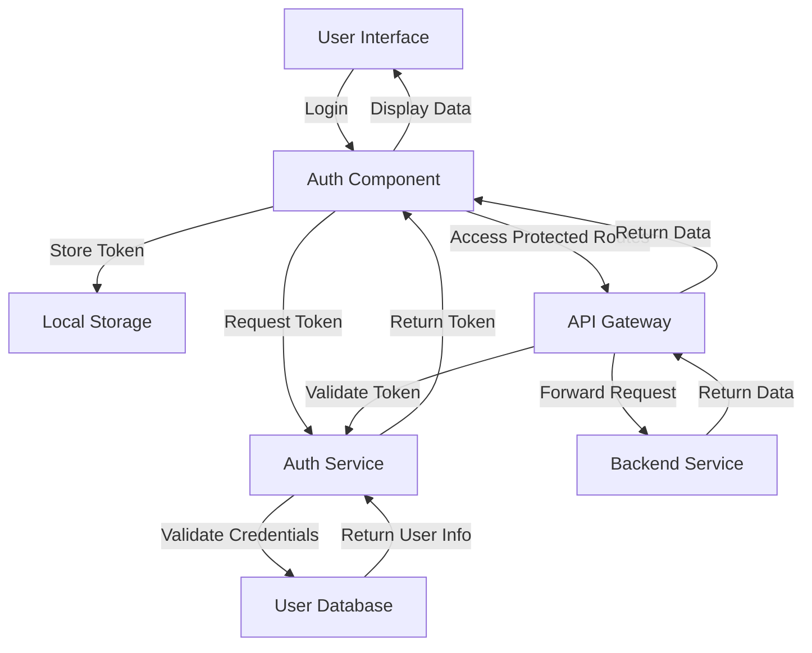

# Authentication Flows — React

## Overview and scope

The purpose of this document is to outline the authentication flows for React applications within the Xentic platform. It serves as a guideline for developers to implement secure and efficient authentication mechanisms while ensuring consistency across various services.

### Audience

This document is intended for:
- Frontend Developers
- Software Architects
- Quality Assurance Engineers
- DevOps Engineers

### Scope

This standard covers:
- User authentication methods (e.g., OAuth2, JWT)
- Session management practices
- Error handling and user feedback mechanisms
- Integration with Xentic's shared libraries for authentication

### Non-goals

This document does NOT cover:
- Backend authentication processes
- User authorization flows
- Specific implementation details for third-party services (e.g., Google, Facebook)

### Glossary

| Term              | Definition                                                                 |
|-------------------|-----------------------------------------------------------------------------|
| OAuth2            | An open standard for access delegation commonly used for token-based authentication. |
| JWT               | JSON Web Token, a compact and self-contained way for securely transmitting information between parties. |
| Session           | A temporary state that maintains user information during their interaction with the application. |
| Shared Libraries   | Pre-built libraries provided by Xentic to facilitate common functionalities across services. |

### How This Standard Fits the Xentic Platform

This standard aligns with Xentic's commitment to security and consistency in application development. By adhering to these guidelines, developers will ensure that:
- All React applications utilize a unified authentication strategy.
- Security vulnerabilities are minimized through best practices.
- The user experience remains seamless and intuitive.

### Example Configuration

Below is an example of how to configure authentication in a React application using a YAML format:

```yaml
auth:
  provider: "OAuth2"
  clientId: "your-client-id"
  clientSecret: "your-client-secret"
  redirectUri: "https://app.internal.xentic.io/auth/callback"
  tokenEndpoint: "https://auth.internal.xentic.io/oauth/token"
  userInfoEndpoint: "https://auth.internal.xentic.io/userinfo"
```

### Example Code Snippet

Here’s a basic example of how to implement authentication using JWT in a React component:

```javascript
import React, { useEffect } from 'react';
import axios from 'axios';

const AuthComponent = () => {
  useEffect(() => {
    const authenticateUser = async () => {
      try {
        const response = await axios.post('https://auth.internal.xentic.io/oauth/token', {
          client_id: 'your-client-id',
          client_secret: 'your-client-secret',
          grant_type: 'password',
          username: 'user@example.com',
          password: 'user-password'
        });
        localStorage.setItem('token', response.data.access_token);
      } catch (error) {
        console.error('Authentication failed:', error);
      }
    };

    authenticateUser();
  }, []);

  return <div>Authentication in progress...</div>;
};

export default AuthComponent;
```

By following this standard, developers will contribute to a robust authentication framework that enhances the security and usability of Xentic's applications.

## Standards and policies

1. **MUST** use the package naming convention `com.xentic.<service>` for all React components related to authentication. This ensures consistency and clarity in the codebase.

2. **MUST NOT** hard-code sensitive information such as client secrets or API keys within the source code. Instead, utilize environment variables or secure vaults to manage sensitive data.

3. **SHOULD** implement OAuth2 as the primary authentication method for all new React applications. This aligns with industry standards and provides a secure way to handle user authentication.

4. **MUST** utilize JSON Web Tokens (JWT) for session management. Tokens should be stored securely in `localStorage` or `sessionStorage`, depending on the required persistence.

5. **SHOULD** validate JWTs on the client-side to ensure they are not expired before making authenticated requests. This can prevent unnecessary API calls with invalid tokens.

6. **MUST NOT** expose any user information in the URL or logs. Always use POST requests for sensitive operations.

7. **SHOULD** implement error handling for authentication failures. Provide user-friendly messages and guidance on how to resolve issues.

8. **MUST** use the shared libraries provided by Xentic for authentication, such as `com.xentic.auth:auth-starter`, to maintain consistency and leverage existing functionality.

9. **SHOULD** implement a refresh token mechanism to allow users to maintain their session without requiring them to log in repeatedly.

10. **MUST** ensure that all authentication-related components are thoroughly tested, including unit tests and integration tests, to verify the functionality and security of the authentication flows.

11. **SHOULD** document all authentication flows and configurations in the project's README or a dedicated documentation site, such as [https://docs.internal.xentic.io](https://docs.internal.xentic.io).

12. **MUST NOT** use outdated libraries or frameworks for authentication. Always keep dependencies up to date to mitigate security vulnerabilities.

13. **SHOULD** implement logging for authentication events, such as successful logins and failed attempts, to monitor and audit access to the application.

14. **MUST** provide a clear logout mechanism that invalidates the user's session and removes tokens from storage.

15. **SHOULD** consider implementing multi-factor authentication (MFA) for sensitive applications to enhance security.

16. **MUST NOT** allow cross-origin requests from untrusted domains. Configure CORS settings appropriately to restrict access.

17. **SHOULD** utilize HTTPS for all authentication-related API calls to protect data in transit.

18. **MUST** ensure that all user input is sanitized and validated to prevent injection attacks.

19. **SHOULD** provide a way for users to reset their passwords securely, including email verification and temporary tokens.

20. **MUST NOT** use synchronous calls for authentication processes that could block the UI thread. Always use asynchronous methods to enhance user experience.

By adhering to these standards and policies, developers will create a secure and efficient authentication flow for React applications at Xentic, fostering trust and reliability in the platform.

## Architecture and design

The authentication architecture for React applications at Xentic is designed to ensure secure and efficient user authentication while maintaining a seamless user experience. The following sections outline the component diagram, data flows, integration points, and failure domains.

### Component Diagram



### Data Flows

1. **User Login Flow**
   - User enters credentials in the User Interface.
   - Auth Component sends a request to the Auth Service to validate credentials.
   - Auth Service checks the User Database and returns a token if credentials are valid.
   - Auth Component stores the token in Local Storage for future requests.

2. **Token Validation Flow**
   - For each API request, the Auth Component retrieves the token from Local Storage.
   - The API Gateway validates the token with the Auth Service before forwarding the request to the Backend Service.

3. **Logout Flow**
   - User initiates logout from the User Interface.
   - Auth Component removes the token from Local Storage and clears any session data.

### Integration Points

- **Auth Service**: Provides endpoints for user authentication and token validation.
- **User Database**: Stores user credentials and profiles securely.
- **API Gateway**: Acts as a single entry point for all API requests and handles token validation.
- **Backend Services**: Various services that provide data to the frontend application.

### Failure Domains

- **Authentication Failures**: 
  - Invalid credentials leading to failed login attempts.
  - Token expiration resulting in unauthorized API requests.
  
- **Network Issues**: 
  - Inability to reach the Auth Service or API Gateway due to network problems.
  
- **Database Failures**: 
  - Issues with the User Database can prevent user validation or retrieval of user information.

- **Storage Issues**: 
  - Failure to store or retrieve tokens from Local Storage can lead to authentication failures.

### Summary

By adhering to this architecture and design, developers at Xentic will ensure that the authentication flows in React applications are robust, secure, and efficient. The outlined component diagram, data flows, integration points, and failure domains provide a comprehensive understanding of the authentication process, enabling teams to implement these standards effectively.

## Configuration reference

### application.yml

The following is a sample configuration for the `application.yml` file used in a React application for authentication:

```yaml
auth:
  provider: "OAuth2"
  clientId: "${AUTH_CLIENT_ID:default-client-id}"
  clientSecret: "${AUTH_CLIENT_SECRET:default-client-secret}"
  redirectUri: "${AUTH_REDIRECT_URI:https://app.internal.xentic.io/auth/callback}"
  tokenEndpoint: "${AUTH_TOKEN_ENDPOINT:https://auth.internal.xentic.io/oauth/token}"
  userInfoEndpoint: "${AUTH_USER_INFO_ENDPOINT:https://auth.internal.xentic.io/userinfo}"
  session:
    expiration: "3600" # in seconds
    refreshTokenExpiration: "86400" # in seconds
```

### Terraform Configuration

Below is an example of how to set environment variables in a Terraform configuration for authentication:

```hcl
resource "aws_ssm_parameter" "auth_client_id" {
  name  = "/xentic/auth/client_id"
  type  = "String"
  value = "your-client-id"
}

resource "aws_ssm_parameter" "auth_client_secret" {
  name  = "/xentic/auth/client_secret"
  type  = "SecureString"
  value = "your-client-secret"
}

resource "aws_ssm_parameter" "auth_redirect_uri" {
  name  = "/xentic/auth/redirect_uri"
  type  = "String"
  value = "https://app.internal.xentic.io/auth/callback"
}

resource "aws_ssm_parameter" "auth_token_endpoint" {
  name  = "/xentic/auth/token_endpoint"
  type  = "String"
  value = "https://auth.internal.xentic.io/oauth/token"
}

resource "aws_ssm_parameter" "auth_user_info_endpoint" {
  name  = "/xentic/auth/user_info_endpoint"
  type  = "String"
  value = "https://auth.internal.xentic.io/userinfo"
}
```

### Environment Variables

The following table outlines the environment variables used for authentication, including their default and production values:

| Variable Name              | Default Value                             | Production Value                         |
|----------------------------|------------------------------------------|-----------------------------------------|
| `AUTH_CLIENT_ID`           | `default-client-id`                      | `your-client-id`                        |
| `AUTH_CLIENT_SECRET`       | `default-client-secret`                  | `your-client-secret`                    |
| `AUTH_REDIRECT_URI`        | `https://app.internal.xentic.io/auth/callback` | `https://app.internal.xentic.io/auth/callback` |
| `AUTH_TOKEN_ENDPOINT`      | `https://auth.internal.xentic.io/oauth/token` | `https://auth.internal.xentic.io/oauth/token` |
| `AUTH_USER_INFO_ENDPOINT`  | `https://auth.internal.xentic.io/userinfo` | `https://auth.internal.xentic.io/userinfo` |

### Notes on Configuration

- **MUST** ensure that sensitive information such as `clientSecret` is stored securely, either in environment variables or a secure vault.
- **SHOULD** use the provided shared libraries for managing authentication to maintain consistency across services.
- **MUST** validate all configuration values during application startup to ensure that the application is set up correctly for authentication.
- **SHOULD** document any changes to the configuration in the project’s README or internal documentation to keep all team members informed. 

By adhering to these configuration standards, developers will create a secure and efficient authentication setup for React applications at Xentic.

## Implementation guide

To implement authentication flows in a React application at Xentic, follow the step-by-step guide below. This guide covers the creation of authentication components, API integration, and token management.

### Step 1: Install Required Libraries

Ensure you have the necessary libraries installed. You will need `axios` for API calls and `react-router-dom` for routing.

```bash
npm install axios react-router-dom
```

### Step 2: Create Auth Context

Create an authentication context to manage user authentication state across the application.

```javascript
// src/context/AuthContext.js
import React, { createContext, useContext, useState } from 'react';

const AuthContext = createContext();

export const AuthProvider = ({ children }) => {
    const [authTokens, setAuthTokens] = useState(() => {
        return localStorage.getItem('tokens') ? JSON.parse(localStorage.getItem('tokens')) : null;
    });

    const login = (tokens) => {
        setAuthTokens(tokens);
        localStorage.setItem('tokens', JSON.stringify(tokens));
    };

    const logout = () => {
        setAuthTokens(null);
        localStorage.removeItem('tokens');
    };

    return (
        <AuthContext.Provider value={{ authTokens, login, logout }}>
            {children}
        </AuthContext.Provider>
    );
};

export const useAuth = () => {
    return useContext(AuthContext);
};
```

### Step 3: Create Login Component

This component will handle user login and token retrieval.

```javascript
// src/components/Login.js
import React, { useState } from 'react';
import axios from 'axios';
import { useAuth } from '../context/AuthContext';

const Login = () => {
    const [username, setUsername] = useState('');
    const [password, setPassword] = useState('');
    const { login } = useAuth();

    const handleSubmit = async (e) => {
        e.preventDefault();
        try {
            const response = await axios.post(`${process.env.REACT_APP_AUTH_TOKEN_ENDPOINT}`, {
                username,
                password,
            });
            login(response.data);
        } catch (error) {
            console.error('Login failed:', error);
        }
    };

    return (
        <form onSubmit={handleSubmit}>
            <input 
                type="text" 
                value={username} 
                onChange={(e) => setUsername(e.target.value)} 
                placeholder="Username" 
                required 
            />
            <input 
                type="password" 
                value={password} 
                onChange={(e) => setPassword(e.target.value)} 
                placeholder="Password" 
                required 
            />
            <button type="submit">Login</button>
        </form>
    );
};

export default Login;
```

### Step 4: Create Protected Route Component

This component will ensure that only authenticated users can access certain routes.

```javascript
// src/components/ProtectedRoute.js
import React from 'react';
import { Route, Redirect } from 'react-router-dom';
import { useAuth } from '../context/AuthContext';

const ProtectedRoute = ({ component: Component, ...rest }) => {
    const { authTokens } = useAuth();

    return (
        <Route 
            {...rest} 
            render={(props) => 
                authTokens ? <Component {...props} /> : <Redirect to="/login" />
            } 
        />
    );
};

export default ProtectedRoute;
```

### Step 5: Set Up Routing

Integrate the authentication context and routing in your main application file.

```javascript
// src/App.js
import React from 'react';
import { BrowserRouter as Router, Route, Switch } from 'react-router-dom';
import { AuthProvider } from './context/AuthContext';
import Login from './components/Login';
import ProtectedRoute from './components/ProtectedRoute';
import Dashboard from './components/Dashboard'; // Assume this is a protected component

const App = () => {
    return (
        <AuthProvider>
            <Router>
                <Switch>
                    <Route path="/login" component={Login} />
                    <ProtectedRoute path="/dashboard" component={Dashboard} />
                </Switch>
            </Router>
        </AuthProvider>
    );
};

export default App;
```

### Step 6: API Call with Token

When making API calls, include the token in the request headers.

```javascript
// src/api/axiosInstance.js
import axios from 'axios';
import { useAuth } from '../context/AuthContext';

const useAxiosInstance = () => {
    const { authTokens } = useAuth();

    const axiosInstance = axios.create({
        baseURL: process.env.REACT_APP_API_BASE_URL,
    });

    axiosInstance.interceptors.request.use((config) => {
        if (authTokens) {
            config.headers['Authorization'] = `Bearer ${authTokens.access}`;
        }
        return config;
    });

    return axiosInstance;
};

export default useAxiosInstance;
```

### Step 7: Logout Functionality

Ensure that the logout function is accessible and removes tokens from both state and local storage.

```javascript
// src/components/Logout.js
import React from 'react';
import { useAuth } from '../context/AuthContext';

const Logout = () => {
    const { logout } = useAuth();

    const handleLogout = () => {
        logout();
    };

    return <button onClick={handleLogout}>Logout</button>;
};

export default Logout;
```

### Summary

By following these steps, developers at Xentic will create a robust authentication flow in React applications. The components created include:

- **AuthContext**: Manages authentication state.
- **Login**: Handles user login.
- **ProtectedRoute**: Protects routes from unauthorized access.
- **Axios Instance**: Configures API calls with authentication tokens.
- **Logout**: Provides a mechanism for users to log out.

Make sure to test each component thoroughly and document the implementation in your project's README or internal documentation.

## Security requirements

### Threat Model Summary

At Xentic, we recognize the importance of securing our applications against various threats. The following are key threats to consider:

- **Unauthorized Access**: Attackers attempting to gain access to protected resources.
- **Data Leakage**: Sensitive information being exposed through improper handling or logging.
- **Session Hijacking**: Attackers taking over a user's session.
- **Cross-Site Scripting (XSS)**: Malicious scripts being executed in the context of the user's browser.
- **Cross-Site Request Forgery (CSRF)**: Unauthorized commands being transmitted from a user that the web application trusts.

### Authentication and Authorization (Authn/Z)

- **MUST** implement OAuth 2.0 for authentication.
- **MUST** ensure that all tokens are signed and encrypted.
- **MUST NOT** expose sensitive endpoints without proper authentication.
- **MUST** validate the scopes and permissions associated with tokens during authorization.
- **SHOULD** implement token expiration and refresh mechanisms to enhance security.

### Secrets Management

- **MUST** store sensitive credentials, such as `AUTH_CLIENT_SECRET`, in a secure vault (e.g., AWS Secrets Manager, HashiCorp Vault).
- **MUST NOT** hard-code secrets in source code or configuration files.
- **SHOULD** rotate secrets regularly and upon any suspected compromise.
- **MUST** use environment variables to pass secrets to the application.

Example of a secure secrets management configuration in YAML:

```yaml
secrets:
  auth:
    client_id: ${AUTH_CLIENT_ID}
    client_secret: ${AUTH_CLIENT_SECRET}
```

### Input Validation

- **MUST** validate all user inputs on both the client and server sides to prevent injection attacks.
- **MUST NOT** trust any input from users; assume all input is potentially malicious.
- **SHOULD** use libraries that provide built-in validation mechanisms (e.g., Joi, Yup).
- **MUST** sanitize inputs to remove any potentially harmful characters.

Example of input validation using Yup:

```javascript
import * as Yup from 'yup';

const loginSchema = Yup.object().shape({
    username: Yup.string()
        .required('Username is required')
        .min(3, 'Username must be at least 3 characters long'),
    password: Yup.string()
        .required('Password is required')
        .min(6, 'Password must be at least 6 characters long'),
});
```

### Audit Logging

- **MUST** implement audit logging for all authentication and authorization actions.
- **SHOULD** log the following events:
  - Successful logins
  - Failed login attempts
  - Token issuance and refresh events
  - Logout actions
- **MUST NOT** log sensitive information such as passwords or access tokens.
- **SHOULD** store logs in a secure location and ensure they are immutable.

Example of a logging configuration in properties:

```properties
logging.level.root=INFO
logging.level.org.springframework.security=DEBUG
logging.file.name=/var/log/xentic/auth.log
```

By adhering to these security requirements, developers at Xentic will create a secure and resilient authentication flow for React applications. All team members must remain vigilant and proactive in identifying and mitigating security risks throughout the development lifecycle.

## Testing strategy

To ensure the reliability and robustness of the authentication flows in our React applications, a comprehensive testing strategy must be implemented. This strategy includes unit tests, integration tests, and contract tests, with specific coverage targets to maintain high code quality.

### Testing Types

1. **Unit Tests**: 
   - Focus on individual components and functions.
   - Each unit test should cover a single aspect of the component's behavior.
   - Coverage target: **90%** for all components.

2. **Integration Tests**: 
   - Verify the interaction between components and external systems (e.g., APIs).
   - Ensure that components work together as expected.
   - Coverage target: **80%** for integrated components.

3. **Contract Tests**: 
   - Ensure that the API contracts are adhered to by both the frontend and backend.
   - Validate that the requests and responses match the expected formats.
   - Coverage target: **100%** for all API endpoints used.

### Example Test Classes

#### Unit Test Example for Login Component

```javascript
// src/components/__tests__/Login.test.js
import React from 'react';
import { render, fireEvent } from '@testing-library/react';
import Login from '../Login';
import { AuthProvider } from '../../context/AuthContext';

test('renders login form', () => {
    const { getByPlaceholderText, getByText } = render(
        <AuthProvider>
            <Login />
        </AuthProvider>
    );

    expect(getByPlaceholderText(/username/i)).toBeInTheDocument();
    expect(getByPlaceholderText(/password/i)).toBeInTheDocument();
    expect(getByText(/login/i)).toBeInTheDocument();
});

test('submits login form', async () => {
    const { getByPlaceholderText, getByText } = render(
        <AuthProvider>
            <Login />
        </AuthProvider>
    );

    fireEvent.change(getByPlaceholderText(/username/i), { target: { value: 'testuser' } });
    fireEvent.change(getByPlaceholderText(/password/i), { target: { value: 'password123' } });
    fireEvent.click(getByText(/login/i));

    // Add assertions for successful login (mocking API response)
});
```

#### Integration Test Example for Protected Route

```javascript
// src/components/__tests__/ProtectedRoute.test.js
import React from 'react';
import { render } from '@testing-library/react';
import { MemoryRouter, Route } from 'react-router-dom';
import ProtectedRoute from '../ProtectedRoute';
import { AuthProvider } from '../../context/AuthContext';
import Dashboard from '../Dashboard';

test('renders the dashboard for authenticated users', () => {
    const { getByText } = render(
        <AuthProvider value={{ authTokens: { access: 'mockToken' } }}>
            <MemoryRouter initialEntries={['/dashboard']}>
                <ProtectedRoute path="/dashboard" component={Dashboard} />
            </MemoryRouter>
        </AuthProvider>
    );

    expect(getByText(/dashboard/i)).toBeInTheDocument();
});

test('redirects to login for unauthenticated users', () => {
    const { getByText } = render(
        <AuthProvider value={{ authTokens: null }}>
            <MemoryRouter initialEntries={['/dashboard']}>
                <ProtectedRoute path="/dashboard" component={Dashboard} />
            </MemoryRouter>
        </AuthProvider>
    );

    expect(getByText(/login/i)).toBeInTheDocument();
});
```

### Coverage Targets

| Test Type         | Coverage Target |
|-------------------|-----------------|
| Unit Tests        | 90%             |
| Integration Tests | 80%             |
| Contract Tests    | 100%            |

### Best Practices

- **MUST** use a testing framework like Jest along with React Testing Library for unit and integration tests.
- **SHOULD** mock external API calls to isolate tests and avoid dependencies on external services.
- **MUST NOT** ignore test failures; all tests must pass before merging code into the main branch.
- **SHOULD** run tests in a CI/CD pipeline to ensure ongoing code quality.

By adhering to this testing strategy, developers at Xentic will ensure that the authentication flows are reliable, maintainable, and resilient against changes in the codebase or external dependencies.

## Observability and operations

To maintain the reliability and performance of authentication flows in React applications, Xentic MUST implement comprehensive observability practices. This includes metrics collection, logging, tracing, and alerting mechanisms to ensure that the system operates smoothly and issues are detected proactively.

### Metrics

- **MUST** track the following key performance indicators (KPIs):
  - **Login Success Rate**: Percentage of successful login attempts.
  - **Login Failure Rate**: Percentage of failed login attempts.
  - **Token Refresh Rate**: Frequency of token refresh requests.
  - **Response Times**: Average response time for authentication-related API calls.

Example of a metrics configuration in YAML:

```yaml
metrics:
  enabled: true
  endpoint: /metrics
  labels:
    service: auth-service
```

### Logging

- **MUST** implement structured logging for all authentication events.
- **SHOULD** log the following information:
  - Timestamp
  - User ID (if available)
  - Event type (e.g., login, logout, token refresh)
  - IP address
  - User agent
- **MUST NOT** log sensitive information such as passwords or access tokens.

Example of a logging configuration in properties:

```properties
logging.level.root=INFO
logging.level.com.xentic.auth=DEBUG
logging.file.name=/var/log/xentic/auth-service.log
```

### Tracing

- **MUST** implement distributed tracing to monitor the flow of requests through the authentication service.
- **SHOULD** use tools like OpenTelemetry or Jaeger to collect and visualize trace data.
- **MUST** correlate traces with logs to provide context for debugging.

### Dashboards

- **MUST** create dashboards to visualize key metrics and logs.
- **SHOULD** use tools like Grafana or Kibana to build dashboards that include:
  - Authentication success and failure rates
  - Token refresh statistics
  - Response times for authentication endpoints
  - Log summaries for recent events

### Alerts

- **MUST** set up alerts for critical authentication events:
  - High login failure rates (e.g., >5% of total attempts)
  - Unusual patterns of token refresh requests
  - Sudden drops in login success rates
- **SHOULD** use a monitoring tool like Prometheus or Datadog to manage alerts.

Example of alert configuration in YAML:

```yaml
alerts:
  login_failure_rate:
    threshold: 5
    duration: 5m
    severity: high
    message: "High login failure rate detected."
```

### Service Level Objectives (SLOs)

- **MUST** define SLOs for authentication services:
  - **Login Success Rate**: 95% success rate over a rolling 30-day period.
  - **Token Refresh Success Rate**: 98% success rate over a rolling 30-day period.
  - **Response Time**: 95% of requests should respond within 200ms.

### On-Call Runbook Steps

In the event of an incident related to authentication, the following steps MUST be followed:

1. **Identify the Issue**:
   - Check the monitoring dashboard for alerts.
   - Review logs for recent authentication events.

2. **Assess Impact**:
   - Determine the number of affected users.
   - Check if the issue is isolated to specific endpoints or widespread.

3. **Mitigate**:
   - If a critical issue is identified (e.g., a significant increase in login failures), consider temporarily disabling the affected functionality or rolling back recent changes.

4. **Communicate**:
   - Notify the team and stakeholders about the incident.
   - Provide updates as more information is gathered.

5. **Document**:
   - After resolution, document the incident, including root cause analysis and steps taken to resolve it.
   - Update runbooks and incident response plans based on lessons learned.

By adhering to these observability and operations guidelines, Xentic will ensure that authentication flows are monitored effectively, allowing for quick detection and resolution of issues, ultimately leading to a more reliable user experience.

## Migration and versioning

To ensure a smooth transition between versions of the authentication flows in React applications at Xentic, a structured migration and versioning policy MUST be followed. This policy encompasses upgrade paths, deprecation procedures, backward compatibility, and rollback strategies.

### Upgrade Paths

- **MUST** define clear upgrade paths for each version of the authentication library.
- **SHOULD** provide detailed release notes that outline breaking changes, new features, and bug fixes.
- **MUST NOT** allow major version upgrades without thorough testing and validation.

| Current Version | Upgrade To | Notes                                  |
|------------------|------------|----------------------------------------|
| 1.x              | 2.x        | Breaking changes in API structure      |
| 2.x              | 2.x.x      | Minor updates; backward compatible     |
| 2.x              | 3.x        | Major updates; review migration guide  |

### Deprecation Policy

- **MUST** mark deprecated features in the codebase with clear annotations.
- **SHOULD** provide a migration guide for deprecated features, including alternatives.
- **MUST NOT** remove deprecated features without a grace period of at least one major version.

#### Example of Deprecation Annotation

```javascript
/**
 * @deprecated Use `NewAuthProvider` instead.
 */
export const OldAuthProvider = () => {
    // Implementation
};
```

### Backward Compatibility

- **MUST** ensure that new versions of the authentication library are backward compatible with existing implementations.
- **SHOULD** provide a compatibility layer for any breaking changes introduced.
- **MUST NOT** introduce breaking changes without prior notice and a clear migration path.

### Rollback Strategy

In the event of a failed deployment or critical issues arising from a new version, a rollback strategy MUST be in place:

1. **Identify the Issue**:
   - Monitor logs and metrics for anomalies post-deployment.
   - Engage the team to assess the impact of the new version.

2. **Rollback Procedure**:
   - **MUST** have a versioning system in place (e.g., semantic versioning).
   - **MUST** maintain a backup of the previous stable version in the deployment environment.

#### Example Rollback Command

```bash
# Rollback to the previous stable version
npm install @xentic/auth@2.x.x
```

3. **Testing Post-Rollback**:
   - **SHOULD** run smoke tests to ensure the previous version is functioning as expected.
   - **MUST NOT** proceed with further deployments until the issue is resolved.

### Versioning Strategy

- **MUST** follow semantic versioning (MAJOR.MINOR.PATCH) for all releases.
- **SHOULD** increment the MAJOR version for breaking changes, MINOR for new features, and PATCH for bug fixes.
- **MUST** tag releases in the version control system to facilitate tracking and rollback.

### Documentation

- **MUST** maintain comprehensive documentation for each version, including:
  - Migration guides
  - Change logs
  - API documentation

### Example Migration Guide Structure

```markdown
# Migration Guide for Version 2.x

## Breaking Changes
- The `OldAuthProvider` has been deprecated. Use `NewAuthProvider` instead.

## New Features
- Added support for multi-factor authentication.

## Rollback Instructions
To rollback to version 1.x, run:
```bash
npm install @xentic/auth@1.x.x
```
```

By adhering to these migration and versioning guidelines, Xentic will ensure that authentication flows remain robust, maintainable, and user-friendly, while minimizing disruption during upgrades.

## FAQ, anti-patterns, and checklists

### FAQ

1. **What is the recommended way to handle authentication state in React?**
   - **Answer:** Use a context provider to manage authentication state globally, allowing components to access the authentication status without prop drilling.

2. **How do I securely store tokens in a React application?**
   - **Answer:** Tokens should be stored in memory or in secure storage mechanisms like HttpOnly cookies to prevent XSS attacks.

3. **What should I do if a user is not authenticated?**
   - **Answer:** Redirect the user to the login page or show an appropriate message prompting them to log in.

4. **How can I implement token refresh in React?**
   - **Answer:** Set up an interceptor in your Axios instance to automatically refresh tokens when they are about to expire.

5. **What libraries are recommended for handling authentication in React?**
   - **Answer:** Consider using libraries such as `react-query` for data fetching and `axios` for API calls, along with `react-router` for routing.

6. **How do I handle user logout in a React application?**
   - **Answer:** Clear the authentication state, remove tokens from storage, and redirect the user to the login page.

7. **What is the best practice for handling password resets?**
   - **Answer:** Implement a secure flow that involves sending a reset link to the user's email and allowing them to set a new password securely.

8. **How can I ensure my authentication flows are accessible?**
   - **Answer:** Use semantic HTML, ARIA roles, and ensure that all interactive elements are keyboard navigable.

9. **What should I do if I encounter CORS issues with authentication APIs?**
   - **Answer:** Ensure that the backend is configured to allow CORS for the frontend domain and that credentials are included in the requests.

10. **How do I test authentication flows in React?**
    - **Answer:** Use mocking libraries like `jest` and `msw` to simulate authentication APIs and test the UI behavior based on different authentication states.

### Anti-patterns

| Anti-pattern                          | Description                                                                                          |
|---------------------------------------|------------------------------------------------------------------------------------------------------|
| Storing tokens in localStorage        | This can expose tokens to XSS attacks; prefer in-memory storage or HttpOnly cookies.                |
| Directly manipulating the DOM         | Use React's state management instead of manipulating the DOM directly, which can lead to inconsistencies. |
| Using global variables for auth state | This can lead to unpredictable behavior; use context or state management libraries instead.          |
| Not handling token expiration          | Failing to check token validity can lead to unauthorized access; implement checks and refresh logic. |
| Ignoring accessibility                 | Not considering accessibility can alienate users; always ensure compliance with WCAG standards.      |

### Pre-Merge Checklist

- **MUST** ensure all tests are passing before merging.
- **SHOULD** run linting tools to check for code quality.
- **MUST NOT** merge if there are any unresolved code reviews.
- **SHOULD** verify that the feature works in all supported browsers.
- **MUST** update documentation related to authentication flows.

### Production Checklist

- **MUST** ensure that the application is running in a secure environment.
- **MUST NOT** deploy without a rollback plan in place.
- **SHOULD** monitor logs for any authentication-related errors post-deployment.
- **MUST** verify that all environment variables are correctly set.
- **SHOULD** conduct a final review of performance metrics before going live.
