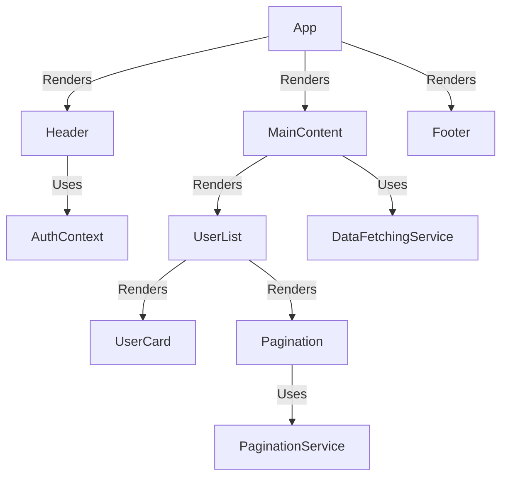

# Component Standards — React

## Overview and scope

The purpose of this document is to establish comprehensive standards for developing React components within the Xentic platform. This standard aims to ensure consistency, maintainability, and scalability across all frontend applications developed by Xentic. It serves as a guide for developers, architects, and project managers involved in the design and implementation of React components.

### Audience
This document is intended for:
- Frontend developers working on React applications.
- Technical leads and architects overseeing frontend development.
- Quality assurance teams responsible for ensuring adherence to standards.
- New team members onboarding into the Xentic development environment.

### Scope
This standard covers:
- Component structure and design patterns.
- Best practices for state management and lifecycle methods.
- Accessibility requirements for interactive elements.
- Performance optimization techniques.
- Integration with shared libraries and services.

### Non-goals
This document does NOT cover:
- Backend development standards.
- General JavaScript or TypeScript best practices that are not specific to React.
- Frameworks or libraries outside of the React ecosystem.

### Glossary
| Term                  | Definition                                                                 |
|-----------------------|-----------------------------------------------------------------------------|
| Component             | A reusable piece of UI that can accept inputs and manage its own state.    |
| Props                 | Short for properties, these are inputs to a React component.                |
| Memoization           | An optimization technique to cache results of expensive function calls.     |
| ARIA                  | Accessible Rich Internet Applications, a set of attributes to enhance accessibility. |
| CSS Modules           | A CSS file in which all class names are scoped locally by default.         |

### How This Standard Fits the Xentic Platform
The Xentic platform is built on a microservices architecture, where frontend applications interact with various backend services. Adhering to this component standard ensures that:
- Components are reusable across different services, reducing duplication and increasing efficiency.
- Accessibility and performance are prioritized, providing a better user experience.
- The codebase remains clean and maintainable, facilitating easier updates and enhancements.

### Component Template
```typescript
interface UserCardProps {
  user: User;
  onSelect?: (userId: string) => void;
  isSelected?: boolean;
}

const UserCard: FC<UserCardProps> = memo(({ user, onSelect, isSelected = false }) => {
  return (
    <div
      className={`${styles.card} ${isSelected ? styles.selected : ''}`}
      onClick={() => onSelect?.(user.id)}
      role="button"
      tabIndex={0}
      aria-pressed={isSelected}
    >
      <h3>{user.fullName}</h3>
      <p>{user.email}</p>
    </div>
  );
});

UserCard.displayName = 'UserCard';
export default UserCard;
```

### Rules
- **MUST** use `memo()` for components receiving object/array props to prevent unnecessary re-renders.
- **MUST NOT** inline styles; instead, use CSS Modules or Tailwind for styling.
- **MUST** ensure all interactive non-button elements have `role`, `tabIndex`, and appropriate ARIA attributes for accessibility.
- **SHOULD** use `useMemo` for expensive computations, avoiding it for simple derivations.
- **SHOULD** use `useCallback` for functions passed as props to memoized children to prevent re-creation of functions on each render.

By following these standards, Xentic aims to create a robust and user-friendly frontend experience that aligns with our organizational goals and values.

## Standards and policies

1. **MUST** follow the package naming convention `com.xentic.<service>` for all components, ensuring a clear structure and easy identification of service-related components.

2. **MUST NOT** use third-party libraries without prior approval from the architecture team. All dependencies must be vetted for security and performance.

3. **SHOULD** use TypeScript for all new React components to leverage type safety and improve maintainability. Components should have clearly defined prop types.

4. **MUST** document all components using JSDoc comments, providing descriptions for props, return types, and usage examples.

   ```typescript
   /**
    * UserCard component displays user information.
    * @param {UserCardProps} props - The props for the UserCard component.
    * @returns {JSX.Element}
    */
   ```

5. **MUST** implement error boundaries for components that may fail, ensuring that the application can gracefully handle errors without crashing.

   ```typescript
   class ErrorBoundary extends React.Component {
     state = { hasError: false };

     static getDerivedStateFromError(error: Error) {
       return { hasError: true };
     }

     componentDidCatch(error: Error, errorInfo: React.ErrorInfo) {
       // Log error to an error reporting service
     }

     render() {
       if (this.state.hasError) {
         return <h1>Something went wrong.</h1>;
       }
       return this.props.children; 
     }
   }
   ```

6. **SHOULD** utilize React's Context API for managing global state when necessary, but avoid overusing it to prevent performance issues.

7. **MUST** ensure that all components are responsive and work across various screen sizes. Use CSS media queries or utility-first CSS frameworks like Tailwind.

8. **MUST NOT** include any hardcoded strings in components. Instead, use a localization library to manage text and translations.

9. **SHOULD** implement unit tests for all components using Jest and React Testing Library, ensuring that components render correctly and handle user interactions as expected.

   ```typescript
   import { render, screen } from '@testing-library/react';
   import UserCard from './UserCard';

   test('renders user information', () => {
     render(<UserCard user={{ id: '1', fullName: 'John Doe', email: 'john@example.com' }} />);
     expect(screen.getByText(/John Doe/i)).toBeInTheDocument();
     expect(screen.getByText(/john@example.com/i)).toBeInTheDocument();
   });
   ```

10. **MUST** use consistent naming conventions for component files, using PascalCase for component names (e.g., `UserCard.tsx`) and camelCase for component props.

11. **SHOULD** limit component size to a maximum of 200 lines of code to promote readability and maintainability.

12. **MUST** use prop destructuring in functional components to improve readability and reduce the need for repetitive code.

   ```typescript
   const UserCard: FC<UserCardProps> = ({ user, onSelect, isSelected = false }) => {
     // Component logic
   };
   ```

13. **SHOULD** leverage React's built-in hooks (e.g., `useEffect`, `useState`) for managing component state and side effects, avoiding class components unless necessary.

14. **MUST** ensure that all components are tested for accessibility using tools like Axe or Lighthouse, addressing any issues identified.

15. **MUST NOT** use deprecated React lifecycle methods (e.g., `componentWillMount`, `componentWillReceiveProps`). Instead, use the recommended hooks and lifecycle methods.

16. **SHOULD** keep the component hierarchy shallow to avoid deeply nested components, which can complicate state management and performance.

17. **MUST** use consistent indentation and code formatting across all components, adhering to the Prettier configuration set for the project.

18. **MUST** ensure that all components are imported using absolute paths based on the project structure, avoiding relative path imports to improve clarity.

19. **SHOULD** utilize lazy loading for components that are not immediately necessary to improve initial load performance.

20. **MUST NOT** use console logging in production code. Instead, implement a logging service that can be toggled based on the environment.

By adhering to these standards, Xentic will foster a high-quality, maintainable, and scalable React codebase that aligns with our organizational objectives.

## Architecture and design

### Component Diagram



### Data Flows

- **User Interaction Flow**:
  1. User interacts with the `UserCard` component (e.g., clicks to select a user).
  2. The `UserCard` triggers the `onSelect` callback, which is passed down from the `UserList`.
  3. The `UserList` updates its state based on the selected user and re-renders.

- **Data Fetching Flow**:
  1. The `MainContent` component calls the `DataFetchingService` to retrieve user data.
  2. The fetched data is stored in the local state of `MainContent`.
  3. The `UserList` receives the data as props and renders `UserCard` components for each user.

### Integration Points

- **AuthContext**: Provides authentication state and methods across the application. All components that require user authentication must consume this context.
- **DataFetchingService**: A shared service for fetching data from the backend. It should handle API calls and error management.
- **PaginationService**: A utility for managing pagination logic, ensuring consistent behavior across paginated components.

### Failure Domains

- **Network Failures**: If the `DataFetchingService` fails to retrieve data, the application should display an error message to the user and log the error for further investigation.
- **Component Failures**: If a component fails (e.g., due to an uncaught error), the `ErrorBoundary` should catch the error and display a fallback UI.
- **State Management Failures**: If state updates do not propagate correctly (e.g., due to incorrect prop usage), it could lead to stale or inconsistent UI. Components must be tested thoroughly to ensure proper state management.

### Configuration Examples

#### YAML Configuration for Services

```yaml
services:
  dataFetchingService:
    baseUrl: "https://api.internal.xentic.io"
    timeout: 5000
  paginationService:
    itemsPerPage: 10
```

#### SQL Example for User Data Retrieval

```sql
SELECT id, full_name, email FROM users WHERE active = TRUE ORDER BY created_at DESC LIMIT :limit OFFSET :offset;
```

### Best Practices

- **Component Structure**:
  - Components should be organized in a clear directory structure, e.g., `src/components/UserCard.tsx`.
  - Each component should be self-contained with its styles and tests.

- **State Management**:
  - Use local state for component-specific data and context for shared state.
  - Avoid prop drilling by utilizing context or state management libraries when necessary.

- **Error Handling**:
  - Implement try-catch blocks in asynchronous functions to handle errors gracefully.
  - Use fallback UI components to enhance user experience during failures.

By adhering to these architectural and design principles, Xentic will ensure that React components are robust, maintainable, and scalable, providing a seamless user experience across all applications.

## Configuration reference

### Application Configuration (application.yml)

| Key                        | Default Value                         | Production Value                     |
|---------------------------|--------------------------------------|-------------------------------------|
| `services.dataFetchingService.baseUrl` | `https://api.internal.xentic.io` | `https://api.xentic.io`            |
| `services.dataFetchingService.timeout` | `5000`                              | `3000`                              |
| `services.paginationService.itemsPerPage` | `10`                               | `20`                                |
| `auth.tokenExpiration`    | `3600` (in seconds)                 | `1800` (in seconds)                |
| `features.enableFeatureX` | `false`                             | `true`                              |

```yaml
services:
  dataFetchingService:
    baseUrl: "https://api.internal.xentic.io"
    timeout: 5000
  paginationService:
    itemsPerPage: 10

auth:
  tokenExpiration: 3600
features:
  enableFeatureX: false
```

### Environment Variables

| Environment Variable                  | Default Value                         | Production Value                     |
|---------------------------------------|--------------------------------------|-------------------------------------|
| `REACT_APP_API_URL`                  | `https://api.internal.xentic.io`    | `https://api.xentic.io`            |
| `REACT_APP_AUTH_TOKEN_EXPIRATION`    | `3600`                               | `1800`                              |
| `REACT_APP_ENABLE_FEATURE_X`          | `false`                              | `true`                              |

```bash
export REACT_APP_API_URL=https://api.internal.xentic.io
export REACT_APP_AUTH_TOKEN_EXPIRATION=3600
export REACT_APP_ENABLE_FEATURE_X=false
```

### Terraform Configuration

| Resource Type          | Resource Name                   | Default Value                         | Production Value                     |
|-----------------------|----------------------------------|--------------------------------------|-------------------------------------|
| `aws_s3_bucket`       | `xentic-react-assets`            | `xentic-react-assets-dev`            | `xentic-react-assets-prod`          |
| `aws_lambda_function` | `dataFetchingFunction`           | `dataFetchingFunctionDev`            | `dataFetchingFunctionProd`          |

```hcl
resource "aws_s3_bucket" "xentic_react_assets" {
  bucket = "xentic-react-assets-${var.environment}"
  acl    = "private"
}

resource "aws_lambda_function" "dataFetchingFunction" {
  function_name = "dataFetchingFunction${var.environment}"
  handler       = "index.handler"
  runtime       = "nodejs14.x"
  role          = aws_iam_role.lambda_exec.arn
}
```

### SQL Configuration for User Data Retrieval

```sql
CREATE TABLE users (
    id SERIAL PRIMARY KEY,
    full_name VARCHAR(255) NOT NULL,
    email VARCHAR(255) NOT NULL UNIQUE,
    active BOOLEAN DEFAULT TRUE,
    created_at TIMESTAMP DEFAULT CURRENT_TIMESTAMP
);

SELECT id, full_name, email 
FROM users 
WHERE active = TRUE 
ORDER BY created_at DESC 
LIMIT :limit OFFSET :offset;
```

### Summary of Configuration Practices

- **MUST** use `application.yml` for service configurations to maintain a centralized configuration management approach.
- **MUST** utilize environment variables for sensitive information and configurations that may change between environments, ensuring that no hardcoded values are present in the codebase.
- **MUST NOT** expose sensitive data in the source code or configuration files. Use secure vaults or environment variables to manage secrets.
- **SHOULD** document all configuration options and their expected values in the README or a dedicated configuration documentation section to facilitate onboarding and maintenance.

## Implementation guide

To implement a React component in accordance with Xentic's standards, follow these steps:

### Step 1: Create the Component Structure

1. **Create a directory for your component** under `src/components`. For example, for a `UserCard` component, create `src/components/UserCard/`.

2. **Create the following files** within the `UserCard` directory:
   - `UserCard.tsx` - The main component file.
   - `UserCard.test.tsx` - The test file for the component.
   - `UserCard.module.css` - The CSS module for styling.

### Step 2: Implement the UserCard Component

Here's a complete example of a `UserCard` component:

```tsx
// src/components/UserCard/UserCard.tsx

import React from 'react';
import styles from './UserCard.module.css';

interface UserCardProps {
  id: string;
  fullName: string;
  email: string;
  onSelect: (id: string) => void;
}

const UserCard: React.FC<UserCardProps> = ({ id, fullName, email, onSelect }) => {
  const handleClick = () => {
    onSelect(id);
  };

  return (
    <div className={styles.card} onClick={handleClick} role="button" tabIndex={0}>
      <h2>{fullName}</h2>
      <p>{email}</p>
    </div>
  );
};

export default UserCard;
```

### Step 3: Style the Component

Add styles to `UserCard.module.css`:

```css
/* src/components/UserCard/UserCard.module.css */

.card {
  border: 1px solid #ccc;
  border-radius: 8px;
  padding: 16px;
  margin: 8px;
  cursor: pointer;
  transition: background-color 0.3s;
}

.card:hover {
  background-color: #f0f0f0;
}
```

### Step 4: Write Tests for the Component

Create a test for the `UserCard` component in `UserCard.test.tsx`:

```tsx
// src/components/UserCard/UserCard.test.tsx

import React from 'react';
import { render, screen, fireEvent } from '@testing-library/react';
import UserCard from './UserCard';

test('renders UserCard with correct information', () => {
  const mockSelect = jest.fn();
  render(<UserCard id="1" fullName="John Doe" email="john.doe@example.com" onSelect={mockSelect} />);

  expect(screen.getByText(/John Doe/i)).toBeInTheDocument();
  expect(screen.getByText(/john.doe@example.com/i)).toBeInTheDocument();
});

test('calls onSelect when clicked', () => {
  const mockSelect = jest.fn();
  render(<UserCard id="1" fullName="John Doe" email="john.doe@example.com" onSelect={mockSelect} />);

  fireEvent.click(screen.getByRole('button'));
  expect(mockSelect).toHaveBeenCalledWith("1");
});
```

### Step 5: Integrate the Component

Use the `UserCard` component within a parent component, such as `UserList`:

```tsx
// src/components/UserList/UserList.tsx

import React from 'react';
import UserCard from '../UserCard/UserCard';

interface User {
  id: string;
  fullName: string;
  email: string;
}

interface UserListProps {
  users: User[];
  onSelectUser: (id: string) => void;
}

const UserList: React.FC<UserListProps> = ({ users, onSelectUser }) => {
  return (
    <div>
      {users.map(user => (
        <UserCard key={user.id} {...user} onSelect={onSelectUser} />
      ))}
    </div>
  );
};

export default UserList;
```

### Step 6: Ensure Compliance with Standards

- **MUST** ensure that all component props are typed correctly using TypeScript.
- **MUST NOT** include any console logs or debugging statements in production code.
- **SHOULD** use absolute imports for all component imports to maintain clarity.

### Summary of Component Implementation

- Each component must be self-contained with its own styles and tests.
- Component names should be PascalCase and file names should match the component name.
- All components must be tested to ensure functionality and reliability.

By following this guide, developers at Xentic will create high-quality, maintainable React components that align with organizational standards and best practices.

## Security requirements

### Threat Model Summary

Xentic's React applications must adhere to a robust security framework to mitigate risks associated with client-side vulnerabilities. The following threats should be considered:

- **Cross-Site Scripting (XSS)**: Attackers inject malicious scripts into web pages viewed by users.
- **Cross-Site Request Forgery (CSRF)**: Unauthorized commands are transmitted from a user that the web application trusts.
- **Sensitive Data Exposure**: Sensitive information such as tokens or user data is exposed through improper handling.
- **Insecure Direct Object References (IDOR)**: Attackers gain access to unauthorized resources by manipulating input.

### Authentication and Authorization

- **MUST** implement OAuth 2.0 for user authentication and authorization.
- **MUST** use JWT (JSON Web Tokens) for session management. Tokens should be signed and have a short expiration time.
- **MUST NOT** store sensitive information (e.g., tokens) in local storage; use secure cookies with the `HttpOnly` and `Secure` flags.
- **SHOULD** validate user roles and permissions on the client side, but MUST enforce these checks on the server side.

Example of a JWT implementation:

```javascript
// src/utils/auth.js

import jwtDecode from 'jwt-decode';

export const getToken = () => {
  return document.cookie.split('; ').find(row => row.startsWith('token=')).split('=')[1];
};

export const isAuthenticated = () => {
  const token = getToken();
  if (!token) return false;

  const decoded = jwtDecode(token);
  return decoded.exp > Date.now() / 1000;
};
```

### Secrets Management

- **MUST** use environment variables to manage sensitive configurations, such as API keys and database credentials.
- **MUST NOT** hardcode secrets in the source code or configuration files.
- **SHOULD** utilize a secret management tool (e.g., HashiCorp Vault) for managing sensitive information.

Example of using environment variables in a `.env` file:

```bash
# .env
REACT_APP_API_KEY=your_api_key_here
REACT_APP_AUTH_URL=https://auth.internal.xentic.io
```

### Input Validation

- **MUST** validate all user inputs on both the client and server sides to prevent XSS and SQL injection attacks.
- **MUST NOT** trust any data coming from the client; always sanitize and validate before processing.
- **SHOULD** use libraries like `validator.js` for input validation.

Example of input validation in a form component:

```javascript
// src/components/UserForm/UserForm.js

import React, { useState } from 'react';
import validator from 'validator';

const UserForm = () => {
  const [email, setEmail] = useState('');

  const handleSubmit = (event) => {
    event.preventDefault();
    if (!validator.isEmail(email)) {
      alert('Invalid email address');
      return;
    }
    // Proceed with form submission
  };

  return (
    <form onSubmit={handleSubmit}>
      <input
        type="email"
        value={email}
        onChange={(e) => setEmail(e.target.value)}
        required
      />
      <button type="submit">Submit</button>
    </form>
  );
};
```

### Audit Logging

- **MUST** implement logging for all user actions that affect the state of the application (e.g., logins, data changes).
- **MUST NOT** log sensitive information such as passwords or personal identifiable information (PII).
- **SHOULD** use a centralized logging service (e.g., ELK stack) for storing and analyzing logs.

Example of logging user actions:

```javascript
// src/utils/logger.js

const logAction = (action) => {
  fetch('https://logs.internal.xentic.io/log', {
    method: 'POST',
    headers: {
      'Content-Type': 'application/json',
    },
    body: JSON.stringify({ action, timestamp: new Date() }),
  });
};

// Usage
logAction('User logged in');
```

### Summary of Security Practices

- **MUST** conduct regular security audits and penetration testing on React applications.
- **SHOULD** keep dependencies up to date to mitigate known vulnerabilities.
- **MUST** educate developers about secure coding practices and common vulnerabilities.
- **SHOULD** implement Content Security Policy (CSP) to prevent XSS attacks.

## Testing strategy

To ensure the quality and reliability of React components at Xentic, a comprehensive testing strategy must be employed. This strategy will encompass unit tests, integration tests, and contract tests, along with specific coverage targets.

### 1. Testing Types

- **Unit Tests**: 
  - Focus on testing individual components in isolation.
  - Each component should have a dedicated test file named `<ComponentName>.test.tsx`.

- **Integration Tests**: 
  - Test the interaction between multiple components.
  - Verify that components work together as expected.

- **Contract Tests**: 
  - Ensure that components adhere to defined interfaces and contracts.
  - Useful for verifying that changes in one component do not break others.

### 2. Coverage Targets

- **MUST** achieve a minimum of 80% code coverage for all components.
- **SHOULD** aim for 90% coverage in critical components that handle business logic.
- **MUST NOT** merge any pull requests that do not meet the coverage threshold.

### 3. Example Test Classes

#### Unit Test Example

```tsx
// src/components/UserCard/UserCard.test.tsx

import React from 'react';
import { render, screen, fireEvent } from '@testing-library/react';
import UserCard from './UserCard';

describe('UserCard Component', () => {
  test('renders UserCard with correct information', () => {
    const mockSelect = jest.fn();
    render(<UserCard id="1" fullName="John Doe" email="john.doe@example.com" onSelect={mockSelect} />);

    expect(screen.getByText(/John Doe/i)).toBeInTheDocument();
    expect(screen.getByText(/john.doe@example.com/i)).toBeInTheDocument();
  });

  test('calls onSelect when clicked', () => {
    const mockSelect = jest.fn();
    render(<UserCard id="1" fullName="John Doe" email="john.doe@example.com" onSelect={mockSelect} />);

    fireEvent.click(screen.getByRole('button'));
    expect(mockSelect).toHaveBeenCalledWith("1");
  });
});
```

#### Integration Test Example

```tsx
// src/components/UserList/UserList.test.tsx

import React from 'react';
import { render, screen } from '@testing-library/react';
import UserList from './UserList';

describe('UserList Component', () => {
  const mockUsers = [
    { id: '1', fullName: 'John Doe', email: 'john.doe@example.com' },
    { id: '2', fullName: 'Jane Smith', email: 'jane.smith@example.com' },
  ];

  test('renders UserList with UserCards', () => {
    render(<UserList users={mockUsers} onSelectUser={() => {}} />);

    expect(screen.getByText(/John Doe/i)).toBeInTheDocument();
    expect(screen.getByText(/Jane Smith/i)).toBeInTheDocument();
  });
});
```

#### Contract Test Example

```tsx
// src/components/UserCard/UserCard.contract.test.tsx

import UserCard from './UserCard';
import { render } from '@testing-library/react';

describe('UserCard Contract Tests', () => {
  test('UserCard should accept specific props', () => {
    const props = {
      id: '1',
      fullName: 'John Doe',
      email: 'john.doe@example.com',
      onSelect: jest.fn(),
    };

    const { container } = render(<UserCard {...props} />);
    expect(container).toMatchSnapshot();
  });
});
```

### 4. Testing Tools

- **MUST** use `@testing-library/react` for testing React components.
- **SHOULD** use Jest as the testing framework.
- **MUST NOT** use Enzyme for testing React components, as it is outdated and does not promote best practices.

### 5. Continuous Integration

- **MUST** integrate tests into the CI/CD pipeline.
- **SHOULD** run tests on every pull request to ensure code quality.
- **MUST NOT** deploy code that has not passed all tests.

### Summary of Testing Standards

- All components must have corresponding tests that cover unit, integration, and contract testing.
- Maintain high coverage targets to ensure reliability.
- Use appropriate tools and integrate testing into the development workflow to uphold the quality of React components at Xentic.

## Observability and operations

To ensure the reliability and performance of React applications at Xentic, a comprehensive observability strategy must be implemented. This includes metrics collection, logging, tracing, dashboarding, alerting, and defining Service Level Objectives (SLOs). 

### 1. Metrics Collection

- **MUST** collect key performance metrics such as:
  - Page load times
  - API response times
  - User interaction metrics (e.g., button clicks, form submissions)
  - Error rates (JavaScript errors, network errors)

Example of integrating a metrics library:

```javascript
// src/utils/metrics.js

import { init, trackEvent } from 'some-metrics-library';

init('YOUR_METRICS_API_KEY');

export const logPageLoadTime = (duration) => {
  trackEvent('Page Load Time', { duration });
};

export const logUserInteraction = (eventName) => {
  trackEvent('User Interaction', { eventName });
};
```

### 2. Logging

- **MUST** implement structured logging for all significant events and errors.
- **MUST NOT** log sensitive information.
- **SHOULD** use a centralized logging service (e.g., ELK stack) for better analysis.

Example of structured logging:

```javascript
// src/utils/logger.js

const logError = (error) => {
  fetch('https://logs.internal.xentic.io/log', {
    method: 'POST',
    headers: {
      'Content-Type': 'application/json',
    },
    body: JSON.stringify({ level: 'error', message: error.message, timestamp: new Date() }),
  });
};

// Usage
try {
  // Some code that may throw
} catch (error) {
  logError(error);
}
```

### 3. Tracing

- **MUST** implement distributed tracing to monitor requests across services.
- **SHOULD** use tools like OpenTelemetry to capture and visualize traces.

Example of tracing an API call:

```javascript
// src/utils/api.js

import { trace } from 'opentelemetry/api';

const apiCall = async (url) => {
  const span = trace.getTracer('api-calls').startSpan('API Call');
  try {
    const response = await fetch(url);
    return await response.json();
  } catch (error) {
    span.recordException(error);
    throw error;
  } finally {
    span.end();
  }
};
```

### 4. Dashboards

- **MUST** create dashboards to visualize metrics and logs.
- **SHOULD** use tools like Grafana or Kibana for building dashboards.
- **MUST** ensure dashboards are accessible to relevant teams.

Example of a dashboard configuration in Grafana:

```yaml
apiVersion: 1
providers:
  - name: 'Xentic Metrics'
    type: file
    disableDeletion: true
    updateIntervalSeconds: 10
    folder: ''
    options:
      path: /var/lib/grafana/dashboards
```

### 5. Alerts

- **MUST** set up alerts for critical metrics, such as:
  - High error rates
  - Slow API response times
  - Increased page load times

Example of an alert configuration in Prometheus:

```yaml
groups:
  - name: frontend_alerts
    rules:
      - alert: HighErrorRate
        expr: rate(http_requests_total{status="500"}[5m]) > 0.05
        for: 5m
        labels:
          severity: critical
        annotations:
          summary: "High error rate detected"
          description: "More than 5% of requests are failing in the last 5 minutes."
```

### 6. Service Level Objectives (SLOs)

- **MUST** define SLOs for critical services, including:
  - Availability (e.g., 99.9% uptime)
  - Performance (e.g., 95% of requests under 200ms)
- **SHOULD** regularly review and adjust SLOs based on evolving business needs.

Example of defining SLOs in a shared document:

| Service          | SLO Type      | Target       | Measurement Period |
|------------------|---------------|--------------|---------------------|
| User Authentication | Availability | 99.9% uptime | Monthly             |
| API Response Time | Performance   | 95% under 200ms | Weekly             |

### 7. On-call Runbook Steps

- **MUST** have a runbook for on-call engineers to follow during incidents.
- **SHOULD** include steps for:
  - Identifying the issue
  - Gathering relevant logs and metrics
  - Communicating with stakeholders
  - Escalating to the appropriate team if necessary

Example of a runbook step:

1. **Identify the issue**:
   - Check the dashboard for alerts.
   - Review recent logs for errors.
  
2. **Gather metrics**:
   - Collect performance metrics for the affected service.
   - Use tracing tools to identify slow requests.

3. **Communicate**:
   - Notify the team via the incident management tool (e.g., PagerDuty).
   - Provide updates to stakeholders as necessary.

By adhering to these observability and operations standards, Xentic ensures that React applications are monitored effectively, allowing for quick identification and resolution of issues, thereby maintaining a high level of service reliability.

## Migration and versioning

To maintain the integrity and reliability of React components at Xentic, a clear migration and versioning strategy is essential. This section outlines the upgrade paths, deprecation policy, backward compatibility requirements, and rollback procedures.

### 1. Upgrade Paths

- **MUST** define a clear upgrade path for each major version of a component.
- **SHOULD** provide migration guides for breaking changes.
- **MUST NOT** introduce breaking changes without a corresponding major version bump.

| Current Version | Next Version | Upgrade Path Description         |
|------------------|--------------|----------------------------------|
| 1.x              | 2.0          | Breaking changes in props        |
| 2.x              | 2.y          | Minor updates, backward compatible|
| 2.y              | 3.0          | Major updates, breaking changes  |

### 2. Deprecation Policy

- **MUST** mark deprecated features in the code with appropriate comments and documentation.
- **SHOULD** provide a timeline for deprecation, including when the feature will be removed.
- **MUST NOT** remove deprecated features without sufficient notice and migration support.

Example of marking a deprecated feature:

```javascript
// src/components/OldComponent.js

/**
 * @deprecated This component will be removed in version 3.0.
 * Use NewComponent instead.
 */
const OldComponent = () => {
  return <div>This is an old component.</div>;
};
```

### 3. Backward Compatibility

- **MUST** ensure that new versions of components are backward compatible where possible.
- **SHOULD** include compatibility tests to verify that existing functionality remains intact.
- **MUST NOT** break existing APIs without providing a suitable alternative.

Example of a backward-compatible change:

```javascript
// src/components/NewComponent.js

const NewComponent = ({ newProp = 'default' }) => {
  return <div>{newProp}</div>;
};

// The old prop still works
NewComponent.propTypes = {
  newProp: PropTypes.string,
  oldProp: PropTypes.string, // old prop still supported
};
```

### 4. Rollback Procedures

- **MUST** have a rollback strategy in place for deployments.
- **SHOULD** use version control tags to facilitate easy rollbacks.
- **MUST NOT** deploy changes without a tested rollback plan.

Example of a rollback command using Git:

```bash
# Rollback to the previous version
git checkout <previous-tag>
```

### 5. Versioning Scheme

- **MUST** follow Semantic Versioning (SemVer) for all components:
  - MAJOR version for incompatible API changes
  - MINOR version for backward-compatible functionality
  - PATCH version for backward-compatible bug fixes

Example of a versioning scheme:

| Component Name | Current Version | Last Update | Next Version |
|----------------|------------------|-------------|--------------|
| UserCard       | 1.2.3            | 2023-10-01  | 1.3.0        |
| UserList       | 2.0.0            | 2023-09-15  | 3.0.0        |

### 6. Documentation

- **MUST** maintain up-to-date documentation for each component version.
- **SHOULD** include examples of usage and migration paths in the documentation.
- **MUST NOT** allow outdated documentation to persist in the codebase.

Example of a migration guide snippet:

```markdown
# Migration Guide for UserCard v1.2 to v1.3

## Breaking Changes
- The `onSelect` prop is now required.

## Migration Steps
1. Update your component usage to include the `onSelect` prop.
2. Test your component to ensure it behaves as expected.
```

By adhering to these migration and versioning standards, Xentic ensures that React components remain robust, maintainable, and user-friendly throughout their lifecycle.

### FAQ, Anti-Patterns, and Checklists

#### FAQ

1. **What is the preferred way to manage state in React?**
   - **Answer:** Use React's built-in state management with hooks (e.g., `useState`, `useReducer`) for local state. For global state, consider using context or libraries like Redux.

2. **How should I handle API calls in my components?**
   - **Answer:** Use `useEffect` to handle side effects like API calls. Always clean up subscriptions or asynchronous tasks to avoid memory leaks.

3. **What is the recommended way to style components?**
   - **Answer:** Use CSS Modules or styled-components to scope styles to components, ensuring no global CSS conflicts.

4. **How can I optimize performance in React applications?**
   - **Answer:** Use React.memo for functional components, PureComponent for class components, and lazy loading for routes and components.

5. **What should I do if I encounter prop drilling?**
   - **Answer:** Use React Context API to avoid prop drilling by providing global state to components that need it.

6. **How do I ensure accessibility in my components?**
   - **Answer:** Follow WAI-ARIA guidelines, use semantic HTML elements, and test with screen readers.

7. **What is the best practice for handling forms?**
   - **Answer:** Use controlled components for form inputs and consider libraries like Formik or React Hook Form for complex forms.

8. **How should I manage component lifecycle?**
   - **Answer:** Use `useEffect` for handling component lifecycle events in functional components. For class components, utilize lifecycle methods like `componentDidMount` and `componentWillUnmount`.

9. **What is the purpose of keys in lists?**
   - **Answer:** Keys help React identify which items have changed, are added, or are removed, improving performance during updates.

10. **How can I test my React components?**
    - **Answer:** Use testing libraries like Jest and React Testing Library to write unit and integration tests for your components.

#### Anti-Patterns

| Anti-Pattern                | Description                                                                                 | Recommended Practice                                  |
|-----------------------------|---------------------------------------------------------------------------------------------|------------------------------------------------------|
| State Mutation               | Directly modifying state instead of using `setState`.                                      | Always use `setState` or state updater functions.    |
| Inline Functions in Render   | Defining functions directly in render methods can lead to unnecessary re-renders.        | Define functions outside of the render method.       |
| Excessive Re-renders         | Not using `React.memo` or `PureComponent` can cause performance issues.                   | Optimize components with `React.memo` or `PureComponent`. |
| Prop Drilling                | Passing props through many layers of components can make code hard to maintain.           | Use Context API to manage global state.              |
| Using Index as Key          | Using array indices as keys can lead to issues with component state.                       | Use unique identifiers as keys instead.              |
| Not Handling Errors          | Ignoring error boundaries can lead to unhandled exceptions breaking the application.       | Implement error boundaries using `componentDidCatch`. |
| Overusing Context            | Using context for everything can lead to unnecessary re-renders.                          | Limit context usage to global state management.      |

#### Pre-Merge Checklist

- **MUST** ensure all code is reviewed by at least one other developer.
- **MUST** run all unit tests and ensure they pass.
- **SHOULD** run integration tests if applicable.
- **MUST** update documentation for any new features or changes.
- **SHOULD** check for any linting errors and fix them.
- **MUST NOT** merge code that contains commented-out code blocks.

#### Production Checklist

- **MUST** ensure the application is built for production using the appropriate build command.
- **MUST** verify that environment variables are correctly set for production.
- **SHOULD** conduct a final round of manual testing in a staging environment.
- **MUST** monitor logs for any errors post-deployment.
- **SHOULD** ensure that performance metrics are being collected and reviewed.
- **MUST NOT** deploy during peak usage hours unless absolutely necessary.
