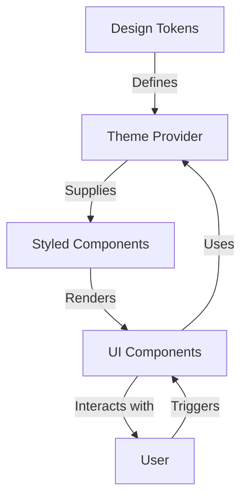

# Design Tokens and Theming — React

## Overview and scope

The purpose of this document is to establish standards for the implementation of design tokens and theming in React applications within Xentic. Design tokens serve as the foundational building blocks for visual design, ensuring consistency and scalability across all user interfaces. This document outlines the guidelines for creating, managing, and utilizing design tokens in conjunction with theming strategies.

### Audience

This document is intended for:
- Frontend Developers
- UI/UX Designers
- Technical Architects
- Quality Assurance Engineers

### Scope

This standard covers:
- Definition and creation of design tokens
- Implementation of theming in React applications
- Best practices for maintaining design consistency
- Integration with existing Xentic libraries and components

### Non-goals

This document does NOT cover:
- Backend implementation or server-side rendering
- Non-React frameworks or libraries
- Detailed UI/UX design principles outside the context of design tokens

### Glossary

| Term               | Definition                                                                 |
|--------------------|-----------------------------------------------------------------------------|
| Design Token       | A named entity that stores a design decision, such as color, spacing, or typography. |
| Theming            | The process of applying a set of design tokens to create a specific visual style. |
| React              | A JavaScript library for building user interfaces, primarily for single-page applications. |
| Component          | A reusable piece of UI that encapsulates its own structure, style, and behavior. |

### How This Standard Fits the Xentic Platform

This standard is integral to the Xentic platform as it ensures:
- **Consistency**: By using design tokens, all teams can maintain a unified visual language across different services.
- **Scalability**: As new components and services are developed, they can leverage existing design tokens, reducing redundancy.
- **Maintainability**: Centralized design tokens simplify updates and modifications, allowing for quick adjustments across multiple applications.

### Example Configuration

To define design tokens in a YAML format, you can use the following structure:

```yaml
designTokens:
  colors:
    primary: "#007bff"
    secondary: "#6c757d"
    success: "#28a745"
    danger: "#dc3545"
  spacing:
    small: "8px"
    medium: "16px"
    large: "32px"
  typography:
    fontFamily: "'Helvetica Neue', Arial, sans-serif"
    fontSize: 
      small: "12px"
      medium: "16px"
      large: "24px"
```

### Example React Component

Here is an example of how to implement design tokens in a React component:

```javascript
import React from 'react';
import styled from 'styled-components';

const Button = styled.button`
  background-color: ${props => props.theme.colors.primary};
  color: white;
  padding: ${props => props.theme.spacing.medium};
  font-family: ${props => props.theme.typography.fontFamily};
  font-size: ${props => props.theme.typography.fontSize.medium};
  border: none;
  border-radius: 4px;
  cursor: pointer;

  &:hover {
    background-color: ${props => props.theme.colors.secondary};
  }
`;

const App = () => {
  return (
    <Button>
      Click Me
    </Button>
  );
};

export default App;
```

By adhering to these standards, Xentic can ensure a cohesive and efficient approach to design and development across all frontend applications.

## Standards and policies

1. **Design Tokens Definition**: Design tokens MUST be defined in a centralized location, preferably in a YAML file, to ensure consistency across all applications. Each token MUST have a clear name and purpose.

2. **Naming Conventions**: Design tokens MUST use the `kebab-case` format for naming (e.g., `primary-color`, `medium-spacing`). This ensures clarity and prevents naming conflicts.

3. **Color Palette**: The color tokens MUST include at least the following categories:
   - Primary
   - Secondary
   - Success
   - Danger
   - Warning
   - Info

   Example:
   ```yaml
   colors:
     primary: "#007bff"
     secondary: "#6c757d"
     success: "#28a745"
     danger: "#dc3545"
     warning: "#ffc107"
     info: "#17a2b8"
   ```

4. **Spacing Tokens**: Spacing tokens MUST be defined for consistent layout and padding. The following sizes MUST be included:
   - Small
   - Medium
   - Large

   Example:
   ```yaml
   spacing:
     small: "8px"
     medium: "16px"
     large: "32px"
   ```

5. **Typography Tokens**: Typography tokens MUST include definitions for font families, sizes, and weights. This ensures uniform text presentation across components.

   Example:
   ```yaml
   typography:
     fontFamily: "'Helvetica Neue', Arial, sans-serif"
     fontSize:
       small: "12px"
       medium: "16px"
       large: "24px"
   ```

6. **Theming Strategy**: Theming MUST be implemented using a context provider in React. This allows easy access to design tokens throughout the component tree.

7. **Styled Components**: When using styled-components, design tokens MUST be referenced directly from the theme. This ensures that styles are consistent and maintainable.

8. **Component Library Integration**: All components MUST utilize design tokens from the centralized configuration. This includes buttons, forms, and any other reusable UI elements.

9. **Documentation**: All design tokens MUST be documented in a central repository, accessible at `https://docs.internal.xentic.io/design-tokens`. This documentation MUST include examples and usage guidelines.

10. **Versioning**: Design tokens MUST be versioned to track changes over time. This allows for backward compatibility and easier rollbacks if necessary.

11. **Testing**: All components utilizing design tokens MUST be tested for visual consistency. Automated visual regression tests SHOULD be implemented to catch any discrepancies.

12. **Accessibility**: Color tokens MUST adhere to WCAG 2.1 accessibility standards for contrast ratios. This ensures that text is legible against background colors.

13. **MUST NOT Use Hardcoded Values**: Hardcoded values for colors, spacing, or typography MUST NOT be used in any component. Always reference the design tokens instead.

14. **MUST NOT Duplicate Tokens**: Duplicate design tokens MUST NOT be created. Each token MUST have a unique purpose to avoid confusion.

15. **MUST NOT Ignore Updates**: Any updates to design tokens MUST be communicated to all teams involved in frontend development to ensure that all applications are aligned with the latest design standards.

By adhering to these standards and policies, Xentic will maintain a robust and scalable approach to design tokens and theming in React applications, ensuring a cohesive user experience across all services.

## Architecture and design

The architecture for implementing design tokens and theming in React applications at Xentic is structured to ensure modularity, scalability, and maintainability. The following section describes the component diagram, data flows, integration points, and failure domains.

### Component Diagram



### Data Flows

1. **Design Tokens Definition**: 
   - Design tokens are defined in a centralized YAML file.
   - The tokens are loaded into the application at runtime.

2. **Theme Provider**:
   - The Theme Provider wraps the main application component.
   - It supplies design tokens to all child components via context.

3. **Styled Components**:
   - Styled-components access the design tokens through the theme context.
   - Components are styled based on the tokens, ensuring consistency.

4. **User Interaction**:
   - Users interact with UI components, triggering events.
   - Components may update their styles dynamically based on user actions (e.g., hover states).

### Integration Points

- **Centralized Token Configuration**: 
  - The design tokens YAML file must be integrated into the build process to ensure tokens are available at runtime.
  
- **Theme Provider**: 
  - The Theme Provider MUST be implemented using React Context API to allow easy access to tokens throughout the application.

- **Styled Components Library**: 
  - Integration with the styled-components library MUST be established to leverage the theme context for styling.

- **Component Library**: 
  - All reusable components MUST be designed to accept theme props, ensuring they can adapt to different themes.

### Failure Domains

1. **Token Configuration Errors**:
   - If the design tokens are not defined correctly in the YAML file, components may fail to render correctly. This MUST be validated during the build process.

2. **Theme Provider Issues**:
   - If the Theme Provider fails to wrap the application correctly, components will not have access to the design tokens, leading to inconsistent styling.

3. **Styled Components Integration**:
   - Any issues with the styled-components library could lead to failure in applying styles. This MUST be monitored and handled appropriately.

4. **User Interaction Failures**:
   - If components do not respond correctly to user interactions, it could lead to a poor user experience. This MUST be tested thoroughly.

### Summary

By establishing a clear architecture for design tokens and theming, Xentic can ensure that its React applications are visually consistent, maintainable, and scalable. Adhering to the outlined data flows, integration points, and failure domains is critical for the success of the frontend development process.

## Configuration reference

The configuration for design tokens and theming in React applications at Xentic can be defined using various formats, including YAML, Terraform, and environment variables. Below are detailed tables and examples for each configuration type, including defaults and production values.

### application.yml

This YAML configuration file defines the design tokens used throughout the application.

```yaml
designTokens:
  colors:
    primary: "#007bff"         # Default: Blue
    secondary: "#6c757d"       # Default: Gray
    success: "#28a745"         # Default: Green
    danger: "#dc3545"          # Default: Red
    warning: "#ffc107"         # Default: Yellow
    info: "#17a2b8"            # Default: Cyan
  spacing:
    small: "8px"                # Default: 8 pixels
    medium: "16px"              # Default: 16 pixels
    large: "32px"               # Default: 32 pixels
  typography:
    fontFamily: "'Helvetica Neue', Arial, sans-serif" # Default font family
    fontSize:
      small: "12px"             # Default: 12 pixels
      medium: "16px"            # Default: 16 pixels
      large: "24px"             # Default: 24 pixels
```

### Terraform Configuration

The following Terraform configuration defines environment variables for design tokens. This allows for flexibility in managing different environments (e.g., development, staging, production).

```hcl
variable "design_tokens" {
  type = map(string)
  default = {
    primary_color   = "#007bff"
    secondary_color = "#6c757d"
    success_color   = "#28a745"
    danger_color    = "#dc3545"
    warning_color   = "#ffc107"
    info_color      = "#17a2b8"
    small_spacing    = "8px"
    medium_spacing   = "16px"
    large_spacing    = "32px"
    font_family      = "'Helvetica Neue', Arial, sans-serif"
    small_font_size  = "12px"
    medium_font_size = "16px"
    large_font_size  = "24px"
  }
}
```

### Environment Variables

Below is a table of environment variables that can be set for different environments. These variables should be used to override default values in production.

| Variable Name           | Default Value                  | Production Value          |
|-------------------------|-------------------------------|---------------------------|
| `REACT_APP_PRIMARY_COLOR`   | `#007bff`                     | `#0056b3`                 |
| `REACT_APP_SECONDARY_COLOR` | `#6c757d`                     | `#5a6268`                 |
| `REACT_APP_SUCCESS_COLOR`   | `#28a745`                     | `#218838`                 |
| `REACT_APP_DANGER_COLOR`    | `#dc3545`                     | `#c82333`                 |
| `REACT_APP_WARNING_COLOR`   | `#ffc107`                     | `#e0a800`                 |
| `REACT_APP_INFO_COLOR`      | `#17a2b8`                     | `#138496`                 |
| `REACT_APP_SMALL_SPACING`   | `8px`                         | `4px`                     |
| `REACT_APP_MEDIUM_SPACING`  | `16px`                        | `12px`                    |
| `REACT_APP_LARGE_SPACING`   | `32px`                        | `24px`                    |
| `REACT_APP_FONT_FAMILY`     | `"'Helvetica Neue', Arial, sans-serif"` | `"'Arial', sans-serif"` |
| `REACT_APP_SMALL_FONT_SIZE`  | `12px`                       | `10px`                    |
| `REACT_APP_MEDIUM_FONT_SIZE` | `16px`                       | `14px`                    |
| `REACT_APP_LARGE_FONT_SIZE`  | `24px`                       | `20px`                    |

### Summary

By utilizing the above configuration references, Xentic can ensure that design tokens are consistently applied across all React applications, while also allowing for flexibility in different environments. It is imperative to adhere to these configurations to maintain a cohesive user experience and efficient development practices.

## Implementation guide

To effectively implement design tokens and theming in React applications at Xentic, follow the step-by-step guide outlined below. This guide includes code examples, configuration details, and best practices.

### Step 1: Define Design Tokens

Create a centralized YAML file to define your design tokens. This file should include colors, spacing, and typography.

**File: `design-tokens.yml`**

```yaml
designTokens:
  colors:
    primary: "#007bff"
    secondary: "#6c757d"
    success: "#28a745"
    danger: "#dc3545"
    warning: "#ffc107"
    info: "#17a2b8"
  spacing:
    small: "8px"
    medium: "16px"
    large: "32px"
  typography:
    fontFamily: "'Helvetica Neue', Arial, sans-serif"
    fontSize:
      small: "12px"
      medium: "16px"
      large: "24px"
```

### Step 2: Create a Theme Provider

Implement a Theme Provider using React's Context API to supply design tokens throughout the application.

**File: `ThemeProvider.js`**

```javascript
import React, { createContext, useContext } from 'react';
import designTokens from './design-tokens.yml'; // Import YAML file

const ThemeContext = createContext();

export const ThemeProvider = ({ children }) => {
  return (
    <ThemeContext.Provider value={designTokens}>
      {children}
    </ThemeContext.Provider>
  );
};

export const useTheme = () => {
  return useContext(ThemeContext);
};
```

### Step 3: Wrap Your Application with Theme Provider

Ensure that your main application component is wrapped with the Theme Provider to make tokens accessible.

**File: `App.js`**

```javascript
import React from 'react';
import { ThemeProvider } from './ThemeProvider';
import MyComponent from './MyComponent';

const App = () => {
  return (
    <ThemeProvider>
      <MyComponent />
    </ThemeProvider>
  );
};

export default App;
```

### Step 4: Use Design Tokens in Styled Components

Leverage the styled-components library to apply design tokens in your UI components.

**File: `MyComponent.js`**

```javascript
import React from 'react';
import styled from 'styled-components';
import { useTheme } from './ThemeProvider';

const StyledButton = styled.button`
  background-color: ${({ theme }) => theme.colors.primary};
  color: white;
  padding: ${({ theme }) => theme.spacing.medium};
  font-family: ${({ theme }) => theme.typography.fontFamily};
  font-size: ${({ theme }) => theme.typography.fontSize.medium};
  
  &:hover {
    background-color: ${({ theme }) => theme.colors.secondary};
  }
`;

const MyComponent = () => {
  return <StyledButton>Click Me</StyledButton>;
};

export default MyComponent;
```

### Step 5: Configure ESLint and Prettier

Ensure that your project is configured to lint and format your code consistently.

**File: `.eslintrc.js`**

```javascript
module.exports = {
  extends: ['eslint:recommended', 'plugin:react/recommended'],
  rules: {
    'react/prop-types': 'off',
  },
};
```

**File: `.prettierrc`**

```json
{
  "singleQuote": true,
  "trailingComma": "es5"
}
```

### Step 6: Testing for Visual Consistency

Implement visual regression testing to ensure that components render correctly with the applied design tokens.

**Example using Jest and React Testing Library:**

```javascript
import { render } from '@testing-library/react';
import MyComponent from './MyComponent';

test('renders button with correct styles', () => {
  const { getByText } = render(<MyComponent />);
  const button = getByText(/Click Me/i);
  
  expect(button).toHaveStyle(`background-color: #007bff`);
  expect(button).toHaveStyle(`padding: 16px`);
});
```

### Summary

By following the steps above, Xentic can implement a robust theming system using design tokens in React applications. The use of a centralized YAML file, a Theme Provider, and styled-components ensures that design consistency is maintained across the application. Additionally, testing for visual consistency is crucial for delivering a high-quality user experience.

## Security requirements

To ensure the security of React applications at Xentic, the following security requirements must be adhered to:

### Threat Model Summary

- **Data Exposure**: Ensure that sensitive data is not exposed in the frontend.
- **Cross-Site Scripting (XSS)**: Validate and sanitize all user inputs to prevent XSS attacks.
- **Cross-Site Request Forgery (CSRF)**: Implement CSRF protection measures for state-changing requests.
- **Session Hijacking**: Secure session management practices must be in place.

### Authentication and Authorization

- **Authentication**: All applications MUST use Xentic's centralized authentication service. Tokens (JWT) MUST be securely stored and managed.
- **Authorization**: Role-based access control (RBAC) MUST be implemented to restrict access to resources based on user roles.

**Example of token storage in local storage:**

```javascript
localStorage.setItem('authToken', token);
```

**Example of checking user roles:**

```javascript
const userRole = getUserRole(); // Function to retrieve user role

if (userRole !== 'admin') {
  // Redirect or show access denied
}
```

### Secrets Management

- **Environment Variables**: Sensitive information such as API keys and secrets MUST NOT be hardcoded. Instead, they MUST be stored in environment variables.
- **Secret Rotation**: Secrets MUST be rotated regularly to minimize the risk of exposure.

**Example of accessing environment variables in React:**

```javascript
const apiKey = process.env.REACT_APP_API_KEY;
```

### Input Validation

- **Client-Side Validation**: All user inputs MUST be validated on the client-side before submission to the server.
- **Server-Side Validation**: All inputs MUST also be validated on the server-side to ensure security against malicious input.

**Example of input validation using a regex:**

```javascript
const isValidEmail = (email) => /^[^\s@]+@[^\s@]+\.[^\s@]+$/.test(email);

if (!isValidEmail(userInput)) {
  // Handle invalid input
}
```

### Audit Logging

- **Logging**: All authentication attempts, sensitive actions, and errors MUST be logged for auditing purposes.
- **Log Format**: Logs MUST include timestamps, user identifiers, and action details.

**Example of logging an action:**

```javascript
const logAction = (action) => {
  console.log({
    timestamp: new Date().toISOString(),
    userId: getCurrentUserId(),
    action,
  });
};

// Usage
logAction('User logged in');
```

### Summary

By adhering to these security requirements, Xentic can significantly reduce the risk of vulnerabilities in its React applications. It is imperative that all developers follow these guidelines to ensure a secure and robust application architecture.

## Testing strategy

At Xentic, a comprehensive testing strategy is crucial for ensuring the reliability and maintainability of our React applications. The testing strategy encompasses unit tests, integration tests, and contract tests, each serving a specific purpose in the development lifecycle. 

### Testing Types

1. **Unit Tests**
   - Purpose: Validate individual components and functions in isolation.
   - Coverage Target: Minimum of 80% code coverage for all components.
   - Tools: Jest, React Testing Library.

2. **Integration Tests**
   - Purpose: Test the interaction between components and external systems (e.g., APIs).
   - Coverage Target: Minimum of 70% code coverage for integrated components.
   - Tools: Jest, React Testing Library.

3. **Contract Tests**
   - Purpose: Ensure that the API contracts between the frontend and backend are respected.
   - Coverage Target: 100% coverage of API interactions.
   - Tools: Pact, Jest.

### Coverage Targets

| Test Type         | Coverage Target |
|-------------------|-----------------|
| Unit Tests        | 80%             |
| Integration Tests | 70%             |
| Contract Tests    | 100%            |

### Example Test Classes

Below are examples of test classes for each type of testing.

#### Unit Test Example

**File: `MyComponent.test.js`**

```javascript
import { render, screen } from '@testing-library/react';
import MyComponent from './MyComponent';

describe('MyComponent', () => {
  test('renders button with correct text', () => {
    render(<MyComponent />);
    const button = screen.getByText(/Click Me/i);
    expect(button).toBeInTheDocument();
  });

  test('button has correct styles', () => {
    render(<MyComponent />);
    const button = screen.getByText(/Click Me/i);
    expect(button).toHaveStyle(`background-color: #007bff`);
  });
});
```

#### Integration Test Example

**File: `App.test.js`**

```javascript
import { render, screen } from '@testing-library/react';
import App from './App';

describe('App Integration Tests', () => {
  test('renders MyComponent within ThemeProvider', () => {
    render(<App />);
    const button = screen.getByText(/Click Me/i);
    expect(button).toBeInTheDocument();
    expect(button).toHaveStyle(`padding: 16px`);
  });
});
```

#### Contract Test Example

**File: `api.contract.test.js`**

```javascript
import { pactWith } from 'jest-pact';
import { fetchData } from './api'; // Function to fetch data from API

pactWith({ consumer: 'MyReactApp', provider: 'MyAPI' }, (provider) => {
  describe('API Contract Tests', () => {
    beforeEach(() => {
      provider.addInteraction({
        state: 'data exists',
        uponReceiving: 'a request for data',
        withRequest: {
          method: 'GET',
          path: '/data',
        },
        willRespondWith: {
          status: 200,
          body: {
            id: 1,
            name: 'Test Data',
          },
        },
      });
    });

    test('fetchData returns correct data', async () => {
      const response = await fetchData();
      expect(response).toEqual({ id: 1, name: 'Test Data' });
    });
  });
});
```

### Best Practices

- **Test-Driven Development (TDD)**: Developers SHOULD adopt TDD practices to write tests before implementing features.
- **Continuous Integration (CI)**: All tests MUST be executed in the CI pipeline to ensure that new changes do not break existing functionality.
- **Mocking External Dependencies**: External API calls MUST be mocked in tests to avoid reliance on external services and to ensure consistent test results.
- **Descriptive Test Names**: Test cases MUST have descriptive names to clearly convey their purpose and expected outcomes.

### Summary

By implementing a robust testing strategy that includes unit, integration, and contract tests, Xentic can ensure the reliability of its React applications. Adhering to coverage targets and best practices will enhance the maintainability and quality of the codebase, ultimately leading to a better user experience.

## Observability and operations

To ensure that React applications at Xentic are observable and maintainable, the following observability practices must be implemented. This includes metrics collection, logging, tracing, dashboarding, alerting, and defining Service Level Objectives (SLOs).

### Metrics

Xentic applications MUST collect the following metrics:

- **Performance Metrics**: Measure load times, response times, and rendering times.
- **User Interaction Metrics**: Track user engagement metrics such as clicks, navigation paths, and session durations.
- **Error Metrics**: Monitor the number of errors, including JavaScript errors and API call failures.

**Example of collecting performance metrics using a custom hook:**

```javascript
import { useEffect } from 'react';

const usePerformanceMetrics = () => {
  useEffect(() => {
    const startTime = performance.now();

    return () => {
      const endTime = performance.now();
      const loadTime = endTime - startTime;
      console.log('Page load time:', loadTime);
      // Send loadTime to metrics service
    };
  }, []);
};
```

### Logging

All applications MUST implement structured logging to capture important events and errors. Logs MUST include:

- Timestamp
- Log level (INFO, WARN, ERROR)
- User ID (if applicable)
- Action details

**Example of structured logging:**

```javascript
const logEvent = (level, message, userId = null) => {
  console.log(JSON.stringify({
    timestamp: new Date().toISOString(),
    level,
    userId,
    message,
  }));
};

// Usage
logEvent('INFO', 'User navigated to dashboard');
```

### Tracing

Distributed tracing MUST be implemented to track requests across microservices. This will help in identifying performance bottlenecks and debugging issues.

- **Trace IDs**: Each request MUST have a unique trace ID that is passed along with API calls.
- **Tracing Libraries**: Use libraries such as OpenTelemetry or Zipkin to facilitate tracing.

**Example of adding a trace ID to an API call:**

```javascript
const fetchWithTrace = async (url, traceId) => {
  const response = await fetch(url, {
    headers: {
      'X-Trace-ID': traceId,
    },
  });
  return response.json();
};
```

### Dashboards

Dashboards MUST be created to visualize key metrics and logs. Use tools like Grafana or Kibana to set up dashboards that provide insights into application performance and user behavior.

**Example of dashboard metrics:**

| Metric                     | Description                          |
|----------------------------|--------------------------------------|
| Average Load Time          | Average time taken to load pages     |
| Error Rate                 | Percentage of failed API calls        |
| Active Users               | Number of users currently active      |
| User Engagement Rate       | Average session duration per user     |

### Alerts

Alerts MUST be configured to notify the engineering team of critical issues. Alerting rules should be based on thresholds for key metrics.

- **Error Rate Alert**: Trigger if the error rate exceeds 5% over a 5-minute window.
- **Performance Alert**: Trigger if average load time exceeds 2 seconds.

**Example of alert configuration in Prometheus:**

```yaml
groups:
  - name: application-alerts
    rules:
      - alert: HighErrorRate
        expr: sum(rate(http_requests_total{status="500"}[5m])) / sum(rate(http_requests_total[5m])) > 0.05
        for: 5m
        labels:
          severity: critical
        annotations:
          summary: "High error rate detected"
          description: "More than 5% of requests are failing."
```

### Service Level Objectives (SLOs)

SLOs MUST be defined to set expectations for service performance and availability. Each SLO should include:

- **Objective**: The target percentage (e.g., 99.9% uptime).
- **Measurement**: How the objective will be measured (e.g., total uptime divided by total time).
- **Reporting Frequency**: How often the SLO will be reviewed (e.g., monthly).

**Example of SLO definition:**

| SLO Name          | Objective | Measurement                                     | Reporting Frequency |
|-------------------|-----------|-------------------------------------------------|---------------------|
| API Uptime        | 99.9%     | Total uptime / Total time over the month       | Monthly             |
| Error Rate        | < 1%     | Total errors / Total requests over the month   | Monthly             |

### On-Call Runbook Steps

In the event of an incident, the on-call engineer MUST follow these steps:

1. **Acknowledge Alert**: Acknowledge the alert within 5 minutes.
2. **Assess Impact**: Determine the scope and impact of the issue.
3. **Check Logs**: Review logs for errors or anomalies.
4. **Investigate Metrics**: Look at relevant metrics to identify performance issues.
5. **Mitigate Issue**: Apply a temporary fix if possible to mitigate impact.
6. **Document Incident**: Record the incident details, including timeline and actions taken.
7. **Postmortem**: Conduct a postmortem to analyze the root cause and prevent recurrence.

By adhering to these observability and operations guidelines, Xentic can ensure that its React applications are reliable, maintainable, and provide a high-quality user experience.

## Migration and versioning

To maintain a robust and scalable front-end architecture at Xentic, the following guidelines for migration and versioning of design tokens and theming in React applications MUST be strictly followed.

### Upgrade Paths

1. **Semantic Versioning**: All libraries and components MUST follow semantic versioning (MAJOR.MINOR.PATCH). Breaking changes MUST increment the MAJOR version, while new features that are backward-compatible MUST increment the MINOR version. Bug fixes MUST increment the PATCH version.

2. **Upgrade Documentation**: Each new version MUST include comprehensive upgrade documentation that outlines:
   - Changes made
   - Migration steps
   - Deprecated features
   - New features

### Deprecation Policy

- **Deprecation Notices**: Features MUST be marked as deprecated at least one major version before removal. This should be communicated through release notes and in-code comments.

- **Deprecation Warnings**: Code that uses deprecated features MUST log a warning in the console to inform developers. 

**Example of a deprecation warning:**

```javascript
if (process.env.NODE_ENV !== 'production') {
  console.warn('The use of deprecatedFunction is discouraged and will be removed in future versions.');
}
```

### Backward Compatibility

- **Backward Compatibility**: New versions MUST maintain backward compatibility with previous versions unless a breaking change is explicitly documented. This ensures that existing applications continue to function without immediate modification.

- **Feature Flags**: Implement feature flags for new functionalities, allowing teams to opt-in to new features while maintaining the existing experience. This approach minimizes disruption during transitions.

**Example of a feature flag implementation:**

```javascript
const useNewFeature = process.env.REACT_APP_USE_NEW_FEATURE === 'true';

const MyComponent = () => {
  return (
    <div>
      {useNewFeature ? <NewFeatureComponent /> : <OldFeatureComponent />}
    </div>
  );
};
```

### Rollback Procedures

1. **Version Control**: All changes MUST be tracked in a version control system (e.g., Git). Tags MUST be used to mark stable releases.

2. **Rollback Strategy**: In case of a failed deployment, a rollback strategy MUST be in place. This includes:
   - Reverting to the previous stable version in the version control system.
   - Running automated tests to ensure the previous version is functioning as expected.
   - Monitoring logs and metrics post-rollback to confirm stability.

3. **Deployment Automation**: Use CI/CD tools to automate the deployment process, which MUST include the ability to roll back to the previous version seamlessly.

**Example of a rollback command in a CI/CD pipeline:**

```yaml
steps:
  - name: Deploy
    run: |
      if [ "$DEPLOY_STATUS" == "failure" ]; then
        echo "Rolling back to previous version"
        git checkout tags/previous-version
        npm install
        npm run deploy
      fi
```

### Migration Checklist

| Task                             | Description                                                  | Status   |
|----------------------------------|--------------------------------------------------------------|----------|
| Review Release Notes             | Ensure all team members are aware of changes                | Pending  |
| Update Dependencies               | Update package.json and lock files                          | Pending  |
| Run Tests                        | Execute unit and integration tests                           | Pending  |
| Update Documentation              | Revise internal documentation for new features              | Pending  |
| Notify Stakeholders               | Communicate changes to relevant stakeholders                 | Pending  |

By adhering to these migration and versioning guidelines, Xentic ensures that its front-end applications remain stable, maintainable, and aligned with best practices, facilitating a smooth transition between versions while minimizing disruptions.

## FAQ, anti-patterns, and checklists

### FAQ

1. **What are design tokens?**
   - Design tokens are a set of variables that store design decisions such as colors, typography, spacing, etc., to ensure consistency across applications.

2. **How do I implement design tokens in a React application?**
   - Design tokens can be implemented using CSS-in-JS libraries or by creating a dedicated tokens file that exports the token values.

3. **What is theming in React?**
   - Theming allows you to define a set of styles that can be applied across your application, enabling easy switching between different visual appearances.

4. **How can I create a theme provider in React?**
   - You can create a ThemeProvider component that uses React Context to provide theme values to your application.

5. **What libraries should I use for styling in React?**
   - Recommended libraries include styled-components, Emotion, and CSS Modules.

6. **How do I handle dark mode in my application?**
   - Implement a toggle mechanism that switches between light and dark themes by updating the context values in your ThemeProvider.

7. **What are some common anti-patterns in theming?**
   - Common anti-patterns include hardcoding styles, not using design tokens, and failing to document theme changes.

8. **How can I ensure accessibility in my themes?**
   - Use high-contrast color combinations and ensure that text is legible against background colors. Test your themes with accessibility tools.

9. **What should I do if I encounter a styling conflict?**
   - Use more specific CSS selectors or adjust the order of your stylesheets to resolve conflicts. Avoid using `!important` whenever possible.

10. **How can I test my themes?**
    - Use visual regression testing tools like Chromatic or Percy to ensure that UI changes do not introduce unintended visual differences.

### Anti-Patterns

| Anti-Pattern                      | Description                                                                 |
|-----------------------------------|-----------------------------------------------------------------------------|
| Hardcoding Styles                 | Styles should not be hardcoded in components; use design tokens instead.   |
| Overusing `!important`            | This can lead to specificity wars and make styles difficult to override.   |
| Lack of Documentation             | Failing to document theme decisions can lead to confusion among developers. |
| Inconsistent Naming Conventions    | Naming conventions for design tokens should be consistent for clarity.     |
| Not Utilizing Context API         | Avoid passing props through multiple layers; use Context API for theming.  |

### Pre-Merge Checklist

- [ ] **Code Review**: Ensure all code changes have been reviewed by at least one other team member.
- [ ] **Run Linting**: Lint the codebase to ensure adherence to coding standards.
- [ ] **Unit Tests**: All unit tests MUST pass with 100% coverage for new components.
- [ ] **Integration Tests**: Run integration tests to verify component interactions.
- [ ] **Visual Regression Tests**: Run visual regression tests to catch unintended UI changes.
- [ ] **Update Documentation**: Update any relevant documentation to reflect changes.

### Production Checklist

- [ ] **Deployment Plan**: Ensure a detailed deployment plan is in place, including rollback procedures.
- [ ] **Monitor Metrics**: Set up monitoring for key performance metrics post-deployment.
- [ ] **Backup Current Version**: Ensure that the current production version is backed up before deployment.
- [ ] **Smoke Tests**: Run smoke tests in the production environment to verify critical functionalities.
- [ ] **Notify Stakeholders**: Communicate deployment timing and potential impacts to stakeholders.
- [ ] **Post-Deployment Review**: Schedule a review to assess the deployment and address any issues that arise.
