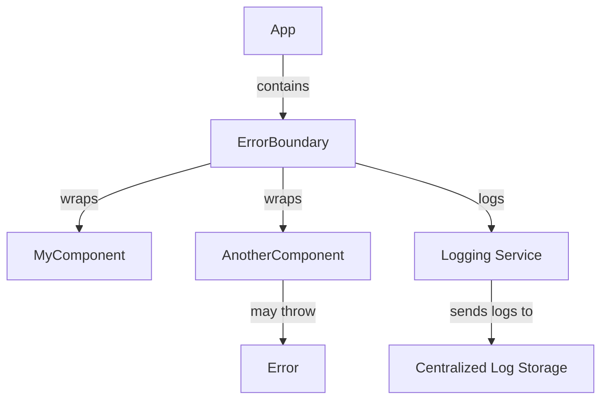

# Error Boundaries and Failure UX — React

## Overview and scope

The purpose of this document is to define the standards and best practices for implementing error boundaries and failure user experience (UX) in React applications developed at Xentic. This standard aims to ensure that applications handle errors gracefully, providing a seamless user experience even in the face of unexpected issues.

### Audience

This document is intended for:
- Frontend developers working on React applications within Xentic.
- Technical leads and architects overseeing the development process.
- Quality assurance teams responsible for testing and validating error handling.

### Scope

This standard covers:
- Implementation of error boundaries in React components.
- Strategies for displaying user-friendly error messages.
- Guidelines for logging errors and monitoring application health.
- Best practices for maintaining application performance during error states.

### Non-goals

This document does NOT cover:
- Backend error handling or API error management.
- Specific implementations of third-party libraries for error tracking.
- UI design principles outside the context of error handling.

### Glossary

| Term               | Definition                                                                 |
|--------------------|----------------------------------------------------------------------------|
| Error Boundary      | A React component that catches JavaScript errors in its child component tree. |
| Failure UX          | The user experience presented to users when an error occurs in the application. |
| Fallback UI         | A user interface that is displayed when an error boundary catches an error.  |
| Logging             | The process of recording error details for debugging and monitoring purposes. |

### How this standard fits the Xentic platform

At Xentic, maintaining a high-quality user experience is paramount. This standard aligns with our commitment to building resilient applications that can withstand errors and provide users with meaningful feedback. By adhering to these guidelines, developers will contribute to a consistent and robust error handling strategy across all Xentic applications.

### Implementation Example

To implement an error boundary in a React component, developers MUST follow the structure below:

```javascript
import React from 'react';

class ErrorBoundary extends React.Component {
  constructor(props) {
    super(props);
    this.state = { hasError: false };
  }

  static getDerivedStateFromError(error) {
    // Update state so the next render shows the fallback UI.
    return { hasError: true };
  }

  componentDidCatch(error, errorInfo) {
    // Log the error to an error reporting service
    console.error("Error logged:", error, errorInfo);
  }

  render() {
    if (this.state.hasError) {
      // Fallback UI
      return <h1>Something went wrong. Please try again later.</h1>;
    }

    return this.props.children; 
  }
}

// Usage
const App = () => (
  <ErrorBoundary>
    <MyComponent />
  </ErrorBoundary>
);
```

### Best Practices

- **MUST** wrap components that may throw errors in an `ErrorBoundary`.
- **SHOULD** provide a user-friendly message in the fallback UI.
- **MUST NOT** expose sensitive error details to the user.
- **SHOULD** log errors to an external monitoring service for analysis.

By following these guidelines, Xentic developers can ensure that applications are resilient, user-friendly, and maintainable, enhancing the overall quality of the user experience.

## Standards and policies

1. **MUST** implement error boundaries for all critical components in the application to catch errors and prevent the entire application from crashing.

2. **MUST NOT** use generic error messages in the fallback UI. Instead, provide specific and actionable user-friendly messages that guide users on what to do next.

3. **SHOULD** use a consistent design for fallback UIs across all applications to maintain a cohesive user experience. This includes using the same color schemes, typography, and layout.

4. **MUST** log all errors caught by error boundaries to a centralized logging service. This logging should include relevant context, such as the component stack trace and user actions leading to the error.

5. **SHOULD** implement a retry mechanism in the fallback UI where appropriate, allowing users to attempt to recover from the error without reloading the page.

6. **MUST NOT** allow error boundaries to catch errors from asynchronous code (e.g., promises). Instead, handle asynchronous errors using `.catch()` or `try/catch` in async functions.

7. **SHOULD** provide a way for users to report issues directly from the fallback UI, enhancing feedback loops for developers.

8. **MUST** ensure that error boundaries are tested thoroughly, including unit tests and integration tests, to verify their behavior under various error conditions.

9. **SHOULD** use TypeScript for type safety in error handling, ensuring that error types are well-defined and managed throughout the application.

10. **MUST NOT** include any sensitive information in error logs that could be exposed to unauthorized users. Always sanitize error messages before logging.

11. **SHOULD** utilize feature flags to control the visibility of new features that may introduce errors, allowing for gradual rollouts and easier rollback if issues arise.

12. **MUST** ensure that the fallback UI is accessible, providing alternative text for screen readers and ensuring keyboard navigation is functional.

13. **SHOULD** consider fallback UI design for various states, such as network errors, server errors, and client-side errors, tailoring messages and actions accordingly.

14. **MUST** document all error handling strategies in the project’s README or a dedicated documentation site, ensuring all team members are aware of the approach.

15. **SHOULD** utilize component libraries that support error boundaries, such as React Router, to handle routing errors gracefully.

16. **MUST** avoid nesting error boundaries unnecessarily, as this can complicate error handling and lead to confusion in debugging.

17. **SHOULD** provide a mechanism for developers to toggle error boundaries on and off during development for easier debugging.

18. **MUST** ensure that all error handling code is reviewed during the code review process to maintain high code quality and adherence to standards.

19. **SHOULD** keep error boundary components lightweight and focused solely on error handling, delegating other responsibilities to child components.

20. **MUST** follow the Xentic naming conventions for error boundary components, using the prefix `ErrorBoundary` followed by the component name (e.g., `ErrorBoundaryMyComponent`).

### Example Configuration

For logging errors, the following configuration should be used in the logging service:

```yaml
logging:
  level: error
  service: "com.xentic.logging:error-logger"
  format: json
  destination: "https://logs.internal.xentic.io"
```

### Example SQL for Logging Errors

To log errors in the database, the following SQL statement should be used:

```sql
INSERT INTO error_logs (error_message, error_stack, user_id, created_at)
VALUES (?, ?, ?, NOW());
```

By adhering to these policies, Xentic developers will ensure a robust and user-friendly error handling strategy that enhances the overall quality and reliability of our applications.

## Architecture and design

To effectively implement error boundaries and failure UX in React applications at Xentic, it is essential to understand the architecture, data flows, integration points, and failure domains. The following sections provide a comprehensive overview.

### Component Diagram



### Data Flows

1. **User Interaction**: Users interact with components (e.g., buttons, forms).
2. **Error Occurrence**: If an error occurs within a wrapped component, the error boundary catches it.
3. **State Update**: The error boundary updates its state to indicate an error has occurred.
4. **Fallback UI Display**: The error boundary renders a fallback UI to inform the user of the issue.
5. **Error Logging**: The error boundary logs the error details to a centralized logging service for further analysis.

### Integration Points

- **Error Boundaries**: Integrate error boundaries at critical points in the component hierarchy to ensure comprehensive error handling.
- **Logging Service**: Integrate with a logging service (e.g., `com.xentic.logging:error-logger`) to capture error details.
- **Monitoring Tools**: Use monitoring tools to track application health and performance, allowing proactive identification of issues.
- **User Feedback Mechanism**: Provide a feedback mechanism within the fallback UI to allow users to report issues directly.

### Failure Domains

1. **Component Failures**: Errors occurring within individual components, such as rendering issues or runtime exceptions.
2. **Network Failures**: Issues arising from API calls or data fetching, which should be handled gracefully.
3. **Service Failures**: Errors from external services or dependencies that may impact user experience.
4. **User Input Errors**: Validation errors from user inputs that should be communicated clearly to the user.

### Best Practices for Error Handling

- **MUST** define clear error boundaries for each critical component to isolate failures.
- **SHOULD** ensure that fallback UIs provide actionable steps for users, such as retry options or contact support links.
- **MUST NOT** allow unhandled errors to propagate beyond error boundaries, leading to application crashes.
- **SHOULD** implement a consistent error logging format to facilitate easier debugging and analysis.

### Example of an Error Boundary with Logging

```javascript
import React from 'react';
import { logError } from 'com.xentic.logging:error-logger';

class ErrorBoundary extends React.Component {
  constructor(props) {
    super(props);
    this.state = { hasError: false };
  }

  static getDerivedStateFromError(error) {
    return { hasError: true };
  }

  componentDidCatch(error, errorInfo) {
    logError({
      message: error.message,
      stack: errorInfo.componentStack,
      timestamp: new Date().toISOString(),
    });
  }

  render() {
    if (this.state.hasError) {
      return <h1>Oops! Something went wrong. Please try again.</h1>;
    }

    return this.props.children; 
  }
}
```

### Conclusion

By adhering to the architecture and design principles outlined in this section, Xentic developers will create resilient React applications that handle errors gracefully, ensuring a positive user experience even in the face of failures.

## Configuration reference

To ensure consistent error handling and logging across Xentic applications, the following configuration references are provided. These configurations include settings for application properties, environment variables, and Terraform resources.

### Application Configuration (application.yml)

Below is an example of the `application.yml` configuration file used for error handling and logging:

```yaml
error:
  boundary:
    enabled: true
    fallbackMessage: "Oops! Something went wrong. Please try again later."
    logLevel: error
  logging:
    service: "com.xentic.logging:error-logger"
    format: json
    destination: "https://logs.internal.xentic.io"
```

### Environment Variables

The following environment variables should be set in the production environment to control error handling behavior:

| Variable Name                   | Default Value                   | Production Value                   |
|----------------------------------|----------------------------------|------------------------------------|
| `ERROR_BOUNDARY_ENABLED`        | `true`                          | `true`                             |
| `ERROR_LOGGING_SERVICE`         | `com.xentic.logging:error-logger` | `com.xentic.logging:error-logger` |
| `ERROR_LOGGING_LEVEL`           | `error`                        | `error`                           |
| `ERROR_LOGGING_FORMAT`          | `json`                         | `json`                            |
| `ERROR_LOGGING_DESTINATION`     | `https://logs.internal.xentic.io` | `https://logs.internal.xentic.io` |

### Terraform Configuration

For managing infrastructure, the following Terraform configuration can be used to set up error logging resources:

```hcl
resource "aws_cloudwatch_log_group" "error_logs" {
  name = "xentic-error-logs"
  retention_in_days = 30
}

resource "aws_cloudwatch_log_stream" "error_log_stream" {
  name           = "error-log-stream"
  log_group_name = aws_cloudwatch_log_group.error_logs.name
}

resource "aws_lambda_function" "error_logger" {
  function_name = "errorLogger"
  handler       = "index.handler"
  runtime       = "nodejs14.x"

  environment {
    LOG_GROUP_NAME = aws_cloudwatch_log_group.error_logs.name
  }

  # Additional configuration for IAM role and permissions
}
```

### Logging Configuration Example

To ensure that error logs are captured effectively, the following logging configuration should be implemented in the application:

```yaml
logging:
  level: error
  service: "com.xentic.logging:error-logger"
  format: json
  destination: "https://logs.internal.xentic.io"
```

### Example SQL for Error Logging

When logging errors to a database, the following SQL statement should be used:

```sql
CREATE TABLE error_logs (
    id SERIAL PRIMARY KEY,
    error_message TEXT NOT NULL,
    error_stack TEXT NOT NULL,
    user_id INT,
    created_at TIMESTAMP DEFAULT CURRENT_TIMESTAMP
);

INSERT INTO error_logs (error_message, error_stack, user_id, created_at)
VALUES (?, ?, ?, NOW());
```

### Summary of Configuration

- **MUST** ensure that the `application.yml` file is correctly configured for error handling and logging.
- **SHOULD** set appropriate environment variables for production to control error logging behavior.
- **MUST** define Terraform resources for managing error logging infrastructure effectively.
- **SHOULD** implement SQL statements for error logging in the database to capture detailed error information.

By adhering to these configuration references, Xentic developers will create a robust error handling and logging framework that enhances application reliability and user experience.

## Implementation guide

To implement error boundaries and failure UX in React applications at Xentic, follow these detailed steps:

### Step 1: Create the Error Boundary Component

Create a new file named `ErrorBoundaryMyComponent.js` in the appropriate directory for your service.

```javascript
import React from 'react';
import { logError } from 'com.xentic.logging:error-logger';

class ErrorBoundaryMyComponent extends React.Component {
  constructor(props) {
    super(props);
    this.state = { hasError: false };
  }

  static getDerivedStateFromError(error) {
    return { hasError: true };
  }

  componentDidCatch(error, errorInfo) {
    logError({
      message: error.message,
      stack: errorInfo.componentStack,
      timestamp: new Date().toISOString(),
    });
  }

  render() {
    if (this.state.hasError) {
      return <h1>Oops! Something went wrong. Please try again.</h1>;
    }

    return this.props.children; 
  }
}

export default ErrorBoundaryMyComponent;
```

### Step 2: Wrap Components with Error Boundary

In your main application file (e.g., `App.js`), wrap the components that may throw errors with the `ErrorBoundaryMyComponent`.

```javascript
import React from 'react';
import ErrorBoundaryMyComponent from './ErrorBoundaryMyComponent';
import MyComponent from './MyComponent';
import AnotherComponent from './AnotherComponent';

function App() {
  return (
    <div>
      <ErrorBoundaryMyComponent>
        <MyComponent />
      </ErrorBoundaryMyComponent>
      <ErrorBoundaryMyComponent>
        <AnotherComponent />
      </ErrorBoundaryMyComponent>
    </div>
  );
}

export default App;
```

### Step 3: Implement Logging Service

Ensure that the logging service is correctly set up to capture error logs. Below is an example of how the `logError` function might be implemented in `error-logger.js`.

```javascript
export const logError = async (errorDetails) => {
  try {
    const response = await fetch('https://logs.internal.xentic.io/log', {
      method: 'POST',
      headers: {
        'Content-Type': 'application/json',
      },
      body: JSON.stringify(errorDetails),
    });
    if (!response.ok) {
      console.error('Failed to log error', response.statusText);
    }
  } catch (err) {
    console.error('Error logging failed', err);
  }
};
```

### Step 4: Test the Error Boundary

To test the error boundary, introduce an error in `MyComponent` or `AnotherComponent`.

```javascript
function MyComponent() {
  throw new Error("Test error for Error Boundary");
  return <div>My Component</div>;
}
```

### Step 5: Implement Fallback UI

Customize the fallback UI in the `ErrorBoundaryMyComponent` to provide users with options to retry or report the error.

```javascript
render() {
  if (this.state.hasError) {
    return (
      <div>
        <h1>Oops! Something went wrong.</h1>
        <button onClick={() => window.location.reload()}>Retry</button>
        <p>If the problem persists, please contact support.</p>
      </div>
    );
  }

  return this.props.children; 
}
```

### Step 6: Ensure Consistent Error Handling

- **MUST** ensure that all critical components are wrapped in error boundaries.
- **SHOULD** provide a user-friendly fallback UI that guides users on the next steps.
- **MUST NOT** allow unhandled errors to crash the application.

### Step 7: Monitor and Improve

After deploying the application, monitor the logs and user feedback. Use this data to improve error handling and user experience continuously.

### Summary of Implementation Steps

1. **Create the Error Boundary Component**: Define an error boundary that captures errors.
2. **Wrap Components**: Use the error boundary to wrap components that may fail.
3. **Implement Logging**: Ensure that error details are logged for further analysis.
4. **Test the Implementation**: Introduce errors to verify that the error boundary works as intended.
5. **Customize Fallback UI**: Provide actionable options for users in case of errors.
6. **Ensure Consistency**: Follow best practices to maintain a robust error handling strategy.
7. **Monitor and Improve**: Continuously analyze logs and user feedback to enhance the application.

By following these steps, Xentic developers will create resilient React applications that handle errors gracefully, ensuring a positive user experience even in the face of failures.

## Security requirements

To maintain the integrity and security of Xentic's React applications, the following security requirements must be adhered to:

### Threat Model Summary

- **Threats**: Unauthorized access, data leakage, code injection, and denial of service.
- **Attack Vectors**: Cross-Site Scripting (XSS), Cross-Site Request Forgery (CSRF), and Man-in-the-Middle (MitM) attacks.
- **Mitigations**: Implementing secure coding practices, using HTTPS, and validating user input.

### Authentication and Authorization (Authn/Z)

- **MUST** implement authentication using OAuth 2.0 or OpenID Connect.
- **SHOULD** use JWT (JSON Web Tokens) for session management.
- **MUST NOT** expose sensitive user data in client-side code.
- **Example Configuration for JWT**:

```yaml
security:
  jwt:
    secret: "your-secure-jwt-secret"
    expiration: 3600 # in seconds
```

- **MUST** validate JWT tokens on the server-side for every request.
- **SHOULD** implement role-based access control (RBAC) to restrict access to resources.

### Secrets Management

- **MUST** use a secrets management tool (e.g., HashiCorp Vault, AWS Secrets Manager) to store sensitive information.
- **SHOULD** avoid hardcoding secrets in the application code.
- **Example of accessing secrets in a React app**:

```javascript
import { getSecret } from 'com.xentic.common:secrets-manager';

const apiKey = getSecret('API_KEY');
```

### Input Validation

- **MUST** validate all user inputs on both client and server sides.
- **SHOULD** sanitize inputs to prevent XSS and SQL injection attacks.
- **Example of input validation in React**:

```javascript
import PropTypes from 'prop-types';

function MyComponent({ userInput }) {
  const sanitizedInput = userInput.replace(/<[^>]*>/g, ''); // Basic sanitization
  return <div>{sanitizedInput}</div>;
}

MyComponent.propTypes = {
  userInput: PropTypes.string.isRequired,
};
```

### Audit Logging

- **MUST** implement audit logging for sensitive actions (e.g., login attempts, data changes).
- **SHOULD** log the following information:
  - User ID
  - Action performed
  - Timestamp
  - IP address
- **Example SQL for Audit Logging**:

```sql
CREATE TABLE audit_logs (
    id SERIAL PRIMARY KEY,
    user_id INT NOT NULL,
    action TEXT NOT NULL,
    ip_address VARCHAR(45) NOT NULL,
    created_at TIMESTAMP DEFAULT CURRENT_TIMESTAMP
);

INSERT INTO audit_logs (user_id, action, ip_address)
VALUES (?, ?, ?);
```

### Summary of Security Requirements

- **MUST** adhere to secure coding practices to mitigate common vulnerabilities.
- **SHOULD** implement robust authentication and authorization mechanisms.
- **MUST NOT** expose sensitive information in client-side code or logs.
- **MUST** validate and sanitize all user inputs to prevent attacks.
- **SHOULD** maintain comprehensive audit logs for critical actions to ensure accountability.

By following these security requirements, Xentic developers will enhance the security posture of React applications, protecting both user data and application integrity.

## Testing strategy

To ensure the reliability and robustness of error boundaries and failure UX in React applications at Xentic, a comprehensive testing strategy must be implemented. This strategy should encompass unit tests, integration tests, and contract tests, with defined coverage targets to maintain high code quality.

### Testing Types

1. **Unit Tests**
   - **MUST** cover individual components and functions to ensure they behave as expected in isolation.
   - **SHOULD** use a testing library such as Jest or React Testing Library.
   - **MUST NOT** rely solely on manual testing; automated tests are required.

2. **Integration Tests**
   - **MUST** test the interaction between multiple components and services to verify their collaboration.
   - **SHOULD** simulate user interactions to ensure the application behaves correctly under various scenarios.

3. **Contract Tests**
   - **MUST** define contracts for APIs and shared components to ensure compatibility between services.
   - **SHOULD** use tools like Pact to manage and verify contracts.

### Coverage Targets

- **MUST** aim for a minimum of 80% code coverage across all tests.
- **SHOULD** prioritize critical paths and error handling logic for higher coverage percentages.
- **MUST NOT** ignore untested areas; all components should be included in the testing strategy.

### Example Test Classes

Here are examples of how to structure tests for the `ErrorBoundaryMyComponent`:

#### Unit Test Example

```javascript
import React from 'react';
import { render, screen } from '@testing-library/react';
import ErrorBoundaryMyComponent from './ErrorBoundaryMyComponent';

describe('ErrorBoundaryMyComponent', () => {
  it('renders children when no error occurs', () => {
    render(
      <ErrorBoundaryMyComponent>
        <div>Child Component</div>
      </ErrorBoundaryMyComponent>
    );
    expect(screen.getByText('Child Component')).toBeInTheDocument();
  });

  it('renders fallback UI when an error occurs', () => {
    const ThrowError = () => {
      throw new Error('Test error');
    };

    render(
      <ErrorBoundaryMyComponent>
        <ThrowError />
      </ErrorBoundaryMyComponent>
    );

    expect(screen.getByText("Oops! Something went wrong.")).toBeInTheDocument();
  });
});
```

#### Integration Test Example

```javascript
import React from 'react';
import { render, screen } from '@testing-library/react';
import App from './App';

describe('App Integration Tests', () => {
  it('renders ErrorBoundary around MyComponent', () => {
    render(<App />);
    expect(screen.getByText('Oops! Something went wrong.')).toBeInTheDocument();
  });
});
```

#### Contract Test Example

Using Pact for contract testing between a React component and a backend service:

```javascript
import { Pact } from '@pact-foundation/pact';
import { fetchData } from './apiService'; // hypothetical API service

const provider = new Pact({
  consumer: 'MyReactApp',
  provider: 'MyBackendService',
});

describe('API Contract Test', () => {
  beforeAll(() => provider.setup());
  afterAll(() => provider.finalize());

  beforeEach(() => {
    const interaction = {
      state: 'a user exists',
      uponReceiving: 'a request for user data',
      withRequest: {
        method: 'GET',
        path: '/users/1',
      },
      willRespondWith: {
        status: 200,
        body: {
          id: 1,
          name: 'John Doe',
        },
      },
    };
    return provider.addInteraction(interaction);
  });

  it('fetches user data successfully', async () => {
    const response = await fetchData('/users/1');
    expect(response).toEqual({ id: 1, name: 'John Doe' });
  });
});
```

### Summary of Testing Strategy

- **MUST** implement unit, integration, and contract tests to ensure comprehensive coverage.
- **SHOULD** use Jest and React Testing Library for unit and integration tests.
- **MUST NOT** neglect any area of the application; all components must be tested.
- **MUST** achieve a minimum of 80% code coverage across all tests.
- **SHOULD** continuously monitor and improve test coverage based on code changes.

By following this testing strategy, Xentic developers will ensure that the error boundaries and failure UX in React applications are thoroughly validated, leading to a more stable and reliable user experience.

## Observability and operations

To maintain a high level of reliability and performance in Xentic's React applications, observability must be a core focus. This includes implementing metrics, logs, traces, dashboards, alerts, and Service Level Objectives (SLOs). The following guidelines outline the requirements for effective observability and operations.

### Metrics

- **MUST** collect application performance metrics such as response times, error rates, and user interactions.
- **SHOULD** use a monitoring tool like Prometheus or Grafana for metrics collection and visualization.
- **Example Metrics Configuration (Prometheus)**:

```yaml
apiVersion: v1
kind: ServiceMonitor
metadata:
  name: react-app-metrics
  labels:
    app: react-app
spec:
  selector:
    matchLabels:
      app: react-app
  endpoints:
    - port: metrics
      path: /metrics
      interval: 30s
```

### Logs

- **MUST** implement structured logging for all application events and errors.
- **SHOULD** use a logging library such as Winston or Bunyan for consistent logging practices.
- **Example Logging Configuration**:

```javascript
const winston = require('winston');

const logger = winston.createLogger({
  level: 'info',
  format: winston.format.json(),
  transports: [
    new winston.transports.Console(),
    new winston.transports.File({ filename: 'error.log', level: 'error' }),
  ],
});

// Usage
logger.info('User logged in', { userId: '12345' });
logger.error('Error fetching data', { error: 'Network Error' });
```

### Traces

- **MUST** implement distributed tracing to track requests across microservices.
- **SHOULD** use tools like OpenTelemetry or Jaeger for tracing.
- **Example Trace Configuration (OpenTelemetry)**:

```javascript
const { NodeTracerProvider } = require('@opentelemetry/node');
const { registerInstrumentations } = require('@opentelemetry/instrumentation');

const provider = new NodeTracerProvider();
provider.register();

registerInstrumentations({
  instrumentations: [
    // Add instrumentation for HTTP, gRPC, etc.
  ],
});
```

### Dashboards

- **MUST** create dashboards to visualize key metrics and logs for easy monitoring.
- **SHOULD** use Grafana or Kibana for dashboard creation.
- **Example Dashboard Configuration (Grafana)**:

```json
{
  "title": "React Application Dashboard",
  "panels": [
    {
      "type": "graph",
      "title": "Response Time",
      "targets": [
        {
          "target": "avg(response_time)",
          "refId": "A"
        }
      ]
    },
    {
      "type": "table",
      "title": "Error Rates",
      "targets": [
        {
          "target": "sum(errors)",
          "refId": "B"
        }
      ]
    }
  ]
}
```

### Alerts

- **MUST** set up alerts for critical metrics, such as high error rates or slow response times.
- **SHOULD** use tools like Alertmanager or PagerDuty for alert management.
- **Example Alert Configuration (Prometheus Alertmanager)**:

```yaml
groups:
  - name: react-app-alerts
    rules:
      - alert: HighErrorRate
        expr: rate(errors[5m]) > 0.05
        for: 5m
        labels:
          severity: critical
        annotations:
          summary: "High error rate detected in React application"
          description: "Error rate exceeds 5% in the last 5 minutes."
```

### Service Level Objectives (SLOs)

- **MUST** define SLOs for key performance indicators such as availability and latency.
- **SHOULD** review SLOs quarterly to ensure they align with business objectives.
- **Example SLO Definition**:

```yaml
slo:
  name: "Availability SLO"
  target: 99.9
  period: "30d"
  description: "The application must be available 99.9% of the time over a rolling 30-day period."
```

### On-Call Runbook Steps

- **MUST** create an on-call runbook to guide engineers during incidents.
- **SHOULD** include the following steps in the runbook:
  1. **Identify the Incident**: Check alerts and logs to understand the issue.
  2. **Assess Impact**: Determine the severity and affected users.
  3. **Communicate**: Notify stakeholders and users about the incident.
  4. **Mitigate**: Implement a temporary fix if possible.
  5. **Resolve**: Apply a permanent solution and verify the fix.
  6. **Postmortem**: Conduct a postmortem analysis to prevent future incidents.

### Summary of Observability and Operations Requirements

- **MUST** implement metrics, logs, traces, dashboards, and alerts for effective observability.
- **SHOULD** use industry-standard tools and libraries for monitoring and logging.
- **MUST NOT** overlook the importance of SLOs and on-call runbooks in incident management.
- **MUST** continuously monitor and improve observability practices to ensure application reliability.

By adhering to these observability and operations guidelines, Xentic developers will enhance the resilience and performance of React applications, leading to a better user experience and operational efficiency.

## Migration and versioning

To ensure a smooth transition between versions of React components and libraries within Xentic, a structured migration and versioning policy must be adhered to. This policy will cover upgrade paths, deprecation processes, backward compatibility, and rollback strategies.

### Upgrade Paths

- **MUST** define clear upgrade paths for each component, specifying the minimum required version and any breaking changes.
- **SHOULD** maintain a changelog that details new features, improvements, and breaking changes for each release.
- **Example Changelog Entry**:

```markdown
## [1.2.0] - 2023-10-01
### Added
- New ErrorBoundaryWithLogging component for enhanced error tracking.

### Changed
- Updated ErrorBoundaryMyComponent to support new props.

### Deprecated
- `ErrorBoundaryOldComponent` will be removed in version 1.3.0.
```

### Deprecation Policy

- **MUST** mark any deprecated features with a clear warning in the documentation and code comments.
- **SHOULD** provide a timeline for the removal of deprecated features, typically at least one major release cycle.
- **MUST NOT** remove deprecated features without prior notice and a clear migration path.

### Backward Compatibility

- **MUST** ensure that new versions of components are backward compatible with the previous stable version.
- **SHOULD** include unit tests that validate backward compatibility.
- **Example Unit Test for Backward Compatibility**:

```javascript
import React from 'react';
import { render } from '@testing-library/react';
import ErrorBoundaryMyComponent from './ErrorBoundaryMyComponent';

describe('Backward Compatibility Tests', () => {
  it('should render correctly with old props', () => {
    const { getByText } = render(
      <ErrorBoundaryMyComponent oldProp="value" />
    );
    expect(getByText('Fallback UI')).toBeInTheDocument();
  });
});
```

### Rollback Strategy

- **MUST** implement a rollback strategy to revert to the previous stable version in case of critical issues.
- **SHOULD** use version control tags to mark stable releases, making it easier to revert changes.
- **Example Rollback Command** (using Git):

```bash
git checkout tags/v1.1.0
```

### Versioning Scheme

- **MUST** follow Semantic Versioning (SemVer) guidelines: MAJOR.MINOR.PATCH.
  - **MAJOR** version when making incompatible API changes,
  - **MINOR** version when adding functionality in a backward-compatible manner,
  - **PATCH** version when making backward-compatible bug fixes.
- **SHOULD** increment the version number in the `package.json` file with each release.

### Versioning Example

```json
{
  "name": "error-boundary",
  "version": "1.2.0",
  "description": "A React component for error boundaries.",
  "main": "index.js",
  "scripts": {
    "test": "jest"
  },
  "dependencies": {
    "react": "^17.0.0"
  },
  "devDependencies": {
    "jest": "^26.0.0"
  }
}
```

### Communication of Changes

- **MUST** communicate significant changes, including deprecations and breaking changes, to all stakeholders.
- **SHOULD** use internal documentation platforms, such as Confluence or Notion, to maintain up-to-date migration guides.
- **Example Internal URL for Migration Guide**: [https://docs.internal.xentic.io/react/migration-guide](https://docs.internal.xentic.io/react/migration-guide)

### Summary of Migration and Versioning Policies

- **MUST** define upgrade paths, deprecation policies, and rollback strategies for React components.
- **SHOULD** ensure backward compatibility and maintain clear communication about changes.
- **MUST NOT** introduce breaking changes without proper documentation and migration paths.
- **SHOULD** follow Semantic Versioning for all releases to maintain clarity and consistency.

By adhering to these migration and versioning policies, Xentic developers will facilitate a smoother development process, ensuring that updates to React components are manageable and well-communicated across the organization.

## FAQ, anti-patterns, and checklists

### FAQ

1. **What are error boundaries in React?**
   - Error boundaries are React components that catch JavaScript errors in their child component tree, log those errors, and display a fallback UI instead of crashing the whole application.

2. **When should I use an error boundary?**
   - You should use error boundaries for components that are likely to throw errors, such as those that fetch data or rely on external libraries.

3. **Can error boundaries catch errors in event handlers?**
   - No, error boundaries do not catch errors in event handlers. You must handle those errors using try-catch blocks.

4. **How do I create an error boundary?**
   - You create an error boundary by defining a class component that implements `componentDidCatch` and `getDerivedStateFromError` lifecycle methods.

5. **Can I use error boundaries for asynchronous code?**
   - No, error boundaries only catch errors during rendering, lifecycle methods, and constructors of child components. For asynchronous code, handle errors using promises or async/await with try-catch.

6. **What happens if an error boundary itself throws an error?**
   - If an error boundary throws an error, it will not be caught by itself. You should ensure that error boundaries are robust and handle their own errors.

7. **How can I log errors caught by an error boundary?**
   - You can log errors in the `componentDidCatch` method using a logging library like Winston or send them to an error tracking service.

8. **Should I wrap my entire application in an error boundary?**
   - It is not recommended to wrap the entire application in a single error boundary. Instead, use multiple error boundaries at different levels of the component tree for better granularity.

9. **Can error boundaries be functional components?**
   - No, error boundaries must be class components as they rely on lifecycle methods that functional components do not have.

10. **How do I test error boundaries?**
    - You can test error boundaries by simulating errors in child components and checking if the fallback UI renders as expected.

### Anti-patterns

| Anti-pattern                         | Description                                                                                      |
|--------------------------------------|--------------------------------------------------------------------------------------------------|
| Wrapping the entire app in one error boundary | This can lead to poor user experience by showing a fallback UI for the entire application.       |
| Not logging errors                   | Failing to log errors makes it difficult to diagnose issues and improve application reliability. |
| Using error boundaries for async code | Error boundaries do not catch errors in asynchronous code, leading to unhandled exceptions.     |
| Ignoring fallback UI design          | A poorly designed fallback UI can confuse users and degrade the user experience.                |
| Overusing error boundaries            | Using too many error boundaries can complicate the component tree and make debugging harder.    |

### Pre-Merge Checklist

- **MUST** ensure all code passes linting and formatting checks.
- **MUST** write unit tests for new components and features.
- **SHOULD** include integration tests if applicable.
- **MUST** verify that error boundaries are implemented where necessary.
- **SHOULD** log errors in the error boundaries for monitoring.
- **MUST NOT** merge if there are any failing tests.

### Production Checklist

- **MUST** deploy to a staging environment before production.
- **SHOULD** monitor application performance and error rates post-deployment.
- **MUST** ensure error tracking is enabled in production.
- **SHOULD** review logs for any uncaught errors after deployment.
- **MUST NOT** ignore user feedback regarding error handling and UI experience.
