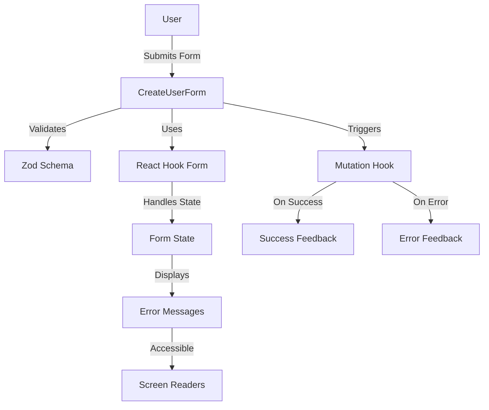

# Form Standards — React Hook Form + Zod

## Overview and scope

The purpose of this document is to establish standards for form handling in Xentic applications using React Hook Form and Zod. These standards are designed to ensure consistency, maintainability, and usability across all frontend applications developed within the Xentic ecosystem. This document is intended for frontend developers, UI/UX designers, and project managers involved in the development and maintenance of Xentic applications.

### Scope

This standard applies to all forms created within Xentic applications that utilize the React framework. It encompasses the following aspects:

- **Form Validation**: Implementation of validation rules using Zod.
- **Form State Management**: Utilizing React Hook Form for managing form state.
- **User Experience**: Ensuring a seamless and intuitive user experience through proper error handling and feedback.

### Non-goals

This document does not cover:

- Backend validation standards or practices.
- Styling guidelines for form elements.
- Usage of other form libraries or frameworks outside of React Hook Form and Zod.

### Glossary

| Term                | Definition                                                                                 |
|---------------------|--------------------------------------------------------------------------------------------|
| **React Hook Form** | A library for managing form state in React applications, providing easy integration and performance. |
| **Zod**             | A TypeScript-first schema declaration and validation library for building and validating data structures. |
| **Form State**      | The current state of the form, including input values, errors, and submission status.     |
| **Validation**      | The process of checking user input against predefined rules to ensure data integrity.      |

### How this standard fits the Xentic platform

The implementation of React Hook Form and Zod aligns with Xentic's commitment to delivering high-quality, user-friendly applications. By adhering to these standards, developers can ensure that forms are not only functional but also provide a positive user experience. This standard is part of a broader set of engineering guidelines that govern the development practices at Xentic, ensuring that all teams work towards common goals and maintain a high level of code quality.

### Standard Setup

```typescript
const createUserSchema = z.object({
  email: z.string().email('Enter a valid email address'),
  fullName: z.string().min(2, 'Full name must be at least 2 characters'),
  role: z.enum(['USER', 'ADMIN', 'VIEWER']),
  password: z.string()
    .min(8, 'Password must be at least 8 characters')
    .regex(/[A-Z]/, 'Must contain an uppercase letter'),
});

type CreateUserFormValues = z.infer<typeof createUserSchema>;

export const CreateUserForm = ({ onSuccess }: { onSuccess: () => void }) => {
  const { mutate, isPending } = useCreateUser();
  const { register, handleSubmit, formState: { errors } } = useForm<CreateUserFormValues>({
    resolver: zodResolver(createUserSchema),
    defaultValues: { role: 'USER' },
  });

  return (
    <form onSubmit={handleSubmit(data => mutate(data, { onSuccess }))}>
      <input {...register('email')} aria-invalid={!!errors.email} />
      {errors.email && <span role="alert">{errors.email.message}</span>}
      <button type="submit" disabled={isPending}>
        {isPending ? 'Creating...' : 'Create User'}
      </button>
    </form>
  );
};
```

### Rules

- All forms **MUST** use React Hook Form + Zod.
- Inline validation errors **MUST** be displayed with `role="alert"`.
- The submit button **MUST NOT** be enabled while a mutation is pending.
- Types **MUST** be extracted using `z.infer<typeof schema>` — duplication is strictly **PROHIBITED**.

## Standards and policies

1. **All forms MUST use React Hook Form and Zod** for form state management and validation, respectively. This ensures a consistent approach across all Xentic applications.

2. **Form schemas MUST be defined using Zod** to enforce validation rules and data integrity. Each schema should be clearly documented and reusable.

   ```typescript
   const loginSchema = z.object({
     email: z.string().email('Invalid email format'),
     password: z.string().min(8, 'Password must be at least 8 characters'),
   });
   ```

3. **Form state MUST be managed using the `useForm` hook** from React Hook Form. This hook should be configured with the appropriate resolver for Zod schemas.

   ```typescript
   const { register, handleSubmit, formState: { errors } } = useForm<LoginFormValues>({
     resolver: zodResolver(loginSchema),
   });
   ```

4. **Inline validation errors MUST be displayed** next to the relevant input fields. Each error message should be associated with the input using `aria-invalid` and should be rendered in a way that is accessible.

5. **The submit button MUST NOT be enabled** while a mutation is pending. This prevents multiple submissions and ensures a better user experience.

   ```typescript
   <button type="submit" disabled={isPending}>
     {isPending ? 'Logging in...' : 'Login'}
   </button>
   ```

6. **All form inputs MUST use the `register` method** provided by React Hook Form to ensure proper state management and validation.

7. **Validation messages MUST be user-friendly** and provide clear guidance on how to correct input errors. Avoid technical jargon and use simple language.

8. **Schema definitions MUST be placed in a dedicated file** within the `com.xentic.<service>` package to promote reuse and maintainability.

   | Package Structure                 |
   |-----------------------------------|
   | `src/`                            |
   | └── `com.xentic.<service>/`      |
   |     ├── `components/`            |
   |     ├── `hooks/`                 |
   |     └── `schemas/`               |

9. **Form components MUST be functional components** and should leverage React's hooks for state management. Class components are NOT permitted.

10. **Custom hooks MUST be created** for complex form logic to promote code reusability and separation of concerns.

    ```typescript
    const useLoginForm = () => {
      const { register, handleSubmit, formState: { errors } } = useForm<LoginFormValues>({
        resolver: zodResolver(loginSchema),
      });
      return { register, handleSubmit, errors };
    };
    ```

11. **All forms MUST include appropriate accessibility features**, including labels for inputs and error messages that are screen-reader friendly.

12. **Form submission MUST handle both success and error states** gracefully, providing feedback to the user on the outcome of their action.

    ```typescript
    const onSubmit = async (data: LoginFormValues) => {
      try {
        await loginUser(data);
        // Handle success (e.g., redirect or show success message)
      } catch (error) {
        // Handle error (e.g., show error message)
      }
    };
    ```

13. **All form-related code MUST be tested** using unit tests to ensure functionality and reliability. Use testing libraries compatible with React.

14. **Documentation MUST be maintained** for all forms, including usage examples and descriptions of validation rules. This documentation should be accessible at `https://docs.internal.xentic.io`.

15. **Code reviews MUST be conducted** for all form implementations to ensure adherence to these standards and promote knowledge sharing among team members.

By following these standards and policies, Xentic aims to create a cohesive and efficient development environment that enhances the quality of its applications.

## Architecture and design

### Component Diagram



### Data Flows

1. **User Input**: The user interacts with the form by entering data into the input fields.
2. **Form Submission**: Upon submission, the `handleSubmit` function from React Hook Form is triggered.
3. **Validation**: The data is validated against the Zod schema. If validation fails, error messages are generated.
4. **State Management**: React Hook Form manages the form state, including input values and validation errors.
5. **Error Handling**: If there are validation errors, they are displayed next to the relevant input fields.
6. **Mutation Trigger**: If validation passes, the mutation hook is called to perform the desired action (e.g., creating a user).
7. **Feedback**: Based on the result of the mutation, either success or error feedback is provided to the user.

### Integration Points

- **React Hook Form**: Integrates with the form component to manage state and handle submissions.
- **Zod**: Provides schema validation for form inputs, ensuring data integrity and user-friendly error messages.
- **Mutation Hook**: Custom hooks for performing asynchronous operations (e.g., API calls) upon form submission.
- **Accessibility Tools**: Integration with screen readers to ensure that error messages and form elements are accessible.

### Failure Domains

1. **Validation Errors**: If the user inputs invalid data, the form will not submit, and appropriate error messages will be displayed.
2. **Network Issues**: If the mutation fails due to network issues, the user should receive an error message indicating the failure.
3. **State Management Failures**: If React Hook Form fails to manage state correctly, it may lead to incorrect form behavior or data not being captured.
4. **Accessibility Failures**: If accessibility features are not implemented correctly, users relying on assistive technologies may not receive the necessary feedback.

### Example Configuration

Here is an example of how to configure a form with React Hook Form and Zod:

```typescript
import { useForm } from 'react-hook-form';
import { zodResolver } from '@hookform/resolvers/zod';
import { z } from 'zod';

const userSchema = z.object({
  email: z.string().email('Invalid email address'),
  password: z.string().min(8, 'Password must be at least 8 characters long'),
});

type UserFormValues = z.infer<typeof userSchema>;

const UserForm = () => {
  const { register, handleSubmit, formState: { errors } } = useForm<UserFormValues>({
    resolver: zodResolver(userSchema),
  });

  const onSubmit = (data: UserFormValues) => {
    // Handle successful form submission
  };

  return (
    <form onSubmit={handleSubmit(onSubmit)}>
      <input {...register('email')} />
      {errors.email && <span>{errors.email.message}</span>}
      <input {...register('password')} type="password" />
      {errors.password && <span>{errors.password.message}</span>}
      <button type="submit">Submit</button>
    </form>
  );
};
```

### Summary

By adhering to the architectural and design principles outlined in this section, Xentic can ensure that forms are robust, maintainable, and user-friendly. Each component of the form should work seamlessly together to provide a cohesive experience for users while maintaining high standards of code quality and accessibility.

## Configuration reference

### application.yml

The following configuration settings should be included in the `application.yml` file for managing form-related features within your React application.

```yaml
form:
  validation:
    enabled: true
    errorMessages:
      required: "This field is required."
      email: "Please enter a valid email address."
      minLength: "This field must be at least {min} characters long."
  submission:
    timeout: 5000  # Timeout for form submission in milliseconds
    retryAttempts: 3  # Number of retry attempts for failed submissions
```

### Terraform Configuration

The following Terraform variables can be used to configure environment-specific settings for form handling.

| Variable Name               | Default Value | Production Value |
|-----------------------------|---------------|------------------|
| `form_validation_enabled`    | `true`        | `true`           |
| `form_submission_timeout`    | `5000`        | `3000`           |
| `form_retry_attempts`        | `3`           | `5`              |
| `form_error_messages`        | `{}`          | `{"required": "This field is required.", "email": "Please enter a valid email address."}` |

### Environment Variables

The following environment variables should be set for the application to function correctly across different environments.

| Environment Variable          | Default Value | Production Value |
|-------------------------------|---------------|------------------|
| `REACT_APP_FORM_VALIDATION`   | `true`        | `true`           |
| `REACT_APP_FORM_TIMEOUT`      | `5000`        | `3000`           |
| `REACT_APP_RETRY_ATTEMPTS`    | `3`           | `5`              |
| `REACT_APP_ERROR_MESSAGES`     | `{"required": "This field is required."}` | `{"required": "This field is required.", "email": "Please enter a valid email address."}` |

### SQL Configuration

If your application interacts with a database for form submissions, ensure the following SQL schema is in place to handle user data:

```sql
CREATE TABLE users (
    id SERIAL PRIMARY KEY,
    email VARCHAR(255) NOT NULL UNIQUE,
    password VARCHAR(255) NOT NULL,
    created_at TIMESTAMP DEFAULT CURRENT_TIMESTAMP,
    updated_at TIMESTAMP DEFAULT CURRENT_TIMESTAMP ON UPDATE CURRENT_TIMESTAMP
);

CREATE INDEX idx_email ON users(email);
```

### Summary of Configuration

- All forms **MUST** have validation enabled through the `application.yml` and environment variables.
- The `form_submission_timeout` **MUST** be configured to prevent long wait times during submission.
- **Retry attempts** for failed submissions **MUST NOT** exceed the specified limit in production to avoid excessive load on the server.
- Error messages **MUST** be user-friendly and configurable via environment variables to support localization if necessary.

By following these configuration guidelines, Xentic ensures a robust setup for form handling that aligns with enterprise standards and best practices.

## Implementation guide

To implement forms using React Hook Form and Zod at Xentic, follow the step-by-step guide below. This guide will outline the creation of a user registration form with validation and error handling.

### Step 1: Install Required Packages

Ensure you have the necessary packages installed in your React project:

```bash
npm install react-hook-form zod @hookform/resolvers
```

### Step 2: Create Zod Schema

Define a schema for your form validation using Zod. This schema will specify the rules for each field.

```typescript
import { z } from 'zod';

const registrationSchema = z.object({
  username: z.string().min(3, 'Username must be at least 3 characters long'),
  email: z.string().email('Invalid email address'),
  password: z.string().min(8, 'Password must be at least 8 characters long'),
  confirmPassword: z.string().min(8, 'Confirm Password must be at least 8 characters long'),
}).refine(data => data.password === data.confirmPassword, {
  message: "Passwords don't match",
  path: ["confirmPassword"],
});
```

### Step 3: Create the Form Component

Create a functional component for your form. Use React Hook Form to manage state and handle submissions.

```typescript
import React from 'react';
import { useForm } from 'react-hook-form';
import { zodResolver } from '@hookform/resolvers/zod';

type RegistrationFormValues = z.infer<typeof registrationSchema>;

const RegistrationForm: React.FC = () => {
  const { register, handleSubmit, formState: { errors } } = useForm<RegistrationFormValues>({
    resolver: zodResolver(registrationSchema),
  });

  const onSubmit = async (data: RegistrationFormValues) => {
    try {
      // Perform registration logic (e.g., API call)
      console.log('Registration successful', data);
    } catch (error) {
      console.error('Registration failed', error);
    }
  };

  return (
    <form onSubmit={handleSubmit(onSubmit)} noValidate>
      <div>
        <label htmlFor="username">Username</label>
        <input id="username" {...register('username')} />
        {errors.username && <span role="alert">{errors.username.message}</span>}
      </div>

      <div>
        <label htmlFor="email">Email</label>
        <input id="email" type="email" {...register('email')} />
        {errors.email && <span role="alert">{errors.email.message}</span>}
      </div>

      <div>
        <label htmlFor="password">Password</label>
        <input id="password" type="password" {...register('password')} />
        {errors.password && <span role="alert">{errors.password.message}</span>}
      </div>

      <div>
        <label htmlFor="confirmPassword">Confirm Password</label>
        <input id="confirmPassword" type="password" {...register('confirmPassword')} />
        {errors.confirmPassword && <span role="alert">{errors.confirmPassword.message}</span>}
      </div>

      <button type="submit">Register</button>
    </form>
  );
};

export default RegistrationForm;
```

### Step 4: Integrate the Form into Your Application

Import and use the `RegistrationForm` component in your application where needed.

```typescript
import React from 'react';
import RegistrationForm from './RegistrationForm';

const App: React.FC = () => {
  return (
    <div>
      <h1>Register</h1>
      <RegistrationForm />
    </div>
  );
};

export default App;
```

### Step 5: Ensure Accessibility

All forms MUST include appropriate accessibility features. Use semantic HTML elements and ARIA roles where necessary to enhance accessibility.

- **Labels**: Each input MUST have a corresponding label.
- **Error Messages**: Error messages MUST be associated with their respective inputs using `role="alert"` for screen readers.

### Step 6: Testing the Form

All form-related code MUST be tested using unit tests. Use a testing library such as React Testing Library to ensure functionality.

```typescript
import { render, screen, fireEvent } from '@testing-library/react';
import RegistrationForm from './RegistrationForm';

test('renders registration form', () => {
  render(<RegistrationForm />);
  expect(screen.getByLabelText(/username/i)).toBeInTheDocument();
  expect(screen.getByLabelText(/email/i)).toBeInTheDocument();
  expect(screen.getByLabelText(/password/i)).toBeInTheDocument();
  expect(screen.getByLabelText(/confirm password/i)).toBeInTheDocument();
});

test('displays error messages on invalid input', async () => {
  render(<RegistrationForm />);
  fireEvent.click(screen.getByRole('button', { name: /register/i }));
  expect(await screen.findByRole('alert')).toHaveTextContent(/username must be at least 3 characters long/i);
});
```

### Summary

By following these implementation steps, Xentic ensures that forms are built with best practices in mind, including validation, accessibility, and testing. This approach leads to a more robust and user-friendly experience across applications.

## Security requirements

To maintain the security of forms developed using React Hook Form and Zod at Xentic, the following security requirements and practices MUST be adhered to:

### Threat Model Summary

- **Data Exposure**: Ensure that sensitive data, such as passwords and personal information, are not exposed in the client-side code or logs.
- **Injection Attacks**: Protect against SQL injection, Cross-Site Scripting (XSS), and Cross-Site Request Forgery (CSRF) by validating and sanitizing all user input.
- **Denial of Service (DoS)**: Implement rate limiting on form submissions to prevent abuse and potential service interruptions.

### Authentication and Authorization

- **Authentication**: All forms that handle sensitive data MUST require user authentication. Use secure methods such as OAuth2 or JWT for authentication.
- **Authorization**: Ensure that users have the appropriate permissions to access or submit forms. Implement role-based access control (RBAC) where necessary.

#### Example of JWT Authentication Header

```javascript
const response = await fetch('https://api.internal.xentic.io/register', {
  method: 'POST',
  headers: {
    'Content-Type': 'application/json',
    'Authorization': `Bearer ${token}`, // token obtained after user login
  },
  body: JSON.stringify(formData),
});
```

### Secrets Management

- **Environment Variables**: Sensitive configurations (e.g., API keys, database credentials) MUST be stored in environment variables and NEVER hardcoded in the source code.
- **Secret Rotation**: Secrets MUST be rotated regularly to minimize the risk of exposure.

#### Example of Using Environment Variables in React

```javascript
const apiUrl = process.env.REACT_APP_API_URL; // Ensure this is set in .env file
```

### Input Validation

- **Client-Side Validation**: Use Zod for client-side validation to ensure that all input fields adhere to specified formats before submission.
- **Server-Side Validation**: All data submitted to the server MUST be validated again on the server-side to prevent malicious data from being processed.

#### Example of Zod Validation

```typescript
const userSchema = z.object({
  email: z.string().email(),
  password: z.string().min(8),
});
```

### Audit Logging

- **Log Sensitive Actions**: All actions involving sensitive data (e.g., form submissions, logins) MUST be logged for auditing purposes.
- **Log Format**: Logs MUST include timestamps, user identifiers, and action details to facilitate tracking and analysis.

#### Example of Logging in Node.js

```javascript
const logAction = (userId, action) => {
  console.log(`[${new Date().toISOString()}] User: ${userId}, Action: ${action}`);
};

// Usage
logAction(userId, 'Submitted registration form');
```

### Summary of Security Requirements

- Forms **MUST** implement strong authentication and authorization mechanisms.
- Secrets **MUST NOT** be hardcoded and MUST be managed through environment variables.
- Input validation **MUST** occur both on the client and server sides.
- Audit logging **MUST** be enabled for sensitive actions to ensure traceability.

By adhering to these security requirements, Xentic can ensure that its applications are resilient against common threats and vulnerabilities, thereby protecting user data and maintaining trust.

## Testing strategy

To ensure the reliability and quality of forms built with React Hook Form and Zod, a comprehensive testing strategy MUST be implemented. This strategy should encompass unit tests, integration tests, and contract tests, with defined coverage targets.

### Testing Types

1. **Unit Tests**: 
   - Focus on individual components and functions.
   - Ensure that each piece of logic behaves as expected in isolation.

2. **Integration Tests**: 
   - Test the interaction between components and external systems (e.g., APIs).
   - Validate that components work together correctly.

3. **Contract Tests**: 
   - Ensure that the API contracts are adhered to.
   - Validate that the client and server agree on the data structure and types exchanged.

### Coverage Targets

- **Unit Test Coverage**: Minimum of 80% coverage on all components and utility functions.
- **Integration Test Coverage**: Aim for at least 70% coverage on integration points, ensuring critical paths are tested.
- **Contract Test Coverage**: All API endpoints MUST have corresponding contract tests to validate request and response structures.

### Example Test Classes

#### Unit Test Example

```typescript
import { render, screen, fireEvent } from '@testing-library/react';
import RegistrationForm from './RegistrationForm';

describe('RegistrationForm', () => {
  test('renders form elements', () => {
    render(<RegistrationForm />);
    expect(screen.getByLabelText(/username/i)).toBeInTheDocument();
    expect(screen.getByLabelText(/email/i)).toBeInTheDocument();
    expect(screen.getByLabelText(/password/i)).toBeInTheDocument();
    expect(screen.getByLabelText(/confirm password/i)).toBeInTheDocument();
  });

  test('validates username length', async () => {
    render(<RegistrationForm />);
    fireEvent.click(screen.getByRole('button', { name: /register/i }));
    expect(await screen.findByRole('alert')).toHaveTextContent(/username must be at least 3 characters long/i);
  });
});
```

#### Integration Test Example

```typescript
import { render, screen, fireEvent } from '@testing-library/react';
import RegistrationForm from './RegistrationForm';
import { server } from './mocks/server'; // Mock server setup

describe('RegistrationForm Integration', () => {
  beforeAll(() => server.listen());
  afterEach(() => server.resetHandlers());
  afterAll(() => server.close());

  test('submits form data successfully', async () => {
    render(<RegistrationForm />);
    fireEvent.input(screen.getByLabelText(/username/i), { target: { value: 'testuser' } });
    fireEvent.input(screen.getByLabelText(/email/i), { target: { value: 'test@example.com' } });
    fireEvent.input(screen.getByLabelText(/password/i), { target: { value: 'password123' } });
    fireEvent.input(screen.getByLabelText(/confirm password/i), { target: { value: 'password123' } });
    
    fireEvent.click(screen.getByRole('button', { name: /register/i }));
    
    expect(await screen.findByText(/registration successful/i)).toBeInTheDocument();
  });
});
```

#### Contract Test Example

```typescript
import request from 'supertest';
import app from './app'; // Express app

describe('API Contract Tests', () => {
  test('POST /register should return 201 and user data', async () => {
    const response = await request(app)
      .post('/register')
      .send({
        username: 'testuser',
        email: 'test@example.com',
        password: 'password123',
        confirmPassword: 'password123',
      });

    expect(response.status).toBe(201);
    expect(response.body).toMatchObject({
      id: expect.any(String),
      username: 'testuser',
      email: 'test@example.com',
    });
  });
});
```

### Summary of Testing Strategy

- **Unit Tests** MUST cover individual components with a minimum of 80% coverage.
- **Integration Tests** MUST validate interactions between components and APIs with at least 70% coverage.
- **Contract Tests** MUST ensure compliance with API specifications for all endpoints.
- Testing frameworks such as Jest and React Testing Library MUST be used to facilitate testing.

By adhering to this testing strategy, Xentic can ensure the robustness and reliability of forms built with React Hook Form and Zod, ultimately leading to a better user experience and reduced risk of defects in production.

## Observability and operations

To ensure the reliability and performance of forms built with React Hook Form and Zod at Xentic, a comprehensive observability and operations strategy MUST be implemented. This strategy includes metrics collection, logging, tracing, dashboards, alerts, and service level objectives (SLOs).

### Metrics

Metrics MUST be collected to monitor the performance and usage of forms. Key metrics include:

- **Form Submission Success Rate**: Percentage of successful form submissions.
- **Form Submission Latency**: Time taken from form submission to server response.
- **Validation Errors**: Count of validation errors encountered during form submissions.
- **User Engagement**: Number of users interacting with forms over time.

#### Example Metrics Configuration (Prometheus)

```yaml
metrics:
  enabled: true
  endpoint: /metrics
  labels:
    service: registration-form
```

### Logging

All logs MUST be structured and include relevant information to facilitate debugging and monitoring. Logs should capture:

- **Form Submission Events**: Log details of each form submission, including user ID and submission status.
- **Error Logs**: Capture validation errors and server-side errors with stack traces.
- **Performance Logs**: Log timings for form submissions and API calls.

#### Example Logging Configuration (Winston)

```javascript
const { createLogger, format, transports } = require('winston');

const logger = createLogger({
  level: 'info',
  format: format.combine(
    format.timestamp(),
    format.json()
  ),
  transports: [
    new transports.Console(),
    new transports.File({ filename: 'form-logs.log' })
  ],
});

// Usage
logger.info('Form submitted', { userId, status: 'success' });
logger.error('Validation error', { userId, errors });
```

### Tracing

Distributed tracing MUST be implemented to track requests as they flow through the system. This helps identify bottlenecks and latency issues.

- Use tools like OpenTelemetry or Jaeger to collect and visualize traces.
- Ensure that trace IDs are included in logs for correlation.

#### Example Trace Configuration

```yaml
tracing:
  enabled: true
  provider: jaeger
  endpoint: http://jaeger-collector.internal.xentic.io:14268/api/traces
```

### Dashboards

Dashboards MUST be created to visualize metrics and logs. Key dashboards include:

| Dashboard Name            | Description                                     |
|---------------------------|-------------------------------------------------|
| Form Submission Dashboard  | Visualizes submission success rates and latencies. |
| Error Dashboard           | Displays validation and server error counts.   |
| User Engagement Dashboard  | Tracks user interactions with forms over time. |

#### Example Dashboard Configuration (Grafana)

```yaml
datasources:
  - name: Prometheus
    type: prometheus
    url: http://prometheus.internal.xentic.io

panels:
  - title: Form Submission Success Rate
    type: graph
    metrics:
      - query: rate(form_submissions_success[5m])
```

### Alerts

Alerts MUST be configured to notify the team of any anomalies or issues. Key alerts include:

- **High Error Rate**: Alert if the validation error rate exceeds a defined threshold (e.g., 5%).
- **Slow Submission Latency**: Alert if the average submission latency exceeds a defined threshold (e.g., 2 seconds).
- **Service Downtime**: Alert if the form service is unreachable.

#### Example Alert Configuration (Prometheus Alertmanager)

```yaml
groups:
  - name: form-alerts
    rules:
      - alert: HighValidationErrorRate
        expr: rate(validation_errors[5m]) > 0.05
        for: 5m
        labels:
          severity: critical
        annotations:
          summary: "High validation error rate detected"
          description: "Validation errors exceed 5% over the last 5 minutes."
```

### Service Level Objectives (SLOs)

SLOs MUST be defined to measure the reliability of form services. Key SLOs include:

- **Availability**: 99.9% uptime of the form submission endpoint.
- **Performance**: 95% of form submissions must complete within 2 seconds.
- **Error Rate**: Less than 1% of submissions should result in validation errors.

### On-Call Runbook Steps

In the event of an incident, the following on-call runbook steps MUST be followed:

1. **Identify the Incident**: Review alerts and logs to understand the nature of the issue.
2. **Assess Impact**: Determine the scope of the impact on users and services.
3. **Mitigate**: Apply temporary fixes or roll back changes if necessary.
4. **Communicate**: Notify stakeholders and users about the incident and expected resolution time.
5. **Resolve**: Implement a permanent fix and validate that the issue is resolved.
6. **Post-Mortem**: Conduct a post-mortem analysis to identify root causes and prevent recurrence.

By implementing these observability and operations standards, Xentic can ensure that forms built with React Hook Form and Zod are monitored effectively, leading to improved reliability and user satisfaction.

## Migration and versioning

To maintain a robust and scalable application architecture at Xentic, a comprehensive migration and versioning strategy MUST be established for forms built with React Hook Form and Zod. This section outlines the upgrade paths, deprecation policy, backward compatibility, and rollback procedures.

### Upgrade Paths

When upgrading dependencies or libraries, the following paths MUST be followed:

1. **Semantic Versioning**: All libraries MUST adhere to semantic versioning (MAJOR.MINOR.PATCH). Breaking changes MUST increment the MAJOR version.
2. **Upgrade Documentation**: Each upgrade MUST include detailed documentation outlining breaking changes, new features, and migration instructions.
3. **Version Compatibility Matrix**: A compatibility matrix MUST be maintained to track which versions of React Hook Form and Zod are compatible with each other.

| React Hook Form Version | Zod Version | Compatibility |
|-------------------------|-------------|---------------|
| 7.x                     | 3.x         | Compatible     |
| 7.x                     | 4.x         | Not Compatible |
| 8.x                     | 4.x         | Compatible     |

### Deprecation Policy

The deprecation policy at Xentic MUST follow these guidelines:

- **Deprecation Notices**: Any feature or API that is scheduled for deprecation MUST be announced at least one major version prior to removal.
- **Deprecation Warnings**: Deprecation warnings MUST be logged in the console to inform developers during the build process.
- **Grace Period**: A grace period of at least one year MUST be provided before removing deprecated features.

#### Example Deprecation Warning

```javascript
if (isDeprecatedFeatureUsed) {
  console.warn('The feature X is deprecated and will be removed in the next major release. Please update your code.');
}
```

### Backward Compatibility

Backward compatibility is crucial for ensuring that existing applications continue to function after upgrades. The following practices MUST be implemented:

- **Feature Toggles**: New features MUST be introduced behind feature toggles to allow gradual adoption without breaking existing functionality.
- **Legacy Support**: Legacy versions of forms MUST be supported for at least one major version after deprecation.
- **Testing**: Comprehensive regression testing MUST be performed to ensure that existing functionality remains intact after upgrades.

### Rollback Procedures

In the event of a failed upgrade, a rollback procedure MUST be in place:

1. **Version Control**: All changes MUST be tracked using version control (e.g., Git). Tags MUST be created for each release.
2. **Rollback Scripts**: Automated rollback scripts MUST be prepared to revert to the previous stable version.
3. **Monitoring**: Post-upgrade monitoring MUST be conducted to quickly identify any issues that arise after an upgrade.

#### Example Rollback Script (Bash)

```bash
#!/bin/bash
# Rollback to the previous version
git checkout HEAD^
npm install
```

### Migration Example

When migrating from React Hook Form v6 to v7, the following steps MUST be followed:

1. **Update Imports**: Update imports to reflect the new package structure.
2. **Refactor Code**: Refactor form handling to utilize the new API.

#### Example Migration Code

```javascript
// Before (React Hook Form v6)
import { useForm } from 'react-hook-form';

const { register, handleSubmit } = useForm();

// After (React Hook Form v7)
import { useForm } from 'react-hook-form';

const { register, handleSubmit } = useForm({
  mode: 'onBlur',
});
```

### Conclusion

By adhering to these migration and versioning standards, Xentic ensures that forms built with React Hook Form and Zod remain maintainable, scalable, and compatible with existing applications. This proactive approach to upgrades and deprecations will minimize disruptions and enhance developer productivity.

## FAQ, anti-patterns, and checklists

### FAQ

1. **What is React Hook Form?**
   - React Hook Form is a library for managing forms in React applications, providing easy integration with validation libraries like Zod.

2. **Why use Zod with React Hook Form?**
   - Zod is a TypeScript-first schema declaration and validation library that integrates seamlessly with React Hook Form for type-safe form validation.

3. **How do I set up a form using React Hook Form and Zod?**
   - You can set up a form by using the `useForm` hook from React Hook Form and defining a Zod schema for validation.

   ```javascript
   import { useForm } from 'react-hook-form';
   import { z } from 'zod';

   const schema = z.object({
     name: z.string().min(1, 'Name is required'),
     email: z.string().email('Invalid email address'),
   });

   const MyForm = () => {
     const { register, handleSubmit, formState: { errors } } = useForm({
       resolver: zodResolver(schema),
     });

     const onSubmit = data => console.log(data);

     return (
       <form onSubmit={handleSubmit(onSubmit)}>
         <input {...register('name')} />
         {errors.name && <p>{errors.name.message}</p>}
         <input {...register('email')} />
         {errors.email && <p>{errors.email.message}</p>}
         <button type="submit">Submit</button>
       </form>
     );
   };
   ```

4. **What are the common validation errors?**
   - Common validation errors include required fields, invalid formats (e.g., email), and exceeding character limits.

5. **How can I customize error messages?**
   - You can customize error messages directly in the Zod schema definition using the `.message()` method.

6. **What should I do if my form has dynamic fields?**
   - Use controlled components and state management to handle dynamic fields, ensuring they are registered with React Hook Form.

7. **How do I handle form submission errors?**
   - You can catch errors during submission and display them using the `setError` method from React Hook Form.

8. **Can I use third-party UI libraries with React Hook Form?**
   - Yes, React Hook Form can be integrated with third-party UI libraries like Material-UI or Ant Design by using controlled components.

9. **What performance considerations should I keep in mind?**
   - Minimize re-renders by using `useMemo` or `useCallback` for form handlers and avoid unnecessary state updates.

10. **How do I reset the form?**
    - Use the `reset` method provided by React Hook Form to reset the form state to its initial values.

### Anti-patterns

| Anti-pattern                      | Description                                                                                          |
|-----------------------------------|------------------------------------------------------------------------------------------------------|
| Direct DOM Manipulation           | Avoid using direct DOM manipulation methods (e.g., `document.getElementById`) with React Hook Form. |
| Not Using `useForm` Hook          | Failing to utilize the `useForm` hook can lead to loss of form state management and validation.     |
| Hardcoding Validation Logic        | Hardcoding validation logic in components instead of using Zod schemas leads to code duplication.    |
| Ignoring Performance Optimizations | Not optimizing form re-renders can lead to performance issues, especially in large forms.           |
| Overusing `useEffect` for Validation | Using `useEffect` for validation can introduce unnecessary complexity; rely on Zod instead.         |

### Pre-Merge Checklist

- [ ] Code adheres to Xentic's coding standards.
- [ ] All forms are validated using Zod schemas.
- [ ] Unit tests cover at least 80% of form logic.
- [ ] Error handling is implemented for form submissions.
- [ ] All console warnings are addressed.
- [ ] Documentation is updated with any new form features or changes.

### Production Checklist

- [ ] All forms are tested in staging environments.
- [ ] Performance metrics are monitored for form submissions.
- [ ] Alerts are configured for high error rates and slow submissions.
- [ ] Backup procedures are in place before deployment.
- [ ] Rollback procedures are tested and documented.
- [ ] Post-deployment monitoring is scheduled for immediate feedback.
