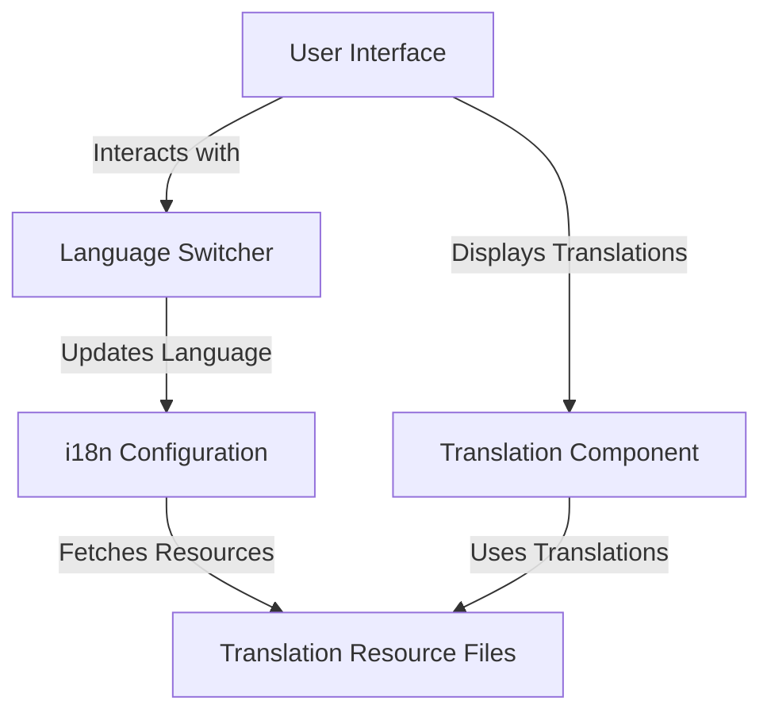

# Internationalization (i18n) — React

## Overview and scope

The purpose of this document is to establish standards for implementing internationalization (i18n) in React applications at Xentic. This standard aims to ensure a consistent and efficient approach to supporting multiple languages and locales across our front-end applications, enhancing user experience for diverse audiences.

### Audience
This document is intended for:
- Front-end developers working on React applications.
- Quality assurance teams responsible for testing internationalized applications.
- Product managers and designers involved in the localization process.

### Scope
This standard applies to all React applications developed within Xentic. It covers:
- The use of i18n libraries and frameworks.
- Best practices for managing translations.
- Configuration of language resources.
- Testing strategies for internationalized applications.

### Non-goals
This document does NOT cover:
- Back-end internationalization practices.
- Localization of images, videos, or other media types.
- Detailed guidelines on cultural nuances or specific translation practices.

### Glossary
| Term           | Definition                                                                 |
|----------------|-----------------------------------------------------------------------------|
| i18n           | Abbreviation for "internationalization," the process of designing applications to support multiple languages. |
| Locale         | A set of parameters that defines the user's language, region, and any special variant preferences. |
| Translation    | The process of converting text from one language to another.                |
| Resource file  | A file that contains key-value pairs for translations in a specific language. |

### How This Standard Fits the Xentic Platform
Implementing these standards will ensure that all React applications at Xentic provide a seamless experience for users across different languages and regions. By adhering to these guidelines, we will:
- Foster consistency in user interfaces.
- Simplify the process of adding new languages.
- Enhance maintainability and scalability of our applications.

### Example Configuration
To illustrate the implementation of i18n in a React application, consider the following configuration for the `i18next` library using YAML format:

```yaml
i18n:
  defaultLanguage: en
  supportedLanguages:
    - en
    - es
    - fr
  resources:
    en:
      translation:
        welcome: "Welcome"
        goodbye: "Goodbye"
    es:
      translation:
        welcome: "Bienvenido"
        goodbye: "Adiós"
    fr:
      translation:
        welcome: "Bienvenue"
        goodbye: "Au revoir"
```

### Example Code
Here is a basic example of how to set up i18n in a React component:

```javascript
import React from 'react';
import { useTranslation } from 'react-i18next';

const Greeting = () => {
  const { t } = useTranslation();

  return (
    <div>
      <h1>{t('welcome')}</h1>
      <p>{t('goodbye')}</p>
    </div>
  );
};

export default Greeting;
```

By following these guidelines, Xentic will ensure that our React applications are well-prepared for international audiences, fostering a more inclusive and accessible user experience.

## Standards and policies

1. **MUST** use the `react-i18next` library for internationalization in all React applications at Xentic. This library provides a robust and flexible framework for managing translations and locales.

2. **MUST NOT** hard-code any strings in the application. All user-facing text MUST be stored in resource files to facilitate easy translation and updates.

3. **MUST** organize translation files in a structured manner within the `src/locales` directory of the React application. The directory structure should be as follows:

   ```
   src/
   └── locales/
       ├── en/
       │   └── translation.json
       ├── es/
       │   └── translation.json
       └── fr/
           └── translation.json
   ```

4. **SHOULD** follow the naming convention for resource files, using lowercase language codes (e.g., `translation.json`) to maintain consistency across the application.

5. **MUST** include a fallback language in the i18n configuration to ensure that if a translation is missing, the application defaults to a specified language (e.g., English).

   Example configuration in YAML format:
   ```yaml
   i18n:
     defaultLanguage: en
     fallbackLanguage: en
     supportedLanguages:
       - en
       - es
       - fr
   ```

6. **MUST** utilize keys in the translation files that are descriptive and contextually relevant. Avoid using generic keys like `key1`, `key2`, etc. Instead, use meaningful identifiers such as `welcome_message` or `logout_button`.

7. **SHOULD** implement language switcher functionality in the application, allowing users to change languages dynamically. This can be achieved using a dropdown component that updates the i18n language setting.

   Example code for a language switcher:
   ```javascript
   import React from 'react';
   import { useTranslation } from 'react-i18next';

   const LanguageSwitcher = () => {
     const { i18n } = useTranslation();

     const changeLanguage = (lng) => {
       i18n.changeLanguage(lng);
     };

     return (
       <div>
         <button onClick={() => changeLanguage('en')}>English</button>
         <button onClick={() => changeLanguage('es')}>Español</button>
         <button onClick={() => changeLanguage('fr')}>Français</button>
       </div>
     );
   };

   export default LanguageSwitcher;
   ```

8. **MUST NOT** use inline styles or CSS that depend on specific language text. Ensure that UI elements are flexible enough to accommodate varying text lengths in different languages.

9. **SHOULD** conduct regular audits of translation files to ensure that all keys are up-to-date and that translations are accurate. This can be facilitated by using tools like `i18next-parser`.

10. **MUST** provide clear documentation for translators, including context for each key and any relevant cultural nuances that may affect translation. This documentation should be accessible via internal URLs, such as [https://docs.internal.xentic.io/i18n-guidelines](https://docs.internal.xentic.io/i18n-guidelines).

11. **MUST** ensure that all internationalized applications are thoroughly tested for language support during the QA process. This includes verifying that all translations render correctly and that the application behaves as expected in different languages.

12. **SHOULD** leverage automated testing tools to validate that all translation keys are utilized in the application. This can help identify any missing translations before deployment.

By adhering to these standards and policies, Xentic will maintain a high-quality internationalization process in our React applications, ensuring a seamless experience for users across various languages and cultures.

## Architecture and design

The architecture for internationalization (i18n) in React applications at Xentic is designed to ensure a seamless integration of language support throughout the application lifecycle. The following sections describe the component diagram, data flows, integration points, and failure domains.

### Component Diagram



### Data Flows

1. **User Interaction**: 
   - Users interact with the Language Switcher to select their preferred language.
   - The Language Switcher triggers a change in the i18n configuration.

2. **Language Change**:
   - When a language is changed, the Language Switcher updates the i18n instance, which then fetches the corresponding translation resources from the resource files.

3. **Translation Rendering**:
   - The Translation Component retrieves the translations based on the current language setting and displays the appropriate text in the User Interface.

### Integration Points

- **i18next Library**: The core library used for managing translations and language switching.
- **Translation Resource Files**: JSON files stored in the `src/locales` directory that contain key-value pairs for translations.
- **Language Switcher Component**: A dedicated component that allows users to change the application language dynamically.

### Failure Domains

- **Missing Translations**: If a translation key is not found in the resource files, the application must fall back to the default language. This behavior is defined in the i18n configuration.
  
- **Resource File Loading**: If the translation resource files fail to load (e.g., due to a network issue), the application should handle this gracefully by displaying a default message or a loading indicator.

- **Language Switcher Failures**: If the Language Switcher fails to update the language, the application should retain the current language setting and provide user feedback (e.g., an error message).

### Example Configuration for i18n

To illustrate the configuration of i18n, consider the following YAML example that includes fallback settings and resource loading:

```yaml
i18n:
  defaultLanguage: en
  fallbackLanguage: en
  supportedLanguages:
    - en
    - es
    - fr
  resources:
    en:
      translation:
        welcome: "Welcome"
        goodbye: "Goodbye"
    es:
      translation:
        welcome: "Bienvenido"
        goodbye: "Adiós"
    fr:
      translation:
        welcome: "Bienvenue"
        goodbye: "Au revoir"
```

### Example Code for Translation Component

Here is an example of how to implement a Translation Component that utilizes the i18n setup:

```javascript
import React from 'react';
import { useTranslation } from 'react-i18next';

const TranslationComponent = () => {
  const { t } = useTranslation();

  return (
    <div>
      <h1>{t('welcome')}</h1>
      <p>{t('goodbye')}</p>
    </div>
  );
};

export default TranslationComponent;
```

By following this architecture and design, Xentic ensures a robust framework for internationalization in React applications, enabling effective language support and enhancing the user experience across diverse locales.

## Configuration reference

### application.yml

The following configuration options MUST be included in the `application.yml` file for internationalization (i18n) in React applications at Xentic.

```yaml
i18n:
  defaultLanguage: en
  fallbackLanguage: en
  supportedLanguages:
    - en
    - es
    - fr
  resources:
    en:
      translation:
        welcome: "Welcome"
        goodbye: "Goodbye"
    es:
      translation:
        welcome: "Bienvenido"
        goodbye: "Adiós"
    fr:
      translation:
        welcome: "Bienvenue"
        goodbye: "Au revoir"
```

### Terraform Configuration

When deploying applications that require i18n support, the following Terraform variables should be defined to ensure proper configuration in different environments.

| Variable                 | Description                            | Default Value | Production Value |
|--------------------------|----------------------------------------|---------------|------------------|
| `i18n_default_language`  | Default language for the application   | `en`          | `en`             |
| `i18n_fallback_language` | Fallback language if translation is missing | `en`          | `en`             |
| `i18n_supported_languages` | List of supported languages          | `["en", "es", "fr"]` | `["en", "es", "fr"]` |

Example Terraform configuration:

```hcl
variable "i18n_default_language" {
  description = "Default language for the application"
  default     = "en"
}

variable "i18n_fallback_language" {
  description = "Fallback language if translation is missing"
  default     = "en"
}

variable "i18n_supported_languages" {
  description = "List of supported languages"
  default     = ["en", "es", "fr"]
}
```

### Environment Variables

For runtime configuration, the following environment variables MUST be set to control i18n behavior across different environments:

| Environment Variable          | Description                                   | Default Value | Production Value |
|-------------------------------|-----------------------------------------------|---------------|------------------|
| `I18N_DEFAULT_LANGUAGE`       | Default language for the application          | `en`          | `en`             |
| `I18N_FALLBACK_LANGUAGE`      | Fallback language if translation is missing   | `en`          | `en`             |
| `I18N_SUPPORTED_LANGUAGES`    | Comma-separated list of supported languages   | `en,es,fr`    | `en,es,fr`       |

Example of setting environment variables in a `.env` file:

```dotenv
I18N_DEFAULT_LANGUAGE=en
I18N_FALLBACK_LANGUAGE=en
I18N_SUPPORTED_LANGUAGES=en,es,fr
```

### Summary

By adhering to the above configuration references, Xentic ensures that all React applications are properly set up for internationalization, enabling a seamless experience for users across multiple languages. It is essential to maintain consistency in configuration values across different environments to avoid discrepancies during deployment.

## Implementation guide

To implement internationalization (i18n) in React applications at Xentic, follow these step-by-step instructions. This guide includes the necessary setup, code examples, and best practices to ensure a robust i18n implementation.

### Step 1: Install Required Packages

First, you MUST install the necessary libraries for i18n. Use npm or yarn to add `i18next` and `react-i18next` to your project.

```bash
npm install i18next react-i18next
```

### Step 2: Create Translation Resource Files

Create a directory named `locales` in your `src` folder. Inside this directory, create JSON files for each supported language. For example:

- `src/locales/en/translation.json`
- `src/locales/es/translation.json`
- `src/locales/fr/translation.json`

**Example of `src/locales/en/translation.json`:**

```json
{
  "welcome": "Welcome",
  "goodbye": "Goodbye"
}
```

**Example of `src/locales/es/translation.json`:**

```json
{
  "welcome": "Bienvenido",
  "goodbye": "Adiós"
}
```

**Example of `src/locales/fr/translation.json`:**

```json
{
  "welcome": "Bienvenue",
  "goodbye": "Au revoir"
}
```

### Step 3: Configure i18next

Create a configuration file for i18next in your `src` directory, e.g., `i18n.js`. This file will initialize i18next with the necessary settings.

```javascript
import i18n from 'i18next';
import { initReactI18next } from 'react-i18next';
import translationEN from './locales/en/translation.json';
import translationES from './locales/es/translation.json';
import translationFR from './locales/fr/translation.json';

const resources = {
  en: { translation: translationEN },
  es: { translation: translationES },
  fr: { translation: translationFR },
};

i18n
  .use(initReactI18next)
  .init({
    resources,
    lng: 'en', // default language
    fallbackLng: 'en', // fallback language
    interpolation: {
      escapeValue: false, // React already escapes values
    },
  });

export default i18n;
```

### Step 4: Initialize i18next in Your Application

In your main application file (e.g., `index.js` or `App.js`), import the i18n configuration to ensure it is initialized when the application starts.

```javascript
import React from 'react';
import ReactDOM from 'react-dom';
import App from './App';
import './i18n'; // Import i18n configuration

ReactDOM.render(<App />, document.getElementById('root'));
```

### Step 5: Create a Language Switcher Component

The Language Switcher component allows users to change the language dynamically. Here is an example implementation:

```javascript
import React from 'react';
import { useTranslation } from 'react-i18next';

const LanguageSwitcher = () => {
  const { i18n } = useTranslation();

  const changeLanguage = (lng) => {
    i18n.changeLanguage(lng);
  };

  return (
    <div>
      <button onClick={() => changeLanguage('en')}>English</button>
      <button onClick={() => changeLanguage('es')}>Español</button>
      <button onClick={() => changeLanguage('fr')}>Français</button>
    </div>
  );
};

export default LanguageSwitcher;
```

### Step 6: Create a Translation Component

Create a component that utilizes the translations defined in your resource files. Here’s an example:

```javascript
import React from 'react';
import { useTranslation } from 'react-i18next';

const TranslationComponent = () => {
  const { t } = useTranslation();

  return (
    <div>
      <h1>{t('welcome')}</h1>
      <p>{t('goodbye')}</p>
    </div>
  );
};

export default TranslationComponent;
```

### Step 7: Integrate Components in Your Application

Finally, integrate the Language Switcher and Translation Component into your main application component.

```javascript
import React from 'react';
import LanguageSwitcher from './LanguageSwitcher';
import TranslationComponent from './TranslationComponent';

const App = () => {
  return (
    <div>
      <LanguageSwitcher />
      <TranslationComponent />
    </div>
  );
};

export default App;
```

### Step 8: Testing and Validation

- **MUST** test the application in different languages to ensure that all translations render correctly.
- **SHOULD** use tools like `i18next-parser` to automate the extraction of translation keys from your codebase.
- **MUST NOT** forget to audit translation files regularly to keep them up-to-date.

### Conclusion

By following these steps, you will have a fully functional internationalization setup in your React application at Xentic. This implementation ensures that users can easily switch between languages, enhancing their experience across different locales.

## Security requirements

To ensure the security of internationalized React applications at Xentic, the following security requirements MUST be adhered to:

### Threat Model Summary
- **Data Exposure**: Sensitive data may be exposed through improper handling of translations or user inputs.
- **Injection Attacks**: Applications MUST be protected against XSS (Cross-Site Scripting) and other injection attacks through proper input validation and sanitization.
- **Authentication and Authorization**: Proper mechanisms MUST be in place to authenticate users and authorize access to resources based on their roles.

### Authentication and Authorization (Authn/Z)
- All API endpoints MUST require authentication using OAuth 2.0 or JWT (JSON Web Tokens).
- User roles and permissions MUST be defined and enforced at the API level to ensure that users can only access resources they are authorized to view.

**Example of JWT Authentication Middleware in Node.js:**

```javascript
const jwt = require('jsonwebtoken');

const authenticateJWT = (req, res, next) => {
  const token = req.header('Authorization').split(' ')[1];
  if (token) {
    jwt.verify(token, process.env.JWT_SECRET, (err, user) => {
      if (err) {
        return res.sendStatus(403);
      }
      req.user = user;
      next();
    });
  } else {
    res.sendStatus(401);
  }
};
```

### Secrets Management
- All sensitive information, such as API keys and database credentials, MUST be stored securely using environment variables or a secrets management tool like HashiCorp Vault.
- Secrets MUST NOT be hardcoded in the source code or configuration files.

**Example of using environment variables in a `.env` file:**

```dotenv
JWT_SECRET=your_jwt_secret
DATABASE_URL=your_database_url
```

### Input Validation
- All user inputs MUST be validated and sanitized to prevent injection attacks.
- Use libraries such as `validator` or `express-validator` to enforce input validation rules.

**Example of input validation using `express-validator`:**

```javascript
const { body, validationResult } = require('express-validator');

app.post('/api/login', 
  body('username').isLength({ min: 5 }),
  body('password').isLength({ min: 5 }),
  (req, res) => {
    const errors = validationResult(req);
    if (!errors.isEmpty()) {
      return res.status(400).json({ errors: errors.array() });
    }
    // Proceed with authentication
  }
);
```

### Audit Logging
- All authentication attempts, both successful and failed, MUST be logged for audit purposes.
- Sensitive actions, such as changes to user roles or permissions, MUST also be logged with relevant details.

**Example of a logging middleware in Node.js:**

```javascript
const logger = (req, res, next) => {
  const logEntry = {
    timestamp: new Date(),
    method: req.method,
    url: req.url,
    user: req.user ? req.user.username : 'guest',
  };
  console.log(JSON.stringify(logEntry));
  next();
};

app.use(logger);
```

### Summary of Security Measures
| Security Aspect            | Requirement                              |
|----------------------------|-----------------------------------------|
| Authentication             | MUST use OAuth 2.0 or JWT               |
| Secrets Management         | MUST NOT hardcode secrets                |
| Input Validation           | MUST validate and sanitize all inputs    |
| Audit Logging              | MUST log all authentication attempts      |

By following these security requirements, Xentic ensures that internationalized React applications are secure against common vulnerabilities, protecting both user data and application integrity.

## Testing strategy

To ensure the quality and reliability of the internationalization (i18n) implementation in React applications at Xentic, a comprehensive testing strategy MUST be employed. This includes unit tests, integration tests, and contract tests to cover various aspects of the application.

### 1. Unit Tests

Unit tests should focus on individual components and functions, ensuring that they behave as expected. For i18n, this includes testing translation functions and components that utilize translations.

**Coverage Target:** A minimum of 80% code coverage for all translation-related components.

**Example Unit Test for Translation Component:**

```javascript
import React from 'react';
import { render } from '@testing-library/react';
import { I18nextProvider } from 'react-i18next';
import i18n from './i18n';
import TranslationComponent from './TranslationComponent';

test('renders welcome message in English', () => {
  render(
    <I18nextProvider i18n={i18n}>
      <TranslationComponent />
    </I18nextProvider>
  );
  expect(screen.getByText('Welcome')).toBeInTheDocument();
});
```

### 2. Integration Tests

Integration tests should verify that components work together as expected, particularly when switching languages or rendering translations. This ensures that the i18n setup interacts correctly with the React components.

**Coverage Target:** A minimum of 75% code coverage for integration tests.

**Example Integration Test for Language Switcher:**

```javascript
import React from 'react';
import { render, fireEvent } from '@testing-library/react';
import { I18nextProvider } from 'react-i18next';
import i18n from './i18n';
import LanguageSwitcher from './LanguageSwitcher';
import TranslationComponent from './TranslationComponent';

test('changes language when button is clicked', () => {
  const { getByText } = render(
    <I18nextProvider i18n={i18n}>
      <LanguageSwitcher />
      <TranslationComponent />
    </I18nextProvider>
  );

  fireEvent.click(getByText('Español'));
  expect(getByText('Bienvenido')).toBeInTheDocument();
});
```

### 3. Contract Tests

Contract tests should ensure that the API endpoints delivering translations are functioning correctly and that the expected translation keys are available. This is particularly important for maintaining consistency across services.

**Coverage Target:** All endpoints serving translations MUST have corresponding contract tests.

**Example Contract Test for Translation API:**

```javascript
const request = require('supertest');
const app = require('./app'); // Your Express app

describe('GET /api/translations/:lang', () => {
  it('should return translations for the specified language', async () => {
    const response = await request(app).get('/api/translations/en');
    expect(response.statusCode).toBe(200);
    expect(response.body).toHaveProperty('welcome');
    expect(response.body).toHaveProperty('goodbye');
  });
});
```

### 4. Test Coverage Reporting

To ensure that the testing strategy is effective, coverage reports MUST be generated and reviewed regularly. Tools like Jest or Istanbul can be used to generate coverage reports.

**Example Jest Configuration for Coverage Reporting:**

```json
{
  "collectCoverage": true,
  "collectCoverageFrom": [
    "src/**/*.{js,jsx}",
    "!src/index.js",
    "!src/i18n.js"
  ],
  "coverageThreshold": {
    "global": {
      "branches": 80,
      "functions": 80,
      "lines": 80,
      "statements": 80
    }
  }
}
```

### Summary of Testing Strategy

| Test Type         | Purpose                                            | Coverage Target |
|-------------------|----------------------------------------------------|------------------|
| Unit Tests        | Test individual components and functions            | 80%               |
| Integration Tests | Verify components work together                     | 75%               |
| Contract Tests    | Ensure API endpoints deliver expected translations  | 100%              |

By adhering to this testing strategy, Xentic ensures that the i18n implementation in React applications is robust, reliable, and maintainable, providing a seamless experience for users across different languages.

## Observability and operations

To maintain high availability and performance of internationalized React applications at Xentic, a robust observability and operations strategy MUST be implemented. This includes metrics, logs, traces, dashboards, alerts, and SLOs, along with on-call runbook steps for incident management.

### Metrics

Metrics MUST be collected to monitor application performance and user interactions. Key metrics include:

- **Response Times**: Measure the time taken for API calls related to translations.
- **Error Rates**: Track the percentage of failed translation requests.
- **User Engagement**: Monitor how frequently users switch languages.

**Example of Metrics Configuration (Prometheus):**

```yaml
metrics:
  enabled: true
  service: i18n-service
  endpoint: /metrics
```

### Logs

All application logs MUST be structured and include relevant details for troubleshooting. Logs should capture:

- User actions (e.g., language switches)
- API request and response details
- Errors and exceptions

**Example of Logging Configuration (Winston):**

```javascript
const { createLogger, format, transports } = require('winston');

const logger = createLogger({
  level: 'info',
  format: format.json(),
  transports: [
    new transports.Console(),
    new transports.File({ filename: 'combined.log' }),
  ],
});

module.exports = logger;
```

### Traces

Distributed tracing MUST be implemented to track requests across services. This is crucial for identifying bottlenecks in the translation process.

**Example of Tracing Configuration (OpenTelemetry):**

```javascript
const { NodeTracerProvider } = require('@opentelemetry/node');
const { registerInstrumentations } = require('@opentelemetry/instrumentation');

const provider = new NodeTracerProvider();
provider.register();

registerInstrumentations({
  tracerProvider: provider,
  instrumentations: [
    // Add instrumentation for HTTP requests, etc.
  ],
});
```

### Dashboards

Dashboards MUST be created to visualize key metrics and logs. Tools like Grafana or Kibana can be used to create dashboards that display:

- API response times
- Error rates over time
- User engagement metrics

**Example of Grafana Dashboard Configuration:**

```json
{
  "title": "i18n Metrics",
  "panels": [
    {
      "type": "graph",
      "title": "API Response Times",
      "targets": [
        {
          "target": "avg(response_time)",
          "refId": "A"
        }
      ]
    },
    {
      "type": "graph",
      "title": "Error Rates",
      "targets": [
        {
          "target": "sum(rate(errors[5m]))",
          "refId": "B"
        }
      ]
    }
  ]
}
```

### Alerts

Alerts MUST be configured to notify the on-call team of critical issues, such as:

- High error rates (e.g., > 5% of requests failing)
- Increased response times (e.g., > 500ms for 95th percentile)
- Unusual drops in user engagement

**Example of Alert Configuration (Prometheus Alertmanager):**

```yaml
groups:
  - name: i18n-alerts
    rules:
      - alert: HighErrorRate
        expr: sum(rate(errors[5m])) / sum(rate(requests[5m])) > 0.05
        for: 5m
        labels:
          severity: critical
        annotations:
          summary: "High error rate detected"
          description: "Error rate is above 5% for the last 5 minutes."
```

### SLOs

Service Level Objectives (SLOs) MUST be defined to measure the reliability of the internationalization service. Suggested SLOs include:

| Metric                     | SLO               |
|----------------------------|-------------------|
| API Response Time          | 95th percentile < 500ms |
| Error Rate                 | < 5%              |
| Uptime                     | 99.9%             |

### On-call Runbook Steps

In case of incidents, the following runbook steps MUST be followed:

1. **Identify the Incident**: Check alerts and logs to confirm the issue.
2. **Assess Impact**: Determine the scope of affected users and services.
3. **Mitigate**: If possible, roll back recent changes or apply a hotfix.
4. **Communicate**: Notify stakeholders and affected users about the incident.
5. **Resolve**: Fix the underlying issue and deploy the solution.
6. **Postmortem**: Conduct a postmortem analysis to identify root causes and prevent future occurrences.

By implementing these observability and operations strategies, Xentic ensures that internationalized React applications are monitored effectively, allowing for quick identification and resolution of issues, thereby maintaining a high-quality user experience.

## Migration and versioning

When upgrading the internationalization (i18n) implementation in React applications at Xentic, a clear migration and versioning strategy MUST be established to ensure smooth transitions and backward compatibility. This section outlines the upgrade paths, deprecation policies, backward compatibility measures, and rollback procedures.

### Upgrade Paths

1. **Semantic Versioning**: All i18n libraries MUST follow semantic versioning (MAJOR.MINOR.PATCH). Breaking changes MUST increment the MAJOR version, new features that are backward compatible MUST increment the MINOR version, and bug fixes MUST increment the PATCH version.
   
2. **Upgrade Process**:
   - Review release notes for breaking changes.
   - Update dependencies in `package.json`:
     ```json
     {
       "dependencies": {
         "react-i18next": "^11.0.0" // Example version
       }
     }
     ```
   - Run `npm install` or `yarn install` to apply updates.

3. **Testing**: After upgrading, all tests MUST be run to ensure functionality remains intact.

### Deprecation Policy

1. **Deprecation Notices**: Deprecated features MUST be clearly documented in the release notes and marked in the codebase with comments. For example:
   ```javascript
   // Deprecated: use newTranslationFunction instead
   function oldTranslationFunction() {
     // ...
   }
   ```

2. **Grace Period**: Deprecated features MUST remain available for at least one full version cycle (i.e., until the next MAJOR version) to allow teams time to adapt.

3. **Removal Timeline**: Features marked as deprecated MUST be removed in the next MAJOR version release.

### Backward Compatibility

1. **Support for Legacy Code**: New versions MUST ensure backward compatibility with existing codebases. This includes maintaining existing APIs and translation keys.

2. **Feature Flags**: Introduce feature flags to allow gradual rollout of new features without breaking existing implementations. Example configuration in YAML:
   ```yaml
   featureFlags:
     newTranslationFeature: false
   ```

3. **Documentation**: All changes MUST be documented clearly in the internal documentation at [https://docs.internal.xentic.io/i18n/migration](https://docs.internal.xentic.io/i18n/migration).

### Rollback Procedures

1. **Version Control**: All changes MUST be version-controlled using Git. In case of issues, teams MUST revert to the last stable commit.
   ```bash
   git checkout <last-stable-commit>
   ```

2. **Rollback Dependencies**: If an upgrade causes issues, dependencies MUST be rolled back to the previous version in `package.json`:
   ```json
   {
     "dependencies": {
       "react-i18next": "^10.0.0" // Rollback to previous version
     }
   }
   ```

3. **Testing After Rollback**: After rolling back, all tests MUST be re-executed to ensure that the application is functioning as expected.

### Summary Table

| Action                | Description                                     | Frequency               |
|-----------------------|-------------------------------------------------|-------------------------|
| Upgrade Dependencies   | Update libraries according to semantic versioning | As needed               |
| Deprecation Notices    | Document deprecated features                     | With each release       |
| Backward Compatibility  | Ensure new versions do not break existing code  | Ongoing                 |
| Rollback Procedures     | Steps to revert to previous stable versions      | As needed               |

By adhering to these migration and versioning guidelines, Xentic ensures that the internationalization implementation in React applications remains stable, maintainable, and user-friendly across different versions.

## FAQ, anti-patterns, and checklists

### FAQ

1. **What is internationalization (i18n)?**
   - Internationalization is the process of designing an application so that it can be adapted to various languages and regions without requiring engineering changes.

2. **How do I add a new language to my React application?**
   - You MUST update your translation files, add the new language code to your i18n configuration, and ensure that the language switcher is updated to include the new option.

3. **What libraries should I use for i18n in React?**
   - Xentic recommends using `react-i18next` for its robust features and community support.

4. **How do I handle pluralization in translations?**
   - Use the `t` function with pluralization options provided by `react-i18next`. Example:
     ```javascript
     t('key', { count: itemCount });
     ```

5. **Can I use dynamic keys in translations?**
   - Yes, you can use dynamic keys, but you MUST ensure that the keys are defined in your translation files to avoid runtime errors.

6. **What should I do if a translation is missing?**
   - You MUST log a warning and provide a fallback option. Ensure that all required keys are present in your translation files.

7. **How do I test translations in different languages?**
   - You SHOULD create test cases that switch the language context and assert that the correct translations are rendered.

8. **Is there a performance impact when using i18n?**
   - Yes, there can be a performance impact due to the loading of translation files. You MUST optimize loading strategies, such as code-splitting or lazy loading.

9. **How do I manage translation files?**
   - Translation files MUST be organized by language and feature, and you SHOULD use a consistent naming convention (e.g., `en.json`, `fr.json`).

10. **What is the recommended way to handle date and number formatting?**
    - Use libraries like `date-fns` or `Intl.NumberFormat` to format dates and numbers according to the user's locale.

### Anti-patterns

| Anti-pattern                      | Description                                                                 |
|-----------------------------------|-----------------------------------------------------------------------------|
| Hardcoding Strings                | Avoid hardcoding strings directly in components; use translation keys instead. |
| Ignoring Context                  | Failing to consider context when translating can lead to incorrect translations. |
| Not Using Fallbacks               | Not providing fallback translations can lead to a poor user experience.    |
| Overloading Translation Files      | Storing too many keys in a single file can make maintenance difficult.     |
| Not Testing Translations           | Skipping tests for translations can result in broken UI for different languages. |
| Failing to Update Keys             | Not updating translation keys when changing UI elements can cause mismatches. |

### Pre-merge Checklist

- [ ] All translation keys are present in the translation files.
- [ ] Language switcher functionality is tested.
- [ ] Dynamic keys are validated and handled properly.
- [ ] Pluralization is correctly implemented where necessary.
- [ ] Performance metrics are reviewed and optimized.
- [ ] Documentation is updated to reflect changes in translations.

### Production Checklist

- [ ] All translations are verified in staging for different languages.
- [ ] Fallback translations are implemented for missing keys.
- [ ] User engagement metrics are monitored post-deployment.
- [ ] Alerts for translation errors are configured and tested.
- [ ] Documentation is published and accessible at [https://docs.internal.xentic.io/i18n/faq](https://docs.internal.xentic.io/i18n/faq).
